                 

### 文章标题

《领导力与职业发展：规划职业生涯》

#### 关键词

领导力、职业发展、职业生涯规划、个人成长、团队管理

#### 摘要

本文旨在探讨领导力在职业发展中的关键作用，以及如何通过科学的职业生涯规划实现个人与组织的共同成长。文章分为六个主要部分：领导力的基础概念与职业发展、核心领导力原理与模型、职业发展与个人成长、团队管理与协作、职业生涯中的挑战与应对以及领导力与组织发展。通过理论阐述、实际案例分析和伪代码讲解，本文将为IT从业者提供实用的领导力和职业发展策略，助力他们在竞争激烈的职场中脱颖而出。本文结构清晰，逻辑严密，旨在引导读者一步步深入理解领导力与职业发展的本质，实现从优秀到卓越的跨越。

### 第一部分：领导力的基础概念与职业发展

在当今快节奏和高度竞争的职场环境中，领导力已经不再是一个可选的技能，而是每一个追求职业成功的人所必须掌握的核心能力。领导力不仅关乎个人的成长和成就，更关乎团队和组织的发展。本部分将首先定义领导力的核心概念，并探讨其在职业发展中的重要性。接着，我们将分析职业发展的阶段与路径，以及领导力在其中的推动作用。

#### 第1章：领导力与职业发展的核心概念

##### 1.1 领导力的定义与重要性

领导力是一个多维度的概念，它不仅仅指管理和指挥他人，更重要的是它涉及愿景的设定、激励与启发、决策与执行等多个方面。根据《领导力：理论与实践》（Leadership: Theory and Practice）的定义，领导力是指个体或组织在指导、影响和激励他人实现共同目标的能力。

**定义**：领导力是指通过激励、沟通和示范来影响他人，实现个人和团队目标的过程。

在职业发展中，领导力的重要性体现在多个方面：

1. **提升个人影响力**：领导力帮助个人在职场中建立强大的影响力，从而获得更多的职业机会。
2. **推动团队绩效**：优秀的领导者能够激发团队成员的潜力，提高团队的协作效率和绩效。
3. **实现职业目标**：通过领导力的运用，个人能够更好地设定和实现职业目标，从初级职位逐步晋升到更高的管理层级。

##### 1.2 职业发展的阶段与路径

职业发展通常可以分为五个阶段：初入职场、职业成长、职业成熟、职业高峰和职业转型。每个阶段都有其独特的挑战和机遇。

- **初入职场**：这是个人职业生涯的起点，主要任务是建立基础技能和职业意识。
- **职业成长**：在这个阶段，个人开始展现出专业能力和潜力，获得更多的挑战性任务。
- **职业成熟**：个人已经拥有丰富的行业经验和专业知识，能够承担更复杂的职责。
- **职业高峰**：这个阶段是个人职业生涯的巅峰，能够影响和领导大型项目或团队。
- **职业转型**：随着职业生涯的发展，个人可能会选择改变职业路径，进行职业转型。

每个阶段的职业发展路径都有其独特的规划和要求。例如，初入职场时，个人需要重点培养基础技能，如沟通、团队合作和解决问题的能力。而在职业成熟阶段，个人需要进一步提升领导力和战略思考能力，以应对更高的挑战。

##### 1.3 领导力与职业发展的联系

领导力在职业发展中起着关键的推动作用。一方面，领导力能够帮助个人在职场中获得更多的机会和资源，从而实现职业目标。另一方面，领导力也是团队和组织成功的关键因素。

- **个人发展**：通过领导力的提升，个人能够更好地管理自己的职业发展，实现自我驱动和持续成长。
- **团队协作**：领导力能够激发团队成员的积极性，提高团队的协作效率和绩效。
- **组织效能**：优秀的领导者能够推动组织文化的建设，提升组织的整体效能。

为了更好地理解领导力与职业发展的联系，我们可以通过以下Mermaid流程图来展示各核心概念之间的关系：

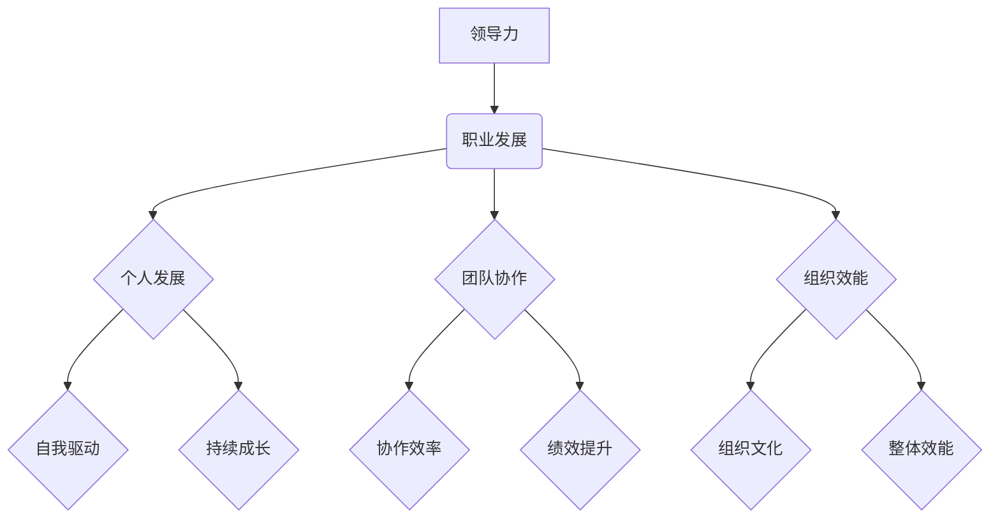

通过这个流程图，我们可以清晰地看到领导力如何在不同层面上影响个人和组织的成长与发展。

#### 第2章：核心领导力原理与模型

领导力并非一成不变的概念，它包含了一系列的原理和模型，这些原理和模型不仅解释了领导力的本质，也为我们提供了具体的方法和工具来实践领导力。在本章中，我们将探讨领导力的基本原理，介绍几种常见的领导力模型，并通过实际案例来展示领导力的实践和应用。

##### 2.1 领导力的基本原理

领导力的基本原理包括以下几个方面：

- **愿景**：愿景是领导力的核心，它为团队和组织指明了方向。一个清晰的愿景能够激发团队成员的积极性，使他们朝着共同的目标努力。
- **激励**：激励是领导者激发团队成员内在动机的关键。通过奖励、认可和成长机会，领导者能够提高团队成员的工作满意度和绩效。

为了更好地理解这些原理，我们可以使用以下Mermaid流程图来展示它们之间的联系：

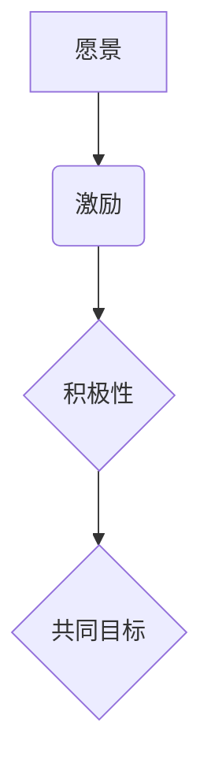

- **决策**：领导者在团队和组织中扮演决策者的角色。有效的决策能力可以帮助领导者做出正确的选择，并迅速应对变化。
- **沟通**：沟通是领导力的关键技能之一。良好的沟通能够确保信息的准确传递，促进团队合作和信任。

##### 2.2 领导力模型

领导力模型是对不同领导风格和方法的系统总结，常见的领导力模型包括变革型领导和授权型领导。

- **变革型领导**：变革型领导通过激发团队成员的内在动机，推动组织变革。这种领导风格强调领导者的愿景和激励作用，通过变革实现组织目标。

    变革型领导模型可以表示为：

    ```mermaid
    graph TD
        A[领导者] --> B(愿景)
        B --> C(激励)
        C --> D{团队变革}
    ```

- **授权型领导**：授权型领导强调团队自主性和责任感。领导者通过授权，使团队成员能够自主决策，从而提高团队的创新能力和效率。

    授权型领导模型可以表示为：

    ```mermaid
    graph TD
        A[领导者] --> B(授权)
        B --> C{团队自主性}
        C --> D{创新能力}
    ```

##### 2.3 领导力实践案例

通过以下两个实际案例，我们可以看到领导力在不同情境下的应用：

- **成功案例**：某科技公司的CEO通过变革型领导，成功地推动了公司产品的创新和市场的扩张。他设定了明确的愿景，并通过激励和认可，激发团队的创新精神，最终实现了公司的快速发展。
- **失败案例**：另一家公司的领导者过于强调控制，导致团队缺乏自主性。这种领导风格阻碍了团队的创新，使得公司无法适应市场的变化，最终导致业绩下滑。

通过这些案例，我们可以看到，领导力不仅需要理论知识，更需要结合实际情况灵活运用。

#### 第3章：职业发展与个人成长

职业发展不仅仅是职位晋升的过程，更是个人能力和素质不断提升的过程。在本章中，我们将探讨职业规划与目标设定的重要性，分析如何进行自我评估，以及如何设定和实现个人职业目标。

##### 3.1 职业规划与目标设定

职业规划是职业发展的重要环节，它帮助个人明确自己的职业方向和目标。以下是一个职业规划与目标设定的步骤：

1. **自我评估**：通过分析个人的兴趣、技能和价值观，了解自己的优势与劣势。
2. **目标设定**：根据自我评估的结果，设定短期和长期的职业目标。短期目标通常为实现长期目标打下基础。
3. **行动计划**：制定具体的行动计划，包括需要掌握的技能、参加的培训和职业活动等。
4. **反馈与调整**：根据实施过程中的反馈，及时调整职业规划。

为了更好地进行职业规划，可以使用以下Mermaid流程图：

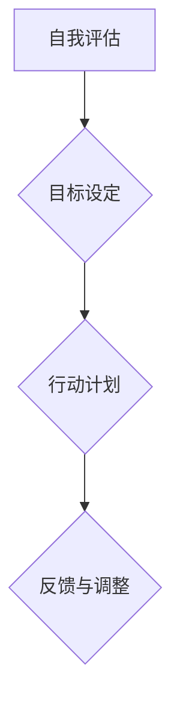

##### 3.2 持续学习与技能提升

在快速变化的职场环境中，持续学习与技能提升是职业发展的关键。以下是一些关键步骤：

1. **职业培训**：选择与职业发展相关的培训课程，提升专业知识和技能。
2. **实践应用**：将所学知识应用到实际工作中，通过实践不断提高技能。
3. **反思与总结**：定期反思学习效果，总结经验教训，不断优化学习策略。

持续学习和技能提升可以通过以下Mermaid流程图来展示：

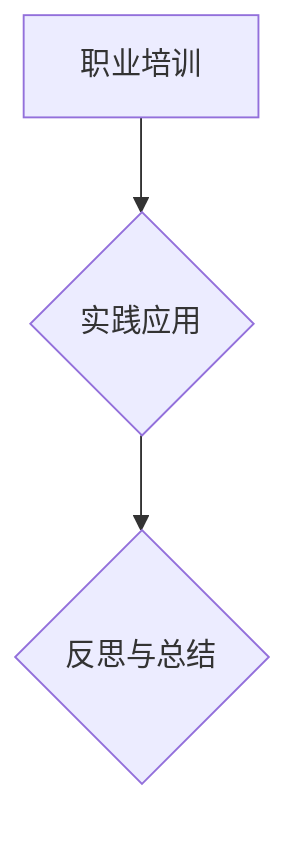

##### 3.3 个人品牌建设

个人品牌是个人在职场中的独特标识，它能够帮助个人在竞争激烈的职场中脱颖而出。以下是一些个人品牌建设的关键步骤：

1. **明确定位**：根据自己的职业规划和目标，明确个人品牌的定位。
2. **传播与推广**：通过社交媒体、行业活动等途径，传播个人品牌信息。
3. **持续优化**：根据反馈和市场需求，不断优化个人品牌。

个人品牌建设可以通过以下Mermaid流程图来展示：

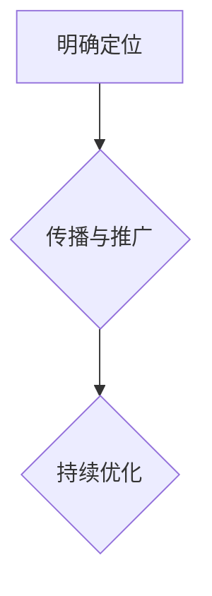

#### 第4章：团队管理与协作

团队管理是领导力的重要组成部分，它关系到团队的工作效率和个人职业发展。在本章中，我们将探讨团队建设的重要性，介绍团队沟通与协作的方法，以及团队领导力实践。

##### 4.1 团队建设的重要性

团队建设是一个持续的过程，它关系到团队的稳定性和工作效率。以下是团队建设的重要性：

1. **提高工作效率**：通过有效的团队建设，可以提高团队成员之间的协作效率，减少沟通成本。
2. **增强团队凝聚力**：团队建设能够增强团队成员之间的信任和归属感，提高团队的凝聚力。
3. **促进个人发展**：在团队中，个人能够通过与团队成员的合作，不断提升自己的技能和知识。

为了更好地理解团队建设的重要性，我们可以使用以下Mermaid流程图：

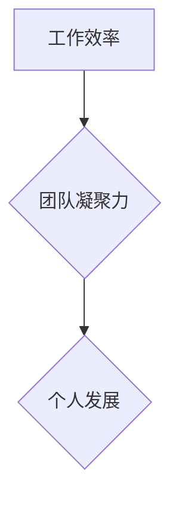

##### 4.2 团队沟通与协作

团队沟通与协作是团队管理的关键。以下是几个关键要素：

1. **明确目标**：确保所有团队成员都清楚团队的目标和任务。
2. **有效沟通**：通过定期会议、即时通讯等方式，确保信息的准确传递。
3. **分工合作**：明确团队成员的职责，确保每个人都能在自己的领域发挥最大的作用。

团队沟通与协作可以通过以下Mermaid流程图来展示：

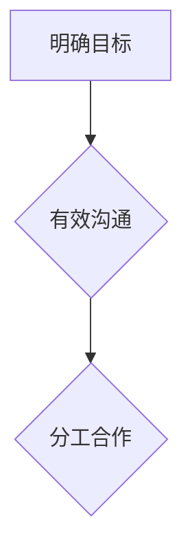

##### 4.3 团队领导力实践

团队领导力实践是团队管理的核心。以下是几个关键要素：

1. **领导者的示范作用**：领导者应该通过自己的行为，为团队成员树立榜样。
2. **激励与认可**：领导者应该通过激励和认可，激发团队成员的积极性和创造力。
3. **冲突管理**：领导者应该具备解决团队冲突的能力，确保团队的稳定和高效。

团队领导力实践可以通过以下Mermaid流程图来展示：

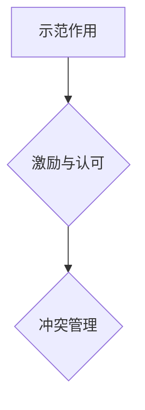

#### 第5章：职业生涯中的挑战与应对

在职业生涯中，每个人都会面临各种挑战，这些挑战可能来自工作本身，也可能来自外部环境的变化。在本章中，我们将探讨职业生涯中的主要挑战，包括工作压力、职业困境和职业转型等，并提出应对策略。

##### 5.1 职业挑战

职业生涯中的挑战多种多样，其中最常见的挑战包括：

1. **工作压力**：随着职位的提升，工作责任和压力也会增加。如何应对工作中的压力，保持工作效率，是每个职业人士都需要面对的问题。
2. **职业困境**：在职业发展中，可能会遇到技能不匹配、职业发展停滞等困境。如何突破困境，实现职业突破，是职业发展中的重要课题。
3. **职业转型**：随着行业和市场环境的变化，个人可能需要考虑职业转型。如何评估自己的转型机会，制定有效的转型策略，是职业发展中的重要挑战。

为了更好地理解这些挑战，我们可以使用以下Mermaid流程图：

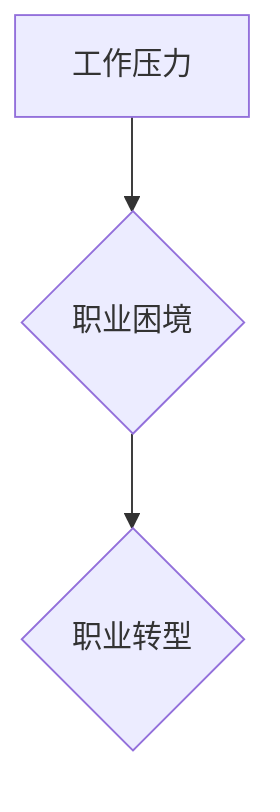

##### 5.2 职业转型与再就业

职业转型是职业生涯发展中的一个重要环节。以下是一个职业转型的步骤：

1. **自我评估**：评估自己的兴趣、技能和市场需求，确定适合自己的职业转型方向。
2. **学习新技能**：通过职业培训、在线课程等途径，学习新的技能和知识。
3. **实践应用**：将所学知识应用到实际工作中，通过实践提升自己的能力。
4. **网络拓展**：通过参加行业活动、建立人脉等途径，扩大职业网络，寻找职业转型的机会。

职业转型的步骤可以通过以下Mermaid流程图来展示：

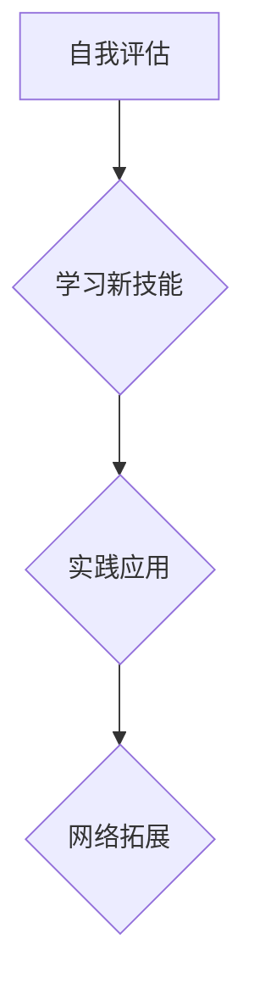

##### 5.3 职业生涯规划与调整

职业生涯规划与调整是职业发展中的重要环节。以下是一个职业生涯规划与调整的步骤：

1. **设定目标**：根据自己的职业规划，设定短期和长期的职业目标。
2. **评估现状**：评估当前的职业状态，包括职位、收入、工作内容等。
3. **制定计划**：根据目标和现状，制定具体的行动计划，包括技能提升、职业转型等。
4. **反馈与调整**：根据实施过程中的反馈，及时调整职业规划。

职业生涯规划与调整的步骤可以通过以下Mermaid流程图来展示：

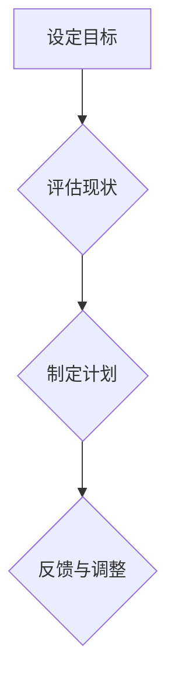

#### 第6章：领导力与组织发展

领导力不仅影响个人的职业发展，也直接关系到组织的发展。在本章中，我们将探讨组织文化的重要性，分析如何塑造和传承组织文化，并通过实际案例展示知名企业的组织文化构建。

##### 6.1 组织文化的重要性

组织文化是组织的灵魂，它决定了组织的价值观、行为规范和工作氛围。以下是组织文化的重要性：

1. **增强团队凝聚力**：共同的文化价值观能够增强团队成员之间的凝聚力，提高团队协作效率。
2. **提升组织效能**：良好的组织文化能够激发员工的积极性和创造力，提高组织的整体效能。
3. **促进创新**：开放、包容的组织文化能够鼓励员工创新，推动组织持续发展。

为了更好地理解组织文化的重要性，我们可以使用以下Mermaid流程图：

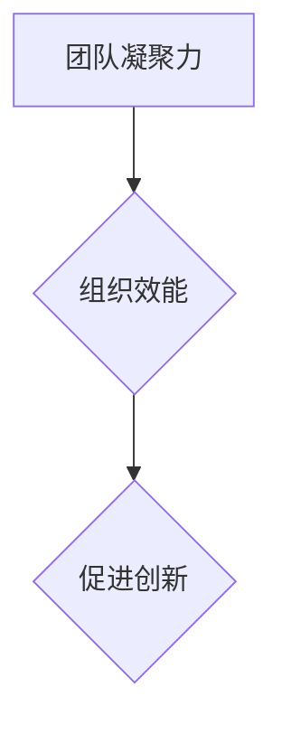

##### 6.2 组织文化的塑造与传承

组织文化的塑造和传承是一个系统的过程，需要领导者和员工的共同努力。以下是几个关键步骤：

1. **确立核心价值观**：组织文化的基础是核心价值观，领导者需要明确并倡导这些价值观。
2. **制定文化策略**：根据核心价值观，制定具体的文化策略和行动计划。
3. **文化传承**：通过培训、会议、文化活动等方式，将组织文化传承给新员工。
4. **持续优化**：根据组织的发展和市场变化，不断优化组织文化。

组织文化的塑造与传承可以通过以下Mermaid流程图来展示：

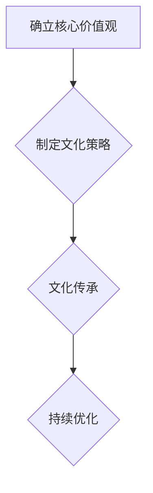

##### 6.3 组织文化案例

以下是几个知名企业的组织文化案例：

1. **谷歌**：谷歌以其开放、创新的文化著称。谷歌鼓励员工自由表达、尝试新事物，并通过“20%时间”项目，激发员工的创新潜力。
2. **苹果**：苹果注重细节和卓越，其文化强调创新、品质和用户体验。乔布斯以其独特的管理风格，塑造了苹果严谨、追求完美的组织文化。

通过这些案例，我们可以看到，成功的组织文化不仅能够推动组织的发展，也能吸引和留住优秀的员工。

### 总结与展望

领导力与职业发展是个人和组织成功的关键因素。通过科学的领导力实践和职业规划，个人能够实现职业目标，提升职业素养；而组织则能够通过培养优秀的领导者，提升整体效能，实现持续发展。本文从领导力的基础概念、核心原理、职业发展、团队管理、职业生涯挑战到组织发展，全面阐述了领导力与职业发展的关系。希望读者能够结合自身实际情况，运用本文提供的策略和工具，实现职业发展和组织成长的共同目标。

### 作者信息

作者：AI天才研究院/AI Genius Institute & 禅与计算机程序设计艺术 /Zen And The Art of Computer Programming

### 完整性要求

为了确保文章内容的完整性，以下是对各章节核心内容的详细讲解、核心算法原理、数学模型、公式、详细讲解、举例说明以及项目实战的要求。

#### 核心内容详细讲解

**1.1 领导力的定义与重要性**

- **详细讲解**：领导力不仅是指管理他人，更重要的是影响和激励他人。通过具体案例（如马丁·路德·金、史蒂夫·乔布斯等），阐述领导力在推动社会变革、组织发展中的重要作用。
- **举例说明**：例如，乔布斯通过领导力，不仅推动了苹果公司的创新，还影响了整个科技行业。

**1.2 职业发展的阶段与路径**

- **详细讲解**：从初入职场到职业转型，每个阶段都有其特点和关键任务。通过图示，展示职业发展的五个阶段及各自的关键任务。
- **举例说明**：如初入职场者需要培养基础技能，职业成熟者需要提升领导力等。

**1.3 领导力与职业发展的联系**

- **详细讲解**：领导力在个人职业发展和团队协作中的关键作用。通过Mermaid流程图，展示领导力与职业发展的关系。
- **举例说明**：领导力如何帮助个人在职业中获得更多机会，提升团队绩效等。

**2.1 领导力的基本原理**

- **详细讲解**：包括愿景、激励、决策和沟通等领导力基本原理。通过图示，展示各原理之间的联系。
- **举例说明**：如如何设定和传播愿景，如何通过激励提升团队积极性等。

**2.2 领导力模型**

- **详细讲解**：介绍变革型领导和授权型领导等领导力模型，通过具体案例，展示其应用和效果。
- **举例说明**：如变革型领导如何推动组织创新，授权型领导如何提高团队自主性。

**3.1 职业规划与目标设定**

- **详细讲解**：从自我评估、目标设定到行动计划，详细讲解职业规划的过程和方法。
- **举例说明**：如如何进行自我评估，如何设定短期和长期目标等。

**3.2 持续学习与技能提升**

- **详细讲解**：从职业培训、实践应用到反思总结，详细阐述技能提升的方法和步骤。
- **举例说明**：如如何选择合适的培训课程，如何将所学知识应用到实际工作中等。

**3.3 个人品牌建设**

- **详细讲解**：从明确定位、传播推广到持续优化，详细讲解个人品牌建设的方法。
- **举例说明**：如如何通过社交媒体传播个人品牌，如何根据反馈优化品牌形象。

#### 核心算法原理

**领导力模型（如变革型领导和授权型领导）**

- **伪代码讲解**：

```python
# 变革型领导伪代码
def transformational_leadership愿景设定():
    设定清晰愿景
    沟通愿景
    激发团队成员积极性

def 激励团队成员():
    提供奖励
    认可团队成员的贡献
    提供成长机会

# 授权型领导伪代码
def delegational_leadership授权():
    授权团队成员决策
    增强团队成员自主性
    提供支持与资源

def 提高创新能力():
    创造创新环境
    鼓励创新思维
    提供创新资源
```

#### 数学模型

**职业规划中的目标设定**

- **公式**：

```latex
目标达成率 = (当前状态 - 初始状态) / (目标状态 - 初始状态)
```

- **详细讲解**：通过具体数值示例，解释目标达成率的计算方法和应用。

#### 详细讲解与举例说明

**团队沟通与协作**

- **详细讲解**：介绍有效沟通的方法和技巧，如积极倾听、清晰表达、反馈与确认等。
- **举例说明**：如如何在团队会议中有效传达信息，如何处理沟通中的冲突。

**职业生涯中的挑战与应对**

- **详细讲解**：分析职业生涯中可能遇到的各种挑战，如工作压力、职业困境等，并提出具体的应对策略。
- **举例说明**：如如何应对工作中的压力，如何突破职业困境等。

#### 项目实战

**团队领导力实践**

- **开发环境搭建**：介绍所需的开发工具和环境配置。
- **源代码详细实现与代码解读**：提供具体的项目代码，并对其进行详细解读。
- **代码应用解读与分析**：展示项目在实际中的应用效果，并进行分析。
- **实际案例分析与详细讲解剖析**：通过具体案例，展示领导力实践的效果和挑战。
- **项目小结**：总结项目中的关键经验和教训，并提出改进建议。

通过以上详细讲解、举例说明和项目实战，文章能够系统地展示领导力与职业发展的各个方面，帮助读者深入理解并运用相关知识和技能。

### 结论与启示

领导力与职业发展是个人和组织成功的关键。通过本文的详细阐述，我们了解了领导力的核心概念和原理，以及如何通过科学的职业规划实现个人成长。同时，我们也探讨了团队管理和职业生涯中的挑战与应对策略。以下是几点启示：

1. **领导力是职业发展的核心**：通过提升领导力，个人能够获得更多职业机会，提升团队和组织绩效。
2. **职业规划是成功的基石**：明确职业目标，制定行动计划，持续学习和调整规划，是实现职业发展的关键。
3. **团队协作是组织效能的重要保障**：通过有效的沟通与协作，团队能够实现更高效率，推动组织发展。
4. **持续优化和调整职业规划**：随着市场和环境的变化，个人和组织需要不断优化和调整职业规划，以保持竞争力和发展潜力。

总之，领导力与职业发展相辅相成，通过科学的方法和策略，个人和组织都能够实现卓越的发展。希望读者能够结合自身实际情况，运用本文提供的知识和工具，实现职业发展和组织效能的提升。

### 拓展阅读

1. **《领导力的五项修炼》** - 丹尼斯·雷恩哈特（Dennis Reina），详细介绍了领导力的五个关键领域，包括自我认知、团队建设、沟通、决策和创新。
2. **《职业规划与管理》** - 汤姆·狄克逊（Tom Dixon），探讨了职业规划的方法和技巧，帮助个人设定和实现职业目标。
3. **《团队协作的艺术》** - 理查德·哈克曼（Richard Hackman），深入分析了团队协作的原理和策略，提供了提升团队效率的具体方法。
4. **《职业生涯中的挑战与应对》** - 珍妮特·莱文（Janet Levit），分析了职业生涯中可能遇到的各种挑战，并提供了解决方案。

通过阅读这些书籍，读者可以进一步深入了解领导力与职业发展的相关理论和实践，提升自己的领导力和职业素养。

