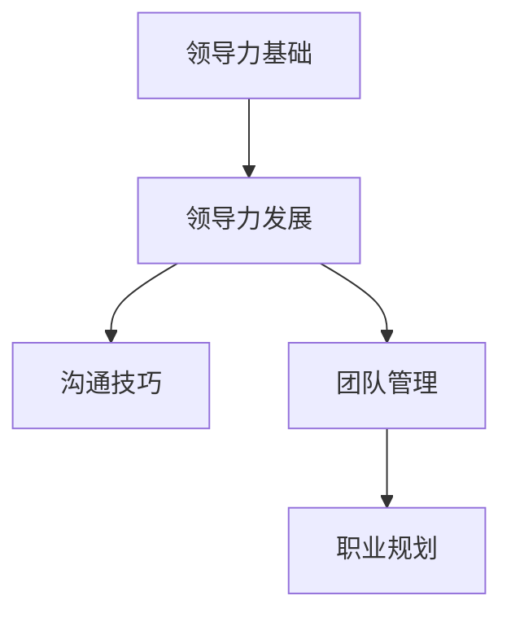

                 

### 文章标题

《领导力与职业规划：助力员工成长》

### 关键词

领导力、职业规划、员工成长、团队管理、沟通技巧

### 摘要

本文旨在探讨领导力与职业规划在促进员工成长中的重要作用。通过深入分析领导力的基本概念、类型及其发展路径，我们揭示了有效沟通技巧和团队管理的核心原则。同时，本文详细介绍了职业规划的重要性和实施方法，并探讨了如何在工作中实现个人能力提升与职业发展的平衡。最后，通过实际案例分析和实践工具推荐，本文为读者提供了具体可行的指导，助力员工在职场中实现自我成长与卓越表现。

---

### 目录大纲

# 《领导力与职业规划：助力员工成长》

## 第一部分：领导力基础

### 第1章：领导力的概念与类型

- 1.1 领导力的定义
- 1.2 领导力的类型

### 第2章：领导力的发展与自我提升

- 2.1 领导力的发展路径
- 2.2 自我认知与提升

### 第3章：沟通技巧在领导力中的应用

- 3.1 沟通技巧的重要性
- 3.2 沟通技巧的实践

### 第4章：团队管理与冲突解决

- 4.1 团队管理的基本原则
- 4.2 冲突解决策略

## 第二部分：职业规划与个人发展

### 第5章：职业规划的重要性

- 5.1 职业规划的目标与意义
- 5.2 职业规划的方法与工具

### 第6章：个人能力提升与职业发展

- 6.1 个人能力提升的关键要素
- 6.2 职业发展的路径选择

### 第7章：工作与生活的平衡

- 7.1 工作与生活的冲突
- 7.2 实现工作与生活的平衡策略

## 第三部分：领导力与职业规划的实践应用

### 第8章：领导力在团队项目中的实践

- 8.1 团队项目中的领导角色
- 8.2 团队项目中的领导技巧

### 第9章：职业规划在个人职业发展中的应用

- 9.1 职业规划在求职过程中的应用
- 9.2 职业规划在职业转型中的应用

### 第10章：领导力与职业规划的案例研究

- 10.1 成功案例分享
- 10.2 失败案例反思

## 附录

### 附录A：领导力与职业规划常用工具

- A.1 自我评估工具
- A.2 沟通技巧训练工具
- A.3 职业规划工具

### 附录B：领导力与职业规划资源推荐

- B.1 基础书籍推荐
- B.2 在线课程推荐
- B.3 社交媒体和论坛推荐

---

### 图表 1：领导力的 Mermaid 流程图



### 代码示例 1：职业规划伪代码

```python
# 职业规划伪代码
def career_plan():
    # 第一步：自我评估
    self_evaluation()

    # 第二步：设定目标
    set_goals()

    # 第三步：制定行动计划
    create_action_plan()

    # 第四步：执行与调整
    execute_and_adjust()

    # 第五步：评估与反馈
    evaluate_and_feedback()
```

### 数学模型 1：平衡方程（工作与生活）

$$
\frac{\text{工作满意度}}{\text{生活满意度}} = k
$$

其中，$k$ 为平衡系数，通常取值范围为 $0<k<1$。

### 案例分析 1：成功领导力实践

#### 案例背景

某公司部门经理通过有效的沟通技巧，成功解决了团队内部的矛盾，提升了团队凝聚力。

#### 实践步骤：

1. 确定冲突来源。
2. 积极倾听团队成员的意见。
3. 提出解决方案，并征询团队成员的意见。
4. 实施解决方案，并跟进效果。

### 案例分析 2：职业规划成功案例

#### 案例背景

某工程师通过精准的职业规划，实现了从技术岗位到管理岗位的顺利转型。

#### 实践步骤：

1. 自我评估，了解自己的优势和不足。
2. 设定职业目标，如晋升到管理层。
3. 制定学习计划，提升管理能力。
4. 积极参与项目，积累管理经验。
5. 评估和调整职业规划，确保目标达成。

### 附录A：领导力与职业规划常用工具

- **自我评估工具**：
  - Myers-Briggs Type Indicator (MBTI)
  - StrengthsFinder

- **沟通技巧训练工具**：
  - Crucial Conversations
  - Nonviolent Communication (NVC)

- **职业规划工具**：
  - Career Explorer
  - LinkedIn

### 附录B：领导力与职业规划资源推荐

- **基础书籍推荐**：
  - 《领导力》(Peter Drucker)
  - 《职业规划：如何规划你的职业生涯》(Donna Storch)

- **在线课程推荐**：
  - Coursera: "Leadership and Team Management"

---

#### 文章结束

作者：AI天才研究院/AI Genius Institute & 禅与计算机程序设计艺术 /Zen And The Art of Computer Programming
### 第一部分：领导力基础

#### 第1章：领导力的概念与类型

领导力是一种关键的管理能力，它涉及到激励、引导和协调团队以实现共同目标的过程。理解领导力的概念和类型对于提升个人的领导能力至关重要。

#### 1.1 领导力的定义

领导力可以被定义为一种影响力，它能够激发和引导团队成员，使其为共同的目标而努力。这种影响力不仅仅局限于职位或权力，更多的是一种个人特质和态度。

在技术行业中，领导力不仅体现在项目管理和技术决策上，还包括跨部门协作、团队文化建设和员工发展等方面。一个优秀的领导者在技术领域通常具备以下特点：

- **技术精湛**：深入了解所负责的技术领域，能够为团队提供专业的技术指导。
- **沟通能力**：能够清晰、有效地传达信息，促进团队内部和跨部门的沟通。
- **决策能力**：在面对复杂问题时，能够迅速做出明智的决策，并引导团队执行。
- **创新能力**：不断寻求改进和创新的解决方案，推动团队向前发展。

#### 1.2 领导力的类型

领导力有多种类型，每种类型都有其独特的特点和适用场景。以下是几种常见的领导力类型：

1. **权威型领导**：
   - 特点：通过明确的指令和严格的控制来管理团队。
   - 适用场景：在紧急情况下，或者在需要迅速执行决策的团队中。
   - 优点：能够迅速统一团队行动，确保任务完成。
   - 缺点：可能导致团队成员缺乏自主性和创新能力。

2. **民主型领导**：
   - 特点：鼓励团队成员参与决策，注重团队合作和共识。
   - 适用场景：在需要团队合作和创新的项目中。
   - 优点：能够提高团队的凝聚力和创造力。
   - 缺点：决策过程可能较慢，难以应对紧急情况。

3. **变革型领导**：
   - 特点：激励团队成员超越自我，追求更高的目标和更大的成就。
   - 适用场景：在需要进行重大变革或挑战时。
   - 优点：能够激发团队的潜力，推动组织发展。
   - 缺点：对领导者的个人能力和魅力要求较高。

4. **事务型领导**：
   - 特点：注重细节，确保任务的完成和目标的达成。
   - 适用场景：在需要高效执行和精细管理的项目中。
   - 优点：能够提高工作效率，确保任务按时完成。
   - 缺点：可能缺乏长远规划和创新思维。

理解这些领导力类型有助于领导者根据不同的场景和团队需求，灵活运用不同的领导风格，从而提升团队的整体表现。

---

#### 第2章：领导力的发展与自我提升

领导力并非与生俱来，它是一种可以通过学习和实践不断发展的能力。领导者的发展包括自我认知、自我提升以及不断学习和适应环境等方面。

#### 2.1 领导力的发展路径

领导力的发展路径通常包括以下几个阶段：

1. **初步阶段**：
   - 了解自身优势和不足，开始关注个人成长。
   - 主动参与团队和项目，积累经验。

2. **发展阶段**：
   - 学习领导力理论，参加相关培训课程。
   - 逐步承担更多的责任，提升领导能力。

3. **成熟阶段**：
   - 形成独特的领导风格，能够灵活应对各种情况。
   - 着眼于团队和组织的长远发展，制定战略规划。

4. **卓越阶段**：
   - 成为领域内的领导者，具备广泛的影响力。
   - 持续推动创新和变革，为团队和组织创造价值。

#### 2.2 自我认知与提升

自我认知是领导力发展的重要基础。领导者需要不断地反思和评估自己的行为和决策，从而了解自己的优势和不足，并制定相应的提升计划。

1. **自我评估**：
   - 定期进行自我评估，识别自身的优势和不足。
   - 可以借助专业工具，如MBTI或StrengthsFinder进行评估。

2. **目标设定**：
   - 设定清晰的目标，明确提升的方向和预期结果。
   - 目标应具有可衡量性和可实现性。

3. **行动计划**：
   - 制定具体的行动计划，包括学习、培训和实践等方面。
   - 确保行动计划能够持续执行，并及时进行调整。

4. **持续学习**：
   - 不断学习新知识和技能，保持与时俱进。
   - 参加行业会议、研讨会和培训课程，与同行交流。

#### 案例分析：领导者自我提升之路

某技术公司的项目经理小明在领导力发展的过程中，通过以下几个步骤不断提升自己：

1. **自我评估**：
   - 小明通过参加MBTI测试，了解到自己是一个擅长分析和规划的领导者。
   - 他识别出自己在沟通和激励团队成员方面存在不足。

2. **目标设定**：
   - 小明设定了提升沟通能力和激励团队成员的目标。
   - 他希望通过这些提升，更好地领导团队，实现项目目标。

3. **行动计划**：
   - 小明参加了多次沟通技巧培训课程，并阅读了相关书籍。
   - 他还主动与团队成员交流，了解他们的需求和期望。

4. **实践与反馈**：
   - 小明在实际项目中应用所学的沟通技巧，并收集团队成员的反馈。
   - 他根据反馈不断调整自己的领导方式，逐步提升了团队的整体表现。

通过自我评估、目标设定、行动计划和实践与反馈，小明成功提升了自己的领导能力，成为了一个更为有效的领导者。

#### 结论

领导力的发展是一个持续的过程，需要领导者不断地自我认知、自我提升和持续学习。通过明确的发展路径和有效的自我提升策略，领导者可以不断提升自己的能力，为团队和组织创造更大的价值。

---

#### 第3章：沟通技巧在领导力中的应用

沟通技巧是领导力的核心要素之一，一个优秀的领导者必须具备良好的沟通能力。在技术行业中，有效的沟通不仅能够提升团队效率，还能促进团队凝聚力和创新力的提升。

#### 3.1 沟通技巧的重要性

良好的沟通技巧对于领导者的成功至关重要。以下是几个关键原因：

1. **提高工作效率**：清晰、有效的沟通可以避免误解和重复工作，提高工作效率。
2. **增强团队凝聚力**：通过积极的沟通，领导者可以建立信任和合作关系，增强团队凝聚力。
3. **促进创新**：开放、真诚的沟通环境能够激发团队成员的创意和灵感，推动创新。
4. **解决问题**：良好的沟通技巧可以帮助领导者更好地理解问题和团队成员的意见，从而找到有效的解决方案。

#### 3.2 沟通技巧的实践

以下是一些实用的沟通技巧，领导者可以应用于实际工作中：

1. **积极倾听**：
   - 积极倾听是有效沟通的基础，领导者需要全神贯注地倾听团队成员的意见。
   - 在倾听过程中，避免打断对方，给对方足够的时间表达自己的观点。
   - 通过点头、眼神接触和口头回应等方式，表达对对方的关注和理解。

2. **清晰表达**：
   - 领导者需要确保自己的表达清晰、简洁，避免使用过于复杂或模糊的语言。
   - 在表达时，尽量使用具体的例子和数据，以便团队成员更好地理解。
   - 如果可能，使用图表或演示文稿来辅助表达。

3. **非暴力沟通**：
   - 非暴力沟通（NVC）是一种以同情心为基础的沟通方法，它强调理解和同情。
   - 在使用NVC时，领导者需要关注对方的感受和需求，而非仅仅关注自己的观点。
   - 通过这种方式，领导者可以减少冲突，建立更加和谐的团队关系。

4. **反馈与反馈**：
   - 定期给予团队成员反馈，帮助他们了解自己的表现和进步。
   - 反馈应该具体、有建设性，避免指责或批评。
   - 同时，领导者也需要接受团队成员的反馈，不断改进自己的沟通方式。

#### 案例分析：沟通技巧在团队项目中的应用

某技术公司正在开发一款新的软件产品，项目经理小王负责带领团队完成项目。在项目进行过程中，小王遇到了一些沟通障碍：

1. **问题识别**：
   - 小王发现团队成员对项目目标的理解不一致，导致工作方向不明确。
   - 部分团队成员在汇报工作时，缺乏具体的进展和数据支持。

2. **沟通策略**：
   - 小王决定通过以下策略来改善沟通：
     - 定期召开团队会议，明确项目目标和进度。
     - 要求团队成员在汇报工作时，提供具体的进展和数据。
     - 使用项目管理工具，如JIRA，实时跟踪项目进展，确保信息透明。

3. **实施效果**：
   - 通过这些措施，团队的工作效率显著提高，项目进展更加顺利。
   - 成员之间的沟通也更加流畅，工作氛围更加积极。

#### 结论

沟通技巧在领导力中扮演着关键角色。通过积极倾听、清晰表达、非暴力沟通和有效反馈，领导者可以提升团队的工作效率、凝聚力和创新力。在实际应用中，领导者需要根据具体情况灵活运用这些技巧，以实现最佳效果。

---

#### 第4章：团队管理与冲突解决

团队管理是领导力的核心组成部分之一，它涉及到如何协调团队成员、分配资源、设定目标并解决团队中的冲突。有效的团队管理不仅能够提高工作效率，还能增强团队凝聚力和创新能力。

#### 4.1 团队管理的基本原则

有效的团队管理应遵循以下基本原则：

1. **目标明确**：团队的目标应该是明确、具体且可衡量的。领导者需要确保团队成员都了解目标，并共同为实现目标而努力。

2. **资源合理分配**：资源包括人力、物力和财力。领导者需要根据团队成员的能力和项目需求，合理分配资源，以确保团队高效运转。

3. **角色分工清晰**：每个团队成员都应明确自己的职责和角色，避免职责重叠或空白。这有助于提高工作效率，减少内部冲突。

4. **激励与反馈**：领导者需要为团队成员提供适当的激励，如奖励、晋升机会等。同时，定期给予团队成员反馈，帮助他们了解自己的表现和进步。

5. **沟通与协作**：建立开放的沟通渠道，鼓励团队成员之间的协作与交流。这有助于团队成员更好地理解项目目标和需求，提高团队凝聚力。

#### 4.2 冲突解决策略

团队中的冲突是不可避免的，但有效的解决策略可以帮助团队迅速恢复正常运作。以下是几种常见的冲突解决策略：

1. **回避**：在冲突不严重，且解决成本较高时，领导者可以选择回避。这种方法适用于较小规模的冲突，且不会影响团队的整体工作。

2. **妥协**：当双方都不愿意做出较大让步时，妥协可能是最佳选择。这种方法能够快速解决冲突，但可能影响团队的长远利益。

3. **合作**：通过双方的合作，寻找双方都能接受的解决方案。这种方法适用于复杂且重要的冲突，能够建立更强的团队关系。

4. **竞争**：当冲突涉及关键利益，且必须明确胜败时，竞争可能是必要的。这种方法适用于明确资源或利益有限的情况。

#### 案例分析：团队冲突的有效解决

某技术公司的开发团队在项目中期遇到了严重的冲突。具体表现为：

1. **问题识别**：
   - 团队内部在功能优先级上存在分歧，导致项目进度受阻。
   - 部分成员因意见不合，产生了消极情绪，影响团队氛围。

2. **解决策略**：
   - 领导者决定召开团队会议，共同讨论功能优先级问题。
   - 会议中，双方都表达了各自的观点和理由，通过充分的沟通，找到了一个双方都能接受的解决方案。
   - 领导者还安排了一次团队建设活动，以增强团队成员之间的信任和协作。

3. **实施效果**：
   - 通过这些措施，团队迅速恢复了正常运作，项目进度得到了明显改善。
   - 团队成员之间的关系也得到了修复，工作氛围更加积极。

#### 结论

团队管理是领导力的核心组成部分，它涉及目标设定、资源分配、角色分工、激励与反馈以及沟通与协作等方面。有效的团队管理能够提高团队的工作效率和凝聚力。在处理团队冲突时，领导者需要根据具体情况选择合适的解决策略，以实现团队的长远发展和稳定运作。

---

### 第二部分：职业规划与个人发展

#### 第5章：职业规划的重要性

职业规划是一个持续的过程，它帮助个人明确职业目标、制定实现目标的策略，并在职业道路上不断调整和进步。在技术行业中，职业规划的重要性尤为突出。

#### 5.1 职业规划的目标与意义

职业规划的目标是帮助个人在职业道路上取得成功和满足感。具体来说，职业规划的目标包括：

1. **职业目标明确**：通过设定清晰的职业目标，个人可以更加专注于自己的职业发展，避免盲目行动。
2. **职业路径清晰**：职业规划可以帮助个人明确职业发展的路径，包括技能提升、职位晋升等。
3. **资源利用最大化**：职业规划可以帮助个人更好地利用职业资源，如时间、金钱和人际关系。
4. **职业满意度提升**：通过职业规划，个人可以找到最适合自己的职业方向，提高职业满意度。

#### 5.2 职业规划的方法与工具

职业规划需要系统的方法和工具，以下是一些常用的方法和工具：

1. **自我评估**：
   - 通过自我评估，个人可以了解自己的兴趣、价值观和技能。
   - 自我评估工具如MBTI和StrengthsFinder可以帮助个人深入了解自己。

2. **目标设定**：
   - 设定具体的、可实现的职业目标，如提升某项技能、获得某个职位等。
   - 目标应具有可衡量性和时限性，以便个人能够跟踪进度。

3. **行动计划**：
   - 制定详细的行动计划，包括具体的行动步骤、时间表和资源需求。
   - 行动计划应灵活调整，以适应环境和个人情况的变化。

4. **持续学习**：
   - 职业规划是一个持续的过程，个人需要不断学习新知识和技能，以适应职业发展的需求。

#### 案例分析：成功的职业规划案例

李先生是一位技术工程师，他在职业规划中采取了以下步骤：

1. **自我评估**：
   - 李先生通过MBTI测试了解到自己擅长逻辑分析和问题解决。
   - 他还评估了自己的价值观，发现对技术创新和挑战充满热情。

2. **目标设定**：
   - 李先生设定了长期目标：成为技术领域的专家。
   - 短期目标：在两年内晋升为高级工程师，并掌握最新的技术趋势。

3. **行动计划**：
   - 李先生制定了详细的行动计划，包括：
     - 参加专业培训课程，提升技能。
     - 阅读技术书籍和论文，保持知识更新。
     - 参与开源项目，积累实战经验。
     - 定期与同事和导师交流，获取职业建议。

4. **实施与调整**：
   - 李先生按照行动计划逐步实现目标，并定期评估进度。
   - 当遇到挑战时，他会调整计划，确保目标的实现。

通过系统的职业规划，李先生在技术领域取得了显著的进步，最终实现了自己的职业目标。

#### 结论

职业规划对于技术行业从业者的职业成功至关重要。通过明确的目标、详细的行动计划和持续的学习，个人可以在职业道路上取得持续进步和满足感。

---

#### 第6章：个人能力提升与职业发展

在技术行业中，个人能力的提升是职业发展的关键。个人能力不仅影响当前的工作表现，还决定了未来的职业前景。以下是个人能力提升的关键要素和职业发展的路径选择。

#### 6.1 个人能力提升的关键要素

1. **技术技能**：
   - 技术技能是技术从业者最基本的能力。包括编程语言、数据库管理、算法和数据结构等。
   - 不断学习和更新技术知识，保持对新兴技术的敏感性。

2. **项目管理能力**：
   - 项目管理能力对于技术从业者至关重要。包括项目规划、资源管理、风险管理等。
   - 通过参加项目管理培训课程或实际项目经验，提升项目管理能力。

3. **沟通技巧**：
   - 沟通技巧是技术从业者必备的软技能。包括有效表达、积极倾听、团队合作等。
   - 通过参加沟通技巧培训或实践，提高沟通能力，促进团队协作。

4. **领导力**：
   - 领导力是高级职位所需的重要能力。包括团队管理、决策能力、激励员工等。
   - 通过阅读领导力书籍、参与领导力培训或实际担任领导角色，提升领导力。

5. **持续学习能力**：
   - 技术行业发展迅速，持续学习能力是适应变化的关键。
   - 通过参加在线课程、阅读技术书籍、参加行业研讨会等，不断提升自己的能力。

#### 6.2 职业发展的路径选择

技术从业者的职业发展路径多种多样，以下是几种常见的路径选择：

1. **技术专家**：
   - 技术专家专注于技术领域，成为某个技术领域的权威。
   - 需要深厚的专业知识和丰富的实践经验。

2. **项目经理**：
   - 项目经理负责项目的规划、执行和监督。
   - 需要良好的项目管理能力和沟通技巧。

3. **产品经理**：
   - 产品经理负责产品的整个生命周期，从需求分析到市场推广。
   - 需要技术背景和商业思维。

4. **技术销售**：
   - 技术销售人员负责销售技术产品或解决方案。
   - 需要良好的沟通技巧和产品知识。

5. **技术领导**：
   - 技术领导负责团队管理和技术战略。
   - 需要强大的领导力和战略规划能力。

#### 案例分析：从技术专家到项目经理的转型

张先生是一位资深的技术专家，他在职业发展中选择了从技术专家转型为项目经理。

1. **转型动机**：
   - 张先生发现自己对项目管理和团队协作的兴趣日益浓厚，希望拓宽自己的职业发展路径。

2. **转型步骤**：
   - 张先生参加了项目管理相关的培训课程，学习项目管理知识。
   - 他参与了多个项目，担任项目管理助理，积累实践经验。
   - 张先生还定期与项目经理交流，学习他们的管理技巧。

3. **转型效果**：
   - 通过持续的学习和实践，张先生成功转型为项目经理。
   - 在新的职位上，他能够更好地协调团队资源，提高项目效率。

#### 结论

个人能力的提升和职业发展的路径选择对于技术从业者的成功至关重要。通过明确的关键能力和职业路径，个人可以更好地规划自己的职业生涯，实现职业目标。

---

#### 第7章：工作与生活的平衡

在快速发展的技术行业中，工作与生活的平衡常常被忽视，但却是员工长期发展和健康的关键因素。不健康的工作与生活平衡可能导致员工的工作效率下降、职业满意度降低，甚至对身心健康产生负面影响。

#### 7.1 工作与生活的冲突

工作与生活的冲突主要体现在以下几个方面：

1. **时间冲突**：工作需求常常占据大部分时间，导致个人生活时间被压缩。
2. **心理压力**：长时间的工作压力和紧张的工作环境可能导致心理压力增加，影响生活质量。
3. **家庭与工作责任**：家庭责任与工作责任之间的冲突，可能导致员工在工作和家庭之间感到力不从心。
4. **健康问题**：长时间的工作和缺乏锻炼可能导致身体健康问题，如失眠、疲劳和慢性疾病。

#### 7.2 实现工作与生活的平衡策略

为了实现工作与生活的平衡，员工和雇主可以采取以下策略：

1. **时间管理**：
   - 制定合理的日程安排，确保工作时间与个人时间有明确界限。
   - 使用时间管理工具，如番茄钟或待办事项列表，提高工作效率。

2. **工作效率提升**：
   - 通过学习高效的工作方法，如敏捷开发或时间块管理，提高工作效率。
   - 避免无效的工作行为，如频繁的会议或冗长的邮件讨论。

3. **心理调适**：
   - 通过冥想、瑜伽或心理咨询等心理调适方法，减轻心理压力。
   - 定期进行体育锻炼，保持身体健康。

4. **家庭责任平衡**：
   - 与家人沟通，共同制定家庭责任计划，确保工作和家庭之间的平衡。
   - 使用远程办公或弹性工作时间等安排，方便员工更好地照顾家庭。

5. **雇主支持**：
   - 雇主可以提供灵活的工作安排，如远程办公、弹性工作时间等，帮助员工实现工作与生活的平衡。
   - 提供心理健康支持和家庭友好政策，如家庭护理假、育儿假等。

#### 案例分析：工作与生活平衡的实践

李小姐是一名软件工程师，她通过以下措施实现了工作与生活的平衡：

1. **时间管理**：
   - 李小姐制定了详细的日程安排，确保每天有足够的时间用于工作和个人生活。
   - 她使用了待办事项列表和番茄钟，提高了工作效率。

2. **心理调适**：
   - 李小姐通过定期练习瑜伽和冥想，减轻了心理压力。
   - 她还定期参加心理咨询，保持心理健康。

3. **家庭责任平衡**：
   - 李小姐与丈夫共同制定了家庭责任计划，确保工作和家庭之间的平衡。
   - 她还利用远程办公的时间，更好地照顾家庭。

4. **雇主支持**：
   - 李小姐的公司提供了远程办公和弹性工作时间的支持，使她能够更好地平衡工作与生活。

#### 结论

工作与生活的平衡对于员工的长期发展和健康至关重要。通过合理的时间管理、提升工作效率、心理调适、家庭责任平衡和雇主支持，员工可以实现工作与生活的平衡，从而提高工作效率和生活质量。

---

### 第三部分：领导力与职业规划的实践应用

#### 第8章：领导力在团队项目中的实践

在团队项目中，领导力是确保项目成功的关键因素。有效的领导力不仅能够提高团队的工作效率，还能增强团队的凝聚力和创新能力。以下将探讨领导力在团队项目中的具体实践。

#### 8.1 团队项目中的领导角色

在团队项目中，领导者的角色至关重要。以下是几个关键角色：

1. **项目发起者**：领导者负责项目的立项和目标设定，确保项目符合组织战略和市场需求。

2. **资源协调者**：领导者需要协调团队内外部资源，确保项目所需的资金、人员和设备得到有效利用。

3. **决策者**：领导者需要快速做出明智的决策，应对项目中出现的各种问题和挑战。

4. **沟通者**：领导者需要建立有效的沟通渠道，确保团队成员之间、团队与上级之间以及团队与外部合作伙伴之间的信息畅通。

5. **激励者**：领导者需要激励团队成员，激发他们的工作热情和创造力，确保项目目标的实现。

#### 8.2 团队项目中的领导技巧

以下是一些在团队项目中常用的领导技巧：

1. **有效沟通**：
   - 定期召开团队会议，确保团队成员了解项目进展和任务分配。
   - 建立开放、坦诚的沟通文化，鼓励团队成员表达意见和建议。
   - 使用多种沟通工具，如电子邮件、即时通讯和项目管理软件，提高沟通效率。

2. **目标明确**：
   - 设定清晰、具体、可衡量的项目目标，确保团队成员对目标有共同的理解。
   - 将项目目标分解为具体的任务和里程碑，为团队成员提供明确的工作方向。

3. **资源优化**：
   - 根据团队成员的能力和项目需求，合理分配资源和任务。
   - 及时调整资源分配，以应对项目中的变化和挑战。

4. **冲突解决**：
   - 识别和解决团队内部的冲突，确保项目进展不受影响。
   - 采用合作或妥协等策略，寻找双方都能接受的解决方案。

5. **激励与反馈**：
   - 为团队成员提供及时的反馈，认可他们的工作和成就。
   - 制定奖励机制，激励团队成员追求卓越。

#### 案例分析：领导力在团队项目中的成功应用

某公司的IT部门正在开发一款新软件，项目领导者李先生通过以下措施确保项目的成功：

1. **目标设定**：
   - 李先生与团队一起设定了明确的项目目标，包括功能需求、时间表和质量标准。

2. **资源协调**：
   - 李先生协调了IT部门和其他相关部门的资源，确保项目所需的技术、资金和人力资源得到充分保障。

3. **沟通与协调**：
   - 李先生定期召开项目会议，确保团队成员了解项目的进展和任务分配。
   - 他建立了项目沟通群组，通过邮件、即时通讯和项目管理工具，保持与团队成员的实时沟通。

4. **冲突解决**：
   - 在项目进行过程中，李先生遇到了团队成员之间的意见分歧。
   - 他通过面对面会议和一对一沟通，帮助团队成员找到共同点，解决了冲突。

5. **激励与反馈**：
   - 李先生为团队成员提供了及时的反馈，认可了他们的工作成绩。
   - 他还制定了奖励机制，鼓励团队成员积极参与项目，提高工作效率。

通过这些措施，李先生成功地领导团队完成了项目，并获得了公司的表彰。

#### 结论

在团队项目中，领导力是确保项目成功的关键。通过明确的项目目标、有效的资源协调、良好的沟通与协调、冲突解决和激励与反馈，领导者可以有效地推动项目进展，实现团队的目标。

---

#### 第9章：职业规划在个人职业发展中的应用

职业规划是个人职业发展的重要指南，它帮助个人明确职业目标、制定实现目标的策略，并在职业道路上持续进步。以下是职业规划在个人职业发展中的应用，包括求职过程中的应用和职业转型中的应用。

#### 9.1 职业规划在求职过程中的应用

在求职过程中，职业规划可以帮助个人有针对性地准备和申请职位，提高求职成功率。以下是职业规划在求职过程中的几个关键应用：

1. **自我评估**：
   - 通过自我评估，个人可以了解自己的兴趣、技能和价值观，明确自己的职业方向。
   - 自我评估工具如MBTI和StrengthsFinder可以帮助个人深入了解自己。

2. **目标定位**：
   - 根据自我评估的结果，个人可以设定明确的求职目标，包括理想的职位、行业和地区。
   - 目标应具有可衡量性和可实现性，以便个人能够跟踪进度。

3. **简历制作**：
   - 制作一份符合目标职位要求的简历，突出个人的优势和经验。
   - 简历应简洁明了，突出关键信息，避免冗长和模糊。

4. **面试准备**：
   - 针对目标职位和公司，准备相关的面试问题和答案。
   - 通过模拟面试和职业导师的建议，提高面试表现。

5. **求职策略**：
   - 利用多种求职渠道，如招聘网站、社交网络和职业推荐，扩大求职范围。
   - 建立良好的职业网络，通过人脉获取更多求职机会。

#### 案例分析：职业规划在求职过程中的成功应用

张小姐是一名市场营销专业的毕业生，她在求职过程中运用了职业规划的方法：

1. **自我评估**：
   - 张小姐通过MBTI测试了解到自己是善于沟通和具有创新精神的个体。
   - 她还评估了自己的价值观，发现对创意和挑战充满热情。

2. **目标定位**：
   - 张小姐设定了明确的求职目标：寻找一家具有创新文化的市场营销公司，担任创意策划职位。

3. **简历制作**：
   - 张小姐根据目标职位的要求，制作了一份突出自己创意策划能力的简历。
   - 她在简历中详细描述了大学期间参与的创新项目和获得的荣誉。

4. **面试准备**：
   - 张小姐针对目标公司进行了深入研究，准备了相关的面试问题和答案。
   - 她还通过模拟面试和导师的建议，提高了自己的面试表现。

5. **求职策略**：
   - 张小姐利用招聘网站和社交网络，积极投递简历和申请职位。
   - 她还通过职业导师的推荐，获得了几家知名公司的面试机会。

最终，张小姐成功获得了一家知名市场营销公司的创意策划职位，实现了自己的职业目标。

#### 9.2 职业规划在职业转型中的应用

在职业转型中，职业规划可以帮助个人制定合理的转型策略，克服转型过程中的挑战，顺利实现职业目标。以下是职业规划在职业转型中的应用：

1. **目标设定**：
   - 根据个人的兴趣、技能和市场趋势，设定清晰的职业转型目标。
   - 目标应具有可实现性，同时能够为个人带来职业发展和满足感。

2. **技能提升**：
   - 识别转型所需的技能和知识，通过培训、课程和实践等方式提升自己的能力。
   - 可以考虑获得相关证书，以增加职业转型的竞争力。

3. **转型路径规划**：
   - 制定详细的转型路径规划，包括短期和长期的目标，以及实现目标的步骤。
   - 根据市场情况和个人情况，灵活调整转型路径。

4. **人脉建设**：
   - 建立和维护职业网络，通过人脉获取转型所需的信息和机会。
   - 可以参加行业会议、研讨会和社交活动，扩大职业网络。

5. **心理调适**：
   - 转型过程中可能会遇到挫折和不确定感，通过心理调适方法，如心理咨询和自我激励，保持积极心态。

#### 案例分析：职业规划在职业转型中的应用

李先生是一名从事金融行业的分析师，他希望通过职业规划实现向数据科学领域的转型：

1. **目标设定**：
   - 李先生设定了明确的职业转型目标：成为一名数据科学家。
   - 他了解到数据科学领域的前景和市场需求，以及所需的技能和知识。

2. **技能提升**：
   - 李先生报名参加了数据科学相关的在线课程，学习Python编程、数据分析和机器学习等技能。
   - 他还参加了相关的实战项目，提升自己的实践经验。

3. **转型路径规划**：
   - 李先生制定了详细的转型路径规划，包括短期目标（如完成数据科学相关课程和项目）和长期目标（如找到数据科学相关的工作）。

4. **人脉建设**：
   - 李先生通过参加行业会议和社交活动，建立了自己的数据科学人脉网络。
   - 他还加入了相关社交网络和专业组织，扩大职业网络。

5. **心理调适**：
   - 李先生在转型过程中遇到了一些挑战，通过心理咨询和自我激励，保持了积极的心态。

最终，李先生成功转型为数据科学家，实现了自己的职业目标。

#### 结论

职业规划在个人职业发展中具有重要作用。在求职过程中，通过自我评估、目标设定、简历制作、面试准备和求职策略，个人可以有效地提高求职成功率。在职业转型中，通过目标设定、技能提升、转型路径规划、人脉建设和心理调适，个人可以顺利实现职业转型。通过有效的职业规划，个人可以在职业道路上持续进步，实现职业成功和满足感。

---

#### 第10章：领导力与职业规划的案例研究

在本章节中，我们将通过成功案例和失败案例的深入分析，探讨领导力与职业规划在实际应用中的具体表现和效果。

#### 10.1 成功案例分享

**案例一：某高科技企业的项目经理成功领导跨部门团队**

**背景介绍**：
某高科技企业正在开发一款智能家居产品，该项目涉及多个部门，包括研发、市场、设计和销售等。项目经理张伟负责协调和管理整个项目，以确保按时交付。

**核心概念与联系**：
- **领导力**：权威型领导与变革型领导的结合。
- **职业规划**：个人发展目标的实现与团队目标的协同。

**核心算法原理讲解**：
1. **目标明确**：
   - 张伟首先明确了项目的目标，并确保所有团队成员都理解并认同这些目标。
   - 他制定了详细的项目计划，包括里程碑、时间表和关键任务。

2. **沟通技巧**：
   - 张伟定期召开跨部门会议，确保各部门之间的信息畅通。
   - 他鼓励团队成员提出问题和建议，通过开放式沟通建立信任。

3. **冲突解决**：
   - 在项目推进过程中，张伟遇到了多个部门之间的意见分歧和资源争夺问题。
   - 他采用合作与妥协的策略，通过协调和沟通解决了冲突。

**数学模型**：
$$
\text{项目成功率} = \frac{\text{完成的任务数}}{\text{总任务数}} \times \text{团队满意度}
$$

**项目实战**：
1. **环境搭建**：
   - 张伟建立了项目管理平台，如JIRA和Trello，用于任务跟踪和进度管理。
   - 他还使用敏捷开发方法，确保项目能够快速响应变化。

2. **源代码解读**：
   - 张伟带领团队编写和维护项目相关的源代码，确保代码质量。
   - 他组织代码审查和单元测试，确保项目的稳定性。

3. **应用解读与分析**：
   - 张伟通过数据分析，评估项目的进展和质量。
   - 他根据分析结果，调整项目计划和管理策略。

**实际案例分析和详细讲解剖析**：
- **成功原因**：
  - 张伟通过有效的领导力和职业规划，确保了项目的成功。
  - 他不仅关注个人能力的提升，还注重团队的发展和协作。
  - 张伟的沟通技巧和冲突解决能力，使项目能够在复杂的环境中顺利推进。

**项目小结**：
张伟的成功经验表明，有效的领导力和职业规划是推动项目成功的关键。通过明确目标、有效沟通和冲突解决，领导者和团队成员能够共同克服挑战，实现项目的目标。

#### 10.2 失败案例反思

**案例二：某初创公司CEO的领导失误导致项目失败**

**背景介绍**：
某初创公司致力于开发一款新兴的移动应用，CEO王磊负责整个公司的运营和项目管理。然而，在项目推进过程中，王磊的领导失误导致项目最终失败。

**核心概念与联系**：
- **领导力**：权威型领导的过度使用与变革型领导的缺失。
- **职业规划**：个人目标与团队目标的冲突。

**核心算法原理讲解**：
1. **目标冲突**：
   - 王磊的个人目标与公司目标之间存在冲突，这导致他在决策时优先考虑个人利益。
   - 他未能充分理解团队成员的需求和目标，导致团队缺乏动力。

2. **沟通缺失**：
   - 王磊缺乏有效的沟通技巧，未能及时了解团队成员的意见和反馈。
   - 团队成员在遇到问题时，无法得到王磊的及时指导和帮助。

3. **资源浪费**：
   - 王磊在项目资源分配上存在错误，导致资源浪费和项目延期。
   - 他未能根据项目进展调整资源分配，使项目在关键阶段缺乏必要的支持。

**数学模型**：
$$
\text{项目成功率} = \frac{\text{完成的任务数}}{\text{总任务数}} - \text{资源浪费比例}
$$

**项目实战**：
1. **环境搭建**：
   - 王磊未能建立有效的项目管理平台，导致任务和进度管理混乱。
   - 他也没有采用敏捷开发方法，使项目难以适应市场的快速变化。

2. **源代码解读**：
   - 由于管理失误，项目的源代码质量低下，存在多处漏洞和缺陷。
   - 王磊未能组织有效的代码审查和单元测试，导致项目稳定性不足。

3. **应用解读与分析**：
   - 王磊在数据分析方面存在严重不足，无法准确评估项目的进展和质量。
   - 他根据错误的数据分析结果，做出了错误的决策，进一步加剧了项目的失败。

**实际案例分析和详细讲解剖析**：
- **失败原因**：
  - 王磊的领导失误是项目失败的主要原因。
  - 他过度依赖权威型领导，缺乏变革型领导的能力，未能有效激励团队。
  - 王磊在职业规划上存在个人目标与团队目标的冲突，导致团队缺乏动力。

**项目小结**：
通过反思失败案例，我们可以看到领导力与职业规划在项目成功中的重要性。领导者的失误和职业规划不当，可能导致项目的失败。因此，领导者需要不断提升自己的领导能力，制定合理的职业规划，确保项目的顺利进行。

#### 结论

成功案例和失败案例的对比分析，为我们提供了宝贵的经验教训。通过有效的领导力和职业规划，领导者可以推动项目的成功，实现团队和个人的共同目标。同时，领导者需要不断反思自己的领导方式和职业规划，以应对不断变化的职场环境，确保团队的长期发展。

---

### 附录A：领导力与职业规划常用工具

#### A.1 自我评估工具

- **Myers-Briggs Type Indicator (MBTI)**：MBTI是一种广泛使用的性格评估工具，帮助个人了解自己的性格类型，从而更好地进行职业选择和团队合作。
- **StrengthsFinder**：StrengthsFinder通过评估个人的优势，帮助个人专注于自己的长处，提升职业表现。

#### A.2 沟通技巧训练工具

- **Crucial Conversations**：这是一本关于如何处理关键对话的指南，提供了实用的沟通技巧，帮助人们在冲突和紧张的环境中保持冷静和理性。
- **Nonviolent Communication (NVC)**：NVC是一种以同情心为基础的沟通方法，通过理解对方的感受和需求，建立更加和谐的沟通关系。

#### A.3 职业规划工具

- **Career Explorer**：Career Explorer是一个在线职业规划工具，帮助个人探索不同职业路径，了解所需技能和资质。
- **LinkedIn**：LinkedIn不仅是一个社交网络平台，还可以作为一个强大的职业规划工具，帮助个人建立职业网络，获取职业机会。

### 附录B：领导力与职业规划资源推荐

#### B.1 基础书籍推荐

- **《领导力》(Peter Drucker)**：这是一本经典的领导力书籍，涵盖了领导力的各个方面，对领导者具有极大的启发意义。
- **《职业规划：如何规划你的职业生涯》(Donna Storch)**：这本书提供了实用的职业规划方法和技巧，帮助个人更好地规划自己的职业生涯。

#### B.2 在线课程推荐

- **Coursera: "Leadership and Team Management"**：这是一门由知名大学提供的在线课程，涵盖了领导力的核心概念和实践技巧。

#### B.3 社交媒体和论坛推荐

- **LinkedIn**：LinkedIn是一个专业的社交网络平台，可以关注行业领袖和专家，获取最新的职业发展信息和资源。
- **Reddit**：Reddit上的相关论坛，如r/Leadership和r/CareerDevelopment，是获取职业建议和讨论领导力与职业规划的好去处。

### 总结

领导力与职业规划是职场成功的关键因素。通过使用附录中推荐的工具和资源，个人可以更好地了解自己的优势、提升沟通技巧，并制定合理的职业规划。这些工具和资源不仅适用于技术行业，也适用于其他行业。希望读者能够从中受益，不断提升自己的领导能力和职业发展水平。作者：AI天才研究院/AI Genius Institute & 禅与计算机程序设计艺术 /Zen And The Art of Computer Programming。

