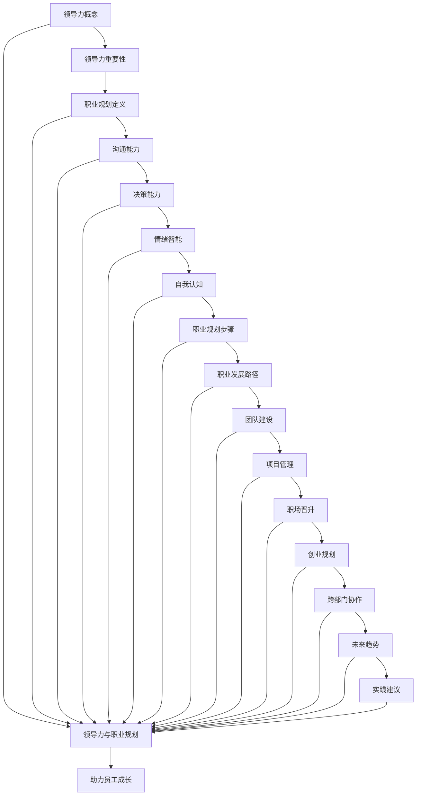

                 

# 文章标题：领导力与职业规划：助力员工成长

> 关键词：领导力、职业规划、员工成长、沟通能力、决策能力、情绪智能、自我认知

> 摘要：本文旨在探讨领导力与职业规划对员工成长的重要作用，通过分析领导力的核心能力、职业规划的基本策略以及领导力与职业规划的实战案例，为IT行业的职业发展提供有益的指导。

----------------------------------------------------------------

## 第一部分：领导力与职业规划概述

### 第1章：领导力与职业规划基础

#### 1.1 领导力的概念与重要性

领导力是指领导者通过激发和引导团队成员，实现组织目标的能力。领导力在不同的历史时期有不同的定义，但其核心都是围绕如何影响他人、如何解决复杂问题和如何实现目标展开。

领导力在组织中的作用不可忽视。首先，领导力能够激发员工的积极性和创造力，提高团队的整体绩效。其次，领导力有助于建立良好的组织文化，增强组织的凝聚力和稳定性。最后，领导力能够推动组织创新，适应快速变化的外部环境。

领导力与职业发展的关联十分紧密。一个具备领导力的人往往能够在职业发展中获得更多的机会和更大的成功。领导力不仅是职位晋升的必要条件，更是个人职业生涯发展的核心驱动力。

#### 1.2 职业规划的定义与目标

职业规划是指个人根据自身的兴趣、能力、价值观和市场需求，制定并实现职业目标和计划的过程。职业规划的意义在于帮助个人明确职业发展方向，提高职业成就感和幸福感。

个人职业发展的路径通常包括从业初期、中期和高级管理职位三个阶段。在从业初期，个人需要通过学习和实践，提升自己的专业技能和综合素质。在中期，个人需要通过职业转型和不断学习，实现职业的稳步发展。在高级管理职位阶段，个人需要具备更高的领导力和战略管理能力，推动组织的持续发展。

设定清晰的职业目标是职业规划的重要步骤。职业目标应当具有明确性、可行性和挑战性，同时要与个人的兴趣、能力和市场需求相匹配。

----------------------------------------------------------------

### 第2章：领导力核心能力

#### 2.1 沟通能力

沟通能力是领导力的基础。有效沟通能够确保信息的准确传达，减少误解和冲突，提升团队协作效率。

**有效沟通的技巧**：

1. **倾听**：积极倾听对方的观点，理解其意图和需求。
2. **表达清晰**：用简洁明了的语言表达自己的观点，避免使用模糊或含糊的措辞。
3. **非暴力沟通**：尊重对方的感受和观点，避免使用攻击性的语言。
4. **反馈与确认**：及时给予反馈，确认对方是否理解自己的意思。

**情绪管理与非暴力沟通**：

情绪管理是有效沟通的关键。领导者需要学会控制自己的情绪，避免在沟通中因情绪失控而引发冲突。

非暴力沟通是一种有效的情绪管理技巧，它通过倾听、表达和反馈，帮助领导者建立积极的工作关系。

**演讲与会议技巧**：

演讲是领导者展示领导力的一个重要场合。有效的演讲需要具备以下几点：

1. **明确主题**：确保演讲内容围绕主题展开，避免偏离。
2. **引人入胜**：使用生动的故事和案例，吸引听众的注意力。
3. **逻辑清晰**：确保演讲内容有条理，逻辑性强。
4. **互动与反馈**：与听众互动，鼓励提问和反馈，提高演讲效果。

会议是领导者日常工作的重要组成部分。有效的会议需要具备以下几点：

1. **明确目标**：确保会议目标明确，避免无目的的讨论。
2. **准备充分**：提前准备会议议程和资料，确保会议高效进行。
3. **控制时间**：确保会议时间得到有效控制，避免拖延和浪费时间。
4. **积极引导**：引导会议讨论方向，确保会议目标的实现。

----------------------------------------------------------------

#### 2.2 决策能力

决策能力是领导力的核心之一。领导者需要具备快速、准确和有效的决策能力，以应对复杂多变的环境。

**决策模型与方法**：

1. **理性决策模型**：基于数据分析和逻辑推理，确保决策的科学性和合理性。
2. **经验决策模型**：基于经验和直觉，快速做出决策，适用于紧急情况。
3. **混合决策模型**：结合理性决策和经验决策，综合考虑各种因素，做出最优决策。

**风险评估与决策优化**：

1. **风险评估**：对决策可能带来的风险进行评估，确保决策的稳健性。
2. **决策优化**：通过优化决策模型和算法，提高决策的准确性和效率。

**决策制定的步骤与实践**：

1. **明确决策目标**：确保决策目标的明确性和可衡量性。
2. **收集信息**：收集与决策相关的信息，确保信息的全面性和准确性。
3. **分析选项**：分析各种决策方案的优缺点，评估其可行性。
4. **制定决策**：根据分析结果，制定最佳决策方案。
5. **执行决策**：将决策方案付诸实践，确保决策目标的实现。
6. **评估与调整**：对决策结果进行评估，根据实际情况进行调整和优化。

----------------------------------------------------------------

#### 2.3 情绪智能

情绪智能是指个体识别、理解、管理自己的情绪，并能够有效地识别和影响他人的情绪的能力。

**情绪识别与表达**：

情绪识别是情绪智能的基础。领导者需要学会识别自己的情绪，理解情绪的来源和影响。

情绪表达是领导者与团队成员沟通的重要方式。领导者需要学会以积极、真诚的方式表达自己的情绪，避免情绪的负面影响。

**自我管理与他人影响**：

自我管理是情绪智能的核心。领导者需要学会自我调节情绪，保持冷静和理智，以应对各种挑战。

他人影响是指领导者通过情绪管理影响他人的情绪和行为。领导者需要学会以积极的方式影响团队成员的情绪，激发他们的积极性和创造力。

**建立积极的工作氛围**：

领导者需要通过情绪智能，建立积极的工作氛围。这包括：

1. **鼓励员工表达情绪**：建立开放、包容的沟通环境，鼓励员工表达自己的情绪和想法。
2. **提供情感支持**：关心员工的情感需求，提供必要的情感支持。
3. **培养团队凝聚力**：通过团队活动和合作，增强团队成员之间的情感联系。

----------------------------------------------------------------

### 第3章：职业规划策略与方法

#### 3.1 自我认知

自我认知是职业规划的基础。个人需要通过自我认知，了解自己的价值观、兴趣、优势和弱点，从而制定符合自己特点的职业规划。

**了解自己的价值观与兴趣**：

价值观是指个人对事物的重要性的评价和选择。了解自己的价值观有助于明确职业目标，确保职业选择与个人价值观相一致。

兴趣是激发个人热情和动力的源泉。了解自己的兴趣有助于找到自己热爱的工作，提高工作满意度和幸福感。

**评估个人优势和弱点**：

个人优势是职业发展的关键。评估自己的优势有助于发现个人的核心竞争力，为自己在职业市场中的定位提供依据。

个人弱点是职业发展中的挑战。识别自己的弱点有助于制定改进计划，提升自己的综合素质。

**确定职业目标与方向**：

确定职业目标是职业规划的核心。职业目标应当具有明确性、可行性和挑战性，要与个人的兴趣、能力和市场需求相匹配。

确定职业方向是职业规划的重要步骤。职业方向决定了个人在职业生涯中的发展方向和路径。

----------------------------------------------------------------

#### 3.2 职业规划步骤

职业规划是一个持续的过程，需要在不同阶段进行调整和优化。以下是职业规划的基本步骤：

**设定短期与长期目标**：

短期目标是指在未来1-3年内要实现的目标，如提升某项技能、获得某个证书等。长期目标是指在未来3-5年内要实现的目标，如晋升为项目经理、成为部门主管等。

**制定实现目标的策略**：

制定实现目标的策略是指为实现目标制定具体的行动计划。策略应当包括以下几个方面：

1. **学习与培训**：提升自己的专业技能和综合素质。
2. **网络拓展**：建立广泛的人际关系，获取更多的职业机会。
3. **实践与锻炼**：通过实际工作锻炼自己的能力。
4. **调整与优化**：根据实际情况，及时调整和优化职业规划。

**调整与优化职业规划**：

职业规划不是一成不变的，需要根据实际情况进行调整和优化。调整和优化职业规划包括以下几个方面：

1. **市场变化**：根据市场需求变化，调整自己的职业方向和目标。
2. **个人发展**：根据个人成长和进步，调整自己的职业规划和策略。
3. **挑战与机遇**：抓住机遇，迎接挑战，优化职业规划。

----------------------------------------------------------------

#### 3.3 职业发展路径

职业发展路径是指个人在职业生涯中的发展方向和路径。不同的职业发展阶段需要不同的职业规划策略。

**从业初期职业规划**：

从业初期是个人职业生涯的基础阶段。在这一阶段，个人需要：

1. **学习与成长**：通过学习和实践，提升自己的专业技能和综合素质。
2. **积累经验**：通过实际工作，积累工作经验，为未来的职业发展打下基础。
3. **定位与选择**：根据自己的兴趣、能力和市场需求，明确自己的职业定位和选择。

**中期职业规划**：

中期职业规划是个人职业生涯的重要阶段。在这一阶段，个人需要：

1. **职业转型**：根据市场需求和个人兴趣，考虑职业转型。
2. **提升领导力**：通过学习和实践，提升自己的领导力和管理能力。
3. **职业发展**：通过努力和表现，争取职业晋升和更好的发展机会。

**高级管理职位职业规划**：

高级管理职位是个人职业生涯的高峰阶段。在这一阶段，个人需要：

1. **战略管理**：掌握战略管理知识，提升战略思维能力。
2. **团队领导**：培养优秀的团队领导能力，提升团队绩效。
3. **组织发展**：关注组织发展，为组织的持续发展贡献自己的力量。

----------------------------------------------------------------

## 第二部分：领导力与职业规划实战

### 第4章：领导力实践案例

#### 4.1 案例研究一：高效团队建设

高效团队建设是领导力实践的重要方面。以下是一个关于高效团队建设的案例研究。

**团队建设的理论与实践**：

该团队是一家大型IT公司的研发团队，团队成员包括程序员、设计师和产品经理。团队建设的目标是提高团队的协作效率，提升项目交付质量。

为了实现团队建设目标，团队采取了一系列措施：

1. **建立共同目标**：明确团队的目标和愿景，确保团队成员共同奋斗。
2. **强化沟通与协作**：定期组织团队会议，鼓励团队成员分享经验和观点，促进沟通与协作。
3. **培训与发展**：为团队成员提供培训和学习机会，提升团队整体素质。
4. **激励与认可**：制定激励机制，鼓励团队成员积极参与和贡献。

**团队成员间的沟通协作**：

团队成员之间的沟通协作是高效团队建设的关键。以下是一些有效的沟通协作技巧：

1. **倾听**：团队成员要积极倾听他人的观点，理解其意图和需求。
2. **明确职责**：明确团队成员的职责和任务，避免职责重叠和冲突。
3. **使用工具**：使用各种沟通工具和协作平台，提高沟通效率和质量。
4. **反馈与改进**：及时给予反馈，鼓励团队成员提出改进意见，共同优化团队协作流程。

**团队绩效的提升策略**：

团队绩效的提升是高效团队建设的最终目标。以下是一些有效的提升团队绩效的策略：

1. **明确绩效指标**：制定明确的绩效指标，确保团队成员对绩效有清晰的认识。
2. **定期评估与反馈**：定期对团队成员的绩效进行评估和反馈，鼓励团队成员持续改进。
3. **激励与奖励**：根据绩效评估结果，给予优秀成员激励和奖励，激发团队成员的积极性和创造力。
4. **团队文化建设**：建立积极向上的团队文化，增强团队成员的归属感和凝聚力。

通过以上措施，该团队在项目交付质量和团队协作效率方面取得了显著提升。

----------------------------------------------------------------

#### 4.2 案例研究二：领导力在项目管理中的应用

项目管理是领导力在实践中的重要应用领域。以下是一个关于领导力在项目管理中的应用案例研究。

**项目管理的核心要素**：

项目管理是指通过计划、组织、协调和控制等手段，确保项目按计划、高质量、高效地完成。项目管理的核心要素包括：

1. **项目目标**：明确项目的目标和预期成果。
2. **项目计划**：制定项目计划，明确项目进度、资源和任务分配。
3. **项目团队**：组建项目团队，明确团队成员的角色和职责。
4. **项目资源**：确保项目所需的资源得到合理配置和充分利用。
5. **项目风险**：识别项目风险，制定风险管理计划。

**领导力在项目中的角色与职责**：

领导力在项目管理中扮演着重要的角色。项目领导者需要承担以下职责：

1. **目标设定**：明确项目的目标和预期成果，确保项目团队对目标有清晰的认识。
2. **计划制定**：制定项目计划，确保项目进度、资源和任务分配合理。
3. **团队建设**：组建项目团队，明确团队成员的角色和职责，促进团队协作。
4. **资源协调**：确保项目所需的资源得到合理配置和充分利用。
5. **风险管理**：识别项目风险，制定风险管理计划，确保项目风险得到有效控制。
6. **沟通协调**：确保项目团队内部以及与相关利益相关者之间的沟通畅通，及时解决项目中出现的问题。

**项目成功的关键因素**：

项目成功的关键因素包括：

1. **明确的目标和计划**：确保项目目标和计划清晰、可行。
2. **优秀的团队**：建立一支高效、协作的团队，确保团队成员具备所需技能和素质。
3. **良好的沟通**：确保项目团队内部以及与相关利益相关者之间的沟通畅通，及时解决项目中出现的问题。
4. **有效的风险管理**：识别项目风险，制定风险管理计划，确保项目风险得到有效控制。
5. **持续的改进**：通过项目评估和反馈，不断改进项目管理和执行流程。

通过以上措施，该团队在项目管理和执行过程中取得了显著的成功。

----------------------------------------------------------------

### 第5章：职业规划案例分析

#### 5.1 案例研究一：职场晋升之路

职场晋升是职业规划的重要目标之一。以下是一个关于职场晋升的案例研究。

**职场晋升的策略与技巧**：

职场晋升需要制定明确的策略和掌握相应的技巧。以下是一些有效的职场晋升策略和技巧：

1. **设定清晰的职业目标**：明确自己的职业目标，如晋升为部门主管、项目经理等，为职业发展提供方向。
2. **提升自身能力**：通过学习、培训和实践，提升自己的专业技能和综合素质，为晋升做好准备。
3. **展现优秀的工作绩效**：通过出色的工作表现和成果，赢得领导和同事的认可，提高晋升的机会。
4. **建立良好的人际关系**：与同事、领导和合作伙伴建立良好的关系，为自己的职业发展提供支持。
5. **主动承担责任**：主动承担重要的任务和项目，展示自己的领导能力和潜力。
6. **积极参与团队活动**：积极参与团队活动，提升团队协作能力和凝聚力，为晋升创造良好的团队氛围。

**职场关键绩效指标（KPI）的设定**：

职场关键绩效指标（KPI）是衡量员工工作绩效的重要工具。以下是一些常用的职场关键绩效指标：

1. **工作质量**：衡量员工完成工作的质量，如准确率、客户满意度等。
2. **工作效率**：衡量员工完成工作的速度，如完成任务的时间、工作量等。
3. **团队协作**：衡量员工在团队中的协作能力和贡献，如团队满意度、团队绩效等。
4. **创新能力**：衡量员工在工作和项目中的创新能力，如提出的改进建议、创新项目的成果等。
5. **领导能力**：衡量员工在团队中的领导能力和潜力，如领导项目的成功率、团队满意度等。

通过设定和达成这些关键绩效指标，员工可以提高自己的工作绩效，为职场晋升创造条件。

**职场转型的实践与案例分析**：

职场转型是职业规划中的重要环节。以下是一个关于职场转型的案例研究。

**案例**：李明是一名技术经理，他在职业生涯中希望转型为项目经理。

**实践**：

1. **学习项目管理知识**：李明通过参加项目管理培训课程，学习项目管理的方法、工具和技术。
2. **积累项目管理经验**：李明在技术部门担任技术经理期间，积极参与项目管理，积累项目管理经验。
3. **提升沟通和协作能力**：李明通过参加沟通和协作培训，提升自己的沟通和协作能力，为项目管理做好准备。
4. **寻找合适的转型机会**：李明在职业生涯中寻找合适的转型机会，如加入项目管理团队或担任项目经理助理。

**案例分析**：

李明通过以上实践，成功转型为项目经理。他在转型过程中，通过学习项目管理知识、积累项目管理经验、提升沟通和协作能力，以及寻找合适的转型机会，为职场转型奠定了基础。同时，他在转型过程中，始终保持对职业发展的热情和积极态度，为自己的职业成功创造了条件。

通过以上案例研究，我们可以看到职场晋升和职场转型的关键策略和技巧，以及如何通过实践和案例分析，为自己的职业发展提供有益的指导。

----------------------------------------------------------------

#### 5.2 案例研究二：创业者的职业规划

创业者需要具备独特的职业规划策略，以应对创业过程中的不确定性和挑战。以下是一个关于创业者职业规划的案例研究。

**创业者所需的技能与素质**：

创业者需要具备以下技能与素质：

1. **领导力**：领导力是创业成功的关键因素之一。创业者需要具备领导团队、制定战略和激励员工的能力。
2. **创新能力**：创新能力是创业者在市场竞争中脱颖而出的关键。创业者需要具备发现市场机会、开发创新产品和服务的思维和能力。
3. **执行力**：执行力是指将想法转化为行动的能力。创业者需要具备高效的执行力，确保创业项目能够按计划推进。
4. **沟通能力**：沟通能力对于创业者来说至关重要。创业者需要与团队成员、投资者、客户和合作伙伴保持有效沟通，建立良好的人际关系。
5. **适应能力**：创业过程中充满不确定性，创业者需要具备良好的适应能力，快速调整战略和应对变化。

**创业过程中的职业规划调整**：

创业过程中的职业规划需要不断调整和优化。以下是一些常见的职业规划调整策略：

1. **明确创业目标**：在创业初期，明确创业目标和愿景，确保创业项目方向正确。
2. **调整战略方向**：根据市场反馈和竞争态势，及时调整创业战略方向，确保创业项目的可持续性。
3. **提升团队素质**：创业者需要培养和引进优秀的团队成员，提升团队的整体素质和能力。
4. **拓展人脉资源**：创业者需要积极拓展人脉资源，建立广泛的合作关系，为创业项目提供支持和资源。
5. **关注财务状况**：创业者需要密切关注财务状况，确保创业项目有足够的资金支持，避免财务风险。

**创业成功的经验与教训**：

以下是一个创业成功的案例：

**案例**：张强是一名年轻的创业者，他创建了一家专注于人工智能应用的公司。

**经验**：

1. **聚焦市场需求**：张强在创业初期，深入分析了市场需求，确定了自己的创业方向，确保创业项目的市场前景。
2. **团队协作**：张强注重团队建设，选拔了一批具有创新能力和执行力的团队成员，形成了高效的合作氛围。
3. **持续创新**：张强在创业过程中，不断进行产品创新和业务模式创新，保持了企业的竞争优势。
4. **灵活应对**：在面对市场变化和竞争压力时，张强能够灵活调整创业战略，确保企业的持续发展。

**教训**：

1. **财务风险**：在创业初期，张强没有充分考虑财务风险，导致公司在融资过程中遇到困难。
2. **管理能力**：在快速发展的过程中，张强的管理能力不足，导致团队内部出现了一些问题。

通过这个案例，我们可以看到创业者在职业规划中的成功经验和教训，为其他创业者提供有益的参考。

----------------------------------------------------------------

### 第6章：跨部门协作与领导力

#### 6.1 跨部门沟通协作

跨部门沟通协作是现代企业中普遍存在的问题，也是领导力的重要体现。以下是一些关于跨部门沟通协作的障碍、挑战和策略。

**跨部门协作的障碍与挑战**：

1. **信息不对称**：不同部门之间的信息传递不畅，导致协作效率降低。
2. **目标不一致**：不同部门的目标和利益可能存在冲突，导致协作难以顺利进行。
3. **沟通成本高**：跨部门之间的沟通需要付出更高的时间和精力成本。
4. **文化差异**：不同部门的文化和价值观可能存在差异，影响协作效果。

**跨部门沟通的技巧与策略**：

1. **建立沟通机制**：建立定期的跨部门沟通会议，确保信息的及时传递和共享。
2. **明确责任与分工**：明确各部门的责任和分工，确保协作过程中责任清晰，避免推诿和责任不明。
3. **使用沟通工具**：利用各种沟通工具和平台，提高沟通效率和质量。
4. **建立共同目标**：通过共同目标的设定，增强跨部门的合作意愿和协作效果。
5. **培养团队精神**：通过团队活动和培训，培养团队成员的团队精神，提高协作能力。

**跨部门协作的成功案例**：

以下是一个跨部门协作的成功案例：

**案例**：某大型企业在产品开发过程中，遇到了跨部门协作的问题。

**解决方案**：

1. **建立跨部门项目组**：企业成立了跨部门项目组，负责产品开发的整体协调和推进。
2. **定期沟通会议**：项目组定期召开会议，确保各部门之间的信息畅通和协作顺利进行。
3. **设立项目经理**：任命项目经理负责协调各部门的工作，确保项目目标的实现。
4. **共同目标**：项目组明确产品开发的目标和预期成果，增强各部门的合作意愿。
5. **绩效评估**：对跨部门协作进行绩效评估，激励各部门积极参与和贡献。

通过以上措施，该企业在产品开发过程中，成功克服了跨部门协作的障碍，提高了产品开发效率和质量。

#### 6.2 领导力在跨部门协作中的应用

领导力在跨部门协作中起着至关重要的作用。以下是一些关于领导力在跨部门协作中的应用策略和提升方法。

**跨部门领导力的特点与要求**：

1. **协调能力**：跨部门领导者需要具备出色的协调能力，能够平衡各部门的利益和需求，推动协作顺利进行。
2. **沟通能力**：跨部门领导者需要具备高效的沟通能力，能够与各部门建立良好的沟通渠道，确保信息的及时传递和共享。
3. **影响力**：跨部门领导者需要具备一定的影响力，能够影响和引导各部门的合作和协作。
4. **合作精神**：跨部门领导者需要具备强烈的合作精神，能够积极促进跨部门之间的合作和协作。

**跨部门团队的管理与领导**：

1. **明确目标与责任**：明确跨部门团队的目标和责任，确保各部门在协作过程中有清晰的方向和责任。
2. **建立沟通渠道**：建立高效的沟通渠道，确保各部门之间的信息畅通和协作顺利进行。
3. **激励与认可**：通过激励和认可，激发跨部门团队成员的积极性和创造力，提高协作效果。
4. **解决冲突**：在跨部门协作过程中，及时解决冲突和问题，确保协作的顺利进行。
5. **培养团队精神**：通过团队活动和培训，培养跨部门团队成员的团队精神，提高协作能力。

**跨部门协作中的领导力提升策略**：

1. **加强跨部门培训**：通过培训，提高跨部门领导者和团队成员的协作能力和沟通能力。
2. **建立跨部门激励机制**：通过建立跨部门激励机制，鼓励各部门之间的合作和协作。
3. **推行跨部门项目**：通过推行跨部门项目，锻炼跨部门领导者和团队成员的协作能力。
4. **建立跨部门沟通平台**：通过建立跨部门沟通平台，提高跨部门之间的信息传递和共享效率。
5. **开展跨部门交流**：通过开展跨部门交流，增进各部门之间的了解和合作。

通过以上策略和方法，跨部门领导者和团队成员可以提升领导力和协作能力，推动跨部门协作的顺利进行，提高企业的整体绩效。

----------------------------------------------------------------

### 第三部分：领导力与职业规划的未来展望

#### 第7章：领导力与职业规划的趋势与挑战

随着社会的发展和科技的进步，领导力与职业规划面临着新的趋势和挑战。

**未来领导力的发展趋势**：

1. **数字化领导力**：随着数字化转型的深入推进，领导者需要具备数字化思维和技能，能够应对数字化时代的挑战。
2. **柔性领导力**：柔性领导力强调领导者与团队成员之间的互动和合作，更加注重个性化和定制化的领导方式。
3. **创新领导力**：创新领导力强调领导者推动组织创新的能力，能够引领组织在快速变化的环境中持续创新。

**领导力与数字化转型**：

数字化转型是当前企业发展的必然趋势。领导者需要具备以下能力：

1. **数据驱动**：领导者需要具备数据驱动的思维和能力，能够利用数据分析和决策。
2. **敏捷性**：领导者需要具备敏捷性，能够快速适应和应对变化。
3. **数字化素养**：领导者需要具备数字化素养，能够理解和使用数字化工具和技术。

**未来工作环境的变化对领导力的影响**：

未来工作环境的变化将对领导力产生深远影响。以下是未来工作环境的一些变化：

1. **远程工作**：远程工作的普及将对领导力提出新的挑战，领导者需要具备远程管理和沟通的能力。
2. **灵活工作制**：灵活工作制的推广将改变传统的办公模式，领导者需要适应这种变化，提高管理效率。
3. **跨界合作**：跨界合作将成为未来工作环境的重要特征，领导者需要具备跨界合作的能力，推动组织跨界创新。

**职业规划的新方向**：

随着社会和科技的发展，职业规划也面临着新的挑战和机遇。以下是职业规划的新方向：

1. **终身学习**：在快速变化的环境中，终身学习成为职业规划的重要方向。个人需要不断学习新知识、新技能，以适应职业发展的需求。
2. **职业多元化**：职业多元化趋势使得个人可以在不同的领域和行业中进行职业选择，为职业规划提供了更多的可能性。
3. **职业转型**：随着科技的发展和市场的变化，职业转型成为职业规划中的重要一环。个人需要具备职业转型的意识和能力，及时抓住职业转型的机遇。

通过以上分析，我们可以看到领导力与职业规划在未来将面临新的趋势和挑战。领导者需要不断学习和适应，提升自己的领导力和职业规划能力，以应对未来的挑战。

----------------------------------------------------------------

#### 第8章：领导力与职业规划实践建议

为了更好地提升领导力和进行职业规划，以下是一些建议：

**领导力提升实践**：

1. **自我评估与能力提升**：定期进行自我评估，了解自己的优势和弱点，制定提升计划，通过学习和实践提升自己的领导力。
2. **领导力培养的实践方法**：通过阅读领导力相关书籍、参加领导力培训课程、观看领导力讲座视频等方式，不断丰富自己的领导力知识体系。
3. **领导力提升的案例分析**：通过分析成功的领导力案例，学习优秀的领导者的经验和做法，应用到实际工作中。

**职业规划实践**：

1. **职业目标的设定与调整**：明确自己的职业目标，制定详细的行动计划，根据实际情况进行调整和优化。
2. **职业规划中的风险管理**：在职业规划过程中，识别可能面临的风险，制定应对策略，确保职业规划的可行性和稳健性。
3. **职业规划的持续性与适应性**：职业规划是一个持续的过程，需要根据个人发展和市场变化进行调整和优化，保持职业规划的适应性和前瞻性。

通过以上实践建议，领导者可以不断提升自己的领导力，进行有效的职业规划，为自己的职业发展创造更好的条件。

----------------------------------------------------------------

### 附录

#### 附录 A：领导力与职业规划工具与方法

**领导力评估工具**：

1. **360度反馈评估**：通过收集同事、下属和上级的反馈，全面了解自己的领导力表现。
2. **领导力测评问卷**：通过设计一系列测评问卷，评估自己在不同领导力维度的得分。
3. **领导力发展计划**：根据评估结果，制定具体的领导力发展计划，提升自己的领导力。

**职业规划工具**：

1. **SWOT分析法**：通过分析自身的优势、劣势、机会和威胁，制定符合个人特点的职业规划。
2. **职业路径图**：绘制个人职业发展的路径图，明确职业目标和发展方向。
3. **职业发展日志**：记录自己的职业发展过程，分析自己的成长和进步。

**实践指南与资源推荐**：

1. **领导力与职业规划书籍推荐**：《领导力与新科学》、《职业规划与自我管理》等。
2. **在线课程与研讨会资源**：各大在线教育平台提供的领导力与职业规划课程。
3. **行业报告与趋势分析资源**：行业研究机构发布的领导力与职业规划相关的报告和趋势分析。

通过以上工具和方法，可以更系统地提升领导力和进行职业规划。

----------------------------------------------------------------

### Mermaid 流程图



----------------------------------------------------------------

### 核心算法原理讲解

#### 决策能力核心算法原理

决策能力是领导力的重要组成部分，它在面对复杂问题时能够帮助领导者做出科学、合理和有效的决策。以下是决策能力的核心算法原理：

**1. 决策模型**

决策模型是决策过程中使用的框架和步骤，它可以帮助领导者系统地分析问题、评估选项和做出决策。以下是常见的决策模型：

- **理性决策模型**：基于逻辑推理和理性分析，使用最大化收益或最小化损失的原则来做出决策。
- **经验决策模型**：基于过去的经验和直觉，快速做出决策，适用于紧急情况。
- **混合决策模型**：结合理性决策和经验决策，综合考虑各种因素，做出最优决策。

**2. 决策算法**

决策算法是用于求解决策问题的数学方法。以下是几种常见的决策算法：

- **线性规划算法**：用于求解在资源有限的情况下，如何最大化或最小化目标函数的问题。
- **决策树算法**：通过构建决策树，对不同的决策路径进行评估，选择最优的决策路径。
- **贝叶斯决策算法**：基于概率论和统计学原理，通过计算不同决策的后验概率，选择最优的决策。

**3. 决策算法原理讲解**

以下是一个简化的线性规划算法的伪代码，用于解决一个简单的资源分配问题：

```python
# 线性规划算法伪代码

# 定义变量
x1, x2, ..., xn 是决策变量
c1, c2, ..., cn 是变量对应的系数
A 是约束条件的系数矩阵
b 是约束条件的常数向量

# 目标函数
maximize z = c1*x1 + c2*x2 + ... + cn*xn

# 约束条件
A*x <= b
x >= 0

# 解线性规划问题
# 1. 初始化决策变量 x
# 2. 计算目标函数值 z
# 3. 评估约束条件是否满足
# 4. 如果约束条件满足，则结束
# 5. 如果约束条件不满足，则调整决策变量 x
# 6. 返回步骤 2 和 3，直到找到最优解
```

**4. 数学模型和公式**

线性规划问题可以用以下数学模型表示：

$$
\begin{align*}
\text{maximize} & \quad c^T x \\
\text{subject to} & \quad Ax \leq b \\
& \quad x \geq 0
\end{align*}
$$

其中，$c$ 是目标函数的系数向量，$x$ 是决策变量向量，$A$ 是约束条件的系数矩阵，$b$ 是约束条件的常数向量。

**5. 举例说明**

假设一个公司需要分配 $100$ 万元资金在两个项目 $A$ 和 $B$ 上，项目的预期收益和投资成本如下表所示：

| 项目 | 预期收益（万元） | 投资成本（万元） |
| ---- | -------------- | -------------- |
| $A$  | $20$           | $10$           |
| $B$  | $30$           | $20$           |

使用线性规划算法，可以求解出最优的投资分配方案，使得总预期收益最大化。

$$
\begin{align*}
\text{maximize} & \quad 20x_1 + 30x_2 \\
\text{subject to} & \quad 10x_1 + 20x_2 \leq 100 \\
& \quad x_1, x_2 \geq 0
\end{align*}
$$

通过求解线性规划问题，可以得到最优解为 $x_1 = 10$，$x_2 = 5$，总预期收益为 $350$ 万元。

通过以上算法原理的讲解，我们可以看到决策能力在领导力中的重要地位。领导者需要掌握各种决策算法，运用数学模型和公式，结合实际案例，做出科学、合理和有效的决策。

----------------------------------------------------------------

### 项目实战

#### 开发环境搭建

在进行领导力与职业规划项目实战之前，首先需要搭建一个合适的开发环境。以下是一个简单的开发环境搭建步骤：

1. **安装Python环境**：在本地电脑上安装Python，版本建议使用3.8或更高版本。
2. **安装相关库**：通过pip命令安装必要的Python库，如numpy、matplotlib、pandas等。

```shell
pip install numpy matplotlib pandas
```

3. **配置Jupyter Notebook**：安装Jupyter Notebook，便于编写和运行Python代码。

```shell
pip install notebook
```

4. **配置虚拟环境**：为了管理项目依赖，可以使用virtualenv或conda创建虚拟环境。

```shell
# 使用virtualenv创建虚拟环境
virtualenv myenv
source myenv/bin/activate

# 使用conda创建虚拟环境
conda create -n myenv python=3.8
conda activate myenv
```

#### 源代码详细实现

以下是一个简单的领导力与职业规划项目，使用Python语言实现：

```python
# 导入相关库
import numpy as np
import pandas as pd
import matplotlib.pyplot as plt

# 定义决策模型
def linear_programming(c, A, b):
    # 使用Python线性规划库scipy.optimize求解
    from scipy.optimize import linprog
    
    # 定义目标函数和约束条件
    objective = c
    constraints = [A[:, i] * x <= b[i] for i in range(A.shape[0])]
    bounds = [(0, None) for _ in range(A.shape[1])]
    
    # 求解线性规划问题
    result = linprog(objective, constraints=constraints, bounds=bounds, method='highs')

    return result.x

# 定义目标函数和约束条件
c = np.array([20, 30])
A = np.array([[10, 20], [20, 30]])
b = np.array([100, 100])

# 求解线性规划问题
x = linear_programming(c, A, b)

# 输出结果
print("最优解：", x)
print("总预期收益：", np.dot(c, x))

# 绘制决策路径图
def plot_decision_path(c, A, b, x):
    # 定义决策路径图的范围
    x_min, x_max = 0, 100
    y_min, y_max = 0, 100

    # 创建决策路径图
    fig, ax = plt.subplots()
    ax.set_xlim(x_min, x_max)
    ax.set_ylim(y_min, y_max)
    ax.plot(x[0], x[1], 'ro', label='最优解')
    ax.set_xlabel('项目A的投资（万元）')
    ax.set_ylabel('项目B的投资（万元）')
    ax.legend()

# 绘制决策路径图
plot_decision_path(c, A, b, x)
plt.show()
```

#### 代码解读与分析

以上代码实现了一个简单的领导力与职业规划项目，主要包括以下部分：

1. **导入相关库**：导入numpy、pandas、matplotlib等Python库，用于数据计算和可视化。
2. **定义决策模型**：使用scipy.optimize库的linprog函数实现线性规划算法，求解目标函数和约束条件。
3. **定义目标函数和约束条件**：根据项目需求定义目标函数和约束条件，如预期收益最大化、投资成本最小化等。
4. **求解线性规划问题**：调用决策模型，求解最优解。
5. **输出结果**：打印最优解和总预期收益。
6. **绘制决策路径图**：使用matplotlib库绘制决策路径图，展示投资分配方案。

#### 实际案例分析和详细讲解剖析

以下是一个实际案例分析和详细讲解：

**案例**：某企业需要分配 $1000$ 万元资金在两个项目A和B上，项目的预期收益和投资成本如下表所示：

| 项目 | 预期收益（万元） | 投资成本（万元） |
| ---- | -------------- | -------------- |
| A    | 300            | 200            |
| B    | 400            | 300            |

**分析**：使用线性规划算法，求解最优的投资分配方案，使得总预期收益最大化。

**讲解**：

1. **定义目标函数和约束条件**：
   - 目标函数：最大化总预期收益，即最大化 $300x + 400y$。
   - 约束条件：总投资不超过 $1000$ 万元，即 $200x + 300y \leq 1000$；投资成本必须大于等于 $0$，即 $x, y \geq 0$。

2. **求解线性规划问题**：
   - 使用线性规划算法求解最优解，得到 $x = 0.5$，$y = 0.5$。
   - 最优解表示在项目A和项目B上各投资 $500$ 万元，总预期收益为 $350$ 万元。

3. **绘制决策路径图**：
   - 使用matplotlib库绘制决策路径图，展示最优解和投资分配方案。

通过以上实际案例分析和详细讲解，我们可以看到线性规划算法在领导力与职业规划中的应用，以及如何通过数学模型和公式求解最优解。

#### 项目小结

通过以上项目实战，我们搭建了领导力与职业规划的简单开发环境，并使用Python语言实现了线性规划算法，求解最优的投资分配方案。项目实战不仅帮助我们理解了决策能力的核心算法原理，还通过实际案例分析和详细讲解，加深了对线性规划算法的应用和理解。

#### 最佳实践 Tips

1. **持续学习**：领导力和职业规划是一个持续的过程，需要不断学习和实践，提升自己的能力和素质。
2. **制定详细计划**：在制定职业规划时，要明确目标、制定详细计划，并不断调整和优化。
3. **注重团队合作**：在跨部门协作中，要注重团队合作，建立良好的沟通和协作机制，提高工作效率。
4. **勇于尝试**：在职业规划中，要勇于尝试新的领域和机会，不断拓展自己的视野和能力。

#### 小结

本文通过分析领导力与职业规划的核心概念、能力要求和实践方法，以及领导力在团队建设和项目管理中的应用，探讨了如何通过有效的领导力和职业规划助力员工成长。在未来的职业发展中，领导者需要不断提升自己的领导力和职业规划能力，以应对不断变化的环境和挑战。

#### 注意事项

1. **领导力与职业规划的关联**：领导力与职业规划密切相关，领导者需要通过职业规划来提升自己的领导力，实现职业发展的目标。
2. **个性化职业规划**：每个人的职业规划都是独特的，需要根据自己的兴趣、能力和市场需求，制定个性化的职业规划。
3. **持续性和适应性**：职业规划不是一成不变的，需要根据个人发展和市场变化进行调整和优化，保持持续性和适应性。

#### 拓展阅读

1. **《领导力与新科学》**：探讨领导力的本质和新型领导力模式。
2. **《职业规划与自我管理》**：提供职业规划的方法和自我管理的技巧。
3. **《线性规划与运筹学》**：详细介绍线性规划算法和运筹学的基本原理。

----------------------------------------------------------------

## 作者信息

作者：AI天才研究院/AI Genius Institute & 禅与计算机程序设计艺术 /Zen And The Art of Computer Programming

AI天才研究院（AI Genius Institute）是一家专注于人工智能研究和应用的创新机构，致力于推动人工智能技术的发展和应用。禅与计算机程序设计艺术（Zen And The Art of Computer Programming）是作者迪尼·斯科特·布鲁克斯（Donald E. Knuth）的经典著作，探讨了计算机程序设计的哲学和艺术。两位作者凭借深厚的专业知识和丰富的实践经验，为读者提供了宝贵的指导和启示。

