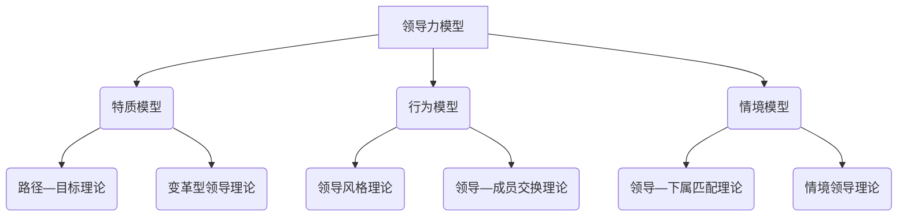

                 

# 《领导力与职业道德：树立正直形象》

> 关键词：领导力、职业道德、正直形象、团队发展、组织绩效

摘要：本文探讨了领导力与职业道德之间的紧密联系，以及如何在信息技术领域树立正直形象。通过对领导力的核心原则和职业道德的基本原则的深入分析，文章提出了一系列实践指南，帮助领导者建立正直的组织文化和个人形象。此外，本文还探讨了正直形象对组织绩效的积极影响，并通过案例研究和趋势分析，展望了直正领导力的未来发展。

---

## 第一部分：领导力的核心原则

在信息技术领域，领导力不仅仅是管理团队，更涉及到在复杂技术环境中激发团队潜能、实现技术创新和推动组织发展的能力。领导力的核心原则是我们探讨如何树立正直形象的基础。

### 1.1 领导力的定义与特质

#### 1.1.1 领导力的本质

领导力是一种能力，它涉及激励和引导他人朝着共同目标努力。在信息技术领域，领导力要求领导者不仅要有深厚的专业知识和技能，还要有良好的沟通能力和团队合作精神。领导力的本质在于通过影响力来推动变革和创新。

#### 1.1.2 领导力的四个核心特质

1. **诚实守信**：领导者必须具备高度的诚信，这是建立信任的基础。
2. **责任感**：领导者需要对自己的决策和行为负责，同时也对团队成员负责。
3. **激励能力**：领导者应能够激发团队成员的潜能，鼓励他们追求卓越。
4. **决策能力**：领导者需要在复杂的技术环境中做出明智的决策，以确保组织的长期发展。

### 1.2 领导力模型与应用

#### 1.2.1 权力基础理论

权力基础理论指出，领导者的影响力来源于不同的权力基础，包括合法性、奖励、专家知识和参照。在信息技术领域，领导者需要利用这些权力基础来建立自己的领导地位。

#### 1.2.2 领导风格与变革型领导

领导风格对团队的工作效率和员工满意度有重要影响。变革型领导强调领导者通过激励和启发来推动团队实现变革，这在信息技术领域尤为重要，因为技术变革和创新是持续推动组织发展的动力。

### 1.3 领导力发展策略

#### 1.3.1 自我领导力提升

自我领导力提升是领导者持续成长的关键。领导者需要通过自我反思、学习和实践来不断提高自己的领导能力。

#### 1.3.2 团队领导力培养

团队领导力培养是领导者的一项重要任务。通过培训、指导和反馈，领导者可以帮助团队成员提高专业能力和协作效率。

### 1.4 领导力与职业道德的联系

#### 1.4.1 职业道德在领导力中的体现

职业道德在领导力中有着重要的体现。一个正直的领导者会遵守职业伦理，维护组织的信誉，并在决策过程中考虑到道德和社会责任。

#### 1.4.2 直正领导力：挑战与机遇

直正领导力是一种挑战，因为领导者需要面对道德困境和压力。但同时，它也是一种机遇，因为正直的领导力能够增强组织的凝聚力和员工的忠诚度。

## 第二部分：职业道德的基本原则

职业道德是信息技术领域领导者必须遵循的基本准则。它不仅关乎个人信誉，更关系到组织的长远发展。

### 2.1 职业道德的核心概念

#### 2.1.1 职业道德的定义

职业道德是指在专业工作中遵循的道德规范和价值观。它包括诚实守信、公正无私、勤勉尽职等基本要求。

#### 2.1.2 职业道德的三大原则

1. **诚实守信**：领导者应始终保持诚实，不隐瞒事实，不欺骗他人。
2. **公正无私**：领导者应公平对待团队成员，避免偏私。
3. **勤勉尽职**：领导者应认真履行职责，不断提高自己的专业能力。

### 2.2 职业道德的法律与道德要求

#### 2.2.1 职业行为规范

职业行为规范是职业道德的具体体现，包括遵守公司政策、保护商业秘密和知识产权等。

#### 2.2.2 法律法规对职业道德的影响

法律法规对职业道德有着重要的影响。违反法律法规不仅会损害个人和组织的声誉，还会导致法律后果。

### 2.3 职业道德的实践与挑战

#### 2.3.1 职业道德困境案例分析

职业道德困境案例分析可以帮助我们理解在实际工作中如何应对道德挑战。

#### 2.3.2 职业道德的可持续性发展

职业道德的可持续性发展是组织长期成功的关键。领导者需要通过培训和教育来提高员工的职业道德水平。

### 2.4 职业道德教育的重要性

#### 2.4.1 职业道德教育的方法与策略

职业道德教育的方法和策略包括案例教学、角色扮演和职业道德课程等。

#### 2.4.2 职业道德教育的效果评估

职业道德教育的效果评估可以帮助我们了解培训的有效性，并持续改进教育方法。

## 第三部分：树立正直形象的实践指南

树立正直形象是领导者的重要任务。以下是一些实践指南，帮助领导者建立和维护正直的形象。

### 3.1 直正领导力的要素

#### 3.1.1 诚实守信

诚实守信是树立正直形象的基础。领导者应始终保持真诚，不隐瞒事实，不欺骗他人。

#### 3.1.2 坚守原则

领导者应坚守职业道德原则，不受利益诱惑，公正无私地处理事务。

#### 3.1.3 透明沟通

透明沟通是建立信任的关键。领导者应与团队成员保持开放和诚实的沟通，分享信息，倾听反馈。

### 3.2 建立正直的组织文化

#### 3.2.1 组织文化的定义与作用

组织文化是指组织内部共同遵循的价值观和行为准则。正直的组织文化能够增强组织的凝聚力和员工忠诚度。

#### 3.2.2 创造正直的工作环境

领导者应创造一个支持正直和透明的工作环境，鼓励员工表达意见和建议，并对不正当行为进行问责。

### 3.3 领导者如何在组织内树立正直形象

#### 3.3.1 领导者的角色与责任

领导者是组织文化和形象的塑造者，他们的行为对员工有重要影响。领导者应以身作则，树立正直的榜样。

#### 3.3.2 直正领导的实践案例

通过实践案例，我们可以了解如何在不同情境下树立正直形象。

### 3.4 直正领导力的测评与改进

#### 3.4.1 直正领导力的测评方法

测评直正领导力可以通过员工满意度调查、360度评估等方式进行。

#### 3.4.2 提升直正领导力的策略

提升直正领导力的策略包括加强职业道德教育、提供领导力培训和发展机会等。

## 第四部分：正直形象与组织绩效

正直形象对组织绩效有着重要影响。以下将探讨正直形象与组织绩效的关系，并分析成功树立正直形象的实践案例。

### 4.1 直正领导力与组织绩效的关系

#### 4.1.1 直正领导力对员工的影响

直正领导力能够增强员工的满意度和忠诚度，提高员工的工作积极性和绩效。

#### 4.1.2 直正领导力对组织绩效的推动作用

直正领导力能够提高组织的整体绩效，促进创新和团队合作，从而实现组织的长期成功。

### 4.2 案例研究：成功树立正直形象的实践

#### 4.2.1 企业成功树立正直形象的案例

通过分析成功树立正直形象的企业案例，我们可以了解其关键成功因素。

#### 4.2.2 案例中的关键成功因素

关键成功因素包括领导层的坚定决心、有效的沟通策略、完善的道德规范和持续的职业培训。

### 4.3 直正领导力的未来趋势

#### 4.3.1 直正领导力的社会影响力

随着社会对职业道德的重视，直正领导力将越来越受到关注。

#### 4.3.2 直正领导力的未来挑战与机遇

未来，直正领导力将面临新的挑战，包括技术变革和全球化带来的复杂环境。但同时也将迎来新的机遇，如通过技术创新提升领导力。

## 附录

### A.1 直正领导力相关资源与工具

#### A.1.1 学术研究资源

学术研究资源包括论文、书籍和在线课程等，可以帮助领导者深入了解直正领导力。

#### A.1.2 实践工具与方法

实践工具与方法包括领导力测评工具、职业道德培训课程等，可以帮助领导者提升直正领导力。

### A.2 直正领导力的发展趋势与展望

#### A.2.1 趋势分析

直正领导力的发展趋势包括对职业道德的重视、领导力培训的普及和技术创新的融合。

#### A.2.2 展望未来：直正领导力的未来发展

未来，直正领导力将更加注重技术和社会责任，成为组织成功的关键因素。

## 附录：Mermaid 流�程图与伪代码

### 附录：Mermaid 流程图

#### 领导力模型流程图


### 附录：直正领导力算法伪代码

```python
# 直正领导力算法伪代码

# 定义直正领导力指标
straight Leadership = {
    "诚实守信": bool,
    "坚守原则": bool,
    "透明沟通": bool
}

# 定义评估方法
def evaluate_leadership(leader):
    score = 0
    if leader["诚实守信"]:
        score += 1
    if leader["坚守原则"]:
        score += 1
    if leader["透明沟通"]:
        score += 1
    return score / 3

# 应用直正领导力算法
def apply_leadership(leader, team):
    leadership_score = evaluate_leadership(leader)
    if leadership_score > 0.7:
        team_performance = "优"
    elif leadership_score > 0.5:
        team_performance = "良"
    else:
        team_performance = "差"
    return team_performance
```

---

作者：AI天才研究院/AI Genius Institute & 禅与计算机程序设计艺术 /Zen And The Art of Computer Programming

