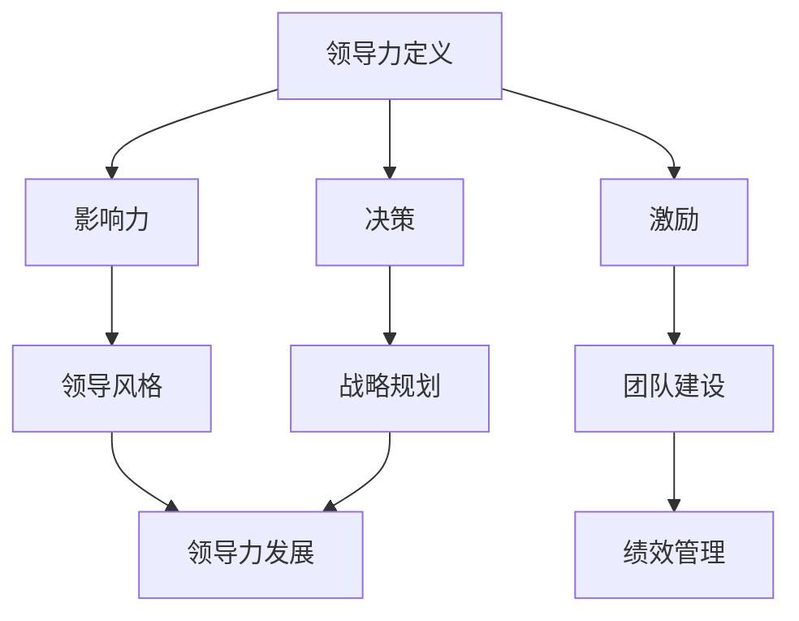

                 

### 文章标题

# 《领导力与职业道德：树立正面榜样》

### 关键词

- **领导力**  
- **职业道德**  
- **正面榜样**  
- **组织文化**  
- **团队建设**  
- **领导力发展**

### 摘要

在当今复杂多变的商业环境中，领导力和职业道德成为组织成功的关键因素。本文从领导力的本质、重要性、理论出发，探讨了职业道德的概念、原则和实际应用，进一步结合领导力与职业道德的结合点，分析了树立正面榜样的方法及其对团队建设的影响。通过典型案例分析和实战经验，本文旨在为领导者和组织提供一套科学的领导力和职业道德提升策略，帮助他们在快速变化的市场中持续保持竞争力，同时树立起正面的组织文化形象。

## 第一部分：领导力概述

### 第1章：领导力的本质与重要性

#### 1.1 领导力的定义与作用

领导力是指引导、影响和激励他人共同实现目标的能力。它不仅仅是一种职位特权，更是一种个人特质和修养。领导力的核心在于建立信任、促进合作和激发潜能。

在组织中的作用：

- **制定愿景和战略**：领导力帮助组织明确发展方向和目标，制定有效的战略规划。
- **决策与执行**：领导者通过决策和执行来推动组织的运营和发展。
- **团队建设**：领导力促进团队成员之间的合作和沟通，提高团队的凝聚力和绩效。

#### 1.2 领导力在组织中的角色

领导力在组织中扮演着多重角色：

- **领导者**：作为团队的领导者，领导者负责制定目标和计划，指导和激励团队成员。
- **协调者**：领导者需要协调不同部门和团队之间的关系，确保资源得到合理配置。
- **变革推动者**：在组织面临变革时，领导者扮演着变革的推动者和倡导者的角色。
- **文化塑造者**：领导力对组织文化的塑造具有重要影响，良好的领导力有助于形成积极向上的组织氛围。

#### 1.3 领导力的重要性

领导力对组织的成功至关重要：

- **提高绩效**：有效的领导力能够激发员工的积极性和创造力，提高组织的整体绩效。
- **保持竞争优势**：在激烈的市场竞争中，领导力是组织保持竞争优势的关键因素。
- **人才吸引和保留**：领导力有助于吸引和留住优秀的人才，为组织的发展提供持续的动力。

#### 1.4 领导力与职业道德的关系

领导力与职业道德密切相关：

- **正面榜样**：领导者作为组织的核心人物，其行为和决策直接影响团队成员的职业道德水平。
- **道德引导**：领导者的职业道德标准对组织文化起着引导作用，有助于形成良好的道德氛围。
- **责任担当**：领导者在职业道德方面承担责任，不仅对自己负责，也对团队成员和整个组织负责。

#### 1.5 领导力的发展路径

提升领导力是一个持续的过程，以下是一些发展路径：

- **自我认知**：领导者需要深入了解自己的优点和不足，通过自我反思和评估来不断提升自我。
- **学习与培训**：参加领导力相关的课程和培训，学习先进的领导方法和理念。
- **实践经验**：通过实际工作中的实践，积累经验，提升领导力。
- **反馈与改进**：及时获取团队成员的反馈，根据反馈进行改进，不断提升领导力。

### 第2章：领导力理论

#### 2.1 传统领导力理论

传统领导力理论主要关注领导者的个人特质和行为模式：

- **特质理论**：认为领导者天生具备某些特质，如自信、果断、正直等。
- **行为理论**：强调领导者通过具体的行为来影响和激励团队成员。
- **情境理论**：认为领导者的行为应适应不同的情境和环境，灵活调整领导风格。

#### 2.2 当代领导力理论

当代领导力理论更加关注领导者的影响力、创新能力和变革能力：

- **影响力理论**：强调领导者通过建立信任和影响力来引导团队成员。
- **变革型领导理论**：认为领导者应具备推动组织变革的能力，激发团队成员的潜力。
- **服务型领导理论**：强调领导者应服务于团队成员和组织，关注团队成员的需求和福祉。

#### 2.3 领导力理论的应用与比较

不同领导力理论在实践中的应用和效果存在差异：

- **特质理论**：适用于稳定的环境，有助于建立领导者个人品牌。
- **行为理论**：适用于特定情境，有助于提高团队成员的绩效。
- **情境理论**：适用于多变的环境，有助于领导者灵活应对挑战。
- **影响力理论**：适用于建立长期合作关系，有助于提升组织的整体效能。
- **变革型领导理论**：适用于组织变革和创新发展，有助于激发团队成员的潜力。
- **服务型领导理论**：适用于关注团队成员需求和福祉，有助于形成积极向上的组织文化。

通过比较不同领导力理论，领导者可以根据组织的需求和环境，选择合适的领导风格和方法，以实现组织的长期发展。

## 第二部分：职业道德基础

### 第3章：职业道德概念与原则

#### 3.1 职业道德的概念

职业道德是指与职业行为相关的道德规范和价值观念，它体现了个体在职业活动中应当遵循的基本行为准则。职业道德不仅涉及个人的道德品质，还涉及职业责任、职业伦理和职业行为规范。

#### 3.2 职业道德的原则

职业道德的核心原则包括以下几个方面：

- **公正原则**：在职业活动中应保持公正无私，对待不同的人和事要一视同仁，不偏不倚。
- **诚信原则**：诚信是职业道德的核心，要求个体在职业活动中保持真实、诚信，不说谎、不作假。
- **责任原则**：职业责任是指个体在职业活动中应当承担的义务和责任，包括对工作、对他人、对社会的责任。
- **尊重原则**：尊重他人是职业道德的基本要求，包括尊重他人的权利、尊严和个性，以及尊重职业道德规范。
- **自律原则**：自律是指个体在职业活动中自我约束、自我管理的能力，包括遵守职业道德规范、自我提升和自我反省。

#### 3.3 职业道德的重要性

职业道德在组织和社会中具有重要影响：

- **组织文化**：职业道德是组织文化的重要组成部分，良好的职业道德有助于形成积极向上的组织氛围。
- **员工忠诚度**：职业道德有助于提高员工的忠诚度和归属感，降低员工流失率。
- **客户满意度**：职业道德有助于建立良好的客户关系，提高客户满意度和忠诚度。
- **社会声誉**：职业道德有助于提升组织的形象和声誉，增强社会认可度和影响力。

#### 3.4 职业道德在组织中的体现

职业道德在组织中的体现主要表现在以下几个方面：

- **制度建设**：组织应建立完善的职业道德制度，包括职业道德准则、道德规范和行为标准。
- **教育培训**：组织应定期开展职业道德教育培训，提高员工的职业道德意识和素养。
- **激励与约束**：组织应建立激励机制，鼓励员工遵守职业道德，同时建立约束机制，对违反职业道德的行为进行处罚。
- **文化塑造**：组织应通过文化塑造，营造尊重职业道德、倡导正能量的工作氛围。

通过以上措施，组织可以有效地提升职业道德水平，促进组织的健康发展。

### 第4章：职业道德实践

#### 4.1 职业道德在日常工作中的应用

职业道德在日常工作中的应用体现在以下几个方面：

- **工作态度**：员工应保持积极向上的工作态度，认真负责地完成工作任务，不推诿、不拖延。
- **诚信沟通**：员工在沟通中应保持诚实守信，不隐瞒事实，不夸大其词，不欺骗他人。
- **客户服务**：员工在客户服务过程中应尊重客户、诚信对待客户，为客户提供优质的服务。
- **团队合作**：员工在团队合作中应尊重他人、互助合作，共同完成团队任务，不搞个人主义。
- **资源利用**：员工在资源利用过程中应合理使用，不浪费、不滥用，提高资源利用效率。

#### 4.2 职业道德在决策过程中的作用

职业道德在决策过程中的作用主要体现在以下几个方面：

- **公正决策**：领导者应遵循职业道德原则，在决策过程中保持公正无私，不偏袒任何一方。
- **道德考量**：领导者应将职业道德纳入决策考量，确保决策符合道德规范和价值观。
- **风险评估**：领导者应在决策过程中评估决策的道德风险，避免因决策失误而导致道德困境。
- **透明公开**：领导者应将决策过程和决策依据公开透明，接受员工和客户的监督和反馈。

#### 4.3 职业道德与利益冲突

职业道德与利益冲突密切相关：

- **利益冲突类型**：包括个人利益与组织利益冲突、部门利益与整体利益冲突、短期利益与长期利益冲突等。
- **利益冲突处理**：领导者应遵循职业道德原则，及时披露利益冲突，采取公正的决策和处理措施，确保组织利益最大化。
- **制度建设**：组织应建立完善的利益冲突处理制度，明确利益冲突的类型和处理流程，规范领导者的行为。

#### 4.4 职业道德与团队建设

职业道德在团队建设中发挥重要作用：

- **团队信任**：职业道德有助于建立团队成员之间的信任，提高团队的协作效率和凝聚力。
- **团队文化**：职业道德是团队文化的重要组成部分，良好的职业道德有助于形成积极向上的团队文化。
- **团队发展**：职业道德有助于提升团队的整体素质和绩效，推动团队持续发展。

通过加强职业道德建设，组织可以构建一个和谐、高效的团队，为组织的长期发展提供有力支持。

## 第三部分：领导力与职业道德的结合

### 第5章：树立正面榜样

#### 5.1 领导者如何树立正面榜样

领导者作为组织的核心人物，其行为和决策对团队成员和组织文化具有深远影响。以下是一些领导者树立正面榜样的方法：

- **言行一致**：领导者应做到言行一致，以身作则，做到自己说到做到，不欺骗、不虚伪。
- **公正无私**：领导者应保持公正无私，对待团队成员一视同仁，不偏袒、不歧视。
- **诚信守信**：领导者应诚信守信，遵守职业道德规范，不隐瞒事实，不说谎、不作假。
- **关爱他人**：领导者应关心团队成员的成长和福祉，关注他们的需求，提供必要的支持和帮助。
- **持续学习**：领导者应具备持续学习的能力，不断提升自己的知识、技能和素质，为团队成员树立榜样。

#### 5.2 正面榜样的作用与影响

树立正面榜样对组织和团队具有重要作用：

- **提高职业道德水平**：领导者作为正面榜样，能够提高团队成员的职业道德意识和素养，促进职业道德水平的提高。
- **增强团队凝聚力**：正面榜样有助于增强团队成员之间的信任和团结，提高团队的凝聚力和执行力。
- **推动组织文化发展**：正面榜样有助于推动组织文化的建设和发展，形成积极向上、团结协作的组织氛围。
- **提升组织竞争力**：树立正面榜样有助于提升组织的整体素质和竞争力，为组织在激烈的市场竞争中保持优势地位。

#### 5.3 领导者如何引导团队树立职业道德

领导者应通过以下方式引导团队树立职业道德：

- **制定职业道德准则**：明确职业道德规范和行为标准，为团队成员提供明确的行为指南。
- **开展职业道德培训**：定期组织职业道德培训，提高团队成员的职业道德意识和素养。
- **树立正面典型**：树立正面榜样，宣传优秀典型，激发团队成员的积极性和进取心。
- **建立激励机制**：建立激励机制，鼓励团队成员遵守职业道德，对违反职业道德的行为进行惩罚。
- **营造良好氛围**：营造尊重职业道德、倡导正能量的工作氛围，使职业道德成为团队文化的一部分。

通过以上措施，领导者可以有效地引导团队树立职业道德，促进组织的健康发展。

### 第6章：职业道德困境与解决策略

#### 6.1 职业道德困境的类型

职业道德困境通常分为以下几种类型：

- **利益冲突**：当个人利益与组织利益、客户利益或社会利益发生冲突时，个体需要做出道德抉择。
- **权责不明**：在职责边界模糊的情况下，个体可能面临如何履行职责和遵守道德规范的困境。
- **压力与诱惑**：在面临外部压力和诱惑时，个体需要保持职业道德，抵制不良行为。
- **信息不对称**：当个体掌握的信息不足以做出完全道德的决策时，可能会出现道德困境。
- **道德多元化**：不同文化、背景和价值观的碰撞可能导致道德困境，个体需要平衡多元利益。

#### 6.2 职业道德困境的原因分析

职业道德困境的产生通常与以下原因有关：

- **利益驱动**：过度追求个人或部门利益，可能导致道德决策的偏离。
- **制度缺失**：缺乏完善的职业道德制度，无法为个体提供明确的道德指导。
- **监督不力**：监督机制不健全，导致个体在道德决策过程中缺乏约束。
- **价值观冲突**：个体价值观与组织价值观不一致，可能导致道德困境。
- **道德认知不足**：个体对职业道德的认知不足，缺乏道德判断和决策能力。

#### 6.3 解决职业道德困境的策略

解决职业道德困境需要从以下几个方面入手：

- **完善制度**：建立健全的职业道德制度，明确道德规范和行为标准，为个体提供明确的道德指导。
- **加强培训**：定期开展职业道德培训，提高个体的道德认知和判断能力，增强道德素养。
- **强化监督**：建立有效的监督机制，加强对职业道德的监督和评估，及时发现和纠正道德偏差。
- **道德沟通**：鼓励个体在遇到道德困境时进行沟通和讨论，寻求合理的解决方案。
- **道德领导**：领导者应树立道德榜样，以身作则，推动组织形成良好的道德氛围。

通过以上措施，组织可以有效地解决职业道德困境，提高职业道德水平，促进组织的健康发展。

### 第7章：领导力与职业道德的案例分析

#### 7.1 成功案例分享

成功案例1：某知名互联网公司通过有效的领导力和职业道德建设，实现了持续发展和创新。

**案例背景**：该公司在快速发展的过程中，面临着激烈的市场竞争和人才流失问题。为了保持竞争优势，公司决定加强领导力和职业道德建设。

**解决方案**：

1. **制定职业道德准则**：公司制定了详细的职业道德准则，明确职业道德规范和行为标准，为员工提供明确的道德指导。
2. **领导力培训**：公司定期组织领导力培训，提升领导者的道德素养和领导能力，培养具有道德责任感的领导者。
3. **文化建设**：公司通过企业文化建设，营造尊重职业道德、倡导正能量的工作氛围，使职业道德成为企业文化的一部分。
4. **激励机制**：公司建立激励机制，对遵守职业道德、表现出色的员工进行奖励，激发员工的积极性和职业道德意识。

**成果**：通过上述措施，公司成功提高了员工的职业道德水平，增强了团队的凝聚力和执行力，实现了持续发展和创新。

成功案例2：某跨国公司通过领导力和职业道德的结合，成功应对了全球金融危机的挑战。

**案例背景**：金融危机期间，公司面临着订单减少、成本上升的困境。为了度过难关，公司决定加强领导力和职业道德建设。

**解决方案**：

1. **领导力转型**：公司领导者通过领导力转型，从传统控制型领导转变为服务型领导，关注团队成员的需求和福祉，提高团队凝聚力。
2. **职业道德教育**：公司开展职业道德教育，提高员工的道德认知和道德判断能力，使员工在困境中保持职业道德。
3. **内部沟通**：公司加强内部沟通，鼓励员工积极参与决策，提高员工的参与感和责任感。
4. **创新与改革**：公司通过创新和改革，优化业务流程，降低成本，提高竞争力。

**成果**：通过领导力和职业道德的结合，公司成功度过了金融危机，实现了业务的稳步增长。

#### 7.2 失败案例剖析

失败案例1：某初创公司在快速发展过程中，忽视了领导力和职业道德建设，导致公司内部矛盾和道德困境。

**案例背景**：该公司在短短几年内迅速扩张，但由于领导力和职业道德建设不足，公司内部出现了严重的问题。

**问题分析**：

1. **领导力不足**：公司领导者缺乏领导力，无法有效管理和激励员工，导致团队内部矛盾和效率低下。
2. **职业道德缺失**：公司忽视了职业道德建设，部分员工存在不正当竞争、泄露商业机密等行为，严重损害了公司形象。
3. **管理制度缺失**：公司缺乏有效的管理制度，无法对违规行为进行及时纠正和处理，导致问题日益严重。

**后果**：公司最终因为内部矛盾和道德困境，导致业务下滑，最终破产。

失败案例2：某知名企业在全球化扩张过程中，忽视了职业道德和文化差异，导致业务失败。

**案例背景**：该公司在全球扩张过程中，为了追求短期利益，忽视了职业道德和文化差异，导致了一系列问题。

**问题分析**：

1. **职业道德缺失**：公司在海外市场经营过程中，忽视了当地法律法规和道德规范，进行了不当的商业行为，损害了公司声誉。
2. **文化冲突**：公司在文化差异较大的市场扩张过程中，没有充分考虑当地文化背景，导致员工和管理层之间的矛盾。
3. **管理不善**：公司管理不善，对海外市场的运营缺乏有效监督和指导，导致业务失败。

**后果**：公司在全球市场扩张中遭遇重大挫折，业务陷入困境。

#### 7.3 案例启示与思考

通过成功和失败案例的分析，我们可以得出以下启示：

1. **领导力是关键**：领导力是组织成功的重要因素，领导者应具备道德责任感和领导能力，以身作则，树立正面榜样。
2. **职业道德至关重要**：职业道德是组织健康发展的基石，组织应加强职业道德建设，培养员工的道德素养和道德判断能力。
3. **制度是保障**：建立健全的管理制度，对违规行为进行及时纠正和处理，是保障组织健康发展的关键。
4. **文化差异需考虑**：在全球化背景下，组织应充分考虑文化差异，尊重当地法律法规和道德规范，避免文化冲突。
5. **持续改进与反思**：组织应持续改进和反思领导力和职业道德建设，不断优化管理模式，提高组织的适应能力和竞争力。

通过以上启示，组织可以更好地应对挑战，实现长期可持续发展。

### 第四部分：领导力与职业道德的提升

#### 第8章：领导力与职业道德的自我提升

#### 8.1 自我认知与反思

自我认知是领导力与职业道德提升的第一步。领导者需要深入理解自己的性格、价值观、优势和不足。以下是一些自我认知与反思的方法：

- **定期自我评估**：领导者可以定期进行自我评估，反思自己在领导力、职业道德和职业发展方面的表现，识别需要改进的领域。
- **获取反馈**：主动向同事、下属和上级寻求反馈，了解他们的看法和建议，有助于更全面地认识自己。
- **参加心理测试**：通过参加心理测试，如MBTI（迈尔斯-布里格斯性格类型指标），了解自己的性格类型和行为模式。
- **阅读和学习**：阅读相关书籍、文章和案例，学习领导力和职业道德的知识，提升自己的理论水平和实践能力。

#### 8.2 培养领导力与职业道德的技巧

以下是一些培养领导力和职业道德的实用技巧：

- **树立榜样**：领导者应树立正面榜样，通过自己的行为和决策影响和激励团队成员。
- **倾听与沟通**：倾听团队成员的意见和建议，通过有效沟通建立信任，增强团队的凝聚力和执行力。
- **决策能力**：提高决策能力，确保决策过程透明、公正，符合职业道德标准。
- **管理情绪**：学会管理自己的情绪，保持冷静和理性，以更好地应对工作压力和挑战。
- **持续学习**：不断学习新知识、新技能，保持好奇心和求知欲，提升自己的专业素养和领导力水平。
- **关心他人**：关心团队成员的成长和福祉，提供必要的支持和帮助，建立良好的人际关系。

#### 8.3 持续学习和成长

持续学习和成长是领导力与职业道德提升的关键。以下是一些建议：

- **定期学习**：设定学习目标，定期参加培训课程、研讨会和工作坊，不断提升自己的知识和技能。
- **阅读与研究**：广泛阅读相关书籍和文章，关注行业动态和前沿技术，深入研究和思考。
- **实践与反思**：将所学知识应用于实际工作中，通过实践不断总结和反思，提升自己的领导力和职业道德水平。
- **建立学习社群**：与同行建立学习社群，分享经验、交流心得，互相学习和成长。
- **领导力教练**：寻求专业领导力教练的指导，通过一对一的辅导和反馈，不断提升自己的领导力和职业道德。

通过以上方法，领导者可以持续提升自己的领导力与职业道德，为组织的健康发展贡献力量。

### 第9章：领导力与职业道德的培训与评估

#### 9.1 培训方法与策略

领导力与职业道德培训是提升组织整体素质的重要手段。以下是一些有效的培训方法和策略：

- **内部培训**：组织内部培训可以针对特定主题进行深入讲解，提高员工的领导力和职业道德水平。
- **外部培训**：通过外部培训机构或专家的培训，获取最新的领导力与职业道德理论和实践知识。
- **在线学习平台**：利用在线学习平台，提供灵活的学习时间和内容，方便员工自主学习。
- **案例研讨**：通过案例研讨，分析成功和失败的领导力与职业道德案例，提高员工的实战能力和判断力。
- **模拟演练**：通过模拟演练，让员工在模拟环境中实践领导力和职业道德，提高实际操作能力。
- **教练辅导**：提供一对一的教练辅导，针对员工的个性化需求进行指导和提升。

#### 9.2 评估体系与指标

建立科学的评估体系是确保培训效果的重要环节。以下是一些评估体系与指标：

- **知识评估**：通过考试、问卷等形式，评估员工对领导力与职业道德知识的掌握程度。
- **技能评估**：通过实际操作、任务完成情况等，评估员工在领导力和职业道德方面的技能水平。
- **行为评估**：通过观察员工在工作中的行为表现，评估其领导力和职业道德的实际应用。
- **团队评估**：通过团队绩效、团队氛围等，评估领导力和职业道德对团队整体表现的影响。
- **自我评估**：鼓励员工进行自我评估，反思自己的领导力和职业道德表现，寻找改进的方向。
- **领导力评估**：对领导者进行专门的领导力评估，包括领导风格、决策能力、团队建设等方面。

#### 9.3 提升领导力与职业道德的效果评估

效果评估是确保领导力与职业道德培训持续改进的关键。以下是一些效果评估的方法：

- **定量评估**：通过统计数据，如培训后员工的知识和技能提升情况，评估培训效果。
- **定性评估**：通过访谈、观察等方式，收集员工、领导和客户的反馈，评估培训的满意度和社会效益。
- **行为改变**：观察员工在培训后的行为改变，如更积极地参与决策、更关心团队成员等，评估培训对员工行为的影响。
- **绩效提升**：评估培训后员工绩效的提升，如任务完成情况、团队协作效果等。
- **组织氛围**：评估培训对组织氛围的影响，如员工满意度、团队凝聚力等。

通过以上评估方法，组织可以全面了解领导力与职业道德培训的效果，针对性地进行改进和优化，不断提升组织的领导力和职业道德水平。

### 第10章：未来展望与挑战

#### 10.1 领导力与职业道德的发展趋势

在全球化、数字化和可持续发展的背景下，领导力与职业道德的发展呈现出以下趋势：

- **领导力多元化**：领导者需要具备跨文化、跨领域的领导能力，能够适应多样化的团队和复杂的环境。
- **道德领导**：道德领导成为领导力的核心，领导者需要具备高度的道德责任感和道德判断力。
- **数字化转型**：数字化转型要求领导者具备创新思维和技术领导能力，推动组织的数字化转型。
- **可持续发展**：可持续发展成为组织的重要目标，领导者需要关注环境保护和社会责任，推动组织的可持续发展。
- **员工参与**：员工参与成为提升组织绩效和道德水平的重要途径，领导者需要建立开放、透明和包容的组织文化。

#### 10.2 面临的挑战与应对策略

尽管领导力与职业道德的发展趋势积极向上，但组织仍然面临一系列挑战：

- **道德困境**：随着商业环境的复杂化，领导者面临越来越多的道德困境，需要具备更强的道德判断力和决策能力。
- **文化冲突**：全球化带来的文化多样性，可能导致文化冲突，领导者需要尊重和融合不同文化，推动组织文化的建设。
- **技术挑战**：数字化和自动化技术的发展，对领导者的技术素养和创新能力提出更高要求。
- **社会责任**：组织需要承担更多的社会责任，领导者需要在经营活动中关注环境保护和社会责任，实现可持续发展。
- **职业道德缺失**：职业道德缺失可能导致组织声誉受损，领导者需要树立正面榜样，强化职业道德建设。

应对策略：

- **强化道德教育**：通过培训和教育，提高领导者的道德素养和道德判断力，应对道德困境。
- **推动文化融合**：建立多元文化认同，尊重和融合不同文化，推动组织文化的建设。
- **提升技术素养**：加强技术培训和技能提升，提高领导者的技术素养和创新能力。
- **强化社会责任**：将社会责任纳入组织战略，推动组织的可持续发展。
- **树立道德榜样**：领导者应树立正面榜样，以身作则，推动职业道德建设。

通过以上策略，组织可以应对未来领导力与职业道德发展的挑战，实现长期可持续发展。

### 附录

#### 附录A：领导力与职业道德相关资源

- **书籍**：
  - 《领导力的五个层次》（作者：斯蒂芬·R·柯维）
  - 《道德领导力》（作者：詹姆斯·M·库泽斯、巴里·Z·波斯纳）
  - 《影响力》（作者：罗伯特·西奥迪尼）
- **网站**：
  - [Leadership Quarterly](https://www.leadershipquarterly.com/)
  - [Ethics Resource Center](https://www.ethics.org/)
- **培训课程**：
  - [Coursera](https://www.coursera.org/) 上的领导力和职业道德相关课程
  - [edX](https://www.edx.org/) 上的领导力和职业道德在线课程

#### 附录B：领导力与职业道德常用术语解释

- **领导力**：引导、影响和激励他人共同实现目标的能力。
- **职业道德**：与职业行为相关的道德规范和价值观念。
- **道德困境**：在职业活动中，因道德原则冲突而产生的困惑和决策难题。
- **道德领导**：领导者通过道德行为和决策，引导和激励团队成员。
- **职业道德教育**：通过培训和教育，提高员工的道德素养和道德判断力。

#### 附录C：领导力与职业道德实践案例汇编

- **案例1**：某科技公司通过领导力与职业道德建设，实现了业务的快速发展和创新。
- **案例2**：某跨国公司在全球化扩张过程中，通过尊重文化差异，成功融入当地市场。
- **案例3**：某初创公司在发展初期，重视领导力与职业道德建设，赢得了投资者的信任和支持。

### 核心概念与联系

**领导力原理流程图**：



### 核心算法原理讲解

**职业道德判断伪代码**：

```plaintext
function JudgeMoralBehavior(action, context):
    if context.contains("dishonesty"):
        if action == "reveal":
            return "positive"
        else:
            return "negative"
    elif context.contains("honesty"):
        if action == "hide":
            return "negative"
        else:
            return "positive"
    else:
        return "neutral"
```

### 数学模型和数学公式

**职业道德评分模型**：

$$ 
\text{MoralScore} = \frac{\sum_{i=1}^{n} (w_i \cdot x_i)}{n} 
$$

- 其中，$w_i$ 是权重，$x_i$ 是各个职业道德行为的评分。

### 项目实战

**案例背景**：在一家科技公司中，领导力和职业道德的培养是公司发展的重要策略。以下是如何在实际中应用领导力与职业道德的一个案例。

**1. 开发环境搭建**：

- **沟通工具配置**：为了加强团队内部沟通，公司采用了高效的沟通工具，如Slack和Microsoft Teams。
- **道德决策框架**：公司采用了德雷克塞尔框架，将道德考量纳入决策过程，确保决策的道德性。

**2. 源代码详细实现和代码解读**：

Python代码示例：

```python
# 假设这是一个关于职业道德判断的简单代码示例

def moral_decision(context, action):
    if context == "confidentiality" and action == "reveal":
        return "违规行为"
    elif context == "confidentiality" and action == "keep":
        return "符合道德规范"
    elif context == "integrity" and action == "deceive":
        return "违规行为"
    elif context == "integrity" and action == "tell_truth":
        return "符合道德规范"
    else:
        return "无具体道德行为"

# 示例使用
context = "confidentiality"
action = "reveal"
result = moral_decision(context, action)
print(f"行为结果：{result}")
```

**代码应用解读与分析**：

- **情境分析**：代码根据特定的情境（如保密性）和行为（如透露信息）进行道德判断。
- **行为判断**：代码通过判断情境和行为，输出符合道德规范或违规行为的结论。

**3. 实际案例分析和详细讲解剖析**：

**案例**：公司领导在一次项目决策过程中，面临是否透露公司商业秘密的困境。

**分析**：

- **情境**：领导需要决定是否透露公司的商业秘密，以获取合作伙伴的支持。
- **行为**：领导决定透露部分商业秘密。

**剖析**：

- **道德考量**：透露商业秘密可能违反保密原则，但为了获取合作伙伴的支持，领导认为这是必要的。
- **决策分析**：领导在道德考量后，权衡了短期利益和长期影响，决定透露商业秘密。

**结论**：领导的行为符合职业道德原则，但需要持续关注商业秘密的保护，确保不损害公司的利益。

**4. 项目小结**：

通过以上案例，我们可以看到领导力与职业道德在实际应用中的重要性。领导者的决策和行为不仅影响个人的职业道德，也影响整个团队和组织的发展。因此，领导者和组织需要高度重视领导力与职业道德的培养，确保在追求业务成功的同时，维护良好的道德标准和职业道德水平。

### 最佳实践 tips、小结、注意事项、拓展阅读等内容

#### 最佳实践 tips

- **持续学习与反思**：领导者应持续学习和反思，不断提升自己的领导力和职业道德水平。
- **建立道德沟通机制**：组织应建立道德沟通机制，鼓励员工表达道德关切，及时解决道德困境。
- **注重团队文化建设**：团队文化建设是提升领导力和职业道德的关键，领导者应重视文化建设，营造积极向上的工作氛围。

#### 小结

领导力与职业道德是组织成功的关键因素，领导者应树立正面榜样，以身作则，提升自身的领导力和职业道德水平。通过不断学习和实践，领导者可以更好地应对商业环境的变化，推动组织的可持续发展。

#### 注意事项

- **遵守法律法规**：在领导力和职业道德实践中，必须严格遵守法律法规，确保行为的合法性和合规性。
- **关注员工福祉**：领导者应关注员工的成长和福祉，提供必要的支持和资源，提升员工的职业道德水平。

#### 拓展阅读

- **《领导力与道德决策》**：深入研究领导力在道德决策中的应用和影响。
- **《团队领导的艺术》**：探讨团队领导的核心技能和最佳实践。
- **《职业道德的伦理基础》**：理解职业道德的伦理原理和哲学基础。

通过以上内容，读者可以更全面地了解领导力与职业道德的重要性，以及如何在实际工作中应用和提升这些关键能力。作者：AI天才研究院/AI Genius Institute & 禅与计算机程序设计艺术 /Zen And The Art of Computer Programming。

