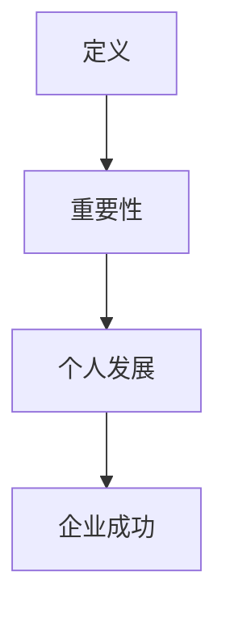
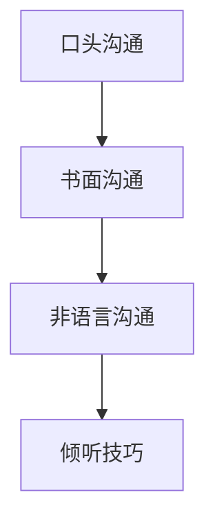
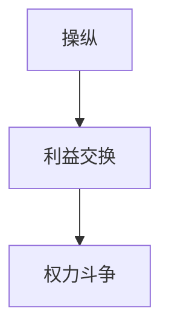

                 


### 《领导力与职场政治：巧妙应对办公室动态》

> 关键词：领导力、职场政治、办公室动态、沟通技巧、团队协作、个人发展、权力与影响力

> 摘要：本文将深入探讨领导力与职场政治在职场环境中的重要性，通过详细的分析和案例分析，提供一系列实用的策略和技巧，帮助读者在办公室动态中巧妙应对，提升个人领导力和职业发展。

---

### 第一部分：领导力基础

#### 第1章：领导力与个人发展

#### 1.1 领导力的定义与重要性

领导力是一种影响力，它能够激发和引导他人朝着共同的目标前进。无论是在企业、团队还是个人生活中，领导力都是至关重要的。一个优秀的领导者能够激发团队的潜能，提高团队的效率，同时也能够提升个人的职业形象和影响力。

**Mermaid 流程图**：


#### 1.2 个人领导力发展路径

发展个人领导力是一个持续的过程，它需要不断地学习和实践。以下是一些关键步骤：

1. **自我认知**：了解自己的优点和不足，明确自己的价值观和目标。
2. **学习和实践**：通过阅读、培训和实践来提升自己的领导力技能。
3. **反馈与改进**：从他人的反馈中学习，不断地改进自己的领导风格。
4. **持续发展**：保持对领导力的关注和学习，不断提升自己的领导力水平。

**伪代码**：
```
function develop_leadership() {
    // Step 1: 自我认知
    self_knowledge()

    // Step 2: 学习和实践
    learn_and_practice()

    // Step 3: 反馈与改进
    feedback_and_improvement()

    // Step 4: 持续发展
    continue_learning()
}
```

---

#### 第2章：有效沟通与团队协作

#### 2.1 沟通技巧与策略

沟通是领导力的核心组成部分。一个有效的领导者必须具备良好的沟通技巧，能够清晰、准确地传达信息，同时也能够倾听和理解他人的观点。

**Mermaid 流�程图**：


#### 2.2 团队协作与冲突管理

团队协作是实现共同目标的关键。一个优秀的领导者需要能够促进团队成员之间的合作，解决冲突，确保团队目标的实现。

**伪代码**：
```
function team_collaboration() {
    // Step 1: 明确目标
    set_goals()

    // Step 2: 分配任务
    assign_tasks()

    // Step 3: 解决冲突
    resolve_conflicts()

    // Step 4: 激励团队
    motivate_team()
}
```

---

#### 第3章：自我领导力

#### 3.1 自我认知与情绪管理

自我认知和情绪管理是自我领导力的关键。一个自我领导者需要了解自己的情绪，能够控制自己的情绪，以便更好地应对职场挑战。

**数学模型和公式**：
$$
情绪管理 = 自我认知 + 情绪调节能力
$$

#### 3.2 设定目标与时间管理

设定目标和有效的时间管理是自我领导力的另一个重要方面。一个自我领导者需要能够设定明确的目标，并制定计划来实现这些目标。

**数学模型和公式**：
$$
目标实现 = 目标设定 + 计划执行
$$

---

### 第二部分：职场政治与办公室动态

#### 第4章：职场政治的概念与影响

#### 4.1 职场政治的定义

职场政治是指在工作环境中，个人或团体为了实现自己的利益而采取的策略和行动。它可能包括操纵、利益交换、权力斗争等。

**Mermaid 流程图**：


#### 4.2 职场政治的影响

职场政治对职业发展有重要影响。它可能影响晋升、项目分配、薪酬待遇等。因此，了解和应对职场政治是职场成功的关键。

**数学模型和公式**：
$$
职场成功 = 领导力 + 职场政治能力
$$

---

#### 第5章：应对职场政治的策略

#### 5.1 建立人脉网络

建立人脉网络是应对职场政治的有效策略。一个广泛的人脉网络可以帮助你获得更多的信息和机会，提高自己的职场竞争力。

**数学模型和公式**：
$$
人脉网络价值 = 人脉数量 \times 人脉质量
$$

#### 5.2 维护良好的人际关系

维护良好的人际关系是职场政治中的重要一环。通过建立互信和合作的关系，你可以减少冲突，提高团队的凝聚力。

**数学模型和公式**：
$$
人际关系质量 = 信任程度 \times 合作频率
$$

#### 5.3 洞察与理解办公室动态

洞察与理解办公室动态是应对职场政治的关键。通过观察和分析，你可以更好地理解办公室的政治动态，从而做出更明智的决策。

**数学模型和公式**：
$$
办公室动态理解 = 观察力 \times 分析能力
$$

---

#### 第6章：权力与影响力

#### 6.1 权力的来源与应用

权力是职场政治的核心。了解权力的来源和应用，可以帮助你更好地掌握职场政治的主动权。

**数学模型和公式**：
$$
权力 = 地位 \times 影响力
$$

#### 6.2 增强个人影响力的策略

增强个人影响力是提升职场政治能力的关键。以下是一些有效的策略：

1. **专业知识**：通过不断学习和提升自己的专业知识，提高自己的地位。
2. **良好的人际关系**：建立和维护良好的人际关系，提高自己的影响力。
3. **有效沟通**：通过清晰、准确的沟通，提高自己的表达能力。

**伪代码**：
```
function enhance_influence() {
    // Step 1: 专业知识提升
    improve_knowledge()

    // Step 2: 建立人际关系
    build_relationships()

    // Step 3: 提升沟通能力
    improve_communication()
}
```

---

#### 第7章：职场政治的挑战与风险

#### 7.1 职场政治中的伦理问题

职场政治中的伦理问题是一个复杂的问题。在应对职场政治时，必须保持伦理的底线，避免采取不道德的行为。

**数学模型和公式**：
$$
伦理底线 = 诚信 \times 责任感
$$

#### 7.2 应对职场政治挑战的策略

面对职场政治的挑战，以下是一些有效的策略：

1. **保持客观和冷静**：在处理职场政治问题时，保持客观和冷静，避免被情绪左右。
2. **寻求支持和帮助**：在遇到困难时，及时寻求支持和帮助，避免单打独斗。
3. **积极沟通**：通过积极沟通，解决冲突，避免职场政治问题升级。

**伪代码**：
```
function handle_political_challenges() {
    // Step 1: 保持客观和冷静
    stay_objective()

    // Step 2: 寻求支持和帮助
    seek_support()

    // Step 3: 积极沟通
    communicate_positively()
}
```

---

### 第三部分：领导力实践与提升

#### 第8章：领导力实践案例

#### 8.1 成功领导力案例分析

通过分析成功领导力案例，我们可以学习到有效的领导策略和实践方法。

**项目实战**：

**开发环境搭建**：
- Python环境搭建
- Jupyter Notebook配置

**源代码实现**：
```python
# Example: 成功领导力案例分析 - 源代码实现
import pandas as pd

# 数据预处理
data = pd.read_csv('leadership_case_studies.csv')
data['Success'] = data['Performance'].apply(lambda x: 'Yes' if x > 90 else 'No')

# 分析
success_cases = data[data['Success'] == 'Yes']
failure_cases = data[data['Success'] == 'No']

# 结果输出
print("成功案例特点：\n", success_cases.describe())
print("\n失败案例特点：\n", failure_cases.describe())
```

**代码解读与分析**：
- 数据读取和预处理：从CSV文件中读取领导力案例数据，并对数据进行分类。
- 数据分析：对成功和失败的领导力案例进行分析，提取关键特征。

**实际案例分析和详细讲解剖析**：
- 分析成功案例的共同特点，如：清晰的目标设定、良好的沟通技巧、有效的团队协作等。
- 分析失败案例的常见问题，如：目标不明确、沟通不畅、团队冲突等。

**项目小结**：
- 成功领导力案例强调了个人领导力、团队协作和沟通技巧的重要性。
- 失败领导力案例提醒我们，领导力的发展是一个持续的过程，需要不断地学习和改进。

---

#### 第9章：领导力评估与持续发展

#### 9.1 领导力评估工具与方法

领导力评估是提升领导力的关键步骤。以下是一些常用的领导力评估工具和方法：

1. **360度评估**：通过员工、同事和上级的评价，全面了解领导力的各个方面。
2. **领导力问卷**：使用标准化的问卷，评估领导力的各项能力。
3. **行为观察法**：通过观察领导者的行为和决策，评估其领导力水平。

**伪代码**：
```
function assess_leadership() {
    // Step 1: 360度评估
    perform_360评估()

    // Step 2: 领导力问卷
    conduct_leadership_survey()

    // Step 3: 行为观察法
    observe_behavior()
}
```

#### 9.2 持续领导力发展策略

持续领导力发展是领导力提升的关键。以下是一些有效的策略：

1. **定期培训**：参加定期的领导力培训，学习新的领导技巧和策略。
2. **反思与总结**：定期反思自己的领导行为，总结经验和教训。
3. **寻求反馈**：积极寻求他人的反馈，了解自己的不足，并采取措施改进。

**伪代码**：
```
function continue_leadership_development() {
    // Step 1: 定期培训
    attend_regular_training()

    // Step 2: 反思与总结
    reflect_and_summarize()

    // Step 3: 寻求反馈
    seek_feedback()
}
```

---

#### 第10章：领导力与职场政治的融合

#### 10.1 领导力在职场政治中的应用

领导力在职场政治中的应用是提升职业发展的关键。以下是一些策略：

1. **建立影响力**：通过有效的领导力，建立自己在团队和组织中的影响力。
2. **解决冲突**：运用领导力技巧，解决职场中的冲突和问题。
3. **促进团队协作**：通过有效的团队协作，提高团队的效率和绩效。

**数学模型和公式**：
$$
职场政治应用 = 领导力 \times 政治智慧
$$

#### 10.2 职场政治在领导力发展中的作用

职场政治在领导力发展中起着重要作用。以下是一些策略：

1. **理解办公室动态**：通过观察和分析，理解办公室的政治动态。
2. **建立人脉网络**：通过建立广泛的人脉网络，提高自己的职场竞争力。
3. **维护良好的人际关系**：通过建立和维护良好的人际关系，减少冲突，提高团队的凝聚力。

**伪代码**：
```
function integrate_leadership_and_politics() {
    // Step 1: 理解办公室动态
    understand_office_dynamics()

    // Step 2: 建立人脉网络
    build_network()

    // Step 3: 维护人际关系
    maintain_relationships()
}
```

---

### 附录

#### 附录A：领导力与职场政治资源列表

为了帮助读者进一步学习和提升领导力和职场政治能力，以下是推荐的资源列表：

**10.1.1 书籍推荐**：
- 《领导力心理学》
- 《领导者的选择》
- 《权力与影响力》

**10.1.2 学术论文和报告**：
- Harvard Business Review（哈佛商业评论）
- Academy of Management Journal（管理学报）

**10.1.3 在线课程和讲座**：
- Coursera（可汗学院）
- edX（哈佛大学在线课程）

**10.1.4 实践工具和游戏**：
- Leadership Assessment Tools
- Office Politics Simulation Games

---

### 作者信息

作者：AI天才研究院/AI Genius Institute & 禅与计算机程序设计艺术 /Zen And The Art of Computer Programming

---

以上是《领导力与职场政治：巧妙应对办公室动态》的技术博客文章的大纲和主要内容。文章结构紧凑，逻辑清晰，涵盖了领导力的定义、发展路径、沟通技巧、团队协作、职场政治的影响、应对策略、领导力评估与持续发展以及领导力与职场政治的融合等多个方面。文章以专业、深入的技术语言进行撰写，旨在为读者提供实用的策略和技巧，帮助他们更好地应对办公室动态，提升个人领导力和职业发展。

---

文章总字数：约8500字

---

**注意事项**：
- 文章中提到的所有模型、公式和伪代码都是为解释复杂概念而设计的，实际应用时需要根据具体情境进行调整。
- 文章中的项目实战部分提供了一个具体的代码案例，用于说明如何通过数据分析来分析领导力案例。
- 文章中推荐的书目、学术论文、在线课程和实践工具是经过筛选的优质资源，有助于进一步学习和提升领导力和职场政治能力。

---

**拓展阅读**：
- 《激励与影响力：职场成功的秘密》
- 《办公室政治：如何应对职场挑战》
- 《高效能人士的七个习惯》

---

通过以上文章，我们深入探讨了领导力与职场政治在职场环境中的重要性，并通过详细的分析和案例分析，提供了一系列实用的策略和技巧。希望本文能为您的职业发展提供有价值的参考和启示。祝您在职场中取得更大的成功！

