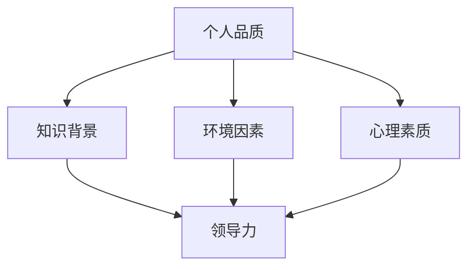
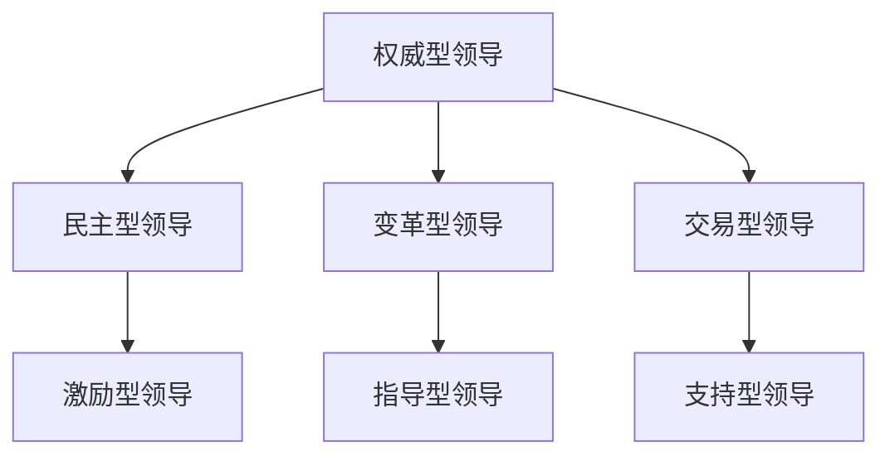
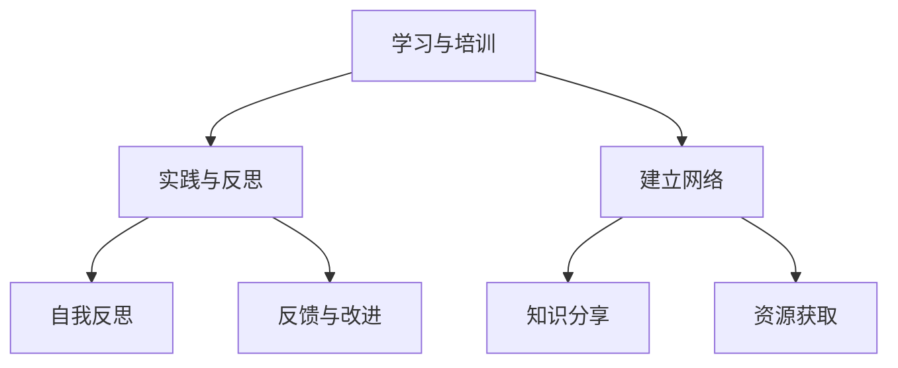

                 

### 文章标题

# 《领导力与自我管理：以身作则的力量》

### 关键词

- 领导力
- 自我管理
- 以身作则
- 团队建设
- 沟通技巧
- 激励与领导风格

### 摘要

本文深入探讨了领导力和自我管理的核心概念，强调了以身作则的重要性。通过对领导力的本质、以身作则的方法、自我管理的策略以及领导力实践与案例分析等多个方面的详细解析，本文为读者提供了实用的领导力提升方案，并指出了未来领导力与自我管理的发展趋势。文章旨在帮助领导者更好地理解并应用这些原则，以实现个人与团队的共同成长。

## 第一部分：领导力核心概念与理念

### 第1章：领导力的本质与重要性

#### 1.1 领导力的定义与范畴

领导力是一种影响力和引导他人共同实现目标的能力。它不仅涉及个人魅力和智慧，还涉及到对团队成员的激励、引导和协调。领导力的范畴包括个人领导、团队领导和组织领导。

- **个人领导**：指的是领导者个人的能力和行为，如领导风格、沟通技巧和决策能力。
- **团队领导**：强调领导者如何影响和协调团队成员，以实现团队目标。
- **组织领导**：涉及领导者如何对整个组织进行战略性管理和变革。

#### 1.2 领导力的作用与意义

领导力在组织中的重要作用包括：

- **指明方向**：领导力帮助组织设定目标并指明实现这些目标的路径。
- **激励团队**：有效的领导力可以激发团队成员的工作热情，提高工作效率。
- **解决问题**：领导力能够帮助团队快速有效地应对各种挑战和困难。

#### 1.3 领导力的发展历程

领导力的发展历程可以分为以下几个阶段：

- **传统领导力**：强调权威和命令。领导者通过职位和权力来指挥下属。
- **现代领导力**：强调关系和合作。领导者更注重与团队成员的互动和沟通，鼓励团队参与决策。
- **当代领导力**：强调创新和变革。领导者需要具备适应变化和创新思维的能力，推动组织不断进步。

#### 1.4 领导力与管理的区别

领导力与管理有密切关系，但两者有本质区别：

- **管理**侧重于规划和执行，如制定计划、分配资源和监督进度。
- **领导力**侧重于激励和引导，如建立愿景、激发热情和建立信任。

通过以上对领导力的定义、作用、发展历程和与管理的区别的详细分析，我们可以更好地理解领导力的本质和重要性。领导力不仅是领导者个人的能力，更是组织成功的关键因素。

#### 1.5 领导力的影响因素

领导力的影响因素包括以下几个方面：

- **个人品质**：领导者的个人品质，如诚实、正直和责任心，直接影响其领导力。
- **知识背景**：领导者的知识水平和管理经验对其领导力有重要影响。
- **环境因素**：组织的环境、文化和社会背景也会对领导力产生影响。
- **心理素质**：领导者的心理素质，如自信心和情绪稳定性，对领导力有重要影响。

**Mermaid 流程图：领导力影响因素架构**

#### 1.6 领导力的类型与模型

领导力可以分为不同的类型和模型，每种类型和模型都有其独特的特点和适用场景：

- **权威型领导**：领导者通过职位和权力来指挥下属，强调命令和控制。
- **民主型领导**：领导者鼓励团队成员参与决策，尊重团队成员的意见和建议。
- **变革型领导**：领导者通过激发团队成员的潜能，推动团队实现变革和创新。
- **交易型领导**：领导者通过奖励和惩罚来激励团队成员，强调绩效和结果。

**Mermaid 流程图：领导力类型与模型架构**

#### 1.7 领导力的发展与提升

领导力的发展与提升是一个持续的过程，需要领导者不断地学习、实践和反思。以下是一些提升领导力的方法和策略：

- **学习与培训**：参加领导力相关的课程和培训，学习新的知识和技能。
- **实践与反思**：在实际工作中应用所学知识，通过反思和总结来不断提升领导力。
- **建立网络**：与他人交流和分享经验，建立广泛的社交网络，以获取更多的资源和机会。

**Mermaid 流程图：领导力提升方法与策略架构**

通过对领导力的本质、作用、发展历程、区别、影响因素、类型与模型以及发展与提升的详细探讨，我们可以更好地理解领导力的核心概念，并掌握提升领导力的方法和策略。这将为领导者的个人成长和团队的成功奠定坚实的基础。

### 第2章：以身作则：领导力的关键

#### 2.1 以身作则的理念

以身作则是一种通过个人行为来影响和激励团队成员的领导方式。它强调领导者要用自己的行为来证明自己的信念和价值观，为团队成员树立榜样。以身作则的理念认为，领导者通过自身的言行一致，可以增强团队的凝聚力，提高团队的执行力和工作效率。

#### 2.2 如何做到以身作则

要做到以身作则，领导者需要从以下几个方面入手：

1. **坚持原则**：领导者要在言行中始终坚持自己的原则和价值观，做到言行一致。这需要领导者具备坚定的信念和高度的自律能力。

2. **保持一致**：领导者的言行要保持一致，以树立权威。领导者要对自己的行为进行严格的自我约束，避免出现前后矛盾的情况。

3. **身教重于言传**：领导者要通过实际行动来示范如何完成任务和处理问题。领导者要以身作则，带头完成任务，处理问题，以实际行动来影响和激励团队成员。

#### 2.3 以身作则对团队的影响

以身作则对团队的影响是深远的，它可以从以下几个方面来体现：

1. **提高团队凝聚力**：领导者的以身作则可以增强团队成员之间的信任和尊重，提高团队的凝聚力。

2. **提高团队执行力**：领导者的以身作则可以激发团队成员的工作热情和责任感，提高团队的执行力。

3. **增强团队信任感**：领导者的以身作则可以赢得团队的信任和尊重，增强团队的信任感。

#### 2.4 以身作则的具体实践

以下是一些以身作则的具体实践方法：

1. **培养良好的工作习惯**：领导者要培养良好的工作习惯，如准时上下班、认真完成任务等。

2. **积极参与团队活动**：领导者要积极参与团队活动，与团队成员建立良好的关系。

3. **树立正面形象**：领导者要通过自己的言行来树立正面的形象，以影响和激励团队成员。

4. **面对挑战时保持坚定**：领导者要面对挑战时保持坚定，勇于承担责任，以激励团队成员。

#### 2.5 以身作则的实际案例

以下是一个以身作则的实际案例：

某公司CEO张总，在工作中始终坚持自己的原则和价值观。他要求团队成员准时上下班，自己却经常提前到公司，最后一个离开。他对待团队成员一视同仁，无论职位高低，都给予尊重和关心。在一次公司面临重大挑战时，张总亲自带领团队加班，通过自己的实际行动激励了整个团队。最终，团队成功克服了困难，赢得了客户的好评。

通过以上对以身作则的理念、方法、影响和具体实践的探讨，我们可以看到，以身作则是一种非常有效的领导方式。领导者通过以身作则，可以树立榜样，影响和激励团队成员，从而提高团队的凝聚力和执行力，实现团队的目标。以身作则不仅是领导力的关键，也是领导者个人魅力和影响力的体现。

### 第3章：自我管理：领导力的基础

#### 3.1 自我管理的定义与重要性

自我管理是指领导者通过自我认知、自我激励和自我调节等方式，对自己的行为、情绪和目标进行管理的过程。自我管理的重要性体现在以下几个方面：

1. **提高工作效率**：通过自我管理，领导者可以更好地规划自己的时间和任务，提高工作效率。

2. **保持情绪稳定**：自我管理有助于领导者保持情绪稳定，避免因情绪波动而影响决策和工作。

3. **实现个人目标**：自我管理可以帮助领导者明确自己的长期和短期目标，并制定实现这些目标的计划和策略。

4. **增强团队信任**：领导者通过自我管理，可以树立良好的榜样，增强团队的信任和尊重。

#### 3.2 如何进行有效的自我管理

以下是一些有效的自我管理策略：

1. **明确目标**：领导者要明确自己的长期和短期目标，并制定可行的计划。目标要具体、明确，以便于实施和衡量。

2. **管理时间**：领导者要学会合理分配时间，确保关键任务的优先处理。可以使用时间管理工具，如日程表和待办事项列表。

3. **情绪管理**：领导者要学会控制自己的情绪，以保持冷静和理智。可以通过运动、冥想和休息等方式来缓解压力。

4. **持续学习**：领导者要不断学习新知识和技能，以适应不断变化的工作环境。可以通过阅读、参加培训和交流等方式来提升自己。

5. **反思与调整**：领导者要定期进行自我反思，总结自己的优点和不足，并制定改进计划。

#### 3.3 自我管理中的常见问题与解决策略

在自我管理过程中，领导者可能会遇到以下问题：

1. **时间管理问题**：难以合理安排时间，导致任务延误。

   - 解决策略：制定详细的时间表，明确每个任务的优先级，并设定固定的完成时间。

2. **情绪管理问题**：情绪波动大，影响决策和工作。

   - 解决策略：学会情绪调节技巧，如深呼吸、冥想和运动，以保持情绪稳定。

3. **目标设定问题**：目标不明确或不具体，难以实现。

   - 解决策略：明确目标，制定具体、可衡量的行动计划。

4. **持续学习问题**：难以持续学习和提升。

   - 解决策略：设定学习目标，制定学习计划，并定期评估学习效果。

通过以上对自我管理的定义、重要性、策略和常见问题的探讨，我们可以看到，自我管理是领导力的基础。有效的自我管理可以帮助领导者提高工作效率，保持情绪稳定，实现个人目标，增强团队信任。领导者只有通过自我管理，才能更好地发挥领导力，推动团队和组织的发展。

### 第4章：领导力技巧与工具

#### 4.1 有效沟通的重要性

有效沟通是领导力的核心要素之一，它决定了领导者是否能够有效地传达信息、激励团队和解决冲突。以下是一些有效沟通的关键点：

1. **清晰表达**：领导者需要用简单、明确的语言来表达自己的观点和需求，避免使用复杂的术语或模糊的表述。

2. **倾听**：倾听是有效沟通的重要部分，领导者应该给予团队成员充分的发言机会，理解他们的观点和需求。

3. **反馈**：及时给予反馈，不仅可以帮助团队成员改进工作，还可以增强团队的信任和合作。

4. **非语言沟通**：领导者需要注意自己的肢体语言、面部表情和声音，这些非语言元素可以强化沟通的效果。

#### 4.2 沟通障碍与解决策略

沟通障碍是影响领导力的重要因素，以下是一些常见的沟通障碍及其解决策略：

1. **语言障碍**：由于语言差异导致的误解。

   - 解决策略：使用简单易懂的语言，并在必要时提供具体的例子或图片来解释。

2. **文化差异**：不同文化背景可能导致沟通不畅。

   - 解决策略：了解并尊重团队成员的文化背景，采用包容性的沟通方式。

3. **信息过载**：过多的信息可能导致沟通效率下降。

   - 解决策略：筛选关键信息，简化沟通内容，避免信息过载。

4. **情感障碍**：情绪因素可能影响沟通的效果。

   - 解决策略：领导者需要具备情绪管理能力，以保持沟通的客观和理性。

#### 4.3 沟通技巧的具体应用

以下是几种具体应用沟通技巧的方法：

1. **一对一沟通**：与团队成员进行一对一沟通，可以更深入地了解他们的需求和问题。

2. **团队会议**：定期组织团队会议，分享信息和讨论问题，增强团队的凝聚力。

3. **书面沟通**：使用邮件、报告等形式进行书面沟通，确保信息的准确传达和记录。

4. **非正式沟通**：通过咖啡时间、团队活动等形式进行非正式沟通，增进团队成员之间的了解和信任。

#### 4.4 案例分析：成功沟通的实践

以下是一个成功沟通的案例分析：

某公司的项目经理李明在项目推进过程中，发现团队成员对项目的目标和进度存在不同的看法。为了解决这一问题，李明组织了一次团队会议，在会议中他首先倾听每个团队成员的意见，然后通过简洁明了的语言表达自己的观点，解释项目的目标和重要性。接着，他提出了一些具体的问题，引导团队成员思考和讨论。最终，团队成员达成了共识，项目得以顺利推进。李明通过有效沟通，不仅解决了团队内部的分歧，还增强了团队的凝聚力。

通过以上对沟通的重要性、障碍与解决策略以及具体应用方法的探讨，我们可以看到，有效沟通是领导力的关键。领导者通过有效的沟通，可以更好地传达信息、激励团队和解决冲突，从而实现团队的目标。

### 第5章：团队建设

#### 5.1 团队建设的概念与目标

团队建设是指通过一系列策略和活动，增强团队成员之间的协作、信任和凝聚力，从而提高团队整体绩效的过程。团队建设的目标包括：

1. **增强团队协作**：通过团队建设活动，促进团队成员之间的沟通和合作，提高团队的整体工作效率。
2. **建立信任关系**：通过共同经历和合作，增强团队成员之间的信任，减少内部冲突。
3. **提高团队凝聚力**：通过共同目标和团队精神的培养，增强团队的凝聚力和归属感。
4. **提升团队绩效**：通过团队建设，提高团队的整体绩效，实现组织的目标。

#### 5.2 如何建设高效团队

要建设一个高效的团队，领导者需要从以下几个方面入手：

1. **明确团队目标**：领导者需要与团队成员共同制定明确的目标，确保每个成员都了解团队的方向和期望。
2. **分工协作**：根据团队成员的技能和兴趣，合理分配任务，确保每个人都能发挥自己的优势。
3. **建立有效的沟通机制**：领导者需要建立开放、透明的沟通渠道，确保团队成员之间的信息畅通。
4. **培养团队精神**：通过团队活动和培训，培养团队成员之间的信任和归属感。
5. **激励与反馈**：领导者需要给予团队成员正面的激励和反馈，鼓励他们不断进步。

#### 5.3 团队冲突的解决与处理

团队冲突是团队建设中不可避免的问题，有效的冲突解决与处理对于团队的发展至关重要。以下是一些解决团队冲突的策略：

1. **倾听与理解**：领导者需要耐心倾听团队成员的观点和意见，理解他们的立场和情感。
2. **中立调解**：在处理冲突时，领导者要尽量保持中立，避免偏袒任何一方，以公正的方式解决问题。
3. **寻求共识**：通过引导团队成员寻求共识，找到双方都能接受的解决方案。
4. **建立冲突解决机制**：建立正式的冲突解决机制，如团队会议、调解委员会等，以规范冲突的处理流程。

#### 5.4 团队建设的实际案例

以下是一个团队建设的实际案例：

某公司的新产品开发团队在项目初期出现了严重的沟通不畅和协作问题。为了解决这一问题，团队领导组织了一次团队建设活动，包括团队培训、团队游戏和团队讨论。在培训中，团队成员学习了有效的沟通技巧和团队协作的重要性。在团队讨论中，他们共同制定了项目目标和分工计划。通过这次团队建设活动，团队成员之间的关系得到了改善，沟通更加顺畅，团队的整体效率显著提升。

通过以上对团队建设概念与目标、建设高效团队的方法以及团队冲突解决与处理策略的探讨，我们可以看到，团队建设是提升团队绩效和实现组织目标的关键。领导者通过有效的团队建设，可以增强团队的协作、信任和凝聚力，从而实现团队的成功。

### 第6章：激励与领导风格

#### 6.1 激励理论及应用

激励是领导者激发团队成员积极性和工作热情的重要手段。以下是几种主要的激励理论及其应用：

1. **马斯洛需求层次理论**：该理论认为人的需求分为生理需求、安全需求、社交需求、尊重需求和自我实现需求。领导者可以通过满足不同层次的需求来激励团队成员。

   - 应用：了解团队成员的需求，提供合适的工作环境和激励机制，帮助团队成员实现个人成长。

2. **赫茨伯格双因素理论**：该理论将工作满意度因素分为激励因素和保健因素。激励因素与工作本身有关，如成就、认可和责任感；保健因素与工作环境有关，如薪资、工作条件和人际关系。

   - 应用：领导者需要关注保健因素，确保基本的工作条件；同时，通过激励因素来提高团队成员的工作满意度。

3. **期望理论**：该理论认为激励效果取决于个体对努力、绩效和奖励的期望。领导者可以通过设定明确的目标、提供奖励机制来提高期望值。

   - 应用：设定具有挑战性的目标，明确奖励机制，鼓励团队成员通过努力实现目标。

4. **强化理论**：该理论认为行为的结果会影响行为的发生频率。领导者可以通过正强化（奖励）和负强化（惩罚）来调整团队成员的行为。

   - 应用：对于积极的团队成员行为给予奖励，对于不良行为及时纠正。

#### 6.2 领导风格的类型与选择

领导风格是指领导者对团队成员的领导方式和行为模式。以下是几种常见的领导风格及其适用场景：

1. **权威型领导风格**：领导者通过指令和命令来指导团队成员，强调控制和管理。

   - 适用场景：在紧急情况或需要迅速做出决策时，权威型领导风格可以有效提高决策速度。

2. **民主型领导风格**：领导者鼓励团队成员参与决策，尊重团队成员的意见和建议。

   - 适用场景：在团队需要创新和改进时，民主型领导风格可以激发团队成员的创造力和参与感。

3. **变革型领导风格**：领导者通过激发团队成员的潜能，推动团队实现变革和创新。

   - 适用场景：在组织需要进行重大变革或转型时，变革型领导风格可以引导团队成员积极应对变化。

4. **支持型领导风格**：领导者关心团队成员的个人需求，提供支持和帮助。

   - 适用场景：在团队成员面临困难或压力时，支持型领导风格可以帮助他们缓解压力，提高工作积极性。

#### 6.3 不同领导风格的效果比较

不同领导风格对团队成员和团队绩效有不同的影响，以下是几种领导风格的效果比较：

1. **权威型领导风格**：

   - **优势**：决策迅速，执行力强。
   - **劣势**：可能导致团队成员积极性不高，创造力受限。

2. **民主型领导风格**：

   - **优势**：增强团队凝聚力，提高团队成员的参与度。
   - **劣势**：决策速度可能较慢，需要更多时间和协调。

3. **变革型领导风格**：

   - **优势**：激发团队成员的潜能，推动团队创新。
   - **劣势**：可能对团队成员的压力较大，需要较高的领导能力和沟通技巧。

4. **支持型领导风格**：

   - **优势**：增强团队成员的信任和归属感，提高工作满意度。
   - **劣势**：可能缺乏严格的控制和纪律，影响执行效率。

#### 6.4 领导风格的适应与调整

为了最大限度地发挥领导风格的效果，领导者需要根据不同情况和团队成员的特点进行适应和调整：

1. **情境适应性**：领导者需要根据不同的情境和任务要求，灵活调整自己的领导风格。

2. **团队成员个性化**：领导者需要了解每个团队成员的特点和需求，采用个性化的领导方式。

3. **持续反馈与学习**：领导者需要通过持续的反馈和学习，不断改进自己的领导风格，以适应团队和组织的变化。

通过以上对激励理论、领导风格类型、效果比较及适应与调整的探讨，我们可以看到，激励与领导风格是领导者发挥领导力的重要工具。通过理解和应用这些理论，领导者可以更好地激发团队成员的潜力，提高团队绩效，实现组织目标。

### 第7章：领导力实践中的挑战与应对

#### 7.1 领导力实践中的常见问题

在领导力实践中，领导者可能会遇到一系列问题，这些问题不仅影响个人发展，也可能对团队和组织产生负面影响。以下是几个常见的领导力实践问题：

1. **沟通不畅**：团队成员之间的沟通不畅可能导致信息传递不准确，从而影响工作效率和团队协作。

2. **缺乏信任**：团队成员之间缺乏信任可能导致内部冲突，降低团队凝聚力和工作效率。

3. **目标不明确**：团队缺乏明确的目标，可能导致团队成员缺乏方向感和动力。

4. **管理不善**：领导者在管理过程中可能存在决策失误、资源分配不均等问题，影响团队的整体表现。

5. **激励不足**：领导者可能未能有效激发团队成员的工作热情和积极性，导致工作效率和绩效下降。

#### 7.2 如何应对领导力实践中的挑战

为了应对领导力实践中的挑战，领导者需要采取一系列策略和措施，以下是一些建议：

1. **提高沟通技巧**：领导者需要不断学习和提高自己的沟通技巧，确保信息的准确传递和理解。可以通过定期召开团队会议、设立反馈机制等方式来加强沟通。

2. **建立信任关系**：领导者需要通过行动和言行来建立信任，如诚实、透明、公平和尊重。可以通过团队合作、共同解决问题等方式来增强团队信任。

3. **明确目标与计划**：领导者需要与团队成员共同制定明确的目标和计划，确保每个成员都了解自己的职责和期望。可以通过明确的目标设定、阶段性评估等方式来推动团队进展。

4. **改进管理方法**：领导者需要不断反思和改进自己的管理方法，如合理分配资源、优化工作流程等。可以通过引入新的管理工具和方法来提升管理效率。

5. **激励与奖励**：领导者需要通过有效的激励机制来激发团队成员的工作热情和积极性，如奖励、认可、培训等。可以通过设立奖励计划、公开表扬等方式来激励团队成员。

#### 7.3 实践中的成功案例与经验分享

以下是几个领导力实践中的成功案例与经验分享：

1. **案例一：沟通改善**

   某公司部门领导王经理发现部门内部的沟通不畅导致工作效率低下。他决定每周组织一次团队会议，邀请所有团队成员参加。在会议中，王经理鼓励团队成员自由发言，分享工作中的问题和建议。通过这种方式，团队成员之间的沟通障碍得到了有效改善，团队协作效率显著提升。

2. **案例二：建立信任关系**

   某公司的销售团队在内部竞争激烈，导致合作氛围较差。团队领导李总意识到这个问题，并决定通过一系列措施来建立信任关系。他组织了一次团队拓展活动，让团队成员在游戏中建立信任和合作。此外，李总还鼓励团队成员相互支持和帮助，通过共同完成任务来增强团队的凝聚力。

3. **案例三：明确目标与计划**

   某项目团队在推进过程中出现了目标不明确的问题。项目经理张经理与团队成员一起重新审视项目目标，明确了项目的关键里程碑和阶段性目标。通过制定详细的计划和任务分配，张经理确保每个团队成员都清楚自己的职责和期望，项目进展顺利，最终提前完成了目标。

4. **案例四：激励与奖励**

   某公司技术团队的领导李工发现团队成员的工作热情和积极性不高。他决定通过一系列激励措施来激发团队成员的潜力。李工设立了月度最佳贡献奖，对表现突出的团队成员进行公开表扬和奖励。此外，他还组织了技术培训和技术分享会，帮助团队成员提升技能和知识。通过这些措施，团队的工作效率和绩效得到了显著提升。

通过以上案例和经验分享，我们可以看到，领导者在实践中应对挑战需要采取多种策略和措施。通过有效的沟通、建立信任关系、明确目标与计划以及激励与奖励，领导者可以克服实践中的各种挑战，推动团队和组织的发展。

### 第8章：领导力与自我管理的实践应用

#### 8.1 在企业中的领导力应用

在企业管理中，领导力是推动组织发展、实现战略目标的关键因素。以下是领导力在企业中的几个实践应用：

1. **战略规划与决策**：领导者需要具备远见和洞察力，为企业制定明确的战略规划。通过有效的决策，确保企业在竞争激烈的市场中保持优势。

2. **团队建设与管理**：领导者需要通过领导力和团队建设策略，打造高效、协作的团队。这包括明确团队目标、分配任务、提升团队凝聚力等。

3. **变革与转型**：在面临市场变化和内部调整时，领导者需要具备变革型领导力，推动组织进行战略调整和业务转型，以适应新的环境。

4. **员工激励与发展**：领导者需要运用激励理论，激发员工的积极性和创造力。通过培训和发展计划，提升员工的技能和职业素养。

5. **危机管理**：在遇到突发危机时，领导者需要冷静应对，通过有效的领导力和决策，引导团队迅速响应，化解危机。

#### 8.2 在个人成长中的自我管理应用

自我管理是领导者个人成长的重要环节，以下是自我管理在个人成长中的几个实践应用：

1. **目标设定与计划**：领导者需要明确自己的职业目标和成长计划，通过设定短期和长期目标，制定可行的行动计划，实现个人成长。

2. **时间管理**：领导者需要学会合理安排时间，确保关键任务的优先处理，提高工作效率。可以使用时间管理工具，如日程表和待办事项列表。

3. **情绪管理**：领导者需要学会控制自己的情绪，保持冷静和理智。通过运动、冥想和休息等方式，缓解压力，提升心理健康。

4. **学习与反思**：领导者需要不断学习新知识和技能，通过阅读、培训和实践来提升自己。同时，通过定期反思和总结，不断改进自己的领导风格和策略。

5. **网络建设**：领导者需要建立广泛的社交网络，与他人交流和分享经验，获取更多的资源和机会。通过建立合作关系，提升个人和团队的影响力。

#### 8.3 领导力与自我管理的综合应用

领导力与自我管理的综合应用，是实现个人和团队成功的关键。以下是几个综合应用的实例：

1. **领导力培训**：企业可以组织领导力培训项目，帮助领导者提升领导力和自我管理能力。通过案例研究、角色扮演和实战演练，领导者可以更好地理解和应用这些原则。

2. **团队建设活动**：企业可以定期组织团队建设活动，如拓展训练、团队会议和团队竞赛等。通过这些活动，增强团队成员之间的信任和协作，提高团队绩效。

3. **个人发展计划**：企业可以为员工制定个人发展计划，结合员工的职业目标和企业的战略需求，提供培训和发展机会。通过个人发展计划，提升员工的自我管理能力，实现个人和团队的双重提升。

4. **领导力教练**：企业可以聘请领导力教练，为领导者提供一对一的辅导和指导。通过个性化的培训和反馈，帮助领导者提升领导力和自我管理能力。

通过以上对领导力在企业中的应用、自我管理在个人成长中的应用以及领导力与自我管理的综合应用的探讨，我们可以看到，领导力和自我管理是相辅相成的。领导者通过有效的领导力和自我管理，可以推动企业的发展和个人的成长，实现组织目标和个人愿景。

### 第9章：领导力与自我管理的未来趋势

#### 9.1 领导力发展的新方向

随着社会和科技的不断发展，领导力也在不断演变，呈现出以下新方向：

1. **数字化领导力**：随着数字化转型的加速，领导者需要具备数字素养和数字化管理能力。这包括对新兴技术的理解、数据分析和利用能力，以及通过数字工具提升团队协作效率。

2. **全球化领导力**：全球化带来了多元文化的融合，领导者需要具备跨文化沟通和领导能力。这包括对全球市场的洞察、对不同文化背景的理解和尊重，以及在全球环境中实现领导力和团队管理。

3. **可持续发展领导力**：随着社会对可持续发展的重视，领导者需要将可持续性融入企业战略和领导力实践中。这包括对环境和社会责任的关注、可持续商业模式的创新，以及对未来发展的前瞻性思考。

4. **创新领导力**：创新是推动组织发展的关键，领导者需要具备创新思维和推动变革的能力。这包括鼓励创新文化、激发团队成员的创造力，以及勇于尝试和接受失败。

#### 9.2 自我管理的未来趋势

自我管理也在随着时代的发展而演变，以下是未来自我管理的几个趋势：

1. **个性化自我管理**：随着人工智能和大数据技术的发展，个性化自我管理将成为可能。通过分析个人数据和习惯，提供个性化的管理建议和优化方案。

2. **身心健康管理**：随着对身心健康重视程度的提高，自我管理将更加注重身心健康。这包括定期体检、健康饮食、运动锻炼和心理健康管理。

3. **终身学习**：在知识快速更新的时代，终身学习成为自我管理的重要组成部分。领导者需要不断学习新知识和技能，以保持竞争力。

4. **灵活工作安排**：远程工作和灵活工作制度的普及，要求领导者具备高效自我管理能力，以适应新的工作模式。

#### 9.3 领导力与自我管理的发展前景

领导力与自我管理的发展前景充满机遇和挑战：

1. **机遇**：

   - **科技进步**：科技进步将带来新的领导力工具和平台，提高领导力和自我管理的效率和效果。
   - **人才竞争**：随着人才竞争的加剧，具备强大领导力和自我管理能力的人才将更具竞争力。
   - **企业转型**：企业需要通过领导力和自我管理实现转型和创新发展，以应对市场变化。

2. **挑战**：

   - **适应变化**：领导者和团队成员需要不断适应快速变化的环境，提高灵活性和适应性。
   - **平衡工作与生活**：在高效工作和身心健康之间找到平衡，成为领导者面临的挑战。
   - **跨文化沟通**：全球化带来的跨文化沟通和管理挑战，需要领导者具备更高的跨文化素养。

通过以上对领导力发展的新方向、自我管理的未来趋势以及领导力与自我管理发展前景的探讨，我们可以看到，领导力和自我管理正朝着数字化、全球化、可持续和创新的方向发展。领导者需要不断提升自我，适应变化，以应对未来的挑战，实现个人和团队的共同成长。

## 附录 A：领导力与自我管理相关工具与资源

### 附录 A.1 领导力评估工具

1. **360度反馈**：通过团队成员、上级和下属的反馈，全面了解领导者的领导风格、沟通能力和决策能力。
2. **领导力问卷**：如“领导行为问卷”（LBD）和“变革型领导量表”（TLQ），用于评估领导者的变革型领导能力。
3. **自我评估工具**：如“领导力自我评估工具”（LSA），帮助领导者自我反思和提升。

### 附录 A.2 自我管理工具

1. **时间管理工具**：如Trello、Asana和Google日历，帮助领导者有效规划和管理时间。
2. **情绪管理工具**：如Mood Tracking App，帮助领导者监控和管理情绪。
3. **学习管理工具**：如LinkedIn Learning、Coursera和Udemy，提供丰富的在线学习资源。

### 附录 A.3 领导力与自我管理的在线资源

1. **书籍推荐**：《领导力的五个层次》（The Five Levels of Leadership）和《高效能人士的七个习惯》（The 7 Habits of Highly Effective People）。
2. **在线课程**：Coursera、edX和Udemy上的领导力与自我管理相关课程。
3. **博客和论坛**：LinkedIn、Medium和Reddit上的领导力与自我管理相关内容。

通过这些工具和资源，领导者可以更好地评估和提升自己的领导力和自我管理能力，实现个人和团队的共同成长。

## 附录 B：案例分析与讨论

### 附录 B.1 案例一：领导力成功案例

#### 案例背景

某高科技公司CTO李博士在担任领导职务后，面临着公司技术团队缺乏创新、项目进展缓慢的挑战。李博士通过有效的领导力策略，成功地推动了团队的技术创新和项目进展。

#### 案例分析

1. **明确目标**：李博士首先明确了公司的技术发展目标，并将其传达给团队。他通过清晰的沟通，确保每个团队成员都理解公司的愿景和目标。

2. **激励与认可**：李博士采用变革型领导风格，激励团队成员发挥创新潜能。他设立了创新奖励机制，对在技术创新中表现突出的团队成员进行公开表彰和奖励。

3. **团队建设**：李博士组织了一系列团队建设活动，如技术研讨会、团队竞赛等，增强团队成员之间的信任和协作。通过这些活动，团队成员的凝聚力和创新能力得到了显著提升。

4. **领导示范**：李博士以身作则，积极参与技术研究和项目开发，通过自己的实际行动激励团队成员。他的领导行为树立了良好的榜样，增强了团队的信心和动力。

#### 案例总结

李博士通过明确目标、激励与认可、团队建设和领导示范等策略，成功地提升了团队的技术创新能力，推动了公司项目的发展。这个案例表明，领导力在团队成功中起着至关重要的作用。

### 附录 B.2 案例二：自我管理成功案例

#### 案例背景

某初创公司创始人王总在创业初期面临着时间管理、情绪管理和持续学习等多重挑战。为了确保公司的顺利运营，王总通过有效的自我管理策略，成功地应对了这些挑战。

#### 案例分析

1. **时间管理**：王总采用时间管理工具，如Trello和Google日历，来规划和管理自己的工作时间和任务。他通过设定优先级和固定的日程安排，提高了工作效率。

2. **情绪管理**：王总意识到情绪管理的重要性，通过运动、冥想和休息等方式来缓解压力。他学会了控制自己的情绪，以保持冷静和理智，避免因情绪波动而影响决策。

3. **持续学习**：王总将学习纳入自己的日常计划，定期参加线上课程和技术研讨会。他通过不断学习和更新知识，提升了自身的技能和知识水平，为公司的持续发展提供了强有力的支持。

4. **自我反思**：王总定期进行自我反思，总结自己的优点和不足，并制定改进计划。通过持续的反思和自我提升，他不断完善自己的自我管理能力。

#### 案例总结

王总通过时间管理、情绪管理和持续学习等自我管理策略，成功地应对了创业过程中的各种挑战。这个案例展示了自我管理在个人成长和职业发展中的重要性。

### 附录 B.3 案例三：领导力与自我管理的综合案例

#### 案例背景

某大型跨国公司CEO张总在担任领导职务期间，面临着市场竞争激烈、团队管理复杂等挑战。张总通过综合应用领导力和自我管理策略，成功地带领公司实现了跨越式发展。

#### 案例分析

1. **领导力策略**：

   - **愿景与目标**：张总明确公司的愿景和目标，并通过有效的沟通策略，确保每个团队成员都了解并认同这些目标。
   - **团队建设**：张总重视团队建设，通过定期组织团队活动和文化建设，增强团队的凝聚力和合作精神。
   - **激励与认可**：张总采用多种激励措施，如奖金、晋升和培训，激发团队成员的积极性和创造力。

2. **自我管理策略**：

   - **时间管理**：张总通过时间管理工具，合理安排自己的工作时间，确保高效利用时间。
   - **情绪管理**：张总注重情绪管理，通过运动、冥想和与家人朋友交流等方式，保持心理健康。
   - **持续学习**：张总将学习视为自我管理的一部分，定期参加培训和学习，提升自己的领导力和管理能力。

#### 案例总结

张总通过综合应用领导力和自我管理策略，成功带领公司实现了持续发展。这个案例展示了领导力和自我管理在推动企业成功和个人成长中的重要性。

通过以上三个案例的分析和讨论，我们可以看到领导力与自我管理在实际应用中的重要性。有效的领导力和自我管理不仅能够推动团队和组织的发展，还能实现个人成长和职业成功。

