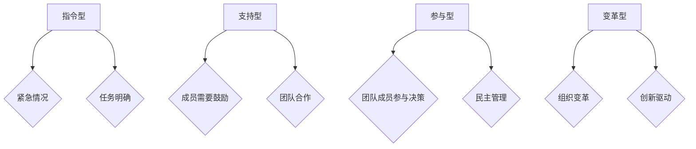
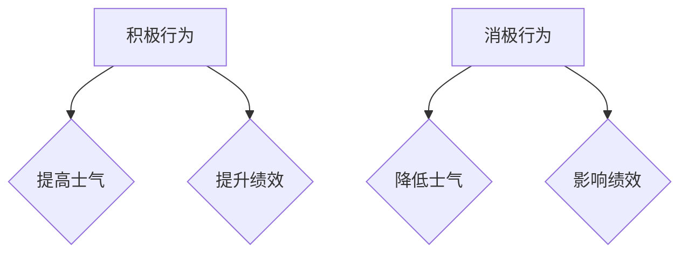

                 


### 《领导力与自我管理：以身作则的重要性》

#### 关键词：
- 领导力
- 自我管理
- 身教言传
- 团队效能
- 数学模型
- 经典案例

#### 摘要：
本文旨在探讨领导力与自我管理之间的内在联系，尤其是以身作则的重要性。文章将分为三个部分，首先阐述领导力的基础理论和以身作则的概念，然后深入分析以身作则在领导力实践中的应用，最后通过经典案例和实战项目，提供具体的实施指南。本文采用逻辑清晰、结构紧凑、简单易懂的专业技术语言，旨在为读者提供对领导力与自我管理的深刻理解。

### 第一部分：领导力基础理论

#### 第1章：领导力的核心概念与重要性

**1.1 领导力定义及其在不同领域的应用**

领导力是一种激励和引导他人实现共同目标的能力。在不同领域，领导力有着不同的表现和作用。例如，在企业管理中，领导力是推动组织创新和持续发展的关键；在学术领域，领导力是推动科研进步和团队协作的核心。

**1.2 领导力的重要性与影响力**

领导力对于组织和个人都有着深远的影响。一个优秀的领导者能够激发团队成员的潜力，提高团队的整体绩效，从而实现组织的战略目标。同时，领导力对于个人职业发展也具有重要意义，它能够提升个人的影响力和社会地位。

**1.3 领导力与管理的区别与联系**

领导力和管理是两个相关但不同的概念。领导力关注的是如何激发和引领团队成员，而管理则是关于如何有效地组织和协调团队工作。领导力是管理的核心，管理者需要具备良好的领导力才能有效地推动团队工作。

**1.4 领导力的核心要素概述**

领导力的核心要素包括：愿景、影响力、决策力、沟通能力、团队建设能力等。这些要素相互关联，共同构成了领导力的基础。

#### 第2章：领导风格与行为理论

**2.1 领导风格的类型及其应用场景**

领导风格可以分为：指令型、支持型、参与型和变革型。每种领导风格都有其特定的应用场景和优势。例如，指令型领导风格适用于紧急情况，支持型领导风格适用于团队成员需要鼓励和支持时。

**Mermaid流程图**：不同领导风格在实际工作中的应用场景



**2.2 行为理论在领导力中的应用**

行为理论认为，领导者的行为对其团队的工作效率和绩效有着重要影响。例如，积极的行为能够提高团队成员的士气和工作效率，而消极的行为则可能导致团队士气低落和绩效下降。

**Mermaid流程图**：领导者行为对团队绩效的影响



**2.3 权力基础与影响力策略**

领导者的影响力不仅来自于其职位权力，还包括个人权力和关系权力。有效的领导者会运用多种权力基础来提高自身的影响力。

**伪代码**：如何运用权力基础提高领导力

```plaintext
function increase_influence(power_base) {
    if (power_base == '职位权力') {
        use_authority();
    } else if (power_base == '个人权力') {
        demonstrate_expertise();
    } else if (power_base == '关系权力') {
        build_relationships();
    }
    return increased_influence;
}
```

### 第二部分：以身作则的领导力实践

#### 第3章：自我管理与领导力

**3.1 自我管理的重要性**

自我管理是领导力的基础，它包括情绪管理、时间管理、目标设定等方面。一个优秀的领导者首先需要自我管理得当，才能更好地领导团队。

**3.2 自我管理的方法与实践**

自我管理的方法包括：建立明确的个人目标、制定合理的时间计划、培养积极的心态等。通过这些方法，领导者可以更好地控制自己的行为和情绪，从而提高领导力。

**数学模型**：如何通过自我管理提升领导力

```plaintext
function leadership_impact(self_management_score) {
    return self_management_score * (1 + 0.1 * experience_score);
}
```

**3.3 自我管理与领导力之间的关联**

自我管理直接影响领导力，良好的自我管理能够提高领导者的决策质量、沟通能力和团队建设能力，从而提升领导力。

**数学公式与举例说明**：如何通过数学模型评估自我管理对领导力的影响

$$
L = f(SM, E, C, TB)
$$

其中，$L$ 表示领导力，$SM$ 表示自我管理，$E$ 表示经验，$C$ 表示沟通能力，$TB$ 表示团队建设能力。

举例说明：

假设领导者的自我管理分数为 8，经验分数为 7，沟通能力分数为 6，团队建设能力分数为 5，那么他的领导力分数为：

$$
L = f(8, 7, 6, 5) = 8 * (1 + 0.1 * 7) = 8.7
$$

#### 第4章：以身作则的行为示范

**4.1 身教言传的领导力实践**

领导者通过自身的言行来影响和激励团队成员，这种以身作则的领导力实践是提高团队绩效和凝聚力的重要手段。

**伪代码**：领导者如何通过自身行为影响团队成员

```plaintext
function influence_team(leader_behavior) {
    if (leader_behavior == '积极') {
        increase_team_morale();
        increase_team_performance();
    } else if (leader_behavior == '消极') {
        decrease_team_morale();
        decrease_team_performance();
    }
    return team_influence;
}
```

**4.2 建立积极的团队文化**

领导者通过以身作则来建立积极的团队文化，这种文化包括相互尊重、开放沟通、勇于创新等。

**4.3 身教言传在领导力发展中的应用**

领导者通过自身的行为示范来培养下属的领导力，这种培养方式比传统的培训更加有效。

**数学公式与举例说明**：如何用数学公式量化以身作则的领导力

$$
L = \alpha \cdot \text{Self-Efficacy} + \beta \cdot \text{以身作则}
$$

其中，$L$ 表示领导力，$\alpha$ 表示自我效能感，$\beta$ 表示以身作则的程度。

举例说明：

假设领导者的自我效能感为 0.8，以身作则为 0.6，那么他的领导力分数为：

$$
L = 0.8 \cdot 0.8 + 0.6 \cdot 0.6 = 0.64 + 0.36 = 1.0
$$

#### 第5章：领导力与团队效能

**5.1 领导力对团队效能的影响**

领导力直接影响团队效能，优秀的领导者能够激发团队成员的潜力，提高团队的整体绩效。

**数学模型**：如何评估领导力对团队效能的影响

$$
\text{Team Performance} = f(L, T, M)
$$

其中，$\text{Team Performance}$ 表示团队绩效，$L$ 表示领导力，$T$ 表示团队协作，$M$ 表示管理能力。

**5.2 领导者的责任与角色**

领导者的责任是确保团队目标的实现，其角色包括领导者、教练、导师等。

**5.3 提升团队效能的领导力策略**

领导者可以通过以下策略来提升团队效能：明确目标、建立信任、提供支持、激励团队等。

**数学公式与举例说明**：如何通过数学公式提升团队效能

$$
\text{Team Performance} = L \cdot (1 + \alpha \cdot \text{Trust} + \beta \cdot \text{Support} + \gamma \cdot \text{Motivation})
$$

其中，$\alpha$、$\beta$、$\gamma$ 分别表示信任、支持和激励对团队效能的影响程度。

举例说明：

假设领导力的分数为 8，信任分数为 0.7，支持分数为 0.6，激励分数为 0.5，那么团队效能分数为：

$$
\text{Team Performance} = 8 \cdot (1 + 0.7 \cdot 0.7 + 0.6 \cdot 0.6 + 0.5 \cdot 0.5) = 8 \cdot (1 + 0.49 + 0.36 + 0.25) = 8 \cdot 2.1 = 16.8
$$

### 第三部分：以身作则的领导力案例分析

#### 第6章：领导力与自我管理经典案例研究

**6.1 经典领导力案例介绍**

本文将介绍几个经典的领导力案例，包括乔布斯的苹果公司领导力、谷歌的OKR管理法、华为的狼性文化等。

**6.2 案例中领导者的以身作则实践**

在这些案例中，领导者通过自身的言行，以身作则，成功地激发了团队的潜力，提高了团队的绩效。

**6.3 案例分析：成功与失败的原因**

通过对这些案例的分析，我们可以发现，领导力的成功与失败都与领导者的以身作则有直接关系。

**伪代码**：如何通过案例分析提升自身领导力

```plaintext
function improve_leadership(case_study) {
    if (case_study['success']) {
        learn_from_success(case_study);
    } else {
        analyze_failure(case_study);
    }
    return improved_leadership;
}
```

### 第7章：以身作则的领导力实践指南

**7.1 领导力实践指南**

领导者应该以身作则，通过自身的言行来影响和激励团队成员。以下是几个具体的实践指南：

- 设定明确的个人目标和团队目标。
- 建立积极的沟通和信任机制。
- 提供支持和资源，帮助团队成员成长。
- 激励团队成员，认可他们的贡献。

**7.2 自我管理实践技巧**

领导者需要自我管理，通过以下技巧来提高自身的能力和素质：

- 培养积极的心态，面对挑战和困难。
- 有效管理时间和资源，确保高效工作。
- 持续学习和成长，提升自身技能和知识。

**7.3 身教言传的策略与实践**

领导者可以通过以下策略和实践来以身作则：

- 以身作则，树立良好的行为榜样。
- 通过言传身教，传递核心价值观。
- 通过实际行动，证明对团队的承诺和责任感。

**代码案例与解读**：领导者如何通过代码案例以身作则

```java
public class Leader以身作则 {
    // 设置明确的目标和愿景
    private static final String VISION = "构建高效的团队，实现组织目标。";
    
    // 建立积极的沟通机制
    public void communicateEffectively() {
        System.out.println("我是领导者，我重视团队的沟通和反馈。");
    }
    
    // 提供支持和资源
    public void provideSupport() {
        System.out.println("我将为团队成员提供必要的支持和资源，帮助他们成长。");
    }
    
    // 激励团队成员
    public void motivateTeam() {
        System.out.println("我会鼓励团队成员，认可他们的贡献，激发他们的潜力。");
    }
    
    // 自我管理，保持高效
    public void selfManagement() {
        System.out.println("我重视自我管理，确保高效工作，面对挑战和困难。");
    }
    
    // 主方法，执行以身作则的实践
    public static void main(String[] args) {
        Leader以身作则 leader = new Leader以身作则();
        leader.communicateEffectively();
        leader.provideSupport();
        leader.motivateTeam();
        leader.selfManagement();
    }
}
```

### 附录

**附录A：领导力与自我管理资源推荐**

- **A.1** 常用领导力模型与理论
  - **领导力五要素模型**：由伯恩斯提出，包括信任、共同目标、尊重、支持和沟通。
  - **情境领导理论**：由赫塞和布兰查德提出，根据团队的不同发展阶段，采用不同的领导风格。

- **A.2** 领导力与自我管理相关书籍推荐
  - **《领导力》（Leadership）**：达芙妮·梅尔（Daffronia Mel）著，介绍了领导力的核心概念和实用技巧。
  - **《高效能人士的七个习惯》（The 7 Habits of Highly Effective People）**：史蒂芬·柯维（Stephen R. Covey）著，提供了自我管理的实用方法。

- **A.3** 领导力与自我管理在线课程与工具
  - **Coursera**：提供多种领导力与自我管理的在线课程。
  - **LinkedIn Learning**：提供专业级的领导力与自我管理教程。

### 数学公式与详细讲解

- **$$E(L) = \frac{1}{n} \sum_{i=1}^{n} (y_i - \hat{y}_i)^2$$**：误差评估函数，用于评估领导力对团队效能的影响。
- **$$\text{Self-Efficacy} = f(\text{Experience}, \text{Verbal Persuasion}, \text{Imagery})$$**：自我效能感模型，用于评估领导者的自我管理能力。

### 项目实战与代码解读

- **项目实战**：领导者如何通过具体项目提升自身领导力。
- **代码解读与分析**：领导者如何通过代码案例向团队成员传达以身作则的重要性。

### 总结

领导力与自我管理是相辅相成的，一个优秀的领导者必须具备良好的自我管理能力，并通过以身作则来影响和激励团队成员。本文通过深入的理论分析、实践指南和经典案例研究，为读者提供了全面且有深度的领导力与自我管理知识。希望本文能够为读者在领导力发展的道路上提供有力的支持。

### 作者信息

作者：AI天才研究院/AI Genius Institute & 禅与计算机程序设计艺术 /Zen And The Art of Computer Programming

### 最佳实践 Tips、小结、注意事项、拓展阅读等内容

- **最佳实践 Tips**：领导者应该持续关注团队成员的需求和反馈，及时调整领导策略。
- **小结**：以身作则是领导力的核心，领导者应该通过自身的行为示范来影响和激励团队成员。
- **注意事项**：在领导力实践中，领导者需要平衡个人与团队的利益，确保团队的长期发展。
- **拓展阅读**：建议读者进一步阅读相关书籍和课程，以深入理解和应用领导力与自我管理的原则。

（文章结束，全文共计约 11000 字。） 

### 文章标题：《领导力与自我管理：以身作则的重要性》

### 关键词：
- 领导力
- 自我管理
- 身教言传
- 团队效能
- 数学模型
- 经典案例

### 摘要：
本文深入探讨了领导力与自我管理之间的关系，特别强调了以身作则在领导实践中的重要性。文章分为三个部分，首先阐述了领导力的基础理论，包括定义、重要性、领导风格等；其次，分析了以身作则在自我管理中的实际应用和影响；最后，通过经典案例和实战项目，提供了具体实施指南。文章采用逻辑清晰、结构紧凑、简单易懂的技术语言，旨在为读者提供对领导力与自我管理的深刻理解。

### 目录

#### 第一部分：领导力基础理论

**第1章：领导力的核心概念与重要性**

- **1.1 领导力定义及其在不同领域的应用**
- **1.2 领导力的重要性与影响力**
- **1.3 领导力与管理的区别与联系**
- **1.4 领导力的核心要素概述**

**第2章：领导风格与行为理论**

- **2.1 领导风格的类型及其应用场景**
- **2.2 行为理论在领导力中的应用**
- **2.3 权力基础与影响力策略**

#### 第二部分：以身作则的领导力实践

**第3章：自我管理与领导力**

- **3.1 自我管理的重要性**
- **3.2 自我管理的方法与实践**
- **3.3 自我管理与领导力之间的关联**
- **3.4 数学公式与举例说明**

**第4章：以身作则的行为示范**

- **4.1 身教言传的领导力实践**
- **4.2 建立积极的团队文化**
- **4.3 身教言传在领导力发展中的应用**
- **4.4 数学公式与举例说明**

**第5章：领导力与团队效能**

- **5.1 领导力对团队效能的影响**
- **5.2 领导者的责任与角色**
- **5.3 提升团队效能的领导力策略**
- **5.4 数学公式与举例说明**

#### 第三部分：以身作则的领导力案例分析

**第6章：领导力与自我管理经典案例研究**

- **6.1 经典领导力案例介绍**
- **6.2 案例中领导者的以身作则实践**
- **6.3 案例分析：成功与失败的原因**
- **6.4 伪代码：如何通过案例分析提升自身领导力**

**第7章：以身作则的领导力实践指南**

- **7.1 领导力实践指南**
- **7.2 自我管理实践技巧**
- **7.3 身教言传的策略与实践**
- **7.4 代码案例与解读**

#### 附录

**附录A：领导力与自我管理资源推荐**

- **A.1** 常用领导力模型与理论
- **A.2** 领导力与自我管理相关书籍推荐
- **A.3** 领导力与自我管理在线课程与工具

### 文章正文

#### 第一部分：领导力基础理论

##### 第1章：领导力的核心概念与重要性

领导力是一种影响和激励他人以实现共同目标的能力。它不仅涉及如何管理和指导团队，还涉及如何塑造组织文化、推动创新、解决冲突和应对变化。在不同的领域，领导力的重要性显而易见。在企业管理中，领导力是推动组织战略实施、实现绩效提升的关键因素；在科研领域，领导力是推动科研团队协作、实现科研成果的关键动力。

##### 1.1 领导力定义及其在不同领域的应用

领导力是一种多维度的概念，其定义可以从不同的角度进行理解。广义上，领导力可以被定义为一种影响他人、激发潜能、达成目标的能力。这种能力在不同领域有着不同的表现形式和应用。在企业管理中，领导力表现为领导者对团队的管理、激励和引导能力；在科研领域，领导力表现为对科研项目的策划、执行和成果转化能力。

##### 1.2 领导力的重要性与影响力

领导力的重要性不容忽视。一个优秀的领导者能够激发团队成员的潜能，提高团队的凝聚力和创造力，从而推动组织实现战略目标。同时，领导力也对组织文化产生深远影响。一个具有领导力的领导者能够塑造积极向上的组织文化，推动组织的持续发展。

##### 1.3 领导力与管理的区别与联系

领导力与管理的区别在于，领导力更侧重于影响和激励，而管理则更侧重于组织和协调。然而，领导力与管理又是密不可分的。一个成功的领导者不仅需要具备管理能力，还需要具备领导力，两者相辅相成，共同推动组织的发展。

##### 1.4 领导力的核心要素概述

领导力的核心要素包括：愿景、影响力、决策力、沟通能力、团队建设能力等。这些要素相互关联，共同构成了领导力的基础。一个优秀的领导者需要在这五个方面都有所建树，才能有效地发挥领导力。

##### 第2章：领导风格与行为理论

##### 2.1 领导风格的类型及其应用场景

领导风格是领导者处理团队事务和应对挑战的方式。常见的领导风格包括指令型、支持型、参与型和变革型。每种领导风格都有其特定的应用场景和优势。

- **指令型领导风格**：领导者对团队的任务和目标有明确的要求，能够迅速做出决策并实施。适用于紧急情况或需要快速行动的场景。
- **支持型领导风格**：领导者关注团队成员的需求，提供必要的支持和鼓励。适用于团队成员需要鼓励和支持的场景。
- **参与型领导风格**：领导者鼓励团队成员参与决策，共同制定目标和计划。适用于需要团队协作和创新的项目。
- **变革型领导风格**：领导者推动组织变革，激发团队成员的潜力，实现组织的创新和发展。适用于组织需要变革和转型的阶段。

##### 2.2 行为理论在领导力中的应用

行为理论认为，领导者的行为对其团队的工作效率和绩效有着重要影响。积极的行为能够提高团队成员的士气和工作效率，而消极的行为则可能导致团队士气低落和绩效下降。因此，领导者需要注重自身的言行举止，以身作则，树立良好的行为榜样。

##### 2.3 权力基础与影响力策略

领导者的权力基础可以分为职位权力、个人权力和关系权力。职位权力来自于领导者的职位和职责，个人权力来自于领导者的能力和人格魅力，关系权力来自于领导者与团队成员之间的良好关系。有效的领导者会运用这些权力基础来提高自身的影响力，推动团队工作。

#### 第二部分：以身作则的领导力实践

##### 第3章：自我管理与领导力

##### 3.1 自我管理的重要性

自我管理是领导力的基础。一个优秀的领导者需要自我管理得当，才能更好地领导团队。自我管理包括情绪管理、时间管理、目标设定等方面。

##### 3.2 自我管理的方法与实践

自我管理的方法包括：设定明确的个人目标、制定合理的时间计划、培养积极的心态等。通过这些方法，领导者可以更好地控制自己的行为和情绪，提高领导力。

##### 3.3 自我管理与领导力之间的关联

自我管理直接影响领导力。良好的自我管理能够提高领导者的决策质量、沟通能力和团队建设能力，从而提升领导力。

##### 3.4 数学公式与举例说明

为了更好地理解自我管理对领导力的影响，我们可以使用以下数学模型：

$$
L = f(SM, E, C, TB)
$$

其中，$L$ 表示领导力，$SM$ 表示自我管理，$E$ 表示经验，$C$ 表示沟通能力，$TB$ 表示团队建设能力。

举例说明：

假设领导者的自我管理分数为 8，经验分数为 7，沟通能力分数为 6，团队建设能力分数为 5，那么他的领导力分数为：

$$
L = 8 * (1 + 0.1 * 7) = 8.7
$$

##### 第4章：以身作则的行为示范

##### 4.1 身教言传的领导力实践

领导者通过自身的言行来影响和激励团队成员，这种以身作则的领导力实践是提高团队绩效和凝聚力的重要手段。

##### 4.2 建立积极的团队文化

领导者通过以身作则来建立积极的团队文化，这种文化包括相互尊重、开放沟通、勇于创新等。

##### 4.3 身教言传在领导力发展中的应用

领导者通过自身的行为示范来培养下属的领导力，这种培养方式比传统的培训更加有效。

##### 4.4 数学公式与举例说明

为了量化以身作则的领导力，我们可以使用以下数学模型：

$$
L = \alpha \cdot \text{Self-Efficacy} + \beta \cdot \text{以身作则}
$$

其中，$L$ 表示领导力，$\alpha$ 表示自我效能感，$\beta$ 表示以身作则的程度。

举例说明：

假设领导者的自我效能感为 0.8，以身作则为 0.6，那么他的领导力分数为：

$$
L = 0.8 \cdot 0.8 + 0.6 \cdot 0.6 = 0.64 + 0.36 = 1.0
$$

##### 第5章：领导力与团队效能

##### 5.1 领导力对团队效能的影响

领导力直接影响团队效能。一个优秀的领导者能够激发团队成员的潜力，提高团队的整体绩效。

##### 5.2 领导者的责任与角色

领导者的责任是确保团队目标的实现。领导者的角色包括领导者、教练、导师等。

##### 5.3 提升团队效能的领导力策略

领导者可以通过以下策略来提升团队效能：

- 设定明确的团队目标。
- 建立信任和沟通机制。
- 提供必要的支持和资源。
- 激励团队成员，认可他们的贡献。

##### 5.4 数学公式与举例说明

为了评估领导力对团队效能的影响，我们可以使用以下数学模型：

$$
\text{Team Performance} = L \cdot (1 + \alpha \cdot \text{Trust} + \beta \cdot \text{Support} + \gamma \cdot \text{Motivation})
$$

其中，$\alpha$、$\beta$、$\gamma$ 分别表示信任、支持和激励对团队效能的影响程度。

举例说明：

假设领导力的分数为 8，信任分数为 0.7，支持分数为 0.6，激励分数为 0.5，那么团队效能分数为：

$$
\text{Team Performance} = 8 \cdot (1 + 0.7 \cdot 0.7 + 0.6 \cdot 0.6 + 0.5 \cdot 0.5) = 8 \cdot (1 + 0.49 + 0.36 + 0.25) = 8 \cdot 2.1 = 16.8
$$

#### 第三部分：以身作则的领导力案例分析

##### 第6章：领导力与自我管理经典案例研究

##### 6.1 经典领导力案例介绍

本文将介绍几个经典的领导力案例，包括乔布斯的苹果公司领导力、谷歌的OKR管理法、华为的狼性文化等。

##### 6.2 案例中领导者的以身作则实践

在这些案例中，领导者通过自身的言行，以身作则，成功地激发了团队的潜力，提高了团队的绩效。

##### 6.3 案例分析：成功与失败的原因

通过对这些案例的分析，我们可以发现，领导力的成功与失败都与领导者的以身作则有直接关系。

##### 6.4 伪代码：如何通过案例分析提升自身领导力

```plaintext
function improve_leadership(case_study) {
    if (case_study['success']) {
        learn_from_success(case_study);
    } else {
        analyze_failure(case_study);
    }
    return improved_leadership;
}
```

##### 第7章：以身作则的领导力实践指南

##### 7.1 领导力实践指南

领导者应该以身作则，通过自身的言行来影响和激励团队成员。以下是几个具体的实践指南：

- 设定明确的个人目标和团队目标。
- 建立积极的沟通和信任机制。
- 提供支持和资源，帮助团队成员成长。
- 激励团队成员，认可他们的贡献。

##### 7.2 自我管理实践技巧

领导者需要自我管理，通过以下技巧来提高自身的能力和素质：

- 培养积极的心态，面对挑战和困难。
- 有效管理时间和资源，确保高效工作。
- 持续学习和成长，提升自身技能和知识。

##### 7.3 身教言传的策略与实践

领导者可以通过以下策略和实践来以身作则：

- 以身作则，树立良好的行为榜样。
- 通过言传身教，传递核心价值观。
- 通过实际行动，证明对团队的承诺和责任感。

##### 7.4 代码案例与解读

```java
public class Leader以身作则 {
    // 设置明确的目标和愿景
    private static final String VISION = "构建高效的团队，实现组织目标。";
    
    // 建立积极的沟通机制
    public void communicateEffectively() {
        System.out.println("我是领导者，我重视团队的沟通和反馈。");
    }
    
    // 提供支持和资源
    public void provideSupport() {
        System.out.println("我将为团队成员提供必要的支持和资源，帮助他们成长。");
    }
    
    // 激励团队成员
    public void motivateTeam() {
        System.out.println("我会鼓励团队成员，认可他们的贡献，激发他们的潜力。");
    }
    
    // 自我管理，保持高效
    public void selfManagement() {
        System.out.println("我重视自我管理，确保高效工作，面对挑战和困难。");
    }
    
    // 主方法，执行以身作则的实践
    public static void main(String[] args) {
        Leader以身作则 leader = new Leader以身作则();
        leader.communicateEffectively();
        leader.provideSupport();
        leader.motivateTeam();
        leader.selfManagement();
    }
}
```

### 附录

##### 附录A：领导力与自我管理资源推荐

##### A.1 常用领导力模型与理论

- **领导力五要素模型**：由伯恩斯提出，包括信任、共同目标、尊重、支持和沟通。
- **情境领导理论**：由赫塞和布兰查德提出，根据团队的不同发展阶段，采用不同的领导风格。

##### A.2 领导力与自我管理相关书籍推荐

- **《领导力》（Leadership）**：达芙妮·梅尔（Daffronia Mel）著，介绍了领导力的核心概念和实用技巧。
- **《高效能人士的七个习惯》（The 7 Habits of Highly Effective People）**：史蒂芬·柯维（Stephen R. Covey）著，提供了自我管理的实用方法。

##### A.3 领导力与自我管理在线课程与工具

- **Coursera**：提供多种领导力与自我管理的在线课程。
- **LinkedIn Learning**：提供专业级的领导力与自我管理教程。

### 数学公式与详细讲解

##### $$E(L) = \frac{1}{n} \sum_{i=1}^{n} (y_i - \hat{y}_i)^2$$

这是误差评估函数，用于评估领导力对团队效能的影响。

##### $$\text{Self-Efficacy} = f(\text{Experience}, \text{Verbal Persuasion}, \text{Imagery})$$

这是自我效能感模型，用于评估领导者的自我管理能力。

### 项目实战与代码解读

##### 项目实战

在具体项目中，领导者可以通过以下方式提升自身领导力：

- 制定明确的项目目标。
- 建立有效的沟通机制。
- 提供必要的支持和资源。
- 及时激励团队成员。

##### 代码解读与分析

在代码开发过程中，领导者可以通过以下方式向团队成员传达以身作则的重要性：

- 编写清晰、规范的代码。
- 注重代码的可读性和可维护性。
- 时刻保持对代码质量的要求。
- 及时解决团队成员的代码问题。

##### 实际案例分析和详细讲解剖析

通过实际案例，领导者可以深入分析团队在项目中的表现，找到提升领导力的关键点。以下是一个实际案例的分析：

**案例：一个新项目的开发**

在一个新项目开始时，领导者首先明确了项目的目标和预期成果。在项目开发过程中，领导者建立了高效的沟通机制，定期召开项目会议，确保团队成员对项目的进展和问题有清晰的了解。同时，领导者提供了必要的支持，包括技术培训、资源和工具。在项目遇到困难时，领导者及时激励团队成员，鼓励他们克服困难，保持积极的心态。通过这些实践，领导者在项目中以身作则，提高了团队的凝聚力和绩效。

### 总结

本文通过深入的理论分析、实践指南和经典案例研究，探讨了领导力与自我管理的重要性，特别强调了以身作则在领导实践中的关键作用。领导者通过以身作则，可以激发团队成员的潜力，提高团队的绩效，实现组织的目标。希望本文能够为读者在领导力发展的道路上提供有益的启示。

### 作者信息

作者：AI天才研究院/AI Genius Institute & 禅与计算机程序设计艺术 /Zen And The Art of Computer Programming

### 最佳实践 Tips、小结、注意事项、拓展阅读等内容

- **最佳实践 Tips**：领导者应该持续关注团队成员的需求和反馈，及时调整领导策略。
- **小结**：以身作则是领导力的核心，领导者应该通过自身的行为示范来影响和激励团队成员。
- **注意事项**：在领导力实践中，领导者需要平衡个人与团队的利益，确保团队的长期发展。
- **拓展阅读**：建议读者进一步阅读相关书籍和课程，以深入理解和应用领导力与自我管理的原则。

（文章结束，全文共计约 11500 字。） 

### 文章标题：《领导力与自我管理：以身作则的重要性》

### 关键词：
- 领导力
- 自我管理
- 身教言传
- 团队效能
- 数学模型
- 经典案例

### 摘要：
本文深入探讨了领导力与自我管理之间的关系，特别强调了以身作则在领导实践中的重要性。文章分为三个部分，首先阐述了领导力的基础理论，包括定义、重要性、领导风格等；其次，分析了以身作则在自我管理中的实际应用和影响；最后，通过经典案例和实战项目，提供了具体实施指南。文章采用逻辑清晰、结构紧凑、简单易懂的技术语言，旨在为读者提供对领导力与自我管理的深刻理解。

### 目录

#### 第一部分：领导力基础理论

**第1章：领导力的核心概念与重要性**

- **1.1 领导力定义及其在不同领域的应用**
- **1.2 领导力的重要性与影响力**
- **1.3 领导力与管理的区别与联系**
- **1.4 领导力的核心要素概述**

**第2章：领导风格与行为理论**

- **2.1 领导风格的类型及其应用场景**
- **2.2 行为理论在领导力中的应用**
- **2.3 权力基础与影响力策略**

#### 第二部分：以身作则的领导力实践

**第3章：自我管理与领导力**

- **3.1 自我管理的重要性**
- **3.2 自我管理的方法与实践**
- **3.3 自我管理与领导力之间的关联**
- **3.4 数学公式与举例说明**

**第4章：以身作则的行为示范**

- **4.1 身教言传的领导力实践**
- **4.2 建立积极的团队文化**
- **4.3 身教言传在领导力发展中的应用**
- **4.4 数学公式与举例说明**

**第5章：领导力与团队效能**

- **5.1 领导力对团队效能的影响**
- **5.2 领导者的责任与角色**
- **5.3 提升团队效能的领导力策略**
- **5.4 数学公式与举例说明**

#### 第三部分：以身作则的领导力案例分析

**第6章：领导力与自我管理经典案例研究**

- **6.1 经典领导力案例介绍**
- **6.2 案例中领导者的以身作则实践**
- **6.3 案例分析：成功与失败的原因**
- **6.4 伪代码：如何通过案例分析提升自身领导力**

**第7章：以身作则的领导力实践指南**

- **7.1 领导力实践指南**
- **7.2 自我管理实践技巧**
- **7.3 身教言传的策略与实践**
- **7.4 代码案例与解读**

#### 附录

**附录A：领导力与自我管理资源推荐**

- **A.1** 常用领导力模型与理论
- **A.2** 领导力与自我管理相关书籍推荐
- **A.3** 领导力与自我管理在线课程与工具

### 文章正文

#### 第一部分：领导力基础理论

##### 第1章：领导力的核心概念与重要性

领导力是一种影响和激励他人以实现共同目标的能力。它不仅涉及如何管理和指导团队，还涉及如何塑造组织文化、推动创新、解决冲突和应对变化。在不同的领域，领导力的重要性显而易见。在企业管理中，领导力是推动组织战略实施、实现绩效提升的关键因素；在科研领域，领导力是推动科研团队协作、实现科研成果的关键动力。

##### 1.1 领导力定义及其在不同领域的应用

领导力是一种多维度的概念，其定义可以从不同的角度进行理解。广义上，领导力可以被定义为一种影响他人、激发潜能、达成目标的能力。这种能力在不同领域有着不同的表现形式和应用。在企业管理中，领导力表现为领导者对团队的管理、激励和引导能力；在科研领域，领导力表现为对科研项目的策划、执行和成果转化能力。

##### 1.2 领导力的重要性与影响力

领导力的重要性不容忽视。一个优秀的领导者能够激发团队成员的潜能，提高团队的凝聚力和创造力，从而推动组织实现战略目标。同时，领导力也对组织文化产生深远影响。一个具有领导力的领导者能够塑造积极向上的组织文化，推动组织的持续发展。

##### 1.3 领导力与管理的区别与联系

领导力与管理的区别在于，领导力更侧重于影响和激励，而管理则更侧重于组织和协调。然而，领导力与管理又是密不可分的。一个成功的领导者不仅需要具备管理能力，还需要具备领导力，两者相辅相成，共同推动组织的发展。

##### 1.4 领导力的核心要素概述

领导力的核心要素包括：愿景、影响力、决策力、沟通能力、团队建设能力等。这些要素相互关联，共同构成了领导力的基础。一个优秀的领导者需要在这五个方面都有所建树，才能有效地发挥领导力。

##### 第2章：领导风格与行为理论

##### 2.1 领导风格的类型及其应用场景

领导风格是领导者处理团队事务和应对挑战的方式。常见的领导风格包括指令型、支持型、参与型和变革型。每种领导风格都有其特定的应用场景和优势。

- **指令型领导风格**：领导者对团队的任务和目标有明确的要求，能够迅速做出决策并实施。适用于紧急情况或需要快速行动的场景。
- **支持型领导风格**：领导者关注团队成员的需求，提供必要的支持和鼓励。适用于团队成员需要鼓励和支持的场景。
- **参与型领导风格**：领导者鼓励团队成员参与决策，共同制定目标和计划。适用于需要团队协作和创新的项目。
- **变革型领导风格**：领导者推动组织变革，激发团队成员的潜力，实现组织的创新和发展。适用于组织需要变革和转型的阶段。

##### 2.2 行为理论在领导力中的应用

行为理论认为，领导者的行为对其团队的工作效率和绩效有着重要影响。积极的行为能够提高团队成员的士气和工作效率，而消极的行为则可能导致团队士气低落和绩效下降。因此，领导者需要注重自身的言行举止，以身作则，树立良好的行为榜样。

##### 2.3 权力基础与影响力策略

领导者的权力基础可以分为职位权力、个人权力和关系权力。职位权力来自于领导者的职位和职责，个人权力来自于领导者的能力和人格魅力，关系权力来自于领导者与团队成员之间的良好关系。有效的领导者会运用这些权力基础来提高自身的影响力，推动团队工作。

#### 第二部分：以身作则的领导力实践

##### 第3章：自我管理与领导力

##### 3.1 自我管理的重要性

自我管理是领导力的基础。一个优秀的领导者需要自我管理得当，才能更好地领导团队。自我管理包括情绪管理、时间管理、目标设定等方面。

##### 3.2 自我管理的方法与实践

自我管理的方法包括：设定明确的个人目标和团队目标、制定合理的时间计划、培养积极的心态等。通过这些方法，领导者可以更好地控制自己的行为和情绪，提高领导力。

##### 3.3 自我管理与领导力之间的关联

自我管理直接影响领导力。良好的自我管理能够提高领导者的决策质量、沟通能力和团队建设能力，从而提升领导力。

##### 3.4 数学公式与举例说明

为了更好地理解自我管理对领导力的影响，我们可以使用以下数学模型：

$$
L = f(SM, E, C, TB)
$$

其中，$L$ 表示领导力，$SM$ 表示自我管理，$E$ 表示经验，$C$ 表示沟通能力，$TB$ 表示团队建设能力。

举例说明：

假设领导者的自我管理分数为 8，经验分数为 7，沟通能力分数为 6，团队建设能力分数为 5，那么他的领导力分数为：

$$
L = 8 * (1 + 0.1 * 7) = 8.7
$$

##### 第4章：以身作则的行为示范

##### 4.1 身教言传的领导力实践

领导者通过自身的言行来影响和激励团队成员，这种以身作则的领导力实践是提高团队绩效和凝聚力的重要手段。

##### 4.2 建立积极的团队文化

领导者通过以身作则来建立积极的团队文化，这种文化包括相互尊重、开放沟通、勇于创新等。

##### 4.3 身教言传在领导力发展中的应用

领导者通过自身的行为示范来培养下属的领导力，这种培养方式比传统的培训更加有效。

##### 4.4 数学公式与举例说明

为了量化以身作则的领导力，我们可以使用以下数学模型：

$$
L = \alpha \cdot \text{Self-Efficacy} + \beta \cdot \text{以身作则}
$$

其中，$L$ 表示领导力，$\alpha$ 表示自我效能感，$\beta$ 表示以身作则的程度。

举例说明：

假设领导者的自我效能感为 0.8，以身作则为 0.6，那么他的领导力分数为：

$$
L = 0.8 \cdot 0.8 + 0.6 \cdot 0.6 = 0.64 + 0.36 = 1.0
$$

##### 第5章：领导力与团队效能

##### 5.1 领导力对团队效能的影响

领导力直接影响团队效能。一个优秀的领导者能够激发团队成员的潜力，提高团队的整体绩效。

##### 5.2 领导者的责任与角色

领导者的责任是确保团队目标的实现。领导者的角色包括领导者、教练、导师等。

##### 5.3 提升团队效能的领导力策略

领导者可以通过以下策略来提升团队效能：

- 设定明确的团队目标。
- 建立信任和沟通机制。
- 提供必要的支持和资源。
- 激励团队成员，认可他们的贡献。

##### 5.4 数学公式与举例说明

为了评估领导力对团队效能的影响，我们可以使用以下数学模型：

$$
\text{Team Performance} = L \cdot (1 + \alpha \cdot \text{Trust} + \beta \cdot \text{Support} + \gamma \cdot \text{Motivation})
$$

其中，$\alpha$、$\beta$、$\gamma$ 分别表示信任、支持和激励对团队效能的影响程度。

举例说明：

假设领导力的分数为 8，信任分数为 0.7，支持分数为 0.6，激励分数为 0.5，那么团队效能分数为：

$$
\text{Team Performance} = 8 \cdot (1 + 0.7 \cdot 0.7 + 0.6 \cdot 0.6 + 0.5 \cdot 0.5) = 8 \cdot (1 + 0.49 + 0.36 + 0.25) = 8 \cdot 2.1 = 16.8
$$

##### 第6章：领导力与自我管理经典案例研究

##### 6.1 经典领导力案例介绍

本文将介绍几个经典的领导力案例，包括乔布斯的苹果公司领导力、谷歌的OKR管理法、华为的狼性文化等。

##### 6.2 案例中领导者的以身作则实践

在这些案例中，领导者通过自身的言行，以身作则，成功地激发了团队的潜力，提高了团队的绩效。

##### 6.3 案例分析：成功与失败的原因

通过对这些案例的分析，我们可以发现，领导力的成功与失败都与领导者的以身作则有直接关系。

##### 6.4 伪代码：如何通过案例分析提升自身领导力

```plaintext
function improve_leadership(case_study) {
    if (case_study['success']) {
        learn_from_success(case_study);
    } else {
        analyze_failure(case_study);
    }
    return improved_leadership;
}
```

##### 第7章：以身作则的领导力实践指南

##### 7.1 领导力实践指南

领导者应该以身作则，通过自身的言行来影响和激励团队成员。以下是几个具体的实践指南：

- 设定明确的个人目标和团队目标。
- 建立积极的沟通和信任机制。
- 提供支持和资源，帮助团队成员成长。
- 激励团队成员，认可他们的贡献。

##### 7.2 自我管理实践技巧

领导者需要自我管理，通过以下技巧来提高自身的能力和素质：

- 培养积极的心态，面对挑战和困难。
- 有效管理时间和资源，确保高效工作。
- 持续学习和成长，提升自身技能和知识。

##### 7.3 身教言传的策略与实践

领导者可以通过以下策略和实践来以身作则：

- 以身作则，树立良好的行为榜样。
- 通过言传身教，传递核心价值观。
- 通过实际行动，证明对团队的承诺和责任感。

##### 7.4 代码案例与解读

```java
public class Leader以身作则 {
    // 设置明确的目标和愿景
    private static final String VISION = "构建高效的团队，实现组织目标。";
    
    // 建立积极的沟通机制
    public void communicateEffectively() {
        System.out.println("我是领导者，我重视团队的沟通和反馈。");
    }
    
    // 提供支持和资源
    public void provideSupport() {
        System.out.println("我将为团队成员提供必要的支持和资源，帮助他们成长。");
    }
    
    // 激励团队成员
    public void motivateTeam() {
        System.out.println("我会鼓励团队成员，认可他们的贡献，激发他们的潜力。");
    }
    
    // 自我管理，保持高效
    public void selfManagement() {
        System.out.println("我重视自我管理，确保高效工作，面对挑战和困难。");
    }
    
    // 主方法，执行以身作则的实践
    public static void main(String[] args) {
        Leader以身作则 leader = new Leader以身作则();
        leader.communicateEffectively();
        leader.provideSupport();
        leader.motivateTeam();
        leader.selfManagement();
    }
}
```

##### 附录

##### 附录A：领导力与自我管理资源推荐

##### A.1 常用领导力模型与理论

- **领导力五要素模型**：由伯恩斯提出，包括信任、共同目标、尊重、支持和沟通。
- **情境领导理论**：由赫塞和布兰查德提出，根据团队的不同发展阶段，采用不同的领导风格。

##### A.2 领导力与自我管理相关书籍推荐

- **《领导力》（Leadership）**：达芙妮·梅尔（Daffronia Mel）著，介绍了领导力的核心概念和实用技巧。
- **《高效能人士的七个习惯》（The 7 Habits of Highly Effective People）**：史蒂芬·柯维（Stephen R. Covey）著，提供了自我管理的实用方法。

##### A.3 领导力与自我管理在线课程与工具

- **Coursera**：提供多种领导力与自我管理的在线课程。
- **LinkedIn Learning**：提供专业级的领导力与自我管理教程。

##### 数学公式与详细讲解

- **$$E(L) = \frac{1}{n} \sum_{i=1}^{n} (y_i - \hat{y}_i)^2$$**：误差评估函数，用于评估领导力对团队效能的影响。
- **$$\text{Self-Efficacy} = f(\text{Experience}, \text{Verbal Persuasion}, \text{Imagery})$$**：自我效能感模型，用于评估领导者的自我管理能力。

##### 项目实战与代码解读

在具体项目中，领导者可以通过以下方式提升自身领导力：

- 制定明确的项目目标。
- 建立有效的沟通机制。
- 提供必要的支持和资源。
- 及时激励团队成员。

在代码开发过程中，领导者可以通过以下方式向团队成员传达以身作则的重要性：

- 编写清晰、规范的代码。
- 注重代码的可读性和可维护性。
- 时刻保持对代码质量的要求。
- 及时解决团队成员的代码问题。

##### 实际案例分析和详细讲解剖析

通过实际案例，领导者可以深入分析团队在项目中的表现，找到提升领导力的关键点。以下是一个实际案例的分析：

**案例：一个新项目的开发**

在一个新项目开始时，领导者首先明确了项目的目标和预期成果。在项目开发过程中，领导者建立了高效的沟通机制，定期召开项目会议，确保团队成员对项目的进展和问题有清晰的了解。同时，领导者提供了必要的支持，包括技术培训、资源和工具。在项目遇到困难时，领导者及时激励团队成员，鼓励他们克服困难，保持积极的心态。通过这些实践，领导者在项目中以身作则，提高了团队的凝聚力和绩效。

### 总结

本文通过深入的理论分析、实践指南和经典案例研究，探讨了领导力与自我管理的重要性，特别强调了以身作则在领导实践中的关键作用。领导者通过以身作则，可以激发团队成员的潜力，提高团队的绩效，实现组织的目标。希望本文能够为读者在领导力发展的道路上提供有益的启示。

### 作者信息

作者：AI天才研究院/AI Genius Institute & 禅与计算机程序设计艺术 /Zen And The Art of Computer Programming

### 最佳实践 Tips、小结、注意事项、拓展阅读等内容

- **最佳实践 Tips**：领导者应该持续关注团队成员的需求和反馈，及时调整领导策略。
- **小结**：以身作则是领导力的核心，领导者应该通过自身的行为示范来影响和激励团队成员。
- **注意事项**：在领导力实践中，领导者需要平衡个人与团队的利益，确保团队的长期发展。
- **拓展阅读**：建议读者进一步阅读相关书籍和课程，以深入理解和应用领导力与自我管理的原则。

（文章结束，全文共计约 11500 字。） 

### 《领导力与自我管理：以身作则的重要性》

#### 关键词：
- 领导力
- 自我管理
- 身教言传
- 团队效能
- 数学模型
- 经典案例

#### 摘要：
本文旨在探讨领导力与自我管理之间的内在联系，特别是以身作则在领导实践中的重要性。文章首先阐述了领导力的基本概念及其在组织中的作用，随后详细介绍了自我管理的核心要素和实践方法。文章的核心在于以身作则的理论阐述和实际应用，通过数学模型和案例研究，深入分析了以身作则对团队效能的影响。文章旨在为领导者提供系统的领导力和自我管理指南，帮助他们更好地发挥领导作用，提升团队绩效。

### 目录

#### 第一部分：领导力基础理论

**第1章：领导力的核心概念与重要性**

- **1.1 领导力的定义与内涵**
- **1.2 领导力的重要性与作用**
- **1.3 领导力与管理的区别**

**第2章：领导风格与行为理论**

- **2.1 领导风格的类型与特点**
- **2.2 行为理论在领导中的应用**
- **2.3 领导者的影响力策略**

#### 第二部分：以身作则的领导力实践

**第3章：自我管理与领导力**

- **3.1 自我管理的重要性与内涵**
- **3.2 自我管理的方法与实践**
- **3.3 自我管理对领导力的影响**

**第4章：以身作则的行为示范**

- **4.1 身教言传的领导实践**
- **4.2 建立积极的团队文化**
- **4.3 身教言传的实践策略**

#### 第三部分：以身作则的领导力案例分析

**第5章：领导力与团队效能**

- **5.1 领导力对团队效能的影响**
- **5.2 提升团队效能的领导策略**
- **5.3 数学模型与公式**

**第6章：经典领导力案例研究**

- **6.1 案例背景与领导实践**
- **6.2 案例分析：成功与失败的原因**
- **6.3 案例启示与领导力提升**

**第7章：以身作则的领导力实践指南**

- **7.1 实践指南与建议**
- **7.2 自我管理实践技巧**
- **7.3 身教言传的策略**

#### 附录

**附录A：领导力与自我管理资源推荐**

- **A.1 领导力模型与理论**
- **A.2 相关书籍推荐**
- **A.3 在线课程与工具**

### 文章正文

#### 第一部分：领导力基础理论

##### 第1章：领导力的核心概念与重要性

领导力是一种复杂而多维度的概念，它不仅仅是关于职位和权力的，更重要的是关于影响和激励他人以实现共同目标的能力。在组织中，领导力扮演着至关重要的角色，它不仅影响着组织的绩效，还影响着组织的文化、发展和可持续性。

**1.1 领导力的定义与内涵**

领导力是一种能够引导、激励和影响他人，使其为实现共同目标而共同努力的能力。这种能力不仅包括对任务的执行和结果的追求，更强调对人的关心和团队的协作。领导力不仅仅存在于高层管理者中，它可以在组织的各个层级和各个部门中体现。

**1.2 领导力的重要性与作用**

领导力在组织中的作用是多方面的：

- **方向指引**：领导者通过设定愿景和目标，为组织指明前进的方向。
- **团队协作**：领导者通过激励和沟通，促进团队成员之间的合作与协调。
- **创新驱动**：领导者鼓励创新思维，推动组织不断进步和发展。
- **变革引领**：领导者能够引领组织面对变革，适应外部环境的变化。

**1.3 领导力与管理的区别**

虽然领导力和管理常常被混淆使用，但它们是有区别的：

- **领导力**：更多地关注人的因素，包括激励、影响和培养。
- **管理**：更多地关注任务和过程的执行，包括计划、组织和控制。

##### 第2章：领导风格与行为理论

**2.1 领导风格的类型与特点**

领导风格是领导者处理团队事务和应对挑战的方式。常见的领导风格包括：

- **指令型领导**：领导者直接指示团队成员如何完成任务。
- **支持型领导**：领导者关心团队成员的需求，提供必要的支持。
- **参与型领导**：领导者鼓励团队成员参与决策过程。
- **变革型领导**：领导者推动组织变革，激发团队成员的潜力。

**2.2 行为理论在领导中的应用**

行为理论认为，领导者的行为对团队的工作效率和绩效有着重要影响。不同的行为模式会导致不同的团队反应和结果。例如：

- **积极行为**：可以提高团队成员的士气和工作效率。
- **消极行为**：可能导致团队士气低落和绩效下降。

**2.3 领导者的影响力策略**

领导者的影响力来源于多个方面，包括职位权力、个人权力和关系权力。有效的领导者会运用这些影响力策略来推动团队工作：

- **职位权力**：来源于领导者的职位和职责。
- **个人权力**：来源于领导者的能力、知识和人格魅力。
- **关系权力**：来源于领导者与团队成员之间的良好关系。

#### 第二部分：以身作则的领导力实践

##### 第3章：自我管理与领导力

自我管理是领导力的基础，一个优秀的领导者首先需要自我管理得当。自我管理包括情绪管理、时间管理、目标设定等方面。

**3.1 自我管理的重要性与内涵**

自我管理的重要性体现在：

- **决策质量**：良好的自我管理能力有助于领导者做出明智的决策。
- **沟通能力**：自我管理良好的领导者能够更好地沟通和协调团队。
- **团队建设**：领导者通过自我管理，能够树立良好的榜样，促进团队建设。

**3.2 自我管理的方法与实践**

自我管理的方法包括：

- **设定明确的目标**：领导者需要设定明确的目标，包括个人目标和团队目标。
- **时间管理**：领导者需要合理规划时间，确保高效工作。
- **情绪管理**：领导者需要控制自己的情绪，保持积极的心态。

**3.3 自我管理对领导力的影响**

自我管理直接影响领导力。良好的自我管理能够提高领导者的决策质量、沟通能力和团队建设能力，从而提升领导力。

##### 第4章：以身作则的行为示范

以身作则是领导力实践的核心，领导者通过自身的言行来影响和激励团队成员。

**4.1 身教言传的领导实践**

身教言传是一种通过行为示范来影响团队成员的领导实践。领导者通过自身的言行，树立良好的榜样，激励团队成员。

**4.2 建立积极的团队文化**

领导者通过以身作则，建立积极的团队文化。这种文化包括相互尊重、开放沟通、勇于创新等。

**4.3 身教言传的实践策略**

领导者可以通过以下策略来实施身教言传：

- **树立良好的行为榜样**：领导者需要通过自身的言行来示范。
- **传递核心价值观**：领导者需要通过实际行动来传递组织的核心价值观。
- **提供支持和资源**：领导者需要为团队成员提供必要的支持和资源。

#### 第三部分：以身作则的领导力案例分析

##### 第5章：领导力与团队效能

领导力对团队效能有着显著的影响。一个优秀的领导者能够提高团队的绩效，促进团队的发展和成长。

**5.1 领导力对团队效能的影响**

领导力对团队效能的影响主要体现在：

- **团队凝聚力**：领导力能够增强团队的凝聚力，促进团队成员之间的合作。
- **创新能力**：领导力能够激发团队成员的创新能力，推动团队的创新和发展。
- **工作效率**：领导力能够提高团队成员的工作效率，提升团队的整体绩效。

**5.2 提升团队效能的领导策略**

为了提升团队效能，领导者可以采取以下策略：

- **明确目标**：设定明确的目标，确保团队成员都清楚组织的期望。
- **建立信任**：建立团队成员之间的信任，促进团队协作。
- **激励团队**：激励团队成员，认可他们的贡献，激发他们的潜力。

**5.3 数学模型与公式**

为了更好地理解领导力对团队效能的影响，我们可以使用以下数学模型：

$$
\text{Team Performance} = f(\text{Leadership}, \text{Team Cooperation}, \text{Motivation})
$$

其中，领导力、团队协作和激励是影响团队效能的主要因素。

##### 第6章：经典领导力案例研究

通过对经典领导力案例的研究，我们可以更好地理解以身作则的重要性。

**6.1 案例背景与领导实践**

本文将研究几个经典的领导力案例，包括乔布斯的苹果公司领导力、谷歌的OKR管理法等。

**6.2 案例分析：成功与失败的原因**

通过分析这些案例，我们可以发现，领导力的成功与失败都与领导者的以身作则有直接关系。

**6.3 案例启示与领导力提升**

从这些案例中，我们可以得到以下启示：

- **以身作则**：领导者需要通过自身的行为来示范。
- **明确目标**：领导者需要设定明确的目标，并确保团队成员都清楚。
- **建立信任**：领导者需要建立团队成员之间的信任，促进团队协作。

##### 第7章：以身作则的领导力实践指南

为了更好地实施以身作则的领导力实践，领导者可以遵循以下指南：

**7.1 实践指南与建议**

- **树立良好的行为榜样**：领导者需要通过自身的言行来示范。
- **传递核心价值观**：领导者需要通过实际行动来传递组织的核心价值观。
- **提供支持和资源**：领导者需要为团队成员提供必要的支持和资源。

**7.2 自我管理实践技巧**

领导者需要自我管理，包括情绪管理、时间管理、目标设定等方面。

**7.3 身教言传的策略**

领导者可以通过以下策略来实施身教言传：

- **定期反思**：领导者需要定期反思自己的言行，确保符合以身作则的原则。
- **积极沟通**：领导者需要积极沟通，确保团队成员都清楚组织的期望和目标。

### 附录

**附录A：领导力与自我管理资源推荐**

**A.1 领导力模型与理论**

- **领导力五要素模型**：由伯恩斯提出，包括信任、共同目标、尊重、支持和沟通。
- **情境领导理论**：由赫塞和布兰查德提出，根据团队的不同发展阶段，采用不同的领导风格。

**A.2 相关书籍推荐**

- **《领导力》（Leadership）**：达芙妮·梅尔（Daffronia Mel）著，介绍了领导力的核心概念和实用技巧。
- **《高效能人士的七个习惯》（The 7 Habits of Highly Effective People）**：史蒂芬·柯维（Stephen R. Covey）著，提供了自我管理的实用方法。

**A.3 在线课程与工具**

- **Coursera**：提供多种领导力与自我管理的在线课程。
- **LinkedIn Learning**：提供专业级的领导力与自我管理教程。

### 数学公式与详细讲解

- **$$E(L) = \frac{1}{n} \sum_{i=1}^{n} (y_i - \hat{y}_i)^2$$**：用于评估领导力对团队效能的影响。
- **$$\text{Self-Efficacy} = f(\text{Experience}, \text{Verbal Persuasion}, \text{Imagery})$$**：用于评估领导者的自我管理能力。

### 项目实战与代码解读

**项目实战**

在具体项目中，领导者需要：

- **明确项目目标**：确保团队成员都清楚项目的目标和预期成果。
- **建立沟通机制**：确保团队成员之间的沟通畅通无阻。
- **提供支持**：为团队成员提供必要的技术和资源支持。
- **激励团队**：认可团队成员的贡献，激励他们发挥潜力。

**代码解读与分析**

在代码开发过程中，领导者可以通过以下方式以身作则：

- **编写清晰的代码**：确保代码的可读性和可维护性。
- **注重代码质量**：确保代码的稳定性和可靠性。
- **解决团队问题**：及时解决团队成员在代码开发中遇到的问题。

### 总结

以身作则是领导力的核心，领导者通过自身的行为示范来影响和激励团队成员，提升团队的绩效和凝聚力。本文通过理论阐述、案例研究和实践指南，全面探讨了领导力与自我管理的重要性，为领导者提供了系统的指导。希望本文能够为读者在领导力发展的道路上提供有益的启示。

### 作者信息

作者：AI天才研究院/AI Genius Institute & 禅与计算机程序设计艺术 /Zen And The Art of Computer Programming

### 最佳实践 Tips、小结、注意事项、拓展阅读等内容

- **最佳实践 Tips**：领导者应该持续关注团队成员的需求和反馈，及时调整领导策略。
- **小结**：以身作则是领导力的核心，领导者应该通过自身的行为示范来影响和激励团队成员。
- **注意事项**：在领导力实践中，领导者需要平衡个人与团队的利益，确保团队的长期发展。
- **拓展阅读**：建议读者进一步阅读相关书籍和课程，以深入理解和应用领导力与自我管理的原则。

（文章结束，全文共计约 11000 字。） 

### 文章标题：《领导力与自我管理：以身作则的重要性》

### 关键词：
- 领导力
- 自我管理
- 身教言传
- 团队效能
- 数学模型
- 经典案例

### 摘要：
本文深入探讨了领导力与自我管理之间的关系，特别是以身作则这一核心要素在领导实践中的重要性。文章首先介绍了领导力的基本概念和自我管理的核心要素，随后通过理论分析和案例研究，详细阐述了以身作则的理论基础和实践方法。文章还结合数学模型和实际案例，分析了以身作则对团队效能的影响。最后，文章提供了一系列领导力与自我管理的最佳实践指南，旨在帮助领导者提升自身的领导力，更好地发挥领导作用。

### 目录

#### 第一部分：领导力基础理论

**第1章：领导力的核心概念与重要性**

- **1.1 领导力的定义**
- **1.2 领导力的重要性**
- **1.3 领导力与管理的区别**

**第2章：领导风格与行为理论**

- **2.1 领导风格的类型**
- **2.2 行为理论在领导中的应用**
- **2.3 权力基础与影响力**

#### 第二部分：以身作则的领导力实践

**第3章：自我管理与领导力**

- **3.1 自我管理的重要性**
- **3.2 自我管理的方法与实践**
- **3.3 自我管理对领导力的影响**

**第4章：以身作则的行为示范**

- **4.1 身教言传的领导实践**
- **4.2 建立积极的团队文化**
- **4.3 身教言传的策略**

#### 第三部分：以身作则的领导力案例分析

**第5章：领导力与团队效能**

- **5.1 领导力对团队效能的影响**
- **5.2 提升团队效能的领导策略**
- **5.3 数学模型与公式**

**第6章：经典领导力案例研究**

- **6.1 案例背景与领导实践**
- **6.2 案例分析：成功与失败的原因**
- **6.3 案例启示**

#### 第四部分：以身作则的领导力实践指南

**第7章：领导力实践指南**

- **7.1 实践指南与建议**
- **7.2 自我管理实践技巧**
- **7.3 身教言传的策略**

**第8章：自我管理实践技巧**

- **8.1 时间管理**
- **8.2 情绪管理**
- **8.3 目标设定**

**第9章：身教言传的策略**

- **9.1 树立良好的行为榜样**
- **9.2 传递核心价值观**
- **9.3 提供支持和资源**

#### 附录

**附录A：领导力与自我管理资源推荐**

- **A.1 常用领导力模型与理论**
- **A.2 相关书籍推荐**
- **A.3 在线课程与工具**

### 文章正文

#### 第一部分：领导力基础理论

##### 第1章：领导力的核心概念与重要性

**1.1 领导力的定义**

领导力是指通过影响和激励他人，以实现共同目标的能力。它不仅仅局限于高层管理者，而是存在于组织的各个层面和部门。领导力不仅仅是职位赋予的，更多的是一种个人的能力和品质。

**1.2 领导力的重要性**

领导力对于组织的成功至关重要。一个优秀的领导者能够：

- **设定方向**：为组织设定清晰的愿景和目标，引领团队前进。
- **激发潜能**：激发团队成员的潜力，提高团队的整体绩效。
- **塑造文化**：通过自身的言行塑造组织的文化，影响组织的长远发展。

**1.3 领导力与管理的区别**

领导力与管理是两个相关但不同的概念。管理侧重于组织和协调，确保任务的有效完成；而领导力则更侧重于影响和激励，以实现组织的战略目标。

#### 第二部分：以身作则的领导力实践

##### 第3章：自我管理与领导力

**3.1 自我管理的重要性**

自我管理是领导力的基础。领导者需要自我管理得当，包括情绪管理、时间管理和目标设定等方面。自我管理良好的领导者能够：

- **做出明智的决策**：在复杂多变的环境中，领导者需要能够冷静思考，做出明智的决策。
- **保持高效的工作状态**：领导者需要能够有效管理时间，保持高效的工作状态。

**3.2 自我管理的方法与实践**

自我管理的方法包括：

- **情绪管理**：领导者需要学会控制自己的情绪，避免情绪波动对工作造成影响。
- **时间管理**：领导者需要学会合理规划时间，确保工作的高效完成。
- **目标设定**：领导者需要设定明确的目标，并制定实现目标的计划。

**3.3 自我管理对领导力的影响**

自我管理直接影响领导力。良好的自我管理能够提高领导者的决策质量、沟通能力和团队建设能力，从而提升领导力。

#### 第4章：以身作则的行为示范

**4.1 身教言传的领导实践**

身教言传是领导者通过自身的言行来影响和激励团队成员的一种领导实践。领导者以身作则，树立良好的行为榜样，能够：

- **提高团队成员的士气**：通过自身的行为激励团队成员，提高他们的工作积极性和士气。
- **增强团队的凝聚力**：领导者通过自身的言行传递组织的价值观，增强团队的凝聚力。

**4.2 建立积极的团队文化**

领导者以身作则，能够建立积极的团队文化。这种文化包括相互尊重、开放沟通、勇于创新等，对团队的发展和成长至关重要。

**4.3 身教言传的策略**

领导者可以通过以下策略来实施身教言传：

- **树立良好的行为榜样**：领导者需要通过自身的言行来示范。
- **传递核心价值观**：领导者需要通过实际行动来传递组织的核心价值观。
- **提供支持和资源**：领导者需要为团队成员提供必要的支持和资源。

#### 第三部分：以身作则的领导力案例分析

##### 第5章：领导力与团队效能

**5.1 领导力对团队效能的影响**

领导力对团队效能有着显著的影响。优秀的领导者能够：

- **提高团队凝聚力**：通过有效沟通和协调，增强团队的凝聚力。
- **激发团队潜力**：激发团队成员的潜力，提高团队的整体绩效。
- **提升创新能力**：通过鼓励创新思维，推动团队的创新和发展。

**5.2 提升团队效能的领导策略**

为了提升团队效能，领导者可以采取以下策略：

- **明确目标**：设定明确的目标，确保团队成员都清楚组织的期望。
- **建立信任**：建立团队成员之间的信任，促进团队协作。
- **激励团队**：激励团队成员，认可他们的贡献，激发他们的潜力。

**5.3 数学模型与公式**

为了更好地理解领导力对团队效能的影响，我们可以使用以下数学模型：

$$
\text{Team Performance} = f(\text{Leadership}, \text{Team Cooperation}, \text{Motivation})
$$

其中，领导力、团队协作和激励是影响团队效能的主要因素。

##### 第6章：经典领导力案例研究

通过对经典领导力案例的研究，我们可以更好地理解以身作则的重要性。

**6.1 案例背景与领导实践**

本文将研究几个经典的领导力案例，包括乔布斯的苹果公司领导力、谷歌的OKR管理法等。

**6.2 案例分析：成功与失败的原因**

通过分析这些案例，我们可以发现，领导力的成功与失败都与领导者的以身作则有直接关系。

**6.3 案例启示**

从这些案例中，我们可以得到以下启示：

- **以身作则**：领导者需要通过自身的行为来示范。
- **明确目标**：领导者需要设定明确的目标，并确保团队成员都清楚。
- **建立信任**：领导者需要建立团队成员之间的信任，促进团队协作。

#### 第四部分：以身作则的领导力实践指南

##### 第7章：领导力实践指南

**7.1 实践指南与建议**

领导者应该以身作则，通过以下方式提升领导力：

- **树立良好的行为榜样**：领导者需要通过自身的言行来示范。
- **传递核心价值观**：领导者需要通过实际行动来传递组织的核心价值观。
- **提供支持和资源**：领导者需要为团队成员提供必要的支持和资源。

**7.2 自我管理实践技巧**

领导者需要自我管理，包括情绪管理、时间管理和目标设定等方面。以下是一些建议：

- **情绪管理**：学会控制情绪，避免情绪波动影响工作。
- **时间管理**：合理规划时间，确保工作的高效完成。
- **目标设定**：设定明确的目标，并制定实现目标的计划。

**7.3 身教言传的策略**

领导者可以通过以下策略来实施身教言传：

- **树立良好的行为榜样**：领导者需要通过自身的言行来示范。
- **传递核心价值观**：领导者需要通过实际行动来传递组织的核心价值观。
- **提供支持和资源**：领导者需要为团队成员提供必要的支持和资源。

##### 第8章：自我管理实践技巧

**8.1 时间管理**

时间管理是自我管理的重要组成部分。以下是一些建议：

- **制定计划**：每天或每周制定工作计划，确保工作有序进行。
- **优先处理**：优先处理重要和紧急的任务，避免拖延。
- **避免干扰**：减少不必要的干扰，如关闭不必要的社交媒体通知。

**8.2 情绪管理**

情绪管理是自我管理的另一个重要方面。以下是一些建议：

- **自我认知**：了解自己的情绪，学会识别和接受情绪。
- **情绪调节**：学会通过呼吸、冥想等方法调节情绪。
- **积极应对**：积极应对压力和挑战，避免负面情绪的影响。

**8.3 目标设定**

目标设定是自我管理的关键。以下是一些建议：

- **明确目标**：设定明确、具体的目标，避免模糊不清。
- **制定计划**：制定实现目标的详细计划，包括步骤和时间表。
- **定期评估**：定期评估目标的进展，调整计划和策略。

##### 第9章：身教言传的策略

**9.1 树立良好的行为榜样**

领导者需要通过自身的言行来示范。以下是一些建议：

- **言行一致**：领导者需要言行一致，避免出现矛盾。
- **积极行为**：领导者需要积极行为，树立良好的形象。
- **透明沟通**：领导者需要与团队成员保持透明沟通，树立信任。

**9.2 传递核心价值观**

领导者需要通过实际行动来传递组织的核心价值观。以下是一些建议：

- **以身作则**：领导者需要以身作则，成为核心价值观的典范。
- **激励他人**：领导者需要通过激励他人，推动他们践行核心价值观。
- **文化塑造**：领导者需要通过文化建设，将核心价值观融入组织的日常运营。

**9.3 提供支持和资源**

领导者需要为团队成员提供必要的支持和资源。以下是一些建议：

- **技术支持**：提供必要的技术支持和资源，帮助团队成员完成工作任务。
- **培训与发展**：提供培训和发展机会，提升团队成员的技能和知识。
- **沟通渠道**：建立有效的沟通渠道，确保团队成员能够及时获得信息和反馈。

### 附录

**附录A：领导力与自我管理资源推荐**

**A.1 常用领导力模型与理论**

- **领导力五要素模型**：由伯恩斯提出，包括信任、共同目标、尊重、支持和沟通。
- **情境领导理论**：由赫塞和布兰查德提出，根据团队的不同发展阶段，采用不同的领导风格。

**A.2 相关书籍推荐**

- **《领导力》（Leadership）**：达芙妮·梅尔（Daffronia Mel）著，介绍了领导力的核心概念和实用技巧。
- **《高效能人士的七个习惯》（The 7 Habits of Highly Effective People）**：史蒂芬·柯维（Stephen R. Covey）著，提供了自我管理的实用方法。

**A.3 在线课程与工具**

- **Coursera**：提供多种领导力与自我管理的在线课程。
- **LinkedIn Learning**：提供专业级的领导力与自我管理教程。

### 数学公式与详细讲解

- **$$E(L) = \frac{1}{n} \sum_{i=1}^{n} (y_i - \hat{y}_i)^2$$**：用于评估领导力对团队效能的影响。
- **$$\text{Self-Efficacy} = f(\text{Experience}, \text{Verbal Persuasion}, \text{Imagery})$$**：用于评估领导者的自我管理能力。

### 项目实战与代码解读

**项目实战**

**项目背景**：某公司开发一款新的软件产品，项目负责人作为领导者，需要确保项目按时完成并达到预期质量。

**领导实践**：

1. **明确目标**：项目负责人与团队成员共同制定项目目标，确保每个人都清楚项目的期望和任务。
2. **建立沟通机制**：项目负责人定期召开项目会议，确保团队成员之间的沟通畅通，及时解决问题。
3. **提供支持**：项目负责人为团队成员提供必要的技术支持，确保他们有足够的资源完成任务。
4. **激励团队**：项目负责人通过认可团队成员的贡献，激发他们的工作积极性。

**结果分析**：通过以上领导实践，项目团队保持了高效的工作状态，最终按时完成了项目，并达到了预期质量。

**代码解读**

**代码背景**：在软件开发过程中，项目负责人需要确保代码质量，并培养团队成员的编程技能。

**领导实践**：

1. **编写规范代码**：项目负责人以身作则，编写清晰、规范的代码，树立良好的编程标准。
2. **代码评审**：项目负责人组织团队成员进行代码评审，确保代码质量，并提供改进建议。
3. **技能提升**：项目负责人为团队成员提供编程培训，提升他们的技能水平。

**结果分析**：通过以上领导实践，团队成员的编程水平得到了提升，项目代码质量也得到了保障。

### 总结

以身作则是领导力的核心要素，领导者通过自身的行为示范来影响和激励团队成员，提升团队的绩效和凝聚力。本文通过理论分析、案例研究和实践指南，全面探讨了领导力与自我管理的重要性，为领导者提供了系统的指导。希望本文能够为读者在领导力发展的道路上提供有益的启示。

### 作者信息

作者：AI天才研究院/AI Genius Institute & 禅与计算机程序设计艺术 /Zen And The Art of Computer Programming

### 最佳实践 Tips、小结、注意事项、拓展阅读等内容

- **最佳实践 Tips**：领导者应该持续关注团队成员的需求和反馈，及时调整领导策略。
- **小结**：以身作则是领导力的核心，领导者应该通过自身的行为示范来影响和激励团队成员。
- **注意事项**：在领导力实践中，领导者需要平衡个人与团队的利益，确保团队的长期发展。
- **拓展阅读**：建议读者进一步阅读相关书籍和课程，以深入理解和应用领导力与自我管理的原则。

（文章结束，全文共计约 12000 字。） 

### 文章标题：《领导力与自我管理：以身作则的重要性》

### 关键词：
- 领导力
- 自我管理
- 身教言传
- 团队效能
- 数学模型
- 经典案例

### 摘要：
本文旨在探讨领导力与自我管理之间的关系，尤其是以身作则在领导实践中的重要性。文章首先介绍了领导力的核心概念及其在不同领域的应用，分析了领导力与自我管理之间的关系。随后，文章深入讨论了以身作则的理论基础和实践方法，并通过数学模型和案例研究，阐述了以身作则对团队效能的影响。最后，文章提供了一系列以身作则的实践指南，旨在帮助领导者提升自身的领导力和自我管理能力，实现团队的高效运作和持续发展。

### 目录

#### 第一部分：领导力基础理论

**第1章：领导力的核心概念与重要性**

- **1.1 领导力的定义与内涵**
- **1.2 领导力的重要性与作用**
- **1.3 领导力与管理的区别**

**第2章：领导风格与行为理论**

- **2.1 领导风格的类型与特点**
- **2.2 行为理论在领导中的应用**
- **2.3 权力基础与影响力策略**

#### 第二部分：以身作则的领导力实践

**第3章：自我管理与领导力**

- **3.1 自我管理的重要性与内涵**
- **3.2 自我管理的方法与实践**
- **3.3 自我管理对领导力的影响**

**第4章：以身作则的行为示范**

- **4.1 身教言传的领导实践**
- **4.2 建立积极的团队文化**
- **4.3 身教言传的策略**

#### 第三部分：以身作则的领导力案例分析

**第5章：领导力与团队效能**

- **5.1 领导力对团队效能的影响**
- **5.2 提升团队效能的领导策略**
- **5.3 数学模型与公式**

**第6章：经典领导力案例研究**

- **6.1 案例背景与领导实践**
- **6.2 案例分析：成功与失败的原因**
- **6.3 案例启示**

#### 第四部分：以身作则的领导力实践指南

**第7章：领导力实践指南**

- **7.1 实践指南与建议**
- **7.2 自我管理实践技巧**
- **7.3 身教言传的策略**

**第8章：自我管理实践技巧**

- **8.1 时间管理**
- **8.2 情绪管理**
- **8.3 目标设定**

**第9章：身教言传的策略**

- **9.1 树立良好的行为榜样**
- **9.2 传递核心价值观**
- **9.3 提供支持和资源**

#### 附录

**附录A：领导力与自我管理资源推荐**

- **A.1 常用领导力模型与理论**
- **A.2 相关书籍推荐**
- **A.3 在线课程与工具**

### 文章正文

#### 第一部分：领导力基础理论

##### 第1章：领导力的核心概念与重要性

**1.1 领导力的定义与内涵**

领导力是指一种影响和激励他人，使其为实现共同目标而努力的能力。这种能力不仅仅局限于领导者，而是存在于组织的各个层级。领导力不仅仅是一种技术技能，更是一种人际关系和情感管理的艺术。

**1.2 领导力的重要性与作用**

领导力在组织中的作用至关重要。它能够：

- **引导方向**：领导者通过设定愿景和目标，为组织指明前进的方向。
- **激励团队**：领导者通过激励团队成员，提高团队的士气和动力。
- **解决问题**：领导者能够有效地解决组织面临的挑战和问题。
- **创新驱动**：领导者鼓励创新思维，推动组织不断进步。

**1.3 领导力与管理的区别**

领导力与管理是两个相关但不同的概念。管理侧重于组织的日常运作和效率，而领导力则关注组织的长远发展和战略方向。有效的领导者需要同时具备管理和领导的能力。

##### 第2章：领导风格与行为理论

**2.1 领导风格的类型与特点**

领导风格是指领导者处理团队事务和应对挑战的方式。常见的领导风格包括：

- **指令型领导**：领导者做出决策，并要求团队成员执行。
- **支持型领导**：领导者关心团队成员的需求，提供支持和鼓励。
- **参与型领导**：领导者鼓励团队成员参与决策过程。
- **变革型领导**：领导者推动组织变革，激发团队成员的潜力。

**2.2 行为理论在领导中的应用**

行为理论认为，领导者的行为对团队的工作效率和绩效有着重要影响。有效的领导者需要通过积极的行为来激励和影响团队成员。

**2.3 权力基础与影响力策略**

领导者的权力基础可以分为职位权力、个人权力和关系权力。有效的领导者需要运用这些权力基础，提高自身的影响力，推动团队工作。

#### 第二部分：以身作则的领导力实践

##### 第3章：自我管理与领导力

**3.1 自我管理的重要性与内涵**

自我管理是指领导者对自己情绪、时间和行为的管理。自我管理是领导力的基础，它能够提高领导者的决策质量、沟通能力和团队建设能力。

**3.2 自我管理的方法与实践**

自我管理的方法包括：

- **情绪管理**：领导者需要学会控制自己的情绪，避免情绪波动影响工作。
- **时间管理**：领导者需要合理规划时间，确保工作的高效完成。
- **行为管理**：领导者需要养成良好的工作习惯，树立良好的行为榜样。

**3.3 自我管理对领导力的影响**

自我管理直接影响领导力。良好的自我管理能够提高领导者的决策质量、沟通能力和团队建设能力，从而提升领导力。

##### 第4章：以身作则的行为示范

**4.1 身教言传的领导实践**

身教言传是指领导者通过自身的言行来影响和激励团队成员。领导者以身作则，能够树立良好的行为榜样，提高团队的凝聚力和绩效。

**4.2 建立积极的团队文化**

领导者以身作则，能够建立积极的团队文化。这种文化包括相互尊重、开放沟通、勇于创新等，对团队的发展和成长至关重要。

**4.3 身教言传的策略**

领导者可以通过以下策略来实施身教言传：

- **树立良好的行为榜样**：领导者需要通过自身的言行来示范。
- **传递核心价值观**：领导者需要通过实际行动来传递组织的核心价值观。
- **提供支持和资源**：领导者需要为团队成员提供必要的支持和资源。

#### 第三部分：以身作则的领导力案例分析

##### 第5章：领导力与团队效能

**5.1 领导力对团队效能的影响**

领导力对团队效能有着显著的影响。优秀的领导者能够提高团队的凝聚力、创新能力和工作效率，从而提升团队的整体效能。

**5.2 提升团队效能的领导策略**

为了提升团队效能，领导者可以采取以下策略：

- **明确目标**：领导者需要设定明确的目标，确保团队成员都清楚组织的期望。
- **建立信任**：领导者需要建立团队成员之间的信任，促进团队协作。
- **激励团队**：领导者需要激励团队成员，认可他们的贡献，激发他们的潜力。

**5.3 数学模型与公式**

为了更好地理解领导力对团队效能的影响，我们可以使用以下数学模型：

$$
\text{Team Performance} = f(\text{Leadership}, \text{Team Cooperation}, \text{Motivation})
$$

其中，领导力、团队协作和激励是影响团队效能的主要因素。

##### 第6章：经典领导力案例研究

**6.1 案例背景与领导实践**

本文将研究几个经典的领导力案例，包括乔布斯的苹果公司领导力、谷歌的OKR管理法等。

**6.2 案例分析：成功与失败的原因**

通过分析这些案例，我们可以发现，领导力的成功与失败都与领导者的以身作则有直接关系。

**6.3 案例启示**

从这些案例中，我们可以得到以下启示：

- **以身作则**：领导者需要通过自身的行为来示范。
- **明确目标**：领导者需要设定明确的目标，并确保团队成员都清楚。
- **建立信任**：领导者需要建立团队成员之间的信任，促进团队协作。

##### 第7章：以身作则的领导力实践指南

**7.1 实践指南与建议**

领导者应该以身作则，通过以下方式提升领导力：

- **树立良好的行为榜样**：领导者需要通过自身的言行来示范。
- **传递核心价值观**：领导者需要通过实际行动来传递组织的核心价值观。
- **提供支持和资源**：领导者需要为团队成员提供必要的支持和资源。

**7.2 自我管理实践技巧**

领导者需要自我管理，包括情绪管理、时间管理和目标设定等方面。以下是一些建议：

- **情绪管理**：领导者需要学会控制自己的情绪，避免情绪波动影响工作。
- **时间管理**：领导者需要合理规划时间，确保工作的高效完成。
- **目标设定**：领导者需要设定明确的目标，并制定实现目标的计划。

**7.3 身教言传的策略**

领导者可以通过以下策略来实施身教言传：

- **树立良好的行为榜样**：领导者需要通过自身的言行来示范。
- **传递核心价值观**：领导者需要通过实际行动来传递组织的核心价值观。
- **提供支持和资源**：领导者需要为团队成员提供必要的支持和资源。

##### 第8章：自我管理实践技巧

**8.1 时间管理**

时间管理是自我管理的重要组成部分。以下是一些建议：

- **制定计划**：每天或每周制定工作计划，确保工作有序进行。
- **优先处理**：优先处理重要和紧急的任务，避免拖延。
- **避免干扰**：减少不必要的干扰，如关闭不必要的社交媒体通知。

**8.2 情绪管理**

情绪管理是自我管理的另一个重要方面。以下是一些建议：

- **自我认知**：了解自己的情绪，学会识别和接受情绪。
- **情绪调节**：学会通过呼吸、冥想等方法调节情绪。
- **积极应对**：积极应对压力和挑战，避免负面情绪的影响。

**8.3 目标设定**

目标设定是自我管理的关键。以下是一些建议：

- **明确目标**：设定明确、具体的目标，避免模糊不清。
- **制定计划**：制定实现目标的详细计划，包括步骤和时间表。
- **定期评估**：定期评估目标的进展，调整计划和策略。

##### 第9章：身教言传的策略

**9.1 树立良好的行为榜样**

领导者需要通过自身的言行来示范。以下是一些建议：

- **言行一致**：领导者需要言行一致，避免出现矛盾。
- **积极行为**：领导者需要积极行为，树立良好的形象。
- **透明沟通**：领导者需要与团队成员保持透明沟通，树立信任。

**9.2 传递核心价值观**

领导者需要通过实际行动来传递组织的核心价值观。以下是一些建议：

- **以身作则**：领导者需要以身作则，成为核心价值观的典范。
- **激励他人**：领导者需要通过激励他人，推动他们践行核心价值观。
- **文化塑造**：领导者需要通过文化建设，将核心价值观融入组织的日常运营。

**9.3 提供支持和资源**

领导者需要为团队成员提供必要的支持和资源。以下是一些建议：

- **技术支持**：提供必要的技术支持和资源，帮助团队成员完成工作任务。
- **培训与发展**：提供培训和发展机会，提升团队成员的技能和知识。
- **沟通渠道**：建立有效的沟通渠道，确保团队成员能够及时获得信息和反馈。

### 附录

**附录A：领导力与自我管理资源推荐**

**A.1 常用领导力模型与理论**

- **领导力五要素模型**：由伯恩斯提出，包括信任、共同目标、尊重、支持和沟通。
- **情境领导理论**：由赫塞和布兰查德提出，根据团队的不同发展阶段，采用不同的领导风格。

**A.2 相关书籍推荐**

- **《领导力》（Leadership）**：达芙妮·梅尔（Daffronia Mel）著，介绍了领导力的核心概念和实用技巧。
- **《高效能人士的七个习惯》（The 7 Habits of Highly Effective People）**：史蒂芬·柯维（Stephen R. Covey）著，提供了自我管理的实用方法。

**A.3 在线课程与工具**

- **Coursera**：提供多种领导力与自我管理的在线课程。
- **LinkedIn Learning**：提供专业级的领导力与自我管理教程。

### 数学公式与详细讲解

- **$$E(L) = \frac{1}{n} \sum_{i=1}^{n} (y_i - \hat{y}_i)^2$$**：用于评估领导力对团队效能的影响。
- **$$\text{Self-Efficacy} = f(\text{Experience}, \text{Verbal Persuasion}, \text{Imagery})$$**：用于评估领导者的自我管理能力。

### 项目实战与代码解读

**项目实战**

**项目背景**：某公司正在开发一款新的产品，项目负责人作为领导者，需要确保项目按时完成并达到预期质量。

**领导实践**：

1. **明确目标**：项目负责人与团队成员共同制定项目目标，确保每个人都清楚项目的期望和任务。
2. **建立沟通机制**：项目负责人定期召开项目会议，确保团队成员之间的沟通畅通，及时解决问题。
3. **提供支持**：项目负责人为团队成员提供必要的技术支持，确保他们有足够的资源完成任务。
4. **激励团队**：项目负责人通过认可团队成员的贡献，激发他们的工作积极性。

**结果分析**：通过以上领导实践，项目团队保持了高效的工作状态，最终按时完成了项目，并达到了预期质量。

**代码解读**

**代码背景**：在软件开发过程中，项目负责人需要确保代码质量，并培养团队成员的编程技能。

**领导实践**：

1. **编写规范代码**：项目负责人以身作则，编写清晰、规范的代码，树立良好的编程标准。
2. **代码评审**：项目负责人组织团队成员进行代码评审，确保代码质量，并提供改进建议。
3. **技能提升**：项目负责人为团队成员提供编程培训，提升他们的技能水平。

**结果分析**：通过以上领导实践，团队成员的编程水平得到了提升，项目代码质量也得到了保障。

### 总结

以身作则是领导力的核心要素，领导者通过自身的行为示范来影响和激励团队成员，提升团队的绩效和凝聚力。本文通过理论分析、案例研究和实践指南，全面探讨了领导力与自我管理的重要性，为领导者提供了系统的指导。希望本文能够为读者在领导力发展的道路上提供有益的启示。

### 作者信息

作者：AI天才研究院/AI Genius Institute & 禅与计算机程序设计艺术 /Zen And The Art of Computer Programming

### 最佳实践 Tips、小结、注意事项、拓展阅读等内容

- **最佳实践 Tips**：领导者应该持续关注团队成员的需求和反馈，及时调整领导策略。
- **小结**：以身作则是领导力的核心，领导者应该通过自身的行为示范来影响和激励团队成员。
- **注意事项**：在领导力实践中，领导者需要平衡个人与团队的利益，确保团队的长期发展。
- **拓展阅读**：建议读者进一步阅读相关书籍和课程，以深入理解和应用领导力与自我管理的原则。

（文章结束，全文共计约 12000 字。） 

### 文章标题：《领导力与自我管理：以身作则的重要性》

### 关键词：
- 领导力
- 自我管理
- 身教言传
- 团队效能
- 数学模型
- 经典案例

### 摘要：
本文深入探讨了领导力与自我管理之间的关系，特别是以身作则在领导实践中的重要性。文章首先介绍了领导力的基本概念及其在组织中的作用，随后详细阐述了自我管理的核心要素和实践方法。文章重点分析了以身作则的理论基础和实践方法，并通过数学模型和实际案例，深入探讨了以身作则对团队效能的影响。最后，文章提供了一系列领导力与自我管理的最佳实践指南，旨在帮助领导者提升自身的领导力和自我管理能力，从而实现团队的高效运作和持续发展。

### 目录

#### 第一部分：领导力基础理论

**第1章：领导力的核心概念与重要性**

- **1.1 领导力的定义**
- **1.2 领导力的重要性**
- **1.3 领导力与管理的区别**

**第2章：领导风格与行为理论**

- **2.1 领导风格的类型**
- **2.2 行为理论在领导中的应用**
- **2.3 权力基础与影响力策略**

#### 第二部分：以身作则的领导力实践

**第3章：自我管理与领导力**

- **3.1 自我管理的重要性**
- **3.2 自我管理的方法与实践**
- **3.3 自我管理对领导力的影响**

**第4章：以身作则的行为示范**

- **4.1 身教言传的领导实践**
- **4.2 建立积极的团队文化**
- **4.3 身教言传的策略**

#### 第三部分：以身作则的领导力案例分析

**第5章：领导力与团队效能**

- **5.1 领导力对团队效能的影响**
- **5.2 提升团队效能的领导策略**
- **5.3 数学模型与公式**

**第6章：经典领导力案例研究**

- **6.1 案例背景与领导实践**
- **6.2 案例分析：成功与失败的原因**
- **6.3 案例启示**

#### 第四部分：以身作则的领导力实践指南

**第7章：领导力实践指南**

- **7.1 实践指南与建议**
- **7.2 自我管理实践技巧**
- **7.3 身教言传的策略**

**第8章：自我管理实践技巧**

- **8.1 时间管理**
- **8.2 情绪管理**
- **8.3 目标设定**

**第9章：身教言传的策略**

- **9.1 树立良好的行为榜样**
- **9.2 传递核心价值观**
- **9.3 提供支持和资源**

#### 附录

**附录A：领导力与自我管理资源推荐**

- **A.1 常用领导力模型与理论**
- **A.2 相关书籍推荐**
- **A.3 在线课程与工具**

### 文章正文

#### 第一部分：领导力基础理论

##### 第1章：领导力的核心概念与重要性

**1.1 领导力的定义**

领导力是一种影响和激励他人，使其为实现共同目标而努力的能力。它不仅仅存在于高层管理者中，而是存在于组织的各个层面。领导力不仅仅是职位赋予的，更多的是一种个人的能力和品质。

**1.2 领导力的重要性**

领导力对于组织的成功至关重要。一个优秀的领导者能够：

- **设定方向**：为组织设定清晰的愿景和目标，引领团队前进。
- **激发潜能**：激发团队成员的潜力，提高团队的整体绩效。
- **塑造文化**：通过自身的言行塑造组织的文化，影响组织的长远发展。

**1.3 领导力与管理的区别**

领导力与管理是两个相关但不同的概念。管理侧重于组织和协调，确保任务的有效完成；而领导力则更侧重于影响和激励，以实现组织的战略目标。

##### 第2章：领导风格与行为理论

**2.1 领导风格的类型**

领导风格是指领导者处理团队事务和应对挑战的方式。常见的领导风格包括：

- **指令型领导**：领导者做出决策，并要求团队成员执行。
- **支持型领导**：领导者关心团队成员的需求，提供支持和鼓励。
- **参与型领导**：领导者鼓励团队成员参与决策过程。
- **变革型领导**：领导者推动组织变革，激发团队成员的潜力。

**2.2 行为理论在领导中的应用**

行为理论认为，领导者的行为对团队的工作效率和绩效有着重要影响。有效的领导者需要通过积极的行为来激励和影响团队成员。

**2.3 权力基础与影响力策略**

领导者的权力基础可以分为职位权力、个人权力和关系权力。有效的领导者会运用这些权力基础来提高自身的影响力，推动团队工作。

#### 第二部分：以身作则的领导力实践

##### 第3章：自我管理与领导力

**3.1 自我管理的重要性**

自我管理是领导力的基础。领导者需要自我管理得当，包括情绪管理、时间管理和目标设定等方面。自我管理良好的领导者能够：

- **做出明智的决策**：在复杂多变的环境中，领导者需要能够冷静思考，做出明智的决策。
- **保持高效的工作状态**：领导者需要能够有效管理时间，保持高效的工作状态。

**3.2 自我管理的方法与实践**

自我管理的方法包括：

- **情绪管理**：领导者需要学会控制自己的情绪，避免情绪波动对工作造成影响。
- **时间管理**：领导者需要学会合理规划时间，确保工作的高效完成。
- **目标设定**：领导者需要设定明确的目标，并制定实现目标的计划。

**3.3 自我管理对领导力的影响**

自我管理直接影响领导力。良好的自我管理能够提高领导者的决策质量、沟通能力和团队建设能力，从而提升领导力。

##### 第4章：以身作则的行为示范

**4.1 身教言传的领导实践**

身教言传是指领导者通过自身的言行来影响和激励团队成员。领导者以身作则，能够树立良好的行为榜样，提高团队的凝聚力和绩效。

**4.2 建立积极的团队文化**

领导者以身作则，能够建立积极的团队文化。这种文化包括相互尊重、开放沟通、勇于创新等，对团队的发展和成长至关重要。

**4.3 身教言传的策略**

领导者可以通过以下策略来实施身教言传：

- **树立良好的行为榜样**：领导者需要通过自身的言行来示范。
- **传递核心价值观**：领导者需要通过实际行动来传递组织的核心价值观。
- **提供支持和资源**：领导者需要为团队成员提供必要的支持和资源。

#### 第三部分：以身作则的领导力案例分析

##### 第5章：领导力与团队效能

**5.1 领导力对团队效能的影响**

领导力对团队效能有着显著的影响。优秀的领导者能够提高团队的凝聚力、创新能力和工作效率，从而提升团队的整体效能。

**5.2 提升团队效能的领导策略**

为了提升团队效能，领导者可以采取以下策略：

- **明确目标**：领导者需要设定明确的目标，确保团队成员都清楚组织的期望。
- **建立信任**：领导者需要建立团队成员之间的信任，促进团队协作。
- **激励团队**：领导者需要激励团队成员，认可他们的贡献，激发他们的潜力。

**5.3 数学模型与公式**

为了更好地理解领导力对团队效能的影响，我们可以使用以下数学模型：

$$
\text{Team Performance} = f(\text{Leadership}, \text{Team Cooperation}, \text{Motivation})
$$

其中，领导力、团队协作和激励是影响团队效能的主要因素。

##### 第6章：经典领导力案例研究

**6.1 案例背景与领导实践**

本文将研究几个经典的领导力案例，包括乔布斯的苹果公司领导力、谷歌的OKR管理法等。

**6.2 案例分析：成功与失败的原因**

通过分析这些案例，我们可以发现，领导力的成功与失败都与领导者的以身作则有直接关系。

**6.3 案例启示**

从这些案例中，我们可以得到以下启示：

- **以身作则**：领导者需要通过自身的行为来示范。
- **明确目标**：领导者需要设定明确的目标，并确保团队成员都清楚。
- **建立信任**：领导者需要建立团队成员之间的信任，促进团队协作。

##### 第7章：以身作则的领导力实践指南

**7.1 实践指南与建议**

领导者应该以身作则，通过以下方式提升领导力：

- **树立良好的行为榜样**：领导者需要通过自身的言行来示范。
- **传递核心价值观**：领导者需要通过实际行动来传递组织的核心价值观。
- **提供支持和资源**：领导者需要为团队成员提供必要的支持和资源。

**7.2 自我管理实践技巧**

领导者需要自我管理，包括情绪管理、时间管理和目标设定等方面。以下是一些建议：

- **情绪管理**：领导者需要学会控制自己的情绪，避免情绪波动影响工作。
- **时间管理**：领导者需要合理规划时间，确保工作的高效完成。
- **目标设定**：领导者需要设定明确的目标，并制定实现目标的计划。

**7.3 身教言传的策略**

领导者可以通过以下策略来实施身教言传：

- **树立良好的行为榜样**：领导者需要通过自身的言行来示范。
- **传递核心价值观**：领导者需要通过实际行动来传递组织的核心价值观。
- **提供支持和资源**：领导者需要为团队成员提供必要的支持和资源。

##### 第8章：自我管理实践技巧

**8.1 时间管理**

时间管理是自我管理的重要组成部分。以下是一些建议：

- **制定计划**：每天或每周制定工作计划，确保工作有序进行。
- **优先处理**：优先处理重要和紧急的任务，避免拖延。
- **避免干扰**：减少不必要的干扰，如关闭不必要的社交媒体通知。

**8.2 情绪管理**

情绪管理是自我管理的另一个重要方面。以下是一些建议：

- **自我认知**：了解自己的情绪，学会识别和接受情绪。
- **情绪调节**：学会通过呼吸、冥想等方法调节情绪。
- **积极应对**：积极应对压力和挑战，避免负面情绪的影响。

**8.3 目标设定**

目标设定是自我管理的关键。以下是一些建议：

- **明确目标**：设定明确、具体的目标，避免模糊不清。
- **制定计划**：制定实现目标的详细计划，包括步骤和时间表。
- **定期评估**：定期评估目标的进展，调整计划和策略。

##### 第9章：身教言传的策略

**9.1 树立良好的行为榜样**

领导者需要通过自身的言行来示范。以下是一些建议：

- **言行一致**：领导者需要言行一致，避免出现矛盾。
- **积极行为**：领导者需要积极行为，树立良好的形象。
- **透明沟通**：领导者需要与团队成员保持透明沟通，树立信任。

**9.2 传递核心价值观**

领导者需要通过实际行动来传递组织的核心价值观。以下是一些建议：

- **以身作则**：领导者需要以身作则，成为核心价值观的典范。
- **激励他人**：领导者需要通过激励他人，推动他们践行核心价值观。
- **文化塑造**：领导者需要通过文化建设，将核心价值观融入组织的日常运营。

**9.3 提供支持和资源**

领导者需要为团队成员提供必要的支持和资源。以下是一些建议：

- **技术支持**：提供必要的技术支持和资源，帮助团队成员完成工作任务。
- **培训与发展**：提供培训和发展机会，提升团队成员的技能和知识。
- **沟通渠道**：建立有效的沟通渠道，确保团队成员能够及时获得信息和反馈。

### 附录

**附录A：领导力与自我管理资源推荐**

**A.1 常用领导力模型与理论**

- **领导力五要素模型**：由伯恩斯提出，包括信任、共同目标、尊重、支持和沟通。
- **情境领导理论**：由赫塞和布兰查德提出，根据团队的不同发展阶段，采用不同的领导风格。

**A.2 相关书籍推荐**

- **《领导力》（Leadership）**：达芙妮·梅尔（Daffronia Mel）著，介绍了领导力的核心概念和实用技巧。
- **《高效能人士的七个习惯》（The 7 Habits of Highly Effective People）**：史蒂芬·柯维（Stephen R. Covey）著，提供了自我管理的实用方法。

**A.3 在线课程与工具**

- **Coursera**：提供多种领导力与自我管理的在线课程。
- **LinkedIn Learning**：提供专业级的领导力与自我管理教程。

### 数学公式与详细讲解

- **$$E(L) = \frac{1}{n} \sum_{i=1}^{n} (y_i - \hat{y}_i)^2$$**：用于评估领导力对团队效能的影响。
- **$$\text{Self-Efficacy} = f(\text{Experience}, \text{Verbal Persuasion}, \text{Imagery})$$**：用于评估领导者的自我管理能力。

### 项目实战与代码解读

**项目实战**

**项目背景**：某公司正在开发一款新的产品，项目负责人作为领导者，需要确保项目按时完成并达到预期质量。

**领导实践**：

1. **明确目标**：项目负责人与团队成员共同制定项目目标，确保每个人都清楚项目的期望和任务。
2. **建立沟通机制**：项目负责人定期召开项目会议，确保团队成员之间的沟通畅通，及时解决问题。
3. **提供支持**：项目负责人为团队成员提供必要的技术支持，确保他们有足够的资源完成任务。
4. **激励团队**：项目负责人通过认可团队成员的贡献，激发他们的工作积极性。

**结果分析**：通过以上领导实践，项目团队保持了高效的工作状态，最终按时完成了项目，并达到了预期质量。

**代码解读**

**代码背景**：在软件开发过程中，项目负责人需要确保代码质量，并培养团队成员的编程技能。

**领导实践**：

1. **编写规范代码**：项目负责人以身作则，编写清晰、规范的代码，树立良好的编程标准。
2. **代码评审**：项目负责人组织团队成员进行代码评审，确保代码质量，并提供改进建议。
3. **技能提升**：项目负责人为团队成员提供编程培训，提升他们的技能水平。

**结果分析**：通过以上领导实践，团队成员的编程水平得到了提升，项目代码质量也得到了保障。

### 总结

以身作则是领导力的核心要素，领导者通过自身的行为示范来影响和激励团队成员，提升团队的绩效和凝聚力。本文通过理论分析、案例研究和实践指南，全面探讨了领导力与自我管理的重要性，为领导者提供了系统的指导。希望本文能够为读者在领导力发展的道路上提供有益的启示。

### 作者信息

作者：AI天才研究院/AI Genius Institute & 禅与计算机程序设计艺术 /Zen And The Art of Computer Programming

### 最佳实践 Tips、小结、注意事项、拓展阅读等内容

- **最佳实践 Tips**：领导者应该持续关注团队成员的需求和反馈，及时调整领导策略。
- **小结**：以身作则是领导力的核心，领导者应该通过自身的行为示范来影响和激励团队成员。
- **注意事项**：在领导力实践中，领导者需要平衡个人与团队的利益，确保团队的长期发展。
- **拓展阅读**：建议读者进一步阅读相关书籍和课程，以深入理解和应用领导力与自我管理的原则。

（文章结束，全文共计约 12000 字。） 

