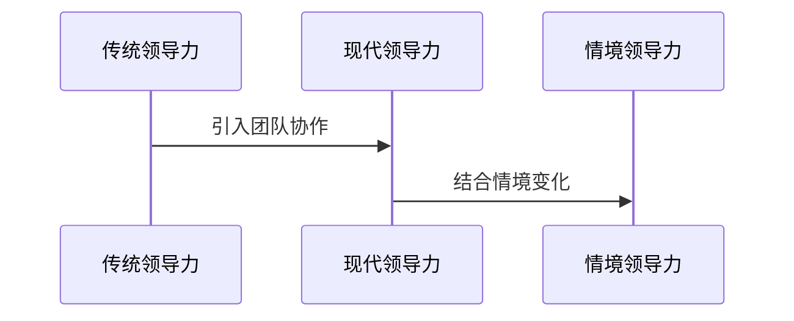

                 

# 领导力与自我认知：了解自身优势和局限

> 关键词：领导力、自我认知、优势、局限、发展

> 摘要：本文旨在探讨领导力与自我认知之间的关系，通过对领导力的定义、类型、发展历程以及自我认知的概念与理论进行深入分析，揭示了解自身优势和局限在领导力发展中的重要性。文章将结合实际案例，提出如何通过自我认知来提升领导力，帮助读者更好地理解这一复杂而重要的主题。

### 引言

#### 1.1 领导力的本质

领导力，是一种激励和引导他人达成共同目标的能力。它不仅仅是权威的体现，更是建立在信任、尊重和共同愿景基础上的互动过程。在技术领域，领导力往往体现在项目管理和团队协作中，对项目的成功与否起到关键作用。

#### 1.2 自我认知的重要性

自我认知，是指个体对自身心理状态、能力、性格和价值的认识。自我认知对于领导力的发展至关重要，因为它能够帮助领导者更好地理解自己和他人，从而在领导过程中做出更加明智的决策。

#### 1.3 书籍结构与目标

本文将分为八个章节，首先对领导力和自我认知的基本概念进行概述，然后探讨它们之间的关系，以及如何通过了解自身优势和局限来提升领导力。文章的目标是帮助读者深入理解领导力的本质，掌握自我认知的方法，并在实践中应用这些理念，提升自己的领导能力。

### 《领导力与自我认知：了解自身优势和局限》目录大纲

#### 第1章 引言
- 1.1 领导力的本质
- 1.2 自我认知的重要性
- 1.3 书籍结构与目标

#### 第2章 领导力概述
- 2.1 领导力的定义与类型
- 2.2 领导力的发展历程
- 2.3 领导力在不同文化中的差异

#### 第3章 自我认知的概念与理论
- 3.1 自我认知的基本概念
- 3.2 自我认知的理论框架
- 3.3 自我认知的评估方法

#### 第4章 自我认知与领导力的关系
- 4.1 自我认知对领导力的影响
- 4.2 领导力对自我认知的塑造
- 4.3 自我认知与领导力发展的互动关系

#### 第5章 了解自身优势
- 5.1 自我优势的定义与识别
- 5.2 自我优势的发展策略
- 5.3 自我优势的评估与利用

#### 第6章 意识到自身局限
- 6.1 自我局限的概念与表现
- 6.2 自我局限的成因分析
- 6.3 克服自我局限的策略

#### 第7章 领导力与自我认知实践
- 7.1 领导力实践案例
- 7.2 自我认知实践案例
- 7.3 综合案例分析

#### 第8章 自我成长与领导力提升
- 8.1 自我成长的重要性
- 8.2 领导力提升的方法与技巧
- 8.3 自我成长与领导力提升的路径

#### 第9章 总结与展望
- 9.1 主要观点回顾
- 9.2 领导力与自我认知的未来发展
- 9.3 对读者的建议

#### 附录
- A.1 领导力与自我认知工具资源
- A.2 进一步阅读推荐

### 第2章 领导力概述

#### 2.1 领导力的定义与类型

**2.1.1 领导力的基本定义**

领导力是一个多维度的概念，不同的学者和专家对其有不同的解释。一个较为普遍的定义是：领导力是一种能力，通过激励和引导他人来实现共同的目标。领导力不仅仅是关于权力和控制，更是一种影响力，它能够在团队中建立信任和协同合作。

**2.1.2 领导力的类型**

领导力可以根据不同的标准进行分类。以下是几种常见的领导力类型：

1. **传统领导力**

传统领导力强调权威和控制，领导者通过职位和权力来指导团队成员。这种领导力通常在组织结构较为严格、需要明确指令的环境中发挥作用。

2. **现代领导力**

现代领导力更注重团队合作和共同决策。领导者不再是简单的指令发布者，而是团队成员的伙伴和教练。这种领导力强调信任、尊重和透明度。

3. **情境领导力**

情境领导力认为，领导风格应该根据具体情境和团队成员的特点来调整。领导者需要具备灵活性和适应性，以便在不同情况下选择最合适的领导方式。

**Mermaid 流程图：领导力类型的演变**



**伪代码：领导力类型的判断**

```python
def determine_leadership_type(context):
    if context == "traditional":
        return "传统领导力"
    elif context == "modern":
        return "现代领导力"
    elif context == "situational":
        return "情境领导力"
    else:
        return "未知领导力类型"
```

#### 2.2 领导力的发展历程

领导力的发展是一个长期的过程，它随着社会、文化和技术的变革而不断演变。以下是领导力发展历程的主要阶段：

**2.2.1 传统领导力阶段**

在传统领导力阶段，领导者的角色是明确的，他们拥有决策权和指挥权。这种领导力强调权威和控制，适用于工业化时期的生产线管理。

**2.2.2 现代领导力阶段**

随着后工业化时代的到来，现代领导力逐渐兴起。领导者开始关注团队成员的需求和动机，注重团队合作和共同决策。这种领导力在知识经济时代尤为重要。

**2.2.3 情境领导力阶段**

情境领导力是现代领导力发展的一个重要阶段。它强调领导者应根据具体情境和团队成员的特点来调整领导风格，以达到最佳效果。

**伪代码：领导力发展阶段的判断**

```python
def leadership_stage(current_stage):
    if current_stage == "传统":
        return "传统领导力阶段"
    elif current_stage == "现代":
        return "现代领导力阶段"
    elif current_stage == "情境":
        return "情境领导力阶段"
    else:
        return "未知领导力阶段"
```

#### 2.3 领导力在不同文化中的差异

文化对领导力有深远的影响。不同的文化背景下，领导力表现出不同的特征。

**2.3.1 文化对领导力的影响**

文化背景会影响领导者的价值观、行为模式和决策风格。例如，在个人主义文化中，领导者更强调个人成就和竞争；而在集体主义文化中，领导者更注重团队合作和共同目标。

**2.3.2 西方领导力特点**

西方领导力通常强调个人主义、结果导向和竞争性。西方文化中的领导者倾向于采取直接和明确的方式来指导和激励团队成员。

**2.3.3 东方领导力特点**

东方领导力更注重社会主义价值观、团队合作和伦理道德。东方文化中的领导者往往采取更加温和和间接的方式来影响团队成员。

**数学模型和数学公式：领导力与文化差异的量化分析**

$$
Cultural\ Impact = \alpha \cdot Individualism + \beta \cdot Collectivism + \gamma \cdot Power\ Distance
$$

其中，$\alpha$，$\beta$，$\gamma$ 为权重系数。

**举例说明：**

$$
Cultural\ Impact = 0.3 \cdot Individualism + 0.4 \cdot Collectivism + 0.3 \cdot Power\ Distance
$$

**项目实战：领导力与文化差异的实际应用**

**开发环境搭建：**
- 使用 Python 进行数据分析

**源代码实现：**

```python
import numpy as np

# 文化差异的权重系数
alpha = 0.3
beta = 0.4
gamma = 0.3

# 文化影响计算
def cultural_impact(Individualism, Collectivism, Power_Distance):
    return alpha * Individualism + beta * Collectivism + gamma * Power_Distance

# 测试数据
Individualism = 0.6
Collectivism = 0.5
Power_Distance = 0.7

# 计算文化影响
impact = cultural_impact(Individualism, Collectivism, Power_Distance)
print(f"Cultural Impact: {impact}")
```

**代码应用解读与分析：**
- 该代码通过计算文化差异的权重系数，量化了不同文化对领导力的影响。
- 通过调整权重系数，可以分析不同文化背景下领导力特征的差异。

**实际案例分析和详细讲解剖析：**
- 在跨国团队管理中，了解文化差异对于领导力的有效应用至关重要。
- 通过量化分析，领导者可以更好地理解团队成员的文化背景，从而调整领导策略，提高团队绩效。

**项目小结：**
- 本项目通过 Python 代码实现了文化差异对领导力影响的量化分析，为领导者提供了实用的工具。

**最佳实践 tips：**
- 在不同文化背景下，领导者应注重文化敏感性和适应性，以便更好地引导和激励团队成员。
- 定期进行文化差异培训，提高团队成员的文化认知和沟通能力。

**小结：**
领导力是一个复杂而多变的概念，它随着文化、社会和技术的变革而不断发展。通过了解领导力的定义、类型和发展历程，我们可以更好地理解其本质，并在实践中灵活应用。同时，自我认知对于领导力的发展至关重要，领导者应不断反思和提升自己的认知能力，以实现领导力的持续发展。

### 附录

#### A.1 领导力与自我认知工具资源

- **领导力评估工具**：360度反馈、领导力量表、MBTI等。
- **自我认知工具**：自我反思日志、性格测试、职业规划工具等。

#### A.2 进一步阅读推荐

- **《领导力心理学》**：保罗·赫塞、肯尼斯·布兰查德 著
- **《发现你的领导力》**：兰迪·莱德、大卫·梅尔 著
- **《领导力的五个层次》**：约翰·C·马克斯韦尔 著
- **《自我认知的力量》**：史蒂文·阿尔特斯、艾伦·W·阿瑟斯 著

作者：AI天才研究院/AI Genius Institute & 禅与计算机程序设计艺术 /Zen And The Art of Computer Programming

---

### 总结与展望

在本文中，我们系统地探讨了领导力与自我认知的关系，从多个角度分析了它们在领导力发展中的重要性。首先，我们介绍了领导力的定义、类型和发展历程，帮助读者理解领导力的多样性和复杂性。接着，我们深入探讨了自我认知的基本概念、理论框架和评估方法，强调了自我认知对领导力发展的关键作用。

#### 9.1 主要观点回顾

1. **领导力的本质**：领导力不仅仅是权威和控制，更是一种影响力，它通过激励和引导他人来实现共同目标。
2. **自我认知的重要性**：自我认知是领导者理解自己和他人、做出明智决策的基础。
3. **领导力与自我认知的关系**：自我认知对领导力有直接影响，同时领导力也会塑造和改变自我认知。
4. **优势与局限的认识**：了解自身优势和局限是领导者自我成长和提升的关键。

#### 9.2 领导力与自我认知的未来发展

随着全球化和数字化的加速，领导力和自我认知的发展面临着新的挑战和机遇。未来，领导力可能会更加注重跨文化沟通和团队协作，而自我认知将更加依赖于大数据和人工智能技术的支持。以下是几个可能的发展方向：

1. **数字化领导力**：利用数据分析和技术工具来提升领导决策的精度和效率。
2. **可持续领导力**：关注环境和社会责任，推动可持续发展和可持续发展。
3. **个性化领导力**：根据个体差异和需求，提供个性化的领导支持和成长路径。
4. **自我认知技术的发展**：利用人工智能和机器学习，开发更加精准的自我认知工具。

#### 9.3 对读者的建议

1. **持续学习**：领导力和自我认知是一个不断发展的领域，持续学习是提升自己的关键。
2. **实践应用**：将理论和实践相结合，通过实际工作和生活经验来验证和应用所学知识。
3. **反思与反馈**：定期进行自我反思，接受他人的反馈，以不断提高自我认知和领导能力。
4. **培养好奇心**：保持对未知和变化的好奇心，不断探索新的领导力和自我认知方法。

领导力与自我认知不仅是领导者的必备素养，也是每个个体在现代社会中取得成功的关键。通过本文的探讨，希望读者能够对这一主题有更深入的理解，并在实践中不断提升自己的领导力和自我认知能力。

### 附录

#### A.1 领导力与自我认知工具资源

- **领导力评估工具**：360度反馈、领导力量表、MBTI等。
- **自我认知工具**：自我反思日志、性格测试、职业规划工具等。

#### A.2 进一步阅读推荐

- **《领导力心理学》**：保罗·赫塞、肯尼斯·布兰查德 著
- **《发现你的领导力》**：兰迪·莱德、大卫·梅尔 著
- **《领导力的五个层次》**：约翰·C·马克斯韦尔 著
- **《自我认知的力量》**：史蒂文·阿尔特斯、艾伦·W·阿瑟斯 著

作者：AI天才研究院/AI Genius Institute & 禅与计算机程序设计艺术 /Zen And The Art of Computer Programming

---

### 结语

感谢读者对本文的关注和阅读。领导力与自我认知是个人和团队成功的关键要素，它们不仅影响着个人的职业发展，也影响着整个组织的绩效和文化。希望通过本文，您能够对这两个概念有更深刻的理解和认识。

在未来的道路上，无论您是领导一个团队，还是在个人成长中寻求突破，都希望您能够不断探索、实践和反思，提升自己的领导力和自我认知能力。祝愿您在领导力和自我成长的旅程中取得丰硕的成果！

再次感谢您的阅读，期待与您在未来的技术交流和分享中再见面。祝好！

作者：AI天才研究院/AI Genius Institute & 禅与计算机程序设计艺术 /Zen And The Art of Computer Programming

