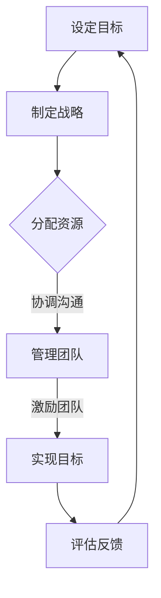
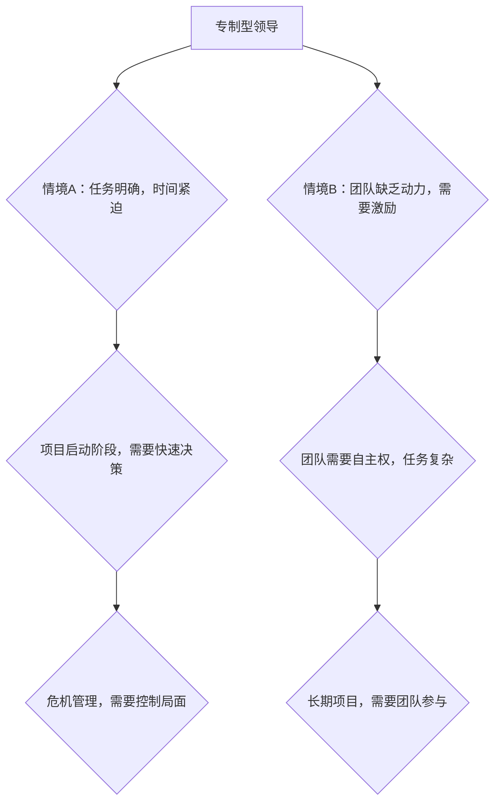
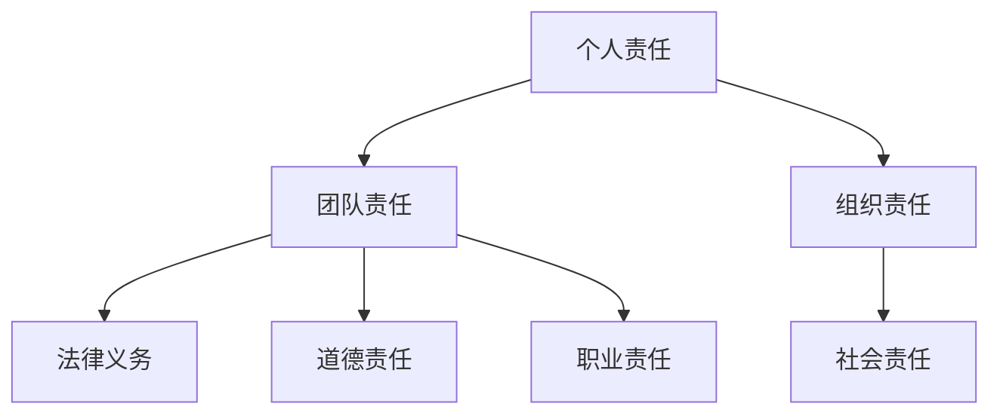
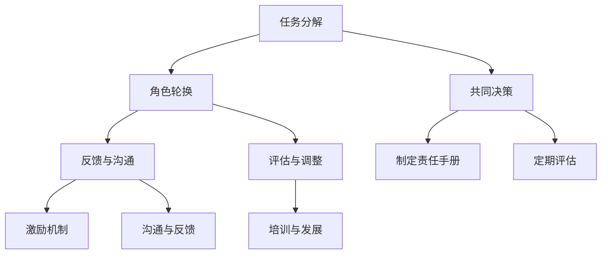
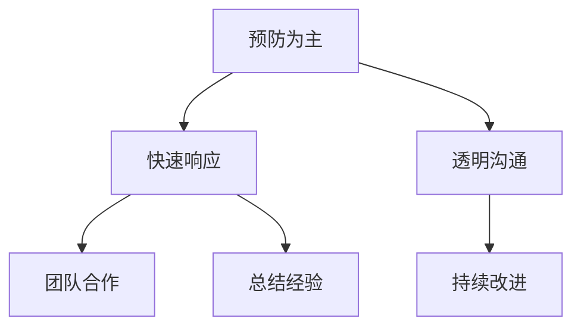
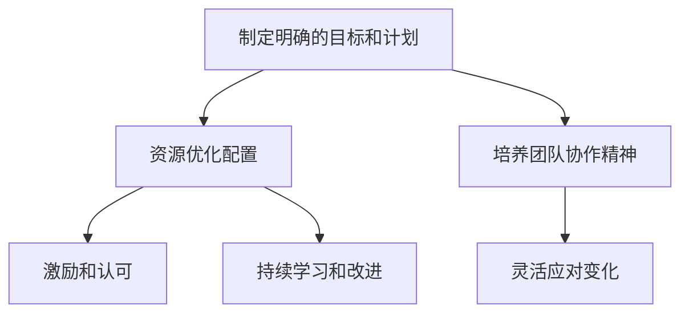
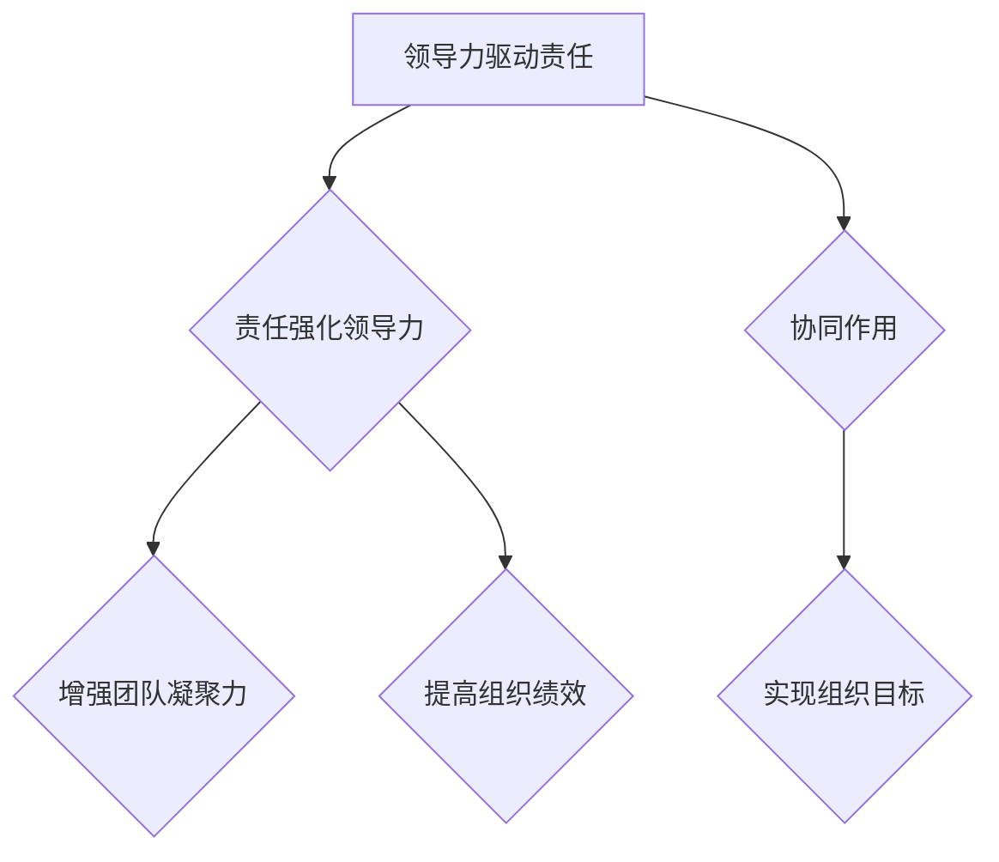
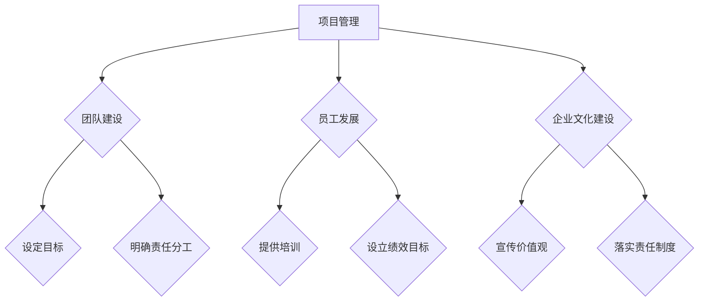
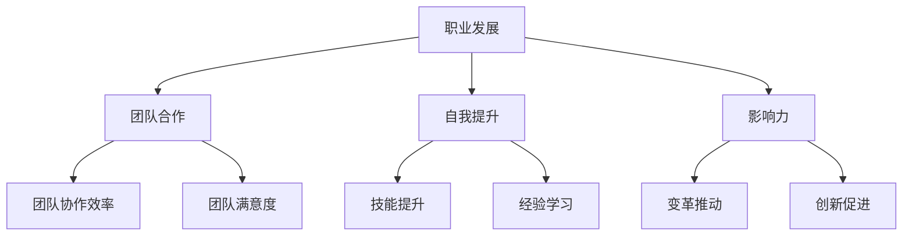

                 

### 概述：领导力与责任的必要性与文章结构

在当今快速变化和高竞争的科技领域，领导力和责任扮演着至关重要的角色。一个组织的成功与否，往往取决于其领导者的能力以及团队成员的责任心。领导力不仅仅是指导和管理团队，更是一种激励和引领他人共同实现目标的艺术。同时，责任是领导力的核心组成部分，它要求领导者能够在面对挑战和失败时承担责任，并能够与团队成员共享成功的果实。

本文的目的是深入探讨领导力和责任在IT领域的具体体现，帮助读者理解这两者之间的内在联系和相互作用。通过本文，您将了解到：

1. **领导力的定义与重要性**：探讨领导力的基本概念，以及其在企业管理和个人成长中的关键作用。
2. **领导力模型与理论**：回顾经典的领导力模型和理论，并分析不同领导风格对团队和企业的影响。
3. **领导力技能与素质**：分析领导者应具备的技能和素质，以及提升领导力的方法和实践。
4. **责任的内涵与外延**：深入探讨责任的概念，以及责任意识在团队和企业中的培养和应用。
5. **失误与成功的要素**：分析失误的不可避免性，以及成功的要素和策略。
6. **领导力与责任实践**：结合实际案例，探讨领导力与责任在企业和个人成长中的具体应用。

### 目录与大纲

**《领导力与责任：承担失误、分享成功》**

#### 第一部分：领导力基础

1. **第1章：领导力的定义与重要性**
    - 1.1. 领导力的定义
    - 1.2. 领导力的作用与影响
    - 1.3. 领导力的重要性

2. **第2章：领导力模型与理论**
    - 2.1. 领导力模型的演变
    - 2.2. 经典领导力理论概述
    - 2.3. 领导风格与行为理论

3. **第3章：领导力技能与素质**
    - 3.1. 领导者必备的技能
    - 3.2. 领导者应具备的素质
    - 3.3. 领导力提升的方法与实践

#### 第二部分：责任承担

1. **第4章：责任的内涵与外延**
    - 4.1. 责任的定义
    - 4.2. 责任的内涵与外延
    - 4.3. 责任与义务的区别

2. **第5章：责任意识的培养**
    - 5.1. 责任意识的重要性
    - 5.2. 责任意识的培养方法
    - 5.3. 责任意识的实际应用

3. **第6章：责任分配与管理**
    - 6.1. 责任分配的原则
    - 6.2. 责任分配的技巧
    - 6.3. 责任管理的实践

#### 第三部分：失误与成功

1. **第7章：失误的不可避免性**
    - 7.1. 失误的定义与类型
    - 7.2. 失误的不可避免性
    - 7.3. 应对失误的策略

2. **第8章：成功的要素与策略**
    - 8.1. 成功的定义与要素
    - 8.2. 成功的策略与实践
    - 8.3. 成功的案例分析

#### 第四部分：领导力与责任实践

1. **第9章：领导力与责任的融合**
    - 9.1. 领导力与责任的相互作用
    - 9.2. 领导力与责任在实践中的应用
    - 9.3. 领导力与责任的案例分析

2. **第10章：领导力与责任的企业实践**
    - 10.1. 企业领导力的提升
    - 10.2. 企业责任的履行
    - 10.3. 企业领导力与责任融合的实践案例

3. **第11章：领导力与责任的个人成长**
    - 11.1. 领导力与责任在个人成长中的作用
    - 11.2. 个人领导力与责任的发展策略
    - 11.3. 个人领导力与责任成长的案例

### 摘要

本文探讨了领导力与责任在IT领域的双重重要性。首先，分析了领导力的定义与重要性，以及不同领导力模型和理论的应用。接着，深入讨论了责任的内涵与外延，以及责任意识的培养和责任分配与管理的原则。随后，探讨了失误的不可避免性以及成功的要素和策略。最后，通过实际案例展示了领导力与责任在企业实践和个人成长中的具体应用，为企业领导者和个人提供了实用的指导。通过本文，读者将深刻理解领导力与责任的重要性，并学会如何在实践中有效运用这些原则，以推动组织和个人取得成功。

#### 第1章：领导力的定义与重要性

**1.1. 领导力的定义**

领导力是一个多维度的概念，它不仅涉及个人特质和行为，还包括对情境的感知和反应。根据约翰·肯尼斯·加德纳（John Kenneth Galbraith）的定义，领导力是一种影响力，它能够激励人们为实现共同目标而努力。简而言之，领导力是关于如何引导他人、激发潜能和共同追求目标的能力。

在IT领域，领导力被赋予了特定的含义。它不仅要求领导者具备技术能力和商业洞察力，还需要他们能够适应快速变化的技术环境，并推动团队不断创新。例如，在软件开发中，领导力意味着能够激发团队成员的创造力，确保项目按时交付，并在面对技术挑战时提供有效的解决方案。

**1.2. 领导力的作用与影响**

领导力在组织中的核心作用是指导和激励团队成员，以实现既定的目标。首先，领导力能够塑造组织文化，确定组织的价值观和行为准则。一个具有强大领导力的团队往往会展现出更高的士气和更强的凝聚力。其次，领导力能够促进创新和进步。领导者通过鼓励团队成员提出新想法和探索新领域，可以推动技术突破和业务增长。

具体来说，领导力在IT领域的几个关键方面具有显著影响：

- **项目管理和协调**：领导者需要确保项目按计划进行，同时协调各个团队成员的工作。这要求他们具备出色的沟通能力和时间管理技能。
- **技术决策**：在技术项目中，领导者需要做出关键的技术决策，如技术路线的选择、工具的采用等。这要求他们具备深厚的专业知识和技术背景。
- **团队建设**：领导者通过塑造积极向上的团队氛围，增强团队成员之间的协作和信任，从而提高团队的绩效和满意度。

**1.3. 领导力的重要性**

在IT行业中，领导力的重要性不容忽视。以下是一些原因：

- **推动创新**：领导者能够激发团队成员的创造力，推动技术上的创新。在一个创新驱动的行业，领导力是实现持续竞争优势的关键。
- **应对变化**：IT行业变化迅速，领导者需要具备灵活性和适应性，能够迅速调整策略和方向，以应对外部环境的变化。
- **人才吸引与保留**：优秀的领导力能够吸引和保留顶尖人才。在竞争激烈的人才市场中，领导者的魅力和影响力是关键因素。
- **团队绩效**：领导力能够显著提高团队的整体绩效。一个高效的团队不仅能够按时交付高质量的项目，还能在压力和挑战面前保持稳定。

为了更好地理解领导力的重要性，我们可以通过一个简单的Mermaid流程图来展示领导力在企业中的角色和影响：

在这个流程图中，领导力贯穿了企业运作的各个阶段，从设定目标、制定战略到管理团队，最终实现目标并不断进行评估和反馈。这表明领导力不仅是推动项目成功的关键因素，也是持续改进和发展的动力源泉。

通过上述分析，我们可以看出领导力在IT领域的重要性。它不仅是项目成功的关键，也是推动组织持续发展的核心驱动力。在接下来的章节中，我们将进一步探讨领导力模型与理论，以及领导者应具备的技能和素质。

#### 第2章：领导力模型与理论

**2.1. 领导力模型的演变**

领导力模型是研究和实践领导力的重要工具，它们帮助我们理解和应用领导力原则。领导力模型的演变经历了几个阶段，从传统的领导力理论到现代的复杂模型。

- **传统领导力模型**：在早期，领导力模型主要关注领导者个人的特质和属性。例如，特里萨·梅·博兹（Teresa M. Bohn）的“伟大领袖理论”（Great Man Theory）认为领导者是天生的，具有独特的品质和才能。托马斯·杰斐逊（Thomas Jefferson）和乔治·华盛顿（George Washington）等历史人物被作为这一理论的典型例子。

- **行为领导力模型**：随着心理学和行为科学的发展，人们开始关注领导者实际的行为模式。行为领导力模型强调领导者通过具体的行为来影响团队和下属。赫塞和布兰查德的“情境领导模型”（Situation Leadership Model）是这一理论的代表。该模型认为领导者的风格应根据不同的情境和下属的特点进行灵活调整。

- **变革型领导力模型**：20世纪末，随着全球化和管理环境的复杂性增加，变革型领导力模型（Transformational Leadership Model）逐渐受到关注。这种模型认为领导者通过激励和启发下属来实现变革和进步。约翰·肯尼斯·加德纳（John Kenneth Galbraith）提出的“变革型领导力”强调领导者的愿景、价值观和动机。

- **复杂领导力模型**：现代领导力模型更加综合和复杂，不仅考虑领导者的个人特质和行动，还关注领导过程、组织文化和环境因素。例如，罗伯特·J·豪斯（Robert J. House）的“路径-目标理论”（Path-Goal Theory）认为领导者通过设置目标和提供路径来帮助下属实现目标。

**2.2. 经典领导力理论概述**

以下是一些经典领导力理论及其核心观点：

- **特质理论（Trait Theory）**：特质理论认为领导者具有一些独特的个人特质，如自信、决断力和责任感。这种理论试图识别领导者的共同特质，以预测谁可能成为领导者。然而，研究表明，特质并非领导力的唯一决定因素。

- **行为理论（Behavioral Theory）**：行为理论关注领导者的具体行为，认为领导者通过不同的行为模式来影响下属。行为理论提出了多种领导风格，如民主型领导、专制型领导和参与型领导。这些理论试图识别不同情境下最有效的领导行为。

- **情境理论（Situational Theory）**：情境理论认为领导风格应根据具体情境进行调整。领导者需要根据下属的能力、环境的变化和目标的性质来选择最合适的领导方式。例如，赫塞和布兰查德的“情境领导模型”提出，领导者的行为应与下属的成熟度相匹配。

- **变革型领导力理论（Transformational Leadership Theory）**：变革型领导力理论强调领导者的愿景、价值观和动机对团队的影响。领导者通过激励、启发和激励下属来实现变革和卓越表现。这种理论认为领导者是变革的推动者和创新者。

- **服务型领导力理论（Servant Leadership Theory）**：服务型领导力理论认为领导者的首要任务是服务团队成员，通过满足团队成员的需求来推动团队和组织的发展。这种领导风格强调团队合作、共同成长和组织的整体福祉。

**2.3. 领导风格与行为理论**

领导风格是指领导者处理工作、团队和关系的方式。不同的领导风格对团队和组织产生不同的影响。以下是一些常见的领导风格：

- **专制型领导（Authoritative Leadership）**：专制型领导者做出决策并指导下属执行。他们通常具有强烈的控制欲望，但可能会抑制团队成员的创造力和主动性。

- **民主型领导（Democratic Leadership）**：民主型领导者鼓励团队成员参与决策过程，尊重下属的意见和建议。这种领导风格可以增强团队的凝聚力和归属感。

- **参与型领导（Participative Leadership）**：参与型领导者与团队成员共同制定决策，确保所有利益相关者都参与其中。这种领导风格有助于提高团队成员的参与度和责任感。

- **变革型领导（Transformational Leadership）**：变革型领导者通过激发和激励团队成员来实现变革和卓越表现。他们具有远见和愿景，能够激发团队成员的潜力和动机。

- **服务型领导（Servant Leadership）**：服务型领导者以团队成员的需求为中心，通过服务和支持团队成员来实现组织目标。他们强调团队合作和共同成长。

不同的领导风格适用于不同的情境和团队。领导者需要根据具体情境和团队特点选择最合适的领导风格。以下是一个Mermaid流程图，展示了不同领导风格的应用场景：

在这个流程图中，不同的领导风格适用于不同的情境。例如，在任务明确且时间紧迫的情境下，专制型领导可以确保项目顺利推进；而在团队需要自主权和动力的情境下，参与型领导可以激发团队潜力。

通过上述分析，我们可以看到领导力模型的演变和不同领导力理论的核心观点。这些理论和模型为领导者提供了丰富的指导，帮助他们理解和应用领导力原则。在下一章中，我们将深入探讨领导者的技能和素质，以及如何提升领导力。

#### 第3章：领导力技能与素质

**3.1. 领导者必备的技能**

一个成功的领导者需要具备多种技能，这些技能不仅包括技术能力，还包括人际关系和沟通能力。以下是一些领导者必备的关键技能：

- **技术技能**：领导者必须具备足够的技术知识，以理解和指导团队的工作。这包括对行业最新技术和趋势的熟悉，以及对关键技术的深入理解。例如，在软件开发领域，领导者需要了解编程语言、框架和开发工具，以便能够与技术团队进行有效沟通，并做出明智的技术决策。

- **决策能力**：领导者需要在各种复杂和不确定的情况下做出决策。这要求他们具备分析能力、判断力和风险承受能力。领导者需要能够权衡各种因素，快速做出决策，并在必要时承担决策后果。

- **战略思维**：领导者需要具备战略思维，能够从长远角度规划团队和组织的方向。他们需要确定组织的愿景和目标，并制定实现这些目标的策略。战略思维还包括对市场和竞争对手的洞察力，以及如何利用这些洞察力制定竞争优势。

- **沟通能力**：领导者需要具备出色的沟通能力，包括口头和书面沟通。他们需要能够清晰地表达自己的想法，并有效地传达给团队成员。沟通能力还包括倾听能力，领导者需要倾听团队成员的意见和反馈，以便更好地理解他们的需求和问题。

- **团队管理**：领导者需要具备团队管理技能，包括激励团队成员、解决冲突和培养团队合作。他们需要能够识别每个团队成员的优势和弱点，并为他们提供适当的指导和支持。

- **问题解决**：领导者需要具备问题解决能力，能够迅速识别问题，并提出有效的解决方案。他们需要能够分析问题的根本原因，并制定解决方案，以确保问题的彻底解决。

**3.2. 领导者应具备的素质**

除了技能外，领导者还需要具备一系列素质，这些素质是他们领导力的基础。以下是一些关键的领导素质：

- **自信**：领导者需要具备自信，能够在不确定和压力的情况下保持冷静和镇定。自信使领导者能够面对挑战，并激励团队成员克服困难。

- **正直**：正直是领导者最重要的素质之一。领导者需要诚信正直，以树立良好的榜样，赢得团队成员的信任和尊重。正直还包括遵守道德和伦理准则，坚持做正确的事情。

- **责任感**：领导者需要具备责任感，能够在面对失败和挑战时承担责任。责任感使领导者能够在困难时期保持团队的稳定和凝聚力。

- **灵活性**：领导者需要具备灵活性，能够适应快速变化的环境和新的挑战。灵活性包括开放心态、接受新观点和适应新情境的能力。

- **适应性**：领导者需要具备适应性，能够在不同的团队和文化中工作，并适应不同的领导情境。适应性使领导者能够有效地管理多元化的团队，并推动组织的国际化发展。

- **创新精神**：领导者需要具备创新精神，能够鼓励团队成员提出新的想法和解决方案。创新精神是推动组织进步和保持竞争优势的关键。

- **团队合作**：领导者需要具备团队合作精神，能够在团队中扮演积极的角色，并与团队成员建立信任和合作关系。团队合作精神有助于提高团队的绩效和满意度。

**3.3. 领导力提升的方法与实践**

提升领导力是一个持续的过程，以下是一些有效的方法和实践：

- **自我反思**：领导者需要定期进行自我反思，评估自己的领导行为和效果。通过自我反思，领导者可以发现自身的优点和不足，并制定改进计划。

- **学习与培训**：领导者需要不断学习新知识和技能，参加领导力培训和研讨会。通过学习，领导者可以了解最新的领导理论和方法，并将其应用到实践中。

- **导师制度**：领导者可以寻找一位导师，从他们那里学习领导经验和技巧。导师可以帮助领导者理解领导力背后的原理，并提供宝贵的反馈和建议。

- **模拟实践**：领导者可以通过模拟实践来提升自己的领导技能。例如，参加领导力游戏或角色扮演活动，这些活动可以模拟真实的领导情境，帮助领导者应对各种挑战。

- **反馈机制**：领导者需要建立有效的反馈机制，定期收集团队成员的意见和建议。通过反馈，领导者可以了解团队成员的感受和需求，并调整自己的领导风格和行为。

- **实践应用**：领导者需要将学到的知识和技能应用到实际工作中。通过实践，领导者可以验证和巩固自己的领导能力，并不断改进自己的领导方法。

- **团队建设活动**：领导者可以组织团队建设活动，增强团队的凝聚力和协作能力。这些活动可以包括团队拓展训练、团队讨论和团队竞赛等。

通过上述方法和实践，领导者可以不断提升自己的领导力，成为一个更有效的领导者。在下一章中，我们将深入探讨责任的概念，以及责任在团队和企业中的培养和应用。

### 第4章：责任的内涵与外延

**4.1. 责任的定义**

责任是一个多维度的概念，它涉及个人、团队和组织层面的行为和态度。根据牛津词典的定义，责任是指对行为、决策或事件承担的义务和责任。在更广泛的层面上，责任不仅指个人应尽的任务，还包括对他人和组织的承诺和贡献。

在IT领域，责任尤为重要。IT项目通常涉及复杂的技术和高度的不确定性，任何错误或失误都可能导致严重的后果。因此，责任不仅仅是完成任务，更是确保项目成功的关键因素。一个负责任的IT领导者需要具备以下特点：

- **责任心**：领导者必须对项目的成功承担责任，即使在面对困难和挑战时也能保持积极的态度和行动。
- **透明度**：领导者需要保持透明，向团队成员、管理层和客户清楚地传达项目进展和潜在风险。
- **决策能力**：在关键时刻，领导者需要做出明智的决策，并承担决策的后果。
- **风险管理**：领导者需要识别和评估项目风险，并制定相应的应对措施，以减少潜在损失。

**4.2. 责任的内涵与外延**

责任的内涵是指责任所包含的各个方面和层次，而责任的外延则是指责任在不同情境和领域的应用。

- **个人层面**：在个人层面，责任通常指个人对自己的行为和决策负责。在IT领域，这包括按时完成任务、保证代码质量、遵守安全规范等。个人责任是团队合作的基础，也是项目成功的关键。

- **团队层面**：在团队层面，责任指团队成员之间的相互责任和协作。一个团队的成功不仅取决于个人成员的能力，更取决于团队成员之间的协作和相互支持。在IT项目中，团队合作、知识共享和相互监督都是责任的重要组成部分。

- **组织层面**：在组织层面，责任指组织对客户、员工和社会的承诺和贡献。组织责任包括确保项目按时交付、提供高质量的服务、遵守法律法规、推动可持续发展等。一个负责任的组织能够赢得客户的信任和社会的尊重，从而获得长期的成功。

**4.3. 责任与义务的区别**

责任和义务是两个相关但不完全相同的概念。义务通常是指由法律、规定或合同明确规定的必须履行的任务。例如，公司员工必须遵守公司政策和法律要求，这是一种明确的义务。而责任则更加宽泛，它不仅包括法律和规定要求的义务，还包括道德、职业和社会责任。

- **法律义务**：法律义务是由法律规定的，如合同条款、劳动合同等。违反法律义务可能会导致法律责任，如罚款、赔偿或诉讼。
- **道德责任**：道德责任是指个人或组织基于道德原则和价值观应承担的责任。例如，保护用户隐私、确保数据安全等，这些都是道德责任的重要方面。
- **职业责任**：职业责任是指专业人士基于职业准则和行业标准应承担的责任。例如，软件工程师需要确保代码质量、遵守安全规范等。
- **社会责任**：社会责任是指组织对社会和环境承担的责任。例如，企业需要推动可持续发展、减少碳排放等。

以下是一个Mermaid流程图，展示了责任的不同层次和内涵：

在这个流程图中，个人责任是基础，团队责任是个人责任的延伸，而组织责任则涵盖了更广泛的领域，包括法律、道德、职业和社会责任。这表明责任是一个多维度的概念，它在不同层面和情境中都有重要的应用。

通过上述分析，我们可以看到责任的内涵和外延的复杂性。在IT领域，领导者需要深刻理解责任的含义，并在个人、团队和组织层面承担相应的责任。这不仅有助于确保项目的成功，也能为组织的长期发展奠定坚实的基础。在下一章中，我们将探讨如何培养责任意识，以及责任在团队和企业中的实际应用。

#### 第5章：责任意识的培养

**5.1. 责任意识的重要性**

责任意识是领导者成功的关键因素之一，它不仅影响个人的行为和决策，还影响团队和组织的发展。责任意识强的领导者能够主动承担责任，即使在面临困难和挑战时也能保持积极的态度和行动。这种意识有助于建立团队的信任和凝聚力，提高团队的绩效和满意度。

在IT领域，责任意识尤为重要。因为IT项目通常涉及复杂的技术和高度的不确定性，任何错误或失误都可能导致严重的后果。一个具有高度责任意识的领导者能够识别潜在的风险，并采取预防措施，确保项目的成功。以下是责任意识在IT领域的重要性：

- **风险管理**：责任意识使领导者能够识别和评估项目风险，并采取相应的措施来减少潜在损失。这有助于确保项目的顺利进行和按时交付。
- **团队合作**：责任意识有助于建立团队成员之间的信任和协作。一个具有高度责任意识的领导者能够激励团队成员积极参与项目，共同承担责任。
- **客户满意度**：责任意识使领导者能够确保项目质量，提供高质量的服务。这有助于提高客户满意度，建立良好的市场口碑。
- **组织文化**：责任意识是组织文化的基石。一个具有高度责任意识的领导者能够树立榜样，推动组织内部形成积极向上的氛围，促进组织的长期发展。

**5.2. 责任意识的培养方法**

培养责任意识是一个持续的过程，需要领导者通过多种方法来提升自己的意识和能力。以下是一些有效的方法：

- **自我反思**：领导者需要定期进行自我反思，评估自己的行为和决策是否符合责任意识的要求。通过自我反思，领导者可以发现自身的不足，并制定改进计划。
- **培训和教育**：领导者可以通过参加培训和教育课程来学习责任意识的重要性以及如何将其应用于实践中。这些课程可以涵盖领导力、风险管理、道德伦理等方面。
- **角色扮演**：领导者可以通过角色扮演来模拟不同的领导情境，练习如何承担责任和应对挑战。这有助于提高领导者的实际操作能力和应对能力。
- **建立责任制**：领导者可以制定明确的责任制度，确保每个团队成员都清楚自己的职责和义务。这有助于提高团队的协作效率和责任感。
- **反馈机制**：领导者需要建立有效的反馈机制，定期收集团队成员的意见和建议。通过反馈，领导者可以了解团队成员的感受和需求，并调整自己的领导风格和行为。
- **团队建设活动**：领导者可以组织团队建设活动，增强团队的凝聚力和社会责任感。这些活动可以包括团队讨论、社区服务、拓展训练等。

**5.3. 责任意识的实际应用**

以下是一些具体的案例，展示了责任意识在IT领域的实际应用：

- **项目风险管理**：在一个IT项目中，领导者发现项目进度延误，他主动承担责任，与团队成员一起分析原因，并采取有效措施加快进度。他通过定期更新项目状态和与团队成员的沟通，确保项目最终按时交付。
- **团队合作**：在一个软件开发项目中，领导者鼓励团队成员积极参与决策和问题解决，建立了良好的沟通和协作机制。通过团队成员的共同努力，项目不仅按时完成，还超出了预期目标。
- **客户满意度**：在一个客户项目中，领导者确保项目团队严格按照客户要求进行开发，并在项目交付前进行多次测试，确保项目质量。最终，客户对项目的质量和服务表示满意，并与公司建立了长期的合作关系。
- **组织文化**：在一个大型IT公司中，领导者通过树立责任意识的榜样，推动组织内部形成积极向上的氛围。他鼓励团队成员勇于承担责任，并为他们提供必要的支持和资源。这种文化促进了组织的创新和成长，使公司成为行业内的佼佼者。

通过上述方法和实际案例，我们可以看到责任意识在IT领域的重要性。培养责任意识不仅有助于个人和团队的发展，也能为组织的长期成功奠定坚实的基础。在下一章中，我们将探讨责任分配与管理的原则和实践。

#### 第6章：责任分配与管理

**6.1. 责任分配的原则**

责任分配是领导力的重要组成部分，它关系到团队的效率、合作和目标的实现。有效的责任分配不仅可以提高团队成员的工作积极性，还能确保项目顺利进行。以下是几个关键的分配原则：

- **明确性**：责任分配应明确，每个团队成员都知道自己的职责和任务。这有助于避免工作重叠和责任缺失，提高团队的协作效率。
- **匹配性**：责任分配应与团队成员的能力和兴趣相匹配。将适合的任务分配给最适合的成员，可以提高工作质量和效率。
- **公平性**：责任分配应公平，确保每个团队成员承担的责任与其能力和贡献相匹配。这有助于维护团队内部的公平和和谐。
- **透明度**：责任分配过程应透明，团队成员应了解责任分配的理由和依据。这有助于增强团队成员的信任和理解，减少误解和冲突。
- **动态性**：责任分配应根据项目的进展和团队的需求进行动态调整。在项目不同阶段，团队成员的职责和任务可能会有所变化，领导者需要及时调整责任分配。

**6.2. 责任分配的技巧**

为了有效分配责任，领导者需要掌握一些具体的技巧。以下是一些实用技巧：

- **任务分解**：将大任务分解为小任务，并为每个小任务分配责任人。这有助于降低任务的复杂性，使团队成员更容易理解和完成。
- **角色轮换**：定期进行角色轮换，使团队成员有机会体验不同的职责和角色。这有助于提高团队成员的多技能和适应性，增强团队的灵活性和应对能力。
- **共同决策**：在责任分配过程中，鼓励团队成员参与决策，共同讨论和确定责任分配方案。这有助于增强团队成员的责任感和归属感。
- **反馈与沟通**：定期与团队成员沟通，了解他们的工作进展和遇到的困难。通过及时反馈和沟通，领导者可以提供必要的支持和资源，确保责任分配的有效性。
- **评估与调整**：定期评估责任分配的效果，根据实际情况进行调整。这有助于发现和解决责任分配中的问题，提高团队的整体绩效。

**6.3. 责任管理的实践**

以下是一些责任管理的实践方法，这些方法可以帮助领导者有效地管理团队的责任：

- **制定责任手册**：制定一份详细的《责任手册》，明确每个团队成员的职责、任务和期望。这有助于新成员快速融入团队，并确保团队成员了解自己的职责。
- **定期评估**：定期对团队成员的责任履行情况进行评估，包括工作进度、质量、问题解决能力等。这有助于及时发现和解决责任管理中的问题。
- **激励机制**：建立激励机制，奖励那些履行责任出色的团队成员。这可以激发团队成员的积极性，提高团队的整体绩效。
- **沟通与反馈**：建立有效的沟通渠道，鼓励团队成员之间的交流和反馈。这有助于团队成员相互了解和支持，共同完成任务。
- **培训与发展**：为团队成员提供培训和发展机会，提高他们的技能和素质。这有助于提高团队成员的责任感和执行力，推动团队的长远发展。

以下是一个Mermaid流程图，展示了责任分配和管理的流程：

在这个流程图中，任务分解、角色轮换、共同决策、反馈与沟通、评估与调整等环节构成了责任分配和管理的核心流程。通过这些环节的有效实施，领导者可以确保团队的责任分配和管理得到有效执行。

通过上述分析和实践方法，我们可以看到责任分配与管理在团队和项目管理中的重要性。有效的责任分配和管理不仅可以提高团队的绩效和满意度，还能为组织的长期成功奠定坚实的基础。在下一章中，我们将探讨失误的不可避免性以及如何应对失误。

### 第7章：失误的不可避免性

**7.1. 失误的定义与类型**

失误是指由于判断错误、操作失误或信息不足等原因导致的结果与预期不符。在IT领域，失误可能包括代码错误、设计缺陷、数据丢失、项目延期等。根据失误的原因和性质，可以将失误分为以下几种类型：

- **技术失误**：由于技术知识不足、工具选择不当或编程错误等原因导致的失误。例如，未考虑到某些边界条件，导致代码在特定情况下无法正常运行。
- **管理失误**：由于项目管理不善、沟通不畅或资源配置不合理等原因导致的失误。例如，未能及时调整项目进度，导致项目延期交付。
- **人为失误**：由于个人判断错误、操作失误或情绪波动等原因导致的失误。例如，因疲劳导致的疏忽，或者在压力下做出的不理智决策。
- **系统失误**：由于系统设计缺陷、硬件故障或软件漏洞等原因导致的失误。例如，系统崩溃导致大量数据丢失或服务中断。

**7.2. 失误的不可避免性**

尽管我们努力避免失误，但失误在IT领域中是不可避免的。以下是一些导致失误不可避免的原因：

- **复杂性**：IT项目通常涉及复杂的技术和多个团队之间的协作。复杂性使得问题难以预见和解决，增加了失误的可能性。
- **不确定性**：IT领域的发展速度快，技术变化频繁。在不确定性较高的环境中，即使是最有经验的团队和领导者也可能面临无法预测的问题。
- **人性因素**：人是复杂多变的，即使有严格的管理制度和流程，也无法完全消除人为失误。情绪、疲劳、注意力不集中等都可能导致失误的发生。
- **信息不对称**：在项目执行过程中，团队成员、管理层和客户之间可能存在信息不对称。这种不对称可能导致决策失误或执行错误。

**7.3. 应对失误的策略**

面对失误，领导者需要采取积极的策略来应对，以减轻失误的影响并从中学到经验。以下是一些有效的应对策略：

- **预防为主**：在项目规划和执行过程中，采取预防措施来减少失误的发生。这包括制定详细的计划、进行风险评估、提供培训等。
- **快速响应**：在失误发生后，领导者需要迅速响应，采取措施控制局面。例如，暂停项目、召集团队开会分析原因、制定解决方案等。
- **透明沟通**：保持与团队成员、管理层和客户的透明沟通，及时传达失误情况和应对措施。这有助于减少误解和信任问题。
- **团队合作**：鼓励团队成员共同参与问题解决，充分利用团队智慧和经验。团队合作可以提高解决问题的效率和效果。
- **总结经验**：在失误发生后，进行全面的总结和反思，分析失误的原因和教训。通过总结经验，可以制定改进措施，防止类似失误的再次发生。
- **持续改进**：建立持续改进机制，不断优化项目管理和流程。这包括定期进行项目回顾、更新风险管理计划、改进沟通机制等。

以下是一个Mermaid流程图，展示了应对失误的策略：

在这个流程图中，预防为主、快速响应、透明沟通、团队合作和总结经验等环节构成了应对失误的核心策略。通过这些策略的有效实施，领导者可以最大限度地减少失误的影响，并从失误中学习和成长。

通过本章的讨论，我们可以看到失误在IT领域是不可避免的，但通过采取有效的策略，领导者可以应对失误，并将其转化为学习和改进的机会。在下一章中，我们将探讨成功的要素和策略。

### 第8章：成功的要素与策略

**8.1. 成功的定义与要素**

成功在IT领域通常指的是项目或企业的目标达成、业绩提升、客户满意度提高等方面的成果。成功的定义不仅仅局限于短期的业绩，还包含长期的可持续发展和创新能力的提升。成功的关键要素包括：

- **目标明确**：明确的目标是成功的基础。领导者需要确保团队成员对项目的目标和预期结果有清晰的认识，并为之共同努力。
- **资源充足**：资源包括人力、资金、技术等，是项目成功的重要保障。领导者需要确保项目团队拥有足够的资源，并合理分配和利用这些资源。
- **团队协作**：团队协作是成功的关键。领导者需要建立高效的团队，激发团队成员的潜力和创造力，确保团队成员之间的沟通和协作顺畅。
- **创新精神**：创新是推动组织进步和保持竞争优势的关键。领导者需要鼓励团队成员提出新的想法和解决方案，并给予支持和资源。
- **风险管理**：有效的风险管理是防止项目失败和确保项目顺利进行的重要措施。领导者需要识别和评估项目风险，并制定相应的应对策略。
- **客户导向**：以客户需求为导向是成功的关键。领导者需要确保项目团队紧密关注客户需求，提供高质量的产品和服务，以赢得客户的信任和满意度。

**8.2. 成功的策略与实践**

为了实现成功，领导者需要采取一系列有效的策略。以下是一些关键策略和实践：

- **制定明确的目标和计划**：领导者需要与团队成员一起制定明确的目标和计划。这些目标和计划应具有可衡量性和可实现性，确保团队成员能够清晰地了解项目的方向和预期成果。
- **资源优化配置**：领导者需要合理配置和利用资源，确保项目团队在人力、资金、技术等方面得到充分的支持。这包括制定预算、优化团队结构、确保技术工具和资源的充足。
- **培养团队协作精神**：领导者需要建立良好的团队协作机制，鼓励团队成员之间的沟通和合作。这可以通过定期团队会议、共同解决问题、团队建设活动等方式实现。
- **激励和认可**：领导者需要建立激励机制，激励团队成员的积极性和创造力。通过奖励和认可，增强团队成员的归属感和成就感。
- **持续学习和改进**：领导者需要鼓励团队成员持续学习和改进，不断提升技能和知识。这可以通过提供培训、鼓励知识分享、建立学习文化等方式实现。
- **灵活应对变化**：领导者需要具备灵活应对变化的能力，能够根据项目进展和市场变化调整策略和计划。这包括快速决策、调整资源分配、灵活应对风险等。

以下是一个Mermaid流程图，展示了实现成功的策略和实践：

在这个流程图中，制定明确的目标和计划、资源优化配置、培养团队协作精神、激励和认可、持续学习和改进、灵活应对变化等环节构成了实现成功的核心策略和实践。

**8.3. 成功的案例分析**

以下是一个成功的IT项目案例，展示了上述策略和实践的具体应用：

**案例：某大型电商平台的系统升级**

某大型电商平台计划对其核心交易系统进行升级，以提升系统的稳定性和性能。为了确保项目成功，领导者采取了以下策略：

1. **制定明确的目标和计划**：领导者与团队成员一起制定了详细的升级计划和预期目标，包括系统性能提升、交易处理速度加快、用户体验优化等。

2. **资源优化配置**：领导者确保项目团队拥有足够的资源，包括技术专家、测试人员、项目管理团队等。同时，制定了详细的预算和资源分配计划，确保资源得到充分利用。

3. **培养团队协作精神**：领导者通过定期团队会议、跨部门协作、共同解决问题等方式，建立了高效的团队协作机制。团队成员之间建立了良好的沟通和合作关系，确保项目顺利进行。

4. **激励和认可**：领导者建立了激励机制，对在项目中表现出色的团队成员给予奖励和认可。这激励了团队成员的积极性和创造力，提高了团队的士气。

5. **持续学习和改进**：领导者鼓励团队成员不断学习和改进，提升技能和知识。通过培训、知识分享和项目回顾，团队成员不断优化工作流程和解决方案。

6. **灵活应对变化**：在项目执行过程中，领导者根据实际情况调整策略和计划。例如，在系统测试中发现了一些潜在问题，领导者迅速组织团队进行问题排查和修复，确保项目按时交付。

通过上述策略和实践，该电商平台成功完成了系统升级，系统性能和稳定性得到了显著提升，用户体验也得到了改善。这个案例展示了成功实现的关键要素和策略，为其他IT项目提供了宝贵的经验和参考。

通过本章的讨论，我们可以看到成功在IT领域的实现需要明确的策略和有效的实践。通过制定明确的目标和计划、优化资源配置、培养团队协作精神、激励和认可团队成员、持续学习和改进、灵活应对变化，领导者可以推动项目和企业实现成功。在下一章中，我们将探讨领导力与责任在企业实践和个人成长中的具体应用。

### 第9章：领导力与责任的融合

**9.1. 领导力与责任的相互作用**

领导力与责任在组织和企业中密不可分，它们相互作用，共同推动组织的成功。领导力提供了方向和动力，而责任确保了行动和结果。以下是一些关于领导力与责任相互作用的关键点：

- **领导力驱动责任**：领导力激发团队成员的责任感，促使他们积极参与项目并承担相应的责任。一个具有远见和激励能力的领导者能够明确团队的目标，并激励团队成员为实现这些目标而努力。
- **责任强化领导力**：责任是领导者有效领导的基础。一个负责任的领导者能够承担失败的责任，并在成功时与团队共享荣誉。这种责任意识有助于建立领导者的威信和信任，增强领导力。
- **协同作用**：领导力和责任相互协同，共同推动组织的发展。领导力提供了愿景和策略，而责任确保了这些策略的有效执行。这种协同作用有助于实现组织的长期目标。

以下是一个Mermaid流程图，展示了领导力与责任的相互作用：

在这个流程图中，领导力驱动责任、责任强化领导力和协同作用构成了领导力与责任相互作用的三个核心方面。通过这些相互作用，组织能够更好地实现其目标。

**9.2. 领导力与责任在实践中的应用**

在企业的实际运作中，领导力与责任的应用至关重要。以下是一些具体的实践方法和案例：

- **领导力与责任在项目管理中的应用**：在项目管理中，领导者需要运用领导力来设定目标、规划资源、激励团队，并承担项目成功或失败的责任。例如，一个项目领导者可能会通过召开定期的项目会议来确保团队了解项目进展，通过鼓励团队成员分享意见和解决方案来提高团队的协作效率。在项目遇到困难时，领导者需要承担责任，并带领团队共同解决问题。

- **领导力与责任在团队建设中的应用**：在团队建设中，领导者需要运用领导力来塑造团队的价值观和文化，同时通过明确责任分工来提高团队的效率和凝聚力。例如，一个领导者可能会通过制定团队目标和责任矩阵，确保每个团队成员都清楚自己的职责和任务。此外，领导者还可以通过定期的团队活动来增强团队成员之间的信任和合作。

- **领导力与责任在员工发展中的应用**：在员工发展方面，领导者需要运用领导力来培养和发展员工的技能和潜力，同时通过明确责任来激励员工的成长。例如，一个领导者可能会通过提供培训和发展机会来帮助员工提升技能，并通过设立明确的绩效目标和反馈机制来激励员工的积极性和主动性。

- **领导力与责任在企业文化建设中的应用**：在企业文化建设中，领导者需要运用领导力来塑造企业的核心价值观和行为准则，并通过明确责任来推动企业文化的落实。例如，一个领导者可能会通过宣传和弘扬企业的核心价值观，确保员工在工作中遵循这些价值观。同时，领导者还需要通过制定责任制度，确保员工在企业文化的各个层面都能承担责任。

以下是一个Mermaid流程图，展示了领导力与责任在实践中的应用场景：

在这个流程图中，领导力与责任在项目管理、团队建设、员工发展和企业文化建设中的应用通过设定目标、明确责任分工、提供培训、设立绩效目标、宣传价值观和落实责任制度等环节得到具体体现。

**9.3. 领导力与责任的案例分析**

以下是一个企业的案例分析，展示了领导力与责任在实践中的应用：

**案例：某科技公司的成功转型**

某科技公司是一家专注于软件开发和IT解决方案的企业。在市场变化和竞争加剧的背景下，公司决定进行业务转型，以保持竞争力和持续发展。在这个过程中，领导力和责任起到了至关重要的作用。

- **领导力的应用**：公司的首席执行官（CEO）运用领导力来设定转型目标，制定详细的转型计划，并激励团队积极参与。CEO通过定期的内部会议和沟通，确保团队成员了解转型的重要性，并明确各自的职责和任务。此外，CEO还通过宣传公司的核心价值观，塑造积极向上的企业文化，为转型提供精神支持。

- **责任的应用**：在转型过程中，公司各部门负责人承担了重要的责任。他们不仅要确保自己的部门按照计划进行转型，还要与其他部门协作，共同推进整体转型。例如，技术部门负责人负责更新技术架构，确保新系统的稳定性和性能；市场部门负责人负责研究市场趋势，制定新的营销策略。在责任分配明确的情况下，团队成员积极参与，共同应对挑战。

通过领导力和责任的结合，公司成功实现了业务转型，不仅提升了产品质量和服务水平，还扩大了市场份额。这个案例展示了领导力与责任在实践中的重要性和应用效果。

通过上述分析和案例，我们可以看到领导力与责任在企业实践中的紧密联系和相互作用。领导力提供了方向和动力，而责任确保了行动和结果。在企业的各个层面，领导力和责任的融合是推动组织成功的关键。在下一章中，我们将探讨领导力与责任在企业实践中的具体应用。

### 第10章：领导力与责任的企业实践

**10.1. 企业领导力的提升**

企业领导力的提升是推动企业持续发展和实现战略目标的关键。以下是一些提升企业领导力的具体方法和策略：

- **领导力培训与教育**：企业可以通过内部培训和外部教育课程来提升领导者的领导力。这包括领导力发展工作坊、领导力讲座、领导力认证课程等。这些培训和教育课程可以帮助领导者学习最新的领导理论和实践，提升其领导能力。

- **领导力发展计划**：企业可以制定领导力发展计划，为潜在领导者提供成长机会。这包括导师制度、领导力实习、轮岗机会等。通过这些计划，领导者可以在实际工作中锻炼和提升领导能力。

- **领导力评估与反馈**：企业可以通过定期的领导力评估来了解领导者的表现和潜力。评估可以包括360度反馈、绩效评估、领导力能力测评等。通过评估和反馈，企业可以识别领导者的优势和不足，并提供相应的改进建议。

- **领导力文化建设**：企业可以通过建立领导力文化来提升领导力。这包括树立领导者的榜样作用、弘扬领导者的价值观和行为准则、鼓励领导者的创新思维等。通过领导力文化建设，企业可以形成积极向上的领导氛围，推动领导力的提升。

**10.2. 企业责任的履行**

企业责任的履行是企业社会责任（CSR）的重要组成部分，它关系到企业的声誉、可持续发展和公信力。以下是一些履行企业责任的策略和实践：

- **社会责任报告**：企业可以通过发布社会责任报告来展示其在社会责任方面的努力和成果。社会责任报告可以包括环境保护、员工权益、社区参与、供应链管理等方面的信息。通过社会责任报告，企业可以向公众展示其履行社会责任的决心和行动。

- **环保与可持续发展**：企业可以通过采取环保措施和推动可持续发展来履行社会责任。这包括减少碳排放、节约能源、使用环保材料、参与环保项目等。通过环保和可持续发展，企业可以降低对环境的负面影响，实现可持续发展。

- **员工权益**：企业可以通过关注员工权益来履行社会责任。这包括提供公平的薪酬待遇、提供职业发展机会、保障员工安全与健康、鼓励员工参与决策等。通过关注员工权益，企业可以增强员工的满意度和忠诚度，提高企业的绩效和竞争力。

- **社区参与**：企业可以通过参与社区活动来履行社会责任。这包括捐赠慈善基金、支持社区教育、参与公共事务等。通过社区参与，企业可以提升品牌形象，增强社会责任感，促进社区和企业的共同发展。

**10.3. 企业领导力与责任融合的实践案例**

以下是一个企业领导力与责任融合的实践案例，展示了领导力与责任在企业中的具体应用：

**案例：某国际科技公司的可持续发展战略**

某国际科技公司是一家全球知名的科技企业，致力于通过创新技术推动可持续发展。该公司通过以下措施实现了领导力与责任的融合：

- **领导力提升**：公司的CEO通过参加领导力培训课程和研讨会，不断提升自己的领导力。CEO还推行了领导力发展计划，为公司的中层管理人员提供领导力培训和发展机会。通过这些措施，公司的领导力得到了显著提升。

- **责任履行**：公司在社会责任方面制定了详细的可持续发展战略，包括减少碳排放、节约能源、使用环保材料等。公司在全球范围内推广这些可持续发展措施，并在社会责任报告中详细展示了其成果。

- **领导力与责任的融合**：公司的领导力与责任在可持续发展战略中得到了有效融合。CEO通过领导力的提升，推动了可持续发展战略的制定和实施。同时，公司的领导者和员工共同承担起可持续发展的责任，积极参与相关项目，确保战略目标的实现。

通过领导力与责任的融合，该公司不仅在可持续发展方面取得了显著成果，还提升了品牌形象，赢得了市场的认可。这个案例展示了领导力与责任在企业中的具体应用和融合，为企业提供了宝贵的经验和参考。

通过本章的讨论，我们可以看到企业领导力的提升和企业责任的履行在推动企业发展和实现战略目标中的重要性。领导力与责任的有效融合，不仅有助于实现企业的短期目标，也为企业的长期可持续发展奠定了坚实的基础。在下一章中，我们将探讨领导力与责任在个人成长中的作用和策略。

### 第11章：领导力与责任的个人成长

**11.1. 领导力与责任在个人成长中的作用**

在个人的职业生涯中，领导力和责任是不可或缺的要素。它们不仅影响个人的职业发展，还塑造个人的品格和价值观。以下是一些关于领导力与责任在个人成长中作用的关键点：

- **职业发展**：具备领导力的人更容易获得职业晋升机会，因为他们能够承担更大的责任，并在团队中发挥关键作用。同时，负责任的态度能够赢得他人的信任和尊重，为个人建立良好的职业声誉。
- **团队合作**：领导力使个人能够有效地引导和激励团队成员，促进团队合作。通过培养责任意识，个人能够更好地理解团队成员的需求，提高团队协作效率和满意度。
- **自我提升**：领导力和责任是自我提升的重要工具。通过不断学习和实践，个人可以不断提升自己的技能和知识，成为一个更出色的领导者。责任意识则帮助个人在面对挑战和失败时保持积极的心态，从经验中学习和成长。
- **影响力**：领导力和责任赋予个人强大的影响力，使他们能够在组织中发挥关键作用，推动变革和创新。这种影响力不仅有助于实现个人的职业目标，还能为组织带来积极的变化。

以下是一个Mermaid流程图，展示了领导力与责任在个人成长中的作用：

在这个流程图中，职业发展、团队合作、自我提升和影响力构成了领导力与责任在个人成长中的四个关键作用。通过这些作用，个人能够在职业生涯中取得成功，并在团队和组织中发挥重要作用。

**11.2. 个人领导力与责任的发展策略**

为了在职业生涯中不断提升领导力和责任，个人可以采取以下策略：

- **自我反思**：定期进行自我反思，评估自己在领导力和责任方面的表现和成长。通过自我反思，个人可以识别自身的优点和不足，并制定改进计划。
- **持续学习**：不断学习新的知识和技能，提升自己在领导力和责任方面的能力。这可以通过参加培训课程、阅读专业书籍、参与在线课程等方式实现。
- **实践应用**：将学到的知识和技能应用到实际工作中，通过实践来验证和巩固自己的领导力和责任能力。实践是提升领导力和责任的最佳途径。
- **寻求反馈**：积极寻求他人的反馈，了解自己的领导力和责任表现。通过反馈，个人可以识别自身的不足，并得到改进的建议。
- **参与领导力发展活动**：参加领导力发展活动，如领导力研讨会、工作坊、领导力训练营等。这些活动可以提供宝贵的学习机会和实践经验。
- **建立人际关系网**：建立广泛的人际关系网，与不同领域的专业人士交流和合作。通过人际关系的建立，个人可以学习他人的领导力和责任经验，拓宽自己的视野。
- **承担责任**：主动承担责任，尤其是在面对挑战和失败时。通过承担责任，个人可以锻炼自己的领导力和责任能力，树立良好的职业形象。

**11.3. 个人领导力与责任成长的案例**

以下是一个个人领导力与责任成长的案例，展示了通过实践和不断学习实现领导力和责任提升的过程：

**案例：某科技公司的项目经理成长之路**

李明是一家科技公司的新项目经理，他在担任项目经理前，主要负责技术工作。在担任项目经理后，他意识到领导力和责任对其职业发展的重要性。以下是他通过实践和不断学习提升领导力和责任的过程：

1. **自我反思**：李明在担任项目经理后，定期进行自我反思，评估自己在领导力和责任方面的表现。他发现自己在团队管理和沟通方面存在不足，并制定了改进计划。

2. **持续学习**：李明参加了多项领导力和项目管理培训课程，学习最新的领导理论和实践方法。通过学习，他提升了团队管理、沟通协调和问题解决能力。

3. **实践应用**：李明将学到的知识和技能应用到实际工作中，通过项目管理实践来验证和巩固自己的能力。他制定了详细的项目计划，建立了有效的沟通机制，并与团队成员保持密切沟通。

4. **寻求反馈**：李明积极寻求团队成员和上级的反馈，了解自己的领导力和责任表现。通过反馈，他识别了自身的不足，并得到了改进的建议。

5. **参与领导力发展活动**：李明参加了公司举办的领导力研讨会和工作坊，与不同领域的专业人士交流和合作。通过这些活动，他拓宽了视野，学习了更多的领导力和责任经验。

6. **建立人际关系网**：李明积极建立人际关系网，与公司内外部的专业人士保持联系。通过人际关系的建立，他获得了更多的学习机会和职业发展建议。

通过不断实践和不断学习，李明在领导力和责任方面取得了显著进步，成为公司的一名优秀项目经理。他的成长经历展示了通过自我反思、持续学习、实践应用、寻求反馈、参与领导力发展活动和建立人际关系网等策略，个人可以不断提升领导力和责任能力。

通过上述分析和案例，我们可以看到领导力与责任在个人成长中的重要作用和提升策略。在职业生涯中，不断提升领导力和责任，不仅有助于个人的职业发展，还能为团队和组织带来积极的变化。在下一章中，我们将提供一些相关的书籍推荐和工具资源，以帮助读者进一步深入学习和实践。

### 附录

#### 附录A：领导力与责任相关书籍推荐

- **《领导力：应对变革和复杂性的艺术》**（Leadership: The Art of Dealing with Complexity in a Chaotic World）
  - 作者：Michael Fullan
  - 简介：本书通过案例分析，探讨了领导力在应对复杂性和变革中的艺术。对于想要在多变环境中保持领导力的人来说，本书提供了宝贵的指导。

- **《责任：领导力的灵魂》**（Responsibility: The Soul of Leadership）
  - 作者：Larry C. Bossidy and John Waterman
  - 简介：这本书深入探讨了责任在领导力中的核心地位，并通过实际的商业案例，展示了如何通过责任感来推动组织的发展。

- **《企业责任：塑造可持续发展的商业》**（Corporate Responsibility: Creating Sustainable Value for Your Company and Community）
  - 作者：John R. Nardone
  - 简介：本书提供了企业责任的理论基础和实践方法，帮助企业理解和实施社会责任，以实现可持续的商业价值。

#### 附录B：领导力与责任相关工具与资源

- **领导力评估工具**：可以使用如“360度反馈评估工具”（360-Degree Feedback Tool）来评估领导者的表现和潜力。这种工具可以帮助领导者了解自己在团队中的表现，并获得改进建议。

- **责任管理工具**：可以使用如“责任分配矩阵”（Responsibility Assignment Matrix，RACI矩阵）来明确团队成员的职责和责任。这种工具有助于确保每个任务都有明确的责任人，并减少责任重叠和缺失。

- **领导力与责任相关的在线课程和讲座**：可以通过如Coursera、edX等在线教育平台，找到各种关于领导力和责任的课程和讲座。这些课程和讲座提供了丰富的理论和实践知识，有助于提升个人的领导力和责任能力。

#### 附录C：领导力与责任常见问题解答

1. **什么是领导力？**
   领导力是指引导和激励他人实现共同目标的能力。它不仅涉及个人特质和行为，还包括对情境的感知和反应。

2. **领导力与责任有什么区别？**
   领导力强调的是引导和激励团队实现目标的能力，而责任则是指对行为、决策或事件承担的义务和责任。领导力是推动团队前进的动力，而责任是确保行动和结果的责任。

3. **如何培养责任意识？**
   培养责任意识需要通过自我反思、培训和教育、角色扮演、建立责任制、反馈机制和团队建设活动等方法。这些方法可以帮助个人在日常生活中建立责任意识。

4. **领导力在个人成长中的作用是什么？**
   领导力在个人成长中起到激励和引导作用。通过提升领导力，个人可以更好地应对职业挑战，提高工作效率和绩效，同时也能为团队和组织带来积极的变化。

5. **如何提升领导力？**
   提升领导力可以通过自我反思、持续学习、实践应用、寻求反馈、参与领导力发展活动和建立人际关系网等方式实现。这些策略可以帮助个人不断提升领导力和责任能力。

通过这些常见问题的解答，读者可以更好地理解领导力与责任的概念，并在实际工作中应用这些原则。附录中的书籍推荐、工具资源和常见问题解答，将为读者提供进一步的学习和实践指导，帮助他们在领导力和责任领域取得更大的进步。

### 作者信息

作者：AI天才研究院/AI Genius Institute & 禅与计算机程序设计艺术 /Zen And The Art of Computer Programming

在这篇技术博客文章中，我们探讨了领导力与责任在IT领域的重要性。从领导力的定义和重要性，到领导力模型与理论，再到领导力技能与素质，以及责任的内涵与外延，我们通过逻辑清晰、结构紧凑的分析，帮助读者深入理解领导力和责任的核心概念。

本文不仅提供了理论上的探讨，还结合实际案例，展示了领导力与责任在企业实践和个人成长中的应用。通过这些案例，读者可以更直观地看到领导力与责任在推动组织和个人成功中的重要作用。

在此，我们感谢读者对本文的关注和阅读。希望通过这篇文章，读者能够对领导力与责任有更深刻的认识，并在实际工作中更好地应用这些原则，推动自己和团队取得更大的成功。

最后，特别感谢AI天才研究院和《禅与计算机程序设计艺术》为我们提供了宝贵的知识和灵感，使本文能够圆满完成。作者：AI天才研究院/AI Genius Institute & 禅与计算机程序设计艺术/Zen And The Art of Computer Programming。

