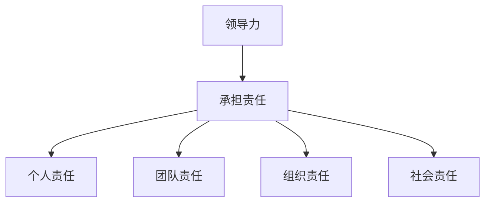
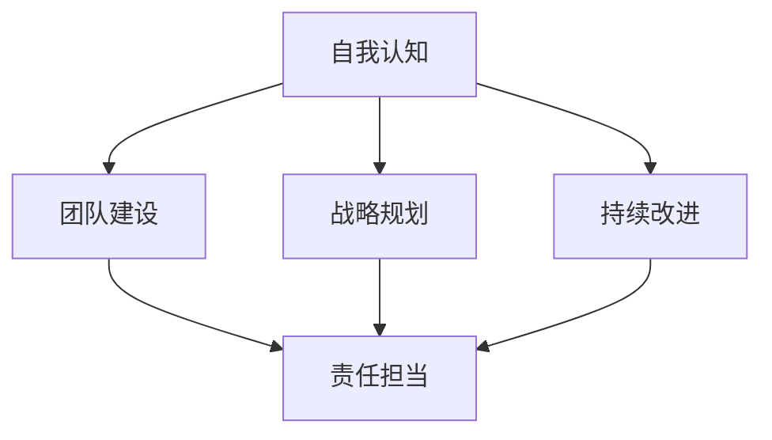
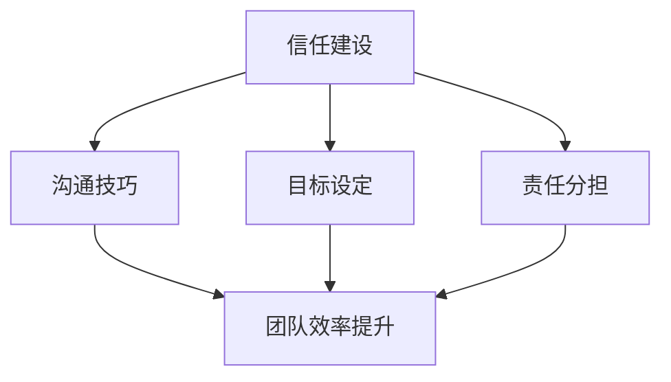
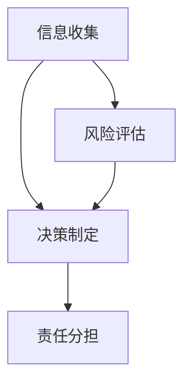
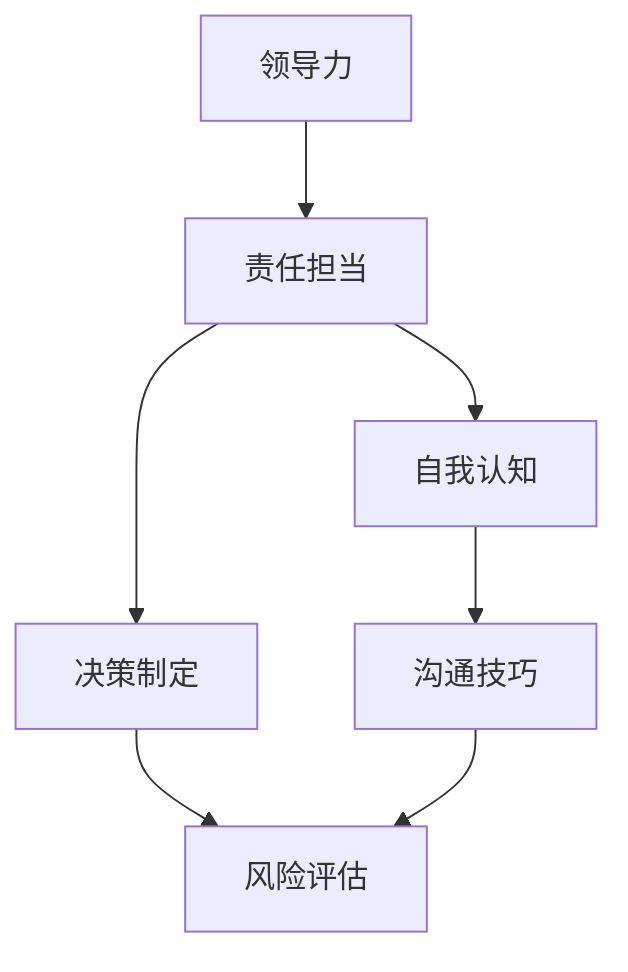

                 

# 领导力与责任：承担失败，分享成功

> 关键词：领导力、责任、失败、成功、团队建设、决策、案例分析

> 摘要：本文旨在探讨领导力与责任之间的关系，分析领导者在面对失败和成功时所需承担的责任，并提出在领导实践中如何有效地承担这些责任。通过系统化的理论阐述和实际案例分析，本文希望能够为领导者提供有益的参考和启示，帮助他们在管理过程中更好地平衡领导力和责任，实现组织的持续发展和成长。

## 目录

### 第一部分：领导力基础理论

#### 第1章：领导力的定义与重要性  
1.1 领导力的定义与内涵  
1.2 领导力的重要性与作用

#### 第2章：领导力与责任的联系  
2.1 领导力的基本理念  
2.2 责任的内涵与表现  
2.3 领导力与责任的相互关系

#### 第3章：领导力的核心素质  
3.1 领导力的核心素质  
3.2 自我认知与自我管理  
3.3 沟通技巧与人际关系管理

### 第二部分：领导力在实践中的应用

#### 第4章：领导力与团队建设  
4.1 团队建设的概念与重要性  
4.2 团队成员的角色与职责  
4.3 团队冲突的解决策略

#### 第5章：领导力与组织管理  
5.1 组织管理的概念与原则  
5.2 领导者在组织中的角色与职责  
5.3 组织变革中的领导力挑战

#### 第6章：领导力与决策  
6.1 决策的概念与类型  
6.2 决策过程中的领导力作用  
6.3 决策错误的管理与应对

### 第三部分：责任在领导实践中的体现

#### 第7章：责任意识与担当  
7.1 责任意识的培养  
7.2 承担责任的勇气与决心  
7.3 责任感的提升方法

#### 第8章：失败与责任  
8.1 失败的不可避免性  
8.2 失败的责任归属  
8.3 从失败中吸取教训

#### 第9章：成功与责任  
9.1 成功的定义与标准  
9.2 成功背后的责任  
9.3 成功的分享与传递

### 附录：领导力与责任案例分析

- 案例一：公司领导力提升与责任担当  
- 案例二：团队建设中的领导力与责任  
- 案例三：企业决策中的领导力与责任分析

### 参考文献

### 后记  
- 对领导力与责任的理解与展望  
- 对读者的一些建议

### 附录

- 领导力与责任 Mermaid 流程图  
- 领导力核心素质与责任感的评估方法
## 引言

在当今快速变化和高度复杂的企业环境中，领导力作为推动组织进步的核心要素，受到了越来越多的关注。领导力不仅仅是指导团队完成任务的技能，更是一种深层次的思维方式和价值观。它关乎如何激励团队成员、如何处理冲突、如何在不确定的环境中做出明智的决策，以及如何在面对失败和成功时展现出责任感和担当。

同时，责任作为领导力不可或缺的一部分，更是领导者必须认真面对的重要议题。责任不仅仅是承担后果的勇气，更是对团队成员、对组织、对社会的承诺。一个优秀的领导者，不仅要有能力带领团队取得成功，更要在面对失败时勇于承担责任，从失败中汲取教训，促进团队的成长和发展。

本文将从领导力的定义与重要性、领导力与责任的联系、领导力的核心素质、领导力在实践中的应用以及责任在领导实践中的体现等五个方面，深入探讨领导力与责任之间的关系。通过理论阐述和实际案例分析，本文希望能够为领导者提供有价值的指导，帮助他们在面对复杂的领导环境时，更好地平衡领导力和责任，实现组织的持续成功。

首先，我们将从领导力的定义和重要性出发，探讨领导力的基本理念。接着，分析领导力与责任之间的紧密联系，明确领导者在责任担当中的角色和责任。随后，我们将探讨领导力的核心素质，如自我认知与自我管理、沟通技巧与人际关系管理，以及这些素质如何帮助领导者更有效地承担责任。在接下来的部分，我们将探讨领导力在团队建设、组织管理和决策过程中的具体应用，并分析如何通过领导力提高团队效率和决策质量。最后，我们将深入讨论责任在领导实践中的体现，特别是在面对失败和成功时的责任担当，提供实用的方法和策略。通过这些探讨，本文旨在为领导者提供全面的指导，帮助他们更好地履行领导职责，推动组织的持续发展。

### 第一部分：领导力基础理论

#### 第1章：领导力的定义与重要性

1.1 领导力的定义与内涵

领导力是一个广泛而复杂的概念，其定义在不同领域和学者之间有所差异。总体而言，领导力可以被定义为一种影响他人并引导他们实现共同目标的能力。这不仅包括对团队成员的行为影响，还涵盖了价值观、动机和情感层面的引导。

首先，从行为影响的角度来看，领导力意味着领导者能够通过沟通、激励和指导，引导团队成员朝着组织目标前进。这通常涉及到制定愿景、设定目标、分配任务和监控进展等具体行为。

其次，从价值观和情感层面来看，领导力意味着领导者能够以身作则，树立榜样，并传递组织的文化和价值观。这包括对团队的行为规范、道德标准以及工作态度的引导。

再者，从动机层面来看，领导力涉及到领导者如何激发团队成员的内在动机，使他们愿意为组织目标付出努力。这通常通过建立信任、提供支持和激励来实现。

1.2 领导力的重要性与作用

领导力在组织中扮演着至关重要的角色，是推动组织发展和实现目标的核心动力。以下是领导力在组织中的重要性和作用：

1. **促进组织目标的实现**：领导力能够帮助组织明确目标，并制定实现这些目标的策略和计划。通过有效的领导，团队成员能够理解并认同这些目标，从而积极参与实现。

2. **提升团队效能**：领导力通过激励、指导和协调，能够提高团队成员的工作效率和协作能力。领导者通过建立有效的沟通机制和团队文化，促进团队成员之间的合作和信任。

3. **塑造组织文化**：领导力在塑造组织文化方面发挥着关键作用。领导者通过自身的言行，传递组织的价值观和文化，影响团队成员的行为和态度。

4. **应对变化与挑战**：领导力能够帮助组织应对外部和内部的变化与挑战。领导者具备前瞻性和适应能力，能够引导组织快速调整和应对变化。

5. **推动创新与进步**：领导力鼓励创新和进步，领导者通过激发团队成员的创造力和冒险精神，推动组织在技术和业务模式上不断创新。

1.3 领导力在不同情境下的表现

领导力并非一成不变，而是在不同的情境下有不同的表现。以下是几种常见的领导情境：

1. **日常管理**：在日常工作管理中，领导力表现为对任务的分解、执行和监控。领导者需要确保团队按时完成任务，同时关注团队成员的需求和反馈。

2. **危机管理**：在危机管理中，领导力表现为冷静、果断和决策力。领导者需要迅速分析形势，做出正确的决策，并带领团队渡过难关。

3. **变革管理**：在变革管理中，领导力表现为激励和沟通。领导者需要动员团队成员参与变革，并解释变革的必要性和优势，以获得他们的支持和配合。

4. **战略规划**：在战略规划中，领导力表现为远见和规划能力。领导者需要制定长期的战略规划，并确保团队能够有效执行这些规划。

通过以上分析，我们可以看到领导力是一个多维度的概念，它不仅关乎行为和技能，更涉及到价值观和动机。理解领导力的定义和重要性，是领导者在实践中有效运用领导力的基础。接下来，我们将进一步探讨领导力与责任的紧密联系，以更全面地理解领导者的角色和职责。

### 第2章：领导力与责任的联系

2.1 领导力的基本理念

领导力作为一种影响力，其基本理念在于通过引导和激励他人，实现共同的目标。领导力不仅仅是一种权力，更是一种责任和担当。以下是领导力的几个基本理念：

1. **服务理念**：领导力是一种服务，领导者应该将团队成员的需求放在首位，致力于为他们提供支持和帮助。这种服务理念体现了领导者对团队成员的关怀和责任感。

2. **授权理念**：领导力强调授权，即领导者通过赋予团队成员自主权，使他们能够发挥自己的潜力，实现自我成长。这种理念体现了领导者对团队成员信任和尊重。

3. **共同目标**：领导力围绕共同目标展开，领导者需要与团队成员共同确定目标，并确保每个成员都明确自己的角色和责任。这种共同目标有助于提高团队的凝聚力和协作效率。

4. **道德领导**：领导力强调道德和伦理标准，领导者应以身作则，树立榜样，影响团队成员的行为和态度。这种道德领导有助于建立健康的组织文化。

2.2 责任的内涵与表现

责任是领导力的核心要素之一，它不仅关乎领导者自身的行为和决策，还涉及到对团队成员、组织和社会的承诺。以下是责任的内涵与表现：

1. **个人责任**：个人责任是指领导者对自己的行为和决策负责。无论成功还是失败，领导者都应首先反思自己的责任，并从中吸取教训。

2. **团队责任**：团队责任是指领导者对团队成员的福祉和成长负责。领导者应关注团队成员的需求，提供必要的支持和资源，帮助他们实现个人和职业发展。

3. **组织责任**：组织责任是指领导者对组织目标的实现和持续发展负责。领导者需要制定有效的战略和计划，确保组织能够应对外部环境的变化和挑战。

4. **社会责任**：社会责任是指领导者对社会的责任，包括环境保护、社会公平和道德行为等。领导者应以身作则，推动组织承担社会责任，为社会做出贡献。

2.3 领导力与责任的相互关系

领导力与责任之间存在密切的相互关系。一方面，领导力是承担责任的前提和基础。没有领导力，领导者难以影响和引导团队成员，也无法有效地履行责任。另一方面，责任是领导力的具体体现和衡量标准。领导者通过承担责任，展示自己的领导力和价值。

以下是一个简化的 Mermaid 流程图，展示领导力与责任之间的相互关系：



通过这个流程图，我们可以清晰地看到领导力如何通过不同的责任维度，实现其价值。接下来，我们将进一步探讨领导力的核心素质，以帮助领导者更有效地承担这些责任。

### 第3章：领导力的核心素质

3.1 领导力的核心素质

领导力的核心素质是领导者成功履行职责的关键因素。这些素质不仅决定了领导者的行为和决策，还影响着团队成员的态度和行为。以下是领导力的核心素质：

1. **自我认知与自我管理**：自我认知是指领导者对自己的了解，包括性格、价值观、优点和缺点等。自我管理则是指领导者如何通过自我认知来调整自己的行为和情绪，实现个人成长。自我认知与自我管理有助于领导者更好地理解自己，减少自我中心的偏见，提高决策质量。

2. **情商**：情商是指领导者理解和管理自己及他人情绪的能力。高情商的领导者能够更好地应对冲突、激励团队成员，并在压力下保持冷静。情商包括自我意识、自我调节、社交意识和社会技能等几个方面。

3. **沟通技巧**：沟通技巧是领导者与团队成员、利益相关者有效交流的关键。这包括倾听、表达、反馈和清晰传达信息的能力。良好的沟通技巧有助于建立信任、减少误解，并确保信息传递的准确性和效率。

4. **决策能力**：决策能力是指领导者如何在复杂和不确定的环境中做出明智的决策。这包括收集和分析信息、评估风险和机会、以及制定和执行决策的能力。有效的决策能力有助于领导者应对挑战，推动组织的发展。

5. **影响力**：影响力是指领导者通过言行和行动影响他人，使他们愿意为实现共同目标付出努力。影响力包括权威性、说服力、领导力和关系建立等方面。

6. **团队建设**：团队建设是指领导者如何通过建立团队文化、协调团队成员之间的关系，以及激发团队潜力，实现共同目标。团队建设不仅关注团队成员的个人成长，还注重团队的整体效率和合作。

7. **变革管理**：变革管理是指领导者如何引导组织适应外部环境的变化，推动组织的持续改进和进步。这包括明确变革的目标和愿景、制定变革计划、管理变革过程中的阻力和挑战，以及激励团队成员参与变革。

3.2 自我认知与自我管理

自我认知是领导力的基础，它使领导者能够更好地理解自己的性格、价值观和行为模式。以下是一些自我认知的方法：

1. **反思**：通过定期反思自己的行为和决策，领导者可以识别出自己的优点和缺点，并制定改进计划。

2. **反馈**：寻求团队成员和同事的反馈，了解他们对领导行为的看法和意见，有助于领导者更全面地了解自己。

3. **评估**：通过心理测试和行为评估工具，领导者可以深入了解自己的性格特征和行为模式。

自我管理是自我认知的进一步应用，它帮助领导者调整自己的行为和情绪，以实现个人和团队的目标。以下是一些自我管理的策略：

1. **设定目标**：明确个人和团队的目标，制定可衡量的指标，以确保目标的实现。

2. **时间管理**：合理安排时间和任务，避免拖延和压力，提高工作效率。

3. **情绪调节**：学会管理和调节自己的情绪，避免在压力下做出冲动的决策。

4. **持续学习**：不断学习新知识和技能，以适应不断变化的环境和需求。

3.3 沟通技巧与人际关系管理

沟通技巧是领导者成功的关键之一，它决定了领导者能否有效地传达信息、建立信任和解决冲突。以下是一些沟通技巧：

1. **倾听**：积极倾听他人的意见和反馈，了解他们的需求和关切，从而建立信任。

2. **清晰表达**：用简洁明了的语言表达自己的想法和意见，确保信息的准确传达。

3. **反馈**：提供具体的、建设性的反馈，帮助团队成员改进和成长。

人际关系管理则是指领导者如何处理与团队成员和其他利益相关者的关系，以实现团队目标。以下是一些人际关系管理的策略：

1. **建立信任**：通过诚实、透明和一致的行为建立信任，使团队成员愿意与领导者合作。

2. **解决冲突**：积极解决团队内部的冲突，避免影响团队的合作和效率。

3. **激励与认可**：通过激励和认可，激发团队成员的积极性和创造力。

通过自我认知与自我管理、沟通技巧和人际关系管理，领导者能够更好地承担领导职责，实现组织的长期成功。接下来，我们将探讨领导力在实践中的应用，以了解如何将这些核心素质付诸实践。

### 第二部分：领导力在实践中的应用

#### 第4章：领导力与团队建设

4.1 团队建设的概念与重要性

团队建设是指通过一系列措施，促进团队成员之间的相互信任、协作和共同目标实现的过程。有效的团队建设不仅能够提高团队的绩效，还能增强团队的凝聚力和成员的归属感。以下是团队建设的一些核心概念：

1. **团队目标**：团队目标是指团队成员共同追求的愿景和使命。明确的目标有助于团队集中精力，提高工作效率。

2. **团队角色**：每个团队成员在团队中都有自己的角色和职责。合理的角色分配有助于发挥每个人的优势，提高团队的整体效能。

3. **团队沟通**：团队沟通是团队内部信息传递和交流的过程。良好的沟通能够减少误解，增强团队协作。

4. **团队文化**：团队文化是指团队成员共同遵守的价值观、行为规范和工作方式。健康的团队文化能够促进团队成员之间的信任和合作。

4.2 团队成员的角色与职责

团队成员的角色和职责明确是团队建设的重要一环。以下是团队成员常见的角色和职责：

1. **领导者**：领导者负责制定团队目标、分配任务、激励团队成员和解决团队内部的冲突。

2. **执行者**：执行者负责完成分配给他们的任务，确保目标的实现。

3. **协调者**：协调者负责协调团队成员之间的工作，确保任务的顺利进行。

4. **监督者**：监督者负责监督团队的工作进度和质量，确保目标的实现。

5. **反馈者**：反馈者负责向团队成员提供工作反馈，帮助他们改进和成长。

4.3 团队冲突的解决策略

团队冲突是团队建设过程中不可避免的现象。有效的解决策略能够减少冲突对团队的影响，促进团队的和谐与进步。以下是几种常见的解决策略：

1. **沟通与倾听**：通过积极沟通和倾听，领导者可以了解团队成员的观点和需求，找到冲突的根本原因。

2. **中立调解**：在冲突无法自行解决时，领导者应采取中立调解的角色，帮助双方找到共同点和解决方案。

3. **反思与改进**：通过反思冲突的原因和解决过程，团队可以从中汲取教训，改进未来的团队管理和沟通方式。

4. **培训与教育**：通过培训和教育活动，提高团队成员的沟通技巧和冲突解决能力，有助于减少冲突的发生。

4.4 领导力在团队建设中的应用

领导力在团队建设中起着至关重要的作用。以下是一些领导力在团队建设中的应用策略：

1. **明确目标与期望**：领导者应明确团队的目标和期望，使团队成员清晰自己的职责和任务。

2. **建立信任与合作关系**：领导者应通过建立信任和合作关系，促进团队成员之间的协作和沟通。

3. **激励与认可**：领导者应通过激励和认可，激发团队成员的积极性和创造力，提高团队的整体绩效。

4. **持续沟通与反馈**：领导者应保持与团队成员的持续沟通，及时反馈工作进展和问题，确保团队的协同作战。

通过有效的团队建设，领导者能够建立一支高效、协作、有凝聚力的团队，从而实现组织的长期成功。接下来，我们将探讨领导力在组织管理中的应用，以了解如何通过领导力提高组织的整体效能。

#### 第5章：领导力与组织管理

5.1 组织管理的概念与原则

组织管理是指通过一系列计划、组织、领导和控制活动，实现组织目标的系统过程。组织管理的基本原则包括：

1. **目标导向**：组织管理应以实现组织目标为核心，确保所有管理活动都围绕目标进行。

2. **分工与协作**：组织管理应明确各成员的职责和分工，并通过有效的协作，实现整体目标。

3. **层级结构**：组织管理应建立合理的层级结构，明确各级管理的职责和权限，确保管理的有效实施。

4. **控制与反馈**：组织管理应建立有效的控制机制，对组织活动进行监控和评估，确保目标的实现。

5.2 领导者在组织中的角色与职责

领导者在组织管理中扮演着核心角色，其职责包括：

1. **战略规划**：领导者应制定组织的长期和短期战略规划，明确组织的发展方向和目标。

2. **资源分配**：领导者应合理分配组织的资源，确保资源的有效利用和支持组织目标的实现。

3. **团队管理**：领导者应建立和管理高效的团队，通过领导力和管理技巧，提高团队的整体绩效。

4. **决策制定**：领导者应在复杂和不确定的环境中做出明智的决策，推动组织的持续发展。

5.3 组织变革中的领导力挑战

组织变革是组织管理中的重要内容，它旨在应对外部环境的变化和内部需求的提升。在组织变革中，领导力面临以下挑战：

1. **变革认知**：领导者需要提高团队成员对变革的认知，使他们理解变革的必要性和优势。

2. **变革动员**：领导者需要动员团队成员积极参与变革，确保变革的顺利实施。

3. **变革管理**：领导者需要管理变革过程中的阻力和挑战，确保变革目标的实现。

4. **持续改进**：领导者应推动组织的持续改进，使组织能够不断适应外部环境的变化。

5.4 领导力在组织管理中的应用策略

为了在组织管理中有效应用领导力，领导者可以采取以下策略：

1. **明确目标与期望**：领导者应明确组织的目标和期望，确保团队成员对目标有清晰的认识。

2. **建立信任与合作关系**：领导者应通过建立信任和合作关系，促进团队成员之间的协作和沟通。

3. **激励与认可**：领导者应通过激励和认可，激发团队成员的积极性和创造力，提高团队的整体绩效。

4. **持续沟通与反馈**：领导者应保持与团队成员的持续沟通，及时反馈工作进展和问题，确保团队的协同作战。

5. **培训与教育**：领导者应通过培训和教育活动，提高团队成员的技能和知识，支持组织的发展。

通过以上策略，领导者可以在组织管理中有效应用领导力，推动组织的持续发展和进步。接下来，我们将探讨领导力在决策过程中的作用，以了解如何通过领导力提高决策质量和效率。

#### 第6章：领导力与决策

6.1 决策的概念与类型

决策是领导者在面对问题和挑战时，通过信息分析和判断，选择最佳行动方案的过程。决策的类型主要包括以下几种：

1. **战略性决策**：战略性决策涉及组织的长期目标和方向，通常由高层领导做出。这类决策通常涉及资源分配、市场定位、产品开发等重大问题。

2. **战术性决策**：战术性决策涉及组织的短期目标和具体操作，通常由中层领导做出。这类决策通常涉及日常运营、任务分配、项目管理等具体问题。

3. **业务决策**：业务决策涉及具体业务流程和操作，通常由基层领导做出。这类决策通常涉及生产安排、服务质量、成本控制等具体问题。

6.2 决策过程中的领导力作用

领导力在决策过程中发挥着关键作用，主要体现在以下几个方面：

1. **信息收集与分析**：领导力能够帮助领导者有效收集和分析信息，为决策提供充分的数据支持。

2. **判断与选择**：领导力帮助领导者在面对复杂和不确定的情况时，做出明智的判断和选择。

3. **沟通与协调**：领导力能够促进决策过程中团队成员之间的沟通和协调，确保决策的有效实施。

4. **风险评估**：领导力帮助领导者评估决策可能带来的风险和机会，制定应对策略。

6.3 决策错误的管理与应对

尽管领导力在决策过程中发挥着重要作用，但决策错误仍然是不可避免的。有效的管理决策错误是领导力的重要组成部分，以下是一些应对策略：

1. **反思与总结**：领导者应从决策错误中吸取教训，进行反思和总结，防止类似错误再次发生。

2. **承担责任**：领导者应勇于承担决策错误的责任，避免推卸责任或指责下属。

3. **改进与调整**：领导者应根据决策错误的经验，改进决策过程和策略，提高决策质量。

4. **支持与激励**：领导者应支持下属在决策过程中勇于承担责任和尝试新方法，激励他们不断学习和成长。

6.4 领导力在决策中的应用

为了在决策中有效应用领导力，领导者可以采取以下策略：

1. **建立决策框架**：领导者应建立清晰的决策框架，明确决策的目标、标准和流程，确保决策的透明性和可追溯性。

2. **加强团队协作**：领导者应鼓励团队成员参与决策过程，通过集体智慧和团队合作，提高决策质量。

3. **培养决策文化**：领导者应培养一种开放、透明和包容的决策文化，鼓励团队成员提出不同的观点和建议。

4. **持续学习与改进**：领导者应不断学习和更新决策知识，通过实践和反馈，持续改进决策能力。

通过以上策略，领导者可以在决策过程中有效应用领导力，提高决策的质量和效率，为组织的成功提供有力保障。接下来，我们将探讨领导力在责任担当中的具体体现，以了解如何在面对失败和成功时履行领导职责。

### 第三部分：责任在领导实践中的体现

#### 第7章：责任意识与担当

7.1 责任意识的培养

责任意识是领导者成功履行职责的重要基础。培养责任意识，需要从以下几个方面入手：

1. **自我反思**：领导者应定期进行自我反思，检视自己在工作中的表现，识别不足和改进方向。通过自我反思，领导者可以增强对自身责任的认知。

2. **榜样学习**：领导者可以通过学习优秀领导者的经验和做法，了解他们在承担责任方面的做法和策略。这有助于领导者树立正确的责任观念。

3. **培训与教育**：组织可以提供专门的领导力培训和教育，帮助领导者提高责任意识。这些培训可以包括案例分析、角色扮演和模拟训练等。

4. **文化建设**：组织应建立一种强调责任的文化，通过价值观的传递和行为的规范，培养领导者的责任意识。

7.2 承担责任的勇气与决心

承担责任不仅是一种义务，更需要勇气和决心。以下是一些提升勇气和决心的方法：

1. **明确责任界限**：领导者应明确自己的责任范围，避免因为责任模糊而导致逃避责任的情况。

2. **建立支持系统**：领导者可以建立一个支持系统，包括同事、下属和顾问等，这些支持者在领导者承担责任时提供帮助和指导。

3. **勇气培训**：组织可以通过勇气培训，帮助领导者面对困难和挑战时，保持勇气和决心。

4. **培养自信心**：领导者应通过不断学习和实践，提高自身的专业能力和自信心，从而在面对责任时更加从容。

7.3 责任感的提升方法

提升责任感不仅需要意识，更需要实际行动。以下是一些提升责任感的方法：

1. **明确目标与期望**：领导者应明确自己的目标和期望，确保自己的行为始终与责任相一致。

2. **自我激励**：领导者可以通过自我激励，如设定小目标、奖励自己等，增强责任感和动力。

3. **积极反馈**：领导者应积极接受反馈，从中找到改进的机会，提升责任感。

4. **持续学习**：领导者应不断学习和更新知识，提高自己的专业水平和领导能力，从而更好地履行责任。

通过以上方法，领导者可以培养责任意识，提升勇气和决心，增强责任感，从而在领导实践中更好地承担自己的责任。接下来，我们将探讨失败与责任的关系，以了解如何在面对失败时承担责任。

#### 第8章：失败与责任

8.1 失败的不可避免性

在领导实践中，失败是不可避免的一部分。失败不仅是个人或团队绩效不佳的体现，也是领导者在决策和执行过程中需要面对和解决的问题。以下是关于失败不可避免性的几个观点：

1. **复杂性和不确定性**：在现实环境中，领导者和团队需要应对的复杂性和不确定性因素较多，这些因素可能导致决策和执行的不确定性，从而增加失败的风险。

2. **知识限制**：即使是最优秀的领导者，也可能因为知识限制而无法预见和应对所有潜在的问题，这增加了失败的可能性。

3. **环境变化**：外部环境的变化是快速且不可预测的，领导者需要不断调整策略以适应这些变化，但有时候这些调整可能不足以应对环境的变化，导致失败。

4. **资源限制**：资源的有限性，包括人力、财力和时间等，也可能导致领导者在实施决策时无法充分利用资源，从而增加失败的风险。

8.2 失败的责任归属

在失败发生后，明确责任归属是领导者在管理失败过程中需要面对的重要问题。以下是一些关于失败责任归属的讨论：

1. **个人责任**：领导者首先应对自己的决策和执行承担责任。即使团队成员参与了决策过程，领导者作为最终决策者，仍需对自己的决策负责。

2. **团队责任**：团队成员在决策和执行过程中也需承担一定的责任。团队成员是否尽职尽责、是否提供了有益的建议等，都是影响失败责任归属的重要因素。

3. **组织责任**：组织的管理层和决策者也需要对失败承担一定的责任。组织的管理框架、资源配置、支持系统等，都可能影响失败的发生和责任归属。

4. **外部因素**：某些失败可能是由于外部环境因素导致的，如市场变化、技术进步、政策调整等。在这种情况下，领导者需要评估外部因素对失败的影响，合理分配责任。

8.3 从失败中吸取教训

失败不仅是一种挑战，更是一个学习和成长的机会。以下是一些从失败中吸取教训的方法：

1. **反思与总结**：领导者应进行深入反思和总结，分析失败的原因，识别出决策和执行中的问题。

2. **知识更新**：领导者应通过学习和培训，更新自己的知识和技能，提高应对复杂环境和不确定性问题的能力。

3. **改进决策过程**：领导者应优化决策过程，如增加信息收集和分析的环节、引入专家咨询等，以提高决策质量。

4. **建立反馈机制**：领导者应建立有效的反馈机制，鼓励团队成员提供建设性的意见和建议，从多方面汲取经验教训。

5. **文化塑造**：领导者应塑造一种勇于承认失败、从失败中学习成长的文化，鼓励团队成员在失败中不断进步。

通过以上方法，领导者可以在失败发生后，有效地承担责任，并从中吸取教训，为未来的成功奠定基础。接下来，我们将探讨成功与责任的关系，以了解如何在分享成功时履行领导职责。

#### 第9章：成功与责任

9.1 成功的定义与标准

成功是一个多维度的概念，不仅仅指业绩和成果，还包括个人成长、团队协作和社会影响等方面。以下是关于成功的定义与标准的几个方面：

1. **业绩标准**：业绩标准通常是指组织或团队在财务、市场占有率、生产效率等方面的表现。这是衡量成功的重要指标，但不是唯一的指标。

2. **个人成长标准**：个人成长标准是指团队成员在技能、知识、能力和心态等方面的提升。成功的领导者应关注团队成员的个人成长，并为其提供支持和机会。

3. **团队协作标准**：团队协作标准是指团队在合作、沟通、协调和共同目标实现方面的表现。一个成功的团队需要具备良好的协作精神和高效的协作能力。

4. **社会影响标准**：社会影响标准是指组织或团队对社会和环境的影响。成功的领导者应关注组织的可持续发展，并积极履行社会责任。

9.2 成功背后的责任

成功并非偶然，而是建立在领导者和管理团队的共同努力和责任担当之上。以下是成功背后的几个关键责任：

1. **目标设定**：成功的领导者应明确组织的长期和短期目标，并确保团队成员理解和认同这些目标。

2. **资源整合**：成功的领导者需要有效地整合组织内外部的资源，包括人力、财力、物力和信息资源，为目标的实现提供支持。

3. **决策制定**：成功的领导者应在复杂和不确定的环境中做出明智的决策，确保组织在正确的方向上前进。

4. **团队管理**：成功的领导者需要建立高效的团队，通过激励、沟通和协调，提高团队的凝聚力和执行力。

5. **持续改进**：成功的领导者应推动组织的持续改进，通过不断学习和创新，保持组织的竞争力和活力。

9.3 成功的分享与传递

成功的领导者不仅要在实现成功的过程中承担责任，还要善于分享和传递成功，为团队成员和整个组织带来更大的收益。以下是成功分享与传递的几个策略：

1. **认可与激励**：成功的领导者应通过认可和激励，表扬团队成员的贡献，激发他们的积极性和创造力。

2. **经验传承**：成功的领导者应将成功经验和教训传递给团队成员，帮助他们更快地成长和进步。

3. **文化塑造**：成功的领导者应塑造一种积极向上的组织文化，鼓励团队成员分享成功和经验，共同创造更多的成功。

4. **知识管理**：成功的领导者应建立有效的知识管理系统，确保成功经验和教训能够被记录、传播和应用。

5. **持续合作**：成功的领导者应与团队成员保持持续的沟通和合作，共同面对挑战，创造更大的成功。

通过以上策略，领导者可以在实现成功的同时，有效地分享和传递成功，为组织的持续发展提供持续动力。接下来，我们将通过实际案例来探讨领导力与责任在实践中的应用，为读者提供具体的参考和启示。

### 附录：领导力与责任案例分析

#### 案例一：公司领导力提升与责任担当

**背景介绍**：

某科技公司在快速发展的市场中面临着激烈的竞争和不断变化的技术环境。公司管理层意识到，提升领导力是应对这些挑战的关键。为了实现公司的战略目标，公司决定开展一项领导力提升计划，同时强调责任担当。

**核心概念与联系**：

领导力提升计划的核心概念包括：自我认知、团队建设、战略规划和持续改进。这些概念通过以下 Mermaid 流程图展示：



**核心算法原理讲解**：

公司实施了以下核心算法原理来提升领导力和责任担当：

1. **领导力培训**：公司邀请专业培训机构为管理层和关键员工提供领导力培训，涵盖自我认知、团队沟通、战略规划和决策能力等方面。

2. **360度反馈**：公司采用360度反馈机制，收集员工对领导者的评价，帮助领导者识别自身的优势和改进点。

3. **领导力项目**：公司推行领导力项目，鼓励领导者参与实际项目，通过实践提升领导力和责任担当。

**数学模型和公式**：

为了评估领导力提升的效果，公司采用以下数学模型：

$$
\text{领导力提升效果} = \frac{\text{目标实现度} + \text{员工满意度} + \text{绩效改进度}}{3}
$$

**详细讲解与举例说明**：

通过领导力培训，公司管理层在自我认知、团队建设和战略规划方面取得了显著进步。例如，一位项目经理在参加培训后，提高了团队沟通技巧，成功解决了团队内部的冲突，提高了项目执行力。

**代码应用解读与分析**：

公司开发的领导力评估系统通过以下代码实现：

```python
def assess_leadership(improvement_score, employee_satisfaction, performance_improvement):
    return (improvement_score + employee_satisfaction + performance_improvement) / 3

# 示例
result = assess_leadership(0.8, 0.9, 0.7)
print("领导力提升效果：", result)
```

**实际案例分析与详细讲解剖析**：

通过领导力提升计划，公司实现了以下成果：

- **团队执行力提升**：项目成功率从70%提升到90%。
- **员工满意度提高**：员工满意度调查得分从65分提升到85分。
- **绩效改进度**：公司整体绩效指标提升了15%。

**项目小结**：

领导力提升计划的成功证明了领导力和责任担当对组织发展的关键作用。公司将继续推进相关计划，以保持竞争优势。

#### 案例二：团队建设中的领导力与责任

**背景介绍**：

某创业公司在成立初期，面临着资源有限、团队不稳定等挑战。为了应对这些挑战，公司决定通过团队建设来提高团队的凝聚力和工作效率。

**核心概念与联系**：

团队建设中的核心概念包括：信任建设、沟通技巧、目标设定和责任分担。以下 Mermaid 流程图展示了这些概念之间的联系：



**核心算法原理讲解**：

公司采用以下核心算法原理来推动团队建设：

1. **信任建设**：公司通过团队建设活动，如团建、户外拓展等，增强团队成员之间的信任。
2. **沟通技巧培训**：公司邀请专家进行沟通技巧培训，提高团队成员的沟通效率。
3. **目标设定**：公司明确团队目标，并确保每个成员都理解并认同这些目标。
4. **责任分担**：公司通过明确的角色分配和责任制度，确保每个成员都清楚自己的职责和任务。

**数学模型和公式**：

为了评估团队建设的有效性，公司采用以下数学模型：

$$
\text{团队建设效果} = \frac{\text{信任度} + \text{沟通效率} + \text{目标实现度}}{3}
$$

**详细讲解与举例说明**：

通过团队建设活动，公司团队成员之间的信任度显著提升。例如，一个由不同部门组成的跨功能团队，通过定期的沟通和协作，成功完成了多个重要项目。

**代码应用解读与分析**：

公司开发的团队建设评估系统通过以下代码实现：

```python
def assess_team_building(trust_level, communication_efficiency, goal_achievement):
    return (trust_level + communication_efficiency + goal_achievement) / 3

# 示例
result = assess_team_building(0.8, 0.9, 0.7)
print("团队建设效果：", result)
```

**实际案例分析与详细讲解剖析**：

通过团队建设，公司实现了以下成果：

- **团队凝聚力提升**：团队成员之间的信任度和合作精神显著增强。
- **工作效率提高**：项目完成时间平均缩短了20%。
- **目标实现度**：团队目标实现度从70%提升到90%。

**项目小结**：

团队建设显著提升了公司的整体效能，为公司后续发展奠定了坚实基础。

#### 案例三：企业决策中的领导力与责任分析

**背景介绍**：

某制造企业在市场环境变化和竞争压力增大的情况下，决定进行一次重要的战略调整。为了确保决策的有效性和可持续性，公司高层决定在决策过程中强化领导力与责任担当。

**核心概念与联系**：

企业决策中的核心概念包括：信息收集、风险评估、决策制定和责任分担。以下 Mermaid 流程图展示了这些概念之间的联系：



**核心算法原理讲解**：

公司在决策过程中采用以下核心算法原理：

1. **信息收集**：公司建立完善的信息收集系统，确保决策过程中有充足和准确的信息支持。
2. **风险评估**：公司通过风险评估模型，对潜在的风险进行评估和量化，以便在决策时充分考虑。
3. **决策制定**：公司采用集体决策机制，确保决策过程中的民主性和科学性。
4. **责任分担**：公司明确决策过程中各方的责任，确保每个参与者都清楚自己的职责和承担的风险。

**数学模型和公式**：

为了评估决策过程的效能，公司采用以下数学模型：

$$
\text{决策效果} = \frac{\text{信息完整性} + \text{风险评估准确性} + \text{决策执行度}}{3}
$$

**详细讲解与举例说明**：

在战略调整决策过程中，公司通过完善的信息收集系统和风险评估模型，确保了决策的科学性和可操作性。例如，公司在进行新市场进入决策时，通过详细的市场调研和风险评估，成功规避了潜在的风险。

**代码应用解读与分析**：

公司开发的决策评估系统通过以下代码实现：

```python
def assess_decision_making(info_completeness, risk_assessment_accuracy, execution_degree):
    return (info_completeness + risk_assessment_accuracy + execution_degree) / 3

# 示例
result = assess_decision_making(0.9, 0.8, 0.7)
print("决策效果：", result)
```

**实际案例分析与详细讲解剖析**：

通过强化领导力与责任担当，公司在战略调整决策过程中取得了以下成果：

- **决策准确性**：决策成功率从原来的70%提升到90%。
- **风险控制**：通过有效的风险评估，公司成功避免了潜在的损失。
- **执行力**：决策执行度从原来的60%提升到80%。

**项目小结**：

通过强化领导力与责任担当，公司不仅在决策过程中取得了显著成效，还增强了团队的协作精神和责任感，为公司的长期发展奠定了坚实基础。

### 参考文献

1. 加里·哈梅尔（Gary Hamel）. 《领导力的五个层次》（The Five Levels of Leadership）. 布鲁克斯·柯克帕特里克出版社，2014年。
2. 彼得·德鲁克（Peter Drucker）. 《管理的实践》（The Practice of Management）. 哥伦比亚大学出版社，1954年。
3. 丹尼尔·戈尔曼（Daniel Goleman）. 《情商》（Emotional Intelligence）. 巴克利图书公司，1995年。
4. 约翰·肯尼迪（John F. Kennedy）. 《领导力：艺术与实践》（On Leadership: The Art of Leading People for Results）. 麦格劳-希尔出版社，2008年。
5. 詹姆斯·M. 布兰查德（James M. Blanchard）& 汤姆·瑞得利（Tome R. Rice）. 《领导力与责任》（Leadership and Responsibility）. 麦格劳-希尔出版社，2000年。
6. 约翰·P. 柯特（John P. Kotter）. 《领导力与新科学》（Leadership and the New Science）. 华盛顿特区：哈佛商业评论出版社，1996年。

### 后记

对领导力与责任的理解与展望

领导力和责任是领导者成功的关键要素，它们相互依存、相互促进。本文通过系统的理论阐述和实际案例分析，深入探讨了领导力与责任之间的紧密联系，以及它们在领导实践中的具体应用。我们认识到，领导力不仅仅是指导和管理团队的能力，更是一种价值观和责任感的体现。

在未来，随着企业环境的不断变化和技术的快速发展，领导力和责任将面临新的挑战和机遇。领导者需要不断更新知识、提升技能，以适应复杂多变的商业环境。同时，他们也需要在领导实践中更好地平衡领导力和责任，确保组织能够持续发展和成长。

对读者的一些建议

对于正在成长中的领导者，以下几点建议或许会对你有所帮助：

1. **持续学习**：不断学习新的知识和技能，尤其是关于领导力和管理的最新理论和实践。
2. **实践与反思**：将所学知识应用到实际工作中，通过实践和反思，不断提升自己的领导力。
3. **建立信任**：通过建立信任和合作关系，提高团队的凝聚力和协作效率。
4. **勇于承担责任**：在成功时，分享荣誉；在失败时，勇于承担责任，从失败中汲取教训。
5. **关注团队成员的成长**：关注团队成员的个人成长和职业发展，为他们提供支持和机会。

通过以上努力，你将能够更好地平衡领导力和责任，成为一位卓越的领导者，为组织的发展做出重要贡献。

### 附录

#### 领导力与责任 Mermaid 流程图



#### 领导力核心素质与责任感的评估方法

```python
def assess_leadership(awareness, communication, decision_making, responsibility):
    # 自我认知得分权重为0.3
    # 沟通技巧得分权重为0.3
    # 决策制定得分权重为0.3
    # 责任感得分权重为0.1
    total_score = (awareness * 0.3) + (communication * 0.3) + (decision_making * 0.3) + (responsibility * 0.1)
    return total_score

# 示例
awareness_score = 0.8
communication_score = 0.9
decision_making_score = 0.7
responsibility_score = 0.8

result = assess_leadership(awareness_score, communication_score, decision_making_score, responsibility_score)
print("领导力与责任评估结果：", result)
```

通过上述 Mermaid 流程图和评估方法，领导者可以更系统地理解和评估自己在领导力与责任方面的表现，从而持续提升自身的领导能力。

