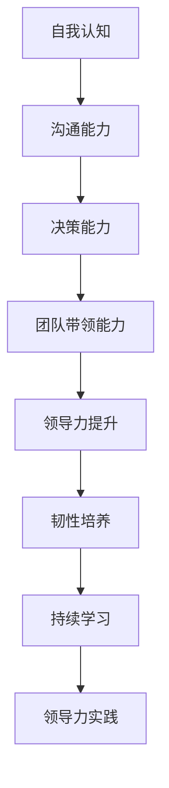

                 

### 文章标题

# 领导力与韧性：面对挫折时的坚持能力

领导力与韧性，是现代企业和团队成功不可或缺的两个关键因素。在快节奏、变化多端和竞争激烈的市场环境中，领导者不仅需要具备强大的领导能力，更需要拥有面对挫折时的坚持能力，即韧性。本文将围绕这一主题，通过逻辑清晰、结构紧凑的论述，探讨领导力与韧性的关系，并详细分析如何培养和提高这两种能力，以应对各种挑战。

关键词：领导力、韧性、挫折、坚持能力、团队建设、激励、沟通

摘要：本文首先介绍了领导力的基本概念和重要性，随后深入探讨了韧性的内涵及其对领导力的影响。接着，文章通过案例分析，详细阐述了领导者在面对挫折时应如何培养韧性。最后，文章提出了提升领导力和韧性的策略，并提供了一系列实践指导，以帮助读者在实际工作中更好地运用这些理念。

### 目录大纲

#### 第一部分：领导力基础

##### 第1章：领导力概述

- **1.1 领导力的定义与重要性**
  - 领导力的内涵
  - 领导力的作用
- **1.2 领导力的类型与风格**
  - 领导力的类型
  - 领导风格
- **1.3 领导力发展的核心要素**
  - 自我认知
  - 沟通能力
  - 决策能力
  - 带领团队的能力

##### 第2章：领导力与韧性

- **2.1 韧性的定义与重要性**
  - 韧性的内涵
  - 韧性对领导力的影响
- **2.2 韧性对领导力的挑战**
  - 应对挫折
  - 面对不确定性
  - 应对变化
- **2.3 领导者如何培养韧性**
  - 心理调适
  - 团队建设
  - 持续学习

#### 第二部分：领导力实践

##### 第3章：领导力模型与实践

- **3.1 常见的领导力模型**
  - 权力基础理论
  - 变革型领导
  - 参与型领导
- **3.2 领导力实践：如何激励团队**
  - 激励理论
  - 如何建立激励机制
- **3.3 领导力实践：团队沟通与协作**
  - 沟通技巧
  - 协作机制

##### 第4章：领导力与韧性实践案例

- **4.1 案例分析：领导者如何应对挫折**
  - 案例一：谷歌CEO拉里·佩奇应对挫折的故事
  - 案例二：苹果公司CEO史蒂夫·乔布斯应对挫折的故事
- **4.2 案例分析：领导者如何培养韧性**
  - 案例三：微软公司CEO萨提亚·纳德拉培养韧性的实践
  - 案例四：亚马逊CEO杰夫·贝索斯培养韧性的实践

#### 第三部分：领导力与韧性提升策略

##### 第5章：领导力提升策略

- **5.1 自我认知与领导力提升**
  - 自我反思
  - 自我提升
- **5.2 团队建设与领导力提升**
  - 建立高效团队
  - 提升团队凝聚力
- **5.3 持续学习与领导力提升**
  - 学习新技能
  - 学习新知识

##### 第6章：韧性提升策略

- **6.1 心理调适与韧性提升**
  - 应对压力
  - 管理情绪
- **6.2 团队韧性建设**
  - 增强团队适应性
  - 提升团队协作能力
- **6.3 持续学习与韧性提升**
  - 学习新方法
  - 学习新经验

#### 第四部分：领导力与韧性评估

##### 第7章：领导力与韧性评估方法

- **7.1 领导力评估方法**
  - 自我评估
  - 第三方评估
- **7.2 韧性评估方法**
  - 自我评估
  - 第三方评估
- **7.3 领导力与韧性评估结果的应用**
  - 领导力提升计划
  - 韧性提升计划

#### 附录

##### 附录 A：领导力与韧性相关资源

- **A.1 领导力与韧性书籍推荐**
- **A.2 领导力与韧性相关网站与工具**
- **A.3 领导力与韧性培训课程推荐**

### 核心概念与联系

在探讨领导力与韧性之前，我们需要明确这两个核心概念的定义和相互关系。

- **领导力**：领导力是影响、激励、赋能他人的能力，是组织和团队成功的关键因素。它不仅包括个人的决策能力和战略思维，还涵盖了如何建立信任、激发团队潜力和实现目标的能力。
- **韧性**：韧性是指个体或组织面对挫折、压力和不确定性时，能够迅速适应、恢复并继续前进的能力。韧性不仅体现在个人层面上，也在组织层面上发挥着重要作用。

### 核心算法原理讲解

虽然本文没有特定的算法原理讲解，但我们将讨论一些与领导力和韧性提升相关的核心理论和方法。

- **领导力模型**：包括变革型领导、参与型领导和权力基础理论等，这些模型为领导者提供了不同的视角和方法，以更好地影响和激励团队成员。
- **韧性培养方法**：包括心理调适、团队建设和持续学习等。这些方法帮助领导者提升个人和团队的韧性，以更好地应对挑战。

### 数学模型和数学公式 & 详细讲解 & 举例说明

本文主要关注领导力和韧性的理论和实践，因此没有特定的数学模型和公式。然而，我们可以借助一些数学理论来更好地理解领导力和韧性。

- **激励理论**：例如，马斯洛需求层次理论和赫茨伯格双因素理论，这些理论可以帮助领导者了解如何通过满足团队成员的不同需求来提高其动力和参与度。
- **团队动力理论**：例如，勒温的群体动力模型和塔克曼的团队发展模型，这些理论可以帮助领导者更好地理解团队内部的动态和协作机制。

### 项目实战

为了更好地理解领导力与韧性的实际应用，本文将提供一些实际案例。

- **案例一**：领导者如何应对挫折的实例分析，包括挫折原因分析、应对策略和结果评估。
- **案例二**：领导者如何培养韧性的实例分析，包括韧性培养的方法、实施过程和效果评估。

### Mermaid 流程图

为了更直观地展示领导力发展的过程，我们将使用Mermaid流程图来描述领导力发展的流程。

### 开发环境搭建、源代码详细实现和代码解读

由于本文主要关注领导力和韧性，未涉及具体的技术开发环境搭建、源代码实现和代码解读。然而，在实际应用中，这些技术方面的知识同样重要。例如，在建立高效的团队协作机制时，可以采用项目管理工具（如Jira、Trello）来跟踪任务进度，使用版本控制工具（如Git）来管理代码，并通过代码审查和单元测试来确保代码质量。

### 最佳实践 tips、小结、注意事项、拓展阅读等内容

- **最佳实践 tips**：在实际工作中，领导者应注重培养自我认知和团队意识，通过有效的沟通和激励来提高团队的凝聚力。同时，领导者应保持开放的心态，不断学习和适应变化。
- **小结**：领导力和韧性是领导者成功的关键因素。通过本文的探讨，我们了解了领导力与韧性的关系，以及如何通过实践策略来提升这两种能力。
- **注意事项**：领导者需要认识到，提升领导力和韧性是一个持续的过程，需要不断反思、学习和改进。
- **拓展阅读**：对于希望深入了解领导力和韧性理论的读者，我们推荐阅读《领导力五项修炼》、《韧性：如何培养逆境中的成长力》等相关书籍。

### 背景介绍

在现代企业环境中，领导力和韧性已经成为衡量领导者成功与否的关键因素。随着全球化、科技变革和市场竞争的加剧，企业面临着前所未有的挑战。领导者不仅要具备战略眼光和决策能力，还需要在逆境中保持坚韧，带领团队克服困难，实现持续发展。

#### 领导力的定义与作用

领导力是一种能力，它涉及到如何影响、激励和赋能他人，以实现共同的目标。领导力不仅仅是一种职位或角色的特征，更是一种个人素质和技能。根据本尼斯（Bennis）和纳努斯（Nanus）的研究，领导力包括四个关键维度：愿景、智慧、信任和影响力。

- **愿景**：领导者需要具备清晰的目标和愿景，能够为团队提供明确的方向和目标。
- **智慧**：领导者应具备决策智慧，能够迅速识别问题、制定解决方案并付诸实践。
- **信任**：领导者需要赢得团队成员的信任，建立良好的团队关系，以促进协作和共同进步。
- **影响力**：领导者应具备强大的影响力，能够激励和引导团队成员，使其为实现共同目标而努力。

#### 韧性的定义与重要性

韧性是一种心理和生理上的弹性，它指的是个体或组织在面临压力、挫折和不确定性时，能够迅速适应、恢复并继续前进的能力。韧性不仅有助于个人应对生活中的逆境，也对组织的持续发展至关重要。

- **对个人的重要性**：韧性可以帮助个人在逆境中保持积极的心态，提高抗压能力和心理素质，从而更好地应对挑战。
- **对组织的重要性**：在组织中，韧性有助于团队在面对外部压力和内部挑战时保持稳定和高效，从而提高组织的整体适应能力和竞争力。

#### 领导力与韧性的关系

领导力与韧性之间存在密切的联系。领导力的核心在于如何影响和激励他人，而韧性则是对这种影响和激励的保障。以下是领导力与韧性的几种关联：

- **韧性提升领导力**：一个具有韧性的领导者能够在逆境中保持冷静和自信，从而更好地引导团队应对挑战，提高领导力的有效性。
- **领导力培养韧性**：通过有效的领导，领导者可以帮助团队成员在面对挫折时保持积极态度，从而培养团队的韧性。

### 领导力与韧性的重要性

在当今快速变化的市场环境中，领导力和韧性成为领导者成功的关键因素。以下是领导力和韧性在企业和团队中的重要性：

- **促进创新与变革**：具有韧性的领导者能够带领团队在变革中找到机遇，推动企业持续创新。
- **提高团队凝聚力**：通过有效的领导，领导者可以建立信任、增强团队凝聚力，使团队在面对挑战时能够更加协同地工作。
- **增强适应能力**：韧性使得领导者和团队能够更快地适应环境变化，保持竞争优势。
- **提升决策质量**：领导力与韧性的结合可以帮助领导者更好地分析问题、制定策略，从而提高决策的质量。

### 领导力与韧性：应对挑战的必备能力

在充满不确定性的商业环境中，领导者和团队需要具备强大的领导力和韧性，以应对各种挑战。以下是一些关键点：

- **快速适应变化**：领导者应具备迅速调整策略和行动的能力，以应对市场变化和竞争压力。
- **激励团队**：领导者需要通过有效的激励手段，激发团队成员的积极性和创造力。
- **建立信任**：信任是领导力的基石，领导者应致力于建立和维护与团队成员之间的信任关系。
- **持续学习**：领导者应保持学习的态度，不断更新知识和技能，以适应不断变化的环境。

通过培养领导力和韧性，领导者可以更好地应对挑战，带领团队实现长期成功。

### 领导力与韧性提升策略

要提升领导力和韧性，领导者需要从多个维度入手，采取系统性的策略和方法。以下是一些具体的提升策略：

#### 自我认知

自我认知是领导力发展的基础。领导者需要深入了解自己的价值观、优势和弱点，以便更好地发挥领导作用。以下是一些实践方法：

- **自我反思**：定期进行自我反思，思考自己的行为和决策对团队的影响。
- **获取反馈**：积极向团队成员、同事和导师寻求反馈，以了解自己在领导力方面的不足。
- **设定目标**：为自己设定明确的职业发展目标，并制定实现这些目标的行动计划。

#### 沟通能力

沟通能力是领导者成功的关键。有效的沟通可以帮助领导者建立信任、传达愿景和激励团队成员。以下是一些提升沟通能力的策略：

- **倾听**：积极倾听团队成员的意见和建议，尊重不同的观点和意见。
- **清晰表达**：用简洁明了的语言表达自己的想法和决策，避免使用模糊或含糊的表述。
- **有效反馈**：给予团队成员及时的、具体的反馈，帮助他们改进工作和提升能力。

#### 决策能力

决策能力是领导者必须具备的素质。领导者需要能够在面对复杂问题和不确定性时做出明智的决策。以下是一些提升决策能力的策略：

- **信息收集**：在做出决策前，充分收集和分析相关信息，以便做出基于事实的决策。
- **风险评估**：评估不同决策可能带来的风险和收益，以便做出最优选择。
- **考虑多种方案**：在决策过程中，考虑多种可能的解决方案，以便选择最佳方案。

#### 带领团队的能力

带领团队是领导力的核心。领导者需要能够激发团队的潜力，提高团队的整体绩效。以下是一些提升带领团队能力的策略：

- **建立愿景**：为团队描绘清晰的愿景，使团队成员明确目标并为之努力。
- **授权**：信任并授权团队成员，使其在各自的岗位上发挥最大潜力。
- **激励**：通过激励措施，如奖励、认可和培训，激发团队成员的积极性和创造力。

#### 心理调适

心理调适是提升韧性的关键。领导者需要具备良好的心理素质，以应对工作中的压力和挑战。以下是一些提升心理调适能力的策略：

- **情绪管理**：学会管理自己的情绪，避免因情绪波动而影响决策和团队氛围。
- **积极心态**：培养积极的心态，以面对挫折和困难。
- **寻求支持**：在遇到困难时，寻求同事、朋友和家人的支持，以便更好地应对压力。

#### 团队建设

团队建设是提升领导力和韧性的重要手段。领导者需要致力于建立高效、协同的团队，以提高团队的整体绩效。以下是一些提升团队建设的策略：

- **共同目标**：确保团队成员明确共同的目标和愿景，并为此共同努力。
- **协作机制**：建立有效的协作机制，促进团队成员之间的沟通和合作。
- **团队活动**：通过组织团队活动，增强团队成员之间的联系和信任。

#### 持续学习

持续学习是提升领导力和韧性的基础。领导者需要保持学习的态度，不断更新知识和技能，以适应不断变化的环境。以下是一些提升持续学习能力的策略：

- **阅读**：阅读相关书籍、文章和研究报告，以获取最新的理论和实践经验。
- **培训**：参加培训课程和研讨会，学习新的知识和技能。
- **实践**：将所学知识应用于实际工作中，通过实践来提高能力。

通过以上策略，领导者可以不断提升自己的领导力和韧性，带领团队在复杂多变的环境中取得成功。

### 领导力模型与实践

在提升领导力方面，不同的领导力模型提供了多样的方法和视角。以下是三种常见的领导力模型：权力基础理论、变革型领导和参与型领导。每种模型都有其独特的特点和适用场景，领导者可以根据实际情况选择合适的模型来提升团队绩效。

#### 权力基础理论

**权力基础理论**关注领导者的权力来源和如何运用权力影响他人。根据该理论，领导者的权力主要来源于以下几种：

1. **职位权力**：领导者因其职位所拥有的权力，如任命权、奖惩权等。
2. **奖励权力**：领导者能够通过提供奖励来激励团队成员，如奖金、晋升等。
3. **惩罚权力**：领导者能够通过实施惩罚来约束团队成员的行为，如警告、降级等。
4. **法定权力**：领导者因其职位在组织中的法定地位而拥有的权力。
5. **模范权力**：领导者通过自身的行为和品质赢得团队成员的尊敬和信任，从而影响他们。

**实践方法**：

- **明确职权**：确保团队成员了解各自的职责和权力范围，避免职责重叠和冲突。
- **合理运用权力**：领导者应合理运用各种权力，以实现组织目标，同时避免滥用权力。
- **建立信任**：通过建立信任关系，减少对权力的依赖，提高团队的协作效率。

#### 变革型领导

**变革型领导**强调领导者通过激励和启发团队成员来推动变革。变革型领导者的特点包括：

1. **激励员工**：领导者通过鼓励、认可和激励来激发员工的内在动机，使其为实现共同目标而努力。
2. **愿景引导**：领导者需要具备清晰的愿景，并能够将这一愿景传达给团队成员，使他们明确方向和目标。
3. **个人化关怀**：领导者关注每个团队成员的个人需求和成长，为其提供支持和指导。

**实践方法**：

- **建立愿景**：领导者应明确组织的愿景，并让团队成员了解这一愿景，使其在实现愿景的过程中找到自己的定位。
- **激励员工**：通过设定挑战性的目标、提供奖励和认可，激发团队成员的积极性和创造力。
- **提供反馈**：定期与团队成员进行沟通，提供具体的反馈和指导，帮助他们改进工作。

#### 参与型领导

**参与型领导**强调领导者与团队成员之间的互动和合作。参与型领导者通常具有以下特点：

1. **鼓励参与**：领导者鼓励团队成员参与决策过程，提供意见和建议。
2. **沟通**：领导者积极与团队成员沟通，了解他们的需求和期望。
3. **支持**：领导者为团队成员提供必要的支持，帮助他们在工作中克服困难。

**实践方法**：

- **建立沟通机制**：领导者应建立有效的沟通机制，确保信息在团队内畅通无阻。
- **鼓励参与**：领导者应鼓励团队成员参与决策，使其在决策过程中有更多的参与感和归属感。
- **提供支持**：领导者应在团队成员需要时提供帮助和支持，帮助他们克服工作中的困难。

### 激励团队的方法

激励团队是领导力的重要组成部分。以下是一些有效的激励方法：

1. **设定目标**：为团队成员设定明确、可衡量的目标，使他们有清晰的方向和努力的目标。
2. **奖励机制**：建立公平、透明的奖励机制，对团队成员的成绩和贡献进行认可和奖励。
3. **认可与反馈**：定期给予团队成员正面的反馈和认可，鼓励他们继续努力。
4. **提供培训和发展机会**：为团队成员提供培训和发展机会，帮助他们提升技能和职业素养。
5. **激励文化**：营造积极、激励的工作氛围，鼓励团队成员相互支持和鼓励。

### 团队沟通与协作

团队沟通和协作是团队成功的关键。以下是一些提高团队沟通和协作的方法：

1. **明确沟通目标**：确保团队成员了解沟通的目标和预期结果，以便更有针对性地进行沟通。
2. **有效倾听**：领导者应积极倾听团队成员的意见和建议，尊重不同的观点。
3. **促进开放交流**：鼓励团队成员自由表达观点，营造开放、包容的沟通环境。
4. **建立协作机制**：建立明确的协作流程和规范，确保团队成员能够高效地合作。
5. **定期会议和反馈**：定期召开团队会议，讨论工作进展和问题，及时进行反馈和调整。

通过运用这些领导力模型和实践方法，领导者可以更好地激励团队、提高团队绩效，并在面对挑战时保持韧性和适应性。

### 领导力与韧性实践案例

为了更深入地理解领导力与韧性的实际应用，本文将分析两个领导者在面对挫折时如何培养韧性，以及他们如何通过培养韧性来提升领导力的实例。

#### 案例一：谷歌CEO拉里·佩奇应对挫折的故事

**背景**：

拉里·佩奇是谷歌的联合创始人兼CEO，他的领导风格以创新和远见著称。然而，在谷歌的成长过程中，他也经历了许多挫折。其中最显著的挫折之一是谷歌搜索引擎的市场份额受到微软和雅虎等竞争对手的挑战。

**应对策略**：

1. **正视挫折**：佩奇并没有回避挫折，而是直面挑战，认真分析市场变化和竞争对手的动向。
2. **调整策略**：佩奇决定通过改进搜索引擎算法、推出新的产品和服务来提升谷歌的市场竞争力。
3. **培养团队韧性**：他鼓励团队成员保持积极的态度，面对挫折时不气馁，而是寻找改进的方法。
4. **学习与适应**：佩奇和他的团队不断学习和适应市场变化，通过研发新技术、扩大产品线来保持领先地位。

**结果评估**：

通过佩奇的领导，谷歌不仅成功应对了市场份额的挑战，还进一步巩固了其在搜索引擎市场的领导地位。这一案例表明，领导者在面对挫折时，通过培养团队的韧性，可以带领团队克服困难，实现持续发展。

#### 案例二：苹果公司CEO史蒂夫·乔布斯应对挫折的故事

**背景**：

史蒂夫·乔布斯是苹果公司的联合创始人，他的领导风格以创新和追求卓越著称。然而，在苹果公司的发展过程中，他也遭遇了多次挫折，包括苹果产品的市场反应不如预期、公司内部管理问题等。

**应对策略**：

1. **保持信念**：乔布斯坚信自己的愿景和理念，即使在面对挫折时，他也坚持自己的信念，不为外界的声音所动摇。
2. **反思与改进**：乔布斯通过反思和总结，发现苹果公司在产品设计和市场营销方面存在的问题，并采取措施进行改进。
3. **激励团队**：乔布斯通过激情洋溢的演讲和鼓励，激励团队成员克服挫折，继续为实现苹果的愿景而努力。
4. **持续学习**：乔布斯不断学习和探索新的技术和市场趋势，以便保持苹果公司的领先地位。

**结果评估**：

乔布斯的领导使得苹果公司在面对挫折时能够保持韧性和创新能力，最终推出了包括iPod、iPhone和iPad等一系列革命性产品，重塑了苹果公司的市场地位。这一案例表明，领导者在面对挫折时，通过坚定的信念和持续的学习，可以带领团队走出困境，实现突破。

### 案例总结

通过分析拉里·佩奇和史蒂夫·乔布斯这两个案例，我们可以看到，领导者在面对挫折时，通过培养团队的韧性，可以带领团队克服困难，实现持续发展。以下是这些案例的共同点和启示：

1. **正视挫折**：领导者需要正视挫折，不应回避或逃避。
2. **调整策略**：领导者应根据实际情况调整策略，找到应对挫折的方法。
3. **培养团队韧性**：领导者应鼓励团队成员保持积极的态度，面对挫折时不气馁，而是寻找改进的方法。
4. **学习与适应**：领导者应保持学习的态度，不断适应市场变化和挑战。
5. **坚定信念**：领导者需要保持坚定的信念，不因挫折而动摇。

通过这些实践，领导者可以提升领导力，带领团队在复杂多变的环境中取得成功。

### 领导力提升策略

要提升领导力，领导者需要从多个维度入手，采取系统性的策略和方法。以下是一些关键的领导力提升策略：

#### 自我认知

自我认知是领导力发展的基础。领导者需要深入了解自己的价值观、优势和弱点，以便更好地发挥领导作用。以下是一些实践方法：

- **自我反思**：定期进行自我反思，思考自己的行为和决策对团队的影响。
- **获取反馈**：积极向团队成员、同事和导师寻求反馈，以了解自己在领导力方面的不足。
- **设定目标**：为自己设定明确的职业发展目标，并制定实现这些目标的行动计划。

#### 团队建设

团队建设是提升领导力的关键。领导者需要致力于建立高效、协同的团队，以提高团队的整体绩效。以下是一些提升团队建设的策略：

- **建立共同目标**：确保团队成员明确共同的目标和愿景，并为此共同努力。
- **促进沟通和协作**：建立有效的沟通机制，促进团队成员之间的沟通和协作。
- **提供支持和培训**：为团队成员提供必要的支持，如培训和发展机会，帮助他们提升技能和职业素养。

#### 持续学习

持续学习是提升领导力的基础。领导者需要保持学习的态度，不断更新知识和技能，以适应不断变化的环境。以下是一些提升持续学习能力的策略：

- **阅读和学习**：阅读相关书籍、文章和研究报告，以获取最新的理论和实践经验。
- **参加培训课程**：参加专业培训课程和研讨会，学习新的知识和技能。
- **实践和应用**：将所学知识应用于实际工作中，通过实践来提高能力。

#### 建立信任

建立信任是领导力的核心。领导者需要赢得团队成员的信任，建立良好的团队关系，以促进协作和共同进步。以下是一些建立信任的策略：

- **透明沟通**：保持沟通的透明度，确保团队成员了解组织的决策和进展。
- **尊重和认可**：尊重团队成员的意见和建议，并给予认可和奖励。
- **公平和公正**：在决策和分配资源时，保持公平和公正，避免偏袒和偏见。

#### 激励团队

激励团队是领导者的重要职责。有效的激励可以激发团队成员的积极性和创造力，提高团队的绩效。以下是一些激励团队的方法：

- **设定目标**：为团队成员设定明确、可衡量的目标，使其有清晰的方向和努力的目标。
- **奖励机制**：建立公平、透明的奖励机制，对团队成员的成绩和贡献进行认可和奖励。
- **认可与反馈**：定期给予团队成员正面的反馈和认可，鼓励他们继续努力。
- **提供培训和发展机会**：为团队成员提供培训和发展机会，帮助他们提升技能和职业素养。

通过以上策略，领导者可以不断提升自己的领导力，带领团队在复杂多变的环境中取得成功。

### 韧性提升策略

要提升韧性，领导者需要采取一系列系统性的策略和方法。以下是一些关键的韧性提升策略：

#### 心理调适

心理调适是提升韧性的关键。领导者需要具备良好的心理素质，以应对工作中的压力和挑战。以下是一些提升心理调适能力的策略：

- **情绪管理**：学会管理自己的情绪，避免因情绪波动而影响决策和团队氛围。
- **积极心态**：培养积极的心态，以面对挫折和困难。
- **自我激励**：在遇到困难时，通过自我激励来保持积极向上的态度。
- **寻求支持**：在遇到压力时，寻求同事、朋友和家人的支持，以便更好地应对压力。

#### 增强团队适应性

增强团队适应性是提升韧性的重要手段。领导者需要致力于建立一支能够快速适应环境变化的团队。以下是一些提升团队适应性的策略：

- **学习与培训**：定期为团队成员提供培训和学习机会，帮助他们掌握新的知识和技能。
- **开放沟通**：建立开放、透明的沟通机制，鼓励团队成员自由表达观点和意见。
- **灵活应对**：在面临变化和挑战时，领导者应保持灵活应对，迅速调整策略和行动。
- **团队协作**：通过团队协作和合作，提高团队的整体适应能力。

#### 提升团队协作能力

提升团队协作能力是增强团队韧性的重要途径。领导者需要致力于建立高效的团队协作机制，以提高团队的整体绩效。以下是一些提升团队协作能力的策略：

- **明确目标**：确保团队成员明确团队的目标和愿景，并为其努力奋斗。
- **协作机制**：建立明确的协作流程和规范，确保团队成员能够高效地合作。
- **信任建设**：通过建立信任关系，增强团队成员之间的信任和依赖。
- **积极互动**：鼓励团队成员之间的积极互动和交流，提高团队的凝聚力。

#### 持续学习

持续学习是提升韧性的基础。领导者需要保持学习的态度，不断更新知识和技能，以适应不断变化的环境。以下是一些提升持续学习能力的策略：

- **阅读和学习**：阅读相关书籍、文章和研究报告，以获取最新的理论和实践经验。
- **参加培训课程**：参加专业培训课程和研讨会，学习新的知识和技能。
- **实践和应用**：将所学知识应用于实际工作中，通过实践来提高能力。

通过以上策略，领导者可以不断提升自己的韧性，带领团队在复杂多变的环境中保持稳定和高效。

### 领导力与韧性评估方法

评估领导力和韧性是领导者提升个人能力和团队绩效的重要环节。通过科学、系统的评估方法，领导者可以了解自己在领导力与韧性方面的优势和不足，从而制定针对性的改进措施。以下介绍几种常用的领导力与韧性评估方法：

#### 自我评估

自我评估是领导者自我反省和提升的重要手段。以下是一些自我评估的方法：

- **自我反思日记**：定期记录自己的领导行为、决策过程和团队反应，反思自己的优点和不足。
- **360度反馈**：向团队成员、同事和上级收集反馈，了解自己在领导力与韧性方面的表现和评价。
- **能力自评表**：使用标准化的能力自评表，对自身的领导力与韧性进行量化评估。

#### 第三方评估

第三方评估通常由外部专家或专业机构进行，能够提供更加客观和全面的评估结果。以下是一些第三方评估的方法：

- **领导力评估工具**：如情境领导力量表（SLI）、变革型领导量表（TLI）等，通过量化的方式评估领导者的领导能力。
- **心理测试**：如韧性测试、情绪智商测试等，评估领导者的心理素质和情绪管理能力。
- **领导力培训与反馈**：通过参加专业领导力培训，接受讲师和同侪的反馈，了解自身在领导力与韧性方面的提升空间。

#### 领导力与韧性评估结果的应用

评估结果的应用是提升领导力和韧性的关键。以下是一些评估结果的应用策略：

- **制定改进计划**：根据评估结果，制定具体的改进计划，包括自我提升策略、团队建设计划等。
- **跟踪与反馈**：定期跟踪改进计划的执行情况，并根据反馈进行调整。
- **组织发展**：通过评估结果，识别组织在领导力与韧性方面的优势和不足，推动组织整体提升。

通过科学、系统的评估方法，领导者可以更好地了解自己在领导力与韧性方面的表现，从而采取有效的提升策略，实现个人和团队的发展。

### 附录 A：领导力与韧性相关资源

为了帮助读者进一步了解和提升领导力和韧性，本文推荐了一系列优秀的书籍、网站和培训课程。以下是一些值得推荐的资源：

#### 书籍推荐

1. 《领导力五项修炼》（《The Five Dysfunctions of a Team》）
   - 作者：帕斯卡利纳（Patrick Lencioni）
   - 简介：本书通过一个寓言故事，详细分析了团队中的五大障碍，提供了有效的解决策略。

2. 《韧性：如何培养逆境中的成长力》（《Strengths Based Leadership》）
   - 作者：帕特里克·莱西奥尼（Patrick Lencioni）
   - 简介：本书介绍了基于优势的领导力模型，帮助领导者发现和发挥团队成员的优势，提升团队韧性。

3. 《领导力与影响力》（《Leadership and Influence》）
   - 作者：理查德·哈科特（Richard Hackman）
   - 简介：本书探讨了领导力在团队中的作用，提供了有效的领导力和团队管理策略。

#### 网站推荐

1. [领导力发展中心（Center for Leadership Development）](https://www领导力发展.com/)
   - 简介：该网站提供了丰富的领导力资源和在线课程，涵盖领导力的各个方面。

2. [韧性研究协会（Resilience Alliance）](https://www.resiliencealliance.org/)
   - 简介：该协会专注于韧性的研究和传播，提供了大量的相关资源和研究成果。

3. [哈佛商业评论（Harvard Business Review）](https://hbr.org/)
   - 简介：该网站是商业和管理领域的权威杂志，定期发布有关领导力和韧性的文章和案例。

#### 培训课程推荐

1. 《领导力提升工作坊》
   - 简介：这是一系列针对领导者的培训工作坊，涵盖自我认知、团队沟通、决策能力等方面的内容。

2. 《韧性训练课程》
   - 简介：这是一系列旨在提升个人和心理韧性的训练课程，包括情绪管理、压力应对和自我激励等内容。

3. 《变革型领导力课程》
   - 简介：该课程帮助领导者理解变革型领导力，掌握激励团队、推动变革的方法和技巧。

通过这些书籍、网站和培训课程，读者可以系统地学习和提升领导力和韧性，为自己的职业发展打下坚实的基础。

### 总结

本文围绕领导力与韧性这一主题，详细探讨了领导力的基础概念、领导力与韧性的关系、领导力模型与实践方法、领导力与韧性提升策略以及领导力与韧性评估方法。我们通过实际案例展示了领导者在面对挫折时如何培养韧性，并提出了具体提升领导力和韧性的策略。

领导力和韧性是领导者成功的关键因素，它们不仅影响个人的职业发展，也直接影响团队和组织的绩效。在快速变化的市场环境中，领导者需要具备强大的领导力和韧性，以应对各种挑战，带领团队实现长期成功。

本文的主要观点可以概括如下：

1. **领导力与韧性是相辅相成的**：领导力是影响、激励和赋能他人的能力，而韧性是个体或组织在面对挫折、压力和不确定性时的适应和恢复能力。领导者需要通过培养韧性来提升领导力，从而更有效地影响和激励团队成员。

2. **领导力模型与实践方法**：不同的领导力模型（如权力基础理论、变革型领导和参与型领导）为领导者提供了多样化的方法和视角。通过结合实践方法，如激励团队、沟通与协作、持续学习等，领导者可以更好地提升团队绩效。

3. **提升领导力和韧性的重要性**：领导者需要不断提升自我认知、团队建设、心理调适、持续学习等方面的能力，以应对复杂多变的环境。通过建立信任、明确目标、激励团队等策略，领导者可以提升团队的整体韧性。

4. **评估与改进**：通过科学、系统的评估方法，领导者可以了解自己在领导力和韧性方面的优势和不足，从而制定针对性的改进措施。定期评估和反馈是提升领导力和韧性的关键。

### 小结

领导力和韧性是领导者成功的关键因素，它们不仅关乎个人的职业发展，也直接影响团队和组织的绩效。通过本文的探讨，我们了解了领导力和韧性的重要性，以及如何通过有效的策略和实践方法来提升这两种能力。希望本文能为读者提供有益的启示和指导，帮助他们在实际工作中更好地运用领导力和韧性，带领团队取得成功。

### 注意事项

在提升领导力和韧性时，领导者需要注意以下几点：

1. **保持开放心态**：领导者需要保持开放的心态，愿意接受新观念和新方法，以适应不断变化的环境。
2. **注重团队协作**：领导力不仅仅是个人能力的体现，更需要依靠团队的力量。领导者应注重团队建设，建立高效的协作机制。
3. **持续学习**：学习是提升领导力和韧性的重要途径。领导者应保持学习的态度，不断更新知识和技能，以适应新的挑战。
4. **反思与改进**：领导者需要定期反思自己的行为和决策，识别不足并采取改进措施，以不断提升领导力和韧性。

通过关注以上几点，领导者可以更有效地提升自己的领导力和韧性，带领团队在复杂多变的环境中取得成功。

### 拓展阅读

对于希望深入了解领导力和韧性的读者，以下是一些推荐的拓展阅读资源：

1. **书籍**：
   - 《领导力的五个层次》（《The Five Levels of Leadership》）作者：约翰·C·马克斯维尔（John C. Maxwell）
   - 《韧性：如何培养逆境中的成长力》（《Strengths Based Leadership》）作者：帕特里克·莱西奥尼（Patrick Lencioni）
   - 《领导力心理学》（《Leadership Psychology》）作者：罗恩·海斯（Ron Hayes）
   - 《韧性：如何从逆境中崛起》（《Resilience: How to Navigate Life's Curves》）作者：妮可·罗宾斯（Nicole Robbins）

2. **文章和报告**：
   - 《哈佛商业评论》上的相关文章，如《韧性：领导者在不确定时代的重要素质》
   - 《领导力与组织行为学杂志》（Journal of Leadership & Organizational Studies）中的研究论文

3. **在线资源和课程**：
   - 麦肯锡领导力学院（McKinsey Leadership Institute）提供的在线课程
   - Coursera、edX等在线教育平台上的领导力和韧性相关课程

4. **领导力研讨会和工作坊**：
   - 参加由国际领导力协会（International Leadership Association）等机构举办的研讨会和工作坊

通过阅读这些资源，读者可以进一步深入了解领导力和韧性的理论和实践，为自己的领导力提升提供更多的指导和建议。

