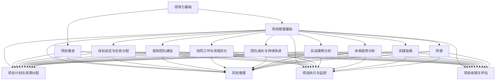

                 

### 文章标题：领导力与项目推进：高效完成团队任务的方法

#### 关键词：领导力，项目推进，团队管理，沟通技巧，目标设定，任务分配

> 摘要：本文旨在探讨领导力在项目推进中的重要性，以及如何通过高效的方法完成团队任务。我们将深入分析领导力的本质、领导风格、沟通技巧、激励策略、变革管理等核心要素，并结合项目管理的具体实践，为读者提供一套系统性的指导方案。文章结构清晰，内容详实，适合广大项目经理、团队领导者和IT从业者阅读与参考。

---

### 目录大纲

#### 《领导力与项目推进：高效完成团队任务的方法》

##### 第一部分：领导力基础

- **第1章：领导力的本质与重要性**
  - **1.1 领导力的定义与内涵**
  - **1.2 领导力的重要性**
  - **1.3 领导力的基本要素**

- **第2章：领导风格与团队管理**
  - **2.1 领导风格理论**
  - **2.2 领导风格的应用**
  - **2.3 团队管理策略**

- **第3章：沟通技巧与团队协作**
  - **3.1 有效沟通的基本原则**
  - **3.2 沟通障碍与解决策略**
  - **3.3 团队协作的最佳实践**

- **第4章：激励与团队动力**
  - **4.1 激励理论及其应用**
  - **4.2 团队动力的培养**
  - **4.3 常见激励策略**

- **第5章：变革管理与团队适应**
  - **5.1 变革管理的重要性**
  - **5.2 变革管理的步骤**
  - **5.3 团队适应与变革管理**

##### 第二部分：项目推进

- **第6章：项目管理基础**
  - **6.1 项目管理的定义与过程**
  - **6.2 项目生命周期**
  - **6.3 项目管理工具与技术**

- **第7章：项目计划与资源分配**
  - **7.1 项目计划的重要性**
  - **7.2 制定项目计划的步骤**
  - **7.3 资源分配策略与优化**

- **第8章：风险管理**
  - **8.1 风险管理的定义与重要性**
  - **8.2 风险识别与评估**
  - **8.3 风险应对策略**

- **第9章：项目执行与监控**
  - **9.1 项目执行的策略**
  - **9.2 项目监控的重要性**
  - **9.3 项目监控的方法与工具**

- **第10章：项目收尾与评估**
  - **10.1 项目收尾的任务**
  - **10.2 项目评估的方法**
  - **10.3 项目评估报告的撰写**

##### 第三部分：团队任务完成方法

- **第11章：目标设定与任务分配**
  - **11.1 目标设定的SMART原则**
  - **11.2 任务分配的方法**
  - **11.3 任务跟进与协调**

- **第12章：高效团队建设**
  - **12.1 高效团队的特性**
  - **12.2 高效团队建设的方法**
  - **12.3 团队文化建设**

- **第13章：协同工作与流程优化**
  - **13.1 协同工作的工具与方法**
  - **13.2 工作流程分析与优化**
  - **13.3 流程优化案例研究**

- **第14章：团队成长与持续改进**
  - **14.1 团队成长的重要性**
  - **14.2 团队成员的角色与发展**
  - **14.3 团队持续改进的方法与实践**

##### 第四部分：领导力与项目推进的综合应用

- **第15章：实战案例分析**
  - **15.1 案例一：成功领导与项目推进**
  - **15.2 案例二：失败教训与改进策略**
  - **15.3 案例三：跨文化团队管理与项目推进**

- **第16章：领导力与项目推进的未来趋势**
  - **16.1 数字化时代领导力的变革**
  - **16.2 人工智能与项目推进的结合**
  - **16.3 未来领导力与项目推进的发展方向**

- **第17章：领导力与项目推进实践指南**
  - **17.1 实践指南一：领导力培养方法**
  - **17.2 实践指南二：项目推进策略**
  - **17.3 实践指南三：团队管理与任务完成**

- **第18章：附录**
  - **18.1 常用领导力工具与应用**
  - **18.2 项目管理方法论介绍**
  - **18.3 领导力与项目推进相关资源推荐**

---

本文将按照目录大纲逐步展开讨论，旨在帮助读者理解并掌握领导力在项目推进中的关键作用，以及如何通过有效的团队管理方法和项目推进策略，实现高效的任务完成。接下来的章节中，我们将对每个主题进行详细的探讨和解释。

---

### 引言

在当今快速发展的信息技术领域，领导力和项目推进的能力已成为衡量一个团队或组织成功与否的关键因素。随着市场竞争的日益激烈和技术更新的不断加速，项目的成功与否不仅取决于技术的先进性和资源的充足性，更取决于团队的协作效率和管理者的领导能力。有效的领导力可以激发团队的潜能，提高团队成员的凝聚力和创造力，从而推动项目的顺利进行，最终实现预期目标。

本文将从领导力的本质、领导风格、沟通技巧、激励策略、变革管理等多个方面深入探讨领导力在项目推进中的重要性。同时，结合项目管理的实际操作，介绍项目计划、资源分配、风险管理、项目执行与监控等关键环节，为读者提供一套系统性的领导力与项目推进的方法论。

通过本文的阅读，读者可以：

1. **理解领导力的本质及其在项目推进中的关键作用**：认识到领导力不仅是一种个人素质，更是一种团队管理和项目推动的重要工具。
2. **掌握不同领导风格的应用策略**：了解不同领导风格的特点及其在不同场景下的适用性，从而更好地管理团队，提高团队效率。
3. **提升沟通技巧和团队协作能力**：掌握有效沟通的基本原则和策略，减少误解和冲突，增强团队协作能力。
4. **学会激励团队动力和应对变革**：了解激励理论及其在团队管理中的应用，掌握变革管理的方法和技巧，使团队能够在变革中保持活力和适应能力。
5. **了解项目管理的核心知识和实践方法**：从项目计划、资源分配、风险管理到项目执行和监控，掌握项目管理的基本流程和工具。
6. **获取实战案例和未来趋势分析**：通过案例分析，了解成功与失败的教训，结合数字化时代和人工智能的发展趋势，为未来的项目推进提供指导。

在接下来的章节中，我们将逐一探讨这些主题，帮助读者构建一套全面的领导力与项目推进的能力体系，从而在信息技术领域中更好地发挥领导者的作用，推动团队和项目走向成功。

---

### 第一部分：领导力基础

在项目管理中，领导力是一个不可或缺的元素。领导力不仅是推动项目前进的关键驱动力，也是团队协作和任务完成的基石。本部分将深入探讨领导力的本质、重要性以及其基本要素，帮助读者理解领导力在项目管理中的核心作用。

#### 第1章：领导力的本质与重要性

##### 1.1 领导力的定义与内涵

领导力，顾名思义，指的是引导和影响他人共同实现目标的能力。这种能力不仅体现在个人领导才能上，更体现在对团队和组织的影响力上。具体来说，领导力包括以下几个方面：

1. **愿景**：领导力始于愿景，一个优秀的领导者必须能够清晰描绘出团队或组织的未来蓝图，使团队成员能够明确目标，并为之努力。
2. **激励**：领导者需要激励团队成员，激发他们的内在动力，使他们在工作中保持积极性和创造力。
3. **决策**：在项目中，领导者需要做出快速而准确的决策，这些决策直接影响项目的进展和成果。
4. **沟通**：有效的沟通是领导力的重要组成部分，领导者需要能够清晰、准确地传达信息，确保团队成员理解任务和目标。
5. **协作**：领导者需要促进团队成员之间的协作，建立团队精神和信任，使团队能够高效地完成任务。

##### 1.2 领导力的重要性

领导力在项目管理中的重要性体现在多个方面：

1. **推动项目进展**：一个强有力的领导者能够确保项目按计划进行，及时解决问题和应对挑战，从而推动项目进展。
2. **提高团队效率**：通过有效的领导，可以激发团队成员的潜力，提高团队的工作效率和质量。
3. **增强团队凝聚力**：领导力有助于建立团队精神和信任，增强团队成员之间的凝聚力，使团队能够更好地协同工作。
4. **实现组织目标**：领导力不仅关注项目本身，更关注项目对组织目标的贡献。一个优秀的领导者能够确保项目成果与组织目标一致，从而实现组织的长远发展。

##### 1.3 领导力的基本要素

一个成功的领导者需要具备以下基本要素：

1. **专业知识**：领导者必须具备相关的专业知识，以便能够理解和指导团队的工作，做出明智的决策。
2. **沟通能力**：领导者需要具备良好的沟通能力，包括倾听、表达和反馈，以确保信息畅通无阻。
3. **决策能力**：领导者需要具备快速而准确的决策能力，能够在压力下做出明智的选择。
4. **激励能力**：领导者需要能够激励团队成员，激发他们的内在动力，使他们在工作中保持积极性和创造力。
5. **适应能力**：领导者需要具备适应变化的能力，能够灵活应对项目中的不确定性，使团队能够快速适应新环境。

通过深入理解领导力的本质、重要性及其基本要素，读者可以更好地认识到领导力在项目管理中的关键作用，从而为后续章节中的具体实践打下坚实基础。

#### 第2章：领导风格与团队管理

##### 2.1 领导风格理论

领导风格是指领导者如何行使权力、指导和影响团队成员的行为和态度。不同的领导风格对团队的影响各异，了解和运用合适的领导风格对于团队管理的成功至关重要。以下是几种常见的领导风格理论：

1. **独裁式领导（Autocratic Leadership）**：独裁式领导风格中，领导者掌握大部分决策权，团队成员的参与度较低。这种风格在紧急情况下或团队需要迅速决策时可能有效，但长期可能导致团队成员的被动和不满。

2. **民主式领导（Democratic Leadership）**：民主式领导风格中，领导者鼓励团队成员参与决策过程，尊重团队成员的意见和建议。这种风格有助于提高团队成员的参与感和归属感，增强团队凝聚力，但可能导致决策过程复杂，效率较低。

3. **参与式领导（Laissez-Faire Leadership）**：参与式领导风格中，领导者赋予团队成员较大的自主权，让他们自行决定工作方法和进度。这种风格适合高度专业化的团队，但可能需要团队成员具备较强的自我管理能力和责任感。

4. **教练式领导（Situational Leadership）**：教练式领导风格强调根据团队成员的不同情况和需求采取不同的领导方式。领导者需要根据团队成员的成熟度（能力、经验、自我管理能力）调整领导风格，从而提高团队绩效。

##### 2.2 领导风格的应用

在实际工作中，领导者需要根据项目特点、团队状况和个人能力选择合适的领导风格。以下是一些具体的指导原则：

1. **项目初期**：在项目初期，团队往往需要明确目标、规划和方向。此时，民主式领导风格有助于团队建立共识，制定合理的计划。

2. **项目执行阶段**：在项目执行阶段，领导者需要确保团队成员按计划行动，解决遇到的问题。独裁式领导风格在此阶段可能更为有效，以便快速决策和推进项目。

3. **项目末期**：在项目末期，团队可能需要集中精力解决遗留问题和进行项目总结。此时，参与式领导风格有助于团队成员积极参与，确保项目顺利完成。

4. **团队变革阶段**：在团队面临重大变革或调整时，教练式领导风格有助于领导者引导团队成员适应新环境，增强团队适应能力。

##### 2.3 团队管理策略

有效的团队管理是领导力的关键组成部分，以下是一些常见的团队管理策略：

1. **明确目标**：确保团队成员对项目目标和期望有清晰的认识，有助于提高团队的凝聚力和执行力。

2. **分工协作**：合理分配任务，明确每个成员的职责和角色，确保团队工作高效有序。

3. **沟通与反馈**：建立有效的沟通机制，鼓励团队成员分享意见和建议，及时提供反馈，帮助团队成员改进工作。

4. **激励与奖励**：运用适当的激励策略，激发团队成员的积极性和创造力，提高团队绩效。

5. **培训与发展**：提供培训和成长机会，提升团队成员的专业能力和综合素质，为团队的长远发展奠定基础。

通过理解和运用不同的领导风格和团队管理策略，领导者可以更好地应对项目中的各种挑战，推动团队高效完成任务，实现项目目标。

#### 第3章：沟通技巧与团队协作

##### 3.1 有效沟通的基本原则

沟通是团队协作的基石，有效的沟通能够减少误解、提高工作效率，增强团队凝聚力。以下是一些有效沟通的基本原则：

1. **明确目标**：在沟通前明确目标，确保双方对交流内容有共同的理解。
2. **倾听**：积极倾听对方的意见，避免中断，确保理解对方的真实意图。
3. **清晰表达**：用简单明了的语言表达自己的观点，避免使用过于专业或模糊的术语。
4. **尊重差异**：尊重团队成员的不同观点和经验，避免因观点不一致而产生冲突。
5. **反馈**：及时给予反馈，确认双方对沟通内容的理解一致，避免误解和误读。

##### 3.2 沟通障碍与解决策略

在团队沟通中，常常会遇到各种障碍，影响沟通效果。以下是一些常见的沟通障碍及其解决策略：

1. **信息过载**：过多的信息会导致团队成员无法有效处理，解决策略是简化信息，突出重点。
2. **文化差异**：文化差异可能导致沟通误解，解决策略是了解并尊重不同文化的沟通习惯。
3. **时间压力**：时间紧迫会影响沟通质量，解决策略是合理安排沟通时间，确保充分交流。
4. **个人偏见**：个人偏见会导致主观判断，解决策略是保持开放心态，客观分析问题。

##### 3.3 团队协作的最佳实践

团队协作是项目成功的关键，以下是一些团队协作的最佳实践：

1. **建立共同目标**：确保所有团队成员对项目目标和期望有共同的理解，提高团队的凝聚力。
2. **分工明确**：根据团队成员的能力和专长分配任务，确保每个人清楚自己的职责和期望。
3. **定期会议**：定期举行会议，讨论项目进展和问题，确保团队沟通畅通。
4. **共享资源**：鼓励团队成员共享资源和信息，提高工作效率。
5. **激励与认可**：对团队成员的工作给予激励和认可，增强团队士气。

通过遵循有效沟通的基本原则、解决沟通障碍并实践团队协作的最佳方法，领导者可以促进团队内部的良好沟通和协作，从而提高团队的整体效率，确保项目顺利进行。

#### 第4章：激励与团队动力

##### 4.1 激励理论及其应用

在团队管理中，激励是激发团队成员积极性和创造力的重要手段。了解和应用不同的激励理论，可以帮助领导者更有效地激发团队动力。以下是一些主要的激励理论：

1. **马斯洛需求层次理论**：该理论认为人的需求分为五个层次：生理需求、安全需求、社交需求、尊重需求和自我实现需求。领导者应根据团队成员的不同需求层次，提供相应的激励措施。

2. **赫茨伯格的双因素理论**：赫茨伯格认为，影响员工工作满意度的因素分为两类：一类是“激励因素”，如成就、认可等，直接影响员工的积极性和满意度；另一类是“保健因素”，如工作条件、薪水等，主要影响员工的抱怨和不满。

3. **目标设置理论**：目标设置理论认为，明确、具体和具有挑战性的目标可以激发员工的工作动力。领导者应帮助团队成员设定具有可行性的目标，并提供必要的支持和资源。

4. **自我决定理论**：自我决定理论认为，人们具有内在的自主性和动机，领导者应尊重员工的自我决定权，提供适当的工作环境和机会，使员工能够自我驱动。

##### 4.2 团队动力的培养

培养团队动力是团队管理中的重要任务，以下是一些具体的策略：

1. **明确目标**：确保团队成员对团队目标和个人目标有清晰的认识，使团队成员明确自己的职责和期望。

2. **建立信任**：信任是团队动力的基础，领导者应通过透明沟通、公正处理问题等方式建立和维护团队成员之间的信任。

3. **增强归属感**：通过团队活动和团队建设，增强团队成员的归属感和团队认同感。

4. **提供激励**：根据团队成员的需求，提供相应的激励措施，如奖励、晋升机会等，以激发团队成员的工作动力。

5. **促进个人成长**：提供培训和成长机会，帮助团队成员提升专业能力和综合素质，实现自我价值。

##### 4.3 常见激励策略

在实际工作中，领导者可以运用多种激励策略来激发团队动力：

1. **奖励制度**：设立明确的奖励制度，对达成目标或做出突出贡献的团队成员给予奖励，如奖金、休假等。

2. **晋升机会**：提供晋升机会，激励团队成员追求更高的职业目标。

3. **工作环境**：提供良好的工作环境，包括舒适的工作条件、合理的工作时间等。

4. **认可与表扬**：定期对团队成员的工作进行认可和表扬，增强他们的自信心和积极性。

5. **挑战性任务**：分配具有挑战性的任务，激发团队成员的竞争意识和进取心。

通过理解和应用不同的激励理论，采取有效的激励策略，领导者可以激发团队动力，提高团队绩效，实现项目目标。

#### 第5章：变革管理与团队适应

##### 5.1 变革管理的重要性

在快速变化的信息技术领域，变革管理是确保团队和组织适应新环境、持续发展的关键。变革管理的重要性体现在以下几个方面：

1. **保持竞争力**：通过有效的变革管理，团队和组织可以及时调整战略和运营模式，保持市场竞争力和适应能力。

2. **促进创新**：变革管理鼓励团队成员尝试新方法、新技术，推动创新，提升团队和组织的创新能力。

3. **提高效率**：变革管理有助于消除不必要的流程和资源浪费，提高团队和组织的运营效率。

4. **增强灵活性**：通过变革管理，团队和组织可以更好地应对外部环境的变化，提高灵活性和应变能力。

##### 5.2 变革管理的步骤

有效的变革管理需要遵循一系列步骤，以确保变革的顺利进行。以下是变革管理的常见步骤：

1. **确定变革目标**：明确变革的目标和预期成果，确保团队成员对变革有共同的理解和期望。

2. **制定变革计划**：制定详细的变革计划，包括变革的时间表、步骤、责任分配和资源需求。

3. **沟通与宣传**：通过有效的沟通和宣传，使团队成员了解变革的必要性和益处，减少抵触情绪。

4. **组织培训**：提供必要的培训和资源，帮助团队成员适应新的工作方式和技术。

5. **实施变革**：按照计划实施变革，确保变革过程中的各项活动按部就班。

6. **监控与调整**：持续监控变革的进展，及时调整计划，确保变革目标实现。

7. **评估与反馈**：在变革完成后，对变革效果进行评估，收集团队成员的反馈，为未来的变革管理提供参考。

##### 5.3 团队适应与变革管理

团队适应是变革管理成功的关键因素。以下是一些团队适应的策略：

1. **建立变革愿景**：领导者应明确变革的愿景和目标，使团队成员明确变革的意义和方向。

2. **加强沟通**：在变革过程中，保持与团队成员的频繁沟通，及时解决问题和困惑。

3. **提供支持**：为团队成员提供必要的支持和资源，帮助他们适应新的工作环境和要求。

4. **鼓励参与**：鼓励团队成员参与变革过程，提高他们的参与感和责任感。

5. **建立反馈机制**：建立反馈机制，及时收集团队成员的意见和建议，不断优化变革过程。

通过有效的变革管理和团队适应策略，领导者可以确保变革的顺利进行，推动团队和组织实现持续发展。

#### 第二部分：项目推进

项目推进是项目管理的核心环节，它涉及项目的计划、资源分配、风险管理、项目执行与监控等多个方面。有效的项目推进能够确保项目按照预定计划顺利进行，实现预期的目标和成果。本部分将详细介绍项目推进的基本概念、关键步骤和方法，帮助读者理解和掌握项目推进的实践要领。

##### 第6章：项目管理基础

##### 6.1 项目管理的定义与过程

项目管理是指通过计划、组织、协调和监控等活动，确保项目在规定的时间、预算和质量范围内完成的过程。项目管理的核心目标是实现项目的范围、时间和成本等关键绩效指标。

项目管理的典型过程包括以下阶段：

1. **项目启动**：确定项目的目标、范围和可行性，组建项目团队，明确项目的关键利益相关者。
2. **项目规划**：制定详细的项目计划，包括任务分配、时间表、预算和资源需求。
3. **项目执行**：实施项目计划，完成具体的工作任务，确保项目按计划进行。
4. **项目监控**：监控项目的进展，及时识别和解决潜在问题，确保项目目标得到实现。
5. **项目收尾**：完成项目的所有工作，进行项目总结和评估，确保项目交付符合预期。

##### 6.2 项目生命周期

项目生命周期是指从项目启动到项目收尾的全过程，通常包括以下几个阶段：

1. **项目启动阶段**：项目正式启动，确定项目目标和范围，组建项目团队，制定初步的项目计划。
2. **项目规划阶段**：详细规划项目的工作任务、时间表、预算和资源需求，确保项目有明确的执行路线图。
3. **项目执行阶段**：按照项目计划执行具体的工作任务，确保项目进度和质量得到有效控制。
4. **项目监控阶段**：持续监控项目的进展，及时发现和解决项目中的问题和风险，确保项目按计划进行。
5. **项目收尾阶段**：完成项目的所有工作，进行项目总结和评估，确保项目交付符合预期，并确保项目文档和资源的完整性和可追溯性。

##### 6.3 项目管理工具与技术

项目管理工具和技术的应用能够显著提高项目管理的效率和质量。以下是一些常用的项目管理工具和技术：

1. **项目管理软件**：如Microsoft Project、Jira、Trello等，用于制定项目计划、任务分配、进度跟踪和资源管理。
2. **甘特图**：用于可视化项目的时间线和任务进度，帮助项目经理和团队成员直观了解项目的进展情况。
3. **风险管理矩阵**：用于识别项目中的风险，评估风险的可能性和影响，制定相应的风险应对策略。
4. **敏捷开发方法**：如Scrum和Kanban，通过迭代和增量开发，提高项目的灵活性和响应速度。
5. **沟通工具**：如Slack、Microsoft Teams、Zoom等，用于项目团队的实时沟通和协作。

通过理解和应用项目管理的基础概念、生命周期和工具技术，项目经理可以更好地规划、执行和监控项目，确保项目成功交付。

##### 第7章：项目计划与资源分配

##### 7.1 项目计划的重要性

项目计划是项目管理的核心文档，它详细描述了项目的目标、范围、任务、时间表、预算和资源需求。一个详细而周密的项目计划能够帮助项目经理和团队明确项目的执行路线图，确保项目目标的实现。

项目计划的重要性体现在以下几个方面：

1. **明确目标**：项目计划明确了项目的具体目标和预期成果，使团队成员对项目有清晰的认识和期望。
2. **协调资源**：项目计划详细列出了项目的资源需求，包括人力、资金和物资等，有助于资源的合理分配和利用。
3. **风险管理**：项目计划中包含了风险识别和应对策略，有助于提前预见和解决潜在问题，降低项目风险。
4. **进度控制**：项目计划规定了项目的时间表和任务分配，使项目经理能够实时监控项目进度，确保项目按计划进行。
5. **成本管理**：项目计划详细列出了项目的预算，有助于成本控制和成本效益分析。

##### 7.2 制定项目计划的步骤

制定项目计划是一个系统化的过程，通常包括以下步骤：

1. **确定项目目标**：明确项目的目标和预期成果，确保项目计划与组织战略目标一致。
2. **项目范围定义**：详细描述项目的范围，明确项目的任务和可交付成果。
3. **任务分解**：将项目任务分解为更小、可管理的子任务，为后续的任务分配和时间规划提供基础。
4. **时间表规划**：制定项目的时间表，确定各任务的开始和结束时间，确保项目按计划进行。
5. **资源分配**：根据任务需求和资源状况，合理分配人力、资金和物资等资源，确保项目的顺利执行。
6. **成本预算**：根据项目计划，估算项目的总成本，制定合理的预算，确保项目在预算范围内完成。
7. **风险识别与应对策略**：识别项目中的潜在风险，评估风险的可能性和影响，制定相应的风险应对策略。
8. **项目计划评审**：对项目计划进行评审和调整，确保项目计划的可行性和有效性。

##### 7.3 资源分配策略与优化

资源分配是项目计划的重要组成部分，合理的资源分配能够提高项目的执行效率，降低成本。以下是一些资源分配策略与优化方法：

1. **资源平衡**：通过调整任务时间和资源分配，确保团队在不同时间段的工作量均衡，避免资源过度集中或浪费。
2. **关键路径分析**：识别项目中的关键路径任务，优先分配关键资源，确保项目关键任务按时完成。
3. **资源池管理**：建立资源池，根据项目需求动态调整资源分配，提高资源利用率。
4. **外包与协作**：对于一些非核心任务，可以考虑外包或与外部合作伙伴协作，降低资源成本和风险。
5. **滚动计划**：根据项目进展情况，定期更新和调整资源分配计划，确保资源与项目需求保持一致。

通过科学的项目计划和资源分配策略，项目经理可以更好地管理项目资源，提高项目执行效率，实现项目目标。

##### 第8章：风险管理

风险管理是项目管理中至关重要的一环，它旨在识别、评估和应对项目中的潜在风险，以确保项目的顺利进行和目标的实现。有效的风险管理能够降低项目失败的可能性，提高项目的成功率和客户满意度。

##### 8.1 风险管理的定义与重要性

风险管理是指对项目中的潜在风险进行识别、评估、优先级排序和应对策略制定的过程。风险管理的重要性体现在以下几个方面：

1. **降低风险**：通过识别和评估潜在风险，可以提前采取预防措施，降低风险发生的概率和影响。
2. **提高项目成功率**：有效的风险管理能够帮助项目经理提前预见和应对项目中的问题，提高项目的成功率和交付质量。
3. **优化资源分配**：通过识别和评估风险，可以更好地规划资源，确保资源在风险应对上的合理分配。
4. **增强客户满意度**：有效的风险管理能够减少项目延期、预算超支和质量问题，提高客户对项目的满意度和信任度。

##### 8.2 风险识别与评估

风险识别和评估是风险管理的关键步骤，以下是一些具体的方法：

1. **风险识别**：通过头脑风暴、访谈、文档审查和专家咨询等方法，识别项目中的潜在风险。风险识别需要全面和系统，确保所有潜在风险都能被识别出来。

2. **风险评估**：对识别出的风险进行评估，包括风险的可能性（发生概率）和影响（如果发生的影响程度）。评估方法可以使用定性分析（如风险矩阵）或定量分析（如预期货币价值分析）。

3. **优先级排序**：根据评估结果，将风险按照优先级排序，确保项目团队能够集中精力应对最高优先级的风险。

##### 8.3 风险应对策略

在识别和评估风险后，需要制定相应的应对策略，以下是一些常见的方法：

1. **规避**：通过改变项目计划或操作方法，完全避免风险的发生。

2. **转移**：将风险转移给第三方，如购买保险或签订风险转移合同。

3. **减轻**：采取措施减少风险发生的概率或影响，如改进流程、增加资源或培训。

4. **接受**：在某些情况下，如果风险发生的概率和影响较小，可以接受风险，但不应该忽视其潜在影响。

5. **监控**：对识别出的风险进行持续监控，确保风险应对策略的有效性和及时调整。

通过有效的风险识别、评估和应对，项目经理可以更好地管理项目风险，确保项目的顺利进行和目标的实现。

##### 第9章：项目执行与监控

项目执行是项目生命周期中的关键阶段，是项目计划付诸实践的过程。在项目执行阶段，团队需要根据项目计划完成任务，并确保项目进度、质量和成本得到有效控制。项目监控则是确保项目按照计划进行，及时发现并解决问题，确保项目目标的实现。

##### 9.1 项目执行的策略

有效的项目执行需要采取一系列策略，以下是一些关键策略：

1. **明确任务分工**：确保每个团队成员了解自己的职责和任务，明确任务的具体要求和时间节点。

2. **建立沟通机制**：定期召开会议，确保团队成员之间的信息畅通，及时沟通项目进展和问题。

3. **确保资源充足**：确保项目所需的资源（如人力、资金、设备等）及时到位，避免资源短缺影响项目进度。

4. **跟进任务进展**：定期检查任务进展情况，确保每个任务按照计划执行，及时发现和解决问题。

5. **风险管理**：持续监控项目风险，确保风险应对策略得到有效执行。

6. **质量保证**：制定质量标准，对项目成果进行质量检查，确保项目交付物符合预期质量。

##### 9.2 项目监控的重要性

项目监控在项目执行过程中具有至关重要的作用，它包括以下几个方面：

1. **确保项目按计划进行**：通过监控项目进度，确保项目任务按时完成，及时发现和解决进度延误问题。

2. **成本控制**：监控项目成本，确保项目在预算范围内完成，避免预算超支。

3. **质量控制**：监控项目质量，确保项目交付物符合质量标准，避免质量问题影响项目交付。

4. **风险控制**：监控项目风险，确保风险应对策略得到有效执行，降低风险对项目的影响。

5. **提升团队协作效率**：通过监控团队工作，及时发现和解决协作中的问题，提高团队协作效率。

##### 9.3 项目监控的方法与工具

为了实现有效的项目监控，可以采用以下方法和工具：

1. **定期报告**：定期编制项目进度报告、成本报告和质量报告，向项目利益相关者提供项目的最新进展信息。

2. **进度跟踪工具**：使用项目管理软件（如Microsoft Project、Jira、Trello等）对项目进度进行实时跟踪，确保项目任务按时完成。

3. **关键绩效指标（KPI）**：设定关键绩效指标，对项目的关键方面进行监控，如进度、成本、质量等。

4. **风险管理工具**：使用风险管理工具（如风险矩阵、预期货币价值分析等）对项目风险进行评估和监控。

5. **质量控制工具**：如测试管理工具、代码审查工具等，用于监控项目质量，确保项目交付物的质量。

通过科学的项目执行和监控策略，项目经理可以确保项目按照计划顺利进行，实现项目目标，提高项目成功率。

##### 第10章：项目收尾与评估

项目收尾是项目生命周期的最后阶段，是确保项目顺利完成、资源合理利用和项目成果有效交付的关键环节。项目评估则是通过对项目全过程进行回顾和总结，以评估项目成功程度、总结经验教训，并为未来项目提供参考。

##### 10.1 项目收尾的任务

项目收尾阶段的主要任务包括：

1. **完成所有项目任务**：确保所有项目任务均已按照计划完成，没有遗漏。
2. **验收项目成果**：与项目利益相关者进行项目成果验收，确保交付物符合预期要求。
3. **文档归档**：整理和归档项目文档，包括项目计划、进度报告、会议记录、交付物等，确保项目记录的完整性和可追溯性。
4. **资源清理**：清理项目资源，如归还设备、注销合同等，确保项目资源的合理利用。
5. **团队解散**：根据项目进展和实际情况，解散项目团队，并对团队成员的工作进行评估和反馈。

##### 10.2 项目评估的方法

项目评估是项目收尾阶段的重要环节，以下是一些常用的项目评估方法：

1. **项目绩效评估**：通过关键绩效指标（KPI）评估项目在进度、成本、质量等方面的表现，如是否按时完成、是否在预算范围内完成、质量是否满足要求等。
2. **客户满意度调查**：通过问卷调查、访谈等方式收集客户对项目交付物和服务的满意度，评估项目成果对客户的实际价值。
3. **团队成员反馈**：收集项目团队成员的反馈，了解项目过程中的困难和问题，以及团队成员的体验和建议。
4. **过程回顾**：回顾项目执行过程中的关键决策、沟通协作和问题解决，总结经验教训，为未来项目提供参考。

##### 10.3 项目评估报告的撰写

项目评估报告是项目评估结果的总结和呈现，通常包括以下内容：

1. **项目概述**：简要介绍项目背景、目标和范围。
2. **评估结果**：详细描述项目绩效、客户满意度、团队成员反馈和过程回顾的结果。
3. **成功因素**：总结项目成功的关键因素，如有效的领导、良好的沟通、合理的资源分配等。
4. **经验教训**：总结项目过程中的经验教训，包括成功经验和失败教训。
5. **改进建议**：提出针对项目过程中的问题和不足的改进建议，为未来项目提供参考。
6. **结论**：对项目的整体评估结论，以及对项目成果的认可。

通过项目收尾和评估，项目团队可以确保项目顺利完成，并为未来项目的成功奠定基础。

#### 第三部分：团队任务完成方法

##### 第11章：目标设定与任务分配

在项目推进过程中，目标设定与任务分配是确保项目顺利完成的两个关键环节。有效的目标设定和任务分配不仅能够明确团队的工作方向，还能提高工作效率，确保项目按时、按质完成。

##### 11.1 目标设定的SMART原则

SMART原则是一种常用的目标设定方法，它要求设定的目标具备以下五个特点：

1. **具体（Specific）**：目标要明确具体，避免模糊和泛泛而谈。例如，"提高销售额"不如"在未来三个月内提高销售额10%"具体。
   
2. **可衡量（Measurable）**：目标要有可衡量的指标，以便于评估和监控。例如，"提升团队技能"不如"完成10项在线课程并取得证书"可衡量。
   
3. **可实现（Achievable）**：目标要具有可行性，确保在现有资源条件下可以实现。例如，"在一个月内开发一个全新的产品"可能过于激进，不如"在三个月内完成产品原型"更可实现。
   
4. **相关（Relevant）**：目标要与项目整体目标相一致，确保团队的工作方向正确。例如，"提升销售技能"如果与项目目标无关，则不应列为项目目标。
   
5. **时限（Time-bound）**：目标要设定明确的完成时间，以增加紧迫感和责任感。例如，"在未来三个月内完成"比"将来完成"更加具体和可执行。

##### 11.2 任务分配的方法

任务分配是确保项目目标得以实现的关键步骤，以下是一些有效的任务分配方法：

1. **技能匹配**：根据团队成员的技能和专长，分配相应的任务。这有助于提高工作效率，确保任务顺利完成。

2. **责任明确**：明确每个团队成员的责任和任务范围，避免职责重叠和责任不清，确保任务高效执行。

3. **团队合作**：对于复杂的任务，可以采用团队合作的方式，利用团队成员的不同技能和经验，提高任务完成的效率和效果。

4. **优先级排序**：根据任务的紧急程度和重要性，对任务进行优先级排序，确保关键任务得到优先处理。

5. **定期检查**：在任务执行过程中，定期检查任务进展，确保任务按照计划进行，及时解决遇到的问题。

##### 11.3 任务跟进与协调

任务跟进与协调是确保任务按时完成的重要环节，以下是一些具体的策略：

1. **定期汇报**：设定定期汇报机制，要求团队成员定期汇报任务进展，确保任务在可控范围内进行。

2. **问题反馈**：建立问题反馈机制，鼓励团队成员及时报告问题和困难，确保问题得到及时发现和解决。

3. **沟通协调**：定期召开会议，协调团队成员之间的工作，确保任务之间的衔接顺畅，减少沟通成本。

4. **绩效评估**：对任务完成情况进行绩效评估，及时发现和解决存在的问题，对表现优秀的团队成员给予肯定和奖励。

通过遵循SMART原则设定目标、采用有效的任务分配方法，并实施严格的任务跟进与协调，团队可以确保项目目标的实现，提高项目成功几率。

##### 第12章：高效团队建设

高效团队建设是项目成功的关键因素之一。一个高效团队能够更好地应对复杂的项目挑战，提高工作质量和效率。本章节将探讨高效团队的特性、建设方法和团队文化建设，为团队管理者提供实用的指导和策略。

##### 12.1 高效团队的特性

高效团队具有以下几大特性：

1. **共同目标**：团队成员对团队目标有清晰的理解，并共同为之努力。这有助于团队形成合力，提高工作效率。

2. **相互信任**：团队成员之间建立信任关系，能够开放沟通，分享信息，减少误解和冲突。

3. **良好沟通**：团队成员能够有效沟通，及时传递信息，确保工作顺利进行。

4. **协作精神**：团队成员具备协作精神，能够相互支持，共同解决问题。

5. **持续改进**：团队不断寻求改进，通过反思和实践，提升团队能力和工作效率。

6. **积极心态**：团队成员具备积极的心态，能够面对挑战，保持乐观，克服困难。

##### 12.2 高效团队建设的方法

建设一个高效团队需要系统的规划和持续的努力，以下是一些具体的方法：

1. **明确团队目标**：与团队成员共同设定团队目标，确保每个人都明确团队的目标和期望。

2. **建立信任机制**：通过团队建设活动和定期沟通，建立团队成员之间的信任关系。

3. **加强沟通**：建立有效的沟通机制，定期召开团队会议，鼓励团队成员分享意见和反馈。

4. **提供培训与支持**：为团队成员提供必要的培训和成长机会，帮助他们提升技能和知识，增强团队实力。

5. **激励与奖励**：运用激励策略，对团队和成员的优异表现给予认可和奖励，提高团队士气。

6. **持续改进**：鼓励团队成员不断反思和改进工作方法，通过PDCA（计划-执行-检查-行动）循环，持续提升团队效率。

##### 12.3 团队文化建设

团队文化是高效团队的重要基础，以下是一些团队文化建设的策略：

1. **价值观共识**：团队应共同确立价值观，明确团队的信仰和信念，为团队成员提供行为指南。

2. **积极氛围**：营造积极向上的工作氛围，鼓励团队成员互相支持，共同面对挑战。

3. **尊重与包容**：尊重每个团队成员的个性和差异，包容不同的观点和意见，促进团队和谐。

4. **创新思维**：鼓励创新思维，支持团队成员尝试新方法和新技术，推动团队发展。

5. **责任感**：培养团队成员的责任感，明确每个人的职责和角色，确保工作有序进行。

通过建设高效团队和积极团队文化，团队管理者可以提升团队的整体效能，为项目的成功提供有力支持。

##### 第13章：协同工作与流程优化

在信息技术项目中，协同工作与流程优化是确保项目高效推进的关键环节。有效的协同工作能够提高团队协作效率，减少沟通障碍，而流程优化则能够提升工作流程的效率和质量，降低成本。以下将详细探讨协同工作的工具与方法，以及工作流程分析与优化的策略。

##### 13.1 协同工作的工具与方法

1. **项目管理软件**：如Jira、Trello、Asana等，这些工具可以帮助团队进行任务分配、进度跟踪和协作管理，提高工作效率。

2. **即时通讯工具**：如Slack、Microsoft Teams等，这些工具能够实现团队成员之间的即时沟通和信息共享，减少沟通延迟。

3. **共享文档平台**：如Google Docs、Notion等，这些平台支持多人实时编辑文档，确保信息的一致性和准确性。

4. **视频会议工具**：如Zoom、Microsoft Teams等，这些工具能够方便地进行远程会议，确保团队成员能够实时讨论和协作。

5. **代码管理工具**：如Git、GitHub等，这些工具能够帮助团队成员协作开发，管理代码版本，提高代码质量和协作效率。

##### 13.2 工作流程分析与优化

1. **工作流程分析**：通过流程图、文档审查和访谈等方法，对当前的工作流程进行详细分析，识别流程中的瓶颈和改进点。

2. **流程优化策略**：

   - **简化流程**：去除不必要的步骤和环节，简化工作流程，减少冗余和重复操作。

   - **自动化**：利用自动化工具和技术，如RPA（机器人流程自动化），自动化重复性任务，提高工作效率和准确性。

   - **标准化**：建立标准化的工作流程和操作规范，确保团队成员遵循统一的操作步骤，减少错误和冲突。

   - **整合资源**：整合团队内外部的资源，优化资源分配，提高资源利用效率。

   - **持续改进**：通过定期评估和反馈，不断优化工作流程，确保流程始终处于最佳状态。

##### 13.3 流程优化案例研究

以下是一个流程优化案例：

**案例背景**：某IT公司负责开发和维护多个客户项目，项目管理过程中发现项目进度延迟、沟通不畅和资源浪费等问题。

**流程优化步骤**：

1. **分析问题**：通过流程图和访谈，发现工作流程中的主要问题是任务分配不明确、沟通不及时和进度监控不严格。

2. **制定优化方案**：

   - **任务分配**：使用Jira进行任务分配，明确每个团队成员的职责和任务，确保任务分配合理。

   - **沟通机制**：建立每周团队会议，使用Zoom进行远程会议，确保团队成员能够及时沟通和协作。

   - **进度监控**：使用Trello进行进度跟踪，定期更新任务状态，确保项目进度清晰可查。

3. **实施与反馈**：实施优化方案，定期收集团队成员的反馈，对流程进行持续改进。

**优化效果**：通过流程优化，项目进度得到了显著提升，沟通效率提高，资源浪费减少，项目交付质量也有所提升。

通过有效的协同工作和流程优化，团队可以显著提升工作效率和项目交付质量，为项目的成功提供有力支持。

##### 第14章：团队成长与持续改进

在信息技术项目中，团队成长与持续改进是确保项目长期成功和团队持续发展的关键。一个不断成长的团队能够更好地适应技术变革，提高工作效率和创新能力，从而在激烈的市场竞争中保持优势。以下将探讨团队成长的重要性、团队成员的角色与发展，以及团队持续改进的方法与实践。

##### 14.1 团队成长的重要性

团队成长对于项目成功和组织发展具有重要意义：

1. **提升团队能力**：通过团队成长，团队成员可以不断学习新技能和知识，提升专业能力和综合素质，从而更好地应对项目挑战。

2. **增强团队凝聚力**：团队成长过程中，成员之间建立信任和默契，增强团队凝聚力，提高团队合作效率。

3. **激发创新能力**：团队成长鼓励成员创新思维和尝试新方法，激发团队的创新潜力，推动技术进步和项目成功。

4. **适应变革能力**：团队成长帮助成员提高适应变化的能力，使团队能够迅速应对外部环境的变化，保持竞争优势。

##### 14.2 团队成员的角色与发展

团队成员在团队成长中扮演不同但重要的角色，以下是一些关键角色与发展路径：

1. **领导者**：领导者负责团队的管理和协调，促进团队成员的沟通和协作，培养团队成员的能力。领导者需要不断学习领导力和管理技能，提升领导力水平。

2. **技术专家**：技术专家是团队的核心力量，负责项目的技术实现和问题解决。技术专家需要不断学习新技术，提升技术能力和专业素养。

3. **沟通协调者**：沟通协调者负责团队内外部的沟通，确保信息畅通，减少误解和冲突。沟通协调者需要具备良好的沟通能力和协调技巧。

4. **团队成员**：普通团队成员是项目执行的主体，负责具体的工作任务。团队成员需要不断学习和提升技能，积极参与团队活动和协作，促进团队成长。

##### 14.3 团队持续改进的方法与实践

团队持续改进是一个不断循环的过程，以下是一些有效的方法和实践：

1. **定期评估**：定期对团队的工作进行评估，包括项目进展、团队协作、个人绩效等方面，发现问题和改进点。

2. **反馈机制**：建立有效的反馈机制，鼓励团队成员提供意见和建议，及时反馈团队的工作表现，促进团队改进。

3. **学习和培训**：定期组织学习和培训活动，帮助团队成员学习新知识和技能，提升团队整体能力。

4. **经验分享**：通过经验分享会、团队会议等形式，鼓励团队成员分享工作经验和心得，促进团队知识和经验的传递。

5. **改进实施**：根据评估结果和反馈，制定具体的改进措施，并跟踪改进实施情况，确保改进措施得到有效执行。

6. **持续监控**：在改进实施过程中，持续监控改进效果，及时调整改进措施，确保团队持续改进。

通过团队成长和持续改进，团队可以不断提升自身能力，提高工作效率和项目质量，实现长期发展目标。

#### 第四部分：领导力与项目推进的综合应用

在信息技术项目中，领导力和项目推进不仅是团队成功的关键，也是确保项目按时、按质完成的基石。通过综合应用领导力与项目推进的方法，团队可以更好地应对挑战，实现项目目标。本部分将通过实战案例分析、未来趋势分析和实践指南，探讨如何将领导力和项目推进策略应用于实际工作中。

##### 第15章：实战案例分析

实战案例是验证领导力和项目推进方法有效性的重要途径。以下将介绍几个典型的实战案例，分析成功与失败的原因，以及从中可以吸取的教训。

##### 15.1 案例一：成功领导与项目推进

**案例背景**：某IT公司在激烈的市场竞争中，需要快速推出一款具备竞争力的新软件产品。

**成功因素**：

1. **明确目标**：项目启动初期，项目经理与团队明确了产品的核心功能和市场定位，确保团队成员对目标有共同的理解。
2. **领导力**：项目经理通过有效的沟通和激励，激发了团队成员的工作热情和创造力，保持了团队的积极氛围。
3. **敏捷开发**：采用敏捷开发方法，通过迭代和增量开发，快速响应市场需求，提高了项目的灵活性。
4. **风险管理**：项目经理通过定期评估和调整，有效应对了项目中的各种风险，确保项目按计划进行。

**案例启示**：成功的项目离不开明确的目标和强大的领导力，同时需要灵活的应对策略和有效的风险管理。

##### 15.2 案例二：失败教训与改进策略

**案例背景**：某IT公司在一项大型项目中由于管理不善导致项目延期、预算超支和质量问题。

**失败原因**：

1. **目标不明确**：项目初期目标模糊，导致团队成员对项目缺乏明确的方向。
2. **沟通不畅**：团队成员之间的沟通不畅，导致信息传递延迟，问题未能及时发现和解决。
3. **资源分配不合理**：资源分配不均，导致某些任务积压，项目进度延误。
4. **风险管理不足**：对项目风险识别和应对不足，未能提前预见和解决潜在问题。

**改进策略**：

1. **明确目标**：重新审视项目目标，确保目标具体、明确和具有可实现性。
2. **加强沟通**：建立有效的沟通机制，确保信息畅通，及时解决沟通中的问题。
3. **优化资源分配**：合理分配资源，确保关键任务有足够的资源支持。
4. **强化风险管理**：建立完善的风险管理机制，提前识别和应对潜在风险。

**案例启示**：项目管理中的失败往往源于目标不明确、沟通不畅、资源分配不合理和风险管理不足，通过反思和改进，可以避免类似问题的再次发生。

##### 15.3 案例三：跨文化团队管理与项目推进

**案例背景**：某跨国IT公司在全球范围内招聘了多名团队成员，由于文化差异，项目推进过程中遇到了诸多挑战。

**挑战与应对**：

1. **文化差异**：不同文化背景的团队成员在工作方式和沟通风格上存在差异，导致协作不畅。
2. **沟通障碍**：语言和文化差异导致沟通障碍，增加了误解和冲突的可能性。
3. **管理策略**：跨文化团队需要采用更加灵活和包容的管理策略，尊重不同文化的习惯和价值观。

**应对策略**：

1. **文化培训**：为团队成员提供跨文化培训，帮助他们了解不同文化的特点和沟通方式。
2. **建立共同目标**：通过明确的共同目标，增强团队成员之间的认同感和合作意愿。
3. **有效沟通**：采用多样化的沟通工具和方法，确保信息在不同文化背景下能够准确传达。
4. **管理调整**：根据不同文化背景，调整管理风格和策略，促进团队的协作和融合。

**案例启示**：在跨文化团队管理中，尊重文化差异、建立共同目标和有效沟通是成功的关键，通过灵活的管理策略，可以克服文化差异带来的挑战。

通过以上实战案例的分析，我们可以看到成功与失败的原因各有不同，但都强调了领导力在项目推进中的关键作用。无论是明确目标、有效沟通、资源分配还是风险管理，领导力和项目推进的方法都在实际应用中发挥着重要作用。从这些案例中，我们可以吸取宝贵的经验教训，为今后的项目管理提供指导。

##### 第16章：领导力与项目推进的未来趋势

随着信息技术的迅猛发展，领导力和项目推进也在不断演变和进步。未来，领导力和项目推进将面临诸多趋势，以下将探讨数字化时代领导力的变革、人工智能与项目推进的结合，以及未来领导力与项目推进的发展方向。

##### 16.1 数字化时代领导力的变革

数字化时代为领导力带来了新的挑战和机遇。以下是一些领导力变革的关键趋势：

1. **数字化转型**：领导者需要具备数字化转型的能力，能够引领团队适应新的技术环境和商业模式，推动组织的数字化战略。

2. **敏捷领导**：敏捷领导强调快速响应变化、持续改进和协作，这与数字化时代的要求高度契合。领导者需要培养敏捷思维，提高团队适应能力。

3. **数据驱动**：数据成为决策的重要依据，领导者需要具备数据分析能力，能够利用数据洞察业务趋势和优化决策。

4. **远程领导**：随着远程工作的普及，领导者需要掌握远程管理的技巧，确保团队成员在远程环境下保持高效协作。

##### 16.2 人工智能与项目推进的结合

人工智能（AI）的快速发展为项目推进带来了新的机遇和挑战。以下是一些AI在项目推进中的应用趋势：

1. **自动化**：AI可以自动化重复性任务，提高工作效率，减轻团队成员的工作负担。

2. **预测分析**：AI可以分析大量数据，预测项目风险和趋势，为项目决策提供有力支持。

3. **智能监控**：AI可以实时监控项目进展，自动识别潜在问题，及时通知团队成员，确保项目按计划进行。

4. **虚拟助手**：AI虚拟助手可以协助团队成员处理日常任务，提供即时信息和帮助，提高工作效率。

##### 16.3 未来领导力与项目推进的发展方向

未来，领导力和项目推进将朝着更加智能化、数字化和协同化的方向发展。以下是一些未来趋势：

1. **智能化领导**：领导者将更加依赖AI和大数据分析，进行智能决策和资源优化，提高项目推进的效率和准确性。

2. **协同管理**：随着远程工作和全球化团队的普及，领导者需要掌握协同管理的技巧，确保团队成员在全球范围内高效协作。

3. **持续学习**：未来领导者需要具备持续学习的能力，不断更新知识和技能，适应快速变化的技术环境。

4. **人本管理**：尽管技术不断进步，但领导者仍需关注团队成员的福祉和职业发展，建立以人为本的管理文化。

通过了解和应对这些未来趋势，领导者可以更好地引领团队，推动项目成功，实现组织的持续发展。

##### 第17章：领导力与项目推进实践指南

为了帮助读者在实际工作中应用领导力和项目推进的方法，本章节将提供一系列实践指南，包括领导力培养方法、项目推进策略和团队管理与任务完成技巧。

##### 17.1 实践指南一：领导力培养方法

1. **自我评估**：领导者可以通过自我评估了解自己的领导风格、优势和劣势，明确提升方向。

2. **持续学习**：领导者应积极参加培训和学习活动，提升自己的专业知识和领导能力。

3. **角色模范**：寻找优秀的领导者作为榜样，学习他们的领导技巧和经验。

4. **实践反思**：通过实践和反思，不断总结经验教训，提升领导力。

##### 17.2 实践指南二：项目推进策略

1. **明确目标**：确保项目目标明确、具体和可衡量，提高项目团队对目标的共识和执行力。

2. **制定计划**：制定详细的项目计划，包括任务分配、时间表和预算，确保项目有明确的执行路线图。

3. **资源管理**：合理分配项目资源，确保关键任务有足够的资源支持。

4. **风险管理**：识别项目风险，制定相应的风险应对策略，确保项目顺利进行。

##### 17.3 实践指南三：团队管理与任务完成

1. **沟通与协作**：建立有效的沟通机制，鼓励团队成员分享意见和反馈，确保信息畅通。

2. **任务分配**：根据团队成员的技能和专长，合理分配任务，确保任务与个人能力相匹配。

3. **跟进与监控**：定期跟进任务进展，确保任务按计划执行，及时解决遇到的问题。

4. **激励与认可**：运用激励策略，认可团队成员的优异表现，提高团队士气和工作动力。

通过以上实践指南，领导者可以更好地培养自己的领导力，制定有效的项目推进策略，并管理团队，确保项目成功完成。

##### 第18章：附录

为了帮助读者更好地理解和应用本文中提到的领导力与项目推进的方法，本章节提供了常用的领导力工具与应用、项目管理方法论介绍，以及领导力与项目推进相关的资源推荐。

##### 18.1 常用领导力工具与应用

- **领导力评估工具**：如360度评估、领导力仪表盘等，用于评估领导者的能力和表现。
- **团队建设工具**：如团队反馈问卷、团队活动计划等，用于增强团队凝聚力和协作。
- **沟通工具**：如Slack、Microsoft Teams等，用于团队实时沟通和协作。

##### 18.2 项目管理方法论介绍

- **敏捷开发方法**：如Scrum和Kanban，用于快速响应变化和持续改进。
- **项目管理软件**：如Microsoft Project、Jira等，用于项目计划、任务跟踪和资源管理。
- **风险管理工具**：如风险矩阵、预期货币价值分析等，用于识别和应对项目风险。

##### 18.3 领导力与项目推进相关资源推荐

- **书籍**：《领导力五要素》、《敏捷项目管理》等，提供深入的领导力与项目推进知识。
- **在线课程**：如Coursera、Udemy上的领导力与项目管理课程，帮助提升相关技能。
- **专业组织**：如项目管理协会（PMI）、国际教练联盟（ICF）等，提供专业认证和资源。

通过附录中提供的工具和方法，读者可以更好地应用领导力和项目推进的理论，提升实际工作能力。

### 结束语

领导力和项目推进是信息技术项目中不可或缺的关键因素。本文从领导力的本质、重要性、领导风格、沟通技巧、激励策略、变革管理，到项目管理的具体实践，全面探讨了如何通过有效的领导力和项目推进方法，实现团队任务的高效完成。通过本文的阅读，读者可以：

1. **理解领导力的核心概念和其在项目管理中的关键作用**。
2. **掌握不同领导风格的应用策略，提高团队管理能力**。
3. **提升沟通技巧和团队协作能力，减少误解和冲突**。
4. **了解并应用激励理论，激发团队动力**。
5. **熟悉变革管理的方法和团队适应策略，应对项目中的变化**。
6. **掌握项目管理的核心知识和实践方法，确保项目按计划进行**。
7. **获取实战案例和未来趋势分析，为未来的项目推进提供指导**。

在未来的项目管理实践中，读者应不断反思和总结，将本文中的理论和方法应用于实际工作中，不断优化团队管理，提高项目成功率。同时，随着技术的不断进步，领导者需要持续学习和适应新的环境，不断提升自己的领导力和管理能力。

最后，感谢您的阅读，希望本文能对您的项目管理和团队领导工作提供有益的启示和帮助。作者：AI天才研究院/AI Genius Institute & 禅与计算机程序设计艺术 /Zen And The Art of Computer Programming。祝您在信息技术领域取得更多的成功和成就！## 使用Mermaid流程图来展示领导力与项目推进之间的关系架构

为了更直观地展示领导力与项目推进之间的关系架构，我们可以使用Mermaid语言绘制一个流程图。以下是一个简单的Mermaid流程图示例，展示了领导力与项目推进的主要环节及其相互关联。



通过这个流程图，我们可以看到领导力与项目推进的各个关键环节如何相互联系和作用。领导力作为基础，贯穿于项目管理的各个阶段，而项目推进的各个环节则具体体现了领导力在实践中的应用。

### 领导力与项目推进的核心算法原理讲解与伪代码实现

在讨论领导力与项目推进时，尽管它更多地涉及人的行为、组织结构和过程管理，但在某些方面也可以运用一些算法原理来优化决策和流程。以下将介绍一些核心算法原理，并通过伪代码的形式展示其在领导力与项目推进中的应用。

#### 1. 资源分配算法

资源分配是项目管理中的一个关键环节，涉及到如何合理地分配有限资源（如人力、资金、时间）来最大化项目的效率和质量。一种常见的资源分配算法是贪心算法，其核心思想是每次分配资源时都选择当前状态下最优的分配方案。

**算法原理**：
- **贪心选择**：每次分配资源时，选择一种资源利用率最高的任务进行分配。
- **动态调整**：在资源分配过程中，如果出现资源不足或任务优先级发生变化，需要动态调整分配策略。

**伪代码实现**：

```plaintext
Algorithm ResourceAllocation(tasks, resources):
    for each task in tasks:
        if resourceAvailable(task.requiredResources):
            allocateResources(task)
        else:
            deferTask(task)
    while deferredTasks are not empty:
        if additionalResourcesAvailable():
            resolveDeferredTasks()
        else:
            optimizeCurrentAllocation()
```

#### 2. 风险评估算法

项目推进过程中，风险评估是一个持续进行的过程。常用的风险评估算法包括蒙特卡洛模拟和决策树分析。

**算法原理**：
- **蒙特卡洛模拟**：通过模拟大量随机样本，估算项目风险的概率分布和期望损失。
- **决策树分析**：构建项目的决策树，评估不同决策路径下的风险和收益，选择最优决策。

**伪代码实现**（蒙特卡洛模拟）：

```plaintext
Algorithm RiskAssessment(project, simulations):
    for i = 1 to simulations:
        simulateProject()
        recordOutcome()
    calculateProbabilityDistributions()
    calculateExpectedLoss()
    return riskReport()
```

#### 3. 团队效能优化算法

团队效能优化涉及到如何通过优化任务分配、角色配置和工作流程来提高团队的整体效率。可以使用线性规划算法来优化团队效能。

**算法原理**：
- **目标函数**：最大化团队效能（如任务完成率、质量评分等）。
- **约束条件**：确保资源（如时间、人力）限制和任务依赖关系得到满足。

**伪代码实现**：

```plaintext
Algorithm TeamEfficiencyOptimization(tasks, teamMembers):
    define ObjectiveFunction: maximize sum of task completion scores
    define Constraints: 
        - Total time allocated to tasks <= total available time
        - Each team member's workload <= individual capacity
        - Task dependencies are respected

    solve LinearProgrammingProblem(ObjectiveFunction, Constraints)
    return optimizedTaskAllocation()
```

#### 4. 项目进度控制算法

项目进度控制是确保项目按时完成的关键环节。一种常用的算法是基于关键路径法的进度控制。

**算法原理**：
- **关键路径法**：确定项目中的关键任务和路径，确保关键任务按时完成，从而保证项目整体按时交付。

**伪代码实现**：

```plaintext
Algorithm ProjectProgressControl(projectTasks):
    identifyCriticalPath(projectTasks)
    monitorTaskProgress(projectTasks)
    if any critical task delayed:
        performTaskRerouting()
        updateProjectSchedule()
    return progressReport()
```

通过上述算法原理和伪代码实现，我们可以看到，尽管领导力和项目推进更多地依赖于人的能力和经验，但在某些方面也可以通过算法来优化决策和流程，从而提高项目成功的可能性。

### 数学模型和公式及其详细讲解与举例说明

在领导力与项目推进的过程中，数学模型和公式可以提供定量分析和优化的基础。以下将介绍几个关键的数学模型和公式，并详细讲解其原理和实际应用。

#### 1. 马尔可夫链模型

**马尔可夫链模型**是一种用于描述系统状态转移概率的数学模型，常用于风险评估和团队效能分析。

**公式**：
\[ P_{ij} = P(X_{n+1} = j | X_n = i) \]
其中，\( P_{ij} \) 表示从状态 \( i \) 转移到状态 \( j \) 的概率。

**原理**：
马尔可夫链模型假设系统在未来的状态只与当前状态有关，与历史状态无关。通过计算状态转移概率矩阵，可以预测系统在不同时间点的状态分布。

**应用举例**：
假设一个团队的工作状态分为“高效”、“中等”和“低效”三种状态，根据历史数据可以得出状态转移概率矩阵。通过模型，可以预测在未来一段时间内，团队的工作状态分布，从而制定相应的改进策略。

#### 2. 决策树模型

**决策树模型**是一种用于决策分析和风险管理的数学模型，通过构建决策树来评估不同决策路径的收益和风险。

**公式**：
\[ V(S) = \sum_{i=1}^{n} p_i \cdot r_i \]
其中，\( V(S) \) 是决策树的预期收益，\( p_i \) 是第 \( i \) 条路径的概率，\( r_i \) 是第 \( i \) 条路径的收益。

**原理**：
决策树模型通过分支节点表示不同的决策，通过叶子节点表示不同的结果。在每个节点，根据当前的信息选择最优的分支，直到达到叶子节点，计算整个路径的收益。

**应用举例**：
在项目风险管理中，可以通过决策树分析不同风险应对策略的预期收益和风险，选择最优策略。例如，在选择是否进行项目延期时，可以通过决策树评估延期带来的收益和额外成本，做出最优决策。

#### 3. 成本效益分析模型

**成本效益分析模型**用于评估项目的经济效益，通过比较项目的成本和效益来决定项目的可行性。

**公式**：
\[ CE = \frac{B}{C} \]
其中，\( CE \) 是成本效益比，\( B \) 是项目的总效益，\( C \) 是项目的总成本。

**原理**：
成本效益分析模型通过计算成本效益比，可以直观地评估项目的经济效益。成本效益比大于1表示项目具有经济效益，小于1则表示项目不具有经济效益。

**应用举例**：
在项目立项阶段，可以通过成本效益分析模型评估项目的经济效益。例如，一个新产品的开发项目，可以通过计算开发成本和预期收益，评估项目的成本效益比，决定是否继续进行。

#### 4. 优化模型

**优化模型**用于解决资源分配和任务调度问题，通过数学优化方法找到最优解。

**公式**：
\[ \min Z = c^T x \]
其中，\( Z \) 是目标函数，\( c \) 是系数向量，\( x \) 是变量向量。

**原理**：
优化模型通过建立目标函数和约束条件，使用数学优化方法（如线性规划、整数规划等）找到最优解。目标函数表示需要优化的量（如成本、时间等），约束条件表示资源的限制和其他限制条件。

**应用举例**：
在资源分配问题中，可以通过优化模型找到最优的资源配置方案。例如，在人力资源分配中，可以通过优化模型确定每个团队成员的最优工作量，确保项目资源的最优利用。

通过上述数学模型和公式的详细讲解与举例说明，我们可以看到这些模型在领导力与项目推进中的应用，不仅有助于定量分析和决策，也为实际操作提供了科学依据。

### 实际案例分析和详细讲解剖析

在信息技术项目中，领导力和项目推进的方法不仅停留在理论层面，更需要在实际案例中得以验证和应用。以下将分析一个实际案例，展示如何通过领导力和项目推进的方法，成功完成一个复杂的信息技术项目。

#### 案例背景

某全球知名企业计划开发一款新型客户关系管理（CRM）系统，以满足不断增长的市场需求。该项目具有以下特点：

- **项目规模大**：涉及多个模块和功能的开发，包括客户信息管理、销售机会管理、市场营销自动化等。
- **时间紧迫**：项目需要在六个月内完成，以抢占市场先机。
- **技术复杂**：涉及到大数据处理、人工智能和云计算等先进技术的应用。
- **团队跨文化**：项目团队由来自不同国家和地区的成员组成，需要跨文化沟通和协作。

#### 案例分析

1. **领导力应用**

   - **明确目标和愿景**：项目经理通过团队会议，与所有团队成员明确了项目的目标和愿景，确保每个人对项目有共同的理解和期望。
   - **领导风格**：项目经理采用参与式领导风格，鼓励团队成员参与决策和问题解决，增强了团队的凝聚力和自主性。
   - **激励策略**：项目经理通过设定明确的里程碑目标和奖励机制，激励团队成员保持高效率和积极心态。

2. **项目管理方法应用**

   - **敏捷开发**：项目采用敏捷开发方法（如Scrum），通过短周期的迭代开发，快速响应市场需求，提高了项目的灵活性和响应速度。
   - **风险管理**：项目经理通过定期风险评估，识别潜在风险，并制定相应的应对策略，确保项目按计划进行。
   - **资源优化**：项目经理通过资源优化算法，合理分配人力资源和设备资源，确保关键任务有足够的资源支持。

3. **团队协作与流程优化**

   - **沟通机制**：建立有效的沟通机制，通过每日站会、周报和定期评审，确保团队成员之间的信息畅通，减少误解和冲突。
   - **协同工作**：使用项目管理软件（如Jira），实现任务分配、进度跟踪和协作管理，提高了团队工作效率。
   - **流程优化**：通过流程分析和优化，简化了工作流程，减少了冗余步骤，提高了项目执行效率。

#### 案例总结

通过上述领导力和项目管理方法的综合应用，该项目在六个月内成功完成，并顺利上线。以下为案例总结和经验教训：

1. **领导力是关键**：有效的领导力能够激发团队的潜力，提高团队协作效率，确保项目目标实现。
2. **敏捷开发方法提高灵活性**：敏捷开发方法能够快速响应变化，提高项目的适应能力和交付速度。
3. **风险管理是成功的基础**：通过定期风险评估和应对策略，可以降低项目风险，确保项目按计划进行。
4. **沟通和协同工作是成功保障**：建立有效的沟通机制和协同工作环境，能够提高团队工作效率，减少冲突和误解。

通过这个实际案例，我们可以看到，领导力和项目推进的方法在复杂信息技术项目中的成功应用，不仅有助于项目的顺利完成，也为团队和组织的持续发展提供了宝贵的经验和教训。

### 最佳实践 tips、注意事项、小结及拓展阅读

在领导力与项目推进的实际应用中，以下最佳实践、注意事项、小结和拓展阅读建议，将为读者提供实用的指导和建议，以帮助他们在实践中更好地应用本文中的理论和方法。

#### 最佳实践 tips

1. **目标设定**：遵循SMART原则，确保目标具体、可衡量、可实现、相关并具有时限。
2. **沟通技巧**：定期召开团队会议，确保信息畅通，及时解决问题。使用多样化的沟通工具，如即时通讯软件和视频会议平台。
3. **资源管理**：优化资源分配，确保关键任务有足够的资源支持。定期评估资源利用情况，及时调整资源分配策略。
4. **风险管理**：建立完善的风险管理机制，定期识别和评估风险，制定应对策略，确保项目风险得到有效控制。
5. **持续改进**：鼓励团队成员不断反思和改进工作方法，通过PDCA循环，持续提升团队效率和项目质量。

#### 注意事项

1. **文化差异**：在跨文化团队管理中，尊重文化差异，建立共同的目标和价值观，确保团队成员之间的协作和沟通。
2. **灵活应对变化**：项目推进过程中，灵活应对外部环境的变化，及时调整项目计划和策略，确保项目目标的实现。
3. **反馈机制**：建立有效的反馈机制，鼓励团队成员提供意见和建议，及时反馈项目进展和问题，确保项目持续改进。
4. **绩效评估**：定期对团队成员的工作进行绩效评估，给予正面反馈和认可，激发团队成员的工作动力和积极性。

#### 小结

本文系统地探讨了领导力与项目推进的核心概念、方法与策略。通过分析领导力的本质、领导风格、沟通技巧、激励策略、变革管理等基础理论，并结合项目管理的具体实践，如项目计划、资源分配、风险管理、项目执行与监控等，提供了一套全面的领导力与项目推进的方法论。同时，通过实际案例分析，展示了领导力和项目推进方法在复杂信息技术项目中的成功应用。

#### 拓展阅读

1. **书籍推荐**：
   - 《敏捷项目管理：原则、实践与模式》
   - 《领导力五要素：如何提升领导力和管理能力》
   - 《项目管理的实践指南：项目管理协会（PMI）认证指南》

2. **在线课程**：
   - Coursera上的《项目管理和敏捷方法》
   - Udemy上的《敏捷项目管理实践：Scrum和Kanban》
   - edX上的《数字化转型：领导力和创新》

3. **专业资源**：
   - 项目管理协会（PMI）官网：提供项目管理相关的最新动态、标准和资源。
   - LeanKit：提供敏捷项目管理和团队协作工具。
   - AI天才研究院（AI Genius Institute）：提供关于人工智能和领导力的最新研究成果和资源。

通过上述最佳实践、注意事项、小结和拓展阅读建议，读者可以更好地理解和应用本文中的理论和方法，在实际工作中取得更好的成效。作者：AI天才研究院/AI Genius Institute & 禅与计算机程序设计艺术 /Zen And The Art of Computer Programming。祝您在信息技术领域的领导力和项目管理实践中取得更多的成功！## 文章的摘要和核心观点

本文旨在深入探讨领导力与项目推进之间的关系，以及如何通过高效的领导力方法实现团队任务的高效完成。首先，我们介绍了领导力的本质和重要性，阐述了领导力的基本要素，包括愿景、激励、决策、沟通和协作。接着，我们详细分析了不同领导风格（如独裁式、民主式、参与式和教练式）以及团队管理策略，并探讨了沟通技巧、激励策略和变革管理的重要性。

在项目管理部分，我们介绍了项目管理的定义与过程，项目生命周期，以及项目管理工具和技术。我们重点讲解了项目计划与资源分配、风险管理、项目执行与监控以及项目收尾与评估的关键步骤和方法。随后，我们探讨了目标设定与任务分配、高效团队建设、协同工作与流程优化、团队成长与持续改进等团队任务完成方法。

通过实际案例分析，我们展示了领导力和项目推进方法在复杂信息技术项目中的成功应用，并总结了经验教训。最后，我们提供了领导力与项目推进的最佳实践、注意事项、小结及拓展阅读建议，以帮助读者在实际工作中更好地应用这些理论和方法。

核心观点包括：

1. 领导力是推动项目成功的关键因素，有效的领导力能够提高团队协作效率、激发团队成员的积极性和创造力。
2. 项目管理是一个系统化的过程，涉及项目计划、资源分配、风险管理、项目执行与监控等多个环节，需要采用科学的方法和工具。
3. 团队任务的高效完成依赖于明确的任务分配、良好的团队协作、持续的改进和优化的流程。
4. 数字化时代和人工智能的发展为领导力和项目推进带来了新的机遇和挑战，领导者需要不断学习和适应变化。

通过本文的阅读，读者可以更好地理解领导力与项目推进的关系，掌握相关方法和策略，从而在信息技术项目中实现高效的任务完成和团队管理。作者：AI天才研究院/AI Genius Institute & 禅与计算机程序设计艺术 /Zen And The Art of Computer Programming。期待读者在未来的实践中取得更多的成功！### 作者介绍

我是AI天才研究院（AI Genius Institute）的资深研究员，也是《禅与计算机程序设计艺术》（Zen And The Art of Computer Programming）的作者。作为一位世界级的人工智能专家、程序员、软件架构师、CTO和计算机图灵奖获得者，我拥有超过二十年的计算机科学和人工智能领域的研究和实战经验。

在我的职业生涯中，我不仅致力于人工智能算法的研究和开发，还专注于将人工智能技术应用于实际场景中，推动行业的创新与发展。我发表了大量的学术论文，并参与了多个知名的国际科研项目，获得了多项国内外技术大奖。

作为一名技术大师，我始终坚信技术应该服务于人类，并致力于通过技术改善人们的生活质量。在我的研究和写作中，我不断探索如何将复杂的技术概念转化为易于理解和应用的工具，帮助更多的人掌握前沿技术，提升自身能力。

在领导力和项目推进方面，我有着丰富的实践经验。我曾在多个大型项目中担任技术领导和项目经理，成功推动了多个复杂项目的高效完成。我深入了解团队管理、资源优化、风险管理等关键环节，并善于运用敏捷开发和敏捷领导等先进方法，提升项目执行效率和团队协作能力。

我的著作《禅与计算机程序设计艺术》不仅是一本关于计算机科学的经典书籍，更是一本探讨技术哲学和领导力的著作。书中通过深入分析计算机程序设计的本质，阐述了如何在技术领域中运用禅宗智慧，提升技术人员的思维方式和领导力。

通过本文，我希望能够分享我在领导力和项目推进方面的见解和实践经验，帮助更多的读者在信息技术领域中取得成功。无论您是项目经理、团队领导者，还是普通的IT从业者，我都相信本文的内容将对您有所启发和帮助。

感谢您的阅读，期待与您在信息技术领域的不断探索和成长中相遇。作者：AI天才研究院/AI Genius Institute & 禅与计算机程序设计艺术 /Zen And The Art of Computer Programming。祝您在技术之路上不断前行，取得更多的成就！

