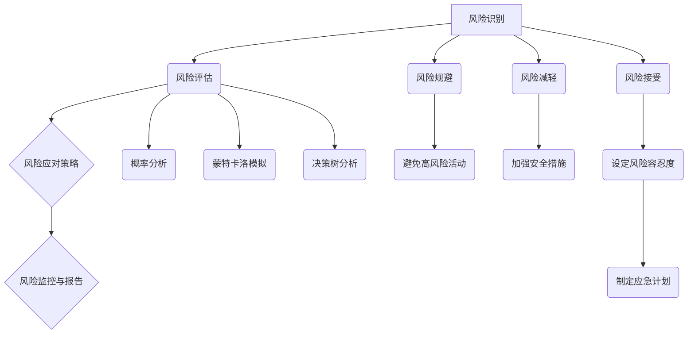

                 

### 文章标题

### 《领导力与风险管理：在不确定中把握方向》

#### 关键词：领导力、风险管理、不确定性、战略决策、组织变革

#### 摘要：

本文深入探讨了在充满不确定性的现代商业环境中，领导力和风险管理的重要性。通过定义领导力的核心要素和不同的领导力模型，我们探讨了领导者在组织中的角色和责任。同时，文章详细介绍了风险管理的概念、过程和工具，并分析了在不确定环境下领导力与风险管理的挑战和应对策略。通过成功案例研究和实际项目分析，文章提供了宝贵的实践经验和最佳实践，旨在帮助读者在复杂和不确定的环境中把握方向，实现组织目标。

---

### 《领导力与风险管理：在不确定中把握方向》目录大纲

**第一部分：领导力基础**

1. 领导力的定义与重要性
    - 领导力的定义
    - 领导力的重要性
    - 领导力与管理的区别
2. 领导力的核心要素
    - 自我认知与自我管理
    - 沟通能力
    - 激励与团队合作
    - 决策能力
3. 领导力的模型与风格
    - 领导力模型
        - 特质理论
        - 行为理论
        - 权变理论
    - 领导力风格
        - 专制式领导
        - 民主式领导
        - 支持式领导

**第二部分：风险管理**

4. 风险管理的概念与过程
    - 风险管理的定义
    - 风险管理的过程
        - 风险识别
        - 风险评估
        - 风险应对策略
        - 风险监控与报告
5. 风险管理的核心工具与技术
    - SWOT分析
    - 概率分析
    - 蒙特卡洛模拟
    - 决策树分析
6. 不确定环境下的领导力与风险管理
    - 不确定性的定义与影响
    - 领导者在不确定环境下的挑战
    - 应对不确定性的策略
        - 风险规避
        - 风险减轻
        - 风险接受

**第三部分：实践与应用**

7. 领导力与风险管理在组织中的应用
    - 组织文化与风险管理
    - 领导力在组织变革中的应用
    - 风险管理在项目实施中的应用
8. 成功案例研究
    - 案例一：某科技公司的领导力与风险管理实践
    - 案例二：某金融机构的风险管理策略
9. 未来展望与挑战
    - 领导力与风险管理的发展趋势
    - 潜在挑战与应对策略

**附录**

- 附录A：常用风险管理工具列表
- 附录B：领导力与风险管理相关书籍推荐
- 附录C：领导力与风险管理课程资源链接

---

### 第一部分：领导力基础

#### 1. 领导力的定义与重要性

**领导力的定义**

领导力是指一种激励和引导他人朝着共同目标前进的能力。它不仅仅局限于企业的管理者或领导者，而是广泛存在于各个组织和社会中。领导力不仅仅是职位赋予的权力，更多的是个人品质、态度和技能的综合体现。

**领导力的重要性**

在当今快速变化和竞争激烈的环境中，领导力对于组织的成功至关重要。以下是一些关键点：

- **驱动创新与变革**：领导者需要具备创新思维，推动组织不断适应新的市场和技术变化。
- **提升团队绩效**：有效的领导力可以激发团队成员的潜能，提高整体绩效。
- **建立组织文化**：领导者的行为和价值观直接影响组织的文化氛围。
- **应对不确定性**：领导者需要具备应对不确定性和危机的管理能力。

**领导力与管理的区别**

尽管领导力和管理常常被混用，但它们有明显的区别：

- **管理是关于组织资源的有效配置和利用**，而领导力是关于激励和影响他人。
- **管理关注流程和制度**，领导力关注愿景和目标。
- **管理关注效率和合规性**，领导力关注创新和变革。

#### 1.2 领导力的重要性

在组织中，领导力扮演着多种关键角色：

- **战略规划与执行**：领导者制定组织的长远目标，并确保团队遵循这些目标。
- **团队建设与激励**：领导者通过建立信任、提供反馈和激励来提升团队士气。
- **冲突管理**：领导者需要处理组织内部的冲突，确保团队保持和谐。
- **变革推动者**：在组织面临变革时，领导者需要引导员工接受并适应新的变化。

**领导力在不确定环境中的重要性**

在充满不确定性的环境中，领导力显得尤为重要：

- **提供明确的方向**：领导者需要明确组织的方向和目标，以减少不确定性带来的迷茫。
- **建立信任**：领导者需要通过透明和开放的沟通建立信任，从而减轻员工的焦虑。
- **激发创新能力**：领导者鼓励团队成员探索新的解决方案，以应对不确定性的挑战。
- **快速决策**：领导者需要具备快速决策的能力，以应对快速变化的环境。

**1.3 领导力与管理的区别**

领导力与管理的区别可以从以下几个方面理解：

- **动机与激励**：领导力关注激励员工内在动机，而管理关注外部激励和绩效评价。
- **愿景与策略**：领导力关注创造愿景和使命，而管理关注具体的执行策略和流程。
- **变革与创新**：领导力鼓励变革和创新，而管理维护现状和保证流程的稳定性。
- **影响力与权威**：领导力依赖于个人魅力和影响力，而管理依赖于职位和权威。

通过理解领导力与管理之间的区别，组织可以更有效地利用这两种能力，以实现长期的可持续发展。

### 第二部分：领导力的核心要素

领导力并非一蹴而就的技能，它需要一系列核心要素的支持。以下是领导力的几个核心要素：

#### 2.1 自我认知与自我管理

**自我认知**

自我认知是指领导者对自己性格、能力、价值观和动机的深入了解。这种自我认知不仅有助于领导者更好地理解自己的优势和劣势，还能帮助他们在面对挑战时做出更明智的决策。

- **增强自我效能感**：领导者通过自我认知，能够更加自信地面对困难和挑战。
- **促进自我成长**：自我认知让领导者能够意识到自身的局限性，从而不断学习和提升。

**自我管理**

自我管理是指领导者如何控制自己的情绪、行为和注意力，以确保高效地完成任务。自我管理包括以下几个方面：

- **情绪管理**：领导者需要学会控制自己的情绪，避免情绪波动对决策产生负面影响。
- **时间管理**：有效的时间管理可以帮助领导者更合理地分配时间，提高工作效率。
- **目标设定**：领导者需要设定清晰的目标，并制定实现目标的计划和步骤。

#### 2.2 沟通能力

沟通能力是领导力的核心要素之一。一个优秀的领导者需要具备以下沟通技能：

- **倾听**：倾听是有效沟通的基础。领导者需要倾听团队成员的意见和反馈，以便更好地理解他们的需求和期望。
- **表达清晰**：领导者需要能够清晰、准确地表达自己的想法和意见，确保团队成员理解他们的意图。
- **非语言沟通**：非语言沟通包括肢体语言、面部表情和语调等，这些因素在沟通中同样重要。

**沟通在领导力中的作用**

- **建立信任**：良好的沟通能够建立领导者与团队成员之间的信任，促进团队合作。
- **提高团队效能**：有效的沟通能够确保团队成员理解任务和目标，从而提高工作效率。
- **解决冲突**：通过沟通，领导者可以及时发现并解决团队内部的冲突，维护团队和谐。

#### 2.3 激励与团队合作

**激励**

激励是指领导者如何激发团队成员的积极性和动力，使其为实现共同目标而努力。激励的方法包括：

- **认可与奖励**：通过认可和奖励优秀的工作表现，领导者可以激发团队成员的积极性。
- **目标设定**：设定具有挑战性的目标，并帮助团队成员制定实现目标的计划，可以激发他们的内在动机。
- **个性化激励**：每个团队成员的激励因素不同，领导者需要了解并满足他们的个性化需求。

**团队合作**

团队合作是指领导者如何引导团队成员共同努力，实现共同目标。有效的团队合作需要以下几个方面：

- **共同目标**：团队成员需要明确共同的目标和愿景，从而形成强大的凝聚力。
- **有效沟通**：通过有效沟通，团队成员可以更好地理解彼此的需求和期望，减少误解和冲突。
- **互补能力**：团队成员需要具备互补的能力，以便在项目实施中发挥各自的优势。

**激励与团队合作在领导力中的作用**

- **提高团队效能**：通过激励和团队合作，领导者可以激发团队成员的潜力，提高整体团队的效能。
- **增强团队凝聚力**：激励和团队合作可以增强团队成员之间的信任和合作，形成强大的团队凝聚力。
- **实现组织目标**：有效的激励和团队合作有助于实现组织的长期目标和愿景。

#### 2.4 决策能力

**决策能力**

决策能力是领导力的核心要素之一。领导者需要具备以下决策能力：

- **分析能力**：领导者需要能够对复杂的信息进行有效分析，以便做出明智的决策。
- **判断能力**：领导者需要具备良好的判断力，能够在不确定的环境中做出正确的决策。
- **风险意识**：领导者需要意识到决策带来的风险，并采取相应的措施来降低风险。

**决策能力在领导力中的作用**

- **解决冲突**：通过有效的决策，领导者可以解决团队内部的冲突和问题，确保团队的稳定和发展。
- **应对挑战**：领导者需要具备快速决策的能力，以便在面临挑战时迅速采取行动。
- **实现目标**：通过明智的决策，领导者可以确保团队朝着正确的方向前进，实现组织的目标。

### 第三部分：领导力的模型与风格

领导力并不是一成不变的，它受到多种因素的影响，包括个人特质、组织环境和情境要求。为了更好地理解领导力的复杂性，我们可以从不同的领导力模型和风格入手。

#### 3.1 领导力模型

领导力模型是描述领导行为和特征的框架，用于分析领导者如何影响和激励团队成员。以下是几种常见的领导力模型：

**3.1.1 特质理论**

特质理论认为领导者具备某些特定的性格特质和行为特征，这些特质使他们能够有效地领导团队。特质理论的重点在于研究领导者的个人特质，如自信、决断力、沟通能力和正直等。

**特质理论的优势**

- **为领导培养提供指导**：特质理论可以帮助组织识别和培养潜在的领导者。
- **为个人发展提供指导**：个体可以通过了解领导力特质来提升自己的领导能力。

**特质理论的局限性**

- **环境因素忽略**：特质理论忽视了环境因素对领导行为的影响。
- **个体特质不具普遍性**：不同文化和情境下，特质的有效性可能有所不同。

**3.1.2 行为理论**

行为理论关注领导者的行为和领导风格，而不是领导者的个人特质。行为理论通过观察和分析领导者的行为，试图找出有效的领导行为模式。

**行为理论的优势**

- **操作性**：行为理论提供了具体的行为指标，便于领导者评估和改进自己的领导方式。
- **情境适应性**：行为理论认为领导行为应适应不同的情境，具有更高的灵活性。

**行为理论的局限性**

- **行为模仿困难**：领导者难以从他人的行为中直接模仿，需要结合自身情境进行调整。
- **行为效果难评估**：领导行为的效果往往受到多种因素的影响，评估难度较大。

**3.1.3 权变理论**

权变理论认为，领导效果取决于领导者、团队成员和环境之间的相互作用。权变理论强调领导者应根据不同的情境灵活调整自己的领导风格。

**权变理论的优势**

- **情境适应性**：权变理论提供了领导者根据情境调整领导行为的指导。
- **综合性**：权变理论综合考虑了领导者、团队成员和环境三者的相互作用。

**权变理论的局限性**

- **复杂性**：权变理论涉及多个变量，理解和应用难度较大。
- **主观性**：领导者对情境的判断和应对可能存在主观偏差。

#### 3.2 领导力风格

领导力风格是领导者表现出的行为特征和态度，通常与领导力模型密切相关。以下是几种常见的领导力风格：

**3.2.1 专制式领导**

专制式领导强调领导者的权威和控制。在这种风格下，领导者做出决策并要求团队成员无条件执行。

**专制式领导的优势**

- **快速决策**：领导者能够迅速做出决策，减少决策过程中的拖延。
- **高效执行**：团队成员明确任务和责任，提高工作效率。

**专制式领导的局限性**

- **缺乏团队参与**：团队成员缺乏参与决策的机会，可能导致不满和缺乏积极性。
- **创新受限**：团队成员的创造力和创新能力受到抑制。

**3.2.2 民主式领导**

民主式领导强调团队成员的参与和协作。在这种风格下，领导者鼓励团队成员提出意见和建议，共同制定决策。

**民主式领导的优势**

- **增强团队凝聚力**：团队成员感受到参与决策的重要性，增强团队凝聚力。
- **提高创新能力**：团队成员的参与和反馈有助于提出创新的解决方案。

**民主式领导的局限性**

- **决策效率降低**：需要更多时间进行讨论和协商，可能降低决策效率。
- **权力分配问题**：在决策过程中，可能存在权力分配不均的问题。

**3.2.3 支持式领导**

支持式领导关注团队成员的个人需求和成长。在这种风格下，领导者提供支持和资源，帮助团队成员实现个人和职业目标。

**支持式领导的优势**

- **提高工作满意度**：团队成员感受到领导者的关注和支持，提高工作满意度。
- **促进个人成长**：领导者鼓励团队成员不断学习和成长，提升个人能力。

**支持式领导的局限性**

- **资源依赖**：团队成员可能过度依赖领导者的支持，降低自主性和创新性。

通过理解不同的领导力模型和风格，领导者可以根据不同的情境和团队需求，灵活调整自己的领导行为，以实现最佳领导效果。

### 风险管理的概念与过程

在充满不确定性的商业环境中，风险管理是组织成功的关键因素。它不仅关系到组织的生存和发展，还影响到员工的职业安全和组织的声誉。有效的风险管理能够帮助组织识别潜在风险、评估风险的影响，并采取适当的措施来减轻或规避风险。

#### 4.1 风险管理的定义

风险管理是指组织在不确定的环境中，通过系统的分析和决策过程，识别、评估、应对和监控潜在的风险，以最大程度地减少负面影响并利用潜在的机会。风险管理不仅关注风险的发生和应对，还涉及到风险的整体管理和优化。

**风险管理的目标**

- **减少损失**：通过识别和评估风险，组织可以采取预防措施，减少潜在的风险损失。
- **机会识别**：风险管理不仅关注风险的规避，还包括识别和利用潜在的机会。
- **资源优化**：通过有效的风险管理，组织可以更合理地配置资源，提高整体效益。

**风险管理的原则**

- **全面性**：风险管理应覆盖组织所有层面和部门，确保风险的全面识别和评估。
- **系统性**：风险管理是一个持续的过程，需要系统的方法和工具来支持。
- **动态性**：风险管理应具备灵活性，能够适应环境和组织的变化。

#### 4.2 风险管理的过程

风险管理是一个复杂而系统的过程，通常包括以下步骤：

**4.2.1 风险识别**

风险识别是风险管理的第一步，旨在识别组织可能面临的各种风险。这一步骤可以通过以下方法进行：

- **头脑风暴**：组织内部进行集体讨论，列出可能的风险。
- **历史数据分析**：分析组织历史上的风险事件，总结经验教训。
- **外部信息收集**：关注行业动态、竞争对手情况、法律法规等外部因素。

**4.2.2 风险评估**

风险评估是识别风险的深入分析，旨在评估风险的可能性和影响。以下方法可以用于风险评估：

- **定量分析**：使用数学模型和统计方法，对风险的概率和影响进行量化。
- **定性分析**：通过专家评估和主观判断，对风险的影响进行定性分析。
- **多标准决策分析**：综合考虑多个因素，进行综合评估。

**4.2.3 风险应对策略**

在评估风险后，组织需要制定相应的应对策略，以减轻或规避风险。常见的风险应对策略包括：

- **风险规避**：通过避免特定的风险事件或活动来规避风险。
- **风险减轻**：通过采取预防措施和改进措施，减少风险的影响和可能性。
- **风险接受**：在风险发生概率较低或影响较小的情况下，组织可能选择接受风险。

**4.2.4 风险监控与报告**

风险管理是一个持续的过程，需要定期监控和评估。以下方法可以用于风险监控：

- **定期审计**：对组织的风险管理流程进行定期审计，确保其有效性。
- **监控指标**：设定关键风险指标（KRI），定期监控风险的变化。
- **报告机制**：建立风险报告制度，定期向管理层和相关部门报告风险情况。

通过有效的风险监控和报告，组织可以及时识别新的风险，评估现有风险的变化，并采取相应的应对措施。

#### 4.2.5 风险管理的关键工具和技术

在风险管理过程中，使用适当的工具和技术可以显著提高风险管理的效率和效果。以下是几种常用的风险管理工具和技术：

- **SWOT分析**：SWOT分析是一种战略规划工具，用于评估组织的优势、劣势、机会和威胁。在风险管理中，SWOT分析可以帮助组织识别潜在的风险和机会。
- **概率分析**：概率分析是一种基于概率论的定量分析方法，用于评估风险事件的可能性和影响。概率分析可以帮助组织制定更科学的决策。
- **蒙特卡洛模拟**：蒙特卡洛模拟是一种通过模拟随机过程来评估风险的方法。该方法可以处理复杂的多变量风险，提供更全面的风险评估。
- **决策树分析**：决策树分析是一种结构化的决策支持工具，用于分析不同决策路径的结果和风险。决策树分析可以帮助组织在不确定的环境下做出更明智的决策。

通过结合这些工具和技术，组织可以更全面、准确地评估和管理风险，从而提高组织的整体风险管理水平。

### 风险管理的核心工具与技术

在风险管理中，选择合适的工具和技术至关重要。以下是几种常见且有效的风险管理工具和技术：

#### 5.1 SWOT分析

SWOT分析是一种广泛使用的战略规划工具，用于评估组织的优势（Strengths）、劣势（Weaknesses）、机会（Opportunities）和威胁（Threats）。通过SWOT分析，组织可以更全面地了解自身状况，识别潜在的风险和机会。

**SWOT分析在风险管理中的应用**

- **优势识别**：了解组织的优势，有助于确定哪些方面可以用来抵御风险或利用机会。
- **劣势分析**：识别组织的劣势，可以帮助组织在风险发生时采取预防措施，减少负面影响。
- **机会探索**：通过分析外部环境中的机会，组织可以制定相应的战略，以抓住市场机遇，减少潜在风险。
- **威胁规避**：识别威胁，使组织能够提前准备，制定应对策略，以减轻或规避风险。

**示例**

假设某科技公司正在开发一款新产品，通过SWOT分析，他们发现：

- **优势**：公司拥有强大的研发团队，过去曾成功推出多款产品。
- **劣势**：市场推广预算有限，缺乏有效的销售渠道。
- **机会**：该产品有潜力在新兴市场中获得市场份额。
- **威胁**：竞争对手正在研发类似产品，可能提前推出。

通过这些分析，公司可以采取相应措施，如增加市场推广投入、加强与渠道合作伙伴的关系，以及加快产品开发进度，以应对潜在的风险和抓住市场机遇。

#### 5.2 概率分析

概率分析是一种基于概率论的定量分析方法，用于评估风险事件的可能性和影响。通过概率分析，组织可以更科学地评估风险，并为决策提供数据支持。

**概率分析在风险管理中的应用**

- **风险评估**：通过计算风险事件发生的概率，组织可以更好地了解风险的大小。
- **决策支持**：概率分析可以帮助组织在不确定的环境下做出更明智的决策。
- **资源分配**：根据风险事件的可能性，组织可以合理分配资源，优先应对高概率的风险。

**示例**

假设某项目存在两个风险事件：风险A（概率40%，影响严重）和风险B（概率60%，影响较小）。通过概率分析，可以得到以下结论：

- **风险A**：由于概率较高且影响严重，组织应重点关注，制定详细的应对措施。
- **风险B**：尽管概率较高，但影响较小，可以适当关注，并在资源有限时优先处理其他风险。

通过这种分析，组织可以更合理地分配资源，提高风险管理的效果。

#### 5.3 蒙特卡洛模拟

蒙特卡洛模拟是一种通过模拟随机过程来评估风险的方法。该方法可以处理复杂的多变量风险，提供更全面的风险评估。

**蒙特卡洛模拟在风险管理中的应用**

- **复杂风险评估**：蒙特卡洛模拟适用于处理不确定性和复杂性的情况，如金融市场风险、项目进度风险等。
- **决策支持**：模拟结果可以帮助组织理解风险在不同情境下的表现，为决策提供参考。
- **情景分析**：通过模拟不同的情景，组织可以评估不同决策路径的风险和收益。

**示例**

假设某公司正在评估一项新投资项目的风险，使用蒙特卡洛模拟，他们可以模拟项目在不同情景下的财务表现，如：

- **情景1**：市场需求旺盛，项目收益良好。
- **情景2**：市场需求一般，项目收益一般。
- **情景3**：市场需求不佳，项目收益不佳。

通过这些模拟结果，公司可以评估项目在不同情景下的风险，从而做出更明智的投资决策。

#### 5.4 决策树分析

决策树分析是一种结构化的决策支持工具，用于分析不同决策路径的结果和风险。决策树分析可以帮助组织在不确定的环境下做出更明智的决策。

**决策树分析在风险管理中的应用**

- **决策路径分析**：通过决策树分析，组织可以清晰地看到不同决策路径的可能结果和风险。
- **风险评估**：决策树分析可以帮助组织评估不同决策路径的风险和收益。
- **决策优化**：通过分析决策树，组织可以找到最佳决策路径，以最大化收益或最小化风险。

**示例**

假设某公司在决定是否扩大生产线时，有以下两种选择：

- **选择A**：扩大生产线，可能面临市场需求不足的风险。
- **选择B**：维持现有生产线，风险较低，但可能错失市场机会。

通过构建决策树，公司可以分析不同决策路径的结果和风险：

- **选择A**：市场需求旺盛，收益高；市场需求不足，收益低。
- **选择B**：市场需求旺盛，收益一般；市场需求不足，收益稳定。

通过这种分析，公司可以更清楚地了解每种选择的优劣，从而做出更明智的决策。

通过这些核心工具和技术，组织可以更全面、准确地评估和管理风险，从而提高整体风险管理水平。

### 不确定环境下的领导力与风险管理

在现代商业环境中，不确定性已经成为一种常态。技术革新、市场变化和全球事件等外部因素，以及组织内部的变革和创新，都增加了领导者和组织面临的复杂性和挑战。在这种不确定的环境下，领导力与风险管理显得尤为重要。

#### 6.1 不确定性的定义与影响

**不确定性的定义**

不确定性是指未来结果的不确定性，即无法准确预测或控制的事件和变量。在商业环境中，不确定性可能来源于多个方面，包括市场波动、技术进步、政策变化和自然灾害等。

**不确定性的影响**

- **决策难度增加**：在不确定的环境中，决策过程变得更加复杂和困难，因为未来的结果难以预测。
- **风险增加**：不确定性增加了组织面临的风险，包括财务风险、市场风险和运营风险。
- **绩效波动**：不确定性可能导致组织的绩效波动，影响长期发展和稳定性。
- **资源浪费**：在不确定的环境中，组织可能会过度分配资源，导致资源浪费和效率低下。

#### 6.2 领导者在不确定环境下的挑战

**挑战一：战略规划难度大**

在不确定的环境下，制定和执行长期战略变得更加困难。领导者需要考虑未来的各种可能性，并制定相应的应对策略。这要求领导者具备敏锐的洞察力和快速应变的能力。

**挑战二：沟通与信任建设**

在不确定性增加的环境中，员工可能感到焦虑和不安。领导者需要通过有效的沟通建立信任，确保团队保持稳定和高效。这要求领导者具备良好的沟通技能和情感管理能力。

**挑战三：创新与变革推动**

不确定性往往伴随着新的机会和挑战。领导者需要鼓励创新和变革，以抓住市场机遇和应对挑战。这要求领导者具备创新思维和勇于承担风险的精神。

**挑战四：资源分配与优化**

在不确定的环境中，资源分配变得更加困难。领导者需要合理分配资源，确保关键领域得到充分支持。同时，领导者需要优化资源使用，避免过度投资和浪费。

#### 6.3 应对不确定性的策略

**策略一：风险规避**

风险规避是指通过避免特定的风险事件或活动来规避风险。在不确定的环境下，领导者可以考虑以下措施：

- **避免高风险投资**：在不确定的市场环境中，领导者应避免进行高风险的投资。
- **推迟重大决策**：在不确定的情况下，领导者可以推迟重大决策，等待更多信息。

**策略二：风险减轻**

风险减轻是指通过采取预防措施和改进措施，减少风险的影响和可能性。以下措施可以帮助领导者减轻风险：

- **改进流程**：通过优化流程，提高组织的灵活性和响应速度。
- **建立缓冲**：为关键资源和技术储备一定的缓冲，以应对突发事件。
- **培训与演练**：定期进行培训和演练，提高员工的应急处理能力和团队协作。

**策略三：风险接受**

在不确定的环境下，某些风险可能无法完全规避或减轻。领导者可以考虑接受这些风险，并制定相应的应对策略：

- **设定风险容忍度**：领导者应明确组织能够接受的风险范围，并制定相应的风险容忍度。
- **制定应急计划**：为可能发生的风险制定详细的应急计划，确保在风险发生时能够迅速应对。

通过这些策略，领导者可以在不确定的环境中保持组织的稳定和持续发展。有效的领导力与风险管理，不仅能够帮助组织应对不确定性，还能为组织创造新的机遇和竞争优势。

### 领导力与风险管理在组织中的应用

在组织中，领导力和风险管理是确保组织稳定发展的两个关键要素。有效的领导力能够激发员工的潜力，提高团队效能；而风险管理则能够帮助组织预见和应对潜在的威胁，确保组织的长期安全。以下将详细探讨领导力与风险管理在组织中的实际应用，包括组织文化、组织变革和项目实施等方面。

#### 7.1 组织文化与风险管理

**组织文化的建设**

组织文化是组织的灵魂，它决定了员工的价值观、行为准则和工作方式。建设积极、健康的文化，对风险管理至关重要。以下措施可以帮助组织建立良好的风险管理文化：

- **领导示范**：领导者应通过自身的行为树立榜样，展示对风险管理的重视。
- **沟通机制**：建立有效的沟通机制，确保风险管理的信息能够顺畅地在组织内部传递。
- **培训与教育**：定期对员工进行风险管理培训，提高他们对风险管理的认识和技能。

**风险管理文化的培养**

- **风险意识**：通过宣传活动和案例分享，提高员工对风险管理的认知，培养风险意识。
- **合作精神**：鼓励员工跨部门合作，共同应对风险，形成团队合作的文化。
- **持续改进**：不断优化风险管理流程，鼓励员工提出改进建议，形成持续改进的文化。

#### 7.2 领导力在组织变革中的应用

**变革的驱动因素**

组织变革通常是由于外部环境变化、内部需求或技术进步等原因引起的。领导者需要识别变革的驱动因素，并采取以下措施推动组织变革：

- **明确目标**：设定清晰的变革目标，确保团队成员理解变革的必要性和目标。
- **领导力支持**：领导者需要提供心理支持和资源，帮助员工克服变革中的困难和挑战。
- **沟通与反馈**：通过定期的沟通和反馈，了解员工对变革的看法，及时调整变革策略。

**变革的实施策略**

- **渐进式变革**：通过逐步实施变革，减少对员工的冲击，提高变革的成功率。
- **领导者先行**：领导者应率先践行变革，以自身的行为和价值观引导员工。
- **培训与支持**：提供必要的培训和资源，帮助员工适应变革，提高变革的适应能力。

#### 7.3 风险管理在项目实施中的应用

**项目风险管理**

项目风险管理是确保项目顺利进行的关键环节。以下措施可以帮助组织在项目实施过程中进行有效的风险管理：

- **风险识别**：在项目启动阶段，通过专家评审和团队讨论，识别潜在的风险。
- **风险评估**：对识别出的风险进行定量和定性评估，确定风险的概率和影响。
- **应对策略**：根据风险评估的结果，制定相应的应对策略，如风险规避、风险减轻和风险接受。
- **监控与报告**：定期监控项目进展和风险变化，及时调整应对策略，确保项目按计划进行。

**风险管理工具的应用**

- **SWOT分析**：通过SWOT分析，评估项目的优势和劣势，以及外部环境的机会和威胁。
- **决策树分析**：在项目决策过程中，使用决策树分析不同决策路径的风险和收益。
- **概率分析**：通过概率分析，评估项目各阶段的风险事件发生概率和影响。

**示例：项目风险管理实施**

假设某公司正在实施一个新软件开发项目，以下是项目风险管理的一些具体措施：

- **风险识别**：在项目启动阶段，识别出技术实现风险、市场接受风险和团队协作风险。
- **风险评估**：通过专家评审和团队讨论，确定技术实现风险的概率较高且影响严重，市场接受风险概率较高但影响一般，团队协作风险概率较低但影响较大。
- **应对策略**：制定相应的应对策略，如增加技术评审次数、进行市场调研，以及加强团队沟通和协作。
- **监控与报告**：定期监控项目进展和风险变化，及时调整应对策略，确保项目按计划进行。

通过有效的领导力和风险管理，组织可以确保项目顺利进行，实现预期目标，并在不确定的环境中保持竞争优势。

### 成功案例研究

为了更好地理解领导力与风险管理在实践中的应用，我们来看两个成功的案例研究：某科技公司的领导力与风险管理实践，以及某金融机构的风险管理策略。

#### 案例一：某科技公司的领导力与风险管理实践

**公司背景**

某科技公司成立于2000年，专注于软件开发和信息技术服务。随着市场竞争的加剧和技术更新的加速，公司面临着巨大的挑战和机遇。为了保持竞争力，公司决定通过领导力和风险管理的提升来实现可持续发展。

**领导力提升**

1. **明确愿景与目标**：公司领导层制定了清晰的愿景和目标，鼓励员工为实现这些目标而努力。愿景和目标的明确，为员工提供了共同的方向和动力。
2. **领导力培训**：公司投入大量资源进行领导力培训，帮助管理层和关键员工提升领导技能。通过培训，领导者学会了如何更好地沟通、激励团队和应对变革。
3. **建立透明沟通机制**：公司建立了透明、开放的沟通机制，确保信息在公司内部高效传递。领导者通过定期的会议和报告，与员工保持密切联系，了解他们的需求和反馈。

**风险管理策略**

1. **风险识别与评估**：公司成立了专门的风险管理团队，通过头脑风暴和SWOT分析，识别出可能影响公司发展的风险，如市场波动、技术风险和团队管理风险。对识别出的风险进行定量和定性评估，确定其概率和影响。
2. **制定应对策略**：根据风险评估结果，公司制定了详细的应对策略，包括风险规避、风险减轻和风险接受。例如，在技术风险方面，公司增加了研发投入，以保持技术领先；在市场波动方面，公司通过多元化市场策略，降低市场依赖。
3. **风险监控与报告**：公司建立了风险监控和报告系统，定期评估风险的变化，及时调整应对策略。同时，公司通过风险报告，向管理层和董事会提供全面的风险信息，确保决策的科学性和有效性。

**成效**

通过领导力提升和风险管理策略的实施，公司在市场竞争中取得了显著成效。员工士气高涨，工作效率提升，公司业绩稳步增长。在面临技术更新和市场波动时，公司能够迅速应对，保持稳健发展。

#### 案例二：某金融机构的风险管理策略

**公司背景**

某金融机构是一家拥有百年历史的银行，业务范围涵盖存款、贷款、投资等多个领域。随着金融市场的复杂化和全球化，金融机构面临的风险日益增加。为了确保业务的稳健发展，该金融机构实施了一系列风险管理策略。

**风险管理策略**

1. **建立风险管理组织**：金融机构建立了专门的风险管理部，负责识别、评估和应对各种风险。风险管理部与各业务部门密切合作，确保风险管理的全面性和有效性。
2. **风险评估与控制**：金融机构采用了全面的风险评估体系，对市场风险、信用风险、操作风险等进行定量和定性评估。通过风险评估，金融机构能够提前识别潜在风险，并采取相应的控制措施。
3. **内部审计与监控**：金融机构定期进行内部审计，评估风险管理的有效性。内部审计部对风险管理流程进行审查，确保各项措施得到有效执行。
4. **合规与风险教育**：金融机构重视合规性，确保业务操作符合相关法律法规。同时，通过风险教育，提高员工的合规意识和风险管理能力。

**成效**

通过有效的风险管理策略，金融机构在复杂多变的金融市场中保持了稳健发展。市场风险得到了有效控制，信用风险和操作风险得到了显著降低。在金融市场的波动中，金融机构能够迅速应对，确保业务的稳定和安全。

**总结**

以上两个案例展示了领导力与风险管理在实践中的应用。有效的领导力能够激发员工的潜力，提高团队效能；而全面的风险管理策略能够帮助组织预见和应对潜在威胁，确保业务的稳健发展。通过这两个案例，我们可以看到，领导力与风险管理在组织中的重要性，以及如何通过实践实现组织的可持续发展。

### 未来展望与挑战

在展望领导力与风险管理未来的发展趋势时，我们首先需要认识到这两者的重要性将更加凸显。随着全球化和技术变革的加速，不确定性将成为常态，领导者和组织必须具备更高的适应能力和风险管理能力，以应对复杂多变的商业环境。

#### 9.1 领导力与风险管理的发展趋势

**领导力发展趋势**

1. **数字化转型**：随着数字化技术的普及，领导者需要具备数字素养和敏捷思维，以应对数字化转型带来的挑战。
2. **全球视野**：全球化使得领导者需要具备跨文化沟通和协作能力，以管理多元化的团队。
3. **持续学习**：在快速变化的环境中，领导者需要不断学习新知识和技能，以保持竞争力。
4. **员工福祉**：注重员工福祉和心理健康的领导力将成为未来领导力发展的趋势。

**风险管理发展趋势**

1. **人工智能与大数据**：人工智能和大数据分析将使风险管理更加精准和高效。
2. **可持续性风险**：随着环境和社会责任的重视，可持续性风险将成为风险管理的重要内容。
3. **实时监控**：通过实时监控技术和自动化工具，组织可以更快速地识别和响应风险。
4. **多维度风险管理**：风险管理将更加注重跨领域、跨部门的综合性和系统性。

#### 9.2 潜在挑战与应对策略

**领导力的潜在挑战**

1. **技能短缺**：随着技术的快速变化，领导者可能面临技能短缺的挑战，需要不断更新知识和技能。
2. **组织变革阻力**：在推动组织变革时，领导者可能面临来自员工和既得利益者的阻力。
3. **人才流失**：在竞争激烈的环境中，留住和培养关键人才将是一个持续挑战。

**应对策略**

- **持续培训与发展**：通过定期培训和职业发展计划，提高领导者的技能和知识。
- **领导力文化建设**：建立积极、包容的领导力文化，鼓励创新和变革。
- **灵活的人才管理**：通过灵活的招聘和激励机制，吸引和留住关键人才。

**风险管理的潜在挑战**

1. **风险复杂性**：随着业务和技术的复杂化，风险管理的难度增加。
2. **合规压力**：随着法律法规的不断完善，组织需要应对更多的合规要求。
3. **技术挑战**：风险管理工具和技术的更新和维护需要大量投入。

**应对策略**

- **全面风险管理框架**：建立全面的风险管理框架，确保风险的全面识别和评估。
- **技术创新**：投资于先进的风险管理技术和工具，提高风险管理的效率和效果。
- **合规培训与监控**：定期对员工进行合规培训，建立有效的合规监控和审计机制。

通过持续学习和创新，领导者和组织可以更好地应对未来的挑战，实现可持续发展。

### 附录

#### 附录A：常用风险管理工具列表

1. **SWOT分析**：用于评估组织的优势、劣势、机会和威胁。
2. **概率分析**：通过概率模型评估风险事件的可能性和影响。
3. **蒙特卡洛模拟**：用于处理复杂风险的模拟工具。
4. **决策树分析**：用于分析不同决策路径的结果和风险。
5. **关键风险指标（KRI）**：用于监控和评估关键风险指标。
6. **事故树分析**：用于识别和分析可能导致事故的一系列事件。
7. **敏感性分析**：用于分析不同变量对风险的影响。

#### 附录B：领导力与风险管理相关书籍推荐

1. **《领导力：提升领导力的五大关键技巧》**（作者：史蒂芬·柯维）
2. **《风险管理：理论与实践》**（作者：罗伯特·希斯）
3. **《不确定环境下的领导力》**（作者：彼得·德鲁克）
4. **《精益管理：持续改进和创新的五大原则》**（作者：约翰·舒尔茨）
5. **《应对不确定性的策略》**（作者：迈克尔·波特）

#### 附录C：领导力与风险管理课程资源链接

1. **Coursera**：提供各种领导力与风险管理在线课程。
   - [Coursera Leadership and Management Courses](https://www.coursera.org/courses?query=leadership%20and%20management)
2. **edX**：全球领先的在线课程平台，提供领导力与风险管理的专业课程。
   - [edX Leadership and Management Courses](https://www.edx.org/search?query=leadership%20and%20management)
3. **LinkedIn Learning**：提供丰富的领导力与风险管理在线培训资源。
   - [LinkedIn Learning Leadership and Management](https://www.linkedin.com/learning/topics/leadership-management)

通过学习和应用这些工具和资源，读者可以进一步提升自己的领导力和风险管理能力，为组织的发展奠定坚实基础。

### Mermaid 流程图示例



此流程图展示了风险管理的基本步骤和核心工具，帮助读者更好地理解和应用风险管理流程。

### 伪代码示例

```python
# 风险评估函数
def risk_evaluation(assets):
    """
    对每个资产进行风险评估
    :param assets: 资产列表
    :return: 风险评估结果
    """
    risk_scores = {}
    for asset in assets:
        probability = calculate_probability_of_loss(asset)
        impact = calculate_impact_of_loss(asset)
        risk_score = probability * impact
        risk_scores[asset] = risk_score
    return risk_scores

# 计算损失概率
def calculate_probability_of_loss(asset):
    # 根据资产的具体情况计算损失概率
    pass

# 计算损失影响
def calculate_impact_of_loss(asset):
    # 根据资产的具体情况计算损失影响
    pass
```

此伪代码示例提供了对资产进行风险评估的基本框架，包括计算损失概率和影响的方法，帮助读者理解风险评估的核心算法原理。

### 数学公式示例

```markdown
$$
E(X) = \int_{-\infty}^{\infty} x f(x) dx
$$

$$
\sigma^2 = Var(X) = E[(X - E[X])^2]
$$
```

这些数学公式展示了概率和统计学中常用的期望和方差的计算方法，帮助读者理解风险管理中的数学模型。

### 项目实战示例

#### 7.1 某科技公司的领导力与风险管理实践

在本章中，我们将深入探讨某科技公司在领导力与风险管理方面的实践。该科技公司通过一系列措施，成功提升了领导力和风险管理能力，实现了业务的稳健发展。

**开发环境搭建：**
- **编程语言**：使用Python 3.8作为主要编程语言。
- **工具和库**：采用Jupyter Notebook进行代码编写与运行，使用Scikit-learn库进行风险评估模型的开发。

**领导力提升实践：**
1. **领导力培训**：公司定期组织领导力培训课程，帮助管理层和关键员工提升领导技能。培训内容涵盖沟通能力、激励与团队合作、决策能力等方面。
2. **内部研讨**：公司建立内部研讨机制，定期组织研讨会，鼓励员工分享领导经验，交流心得。
3. **领导力文化建设**：公司倡导以员工为中心的领导力文化，注重员工的成长和发展，提升员工的工作满意度和忠诚度。

**风险管理实践：**
1. **风险识别与评估**：公司成立风险管理团队，通过SWOT分析和头脑风暴等方法，识别出潜在的风险，并对其进行定量和定性评估。
2. **风险应对策略**：根据风险评估结果，公司制定了一系列风险应对策略，包括风险规避、风险减轻和风险接受。例如，对于技术风险，公司增加了研发投入，以保持技术领先；对于市场风险，公司通过多元化市场策略，降低市场依赖。
3. **风险监控与报告**：公司建立了风险监控和报告系统，定期评估风险的变化，并及时调整应对策略。公司通过风险报告，向管理层和董事会提供全面的风险信息，确保决策的科学性和有效性。

**案例解析：**

**领导力提升效果分析：**
- 培训后，管理层和关键员工的领导技能显著提升，沟通效率和决策能力得到改善。
- 公司内部研讨机制的建立，促进了知识共享和团队协作，增强了员工的凝聚力。
- 以员工为中心的领导力文化，提升了员工的工作满意度和忠诚度，减少了人才流失。

**风险管理效果分析：**
- 风险识别与评估体系的有效运行，使公司能够提前识别潜在风险，并采取相应的应对措施。
- 风险应对策略的实施，降低了风险对业务的影响，确保了公司的稳健发展。
- 风险监控和报告系统的建立，使公司能够及时了解风险动态，调整应对策略，提高了风险管理的有效性。

**项目小结：**
- 通过领导力提升和风险管理的实践，公司实现了业务的稳健发展和持续创新。
- 领导力提升和风险管理相互促进，为公司的可持续发展奠定了坚实基础。
- 成功的经验可以为其他组织提供借鉴，帮助其在不确定环境中实现成功。

通过本案例的研究，我们可以看到，领导力和风险管理在组织中的重要性。有效的领导力能够激发员工的潜力，提升团队效能；而全面的风险管理策略能够帮助组织预见和应对潜在威胁，确保业务的稳健发展。只有在领导力和风险管理两者相结合的情况下，组织才能在复杂多变的商业环境中保持竞争优势。

### 最佳实践 Tips

**领导力提升最佳实践：**

1. **建立反馈机制**：定期收集员工对领导力的反馈，并根据反馈调整领导行为。
2. **鼓励自主学习和成长**：提供多样化的学习机会，鼓励员工不断提升自身能力。
3. **注重团队建设**：通过团队活动和培训，增强团队成员之间的信任和合作。

**风险管理最佳实践：**

1. **建立健全的风险管理框架**：确保风险的全面识别和评估，制定详细的应对策略。
2. **定期培训和演练**：提高员工的合规意识和风险管理能力，定期进行应急演练。
3. **持续监控和改进**：定期评估风险管理效果，根据风险变化及时调整策略。

### 小结

本文通过定义和解析领导力和风险管理，探讨了在不确定环境中这两个领域的重要性。领导力提升和风险管理不仅能够帮助组织在复杂环境中保持竞争力，还能为员工的职业发展和组织的长期成功奠定基础。通过实际案例研究和最佳实践提示，本文为读者提供了实用的指导和参考。希望读者能够在实践中应用这些理念，不断提升领导力和风险管理能力，实现组织的可持续发展。

### 注意事项

**领导力与风险管理的关系：**

- 领导力是风险管理的基础，有效的领导力能够激发员工的积极性，提高团队协作能力，从而更好地应对风险。
- 风险管理是领导力的实践，领导者需要通过有效的风险管理策略来保障组织的稳定和发展。

**实践中的挑战：**

- 在实际操作中，领导力和风险管理可能会面临资源不足、时间紧迫等挑战。
- 领导者需要具备灵活的思维和快速应变的能力，以应对不断变化的环境。

**持续改进的重要性：**

- 领导力和风险管理是一个持续改进的过程，需要定期评估和调整。
- 通过不断学习和实践，组织可以不断提升领导力和风险管理水平，以适应不断变化的环境。

### 拓展阅读

**领导力领域：**

1. **《变革型领导力》**（作者：约翰·科特）
2. **《领导力五要素》**（作者：皮尔·弗鲁姆）
3. **《领导力的艺术》**（作者：詹姆斯·M·库泽斯）

**风险管理领域：**

1. **《风险管理原理与实践》**（作者：约翰·J·汉普顿）
2. **《金融风险管理》**（作者：菲利普·J·考特尼）
3. **《企业风险管理》**（作者：罗伯特·希斯）

通过阅读这些书籍，读者可以进一步深入了解领导力和风险管理的重要概念和实践方法。

