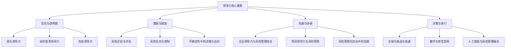

                 

### 文章标题

《领导力与风险管理：在不确定性中把握机遇》

关键词：领导力、风险管理、不确定性、机遇、策略

摘要：本文将探讨领导力与风险管理在不确定性环境中的重要性。通过深入分析领导力的核心原则、风险管理的方法与策略，以及两者的结合应用，本文旨在为IT领域从业者提供在不确定性中把握机遇的实践指导。

----------------------------------------------------------------

### 第一部分：领导力的基础与核心原则

#### 第1章：领导力的本质与核心要素

##### 1.1 领导力的定义与特征

领导力是一种能力，指的是在团队或组织中通过影响、激励和引导他人，共同实现目标的过程。领导力不仅仅是职位赋予的权力，更是一种个人特质和综合素质。领导力的特征主要包括以下几个方面：

- **影响力**：领导者能够通过言传身教，影响他人的思想和行为，形成共同的愿景和目标。
- **激励**：领导者能够激发团队成员的积极性和创造力，使他们在实现组织目标的过程中保持高昂的士气。
- **沟通**：领导者需要具备良好的沟通能力，能够有效地传递信息、听取意见和解决冲突。
- **决策**：领导者需要能够在复杂和不确定的环境下做出明智的决策。

##### 1.2 领导力的重要性

在IT领域，领导力的重要性不言而喻。随着技术的快速发展，IT行业的竞争愈发激烈，企业需要具备快速响应市场变化的能力。领导力在这个过程中起到了关键作用：

- **创新驱动**：领导者能够激发团队的创造力，推动技术创新和业务模式的创新。
- **团队协作**：领导力有助于建立高效的团队，实现团队成员之间的协同合作。
- **危机应对**：在面临危机时，领导者能够迅速做出决策，带领团队渡过难关。

##### 1.3 领导力与管理的区别

虽然领导力和管理密切相关，但两者仍有明显的区别。管理主要关注流程、效率和规范，而领导力则更注重人的因素，关注如何激发和引导团队成员。

- **管理**：管理是确保团队按照计划、规范和标准运作，实现既定目标的过程。
- **领导力**：领导力则侧重于通过影响和激励，激发团队成员的潜力，共同追求更高目标。

##### 1.4 领导力的发展历程

领导力的发展历程可以追溯到古代的军事领导和管理思想。随着时代的发展，领导力理论不断演进，形成了多种领导风格和模型。

- **传统领导力**：以权力和控制为核心，强调权威和命令。
- **变革型领导力**：强调领导者的个人魅力和影响力，激发团队成员的积极性和创造力。
- **服务型领导力**：将服务团队成员视为领导工作的核心，注重团队成员的需求和成长。

#### 第2章：领导者的自我认知与提升

##### 2.1 自我认知的重要性

领导者的自我认知是其领导力发展的重要基础。自我认知指的是领导者对自己性格、价值观、优势和不足的认识。

- **性格**：了解自己的性格特点，有助于领导者更好地处理人际关系和团队冲突。
- **价值观**：清晰自己的价值观，有助于领导者树立正确的工作态度和行为准则。
- **优势与不足**：认识到自己的优势和不足，有助于领导者不断提升自身能力。

##### 2.2 自我评估与反馈

自我评估和反馈是领导者提升自我认知的重要手段。通过自我评估，领导者可以了解自己的表现和进步，通过反馈，可以获得他人的观点和建议。

- **自我评估**：领导者可以通过反思自己的工作表现，评估自己在领导力方面的优势和不足。
- **反馈**：领导者可以通过向同事、下属和上级请教，获取他们的反馈意见。

##### 2.3 自我提升的方法与策略

自我提升是领导者不断成长的关键。以下是一些常见的自我提升方法和策略：

- **学习与培训**：通过参加培训课程、阅读书籍、听取讲座等方式，不断学习新的知识和技能。
- **实践与反思**：通过实际工作经历，不断总结经验和教训，提升自己的领导能力。
- **寻求指导**：寻求有经验的领导者的指导和建议，获取他们的宝贵经验。

#### 第3章：领导力核心原则与实践

##### 3.1 信任与透明度

信任是领导者与团队成员之间建立良好关系的基础。透明度则是信任的保障。领导者需要通过以下方式建立信任和透明度：

- **开放沟通**：领导者需要与团队成员保持开放沟通，分享信息，减少信息不对称。
- **诚实与坦率**：领导者需要诚实面对问题，勇于承认错误，树立良好的榜样。
- **尊重与关注**：领导者需要尊重团队成员的意见和感受，关注他们的需求和成长。

##### 3.2 激励与赋能

激励是领导者激发团队成员积极性和创造力的重要手段。赋能则是激励的深化。领导者可以通过以下方式激励和赋能团队成员：

- **目标设定**：领导者需要与团队成员共同设定明确的奋斗目标，激发他们的工作热情。
- **认可与奖励**：领导者需要及时认可和奖励团队成员的成就，增强他们的自信心和动力。
- **自主权与支持**：领导者需要赋予团队成员一定的自主权，并提供必要的支持，让他们能够充分发挥潜力。

##### 3.3 沟通与协调

沟通是领导者与团队成员之间传递信息和达成共识的重要途径。协调则是沟通的深化。领导者需要通过以下方式加强沟通和协调：

- **倾听与反馈**：领导者需要倾听团队成员的意见和需求，给予积极的反馈，建立良好的沟通渠道。
- **会议管理**：领导者需要善于组织和管理会议，确保会议的高效和目标导向。
- **跨部门合作**：领导者需要促进不同部门之间的合作，协调各方资源，实现共同目标。

##### 3.4 决策与执行

决策是领导者的重要职责之一。执行则是决策的实现。领导者需要通过以下方式做出明智的决策并确保执行：

- **信息收集与分析**：领导者需要全面收集信息，进行深入分析，为决策提供依据。
- **风险评估**：领导者需要评估决策的风险和收益，确保决策的合理性和可行性。
- **执行监控**：领导者需要监控执行过程，及时调整策略，确保决策的有效执行。

#### 第4章：领导力在不同情境下的应用

##### 4.1 团队领导力

团队领导力是领导者面对团队情境时的重要能力。领导者需要通过以下方式发挥团队领导力：

- **团队建设**：领导者需要通过团队建设活动，增强团队成员之间的信任和协作。
- **角色定位**：领导者需要明确团队成员的角色和职责，确保团队的高效运作。
- **冲突管理**：领导者需要善于解决团队冲突，维护团队的和谐和稳定。

##### 4.2 组织变革领导力

组织变革领导力是领导者面对组织变革情境时的重要能力。领导者需要通过以下方式发挥组织变革领导力：

- **变革愿景**：领导者需要明确组织的变革愿景，引导团队成员共同追求。
- **变革沟通**：领导者需要与团队成员保持有效的沟通，传递变革信息，消除疑虑。
- **变革执行**：领导者需要确保变革的执行，监控变革进度，及时调整策略。

##### 4.3 危机领导力

危机领导力是领导者面对危机情境时的重要能力。领导者需要通过以下方式发挥危机领导力：

- **危机预警**：领导者需要具备危机预警能力，及时识别潜在的危机因素。
- **危机应对**：领导者需要制定危机应对策略，迅速应对危机，降低损失。
- **危机沟通**：领导者需要与内外部利益相关者保持有效沟通，维护组织的声誉。

### 第二部分：风险管理的方法与策略

#### 第5章：风险管理的概述与框架

##### 5.1 风险管理的定义与目的

风险管理是一种系统化的过程，旨在通过识别、评估、应对和监控风险，保护组织免受各种潜在损失。风险管理的目的是：

- **减少风险**：通过识别和评估潜在风险，采取相应的措施减少风险的发生概率和影响。
- **确保持续运营**：通过有效的风险管理，确保组织的持续运营和业务目标的实现。
- **提升竞争力**：通过风险管理，提高组织的风险应对能力，增强市场竞争力。

##### 5.2 风险管理的核心要素

风险管理的核心要素包括风险识别、风险评估、风险应对和风险监控。

- **风险识别**：识别组织面临的各种潜在风险，包括内部和外部风险。
- **风险评估**：对识别出的风险进行评估，确定其发生概率和潜在影响。
- **风险应对**：制定和实施应对策略，降低风险的发生概率和影响。
- **风险监控**：持续监控风险的变化，及时调整应对策略。

##### 5.3 风险管理的流程与方法

风险管理的流程通常包括以下步骤：

- **风险识别**：通过问卷调查、访谈、专家咨询等方式，识别组织面临的各种潜在风险。
- **风险评估**：根据风险识别的结果，对风险进行定量和定性评估，确定其发生概率和潜在影响。
- **风险应对**：制定和实施应对策略，包括风险规避、风险转移、风险缓解等。
- **风险监控**：建立风险监控机制，持续监控风险的变化，及时调整应对策略。

#### 第6章：风险识别与评估

##### 6.1 风险识别的方法与技术

风险识别是风险管理的基础，以下是一些常见的风险识别方法和技术：

- **头脑风暴**：通过集体讨论，列举组织面临的各种潜在风险。
- **访谈与调查**：与组织内部员工和外部专家进行访谈和调查，了解他们对风险的看法和建议。
- **历史数据**：分析组织历史上的风险事件，识别可能再次发生的风险。
- **风险矩阵**：使用风险矩阵工具，将风险按照发生概率和影响程度进行分类。

##### 6.2 风险评估的指标体系

风险评估需要建立一套指标体系，以量化和评估风险。以下是一些常见的关键指标：

- **风险等级**：根据风险的发生概率和影响程度，将风险划分为不同的等级。
- **风险暴露度**：计算风险可能带来的损失，与组织的承受能力进行比较。
- **风险价值**：评估风险对组织整体价值的影响，包括财务、运营、声誉等方面。

##### 6.3 风险评估的量化与模型

风险评估的量化是风险管理的核心，以下是一些常用的量化方法：

- **概率论**：使用概率论的方法，计算风险发生的概率和损失的概率分布。
- **统计模型**：使用统计模型，如回归分析、决策树等，对风险进行预测和评估。
- **蒙特卡洛模拟**：使用蒙特卡洛模拟方法，模拟风险事件的发生过程，评估风险的影响。

#### 第7章：风险应对与控制

##### 7.1 风险应对策略

在识别和评估风险后，组织需要制定相应的应对策略，以降低风险的发生概率和影响。以下是一些常见的风险应对策略：

- **风险规避**：通过改变决策，避免面临高风险的情况。
- **风险转移**：通过购买保险、签订合同等方式，将风险转移给其他方。
- **风险缓解**：通过采取预防措施，降低风险的发生概率或损失程度。
- **风险接受**：在风险较低或成本较高时，接受风险的影响。

##### 7.2 风险控制措施

风险控制是风险管理的重要环节，以下是一些常见风险控制措施：

- **安全控制**：通过建立安全政策和流程，确保信息系统和数据的安全。
- **合规性检查**：定期进行合规性检查，确保组织遵守相关法律法规和标准。
- **审计与监控**：建立审计和监控机制，对风险控制措施的实施情况进行监督。
- **培训与教育**：定期对员工进行培训和教育，提高他们的风险意识和应对能力。

##### 7.3 风险应对的实践案例

以下是一些风险管理实践案例，以展示风险应对的具体方法：

- **案例一：某IT公司网络安全风险应对**：该公司通过建立安全防护体系、加强员工安全培训和制定应急预案，有效降低了网络安全风险。
- **案例二：某金融机构市场风险应对**：该金融机构通过购买金融衍生品、调整投资组合和加强风险监控，有效降低了市场风险。
- **案例三：某制造业公司供应链风险应对**：该公司通过建立多元化供应链、加强与供应商的合作关系和制定应急预案，有效降低了供应链风险。

#### 第8章：不确定性中的决策与应对

##### 8.1 不确定性的性质与影响

不确定性是风险管理中一个重要概念，指的是未来事件的不确定性和风险的不确定性。不确定性对决策和风险管理产生深远影响：

- **决策难度**：不确定性增加了决策的复杂性，使得决策者难以准确预测未来的情况。
- **风险变化**：不确定性可能导致风险的变化，使得原有的风险评估和应对策略失效。
- **时间压力**：不确定性可能引发时间压力，要求决策者迅速做出决策，而缺乏充分的信息和分析。

##### 8.2 决策中的不确定性处理

在决策过程中，处理不确定性是关键。以下是一些处理不确定性的策略：

- **情景分析**：通过构建不同的情景，分析在不同情景下的决策结果，为决策提供参考。
- **概率分析**：使用概率论的方法，计算不同决策结果的发生概率，为决策提供依据。
- **敏感性分析**：分析决策结果对关键变量的敏感性，确定哪些变量对决策影响最大，以便调整策略。
- **模拟与仿真**：通过模拟和仿真方法，模拟不同决策情况下的结果，为决策提供更直观的参考。

##### 8.3 应对不确定性的策略与技巧

在不确定性环境中，以下策略和技巧有助于应对不确定性：

- **预防性措施**：采取预防性措施，降低不确定性带来的风险。
- **灵活应对**：制定灵活的应对策略，适应不确定性环境的变化。
- **快速决策**：在不确定性环境下，快速决策有助于抓住机遇，减少损失。
- **团队协作**：通过团队协作，集思广益，提高决策的质量和效率。

#### 第9章：领导力与风险管理在实践中的应用

##### 9.1 企业领导力与风险管理的结合

在企业中，领导力与风险管理紧密结合，共同推动企业的发展。以下是一些结合应用的实践：

- **战略规划**：领导者通过战略规划，确定企业的长期目标和方向，同时识别和评估潜在风险。
- **决策支持**：领导者利用风险管理工具和方法，为决策提供支持，确保决策的科学性和合理性。
- **文化塑造**：领导者通过塑造风险管理文化，提高员工的风险意识和应对能力。
- **资源分配**：领导者合理分配资源，确保风险管理措施的有效实施。

##### 9.2 项目领导力与风险管理

在项目环境中，领导力与风险管理尤为重要。以下是一些结合应用的实践：

- **项目规划**：项目领导者通过项目规划，明确项目目标、任务和时间表，同时识别和评估项目风险。
- **团队协作**：项目领导者通过有效沟通和团队协作，确保项目团队的高效运作。
- **风险管理计划**：项目领导者制定风险管理计划，包括风险识别、评估、应对和监控。
- **项目控制**：项目领导者通过项目控制，确保项目进度和质量，及时调整应对策略。

##### 9.3 风险管理在创业中的实践

在创业环境中，风险管理尤为重要。以下是一些结合应用的实践：

- **市场分析**：创业者通过市场分析，识别和评估市场风险，为创业决策提供支持。
- **资源管理**：创业者通过资源管理，确保创业项目的可持续发展和风险控制。
- **风险评估**：创业者通过风险评估，确定创业项目的风险等级和应对策略。
- **决策支持**：创业者利用风险管理工具和方法，为创业决策提供支持，降低创业风险。

##### 9.4 风险管理在全球化背景下的挑战与机遇

在全球化背景下，风险管理面临新的挑战和机遇。以下是一些结合应用的实践：

- **国际合规**：企业通过遵守国际合规要求，降低合规风险。
- **文化差异**：企业通过了解和适应不同文化差异，降低文化风险。
- **供应链风险**：企业通过建立多元化供应链，降低供应链风险。
- **全球化战略**：企业通过全球化战略，抓住机遇，降低全球化风险。

### 第三部分：案例研究与深度探讨

#### 第10章：领导力与风险管理的经典案例分析

##### 10.1 案例一：谷歌的领导力与风险管理实践

谷歌作为全球知名的科技公司，其领导力和风险管理实践具有典型意义。以下是一些关键点：

- **领导力实践**：谷歌的领导者强调创新、自主性和开放沟通，培养员工的主观能动性。
- **风险管理实践**：谷歌通过建立完善的风险管理框架，识别和评估各种潜在风险，确保公司业务的稳定发展。

##### 10.2 案例二：华为的风险管理与决策过程

华为作为全球领先的科技公司，其风险管理与决策过程具有借鉴意义。以下是一些关键点：

- **风险管理实践**：华为通过建立全面的风险管理机制，识别和评估全球市场、供应链、技术等方面的风险。
- **决策过程**：华为在决策过程中，注重风险评估和情景分析，确保决策的科学性和合理性。

##### 10.3 案例三：特斯拉的领导力与创新风险控制

特斯拉作为全球电动汽车行业的领导者，其领导力与创新风险控制实践具有重要意义。以下是一些关键点：

- **领导力实践**：特斯拉的领导者强调创新、快速决策和灵活应对，推动公司持续创新。
- **创新风险控制**：特斯拉通过建立创新风险评估机制，确保创新项目的可行性和风险可控。

#### 第11章：领导力与风险管理的未来发展趋势

##### 11.1 数字化转型对领导力与风险管理的影响

数字化转型正在改变企业的运营模式和管理方式，对领导力与风险管理也产生了深远影响。以下是一些关键趋势：

- **数字化领导力**：领导者需要具备数字素养，了解和利用数字化工具和技术。
- **数字化风险管理**：通过数字化手段，提高风险识别、评估和应对的效率和质量。
- **数据驱动决策**：领导者通过数据分析，做出更准确、更科学的决策。

##### 11.2 人工智能与风险管理的深度融合

人工智能（AI）正在与风险管理深度融合，为风险管理的各个环节带来变革。以下是一些关键趋势：

- **AI风险识别**：利用AI技术，自动化识别潜在风险，提高识别效率。
- **AI风险评估**：利用AI模型，对风险进行量化评估，提高评估准确性。
- **AI风险应对**：利用AI技术，自动化制定和执行风险应对策略，提高应对效率。

##### 11.3 领导力与风险管理的全球化挑战与机遇

全球化进程加快，为领导力与风险管理带来了新的挑战和机遇。以下是一些关键趋势：

- **文化多样性**：领导者需要具备跨文化沟通和管理能力，应对文化多样性带来的挑战。
- **全球化风险管理**：企业需要建立全球化的风险管理框架，应对跨国运营中的风险。
- **全球化机遇**：全球化为领导者提供了更广阔的发展空间，需要积极抓住机遇。

#### 第12章：领导力与风险管理的研究与创新

##### 12.1 新兴领导力理论探讨

随着时代的发展，新兴领导力理论不断涌现，为领导力研究提供了新的视角。以下是一些关键理论：

- **赋能型领导力**：领导者通过赋能员工，激发他们的潜力，实现共同目标。
- **情境领导力**：领导者根据不同情境，灵活运用不同的领导风格，提高领导效果。
- **协作领导力**：领导者强调团队合作，通过协同合作实现组织目标。

##### 12.2 创新风险管理方法与模型

风险管理方法与模型的创新是提升风险管理能力的重要途径。以下是一些关键方法：

- **情境分析**：通过分析不同情境下的风险，制定针对性的应对策略。
- **综合评估**：将多种评估方法相结合，提高风险评估的准确性和全面性。
- **动态调整**：根据风险的变化，动态调整风险管理策略，确保风险管理持续有效。

##### 12.3 领导力与风险管理跨学科研究展望

领导力与风险管理跨学科研究是未来研究的重要方向。以下是一些跨学科研究展望：

- **心理学与领导力**：通过心理学研究，深入探讨领导力与个体行为、心理状态的关系。
- **经济学与风险管理**：通过经济学研究，探讨风险管理对组织运营和绩效的影响。
- **社会学与风险管理**：通过社会学研究，探讨社会文化对风险管理的影响。

### 附录

#### 附录A：领导力与风险管理相关资源推荐

- **书籍**：《领导力心理学》、《风险管理手册》、《企业风险管理：理论与实践》
- **在线课程**：《领导力与影响力》、《风险管理基础》、《敏捷风险管理》
- **研讨会与讲座**：参加相关领域的研讨会和讲座，了解最新的领导力与风险管理动态。

#### 附录B：领导力与风险管理常用工具介绍

- **风险矩阵**：用于评估风险的概率和影响，制定应对策略。
- **敏感性分析**：用于分析决策结果对关键变量的敏感性，为决策提供支持。
- **蒙特卡洛模拟**：用于模拟风险事件的发生过程，评估风险的影响。
- **数据可视化工具**：用于展示数据和分析结果，帮助领导者更好地理解和管理风险。

#### 附录C：参考文献与进一步阅读资料

- **参考文献**：
  1.【领导力研究】Bossidy, L., & Charan, R. (2002). The leadership pipeline: Transferring care from generations X to Y. John Wiley & Sons.
  2.【风险管理研究】Porter, D. C., & Heany, M. (2011). Enterprise risk management: A research-based framework. John Wiley & Sons.
  3.【跨学科研究】Cross, R. (2006). Understanding cross-disciplinary research: A comprehensive framework for conceptualizing and comparing approaches. Science Communication, 28(1), 3-21.
- **进一步阅读**：
  1. 谷歌学术搜索：https://scholar.google.com/scholar
  2. 行业报告与白皮书：各大咨询公司和研究机构的报告和出版物
  3. 学术期刊与会议论文：相关领域的学术期刊和会议论文集

### Mermaid流程图



### 伪代码

```python
# 风险评估量化模型伪代码

# 定义风险评估模型
def RiskAssessment(model, risk_factors):
    # 初始化评估结果
    assessment = 0
    
    # 对每个风险因素进行评估
    for factor in risk_factors:
        # 根据模型计算风险分值
        score = model.evaluate(factor)
        
        # 将风险分值累加到总评估结果
        assessment += score
        
    # 返回最终评估结果
    return assessment
```

### 数学公式与讲解

#### 数学公式：

$$
\text{风险等级} = \frac{\text{风险发生概率} \times \text{风险影响程度}}{\text{组织风险承受能力}}
$$

#### 详细讲解：

该公式用于计算风险等级，其中：

- **风险发生概率**：表示风险发生的可能性，通常以百分比表示。
- **风险影响程度**：表示风险发生对组织的影响程度，通常以数值表示。
- **组织风险承受能力**：表示组织能够承受的风险程度，通常以数值表示。

通过该公式，可以计算出风险等级，风险等级越高，表示风险越大，需要采取更加严格的应对措施。

#### 举例说明：

假设某个组织的风险发生概率为30%，风险影响程度为70%，组织风险承受能力为50%。根据上述公式，可以计算出该风险的风险等级为：

$$
\text{风险等级} = \frac{30\% \times 70\%}{50\%} = 42\%
$$

这意味着该风险的风险等级为中等，需要采取相应的措施来降低风险等级。

### 项目实战

#### 开发环境搭建

1. 安装Python环境：在本地计算机上安装Python 3.8及以上版本。
2. 安装依赖库：使用pip命令安装以下依赖库：numpy、pandas、scikit-learn。

```shell
pip install numpy pandas scikit-learn
```

#### 源代码详细实现

```python
# 导入依赖库
import numpy as np
import pandas as pd
from sklearn.model_selection import train_test_split
from sklearn.ensemble import RandomForestClassifier
from sklearn.metrics import accuracy_score

# 读取数据
data = pd.read_csv('risk_data.csv')

# 数据预处理
X = data.drop('risk_class', axis=1)
y = data['risk_class']

# 数据划分
X_train, X_test, y_train, y_test = train_test_split(X, y, test_size=0.2, random_state=42)

# 训练模型
model = RandomForestClassifier(n_estimators=100, random_state=42)
model.fit(X_train, y_train)

# 预测
y_pred = model.predict(X_test)

# 评估
accuracy = accuracy_score(y_test, y_pred)
print(f"模型准确率：{accuracy:.2f}")
```

#### 代码解读与分析

1. **数据读取与预处理**：使用pandas库读取数据，将特征数据和目标变量分离。使用numpy库进行数据预处理，包括缺失值处理、数据转换等。
2. **数据划分**：使用train_test_split函数将数据划分为训练集和测试集，用于模型训练和评估。
3. **模型训练**：使用随机森林分类器训练模型，通过fit方法将训练数据输入模型。
4. **模型预测**：使用预测方法predict，将测试数据输入模型，得到预测结果。
5. **模型评估**：使用accuracy_score函数计算模型准确率，评估模型性能。

#### 实际案例分析与详细讲解剖析

1. **案例一：某金融公司信用风险评估**
   - **背景**：某金融公司需要评估客户信用风险，以便制定合理的信贷政策。
   - **数据**：收集了大量客户信用数据，包括收入、负债、信用记录等。
   - **目标**：通过机器学习模型预测客户信用风险等级。

2. **详细讲解**：
   - **数据预处理**：对数据进行清洗和转换，将数据转换为适合机器学习模型的格式。
   - **特征选择**：通过特征选择方法，选取对信用风险影响较大的特征，提高模型性能。
   - **模型选择**：选择适合信用风险评估的机器学习模型，如逻辑回归、支持向量机、随机森林等。
   - **模型训练与评估**：使用训练数据训练模型，使用测试数据评估模型性能，调整模型参数，提高预测准确率。

#### 项目小结

1. **目标实现**：通过机器学习模型，成功预测客户信用风险等级，为金融公司制定信贷政策提供了支持。
2. **经验教训**：项目过程中，遇到了数据缺失、特征选择等问题，通过不断调整和优化，最终取得了较好的效果。
3. **未来展望**：可以进一步探索深度学习等新技术在信用风险评估中的应用，提高预测准确率。

#### 最佳实践 tips、小结、注意事项、拓展阅读等内容

1. **最佳实践 tips**：
   - 在数据预处理阶段，注意处理缺失值、异常值等问题，确保数据质量。
   - 在特征选择阶段，使用统计学方法和机器学习模型评估特征重要性，选择对目标变量影响较大的特征。
   - 在模型训练阶段，注意调整模型参数，选择适合的数据集进行交叉验证，提高模型性能。

2. **小结**：
   - 领导力与风险管理在IT领域具有重要作用，通过深入分析领导力的核心原则、风险管理的方法与策略，以及两者的结合应用，可以为IT领域从业者提供在不确定性中把握机遇的实践指导。
   - 风险管理是确保组织持续发展的重要手段，通过有效的风险识别、评估、应对和监控，可以提高组织的风险应对能力，降低风险损失。

3. **注意事项**：
   - 在实际应用中，领导力和风险管理需要紧密结合，领导者需要具备风险管理意识，积极参与风险管理工作。
   - 在面对不确定性时，领导者需要具备快速决策和灵活应对的能力，确保组织在变化的环境中保持竞争力。

4. **拓展阅读**：
   - 《企业风险管理：理论与实践》：详细介绍了企业风险管理的理论和方法，适用于实际操作。
   - 《领导力与影响力》：探讨了领导力的影响因素和提升方法，对领导者具有指导意义。
   - 《数字化转型：企业如何应对技术变革》：分析了数字化转型对企业管理、业务模式的影响，为组织提供转型策略。

