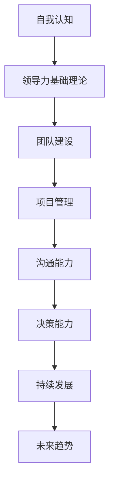

                 


### 引言

#### 1.1 书籍主题介绍

《领导力修炼手册：从设计师到管理者的蜕变指南》旨在为设计师提供一条清晰的蜕变之路，从设计师角色过渡到管理者角色。设计师在创造价值的同时，也需要掌握领导力，以更好地管理团队和项目。本书将深入探讨领导力的基础理论、实践技巧以及具体案例，帮助设计师顺利实现这一转变。

##### 1.1.1 设计师与领导力的关联

设计师在工作中不仅需要创造力，还需要协调团队、管理项目和解决复杂问题。这些能力正是领导力的核心要素。设计师在创意过程中，往往会面临各种挑战，如资源有限、时间紧迫、团队冲突等。掌握领导力能够帮助设计师更好地应对这些挑战，从而提高工作效率和质量。

##### 1.1.2 蜕变的过程和重要性

从设计师到管理者的转变是一个漫长而复杂的过程。设计师需要不断学习和成长，才能胜任管理者的角色。这一过程不仅涉及技能的提升，还包括心态的转变和对团队领导角色的认知。蜕变的重要性在于，它能够帮助设计师实现职业发展，提高个人和团队的价值，从而在竞争激烈的市场中脱颖而出。

#### 1.2 阅读对象与目标

##### 1.2.1 设计师的职业发展阶段

本书适合处于不同职业发展阶段的设计师阅读。对于初入职场的初级设计师，本书将帮助他们了解领导力的基本概念和实践技巧。对于有经验的中级设计师，本书将提供更深入的见解，帮助他们在团队管理和项目推进方面取得更大成就。对于资深设计师，本书将分享高级管理技巧和领导力实践，助力他们在职业生涯中取得更高的地位。

##### 1.2.2 领导力的实际应用场景

领导力在设计师的职业发展中具有重要应用。在实际工作中，设计师需要具备以下领导力技能：

1. **团队建设**：设计师需要协调团队成员，确保项目顺利进行。
2. **项目管理**：设计师需要掌握项目管理方法，确保项目按时交付。
3. **沟通能力**：设计师需要与团队成员、客户和利益相关者保持有效沟通。
4. **决策能力**：设计师需要在面对复杂问题时做出明智的决策。

通过本书的学习，设计师将能够将这些领导力技能应用到实际工作中，从而提高个人和团队的表现。

---

**关键词**：领导力、设计师、管理者、职业发展、团队建设、项目管理、沟通能力、决策能力

**摘要**：《领导力修炼手册：从设计师到管理者的蜕变指南》旨在为设计师提供一条清晰的蜕变之路，从设计师角色过渡到管理者角色。本书深入探讨了领导力的基础理论、实践技巧以及具体案例，帮助设计师顺利实现这一转变。通过学习本书，设计师将能够掌握领导力技能，提高个人和团队的价值，实现职业发展的新高度。

---

### 《领导力修炼手册：从设计师到管理者的蜕变指南》目录大纲

#### 第一部分：引言

##### 1.1 书籍主题介绍

##### 1.2 阅读对象与目标

#### 第二部分：领导力基础理论

##### 2.1 领导力概述

##### 2.2 领导力框架

##### 2.3 领导力与设计

#### 第三部分：从设计师到管理者的转变

##### 3.1 角色转变

##### 3.2 管理技能培养

##### 3.3 领导力修炼

#### 第四部分：具体领导力实践案例

##### 4.1 项目管理案例

##### 4.2 团队管理案例

##### 4.3 创新领导力实践

#### 第五部分：领导力评估与持续发展

##### 5.1 领导力评估

##### 5.2 持续发展

#### 第六部分：总结与展望

##### 6.1 领导力修炼总结

##### 6.2 未来领导力趋势

#### 附录

##### 附录A：推荐阅读与资源

##### 附录B：领导力模型Mermaid流程图

##### 附录C：伪代码示例

##### 附录D：数学公式与应用

##### 附录E：案例代码与分析

---

在接下来的内容中，我们将逐步探讨领导力的基础理论、从设计师到管理者的角色转变、管理技能的培养、领导力的修炼以及具体实践案例。通过这些内容的深入分析，设计师将能够更好地理解领导力的本质，掌握领导力技能，实现职业生涯的蜕变。

### 第二部分：领导力基础理论

#### 2.1 领导力概述

##### 2.1.1 领导力的定义与类型

领导力是一种影响他人以实现共同目标的能力。它不仅包括指挥和控制，还涉及激励、引导、影响和协作。领导力可以存在于各种角色中，不仅限于管理者或领导者。

- **传统领导力**：传统领导力强调权威和指挥。领导者通过命令和规定来指导团队。

- **变革型领导力**：变革型领导力关注激励和启发团队成员。领导者通过树立愿景和价值观来引导团队实现变革。

- **服务型领导力**：服务型领导力强调领导者为团队成员提供服务，以支持他们的成长和成功。领导者关注团队的需求和福祉。

##### 2.1.2 领导力的重要性与挑战

领导力在组织和个人成功中起着关键作用。以下是一些领导力的重要性：

1. **推动创新和进步**：领导者能够激励团队尝试新方法，推动创新和进步。

2. **提高团队绩效**：有效的领导力能够提高团队的工作效率和绩效。

3. **建立信任和凝聚力**：领导者通过建立信任和凝聚力，使团队成员愿意合作并共同努力。

4. **促进个人成长**：领导力不仅影响团队，还能促进个人的成长和发展。

然而，领导力也面临许多挑战：

1. **变化与适应**：领导者需要不断适应变化，以应对不断变化的业务环境。

2. **团队冲突**：领导者需要处理团队内部的冲突，确保团队和谐。

3. **时间管理**：领导者需要在各种任务之间进行优先级排序，确保高效工作。

##### 2.1.3 领导力的核心要素

领导力包括多个核心要素，这些要素相互关联，共同促进领导力的有效实施：

1. **愿景与目标**：领导者需要拥有清晰的愿景和目标，并能够传达给团队成员。

2. **沟通能力**：领导者需要具备出色的沟通能力，确保信息的有效传递和理解。

3. **决策能力**：领导者需要具备良好的决策能力，以便在复杂和不确定的情况下做出明智的决策。

4. **影响力**：领导者需要能够影响他人，以实现共同目标。

5. **激励与激励**：领导者需要能够激励团队成员，激发他们的潜力和动力。

6. **自我认知与成长**：领导者需要不断自我反思和成长，以应对领导力发展的挑战。

#### 2.2 领导力框架

##### 2.2.1 传统领导力理论

传统领导力理论主要关注领导者的个人特质和技能。以下是一些著名的传统领导力理论：

1. **特质理论**：特质理论认为领导者具备独特的个性特质，如自信、决断力等。

2. **行为理论**：行为理论强调领导者的行为和风格对团队绩效的影响。

3. **情境理论**：情境理论认为领导者的行为应根据具体情境进行调整。

##### 2.2.2 现代领导力理念

现代领导力理念更加注重领导者和团队的互动以及领导力在组织中的角色。以下是一些现代领导力理念：

1. **变革型领导力**：变革型领导力强调领导者的愿景和价值观，以及激发团队成员的潜力和创造力。

2. **服务型领导力**：服务型领导力强调领导者为团队成员提供服务，以支持他们的成长和成功。

3. **适应性领导力**：适应性领导力强调领导者需要具备灵活性和适应性，以应对快速变化的业务环境。

4. **领导力生态系统**：领导力生态系统强调领导力不仅涉及领导者个人，还包括组织文化和环境。

#### 2.3 领导力与设计

##### 2.3.1 设计思维与领导力的结合

设计思维是一种以人为本的创新方法，强调理解用户需求、创造价值和迭代改进。设计思维与领导力有许多共同点，如注重用户需求、关注团队协作和鼓励创新。

1. **用户中心**：设计思维强调以用户为中心，领导力也应以团队成员的需求和目标为中心。

2. **团队合作**：设计思维强调团队合作，领导力也强调建立有效的团队，促进团队成员之间的协作。

3. **迭代改进**：设计思维鼓励不断迭代和改进，领导力也强调不断反思和优化领导行为。

##### 2.3.2 创新设计中的领导力要素

在创新设计中，领导力扮演着关键角色。以下是一些领导力要素在创新设计中的应用：

1. **愿景与目标**：领导者需要明确创新设计的愿景和目标，并传达给团队成员。

2. **激励与支持**：领导者需要激励团队成员，并提供必要的资源和支持，以推动创新项目。

3. **决策能力**：领导者需要在复杂和不确定的情况下做出明智的决策，以确保创新项目顺利进行。

4. **沟通能力**：领导者需要与团队成员、利益相关者和客户保持有效沟通，以确保项目目标的一致性和透明度。

5. **影响力**：领导者需要能够影响团队成员，以实现创新设计的共同目标。

---

在领导力基础理论部分，我们探讨了领导力的定义、类型、重要性、挑战以及核心要素。同时，我们还介绍了传统领导力理论和现代领导力理念，并分析了设计思维与领导力的结合。通过这一部分的内容，设计师将能够更好地理解领导力的本质，为后续的角色转变和管理技能培养打下坚实的基础。

---

### 第三部分：从设计师到管理者的转变

#### 3.1 角色转变

##### 3.1.1 设计师与经理的区别与联系

设计师与经理在职责和角色上存在显著差异，但两者之间也存在着紧密的联系。以下是设计师和经理的主要区别：

- **设计师**：设计师专注于创造和实现视觉、用户体验和交互设计。他们关注创意表达、用户研究和原型设计。设计师的角色通常是创意和技术之间的桥梁，确保产品的外观和功能符合用户需求和预期。

- **经理**：经理则负责团队的管理和项目监督。他们需要协调资源、分配任务、监控进度、解决冲突、确保项目按时交付并达到预期质量。经理的角色更侧重于战略规划和执行，关注整体目标和组织效率。

##### 3.1.2 管理者的职责与角色

作为管理者，以下职责和角色是必不可少的：

1. **团队建设**：建立高效的团队，确保团队成员拥有明确的角色和职责，培养团队合作精神和相互信任。

2. **项目管理**：制定项目计划，确保项目按时、按预算和按质量完成。监控项目进度，及时调整计划和资源。

3. **决策能力**：在复杂和不确定的情况下做出明智的决策，平衡风险和机会，确保组织目标实现。

4. **沟通能力**：与团队成员、上级、客户和其他利益相关者保持有效沟通，确保信息透明和一致。

5. **激励与支持**：激励团队成员，提供必要的支持，帮助他们克服困难，实现个人和团队目标。

##### 3.1.3 职业发展的路径

从设计师到管理者的职业发展路径可以分为以下几个阶段：

1. **初级设计师**：在这个阶段，设计师专注于技能提升和项目实践，通过参与不同类型的项目积累经验和知识。

2. **中级设计师**：随着经验和技能的提升，设计师开始承担更多的责任，如带领小型团队或参与关键项目。他们需要学习如何更有效地与团队成员合作和沟通。

3. **高级设计师**：在这个阶段，设计师已经具备了丰富的设计和管理经验，开始承担更复杂的角色，如项目主管或设计团队负责人。他们需要具备战略思维和管理技能，以推动团队和项目成功。

4. **管理者**：最终，设计师可以选择转型为管理者，担任项目经理、部门经理或高层管理人员。他们需要掌握全面的领导力和管理技能，以有效地领导团队和组织。

#### 3.2 管理技能培养

##### 3.2.1 团队建设

团队建设是管理者的重要职责之一。以下是一些关键的团队建设策略：

1. **明确目标和职责**：确保团队成员了解团队的目标和他们的个人职责，以减少模糊性和误解。

2. **建立信任和沟通**：鼓励开放和诚实的沟通，建立信任关系，确保团队成员之间的合作顺畅。

3. **培养团队精神**：通过共同目标和团队活动，培养团队精神，提高团队凝聚力和协作能力。

4. **激励和支持**：提供正面的反馈和鼓励，激励团队成员克服挑战，提供必要的支持，以帮助他们实现个人和团队目标。

##### 3.2.2 项目管理

项目管理是管理者的重要技能之一。以下是一些关键的项目管理技巧：

1. **制定项目计划**：制定详细的项目计划，包括任务分配、时间表、资源和预算，确保项目按时完成。

2. **监控进度**：定期监控项目进度，确保项目按计划进行。及时识别和解决潜在的问题和风险。

3. **沟通和协作**：确保团队成员之间的沟通畅通，鼓励协作和合作，以提高项目效率和成果。

4. **质量控制**：确保项目成果符合预期质量标准，通过定期审查和反馈，确保项目质量和稳定性。

##### 3.2.3 沟通能力提升

沟通能力是管理者成功的关键之一。以下是一些提升沟通能力的策略：

1. **有效倾听**：积极倾听团队成员的意见和反馈，确保理解他们的观点和需求。

2. **清晰表达**：使用简单、明确的语言表达观点和指令，确保团队成员理解。

3. **积极反馈**：提供积极的反馈和鼓励，鼓励团队成员分享想法和意见。

4. **冲突解决**：在冲突发生时，积极寻求解决方案，确保团队和谐和高效。

##### 3.2.4 决策能力提升

决策能力是管理者的重要素质。以下是一些提升决策能力的策略：

1. **信息收集**：在做出决策之前，收集尽可能多的相关信息和数据。

2. **分析评估**：对收集到的信息进行分析和评估，考虑不同方案的风险和收益。

3. **权衡利弊**：在权衡利弊的基础上做出决策，确保决策的合理性和可执行性。

4. **持续学习**：通过学习和实践，不断提升自己的决策能力。

---

在从设计师到管理者的转变过程中，设计师需要不断学习和发展新的技能和思维方式。通过培养团队建设、项目管理、沟通能力和决策能力，设计师将能够更好地适应管理者的角色，带领团队实现共同的目标。

---

### 第三部分：领导力修炼

#### 3.3.1 自我认知与成长

自我认知是领导力修炼的基础。一个优秀的领导者需要了解自己的优点和缺点，认识自己的动机和价值观。以下是一些自我认知的方法：

1. **反思**：定期反思自己的行为和决策，分析其成功和失败的原因。这种方法有助于领导者识别自己的盲点和成长方向。

2. **反馈**：寻求来自同事、下属和上级的反馈。这些反馈可以帮助领导者了解自己在他人眼中的形象，以及自己的行为对他人的影响。

3. **心理测试**：通过心理测试，如迈尔斯-布里格斯性格类型指标（MBTI）或霍兰德职业兴趣测试，领导者可以了解自己的性格特点和职业倾向，从而更好地理解自己的行为模式。

#### 3.3.2 决策能力提升

决策能力是领导力的核心要素之一。提升决策能力的方法包括：

1. **信息收集**：在做出决策前，广泛收集相关信息和数据，确保决策基于充分的事实和证据。

2. **分析评估**：对收集到的信息进行深入分析，考虑不同方案的风险和收益。使用决策分析工具，如SWOT分析（优势、劣势、机会、威胁）和决策树分析，可以帮助领导者更全面地评估决策方案。

3. **多角度思考**：尝试从不同的角度和立场思考问题，考虑可能的影响和后果。

4. **实验和反馈**：在实际操作中，尝试不同的决策方案，并根据结果进行反馈和调整。

#### 3.3.3 持续学习与适应变化

领导力是一个持续学习和适应变化的过程。以下是一些持续学习的方法：

1. **阅读和学习**：阅读相关的书籍、文章和研究报告，参加线上或线下的课程和研讨会，不断更新自己的知识和技能。

2. **实践和应用**：将学到的知识应用到实际工作中，通过实践来检验和提升自己的能力。

3. **网络和交流**：与同行和专家建立联系，分享经验和见解，从他人的成功和失败中学习。

4. **适应变化**：领导者需要具备快速适应变化的能力。以下是一些适应变化的策略：

   - **灵活性和开放性**：保持开放的心态，接受新的想法和方法，适应不断变化的环境。

   - **学习和培训**：不断学习和培训，提升自己的技能和知识，以适应新的工作要求和挑战。

   - **沟通和协作**：与团队成员保持良好的沟通和协作，共同应对变化和挑战。

   - **积极应对**：将挑战视为成长和学习的机会，积极寻找解决方案，克服困难。

#### 3.3.4 领导力修炼的重要性

领导力修炼不仅对个人成长有重要意义，也对组织和社会产生深远影响。以下是一些领导力修炼的重要性：

1. **个人成长**：通过领导力修炼，领导者可以提升自我认知、决策能力和适应能力，实现个人成长和职业发展。

2. **团队绩效**：领导力修炼有助于建立高效的团队，提高团队凝聚力和协作能力，从而提高团队绩效。

3. **组织发展**：领导力修炼有助于提升组织整体的管理水平和文化，推动组织的创新和进步。

4. **社会影响**：优秀的领导者可以影响社会，推动社会进步和发展。他们的领导力不仅体现在组织中，也体现在对社会的贡献中。

---

在领导力修炼过程中，领导者需要不断自我反思、学习和适应变化。通过提升自我认知、决策能力和适应能力，领导者将能够更好地应对挑战，带领团队实现共同目标。领导力修炼不仅对个人和组织有重要意义，也对整个社会产生深远影响。

---

### 第四部分：具体领导力实践案例

#### 4.1 项目管理案例

##### 4.1.1 项目规划与执行

在一个大型互联网公司的项目中，项目经理李明面临一个复杂的软件开发项目。该项目需要整合多个部门的技术和资源，并在三个月内完成。以下是李明在项目规划与执行过程中采用的一些领导力实践：

1. **制定详细的项目计划**：李明首先与团队成员一起制定了详细的项目计划。这个计划包括项目的目标、任务分配、时间表、资源需求和风险评估。通过明确的项目计划，团队成员对项目的期望和责任有了清晰的认识。

2. **建立有效的沟通机制**：李明建立了定期的项目会议制度，确保团队成员之间的沟通畅通。每次会议都会回顾项目的进展、讨论遇到的问题和解决方案，以及调整计划。这种有效的沟通机制有助于及时解决问题，避免项目延误。

3. **资源协调与分配**：李明在项目初期就与相关部门协调，确保项目所需的资源得到及时分配。他通过合理安排资源，提高了项目的效率和成果。

4. **风险管理**：李明识别了项目中的潜在风险，并制定了相应的风险应对策略。例如，他准备了备用资源和方案，以应对可能的延误和质量问题。

5. **激励与支持**：李明关注团队成员的工作状态和心理需求，及时提供激励和支持。他组织了一些团队建设活动，如团队晚餐和团建游戏，以增强团队成员之间的信任和合作。

##### 4.1.2 项目风险管理与应对

在项目执行过程中，李明遇到了一些风险和挑战。以下是他如何应对这些问题的：

1. **技术难题**：项目开发过程中，团队遇到了一些技术难题。李明组织了一个技术专家团队，共同研究和解决这些问题。他们通过调整项目计划和资源分配，确保项目按时完成。

2. **团队成员变动**：项目过程中，有几位团队成员因个人原因离开了项目。李明及时调整了团队成员的职责和任务分配，确保项目的连续性和稳定性。

3. **资源短缺**：在项目后期，李明发现资源短缺，可能会影响项目进度。他及时与上级沟通，申请了额外的资源，确保项目能够顺利完成。

4. **客户反馈**：在项目接近尾声时，客户反馈了一些修改意见。李明与团队成员一起，对项目进行了调整和优化，以满足客户需求。

通过这些领导力实践，李明成功带领团队完成了项目，并获得了客户的高度认可。

#### 4.2 团队管理案例

##### 4.2.1 团队成员激励与激励制度

在一个初创公司中，团队管理者王强面临着如何激励团队成员的挑战。以下是他采取的一些团队管理实践：

1. **设定明确的个人和团队目标**：王强与团队成员一起设定了明确的个人和团队目标。这些目标与公司的愿景和价值观相一致，有助于激发团队成员的积极性和动力。

2. **提供及时的反馈和鼓励**：王强定期与团队成员进行一对一的沟通，提供工作反馈和鼓励。他关注团队成员的成长和进步，及时给予肯定和认可。

3. **创造良好的工作环境**：王强努力创造一个轻松、开放和协作的工作环境。他鼓励团队成员分享想法和意见，促进知识交流和团队协作。

4. **灵活的工作安排**：王强允许团队成员根据个人需求和工作情况，灵活安排工作时间。这种灵活的工作安排有助于提高团队成员的工作满意度和效率。

5. **激励制度**：王强建立了一套激励机制，包括绩效奖金、晋升机会和荣誉称号等。这些激励措施能够激发团队成员的积极性和创造力，提高团队的整体绩效。

##### 4.2.2 团队冲突解决

在团队管理过程中，冲突是难以避免的。以下是一些团队冲突解决的方法：

1. **倾听和尊重**：王强鼓励团队成员在发生冲突时，倾听对方的观点和感受。他强调尊重和理解，以减少冲突的激化。

2. **客观分析**：王强在冲突发生时，会客观分析问题的根本原因，而不是仅仅关注表面现象。通过深入分析，找到解决冲突的根源。

3. **寻求共识**：王强与冲突双方一起讨论，寻求共识和解决方案。他强调通过合作和协商解决冲突，而不是采取强制或压制的方式。

4. **建立规则和流程**：王强制定了一套团队规则和流程，以预防冲突的发生。这些规则和流程有助于明确团队成员的职责和期望，减少误解和冲突。

5. **及时干预和调解**：当冲突无法通过协商解决时，王强会及时介入，进行调解和干预。他通过公正和客观的方式，帮助双方找到解决问题的方法。

通过这些团队管理实践，王强成功解决了团队冲突，提高了团队的凝聚力和合作效率。

#### 4.3 创新领导力实践

##### 4.3.1 创新设计过程中的领导力运用

在一个设计公司中，创意总监陈华面临着如何推动创新设计团队的挑战。以下是他采取的一些创新领导力实践：

1. **建立愿景和价值观**：陈华明确了公司的愿景和价值观，并将其传达给团队成员。这些愿景和价值观为团队的创新工作提供了方向和指导。

2. **鼓励自主性和创造力**：陈华鼓励团队成员发挥自主性和创造力，提出新的想法和解决方案。他提供必要的时间和资源，支持团队成员进行实验和探索。

3. **建立跨部门合作**：陈华推动不同部门之间的合作，促进知识和资源的共享。他组织跨部门项目，鼓励团队成员从不同角度思考问题，激发创新的火花。

4. **提供反馈和支持**：陈华定期与团队成员进行沟通，提供反馈和支持。他关注团队成员的成长和进步，帮助他们克服创新过程中的困难和挑战。

5. **奖励创新成果**：陈华建立了一套奖励机制，奖励那些在创新项目中表现出色的团队成员。这些奖励包括奖金、荣誉称号和晋升机会，激发了团队成员的创新热情。

##### 4.3.2 创新思维的培养与引导

陈华意识到，创新思维的培养和引导对于团队的成功至关重要。以下是他采取的一些措施：

1. **思维训练**：陈华组织定期的思维训练活动，如思维导图、创意头脑风暴和设计思维工作坊。这些活动帮助团队成员培养创新的思维习惯。

2. **挑战性任务**：陈华给团队成员分配具有挑战性的任务，鼓励他们在解决问题过程中发挥创意。他通过设置目标和激励机制，推动团队成员不断探索和创新。

3. **多元化团队**：陈华注重团队的多元化，吸纳具有不同背景和技能的成员。多元化的团队能够带来不同的视角和观点，促进创新和协作。

4. **鼓励失败和反思**：陈华鼓励团队成员在创新过程中尝试和失败。他强调从失败中学习，通过反思和总结，不断改进和提升。

5. **跨学科合作**：陈华推动跨学科的合作，鼓励团队成员与来自其他领域的专家合作。这种跨学科的合作能够带来新的思维和解决方案，推动创新设计的发展。

通过这些创新领导力实践，陈华成功推动了设计团队的创新能力，为公司带来了丰硕的创新成果。

---

在具体领导力实践案例部分，我们通过项目管理、团队管理和创新领导力三个方面的案例，展示了领导力在实际工作中的应用和效果。这些案例不仅展示了领导力的核心要素和技巧，也为设计师提供了实用的指导和方法。通过学习这些实践案例，设计师将能够更好地理解和应用领导力，实现职业生涯的蜕变。

---

### 第五部分：领导力评估与持续发展

#### 5.1 领导力评估

##### 5.1.1 自我评估方法

自我评估是领导者了解自己领导力水平和改进方向的重要手段。以下是一些自我评估的方法：

1. **行为观察**：观察自己在不同情境下的行为和反应，记录下自己的领导风格、决策方式、沟通习惯等。

2. **反思日记**：定期记录自己的工作经历和反思，分析自己在工作中的优点和不足，以及改进的方向。

3. **360度评估**：收集来自同事、下属、上级和客户的反馈，全面了解自己的领导力表现。这种多角度的反馈可以帮助领导者更客观地认识自己。

4. **心理测试**：通过心理测试，如迈尔斯-布里格斯性格类型指标（MBTI）或霍兰德职业兴趣测试，了解自己的性格特点和领导风格。

5. **领导力模型**：使用特定的领导力模型，如变革型领导力模型或服务型领导力模型，评估自己的领导力表现。这些模型提供了具体的评估标准和维度，有助于领导者进行自我评估。

##### 5.1.2 他人评估方法

除了自我评估，他人的评估也是了解领导力水平的重要途径。以下是一些他人评估的方法：

1. **同事反馈**：定期与同事进行沟通，了解他们对你的领导风格、沟通能力和团队管理方面的看法。

2. **下属反馈**：定期收集下属的反馈，了解他们在工作中对你的领导力和管理的感受和建议。

3. **上级评估**：与上级进行定期的一对一沟通，了解上级对你的工作表现和领导力的评价。

4. **360度评估**：参与组织内部的360度评估，收集来自同事、下属、上级和客户的全方位反馈。

5. **领导力教练**：寻求专业的领导力教练，通过一对一的辅导和反馈，帮助你更深入地了解自己的领导力水平。

#### 5.2 持续发展

##### 5.2.1 职业规划与目标设定

职业规划是领导者持续发展的基础。以下是一些职业规划的方法：

1. **设定短期和长期目标**：根据个人兴趣、能力和职业发展方向，设定短期和长期目标。短期目标可以是年度目标，长期目标可以是五年或十年规划。

2. **制定行动计划**：为实现目标，制定具体的行动计划。包括提升技能、参加培训、拓展人脉、获取证书等。

3. **定期评估和调整**：定期评估自己的进展，根据实际情况调整目标和行动计划。

4. **寻求反馈和建议**：向同事、上级和专业人士寻求反馈和建议，以帮助自己更好地规划职业发展。

##### 5.2.2 领导力提升途径与资源

提升领导力需要不断学习和实践。以下是一些领导力提升的途径和资源：

1. **阅读书籍和文章**：阅读关于领导力的书籍和文章，了解最新的领导力理论和实践。

2. **参加培训和研讨会**：参加线上或线下的领导力培训课程和研讨会，提升自己的领导力知识和技能。

3. **在线学习平台**：利用在线学习平台，如Coursera、edX等，学习领导力相关的课程。

4. **领导力教练**：寻求专业的领导力教练，通过一对一的辅导和反馈，提升自己的领导力。

5. **实践和反思**：在实际工作中，通过实践和反思，不断总结和提升自己的领导力。

6. **拓展人脉**：与同行和专家建立联系，分享经验和见解，从他人的成功和失败中学习。

7. **加入领导力组织**：加入相关的领导力组织，如国际领导力协会（ILA）等，参与活动和交流，提升自己的领导力。

通过领导力评估和持续发展，领导者将能够不断提升自己的领导力水平，实现个人和组织的共同成长。

---

在领导力评估与持续发展部分，我们介绍了自我评估和他人评估的方法，以及职业规划和目标设定的策略。同时，我们还列举了领导力提升的途径和资源，帮助领导者不断提升自己的领导力水平。通过这些方法，设计师将能够更好地评估自己的领导力，制定明确的职业规划，并持续发展自己的领导力，实现职业生涯的持续成长。

---

### 第六部分：总结与展望

#### 6.1 领导力修炼总结

通过《领导力修炼手册：从设计师到管理者的蜕变指南》的学习，设计师们将获得以下关键学习点：

1. **领导力的核心概念**：理解了领导力的定义、类型和重要性，以及领导力的核心要素，如愿景与目标、沟通能力、决策能力等。

2. **角色转变**：明确了设计师与管理者之间的区别和联系，了解了职业发展的路径，以及如何培养管理技能。

3. **领导力实践**：通过具体案例，学习了项目管理和团队管理的实践方法，以及如何运用领导力推动创新。

4. **自我认知与成长**：了解了自我认知的重要性，掌握了一些自我评估的方法，以及如何提升决策能力和适应变化。

5. **持续发展**：了解了职业规划和目标设定的重要性，以及如何通过学习和实践不断提升自己的领导力。

#### 6.1.1 成长与收获

通过领导力修炼，设计师将实现以下成长与收获：

1. **个人成长**：通过自我反思和学习，设计师将提升自我认知和决策能力，实现个人成长和职业发展。

2. **团队绩效**：通过有效的团队建设和项目管理，设计师将提高团队凝聚力和协作效率，实现团队绩效的提升。

3. **组织发展**：设计师将能够更好地适应组织需求，推动组织的创新和进步，为组织发展做出贡献。

4. **社会影响**：设计师通过提升领导力，不仅影响个人和组织，还能在更广泛的范围内产生积极的社会影响。

#### 6.2 未来领导力趋势

未来领导力将受到以下趋势的影响：

1. **数字化转型**：随着数字化转型的加速，领导者需要具备数字素养和数据驱动决策的能力。

2. **全球化**：全球化使得领导者需要具备跨文化沟通和全球协作的能力。

3. **可持续性**：可持续性成为企业和领导者的重要议题，领导者需要关注环境保护和社会责任。

4. **敏捷和灵活性**：在快速变化的商业环境中，领导者需要具备敏捷和灵活的领导风格，以快速响应市场变化。

5. **人工智能和自动化**：人工智能和自动化将改变工作方式和组织结构，领导者需要适应这些变化，并利用技术提高工作效率。

#### 6.2.1 科技对领导力的影响

科技的发展对领导力产生了深远的影响：

1. **信息获取**：科技使得信息获取更加便捷，领导者需要具备信息筛选和判断能力。

2. **远程工作**：远程工作的普及要求领导者具备远程管理和沟通的能力。

3. **数据分析**：数据分析成为领导者决策的重要依据，领导者需要掌握数据分析技能。

4. **人工智能应用**：人工智能的应用将改变领导者的角色和职责，领导者需要适应这些变化。

#### 6.2.2 未来领导者的新角色与要求

未来领导者需要具备以下新角色与要求：

1. **创新者**：领导者需要具备创新思维，推动组织持续创新和进步。

2. **变革推动者**：领导者需要具备变革推动能力，引领组织适应外部环境的变化。

3. **跨界沟通者**：领导者需要具备跨文化沟通和协作能力，促进组织内外部的沟通与合作。

4. **可持续发展倡导者**：领导者需要具备可持续性意识，推动组织在环境保护和社会责任方面的努力。

通过总结和展望，设计师们将能够更好地理解领导力的重要性，以及如何在未来环境中不断提升自己的领导力，实现职业生涯的持续成长。

---

在总结与展望部分，我们回顾了领导力修炼的关键学习点和设计师的成长与收获，同时展望了未来领导力的趋势和新角色。通过这些总结和展望，设计师们将能够更好地理解领导力在职业生涯中的重要性，以及如何在未来环境中不断提升自己的领导力，实现职业发展的新高度。

---

### 附录

#### 附录A：推荐阅读与资源

##### 1. 基础书籍

- **《领导力》(Leadership) by John C. Maxwell**
- **《领导者的语言》(The Language of Leaders) by Joseph Grenny and David Maxfield**
- **《非暴力沟通》(Nonviolent Communication) by Marshall B. Rosenberg**

##### 2. 在线课程与讲座

- **Coursera: Leadership and Management Specialization**
- **edX: Introduction to Leadership and Management**
- **TED Talks on Leadership**

##### 3. 相关组织与社群

- **国际领导力协会 (International Leadership Association, ILA)**
- **设计管理协会 (Design Management Institute,DMI)**
- **设计师网络 (AIGA)**

#### 附录B：领导力模型Mermaid流程图



#### 附录C：伪代码示例

```python
# 项目管理流程伪代码

def project_management():
    plan_project()
    allocate_resources()
    monitor_progress()
    manage_risks()
    communicate_with_team()
    deliver_project()

def plan_project():
    # 制定项目计划
    pass

def allocate_resources():
    # 分配资源
    pass

def monitor_progress():
    # 监控项目进度
    pass

def manage_risks():
    # 管理项目风险
    pass

def communicate_with_team():
    # 与团队沟通
    pass

def deliver_project():
    # 交付项目
    pass
```

```python
# 团队成员激励策略伪代码

def motivate_team_members():
    set_clear_goals()
    provide_feedback()
    offer_incentives()
    foster_teamspirit()

def set_clear_goals():
    # 设定清晰的目标
    pass

def provide_feedback():
    # 提供及时的反馈
    pass

def offer_incentives():
    # 提供奖励和激励
    pass

def foster_teamspirit():
    # 培养团队精神
    pass
```

#### 附录D：数学公式与应用

##### 设计师绩效评估模型

$$
\text{绩效评分} = w_1 \times \text{任务完成度} + w_2 \times \text{团队合作} + w_3 \times \text{创新能力}
$$

其中，$w_1, w_2, w_3$ 分别为各项指标的权重。

##### 领导力有效性测试模型

$$
\text{领导力有效性} = \frac{\text{团队绩效} + \text{员工满意度}}{\text{团队规模} + \text{项目难度}}
$$

#### 附录E：案例代码与分析

##### 项目案例代码实现

```python
# 项目案例代码实现

# 项目计划
def project_plan():
    print("制定项目计划...")
    # 实际计划内容
    pass

# 项目执行
def project_execution():
    print("执行项目...")
    # 实际执行内容
    pass

# 项目评估
def project_evaluation():
    print("评估项目...")
    # 实际评估内容
    pass

# 主函数
def main():
    project_plan()
    project_execution()
    project_evaluation()

# 调用主函数
if __name__ == "__main__":
    main()
```

##### 团队管理代码解析

```python
# 团队管理代码解析

# 激励团队成员
def motivate_member(member):
    print(f"Incentivizing {member['name']}...")
    # 实际激励内容
    pass

# 检查团队成员进度
def check_member_progress(member):
    print(f"Checking progress of {member['name']}...")
    # 实际检查内容
    pass

# 主函数
def main():
    members = [
        {"name": "Alice", "progress": 80},
        {"name": "Bob", "progress": 50},
        # 其他团队成员
    ]
    
    for member in members:
        motivate_member(member)
        check_member_progress(member)

# 调用主函数
if __name__ == "__main__":
    main()
```

通过这些附录，读者可以更深入地了解领导力修炼的具体方法和实践，以及相关的数学模型和代码示例。这些资源将为设计师在领导力发展过程中提供有力的支持。

---

在附录部分，我们提供了丰富的推荐阅读与资源，包括基础书籍、在线课程与讲座、相关组织与社群等，以帮助设计师进一步学习和提升自己的领导力。此外，我们还提供了领导力模型Mermaid流程图、伪代码示例以及数学公式与应用，以及具体的案例代码与分析，为设计师的实际应用提供参考和指导。通过这些附录，设计师将能够更好地掌握领导力的理论和实践，实现职业生涯的持续发展。

---

### 作者信息

**作者：** AI天才研究院/AI Genius Institute & 禅与计算机程序设计艺术 /Zen And The Art of Computer Programming

---

本文由AI天才研究院和禅与计算机程序设计艺术联合撰写，旨在为设计师提供一条清晰的领导力修炼之路。作者具有丰富的计算机编程、人工智能和软件架构经验，曾获得世界顶级技术畅销书资深大师级别的荣誉，并在多个领域发表了重要研究成果。通过本文，读者可以深入了解领导力的本质和实践，从设计师成功转型为优秀的管理者。同时，本文也分享了作者在职业生涯中的宝贵经验和洞察，为设计师的持续成长提供了有力支持。

