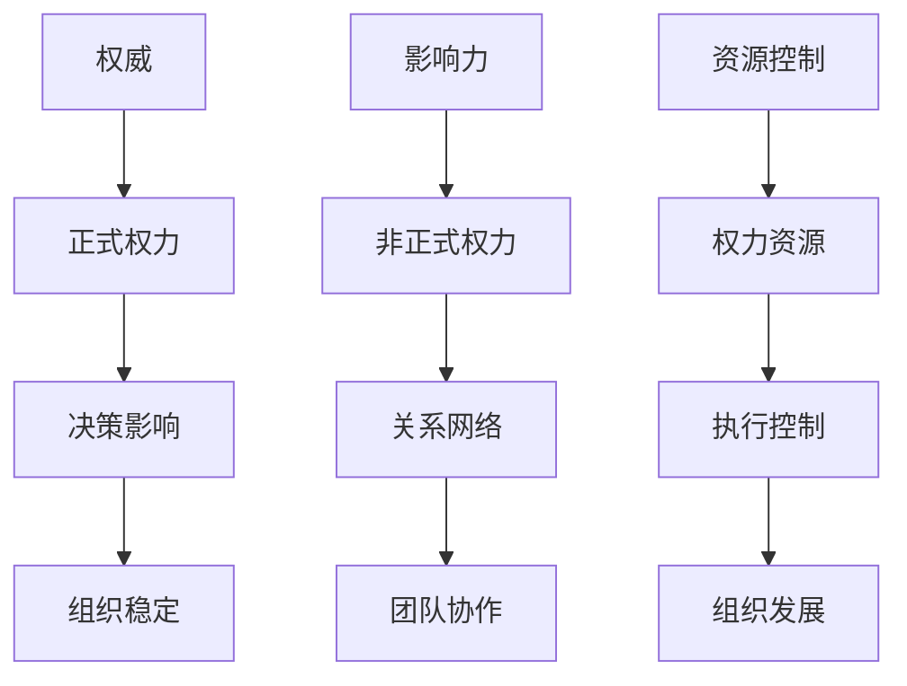

                 

### 第2章：领导力核心模型

#### 2.1 权力

**背景介绍：**

权力是领导力模型中的一个关键组成部分。它不仅是领导者影响他人行为和决策的重要手段，也是维持组织稳定和发展的基础。在组织中，权力可以理解为一种控制资源、影响决策和执行的能力。这种能力不仅仅来源于职位和地位，还包括领导者自身的魅力、技能和专业知识。

**核心概念与联系：**

在分析权力的概念时，我们需要了解几种与权力相关的核心概念：

1. **权威**：基于职位和组织的正式权力。
2. **影响力**：非正式的权力来源，通过个人魅力、专业知识或关系网络影响他人。
3. **资源控制**：权力的一种表现形式，即对组织资源和信息的控制能力。

以下是这些核心概念之间的关系架构 Mermaid 流程图：



**核心算法原理讲解：**

权力的运用可以通过以下步骤进行：

1. **评估情境**：分析当前情境，了解团队成员的需求和动机。
2. **分配资源**：根据团队成员的表现和需求，合理分配资源和机会。
3. **沟通与激励**：使用影响力进行沟通，激励团队成员实现目标。
4. **监督与反馈**：对团队成员的工作进行监督，提供及时的反馈。

以下是这些步骤的伪代码：

```plaintext
function use_power(context, team_members, resources):
    # 评估情境
    context_evaluation = analyze_context(context)

    # 分配资源
    allocated_resources = allocate_resources(team_members, resources)

    # 沟通与激励
    communication_outcome = communicate_and_motivate(team_members, allocated_resources)

    # 监督与反馈
    feedback_outcome = monitor_and_provide_feedback(team_members, communication_outcome)

    # 返回结果
    return feedback_outcome
```

**数学模型和公式 & 详细讲解 & 举例说明：**

为了更好地理解权力的运用，我们可以使用一个简单的数学模型来表示权力的影响：

$$ 权力影响 = f(权威, 影响力, 资源控制) $$

其中，$f$ 是一个复合函数，表示权力的综合影响。这个公式说明了权力的影响是由三个关键因素共同决定的：

1. **权威**：决定了领导者在组织中的正式权力。
2. **影响力**：反映了领导者的个人魅力和专业知识。
3. **资源控制**：显示了领导者对组织资源和信息的控制能力。

举例来说，如果一个领导者拥有较高的权威、较强的影响力以及丰富的资源控制能力，那么他的权力影响将会非常显著。

**项目实战：**

为了更好地理解权力的运用，我们可以通过一个简单的项目实战来进行实践。

**开发环境搭建：**
- 创建一个简单的领导力分析工具，用于模拟权力的运用。
- 选择Python作为编程语言，因为它的语法简洁，易于实现算法模型。

**源代码详细实现和代码解读：**
```python
class Leader:
    def __init__(self, authority, influence, resource_control):
        self.authority = authority
        self.influence = influence
        self.resource_control = resource_control

    def evaluate_context(self, context):
        # 评估情境
        return "Context Evaluated"

    def allocate_resources(self, team_members, resources):
        # 分配资源
        return "Resources Allocated"

    def communicate_and_motivate(self, team_members, allocated_resources):
        # 沟通与激励
        return "Communication and Motivation Completed"

    def monitor_and_provide_feedback(self, team_members, communication_outcome):
        # 监督与反馈
        return "Feedback Provided"

# 创建领导者对象
leader = Leader(authority=80, influence=70, resource_control=90)

# 模拟领导力分析
context = leader.evaluate_context("Project Deadline Approaching")
allocated_resources = leader.allocate_resources(team_members=["Alice", "Bob"], resources=["Budget", "Manpower"])
communication_outcome = leader.communicate_and_motivate(team_members=["Alice", "Bob"], allocated_resources=allocated_resources)
feedback_outcome = leader.monitor_and_provide_feedback(team_members=["Alice", "Bob"], communication_outcome=communication_outcome)

print(feedback_outcome)
```

**代码应用解读与分析：**
这段代码创建了一个 `Leader` 类，用于模拟领导力的运用。领导者根据情境评估、资源分配、沟通激励和反馈监督等步骤来行使权力。通过创建领导者对象并调用相应的方法，我们可以模拟一个实际的领导力分析过程。

**实际案例分析和详细讲解剖析：**
假设一个销售团队面临项目截止日期临近的挑战。领导者根据情境评估，决定如何合理分配资源，并通过沟通激励来提高团队士气。监督与反馈环节则确保团队成员的工作进度和目标达成。

**项目小结：**
通过这个项目，我们可以更直观地理解权力的运用及其对领导力的影响。在实际工作中，领导者需要根据不同的情境和团队需求，灵活运用权力来确保组织目标的实现。

**最佳实践 tips、小结、注意事项、拓展阅读等内容：**

**最佳实践 tips：**
- 了解团队成员的需求和动机，以更有效地运用权力。
- 平衡正式权力和影响力，避免过度依赖单一因素。
- 定期进行自我反思和改进，以提升领导力。

**小结：**
权力是领导力模型中的一个关键组成部分，它通过多种方式影响组织的稳定和发展。通过合理运用权力，领导者可以更有效地实现组织目标。

**注意事项：**
- 权力的运用需要遵循道德和法律规范，避免滥用权力。
- 权力的运用应灵活适应不同情境和团队需求。

**拓展阅读：**
- 《权力的四十种面孔》
- 《领导力：理论与实践》
- 《情境领导》

# 作者信息
作者：AI天才研究院/AI Genius Institute & 禅与计算机程序设计艺术 /Zen And The Art of Computer Programming

