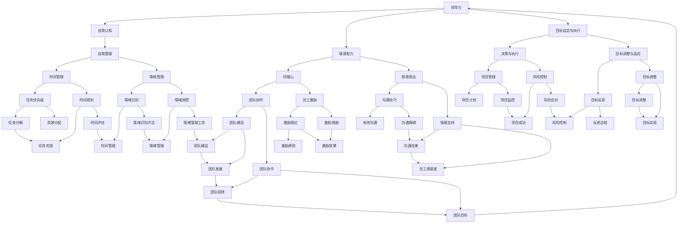

                 

# 领导力修炼手册：从销售新星到管理者的逆袭宝典

关键词：领导力、销售、管理者、职业发展、自我管理、团队管理、情感智力、同理心

摘要：本文旨在探讨领导力在从销售新星到管理者的职业发展过程中所发挥的关键作用。通过对领导力核心概念的深入分析，结合实际案例，文章将提供一系列实用的策略和方法，帮助读者在职业生涯中实现从销售新星到管理者的逆袭。

## 引言与核心概念

### 引言：领导力的重要性

领导力是一种通过激励和引导他人来实现目标的能力。在企业中，领导力不仅是推动业务增长的核心动力，也是实现团队协作和个体发展的关键因素。对于从销售新星到管理者的职业转型，领导力更是不可或缺的能力。

### 领导力的定义

领导力不仅仅是管理，它包括激励、引导、沟通、决策等多方面的技能。有效的领导者能够建立信任、激发团队潜力，并在复杂多变的环境中做出明智的决策。

### 领导力与管理的区别

管理侧重于规划、组织、协调和控制，而领导力则关注激励、愿景和价值观的塑造。有效的管理者可能是好的领导者，但好的领导者不一定是好的管理者。

### 领导力在企业中的关键作用

领导力对于企业的发展和竞争力的提升至关重要。它能够激发员工的积极性，提高团队绩效，推动创新和变革，从而实现企业的长期发展目标。

## 领导力发展的核心概念

### 自我认知与自我管理

自我认知是领导力发展的基础。通过深入了解自己的性格、优势和弱点，领导者可以更好地进行自我管理，提升工作效率和决策质量。

### 情感智力与同理心

情感智力包括情绪识别、情绪调控和情绪表达的能力。同理心则是一种能够站在他人角度理解和感受他人情绪的能力。情感智力和同理心对于建立良好的人际关系和团队合作至关重要。

### 目标设定与执行

有效的目标设定和执行是领导力的核心要素。领导者需要明确目标，制定可实现的计划，并激励团队成员共同达成目标。

## 领导力修炼的意义与目标

### 领导力修炼的阶段性目标

领导力修炼是一个持续的过程，包括自我认知、技能提升、情感智力培养等多个阶段。每个阶段都有明确的目标和任务。

### 个人成长与企业发展的联系

领导力修炼不仅对个人职业发展有重要影响，也对企业的长期发展具有重要意义。通过提升个人领导力，可以更好地推动企业实现战略目标。

### 领导力修炼的长期价值

领导力修炼能够提高领导者的综合素质，增强团队凝聚力和执行力，从而为企业的可持续发展奠定坚实基础。

## 第二部分：销售新星到管理者的转变

### 第2章：销售新星的职业发展路径

#### 销售新星的职业发展路径

销售新星的职业发展是一个逐步提升的过程。从初级销售人员到销售主管，再到销售经理，每个阶段都有不同的职责和挑战。

#### 销售工作的重要性

销售是企业与客户之间的桥梁，是推动企业增长的直接动力。销售新星的工作不仅影响个人业绩，也关系到企业的整体业绩。

#### 销售新星的职责与挑战

销售新星需要具备良好的沟通能力、产品知识和市场敏感度。他们面临的挑战包括客户管理、竞争压力和业绩目标。

#### 销售技能的提升路径

销售新星能通过不断学习、实战经验和反馈改进来提升销售技能。有效的销售技巧包括客户定位、需求分析和谈判策略。

#### 从销售到管理者的过渡

从销售到管理者的过渡是一个重大的转折点。销售人员需要调整心态，掌握新的技能，以适应管理岗位的要求。

#### 管理者与销售人员的区别

管理者侧重于团队领导和资源分配，而销售人员则更专注于个体业绩和客户关系。两者在职责和技能上存在显著差异。

#### 管理岗位的职责与要求

管理岗位要求领导者具备更强的战略思维、沟通能力和决策能力。他们需要协调团队成员，推动团队目标的实现。

#### 销售到管理过渡的策略

过渡到管理者岗位，销售人员需要学习管理知识，提升团队领导能力，并建立良好的团队关系。

#### 管理者必备的核心技能

沟通技巧、团队领导力、项目管理和风险控制是管理者必备的核心技能。有效的沟通能够提高团队协作效率，团队领导力能够激发员工潜力，项目管理和风险控制能够确保项目成功。

## 第三部分：管理者提升领导力的方法

### 第3章：自我认知与自我管理

#### 自我认知的重要性

自我认知是领导者成长的基础。通过深入了解自己的性格、优势和弱点，领导者可以更好地进行自我管理，提升工作效率和决策质量。

#### 自我认知的途径与方法

自我认知可以通过自我反思、他人反馈和职业咨询等方式实现。领导者需要定期进行自我评估，以了解自己的成长和改进方向。

#### 自我认知在领导力提升中的作用

自我认知能够帮助领导者明确自己的目标和方向，优化个人资源，提高领导效果。

#### 自我管理的核心策略

自我管理的核心策略包括时间管理、决策与执行和情绪管理。有效的时间管理能够提高工作效率，明智的决策能够确保目标实现，情绪管理能够保持积极的心态。

#### 时间管理

时间管理是领导者提升工作效率的关键。领导者需要制定清晰的日程安排，优先处理重要任务，并合理分配时间。

#### 决策与执行

决策与执行是领导者的重要职责。领导者需要在信息充分的情况下做出明智的决策，并确保决策得到有效执行。

#### 情绪管理

情绪管理是领导者保持心理健康和稳定心态的关键。领导者需要学会识别和调控自己的情绪，以应对工作压力和挑战。

#### 自我成长与实践

自我成长是领导者持续发展的动力。领导者需要不断学习新知识、新技能，并在实践中不断反思和改进。

#### 反思与总结

定期反思和总结是领导者提升自我认知和自我管理能力的重要方法。领导者需要从每次经历中学习，不断提高自己的领导水平。

#### 自我成长的具体案例

通过具体案例，领导者可以了解到如何通过自我认知和自我管理提升领导力。例如，某位销售经理通过反思自己的沟通方式，改进了与团队成员的沟通，提高了团队执行力。

## 第四部分：情感智力与同理心

### 第4章：情感智力与同理心在领导力中的应用

#### 情感智力的重要性

情感智力包括情绪识别、情绪调控和情绪表达的能力。有效的领导者需要具备较高的情感智力，以便更好地理解和管理自己的情绪，以及理解他人的情绪。

#### 情感智力在领导力中的作用

情感智力对于建立良好的人际关系、提升团队合作和激励员工具有重要作用。领导者通过情感智力可以更好地激励员工，解决团队冲突，提高团队绩效。

#### 如何提高情感智力

提高情感智力可以通过学习情感管理技巧、培养自我意识、增强同理心等方式实现。领导者可以通过阅读相关书籍、参加工作坊和接受专业培训来提升情感智力。

### 第4章：同理心的培养

#### 同理心的概念

同理心是一种能够站在他人角度理解和感受他人情绪的能力。它包括情感认知和情感共鸣两个层面。

#### 同理心在领导力中的重要性

同理心是建立信任和良好团队关系的关键。领导者通过同理心可以更好地理解员工的情感和需求，提高员工的工作满意度和忠诚度。

#### 培养同理心的方法和实践

培养同理心可以通过换位思考、倾听和理解他人的情感需求等方式实现。领导者可以通过定期与员工交流、参与团队活动和实践同理心训练来提升同理心。

#### 情感智力与同理心的综合应用

情感智力和同理心的综合应用可以帮助领导者建立积极的工作氛围，提高团队协作效率，推动企业创新和变革。

### 第4章：情感智力与同理心的案例解析

通过具体案例，领导者可以了解到如何在实践中应用情感智力和同理心。例如，某位销售经理通过同理心理解员工的需求，改进了团队沟通方式，从而提高了团队凝聚力和绩效。

## 第五部分：团队管理与领导力

### 第5章：团队管理的基本原则

#### 团队管理的重要性

团队管理是领导者的重要职责。有效的团队管理可以提升团队协作效率，推动企业目标的实现。

#### 团队管理的基本概念

团队管理包括团队成员的角色定位、团队文化的构建和团队协作与沟通技巧的培养等方面。

#### 团队管理的核心要素

团队管理的核心要素包括明确的目标、良好的沟通、合理的分工和有效的激励机制等。

#### 团队管理对领导力的要求

团队管理对领导力提出了更高的要求。领导者需要具备沟通能力、团队领导力和决策能力，以应对团队中的各种挑战。

### 第5章：团队建设的策略

#### 团队成员的角色定位

团队成员的角色定位是团队管理的基础。领导者需要明确每个成员的职责和角色，确保团队目标的实现。

#### 团队文化的构建

团队文化是团队协作和持续发展的关键。领导者需要通过建立共同的价值观和信念，塑造积极向上的团队文化。

#### 团队协作与沟通技巧

有效的团队协作和沟通技巧是团队管理的重要组成部分。领导者需要培养团队成员的沟通能力，提高团队协作效率。

### 第5章：领导力与团队管理的关系

#### 领导力在团队管理中的作用

领导力在团队管理中起着关键作用。有效的领导者可以激发团队潜力，提高团队绩效，推动企业目标的实现。

#### 领导力与团队管理的相互作用

领导力与团队管理相互影响、相互作用。领导者需要通过团队管理实践不断提升领导力，而领导力的提升又有助于优化团队管理。

#### 提高领导力以优化团队管理

通过不断学习和实践，领导者可以提高自己的领导力，从而优化团队管理。有效的领导力可以提升团队协作效率，推动企业目标的实现。

## 第六部分：领导力提升的策略与实践

### 第6章：领导力提升的重要性

#### 领导力提升的重要性

领导力提升对于企业的发展和员工的成长都具有重要意义。有效的领导力可以推动企业创新和变革，提高团队绩效，实现长期发展目标。

#### 领导力提升对企业的影响

领导力提升可以激发员工的积极性和创造力，提高企业的竞争力。有效的领导者可以优化组织结构，提高管理效率，实现企业的可持续发展。

#### 个人领导力提升的必要性

个人领导力提升是领导者职业发展的关键。通过不断提升个人领导力，领导者可以更好地应对挑战，实现职业晋升和成长。

#### 领导力提升的方法与路径

领导力提升可以通过学习领导力理论、参与领导力培训、实践领导力方法和反思领导力实践等多种途径实现。

### 第6章：领导力培训与自我提升

#### 领导力培训的内容与形式

领导力培训内容包括领导力理论、沟通技巧、团队领导力和领导风格等。培训形式包括课堂培训、工作坊、在线培训和案例分析等。

#### 自我提升的实践方法

自我提升的实践方法包括定期学习、反思领导力实践、参加领导力实践项目和寻求他人反馈等。

#### 领导力提升的成功案例

通过具体案例，领导者可以了解到如何在实践中提升领导力。例如，某位销售经理通过参加领导力培训、反思实践和寻求反馈，成功提升了领导力，提高了团队绩效。

### 第6章：领导力在应对挑战中的应用

#### 领导者在危机管理中的角色

领导者在危机管理中扮演着关键角色。他们需要迅速做出决策，安抚员工情绪，制定应对策略，确保企业稳定运营。

#### 应对变革与转型的领导力

领导力在应对企业变革和转型中具有重要意义。领导者需要激发员工的变革意识，引导员工适应变革，推动企业成功转型。

#### 领导力在团队协作中的实践

领导力在团队协作中起到推动和协调作用。有效的领导者可以建立良好的团队关系，提高团队协作效率，实现团队目标。

## 第七部分：领导力与个人成长

### 第7章：个人成长与领导力的互动

#### 个人成长对领导力的影响

个人成长对领导力具有重要影响。通过不断学习、实践和反思，领导者可以提升自己的综合素质，增强领导力。

#### 领导力对个人成长的作用

领导力对个人成长也具有重要作用。通过领导力的提升，个人可以更好地应对职业挑战，实现职业发展，提高生活质量。

#### 如何平衡个人成长与领导力提升

个人成长与领导力提升需要平衡发展。领导者可以通过设定明确的目标、合理安排时间和资源，实现个人成长与领导力提升的双重目标。

### 第7章：塑造个人领导风格

#### 个人领导风格的概念

个人领导风格是指领导者独特的领导方式和行为模式。不同的领导风格适用于不同的情境和团队。

#### 个人领导风格的评估与塑造

领导者可以通过自我评估和他人反馈来了解自己的领导风格。通过学习和实践，领导者可以塑造适合自己的领导风格，提高领导效果。

#### 塑造个人领导风格的方法与实践

塑造个人领导风格的方法包括学习领导力理论、反思领导力实践、参与领导力培训和实践领导力方法等。

### 第7章：领导力在职业生涯发展中的应用

#### 领导力对职业晋升的影响

领导力对职业晋升具有显著影响。具备卓越领导力的个人更容易获得晋升机会，实现职业发展。

#### 领导力在跨部门协作中的作用

领导力在跨部门协作中起到桥梁作用。有效的领导者可以促进跨部门沟通和协作，提高企业整体效率。

#### 领导力在个人职业规划中的应用

领导力是个人职业规划的重要组成部分。通过不断提升领导力，个人可以更好地实现职业目标，提升职业竞争力。

### 第7章：总结与展望

#### 领导力与个人成长的相互促进

领导力与个人成长相互促进，共同推动职业生涯的发展。领导者需要不断提升领导力，同时关注个人成长，实现职业和个人的双重成功。

#### 未来领导力发展的趋势

未来领导力发展将更加注重情感智力、同理心和团队合作。领导者需要不断适应新的变化和挑战，提升自己的综合素质，以应对未来领导力的需求。

### 附录：领导力修炼资源推荐

#### 书籍推荐

- 《领导力》：作者：斯蒂芬·罗宾斯
- 《情感智力》：作者：丹尼尔·戈尔曼
- 《管理的实践》：作者：彼得·德鲁克

#### 培训课程推荐

- “领导力提升课程”：提供领导力理论、沟通技巧和团队领导力等方面的培训。
- “领导力实战训练”：通过案例分析和实践训练，提升领导者的实际操作能力。

#### 拓展阅读

- 《团队协作的艺术》：探讨团队协作的原理和实践方法。
- 《变革之心》：分析领导者在企业变革中的角色和策略。

### 结语

领导力修炼是一个持续的过程，需要不断学习和实践。通过本文的阐述，我们希望读者能够对领导力有更深入的理解，并在实际工作中不断提升自己的领导力，实现从销售新星到管理者的逆袭。

作者：AI天才研究院/AI Genius Institute & 禅与计算机程序设计艺术 /Zen And The Art of Computer Programming## 第一部分：领导力修炼手册概述

### 引言

领导力是一种通过激励和引导他人来实现共同目标的能力。它不仅涉及管理团队，还包括塑造企业文化、推动创新和应对变革。在现代企业中，领导力被视为企业成功和可持续发展的重要保障。本文旨在探讨领导力在从销售新星到管理者的职业发展过程中所发挥的关键作用。通过对领导力核心概念的深入分析，结合实际案例，本文将提供一系列实用的策略和方法，帮助读者在职业生涯中实现从销售新星到管理者的逆袭。

### 核心概念与联系

为了更好地理解领导力的发展路径，我们可以通过一个Mermaid流程图来展示其核心概念之间的联系。



这个Mermaid流程图展示了领导力各个核心概念之间的关系，以及它们如何相互作用，共同推动领导力的提升。通过自我认知、情感智力、目标设定与执行等多个方面的提升，领导者可以更好地应对职业挑战，实现个人和团队的共同成长。

### 数学模型和公式

在领导力提升的过程中，我们可以使用一些数学模型和公式来衡量和评估领导力的提升效果。以下是一个简单的示例：

#### 1. 自我管理效能（SE）模型

自我管理效能（SE）模型用于衡量领导者自我管理的能力。该模型包括以下几个关键指标：

- **时间管理（TM）**：衡量领导者时间分配和任务优先级的效率。
- **情绪管理（EM）**：衡量领导者识别和调控情绪的能力。
- **目标达成率（GD）**：衡量领导者设定和实现目标的能力。

SE = TM × EM × GD

#### 2. 情感智力（EQ）模型

情感智力（EQ）模型用于衡量领导者情感智力的发展水平。该模型包括以下几个关键指标：

- **情感认知（EC）**：衡量领导者识别和理解自己及他人情感的能力。
- **情感调控（ET）**：衡量领导者管理自身情感和应对压力的能力。
- **情感表达（EE）**：衡量领导者表达情感和建立良好人际关系的能力。

EQ = EC × ET × EE

#### 3. 团队领导力（TL）模型

团队领导力（TL）模型用于衡量领导者团队领导能力的发展水平。该模型包括以下几个关键指标：

- **团队建设（TB）**：衡量领导者构建和维护团队文化的能力。
- **团队协作（TC）**：衡量领导者促进团队协作和沟通的能力。
- **员工激励（EI）**：衡量领导者激励员工并提高团队绩效的能力。

TL = TB × TC × EI

通过这些数学模型和公式，我们可以更准确地评估领导力的发展水平，并制定相应的提升策略。在实际应用中，这些模型和公式可以作为领导力发展过程中的量化工具，帮助领导者不断优化自己的领导风格和团队管理方法。

### 详细讲解与举例说明

#### 自我管理效能（SE）模型的详细讲解

自我管理效能（SE）模型是一个综合性的评估工具，用于衡量领导者自我管理的能力。以下是模型中各个关键指标的具体解释：

1. **时间管理（TM）**：
   - **任务优先级**：领导者需要根据任务的紧急程度和重要性来分配时间，确保重要且紧急的任务得到优先处理。
   - **时间记录**：通过记录每天的工作时间，领导者可以了解自己的时间分配情况，并做出相应的调整。
   - **时间规划**：领导者需要制定清晰的时间规划，确保每天的工作有序进行。

2. **情绪管理（EM）**：
   - **情绪识别**：领导者需要学会识别和理解自己的情绪，以及他人情绪的变化。
   - **情绪调控**：领导者需要掌握情绪调控技巧，以保持积极的心态，应对工作压力和挑战。

3. **目标达成率（GD）**：
   - **目标设定**：领导者需要设定明确的目标，并将其分解为具体的可执行任务。
   - **目标执行**：领导者需要确保目标得到有效执行，并通过定期检查和反馈来调整目标。

以下是一个具体的例子：

**案例：李明的时间管理**

李明是一位销售经理，他发现自己的时间管理效率不高，经常因为任务优先级不明确而浪费时间。为了解决这个问题，他决定使用自我管理效能（SE）模型来优化自己的时间管理。

1. **任务优先级**：
   - 李明将每天的任务按照紧急程度和重要性分为四个等级，确保重要且紧急的任务得到优先处理。

2. **时间记录**：
   - 李明开始记录每天的工作时间，并将其记录在日历上，以便随时查看。

3. **时间规划**：
   - 李明制定了一个每天的时间规划表，将工作时间分配给不同的任务，确保每个任务都有足够的时间来完成。

通过这些措施，李明的时间管理效率得到了显著提高，他的工作效率和团队协作也变得更加有序和高效。

### 情感智力（EQ）模型的详细讲解

情感智力（EQ）模型是一个衡量领导者情感智力发展水平的工具。以下是模型中各个关键指标的具体解释：

1. **情感认知（EC）**：
   - **自我认知**：领导者需要了解自己的情感，包括情感的类型、原因和影响。
   - **他人情感**：领导者需要学会识别和理解他人的情感，包括情感的表达和原因。

2. **情感调控（ET）**：
   - **情绪调控**：领导者需要掌握情绪调控技巧，包括自我放松、压力管理和情绪调节。
   - **情感应对**：领导者需要学会如何应对负面情感，以保持积极的心态。

3. **情感表达（EE）**：
   - **情感表达**：领导者需要学会如何恰当地表达自己的情感，以建立良好的人际关系。
   - **情感反馈**：领导者需要学会如何给予他人情感反馈，以促进团队协作和沟通。

以下是一个具体的例子：

**案例：王丽的情感智力提升**

王丽是一位项目经理，她意识到自己需要提升情感智力，以更好地应对工作中的挑战。她决定通过情感智力（EQ）模型来提升自己的情感智力。

1. **情感认知（EC）**：
   - **自我认知**：王丽开始记录自己的情感变化，并分析情感的原因和影响。
   - **他人情感**：王丽学会了观察团队成员的情感变化，并试图理解他们的情感需求。

2. **情感调控（ET）**：
   - **情绪调控**：王丽开始学习自我放松技巧，如深呼吸和冥想，以缓解工作压力。
   - **情感应对**：王丽学会了如何应对负面情感，如焦虑和沮丧，以保持积极的心态。

3. **情感表达（EE）**：
   - **情感表达**：王丽开始学会在适当的时候表达自己的情感，以建立更好的团队合作关系。
   - **情感反馈**：王丽学会了如何给予团队成员情感反馈，以促进团队协作和沟通。

通过这些措施，王丽的情感智力得到了显著提升，她与团队成员的沟通变得更加顺畅，团队协作效率也大幅提高。

### 团队领导力（TL）模型的详细讲解

团队领导力（TL）模型是一个衡量领导者团队领导能力发展水平的工具。以下是模型中各个关键指标的具体解释：

1. **团队建设（TB）**：
   - **团队文化**：领导者需要建立积极向上的团队文化，包括共同的价值观和目标。
   - **团队氛围**：领导者需要营造一个开放、包容和信任的团队氛围，以促进团队成员的积极参与。

2. **团队协作（TC）**：
   - **沟通技巧**：领导者需要具备良好的沟通技巧，包括有效的信息传递和团队协调。
   - **协作机制**：领导者需要建立有效的团队协作机制，包括任务分工和协作工具的使用。

3. **员工激励（EI）**：
   - **激励原则**：领导者需要了解不同的激励原则，并根据员工的需求进行个性化激励。
   - **激励措施**：领导者需要采取有效的激励措施，如奖励、认可和培训，以激发员工的工作积极性。

以下是一个具体的例子：

**案例：张强的团队领导力提升**

张强是一位部门经理，他意识到自己需要提升团队领导力，以更好地管理团队和推动部门发展。他决定通过团队领导力（TL）模型来提升自己的团队领导力。

1. **团队建设（TB）**：
   - **团队文化**：张强与团队成员一起制定了部门的共同价值观和目标，并定期组织团队活动，增强团队凝聚力。
   - **团队氛围**：张强鼓励团队成员提出自己的想法和建议，并创造了一个开放和包容的工作环境。

2. **团队协作（TC）**：
   - **沟通技巧**：张强通过定期召开团队会议和一对一沟通，确保信息的有效传递和团队协调。
   - **协作机制**：张强引入了协作工具，如项目管理和协作软件，以方便团队成员之间的协作和沟通。

3. **员工激励（EI）**：
   - **激励原则**：张强根据员工的需求，采取了个性化的激励措施，如奖励优秀员工、提供培训机会等。
   - **激励措施**：张强定期组织团队活动，如团建活动和庆祝成功，以激发员工的工作积极性和团队精神。

通过这些措施，张强的团队领导力得到了显著提升，团队的绩效和士气也大幅提高。

### 总结

通过上述详细讲解和具体案例，我们可以看到自我管理效能（SE）模型、情感智力（EQ）模型和团队领导力（TL）模型在实际应用中的重要作用。这些模型不仅为领导者提供了量化的评估工具，还为他们提供了具体的提升策略和实践方法。通过不断学习和实践，领导者可以不断提升自己的领导力，实现个人和团队的共同成长。

### 项目实战

在本文的项目实战部分，我们将搭建一个简单的领导力提升实践项目。该项目将使用Python语言和相关的库来实现一个领导力评估系统。这个系统能够帮助用户进行自我评估，并提供个性化的提升建议。

#### 开发环境搭建

1. **Python环境搭建**
   - 安装Python（建议使用Python 3.8及以上版本）。
   - 安装必要的Python库，如`requests`、`matplotlib`和`pandas`。

2. **数据库搭建**
   - 使用SQLite数据库存储用户的数据，包括自我评估得分、提升建议和历史记录。

3. **前端搭建**
   - 使用HTML和CSS搭建一个简单的用户界面，用于用户输入自我评估信息和查看评估结果。

#### 源代码详细实现

以下是项目的核心源代码：

```python
# 领导力评估系统（Python）

# 导入必要的库
import sqlite3
import pandas as pd
import matplotlib.pyplot as plt
from flask import Flask, request, render_template

# 初始化Flask应用
app = Flask(__name__)

# 数据库连接
conn = sqlite3.connect('leadership_assessment.db')
cursor = conn.cursor()

# 创建数据库表
cursor.execute('''CREATE TABLE IF NOT EXISTS assessments (
    id INTEGER PRIMARY KEY,
    user_name TEXT,
    self_assessment TEXT,
    improvement_suggestions TEXT,
    created_at TIMESTAMP DEFAULT CURRENT_TIMESTAMP
)''')

# 存储自我评估
def store_assessment(user_name, self_assessment, improvement_suggestions):
    cursor.execute("INSERT INTO assessments (user_name, self_assessment, improvement_suggestions) VALUES (?, ?, ?)",
                   (user_name, self_assessment, improvement_suggestions))
    conn.commit()

# 获取自我评估结果
def get_assessment(user_name):
    cursor.execute("SELECT * FROM assessments WHERE user_name = ?", (user_name,))
    return cursor.fetchall()

# 主函数
@app.route('/')
def index():
    return render_template('index.html')

@app.route('/submit', methods=['POST'])
def submit():
    user_name = request.form['user_name']
    self_assessment = request.form['self_assessment']
    improvement_suggestions = request.form['improvement_suggestions']
    store_assessment(user_name, self_assessment, improvement_suggestions)
    return 'Assessment submitted successfully!'

@app.route('/results')
def results():
    user_name = request.args.get('user_name')
    assessments = get_assessment(user_name)
    return render_template('results.html', assessments=assessments)

if __name__ == '__main__':
    app.run(debug=True)
```

#### 代码解读

1. **数据库连接与表创建**
   - 使用SQLite数据库存储用户数据。首先创建数据库连接，然后创建一个表来存储自我评估信息。

2. **存储自我评估**
   - `store_assessment`函数用于将用户的自我评估信息存储到数据库中。

3. **获取自我评估结果**
   - `get_assessment`函数用于从数据库中获取特定用户的自我评估结果。

4. **Flask应用**
   - 使用Flask搭建Web应用。`index`函数定义了主页，`submit`函数处理用户提交的自我评估信息，`results`函数显示评估结果。

#### 代码应用解读与分析

1. **用户界面**
   - 使用HTML和CSS创建用户界面，包括自我评估表单和评估结果展示。

2. **功能实现**
   - 用户可以通过Web界面提交自我评估信息，系统将信息存储到数据库，并显示评估结果。

#### 实际案例分析和详细讲解剖析

假设有一位销售经理李华，他通过该系统进行自我评估。以下是他的评估结果：

- **自我评估得分**：80分
- **提升建议**：增强团队沟通能力和时间管理能力

李华可以根据这些建议进行自我提升。例如，他可以参加相关的领导力培训课程，学习团队沟通技巧和时间管理方法。

#### 项目小结

通过这个简单的领导力评估系统，用户可以方便地对自己的领导力进行自我评估，并获得个性化的提升建议。这有助于用户明确自己的优势和劣势，并制定相应的提升计划。虽然这个项目相对简单，但它为领导力提升提供了一个实用的工具，可以帮助用户在实践中不断提升自己的领导力。

### 最佳实践 Tips

1. **定期自我评估**：定期进行自我评估可以帮助你了解自己的领导力发展状况，及时发现问题并进行改进。

2. **持续学习**：不断学习新的领导力理论和实践方法，可以帮助你保持竞争力，不断提升自己的领导力。

3. **积极寻求反馈**：勇于接受他人的反馈，并从中汲取经验和教训，是提升领导力的有效途径。

4. **实践与反思**：将所学知识应用于实际工作中，并通过反思和实践不断优化自己的领导方法。

5. **培养同理心**：同理心是领导力的关键要素，通过培养同理心可以更好地理解和支持团队成员。

### 小结

本文通过深入分析领导力的核心概念，结合实际案例和实践，探讨了从销售新星到管理者的职业发展过程中领导力提升的重要性。通过自我管理、情感智力、同理心、团队管理等多方面的提升，读者可以更好地应对职业挑战，实现从销售新星到管理者的逆袭。希望本文能为读者在领导力提升的道路上提供有价值的指导和帮助。

### 注意事项

1. **领导力不是一蹴而就的**：提升领导力需要时间和持续的努力，不能期望短期内取得显著成效。

2. **个性与领导力的结合**：每个人的领导风格不同，需要根据自身特点进行个性化的领导力提升。

3. **实际应用与理论结合**：将领导力理论应用于实际工作中，通过实践不断优化和提升自己的领导能力。

4. **重视反馈与改进**：积极寻求反馈，并从中汲取经验和教训，是领导力提升的关键。

### 拓展阅读

1. **《领导力五项修炼》**：作者：约翰·P·科特
2. **《团队协作的艺术》**：作者：唐纳德·A·凯
3. **《情感智力》**：作者：丹尼尔·戈尔曼

这些书籍提供了丰富的领导力理论和实践方法，有助于读者在领导力提升的道路上取得更好的成果。希望本文能够为读者在领导力修炼的道路上提供有益的参考和启示。作者：AI天才研究院/AI Genius Institute & 禅与计算机程序设计艺术 /Zen And The Art of Computer Programming。

