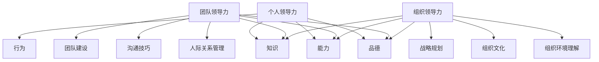

                 


# 领导力修炼手册：从销售新星到管理者的逆袭宝典

## 关键词
领导力、销售、管理者、逆袭、成长、策略、技巧、自我提升

## 摘要
本文旨在为销售领域的从业者提供一份全面而实用的领导力修炼手册。从销售新星到管理者的蜕变并非易事，但通过系统化的学习和实践，可以掌握领导力的核心要素和实战技巧，实现职业的逆袭。本文将分为三个部分，分别从领导力基础理论、实战技巧和个人成长维度进行深入探讨，旨在帮助读者构建扎实的领导力基础，提升个人能力和团队绩效，最终实现职业成功。

## 目录大纲

### 第一部分：领导力基础理论

#### 第1章：领导力的定义与作用
- **1.1 领导力的基本概念**
- **1.2 领导力的重要性**
- **1.3 领导力的影响因素**

#### 第2章：领导力的核心要素
- **2.1 人际关系管理**
- **2.2 沟通技巧**
- **2.3 决策能力**

#### 第3章：领导力的发展路径
- **3.1 销售新星到管理者的转变**
- **3.2 管理层级与角色定位**
- **3.3 领导力发展的持续学习**

### 第二部分：实战技巧

#### 第4章：销售团队的组建与运营
- **4.1 团队组建策略**
- **4.2 团队激励机制**
- **4.3 团队管理实践**

#### 第5章：提升个人销售业绩
- **5.1 销售技巧提升**
- **5.2 客户关系管理**
- **5.3 销售目标设定与达成**

#### 第6章：领导力在销售团队中的应用
- **6.1 领导力在销售中的体现**
- **6.2 如何运用领导力提升团队士气**
- **6.3 领导者如何应对挑战**

### 第三部分：领导力修炼与自我提升

#### 第7章：领导力修炼的五个维度
- **7.1 自我认知与自我提升**
- **7.2 情绪管理**
- **7.3 时间管理**
- **7.4 持续学习**
- **7.5 社交技巧**

#### 第8章：管理者的逆袭之道
- **8.1 如何应对职业瓶颈**
- **8.2 职业发展规划**
- **8.3 成功逆袭的案例分析**

#### 第9章：领导力与个人成长
- **9.1 领导力对个人成长的影响**
- **9.2 个人成长对领导力的反哺**
- **9.3 如何实现领导力与个人成长的共赢**

## 附录

### 附录A：领导力相关工具与资源
- **A.1 领导力评估工具**
- **A.2 领导力书籍推荐**
- **A.3 领导力培训课程推荐**

---

### 第一部分：领导力基础理论

#### 第1章：领导力的定义与作用

**1.1 领导力的基本概念**

领导力，是一个多维度的概念，它不仅涉及到个人能力的发挥，更是一个组织、团队和个体之间相互作用的过程。根据不同的学科背景，领导力可以有多种定义，但普遍认为它是一种影响他人实现共同目标的能力。

首先，我们可以从领导者的角色出发，将领导力划分为三个层次：

1. **个人领导力**：主要指领导者个人的品德、能力、知识和行为。个人领导力强调领导者自身的素养和自我管理能力。
2. **团队领导力**：涉及领导者如何引导和协调团队，使团队成员共同协作，实现团队目标。团队领导力强调领导者的人际关系管理、沟通技巧和团队建设能力。
3. **组织领导力**：关注领导者如何影响整个组织，促进组织文化、战略和绩效的提升。组织领导力强调领导者对组织环境的理解和适应能力。

接下来，我们可以通过Mermaid流程图来展示领导力涉及的要素和层次：



**1.2 领导力的重要性**

领导力的重要性不容忽视。它不仅对个人的职业发展至关重要，还对团队和组织的绩效产生深远的影响。

首先，对于个人而言，领导力是职业成功的关键因素。具备强大领导力的人往往能够在职场中脱颖而出，获得更多的机会和资源。

其次，对于团队而言，领导力是推动团队协作、提高团队绩效的核心动力。一个优秀的领导者能够激发团队成员的潜力，建立高效的团队文化，从而实现团队的共同目标。

最后，对于组织而言，领导力是组织发展的关键。领导者不仅需要具备战略眼光和决策能力，还需要能够推动组织变革和创新，以适应快速变化的市场环境。

举例来说，乔布斯作为苹果公司的创始人之一，凭借其卓越的领导力，成功引领苹果公司走出了低谷，推出了众多颠覆性的产品，使苹果成为全球科技巨头。

**1.3 领导力的影响因素**

领导力的发挥受到多种因素的影响，包括个人因素、环境和情境因素。

**个人因素**主要包括：

1. **自我认知**：领导者需要清楚自己的优势和劣势，不断进行自我提升。
2. **情商**：领导者需要具备较高的情商，能够理解和管理自己的情绪，以及理解和影响他人的情绪。
3. **决策能力**：领导者需要能够快速做出明智的决策，并承担相应的责任。

**环境因素**主要包括：

1. **组织文化**：领导者需要适应和推动组织文化的变革，以促进组织的健康发展。
2. **市场环境**：领导者需要理解和适应市场环境的变化，制定相应的战略和策略。
3. **资源**：领导者需要合理利用组织的资源，以实现组织的目标。

在具体情境下，领导力的影响因素会发生变化。例如，在危机情境下，领导者的决策能力和情绪管理能力尤为重要。而在日常运营中，团队建设和管理技巧则更为关键。

通过以上对领导力定义、重要性以及影响因素的探讨，我们可以为后续章节的深入分析打下坚实的基础。在接下来的章节中，我们将进一步探讨领导力的核心要素、发展路径以及实战技巧，帮助销售领域的从业者实现从销售新星到管理者的成功逆袭。

---

#### 第2章：领导力的核心要素

**2.1 人际关系管理**

人际关系管理是领导力的核心要素之一。一个优秀的领导者必须具备良好的人际关系管理能力，能够有效地建立和维护与团队成员、客户以及其他利益相关者的关系。

**人际关系管理的策略：**

1. **建立信任**：信任是人际关系的基石。领导者需要通过诚实、透明和一致性来建立信任，使团队成员和客户对领导者产生信任感。
2. **倾听和沟通**：领导者需要具备良好的倾听和沟通技巧，能够理解他人的需求和期望，并有效地传达自己的观点和决策。
3. **冲突解决**：在人际关系中，冲突是不可避免的。领导者需要能够识别和解决冲突，以维护和谐的工作环境。

**人际关系管理的伪代码：**

```plaintext
function manage人际关系（人员A，人员B） {
    if（建立信任（人员A，人员B）） {
        if（倾听和沟通（人员A，人员B）） {
            if（解决冲突（人员A，人员B）） {
                return "人际关系管理成功"
            } else {
                return "存在未解决的冲突"
            }
        } else {
            return "沟通技巧不足"
        }
    } else {
        return "信任未建立"
    }
}
```

**数学模型和公式：**

人际关系管理的有效性可以通过以下公式进行评估：

```latex
E = f(Trust, Communication, Conflict\_Resolution)
```

其中，E 表示人际关系管理的有效性，Trust 表示信任程度，Communication 表示沟通效率，Conflict\_Resolution 表示冲突解决能力。

**详细讲解和举例说明：**

在实际工作中，人际关系管理的重要性不言而喻。以下是一个具体案例：

某公司销售团队经理李明，他非常重视人际关系管理。他首先通过定期与团队成员交流，了解他们的需求和期望，并针对问题提供解决方案。在处理团队成员之间的冲突时，李明总是能够冷静分析，找到根本原因，并采取有效措施进行调解。通过这些措施，李明成功地建立了良好的团队关系，提高了团队的整体绩效。

**2.2 沟通技巧**

沟通技巧是领导者必须掌握的核心要素之一。有效的沟通能够确保信息准确传达，减少误解和冲突，提高团队协作效率。

**沟通技巧的要素：**

1. **明确目标**：在沟通前，领导者需要明确沟通的目标和预期结果，确保沟通具有针对性。
2. **倾听和反馈**：领导者需要积极倾听他人的意见，并提供及时的反馈，以促进双向沟通。
3. **清晰表达**：领导者需要能够清晰、准确地表达自己的观点和决策，避免信息传达失误。

**沟通技巧的伪代码：**

```plaintext
function communicate（信息，接收者） {
    if（明确目标（信息）） {
        if（倾听和反馈（接收者）） {
            if（清晰表达（信息）） {
                return "沟通成功"
            } else {
                return "表达不清"
            }
        } else {
            return "反馈不足"
        }
    } else {
        return "目标不明确"
    }
}
```

**数学模型和公式：**

沟通的有效性可以通过以下公式进行评估：

```latex
E = f(Target\_Clarity, Feedback, Expression\_Clarity)
```

其中，E 表示沟通的有效性，Target\_Clarity 表示目标明确程度，Feedback 表示反馈效率，Expression\_Clarity 表示表达清晰度。

**详细讲解和举例说明：**

有效的沟通对于领导者至关重要。以下是一个具体案例：

某公司销售总监王总在一次团队会议上，针对一项重要决策与团队成员进行沟通。他在会议前明确了沟通的目标，即传达决策并征询团队成员的意见。在会议中，王总积极倾听团队成员的意见，并及时给予反馈，使团队成员感到被尊重和重视。同时，他通过清晰、准确的表达，确保了信息传达的准确性。最终，会议达到了预期效果，团队成员对决策表示了支持。

**2.3 决策能力**

决策能力是领导力的核心要素之一。领导者需要能够在复杂和不确定的环境中做出明智的决策，以实现组织的长期目标。

**决策能力的要素：**

1. **信息收集**：领导者需要广泛收集相关信息，包括市场动态、竞争对手情况、团队成员意见等。
2. **风险评估**：领导者需要对决策可能带来的风险进行评估，并制定相应的应对措施。
3. **果断行动**：领导者需要能够在评估后果断行动，并承担决策带来的后果。

**决策能力的伪代码：**

```plaintext
function makeDecision（信息，风险） {
    if（收集信息（信息）） {
        if（评估风险（风险）） {
            if（果断行动（决策）） {
                return "决策成功"
            } else {
                return "行动犹豫"
            }
        } else {
            return "风险未评估"
        }
    } else {
        return "信息不足"
    }
}
```

**数学模型和公式：**

决策能力可以通过以下公式进行评估：

```latex
D = f(Information\_Collection, Risk\_Assessment, Action\_Boldness)
```

其中，D 表示决策能力，Information\_Collection 表示信息收集能力，Risk\_Assessment 表示风险评估能力，Action\_Boldness 表示行动果断程度。

**详细讲解和举例说明：**

决策能力在领导者的日常工作中至关重要。以下是一个具体案例：

某公司面临一项重要决策，是否进入一个新兴市场。销售经理张明通过广泛收集市场信息，分析竞争对手的情况，并听取团队成员的意见。他评估了进入市场的风险，并制定了相应的应对策略。在经过充分评估后，张明果断做出了进入市场的决策，并带领团队实施。最终，该决策取得了成功，使公司在新兴市场取得了良好的业绩。

通过以上对人际关系管理、沟通技巧和决策能力三个核心要素的详细讲解，我们可以看到，领导力并非单方面的能力，而是多个要素相互作用的结果。在接下来的章节中，我们将进一步探讨领导力的发展路径，帮助销售领域的从业者实现从销售新星到管理者的成功逆袭。

---

#### 第3章：领导力的发展路径

**3.1 销售新星到管理者的转变**

从销售新星到管理者的转变是职业发展的重要阶段。这一转变不仅要求个人在销售技能上的持续提升，更要求在领导力方面的深入修炼。以下将从几个关键步骤和挑战进行详细探讨。

**关键步骤：**

1. **技能提升**：销售新星需要通过不断的学习和实践，提升自己的销售技能，包括产品知识、沟通技巧、谈判策略等。
2. **经验积累**：通过实际销售工作，积累丰富的经验，了解客户需求和市场动态，提升解决问题的能力。
3. **自我管理**：销售新星需要学会自我管理，包括时间管理、情绪管理和目标设定，以应对销售工作中的各种挑战。
4. **团队协作**：销售新星需要逐步培养团队协作能力，学会如何与团队成员共同完成任务，提高团队绩效。

**挑战：**

1. **角色转变**：从销售人员到管理者的角色转变，需要适应新的职责和期望，处理好个人与团队之间的关系。
2. **领导力提升**：管理者需要不断提升自己的领导力，包括人际关系管理、沟通技巧和决策能力，以更好地带领团队。
3. **平衡工作与生活**：作为管理者，需要在工作中投入更多的时间和精力，同时还要平衡好工作与生活，避免因工作压力而影响个人健康和家庭生活。

**具体案例分析：**

以李强为例，他是一名有着多年销售经验的销售人员，在积累了丰富的销售经验和技能后，他决定晋升为销售经理。在角色的转变过程中，李强面临了以下挑战：

- **角色转变**：从个人销售到团队管理，李强需要适应新的职责，学会如何协调和管理团队成员，提高团队整体绩效。
- **领导力提升**：李强意识到自己需要进一步提升领导力，他通过参加培训课程和阅读相关书籍，学习人际关系管理、沟通技巧和决策能力，不断提升自己的领导力。
- **工作与生活的平衡**：作为销售经理，李强需要投入更多的时间和精力在工作上，但他也意识到家庭的重要性，他通过制定合理的工作计划和时间管理技巧，努力在工作和生活之间找到平衡。

最终，李强成功地克服了这些挑战，成为了一名优秀的销售经理。他的成功经验为其他销售领域的从业者提供了宝贵的参考。

**3.2 管理层级与角色定位**

在领导力的发展路径中，了解不同管理层级和角色定位是至关重要的。不同的管理层级和角色对领导力提出了不同的要求。

1. **初级管理者**：主要职责是执行上级的决策，协调团队成员的工作，确保任务按时完成。初级管理者需要具备良好的执行力和团队协作能力。
2. **中级管理者**：主要职责是制定团队的工作计划和目标，监控团队绩效，提供团队成员所需的资源和支持。中级管理者需要具备较强的沟通技巧和决策能力。
3. **高级管理者**：主要职责是制定公司的战略和方向，管理高层团队，推动公司整体发展。高级管理者需要具备战略眼光和全局思维，以及卓越的领导力和决策能力。

**管理层级的角色定位伪代码：**

```plaintext
function roleDefinition（层级） {
    if（层级 == 初级） {
        return "执行上级决策，协调团队成员工作"
    } else if（层级 == 中级） {
        return "制定团队工作计划和目标，监控团队绩效"
    } else if（层级 == 高级） {
        return "制定公司战略和方向，管理高层团队"
    } else {
        return "未定义的层级"
    }
}
```

**3.3 领导力发展的持续学习**

领导力的发展不是一蹴而就的，而是一个持续学习和提升的过程。以下是一些持续学习的建议：

1. **阅读书籍和文章**：通过阅读相关书籍和文章，了解最新的领导力理论和实践方法。
2. **参加培训课程**：参加专业的领导力培训课程，学习实践中的领导力技巧和策略。
3. **反思和实践**：通过反思自己的领导行为，总结经验和教训，并在实践中不断改进。
4. **建立人际关系网络**：与同行建立良好的关系，分享经验和资源，互相学习。

**数学模型和公式：**

领导力发展的持续学习可以通过以下公式进行评估：

```latex
L = f(Reading, Training, Reflection, Networking)
```

其中，L 表示领导力水平，Reading 表示阅读量，Training 表示培训次数，Reflection 表示反思次数，Networking 表示人际关系网络质量。

通过以上对领导力发展路径的探讨，我们可以看到，从销售新星到管理者的转变是一个复杂而充满挑战的过程。但通过持续学习和实践，销售领域的从业者可以不断提升自己的领导力，实现职业的逆袭。在接下来的章节中，我们将进一步探讨销售团队的组建与运营、个人销售业绩的提升以及领导力在销售团队中的应用，帮助读者在实战中提升领导力。

---

#### 第4章：销售团队的组建与运营

**4.1 团队组建策略**

组建一个高效的销售团队是提升整体销售绩效的关键。以下从团队组建策略、团队激励机制和团队管理实践三个方面进行详细探讨。

**1. 团队组建策略**

- **明确团队目标**：团队组建的首要任务是明确团队的目标，确保所有团队成员都朝着共同的目标努力。可以通过制定团队使命、愿景和目标来实现。
- **选拔合适的人才**：根据团队目标，选拔具备相应技能和素质的人才。在选择团队成员时，不仅要考虑其专业技能，还要注重其沟通能力、团队合作精神和领导潜力。
- **合理配置角色**：根据团队成员的技能和特长，合理分配角色，确保每个角色都有明确的职责和权限。例如，可以将团队成员分为销售员、客户关系管理专员、市场推广专员等。

**团队组建策略的伪代码：**

```plaintext
function buildTeam（目标，人才，角色） {
    if（明确目标（目标）） {
        if（选拔人才（人才）） {
            if（配置角色（角色）） {
                return "团队组建成功"
            } else {
                return "角色配置不当"
            }
        } else {
            return "人才选拔不当"
        }
    } else {
        return "目标不明确"
    }
}
```

- **建立有效的沟通机制**：建立有效的沟通机制，确保团队成员之间能够及时、准确地沟通。可以通过定期会议、团队邮件、即时通讯工具等方式实现。

**2. 团队激励机制**

- **制定合理的激励机制**：制定合理的激励机制，包括物质激励和非物质激励。物质激励可以通过奖金、提成等方式实现，非物质激励可以通过表彰、晋升等方式实现。
- **公正的评估体系**：建立公正的评估体系，确保激励机制能够公平、有效地实施。评估体系应包括个人绩效评估、团队绩效评估等。
- **反馈与改进**：定期收集团队成员的反馈，了解激励机制的执行效果，并根据反馈进行改进。

**团队激励机制的伪代码：**

```plaintext
function incentiveMechanism（评估体系，反馈） {
    if（建立评估体系（评估体系）） {
        if（收集反馈（反馈）） {
            if（改进机制（反馈）） {
                return "激励机制有效"
            } else {
                return "机制改进不足"
            }
        } else {
            return "反馈不足"
        }
    } else {
        return "评估体系不完善"
    }
}
```

- **激励与约束相结合**：在实施激励机制的同时，也要注意约束机制，确保团队成员在追求绩效的同时，遵守公司规定和职业道德。

**3. 团队管理实践**

- **有效的领导**：团队领导者需要具备良好的领导能力，能够引导和激励团队成员，提升团队士气。领导者的领导风格应与团队成员的期望和需求相匹配。
- **合理的资源分配**：根据团队目标和任务，合理分配资源，确保团队成员能够获得所需的资源和支持，以提高工作效率。
- **持续培训与发展**：定期对团队成员进行培训和发展，提升其技能和知识水平，以适应市场变化和公司发展的需要。

**团队管理实践的伪代码：**

```plaintext
function teamManagement（领导，资源，培训） {
    if（有效领导（领导）） {
        if（合理资源分配（资源）） {
            if（持续培训（培训）） {
                return "团队管理有效"
            } else {
                return "培训不足"
            }
        } else {
            return "资源分配不合理"
        }
    } else {
        return "领导不足"
    }
}
```

**具体案例分析：**

某公司销售团队在组建初期，由于缺乏明确的团队目标和合理的激励机制，导致团队士气低落，销售业绩不佳。后来，团队领导决定采取以下措施进行改进：

- **明确团队目标**：制定明确的团队使命、愿景和目标，确保所有团队成员都清楚团队的目标和方向。
- **选拔合适的人才**：重新审视团队成员，选拔具备相应技能和潜力的成员，并明确各自的角色和职责。
- **制定合理的激励机制**：建立公正的评估体系，根据团队成员的绩效给予合理的奖励，包括奖金、晋升机会等。
- **有效的领导**：团队领导通过定期与团队成员沟通，了解团队成员的需求和问题，提供必要的支持和帮助，提升团队士气。
- **持续培训与发展**：定期对团队成员进行销售技巧、产品知识等方面的培训，提升团队成员的能力。

通过以上措施，该销售团队在短时间内取得了显著的成绩，销售业绩大幅提升。这一案例充分说明了销售团队组建与运营的关键要素。

---

#### 第5章：提升个人销售业绩

**5.1 销售技巧提升**

提升个人销售业绩是每一个销售人员的重要任务。以下从销售技巧提升、客户关系管理和销售目标设定与达成三个方面进行详细探讨。

**1. 销售技巧提升**

- **产品知识**：销售人员需要深入了解所销售的产品或服务的特性、优势和应用场景，以便在销售过程中能够准确、专业地回答客户的问题。
- **沟通技巧**：良好的沟通技巧是销售人员必备的能力，包括倾听、提问、表达和说服技巧。通过有效的沟通，销售人员能够更好地理解客户需求，建立信任关系。
- **谈判技巧**：谈判技巧是销售过程中必不可少的一部分，包括价格谈判、条款谈判和条件谈判。销售人员需要掌握谈判的策略和技巧，以达成双方满意的协议。
- **情感管理**：在销售过程中，销售人员需要具备良好的情感管理能力，包括情绪控制、同理心和积极态度。通过情感管理，销售人员能够更好地应对客户的各种情绪反应，提高成交率。

**销售技巧提升的伪代码：**

```plaintext
function improveSalesSkills（产品知识，沟通技巧，谈判技巧，情感管理） {
    if（掌握产品知识（产品知识）） {
        if（提升沟通技巧（沟通技巧）） {
            if（掌握谈判技巧（谈判技巧）） {
                if（情感管理提升（情感管理）） {
                    return "销售技巧提升成功"
                } else {
                    return "情感管理不足"
                }
            } else {
                return "谈判技巧不足"
            }
        } else {
            return "沟通技巧不足"
        }
    } else {
        return "产品知识不足"
    }
}
```

**2. 客户关系管理**

- **客户档案管理**：销售人员需要建立完善的客户档案，记录客户的基本信息、购买历史、需求和反馈等，以便在后续的销售过程中能够更好地了解和满足客户需求。
- **客户沟通**：通过定期与客户沟通，了解客户的需求变化、市场动态和竞争情况，及时调整销售策略。
- **客户关怀**：在销售过程中，除了关注客户的购买需求，还要关注客户的情感需求，提供个性化的服务，建立长期稳定的合作关系。
- **客户反馈**：积极收集客户的反馈意见，了解客户对产品和服务的满意度，不断改进和优化。

**客户关系管理的伪代码：**

```plaintext
function manageCustomerRelations（客户档案管理，客户沟通，客户关怀，客户反馈） {
    if（建立客户档案（客户档案管理）） {
        if（定期沟通（客户沟通）） {
            if（提供关怀（客户关怀）） {
                if（收集反馈（客户反馈）） {
                    return "客户关系管理成功"
                } else {
                    return "反馈收集不足"
                }
            } else {
                return "关怀不足"
            }
        } else {
            return "沟通不足"
        }
    } else {
        return "档案管理不足"
    }
}
```

**3. 销售目标设定与达成**

- **目标设定**：销售人员需要根据公司的战略目标和自身的实际情况，设定明确的销售目标。目标应具有明确性、可行性和挑战性，以激发销售人员的积极性。
- **目标分解**：将大目标分解为小目标，制定详细的行动计划，确保每个小目标都能够按时完成。
- **绩效监控**：通过定期监控销售绩效，了解目标的达成情况，及时调整销售策略和行动计划。
- **激励与反馈**：根据销售目标的达成情况，给予销售人员适当的激励和反馈，激发其工作动力。

**销售目标设定与达成的伪代码：**

```plaintext
function setAndAchieveSalesGoals（目标设定，目标分解，绩效监控，激励与反馈） {
    if（设定目标（目标设定）） {
        if（分解目标（目标分解）） {
            if（监控绩效（绩效监控）） {
                if（激励与反馈（激励与反馈）） {
                    return "销售目标达成"
                } else {
                    return "激励不足"
                }
            } else {
                return "绩效监控不足"
            }
        } else {
            return "目标分解不当"
        }
    } else {
        return "目标设定不当"
    }
}
```

**具体案例分析：**

以张华为例，他是一名经验丰富的销售人员。为了提升个人销售业绩，他采取了以下措施：

- **销售技巧提升**：他定期参加销售培训，提升自己的产品知识和沟通技巧，掌握谈判策略和情感管理方法。
- **客户关系管理**：他建立了完善的客户档案，定期与客户沟通，了解客户需求和市场动态，提供个性化的服务，建立长期合作关系。
- **销售目标设定与达成**：他根据公司的战略目标和自身的实际情况，设定了明确的销售目标，并将目标分解为小目标，制定了详细的行动计划。他通过定期监控销售绩效，及时调整销售策略和行动计划，最终成功达成销售目标。

通过以上措施，张华成功地提升了个人销售业绩，成为公司的销售冠军。这一案例充分说明了提升个人销售业绩的关键要素。

---

#### 第6章：领导力在销售团队中的应用

**6.1 领导力在销售中的体现**

领导力在销售中的应用体现在多个方面，包括领导力在销售过程中的体现、如何运用领导力提升团队士气以及领导者如何应对挑战。

**1. 领导力在销售中的体现**

- **目标导向**：领导者在销售过程中，需要明确团队的目标，并确保所有团队成员都理解并朝着共同的目标努力。
- **决策能力**：领导者在面对销售决策时，需要具备快速做出明智决策的能力，以应对市场变化和客户需求。
- **团队协作**：领导者需要促进团队成员之间的协作，建立良好的团队关系，以提高团队的整体绩效。
- **激励与支持**：领导者需要通过激励和支持，激发团队成员的积极性，帮助他们在面对挑战时保持积极心态。

**领导力在销售中的体现伪代码：**

```plaintext
function leadershipInSales（目标导向，决策能力，团队协作，激励与支持） {
    if（目标导向（目标导向）） {
        if（决策能力（决策能力）） {
            if（团队协作（团队协作）） {
                if（激励与支持（激励与支持）） {
                    return "领导力在销售中有效体现"
                } else {
                    return "激励与支持不足"
                }
            } else {
                return "团队协作不足"
            }
        } else {
            return "决策能力不足"
        }
    } else {
        return "目标导向不足"
    }
}
```

**2. 如何运用领导力提升团队士气**

- **建立共同愿景**：领导者需要与团队成员共同建立共同愿景，使团队成员明确团队的目标和价值，从而激发他们的工作热情。
- **激励与认可**：领导者需要通过激励和认可，激励团队成员的积极性，提高他们的工作动力。例如，通过表彰优秀员工、提供晋升机会等方式。
- **沟通与反馈**：领导者需要保持与团队成员的沟通，了解他们的需求和问题，并提供及时的反馈，以帮助他们改进和提升。
- **培养团队精神**：领导者需要通过团队建设活动，培养团队成员的团队精神，增强团队的凝聚力。

**如何运用领导力提升团队士气伪代码：**

```plaintext
function boostTeamSpirit（共同愿景，激励与认可，沟通与反馈，团队精神） {
    if（建立共同愿景（共同愿景）） {
        if（激励与认可（激励与认可）） {
            if（沟通与反馈（沟通与反馈）） {
                if（团队精神（团队精神）） {
                    return "团队士气提升成功"
                } else {
                    return "团队精神不足"
                }
            } else {
                return "沟通与反馈不足"
            }
        } else {
            return "激励与认可不足"
        }
    } else {
        return "共同愿景不足"
    }
}
```

**3. 领导者如何应对挑战**

- **保持冷静**：在面对挑战时，领导者需要保持冷静，避免情绪化，以做出明智的决策。
- **积极应对**：领导者需要积极寻找解决问题的方法，而不是回避问题。通过分析问题、制定解决方案并执行，领导者可以有效地应对挑战。
- **寻求支持**：领导者需要寻求团队和其他利益相关者的支持，共同面对挑战。通过建立良好的人际关系网络，领导者可以获取更多的资源和信息。
- **持续学习**：领导者需要持续学习，提升自己的能力和知识，以更好地应对未来的挑战。

**领导者如何应对挑战伪代码：**

```plaintext
function handleChallenges（保持冷静，积极应对，寻求支持，持续学习） {
    if（保持冷静（保持冷静）） {
        if（积极应对（积极应对）） {
            if（寻求支持（寻求支持）） {
                if（持续学习（持续学习）） {
                    return "挑战应对成功"
                } else {
                    return "持续学习不足"
                }
            } else {
                return "寻求支持不足"
            }
        } else {
            return "积极应对不足"
        }
    } else {
        return "保持冷静不足"
    }
}
```

**具体案例分析：**

以李总为例，他是一名资深销售团队的领导者。在一次市场变动中，公司面临了巨大的销售压力。李总采取了以下措施：

- **目标导向**：李总明确了团队的目标，并与团队成员共同制定了详细的销售计划。
- **决策能力**：在面对市场变化时，李总迅速做出了调整销售策略的决策，以应对市场挑战。
- **团队协作**：李总通过团队建设活动，增强了团队成员之间的协作，提高了团队的整体绩效。
- **激励与认可**：李总通过表彰优秀员工、提供晋升机会等方式，激励了团队成员的积极性。
- **沟通与反馈**：李总定期与团队成员沟通，了解他们的需求和问题，并提供及时的反馈。

通过以上措施，李总成功地带领团队度过了市场挑战，实现了销售目标的达成。这一案例充分说明了领导力在销售团队中的应用和重要性。

---

#### 第7章：领导力修炼的五个维度

**7.1 自我认知与自我提升**

自我认知与自我提升是领导力修炼的基础。一个优秀的领导者首先需要清楚自己的优点和不足，并通过持续的学习和实践来不断提升自己的能力和素质。

**1. 自我认知**

- **反思与自我评估**：领导者需要定期反思自己的行为和决策，进行自我评估，了解自己的优点和不足。
- **倾听他人的反馈**：领导者需要倾听他人的意见和反馈，了解自己在外人眼中的形象和表现。
- **了解自身的价值观和信念**：领导者需要明确自己的价值观和信念，确保在决策和行为中始终坚持自己的原则。

**自我认知的伪代码：**

```plaintext
function selfAwareness（反思，评估，反馈，价值观） {
    if（反思行为（反思）） {
        if（评估表现（评估）） {
            if（倾听反馈（反馈）） {
                if（了解价值观（价值观）） {
                    return "自我认知成功"
                } else {
                    return "价值观不明"
                }
            } else {
                return "反馈不足"
            }
        } else {
            return "评估不足"
        }
    } else {
        return "反思不足"
    }
}
```

**2. 自我提升**

- **持续学习**：领导者需要不断学习新的知识和技能，以适应不断变化的环境和需求。
- **实践与经验**：领导者需要通过实践和积累经验来提升自己的能力，将理论知识转化为实际操作。
- **寻求指导与反馈**：领导者可以寻求导师或教练的指导，以及团队成员的反馈，以更好地提升自己。

**自我提升的伪代码：**

```plaintext
function selfImprovement（学习，实践，指导，反馈） {
    if（持续学习（学习）） {
        if（实践经验（实践）） {
            if（寻求指导（指导）） {
                if（获取反馈（反馈）） {
                    return "自我提升成功"
                } else {
                    return "反馈不足"
                }
            } else {
                return "指导不足"
            }
        } else {
            return "实践不足"
        }
    } else {
        return "学习不足"
    }
}
```

**7.2 情绪管理**

情绪管理是领导者必须掌握的一项关键技能。一个优秀的领导者能够有效管理自己的情绪，保持冷静和理性，从而更好地应对各种挑战和压力。

**1. 情绪识别**

- **自我觉察**：领导者需要学会识别自己的情绪，了解情绪产生的原因。
- **倾听他人的情绪**：领导者需要学会倾听他人的情绪，理解他人的感受。

**情绪识别的伪代码：**

```plaintext
function emotionIdentification（自我觉察，倾听他人） {
    if（自我觉察（自我觉察）） {
        if（倾听他人（倾听他人）） {
            return "情绪识别成功"
        } else {
            return "倾听他人不足"
        }
    } else {
        return "自我觉察不足"
    }
}
```

**2. 情绪调节**

- **深呼吸和放松**：领导者可以通过深呼吸和放松技巧来缓解紧张和压力。
- **积极思考**：领导者需要学会用积极的心态看待问题，避免消极情绪的影响。
- **寻求支持**：领导者可以寻求家人、朋友或专业人士的支持，以帮助自己管理情绪。

**情绪调节的伪代码：**

```plaintext
function emotionRegulation（深呼吸，积极思考，寻求支持） {
    if（深呼吸（深呼吸）） {
        if（积极思考（积极思考）） {
            if（寻求支持（寻求支持）） {
                return "情绪调节成功"
            } else {
                return "寻求支持不足"
            }
        } else {
            return "积极思考不足"
        }
    } else {
        return "深呼吸不足"
    }
}
```

**7.3 时间管理**

时间管理是领导者必须掌握的另一项关键技能。一个优秀的领导者能够合理安排时间，提高工作效率，从而更好地实现个人和团队的目标。

**1. 制定计划**

- **目标明确**：领导者需要明确自己的目标，并根据目标制定详细的行动计划。
- **优先级排序**：领导者需要根据任务的紧急程度和重要性进行优先级排序，确保重要任务得到优先处理。

**制定计划的伪代码：**

```plaintext
function timeManagement（目标明确，优先级排序） {
    if（目标明确（目标明确）） {
        if（优先级排序（优先级排序）） {
            return "制定计划成功"
        } else {
            return "优先级排序不当"
        }
    } else {
        return "目标不明确"
    }
}
```

**2. 执行与监控**

- **执行计划**：领导者需要按照制定的计划执行任务，确保任务的按时完成。
- **监控进度**：领导者需要定期监控任务的进度，了解任务的完成情况，并根据实际情况进行调整。

**执行与监控的伪代码：**

```plaintext
function executeAndMonitor（执行计划，监控进度） {
    if（执行计划（执行计划）） {
        if（监控进度（监控进度）） {
            return "执行与监控成功"
        } else {
            return "监控进度不足"
        }
    } else {
        return "执行计划不足"
    }
}
```

**7.4 持续学习**

持续学习是领导者保持竞争力的关键。一个优秀的领导者需要不断学习新的知识和技能，以适应快速变化的环境和需求。

**1. 选择学习资源**

- **书籍和文章**：领导者可以通过阅读书籍和文章来获取新的知识和见解。
- **在线课程和培训**：领导者可以参加在线课程和培训，提升自己的专业能力和技能。
- **实践经验**：领导者可以通过实际操作和项目经验来提升自己的能力和知识。

**选择学习资源的伪代码：**

```plaintext
function chooseLearningResources（书籍，文章，在线课程，实践） {
    if（选择书籍（书籍）） {
        if（选择文章（文章）） {
            if（选择在线课程（在线课程）） {
                if（选择实践（实践）） {
                    return "学习资源选择成功"
                } else {
                    return "实践不足"
                }
            } else {
                return "在线课程不足"
            }
        } else {
            return "文章不足"
        }
    } else {
        return "书籍不足"
    }
}
```

**2. 学习方法**

- **主动学习**：领导者需要主动学习，积极参与讨论和互动，提高学习效果。
- **实践应用**：领导者需要将学习到的知识和技能应用到实际工作中，以提升自己的能力和绩效。
- **反思与总结**：领导者需要定期反思自己的学习过程，总结经验和教训，不断提高学习效果。

**学习方法的伪代码：**

```plaintext
function learningMethods（主动学习，实践应用，反思总结） {
    if（主动学习（主动学习）） {
        if（实践应用（实践应用）） {
            if（反思总结（反思总结）） {
                return "学习方法有效"
            } else {
                return "反思总结不足"
            }
        } else {
            return "实践应用不足"
        }
    } else {
        return "主动学习不足"
    }
}
```

**7.5 社交技巧**

社交技巧是领导者必须掌握的另一项关键技能。一个优秀的领导者需要具备良好的社交技巧，能够建立和维护良好的人际关系。

**1. 建立信任**

- **诚实与透明**：领导者需要以诚实和透明的方式与他人交流，建立信任。
- **倾听与尊重**：领导者需要倾听他人的意见和需求，尊重他人的观点和感受。

**建立信任的伪代码：**

```plaintext
function buildTrust（诚实透明，倾听尊重） {
    if（诚实透明（诚实透明）） {
        if（倾听尊重（倾听尊重）） {
            return "建立信任成功"
        } else {
            return "倾听尊重不足"
        }
    } else {
        return "诚实透明不足"
    }
}
```

**2. 沟通与协调**

- **有效沟通**：领导者需要具备有效的沟通技巧，能够清晰、准确地传达信息。
- **协调合作**：领导者需要协调不同部门和团队之间的合作，确保任务的顺利进行。

**沟通与协调的伪代码：**

```plaintext
function communicationAndCoordination（有效沟通，协调合作） {
    if（有效沟通（有效沟通）） {
        if（协调合作（协调合作）） {
            return "沟通与协调成功"
        } else {
            return "协调合作不足"
        }
    } else {
        return "有效沟通不足"
    }
}
```

通过以上对领导力修炼的五个维度的详细探讨，我们可以看到，自我认知与自我提升、情绪管理、时间管理、持续学习和社交技巧是领导力修炼的重要方面。这些维度相互关联，共同构成了一个完整的领导力体系。通过不断修炼和完善这些维度，领导者可以提升自己的领导力水平，更好地应对职场挑战，实现个人和团队的目标。

---

#### 第8章：管理者的逆袭之道

**8.1 如何应对职业瓶颈**

职业瓶颈是许多管理者在职业发展中不可避免的一个阶段。在这个阶段，管理者可能会感到自己的能力和成长速度放缓，职业发展陷入停滞。以下是一些应对职业瓶颈的策略：

**1. 重新评估职业目标**

首先，管理者需要重新评估自己的职业目标。有时候，职业瓶颈的出现是因为目标设定不准确或不清晰。管理者可以审视自己的长期目标和短期目标，确保它们与个人的兴趣、能力和市场需求相匹配。

**2. 拓展技能和知识**

为了突破职业瓶颈，管理者需要不断拓展自己的技能和知识。可以通过参加培训课程、阅读专业书籍、参加行业会议等方式，提升自己的专业素养和行业洞察力。特别是那些涉及跨领域知识和技能的课程，如项目管理、财务管理等，可以帮助管理者拓宽视野，提升综合素质。

**3. 寻求外部指导**

管理者可以寻求外部指导，如咨询顾问、行业导师或职业教练。这些专业人士可以提供专业的建议和指导，帮助管理者找到职业发展的新方向和解决方案。同时，与外部专家的交流还可以拓展管理者的人脉网络，为未来的职业发展提供更多的机会。

**4. 接受新挑战**

管理者需要勇于接受新的挑战，主动寻求新的项目和机会。通过承担新的职责和挑战，管理者可以积累更多的经验，提升自己的能力和信心。例如，可以主动申请负责新的项目或团队，或者尝试担任临时性或跨部门的职务，这些经历都会为职业发展带来新的契机。

**5. 反思和调整**

管理者需要定期反思自己的职业发展过程，总结经验和教训，找出瓶颈产生的原因，并做出相应的调整。通过反思和调整，管理者可以更好地理解自己的优势和不足，为未来的职业发展制定更明确的计划。

**数学模型和公式：**

职业瓶颈的应对可以通过以下公式进行评估：

```latex
S = f(目标评估，技能拓展，外部指导，新挑战，反思调整)
```

其中，S 表示职业发展的速度，目标评估、技能拓展、外部指导、新挑战和反思调整分别表示对应的策略。

**具体案例分析：**

李华是一名资深项目经理，他在公司的项目管理岗位上工作了多年。随着时间的推移，他感到自己的职业发展逐渐放缓，面临职业瓶颈。为了应对这一挑战，李华采取了以下措施：

1. **重新评估职业目标**：李华重新审视了自己的职业目标，发现自己对项目管理领域有了更深的兴趣，并希望成为该领域的专家。

2. **拓展技能和知识**：李华参加了项目管理相关的培训课程，学习了新的项目管理工具和技术，还阅读了多本项目管理专业书籍，提升了自己的专业素养。

3. **寻求外部指导**：李华主动联系了一位在项目管理领域有丰富经验的行业导师，定期向导师请教问题，获得了宝贵的建议和指导。

4. **接受新挑战**：李华主动申请了一个新的项目，该项目涉及跨部门和跨文化的合作，需要管理多个团队。李华通过这个项目，积累了更多的项目管理经验，提升了自己的领导力和沟通能力。

5. **反思和调整**：李华定期反思自己的工作表现，总结经验教训，并根据反馈进行调整。通过不断的反思和调整，李华不仅克服了职业瓶颈，还实现了职业发展的新突破。

**8.2 职业发展规划**

职业发展规划是管理者实现职业成功的关键。一个有效的职业发展规划可以帮助管理者明确职业目标，制定实现目标的步骤和策略。以下是一些制定职业发展规划的步骤：

**1. 确定长期目标和短期目标**

首先，管理者需要明确自己的长期和短期目标。长期目标通常是3-5年甚至更长时间的职业规划，而短期目标则是1年或更短的时间内的具体行动计划。长期目标应具有挑战性，而短期目标则应具有可执行性。

**2. 分析自身优势和不足**

管理者需要分析自己的优势和不足，明确自己的核心竞争力。优势可以帮助管理者在职业发展中脱颖而出，而不足则是需要改进和提升的地方。通过分析自身优势和不足，管理者可以制定更有针对性的职业发展规划。

**3. 制定实现目标的步骤**

根据长期和短期目标，管理者需要制定具体的实现步骤。这些步骤应包括需要完成的任务、所需的资源和时间安排。通过制定明确的步骤，管理者可以更好地监控自己的进展，并做出必要的调整。

**4. 制定行动计划**

在制定实现目标的步骤后，管理者需要将这些步骤转化为具体的行动计划。行动计划应包括具体的行动项目、责任人和时间表。通过制定行动计划，管理者可以确保目标的实现，并提高工作的效率。

**5. 定期评估和调整**

职业发展规划不是一成不变的，管理者需要定期评估自己的进展，并根据实际情况进行调整。通过定期评估和调整，管理者可以确保职业发展规划与个人的职业目标和发展环境相匹配。

**数学模型和公式：**

职业发展规划的制定可以通过以下公式进行评估：

```latex
P = f(长期目标，短期目标，优势分析，步骤制定，行动计划，评估调整)
```

其中，P 表示职业发展规划的有效性，长期目标、短期目标、优势分析、步骤制定、行动计划和评估调整分别表示对应的策略。

**具体案例分析：**

王明是一名营销经理，他希望在未来的五年内成为公司的高管。为了实现这一目标，他制定了以下职业发展规划：

1. **确定长期目标和短期目标**：王明的长期目标是成为公司的高管，短期目标是成为公司营销部门的总监。

2. **分析自身优势和不足**：王明通过自我评估，发现自己的优势包括优秀的市场洞察力、出色的沟通能力和丰富的管理经验，不足则是领导力的提升和跨部门协调能力。

3. **制定实现目标的步骤**：王明制定了以下步骤：首先，提升自己的领导力，参加领导力培训课程；其次，增强跨部门协调能力，主动参与公司其他部门的合作项目。

4. **制定行动计划**：王明将这些步骤转化为具体的行动计划，包括参加领导力培训课程、参与跨部门项目、定期与高管交流等。

5. **定期评估和调整**：王明每月评估自己的进展，并根据评估结果进行调整。例如，如果领导力培训效果不佳，他会考虑更换培训课程或寻求外部指导。

通过以上职业发展规划，王明逐步实现了自己的目标，成为了公司的高管。

**8.3 成功逆袭的案例分析**

以下将介绍几个成功逆袭的管理者案例，分析他们的成功经验和方法。

**案例一：张伟**

张伟是一名从基层销售员成长为公司总裁的典型例子。他的成功经验主要包括以下几点：

1. **不断学习和提升自我**：张伟在职业生涯的早期，通过自学和参加培训，不断提升自己的销售技能和管理能力。

2. **积极面对挑战**：在面临销售困难和压力时，张伟始终保持积极的态度，通过分析问题和寻找解决方案，成功应对挑战。

3. **建立良好的人际关系**：张伟重视与同事、上级和客户的沟通，建立了广泛的人际关系网络，这为他的职业发展提供了有力的支持。

4. **勇于承担责任**：张伟在担任更高职位时，勇于承担责任，主动承担重要项目，为公司创造了显著业绩。

**案例二：李娜**

李娜是一名从普通员工成长为部门经理的例子。她的成功经验主要包括以下几点：

1. **注重团队建设**：李娜在担任部门经理后，重视团队建设，通过定期的团队活动和沟通，增强了团队的凝聚力和工作效率。

2. **培养下属**：李娜关注下属的成长，提供培训和支持，帮助下属提升能力，从而提升整个团队的水平。

3. **善于沟通**：李娜具备良好的沟通技巧，能够有效地与上级和下属沟通，确保信息传达准确无误。

4. **灵活应对变化**：在面对市场变化和公司战略调整时，李娜能够迅速适应，制定新的计划和策略，确保团队的稳定发展。

**案例三：王鹏**

王鹏是一名从项目经理成长为公司副总裁的例子。他的成功经验主要包括以下几点：

1. **精通项目管理**：王鹏在职业生涯的早期，通过系统的学习和实践，精通项目管理的方法和技巧，成功完成了多个重要项目。

2. **善于领导**：王鹏在担任项目经理后，通过有效的领导和团队管理，提高了项目的完成质量和效率。

3. **跨部门协调**：王鹏具备较强的跨部门协调能力，能够有效地协调不同部门和团队之间的合作，确保项目的顺利进行。

4. **持续学习**：王鹏始终保持学习的态度，不断学习新的知识和技能，以适应快速变化的市场环境。

通过以上案例分析，我们可以看到，成功逆袭的管理者通常具备以下特点：

1. **持续学习和自我提升**：他们不断学习新的知识和技能，提升自己的专业能力和综合素质。

2. **积极面对挑战**：他们敢于面对困难和压力，通过分析和解决问题，提升自己的能力和绩效。

3. **建立良好的人际关系**：他们重视与同事、上级和客户的沟通，建立了广泛的人际关系网络。

4. **善于领导和管理**：他们具备有效的领导和管理能力，能够带领团队实现共同目标。

5. **灵活应对变化**：他们能够适应市场变化和公司战略调整，制定新的计划和策略，确保团队的稳定发展。

通过以上对职业瓶颈应对、职业发展规划以及成功逆袭案例的分析，我们可以看到，管理者在职业发展中需要不断学习和提升自我，积极面对挑战，建立良好的人际关系，并善于领导和应对变化。通过这些努力，管理者可以成功实现职业的逆袭，实现自己的职业目标。

---

#### 第9章：领导力与个人成长

**9.1 领导力对个人成长的影响**

领导力不仅是职业成功的关键，更是个人成长的重要推动力。一个具备强大领导力的人，不仅能够在职场中取得优异成绩，还能在个人生活中取得积极成果。

**1. 提升自信心**

领导力帮助个人提升自信心。通过有效的领导和决策，领导者能够在挑战和困难中展现自己的能力和价值，从而增强自信。这种自信心不仅体现在工作表现上，还能影响个人在社交、家庭和其他领域的表现。

**2. 培养解决问题的能力**

领导力要求领导者具备强大的问题解决能力。通过面对和解决各种复杂的问题，领导者不断提升自己的分析和解决问题的能力。这种能力不仅在职业生涯中至关重要，还能在个人生活中帮助应对各种挑战。

**3. 促进个人发展**

领导力的发展往往伴随着个人的成长。领导者需要不断学习新的知识和技能，提升自己的专业素养和领导能力。这一过程不仅促进了个人职业发展，还丰富了个人的人生经历和视野。

**4. 增强人际交往能力**

领导力强调人际关系的建立和维护。领导者需要具备良好的沟通技巧和人际关系管理能力，能够有效地与不同背景和性格的人打交道。这种能力不仅有助于职业成功，还能在个人生活中建立和谐的人际关系。

**数学模型和公式：**

领导力对个人成长的影响可以通过以下公式进行评估：

```latex
Growth = f(Confidence, Problem\_Solving, Personal\_Development, Interpersonal\_Skills)
```

其中，Growth 表示个人成长，Confidence 表示自信心，Problem\_Solving 表示解决问题的能力，Personal\_Development 表示个人发展，Interpersonal\_Skills 表示人际交往能力。

**具体案例分析：**

以李女士为例，她是一名具有多年销售和管理经验的职场女性。在职业生涯中，李女士通过不断学习和实践，提升了自己的领导力。以下是她领导力对个人成长的几个具体影响：

- **提升自信心**：在担任销售经理期间，李女士通过成功完成多个销售项目，积累了丰富的经验，这使她在面对新的挑战时更加自信。
- **培养解决问题的能力**：在面对市场变化和客户需求时，李女士能够迅速分析问题，制定解决方案，并带领团队有效执行。这种能力使她在工作中更加从容和高效。
- **促进个人发展**：李女士通过参加领导力培训课程，阅读相关书籍，不断学习新的知识和技能，提升了自己的专业素养和管理能力。
- **增强人际交往能力**：李女士注重与团队成员的沟通，建立了良好的团队关系。她通过有效的沟通技巧，赢得了同事和客户的尊重和信任。

**9.2 个人成长对领导力的反哺**

个人成长不仅能够提升领导力，还能通过一系列积极的反馈循环，进一步增强领导力。以下从几个方面探讨个人成长对领导力的反哺作用：

**1. 更广阔的视野**

个人成长使领导者具备更广阔的视野。通过不断学习和经历各种不同的情境，领导者能够更好地理解不同领域的知识和技能，从而在领导过程中能够更全面、更深入地考虑问题。

**2. 更丰富的经验**

个人成长积累了丰富的经验，这些经验对领导力的发展至关重要。领导者通过实践中的各种经历，不断总结和反思，提升自己的决策能力和应对复杂问题的能力。

**3. 更深厚的人际关系**

个人成长有助于建立更深厚的人际关系。领导者通过个人成长过程中的互动和沟通，积累了丰富的人际资源，这些资源在领导过程中可以帮助领导者更好地协调和管理团队。

**4. 更积极的思维方式**

个人成长塑造了领导者更积极的思维方式。通过不断学习和反思，领导者能够培养积极乐观的心态，在面对困难和挑战时保持坚定和自信。

**数学模型和公式：**

个人成长对领导力的反哺作用可以通过以下公式进行评估：

```latex
Leadership = f(Vision, Experience, Relationships, Mindset)
```

其中，Leadership 表示领导力，Vision 表示视野，Experience 表示经验，Relationships 表示人际关系，Mindset 表示思维方式。

**具体案例分析：**

以张先生为例，他是一名具有丰富管理经验的职场人士。在个人成长过程中，张先生通过不断学习和实践，取得了显著的成长，这些成长反过来进一步提升了他的领导力。

- **更广阔的视野**：张先生通过参加各种培训和项目，了解了不同领域的知识和技能，使他在领导过程中能够从更宏观的角度考虑问题，做出更明智的决策。
- **更丰富的经验**：张先生在职业生涯中经历了多个重要项目，积累了丰富的管理经验。这些经验使他在面对复杂情况时能够更加从容和有效。
- **更深厚的人际关系**：张先生注重与团队成员的沟通，建立了广泛的人际关系网络。这些人际关系在领导过程中为他提供了有力的支持和资源。
- **更积极的思维方式**：张先生通过不断学习和反思，培养了一种积极乐观的心态。这种心态使他在面对困难和挑战时能够保持积极和自信，带领团队共同克服困难。

**9.3 如何实现领导力与个人成长的共赢**

实现领导力与个人成长的共赢是每一个领导者的重要目标。以下是一些建议，帮助领导者实现这一目标：

**1. 持续学习**

领导者需要不断学习新的知识和技能，以适应不断变化的环境。通过参加培训课程、阅读专业书籍、参加行业会议等方式，领导者可以不断提升自己的专业素养和领导能力。

**2. 反思与总结**

领导者需要定期反思自己的工作和行为，总结经验和教训。通过反思，领导者可以更好地理解自己的优势和不足，为未来的发展提供指导。同时，反思还可以帮助领导者培养自我认知和自我提升的能力。

**3. 建立良好的人际关系**

领导者需要重视与团队成员、客户和其他利益相关者的沟通，建立良好的人际关系。通过有效的沟通和互动，领导者可以增强团队凝聚力，提升团队绩效。

**4. 积极面对挑战**

领导者需要积极面对各种挑战和困难，通过分析问题和寻找解决方案，提升自己的能力和信心。在挑战中成长，是领导者实现领导力与个人成长共赢的关键。

**5. 培养下属**

领导者需要关注下属的成长，提供培训和支持，帮助他们提升能力和绩效。通过培养下属，领导者不仅可以增强团队的凝聚力，还可以实现个人的职业发展。

通过以上措施，领导者可以逐步实现领导力与个人成长的共赢，为个人和团队创造更大的价值。

---

## 附录A：领导力相关工具与资源

领导力的发展需要系统的学习和实践，以下是一些领导力相关的工具和资源，供读者参考和借鉴。

### A.1 领导力评估工具

**1. 领导力自我评估问卷**：通过一系列问题，帮助领导者评估自己在各个领导力维度上的表现。
**2. 领导力360度评估**：通过多个角度收集他人对领导者的评价，提供更全面的反馈。
**3. 领导力发展中心**：提供个性化的领导力评估和培训服务。

### A.2 领导力书籍推荐

**1. 《领导力五种习惯》**：史蒂芬·柯维著，介绍如何通过培养良好的习惯提升领导力。
**2. 《卓有成效的管理者》**：彼得·德鲁克著，阐述有效管理的基本原则和实践方法。
**3. 《领导力的五项修炼》**：查尔斯·汉迪著，探讨领导力的本质和培养方法。

### A.3 领导力培训课程推荐

**1. 麦肯锡领导力课程**：提供系统的领导力培训和指导，涵盖战略思维、决策能力、团队管理等关键领域。
**2. 哈佛商业评论领导力课程**：通过案例分析和实战演练，提升领导者的战略思维和实战能力。
**3. 内部领导力发展项目**：企业内部设立的领导力发展项目，通过导师制、实战演练等方式，提升领导者的综合素质。

通过利用这些工具和资源，读者可以更深入地了解领导力的本质和实际应用，进一步提升自己的领导力水平。

---

通过上述内容，我们详细探讨了从销售新星到管理者的领导力修炼之路。从领导力的基本概念和核心要素，到实战技巧和自我提升，我们系统地阐述了领导力的各个方面。同时，我们通过具体的案例分析，展示了领导力在实际应用中的效果。希望这些内容能够帮助读者在职业发展中不断提升领导力，实现个人和团队的共同成长。

最后，感谢您阅读本文，希望您能够在领导力的道路上不断前进，成为一位卓越的管理者。如需进一步学习和实践，请参考附录中的领导力相关工具和资源。再次感谢您的关注和支持！

---

**作者：** AI天才研究院/AI Genius Institute & 禅与计算机程序设计艺术 /Zen And The Art of Computer Programming

