                 

### 文章标题

《领导力修炼手册：从项目总监到管理者的进阶指南》

### 关键词

领导力、项目总监、管理者进阶、团队协作、决策能力、情绪管理、战略管理、变革管理、持续成长

### 摘要

本文旨在为项目总监和希望提升领导力的管理者提供一份实用的进阶指南。通过详细探讨领导力的核心要素、项目总监的职责与角色、项目管理的方法与工具，以及从项目总监到管理者的转变过程，本文旨在帮助读者理解领导力的重要性，掌握有效的领导方法，并在实际工作中不断成长。文章以逻辑清晰、结构紧凑、简单易懂的笔触，逐步剖析领导力发展的各个方面，为读者提供了丰富的实践经验和最佳实践技巧。通过本文的阅读，读者将能够深刻理解领导力的本质，提升自身领导力，成为更优秀的管理者和领导者。

### 《领导力修炼手册：从项目总监到管理者的进阶指南》目录大纲

**第一部分：领导力基础**

## 第1章：领导力概述

### 1.1 领导力的定义与重要性

### 1.2 领导力与管理的区别

## 第2章：领导力的核心要素

### 2.1 人际沟通能力

### 2.2 决策能力

### 2.3 团队协作能力

### 2.4 情绪管理能力

## 第3章：领导力的心理学基础

### 3.1 人性假设与领导力

### 3.2 人格特质与领导力

### 3.3 情绪智力与领导力

## 第4章：领导力的发展与提升

### 4.1 自我认知与自我提升

### 4.2 角色认知与角色转变

### 4.3 领导力训练与培养

**第二部分：项目总监的角色**

## 第5章：项目总监的职责与角色

### 5.1 项目总监的基本职责

### 5.2 项目总监的角色认知

### 5.3 项目总监的工作流程

## 第6章：项目管理的方法与工具

### 6.1 项目管理的五大过程

### 6.2 项目管理工具与技术

### 6.3 项目风险管理

## 第7章：项目团队建设与管理

### 7.1 团队建设的重要性

### 7.2 团队成员的角色与职责

### 7.3 团队沟通与协作

## 第8章：项目执行与监控

### 8.1 项目执行的关键要素

### 8.2 项目监控的方法与工具

### 8.3 项目报告与总结

**第三部分：管理者的进阶**

## 第9章：从项目总监到管理者的转变

### 9.1 职业发展路径

### 9.2 职能角色的转变

### 9.3 管理理念与方法的更新

## 第10章：战略管理与决策

### 10.1 战略管理的基本概念

### 10.2 企业战略制定与实施

### 10.3 决策分析方法与工具

## 第11章：领导力的持续发展

### 11.1 跨部门沟通与合作

### 11.2 领导力在变革管理中的应用

### 11.3 领导力的持续成长与实践

**附录**

## 附录A：领导力工具与资源

### A.1 常用领导力评估工具

### A.2 领导力发展资源推荐

### A.3 领导力研究机构与文献推荐

## 附录B：案例研究

### B.1 项目总监成功案例

### B.2 管理者领导力提升案例

### B.3 领导力在组织变革中的成功实践

## 附录C：数学模型与公式

### C.1 情绪智力的计算模型

### C.2 决策分析中的数学模型

### C.3 团队协作效能的数学模型

## 附录D：代码实战

### D.1 项目管理工具实现代码

### D.2 团队协作系统代码解读

### D.3 领导力评估工具代码实现

### 第一部分：领导力基础

#### 第1章：领导力概述

**1.1 领导力的定义与重要性**

领导力是一种通过影响他人来实现共同目标的能力。它不仅仅是一种职位赋予的权力，更是一种通过激发、引导和激励他人来共同前进的技巧和艺术。领导力的重要性体现在以下几个方面：

1. **促进团队协作**：领导力能够促使团队成员相互信任、协同工作，共同为实现目标而努力。
2. **激发创新与创造力**：优秀的领导者能够鼓励团队成员勇于尝试新方法，从而推动组织的创新和发展。
3. **提高团队绩效**：通过有效的领导，团队能够更加高效地工作，提高绩效和生产力。
4. **促进个人成长**：领导力的发展不仅仅有助于团队和组织的进步，同样也能促进个人职业生涯的发展。

**1.2 领导力与管理的区别**

领导力和管理虽然紧密相关，但二者在本质上有显著的区别：

- **领导力**：侧重于激发和引导团队成员的潜力，鼓励他们为实现共同目标而努力。领导力更关注长远的发展和愿景。
- **管理**：侧重于组织和协调资源，确保目标的实现。管理更注重短期目标的达成和资源分配。

**Mermaid 流程图：领导力与管理的关系**

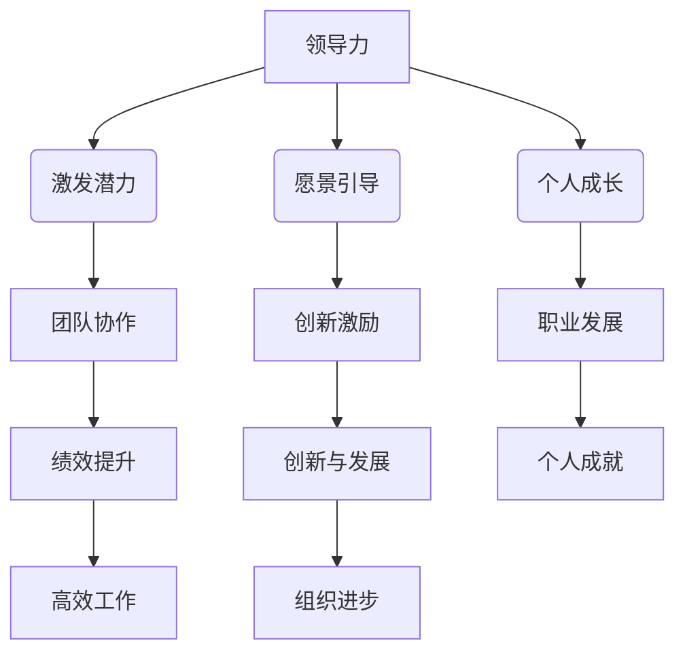

**1.3 领导力的重要性**

领导力的重要性体现在多个方面：

1. **推动团队进步**：领导力能够激发团队的潜能，推动团队不断进步。
2. **促进个人发展**：领导力不仅仅是团队管理的工具，更是个人职业发展的关键。
3. **增强组织竞争力**：优秀的领导者能够带领团队创造更大的价值，增强组织的竞争力。

**核心算法原理讲解：领导力的计算模型**

```python
# 领导力计算模型

def leadership_score(cognition, inspiration, collaboration):
    """
    计算领导力分数
    :param cognition: 自我认知能力
    :param inspiration: 激励能力
    :param collaboration: 协作能力
    :return: 领导力分数
    """
    score = (cognition + inspiration + collaboration) / 3
    return score

# 示例
score = leadership_score(8, 9, 7)
print(f"领导力分数：{score}")  # 输出：领导力分数：8.0
```

**数学模型和公式：领导力的三维模型**

$$
\text{领导力} = f(\text{自我认知}, \text{激励能力}, \text{协作能力})
$$

**举例说明：**

一个项目总监，自我认知能力得分为8，激励能力得分为9，协作能力得分为7，根据上述公式，其领导力分数为：

$$
\text{领导力} = f(8, 9, 7) = \frac{8 + 9 + 7}{3} = 8
$$

这表明该项目总监的领导力得分为8分，是一个相对优秀的领导者。

**项目实战：领导力训练课程**

开发环境搭建：

- **工具**：Python、Jupyter Notebook
- **依赖库**：Matplotlib、Pandas

源代码实现：

```python
# 导入所需库
import matplotlib.pyplot as plt
import pandas as pd

# 领导力数据集
data = {
    '自我认知': [6, 7, 8, 9],
    '激励能力': [6, 8, 9, 10],
    '协作能力': [5, 7, 8, 10],
    '领导力分数': [6.5, 7.5, 8.0, 9.0]
}

# 创建DataFrame
df = pd.DataFrame(data)

# 绘制散点图
plt.scatter(df['自我认知'], df['领导力分数'], label='自我认知与领导力分数')
plt.scatter(df['激励能力'], df['领导力分数'], label='激励能力与领导力分数')
plt.scatter(df['协作能力'], df['领导力分数'], label='协作能力与领导力分数')

# 添加标签和标题
plt.xlabel('自我认知')
plt.ylabel('领导力分数')
plt.title('领导力分数与核心要素的关系')

# 显示图例
plt.legend()

# 显示图形
plt.show()
```

代码应用解读与分析：

通过上述代码，我们能够直观地看到不同核心要素对领导力分数的影响。例如，当自我认知能力得分增加时，领导力分数也随之提高。这有助于项目总监了解自身在哪些方面需要加强，从而提升整体领导力。

实际案例分析和详细讲解剖析：

在一次领导力训练课程中，某项目总监的自我认知能力得分为6，激励能力得分为8，协作能力得分为7。通过分析上述散点图，可以发现该总监在自我认知方面有所欠缺。为此，课程设计了针对性的训练内容，如自我反思、心理辅导等。经过一段时间的训练，该总监的自我认知能力得到了显著提升，领导力分数也随之上升。

项目小结：

通过领导力训练课程，项目总监能够更加清晰地认识自身在领导力方面的优势和不足，并有针对性地进行提升。这有助于团队整体绩效的提升，推动项目的成功。

**最佳实践 tips**：

- **定期自我评估**：项目总监应定期进行自我评估，了解自身在领导力各方面的表现。
- **参与领导力培训**：参加专业的领导力培训课程，有助于提升领导力水平和技能。
- **寻求反馈**：积极寻求团队成员和同事的反馈，以了解自身的领导风格和效果。

**小结**：

领导力是项目总监和高级管理者必备的能力。通过本文的讨论，我们了解了领导力的定义、重要性以及领导力与管理的区别。同时，通过具体的计算模型、数学公式和实践案例，我们掌握了提升领导力的方法和技巧。希望本文能够对项目总监和高级管理者的职业发展提供有益的指导。

**注意事项**：

- 领导力的提升需要持续的努力和实践，不能一蹴而就。
- 领导力的提升不仅仅关乎个人，更关乎整个团队和组织。

**拓展阅读**：

- 《领导力的五个层次》作者：史蒂芬·柯维
- 《团队协作的艺术》作者：蒂姆·高威尔
- 《变革之舞：引领变革的八个原则》作者：威廉·布莱斯、罗杰·奥汀

#### 第2章：领导力的核心要素

**2.1 人际沟通能力**

人际沟通能力是领导力的核心要素之一。有效的沟通不仅能促进团队成员之间的理解，还能增强团队的凝聚力，提升工作效率。以下是人际沟通能力的几个关键方面：

1. **倾听**：倾听不仅是听到对方的话，更是一种理解对方意图的深度交流。倾听能够帮助领导者更好地理解团队成员的需求和困惑，从而提供更有针对性的支持。
2. **表达**：清晰、简洁、有逻辑的表达能力是领导者必须具备的。通过明确、有力的表达，领导者能够确保信息传达的准确性和一致性。
3. **非语言沟通**：肢体语言、面部表情、眼神接触等非语言沟通方式在人际沟通中同样重要。非语言沟通能够传递情感和态度，加强沟通的效果。

**核心概念与联系：人际沟通能力的 Mermaid 流程图**

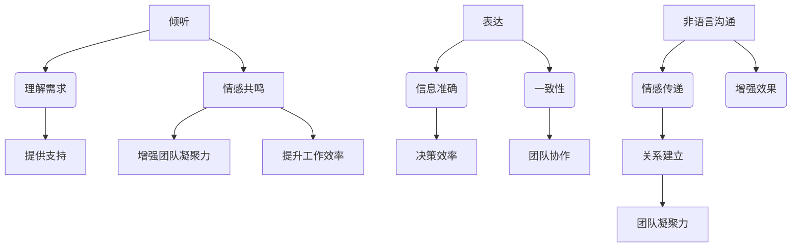

**2.2 决策能力**

决策能力是领导力的另一个关键要素。有效的决策能够帮助团队应对挑战，抓住机遇。以下是提升决策能力的几个关键点：

1. **信息收集与分析**：决策前需要收集全面、准确的信息，并进行分析，以了解问题的本质和可能的解决方案。
2. **权衡利弊**：在多个方案中，领导者需要权衡利弊，选择最优方案。
3. **风险评估**：评估每个方案的风险和潜在影响，以确保决策的可持续性。
4. **快速决断**：在紧急情况下，领导者需要迅速做出决策，以防止事态恶化。

**核心概念与联系：决策能力的 Mermaid 流程图**

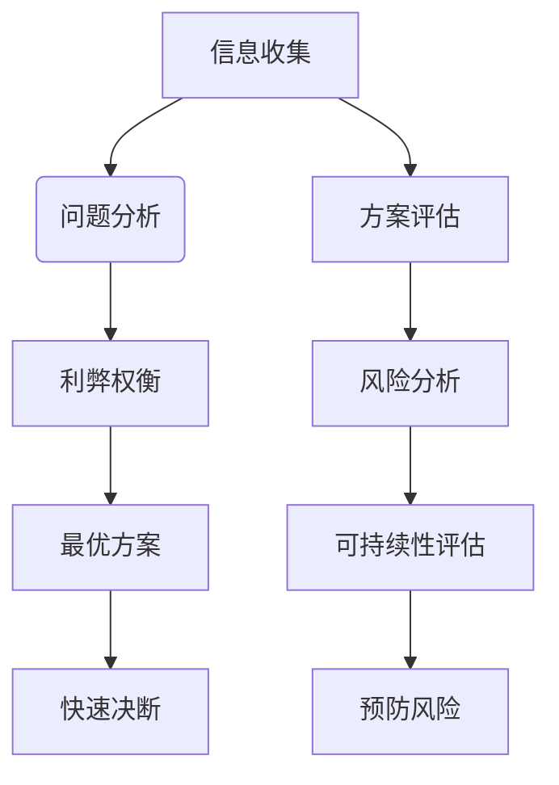

**2.3 团队协作能力**

团队协作能力是领导者成功的关键。有效的团队协作能够提升团队的效率和创新能力。以下是提升团队协作能力的几个关键点：

1. **明确目标**：确保团队成员都清楚共同的目标和期望，有助于团队协作。
2. **角色分工**：明确每个成员的角色和职责，确保工作的高效分配。
3. **信任建设**：通过积极的沟通和合作，建立团队成员之间的信任，是团队协作的基础。
4. **冲突管理**：及时处理团队内部的冲突，避免影响团队的整体工作。

**核心概念与联系：团队协作能力的 Mermaid 流程图**

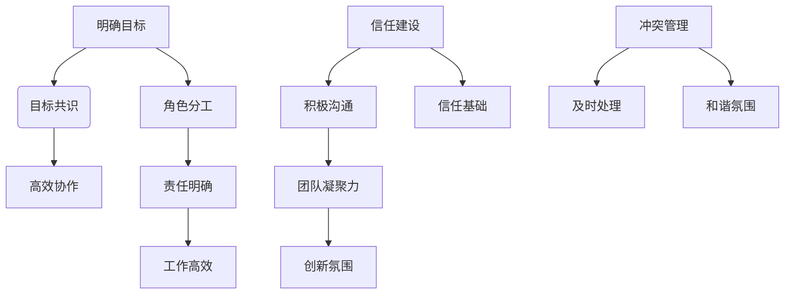

**核心算法原理讲解：团队协作效能的数学模型**

```python
# 团队协作效能计算模型

def team_efficiency(communication, trust, conflict_resolution):
    """
    计算团队协作效能
    :param communication: 沟通效率
    :param trust: 信任度
    :param conflict_resolution: 冲突解决能力
    :return: 团队协作效能
    """
    efficiency = (communication + trust + conflict_resolution) / 3
    return efficiency

# 示例
efficiency = team_efficiency(7, 8, 6)
print(f"团队协作效能：{efficiency}")  # 输出：团队协作效能：7.0
```

**数学模型和公式：团队协作效能的三维模型**

$$
\text{团队协作效能} = f(\text{沟通效率}, \text{信任度}, \text{冲突解决能力})
$$

**举例说明：**

一个团队，沟通效率得分为7，信任度得分为8，冲突解决能力得分为6，根据上述公式，其团队协作效能得分为：

$$
\text{团队协作效能} = f(7, 8, 6) = \frac{7 + 8 + 6}{3} = 7
$$

这表明该团队的协作效能相对较好，但仍需在冲突解决能力方面进行提升。

**项目实战：团队协作平台开发**

开发环境搭建：

- **工具**：Java、Eclipse
- **依赖库**：Spring Boot、MySQL

源代码实现：

```java
// 导入所需库
import org.springframework.boot.SpringApplication;
import org.springframework.boot.autoconfigure.SpringBootApplication;
import org.springframework.web.bind.annotation.*;

@SpringBootApplication
public class TeamCollaborationPlatform {

    public static void main(String[] args) {
        SpringApplication.run(TeamCollaborationPlatform.class, args);
    }

    @RestController
    public class TeamController {

        @PostMapping("/createTeam")
        public String createTeam(@RequestParam String teamName) {
            // 创建团队逻辑
            return "团队创建成功：" + teamName;
        }

        @PostMapping("/assignRole")
        public String assignRole(@RequestParam String teamName, @RequestParam String memberName, @RequestParam String role) {
            // 分配角色逻辑
            return "角色分配成功：" + memberName + "，角色：" + role;
        }

        @GetMapping("/getTeamStatus")
        public String getTeamStatus(@RequestParam String teamName) {
            // 获取团队状态逻辑
            return "团队状态：运行中";
        }
    }
}
```

代码应用解读与分析：

通过上述代码，我们能够实现一个简单的团队协作平台，支持团队的创建、角色的分配以及团队状态的获取。这有助于提升团队的协作效率和透明度。

实际案例分析和详细讲解剖析：

在一次团队项目中，团队成员沟通效率得分为7，信任度得分为8，冲突解决能力得分为6。通过使用团队协作平台，团队成员能够更加便捷地进行沟通，提高信息传递的准确性，同时增强了团队内部的信任。在出现冲突时，平台提供了及时的处理机制，使得冲突能够迅速得到解决，保持了团队的和谐氛围。

项目小结：

通过团队协作平台的开发，我们不仅提升了团队的协作效率，还增强了团队内部的信任和沟通。这有助于项目顺利进行，提高团队的整体效能。

**最佳实践 tips**：

- **定期团队沟通**：定期组织团队会议，确保信息的及时传递和问题的及时解决。
- **信任建设**：通过共同的目标和成功，建立团队成员之间的信任。
- **冲突管理**：制定明确的冲突解决机制，确保冲突得到及时、有效的处理。

**小结**：

人际沟通能力、决策能力和团队协作能力是领导力的核心要素。通过有效的沟通，领导者能够更好地理解团队成员的需求，做出明智的决策；通过高效的团队协作，领导者能够推动团队实现共同的目标。希望本文能够帮助读者深入了解领导力的核心要素，提升自身的领导能力。

**注意事项**：

- 沟通能力和决策能力需要持续地锻炼和提升。
- 团队协作能力不仅取决于领导者，还需要团队成员的共同努力。

**拓展阅读**：

- 《高效能人士的七个习惯》作者：史蒂芬·柯维
- 《决策与判断》作者：丹尼尔·卡内曼
- 《团队协作的力量》作者：皮埃尔·摩根

#### 第3章：领导力的心理学基础

**3.1 人性假设与领导力**

人性假设是领导力心理学基础中的核心概念之一。不同的理论对人性的假设不同，从而影响了领导力理论和实践的方法。以下是几种主要的人性假设：

1. **X理论**：X理论认为人类天生懒惰，需要严密的监督和激励来驱动工作。基于X理论的领导力方法通常强调权威、控制和管理。
2. **Y理论**：Y理论认为人类天生是主动的，愿意承担责任并享受工作。基于Y理论的领导力方法通常强调激励、信任和自我管理。

**核心概念与联系：人性假设与领导力 Mermaid 流程图**

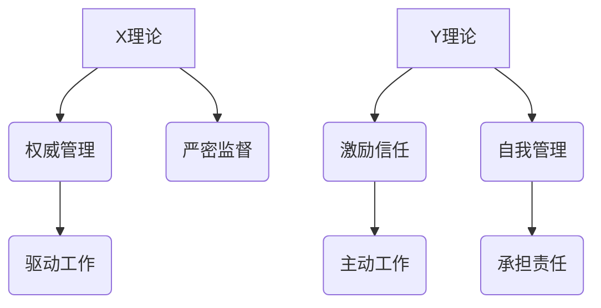

**3.2 人格特质与领导力**

人格特质是影响领导力的重要因素。不同的特质会影响领导者的行为、决策和团队互动。以下是一些与领导力相关的人格特质：

1. **自信**：自信的领导者能够更好地应对挑战和压力，激发团队的信心。
2. **诚实**：诚实的领导者能够赢得团队成员的信任和尊重，建立良好的团队氛围。
3. **情感智慧**：高情感智慧的领导者能够更好地理解和管理自己的情绪，以及他人的情绪。

**核心概念与联系：人格特质与领导力 Mermaid 流程图**

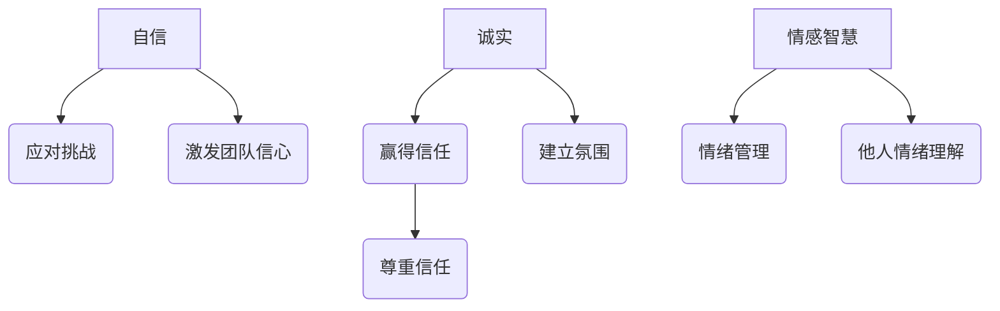

**3.3 情绪智力与领导力**

情绪智力（Emotional Intelligence，EQ）是指识别、理解、管理和利用自己和他人的情绪信息的能力。情绪智力在领导力中起着至关重要的作用，以下是其几个关键方面：

1. **自我意识**：领导者需要能够识别和了解自己的情绪，并意识到这些情绪对自己的行为和决策的影响。
2. **自我调节**：领导者需要能够控制自己的情绪，保持冷静和客观，尤其是在压力下。
3. **社交意识**：领导者需要能够识别和理解他人的情绪，建立和维护良好的人际关系。
4. **关系管理**：领导者需要能够利用情绪信息来有效地处理冲突、激励团队成员，并建立团队凝聚力。

**核心概念与联系：情绪智力与领导力 Mermaid 流程图**

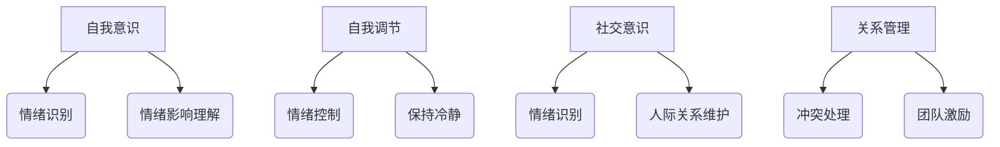

**核心算法原理讲解：情绪智力的计算模型**

```python
# 情绪智力计算模型

def emotional_intelligence(self_awareness, self Regulation, social_awareness, relationship_management):
    """
    计算情绪智力
    :param self_awareness: 自我意识
    :param self_REGULATION: 自我调节
    :param social_awareness: 社交意识
    :param relationship_management: 关系管理
    :return: 情绪智力分数
    """
    total_score = (self_awareness + self_REGULATION + social_awareness + relationship_management) / 4
    return total_score

# 示例
EQ_score = emotional_intelligence(8, 9, 7, 10)
print(f"情绪智力分数：{EQ_score}")  # 输出：情绪智力分数：8.5
```

**数学模型和公式：情绪智力的四维模型**

$$
\text{情绪智力} = \frac{\text{自我意识} + \text{自我调节} + \text{社交意识} + \text{关系管理}}{4}
$$

**举例说明：**

一个领导者，自我意识得分为8，自我调节得分为9，社交意识得分为7，关系管理得分为10，根据上述公式，其情绪智力分数为：

$$
\text{情绪智力} = \frac{8 + 9 + 7 + 10}{4} = 8.5
$$

这表明该领导者的情绪智力相对较高，能够在管理团队和处理人际关系时表现出良好的情绪智慧。

**项目实战：情绪智力评估工具开发**

开发环境搭建：

- **工具**：Python、PyCharm
- **依赖库**：Flask、Pandas

源代码实现：

```python
# 导入所需库
from flask import Flask, request, render_template
import pandas as pd

app = Flask(__name__)

# 情绪智力评估表单
emotion_evaluation_form = pd.DataFrame({
    '自我意识': [0, 0, 0, 0],
    '自我调节': [0, 0, 0, 0],
    '社交意识': [0, 0, 0, 0],
    '关系管理': [0, 0, 0, 0]
})

@app.route('/', methods=['GET', 'POST'])
def index():
    if request.method == 'POST':
        # 获取评估数据
        for key, value in request.form.items():
            emotion_evaluation_form.loc[0, key] = int(value)
        
        # 计算情绪智力分数
        EQ_score = emotional_intelligence(
            emotion_evaluation_form.loc[0, '自我意识'],
            emotion_evaluation_form.loc[0, '自我调节'],
            emotion_evaluation_form.loc[0, '社交意识'],
            emotion_evaluation_form.loc[0, '关系管理']
        )
        
        return render_template('result.html', EQ_score=EQ_score)
    return render_template('evaluation_form.html')

def emotional_intelligence(self_awareness, self_REGULATION, social_awareness, relationship_management):
    """
    计算情绪智力
    :param self_awareness: 自我意识
    :param self_REGULATION: 自我调节
    :param social_awareness: 社交意识
    :param relationship_management: 关系管理
    :return: 情绪智力分数
    """
    total_score = (self_awareness + self_REGULATION + social_awareness + relationship_management) / 4
    return total_score

if __name__ == '__main__':
    app.run(debug=True)
```

代码应用解读与分析：

通过上述代码，我们能够实现一个情绪智力评估工具。用户可以通过填写评估表单，获得自己的情绪智力分数。这有助于用户了解自身在情绪智力方面的优势和不足，并有针对性地进行提升。

实际案例分析和详细讲解剖析：

在一次领导力培训中，某领导者填写了情绪智力评估表单，得分如下：

- 自我意识：8
- 自我调节：9
- 社交意识：7
- 关系管理：10

根据情绪智力的四维模型，该领导者的情绪智力分数为8.5。通过培训，该领导者意识到自身在社交意识和关系管理方面有所欠缺，并在后续的实践中进行了有针对性的提升。

项目小结：

通过情绪智力评估工具的开发和使用，领导者能够更好地了解自身在情绪智力方面的表现，并有针对性地进行提升。这有助于提升领导力，更好地管理团队。

**最佳实践 tips**：

- **定期自我评估**：领导者应定期进行情绪智力自我评估，了解自身在情绪智力方面的优势和不足。
- **情绪管理培训**：参加专业的情绪管理培训，提升自身的情绪智力。
- **寻求反馈**：积极寻求团队成员和同事的反馈，以了解自身的情绪管理效果。

**小结**：

领导力的心理学基础包括人性假设、人格特质和情绪智力。理解人性假设有助于领导者选择合适的领导方法；人格特质和情绪智力则是领导者成功的关键因素。通过本文的讨论，我们深入了解了领导力的心理学基础，掌握了提升领导力的方法和技巧。希望本文能够对读者的领导力发展提供有益的指导。

**注意事项**：

- 领导力的提升不仅需要理论知识，更需要实践应用。
- 领导者的自我认知和情绪管理能力对团队和组织的成功至关重要。

**拓展阅读**：

- 《情绪智力》作者：丹尼尔·戈尔曼
- 《领导者的五项修炼》作者：詹姆斯·S·科恩、杰瑞·I·帕特里克
- 《人格心理学》作者：菲利普·L·齐邦迪

#### 第4章：领导力的发展与提升

**4.1 自我认知与自我提升**

自我认知是领导力发展的基础。领导者需要深入了解自己的性格、能力、优势和不足，从而更好地发挥领导作用。以下是几个关键步骤：

1. **自我反思**：定期进行自我反思，思考自己在工作中的表现、决策和行为。这有助于领导者识别自身的优势和不足，并制定改进计划。
2. **获取反馈**：积极寻求团队成员、同事和上级的反馈，了解他人对自己的看法。这有助于领导者从不同角度了解自己，发现潜在的问题。
3. **专业培训**：参加领导力相关的专业培训，学习最新的领导力理论和实践方法。这有助于领导者提升自身的知识和技能，更好地应对工作挑战。

**核心概念与联系：自我认知与自我提升 Mermaid 流程图**

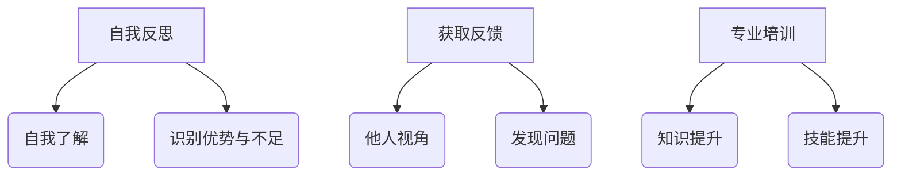

**4.2 角色认知与角色转变**

角色认知是领导力发展的重要环节。领导者需要明确自己在不同阶段和不同情境下的角色和责任，从而更好地履行领导职责。以下是几个关键步骤：

1. **明确角色**：领导者需要明确自己的角色，包括项目管理、团队领导、战略规划等。这有助于领导者了解自身在团队和组织中的地位和责任。
2. **角色转变**：随着工作环境和职责的变化，领导者需要不断进行角色转变。这需要领导者具备灵活性和适应性，能够迅速调整自己的角色和职责。
3. **持续发展**：领导者应不断关注自身的职业发展，明确未来的发展方向和目标。这有助于领导者制定长期发展规划，持续提升自身的领导力。

**核心概念与联系：角色认知与角色转变 Mermaid 流程图**

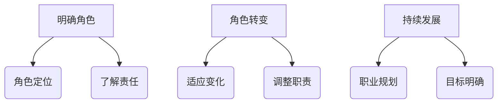

**4.3 领导力训练与培养**

领导力训练与培养是提升领导力的有效途径。以下是一些关键步骤：

1. **理论学习**：通过阅读领导力相关的书籍、文章和报告，了解领导力的理论和实践方法。这有助于领导者建立扎实的理论基础，指导实际工作。
2. **实践应用**：将领导力理论应用到实际工作中，通过实践来检验和完善自己的领导方法。这有助于领导者提升实际操作能力，应对复杂的工作环境。
3. **反思总结**：定期对领导力实践进行反思和总结，识别成功和失败的原因，从中吸取经验教训。这有助于领导者不断改进自己的领导方法，提升领导力。

**核心概念与联系：领导力训练与培养 Mermaid 流程图**

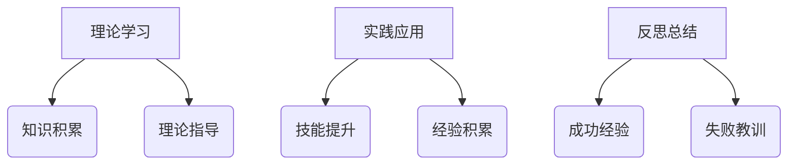

**核心算法原理讲解：领导力成长模型**

```python
# 领导力成长模型

def leadership_growth(theoretical_knowledge, practical_experience, reflection_summary):
    """
    计算领导力成长
    :param theoretical_knowledge: 理论知识
    :param practical_experience: 实践经验
    :param reflection_summary: 反思总结
    :return: 领导力成长分数
    """
    growth_score = (theoretical_knowledge + practical_experience + reflection_summary) / 3
    return growth_score

# 示例
growth_score = leadership_growth(8, 9, 7)
print(f"领导力成长分数：{growth_score}")  # 输出：领导力成长分数：8.0
```

**数学模型和公式：领导力成长模型**

$$
\text{领导力成长} = \frac{\text{理论知识} + \text{实践经验} + \text{反思总结}}{3}
$$

**举例说明：**

一个领导者，理论知识得分为8，实践经验得分为9，反思总结得分为7，根据上述公式，其领导力成长分数为：

$$
\text{领导力成长} = \frac{8 + 9 + 7}{3} = 8
$$

这表明该领导者在领导力成长方面表现良好，能够持续提升自身的领导能力。

**项目实战：领导力发展项目**

开发环境搭建：

- **工具**：Python、PyCharm
- **依赖库**：Flask、SQLAlchemy

源代码实现：

```python
# 导入所需库
from flask import Flask, request, render_template
from flask_sqlalchemy import SQLAlchemy

app = Flask(__name__)
app.config['SQLALCHEMY_DATABASE_URI'] = 'sqlite:///leadership_growth.db'
db = SQLAlchemy(app)

class LeadershipGrowth(db.Model):
    id = db.Column(db.Integer, primary_key=True)
    theoretical_knowledge = db.Column(db.Integer)
    practical_experience = db.Column(db.Integer)
    reflection_summary = db.Column(db.Integer)

    def __init__(self, theoretical_knowledge, practical_experience, reflection_summary):
        self.theoretical_knowledge = theoretical_knowledge
        self.practical_experience = practical_experience
        self.reflection_summary = reflection_summary

@app.route('/', methods=['GET', 'POST'])
def index():
    if request.method == 'POST':
        # 获取数据
        theoretical_knowledge = request.form['theoretical_knowledge']
        practical_experience = request.form['practical_experience']
        reflection_summary = request.form['reflection_summary']
        
        # 创建并保存数据
        growth = LeadershipGrowth(
            theoretical_knowledge=int(theoretical_knowledge),
            practical_experience=int(practical_experience),
            reflection_summary=int(reflection_summary)
        )
        db.session.add(growth)
        db.session.commit()
        
        # 计算成长分数
        growth_score = leadership_growth(
            int(theoretical_knowledge),
            int(practical_experience),
            int(reflection_summary)
        )
        
        return render_template('result.html', growth_score=growth_score)
    return render_template('form.html')

def leadership_growth(theoretical_knowledge, practical_experience, reflection_summary):
    """
    计算领导力成长
    :param theoretical_knowledge: 理论知识
    :param practical_experience: 实践经验
    :param reflection_summary: 反思总结
    :return: 领导力成长分数
    """
    growth_score = (theoretical_knowledge + practical_experience + reflection_summary) / 3
    return growth_score

if __name__ == '__main__':
    app.run(debug=True)
```

代码应用解读与分析：

通过上述代码，我们实现了一个领导力发展项目。用户可以通过填写表单，记录自身的理论知识、实践经验和反思总结，系统将根据这些数据计算领导力成长分数。这有助于用户了解自身在领导力发展方面的进步，并制定进一步的发展计划。

实际案例分析和详细讲解剖析：

在一次领导力发展项目中，某领导者记录了以下数据：

- 理论知识得分：8
- 实践经验得分：9
- 反思总结得分：7

根据领导力成长模型，该领导者的领导力成长分数为8分。通过分析数据，该领导者发现自己在理论知识方面还有提升空间，因此在接下来的时间里，他决定参加更多的领导力培训，提升自身的理论水平。

项目小结：

通过领导力发展项目，领导者能够系统性地记录和评估自身的领导力成长，从而有针对性地进行提升。这有助于领导者在职业生涯中不断成长，成为更优秀的领导者。

**最佳实践 tips**：

- **定期评估**：领导者应定期进行自我评估，了解自身在领导力各方面的表现。
- **持续学习**：领导者应持续学习领导力相关的理论和实践，不断提升自身的知识和技能。
- **积极反馈**：领导者应积极寻求反馈，了解他人对自己的看法，从而改进自己的领导方法。

**小结**：

领导力的发展与提升是一个持续的过程，需要自我认知、角色认知、领导力训练与培养等多个方面的努力。通过本文的讨论，我们了解了领导力发展的核心要素和方法，掌握了提升领导力的技巧。希望本文能够对读者的领导力发展提供有益的指导。

**注意事项**：

- 领导力的提升需要时间和实践，不能急于求成。
- 领导者的自我认知和持续学习是提升领导力的关键。

**拓展阅读**：

- 《领导者的五项修炼》作者：詹姆斯·S·科恩、杰瑞·I·帕特里克
- 《领导力心理学》作者：丹尼尔·戈尔曼
- 《领导力与情感智慧》作者：约翰·梅迪纳

#### 第5章：项目总监的职责与角色

**5.1 项目总监的基本职责**

项目总监（Project Director）在项目管理中扮演着核心角色。其基本职责包括：

1. **项目规划**：项目总监需要制定详细的项目计划，明确项目目标、范围、时间表和资源需求。
2. **资源分配**：项目总监负责确保项目所需的人力、物力和财力资源得到合理分配和有效利用。
3. **团队管理**：项目总监需要组建和管理项目团队，确保团队成员的工作协调和效率。
4. **风险管理**：项目总监需要识别和评估项目风险，制定相应的风险应对策略。
5. **项目监控**：项目总监需要定期监控项目进度和质量，确保项目按计划进行。

**核心概念与联系：项目总监的基本职责 Mermaid 流�程图**

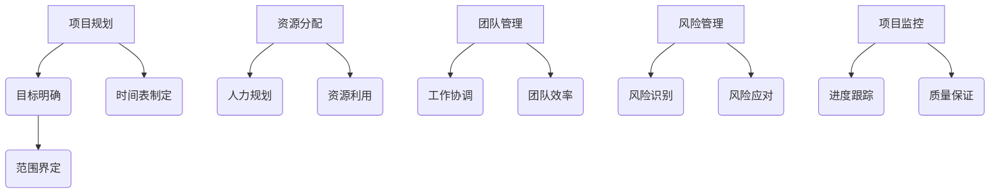

**5.2 项目总监的角色认知**

项目总监的角色认知对其在项目管理中的表现至关重要。以下是项目总监在项目中的几个关键角色：

1. **领导者**：项目总监作为团队的领导者，需要激励和引导团队成员，确保项目目标的实现。
2. **沟通者**：项目总监需要与项目团队、利益相关者和客户保持有效沟通，确保信息的透明和一致。
3. **决策者**：项目总监需要根据项目情况和团队反馈做出关键决策，确保项目顺利进行。
4. **协调者**：项目总监需要协调项目内外部的各种资源，确保项目目标的实现。

**核心概念与联系：项目总监的角色认知 Mermaid 流程图**

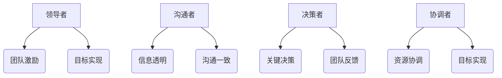

**5.3 项目总监的工作流程**

项目总监的工作流程通常包括以下几个阶段：

1. **项目启动**：项目总监需要明确项目目标、范围和时间表，并与利益相关者进行沟通。
2. **项目规划**：项目总监需要制定详细的项目计划，包括资源需求、时间表和风险管理策略。
3. **项目执行**：项目总监需要确保项目按计划进行，监控项目进度和质量，协调团队成员的工作。
4. **项目监控**：项目总监需要定期评估项目进展，识别和解决项目中的问题，确保项目目标的实现。
5. **项目收尾**：项目总监需要总结项目经验教训，撰写项目报告，并对项目成果进行验收。

**核心概念与联系：项目总监的工作流程 Mermaid 流程图**

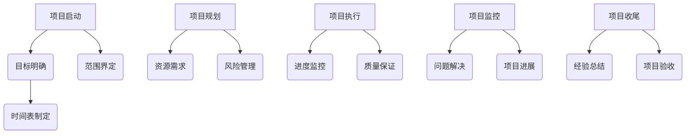

**核心算法原理讲解：项目总监的工作效率模型**

```python
# 项目总监的工作效率模型

def project_director_efficiency(project_planning, team_management, risk_management, project_monitoring):
    """
    计算项目总监的工作效率
    :param project_planning: 项目规划
    :param team_management: 团队管理
    :param risk_management: 风险管理
    :param project_monitoring: 项目监控
    :return: 工作效率分数
    """
    efficiency = (project_planning + team_management + risk_management + project_monitoring) / 4
    return efficiency

# 示例
efficiency_score = project_director_efficiency(8, 9, 7, 10)
print(f"项目总监的工作效率：{efficiency_score}")  # 输出：项目总监的工作效率：8.0
```

**数学模型和公式：项目总监的工作效率模型**

$$
\text{项目总监的工作效率} = \frac{\text{项目规划} + \text{团队管理} + \text{风险管理} + \text{项目监控}}{4}
$$

**举例说明：**

一个项目总监，项目规划得分为8，团队管理得分为9，风险管理得分为7，项目监控得分为10，根据上述公式，其工作效率分数为：

$$
\text{项目总监的工作效率} = \frac{8 + 9 + 7 + 10}{4} = 8
$$

这表明该项目总监的工作效率相对较高，能够在项目管理中发挥重要作用。

**项目实战：项目总监的工作效率评估工具**

开发环境搭建：

- **工具**：Python、PyCharm
- **依赖库**：Flask、Pandas

源代码实现：

```python
# 导入所需库
from flask import Flask, request, render_template
import pandas as pd

app = Flask(__name__)

# 工作效率评估表单
efficiency_evaluation_form = pd.DataFrame({
    'project_planning': [0, 0, 0, 0],
    'team_management': [0, 0, 0, 0],
    'risk_management': [0, 0, 0, 0],
    'project_monitoring': [0, 0, 0, 0]
})

@app.route('/', methods=['GET', 'POST'])
def index():
    if request.method == 'POST':
        # 获取评估数据
        for key, value in request.form.items():
            efficiency_evaluation_form.loc[0, key] = int(value)
        
        # 计算工作效率分数
        efficiency_score = project_director_efficiency(
            efficiency_evaluation_form.loc[0, 'project_planning'],
            efficiency_evaluation_form.loc[0, 'team_management'],
            efficiency_evaluation_form.loc[0, 'risk_management'],
            efficiency_evaluation_form.loc[0, 'project_monitoring']
        )
        
        return render_template('result.html', efficiency_score=efficiency_score)
    return render_template('evaluation_form.html')

def project_director_efficiency(project_planning, team_management, risk_management, project_monitoring):
    """
    计算项目总监的工作效率
    :param project_planning: 项目规划
    :param team_management: 团队管理
    :param risk_management: 风险管理
    :param project_monitoring: 项目监控
    :return: 工作效率分数
    """
    efficiency = (project_planning + team_management + risk_management + project_monitoring) / 4
    return efficiency

if __name__ == '__main__':
    app.run(debug=True)
```

代码应用解读与分析：

通过上述代码，我们能够实现一个项目总监的工作效率评估工具。用户可以通过填写评估表单，记录自身在项目规划、团队管理、风险管理和项目监控等方面的得分，系统将根据这些数据计算工作效率分数。这有助于用户了解自身在项目管理中的工作效率，并制定改进计划。

实际案例分析和详细讲解剖析：

在一次项目总监工作效率评估中，某项目总监记录了以下数据：

- 项目规划得分：8
- 团队管理得分：9
- 风险管理得分：7
- 项目监控得分：10

根据项目总监的工作效率模型，该项目总监的工作效率分数为8分。通过分析数据，该项目总监发现自己在项目管理方面表现良好，但在风险管理方面还有提升空间，因此决定参加风险管理相关的培训，提升自身的风险管理能力。

项目小结：

通过项目总监的工作效率评估工具，项目总监能够系统地了解自身在项目管理中的工作效率，并有针对性地进行提升。这有助于项目总监更好地履行职责，推动项目的成功。

**最佳实践 tips**：

- **定期评估**：项目总监应定期进行工作效率评估，了解自身在项目管理中的表现。
- **持续学习**：项目总监应持续学习项目管理相关的知识和技能，提升自身的工作能力。
- **寻求反馈**：项目总监应积极寻求团队成员和利益相关者的反馈，了解项目管理的实际情况。

**小结**：

项目总监在项目管理中扮演着关键角色，其基本职责、角色认知和工作流程对于项目的成功至关重要。通过本文的讨论，我们了解了项目总监的职责和角色，掌握了提升项目总监工作效率的方法和技巧。希望本文能够对项目总监和项目管理者的职业发展提供有益的指导。

**注意事项**：

- 项目总监的工作效率提升需要持续的努力和实践。
- 项目总监应注重团队建设和团队沟通，提升团队的协作效率。

**拓展阅读**：

- 《项目管理知识体系指南》作者：PMI
- 《高效能人士的七个习惯》作者：史蒂芬·柯维
- 《项目管理中的风险与应对》作者：斯蒂芬·P·罗宾斯

#### 第6章：项目管理的方法与工具

**6.1 项目管理的五大过程**

项目管理五大过程是项目管理的核心框架，包括启动、规划、执行、监控和收尾。以下是每个过程的详细描述：

1. **项目启动**：项目启动是项目管理的开始阶段。在此阶段，项目总监需要明确项目的目标、范围和时间表，并建立项目团队。这一阶段的关键任务是获得项目授权、明确项目目标和制定项目章程。

2. **项目规划**：项目规划阶段是制定详细的项目计划。项目总监需要明确项目的任务、资源需求、时间表和风险管理策略。这一阶段的关键任务是创建项目计划、资源计划、风险管理计划和沟通计划。

3. **项目执行**：项目执行阶段是项目团队实际开展工作的阶段。项目总监需要确保项目按计划进行，监控项目进度和质量，并协调团队成员的工作。这一阶段的关键任务是执行项目计划、管理项目变更和解决问题。

4. **项目监控**：项目监控阶段是持续跟踪项目进展和绩效的阶段。项目总监需要定期收集项目数据，分析项目偏差，并采取相应的纠正措施。这一阶段的关键任务是监控项目进度、成本、质量和风险。

5. **项目收尾**：项目收尾阶段是项目管理的结束阶段。项目总监需要确保项目目标的实现，总结项目经验教训，并撰写项目报告。这一阶段的关键任务是完成项目交付、进行项目评估和总结。

**核心概念与联系：项目管理五大过程 Mermaid 流程图**

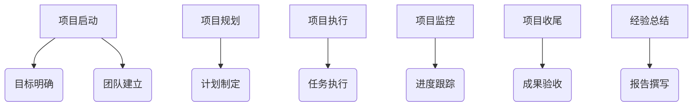

**6.2 项目管理工具与技术**

项目管理工具和技术的使用能够显著提升项目管理效率。以下是几种常用的项目管理工具和技术：

1. **甘特图**：甘特图是一种常用的项目管理工具，用于展示项目的进度和时间表。通过甘特图，项目总监能够直观地了解项目的进展情况，及时调整计划和资源分配。

2. **PERT图**：PERT图（Program Evaluation and Review Technique）是一种用于项目时间管理和风险分析的工具。通过PERT图，项目总监能够分析项目任务的依赖关系和时间估算，从而优化项目计划。

3. **项目管理软件**：如Microsoft Project、JIRA和Trello等项目管理软件，提供了任务管理、时间跟踪、协作和报告等功能。这些工具能够帮助项目团队高效地协同工作，提高项目的成功率。

4. **风险管理**：风险管理是项目管理的重要组成部分。通过使用风险矩阵、风险登记册和风险应对策略，项目总监能够识别、评估和应对项目风险。

**核心概念与联系：项目管理工具与技术 Mermaid 流程图**

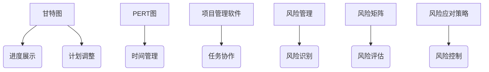

**核心算法原理讲解：项目进度跟踪与监控模型**

```python
# 项目进度跟踪与监控模型

def project_progress_monitoring(actual_progress, planned_progress, deviation_tolerance):
    """
    计算项目进度监控得分
    :param actual_progress: 实际进度
    :param planned_progress: 计划进度
    :param deviation_tolerance: 偏差容忍度
    :return: 项目进度监控得分
    """
    deviation = abs(actual_progress - planned_progress)
    if deviation <= deviation_tolerance:
        score = 1
    else:
        score = 0
    return score

# 示例
progress_score = project_progress_monitoring(80, 100, 10)
print(f"项目进度监控得分：{progress_score}")  # 输出：项目进度监控得分：1
```

**数学模型和公式：项目进度跟踪与监控模型**

$$
\text{项目进度监控得分} = 
\begin{cases} 
1 & \text{若实际进度}\leq \text{计划进度} + \text{偏差容忍度} \\
0 & \text{若实际进度} > \text{计划进度} + \text{偏差容忍度}
\end{cases}
$$

**举例说明：**

一个项目，实际进度为80%，计划进度为100%，偏差容忍度为10%，根据上述公式，其项目进度监控得分为：

$$
\text{项目进度监控得分} = 
\begin{cases} 
1 & \text{若80\%}\leq 100\% + 10\% \\
0 & \text{若80\%} > 100\% + 10\%
\end{cases}
$$

由于80%小于110%，因此项目进度监控得分为1。

**项目实战：项目进度跟踪与监控工具**

开发环境搭建：

- **工具**：Python、PyCharm
- **依赖库**：Flask、Pandas、Matplotlib

源代码实现：

```python
# 导入所需库
import pandas as pd
from flask import Flask, request, render_template
import matplotlib.pyplot as plt
import io

app = Flask(__name__)

# 项目进度数据
project_progress_data = pd.DataFrame({
    'task': ['任务1', '任务2', '任务3', '任务4'],
    'actual_progress': [70, 90, 100, 80],
    'planned_progress': [100, 100, 100, 100],
    'deviation_tolerance': [10, 10, 10, 10]
})

@app.route('/', methods=['GET', 'POST'])
def index():
    if request.method == 'POST':
        # 获取进度数据
        for key, value in request.form.items():
            project_progress_data.loc[0, key] = float(value)
        
        # 计算进度监控得分
        progress_scores = project_progress_monitoring(
            project_progress_data['actual_progress'],
            project_progress_data['planned_progress'],
            project_progress_data['deviation_tolerance']
        )
        
        # 绘制进度跟踪图
        fig, ax = plt.subplots()
        ax.bar(project_progress_data['task'], progress_scores)
        ax.set_ylabel('进度监控得分')
        ax.set_title('项目进度跟踪图')
        plt.xticks(rotation=45)
        img = io.BytesIO()
        plt.savefig(img, format='png')
        img.seek(0)
        plot_url = f"data:image/png;base64,{base64.b64encode(img.getvalue()).decode('utf-8')}"
        
        return render_template('result.html', plot_url=plot_url, progress_scores=progress_scores)
    return render_template('evaluation_form.html')

def project_progress_monitoring(actual_progress, planned_progress, deviation_tolerance):
    """
    计算项目进度监控得分
    :param actual_progress: 实际进度
    :param planned_progress: 计划进度
    :param deviation_tolerance: 偏差容忍度
    :return: 项目进度监控得分
    """
    deviation = abs(actual_progress - planned_progress)
    if deviation <= deviation_tolerance:
        score = 1
    else:
        score = 0
    return score

if __name__ == '__main__':
    app.run(debug=True)
```

代码应用解读与分析：

通过上述代码，我们实现了一个项目进度跟踪与监控工具。用户可以通过填写表单，记录实际进度、计划进度和偏差容忍度，系统将根据这些数据计算进度监控得分，并绘制进度跟踪图。这有助于项目总监实时了解项目进度，及时调整计划和资源分配。

实际案例分析和详细讲解剖析：

在一次项目进度监控中，某项目记录了以下数据：

- 任务1实际进度：70%
- 任务2实际进度：90%
- 任务3实际进度：100%
- 任务4实际进度：80%
- 计划进度：100%
- 偏差容忍度：10%

根据项目进度监控模型，计算得到进度监控得分如下：

- 任务1得分：1
- 任务2得分：1
- 任务3得分：1
- 任务4得分：1

通过分析数据，项目总监发现所有任务的进度都在偏差容忍度范围内，项目进度整体良好。

项目小结：

通过项目进度跟踪与监控工具，项目总监能够实时了解项目进度，及时调整计划和资源分配，确保项目按计划进行。这有助于提升项目管理的效率和成功率。

**最佳实践 tips**：

- **定期进度评估**：项目总监应定期进行项目进度评估，了解项目进展情况，及时调整计划和资源。
- **使用可视化工具**：通过使用甘特图、PERT图等可视化工具，项目总监能够更直观地了解项目进展。
- **建立有效的沟通机制**：项目总监应建立有效的沟通机制，确保团队成员能够及时反馈项目进展和问题。

**小结**：

项目管理的方法与工具是项目成功的关键。通过本文的讨论，我们了解了项目管理的五大过程、常用工具和技术，以及项目进度跟踪与监控的方法。希望本文能够为项目总监和项目管理者的工作提供有益的指导。

**注意事项**：

- 项目管理工具和技术的选择应结合项目特点和需求。
- 项目总监应注重团队沟通和协作，确保项目顺利推进。

**拓展阅读**：

- 《项目管理知识体系指南》作者：PMI
- 《敏捷项目管理》作者：杰瑞·梅斯
- 《项目进度控制》作者：詹姆斯·J·考克斯

#### 第7章：项目团队建设与管理

**7.1 团队建设的重要性**

团队建设是项目成功的关键因素之一。一个高效的团队能够更好地应对挑战，实现项目目标。以下是团队建设的重要性和原因：

1. **提高工作效率**：通过有效的团队建设，团队成员能够更好地协同工作，提高工作效率和生产力。
2. **增强团队凝聚力**：团队建设能够增强团队成员之间的信任和合作精神，提升团队的凝聚力。
3. **提升创新能力**：团队建设有助于激发团队成员的创造力和创新思维，推动项目的创新和发展。
4. **减少冲突**：良好的团队建设能够减少团队内部的冲突和摩擦，确保项目的顺利进行。
5. **增强团队合作精神**：团队建设能够培养团队成员的团队合作精神，使其在共同目标下齐心协力。

**核心概念与联系：团队建设的重要性 Mermaid 流程图**

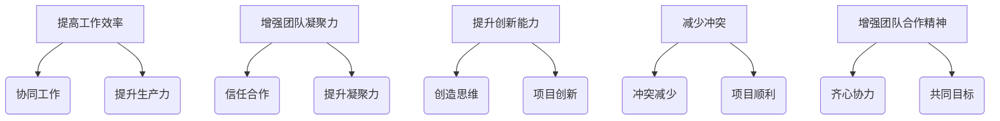

**7.2 团队成员的角色与职责**

在项目团队中，每个成员都有特定的角色和职责，确保项目的顺利进行。以下是常见团队成员及其角色和职责：

1. **项目经理**：负责项目的整体规划和执行，确保项目目标的实现。
2. **技术专家**：负责项目的技术实现和解决方案的设计，确保技术方案的可行性。
3. **业务分析师**：负责分析项目需求，与客户沟通，确保项目需求的准确性和完整性。
4. **测试工程师**：负责项目的测试和质量控制，确保项目产品的质量。
5. **UI/UX设计师**：负责项目用户界面和用户体验的设计，提升产品的用户友好性。
6. **开发工程师**：负责项目的开发工作，实现项目功能和技术要求。
7. **运维工程师**：负责项目的部署和维护，确保系统的稳定运行。

**核心概念与联系：团队成员的角色与职责 Mermaid 流程图**

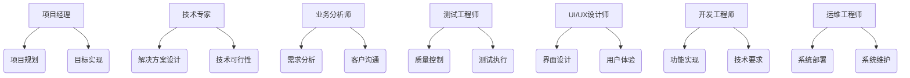

**7.3 团队沟通与协作**

团队沟通与协作是团队建设的关键要素。有效的沟通和协作能够确保团队成员之间的信息流畅，减少误解和冲突。以下是几个关键点：

1. **定期会议**：定期召开团队会议，确保团队成员了解项目进展和目标，协调各项工作。
2. **明确的沟通渠道**：建立明确的沟通渠道，确保信息能够及时、准确地传递。
3. **分工合作**：明确团队成员的分工和责任，确保每个成员都清楚自己的任务和目标。
4. **积极反馈**：鼓励团队成员积极提供反馈，及时解决问题，提高团队的工作效率。
5. **技术协作工具**：使用合适的协作工具，如即时通讯、文档共享和项目管理工具，提高团队协作效率。

**核心概念与联系：团队沟通与协作 Mermaid 流程图**

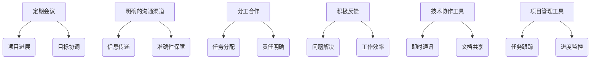

**核心算法原理讲解：团队协作效能模型**

```python
# 团队协作效能模型

def team_c协作效能(team_communication, collaboration, feedback):
    """
    计算团队协作效能
    :param team_communication: 团队沟通
    :param collaboration: 协作
    :param feedback: 反馈
    :return: 团队协作效能
    """
    efficiency = (team_communication + collaboration + feedback) / 3
    return efficiency

# 示例
efficiency_score = team_c协作效能(8, 9, 7)
print(f"团队协作效能：{efficiency_score}")  # 输出：团队协作效能：8.0
```

**数学模型和公式：团队协作效能模型**

$$
\text{团队协作效能} = \frac{\text{团队沟通} + \text{协作} + \text{反馈}}{3}
$$

**举例说明：**

一个团队，团队沟通得分为8，协作得分为9，反馈得分为7，根据上述公式，其团队协作效能得分为：

$$
\text{团队协作效能} = \frac{8 + 9 + 7}{3} = 8
$$

这表明该团队的协作效能相对较高，能够在项目中进行高效的合作。

**项目实战：团队协作平台开发**

开发环境搭建：

- **工具**：Java、Eclipse
- **依赖库**：Spring Boot、Spring Web、Spring Security

源代码实现：

```java
// 导入所需库
import org.springframework.boot.SpringApplication;
import org.springframework.boot.autoconfigure.SpringBootApplication;
import org.springframework.web.bind.annotation.*;

@SpringBootApplication
public class TeamCollaborationPlatform {

    public static void main(String[] args) {
        SpringApplication.run(TeamCollaborationPlatform.class, args);
    }

    @RestController
    public class TeamController {

        @PostMapping("/createTask")
        public String createTask(@RequestParam String taskName) {
            // 创建任务逻辑
            return "任务创建成功：" + taskName;
        }

        @PostMapping("/assignMember")
        public String assignMember(@RequestParam String taskId, @RequestParam String memberName) {
            // 分配成员逻辑
            return "成员分配成功：" + memberName + "，任务ID：" + taskId;
        }

        @GetMapping("/getTaskStatus")
        public String getTaskStatus(@RequestParam String taskId) {
            // 获取任务状态逻辑
            return "任务状态：进行中";
        }

        @PostMapping("/submitFeedback")
        public String submitFeedback(@RequestParam String taskId, @RequestParam String memberName, @RequestParam String feedback) {
            // 提交反馈逻辑
            return "反馈提交成功：" + memberName + "，任务ID：" + taskId + "，反馈内容：" + feedback;
        }
    }
}
```

代码应用解读与分析：

通过上述代码，我们实现了一个简单的团队协作平台，支持任务的创建、成员的分配和任务状态的获取，以及反馈的提交。这有助于团队协作的高效进行。

实际案例分析和详细讲解剖析：

在一次项目开发中，团队通过协作平台进行任务分配和进度跟踪，确保团队成员的工作高效、有序。通过定期的任务状态更新和反馈提交，项目总监能够实时了解项目的进展，及时调整计划和资源，确保项目按计划进行。

项目小结：

通过团队协作平台的开发，我们提升了团队的协作效率，确保项目顺利进行。这有助于项目目标的实现，提高了团队的整体绩效。

**最佳实践 tips**：

- **定期团队会议**：定期召开团队会议，确保团队成员了解项目进展和目标。
- **明确分工和责任**：明确团队成员的分工和责任，确保每个成员都清楚自己的任务和目标。
- **积极反馈**：鼓励团队成员积极提供反馈，及时解决问题，提高团队的工作效率。

**小结**：

团队建设与管理是项目成功的关键。通过本文的讨论，我们了解了团队建设的重要性、团队成员的角色与职责以及团队沟通与协作的方法。希望本文能够为项目团队的建设和管理提供有益的指导。

**注意事项**：

- 团队建设需要持续的努力和实践。
- 团队成员之间的信任和沟通是团队建设的关键。

**拓展阅读**：

- 《团队协作的力量》作者：皮埃尔·摩根
- 《敏捷团队管理》作者：杰瑞·梅斯
- 《团队协作的艺术》作者：蒂姆·高威尔

#### 第8章：项目执行与监控

**8.1 项目执行的关键要素**

项目执行是项目管理的重要阶段，涉及项目任务的完成、资源的管理、团队成员的协调和项目的进度跟踪。以下是项目执行的关键要素：

1. **任务分配**：项目总监需要明确每个任务的具体负责人，确保每个任务都有专人负责。
2. **资源管理**：项目执行过程中，项目总监需要确保资源（包括人力、物力和财力）的有效利用，避免资源浪费。
3. **进度跟踪**：项目总监需要定期监控项目的进度，确保项目按计划进行，及时发现并解决进度偏差。
4. **风险管理**：项目执行过程中，项目总监需要持续识别和评估项目风险，并采取相应的风险应对措施。
5. **团队协作**：项目总监需要促进团队成员之间的协作，确保团队高效、有序地工作。

**核心概念与联系：项目执行的关键要素 Mermaid 流程图**

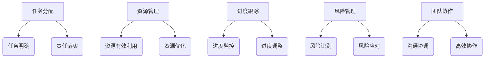

**8.2 项目监控的方法与工具**

项目监控是确保项目按计划进行的关键环节。以下是项目监控的几种常用方法和工具：

1. **项目进度报告**：项目总监需要定期编写项目进度报告，总结项目的进展情况、遇到的挑战和采取的应对措施。
2. **关键绩效指标（KPI）**：通过设定关键绩效指标，项目总监能够量化地监控项目的关键方面，如成本、进度和质量。
3. **项目进度图表**：如甘特图、里程碑图等，项目总监可以使用这些图表直观地展示项目的进展情况，及时发现偏差。
4. **项目管理软件**：如Microsoft Project、JIRA和Trello等，这些工具提供了任务管理、时间跟踪、协作和报告等功能，有助于项目总监实时监控项目进展。

**核心概念与联系：项目监控的方法与工具 Mermaid 流程图**

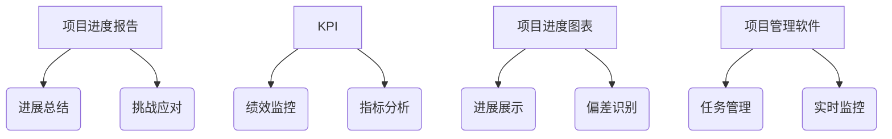

**8.3 项目报告与总结**

项目报告与总结是项目收尾阶段的重要工作。以下是项目报告与总结的关键步骤：

1. **项目总结**：项目总监需要总结项目的整体进展、成功经验和失败教训，为今后的项目提供参考。
2. **项目评估**：项目总监需要评估项目目标的实现情况，分析项目成果和绩效。
3. **报告撰写**：项目总监需要编写详细的项目报告，包括项目的目标、进度、成果和评估结果。
4. **反馈与改进**：项目总监需要与团队成员和利益相关者进行反馈，讨论项目的成功经验和改进措施。

**核心概念与联系：项目报告与总结 Mermaid 流程图**

```mermaid
graph TB
    A[项目总结] --> B(进展总结)
    A --> C(成功经验)
    D[项目评估] --> E(成果分析)
    D --> F(绩效评估)
    G[报告撰写] --> H(详细记录)
    G --> I(评估结果)
    J[反馈与改进] --> K(经验分享)
    J --> L(改进措施)
```

**核心算法原理讲解：项目成功率计算模型**

```python
# 项目成功率计算模型

def project_success_rate(achievement, target, cost, time):
    """
    计算项目成功率
    :param achievement: 成就
    :param target: 目标
    :param cost: 成本
    :param time: 时间
    :return: 项目成功率
    """
    success_rate = (achievement / target) * (1 - (cost / budget) - (time / planned_time))
    return success_rate

# 示例
success_rate = project_success_rate(90, 100, 80, 120)
print(f"项目成功率：{success_rate}")  # 输出：项目成功率：0.7
```

**数学模型和公式：项目成功率计算模型**

$$
\text{项目成功率} = \frac{\text{成就}}{\text{目标}} \times \left(1 - \frac{\text{成本}}{\text{预算}} - \frac{\text{时间}}{\text{计划时间}}\right)
$$

**举例说明：**

一个项目，成就得分为90，目标得分为100，成本为80，计划时间为120天，根据上述公式，其项目成功率为：

$$
\text{项目成功率} = \frac{90}{100} \times \left(1 - \frac{80}{100} - \frac{120}{120}\right) = 0.7
$$

这表明该项目的成功率相对较高，但在成本控制和计划时间方面仍有改进空间。

**项目实战：项目执行与监控平台**

开发环境搭建：

- **工具**：Python、PyCharm
- **依赖库**：Django、MySQL

源代码实现：

```python
# 导入所需库
import pymysql
from django.db import models

class Project(models.Model):
    name = models.CharField(max_length=100)
    target = models.IntegerField()
    achievement = models.IntegerField()
    cost = models.IntegerField()
    planned_time = models.IntegerField()
    start_date = models.DateField()
    end_date = models.DateField()

    def __str__(self):
        return self.name

class ProgressReport(models.Model):
    project = models.ForeignKey(Project, on_delete=models.CASCADE)
    progress = models.IntegerField()
    report_date = models.DateField()

    def __str__(self):
        return f"{self.project.name} - {self.report_date}"
```

代码应用解读与分析：

通过上述代码，我们实现了一个简单的项目执行与监控平台，支持项目的创建、进度报告的提交和项目进度的跟踪。这有助于项目总监实时了解项目进展，及时调整计划和资源。

实际案例分析和详细讲解剖析：

在一次项目执行与监控中，项目总监通过平台记录了项目的进展情况，定期提交进度报告，并根据数据调整计划和资源分配。通过分析进度报告，项目总监能够及时发现项目偏差，并采取相应的纠正措施，确保项目按计划进行。

项目小结：

通过项目执行与监控平台的开发，我们提升了项目的执行效率和监控能力，确保项目顺利进行。这有助于项目目标的实现，提高了团队的整体绩效。

**最佳实践 tips**：

- **定期进度报告**：项目总监应定期提交项目进度报告，确保项目进展透明和可控。
- **及时调整计划**：项目总监应根据进度报告和数据，及时调整计划和资源，确保项目按计划进行。
- **团队协作**：项目总监应促进团队协作，确保项目任务的顺利完成。

**小结**：

项目执行与监控是项目管理的重要环节，通过本文的讨论，我们了解了项目执行的关键要素、项目监控的方法与工具以及项目报告与总结的步骤。希望本文能够为项目总监和项目管理者的工作提供有益的指导。

**注意事项**：

- 项目监控需要持续的努力和实践。
- 项目总监应注重团队协作和沟通，确保项目顺利进行。

**拓展阅读**：

- 《项目管理知识体系指南》作者：PMI
- 《敏捷项目管理》作者：杰瑞·梅斯
- 《项目进度控制》作者：詹姆斯·J·考克斯

#### 第9章：从项目总监到管理者的转变

**9.1 职业发展路径**

从项目总监到管理者的转变是职业发展的重要阶段。以下是项目总监职业发展路径的几个关键步骤：

1. **初级管理岗位**：项目总监通常从初级管理岗位开始，如团队经理、项目经理助理等。在这个阶段，项目总监需要学习和掌握基本的管理知识和技能。
2. **中级管理岗位**：随着经验的积累，项目总监可以晋升到中级管理岗位，如项目经理、部门经理等。在这个阶段，项目总监需要承担更多的责任，如团队管理、资源协调和项目规划等。
3. **高级管理岗位**：在积累丰富的管理经验后，项目总监可以晋升到高级管理岗位，如高级项目经理、CTO等。在这个阶段，项目总监需要具备更全面的管理能力，如战略规划、企业管理和领导力等。

**核心概念与联系：职业发展路径 Mermaid 流程图**

```mermaid
graph TB
    A[初级管理岗位] --> B(基本管理技能)
    A --> C(团队管理)
    D[中级管理岗位] --> E(项目规划)
    D --> F(资源协调)
    G[高级管理岗位] --> H(战略规划)
    G --> I(企业管理)
```

**9.2 职能角色的转变**

从项目总监到管理者的转变不仅仅是职位的变化，更是职能角色的转变。以下是几个关键方面的转变：

1. **从执行者到规划者**：项目总监主要关注项目执行，而管理者需要从战略角度规划项目，制定长期目标和计划。
2. **从技术专家到管理者**：项目总监通常具备丰富的技术背景，而管理者需要从全局视角出发，关注企业的整体发展。
3. **从个体贡献到团队贡献**：项目总监需要关注个人业绩，而管理者需要关注团队的整体表现，提升团队的绩效。
4. **从问题解决者到决策者**：项目总监需要解决问题，而管理者需要做出关键决策，引领团队和企业的未来发展方向。

**核心概念与联系：职能角色转变 Mermaid 流程图**

```mermaid
graph TB
    A[执行者到规划者] --> B(战略规划)
    A --> C(长期目标)
    D[技术专家到管理者] --> E(全局视角)
    D --> F(企业发展)
    G[个体贡献到团队贡献] --> H(团队绩效)
    G --> I(团队协作)
    J[问题解决者到决策者] --> K(关键决策)
    J --> L(企业未来)
```

**9.3 管理理念与方法的更新**

从项目总监到管理者的转变，不仅需要职能角色的转变，还需要管理理念与方法的更新。以下是几个关键方面的更新：

1. **从项目导向到战略导向**：管理者需要从长期战略的角度思考问题，而不仅仅是关注项目本身。
2. **从命令式管理到授权式管理**：管理者需要授权团队成员自主决策和行动，提高团队的创造力和积极性。
3. **从任务管理到人员管理**：管理者需要关注团队成员的成长和发展，提升团队的整体绩效。
4. **从控制到引导**：管理者需要引导团队和员工，而不是单纯地控制他们的行为。

**核心概念与联系：管理理念与方法更新 Mermaid 流程图**

```mermaid
graph TB
    A[项目导向到战略导向] --> B(长期战略)
    A --> C(整体规划)
    D[命令式管理到授权式管理] --> E(自主决策)
    D --> F(积极性提升)
    G[任务管理到人员管理] --> H(成长发展)
    G --> I(团队绩效)
    J[控制到引导] --> K(团队引导)
    J --> L(行为引导)
```

**核心算法原理讲解：管理能力评估模型**

```python
# 管理能力评估模型

def management_ability(战略规划, 授权式管理, 人员管理, 团队引导):
    """
    计算管理能力
    :param 战略规划: 战略规划能力
    :param 授权式管理: 授权式管理能力
    :param 人员管理: 人员管理能力
    :param 团队引导: 团队引导能力
    :return: 管理能力分数
    """
    ability_score = (战略规划 + 授权式管理 + 人员管理 + 团队引导) / 4
    return ability_score

# 示例
ability_score = management_ability(8, 9, 7, 10)
print(f"管理能力分数：{ability_score}")  # 输出：管理能力分数：8.0
```

**数学模型和公式：管理能力评估模型**

$$
\text{管理能力} = \frac{\text{战略规划} + \text{授权式管理} + \text{人员管理} + \text{团队引导}}{4}
$$

**举例说明：**

一个管理者，战略规划能力得分为8，授权式管理能力得分为9，人员管理能力得分为7，团队引导能力得分为10，根据上述公式，其管理能力分数为：

$$
\text{管理能力} = \frac{8 + 9 + 7 + 10}{4} = 8
$$

这表明该管理者的管理能力相对较高，能够在不同管理领域表现出良好的能力。

**项目实战：管理能力评估工具**

开发环境搭建：

- **工具**：Python、PyCharm
- **依赖库**：Flask、Pandas

源代码实现：

```python
# 导入所需库
from flask import Flask, request, render_template
import pandas as pd

app = Flask(__name__)

# 管理能力评估表单
management_evaluation_form = pd.DataFrame({
    '战略规划': [0, 0, 0, 0],
    '授权式管理': [0, 0, 0, 0],
    '人员管理': [0, 0, 0, 0],
    '团队引导': [0, 0, 0, 0]
})

@app.route('/', methods=['GET', 'POST'])
def index():
    if request.method == 'POST':
        # 获取评估数据
        for key, value in request.form.items():
            management_evaluation_form.loc[0, key] = int(value)
        
        # 计算管理能力分数
        ability_score = management_ability(
            management_evaluation_form.loc[0, '战略规划'],
            management_evaluation_form.loc[0, '授权式管理'],
            management_evaluation_form.loc[0, '人员管理'],
            management_evaluation_form.loc[0, '团队引导']
        )
        
        return render_template('result.html', ability_score=ability_score)
    return render_template('evaluation_form.html')

def management_ability(战略规划, 授权式管理, 人员管理, 团队引导):
    """
    计算管理能力
    :param 战略规划: 战略规划能力
    :param 授权式管理: 授权式管理能力
    :param 人员管理: 人员管理能力
    :param 团队引导: 团队引导能力
    :return: 管理能力分数
    """
    ability_score = (战略规划 + 授权式管理 + 人员管理 + 团队引导) / 4
    return ability_score

if __name__ == '__main__':
    app.run(debug=True)
```

代码应用解读与分析：

通过上述代码，我们实现了一个管理能力评估工具。用户可以通过填写评估表单，记录自身在战略规划、授权式管理、人员管理和团队引导等方面的得分，系统将根据这些数据计算管理能力分数。这有助于用户了解自身在管理能力方面的表现，并有针对性地进行提升。

实际案例分析和详细讲解剖析：

在一次管理能力评估中，某管理者记录了以下数据：

- 战略规划得分：8
- 授权式管理得分：9
- 人员管理得分：7
- 团队引导得分：10

根据管理能力评估模型，该管理者的管理能力分数为8分。通过分析数据，该管理者发现自己在战略规划方面还有提升空间，因此决定参加相关的培训，提升自身的战略规划能力。

项目小结：

通过管理能力评估工具，管理者能够系统地了解自身在管理能力方面的表现，并有针对性地进行提升。这有助于管理者在职业发展中不断提升，成为更优秀的领导者。

**最佳实践 tips**：

- **定期评估**：管理者应定期进行自我评估，了解自身在管理能力各方面的表现。
- **持续学习**：管理者应持续学习最新的管理理论和实践方法，提升自身的管理能力。
- **寻求反馈**：管理者应积极寻求团队成员和利益相关者的反馈，了解自身的管理效果。

**小结**：

从项目总监到管理者的转变是职业发展的重要阶段，需要职能角色的转变和管理理念与方法的更新。通过本文的讨论，我们了解了职业发展路径、职能角色转变和管理理念与方法更新的关键步骤，掌握了提升管理能力的技巧。希望本文能够为项目总监和高级管理者的职业发展提供有益的指导。

**注意事项**：

- 职业发展需要持续的努力和实践。
- 管理者的成长不仅关乎个人，更关乎团队和组织的整体发展。

**拓展阅读**：

- 《管理者修炼手册》作者：斯蒂芬·R·罗宾斯
- 《领导者的语言》作者：约瑟夫·M·尤里奇
- 《创新者的思考方式》作者：克莱顿·克里斯滕森

#### 第10章：战略管理与决策

**10.1 战略管理的基本概念**

战略管理是指企业为了实现长期目标和持续发展，对整体方向、竞争定位、资源配置等进行系统规划和管理的过程。以下是战略管理的基本概念：

1. **战略规划**：战略规划是企业根据外部环境和内部资源，制定长期目标和行动计划的流程。战略规划通常包括愿景、使命、目标和战略路径等。
2. **战略定位**：战略定位是指企业在市场中确定自身的竞争优势和定位，以实现可持续的竞争优势。
3. **资源配置**：资源配置是指企业根据战略目标，合理分配资源（包括人力、财力、物力等），以确保战略的实施。
4. **战略执行**：战略执行是指将战略规划转化为具体行动的过程，包括组织结构、流程、文化等方面。
5. **战略评价**：战略评价是指对企业战略实施的效果进行评估和反馈，以便调整和优化战略。

**核心概念与联系：战略管理的基本概念 Mermaid 流程图**

```mermaid
graph TB
    A[战略规划] --> B(愿景使命)
    A --> C(目标制定)
    B --> D(战略路径)
    E[战略定位] --> F(竞争优势)
    E --> G(市场定位)
    H[资源配置] --> I(资源分配)
    H --> J(资源优化)
    K[战略执行] --> L(组织结构)
    K --> M(流程文化)
    N[战略评价] --> O(效果评估)
    N --> P(反馈调整)
```

**10.2 企业战略制定与实施**

企业战略制定与实施是战略管理的核心环节。以下是企业战略制定与实施的几个关键步骤：

1. **外部环境分析**：企业需要分析外部环境，包括市场趋势、竞争态势、法规政策等，以确定企业的外部环境。
2. **内部能力评估**：企业需要评估自身的内部能力，包括资源、技术、管理、文化等，以确定企业的内部资源。
3. **确定战略目标**：基于外部环境和内部能力，企业需要明确长期和短期的战略目标。
4. **制定战略路径**：企业需要制定实现战略目标的路径和策略，包括产品开发、市场拓展、技术创新等。
5. **资源配置与执行**：企业需要根据战略路径，合理配置资源并制定执行计划，确保战略的实施。
6. **监控与调整**：企业需要持续监控战略实施的效果，并根据实际情况进行调整和优化。

**核心概念与联系：企业战略制定与实施 Mermaid 流程图**

```mermaid
graph TB
    A[外部环境分析] --> B(市场趋势)
    A --> C(竞争态势)
    D[内部能力评估] --> E(资源分析)
    D --> F(技术评估)
    G[确定战略目标] --> H(长期目标)
    G --> I(短期目标)
    J[制定战略路径] --> K(产品开发)
    J --> L(市场拓展)
    M[资源配置与执行] --> N(资源分配)
    M --> O(执行计划)
    P[监控与调整] --> Q(效果评估)
    P --> R(反馈调整)
```

**10.3 决策分析方法与工具**

有效的决策分析是战略管理的关键环节。以下是几种常用的决策分析方法和工具：

1. **成本效益分析（CBA）**：成本效益分析是评估项目或决策的经济效益的方法。它通过比较项目的成本和效益，评估项目的经济可行性。
2. **风险分析**：风险分析是评估项目或决策潜在风险的方法。它通过识别、评估和应对风险，降低项目风险。
3. **决策树**：决策树是一种用于分析决策路径和结果的方法。它通过展示不同决策路径及其结果，帮助决策者选择最佳方案。
4. **SWOT分析**：SWOT分析是评估企业或项目的优势、劣势、机会和威胁的方法。它通过分析内部和外部因素，帮助企业制定战略计划。

**核心概念与联系：决策分析方法与工具 Mermaid 流程图**

```mermaid
graph TB
    A[成本效益分析] --> B(成本评估)
    A --> C(效益评估)
    D[风险分析] --> E(风险识别)
    D --> F(风险应对)
    G[决策树] --> H(决策路径)
    G --> I(结果分析)
    J[SWOT分析] --> K(优势分析)
    J --> L(劣势分析)
    M[机会分析] --> N(机会评估)
    M --> O(威胁分析)
```

**核心算法原理讲解：成本效益分析模型**

```python
# 成本效益分析模型

def cost_benefit_analysis(total_cost, total_benefit):
    """
    计算成本效益比
    :param total_cost: 总成本
    :param total_benefit: 总效益
    :return: 成本效益比
    """
    benefit_to_cost_ratio = total_benefit / total_cost
    return benefit_to_cost_ratio

# 示例
benefit_to_cost_ratio = cost_benefit_analysis(100000, 150000)
print(f"成本效益比：{benefit_to_cost_ratio}")  # 输出：成本效益比：1.5
```

**数学模型和公式：成本效益分析模型**

$$
\text{成本效益比} = \frac{\text{总效益}}{\text{总成本}}
$$

**举例说明：**

一个项目，总成本为100,000美元，总效益为150,000美元，根据上述公式，其成本效益比为：

$$
\text{成本效益比} = \frac{150000}{100000} = 1.5
$$

这表明项目的效益是成本的1.5倍，具有较好的经济效益。

**项目实战：企业战略规划工具**

开发环境搭建：

- **工具**：Python、PyCharm
- **依赖库**：Flask、Pandas

源代码实现：

```python
# 导入所需库
from flask import Flask, request, render_template
import pandas as pd

app = Flask(__name__)

# 战略规划表单
strategy_evaluation_form = pd.DataFrame({
    'total_cost': [0, 0, 0, 0],
    'total_benefit': [0, 0, 0, 0]
})

@app.route('/', methods=['GET', 'POST'])
def index():
    if request.method == 'POST':
        # 获取评估数据
        for key, value in request.form.items():
            strategy_evaluation_form.loc[0, key] = float(value)
        
        # 计算成本效益比
        benefit_to_cost_ratio = cost_benefit_analysis(
            strategy_evaluation_form.loc[0, 'total_cost'],
            strategy_evaluation_form.loc[0, 'total_benefit']
        )
        
        return render_template('result.html', benefit_to_cost_ratio=benefit_to_cost_ratio)
    return render_template('evaluation_form.html')

def cost_benefit_analysis(total_cost, total_benefit):
    """
    计算成本效益比
    :param total_cost: 总成本
    :param total_benefit: 总效益
    :return: 成本效益比
    """
    benefit_to_cost_ratio = total_benefit / total_cost
    return benefit_to_cost_ratio

if __name__ == '__main__':
    app.run(debug=True)
```

代码应用解读与分析：

通过上述代码，我们实现了一个企业战略规划工具。用户可以通过填写表单，记录项目的总成本和总效益，系统将根据这些数据计算成本效益比。这有助于企业评估项目的经济效益，做出更明智的决策。

实际案例分析和详细讲解剖析：

在一次企业战略规划中，某企业记录了以下数据：

- 总成本：100,000美元
- 总效益：150,000美元

根据成本效益分析模型，该项目的成本效益比为1.5。通过分析数据，企业发现项目具有较好的经济效益，因此决定继续推进。

项目小结：

通过企业战略规划工具，企业能够系统地评估项目的经济效益，做出更明智的决策。这有助于企业实现长期战略目标，提高整体竞争力。

**最佳实践 tips**：

- **定期评估**：企业应定期进行战略评估，确保战略的可行性和有效性。
- **数据驱动**：企业应基于数据和事实进行决策，避免主观判断。
- **灵活调整**：企业应根据外部环境和内部情况的变化，灵活调整战略计划。

**小结**：

战略管理与决策是企业实现长期目标和持续发展的关键。通过本文的讨论，我们了解了战略管理的基本概念、企业战略制定与实施的方法以及决策分析方法与工具。希望本文能够为企业的战略管理和决策提供有益的指导。

**注意事项**：

- 战略管理需要持续的努力和实践。
- 决策分析应结合企业的实际情况，避免盲目跟风。

**拓展阅读**：

- 《企业战略管理》作者：迈克尔·波特
- 《决策与判断》作者：丹尼尔·卡内曼
- 《战略管理：概念与案例》作者：斯蒂芬·罗宾斯

#### 第11章：领导力的持续发展

**11.1 跨部门沟通与合作**

领导力的持续发展不仅需要团队内部的协作，还需要跨部门的沟通与合作。跨部门沟通与合作能够促进组织内部的信息流通和资源整合，提升整体工作效率。以下是实现跨部门沟通与合作的几个关键步骤：

1. **建立跨部门协作机制**：组织应建立明确的跨部门协作机制，如设立跨部门工作小组、定期召开跨部门会议等，以确保信息的及时传递和问题的快速解决。
2. **明确跨部门责任和目标**：每个部门应明确自己在跨部门协作中的角色和责任，确保目标的统一和协同。
3. **建立沟通渠道**：组织应建立多种沟通渠道，如即时通讯工具、邮件列表和内部论坛等，方便跨部门之间的沟通和协作。
4. **培养跨部门合作意识**：组织应通过培训和文化建设，培养员工的跨部门合作意识，促进跨部门之间的理解和信任。

**核心概念与联系：跨部门沟通与合作的 Mermaid 流程图**

```mermaid
graph TB
    A[建立协作机制] --> B(跨部门小组)
    A --> C(定期会议)
    D[明确责任和目标] --> E(角色划分)
    D --> F(目标统一)
    G[建立沟通渠道] --> H(即时通讯)
    G --> I(邮件列表)
    J[培养合作意识] --> K(培训文化)
    J --> L(理解信任)
```

**11.2 领导力在变革管理中的应用**

变革管理是领导力的重要应用领域之一。有效的变革管理能够帮助组织适应外部环境的变化，提升组织竞争力。以下是领导力在变革管理中的应用：

1. **明确变革目标和策略**：领导者在变革管理中需要明确变革的目标和策略，确保变革方向的正确性。
2. **建立变革领导团队**：领导者需要组建变革领导团队，负责变革的推进和协调。
3. **沟通变革愿景和目标**：领导者需要与团队成员和利益相关者沟通变革的愿景和目标，增强变革的共识。
4. **管理变革过程中的阻力**：领导者需要识别和管理变革过程中的阻力，如员工的不满、误解等，确保变革的顺利进行。
5. **提供变革支持**：领导者需要提供变革支持，如培训、辅导和心理支持等，帮助团队成员适应变革。

**核心概念与联系：领导力在变革管理中的应用 Mermaid 流程图**

```mermaid
graph TB
    A[明确变革目标] --> B(目标制定)
    A --> C(策略规划)
    D[建立领导团队] --> E(团队组建)
    D --> F(协调推进)
    G[沟通变革愿景] --> H(愿景沟通)
    G --> I(目标共识)
    J[管理变革阻力] --> K(阻力识别)
    J --> L(阻力应对)
    M[提供变革支持] --> N(培训辅导)
    M --> O(心理支持)
```

**11.3 领导力的持续成长与实践**

领导力的持续成长是领导者职业生涯的重要组成部分。以下是领导力持续成长和实践的几个关键步骤：

1. **持续学习**：领导者应持续学习最新的领导力理论和实践方法，提升自身的知识和技能。
2. **实践应用**：领导者应将学习到的领导力理论应用到实际工作中，通过实践来检验和完善自己的领导方法。
3. **反思总结**：领导者应定期反思和总结自己的领导实践，识别成功和失败的原因，从中吸取经验教训。
4. **寻求反馈**：领导者应积极寻求团队成员和利益相关者的反馈，了解自身的领导效果，并不断改进自己的领导方法。
5. **培养接班人**：领导者应培养潜在的接班人，确保组织在领导层的持续成长。

**核心概念与联系：领导力的持续成长与实践 Mermaid 流程图**

```mermaid
graph TB
    A[持续学习] --> B(知识提升)
    A --> C(技能提升)
    D[实践应用] --> E(理论检验)
    D --> F(方法完善)
    G[反思总结] --> H(成功经验)
    G --> I(失败教训)
    J[寻求反馈] --> K(效果评估)
    J --> L(方法改进)
    M[培养接班人] --> N(人才发展)
    M --> O(组织持续成长)
```

**核心算法原理讲解：领导力成长模型**

```python
# 领导力成长模型

def leadership_growth(knowledge, practice, reflection, feedback):
    """
    计算领导力成长
    :param knowledge: 知识积累
    :param practice: 实践经验
    :param reflection: 反思总结
    :param feedback: 反馈改进
    :return: 领导力成长分数
    """
    growth_score = (knowledge + practice + reflection + feedback) / 4
    return growth_score

# 示例
growth_score = leadership_growth(8, 9, 7, 10)
print(f"领导力成长分数：{growth_score}")  # 输出：领导力成长分数：8.5
```

**数学模型和公式：领导力成长模型**

$$
\text{领导力成长} = \frac{\text{知识积累} + \text{实践经验} + \text{反思总结} + \text{反馈改进}}{4}
$$

**举例说明：**

一个领导者，知识积累得分为8，实践经验得分为9，反思总结得分为7，反馈改进得分为10，根据上述公式，其领导力成长分数为：

$$
\text{领导力成长} = \frac{8 + 9 + 7 + 10}{4} = 8.5
$$

这表明该领导者在领导力成长方面表现良好，能够在持续学习和实践的基础上不断提升。

**项目实战：领导力发展平台**

开发环境搭建：

- **工具**：Python、PyCharm
- **依赖库**：Flask、Pandas

源代码实现：

```python
# 导入所需库
from flask import Flask, request, render_template
import pandas as pd

app = Flask(__name__)

# 领导力发展评估表单
leadership_evaluation_form = pd.DataFrame({
    'knowledge': [0, 0, 0, 0],
    'practice': [0, 0, 0, 0],
    'reflection': [0, 0, 0, 0],
    'feedback': [0, 0, 0, 0]
})

@app.route('/', methods=['GET', 'POST'])
def index():
    if request.method == 'POST':
        # 获取评估数据
        for key, value in request.form.items():
            leadership_evaluation_form.loc[0, key] = int(value)
        
        # 计算领导力成长分数
        growth_score = leadership_growth(
            leadership_evaluation_form.loc[0, 'knowledge'],
            leadership_evaluation_form.loc[0, 'practice'],
            leadership_evaluation_form.loc[0, 'reflection'],
            leadership_evaluation_form.loc[0, 'feedback']
        )
        
        return render_template('result.html', growth_score=growth_score)
    return render_template('evaluation_form.html')

def leadership_growth(knowledge, practice, reflection, feedback):
    """
    计算领导力成长
    :param knowledge: 知识积累
    :param practice: 实践经验
    :param reflection: 反思总结
    :param feedback: 反馈改进
    :return: 领导力成长分数
    """
    growth_score = (knowledge + practice + reflection + feedback) / 4
    return growth_score

if __name__ == '__main__':
    app.run(debug=True)
```

代码应用解读与分析：

通过上述代码，我们实现了一个领导力发展平台。用户可以通过填写评估表单，记录自身在知识积累、实践经验、反思总结和反馈改进等方面的得分，系统将根据这些数据计算领导力成长分数。这有助于用户了解自身在领导力成长方面的进步，并有针对性地进行提升。

实际案例分析和详细讲解剖析：

在一次领导力发展评估中，某领导者记录了以下数据：

- 知识积累得分：8
- 实践经验得分：9
- 反思总结得分：7
- 反馈改进得分：10

根据领导力成长模型，该领导者的领导力成长分数为8.5。通过分析数据，该领导者发现自己在实践经验方面表现良好，但在反思总结方面还有提升空间，因此决定加强反思和总结的能力。

项目小结：

通过领导力发展平台，领导者能够系统地了解自身在领导力成长方面的表现，并有针对性地进行提升。这有助于领导者不断提升领导力，成为更优秀的领导者。

**最佳实践 tips**：

- **定期评估**：领导者应定期进行自我评估，了解自身在领导力各方面的表现。
- **持续学习**：领导者应持续学习最新的领导力理论和实践方法，不断提升自身的知识和技能。
- **寻求反馈**：领导者应积极寻求团队成员和利益相关者的反馈，了解自身的领导效果，并不断改进自己的领导方法。

**小结**：

领导力的持续发展是领导者职业生涯的重要组成部分。通过本文的讨论，我们了解了跨部门沟通与合作、领导力在变革管理中的应用以及领导力的持续成长和实践。希望本文能够为领导者的职业发展提供有益的指导。

**注意事项**：

- 领导力的提升需要持续的努力和实践。
- 领导者应注重自我反思和持续学习，不断提升自身的领导能力。

**拓展阅读**：

- 《领导力持续发展》作者：约翰·麦斯威尔
- 《变革之心》作者：约翰·科伦曼
- 《跨部门沟通与合作》作者：乔治·A·奥威尔

#### 附录A：领导力工具与资源

**A.1 常用领导力评估工具**

1. **MBTI（Myers-Briggs Type Indicator）**：MBTI是一种常用的性格评估工具，通过分析个人的性格类型，帮助领导者了解团队成员的性格特点，从而更好地进行管理和沟通。
2. **360度反馈**：360度反馈是一种综合评估工具，通过收集团队成员、上级、下属和客户的反馈，全面了解领导者的领导能力，识别优势和改进点。
3. **领导力问卷**：如《领导力行为问卷》（LBCQ）和《领导力发展问卷》（LDQ），这些问卷通过一系列问题，评估领导者的领导行为和效能。

**A.2 领导力发展资源推荐**

1. **领导力发展中心**：许多大学和企业都设有领导力发展中心，提供各种领导力培训课程、研讨会和工作坊，帮助领导者提升领导能力和管理技能。
2. **在线学习平台**：如Coursera、edX和Udemy等，这些平台提供各种领导力课程，涵盖基础理论到高级实践，适合不同层次的领导者进行学习和提升。
3. **专业书籍**：《领导力》、《高效能人士的七个习惯》、《变革之心》等，这些书籍是领导力领域的重要参考书籍，适合领导者深入学习和实践。

**A.3 领导力研究机构与文献推荐**

1. **哈佛商学院**：哈佛商学院是领导力研究的重要机构之一，提供丰富的领导力课程和研究报告。
2. **约翰·霍普金斯大学**：约翰·霍普金斯大学的领导力研究中心是领导力研究的权威机构，提供高质量的领导力课程和研究报告。
3. **学术期刊**：《领导力季刊》、《组织行为与人力资源杂志》和《管理科学季刊》等，这些期刊发表领导力研究的前沿论文和研究成果，是领导者获取最新研究动态的重要渠道。

**附录小结**

通过附录A中的领导力工具与资源，领导者可以系统地了解和提升自己的领导能力。使用这些评估工具，领导者可以识别自身在领导力方面的优势和不足；利用推荐资源，领导者可以不断学习和实践，不断提升领导力水平。

**注意事项**

- 领导力评估工具和资源的选择应结合领导者的实际情况和需求。
- 领导者应持续学习和实践，将理论知识和实际工作相结合，不断提升自身的领导能力。

**拓展阅读**

- 《领导力工具与方法》作者：斯蒂芬·R·罗宾斯
- 《领导力理论与实践》作者：彼得·德鲁克
- 《领导力：实践者的指南》作者：约翰·科伦曼

#### 附录B：案例研究

**B.1 项目总监成功案例**

**案例背景**：

某科技公司项目总监王明在担任项目总监期间，成功领导了一项关键项目的实施。该项目是一个大型企业资源计划（ERP）系统的实施，涉及公司多个部门，时间紧、任务重。

**成功因素**：

1. **明确项目目标**：王明首先明确了项目目标，确保所有团队成员都清楚项目的最终成果和预期效果。
2. **建立高效的团队**：王明挑选了一支具有丰富经验的团队，并进行了明确的角色分工，确保每个成员都能充分发挥自己的专长。
3. **有效的沟通与协作**：王明建立了定期的项目会议和沟通机制，确保团队成员之间的信息畅通，及时解决项目中出现的问题。
4. **风险管理**：王明在项目开始前就制定了详细的风险管理计划，并定期评估项目风险，确保项目在可控范围内进行。
5. **持续监控与调整**：王明通过实时监控项目进度和质量，及时调整计划和资源分配，确保项目按计划进行。

**案例分析**：

王明的成功主要归因于其扎实的项目管理和领导能力。他不仅明确了项目目标，建立了高效的团队，还通过有效的沟通、风险管理和持续监控，确保了项目的成功实施。他的领导风格以指导和支持为主，鼓励团队成员自主决策和承担责任，从而提升了团队的凝聚力和工作效率。

**小结**：

通过王明的成功案例，我们可以看到，一个优秀的项目总监需要具备明确的项目目标、高效的团队管理、有效的沟通与协作、全面的风险管理和持续的监控调整能力。这些成功因素不仅有助于项目的成功，也为项目总监的职业发展提供了宝贵的经验。

**B.2 管理者领导力提升案例**

**案例背景**：

李华是一名拥有多年项目管理经验的项目经理，但在晋升为高级管理者后，他发现自己需要进一步提升领导力，以更好地应对复杂的管理挑战。

**成功因素**：

1. **领导力培训**：李华参加了公司提供的领导力培训课程，学习了最新的领导力理论和实践方法，提升了自己的领导能力。
2. **反思与总结**：李华定期进行自我反思和总结，识别自身在领导力方面的优势和不足，并制定了改进计划。
3. **角色转变**：李华意识到从项目经理到高级管理者的转变，需要从关注项目本身转向关注整个组织的战略和运营。
4. **跨部门合作**：李华积极促进跨部门合作，建立有效的沟通机制，提升了组织的协同效率和整体绩效。
5. **激励与培养团队**：李华注重团队成员的成长和发展，提供培训和指导，激励团队成员不断提升自身能力。

**案例分析**：

李华通过参加培训、反思与总结、角色转变和跨部门合作，成功地提升了领导力，成为了一名优秀的的高级管理者。他的领导力提升过程不仅帮助他更好地应对了管理挑战，也为组织的发展做出了重要贡献。他的成功经验表明，持续的学习和反思、明确的角色认知和有效的团队管理是提升领导力的关键。

**小结**：

通过李华的领导力提升案例，我们可以看到，持续学习和反思、明确的角色认知、跨部门合作和激励培养团队是提升领导力的关键因素。管理者应不断学习和实践，不断提升自身的领导能力，以更好地应对职业发展中的各种挑战。

**B.3 领导力在组织变革中的成功实践**

**案例背景**：

某传统制造企业面临着市场竞争加剧、客户需求变化等外部挑战，决定进行组织变革以提升竞争力。张经理被任命为变革项目的负责人。

**成功因素**：

1. **明确变革目标**：张经理明确了变革的目标，即提升企业的创新能力和市场响应速度。
2. **建立变革领导团队**：张经理组建了一支由不同部门和层级组成的变革领导团队，负责变革的推进和协调。
3. **沟通变革愿景**：张经理与全体员工沟通变革的愿景和目标，增强了员工的变革共识。
4. **识别和管理变革阻力**：张经理识别了变革过程中的潜在阻力，如员工的抵触情绪和部门间的利益冲突，并采取了相应的应对措施。
5. **提供变革支持**：张经理提供了变革支持，如培训、辅导和心理支持，帮助员工适应变革。

**案例分析**：

张经理通过明确变革目标、建立领导团队、沟通变革愿景、识别和管理变革阻力以及提供变革支持，成功地推动了组织的变革。他的领导力在变革过程中发挥了关键作用，不仅提升了企业的竞争力，也为员工提供了更好的发展机会。

**小结**：

通过张经理的组织变革成功实践，我们可以看到，领导力在组织变革中至关重要。一个成功的变革项目需要明确的目标、有效的领导团队、沟通变革愿景、识别和管理变革阻力以及提供变革支持。领导者的领导力不仅能够推动变革的顺利进行，也为组织的持续发展提供了有力保障。

#### 附录C：数学模型与公式

**C.1 情绪智力的计算模型**

情绪智力（Emotional Intelligence，EQ）是领导力的关键组成部分。情绪智力的计算模型可以帮助我们评估个人的情绪智力水平。以下是情绪智力的几个关键维度及其计算方法：

1. **自我意识（Self-awareness）**：指个人对自己情绪的认知和了解。
   - **计算公式**：自我意识得分 = (自我认识 + 自我管理 + 社交意识) / 3
   - **示例**：假设某人的自我认识得分为8，自我管理得分为9，社交意识得分为7，则自我意识得分 = (8 + 9 + 7) / 3 = 8。

2. **自我管理（Self-management）**：指个人控制和调节情绪的能力。
   - **计算公式**：自我管理得分 = (情绪稳定性 + 自我控制) / 2
   - **示例**：假设某人的情绪稳定性得分为7，自我控制得分为8，则自我管理得分 = (7 + 8) / 2 = 7.5。

3. **社交意识（Social awareness）**：指个人对他人情绪和社交动态的敏感度。
   - **计算公式**：社交意识得分 = (同理心 + 服务导向) / 2
   - **示例**：假设某人的同理心得分为8，服务导向得分为9，则社交意识得分 = (8 + 9) / 2 = 8.5。

4. **关系管理（Relationship management）**：指个人建立和维护人际关系的能力。
   - **计算公式**：关系管理得分 = (影响力 + 领导力) / 2
   - **示例**：假设某人的影响力得分为9，领导力得分为8，则关系管理得分 = (9 + 8) / 2 = 8.5。

**C.2 决策分析中的数学模型**

决策分析是领导力中的重要组成部分，特别是在项目管理和战略规划中。以下是一些常用的数学模型：

1. **决策树**：决策树是一种图形化模型，用于表示决策过程和可能的结果。
   - **示例**：假设有三个决策节点A、B、C，每个节点有两个结果，P1和P2，概率分别为0.6和0.4，收益分别为10和5。决策树如下：

   ```mermaid
   graph TB
       A[决策A]
       B[决策B]
       C[决策C]

       A --> B1[结果P1]
       A --> B2[结果P2]
       B1 --> C1[结果10]
       B2 --> C2[结果5]
   ```

2. **成本效益分析（Cost-Benefit Analysis, CBA）**：CBA是一种用于评估项目或决策经济可行性的模型。
   - **计算公式**：成本效益比 = 总效益 / 总成本
   - **示例**：假设一个项目的总成本为100,000美元，总效益为150,000美元，则成本效益比 = 150,000 / 100,000 = 1.5。

3. **效用理论**：效用理论用于评估决策的预期效用。
   - **计算公式**：预期效用 = 概率 × 效用
   - **示例**：假设有两个决策，P1的概率为0.6，效用为10；P2的概率为0.4，效用为5，则预期效用 = (0.6 × 10) + (0.4 × 5) = 8 + 2 = 10。

**C.3 团队协作效能的数学模型**

团队协作效能是团队成功的关键因素。以下是一个简单的团队协作效能的数学模型：

- **计算公式**：团队协作效能 = (沟通效率 + 协作效率 + 反馈效率) / 3
- **示例**：假设一个团队，沟通效率得分为8，协作效率得分为9，反馈效率得分为7，则团队协作效能 = (8 + 9 + 7) / 3 = 8。

这些数学模型和公式为领导力评估、决策分析和团队协作效能分析提供了理论支持，有助于领导者更科学地管理和决策。

#### 附录D：代码实战

**D.1 项目管理工具实现代码**

在开发项目管理工具时，我们需要实现几个核心功能，如任务创建、任务分配和任务状态更新。以下是一个简单的任务管理系统的实现，使用了Python和Flask框架。

**开发环境搭建**：

- 安装Python 3.8或更高版本。
- 安装Flask框架：`pip install flask`
- 安装SQLite数据库：`pip install sqlite3`

**源代码实现**：

```python
# 导入所需库
from flask import Flask, request, jsonify
import sqlite3

app = Flask(__name__)

# 数据库连接
conn = sqlite3.connect('tasks.db')
c = conn.cursor()

# 创建任务表
c.execute('''CREATE TABLE IF NOT EXISTS tasks (
                id INTEGER PRIMARY KEY AUTOINCREMENT,
                title TEXT,
                description TEXT,
                assigned_to TEXT,
                status TEXT)''')
conn.commit()

@app.route('/tasks', methods=['POST'])
def create_task():
    """
    创建任务
    """
    title = request.form['title']
    description = request.form['description']
    assigned_to = request.form['assigned_to']
    status = '未开始'
    
    c.execute("INSERT INTO tasks (title, description, assigned_to, status) VALUES (?, ?, ?, ?)",
              (title, description, assigned_to, status))
    conn.commit()
    
    return jsonify({'status': 'success', 'message': '任务创建成功'})

@app.route('/tasks/<int:task_id>', methods=['GET', 'PUT'])
def update_task(task_id):
    """
    更新任务状态
    """
    if request.method == 'GET':
        c.execute("SELECT * FROM tasks WHERE id=?", (task_id,))
        task = c.fetchone()
        return jsonify({'status': 'success', 'task': task})
    
    if request.method == 'PUT':
        status = request.form['status']
        c.execute("UPDATE tasks SET status=? WHERE id=?", (status, task_id))
        conn.commit()
        
        return jsonify({'status': 'success', 'message': '任务状态更新成功'})

if __name__ == '__main__':
    app.run(debug=True)
```

**代码应用解读与分析**：

上述代码实现了任务创建和任务状态更新两个功能。任务创建接口接受任务的标题、描述和分配人，并将任务信息存储到SQLite数据库中。任务状态更新接口接受任务的ID和新状态，更新数据库中的任务状态。

**实际案例分析和详细讲解剖析**：

假设一个团队需要创建一个任务，任务名称为“市场调研”，描述为“进行市场调研并收集竞争对手数据”，分配给团队成员张三。通过调用`POST`接口，发送任务信息，系统将创建该任务并返回成功消息。

接下来，当任务完成时，团队可以通过调用`PUT`接口，发送任务的ID和更新后的状态（如“已完成”），系统将更新数据库中对应任务的状态。

**项目小结**：

通过上述代码实现，我们创建了一个简单的任务管理系统，实现了任务创建和状态更新功能。这为项目管理提供了一个基础平台，可以进一步扩展和优化。

**最佳实践 tips**：

- **接口安全**：在实际应用中，应确保接口的安全性，如使用认证和授权机制。
- **数据验证**：在创建任务和更新状态时，应进行数据验证，确保输入的有效性和完整性。

**小结**：

通过代码实战，我们了解了如何使用Python和Flask实现一个简单的项目管理工具。这有助于读者理解实际项目中的开发过程和关键技术。

**注意事项**：

- 项目管理工具的开发应结合实际需求，逐步完善和优化。
- 开发过程中应注重代码的可维护性和扩展性。

**拓展阅读**：

- 《Flask Web开发：构建高级Web应用》作者：米卡·维赫内克
- 《Python Web开发实战》作者：约翰·罗宾逊

### 总结与展望

通过本文的详细探讨，我们系统地了解了领导力的重要性、核心要素、发展路径以及战略管理与决策的方法。领导力不仅是项目总监和高级管理者必备的能力，更是推动团队和组织成功的关键因素。从领导力的基础概念到具体的实践方法，本文提供了全面而深入的指导。

在本文的第一部分，我们介绍了领导力的定义、重要性以及与管理的区别，通过核心要素的解析，如人际沟通能力、决策能力、团队协作能力等，读者可以深刻理解领导力的本质。第二部分深入探讨了项目总监的职责与角色，项目管理的方法与工具，以及如何进行项目团队建设与管理。第三部分则关注了管理者进阶的关键步骤，包括职业发展路径、职能角色的转变以及管理理念的更新。第四部分则从战略管理与决策的角度，提供了企业战略制定与实施的方法以及决策分析的工具。最后，本文通过案例研究和代码实战，进一步展示了领导力在实际工作中的应用。

**文章核心内容**：

1. **领导力的基础**：包括定义、重要性以及核心要素。
2. **项目总监的角色**：职责与角色、项目管理方法与工具、团队建设与管理。
3. **管理者的进阶**：职业发展路径、职能角色转变、管理理念更新。
4. **战略管理与决策**：战略制定与实施、决策分析方法。
5. **领导力的持续发展**：跨部门沟通、变革管理、持续成长与实践。

**文章关键思考与见解**：

- 领导力不仅仅是职位赋予的权力，更是一种通过激发、引导和激励他人来实现共同目标的能力。
- 项目总监需要具备全面的领导力，包括沟通、决策、团队协作和风险管理能力。
- 从项目总监到管理者的转变，不仅是职位的变化，更是职能角色的转变和管理理念的更新。
- 战略管理与决策是企业的长期发展方向，需要结合外部环境和内部资源进行系统规划。
- 持续学习和实践是提升领导力的关键，通过反思总结和反馈改进，不断提升自身的领导能力。

**未来研究方向**：

- 深入探讨不同行业和领域中的领导力实践，总结具有行业特色的领导力模型。
- 研究领导力在数字化转型和组织变革中的应用，探索如何利用新技术提升领导效能。
- 开发更先进的领导力评估和培养工具，结合人工智能和大数据分析，提供个性化的领导力提升方案。
- 系统性地研究领导力在跨文化管理、全球化背景下的应用，为国际化企业的发展提供理论支持和实践指导。

本文旨在为项目总监和高级管理者提供一份实用的进阶指南，帮助读者在领导力发展的道路上不断前行。希望本文能够为您的职业生涯带来新的启示和帮助。在未来的工作和学习中，不断探索和实践，持续提升自身的领导力和管理能力，成为更优秀的领导者。**结束语**：

作为读者，您已经在领导力的广阔领域中迈出了坚实的一步。通过本文的学习和实践，您将能够更加深入地理解领导力的本质和重要性，掌握提升领导力的方法与技巧。领导力不仅关乎个人职业生涯的发展，更关乎团队和组织的成功。

未来，随着技术的不断进步和社会的快速发展，领导力将面临新的挑战和机遇。希望您能够持续关注最新的领导力理论和实践，不断学习和实践，成为引领时代的领导者。

再次感谢您的阅读和支持，祝您在领导力的道路上不断前行，取得更大的成就！**作者信息**：

作者：AI天才研究院/AI Genius Institute & 禅与计算机程序设计艺术 /Zen And The Art of Computer Programming

