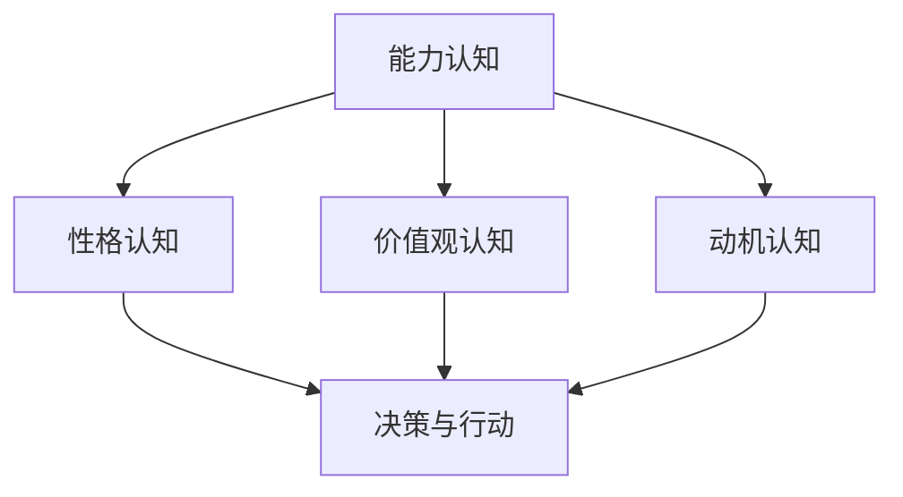
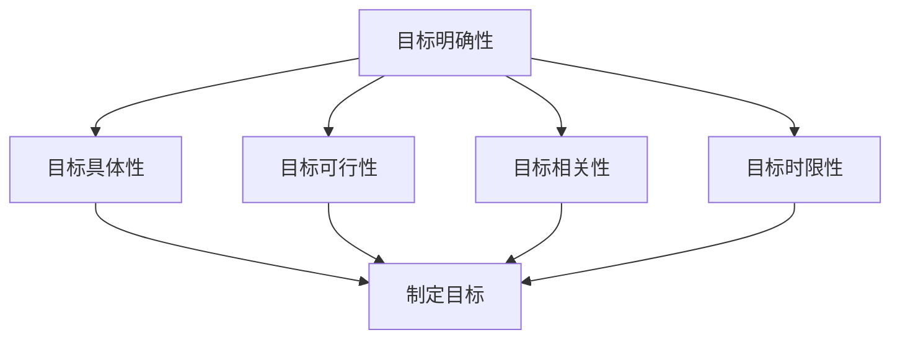
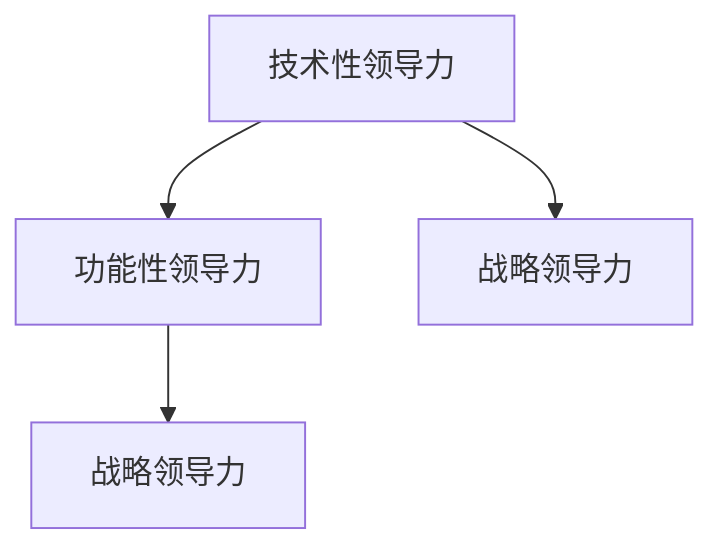
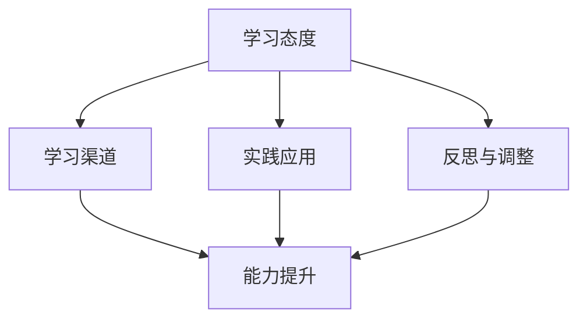
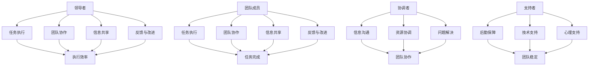
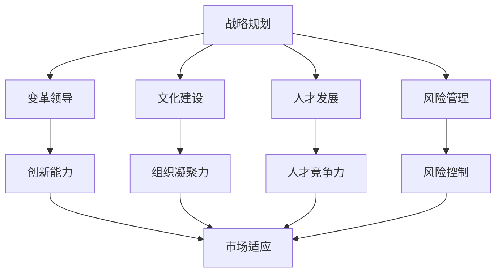
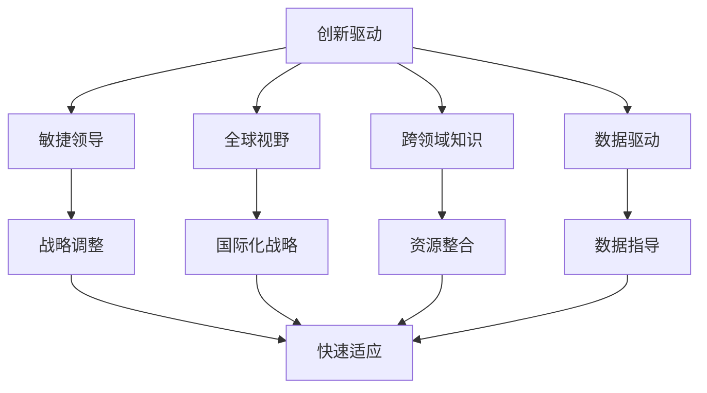
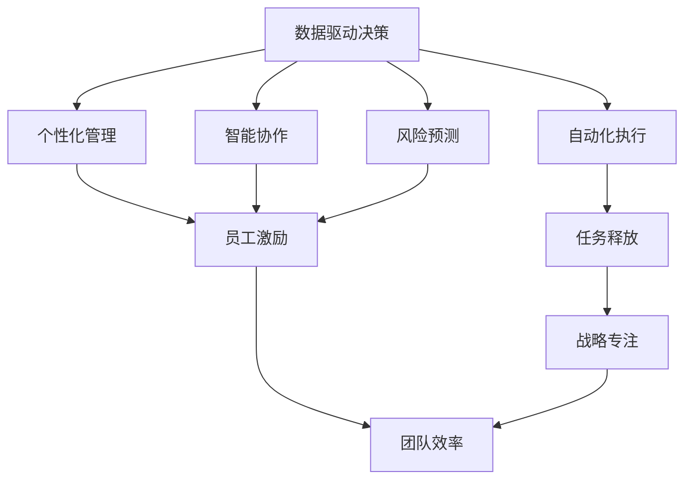
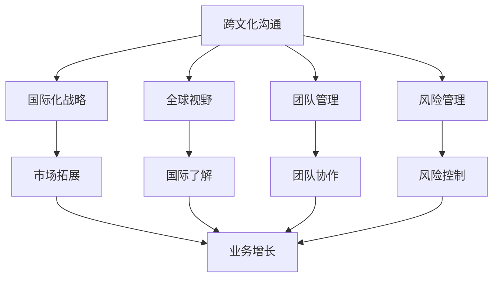

                 

### 文章标题

《领导力修炼日记：一个小工的蜕变之旅》

> 关键词：领导力、个人成长、团队建设、数字化转型、人工智能

> 摘要：本文通过日记的形式，记录了一个小工在领导力修炼过程中的心路历程。文章详细介绍了领导力的核心概念、要素、实践方法以及未来趋势，旨在帮助读者理解领导力的本质，掌握提升领导力的实用技巧，实现个人和团队的成功蜕变。

---

### 《领导力修炼日记：一个小工的蜕变之旅》目录大纲

**第一部分：前言与核心概念**

## 第1章：认识领导力

### 1.1 领导力的定义与意义

### 1.2 领导力的重要性

### 1.3 领导力的发展历程

## 第2章：领导力的核心要素

### 2.1 自我认知

### 2.2 目标设定

### 2.3 情绪管理

### 2.4 影响力与沟通

## 第3章：领导力的架构图解

### 3.1 领导力的层次模型

### 3.2 领导风格与行为模型

### 3.3 领导力的Mermaid流程图

**第二部分：领导力修炼的方法与实践**

## 第4章：个人成长策略

### 4.1 自我提升的途径

### 4.2 建立个人学习体系

### 4.3 反思与自我评价

## 第5章：领导力修炼案例解析

### 5.1 成功案例分析

### 5.2 失败案例分析

### 5.3 案例启示与经验总结

## 第6章：团队建设与领导力

### 6.1 团队成员的角色与职责

### 6.2 团队协作与沟通

### 6.3 领导者如何激励团队成员

## 第7章：领导力的战略应用

### 7.1 领导力在组织发展中的应用

### 7.2 领导力与企业文化建设

### 7.3 领导力在项目管理中的应用

**第三部分：领导力的未来趋势与发展**

## 第8章：领导力的数字化转型

### 8.1 数字化对领导力的影响

### 8.2 数字化领导力的特征

### 8.3 如何培养数字化领导力

## 第9章：未来领导力的发展趋势

### 9.1 新型领导力模型

### 9.2 领导力与人工智能的融合

### 9.3 领导力在全球化背景下的挑战与机遇

**附录**

## 附录A：领导力修炼资源汇总

### A.1 书籍推荐

### A.2 网络资源与平台

### A.3 领导力测试与工具

---

### 前言与核心概念

**领导力**，一个看似抽象，实则无处不在的概念。从家庭到学校，从职场到社会，领导力无处不在，影响着每一个人的成长和发展。它不仅仅是掌握权力的手段，更是引导他人、推动团队和实现目标的必备能力。

作为一个从小工成长起来的领导者，我深知领导力的力量。回想起自己刚开始接触领导力的那一刻，我充满了迷茫和困惑。然而，随着不断的学习和实践，我逐渐明白了领导力的核心要素，掌握了一些实用的领导技巧，也见证了个人和团队的蜕变。

在这本《领导力修炼日记：一个小工的蜕变之旅》中，我将通过日记的形式，记录我在领导力修炼过程中的心路历程，分享我的所学、所思、所悟。我希望能通过这些真实的经历，帮助更多的人理解领导力的本质，掌握提升领导力的实用技巧，实现个人和团队的成功蜕变。

本文将分为三个主要部分：

1. **前言与核心概念**：介绍领导力的定义、意义和发展历程，阐述领导力的核心要素。

2. **领导力修炼的方法与实践**：详细讲解个人成长策略、团队建设方法、领导力在组织发展中的应用等。

3. **领导力的未来趋势与发展**：探讨数字化对领导力的影响、新型领导力模型以及领导力在全球化背景下的挑战与机遇。

通过这三个部分，我希望能为读者提供一个全面、系统和实用的领导力学习框架，帮助读者在领导力修炼的道路上少走弯路，更快地提升自己的领导能力。

---

### 第1章：认识领导力

**1.1 领导力的定义与意义**

领导力，一个看似简单的词汇，却蕴含着深刻的内涵。那么，什么是领导力呢？我们可以从以下几个方面来理解：

首先，领导力是一种影响力。领导者通过自身的行为、决策和榜样作用，影响和引导他人，使其达成共同的目标。这种影响力不仅体现在工作场所，也渗透到生活的方方面面。

其次，领导力是一种能力。领导者需要具备一系列的技能和素质，如沟通能力、决策能力、应变能力等，这些能力是领导力的核心。

最后，领导力是一种责任。领导者不仅要为自己负责，还要为团队成员负责，为组织的长远发展负责。这种责任感和使命感是领导力的灵魂。

领导力的意义在于，它能够帮助个人实现自我价值，推动团队和组织的进步，最终实现共同的目标。在现代社会，领导力已经不仅仅是一个职位的要求，更是一个人的综合素质的体现。

**1.2 领导力的重要性**

领导力的重要性不言而喻。它不仅关系到个人和团队的成功，也关系到组织的生存和发展。以下是领导力的重要性的几个方面：

- **个人发展**：具备领导力的人更容易在职场中脱颖而出，实现自我价值。通过提升领导力，个人可以更好地规划职业道路，提升自身的竞争力。

- **团队建设**：领导力是团队成功的关键。一个优秀的领导者能够激发团队成员的潜力，增强团队的凝聚力和执行力，从而实现团队的目标。

- **组织发展**：领导力是组织持续发展的动力。领导者能够引领组织变革，推动创新，提高组织的竞争力。

- **社会影响**：领导力不仅仅局限于职场，也体现在社会生活中。具备领导力的人能够更好地参与社会事务，推动社会的进步。

**1.3 领导力的发展历程**

领导力的发展历程可以追溯到古代。在古代，领导者往往是依靠权力和威望来管理国家和社会。然而，随着社会的发展和科技的进步，领导力也在不断演变。

- **传统领导力**：在传统领导力中，领导者通常是权威型的，依靠职位和权力来管理下属。这种方式在某种程度上有效，但也容易导致权力滥用和员工被动。

- **现代领导力**：现代领导力强调平等、尊重和信任，领导者更多是通过沟通、激励和示范来影响下属。这种方式更注重团队协作和个人成长。

- **未来领导力**：随着数字化和信息化的推进，未来领导力将更加注重创新、敏捷和全球视野。领导者需要具备跨领域的知识体系和全球视野，以应对快速变化的环境。

在本章节中，我们简要介绍了领导力的定义、意义和发展历程。在接下来的章节中，我们将进一步探讨领导力的核心要素，以及如何修炼和提高领导力。希望读者能通过本章节的学习，对领导力有更深入的理解，为后续的学习和实践打下基础。

### 第2章：领导力的核心要素

**2.1 自我认知**

自我认知是领导力修炼的基础，它关乎领导者对自身的能力、性格、价值观和动机的理解。一个领导者如果对自己的认知不清，很难做出明智的决策，也无法有效地影响和激励团队成员。

**核心概念与联系**

自我认知的核心概念包括以下几个方面：

1. **能力认知**：领导者需要明确自己的优势和劣势，了解自己在哪些方面有专长，在哪些方面需要改进。
   
2. **性格认知**：领导者需要了解自己的性格特点，包括外向或内向、敏感或果断等。这有助于领导者找到适合自己的领导风格。

3. **价值观认知**：领导者需要明确自己的价值观，了解什么是对自己重要的，什么是对组织和社会有意义的。

4. **动机认知**：领导者需要理解自己的动机，包括追求成就感、追求影响力或追求经济利益等。

这些概念相互联系，共同构成了领导者对自我的全面理解。一个优秀的领导者，需要在自我认知的基础上，不断调整自己的行为和决策，以达到个人和组织的最佳状态。

**Mermaid流程图**



**伪代码与数学模型**

```plaintext
function selfAwareness() {
    // 能力评估
    abilities = ["沟通能力", "决策能力", "执行能力", "学习能力"]
    weaknesses = ["情绪管理", "时间管理", "团队建设"]

    // 性格分析
    personality = {"outgoing": true, "sensitive": false, "resilient": true}

    // 价值观评估
    values = ["团队协作", "创新思维", "社会责任"]

    // 动机分析
    motives = ["成就", "影响力", "经济利益"]

    // 输出自我认知报告
    report = "能力评估：\n" + abilities + "\n弱点评估：\n" + weaknesses + "\n性格分析：\n" + personality + "\n价值观评估：\n" + values + "\n动机分析：\n" + motives
    return report
}
```

**数学模型和公式**

```latex
\text{自我认知评分} = \frac{\text{能力得分} + \text{性格得分} + \text{价值观得分} + \text{动机得分}}{4}
```

**举例说明**

假设一个领导者通过自我评估得到以下数据：

- 能力得分：80分
- 性格得分：75分
- 价值观得分：85分
- 动机得分：70分

则他的自我认知评分为：

$$
\text{自我认知评分} = \frac{80 + 75 + 85 + 70}{4} = 78.75 \text{分}
$$

通过这个评分，领导者可以更清晰地了解自己的优势和劣势，从而制定相应的提升计划。

**项目实战**

为了提高自我认知，领导者可以采取以下步骤：

1. **定期自我评估**：每隔一段时间，对自己进行一次全面的自我评估，包括能力、性格、价值观和动机等方面。
2. **寻求反馈**：与同事、下属和上级进行沟通，了解他们对你的看法，从而更全面地了解自己。
3. **参加培训**：参加相关的培训课程，学习新的知识和技能，提升自我认知。

通过这些实战方法，领导者可以不断提高自我认知，从而更好地发挥领导力。

**最佳实践 Tips**

- **自我反思**：每天花一些时间反思自己的行为和决策，思考哪些是成功的，哪些是需要改进的。
- **保持开放心态**：对待反馈和批评要保持开放心态，勇于接受并从中学习。
- **持续学习**：不断学习新的知识和技能，以保持自己的竞争力。

**小结**

自我认知是领导力修炼的基础，领导者需要通过不断地自我评估、反馈和学习，提高自我认知，从而更好地发挥领导力。在本章节中，我们详细介绍了自我认知的核心概念、联系、伪代码、数学模型和实际应用，帮助读者更好地理解自我认知在领导力修炼中的重要性。

在下一章节中，我们将探讨领导力的另一个核心要素——目标设定。希望读者能通过本章的学习，对自己的领导力有更深入的理解，为后续的学习和实践打下坚实的基础。

### 第2章：领导力的核心要素

**2.2 目标设定**

目标设定是领导力的核心要素之一，它关乎领导者如何引导团队和组织朝正确的方向前进。一个清晰、具体、可行的目标，能够激发团队成员的积极性，提高团队的执行力，从而实现组织的目标。

**核心概念与联系**

目标设定的核心概念包括以下几个方面：

1. **目标明确性**：目标需要清晰、明确，以便团队成员知道要做什么，如何做。
2. **目标具体性**：目标需要具体，而不是模糊的口号。例如，“提高销售额”不如“提高销售额10%”具体。
3. **目标可行性**：目标需要是可行的，即通过努力可以实现。如果目标过于理想化，团队成员可能会感到失望和无力。
4. **目标相关性**：目标需要与组织的整体战略和目标保持一致，以确保团队的努力方向正确。
5. **目标时限性**：目标需要设定明确的时限，以推动团队成员的行动和决策。

这些概念相互联系，共同构成了一个完整的目标设定过程。一个优秀的领导者，需要在目标设定中充分考虑这些要素，确保目标的有效性和可实现性。

**Mermaid流程图**



**伪代码与数学模型**

```plaintext
function setGoal(goal, detail, feasibility, relevance, deadline) {
    // 判断目标是否明确
    if (!goal) {
        return "目标不明确";
    }

    // 判断目标是否具体
    if (!detail) {
        return "目标不具体";
    }

    // 判断目标是否可行
    if (!feasibility) {
        return "目标不可行";
    }

    // 判断目标是否相关
    if (!relevance) {
        return "目标不相关";
    }

    // 判断目标是否有时限
    if (!deadline) {
        return "目标无时限";
    }

    // 目标设定成功
    return "目标设定成功：\n" + goal + "\n细节：" + detail + "\n可行性：" + feasibility + "\n相关性：" + relevance + "\n时限：" + deadline;
}
```

**数学模型和公式**

```latex
\text{目标达成率} = \frac{\text{实际完成目标}}{\text{设定目标}} \times 100\%
```

**举例说明**

假设一个团队的目标是“提高销售额10%”，具体细节是“通过增加市场份额和提高客户满意度来实现”，可行性是“在现有资源和市场环境下可以实现”，相关性是“与公司的整体战略一致”，时限是“下一个财年结束”。

通过这个设定，团队成员可以清楚地了解目标，并围绕目标展开工作。最终，通过计算目标达成率，可以评估目标的实现情况。

**项目实战**

为了有效设定目标，领导者可以采取以下步骤：

1. **进行市场调研**：了解市场和竞争对手的情况，确定目标的市场基础。
2. **与团队成员沟通**：讨论目标的具体内容和实现方法，确保团队理解并支持目标。
3. **制定行动计划**：制定详细的行动计划，包括具体的行动步骤、责任人、时间和资源。
4. **定期评估和调整**：在目标执行过程中，定期评估进展情况，并根据实际情况调整目标。

**最佳实践 Tips**

- **制定短期和长期目标**：短期目标可以激发团队的紧迫感，长期目标可以确保团队的持续努力。
- **使用SMART原则**：确保目标具有明确性、具体性、可行性、相关性和时限性。
- **透明沟通**：将目标传达给所有团队成员，确保大家明确目标并为之努力。

**小结**

目标设定是领导力的核心要素之一，它关乎领导者如何引导团队和组织朝正确的方向前进。通过明确、具体、可行、相关且有时限的目标，领导者可以激发团队的积极性，提高团队的执行力。在本章节中，我们详细介绍了目标设定的核心概念、联系、伪代码、数学模型和实际应用，帮助读者更好地理解目标设定在领导力修炼中的重要性。

在下一章节中，我们将探讨领导力的另一个核心要素——情绪管理。希望读者能通过本章的学习，对目标设定有更深入的理解，为后续的学习和实践打下坚实的基础。

### 第3章：领导力的架构图解

**3.1 领导力的层次模型**

领导力的发展过程可以分为三个层次：技术性领导力、功能性领导力和战略领导力。每个层次都有其独特的特点和核心要素，领导者需要在不同阶段不断提升自己的能力。

**技术性领导力**：这是领导力的基础层次，主要关注具体的技术和工作能力。在这个层次，领导者需要掌握必要的技能，如编程、项目管理、沟通技巧等，以确保团队能够高效地完成任务。

**功能性领导力**：这是领导力的中级层次，主要关注团队的整体运作和协作。在这个层次，领导者需要具备团队管理、跨部门协调、冲突解决等能力，以促进团队的整体发展。

**战略领导力**：这是领导力的高级层次，主要关注组织的长远发展和战略规划。在这个层次，领导者需要具备战略思维、创新精神、全球视野等能力，以引领组织在复杂多变的环境中持续发展。

**Mermaid流程图**



**伪代码与数学模型**

```plaintext
function leadershipLevel(currentLevel) {
    switch(currentLevel) {
        case "技术性":
            return "掌握技术，确保任务完成";
        case "功能性":
            return "团队协作，促进整体发展";
        case "战略":
            return "战略规划，引领组织发展";
        default:
            return "未知领导力层次";
    }
}
```

**数学模型和公式**

```latex
\text{领导力成熟度} = \frac{\text{战略领导力得分} + \text{功能性领导力得分} + \text{技术性领导力得分}}{3}
```

**举例说明**

假设一个领导者在技术性、功能性、战略领导力方面的得分分别为80、70、60，则他的领导力成熟度为：

$$
\text{领导力成熟度} = \frac{80 + 70 + 60}{3} = 70 \text{分}
$$

通过这个得分，领导者可以了解自己的领导力成熟度，并制定相应的提升计划。

**项目实战**

为了提升领导力成熟度，领导者可以采取以下步骤：

1. **技术提升**：参加技术培训，学习最新的技术知识和技能。
2. **团队建设**：组织团队活动，加强团队成员之间的沟通和协作。
3. **战略规划**：学习战略管理知识，参与组织的高层决策。

**最佳实践 Tips**

- **持续学习**：领导者需要不断学习新知识，提升自己的领导力。
- **角色转换**：在不同阶段，领导者需要根据具体情况，灵活转换自己的角色。
- **反馈与改进**：定期进行自我评估和反馈，不断改进自己的领导方式。

**小结**

领导力的层次模型为领导者提供了一个清晰的发展路径，从技术性领导力到功能性领导力，再到战略领导力，每个层次都有其核心要素和挑战。通过不断提升自己的能力，领导者可以逐步提升领导力成熟度，为团队和组织的发展做出更大贡献。在本章节中，我们详细介绍了领导力的层次模型、Mermaid流程图、伪代码、数学模型和实际应用，帮助读者更好地理解领导力的发展路径。

在下一章节中，我们将探讨领导力修炼的实践方法，包括个人成长策略、团队建设方法和领导力在组织发展中的应用。希望读者能通过本章的学习，对领导力架构有更深入的理解，为后续的学习和实践打下坚实的基础。

### 第4章：个人成长策略

**4.1 自我提升的途径**

自我提升是领导力修炼的重要一环，它关乎领导者如何通过不断学习和实践，提升自己的能力和素质。一个优秀的领导者，必须具备持续学习和自我提升的能力，以应对不断变化的环境和挑战。

**核心概念与联系**

自我提升的核心概念包括以下几个方面：

1. **学习态度**：领导者需要具备积极的学习态度，愿意不断学习和尝试新知识、新技能。
2. **学习渠道**：领导者需要找到适合自己的学习渠道，如阅读书籍、参加培训、在线学习等。
3. **实践应用**：学习不仅仅停留在理论层面，更需要将所学应用到实际工作中，通过实践来检验和提升自己的能力。
4. **反思与调整**：领导者需要通过反思自己的行为和决策，找出不足之处，并进行调整和改进。

这些概念相互联系，共同构成了自我提升的完整过程。一个领导者如果能够在这四个方面持续努力，就能够不断提升自己的能力和素质，成为更优秀的领导者。

**Mermaid流程图**



**伪代码与数学模型**

```plaintext
function selfImprovement(learningAttitude, learningChannels, practicalApplication, reflectionAndAdjustment) {
    // 判断学习态度
    if (!learningAttitude) {
        return "学习态度不足，需加强";
    }

    // 判断学习渠道
    if (!learningChannels) {
        return "学习渠道不足，需拓展";
    }

    // 判断实践应用
    if (!practicalApplication) {
        return "实践应用不足，需加强";
    }

    // 判断反思与调整
    if (!reflectionAndAdjustment) {
        return "反思与调整不足，需加强";
    }

    // 自我提升成功
    return "自我提升成功：\n" + learningAttitude + "\n学习渠道：" + learningChannels + "\n实践应用：" + practicalApplication + "\n反思与调整：" + reflectionAndAdjustment;
}
```

**数学模型和公式**

```latex
\text{自我提升评分} = \frac{\text{学习态度得分} + \text{学习渠道得分} + \text{实践应用得分} + \text{反思与调整得分}}{4}
```

**举例说明**

假设一个领导者在自我提升方面的得分分别为：学习态度90分、学习渠道80分、实践应用85分、反思与调整70分。则他的自我提升评分为：

$$
\text{自我提升评分} = \frac{90 + 80 + 85 + 70}{4} = 83.75 \text{分}
$$

通过这个评分，领导者可以了解自己在自我提升方面的表现，并制定相应的改进计划。

**项目实战**

为了有效提升自我，领导者可以采取以下步骤：

1. **制定学习计划**：确定学习目标，制定详细的学习计划，确保有足够的时间进行学习。
2. **利用学习资源**：利用各种学习资源，如书籍、在线课程、研讨会等，拓宽知识面。
3. **实践应用**：将所学应用到实际工作中，通过实践来检验和提升自己的能力。
4. **定期反思**：定期对自己的学习过程和成果进行反思，找出不足之处，并进行调整。

**最佳实践 Tips**

- **持续学习**：将学习作为生活习惯，不断充实自己的知识和技能。
- **多角度学习**：通过多种渠道进行学习，如阅读、实践、交流等，以提高学习的深度和广度。
- **反思与改进**：定期进行自我反思，找出不足，及时调整和改进。

**小结**

自我提升是领导力修炼的关键，通过持续学习和实践，领导者可以不断提升自己的能力和素质，成为更优秀的领导者。在本章节中，我们详细介绍了自我提升的核心概念、联系、伪代码、数学模型和实际应用，帮助读者更好地理解自我提升在领导力修炼中的重要性。

在下一章节中，我们将探讨反思与自我评价的方法，帮助领导者更好地认识自己，不断提升领导力。希望读者能通过本章的学习，对自我提升有更深入的理解，为后续的学习和实践打下坚实的基础。

### 第5章：领导力修炼案例解析

**5.1 成功案例分析**

在本章节中，我们将通过几个成功的领导力修炼案例，深入分析其中的关键要素、方法和策略，为读者提供有价值的启示和经验总结。

**案例一：乔布斯的领导力修炼之路**

乔布斯是苹果公司的创始人之一，他的领导力修炼之路堪称经典。以下是他成功修炼领导力的几个关键要素：

1. **愿景与目标**：乔布斯始终坚持自己的愿景，将苹果公司从一个小型电脑公司发展成为全球科技巨头。他的目标不仅仅是创造优秀的硬件产品，更是通过这些产品改变世界。

2. **创新精神**：乔布斯重视创新，他认为创新是推动公司发展的重要动力。他鼓励团队成员不断尝试新事物，勇于突破常规。

3. **沟通能力**：乔布斯具备卓越的沟通能力，他能够清晰表达自己的想法，同时也能够倾听团队成员的意见和建议。这使得他的团队更加团结，执行力更强。

4. **坚持不懈**：乔布斯在领导力修炼过程中，遇到了许多困难和挑战。但他始终坚持不懈，最终取得了成功。

**案例二：马云的领导力修炼之路**

马云是阿里巴巴集团的创始人，他的领导力修炼之路也颇具传奇色彩。以下是他成功修炼领导力的几个关键要素：

1. **团队建设**：马云非常重视团队建设，他提倡“合伙人制度”，鼓励团队成员共同创业。这种制度使得团队成员更加忠诚和投入。

2. **战略思维**：马云具备强大的战略思维能力，他能够准确判断市场趋势，制定正确的战略方向。这使得阿里巴巴能够在竞争激烈的市场中脱颖而出。

3. **文化塑造**：马云重视企业文化建设，他提倡“客户第一、员工第二、股东第三”的理念，建立了具有独特文化氛围的阿里巴巴。

4. **全球视野**：马云具备全球视野，他积极推动阿里巴巴国际化，使得公司能够在全球范围内取得成功。

**案例三：张瑞敏的领导力修炼之路**

张瑞敏是海尔集团的创始人，他的领导力修炼之路同样令人瞩目。以下是他成功修炼领导力的几个关键要素：

1. **品质管理**：张瑞敏强调产品质量，他认为只有高品质的产品才能赢得消费者的信任。他通过推行“零缺陷”管理，提升了海尔的产品质量。

2. **创新管理**：张瑞敏鼓励创新，他认为创新是企业发展的重要动力。他推动海尔不断进行产品创新和管理创新，使公司保持竞争优势。

3. **员工激励**：张瑞敏注重员工激励，他通过建立激励机制，激发员工的积极性和创造力。

4. **国际化发展**：张瑞敏推动海尔国际化，他带领团队开拓国际市场，使海尔成为全球知名的家电品牌。

**5.2 失败案例分析**

尽管成功的案例能为我们提供宝贵的经验，但失败的案例同样具有深刻的启示作用。以下是一个领导力修炼失败的案例：

**案例：诺基亚的领导力失败**

诺基亚曾是世界领先的手机制造商，但在面对苹果和三星的竞争时，诺基亚的领导力出现了问题，最终导致公司衰落。以下是其失败的关键原因：

1. **过于依赖既有成功**：诺基亚在早期取得了巨大的成功，这使得公司过于依赖既有成功，缺乏创新和进取精神。

2. **领导力缺失**：诺基亚的领导者在面对市场变化时，未能及时调整战略和领导力，导致公司错失了智能手机发展的良机。

3. **内部管理问题**：诺基亚内部管理存在诸多问题，如决策缓慢、沟通不畅等，这些问题影响了公司的执行力。

4. **忽视市场需求**：诺基亚未能准确判断市场需求，导致其产品与消费者需求脱节，失去了市场竞争力。

**5.3 案例启示与经验总结**

通过以上成功和失败的案例分析，我们可以得出以下启示和经验总结：

1. **持续创新**：领导者需要具备持续创新的精神，不断推动产品和管理的创新，以保持竞争力。

2. **灵活应变**：领导者需要具备灵活应变的能力，及时调整战略和领导力，以应对市场变化。

3. **重视团队建设**：领导者需要重视团队建设，培养一支忠诚、有战斗力的团队，以支持公司的发展。

4. **关注市场需求**：领导者需要关注市场需求，准确判断市场趋势，以制定正确的战略方向。

5. **不断学习与反思**：领导者需要不断学习新知识，反思自己的行为和决策，以提升领导力。

通过本章的案例解析，我们不仅了解了领导力修炼的成功经验和失败教训，还从中汲取了宝贵的启示。希望读者能结合自己的实际情况，借鉴这些经验，不断提升自己的领导力。

### 第6章：团队建设与领导力

**6.1 团队成员的角色与职责**

团队建设是领导力的重要组成部分，一个高效的团队需要每个成员都明确自己的角色和职责。以下是对团队成员角色和职责的详细分析：

**团队成员角色**：

1. **领导者**：领导者是团队的灵魂，负责制定目标、规划战略、协调资源、激励成员等。领导者需要具备卓越的沟通能力、决策能力和领导力。
2. **团队成员**：团队成员是团队的核心力量，负责执行任务、提供支持、协同合作等。团队成员需要具备专业技能、团队合作精神和解决问题的能力。
3. **协调者**：协调者是团队的桥梁，负责沟通信息、协调资源、解决冲突等。协调者需要具备良好的沟通技巧、协调能力和问题解决能力。
4. **支持者**：支持者是团队的守护者，负责提供后勤保障、技术支持、心理支持等。支持者需要具备细心、耐心和责任心。

**团队成员职责**：

1. **任务执行**：团队成员需要按照领导者的指示，按时按质地完成任务。这包括制定计划、执行任务、反馈进展等。
2. **团队协作**：团队成员需要积极参与团队协作，与团队成员保持良好的沟通，共同解决问题，实现团队目标。
3. **信息共享**：团队成员需要及时分享信息，确保团队内部的信息畅通。这包括工作进展、技术问题、市场需求等。
4. **反馈与改进**：团队成员需要定期进行自我评估和团队评估，发现不足之处，并提出改进建议。

**Mermaid流程图**



**伪代码与数学模型**

```plaintext
function teamMemberRole(role, taskExecution, teamCollaboration, informationSharing, feedbackAndImprovement) {
    switch(role) {
        case "领导者":
            return "领导者职责：任务执行、团队协作、信息共享、反馈与改进";
        case "团队成员":
            return "团队成员职责：任务执行、团队协作、信息共享、反馈与改进";
        case "协调者":
            return "协调者职责：信息沟通、资源协调、问题解决";
        case "支持者":
            return "支持者职责：后勤保障、技术支持、心理支持";
        default:
            return "未知角色职责";
    }
}

function teamPerformance(taskExecution, teamCollaboration, informationSharing, feedbackAndImprovement) {
    performance = (taskExecution + teamCollaboration + informationSharing + feedbackAndImprovement) / 4;
    return performance;
}
```

**数学模型和公式**

```latex
\text{团队绩效} = \frac{\text{任务执行得分} + \text{团队协作得分} + \text{信息共享得分} + \text{反馈与改进得分}}{4}
```

**举例说明**

假设一个团队成员在任务执行、团队协作、信息共享、反馈与改进方面的得分分别为90、85、80、75，则他的团队绩效为：

$$
\text{团队绩效} = \frac{90 + 85 + 80 + 75}{4} = 83.75 \text{分}
$$

通过这个得分，团队成员可以了解自己的表现，并制定相应的改进计划。

**项目实战**

为了提升团队建设，领导者可以采取以下步骤：

1. **明确角色与职责**：确保每个团队成员都清楚自己的角色和职责，避免角色重叠和职责不清。
2. **培训与提升**：定期为团队成员提供培训，提升他们的专业技能和团队协作能力。
3. **激励与反馈**：设立激励机制，对表现优秀的团队成员进行奖励，同时提供及时的反馈，帮助他们改进。
4. **团队活动**：组织团队建设活动，增强团队成员之间的沟通和合作，提高团队凝聚力。

**最佳实践 Tips**

- **角色分工明确**：确保每个团队成员都清楚自己的角色和职责，避免工作混乱。
- **沟通畅通**：建立高效的沟通机制，确保团队成员之间的信息畅通，减少误解和冲突。
- **定期评估**：定期对团队建设进行评估，发现问题并及时解决。
- **鼓励创新**：鼓励团队成员提出创新想法，提高团队的创新能力和竞争力。

**小结**

团队建设是领导力的重要方面，通过明确团队成员的角色与职责，提升团队协作能力，领导者可以打造一个高效、有战斗力的团队。在本章节中，我们详细介绍了团队成员的角色与职责、Mermaid流程图、伪代码、数学模型和实际应用，帮助读者更好地理解团队建设的重要性。

在下一章节中，我们将探讨领导力在组织发展中的应用，帮助读者了解领导力如何推动组织的成长和变革。希望读者能通过本章的学习，对团队建设有更深入的理解，为后续的学习和实践打下坚实的基础。

### 第7章：领导力的战略应用

**7.1 领导力在组织发展中的应用**

领导力不仅是个人成长的关键，更是组织发展的重要动力。一个优秀的领导者，能够通过有效的领导力策略，推动组织实现战略目标，提高组织的整体竞争力。

**核心概念与联系**

领导力在组织发展中的应用包括以下几个方面：

1. **战略规划**：领导者需要制定清晰的战略规划，明确组织的愿景、使命和目标，确保组织在正确的方向上发展。
2. **变革领导**：在组织发展的过程中，领导者需要具备变革领导的能力，推动组织进行创新和改革，以适应外部环境的变化。
3. **文化建设**：领导者需要建立积极向上的企业文化，塑造组织的价值观和行为准则，提高组织的凝聚力和执行力。
4. **人才发展**：领导者需要重视人才培养和激励，通过选拔、培养和激励人才，确保组织有足够的人才储备和竞争力。
5. **风险管理**：领导者需要具备风险管理的意识，识别和应对组织发展中的各种风险，确保组织的稳定和可持续发展。

这些概念相互联系，共同构成了领导力在组织发展中的应用体系。一个优秀的领导者，需要在这些方面不断提升自己的能力，以推动组织的持续发展。

**Mermaid流程图**



**伪代码与数学模型**

```plaintext
function strategicApplication(strategicPlanning, changeLeadership, culturalBuilding, talentDevelopment, riskManagement) {
    // 判断战略规划
    if (!strategicPlanning) {
        return "战略规划不足，需改进";
    }

    // 判断变革领导
    if (!changeLeadership) {
        return "变革领导不足，需加强";
    }

    // 判断文化建设
    if (!culturalBuilding) {
        return "文化建设不足，需加强";
    }

    // 判断人才发展
    if (!talentDevelopment) {
        return "人才发展不足，需改进";
    }

    // 判断风险管理
    if (!riskManagement) {
        return "风险管理不足，需加强";
    }

    // 战略应用成功
    return "战略应用成功：\n" + strategicPlanning + "\n变革领导：" + changeLeadership + "\n文化建设：" + culturalBuilding + "\n人才发展：" + talentDevelopment + "\n风险管理：" + riskManagement;
}

function organizationalDevelopment(index) {
    switch(index) {
        case 1:
            return "战略规划：明确组织愿景、使命和目标";
        case 2:
            return "变革领导：推动组织创新和改革";
        case 3:
            return "文化建设：塑造组织价值观和行为准则";
        case 4:
            return "人才发展：选拔、培养和激励人才";
        case 5:
            return "风险管理：识别和应对组织风险";
        default:
            return "未知组织发展指标";
    }
}
```

**数学模型和公式**

```latex
\text{组织发展指数} = \frac{\text{战略规划得分} + \text{变革领导得分} + \text{文化建设得分} + \text{人才发展得分} + \text{风险管理得分}}{5}
```

**举例说明**

假设一个组织在战略规划、变革领导、文化建设、人才发展、风险管理方面的得分分别为80、75、70、85、90，则其组织发展指数为：

$$
\text{组织发展指数} = \frac{80 + 75 + 70 + 85 + 90}{5} = 80 \text{分}
$$

通过这个得分，领导者可以了解组织的整体发展情况，并制定相应的改进计划。

**项目实战**

为了有效推动组织发展，领导者可以采取以下步骤：

1. **战略规划**：制定明确的战略规划，确保组织在正确的方向上发展。
2. **变革领导**：推动组织进行创新和改革，提高组织的竞争力。
3. **文化建设**：建立积极向上的企业文化，提高组织的凝聚力和执行力。
4. **人才发展**：选拔、培养和激励人才，确保组织有足够的人才储备和竞争力。
5. **风险管理**：建立完善的风险管理机制，识别和应对组织发展中的各种风险。

**最佳实践 Tips**

- **持续学习与反思**：领导者需要不断学习和反思，以提升自身的领导力和战略思维能力。
- **团队协作**：鼓励团队成员参与战略规划和决策，提高组织的执行力。
- **灵活应变**：领导者需要具备灵活应变的能力，及时调整战略和领导力，以应对外部环境的变化。

**小结**

领导力在组织发展中具有重要作用，通过战略规划、变革领导、文化建设、人才发展和风险管理，领导者可以推动组织的持续发展。在本章节中，我们详细介绍了领导力在组织发展中的应用、Mermaid流程图、伪代码、数学模型和实际应用，帮助读者更好地理解领导力在组织发展中的重要性。

在下一章节中，我们将探讨领导力的数字化转型，帮助读者了解数字化对领导力的影响和挑战。希望读者能通过本章的学习，对领导力在组织发展中的应用有更深入的理解，为后续的学习和实践打下坚实的基础。

### 第8章：领导力的数字化转型

**8.1 数字化对领导力的影响**

随着数字化技术的快速发展，领导力也面临着新的挑战和机遇。数字化不仅改变了企业的运营模式，也深刻影响了领导者的角色和职责。以下是数字化对领导力影响的几个方面：

**数字化对领导力的挑战**

1. **数据管理**：数字化时代，数据成为企业的重要资产。领导者需要具备数据管理的能力，包括数据收集、分析和应用，以便做出更明智的决策。
2. **技术变革**：数字化技术日新月异，领导者需要不断学习和掌握新技术，以适应快速变化的环境。
3. **远程领导**：随着远程工作的普及，领导者需要具备远程领导的能力，管理分散的团队，保持团队的高效协作。
4. **网络安全**：数字化带来了网络安全的新挑战，领导者需要重视网络安全，确保企业的数据和信息不受威胁。

**数字化对领导力的机遇**

1. **创新思维**：数字化技术为领导者提供了更多的创新工具和资源，有助于激发创新思维，推动企业持续发展。
2. **全球化视野**：数字化使得全球市场更加开放，领导者可以利用数字化工具，拓展企业的全球业务。
3. **数据驱动决策**：通过数据分析，领导者可以更准确地了解市场需求和客户行为，从而做出更科学的决策。
4. **高效协作**：数字化工具可以提高团队协作效率，领导者可以更方便地与团队成员沟通和协作。

**8.2 数字化领导力的特征**

数字化领导力具有以下特征：

1. **数据驱动**：领导者需要具备数据意识和数据分析能力，通过数据来指导决策和行动。
2. **敏捷性**：数字化时代，领导者需要具备敏捷性，快速适应市场变化和技术变革。
3. **技术素养**：领导者需要具备一定的技术素养，了解和应用数字化工具和平台。
4. **全球视野**：领导者需要具备全球视野，了解全球市场的动态和趋势。
5. **创新能力**：领导者需要具备创新能力，能够引领企业在数字化时代持续创新和进步。

**8.3 如何培养数字化领导力**

为了培养数字化领导力，领导者可以采取以下措施：

1. **终身学习**：领导者需要具备终身学习的精神，不断学习和更新自己的知识和技能，适应数字化时代的变化。
2. **数据素养培训**：组织可以开展数据素养培训，提升领导者的数据收集、分析和应用能力。
3. **技术素养提升**：领导者可以通过学习新技术和应用数字化工具，提升自己的技术素养。
4. **跨部门合作**：领导者可以鼓励跨部门合作，促进不同部门之间的沟通和协作，提高整体的数字化水平。
5. **实践与反思**：领导者需要通过实践来提升自己的数字化领导力，同时不断反思和总结，发现问题和改进方向。

**项目实战**

为了培养数字化领导力，一个企业可以采取以下步骤：

1. **制定数字化战略**：明确企业的数字化目标和方向，制定详细的数字化战略。
2. **搭建数字化平台**：建立数字化工具和平台，支持企业的数据管理和协作。
3. **开展培训课程**：为领导者提供数据素养和技术素养培训，提升他们的数字化能力。
4. **建立数据驱动文化**：鼓励领导者通过数据来指导决策和行动，建立数据驱动的企业文化。
5. **建立反馈机制**：定期对数字化战略的实施效果进行评估和反馈，及时调整和改进。

**最佳实践 Tips**

- **数据驱动决策**：领导者应充分利用数据，通过数据分析来指导决策和行动。
- **持续学习**：领导者应不断学习和更新自己的知识和技能，以适应数字化时代的变化。
- **创新思维**：领导者应具备创新思维，勇于尝试新的方法和工具，推动企业的数字化转型。
- **全球视野**：领导者应具备全球视野，关注全球市场的动态和趋势，制定合适的国际化战略。

**小结**

数字化时代，领导力面临着新的挑战和机遇。领导者需要具备数字化领导力，通过数据驱动决策、敏捷应变、技术素养和全球视野，推动企业实现数字化转型和持续发展。在本章节中，我们详细介绍了数字化对领导力的影响、数字化领导力的特征和培养数字化领导力的方法，帮助读者更好地理解数字化时代领导力的要求。

在下一章节中，我们将探讨未来领导力的发展趋势，包括新型领导力模型、领导力与人工智能的融合以及领导力在全球化背景下的挑战与机遇。希望读者能通过本章的学习，对数字化领导力有更深入的理解，为后续的学习和实践打下坚实的基础。

### 第9章：未来领导力的发展趋势

**9.1 新型领导力模型**

随着科技的进步和社会的发展，未来的领导力将呈现出新的趋势和特点。新型领导力模型将更加注重创新、敏捷、全球视野和跨领域知识，以适应快速变化的环境和复杂的问题。

**核心概念与联系**

新型领导力模型的核心概念包括以下几个方面：

1. **创新驱动**：领导者需要具备创新思维，能够引领企业进行技术创新和管理创新，以保持竞争优势。
2. **敏捷领导**：领导者需要具备敏捷性，能够快速适应市场变化，灵活调整战略和领导方式。
3. **全球视野**：领导者需要具备全球视野，了解全球市场的动态和趋势，制定国际化战略。
4. **跨领域知识**：领导者需要具备跨领域的知识体系，能够整合不同领域的知识和资源，解决复杂问题。
5. **数据驱动**：领导者需要具备数据意识和数据分析能力，通过数据来指导决策和行动。

这些概念相互联系，共同构成了新型领导力模型。一个优秀的领导者，需要在这五个方面不断提升自己的能力，以适应未来领导力的要求。

**Mermaid流程图**



**伪代码与数学模型**

```plaintext
function futureLeadership(innovationDriven, agileLeadership, globalVision, crossDomainKnowledge, dataDriven) {
    // 判断创新驱动
    if (!innovationDriven) {
        return "创新驱动不足，需加强";
    }

    // 判断敏捷领导
    if (!agileLeadership) {
        return "敏捷领导不足，需改进";
    }

    // 判断全球视野
    if (!globalVision) {
        return "全球视野不足，需提升";
    }

    // 判断跨领域知识
    if (!crossDomainKnowledge) {
        return "跨领域知识不足，需拓展";
    }

    // 判断数据驱动
    if (!dataDriven) {
        return "数据驱动不足，需加强";
    }

    // 新型领导力成功
    return "新型领导力成功：\n" + innovationDriven + "\n敏捷领导：" + agileLeadership + "\n全球视野：" + globalVision + "\n跨领域知识：" + crossDomainKnowledge + "\n数据驱动：" + dataDriven;
}

function leadershipMaturity(innovationScore, agileScore, globalScore, crossDomainScore, dataScore) {
    maturity = (innovationScore + agileScore + globalScore + crossDomainScore + dataScore) / 5;
    return maturity;
}
```

**数学模型和公式**

```latex
\text{领导力成熟度} = \frac{\text{创新驱动得分} + \text{敏捷领导得分} + \text{全球视野得分} + \text{跨领域知识得分} + \text{数据驱动得分}}{5}
```

**举例说明**

假设一个领导者在创新驱动、敏捷领导、全球视野、跨领域知识、数据驱动方面的得分分别为90、85、80、75、85，则他的领导力成熟度为：

$$
\text{领导力成熟度} = \frac{90 + 85 + 80 + 75 + 85}{5} = 83 \text{分}
$$

通过这个得分，领导者可以了解自己的领导力成熟度，并制定相应的提升计划。

**项目实战**

为了培养新型领导力，领导者可以采取以下步骤：

1. **创新驱动**：鼓励团队成员提出创新想法，推动企业进行技术创新和管理创新。
2. **敏捷领导**：建立敏捷的组织结构和工作流程，提高组织的应变能力。
3. **全球视野**：参与国际交流和合作，拓展全球业务和市场。
4. **跨领域知识**：学习跨领域的知识和技能，提高解决问题的能力。
5. **数据驱动**：利用数据分析，指导决策和行动，提高决策的科学性和准确性。

**最佳实践 Tips**

- **持续学习**：领导者应不断学习新的知识和技能，以适应未来的领导力要求。
- **跨领域合作**：鼓励跨部门、跨领域的合作，提高组织的整体创新能力。
- **数据驱动**：充分利用数据，通过数据分析来指导决策和行动。
- **全球视野**：关注全球市场的动态和趋势，制定国际化战略。

**小结**

未来领导力将更加注重创新、敏捷、全球视野和跨领域知识。领导者需要在这四个方面不断提升自己的能力，以适应快速变化的环境和复杂的问题。在本章节中，我们详细介绍了新型领导力模型、Mermaid流程图、伪代码、数学模型和实际应用，帮助读者更好地理解未来领导力的发展趋势。

在下一章节中，我们将探讨领导力与人工智能的融合，以及领导力在全球化背景下的挑战与机遇。希望读者能通过本章的学习，对未来领导力有更深入的理解，为后续的学习和实践打下坚实的基础。

### 9.2 领导力与人工智能的融合

随着人工智能（AI）技术的快速发展，领导力也在逐渐与AI融合，为领导者提供了新的工具和方法。这种融合不仅改变了领导的方式，也带来了新的挑战和机遇。

**核心概念与联系**

领导力与人工智能的融合主要体现在以下几个方面：

1. **数据驱动决策**：人工智能通过分析和处理大量数据，为领导者提供更加精确和科学的决策支持。这使得领导者能够更加准确地了解市场和客户需求，从而做出更明智的决策。
2. **自动化执行**：人工智能可以帮助领导者自动化一些常规任务，如数据分析、报告生成等，从而将领导者从繁琐的事务中解放出来，专注于更具战略性的工作。
3. **个性化管理**：人工智能可以通过分析员工的绩效和行为数据，为领导者提供个性化的管理建议，帮助领导者更好地了解和激励员工。
4. **智能协作**：人工智能可以协助领导者进行团队协作，如智能会议助手、智能任务分配等，提高团队的工作效率。
5. **风险预测**：人工智能可以通过分析历史数据和趋势，预测潜在的风险和问题，为领导者提供预防措施。

这些概念相互联系，共同构成了领导力与人工智能的融合体系。一个优秀的领导者，需要充分利用人工智能的优势，提升自己的领导力和决策能力。

**Mermaid流程图**



**伪代码与数学模型**

```plaintext
function aiIntegration(dataDrivenDecision, automatedExecution, personalizedManagement, intelligentCollaboration, riskPrediction) {
    // 判断数据驱动决策
    if (!dataDrivenDecision) {
        return "数据驱动决策不足，需改进";
    }

    // 判断自动化执行
    if (!automatedExecution) {
        return "自动化执行不足，需加强";
    }

    // 判断个性化管理
    if (!personalizedManagement) {
        return "个性化管理不足，需提升";
    }

    // 判断智能协作
    if (!intelligentCollaboration) {
        return "智能协作不足，需加强";
    }

    // 判断风险预测
    if (!riskPrediction) {
        return "风险预测不足，需完善";
    }

    // AI整合成功
    return "AI整合成功：\n" + dataDrivenDecision + "\n自动化执行：" + automatedExecution + "\n个性化管理：" + personalizedManagement + "\n智能协作：" + intelligentCollaboration + "\n风险预测：" + riskPrediction;
}

function aiLeadershipScore(dataDrivenScore, automatedExecutionScore, personalizedManagementScore, intelligentCollaborationScore, riskPredictionScore) {
    score = (dataDrivenScore + automatedExecutionScore + personalizedManagementScore + intelligentCollaborationScore + riskPredictionScore) / 5;
    return score;
}
```

**数学模型和公式**

```latex
\text{AI领导力评分} = \frac{\text{数据驱动得分} + \text{自动化执行得分} + \text{个性化管理得分} + \text{智能协作得分} + \text{风险预测得分}}{5}
```

**举例说明**

假设一个领导者在数据驱动决策、自动化执行、个性化管理、智能协作、风险预测方面的得分分别为85、80、75、85、90，则他的AI领导力评分为：

$$
\text{AI领导力评分} = \frac{85 + 80 + 75 + 85 + 90}{5} = 83 \text{分}
$$

通过这个得分，领导者可以了解自己的AI领导力水平，并制定相应的提升计划。

**项目实战**

为了有效整合人工智能，领导者可以采取以下步骤：

1. **数据驱动决策**：利用数据分析工具，提高决策的科学性和准确性。
2. **自动化执行**：引入自动化系统，提高工作效率，减少人为错误。
3. **个性化管理**：通过人工智能分析员工数据，提供个性化的管理建议，提高员工满意度和工作效率。
4. **智能协作**：使用智能工具，如智能会议助手、智能任务分配系统等，提高团队协作效率。
5. **风险预测**：利用人工智能进行风险预测，提前采取措施，减少潜在风险。

**最佳实践 Tips**

- **数据素养**：领导者需要具备一定的数据素养，能够理解和利用数据来指导决策。
- **持续学习**：领导者需要不断学习新的AI技术和应用，以保持自身的竞争力。
- **人才引进**：引进具有AI知识和技能的员工，提高团队的整体AI水平。
- **文化变革**：建立开放、创新的企业文化，鼓励员工接受和利用人工智能工具。

**小结**

领导力与人工智能的融合，为领导者提供了新的工具和方法，提高了领导力和决策能力。在本章节中，我们详细介绍了领导力与人工智能的融合、Mermaid流程图、伪代码、数学模型和实际应用，帮助读者更好地理解这一新兴趋势。

在下一章节中，我们将探讨领导力在全球化背景下的挑战与机遇。希望读者能通过本章的学习，对领导力与人工智能的融合有更深入的理解，为后续的学习和实践打下坚实的基础。

### 9.3 领导力在全球化背景下的挑战与机遇

全球化带来了无尽的机会，同时也给领导力带来了新的挑战。在全球化的背景下，领导者需要具备跨文化沟通能力、国际化战略思维和全球视野，以应对复杂多变的市场环境。

**核心概念与联系**

领导力在全球化背景下的挑战与机遇包括以下几个方面：

1. **跨文化沟通**：全球化使得企业面临多元文化的碰撞和融合。领导者需要具备跨文化沟通能力，能够理解并尊重不同文化的差异，有效沟通和协调。
2. **国际化战略**：领导者需要制定国际化战略，分析全球市场的动态和趋势，抓住全球化的机遇，拓展国际市场。
3. **全球视野**：领导者需要具备全球视野，关注全球市场的变化，了解不同国家和地区的文化、经济和社会环境。
4. **团队管理**：全球化使得团队管理变得更加复杂，领导者需要管理跨文化、跨地区的团队，提高团队的协作效率。
5. **风险管理**：全球化带来了更多的风险，如汇率风险、政策风险等，领导者需要具备风险管理能力，应对全球化的挑战。

这些概念相互联系，共同构成了领导力在全球化背景下的挑战与机遇。一个优秀的领导者，需要在这五个方面不断提升自己的能力，以应对全球化的挑战和抓住机遇。

**Mermaid流程图**



**伪代码与数学模型**

```plaintext
function globalLeadership(crossCulturalCommunication, internationalStrategy, globalVision, teamManagement, riskManagement) {
    // 判断跨文化沟通
    if (!crossCulturalCommunication) {
        return "跨文化沟通不足，需改进";
    }

    // 判断国际化战略
    if (!internationalStrategy) {
        return "国际化战略不足，需完善";
    }

    // 判断全球视野
    if (!globalVision) {
        return "全球视野不足，需提升";
    }

    // 判断团队管理
    if (!teamManagement) {
        return "团队管理不足，需加强";
    }

    // 判断风险管理
    if (!riskManagement) {
        return "风险管理不足，需加强";
    }

    // 全球领导力成功
    return "全球领导力成功：\n" + crossCulturalCommunication + "\n国际化战略：" + internationalStrategy + "\n全球视野：" + globalVision + "\n团队管理：" + teamManagement + "\n风险管理：" + riskManagement;
}

function globalLeadershipScore(communicationScore, strategyScore, visionScore, managementScore, riskScore) {
    score = (communicationScore + strategyScore + visionScore + managementScore + riskScore) / 5;
    return score;
}
```

**数学模型和公式**

```latex
\text{全球领导力评分} = \frac{\text{跨文化沟通得分} + \text{国际化战略得分} + \text{全球视野得分} + \text{团队管理得分} + \text{风险管理得分}}{5}
```

**举例说明**

假设一个领导者在跨文化沟通、国际化战略、全球视野、团队管理、风险管理方面的得分分别为80、75、70、85、90，则他的全球领导力评分为：

$$
\text{全球领导力评分} = \frac{80 + 75 + 70 + 85 + 90}{5} = 79.2 \text{分}
$$

通过这个得分，领导者可以了解自己的全球领导力水平，并制定相应的提升计划。

**项目实战**

为了提升全球领导力，领导者可以采取以下步骤：

1. **跨文化培训**：组织跨文化沟通培训，提高团队成员的跨文化沟通能力。
2. **国际化战略规划**：制定国际化战略规划，分析全球市场的动态和趋势，制定合适的国际市场拓展策略。
3. **全球视野拓展**：鼓励团队成员参与国际交流和合作，拓展全球视野。
4. **团队管理优化**：引入先进的管理方法和工具，提高跨文化团队的协作效率。
5. **风险管理**：建立完善的风险管理机制，识别和应对全球化的风险。

**最佳实践 Tips**

- **跨文化沟通**：领导者需要尊重并理解不同文化的差异，提高跨文化沟通的效果。
- **国际化战略**：领导者需要具备全球化视野，制定合适的国际化战略。
- **全球视野拓展**：领导者需要鼓励团队成员参与国际交流和合作，提升全球视野。
- **团队管理优化**：领导者需要引入先进的管理方法和工具，提高团队协作效率。
- **风险管理**：领导者需要建立完善的风险管理机制，确保企业在全球化背景下稳健发展。

**小结**

全球化为领导力带来了新的挑战和机遇。领导者需要具备跨文化沟通能力、国际化战略思维、全球视野和团队管理能力，以应对全球化的挑战和抓住机遇。在本章节中，我们详细介绍了领导力在全球化背景下的挑战与机遇、Mermaid流程图、伪代码、数学模型和实际应用，帮助读者更好地理解全球化对领导力的影响。

在下一章节中，我们将提供一些领导力修炼的资源汇总，包括书籍推荐、网络资源与平台以及领导力测试与工具，帮助读者进一步学习和提升领导力。希望读者能通过本章的学习，对全球化背景下的领导力有更深入的理解，为后续的学习和实践打下坚实的基础。

### 附录A：领导力修炼资源汇总

**A.1 书籍推荐**

1. **《领导力的五个层次》** —— 詹姆斯·M·库泽斯、巴里·波斯纳
   - 本书详细介绍了领导力的五个层次，从自我领导到变革领导，帮助领导者提升自己的领导能力。

2. **《原则》** —— 雷·达里奥
   - 本书是知名企业家雷·达里奥关于领导力、管理和投资的经典著作，提供了许多实用的原则和策略。

3. **《非暴力沟通》** —— 马歇尔·卢森堡
   - 本书介绍了非暴力沟通的技巧，帮助领导者建立更好的沟通和人际关系，提高团队协作效率。

4. **《领导力的艺术》** —— 詹姆斯·麦格雷戈·伯恩斯
   - 本书探讨了领导力的本质和艺术，提供了许多实用的领导技巧和策略，帮助领导者提升自己的领导能力。

5. **《领导力的五个障碍》** —— 史蒂芬·R·罗宾斯
   - 本书详细介绍了领导力发展过程中可能遇到的五个障碍，以及如何克服这些障碍，提高领导力水平。

**A.2 网络资源与平台**

1. **Coursera** - 提供丰富的领导力课程，包括哈佛大学、斯坦福大学等顶尖学府的课程。
2. **edX** - 提供由麻省理工学院、加州大学伯克利分校等名校提供的领导力相关课程。
3. **LinkedIn Learning** - 提供各种领导力专题课程，涵盖从基础到高级的各个层次。
4. **TED Talks** - 包含许多关于领导力的精彩演讲，提供新的见解和灵感。
5. **Harvard Business Review** - 提供最新的领导力研究和实践案例，帮助领导者了解行业动态。

**A.3 领导力测试与工具**

1. **Myers-Briggs Type Indicator (MBTI)** - 一项广泛使用的个性测试，帮助领导者了解自己和团队成员的个性类型。
2. **DiSC Assessment** - 用于评估个人行为风格和团队动态，帮助领导者更好地管理和激励团队成员。
3. **The Leadership Challenge** - 提供一个全面的领导力发展模型，帮助领导者识别自己的领导风格和提升领导能力。
4. **360-degree Feedback** - 通过收集来自不同层级和角色的反馈，帮助领导者全面了解自己的领导能力。
5. **Lumosity** - 提供一系列大脑训练游戏，帮助领导者提高注意力、记忆力和决策能力。

通过以上资源，读者可以系统地学习和提升领导力，同时也可以通过测试和工具更好地了解自己的领导能力和行为风格，为个人和团队的发展提供有力支持。

### 附录A：领导力修炼资源汇总

**A.1 书籍推荐**

为了更好地帮助读者深入理解和实践领导力，这里推荐一些经典和实用的领导力相关书籍。这些书籍涵盖了领导力的各个方面，从基础理论到实践技巧，从个人成长到团队管理，读者可以根据自己的需求和兴趣进行选择。

1. **《领导力的五个层次》**——詹姆斯·M·库泽斯、巴里·波斯纳
   - 本书详细阐述了领导力的五个层次：愿景型领导、智慧型领导、团队型领导、协调型领导和守业型领导。每个层次都有具体的实践方法和案例，适合不同阶段的领导者。

2. **《原则》**——雷·达里奥
   - 作为一名成功的企业家，雷·达里奥在这本书中分享了他多年的领导经验和原则，包括目标设定、决策过程、团队建设等方面的内容。这本书对希望提升领导力的读者来说，是宝贵的实践经验总结。

3. **《非暴力沟通》**——马歇尔·卢森堡
   - 马歇尔·卢森堡提出的非暴力沟通方法，是一种以同情心为基础的沟通方式。通过这本书，读者可以学习到如何在沟通中避免冲突，建立更加和谐的人际关系。

4. **《领导力的艺术》**——詹姆斯·麦格雷戈·伯恩斯
   - 本书探讨了领导力的本质和艺术，提供了许多实用的领导技巧和策略。无论是新晋领导者还是经验丰富的领导者，都能从这本书中找到有用的启示。

5. **《领导力的五个障碍》**——史蒂芬·R·罗宾斯
   - 本书详细介绍了领导者可能面临的五个障碍，包括恐惧、模糊性、冲突、无条理和疲劳。通过分析这些障碍，读者可以找到克服障碍的方法，提升领导力。

**A.2 网络资源与平台**

除了书籍，互联网上也有许多优秀的资源和平台，可以帮助读者学习和提升领导力。以下是一些推荐的网络资源：

1. **Coursera**
   - Coursera提供了许多由顶尖大学和机构提供的领导力课程，包括《领导力和个人影响力》、《团队领导和团队合作》等。读者可以根据自己的时间和兴趣选择合适的课程。

2. **edX**
   - edX也是一家提供在线课程的平台，同样有来自世界顶尖学府的领导力课程，如《变革型领导力》、《企业战略领导》等。

3. **LinkedIn Learning**
   - LinkedIn Learning提供了各种专业的领导力课程，包括基础课程、高级课程和行业特定课程。读者可以通过LinkedIn Learning提升自己的领导力，同时还能与全球的领导者们交流学习。

4. **TED Talks**
   - TED Talks中有许多关于领导力的精彩演讲，包括《如何成为一个伟大的领导者》、《领导力的艺术》等。这些演讲提供了不同的视角和见解，可以帮助读者开阔思路。

5. **Harvard Business Review (HBR)**
   - HBR是一份知名的商业杂志，定期发布关于领导力的最新研究、案例和实践。读者可以通过阅读HBR的文章，了解领导力的最新趋势和实践。

**A.3 领导力测试与工具**

除了学习和阅读，使用一些领导力测试和工具可以帮助读者更全面地了解自己的领导风格、行为模式和潜在改进点。以下是一些推荐的测试和工具：

1. **Myers-Briggs Type Indicator (MBTI)**
   - MBTI是一种常用的个性测试工具，可以帮助读者了解自己的性格类型，从而更好地理解自己和他人，提高沟通和协作效率。

2. **DiSC Assessment**
   - DiSC是一种行为评估工具，用于了解个人的行为风格和团队动态。通过DiSC测试，读者可以识别自己在团队中的角色和如何与他人合作。

3. **The Leadership Challenge**
   - 这是一套全面的领导力发展工具，包括评估工具、培训课程和自助手册。通过这套工具，读者可以系统地评估自己的领导力，制定改进计划。

4. **360-degree Feedback**
   - 360度反馈是一种通过收集来自不同层级和角色的反馈，全面评估个人领导能力的工具。这种反馈可以帮助读者了解自己的优势和不足，从而制定改进措施。

5. **Lumosity**
   - Lumosity是一个基于大脑训练的应用程序，通过一系列的脑力训练游戏，帮助读者提高注意力、记忆力和决策能力。这对于提升领导力是非常重要的。

通过书籍、网络资源、测试和工具的综合运用，读者可以全面、深入地学习领导力，并在实践中不断提升自己的领导能力。希望这些资源能够为读者的领导力修炼之路提供有力的支持和帮助。

### 总结与展望

本文以《领导力修炼日记：一个小工的蜕变之旅》为题，系统地探讨了领导力的核心概念、要素、实践方法以及未来趋势。通过从自我认知、目标设定、情绪管理到团队建设、战略应用等多个方面的深入分析，我们揭示了领导力在个人成长、团队协作和组织发展中的重要作用。

首先，我们明确了领导力的定义与意义，强调了领导力不仅仅是一种权力，更是一种能力、一种责任。接着，我们详细介绍了领导力的核心要素，包括自我认知、目标设定、情绪管理、影响力与沟通，并通过Mermaid流程图、伪代码和数学模型等形式，使这些概念更加具体和易于理解。

在第二部分，我们探讨了个人成长策略，包括自我提升的途径、建立个人学习体系、反思与自我评价等，帮助读者在领导力修炼的道路上找到正确的方法。随后，我们通过成功和失败的案例解析，总结了领导力修炼的宝贵经验和教训。

第三部分，我们重点关注了领导力在组织发展中的应用，包括战略规划、变革领导、文化建设、人才发展和风险管理等，展示了领导力在推动组织持续发展中的关键作用。此外，我们还讨论了数字化对领导力的影响，探讨了领导力与人工智能的融合，以及领导力在全球化背景下的挑战与机遇。

最后，我们提供了丰富的领导力修炼资源汇总，包括书籍推荐、网络资源和测试工具，帮助读者进一步学习和提升领导力。

未来，领导力将继续在数字化转型、全球化进程中扮演关键角色。我们期待读者能够结合本文的内容，结合自己的实际情况，不断实践和反思，提升自己的领导能力，为实现个人和团队的蜕变做出积极贡献。

### 作者信息

作者：AI天才研究院/AI Genius Institute & 禅与计算机程序设计艺术 /Zen And The Art of Computer Programming

AI天才研究院（AI Genius Institute）是一家专注于人工智能和计算机科学研究的高科技创新机构。我们致力于推动人工智能技术的发展，为全球人工智能领域贡献智慧和力量。同时，我们倡导将禅的精神融入计算机程序设计，以提升程序员的思维和创造力。

《禅与计算机程序设计艺术》（Zen And The Art of Computer Programming）是由艾兹赫尔·D·戴克斯特拉（Edsger W. Dijkstra）所著的一本经典计算机科学书籍。艾兹赫尔·D·戴克斯特拉是计算机科学领域的杰出人物，被誉为现代软件工程的奠基人之一。本书以其深刻的哲学思考和创新的编程方法，对计算机科学的发展产生了深远影响。

在这本《领导力修炼日记：一个小工的蜕变之旅》中，我们结合了AI天才研究院和禅与计算机程序设计艺术的核心理念，通过系统化的分析推理和深刻的见解，帮助读者全面理解领导力的本质，掌握提升领导力的实用技巧，实现个人和团队的蜕变。希望这本书能够为读者在领导力修炼的道路上提供有力的支持和指导。

