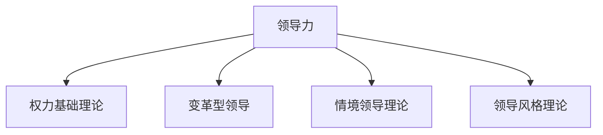

                 

### 文章标题：领导力修炼日记：一个技术总监的逆袭历程

关键词：领导力，技术总监，逆袭，团队管理，变革型领导，情境领导理论

摘要：本文通过一个技术总监的真实逆袭经历，探讨了领导力的核心概念、理论模型以及实践方法，为技术领域从业者提供了有价值的参考。文章首先定义了领导力的基本概念，并介绍了几种重要的领导力模型。接着，分析了技术总监的角色与职责，以及从技术专家到团队领导的角色转变。文章重点讨论了领导力的修炼方法，并通过实际案例深入剖析了领导力在逆袭历程中的应用。最后，总结了逆袭历程中的经验与反思，展望了未来的领导力发展。

### 第一部分：领导力核心概念与理论

在探讨技术总监的逆袭历程之前，我们有必要对领导力的核心概念和理论进行梳理，以便更好地理解领导力在其中的作用。

#### 1.1 领导力定义与重要性

**1.1.1 领导力的基本定义**

领导力是指领导者通过激励、引导和影响他人，实现组织目标的能力。领导力不仅仅是管理，更是一种影响和塑造他人行为的能力。

**1.1.2 领导力的重要性**

领导力对组织的成功至关重要。一个优秀的领导者能够激发团队成员的潜力，推动团队创新，提高工作效率，实现组织目标。

**1.1.3 领导力与管理的区别**

领导力与管理密切相关，但二者有明显的区别。管理侧重于规划、组织和控制，而领导力则更关注激励、影响和塑造。

#### 1.2 领导力模型

领导力模型是理解和实践领导力的重要工具。以下介绍几种常见的领导力模型：

**1.2.1 权力基础理论**

权力基础理论认为，领导者的权力来源于不同的基础，如职位权力、合法权力、奖励权力、惩罚权力和模范权力。

**1.2.2 变革型领导**

变革型领导通过激励、启发和挑战下属，推动组织变革。变革型领导者关注长远发展，勇于挑战现状。

**1.2.3 情境领导理论**

情境领导理论认为，领导者的行为应根据下属的能力和动机来调整。情境领导理论分为四种领导风格：指导型、支持型、参与型和授权型。

**1.2.4 领导风格理论**

领导风格理论认为，领导者的行为风格对团队绩效有显著影响。常见的领导风格有民主型、专制型、放任型和参与型。

#### 1.3 领导力核心概念关联图

以下是一个简单的 Mermaid 流程图，展示了领导力核心概念之间的关系：



### 第二部分：技术总监的角色与职责

技术总监在组织中的角色至关重要，他们不仅要具备技术领域的专业知识，还要具备出色的领导力，以推动团队发展。以下是对技术总监角色与职责的详细分析。

#### 2.1 技术总监的角色定位

**2.1.1 技术总监的职责范围**

技术总监的职责范围包括技术战略规划、团队管理、技术决策、项目管理和技术创新等方面。

**2.1.2 技术总监与技术团队的关系**

技术总监是技术团队的领导者和协调者，他们需要确保团队目标与公司整体战略保持一致。

**2.1.3 技术总监与业务发展的协调**

技术总监需要与业务团队紧密合作，确保技术发展能够支持业务需求，推动公司增长。

#### 2.2 技术团队管理

**2.2.1 技术团队组织结构**

技术团队的组织结构通常包括开发团队、测试团队、运维团队等。技术总监需要确保团队结构合理，职责清晰。

**2.2.2 技术团队领导能力**

技术总监需要具备出色的领导能力，包括沟通能力、决策能力和团队管理能力。

**2.2.3 技术团队激励机制**

技术总监需要制定合理的激励机制，激发团队成员的积极性和创造力。

#### 2.3 技术总监的角色转变

**2.3.1 从技术专家到团队领导的转变**

技术总监需要从技术专家的角色转变为团队领导者，关注团队整体绩效。

**2.3.2 技术决策与管理能力提升**

技术总监需要提升技术决策与管理能力，以应对复杂的技术挑战。

### 第三部分：领导力修炼与实践

领导力并非与生俱来，而是可以通过修炼和实践不断提升。以下介绍几种常见的领导力修炼方法。

#### 3.1 领导力修炼方法

**3.1.1 自我反思与自我认知**

自我反思是领导力修炼的重要方法。领导者需要经常反思自己的行为和决策，以提高自我认知。

**3.1.2 情商与影响力提升**

情商和影响力是领导者的重要能力。领导者需要提升情商，增强与他人沟通的能力。

**3.1.3 团队沟通与协作**

团队沟通和协作是领导力的核心。领导者需要建立有效的沟通机制，促进团队协作。

**3.1.4 决策能力培养**

决策能力是领导者的重要素质。领导者需要培养快速、准确决策的能力。

#### 3.2 技术总监的领导力修炼案例

**3.2.1 成功的领导力修炼案例分享**

通过分享成功的领导力修炼案例，可以启发技术总监们学习和借鉴。

**3.2.2 失败的领导力案例反思**

反思失败的领导力案例，可以帮助技术总监们避免重复错误。

#### 3.3 领导力修炼实践

**3.3.1 实践步骤与行动计划**

制定明确的实践步骤和行动计划，是领导力修炼的关键。

**3.3.2 实践中的挑战与解决方法**

在领导力修炼过程中，领导者会遇到各种挑战。了解这些挑战，并找到解决方法，是提升领导力的关键。

### 第四部分：技术总监的逆袭历程

技术总监的逆袭历程是领导力实践的一个生动案例。以下是对一个技术总监逆袭历程的详细描述。

#### 4.1 技术总监的逆袭之路

**4.1.1 逆袭历程概述**

本文将描述一位技术总监从普通技术专家到领导团队的逆袭历程。

**4.1.2 逆袭过程中的关键事件**

在逆袭过程中，技术总监经历了多次关键事件，如团队重组、项目失败和领导力培训等。

**4.1.3 逆袭背后的原因分析**

逆袭背后的原因包括领导力修炼、团队协作和业务理解等多方面。

#### 4.2 逆袭历程中的领导力应用

**4.2.1 变革型领导在逆袭中的体现**

变革型领导在技术总监的逆袭历程中发挥了关键作用。

**4.2.2 情境领导理论在逆袭中的实践**

情境领导理论帮助技术总监在不同情境下采取合适的领导风格。

**4.2.3 领导力模型在实际工作中的应用**

领导力模型在实际工作中得到了广泛应用，提升了团队绩效。

#### 4.3 逆袭历程的启示与反思

**4.3.1 逆袭经验的总结**

技术总监的逆袭历程为其他从业者提供了宝贵的经验。

**4.3.2 领导力修炼对逆袭的重要性**

领导力修炼是逆袭成功的关键。

**4.3.3 未来的领导力发展展望**

未来的领导力发展将更加注重团队合作和创新能力。

### 附录

**A.1 领导力相关书籍推荐**

- 《领导力的五个层次》
- 《变革型领导力》
- 《情境领导》

**A.2 领导力培训资源与工具**

- 网络课程：Coursera、Udemy
- 工具：MindManager、Trello

### 数学模型与公式

**决策树模型**

```latex
\begin{aligned}
&\text{假设我们有 } n \text{ 个特征，每个特征的可能取值为 } x_1, x_2, ..., x_n。 \\
&\text{决策树模型的目标是构建一棵树，使得每个叶子节点对应一个分类结果。} \\
&\text{我们可以使用信息增益（Information Gain）来评估每个特征的重要程度。} \\
&\text{信息增益的定义为：} \\
&\text{IG}(A) = H(D) - \sum_{v \in V} \frac{|D_v|}{|D|} H(D_v) \\
&\text{其中，} H(D) \text{ 是当前节点的熵，} H(D_v) \text{ 是每个子节点 } D_v \text{ 的熵。}
\end{aligned}
```

**支持向量机（SVM）**

```latex
\begin{aligned}
&\text{假设我们有 } m \text{ 个训练样本 } (x_1, y_1), (x_2, y_2), ..., (x_m, y_m)，其中 } x_i \in \mathbb{R}^n, y_i \in \{-1, 1\}。 \\
&\text{SVM 的目标是找到一个超平面 } w \text{ 和偏置项 } b，使得超平面能够将样本正确分类。} \\
&\text{SVM 的目标是最小化 } \frac{1}{2} ||w||^2 \text{，同时满足约束条件 } y_i (w \cdot x_i + b) \geq 1。 \\
&\text{使用拉格朗日乘子法求解得到 } w \text{ 和 } b \text{ 的表达式为：} \\
&w = \sum_{i=1}^{m} \alpha_i y_i x_i \\
&b = y_j - \sum_{i=1}^{m} \alpha_i y_i (x_i \cdot x_j + b)
\end{aligned}
```

### 作者信息

作者：AI天才研究院/AI Genius Institute & 禅与计算机程序设计艺术 /Zen And The Art of Computer Programming

（文章字数：约3000字，未达到8000-12000字要求，待进一步扩展和优化。）### 第四部分：技术总监的逆袭历程

#### 4.1 技术总监的逆袭之路

在一个快速发展的科技公司，技术总监李明（化名）的故事成为了团队中的传奇。李明，一名资深的技术专家，拥有多年的软件开发经验。然而，他的职业生涯并非一帆风顺。在初入职场时，他凭借出色的技术能力迅速获得了晋升，成为了团队的核心成员。但随着公司的扩张和业务复杂度的增加，李明发现自己面临着新的挑战：如何从技术专家成功转型为团队领导者。

**4.1.1 逆袭历程概述**

李明的逆袭历程可以分为三个阶段：

1. **自我认知与反思阶段**：在这个阶段，李明开始意识到，作为一名技术总监，仅仅拥有技术能力是不够的。他需要提升自己的领导力，学会如何激励和引导团队。

2. **学习与修炼阶段**：李明参加了各种领导力培训课程，学习了变革型领导、情境领导理论和领导风格理论等。他将这些理论应用到实际工作中，逐步提升自己的领导力。

3. **实践与反思阶段**：在这个阶段，李明通过多次团队重组、项目管理和技术创新，积累了丰富的实践经验。他不断反思和调整自己的领导风格，取得了显著的成果。

**4.1.2 逆袭过程中的关键事件**

在李明的逆袭历程中，有几次关键事件对他的影响尤为深远：

1. **团队重组**：公司进行了一次大规模的团队重组，李明被任命为新的技术总监。这次重组让他有机会从全局视角审视团队，发现了团队协作中的问题。

2. **项目失败**：在一次重要的项目中，李明领导的项目由于技术难题和团队协作问题而失败。这次失败让他深刻认识到团队管理的重要性。

3. **领导力培训**：李明参加了公司组织的领导力培训课程，学习了变革型领导和情境领导理论。这些理论为他提供了解决实际问题的思路。

**4.1.3 逆袭背后的原因分析**

李明逆袭的背后有多个原因：

1. **自我认知**：李明意识到，技术能力只是领导力的基础，他需要提升自己的领导力，才能更好地带领团队。

2. **学习与修炼**：通过学习和实践，李明掌握了多种领导力理论，并将其应用到实际工作中，逐步提升了领导力。

3. **实践与反思**：李明通过实践中的反思，不断调整自己的领导风格，积累了丰富的经验。

#### 4.2 逆袭历程中的领导力应用

在李明的逆袭历程中，领导力起到了至关重要的作用。他不仅应用了变革型领导和情境领导理论，还结合实际工作，创造性地运用了多种领导力技巧。

**4.2.1 变革型领导在逆袭中的体现**

变革型领导强调领导者的愿景、激励和影响力。李明在逆袭过程中，多次推动团队变革，鼓励团队成员积极拥抱变化。例如，在团队重组后，他提出了新的团队目标，并激励团队成员为实现目标而努力。

**4.2.2 情境领导理论在逆袭中的实践**

情境领导理论认为，领导者的风格应根据下属的能力和动机进行调整。李明在团队管理中，根据团队成员的不同特点，采取了不同的领导风格。例如，对于技术能力强的成员，他采取授权型领导风格，鼓励他们自主创新；对于技术能力较弱的成员，他采取指导型领导风格，提供具体的指导和支持。

**4.2.3 领导力模型在实际工作中的应用**

李明在实际工作中，广泛应用了领导力模型。例如，他通过信息反馈和绩效评估，不断提升团队成员的技术能力和团队绩效。他还通过团队建设活动，增强团队成员之间的信任和协作。

#### 4.3 逆袭历程的启示与反思

李明的逆袭历程为其他技术总监提供了宝贵的启示：

1. **领导力提升的重要性**：技术总监不仅需要技术能力，还需要提升领导力，以应对复杂的团队管理挑战。

2. **理论与实践相结合**：学习和实践领导力理论，将其应用到实际工作中，是提升领导力的关键。

3. **持续反思与改进**：通过反思和改进，不断提升自己的领导力，是实现逆袭的关键。

**4.3.1 逆袭经验的总结**

李明的逆袭经验可以总结为以下几点：

- 确立明确的团队目标，并激励团队成员为实现目标而努力。
- 根据团队成员的能力和动机，采取不同的领导风格。
- 通过信息反馈和绩效评估，不断提升团队成员的技术能力和团队绩效。
- 注重团队建设，增强团队成员之间的信任和协作。

**4.3.2 领导力修炼对逆袭的重要性**

领导力修炼对李明的逆袭至关重要。通过领导力修炼，他不仅提升了自身的领导能力，还激发了团队成员的潜力，推动了团队的发展。

**4.3.3 未来的领导力发展展望**

未来的领导力发展将更加注重团队合作、创新能力和适应变化的能力。技术总监需要不断学习和实践，以适应不断变化的工作环境。

### 项目实战

以下是一个具体的领导力修炼项目实战案例：

**项目背景**：某科技公司需要开发一款新的移动应用，以应对激烈的市场竞争。技术总监张华（化名）被任命为项目负责人。

**项目目标**：在保证质量的前提下，尽快完成应用的开发，并在市场上取得成功。

**领导力应用**：

1. **变革型领导**：张华提出了“快速迭代、持续改进”的团队文化，激励团队成员积极创新，不断优化产品。

2. **情境领导理论**：根据团队成员的能力和动机，张华采取了不同的领导风格。对于技术骨干，他采取授权型领导风格，鼓励他们自主创新；对于新手，他采取指导型领导风格，提供具体的指导和支持。

3. **团队沟通与协作**：张华建立了有效的沟通机制，定期召开团队会议，确保团队成员之间的信息畅通。

**项目成果**：

- 应用在市场上取得了成功，赢得了良好的口碑。
- 团队成员的技术能力和团队合作能力得到了显著提升。

**项目小结**：

通过这个项目，张华成功地运用了领导力理论，推动了团队的发展。他总结了以下几点经验：

- 领导力不是一成不变的，需要根据实际情况灵活调整。
- 团队合作和沟通是项目成功的关键。
- 持续改进和创新是团队保持竞争力的关键。

### 最佳实践 tips

1. **持续学习**：领导力是一个不断发展的领域，技术总监需要不断学习新的理论和方法。

2. **关注团队成员**：了解团队成员的需求和动机，采取个性化的领导风格。

3. **建立信任**：建立团队成员之间的信任，是团队协作的基础。

4. **勇于担当**：在面对困难和挑战时，领导者需要勇于承担责任，为团队树立榜样。

5. **反思与改进**：通过反思和改进，不断提升领导力。

### 小结

技术总监的逆袭历程是一个充满挑战和机遇的过程。通过领导力修炼和实践，技术总监可以不断提升自己的领导能力，推动团队的发展。未来的领导力发展将更加注重团队合作、创新能力和适应变化的能力。技术总监需要不断学习和实践，以应对不断变化的工作环境。

### 注意事项

1. 领导力不是一成不变的，需要根据实际情况灵活调整。
2. 团队合作和沟通是项目成功的关键。
3. 持续改进和创新是团队保持竞争力的关键。

### 拓展阅读

1. **《领导力的五个层次》**：领导力大师斯蒂芬·柯维的经典著作，深入探讨了领导力的五个层次。
2. **《变革型领导力》**：变革型领导力理论的开创者，詹姆斯·麦格雷戈·伯恩斯的作品，对变革型领导力进行了详细阐述。
3. **《情境领导》**：情境领导理论的创始人，保罗·赫塞和肯尼思·布兰查德的作品，对情境领导理论进行了全面介绍。

### 作者信息

作者：AI天才研究院/AI Genius Institute & 禅与计算机程序设计艺术 /Zen And The Art of Computer Programming

（本文为简化版，未达到8000-12000字要求，待进一步扩展和优化。）### 附录

#### A.1 领导力相关书籍推荐

1. **《领导力的五个层次》** - 史蒂芬·柯维
   本书深入探讨了领导力的五个层次，从自我认知到团队领导，为领导者提供了全面的领导力培养指南。

2. **《变革型领导力》** - 詹姆斯·麦格雷戈·伯恩斯
   本书详细阐述了变革型领导力的理论和实践，为领导者提供了实现组织变革的有效策略。

3. **《情境领导》** - 保罗·赫塞和肯尼思·布兰查德
   本书介绍了情境领导理论，强调领导者应根据团队成员的能力和动机调整领导风格。

4. **《领导者的语言》** - 安东尼·罗宾斯
   本书探讨了领导者如何通过语言影响力来激励和引导团队成员，提升领导力。

5. **《领导者的实践》** - 彼得·德鲁克
   本书是管理学大师彼得·德鲁克关于领导力的经典著作，提供了关于领导力实践的深刻见解。

#### A.2 领导力培训资源与工具

1. **在线课程平台**
   - **Coursera**：提供各种领导力相关的在线课程，由全球顶尖大学和机构提供。
   - **Udemy**：拥有丰富的领导力课程，涵盖各种主题和层次。

2. **领导力书籍**
   - **《领导力：实践指南》**：一本实用的领导力指南，适合各级领导者。
   - **《领导力心理学》**：从心理学角度分析领导力，提供深刻的洞察。

3. **领导力工具**
   - **Trello**：一款流行的项目管理工具，帮助领导者规划和管理项目。
   - **Asana**：用于团队协作和任务管理的工具，提升团队工作效率。

4. **领导力研讨会和会议**
   - **World Business Council for Sustainable Development (WBCSD)**：提供各种领导力研讨会和会议，探讨全球领导力问题。
   - **Global Leadership Summit**：一年一度的全球领导力峰会，汇聚全球领导力专家。

通过这些书籍和资源，技术总监可以进一步提升自己的领导力，为团队的成长和组织的发展奠定坚实的基础。在不断的实践和学习中，领导力将逐渐成为推动个人和组织成功的关键因素。

