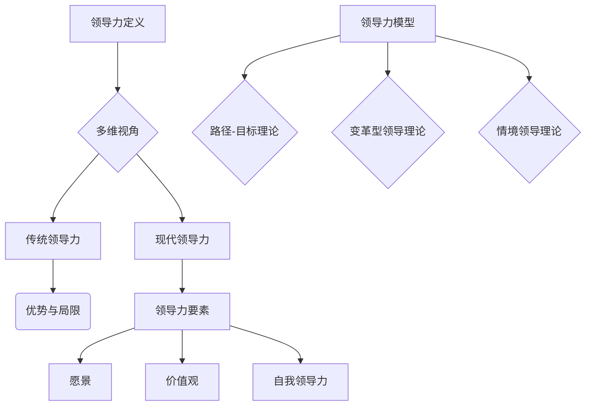
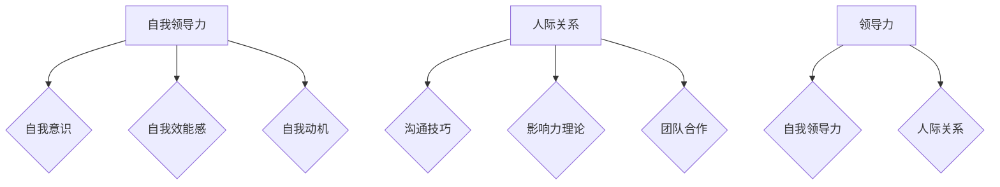

                 

## 文章标题

《领导力修炼日记：一个财务总监的成长历程》

领导力是一个复杂且多层次的概念，它不仅是领导者个人素质的体现，更是组织成功的关键因素。本篇文章将围绕一个财务总监的成长历程，详细探讨领导力的核心概念、数学模型、心理学原理、实践案例、发展路径和挑战应对，以及领导力修炼的日记记录方法。通过这种逻辑清晰、结构紧凑的写作方式，读者可以全面了解领导力的各个方面，并在实际工作中找到适合自己的领导力修炼路径。

## 关键词

- 领导力
- 财务总监
- 成长历程
- 数学模型
- 心理学原理
- 实践案例
- 领导力修炼日记

## 摘要

本文以一位财务总监的成长历程为线索，系统性地探讨了领导力的核心概念、架构、数学模型、心理学原理、实践案例、发展路径和挑战应对。文章通过具体案例分析和理论讲解，揭示了领导力的本质和其在组织管理中的重要作用。同时，文章还强调了领导力修炼日记在自我提升和持续改进中的重要性，为读者提供了实用的领导力发展指南。

### 第一部分：领导力的核心概念与架构

领导力是组织和个体成功的关键要素，它涉及到多个层面的概念和架构。在这部分，我们将从多个角度深入探讨领导力的本质、核心要素和理论模型，并通过Mermaid流程图展现领导力的多维视角。

#### 第1章：领导力的本质与核心要素

##### 1.1 领导力的定义与多维视角

领导力的定义多种多样，传统领导力强调的是权威和指令，而现代领导力则更注重影响力和合作。领导力不仅仅是一种职位赋予的权力，更是一种通过影响他人实现共同目标的能力。

**领导力的概念**：从传统领导学到现代领导力的转变

- **传统领导力**：以权威为核心，强调领导者对下属的指令和控制。
- **现代领导力**：强调影响力、合作和自我领导力。

**领导力的重要性**：在个人和组织成长中的作用

- **个人成长**：领导力提升个人的决策能力、沟通能力和影响力。
- **组织成长**：领导力推动组织创新、变革和发展。

**领导力的三个核心要素**：愿景、价值观和自我领导力

- **愿景**：领导者对未来的憧憬和规划，是团队共同奋斗的目标。
- **价值观**：领导者对是非曲直的判断标准，是团队行为规范的基础。
- **自我领导力**：领导者对自己的管理能力，包括自我意识、自我效能感和自我动机。

##### 1.2 领导力模型简介

在理解了领导力的定义和核心要素后，我们进一步介绍几种重要的领导力模型。

- **路径-目标理论**：该理论认为领导者的主要任务是帮助下属明确目标，并提供实现目标的路径。

- **变革型领导理论**：该理论强调领导者通过激励和影响追随者，推动组织变革和创新。

- **情境领导理论**：该理论认为领导者的风格应与员工的成熟度相匹配，以实现最佳领导效果。

##### 1.3 领导力的Mermaid流程图

为了更直观地展示领导力的多维视角，我们使用Mermaid流程图来描述不同领导力概念之间的关系。

通过上述Mermaid流程图，我们可以清晰地看到领导力的多个维度及其相互之间的关系。接下来，我们将进一步探讨领导力的数学模型和心理学原理。

#### 第2章：领导力数学模型与公式

在理解了领导力的核心概念后，我们将引入数学模型来量化领导力。数学模型能够帮助我们更精确地描述领导力的影响因素和作用机制。

##### 2.1 领导力数学模型的构建

一个有效的领导力数学模型应该能够反映领导力、员工积极性和管理机制对组织绩效的影响。我们可以构建如下模型：

**组织绩效公式**：\(OP = f(L, E, M)\)

- \(L\)：领导力水平
- \(E\)：员工积极性
- \(M\)：管理机制

这个模型表明，组织绩效（OP）是领导力（L）、员工积极性（E）和管理机制（M）共同作用的结果。

##### 2.2 数学公式详细讲解

为了更好地理解上述模型，我们可以使用具体的数学公式来详细解释。

$$
OP = w_1 \cdot L + w_2 \cdot E + w_3 \cdot M
$$

其中，\(w_1\)、\(w_2\)和\(w_3\)分别是领导力、员工积极性和管理机制对组织绩效的权重。

- **解释**：组织绩效（OP）是领导力（L）、员工积极性（E）和管理机制（M）按照一定权重计算的加权平均值。

**权重分配**：假设在某个特定情境下，领导力、员工积极性和管理机制对组织绩效的影响权重分别为0.4、0.3和0.3，我们可以计算组织绩效如下：

$$
OP = 0.4 \cdot L + 0.3 \cdot E + 0.3 \cdot M
$$

##### 2.3 公式举例说明

为了更好地理解上述公式，我们可以通过一个实际案例来具体说明。

**案例**：假设一个公司的领导力水平（L）为8分，员工积极性（E）为7分，管理机制（M）为6分，我们可以计算该公司的组织绩效（OP）如下：

$$
OP = 0.4 \cdot 8 + 0.3 \cdot 7 + 0.3 \cdot 6 = 3.2 + 2.1 + 1.8 = 7.1
$$

**解释**：在这个案例中，领导力水平对组织绩效的贡献最大，其次是员工积极性和管理机制。

通过上述数学模型和公式的讲解，我们可以更直观地理解领导力的影响因素及其对组织绩效的作用。接下来，我们将探讨领导力的心理学原理。

#### 第3章：领导力心理学原理

领导力不仅仅是技术和管理层面的能力，更涉及到心理学层面的深刻理解。在本章中，我们将探讨自我领导力的重要性，以及人际关系与领导力的密切关系。

##### 3.1 自我领导力的重要性

自我领导力是指领导者对自己的管理能力，包括自我意识、自我效能感和自我动机。自我领导力对于领导者的个人成长和组织发展都至关重要。

**自我意识**：自我意识是指领导者对自己内心世界的了解和管理。通过自我意识，领导者能够更好地认识自己的优点和不足，从而进行有效的自我提升。

**自我效能感**：自我效能感是指领导者对自身能力的信心和信念。一个有强烈自我效能感的领导者更有可能成功实现目标，并对团队产生积极影响。

**自我动机**：自我动机是指领导者的内在动力和外部激励之间的关系。自我动机能够激发领导者的工作热情和创新能力，从而推动组织的发展。

##### 3.2 人际关系与领导力

人际关系是领导力的一个重要组成部分，它直接影响领导者的领导效果和组织氛围。

**沟通技巧**：有效的沟通技巧是建立良好人际关系的基础。领导者需要掌握倾听、表达和反馈的技巧，以实现与员工的良好沟通。

**影响力理论**：影响力理论是理解人际关系的重要概念。领导者通过建立人际关系，影响他人的态度和行为，从而实现领导目标。

**团队合作**：团队合作是领导者的一项重要任务。领导者需要在团队中发挥自己的作用，促进团队成员的合作与协作，实现共同目标。

##### 3.3 领导力心理学原理的Mermaid流程图

为了更直观地展示领导力心理学原理，我们使用Mermaid流程图来描述自我领导力和人际关系与领导力的关系。

通过上述Mermaid流程图，我们可以清晰地看到自我领导力和人际关系在领导力中的地位和作用。接下来，我们将通过实际案例来进一步探讨领导力实践的重要性。

#### 第4章：领导力实践案例

领导力不仅仅是理论，更需要在实践中得到验证和运用。在本章中，我们将通过几个成功的领导力实践案例，展示领导力在实际工作中的应用和效果。

##### 4.1 成功领导者的故事

**案例1**：乔布斯与苹果公司的崛起

乔布斯是领导力的典范，他通过强大的愿景和卓越的领导力，将苹果公司从困境中拯救出来，并推向全球的巅峰。乔布斯的领导力特点包括：

- **愿景**：乔布斯拥有对产品和技术未来的远见，他的愿景激发了员工和市场的热情。
- **创新**：乔布斯强调创新和设计，他的领导风格鼓励员工大胆尝试和创新。
- **价值观**：乔布斯坚持自己的价值观，并在公司内部建立了一种独特的文化。

**案例2**：亚马逊的创始人杰夫·贝索斯

杰夫·贝索斯是另一个成功的领导者，他通过独特的领导策略，将亚马逊从一家小型互联网书店发展成为全球最大的电子商务公司。贝索斯的领导力特点包括：

- **客户导向**：贝索斯始终以客户为中心，他的领导策略始终围绕如何更好地满足客户需求。
- **持续创新**：贝索斯鼓励员工不断尝试新事物，并持续创新。
- **数据驱动**：贝索斯强调数据驱动决策，通过数据分析来优化业务流程和运营效率。

**案例3**：中国的马云与阿里巴巴

马云是中国互联网行业的标志性人物，他通过独特的领导力和战略眼光，将阿里巴巴打造成全球知名的互联网企业。马云的领导力特点包括：

- **愿景**：马云拥有远大的愿景，他希望通过互联网技术改变人们的购物和生活方式。
- **文化**：马云强调企业文化建设，他的领导风格注重团队精神和协作。
- **灵活性**：马云擅长在快速变化的市场环境中灵活应对，他的领导策略注重适应性和灵活性。

##### 4.2 领导力实践策略

通过上述成功领导者的故事，我们可以总结出一些领导力实践策略：

- **愿景引导**：领导者需要明确愿景，并激励团队为实现愿景而努力。
- **文化塑造**：领导者需要塑造积极的企业文化，以促进员工的凝聚力和创造力。
- **持续学习**：领导者需要持续学习，不断提升自己的领导能力和业务知识。
- **激励与反馈**：领导者需要通过激励和反馈来提升员工的积极性和工作效率。

通过这些实践策略，领导者可以在实际工作中发挥更大的作用，推动组织的发展和成功。

#### 第5章：领导力发展路径

领导力是一个持续发展的过程，不同阶段的领导者面临不同的挑战和机遇。在本章中，我们将探讨领导力的发展路径，包括领导力发展阶段、领导力发展策略和领导力培训与辅导。

##### 5.1 领导力发展模型

领导力发展模型描述了领导者从新手到专家的演变过程。根据领导力发展理论，领导力发展阶段可以分为以下几个阶段：

- **新手阶段**：领导者在这个阶段对领导工作还不太熟悉，需要学习和适应。
- **胜任阶段**：领导者在这个阶段已经具备了一定的领导能力，但还需要不断改进和提升。
- **熟练阶段**：领导者在这个阶段已经能够熟练地处理各种领导任务，并对团队产生积极影响。
- **专家阶段**：领导者在这个阶段已经达到了顶尖水平，能够应对各种复杂情境，并对组织产生深远影响。

**领导力发展阶段**：从新手到专家的演变

- **新手阶段**：领导者在这个阶段需要学习领导基础知识和技能，通过实践和反思不断提升自己的能力。
- **胜任阶段**：领导者在这个阶段需要培养专业能力和领导风格，通过团队建设和领导实践提升自己的领导力。
- **熟练阶段**：领导者在这个阶段需要不断反思和调整自己的领导方式，通过领导力培训和专业发展提升自己的综合素质。
- **专家阶段**：领导者在这个阶段需要持续学习和创新，通过影响和激励团队成员推动组织的持续发展。

##### 5.2 领导力发展策略

为了有效地提升领导力，领导者需要制定合适的发展策略。以下是一些关键的领导力发展策略：

- **自我评估**：领导者需要定期进行自我评估，了解自己的优势和不足，并制定改进计划。
- **职业规划**：领导者需要制定长期的职业规划，明确自己的职业目标和晋升路径。
- **持续学习**：领导者需要持续学习，通过阅读书籍、参加培训课程和参与行业交流活动不断提升自己的知识和技能。
- **实践应用**：领导者需要将所学知识和技能应用到实际工作中，通过实践来验证和提高自己的领导力。

##### 5.3 领导力培训与辅导

领导力培训与辅导是提升领导力的重要手段。以下是一些有效的领导力培训与辅导方法：

- **领导力培训课程**：领导者可以参加各种领导力培训课程，学习最新的领导理论和实践方法。
- **个性化辅导**：领导者可以寻求个性化辅导，通过一对一的指导来解决个人领导和团队管理中的问题。
- **反馈机制**：领导者需要建立有效的反馈机制，通过定期的反馈和评估来提高领导力和管理能力。

通过上述领导力发展路径和策略，领导者可以不断提升自己的领导能力，并在职业生涯中取得更大的成功。

#### 第6章：领导力挑战与应对

领导力的道路上充满了各种挑战，领导者需要具备应对这些挑战的能力。在本章中，我们将探讨领导力面临的挑战，并提出相应的应对策略。

##### 6.1 领导力面临的挑战

**组织变革**：在快速变化的市场环境中，组织需要不断变革以适应新的挑战。领导者需要引导组织进行变革，同时保持团队的动力和凝聚力。

**人才管理**：吸引、培养和留住人才是领导者的核心任务。领导者需要通过有效的招聘、培训和激励机制来提升员工的素质和工作积极性。

**全球领导力**：在全球化的背景下，领导者需要具备跨文化沟通和管理能力，以应对不同文化背景下的工作环境。

##### 6.2 领导力应对策略

**灵活应对**：领导者需要具备灵活应对不同情境的能力，通过调整领导风格和策略来适应变化。

**创新思维**：领导者需要鼓励创新思维，推动组织在技术、管理和业务模式上的持续创新。

**道德领导**：领导者需要树立良好的道德榜样，通过正直和诚信的行为来赢得员工的信任和支持。

**团队建设**：领导者需要注重团队建设，通过有效的沟通、协作和激励来提升团队的凝聚力和战斗力。

通过上述策略，领导者可以更好地应对领导力道路上的各种挑战，推动组织的持续发展和成功。

#### 第7章：领导力修炼日记

领导力修炼是一个持续的过程，领导者需要通过不断的学习和实践来提升自己的能力。在本章中，我们将探讨领导力修炼日记的重要性，以及如何通过日记记录来反思和改进领导能力。

##### 7.1 日记记录的意义

**反思与自我提升**：通过日记记录，领导者可以反思自己的领导行为，总结经验教训，并在实践中不断提升自己的能力。

**持续改进**：日记记录可以帮助领导者设定和跟踪自己的长期职业目标，通过持续改进来提升领导能力。

**自我评估**：日记记录是领导者进行自我评估的重要工具，通过记录和分析日记内容，领导者可以了解自己的优点和不足，并制定改进计划。

##### 7.2 日记记录的内容

**每日反思**：领导者可以记录每天的重要事件和领导行为，包括成功和失败的经验，以及从中得到的启示。

**长期目标**：领导者可以设定和跟踪自己的长期职业目标，记录目标的实现进度和遇到的问题。

**反馈与改进**：领导者可以收集他人的反馈，通过日记记录来分析反馈内容，并制定改进计划。

**学习与分享**：领导者可以记录自己的学习经历和分享心得，通过日记来总结和传播知识。

通过日记记录，领导者可以更好地反思自己的领导行为，持续提升自己的领导能力，并在职业生涯中取得更大的成功。

### 附录

#### 附录 A：领导力资源与工具

**领导力书籍推荐**：以下是几本经典的领导力书籍，适合领导者学习和提升：

- 《领导力五要素》作者：约翰·P·科特
- 《变革之舞》作者：约翰·P·科特
- 《执行》作者：拉里·博西迪、拉姆·查兰

**领导力在线课程**：以下是一些在线领导力课程，提供丰富的学习资源和实战经验：

- Coursera上的《领导力与决策》
- edX上的《领导力：战略、沟通与团队管理》
- LinkedIn Learning上的《领导力基础》

**领导力测评工具**：以下是一些常用的领导力测评工具，可以帮助领导者了解自己的领导风格和能力：

- 领导力360度评估
- 领导力能力测评
- 领导力发展评估

通过这些资源与工具，领导者可以系统地提升自己的领导能力，并在实际工作中更好地应对各种挑战。

#### 附录 B：领导力发展计划

**个人领导力发展计划模板**

1. **自我评估**：
   - 优点：
   - 缺点：
   - 需要改进的方面：

2. **长期目标**：
   - 职业目标：
   - 领导力目标：
   - 个人发展目标：

3. **发展策略**：
   - 学习计划：
   - 实践计划：
   - 反馈机制：

4. **时间表**：
   - 短期目标（1年）：
   - 中期目标（3年）：
   - 长期目标（5年）：

**领导力发展路线图**

1. **基础阶段**：
   - 学习领导基础知识和技能
   - 实践基础领导任务
   - 参加领导力培训课程

2. **成长阶段**：
   - 深入学习领导理论和实践方法
   - 承担更复杂的领导任务
   - 寻求个性化辅导和反馈

3. **成熟阶段**：
   - 不断提升领导能力和管理素质
   - 引领团队实现长期目标
   - 培养下一代领导者

4. **专家阶段**：
   - 持续学习和创新
   - 成为行业领导者和专家
   - 贡献于社会和组织的持续发展

通过个人领导力发展计划和领导力发展路线图的制定，领导者可以明确自己的职业目标和领导力发展方向，并采取有效的措施来提升自己的能力，实现个人和组织的共同发展。

