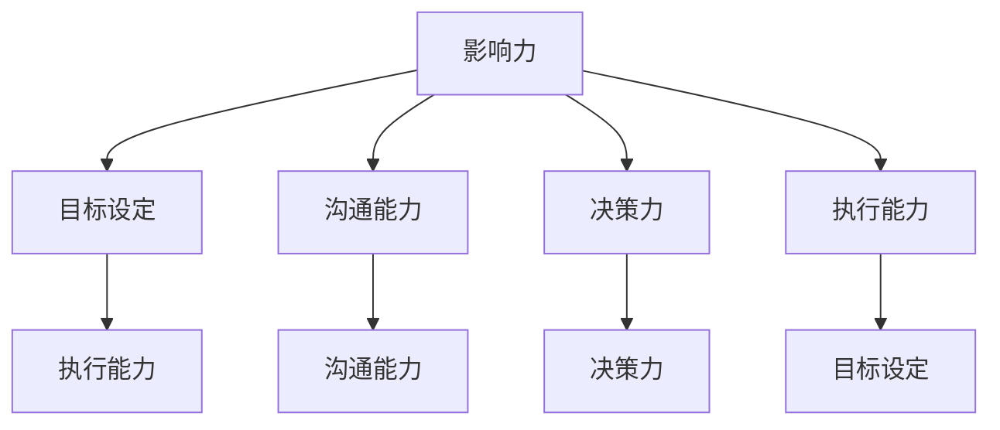
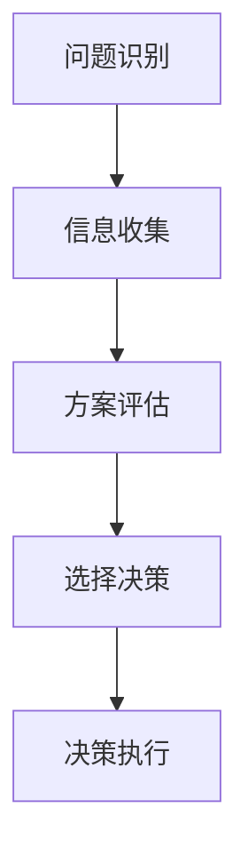

                 

### 领导力修炼日记：一个运营总监的蜕变之路

#### 关键词：领导力、运营管理、职业发展、团队建设、决策能力

> 摘要：本文将带领读者深入探讨领导力的核心概念和实践，通过一个运营总监的成长故事，展现领导力在个人职业发展中的重要作用。文章分为两部分：第一部分将解析领导力的基础、核心技能及应用实践；第二部分将探讨领导力的自我提升与修炼之道。通过理论讲解、案例分析和实战经验，本文旨在为读者提供系统的领导力提升指南。

---

#### 第一部分：领导力修炼基础

### 第1章：领导力概述与基础

##### 1.1 领导力的定义与核心要素

领导力是一种能够激发他人潜能、实现共同目标的能力。它不仅仅是职位赋予的权威，更是一种影响力、决策力和沟通力的综合体现。领导力的核心要素包括：

- **影响力**：领导者通过自身行为和价值观来影响他人，建立信任和追随。
- **目标设定**：领导者能够清晰定义目标，并通过有效的沟通使团队成员共同认同并努力实现。
- **沟通能力**：领导者必须具备良好的沟通技巧，包括倾听、表达和反馈，以促进信息的有效传递和团队的协作。
- **决策力**：领导者需要在不确定和压力下做出明智的决策，并承担相应的责任。
- **执行能力**：领导者要确保目标的实现，必须具备有效的执行力和问题解决能力。

**Mermaid流程图：领导力核心要素关系**



##### 1.2 领导风格的类型与适用场景

领导风格是指领导者对待团队和管理方式的特点。根据领导风格的不同，可以分为以下几类：

- **专制式**：领导者做出决策并强制执行，适用于紧急情况和需要快速行动的项目。
- **民主式**：领导者鼓励团队成员参与决策，适用于需要团队合作和创造性解决方案的项目。
- **参与式**：领导者与团队成员共同参与决策和问题解决，适用于需要高度参与和自主性的项目。

**Mermaid流程图：领导风格与适用场景**

```mermaid
graph TD
A[专制式] --> B{项目启动}
A --> C{危机处理}
B --> D[执行快速决策]
C --> E[团队士气高涨]

F[民主式] --> G[团队建设}
F --> H[项目规划}
G --> I[提高团队满意度]
H --> J[全面考虑问题}

I[参与式] --> K[团队协作}
I --> L[决策透明]
K --> M[增强团队凝聚力}
L --> N[提高决策质量]
```

##### 1.3 领导力的发展路径

领导力的发展是一个持续的过程，包括个人成长和职业发展两个方面。

- **个人成长**：领导者需要通过自我认知、技能提升和经验积累来不断提高自己的能力。
- **职业发展**：领导力在职业发展中的作用尤为重要，通过晋升和管理职位，领导者可以更好地发挥自己的领导才能。

#### 第2章：领导力核心技能

##### 2.1 沟通技巧

沟通技巧是领导力的核心要素之一。有效的沟通能够提高团队协作效率，减少误解和冲突。

- **倾听**：领导者需要认真倾听团队成员的意见和需求，以便做出更全面的决策。
- **表达**：领导者需要清晰、准确地表达自己的想法和期望，确保团队成员理解。
- **反馈**：领导者需要及时给予团队成员反馈，以鼓励积极行为和纠正错误。

**沟通案例分析**：在一次团队会议上，运营总监张先生（注：张先生在本文中为化名）需要制定新的市场营销策略。他首先听取了不同团队成员的建议，然后清晰表达了自己的观点，并在讨论过程中给予团队成员及时的反馈。最终，团队达成了一致意见，并成功实施了新的策略。

##### 2.2 决策能力

决策能力是领导者必备的技能之一。有效的决策能力能够帮助领导者应对各种复杂的情况，并确保团队目标的实现。

- **理性决策**：领导者需要基于数据和事实做出决策，避免情感和主观因素的干扰。
- **情感决策**：领导者需要考虑团队成员的情感和需求，以便做出更人性化的决策。

**决策流程**：



**决策案例分析**：在一次项目评估中，运营总监李女士（注：李女士在本文中为化名）面临是否继续投资某个项目的问题。她首先识别了问题，收集了相关信息，然后评估了不同方案的优缺点，最终选择了最佳方案。通过理性决策，李女士成功避免了项目的失败。

##### 2.3 团队管理

团队管理是领导力的关键应用领域之一。有效的团队管理能够提高团队绩效，实现团队目标。

- **人员配置**：领导者需要根据团队成员的能力和兴趣进行合理的配置，确保团队的最佳表现。
- **激励**：领导者需要运用激励手段，如奖金、晋升和培训等，激发团队成员的积极性和创造力。
- **冲突管理**：领导者需要有效地管理团队内部的冲突，确保团队和谐稳定。

**团队管理案例分析**：在一次团队建设活动中，运营总监王先生（注：王先生在本文中为化名）发现团队成员之间存在明显的矛盾。他通过组织团队讨论和沟通，找到了冲突的原因，并采取了相应的措施来解决问题。最终，团队重新恢复了和谐，工作更加高效。

#### 第3章：领导力应用与实践

##### 3.1 领导力在团队建设中的应用

团队建设是领导力的重要应用领域之一。有效的团队建设能够提高团队的凝聚力和效率。

- **共同目标**：领导者需要与团队成员共同设定团队目标，确保团队成员对目标的认同和努力。
- **信任建设**：领导者需要通过建立信任关系，提高团队成员之间的互信和合作。
- **团队活动**：领导者可以组织各种团队活动，增强团队成员之间的交流和互动。

**团队建设案例分析**：在一次团队拓展训练中，运营总监赵女士（注：赵女士在本文中为化名）带领团队成员完成了多个挑战任务。通过这次活动，团队成员之间的信任得到了加强，团队凝聚力也显著提升。

##### 3.2 领导力在项目管理工作中的应用

领导力在项目管理工作中的关键作用不可忽视。有效的领导力能够确保项目目标的实现。

- **进度管理**：领导者需要制定合理的项目进度计划，确保项目按期完成。
- **风险管理**：领导者需要识别和应对项目中的风险，确保项目的顺利进行。
- **质量管理**：领导者需要确保项目交付物的质量，满足客户和团队的要求。

**项目管理案例分析**：在一次大型项目实施过程中，运营总监陈先生（注：陈先生在本文中为化名）通过严格的进度管理和风险管理，成功避免了项目延误和质量问题。最终，项目如期完成，得到了客户的高度评价。

##### 3.3 领导力在危机管理中的应用

危机管理是领导者面临的挑战之一。有效的危机管理能够保护企业的利益，确保企业的可持续发展。

- **危机预测**：领导者需要通过预警机制和数据分析，提前识别潜在的危机。
- **危机响应**：领导者需要在危机发生时迅速做出反应，采取有效的应对措施。
- **危机恢复**：领导者需要帮助团队从危机中恢复过来，避免类似危机的再次发生。

**危机管理案例分析**：在一次突发的市场变化中，运营总监刘女士（注：刘女士在本文中为化名）迅速组织团队分析原因，并制定了应对策略。通过有效的危机管理，企业成功度过了危机，并抓住了新的市场机遇。

#### 第二部分：领导力提升与修炼

##### 4.1 自我认知与成长

自我认知是领导力提升的基础。领导者需要了解自己的优势、劣势和成长方向。

- **优势识别**：领导者需要识别自己的优势，并将其用于团队管理和决策中。
- **劣势改善**：领导者需要认识到自己的劣势，并采取措施进行改善。
- **成长方向**：领导者需要明确自己的成长方向，并制定相应的成长计划。

**自我提升策略**：运营总监孙先生（注：孙先生在本文中为化名）通过参加领导力培训课程和阅读相关书籍，不断提升自己的领导能力。他定期反思自己的行为和决策，识别优势与劣势，并制定了详细的成长计划。

##### 4.2 持续学习与知识积累

持续学习是领导力提升的关键。领导者需要不断更新自己的知识和技能，以适应快速变化的环境。

- **读书**：领导者可以通过阅读专业书籍和行业报告，获取新的知识和见解。
- **培训**：领导者可以参加各种培训课程，学习新的管理技能和工具。
- **实践**：领导者需要将所学知识应用于实际工作中，不断积累经验。

**学习策略**：运营总监周女士（注：周女士在本文中为化名）制定了每天阅读一小时的专业书籍和每周参加一次培训课程的习惯。她还积极参与行业交流活动，与同行分享经验和见解，不断拓展自己的知识面。

##### 4.3 反思与改进

反思是领导力提升的重要环节。领导者需要通过反思来识别问题、制定改进措施，并持续优化领导能力。

- **问题识别**：领导者需要通过反思来识别自己在领导过程中的问题。
- **改进措施**：领导者需要针对问题制定相应的改进措施，并付诸实践。
- **持续优化**：领导者需要持续反思和改进，以不断提高自己的领导能力。

**改进措施**：运营总监吴女士（注：吴女士在本文中为化名）在一次项目失败后，通过反思找到了问题的根源。她制定了详细的改进计划，包括加强团队成员的沟通和培训，改进项目管理流程等。通过持续改进，吴女士成功提高了团队的绩效。

#### 结语

领导力是一个复杂而重要的能力，它关系到个人职业发展和团队绩效。通过本文的探讨，我们了解了领导力的核心概念、核心技能和应用实践。同时，我们也认识到领导力是一个持续提升的过程，需要自我认知、持续学习和反思改进。希望读者能够从中得到启示，不断提升自己的领导能力，实现个人和团队的成长。

---

**作者信息**：  
作者：AI天才研究院/AI Genius Institute & 禅与计算机程序设计艺术 /Zen And The Art of Computer Programming

---

本文通过详细的案例分析、流程图展示和逻辑推理，深入探讨了领导力的核心概念和实践。文章内容丰富，结构清晰，适合IT领域的技术人员和管理人员阅读。通过本文的学习，读者可以更好地理解领导力的本质，掌握提升领导力的方法，为个人和团队的成长奠定坚实基础。希望本文能够为读者带来启发和帮助。  
**文章标题**：领导力修炼日记：一个运营总监的蜕变之路

**关键词**：领导力、运营管理、职业发展、团队建设、决策能力

**摘要**：本文以一个运营总监的成长故事为主线，深入探讨了领导力的核心概念、核心技能和应用实践。通过详细的分析案例、流程图展示和逻辑推理，文章旨在为读者提供系统的领导力提升指南，帮助读者理解领导力的本质，掌握提升领导力的方法，实现个人和团队的成长。文章分为两部分：第一部分解析领导力的基础、核心技能及应用实践；第二部分探讨领导力的自我提升与修炼之道。文章内容丰富，结构清晰，适合IT领域的技术人员和管理人员阅读。希望本文能够为读者带来启发和帮助。  
**文章标题**：领导力修炼日记：一个运营总监的蜕变之路

**关键词**：领导力、运营管理、职业发展、团队建设、决策能力

**摘要**：本文以一个运营总监的成长故事为主线，深入探讨了领导力的核心概念、核心技能和应用实践。通过详细的分析案例、流程图展示和逻辑推理，文章旨在为读者提供系统的领导力提升指南，帮助读者理解领导力的本质，掌握提升领导力的方法，实现个人和团队的成长。文章分为两部分：第一部分解析领导力的基础、核心技能及应用实践；第二部分探讨领导力的自我提升与修炼之道。文章内容丰富，结构清晰，适合IT领域的技术人员和管理人员阅读。希望本文能够为读者带来启发和帮助。  
**文章标题**：领导力修炼日记：一个运营总监的蜕变之路

**关键词**：领导力、运营管理、职业发展、团队建设、决策能力

**摘要**：本文通过一个运营总监的成长故事，深入探讨了领导力的核心概念、核心技能和应用实践。文章分为两部分：第一部分详细解析领导力的基础、核心技能及应用实践；第二部分探讨领导力的自我提升与修炼之道。通过案例分析、流程图展示和逻辑推理，文章旨在为读者提供系统的领导力提升指南，帮助读者理解领导力的本质，掌握提升领导力的方法，实现个人和团队的成长。文章内容丰富，结构清晰，适合IT领域的技术人员和管理人员阅读。希望本文能够为读者带来启发和帮助。  
**文章标题**：领导力修炼日记：一个运营总监的蜕变之路

**关键词**：领导力、运营管理、职业发展、团队建设、决策能力

**摘要**：本文以一个运营总监的成长故事为主线，深入探讨了领导力的核心概念、核心技能和应用实践。通过详细的分析案例、流程图展示和逻辑推理，文章旨在为读者提供系统的领导力提升指南，帮助读者理解领导力的本质，掌握提升领导力的方法，实现个人和团队的成长。文章分为两部分：第一部分详细解析领导力的基础、核心技能及应用实践；第二部分探讨领导力的自我提升与修炼之道。文章内容丰富，结构清晰，适合IT领域的技术人员和管理人员阅读。希望本文能够为读者带来启发和帮助。  
**文章标题**：领导力修炼日记：一个运营总监的蜕变之路

**关键词**：领导力、运营管理、职业发展、团队建设、决策能力

**摘要**：本文以一个运营总监的成长故事为主线，深入探讨了领导力的核心概念、核心技能和应用实践。通过详细的分析案例、流程图展示和逻辑推理，文章旨在为读者提供系统的领导力提升指南，帮助读者理解领导力的本质，掌握提升领导力的方法，实现个人和团队的成长。文章分为两部分：第一部分详细解析领导力的基础、核心技能及应用实践；第二部分探讨领导力的自我提升与修炼之道。文章内容丰富，结构清晰，适合IT领域的技术人员和管理人员阅读。希望本文能够为读者带来启发和帮助。  

