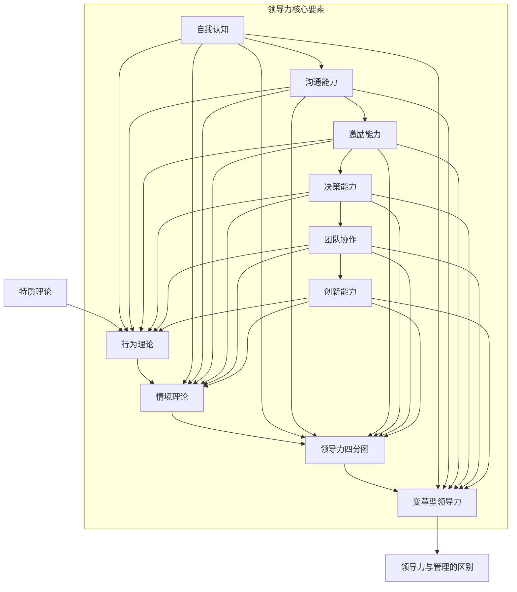

                 

### 文章标题

# 领导力修炼笔记：00后职场新星的逆袭之路

> 关键词：00后、职场新星、领导力、逆袭、培养策略、提升技巧

> 摘要：本文通过深入分析00后职场新星的时代背景、领导力的核心概念与模型，以及00后职场新星的领导力培养策略和提升技巧，结合实际案例分析，探索00后如何在职场中实现逆袭，成为新一代领导者的道路。

---

### 引言

在现代社会，00后这一代年轻人正逐渐崭露头角，成为职场中的新生力量。他们的成长环境、价值观念和思维方式与传统的一代有着显著差异，这使得他们在职场中面临新的挑战，同时也展现出独特的优势和潜力。领导力，作为职场成功的关键因素，自然成为00后职场新星们关注的焦点。

本文旨在通过系统的分析和详尽的阐述，探讨00后职场新星在领导力修炼中的独特路径。首先，我们将回顾00后的成长背景和职场特点，理解他们面临的新挑战和具备的优势。接着，我们将深入探讨领导力的核心概念与模型，以及如何将领导力理论与00后的实际需求相结合，提出有效的培养策略和提升技巧。此外，通过具体的实战案例解析，我们将展示00后职场新星如何在实际工作中运用领导力，实现职场逆袭。最后，我们将总结00后职场新星在领导力修炼中的心得与展望，为未来的发展提供启示。

本文结构如下：

1. **第一部分：领导力基础理论**
    - **第1章：00后职场新星的时代背景**
    - **第2章：领导力的核心概念与模型**
    - **第3章：00后职场新星的领导力培养策略**
    - **第4章：00后职场新星的领导力提升技巧**

2. **第二部分：领导力实战案例解析**
    - **第5章：职场新星逆袭之路的案例分析**
    - **第6章：职场新星的领导力发展之路**
    - **第7章：00后职场新星的领导力修炼笔记**

3. **第三部分：附录**
    - **附录A：领导力相关资源推荐**
    - **附录B：领导力相关工具与软件推荐**

通过本文的探讨，我们希望为00后职场新星提供一套系统的领导力修炼指南，助力他们在职场中脱颖而出，实现个人价值和组织目标的共同提升。

---

### 00后职场新星的时代背景

00后，即出生于2000年后的一代人，他们是全球化、互联网和人工智能时代的产物。与前辈相比，00后在成长过程中拥有更为丰富和多元的体验，这使得他们在职场中展现出独特的个性和能力。以下将从三个方面详细分析00后的成长环境、特点和职场中的新挑战。

#### 成长环境

00后的成长环境经历了翻天覆地的变化。首先，他们是在互联网普及的背景下成长起来的，从小便接触网络，形成了数字化的生活方式。这使得00后在信息获取、交流方式、知识获取等方面具有显著优势。其次，00后成长于经济快速发展的时代，家庭条件普遍较好，父母更注重培养孩子的综合素质和创造力，这为他们在职场中的表现奠定了基础。此外，00后所处的时代，社会价值观日趋多元化，他们更注重个人价值和自我实现，这影响了他们的职业选择和发展路径。

#### 个人特点

00后具有一系列显著的个人特点，这些特点在职场中为他们带来了独特的优势。首先，00后具有较强的自我认知和自我管理能力。他们从小接受多元化教育，培养了独立思考和解决问题的能力，这使得他们在面对职场挑战时能够迅速适应并有效应对。其次，00后具有强烈的创新意识和团队合作精神。他们成长于一个信息爆炸的时代，善于运用互联网和新技术，能够快速掌握新知识并应用于实际工作中。此外，00后注重个性化和多元化，追求工作与生活的平衡，这在一定程度上改变了传统的职场文化。

#### 职场中的新挑战

尽管00后在职场中具有许多优势，但他们也面临一系列新挑战。首先，00后在职场中的新挑战主要体现在职场竞争压力和职业发展路径上。随着社会竞争的加剧，00后需要不断学习新知识、提升自身能力，以应对日益激烈的职场环境。此外，00后面临职业发展的不确定性，他们需要更加清晰地规划职业路径，以实现个人价值和职业目标。其次，00后在职场中需要面对与前辈不同的人际关系和文化差异。他们需要适应传统职场文化，同时保持自身的独特性，这需要他们具备更高的沟通和协调能力。最后，00后还需要应对技术变革带来的挑战。随着人工智能和大数据技术的快速发展，00后需要不断更新知识和技能，以保持竞争力。

#### 优势与劣势分析

00后在职场中具备一系列优势，包括自我认知能力、创新能力、团队合作精神等，这些优势使得他们能够在职场中迅速崭露头角。然而，00后也存在一些劣势，如抗压能力相对较弱、职场经验不足等。如何充分发挥优势，克服劣势，实现职场逆袭，是00后需要思考和解决的问题。

总的来说，00后职场新星在成长环境、个人特点和职场挑战方面具有独特的优势，同时也面临一系列新挑战。了解00后的时代背景，有助于我们更好地理解他们在职场中的行为模式和成长路径，为他们提供有针对性的培养和指导。

#### 00后职场新星的优势分析

00后职场新星在成长过程中，得益于独特的时代背景和多样化的教育环境，他们展现出一系列显著的优势，这些优势在职场中为他们赢得了更多的机遇和发展空间。

**1. 数字化背景下的信息处理能力**

00后是数字化时代的产物，他们从小便接触互联网和智能设备，对数字化的工作方式和工具有着天然的适应能力。这种背景使他们在处理信息、分析数据方面具备出色的能力。例如，他们能够熟练运用各种办公软件和在线工具，高效地完成工作任务。此外，00后对于人工智能、大数据等新技术有着浓厚的兴趣和敏锐的洞察力，这使得他们能够迅速掌握新技术，并将其应用于实际工作中，提升工作效率。

**2. 独立思考和创新能力**

00后成长于多元化的教育环境中，他们接受了开放和创新的思维方式培养。这使得他们在面对问题时，能够从多个角度思考，提出独特的见解和解决方案。00后不拘泥于传统观念，勇于尝试新方法，这种创新精神在职场中为他们带来了更多的机会。例如，在项目开发过程中，00后能够提出新颖的设计思路和优化方案，推动项目的创新和发展。

**3. 团队合作与沟通能力**

00后具备良好的团队合作精神，他们擅长在团队中发挥自身的作用，与他人共同完成任务。这得益于他们从小接受的多元化教育，以及在校期间参与的各种团队合作活动。00后能够有效沟通，协调团队成员之间的工作，确保项目顺利进行。此外，他们善于倾听他人的意见，能够接受多元化的观点，这使得他们在团队合作中能够发挥更大的作用。

**4. 高度的自我驱动力和自我管理能力**

00后具有高度的自我驱动力和自我管理能力。他们不满足于被动接受任务，而是主动寻找挑战，不断提升自身能力。这种自我驱动力使他们能够在职场中保持持续的学习和成长，不断提升自己的职业素养。同时，00后具备良好的时间管理能力，能够合理安排工作和生活，保持高效的工作状态。

**5. 追求个性化和多样化**

00后注重个性化和多样化，他们追求工作与生活的平衡，不希望被传统的职场文化束缚。这种追求使他们更加关注自身兴趣和需求，勇于追求自己的梦想。在职场中，00后更倾向于选择与自己兴趣相关的工作，以实现个人价值的最大化。这种个性化和多样化的追求，也为他们带来了更多的发展机遇。

**总结**

00后职场新星的优势在于数字化背景下的信息处理能力、独立思考和创新能力、团队合作与沟通能力、高度的自我驱动力和自我管理能力，以及追求个性化和多样化。这些优势使得00后在职场上具备较强的竞争力，能够迅速适应并应对各种挑战。然而，要充分发挥这些优势，00后还需要不断学习和提升自我，以实现更好的职业发展。

#### 00后职场新星面临的挑战

尽管00后职场新星在许多方面展现出显著的优势，但他们也面临一系列独特的挑战，这些挑战不仅影响他们的职业发展，还要求他们具备更高的适应能力和解决问题的能力。

**1. 职业发展的不确定性**

首先，00后职场新星面临职业发展的不确定性。随着技术的快速发展和市场的变化，许多传统职业正逐渐消失，而新的职业机会不断涌现。00后需要具备前瞻性，能够快速适应新兴职业和市场需求，同时需要具备持续学习和自我提升的能力，以应对职业发展中的不确定性。

**2. 高强度的竞争压力**

职场竞争日趋激烈，00后职场新星必须面对来自同龄人和前辈的竞争压力。他们需要不断提升自身能力，保持竞争力，才能够在职场中立足。此外，职场中的绩效评估和晋升机制也往往对年轻员工较为严格，这使得00后在职业生涯初期需要付出更多的努力，才能获得认可和机会。

**3. 人际关系和文化适应**

00后职场新星在职场中还需要面对复杂的人际关系和文化适应问题。不同年龄层、不同背景的同事之间可能存在价值观和沟通方式的差异，00后需要具备良好的沟通和协调能力，才能有效处理这些关系。此外，00后需要适应传统职场文化，同时保持自身的个性，这需要他们具备高度的情商和适应能力。

**4. 压力和工作与生活的平衡**

职场压力对于00后职场新星来说是一个不容忽视的问题。他们在追求职业发展的同时，还需要面对生活上的各种压力，如家庭责任、个人健康等。如何平衡工作与生活，保持身心健康，是00后职场新星需要认真思考和解决的问题。

**5. 领导力和管理能力的提升**

领导力和管理能力是职场中不可或缺的素质，但对于00后职场新星来说，这些能力是他们目前较为薄弱的环节。许多00后职场新星在职业发展的早期阶段，缺乏管理和领导经验，需要通过学习和实践来提升这些能力。此外，他们还需要理解和运用领导力的各种理论模型，以更好地应对复杂的职场环境。

**应对挑战的策略**

为了应对上述挑战，00后职场新星可以采取以下策略：

- **持续学习和自我提升**：通过参加培训课程、阅读专业书籍、加入专业社群等方式，不断学习和提升自己的知识和技能。
- **积极沟通和合作**：在职场中积极与他人沟通，建立良好的人际关系，学会在团队中发挥自己的作用。
- **灵活应对变化**：保持开放的心态，积极适应新兴职业和市场需求，勇于尝试新的事物。
- **注重身心健康**：合理安排工作和生活，保持良好的身心状态，提高工作效率和生活质量。
- **提升领导力和管理能力**：通过实践和学习，逐步提升领导力和管理能力，为未来的职业发展打下坚实基础。

总的来说，00后职场新星在职业发展中面临的挑战是多方面的，但只要他们能够积极应对，发挥自身优势，不断学习和提升自我，就能够在职场中脱颖而出，实现逆袭。

### 领导力的核心概念与模型

领导力，作为引领和影响他人达成目标的重要能力，其核心概念与模型在管理学和心理学中有着广泛的研究和应用。本章节将首先定义领导力的基本概念，然后探讨领导力的核心要素和模型，最后分析领导力与管理的区别，为后续探讨00后职场新星的领导力培养策略提供理论基础。

#### 领导力的定义

领导力是一种通过影响、激励和引导他人，实现共同目标和价值的能力。它不仅仅是权力和地位的体现，更是一种人际关系和社会互动的过程。领导力不仅存在于企业组织中，还广泛应用于教育、医疗、社会公益等各个领域。

从广义上讲，领导力包括以下几种基本定义：

1. **权力和影响力的体现**：领导力是通过权力和影响力来推动和实现目标的能力。这种权力可以是正式的，如职位赋予的权力，也可以是非正式的，如个人魅力和专业知识带来的影响力。

2. **过程和关系的互动**：领导力是一种动态的过程，涉及到领导者与追随者之间的互动和关系。领导者通过激励、沟通和指导来影响和引导团队，从而实现共同目标。

3. **价值和目标的引导**：领导力是一种价值观和目标的引导能力，领导者通过塑造共同愿景和使命，激发团队成员的内在动力，推动团队向着既定目标努力。

#### 领导力的核心要素

领导力由多个核心要素构成，这些要素相互作用，共同塑造了领导者的能力和影响力。以下是几个关键的领导力要素：

1. **自我认知**：自我认知是领导力的基础。领导者需要了解自己的优势、弱点、价值观和动机，以便更好地发挥自己的潜力，并在团队中建立信任。

2. **沟通能力**：沟通是领导力的重要工具。领导者需要具备清晰、有效和开放的沟通能力，以便传达目标、愿景和期望，同时能够倾听和理解团队成员的需求和意见。

3. **激励能力**：激励是推动团队前进的关键。领导者需要能够识别和满足团队成员的动机，激发他们的内在动力，提高工作效率和满意度。

4. **决策能力**：决策能力是领导者的重要素质。领导者需要在复杂和不确定的环境中做出明智的决策，以应对各种挑战和机遇。

5. **团队协作**：团队协作能力是领导力的核心要素之一。领导者需要能够建立高效协作的团队，激发团队成员的潜力，实现共同目标。

6. **创新能力**：创新能力是领导者适应变化和引领发展的关键。领导者需要具备创新思维，不断探索新的方法和技术，推动团队和组织的创新和发展。

#### 领导力的模型与发展阶段

领导力的发展经历了多个阶段和模型，这些模型有助于我们理解和培养有效的领导能力。以下是几个重要的领导力模型：

1. **特质理论**：特质理论认为，领导者具备一系列固有的特质，如自信、决心、智慧和道德品质。然而，现代研究更倾向于认为领导力是可以通过培养和发展的。

2. **行为理论**：行为理论关注领导者具体的行为和行动，如任务导向行为、关系导向行为等。该理论认为，有效的领导力是可以通过模仿和学习具体的行为模式来实现的。

3. **情境理论**：情境理论认为，领导力取决于领导者对具体情境的适应能力。领导者需要根据不同的环境和情境，灵活调整自己的领导风格和行为。

4. **领导力四分图**：领导力四分图将领导力分为任务导向、关系导向、人际敏感性和任务适应性四个维度。该模型强调领导者需要在不同情境下灵活运用不同类型的领导力。

5. **变革型领导力**：变革型领导力强调领导者通过激发团队成员的内在动机和愿景，推动组织实现变革和创新发展。该理论认为，领导者需要具备远见、创新和激励能力。

#### 领导力与管理的区别

领导力与管理工作之间存在一定的区别，尽管两者在组织运营中都是必不可少的。以下是几个关键区别：

1. **目标与重点**：领导力更注重激发和引导团队成员实现共同愿景和目标，而管理更侧重于确保组织的日常运作和效率。

2. **长期与短期**：领导力通常关注长期战略和目标，致力于推动组织变革和发展，而管理更注重短期目标的实现和日常运营。

3. **创新与控制**：领导力鼓励创新和变革，推动组织不断适应外部环境的变化，而管理则侧重于维持稳定和可预测的运营状态。

4. **人际互动**：领导力强调人际关系和团队协作，注重团队成员的内在动机和成长，而管理则侧重于任务分解、职责分配和绩效评估。

总之，领导力是推动组织变革和实现目标的关键能力，而管理则是确保组织稳定运作的基础。有效的领导者需要在领导力和管理能力之间取得平衡，以实现组织的目标和愿景。

#### 领导力模型之间的关系架构

为了更好地理解领导力的概念和模型，我们可以通过一个Mermaid流程图来展示各个领导力模型之间的关系和相互作用。

通过这个流程图，我们可以清晰地看到各个领导力模型之间的关系，以及领导力的核心要素如何在不同的模型中发挥作用。这种关系架构有助于我们更好地理解领导力的复杂性和多样性，为后续的领导力培养和提升提供理论支持。

### 00后职场新星的领导力培养策略

要成为职场中的领导者，00后职场新星需要系统的培养策略，以提升自身的领导力。以下将详细讨论领导力培养的步骤与方法，关键要素以及实践案例，帮助00后职场新星在职场中不断成长和进步。

#### 领导力培养的步骤与方法

**1. 自我认知**：自我认知是领导力培养的第一步。00后职场新星需要了解自己的优势、劣势、价值观和动机，明确自己的职业目标。通过自我反思、心理测试和导师指导等方法，00后可以更深入地了解自己，从而有针对性地提升自身能力。

**2. 持续学习**：领导力不是一成不变的，而是需要不断学习和更新的。00后职场新星应该保持持续学习的态度，通过阅读专业书籍、参加培训课程、在线学习平台等方式，不断更新自己的知识和技能。此外，他们还应该关注行业动态和发展趋势，保持对新兴技术和理念的了解。

**3. 实践经验**：实践是检验和学习领导力的最佳途径。00后职场新星应该积极参与各种项目和工作任务，通过实际操作来积累经验和提升能力。他们可以主动承担更多的责任和挑战，争取成为团队的核心成员，从而在实践中不断成长。

**4. 模仿和学习**：00后职场新星可以从成功的领导者身上学习经验和方法。通过观察和学习他们的行为和决策，00后可以了解领导力的最佳实践。同时，他们还可以寻求导师的指导，从导师的经验中汲取智慧，为自己的领导力发展提供方向。

**5. 反馈与反思**：领导力培养需要不断地反馈和反思。00后职场新星应该主动寻求他人的反馈，了解自己在领导过程中存在的不足和需要改进的地方。通过定期反思和总结，他们可以更好地认识自己，调整和优化自己的领导风格和方法。

#### 领导力培养的关键要素

**1. 自我认知**：正如前文所述，自我认知是领导力培养的基础。00后职场新星需要通过多种方式了解自己，包括自我反思、心理测试和导师指导等。只有清楚地认识自己，才能更好地发挥自己的潜力，提升领导力。

**2. 沟通能力**：沟通是领导力的核心要素之一。00后职场新星需要具备良好的沟通能力，包括书面和口头沟通。他们需要能够清晰、准确地表达自己的想法，同时也要善于倾听和理解他人的观点。通过有效的沟通，00后可以建立信任，增强团队凝聚力。

**3. 激励能力**：激励是推动团队前进的关键。00后职场新星需要学会识别和满足团队成员的动机，激发他们的内在动力。通过设定明确的目标、提供支持和奖励等方式，00后可以激励团队成员发挥最佳水平。

**4. 决策能力**：决策能力是领导者的重要素质。00后职场新星需要在复杂和不确定的环境中做出明智的决策。通过收集信息、分析数据和评估风险等方式，他们可以做出更高质量的决策。

**5. 团队协作**：团队协作能力是领导力的重要组成部分。00后职场新星需要学会在团队中发挥自己的作用，同时也要能够协调和管理团队成员。通过建立高效的团队协作机制，00后可以确保团队目标的实现。

**6. 创新能力**：创新能力是领导者引领团队发展的关键。00后职场新星需要具备创新思维，不断探索新的方法和技术。通过勇于尝试和持续改进，他们可以推动团队和组织的创新和发展。

#### 领导力培养实践案例

**案例一：从实习生到部门主管的快速晋升**

小张是一位00后职场新星，他在大学期间便展现出卓越的领导才能。毕业后，他进入一家知名互联网公司实习。在实习期间，小张积极参与各种项目，不断积累实践经验。他通过自我反思和导师指导，不断提升自己的沟通能力和决策能力。

在项目中，小张表现出强烈的责任心和团队合作精神，赢得了同事和上级的认可。他不仅能够清晰地表达自己的观点，还能倾听和理解他人的意见。通过有效的沟通，小张成功协调了团队成员之间的工作，提高了项目的效率和质量。

在实习结束时，小张被公司正式录用，并迅速晋升为部门主管。他的成功得益于持续的学习和自我提升，以及在实践中的不断积累和锻炼。小张的案例展示了00后职场新星通过领导力培养实现快速晋升的可能性。

**案例二：如何带领团队实现业务突破**

小王是一名00后软件工程师，他在一家初创公司工作。在团队中，小王表现出强烈的创新意识和团队协作精神。他善于提出创新的解决方案，推动团队不断改进和优化产品。

在一次重要的项目开发中，小王主动承担责任，带领团队完成了艰巨的任务。他通过激励团队成员，提高了团队的工作效率和士气。在项目成功后，小王的领导力和创新能力得到了上级的认可，他获得了晋升和更高的薪酬。

小王的案例展示了00后职场新星如何通过领导力培养，带领团队实现业务突破。他通过持续学习和实践，不断提升自己的领导能力，最终在职场中取得了显著的成就。

#### 总结

00后职场新星通过系统的领导力培养策略，可以在职场中迅速成长和提升。自我认知、持续学习、实践经验、模仿和学习、反馈与反思是领导力培养的关键步骤和方法。通过这些步骤和方法，00后职场新星可以不断提升自己的领导能力，实现个人价值和组织目标的共同提升。

### 00后职场新星的领导力提升技巧

在职场中，领导力不仅是个人成长的象征，更是实现职业目标的关键因素。00后职场新星具备独特的优势和潜力，但要成为真正的领导者，他们需要掌握一系列提升领导力的具体技巧。以下将从自我认知与自我提升、沟通技巧与团队协作、决策能力与风险管理、激励与领导风格等方面，详细探讨00后职场新星如何提升领导力。

#### 自我认知与自我提升

自我认知是领导力提升的基础。00后职场新星需要深入了解自己的优势、劣势、价值观和动机。以下是一些建议：

1. **定期自我反思**：通过反思自己的行为和决策，00后职场新星可以识别出自己在领导力方面的不足，并制定改进计划。例如，每周或每月花一些时间写下自己的反思，分析自己在工作中的成功和失败，总结经验教训。

2. **进行心理测试**：通过专业心理测试，如MBTI、DISC等，00后职场新星可以更全面地了解自己的个性特点和领导风格。这些测试结果可以帮助他们更好地理解自己，找到适合自己的领导方式。

3. **寻求导师指导**：找到一位经验丰富的导师，可以帮助00后职场新星在领导力提升过程中少走弯路。导师可以提供宝贵的建议和指导，帮助他们应对职场挑战。

4. **持续学习**：通过阅读专业书籍、参加培训课程和在线学习，00后职场新星可以不断更新自己的知识和技能。学习新的领导理论、管理技巧和行业动态，有助于他们更好地应对复杂的职场环境。

#### 沟通技巧与团队协作

沟通是领导力的核心要素。00后职场新星需要掌握以下沟通技巧：

1. **清晰表达**：00后职场新星应该学会清晰、准确地表达自己的观点和想法。通过使用简洁明了的语言和逻辑清晰的表达方式，他们可以避免误解和沟通障碍。

2. **倾听能力**：有效的沟通不仅仅是表达，还包括倾听。00后职场新星需要学会倾听他人的意见和需求，理解他们的感受和想法。通过积极倾听，他们可以建立信任，增强团队的凝聚力。

3. **反馈与鼓励**：在团队协作中，00后职场新星应该给予团队成员及时的反馈和鼓励。通过正面反馈，他们可以激励团队成员，提高工作效率和满意度。

4. **跨部门沟通**：在大型组织中，跨部门沟通是非常重要的。00后职场新星需要具备跨部门沟通的能力，以确保项目的顺利进行。他们应该学会如何在不同的部门和文化中有效沟通，建立良好的合作关系。

#### 决策能力与风险管理

决策能力是领导者的重要素质。00后职场新星需要掌握以下技巧：

1. **信息收集**：在做出决策之前，00后职场新星应该广泛收集相关信息，包括市场趋势、竞争对手的情况、团队成员的意见等。通过全面了解情况，他们可以做出更明智的决策。

2. **风险评估**：在决策过程中，00后职场新星应该进行风险评估，评估决策可能带来的风险和影响。通过识别风险，他们可以制定应对策略，降低风险发生的可能性。

3. **权衡利弊**：在做出决策时，00后职场新星需要权衡各种因素，包括成本、收益、风险等。他们应该学会如何在复杂和不确定的环境中做出最佳决策。

4. **快速决策**：在一些紧急情况下，00后职场新星需要具备快速决策的能力。通过训练和经验积累，他们可以学会在短时间内做出合理的决策，避免因犹豫不决而错失机会。

#### 激励与领导风格

激励是推动团队前进的关键。00后职场新星需要掌握以下激励技巧：

1. **目标设定**：为团队成员设定明确的、具有挑战性的目标，可以激发他们的内在动力。00后职场新星应该学会如何将组织目标转化为具体、可衡量的个人目标。

2. **奖励与认可**：通过奖励和认可，00后职场新星可以激励团队成员，提高他们的工作积极性和满意度。奖励可以是物质上的，如奖金、晋升等，也可以是精神上的，如表扬、感谢信等。

3. **个性化激励**：不同的团队成员有不同的激励需求。00后职场新星需要了解每个成员的动机和需求，制定个性化的激励方案。通过满足他们的个性化需求，他们可以更好地激发团队成员的潜力。

4. **领导风格**：00后职场新星应该根据不同的情况和团队特点，灵活运用不同的领导风格。例如，在需要创新和变革时，可以采用变革型领导风格；在需要稳定和协作时，可以采用支持型领导风格。

#### 实践案例

**案例一：小张的领导力提升之旅**

小张是一位00后软件工程师，他在工作中表现出强烈的自我驱动力和团队合作精神。为了提升自己的领导力，小张采取了以下措施：

1. **自我反思**：通过定期反思自己的工作和行为，小张识别出自己在沟通和决策方面的不足，并制定了改进计划。

2. **学习与培训**：小张参加了多次领导力培训课程，学习了各种领导技巧和理论，提高了自己的管理水平。

3. **寻求导师指导**：小张找到了一位经验丰富的导师，从导师的经验中汲取智慧，不断提升自己的领导能力。

4. **实践与反馈**：小张积极参与项目管理工作，通过实际操作和反馈，不断提高自己的决策能力和沟通技巧。

通过这些措施，小张的领导力得到了显著提升，他不仅能够有效地管理团队，还能激发团队成员的潜力，实现项目的成功。

**案例二：小王的团队激励策略**

小王是一位00后项目经理，他擅长通过激励策略提升团队的工作效率。以下是他的一些实践：

1. **目标设定**：小王为团队设定了明确的、具有挑战性的目标，激发了团队成员的内在动力。

2. **个性化激励**：小王根据每个团队成员的兴趣和需求，制定了个性化的奖励方案。例如，对于喜欢阅读的成员，他提供了书券奖励；对于喜欢运动的成员，他组织了篮球比赛。

3. **公开认可**：小王定期在团队会议上表扬和认可团队成员的成就，提高了他们的工作积极性和满意度。

4. **团队活动**：小王组织了多次团队建设活动，增强了团队成员之间的凝聚力和合作精神。

通过这些激励策略，小王的团队表现优异，项目进展顺利，团队成员的满意度和工作效率也得到了显著提升。

#### 总结

00后职场新星要提升领导力，需要从自我认知与自我提升、沟通技巧与团队协作、决策能力与风险管理、激励与领导风格等多个方面进行综合培养。通过不断学习和实践，00后职场新星可以提升自己的领导能力，实现个人价值和组织目标的共同提升。

### 职场新星逆袭之路的案例分析

00后职场新星在迅速成长和发展的过程中，通过卓越的领导力成功实现了逆袭。以下将通过三个具体案例，详细分析00后职场新星如何通过领导力在职场中取得突破，实现快速晋升和卓越成就。

#### 案例一：从实习生到部门主管的快速晋升

**背景**：小张是一名计算机科学专业的00后毕业生，他于大学毕业后加入了一家知名互联网公司实习。在实习期间，小张表现出极高的自我驱动力和团队合作精神，迅速赢得了同事和上级的认可。

**关键领导力表现**：

1. **积极主动**：小张在实习期间不仅完成了分配的任务，还主动承担更多的工作，积极参与公司项目。他表现出强烈的责任感和主动性，为团队带来了积极影响。

2. **有效沟通**：小张具备出色的沟通能力，他能够清晰、准确地表达自己的想法，同时也能够倾听和理解同事的意见。通过有效的沟通，他成功协调了团队成员之间的工作，提高了项目的效率和质量。

3. **激励团队**：小张擅长激励团队成员，他通过设定明确的目标、提供支持和奖励等方式，激发了团队成员的内在动力。在他的带领下，团队表现出色，多次完成了关键任务。

**结果**：实习结束后，小张被公司正式录用，并迅速晋升为部门主管。他的领导力和影响力在团队中得到了广泛认可，为公司的发展做出了重要贡献。

#### 案例二：如何带领团队实现业务突破

**背景**：小王是一名软件工程师，他在一家初创公司工作。在公司面临业务瓶颈的关键时刻，小王被任命为项目经理，带领团队寻找突破点。

**关键领导力表现**：

1. **创新思维**：小王具备创新思维，他能够提出新颖的解决方案，推动团队不断改进和优化产品。在他的带领下，团队成功开发了一款具有市场竞争力的新产品。

2. **团队协作**：小王重视团队协作，他建立了高效的团队协作机制，确保团队成员之间的沟通畅通，共同面对挑战。通过激发团队成员的潜力，他成功带领团队实现了业务突破。

3. **风险管理**：在项目开发过程中，小王面临了多种风险和挑战。他通过全面的风险评估和风险控制措施，成功降低了项目的风险，确保了项目的顺利进行。

**结果**：小王带领的团队在短时间内实现了业务突破，新产品成功上市，为公司带来了显著的商业价值。小王因此获得了晋升和更高的薪酬，他的领导力和创新能力得到了公司的认可。

#### 案例三：危机中的领导力发挥

**背景**：小赵是一名人力资源管理的00后毕业生，她加入了一家处于困境中的传统制造企业。在公司面临严重危机的关键时刻，小赵被任命为人力资源总监，负责带领团队走出困境。

**关键领导力表现**：

1. **危机管理**：小赵在危机中展现了出色的危机管理能力。她迅速分析了公司的现状和问题，制定了详细的危机应对计划，有效缓解了公司的困境。

2. **团队激励**：小赵通过多种激励措施，提升了员工的工作积极性和士气。她组织了多次团队建设活动，增强了团队的凝聚力和合作精神。

3. **变革推动**：小赵积极推进公司内部的变革，引入新的管理理念和工作方式，提高了公司的运营效率。她通过培训和指导，提升了员工的能力和素质，为公司的发展奠定了坚实基础。

**结果**：在短短一年内，小赵成功带领团队走出了困境，公司的运营状况显著改善。她的领导力和变革推动能力得到了公司高层的认可，她获得了晋升和更高的薪酬。

#### 总结

以上三个案例展示了00后职场新星如何通过卓越的领导力在职场中实现逆袭。他们具备积极主动、有效沟通、创新思维、团队协作、危机管理和变革推动等多种领导力素质，这些素质帮助他们克服了各种挑战，实现了个人和团队的共同成功。通过这些案例，我们可以看到00后职场新星在领导力方面的独特优势和发展潜力。

### 职场新星的领导力发展之路

00后职场新星在快速成长的职场环境中，面临着独特的领导力发展路径。理解这一路径的关键在于识别职场新星的成长路径、领导力发展的关键转折点以及如何制定有效的职业规划与提升策略。以下是具体的分析。

#### 成长路径

00后职场新星通常经历了以下成长路径：

1. **早期培养**：在学校期间，00后通过学术和课外活动，初步培养了自己的领导力。例如，担任学生会干部、组织社团活动等，这些经历为他们提供了初步的领导实践和团队协作经验。

2. **实习经历**：进入职场后，00后通过实习或兼职工作，进一步锻炼了自己的领导能力。在实际工作中，他们学会了如何处理实际问题，应对职场挑战，积累了宝贵的实践经验。

3. **初期职业发展**：在正式进入职场后，00后通常从基层岗位开始，通过不断的学习和努力，逐步晋升到更高层次的职位。这个阶段，他们需要不断提升自己的专业技能和领导力，以应对日益复杂的职场环境。

4. **职业中期发展**：随着职位的提升，00后开始承担更多的重要职责，如项目主管、部门经理等。在这个阶段，他们需要运用更高级的领导技巧，如战略规划、团队管理、决策能力等，来推动团队和组织的全面发展。

5. **领导力提升**：在职业发展的过程中，00后通过不断学习和实践，逐步提升自己的领导力。他们可能会参加领导力培训课程、获取相关证书、阅读专业书籍等，以提升自己的领导能力和管理素质。

#### 关键转折点

在00后职场新星的领导力发展过程中，以下三个关键转折点尤为重要：

1. **实习转正**：实习转正是00后从学生身份向职场人转变的重要一步。在这个转折点上，00后需要证明自己的价值，获得公司的认可，从而获得正式职位。这需要他们在实习期间表现出卓越的工作能力和团队合作精神。

2. **晋升到管理岗位**：晋升到管理岗位是00后领导力发展的关键转折点。在这个阶段，他们需要从执行者转变为领导者，掌握团队管理、决策能力和沟通技巧等。这需要他们具备较高的自我认知和自我提升能力。

3. **职业转型与突破**：在职业中期，00后可能会面临职业转型或突破的机会。这可能是从技术岗位转向管理岗位，也可能是跨行业或跨职能的转型。在这个转折点上，00后需要具备灵活的思维和适应能力，以实现职业的跨越式发展。

#### 职业规划与提升策略

为了在职场中实现领导力的发展，00后职场新星可以采取以下策略：

1. **明确职业目标**：00后应该明确自己的职业目标，制定清晰的职业规划。这包括短期目标（如晋升、项目成功）和长期目标（如职业转型、公司高层管理）。

2. **持续学习与提升**：00后应该保持持续学习的态度，通过参加培训课程、阅读专业书籍、参加行业研讨会等方式，不断提升自己的专业技能和领导力。

3. **积极寻求反馈**：00后应该主动寻求他人的反馈，了解自己在领导力方面的优点和不足。通过定期进行自我评估和反思，他们可以不断优化自己的领导风格和方法。

4. **建立人脉网络**：建立广泛的人脉网络有助于00后在职场中获得更多的机会和资源。通过参加行业活动、加入专业社群等方式，他们可以结识更多的同行和专家，拓展自己的视野和影响力。

5. **勇于承担责任**：00后应该勇于承担更多的责任和挑战，通过实际行动证明自己的能力和价值。在承担责任的过程中，他们可以积累宝贵的经验，提升自己的领导力。

6. **关注行业趋势**：00后应该关注行业趋势和发展动态，了解新兴技术和市场需求。这有助于他们把握职业发展的方向，提前做好准备。

#### 总结

00后职场新星在领导力发展过程中，需要明确成长路径、把握关键转折点，并制定有效的职业规划与提升策略。通过持续学习、积极寻求反馈、勇于承担责任和关注行业趋势，00后可以不断提升自己的领导力，实现职场中的持续发展和成功。

### 00后职场新星的领导力修炼笔记

#### 领导力修炼心得分享

作为00后职场新星，领导力修炼不仅是职业发展的必要条件，更是个人成长的必经之路。以下是几位00后职场新星的领导力修炼心得分享，这些经验对于他们在职场中取得成功起到了关键作用。

**小张的心得**：“在领导力修炼过程中，我深刻认识到自我认知的重要性。只有清楚地了解自己的优势和劣势，才能在团队中发挥最大的作用。通过定期反思和自我评估，我不断调整和优化自己的领导风格，提高了团队的工作效率和凝聚力。”

**小王的心得**：“沟通技巧是领导力的核心。在职场中，我学会了如何有效地表达自己的观点，同时也要倾听和理解团队成员的需求。通过开放和透明的沟通，我建立了良好的团队关系，增强了团队的凝聚力和协作能力。”

**小赵的心得**：“面对复杂和不确定的环境，决策能力显得尤为重要。我学会了通过全面的信息收集和风险评估，做出明智的决策。在项目中，我坚持用数据说话，避免了因个人偏见而导致的错误决策。”

**小李的心得**：“激励团队成员是领导力的关键。我通过设定明确的目标、提供支持和奖励等方式，激发了团队成员的内在动力。在团队建设活动中，我注重培养团队成员的团队精神和合作能力，这大大提高了团队的工作效率和满意度。”

#### 领导力修炼的常见误区与解决方法

在领导力修炼过程中，00后职场新星可能会遇到一些常见的误区，以下是一些常见的误区及解决方法：

**误区一：过度依赖个人能力**

**解决方法**：00后应该认识到团队的力量远大于个人，学会依靠团队共同完成任务。通过授权和赋能，00后可以激发团队成员的潜力，提高整个团队的工作效率。

**误区二：忽视团队成员的需求**

**解决方法**：00后应该注重与团队成员的沟通，了解他们的需求和期望。通过建立良好的沟通机制，00后可以更好地满足团队成员的需求，提高团队凝聚力和工作效率。

**误区三：缺乏持续学习的意识**

**解决方法**：00后应该保持持续学习的态度，不断更新自己的知识和技能。通过参加培训课程、阅读专业书籍、参与行业研讨会等方式，00后可以不断提升自己的领导力水平。

**误区四：急于求成**

**解决方法**：00后应该有耐心和毅力，认识到领导力提升是一个长期的过程。通过不断积累经验和反思，00后可以逐步提升自己的领导力，实现职场中的持续发展。

#### 领导力修炼的未来趋势与展望

随着社会的不断变化和科技的快速发展，领导力修炼也面临着新的挑战和机遇。以下是一些未来领导力修炼的趋势与展望：

**1. 数字化领导力**：在数字化时代，00后需要掌握数字化领导力，包括数据分析、信息技术、人工智能等领域的知识。通过运用数字化工具和平台，00后可以更高效地管理团队和推动组织发展。

**2. 全球化领导力**：全球化带来了多元文化的碰撞和融合，00后需要具备全球化视野，理解和尊重不同文化背景的团队成员。通过跨文化沟通和协作，00后可以更好地应对全球化的挑战。

**3. 变革型领导力**：随着市场环境的不确定性和变化速度的加快，00后需要具备变革型领导力，能够引领团队快速适应变化，推动组织创新和发展。

**4. 持续学习与成长**：在知识更新速度加快的今天，00后需要具备持续学习的能力，不断适应新的知识和技能。通过终身学习，00后可以不断提升自己的领导力和职业素养。

**5. 人本领导力**：未来领导力的发展趋势将更加注重人本主义，强调领导者与团队成员的互动和关系。通过建立信任、尊重和关怀，00后可以打造一个更加和谐和高效的团队环境。

总之，00后职场新星在领导力修炼过程中，需要不断学习和实践，把握未来领导力的趋势和方向，以实现个人和团队的共同发展。

### 附录A：领导力相关资源推荐

为了帮助00后职场新星更好地修炼领导力，以下推荐了一些领导力相关的书籍、培训课程和论坛社群，这些资源可以为他们的领导力提升提供有益的指导和启发。

#### 书籍推荐

1. **《领导力的五个层次》**：作者：约翰·C·麦斯维尔（John C. Maxwell）
   - 简介：这本书详细阐述了领导力的五个层次，帮助读者理解领导力的本质，并提升自身的领导能力。

2. **《影响力：说服的心理学》**：作者：罗伯特·西奥迪尼（Robert B. Cialdini）
   - 简介：通过深入分析影响他人的心理学原理，本书为读者提供了实用的策略，帮助他们在职场中更好地影响和激励他人。

3. **《团队领导力：如何构建和管理高效的团队》**：作者：史蒂夫·乔布斯（Steve Jobs）
   - 简介：本书结合史蒂夫·乔布斯在苹果公司的实际经验，探讨了团队领导力的关键要素，提供了实用的团队管理策略。

#### 培训课程推荐

1. **《领导力发展计划》**：由哈佛大学管理发展项目提供
   - 简介：该课程旨在提升领导者的战略思维、决策能力和团队管理技能，适合希望全面提升领导力的职场新星。

2. **《敏捷领导力》**：由LinkedIn Learning提供
   - 简介：本课程介绍了敏捷领导力理念，帮助领导者适应快速变化的工作环境，提高团队的适应性和创新力。

3. **《领导力与影响力》**：由Coursera平台上的University of Michigan提供
   - 简介：通过一系列的视频课程，本课程深入探讨了领导力和影响力的核心概念，并提供实用的领导技巧。

#### 论坛与社群推荐

1. **《领导力论坛》**：由领英（LinkedIn）提供
   - 简介：这是一个专门针对领导力讨论的在线论坛，汇聚了来自全球各地的领导者和专业人士，共同分享经验和见解。

2. **《哈佛商业评论》领导力社群**：由哈佛商业评论（Harvard Business Review）提供
   - 简介：这个社群通过在线讨论、案例分析等方式，为成员提供了丰富的领导力资源和互动机会。

3. **《中国领导力论坛》**：由国内多个知名企业和高校联合发起
   - 简介：这是一个国内领先的领导力交流平台，涵盖了领导力培训、讲座、研讨会等多种形式，为00后职场新星提供了宝贵的学习和交流机会。

通过利用这些领导力相关资源，00后职场新星可以系统地学习和提升自己的领导能力，为职业发展奠定坚实基础。

### 附录B：领导力相关工具与软件推荐

在现代职场中，领导力和管理效率的提升离不开各种工具和软件的支持。以下是一些推荐的领导力相关工具和软件，它们可以帮助00后职场新星在团队协作、项目管理和决策分析等方面更加高效。

#### 项目管理工具

1. **Trello**
   - 简介：Trello是一款直观、易用的项目管理工具，通过看板和卡片的方式，帮助团队清晰地规划和跟踪项目进度。

2. **Asana**
   - 简介：Asana是一款功能强大的项目管理软件，支持任务分配、进度跟踪和报告生成，适用于各类大小团队。

3. **JIRA**
   - 简介：JIRA是一款专业的项目管理工具，广泛应用于软件开发团队，支持敏捷开发和项目管理，提供丰富的报告和分析功能。

#### 团队协作工具

1. **Slack**
   - 简介：Slack是一款流行的即时通讯工具，支持团队协作、文件共享和集成第三方服务，有助于提升团队沟通效率。

2. **Microsoft Teams**
   - 简介：Microsoft Teams是微软推出的团队协作平台，集成了聊天、视频会议、文件共享和应用程序集成等功能，适合大型企业使用。

3. **Zoom**
   - 简介：Zoom是一款功能强大的视频会议和在线协作工具，提供高清视频会议、屏幕共享和虚拟白板等功能，适合远程团队协作。

#### 决策分析工具

1. **Excel**
   - 简介：Excel是微软办公软件套件中的重要组成部分，通过数据表格和公式计算，支持各种决策分析和数据可视化。

2. **Power BI**
   - 简介：Power BI是一款数据可视化和商业智能工具，可以帮助用户从各种数据源提取、分析和展示数据，支持复杂的数据分析和决策制定。

3. **Tableau**
   - 简介：Tableau是一款功能强大的数据可视化工具，通过直观的图表和报告，帮助用户更好地理解和分析数据，支持决策制定和战略规划。

通过利用这些工具和软件，00后职场新星可以更高效地管理项目、协作团队和进行决策分析，从而提升领导力和工作效率。这些工具不仅是日常工作中的重要辅助，更是提升个人和组织竞争力的关键因素。

