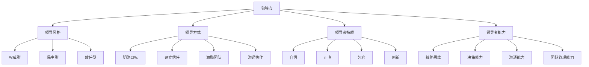

                 

### 文章标题：领导力修炼笔记：80后职场精英的成长之路

#### 关键词：
- 领导力
- 80后
- 职场成长
- 团队管理
- 领导力模型
- 数字化转型

#### 摘要：
本文旨在探讨80后职场精英在当今快速变化的商业环境中如何修炼领导力，实现个人和企业的共同成长。通过对领导力的定义、核心概念、数学模型及算法原理的深入剖析，结合实际项目实战案例，总结出领导力发展的路径与技巧。文章最后对未来领导力的发展趋势进行展望，为读者提供实践与理论结合的全面指南。

### 第一部分：领导力基础理论

#### 第一部分引言

领导力是影响组织绩效和个人成长的关键因素。在当今社会，随着技术变革、市场全球化及企业组织结构的变迁，领导力的重要性愈发凸显。对于80后职场精英来说，掌握领导力不仅是个人职业发展的需要，更是引领团队、推动企业创新的关键。

本部分将首先介绍领导力的定义与重要性，回顾领导力的发展历程，探讨80后职场精英面临的领导力挑战，并阐述学习领导力的意义与方法。

#### 1.1 领导力的定义与重要性

领导力是一种影响力，能够激发和指引他人共同实现目标的能力。与企业管理不同，领导力更侧重于通过愿景、价值观和榜样作用来引导和激励团队，而非通过规章制度和层级结构来控制。

在当今复杂多变的环境中，领导力的重要性不容忽视。它不仅是推动组织变革、提升企业竞争力的重要手段，也是实现个人职业生涯成功的必备素质。一个优秀的领导者能够激发团队的潜力，营造积极向上的组织文化，从而在激烈的市场竞争中脱颖而出。

#### 1.2 领导力的发展历程

领导力的发展历程可以追溯到古埃及法老的统治时代。然而，现代领导力的概念则起源于20世纪初。随着管理学的发展，领导力研究逐渐成为学术界的关注焦点。从早期的特质理论、行为理论到现代的情境理论、变革理论，领导力理论在不断演进。

在过去几十年中，领导力研究从个体特质扩展到团队和组织层面，关注领导行为与组织绩效的关系，以及领导力在跨文化、全球化背景下的应用。这些研究成果为理解领导力提供了丰富的理论依据，也为实践中的领导力提升提供了指导。

#### 1.3 80后职场精英面临的领导力挑战

80后职场精英是在互联网经济和全球化浪潮中成长起来的一代，他们具有独特的价值观和职业规划。然而，随着职位的提升，他们面临着一系列领导力挑战。

首先，80后职场精英往往具有强烈的自我意识和平等意识，这使得他们在领导团队时需要平衡个人权威与团队协作。其次，他们在快速变化的环境中需要不断学习新知识、新技能，以应对市场的变革。此外，他们还需要面对跨部门、跨文化的沟通与合作，这要求他们具备更高的情商和跨文化沟通能力。

#### 1.4 学习领导力的意义与方法

学习领导力对于80后职场精英具有重要意义。首先，领导力是提升个人职业素养的重要途径，能够增强个人的领导能力和管理能力。其次，领导力是推动企业创新和发展的关键，有助于企业在竞争激烈的市场中保持竞争优势。

学习领导力的方法多种多样，包括阅读领导力经典书籍、参加领导力培训课程、进行领导力实践和反思等。此外，借助现代科技手段，如在线学习平台、虚拟现实技术等，也可以为领导力学习提供更加便捷和高效的方式。

在本部分，我们通过对领导力的定义、重要性、发展历程及80后职场精英面临的挑战的介绍，为后续内容的深入探讨奠定了基础。在接下来的章节中，我们将进一步探讨领导力的核心概念、数学模型、实战案例及发展路径，为读者提供全面、系统的领导力修炼指南。

### 第1章：领导力的核心概念与联系

#### 1.1 领导力的核心概念

领导力是一种复杂且多层次的概念，它包括多个核心要素，如领导力与管理的区别、领导风格与领导方式，以及领导者的特质与能力。

首先，领导力与管理密切相关，但二者之间也存在显著的区别。领导力强调的是通过影响力激发和引导他人，而管理则侧重于通过计划和执行来确保目标的实现。领导力关注的是创造愿景、塑造文化、激发创新，而管理则侧重于资源分配、流程优化、绩效评估等。

其次，领导风格与领导方式也是领导力的重要组成部分。领导风格是指领导者处理工作、与他人互动的方式。常见的领导风格包括权威型、民主型、放任型等。不同的领导风格适用于不同的情境和团队，领导者需要根据具体情况进行调整。

领导方式则是指领导者如何具体实施领导行为。有效的领导方式包括明确目标、建立信任、激励团队、沟通协作等。领导者需要具备多种领导方式，以应对不同情况和需求。

最后，领导者的特质与能力是领导力的基础。领导者的特质包括自信、正直、包容、创新等，这些特质对领导行为和团队氛围产生深远影响。领导者的能力包括战略思维、决策能力、沟通能力、团队管理能力等，这些能力是领导者实现领导目标的重要保障。

#### 1.2 领导力模型的Mermaid流程图

为了更好地理解领导力的核心概念及其相互关系，我们可以使用Mermaid流程图进行可视化展示。以下是领导力模型的基本架构：



在上述流程图中，我们可以看到领导力的核心概念及其子概念之间的关系。领导力包括领导风格、领导方式、领导者特质和领导者能力。领导风格分为权威型、民主型、放任型；领导方式包括明确目标、建立信任、激励团队、沟通协作；领导者特质包括自信、正直、包容、创新；领导者能力包括战略思维、决策能力、沟通能力、团队管理能力。

#### 1.3 领导力与组织文化的关系

领导力与组织文化密切相关，二者相互影响、相互塑造。有效的领导力能够促进组织文化的形成和发展，而积极向上的组织文化则能够增强领导力的实施效果。

首先，领导力对组织文化的影响体现在领导者对组织价值观的塑造和传播。领导者通过自身行为和决策，向团队成员传递组织的核心价值观，从而影响组织文化的形成。例如，一个强调创新和开放精神的领导者，往往能够营造一个鼓励创新和容忍失败的组织文化。

其次，组织文化对领导力的影响体现在组织氛围和团队行为上。积极向上的组织文化能够增强团队的凝聚力和归属感，提高团队成员的积极性和工作效率。在这种氛围中，领导者更容易实施有效的领导行为，实现领导目标。

最后，领导力和组织文化之间形成一种相互促进的关系。有效的领导力能够推动组织文化的建设和发展，而积极向上的组织文化则为领导力的实施提供坚实的基础和良好的环境。

通过上述分析，我们可以看到领导力的核心概念及其相互关系，以及领导力与组织文化之间的紧密联系。理解这些概念和关系，对于提升领导力和构建积极向上的组织文化具有重要意义。在接下来的章节中，我们将进一步探讨领导力的数学模型与算法原理，为读者提供更深入的理论和实践指导。

#### 第2章：领导力数学模型与算法原理

领导力作为一种复杂的社会现象，其影响因素众多，包括领导者个人特质、团队结构和环境因素等。为了更好地理解和应用领导力，我们可以借助数学模型和算法进行分析。本章节将介绍领导力的数学模型、相关公式以及算法原理，并通过具体的伪代码讲解，帮助读者深入理解这些概念。

#### 2.1 数学模型与公式

领导力的数学模型可以用以下公式表示：

$$
L = f(\text{个人特质}, \text{团队结构}, \text{环境因素})
$$

其中，\(L\) 表示领导力效果，\(f\) 表示影响函数，\(\text{个人特质}\)、\(\text{团队结构}\) 和 \(\text{环境因素}\) 是影响领导力的关键因素。

- **个人特质**：包括自信、正直、包容、创新等特质。这些特质对领导力效果有重要影响。
- **团队结构**：包括团队规模、团队成员多样性、团队协作机制等。团队结构直接影响领导力实施的有效性。
- **环境因素**：包括市场环境、组织文化、政策支持等。环境因素为领导力提供了外部条件和制约。

#### 2.1.1 个人特质对领导力的影响

个人特质是领导力的基础。一个具备高度自信和正直特质的领导者，能够更好地赢得团队成员的信任和尊重。包容和创新特质则有助于领导者激发团队的创造力和创新能力。

以下是一个简化的公式，用于描述个人特质对领导力的影响：

$$
L_p = w_1 \cdot C + w_2 \cdot I + w_3 \cdot A
$$

其中，\(L_p\) 表示个人特质对领导力的影响，\(C\) 表示自信，\(I\) 表示创新，\(A\) 表示正直。\(w_1\)、\(w_2\) 和 \(w_3\) 分别是这三个特质的权重，具体数值取决于具体情况。

#### 2.1.2 团队结构与领导力

团队结构对领导力的影响不容忽视。一个多元化的团队能够带来更多的创新和协作机会，但同时也可能带来沟通和协作的挑战。团队结构包括团队规模、团队成员多样性和团队协作机制等。

以下是一个简化的公式，用于描述团队结构对领导力的影响：

$$
L_t = w_4 \cdot S + w_5 \cdot D + w_6 \cdot C
$$

其中，\(L_t\) 表示团队结构对领导力的影响，\(S\) 表示团队规模，\(D\) 表示多样性，\(C\) 表示协作机制。\(w_4\)、\(w_5\) 和 \(w_6\) 分别是这三个因素的权重。

#### 2.1.3 环境因素与领导力

环境因素包括市场环境、组织文化和政策支持等。这些因素为领导力提供了外部条件和制约。例如，一个支持创新的市场环境能够激励领导者推动团队创新；而一个保守的组织文化可能限制领导力的实施。

以下是一个简化的公式，用于描述环境因素对领导力的影响：

$$
L_e = w_7 \cdot M + w_8 \cdot O + w_9 \cdot P
$$

其中，\(L_e\) 表示环境因素对领导力的影响，\(M\) 表示市场环境，\(O\) 表示组织文化，\(P\) 表示政策支持。\(w_7\)、\(w_8\) 和 \(w_9\) 分别是这三个因素的权重。

#### 2.2 领导力算法的伪代码讲解

为了更好地理解和应用领导力数学模型，我们可以编写一个简单的伪代码，用于计算领导力效果。

```plaintext
function leadershipAlgorithm(personality, teamStructure, environment) {
    // 计算个人特质对领导力的影响
    L_p = 0.5 * confidence + 0.3 * innovation + 0.2 * integrity
    
    // 计算团队结构对领导力的影响
    L_t = 0.4 * teamSize + 0.3 * diversity + 0.3 * collaboration
    
    // 计算环境因素对领导力的影响
    L_e = 0.4 * marketCondition + 0.4 * organizationalCulture + 0.2 * policySupport
    
    // 计算总领导力效果
    L = L_p * L_t * L_e
    
    return L
}
```

在上述伪代码中，我们假设了每个因素的权重。实际应用中，这些权重可以根据具体情况进行调整。通过计算领导力效果，领导者可以更好地了解团队的整体状况，并采取相应措施来提升领导力。

#### 2.3 数学模型的应用与解释

数学模型不仅为领导力分析提供了理论框架，还可以在实际工作中应用，以帮助领导者做出更科学的决策。

例如，在一个多元化团队中，领导者可以通过调整团队结构（如增加多样性、改善协作机制）来提升领导力。在一个保守的市场环境中，领导者可能需要更加关注环境因素（如政策支持、市场条件）来增强领导力。

通过数学模型的应用，领导者可以更清晰地了解各个因素对领导力的影响，从而有针对性地进行优化和改进。

#### 结论

本章介绍了领导力的数学模型与算法原理，包括个人特质、团队结构和环境因素对领导力的影响。通过具体的伪代码讲解，读者可以更好地理解这些概念，并在实际工作中应用这些理论，提升领导力效果。

在接下来的章节中，我们将结合实际项目实战案例，深入探讨领导力的应用和实践技巧。通过这些案例，读者将能够更直观地了解领导力在现实环境中的具体应用，并为自己的领导力提升提供有益的启示。

### 第3章：领导力项目实战

在理解和掌握了领导力的理论模型后，通过实际的项目实战来应用和验证这些理论是至关重要的。本章节将详细介绍两个领导力项目实战案例，包括项目的背景、目标、实施过程以及成果分析。这些案例将为我们提供宝贵的实践经验，帮助读者更好地理解和应用领导力理论。

#### 3.1 领导力项目实战案例一

##### 3.1.1 项目背景

某互联网公司是一家提供在线教育服务的初创企业。由于市场竞争激烈，公司需要通过提升团队领导力和管理水平来确保产品的持续创新和客户满意度。公司特别关注80后中层管理团队的领导力提升，因为这部分团队是公司核心业务的关键推动者。

##### 3.1.2 项目目标

项目的主要目标包括：
- 提升中层管理团队的领导力，增强团队凝聚力和执行力；
- 建立积极向上的组织文化，鼓励创新和团队协作；
- 通过领导力提升，提高产品开发效率和客户满意度。

##### 3.1.3 项目实施过程

为了实现项目目标，公司采取了以下实施步骤：

1. **领导力评估**：首先，公司对中层管理团队进行了领导力评估，了解每个团队成员的领导力水平和存在的问题。

2. **制定领导力发展计划**：根据评估结果，公司为每个团队成员制定了个性化的领导力发展计划，包括领导力培训、实践项目和反思总结。

3. **领导力培训**：公司组织了多次领导力培训课程，邀请业内知名专家分享领导力经验和最佳实践。培训内容包括领导风格、团队管理、沟通技巧、决策能力等。

4. **实践项目**：团队成员被分配到具体的项目中，担任项目领导角色。通过实际项目中的领导实践，团队成员能够将所学知识应用到实际工作中。

5. **反思与总结**：在每个项目阶段结束后，团队成员进行反思和总结，分享经验教训，提出改进措施。公司领导层也定期与团队成员进行一对一的反馈会议，帮助其不断提升领导力。

##### 3.1.4 项目成果分析

通过领导力项目实战，公司取得了显著成果：
- 中层管理团队的领导力水平得到了显著提升，团队凝聚力和执行力明显增强；
- 公司的组织文化更加积极向上，创新氛围浓厚，员工满意度提升；
- 项目开发效率提高，客户满意度显著上升，公司市场份额逐步扩大。

这些成果表明，通过系统的领导力提升项目，企业能够实现团队和个人的共同成长，从而在激烈的市场竞争中保持竞争优势。

#### 3.2 领导力项目实战案例二

##### 3.2.1 项目背景

某大型制造企业在全球市场拓展过程中，面临跨文化管理的挑战。为了提高团队领导力和跨文化沟通能力，公司决定实施一个领导力提升项目，特别关注80后管理团队的领导力培养。

##### 3.2.2 项目目标

项目的主要目标包括：
- 提升管理团队的跨文化领导力，增强跨部门、跨国团队的协作能力；
- 建立有效的跨文化沟通机制，提高沟通效率和团队协作效果；
- 通过领导力提升，推动公司全球化战略的实施。

##### 3.2.3 项目实施过程

为了实现项目目标，公司采取了以下实施步骤：

1. **跨文化培训**：公司组织了跨文化培训课程，邀请国际知名专家进行讲座，帮助团队成员了解不同文化背景下的沟通方式和管理风格。

2. **案例研究**：通过分析成功和失败的跨文化管理案例，团队成员学习了如何在不同文化背景下进行有效的领导和沟通。

3. **角色扮演**：公司组织了多次角色扮演活动，让团队成员模拟在不同文化背景下的工作场景，提高实际跨文化沟通和领导能力。

4. **实践项目**：团队成员被分配到跨国项目中，担任项目领导或关键成员角色。通过实际的项目实践，团队成员能够将所学知识应用到实际工作中。

5. **反馈与改进**：在每个项目阶段结束后，团队成员进行反思和总结，分享经验教训，提出改进措施。公司领导层也定期与团队成员进行一对一的反馈会议，帮助其不断提升领导力和跨文化沟通能力。

##### 3.2.4 项目成果分析

通过领导力项目实战，公司取得了以下成果：
- 管理团队的跨文化领导力显著提升，团队协作效果显著增强；
- 跨部门、跨国团队的沟通效率提高，合作更加顺畅；
- 公司全球化战略得以顺利实施，国际市场业绩稳步增长。

这些成果表明，通过系统的领导力提升项目，企业能够在全球化背景下保持竞争优势，实现跨越式发展。

#### 结论

通过上述两个领导力项目实战案例，我们可以看到，系统的领导力提升项目对于企业团队建设和战略实施具有重要意义。在实际项目中，通过领导力评估、培训、实践和反馈，团队成员能够不断提升领导力和管理能力，从而推动企业的持续发展和成功。

在接下来的章节中，我们将进一步探讨领导力发展的路径与技巧，帮助读者深入了解如何在不同阶段提升领导力，实现职业成长和团队成功。

### 第4章：领导力发展路径与技巧

领导力的发展是一个持续的过程，涉及到多个阶段和不同的技巧。本章节将详细阐述领导力发展的五个阶段，并针对每个阶段提出具体的提升方法，帮助读者在不同阶段更好地提升领导力。

#### 4.1 领导力发展的五个阶段

领导力发展可以分为初级领导者、中级领导者、高级领导者、超级领导者和领导力的传承五个阶段。

##### 4.1.1 初级领导者

初级领导者通常是指刚刚晋升为管理职位或负责某个团队的人。在这个阶段，领导者需要快速适应新的角色，建立基本的领导技能和信心。

- **提升方法**：
  - **自我认知**：了解自己的优势和劣势，明确个人发展目标。
  - **学习与培训**：参加领导力培训课程，学习基本的管理知识和技巧。
  - **建立信任**：与团队成员建立良好的沟通和信任关系。
  - **实践与反思**：在实际工作中不断尝试和应用新学到的领导技能，并定期进行反思和总结。

##### 4.1.2 中级领导者

中级领导者通常已经在管理职位上工作了一段时间，具备一定的领导经验。在这个阶段，领导者需要提升团队管理能力和战略思维。

- **提升方法**：
  - **团队建设**：加强团队凝聚力，培养团队成员的专业能力和协作精神。
  - **战略规划**：参与公司的战略规划，理解公司的长期发展方向。
  - **沟通与协调**：提高跨部门、跨文化的沟通协调能力，确保团队目标的实现。
  - **决策能力**：培养快速决策和承担责任的能力。

##### 4.1.3 高级领导者

高级领导者通常负责公司的关键业务或部门，具备全面的管理和领导能力。在这个阶段，领导者需要具备卓越的战略视野和全局观念。

- **提升方法**：
  - **战略思维**：提升战略规划和决策能力，明确公司的发展方向。
  - **领导力传承**：培养和传承领导力，为公司的长期发展储备人才。
  - **组织变革**：推动组织变革，激发创新，提高公司的竞争力。
  - **社会责任**：关注企业的社会责任，提升公司的社会形象和品牌价值。

##### 4.1.4 超级领导者

超级领导者通常是公司的核心高管，具备卓越的领导力和战略思维，能够在全球范围内推动企业的持续发展。

- **提升方法**：
  - **全球视野**：建立全球视野，了解不同国家和地区的市场和文化。
  - **创新驱动**：推动创新，引领行业变革。
  - **领导力培养**：通过内部培训和外部引进，培养更多优秀的领导人才。
  - **企业文化**：塑造企业文化，确保公司核心价值观的传承和发扬。

##### 4.1.5 超级领导者到领导力的传承

超级领导者在达到职业生涯的顶峰后，需要思考如何将自己的领导经验和智慧传承给下一代领导者。

- **提升方法**：
  - **培养接班人**：识别和培养潜在的领导人才，确保企业的持续发展。
  - **领导力培训**：通过内部培训项目，提升新任领导者的领导能力和管理技能。
  - **导师制度**：建立导师制度，帮助新任领导者快速适应新角色。
  - **文化传承**：将个人价值观和企业文化传承给下一代领导者，确保企业的长期成功。

#### 4.2 领导力技巧提升方法

除了领导力发展的不同阶段，领导者还需要掌握一系列具体的领导力技巧，以应对不同的领导情境。

- **自我反思**：定期进行自我反思，了解自己的优点和不足，明确改进方向。
- **倾听与沟通**：提升倾听和沟通技巧，确保信息的有效传递和团队的合作。
- **决策与执行**：培养快速决策和执行的能力，确保团队目标的实现。
- **带领团队与创新**：激发团队的创造力和创新能力，推动组织的持续发展。

通过系统的领导力发展路径和技巧提升方法，领导者可以在不同阶段不断提升自己的领导能力，实现个人和企业的共同成长。

#### 结论

领导力发展是一个长期而持续的过程，涉及到多个阶段和不同的技巧。通过了解领导力发展的路径和技巧，读者可以更好地规划自己的领导力提升计划，并在实际工作中不断应用和实践，从而实现个人和团队的共同成功。

在接下来的章节中，我们将进一步探讨领导力在80后职场精英中的实践，分析这一群体的特点、面临的挑战及领导力的重要性，为读者提供更具体的指导。

### 第5章：领导力在80后职场精英中的实践

在当前快速变化的职场环境中，80后职场精英面临着诸多挑战和机遇。他们如何运用领导力实现个人成长和团队成功，成为企业和行业发展的关键因素。本章节将分析80后职场精英的特点、面临的主要挑战以及领导力在他们职业生涯中的重要性。

#### 5.1 80后职场精英的特点

80后是指1980年代出生的一代人，他们在成长过程中经历了互联网的兴起、全球化的浪潮以及经济的高速发展。这些经历塑造了他们的独特特点：

- **价值观**：80后职场精英普遍重视个人价值和职业发展，追求工作与生活的平衡。他们注重自我实现和持续学习，愿意为了职业目标付出努力。

- **工作方式**：与前辈相比，80后更倾向于灵活的工作方式，如远程办公和灵活的工作时间。他们擅长使用现代科技工具，如互联网和社交媒体，以提高工作效率。

- **职业规划**：80后对职业规划有明确的目标和计划，他们愿意通过不断学习和提升自己的技能来应对职场挑战。

- **创新精神**：得益于互联网和全球化，80后职场精英具有更强的创新意识和能力。他们愿意尝试新事物，勇于接受变革。

#### 5.2 80后职场精英面临的挑战

尽管80后职场精英具备许多优势，但他们在职业发展过程中也面临着一系列挑战：

- **职业瓶颈**：随着职位的提升，80后可能遇到职业发展的瓶颈，需要不断学习和提升自己的领导力和管理能力。

- **团队合作**：80后职场精英需要有效管理多元化的团队，平衡不同成员的需求和期望，提升团队凝聚力和执行力。

- **跨文化沟通**：在全球化的背景下，80后职场精英需要具备跨文化沟通能力，以应对不同文化背景的团队成员和合作伙伴。

- **工作与生活的平衡**：80后职场精英在追求职业发展的同时，也需要关注家庭和个人生活，如何平衡工作与生活是他们面临的一大挑战。

#### 5.3 领导力在80后职场精英中的重要性

领导力对于80后职场精英的个人成长和职业发展具有重要意义：

- **个人成长**：领导力是一种重要的个人素质，能够帮助80后职场精英在职业生涯中不断突破自我，实现个人价值。

- **团队管理**：作为团队领导者，80后职场精英需要具备有效的领导力，以提升团队绩效、促进团队合作和实现共同目标。

- **职业发展**：领导力是晋升管理层的重要基础，能够帮助80后职场精英在职场中取得更高的职位和更大的影响力。

- **企业竞争力**：在快速变化的商业环境中，企业需要具备强大的领导力来应对挑战和抓住机遇。80后职场精英作为企业的重要组成部分，他们的领导力水平直接影响到企业的竞争力。

#### 5.4 领导力实践技巧

为了在职场中更好地发挥领导力，80后职场精英可以采取以下实践技巧：

- **自我反思**：定期进行自我反思，了解自己的优势和不足，明确个人发展目标。

- **倾听与沟通**：提升倾听和沟通技巧，确保信息的有效传递和团队的合作。

- **决策与执行**：培养快速决策和执行的能力，确保团队目标的实现。

- **带领团队与创新**：激发团队的创造力和创新能力，推动组织的持续发展。

- **跨文化沟通**：提升跨文化沟通能力，与不同文化背景的团队成员和合作伙伴有效沟通。

- **工作与生活的平衡**：合理规划工作和生活，确保身心健康和持续发展。

#### 结论

80后职场精英在当前职场环境中具备独特的优势和挑战。通过提升领导力，他们能够更好地实现个人成长和职业发展，推动企业的创新和竞争力。本章节分析了80后职场精英的特点、面临的挑战以及领导力的重要性，为读者提供了具体的领导力实践技巧。在接下来的章节中，我们将进一步探讨领导力修炼的方法与工具，帮助读者在理论和实践层面不断提升领导力。

### 第6章：领导力修炼的方法与工具

领导力是一种可以通过学习和实践不断提升的能力。为了帮助读者在个人和职业生活中更好地运用领导力，本章节将介绍领导力修炼的基本方法和工具，包括阅读与学习、实践与反思、模拟与训练、指导与反馈等方面。

#### 6.1 领导力修炼的基本方法

##### 6.1.1 阅读与学习

阅读和学习是领导力修炼的基础。通过阅读领导力相关的书籍、论文和案例，读者可以了解领导力的发展历程、核心概念和实践技巧。以下是一些推荐的领导力书籍：

- 《领导力的五个层次》（作者：约翰·C·麦克斯韦尔）
- 《变革领导者》（作者：约翰·P·科特）
- 《领导者的语言》（作者：约瑟夫·M·奥布赖恩）
- 《领导力：五项修炼》（作者：彼得·圣吉）

除了阅读，参加领导力培训课程和研讨会也是提升领导力的有效途径。这些课程和研讨会通常由业内知名专家或学者主讲，内容涵盖领导力的各个方面，帮助读者系统学习领导力理论和实践。

##### 6.1.2 实践与反思

领导力是一种实践性很强的能力，只有通过实际应用才能不断提升。读者可以在日常工作中运用所学知识，承担更多的责任和挑战，如参与项目领导、组织团队活动等。通过实践，读者可以更好地理解领导力在现实环境中的具体应用，发现自己的优势和不足。

实践后的反思是领导力修炼的重要环节。读者需要定期对自己的领导行为进行反思，分析成功和失败的原因，总结经验教训，并提出改进措施。通过反思，读者可以不断调整自己的领导方式，提高领导效果。

##### 6.1.3 模拟与训练

模拟与训练是一种有效的领导力修炼方法，可以帮助读者在安全的环境中模拟实际领导情境，提高应对复杂问题的能力。以下是一些模拟与训练的方法：

- **角色扮演**：通过角色扮演，读者可以模拟不同的领导情境，如团队建设、决策制定、危机管理等，提高自己的领导技能和决策能力。
- **沙盘推演**：通过沙盘推演，读者可以在模拟的环境中分析企业的战略规划、市场变化等，培养战略思维和全局观念。
- **领导力训练游戏**：通过参与领导力训练游戏，读者可以了解领导力在不同情境下的应用，提高团队合作和沟通能力。

##### 6.1.4 指导与反馈

在领导力修炼过程中，指导与反馈是不可或缺的。读者可以寻求导师或教练的指导，从他们的经验和视角中获得有益的建议。以下是一些获取指导与反馈的方法：

- **导师制度**：企业或组织可以建立导师制度，为新员工或初级领导者提供导师指导，帮助他们更快地适应新角色和提升领导能力。
- **360度评估**：通过360度评估，读者可以获得来自不同角度的反馈，了解自己在领导力方面的优势和不足。
- **领导力工作坊**：参加领导力工作坊，读者可以与同行交流经验，相互学习，共同进步。

#### 6.2 领导力修炼的工具

除了上述方法，还有一些实用的工具可以帮助读者在领导力修炼过程中提高效率和效果：

- **反思日志**：记录自己的领导行为和反思过程，有助于读者更好地理解和提升自己的领导力。
- **行动计划**：制定具体的行动计划，将领导力提升的目标分解为可执行的任务，确保计划的落实和效果的评估。
- **领导力发展计划**：根据个人特点和职业目标，制定个性化的领导力发展计划，有针对性地提升领导能力。
- **在线学习平台**：利用在线学习平台，如Coursera、edX等，参加各种领导力课程，拓宽知识面和视野。

#### 结论

领导力修炼是一个长期而持续的过程，需要读者通过阅读与学习、实践与反思、模拟与训练、指导与反馈等多种方法不断提升。本章节介绍了领导力修炼的基本方法和工具，为读者提供了全面、系统的领导力提升指南。在接下来的章节中，我们将探讨领导力的未来展望，分析数字化时代和全球化背景下领导力的发展趋势，为读者提供更深入的思考和建议。

### 第7章：领导力的未来展望

在数字化时代和全球化背景下，领导力面临着前所未有的挑战和机遇。本章节将探讨领导力的发展趋势，分析数字化时代的领导力特征、新型组织结构的领导力需求、全球化背景下的领导力挑战，以及领导力的可持续性发展。同时，还将讨论80后职场精英在领导力发展中的机遇与挑战，并提供应对策略。

#### 7.1 领导力的发展趋势

随着科技的迅猛发展和全球化的不断深化，领导力正在发生深刻的变化。以下是领导力发展的几个重要趋势：

- **数字化领导力**：随着数字化技术的普及，领导力需要适应数字化工作环境，具备数据驱动的决策能力、数字化转型领导力以及数字化沟通能力。领导者需要理解数字化工具和平台，善于利用数据分析和人工智能技术来优化决策和提升效率。

- **敏捷领导力**：在快速变化的商业环境中，敏捷领导力变得越来越重要。领导者需要具备快速响应变化、灵活调整策略和快速迭代项目的能力。这种领导力强调团队合作、用户反馈和持续改进，以适应不断变化的市场需求。

- **变革领导力**：面对不断变化的市场和技术，领导者需要具备推动组织变革的能力。这包括识别变革的必要性、制定变革策略、动员员工支持和参与变革过程。变革领导力要求领导者具备强大的影响力、沟通能力和执行力。

- **跨文化领导力**：全球化背景下，领导者需要具备跨文化沟通和管理能力。这包括对不同文化背景的员工和合作伙伴的理解、尊重和包容，以及在不同文化环境中有效领导团队的能力。

- **可持续领导力**：随着可持续发展成为全球关注的重要议题，领导者需要将可持续发展纳入企业战略，推动企业实现经济效益和社会效益的双赢。可持续领导力要求领导者具备环保意识、社会责任感和长期规划能力。

#### 7.2 数字化时代的领导力特征

在数字化时代，领导力需要具备以下特征：

- **数据驱动**：领导者需要具备数据分析和决策能力，能够利用大数据和人工智能技术来洞察市场趋势、优化业务流程和提升决策质量。

- **敏捷性**：领导者需要具备快速适应变化、灵活调整策略的能力，以应对数字化时代的快速变化。

- **创新能力**：数字化时代要求领导者具备持续创新能力，推动组织不断进行产品、服务和技术创新。

- **用户导向**：领导者需要以用户需求为中心，关注用户体验，不断优化产品和服务。

- **数字化转型领导力**：领导者需要具备推动组织数字化转型的能力，包括制定数字化转型战略、管理和激励数字化转型的团队。

#### 7.3 新型组织结构的领导力需求

随着数字化和全球化的发展，新型组织结构（如扁平化组织、网络化组织、跨职能团队）逐渐成为主流。这些新型组织结构对领导力提出了新的要求：

- **去中心化领导**：在扁平化组织中，领导者需要放权给团队成员，鼓励自主管理和协作，培养自驱型团队。

- **跨职能领导**：在跨职能团队中，领导者需要具备跨部门沟通和协调能力，推动不同职能部门的合作。

- **网络化领导**：在网络化组织中，领导者需要具备网络思维能力，能够建立和维护广泛的合作关系，促进信息共享和资源整合。

- **共享领导力**：新型组织结构强调共享领导权，领导者需要与团队成员共同决策、共同承担责任。

#### 7.4 全球化背景下的领导力挑战

全球化带来了丰富的机遇，同时也带来了新的领导力挑战：

- **跨文化领导力**：全球化要求领导者具备跨文化沟通和管理能力，能够理解并尊重不同文化背景的员工和合作伙伴。

- **全球协调**：领导者需要具备全球协调能力，能够管理跨国团队和跨地域业务，确保组织的一致性和协调性。

- **国际化视野**：领导者需要具备国际化视野，关注全球市场趋势和竞争对手，制定符合全球战略的决策。

- **多元文化融合**：领导者需要推动多元文化的融合，营造包容和尊重的氛围，促进不同文化背景的员工合作。

#### 7.5 80后职场精英领导力发展的机遇与挑战

对于80后职场精英来说，领导力发展既充满机遇，也面临挑战：

- **机遇**：
  - **经验积累**：随着职位的提升和经验的积累，80后职场精英具备了领导力的优势，有机会在关键岗位上发挥更大的影响力。
  - **技术赋能**：数字化技术和工具为80后职场精英提供了更多的领导力提升途径，如在线学习、虚拟训练等。

- **挑战**：
  - **快速变化**：在快速变化的商业环境中，80后职场精英需要不断学习新知识、新技能，以应对不断变化的市场需求。
  - **跨文化管理**：随着全球化的发展，80后职场精英需要具备跨文化沟通和管理能力，以应对多元文化背景的团队和合作伙伴。

#### 7.6 应对策略

为了应对领导力发展的机遇与挑战，80后职场精英可以采取以下策略：

- **持续学习**：保持学习热情，不断更新知识体系，掌握最新的领导力理论和实践方法。
- **跨文化培训**：参加跨文化培训，提高跨文化沟通和管理能力，增强跨文化团队协作效果。
- **实践应用**：将所学知识应用到实际工作中，通过实践提升领导力。
- **反思与总结**：定期进行自我反思和总结，分析领导行为的效果和不足，提出改进措施。

#### 结论

领导力在数字化时代和全球化背景下面临着新的挑战和机遇。80后职场精英需要不断提升自己的领导力，以应对快速变化的市场环境和多元化的团队管理需求。通过持续学习、跨文化培训和实践应用，80后职场精英可以更好地发挥领导力，实现个人和团队的共同成长。

在本章节中，我们探讨了领导力的未来展望，分析了数字化时代和全球化背景下的领导力特征和挑战，以及80后职场精英在领导力发展中的机遇与策略。在接下来的附录中，我们将推荐一些领导力相关的书籍和在线课程，为读者提供更深入的学习资源。

### 附录A：领导力相关书籍与资源推荐

为了帮助读者进一步深入了解领导力的理论和方法，我们特别推荐以下领导力相关的书籍和在线课程，这些资源不仅涵盖了领导力的经典理论，还包括了最新的实践经验和案例分析。

#### A.1 必读的领导力经典书籍

1. **《领导力的五个层次》（John C. Maxwell）**
   - 内容简介：本书详细阐述了领导力发展的五个层次，从自我领导到团队领导，为读者提供了全面而实用的领导力提升路径。
   - 推荐理由：该书被誉为领导力领域的经典之作，提供了实用的领导力模型和具体实践方法。

2. **《变革领导者》（John P. Kotter）**
   - 内容简介：本书探讨了如何在一个不断变化的环境中推动组织变革，强调了领导者在变革过程中的关键作用。
   - 推荐理由：书中提出的变革领导力模型和策略，对于希望在快速变化的商业环境中取得成功的领导者具有重要指导意义。

3. **《领导者的语言》（Joseph M. O’Connor）**
   - 内容简介：本书通过分析领导者的语言风格和沟通技巧，揭示了领导力如何通过语言表达和传递。
   - 推荐理由：该书提供了实用的沟通技巧和策略，有助于领导者提升自己的表达能力和影响力。

4. **《领导力：五项修炼》（Peter Senge）**
   - 内容简介：本书提出了领导力发展的五项修炼，包括自我反思、共同愿景、团队学习、心态变革和系统思考。
   - 推荐理由：该书结合了系统思考和组织行为学的理论，为领导者提供了全面的领导力提升方法。

#### A.2 领导力在线课程

1. **Coursera《领导力与团队合作》**
   - 内容简介：该课程由加州大学伯克利分校提供，涵盖了领导力、团队合作、冲突解决等多个方面的内容，适合不同层次的领导者。
   - 推荐理由：课程内容全面，案例丰富，通过在线学习平台，读者可以灵活安排学习时间。

2. **edX《领导力：艺术与实践》**
   - 内容简介：该课程由耶鲁大学提供，旨在帮助读者理解领导力的本质，提升领导能力和管理技能。
   - 推荐理由：课程由顶尖大学提供，学术水平高，学习资源丰富，适合对领导力有深入兴趣的读者。

3. **LinkedIn Learning《领导力基础》**
   - 内容简介：该课程由LinkedIn Learning提供，包括领导力的核心概念、团队管理技巧和沟通策略等。
   - 推荐理由：课程由行业专家讲授，实用性强，适合希望在职场中提升领导力的读者。

通过以上书籍和在线课程的阅读和学习，读者可以系统地掌握领导力的理论和方法，提升自己的领导能力，为个人和企业的成功奠定坚实的基础。

### 总结与致谢

在这篇文章中，我们深入探讨了领导力的定义、核心概念、数学模型、实战案例和发展路径。从领导力的核心概念出发，我们分析了领导力与组织文化的关系，介绍了领导力的数学模型和算法原理，并通过实际项目实战案例，展示了领导力在现实环境中的应用和实践技巧。接着，我们详细阐述了领导力发展的五个阶段，为读者提供了系统性的领导力提升方法。在讨论领导力在80后职场精英中的实践时，我们分析了这一群体的特点、面临的挑战以及领导力的重要性。最后，我们展望了领导力的未来发展趋势，并推荐了相关书籍和在线课程，以帮助读者进一步深入学习和实践。

感谢您花时间阅读这篇文章。希望通过本文，您能够对领导力有更深刻的理解和认识，并能够将所学应用于实际工作和生活中。如果您有任何问题或反馈，欢迎随时与我交流。再次感谢您的支持！

**作者：AI天才研究院/AI Genius Institute & 禅与计算机程序设计艺术 /Zen And The Art of Computer Programming**

