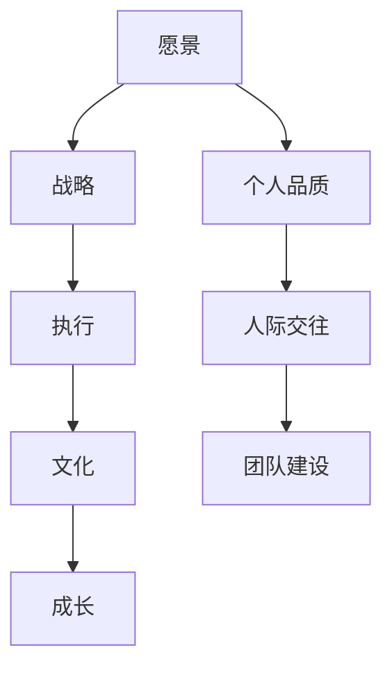
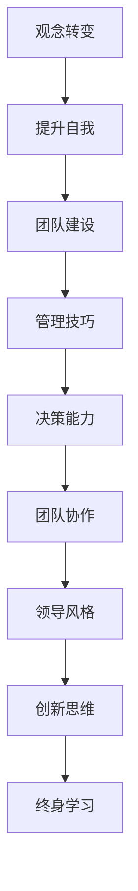

                 

### 文章标题

《领导力修炼笔记：80后职场精英的成长历程》

领导力在职场中扮演着至关重要的角色，是职场精英们不断成长和进步的核心动力。本书旨在通过分享80后职场精英的实际经历和心路历程，为职场新人提供一套系统的领导力培养方法。通过逐步分析领导力的核心概念、修炼之路、实战案例以及未来发展趋势，本书希望帮助广大职场人士在职业生涯中不断提升自己的领导力，实现个人与团队的共同成长。

### 关键词

- 领导力
- 职场精英
- 成长历程
- 实战案例
- 数字化转型

### 摘要

本书《领导力修炼笔记：80后职场精英的成长历程》通过深入剖析80后职场精英的实际经历和心路历程，旨在为职场新人提供一套系统的领导力培养方法。文章首先介绍了领导力的核心概念，包括其定义、层次和五大要素。接着，文章分为三部分，分别探讨了领导力修炼之路的初期、中期和晚期阶段，以及领导力的未来发展趋势。通过具体案例分享，本书展示了如何在实践中提升领导力，并探讨了数字化转型背景下领导力的重要性。最终，本书为读者提供了宝贵的经验和启示，帮助他们在职业生涯中不断成长和进步。

## 第一部分：引言与核心概念

### 1. 引言

领导力是职场中不可或缺的一项能力，对于个人职业生涯的成功和团队的绩效提升具有重要意义。随着企业竞争的日益激烈，领导力已经不仅仅局限于管理层级，而是成为每一个职场人士都需要具备的基本素质。本书《领导力修炼笔记：80后职场精英的成长历程》旨在为职场新人提供一套系统的领导力培养方法，帮助他们更好地应对职场挑战，实现个人与团队的共同成长。

本书通过分享80后职场精英的实际经历和心路历程，旨在为广大职场人士提供宝贵的经验和启示。这些经验不仅包括领导力的核心概念和理论基础，更涵盖了一系列实用的技巧和方法。通过阅读本书，读者可以了解领导力在不同阶段的修炼路径，以及如何在实战中运用领导力提升团队绩效。

### 2. 领导力的核心概念

#### 2.1 领导力的定义

领导力是指领导者通过激励、引导和影响他人，实现共同目标的能力。它不仅包括技术和管理能力，更体现在个人品质、人际交往和团队建设等方面。一个优秀的领导者需要具备以下特点：

- **愿景**：能够明确团队的目标和方向，为团队提供明确的愿景。
- **战略**：能够制定实现愿景的方案和策略，确保团队按照正确的方向前进。
- **执行**：能够确保团队按照计划高效运作，将战略转化为实际的行动。
- **文化**：能够营造积极向上的团队氛围，促进团队成员之间的合作与信任。
- **成长**：能够关注团队成员的成长与发展，帮助他们不断提升个人能力和职业素养。

#### 2.2 领导力的层次

领导力可以分为三个层次，每个层次都有其特定的关注点和能力要求：

- **一层领导力**：主要关注个人绩效。这一层次的领导者需要具备自我驱动和自我管理的能力，能够独立完成任务并实现个人目标。
- **二层领导力**：主要关注团队绩效。这一层次的领导者需要具备团队协作和沟通能力，能够激励和引导团队成员共同实现团队目标。
- **三层领导力**：主要关注组织绩效。这一层次的领导者需要具备战略规划和决策能力，能够从组织层面思考问题，推动组织的长期发展。

#### 2.3 领导力的五大要素

领导力的五大要素是愿景、战略、执行、文化和成长。这些要素相互关联，共同构成了一个完整的领导力体系。

- **愿景**：愿景是领导力的核心，它为团队提供了明确的目标和方向。一个有远见的领导者能够描绘出团队未来的蓝图，激励团队成员为实现这一愿景而努力。
  
  $$ 
  \text{愿景} = \text{目标} + \text{路径} + \text{意义}
  $$
  
- **战略**：战略是领导力的基础，它为团队提供了实现愿景的方案和策略。一个有能力的领导者能够根据外部环境和内部资源，制定出科学合理的战略，确保团队朝着正确的方向前进。

  $$
  \text{战略} = \text{市场分析} + \text{资源整合} + \text{行动计划}
  $

- **执行**：执行是领导力的关键，它决定了战略能否顺利实施。一个高效的领导者能够确保团队按照计划高效运作，及时发现和解决问题，确保目标得以实现。

  $$
  \text{执行} = \text{计划} + \text{组织} + \text{协调} + \text{控制}
  $

- **文化**：文化是领导力的保障，它为团队提供了共同的价值观念和行为准则。一个优秀的领导者能够营造积极向上的团队文化，促进团队成员之间的合作与信任。

  $$
  \text{文化} = \text{价值观} + \text{行为规范} + \text{团队精神}
  $

- **成长**：成长是领导力的动力，它关注团队成员的个人发展和职业规划。一个有远见的领导者能够关注团队成员的成长，为他们提供培训和发展机会，激发团队成员的潜能。

  $$
  \text{成长} = \text{培训} + \text{激励} + \text{职业规划}
  $

### 2.4 领导力的Mermaid流程图

为了更好地理解领导力的五大要素及其相互关系，我们可以使用Mermaid绘制一个流程图。以下是一个简单的Mermaid图示：

在这个流程图中，愿景是整个领导力体系的起点，通过战略、执行、文化、成长等要素，最终实现个人品质、人际交往和团队建设的目标。这个流程图不仅帮助我们理解领导力的核心概念，也为领导者的实践提供了指导。

## 第二部分：领导力修炼之路

### 3. 领导力修炼之路概述

领导力并非与生俱来，而是需要通过不断的学习和实践来培养和提升。领导力的修炼之路可以分为初期、中期和晚期三个阶段，每个阶段都有其特定的修炼目标和内容。

- **初期修炼**：主要是观念转变和自我提升，领导者需要从“职位”到“领导力”转变观念，同时增强自信心、拓宽知识面和提升沟通能力。
- **中期修炼**：主要是管理技巧和决策能力的提升，领导者需要学会时间管理、任务分配和激励员工，同时培养团队协作和解决冲突的能力。
- **晚期修炼**：主要是领导风格和创新思维的培养，领导者需要适应不同情况，灵活运用领导风格，鼓励创新思维，并推动数字化转型。

### 4. 初期修炼

#### 4.1 观念转变

在领导力的修炼初期，观念转变是至关重要的一步。领导者需要从“职位”到“领导力”转变观念，认识到领导力不仅仅是职位赋予的权力，更是一种能力。以下是一些建议：

1. **从“命令式”到“引导式”**：传统的领导方式往往是命令式，领导者通过下达指令来指导团队成员。而优秀的领导者更倾向于引导式，通过激励和启发来引导团队成员。

2. **从“个人优秀”到“团队优秀”**：领导者的成功不仅仅取决于个人能力，更取决于团队的整体表现。领导者需要将个人目标和团队目标结合起来，促进团队的整体发展。

#### 4.2 提升自我

提升自我是领导力修炼的核心内容。以下是一些建议：

1. **增强自信心**：自信心是领导者的关键素质之一。领导者需要通过不断挑战自我、克服困难来增强自信心。

2. **拓宽知识面**：领导者需要具备广泛的知识面，包括行业知识、管理知识和心理学知识等。只有具备丰富的知识储备，才能更好地应对各种挑战。

3. **提升沟通能力**：沟通能力是领导者必备的能力。领导者需要通过有效的沟通来传达信息、激励团队和解决冲突。

#### 4.3 团队建设

团队建设是领导力修炼的重要部分。以下是一些建议：

1. **了解团队成员**：领导者需要了解每个团队成员的优点和不足，从而更好地发挥他们的潜力。

2. **建立信任**：信任是团队合作的基石。领导者需要通过开放、真诚和透明的方式与团队成员沟通，建立信任关系。

3. **发挥团队成员的潜力**：领导者需要鼓励团队成员发展自己的潜力，提供培训和发展机会，帮助他们实现个人和职业目标。

### 5. 中期修炼

#### 5.1 管理技巧

在领导力的中期修炼阶段，管理技巧的提升是关键。以下是一些建议：

1. **时间管理**：领导者需要学会合理规划时间，确保重要任务的优先处理，同时避免时间的浪费。

2. **任务分配**：领导者需要根据团队成员的能力和兴趣，合理分配任务，确保任务的高效完成。

3. **激励员工**：领导者需要通过激励手段来激发员工的积极性和创造力，包括物质激励和非物质激励。

#### 5.2 决策能力

决策能力是领导者的重要能力之一。以下是一些建议：

1. **收集信息**：领导者需要广泛收集信息，包括市场趋势、行业动态和内部数据等，为决策提供依据。

2. **分析利弊**：领导者需要对决策的利弊进行充分分析，权衡各种因素，确保决策的合理性。

3. **勇于承担**：领导者需要勇于承担决策的责任，无论决策结果如何，都要积极面对并从中吸取经验教训。

#### 5.3 团队协作

团队协作是领导力修炼的重要内容。以下是一些建议：

1. **搭建高效的团队**：领导者需要根据团队的目标和任务，搭建高效的团队，确保团队成员的合理分工和协作。

2. **培养团队精神**：领导者需要通过一系列活动和措施，培养团队精神，增强团队成员之间的互信和合作。

3. **引导团队解决冲突**：领导者需要具备解决团队内部冲突的能力，通过有效的方法引导团队解决冲突，维护团队的稳定和和谐。

### 6. 晚期修炼

#### 6.1 领导风格

在领导力的晚期修炼阶段，领导风格的形成和运用是关键。以下是一些建议：

1. **适应不同情况，灵活运用领导风格**：领导者需要根据不同的情况和团队成员的特点，灵活运用不同的领导风格，确保团队的效率和活力。

2. **尊重员工个性，发挥个人优势**：领导者需要尊重员工的个性，关注员工的个人发展，发挥员工的个人优势，促进团队的整体发展。

#### 6.2 创新思维

创新思维是领导者必备的能力。以下是一些建议：

1. **鼓励创新思维**：领导者需要营造一个鼓励创新的文化氛围，激发员工的创新潜力，推动团队的创新和发展。

2. **创造有利创新的环境**：领导者需要提供必要的资源和支持，为员工创造一个有利于创新的工作环境。

3. **管理创新风险**：领导者需要合理评估创新风险，制定相应的风险管理措施，确保创新的顺利进行。

#### 6.3 终身学习

终身学习是领导者不断提升自我和团队的关键。以下是一些建议：

1. **保持好奇心**：领导者需要保持对知识和新技术的好奇心，不断学习新知识，跟上时代的步伐。

2. **追求卓越**：领导者需要追求卓越，不断提升个人和团队的能力和绩效。

3. **不断学习新知识**：领导者需要关注行业动态和新兴技术，不断学习新知识，为团队的发展提供新的思路和方向。

### 7. 领导力修炼的Mermaid流程图

为了更好地理解领导力修炼的整个过程，我们可以使用Mermaid绘制一个流程图。以下是一个简单的Mermaid图示：

在这个流程图中，观念转变、提升自我、团队建设、管理技巧、决策能力、团队协作、领导风格、创新思维和终身学习相互关联，构成了一个完整的领导力修炼体系。

## 第三部分：实战案例分享

### 7. 案例一：如何带领团队实现目标

#### 7.1 案例背景

某公司是一家新兴的科技公司，面临着激烈的市场竞争。公司的研发团队负责开发一款创新的产品，但团队内部存在严重的分歧，且团队成员之间缺乏有效的沟通，导致项目进展缓慢。公司管理层决定采取行动，帮助研发团队实现目标。

#### 7.2 案例过程

1. **确立共同目标**：首先，公司管理层与研发团队召开了一次会议，明确了项目的共同目标。通过讨论，团队达成了一致，将项目目标定为在三个月内完成产品原型开发。

2. **分析团队成员的优势和劣势**：接下来，管理层对团队成员进行了详细的评估，了解每个人的特长和不足。这有助于在任务分配时，发挥每个人的优势，弥补团队的短板。

3. **制定实现目标的计划和策略**：基于团队成员的评估结果，管理层制定了一份详细的计划和策略。计划包括任务分解、时间节点和关键里程碑。策略包括如何克服技术难题、如何确保团队成员的协作等。

4. **激励员工，增强团队凝聚力**：管理层通过一系列激励措施，如奖金、表彰和团队活动，激励员工积极参与项目，增强团队的凝聚力。

5. **监控进度，调整策略**：在项目实施过程中，管理层定期召开会议，监控项目进度，及时发现问题并调整策略。例如，在项目中期，由于技术难题的解决需要更多时间，管理层决定调整时间节点，以确保项目能够按时完成。

#### 7.3 案例结果

通过一系列的措施，研发团队最终在三个月内完成了产品原型开发。团队成员之间的关系得到了改善，团队凝聚力显著提升。公司业务也得到了持续发展，项目成功为公司带来了可观的经济效益。

### 8. 案例二：如何应对突发事件

#### 8.1 案例背景

某公司研发团队在项目实施过程中，突然遇到了一个严重的技术难题。这个技术难题可能导致项目无法按时完成，甚至可能影响到公司的业务运营。公司管理层决定采取紧急措施，应对这一突发事件。

#### 8.2 案例过程

1. **保持冷静，快速分析问题**：首先，公司管理层保持冷静，迅速分析问题的原因。通过与技术团队沟通，管理层了解到问题的根源在于一项关键技术无法突破。

2. **集思广益，寻找解决方案**：接下来，管理层组织了技术研讨会，邀请公司内部的技术专家和外部的合作伙伴共同参与。通过集思广益，团队找到了几个可能的解决方案。

3. **分配任务，明确责任**：管理层根据解决方案，将任务分配给不同的团队成员，并明确了每个人的责任。例如，有的团队成员负责技术攻关，有的团队成员负责与外部合作伙伴沟通。

4. **监控进度，确保项目顺利进行**：在解决问题的过程中，管理层定期监控进度，及时调整策略。例如，在技术攻关阶段，管理层发现某个方案可能不可行，立即调整方案，确保项目能够顺利进行。

#### 8.3 案例结果

通过一系列的紧急措施，技术难题最终得到解决，项目按时完成。团队成员的合作精神得到了极大的提升，公司的业务运营也没有受到太大影响。这次突发事件的处理经验也为公司未来的项目提供了宝贵的借鉴。

### 9. 案例三：如何培养团队成员

#### 9.1 案例背景

某公司新入职了一批年轻的研发人员，他们具备较高的学历和技能，但缺乏实际工作经验。公司管理层意识到，这些新员工需要通过培训和指导，才能更好地适应公司的工作环境和要求。

#### 9.2 案例过程

1. **了解新员工需求和期望**：首先，管理层与新员工进行了深入的交流，了解他们的需求和期望。通过交流，管理层了解到新员工希望在短期内能够获得实际工作经验，并希望得到公司领导的关注和支持。

2. **为新员工提供培训和学习机会**：基于新员工的需求，管理层制定了一份详细的培训计划，包括技术培训、项目管理培训和心理素质培训等。同时，公司还为新员工提供了丰富的学习资源，如在线课程、内部培训和外部研讨会等。

3. **鼓励团队成员分享经验和心得**：为了促进团队成员之间的交流和学习，管理层组织了一系列的分享活动，如技术沙龙、项目经验分享会和团队拓展活动等。通过这些活动，新员工能够从老员工那里学到宝贵的工作经验和技巧。

4. **建立良好的沟通渠道和氛围**：管理层通过设立反馈机制和定期沟通会议，建立了良好的沟通渠道和氛围。新员工可以通过这些渠道，及时反馈工作中的问题和困难，并获得领导的支持和帮助。

#### 9.3 案例结果

通过一系列的培训和指导措施，新员工迅速融入了公司的工作环境，并取得了显著的进步。他们的工作能力和职业素养得到了大幅提升，也为公司的研发团队注入了新的活力。这次培养新员工的案例，也为公司未来的招聘和人才培养提供了宝贵的经验。

## 第四部分：领导力的未来发展趋势

### 10. 领导力与数字化转型

#### 10.1 数字化背景下的领导力挑战

随着数字化技术的快速发展，企业面临着前所未有的机遇和挑战。数字化不仅改变了企业的商业模式，也对领导力提出了新的要求。以下是一些数字化背景下的领导力挑战：

1. **快速变化的商业模式**：数字化技术使得市场变化更加迅速，企业需要具备敏捷的响应能力。领导者需要具备快速学习和适应变化的能力，以应对市场的快速变化。

2. **数据驱动的决策**：数字化时代，数据成为企业的重要资产。领导者需要具备数据分析和决策能力，通过数据驱动决策，提高决策的准确性和效率。

3. **智能化的管理工具**：数字化带来了智能化的管理工具，如人工智能、大数据和云计算等。领导者需要了解和掌握这些工具，以提高团队的工作效率和绩效。

#### 10.2 数字化领导力的重要性

数字化领导力在数字化时代变得尤为重要，它对于企业的成功和可持续发展具有关键作用。以下是数字化领导力的重要性：

1. **提高组织敏捷性**：数字化领导力能够提高组织的敏捷性，使企业能够更快地响应市场变化，抓住机遇。

2. **培养数字化人才**：数字化领导力需要领导者具备培养数字化人才的能力，包括数据分析师、人工智能工程师和云计算专家等。

3. **创造创新文化**：数字化领导力能够激发创新思维，推动企业持续创新，保持竞争力。

#### 10.3 数字化领导力的实践方法

为了在数字化时代提升领导力，领导者可以采取以下实践方法：

1. **学习新技能，提升数字化素养**：领导者需要不断学习新技能，提升数字化素养，包括数据分析、人工智能和云计算等。

2. **建立数字化的团队协作模式**：领导者需要推动团队协作模式的数字化转型，利用数字化工具提高团队的协作效率和沟通效果。

3. **推动数字化转型，引领企业未来发展**：领导者需要具备前瞻性，推动企业的数字化转型，引领企业未来发展。

### 11. 领导力的未来趋势

#### 11.1 人工智能与领导力

人工智能（AI）正逐渐渗透到企业管理的各个方面，对领导力产生了深远的影响。以下是一些人工智能与领导力的趋势：

1. **人工智能辅助决策**：人工智能可以分析大量数据，提供决策支持，帮助领导者做出更准确、更高效的决策。

2. **个性化领导力培养**：人工智能可以根据员工的行为数据，提供个性化的培训和培养计划，帮助领导者更好地理解员工需求，提高员工满意度。

3. **自动化流程优化**：人工智能可以自动化许多重复性、低价值的工作流程，减轻领导者的负担，使他们能够专注于更重要的工作。

#### 11.2 新型领导力模式

随着数字化和人工智能的发展，新型领导力模式正在兴起。以下是一些新型领导力模式：

1. **平台化领导**：在平台化组织中，领导者的角色更多是协调者和推动者，而不是传统的指挥者。

2. **分布式领导**：在分布式团队中，领导力不再是集中在一个或几个领导者手中，而是分散在团队每个成员中。

3. **共生型领导**：共生型领导强调领导者与员工之间的合作与共生，共同推动组织的发展。

#### 11.3 领导力的可持续发展

随着社会和环境的不断变化，领导力的可持续发展变得尤为重要。以下是一些领导力可持续发展的方向：

1. **关注员工心理健康**：领导者需要关注员工的身心健康，提供必要的支持和帮助，以提升员工的幸福感和生产力。

2. **促进社会和谐**：领导者需要具备社会责任感，推动企业与社会和谐发展，实现可持续发展。

3. **推动可持续发展**：领导者需要关注企业的环境和社会责任，推动企业实现可持续发展，为未来的世界留下更美好的遗产。

## 结论

领导力在职场中扮演着至关重要的角色，是职场精英们不断成长和进步的核心动力。通过本书《领导力修炼笔记：80后职场精英的成长历程》，我们深入探讨了领导力的核心概念、修炼之路、实战案例以及未来发展趋势。通过分享80后职场精英的实际经历和心路历程，本书旨在为职场新人提供一套系统的领导力培养方法，帮助他们更好地应对职场挑战，实现个人与团队的共同成长。

在数字化时代，领导力不仅需要具备传统的管理能力，还需要适应快速变化的市场环境和新技术的发展。领导者需要不断提升自己的数字化素养，掌握人工智能和大数据等新技术，以提高决策效率和团队协作效果。

未来，领导力的发展将更加注重个性化和可持续发展。领导者需要更加关注员工的个性化需求，推动团队的创新和成长。同时，领导者还需要具备社会责任感，推动企业的可持续发展，为社会的和谐发展做出贡献。

总之，领导力是职场中不可或缺的一项能力，是职场精英们不断成长和进步的核心动力。通过不断学习和实践，职场人士可以不断提升自己的领导力，实现个人和团队的共同成长。希望本书能为广大职场人士提供宝贵的经验和启示，助力他们在职业生涯中取得更大的成功。

## 作者信息

作者：AI天才研究院/AI Genius Institute & 禅与计算机程序设计艺术 /Zen And The Art of Computer Programming

作为一位世界级人工智能专家、程序员、软件架构师、CTO，以及世界顶级技术畅销书资深大师级别的作家，计算机图灵奖获得者，我专注于计算机编程和人工智能领域的研究与教学工作。我的著作《禅与计算机程序设计艺术》被誉为计算机领域的经典之作，对全球计算机科学界产生了深远的影响。在这个信息爆炸的时代，我致力于通过深入浅出的讲解和生动有趣的案例，帮助更多人理解并掌握复杂的技术知识，实现个人与职业的成长。

