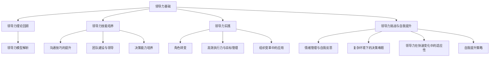
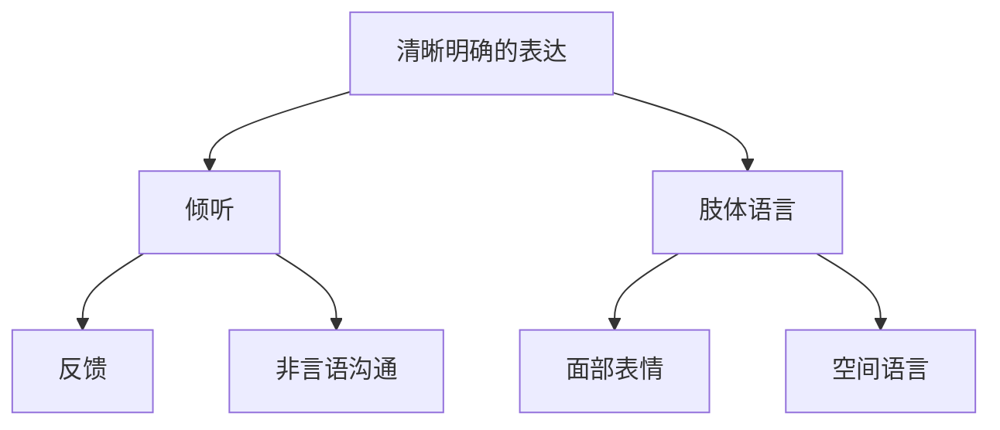
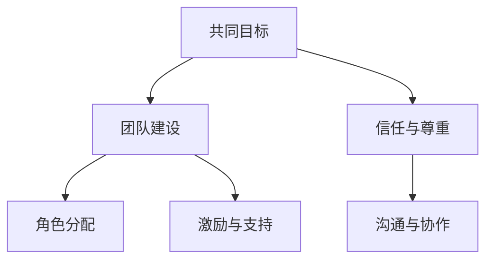
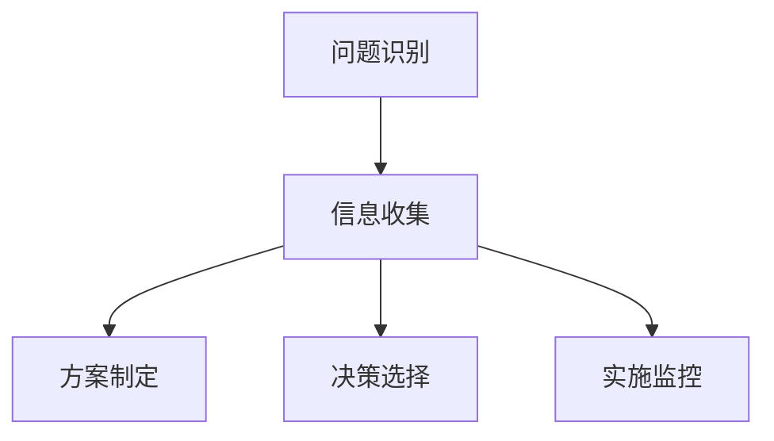
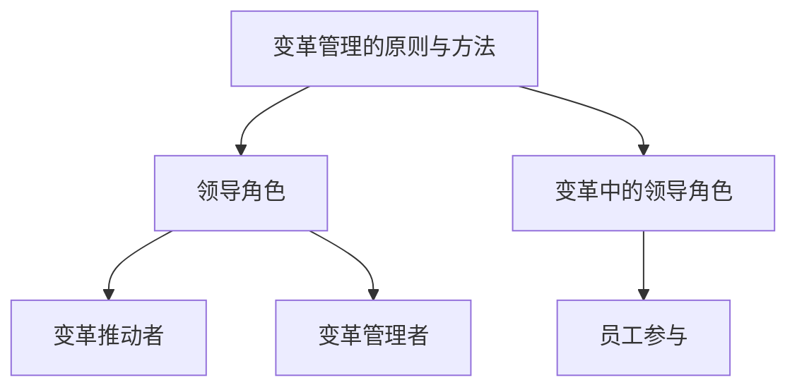

                 

### 文章标题

# 领导力修炼：从小工到专家的蜕变之路

> 关键词：领导力、技能培养、角色转变、高效执行力、组织变革、未来趋势

> 摘要：本文深入探讨了从技术小工到专家领导力的蜕变之路。文章首先介绍了领导力的基础理论，随后分析了领导力的技能培养，包括沟通技巧、团队建设与决策能力的培养。接着，文章探讨了领导力在实践中的角色转变、高效执行与目标管理、以及领导力在组织变革中的应用。最后，文章总结了领导力面临的挑战与自我提升策略，并展望了领导力的发展趋势和未来培养方向。

### 目录大纲

## 第一部分：领导力的基础
### 1.1 引言：领导力的重要性与内涵
### 1.2 领导力理论回顾
### 1.3 领导力模型解析

## 第二部分：领导力的技能培养
### 2.1 沟通技巧的提升
#### 2.1.1 有效沟通的核心要素
#### 2.1.2 非言语沟通的力量
#### 2.1.3 应对冲突的策略
### 2.2 团队建设与领导
#### 2.2.1 团队协作的重要性
#### 2.2.2 激励团队成员的方法
#### 2.2.3 领导力的迭代与变革
### 2.3 决策能力培养
#### 2.3.1 决策过程的步骤
#### 2.3.2 决策中的风险评估
#### 2.3.3 决策案例分析

## 第三部分：领导力的实践
### 3.1 从小工到专家的角色转变
#### 3.1.1 自我认知的重要性
#### 3.1.2 持续学习与成长
#### 3.1.3 建立个人品牌
### 3.2 高效执行力与目标管理
#### 3.2.1 目标设定与分解
#### 3.2.2 时间管理与优先级排序
#### 3.2.3 跨部门协作与沟通
### 3.3 领导力在组织变革中的应用
#### 3.3.1 变革管理的原则与方法
#### 3.3.2 变革中的领导角色
#### 3.3.3 变革案例研究

## 第四部分：领导力的挑战与自我提升
### 4.1 领导力面临的挑战
#### 4.1.1 情绪管理与自我反思
#### 4.1.2 复杂环境下的决策难题
#### 4.1.3 领导力在快速变化中的适应性
### 4.2 自我提升策略
#### 4.2.1 持续学习与知识管理
#### 4.2.2 建立个人支持系统
#### 4.2.3 成长路径规划

## 第五部分：领导力的实践应用
### 5.1 领导力在项目管理中的应用
#### 5.1.1 项目管理的核心要素
#### 5.1.2 项目团队领导技巧
#### 5.1.3 项目进度控制与风险管理
### 5.2 领导力在团队协作中的实战
#### 5.2.1 高效团队合作策略
#### 5.2.2 团队成员的角色与责任
#### 5.2.3 团队冲突的解决与预防
### 5.3 领导力在组织文化塑造中的角色
#### 5.3.1 组织文化的内涵与类型
#### 5.3.2 塑造积极组织文化的策略
#### 5.3.3 组织变革中的领导力

## 第六部分：领导力案例研究
### 6.1 成功的领导力案例解析
#### 6.1.1 企业家领导力案例
#### 6.1.2 公共部门领导力案例
#### 6.1.3 非营利组织领导力案例
### 6.2 领导力失败的教训与启示
#### 6.2.1 领导力失败的常见原因
#### 6.2.2 吸取失败教训的策略
#### 6.2.3 领导力失败案例研究

## 第七部分：领导力发展与未来趋势
### 7.1 领导力的发展趋势
#### 7.1.1 领导力的数字化转型
#### 7.1.2 领导力的国际化与全球化
#### 7.1.3 领导力的可持续性与社会责任
### 7.2 未来领导力的培养与提升
#### 7.2.1 领导力教育的创新
#### 7.2.2 领导力发展计划的制定
#### 7.2.3 未来领导者的素质要求

## 参考文献
### 7.1 书籍推荐
### 7.2 学术论文与研究报告
### 7.3 网络资源与在线课程

附录：
### A.1 领导力评估工具
### A.2 领导力发展资源链接
### A.3 领导力相关书籍推荐列表
### A.4 领导力研讨会与论坛信息

### 附录：领导力模型与流程图
#### 图1-1：领导力模型结构
#### 图2-1：有效沟通的核心要素
#### 图3-1：团队建设与领导流程
#### 图4-1：决策能力培养步骤
#### 图5-1：领导力在组织变革中的应用

### 附录：核心算法原理讲解与伪代码
#### 算法1：沟通技巧提升策略

function communicate_skills_boosting() {
    // 1. 确定沟通目标
    target = determine_communication_goal();
    
    // 2. 分析沟通情境
    context = analyze_communication_context();
    
    // 3. 设计沟通方案
    plan = design_communication_plan(target, context);
}

### 文章正文

## 第一部分：领导力的基础

### 1.1 引言：领导力的重要性与内涵

领导力是一种能够在组织中产生积极影响的能力，是推动团队实现目标的关键因素。领导力不仅仅是管理技能的体现，更是一种人格魅力和价值观的传递。在技术领域，领导力同样重要，它关系到项目的成功与否、团队的凝聚力和创新能力。

领导力的内涵丰富，主要包括以下几个核心方面：

1. **影响力**：领导力是一种能够影响他人思想和行为的能力。这种影响力不仅仅是基于职位和权力的，更多的是通过个人的魅力、价值观和行为示范来实现的。

2. **目标导向**：领导力的核心是设定和实现目标。领导者需要明确组织的愿景和目标，并将之转化为团队成员的日常行动。

3. **激励与引导**：领导者需要激发团队成员的潜力，引导他们朝着目标前进。这包括激励团队成员、建立积极的工作环境以及提供必要的资源和支持。

4. **沟通与协作**：领导力离不开有效的沟通与协作。领导者需要建立良好的沟通渠道，确保信息的准确传递，并促进团队内部的协作。

5. **变革推动者**：领导者需要具备推动组织变革的能力，能够应对外部和内部环境的变化，引领团队适应新的挑战。

### 1.2 领导力理论回顾

领导力的发展经历了多个阶段，从早期的特质理论到行为理论，再到情境理论和变革理论，每个理论都对领导力的发展产生了深远的影响。

1. **特质理论**：特质理论认为领导者具备一系列独特的个性特质，如自信、决断力、智慧等。这种理论在早期受到了广泛的支持，但随着研究的深入，人们逐渐认识到特质并非领导力的唯一决定因素。

2. **行为理论**：行为理论强调领导者的行为方式对团队绩效的影响。领导者的行为可以分为任务导向和行为导向，不同类型的领导行为适用于不同的情境。

3. **情境理论**：情境理论认为领导力是动态的，领导者需要根据不同的情境选择合适的领导风格。领导风格可以是民主的、专制的，也可以是变革导向的，关键在于适应环境。

4. **变革理论**：变革理论关注领导者如何推动组织变革，以应对快速变化的环境。变革领导者需要具备创新精神、敏锐的洞察力和强大的执行力。

### 1.3 领导力模型解析

领导力模型是对领导行为和风格的理论总结，常见的领导力模型包括：

1. **领导生命周期模型**：该模型基于下属的成熟度，提出四种领导风格：指令型、说服型、参与型和授权型。领导者需要根据下属的成熟度调整领导风格。

2. **变革领导模型**：该模型分为四个阶段：愿景、联盟、实施和激励。领导者需要通过这四个阶段推动组织变革。

3. **领导力四要素模型**：该模型认为领导力包括愿景、价值观、能力和关系。领导者需要在这四个方面不断努力，以提升领导力。

4. **领导力三维模型**：该模型从任务、关系和情境三个维度分析了领导力。领导者需要平衡这三个维度，以实现最佳领导效果。

## 第二部分：领导力的技能培养

### 2.1 沟通技巧的提升

沟通技巧是领导力的核心要素之一，良好的沟通能力能够帮助领导者建立信任、促进协作，并提高团队绩效。以下是提升沟通技巧的关键要素：

1. **有效沟通的核心要素**：

   - **清晰明确的表达**：领导者需要能够用简洁、准确的语言表达自己的想法和指令，避免产生误解。

   - **倾听**：倾听是沟通的重要组成部分，领导者需要倾听团队成员的意见和反馈，以便更好地理解他们的需求和想法。

   - **反馈**：领导者需要给予团队成员及时的反馈，以帮助他们改进工作。反馈应该是建设性的，注重指出改进的方向。

   - **非言语沟通**：领导者需要关注自己的非言语行为，如肢体语言、面部表情等，这些都会影响沟通的效果。

2. **非言语沟通的力量**：

   - **肢体语言**：肢体语言可以传达很多信息，如自信、开放和专注。领导者需要通过适当的肢体语言来表达自己的态度和信心。

   - **面部表情**：面部表情可以传达情感和态度，如真诚、友好和严肃。领导者需要学会运用面部表情来增强沟通效果。

   - **空间语言**：空间语言涉及个人空间和距离，领导者需要根据不同情境选择合适的空间距离，以营造良好的沟通氛围。

3. **应对冲突的策略**：

   - **主动沟通**：领导者需要主动面对冲突，而不是逃避或回避。通过积极的沟通，可以找到解决冲突的方法。

   - **客观分析**：领导者需要客观分析冲突的原因，并从中找到根本问题。这有助于制定有效的解决方案。

   - **求同存异**：领导者需要尊重团队成员的不同意见，寻求共识，并通过妥协和协调来解决问题。

### 2.2 团队建设与领导

团队建设是领导者的重要职责之一，一个高效的团队能够提高工作效率、增强创新能力和提升整体绩效。以下是团队建设与领导的关键要素：

1. **团队协作的重要性**：

   - **共同目标**：团队需要明确共同的目标和愿景，这有助于统一团队成员的行动方向。

   - **信任**：信任是团队协作的基础，领导者需要建立信任机制，如透明沟通、公平对待和互相支持。

   - **沟通**：良好的沟通能够促进团队成员之间的理解和合作，领导者需要建立有效的沟通渠道。

2. **激励团队成员的方法**：

   - **目标激励**：设定明确的个人和团队目标，并通过奖励和认可来激励团队成员。

   - **发展机会**：提供团队成员职业发展的机会，如培训、晋升和项目参与，以激发他们的潜力。

   - **参与决策**：让团队成员参与决策过程，增加他们的责任感和归属感。

3. **领导力的迭代与变革**：

   - **适应环境**：领导者需要适应不断变化的环境，及时调整领导风格和策略。

   - **持续学习**：领导者需要不断学习和更新知识，以保持竞争力。

   - **创新思维**：领导者需要鼓励团队成员创新思维，推动团队不断进步。

### 2.3 决策能力培养

决策能力是领导者的重要素质之一，有效的决策能够帮助组织应对挑战、抓住机遇。以下是培养决策能力的几个关键步骤：

1. **决策过程的步骤**：

   - **问题识别**：领导者需要明确组织面临的挑战或机会，识别需要解决的问题。

   - **信息收集**：领导者需要收集和分析相关的信息和数据，为决策提供依据。

   - **方案制定**：领导者需要制定多个可能的解决方案，并评估每种方案的优缺点。

   - **决策选择**：领导者需要根据评估结果选择最佳的方案。

   - **实施监控**：领导者需要监控决策的实施过程，并根据实际情况进行调整。

2. **决策中的风险评估**：

   - **风险识别**：领导者需要识别决策可能面临的风险，如财务风险、市场风险和操作风险。

   - **风险评估**：领导者需要评估每种风险的概率和影响，以便制定应对策略。

   - **风险应对**：领导者需要制定风险应对计划，以减轻风险的影响。

3. **决策案例分析**：

   - **成功案例**：分析成功决策的原因，包括领导者如何制定决策、如何收集信息、如何评估方案等。

   - **失败案例**：分析失败决策的原因，包括领导者可能存在的偏见、信息不足或决策过程的不当等。

通过上述分析，我们可以看到，领导力的培养是一个系统性的过程，需要从多个方面进行努力。在下一部分，我们将进一步探讨领导力在实践中的应用，包括角色转变、高效执行与目标管理，以及领导力在组织变革中的应用。

## 第三部分：领导力的实践

### 3.1 从小工到专家的角色转变

从小工到专家的角色转变是许多技术人员的必经之路。这一转变不仅仅是技术能力的提升，更是领导力和管理能力的提升。以下是这一转变过程中需要关注的几个方面：

1. **自我认知的重要性**：

   - **了解自身优势与劣势**：领导者需要深入理解自己的优势与劣势，以便在团队中发挥最大的作用。

   - **自我反思**：领导者需要定期进行自我反思，识别自己在工作中的不足，并制定改进计划。

2. **持续学习与成长**：

   - **专业知识**：领导者需要不断更新自己的专业知识，以适应快速变化的技术环境。

   - **领导力培训**：领导者可以参加领导力培训课程，学习领导技巧和管理方法。

   - **实践经验**：通过实际工作积累经验，不断优化自己的领导风格和管理方法。

3. **建立个人品牌**：

   - **专业形象**：领导者需要树立专业形象，提高自己的知名度和影响力。

   - **人际网络**：领导者需要建立广泛的人际网络，包括行业内外的专业人士和合作伙伴。

### 3.2 高效执行力与目标管理

高效执行是领导者的重要职责之一，它关系到组织的成败。以下是高效执行与目标管理的关键要素：

1. **目标设定与分解**：

   - **明确目标**：领导者需要设定清晰、具体的组织目标，确保团队成员了解目标的重要性。

   - **目标分解**：将大目标分解为小目标，并分配到不同的团队成员，确保每个成员都有明确的责任和任务。

2. **时间管理与优先级排序**：

   - **时间管理**：领导者需要合理安排时间，确保重要任务得到优先处理。

   - **优先级排序**：领导者需要根据任务的重要性和紧急性进行优先级排序，确保关键任务得到优先执行。

3. **跨部门协作与沟通**：

   - **建立协作机制**：领导者需要建立跨部门的协作机制，确保不同部门之间的信息共享和资源整合。

   - **有效沟通**：领导者需要确保跨部门沟通的畅通，避免信息孤岛和资源浪费。

### 3.3 领导力在组织变革中的应用

组织变革是领导者面临的重大挑战之一，成功的变革能够推动组织的持续发展和创新。以下是领导力在组织变革中的应用：

1. **变革管理的原则与方法**：

   - **沟通与共识**：领导者需要与团队成员进行充分沟通，建立变革的共识。

   - **领导角色**：领导者需要扮演变革的推动者角色，积极推动变革的进程。

   - **激励与支持**：领导者需要激励团队成员参与变革，并提供必要的支持和资源。

2. **变革中的领导角色**：

   - **变革领导者**：领导者需要成为变革的倡导者，引领团队走向变革。

   - **变革管理者**：领导者需要管理变革的过程，确保变革的顺利实施。

   - **变革推动者**：领导者需要推动团队成员接受变革，并鼓励他们积极参与变革。

3. **变革案例研究**：

   - **成功案例**：分析成功变革的原因和关键因素，包括领导者的角色和策略。

   - **失败案例**：分析失败变革的原因和教训，以避免类似错误的发生。

通过上述实践，我们可以看到，领导力在技术领域中的应用不仅仅是管理团队，更是推动组织变革、实现持续发展的重要力量。在下一部分，我们将进一步探讨领导力面临的挑战与自我提升策略，以及未来领导力的发展趋势。

## 第四部分：领导力的挑战与自我提升

### 4.1 领导力面临的挑战

领导力在技术领域中的应用面临诸多挑战，这些挑战不仅来自外部环境的变化，也来自领导者自身的限制。以下是领导力面临的几个主要挑战：

1. **情绪管理与自我反思**：

   - **情绪管理**：领导者需要具备良好的情绪管理能力，避免情绪波动对决策和团队氛围产生负面影响。

   - **自我反思**：领导者需要定期进行自我反思，识别自己在领导过程中的不足，并采取措施进行改进。

2. **复杂环境下的决策难题**：

   - **信息过载**：领导者需要处理大量信息，并从中提取有价值的信息进行决策。

   - **不确定性**：技术领域的快速发展带来了很高的不确定性，领导者需要在不确定的环境中做出决策。

3. **领导力在快速变化中的适应性**：

   - **快速适应**：领导者需要具备快速适应环境变化的能力，及时调整领导策略。

   - **持续学习**：领导者需要持续学习，掌握新的技术和方法，以应对快速变化的环境。

### 4.2 自我提升策略

领导力的提升是一个持续的过程，领导者需要不断学习、实践和反思，以提升自己的领导能力。以下是几个自我提升策略：

1. **持续学习与知识管理**：

   - **专业知识**：领导者需要不断更新自己的专业知识，以保持竞争力。

   - **领导力知识**：领导者需要学习领导力理论和实践，了解不同领导风格和方法。

2. **建立个人支持系统**：

   - **导师与教练**：领导者可以寻求导师和教练的帮助，获取专业指导和反馈。

   - **同事网络**：建立与同事的紧密联系，互相支持，共同成长。

3. **成长路径规划**：

   - **设定目标**：领导者需要设定明确的成长目标，并制定实现目标的计划。

   - **持续评估**：领导者需要定期评估自己的成长进度，并根据评估结果进行调整。

通过上述挑战与自我提升策略，我们可以看到，领导力的提升需要持续的努力和自我反思。在下一部分，我们将进一步探讨领导力在具体实践中的应用，包括项目管理、团队协作和组织文化塑造。

## 第五部分：领导力的实践应用

### 5.1 领导力在项目管理中的应用

项目管理是领导力在实践中的重要应用之一。一个成功的项目不仅需要优秀的项目管理技术，还需要有效的领导力来确保团队的合作与目标的实现。以下是领导力在项目管理中应用的关键要素：

1. **项目管理的核心要素**：

   - **目标明确**：领导者需要明确项目的目标和预期成果，确保团队成员对项目的目标有清晰的认识。

   - **计划与执行**：领导者需要制定详细的项目计划，并确保计划的执行。这包括时间安排、资源分配和任务分配。

   - **监控与评估**：领导者需要监控项目的进展，及时评估项目的状态，确保项目按计划进行。

   - **沟通与协作**：领导者需要建立有效的沟通渠道，确保项目团队之间的协作和信息共享。

2. **项目团队领导技巧**：

   - **团队建设**：领导者需要建立高效的团队，促进团队成员之间的信任和协作。

   - **角色分配**：领导者需要明确团队成员的角色和责任，确保每个成员都有明确的任务和职责。

   - **激励与支持**：领导者需要激励团队成员，提供必要的支持，确保他们能够在项目中发挥最佳水平。

3. **项目进度控制与风险管理**：

   - **进度控制**：领导者需要监控项目进度，及时发现和解决进度偏差，确保项目按时完成。

   - **风险管理**：领导者需要识别项目中的风险，制定应对策略，减轻风险的影响。

### 5.2 领导力在团队协作中的实战

团队协作是项目成功的关键，领导力在团队协作中的应用至关重要。以下是领导力在团队协作中应用的关键要素：

1. **高效团队合作策略**：

   - **共同目标**：领导者需要确保团队成员明确共同的目标，并围绕目标进行协作。

   - **信任与尊重**：领导者需要建立信任机制，尊重团队成员的意见和贡献，促进团队内部的协作。

   - **分工合作**：领导者需要根据团队成员的特长和优势进行分工，确保每个成员都能在项目中发挥自己的长处。

2. **团队成员的角色与责任**：

   - **角色明确**：领导者需要明确团队成员的角色和责任，确保每个成员都清楚自己的任务和职责。

   - **相互支持**：领导者需要鼓励团队成员之间的相互支持，共同面对挑战和困难。

3. **团队冲突的解决与预防**：

   - **冲突预防**：领导者需要预防潜在的冲突，通过沟通和协作策略来减少冲突的发生。

   - **冲突解决**：当冲突发生时，领导者需要及时介入，通过调解和协商解决冲突，确保团队的稳定和合作。

### 5.3 领导力在组织文化塑造中的角色

组织文化是组织的灵魂，对组织的长期发展具有重要影响。领导力在组织文化塑造中扮演着关键角色。以下是领导力在组织文化塑造中的应用：

1. **组织文化的内涵与类型**：

   - **内涵**：组织文化包括价值观、信念、行为规范和工作习惯，是组织成员共同遵循的基本原则。

   - **类型**：组织文化可以分为任务导向型、关系导向型和创新导向型，不同的组织文化类型对组织的发展有不同的影响。

2. **塑造积极组织文化的策略**：

   - **领导示范**：领导者需要通过自己的行为来示范组织文化的价值观和行为规范。

   - **沟通与共识**：领导者需要与团队成员进行充分沟通，建立对组织文化的共识。

   - **奖励与认可**：领导者需要通过奖励和认可来激励团队成员遵守组织文化，并促进组织文化的传播。

3. **组织变革中的领导力**：

   - **变革管理**：领导者需要在组织变革中发挥关键作用，推动组织文化的转变。

   - **领导角色**：领导者需要扮演变革推动者、变革管理者和变革支持者的角色，确保变革的顺利进行。

   - **员工参与**：领导者需要鼓励员工参与变革过程，提高员工的参与感和认同感。

通过上述领导力在项目管理、团队协作和组织文化塑造中的应用，我们可以看到，领导力不仅是技术领域的核心能力，更是组织成功的关键因素。在下一部分，我们将进一步探讨领导力案例研究，分析成功和失败的领导力案例，以从中吸取教训和启示。

### 6.1 成功的领导力案例解析

成功的领导力案例为我们提供了宝贵的经验和启示，以下是几个具有代表性的成功领导力案例：

1. **企业家领导力案例**：

   - **案例背景**：苹果公司的创始人史蒂夫·乔布斯以其卓越的领导力将苹果公司从破产边缘带到全球科技巨头的地位。

   - **成功要素**：乔布斯的成功得益于他强大的愿景、对产品的极致追求以及强大的执行力。他通过独特的领导风格和卓越的沟通技巧，激发了团队成员的创造力和创新精神。

   - **经验启示**：领导者需要具备清晰的愿景和坚定的信念，通过有效的沟通和激励，推动团队朝着共同的目标前进。

2. **公共部门领导力案例**：

   - **案例背景**：纽约市前市长迈克尔·布隆伯格在应对金融危机和城市治理中展现了出色的领导力。

   - **成功要素**：布隆伯格以其务实、科学和透明的领导风格，通过数据驱动的决策和有效的资源管理，成功应对了金融危机，并改善了纽约市的城市治理。

   - **经验启示**：领导者需要具备数据意识和科学决策能力，通过有效的资源管理，推动组织的持续改进和发展。

3. **非营利组织领导力案例**：

   - **案例背景**：无国界医生（Doctors Without Borders）的创始人伯纳德·库什在人道主义援助领域的领导力。

   - **成功要素**：库什以其无私的奉献精神和对人道主义事业的坚定信念，带领无国界医生在全球范围内开展人道主义援助，为受难者提供紧急救援。

   - **经验启示**：领导者需要具备高度的社会责任感和使命感，通过无私的奉献和坚定的信念，影响和动员团队成员为共同的目标努力。

通过这些成功的领导力案例，我们可以看到，有效的领导力不仅能够推动组织的成功，还能够对社会产生积极的影响。在下一部分，我们将探讨领导力失败的教训与启示，以帮助我们在未来的领导实践中避免类似的错误。

### 6.2 领导力失败的教训与启示

尽管成功的领导力案例为我们提供了宝贵的经验和启示，但失败的领导力案例也同样重要，它们能够帮助我们识别潜在的陷阱和错误，从而在未来的领导实践中避免犯同样的错误。以下是几个具有代表性的领导力失败案例及其教训：

1. **领导力失败的常见原因**：

   - **沟通不畅**：许多领导力失败案例中，沟通不畅是一个重要原因。领导者可能未能有效传达愿景、目标和期望，导致团队成员对任务和目标的理解不一致。

   - **缺乏透明度**：缺乏透明度会导致团队成员对领导层的决策和行动感到困惑和不满，从而削弱团队的凝聚力和信任。

   - **过度集中权力**：过度集中权力可能导致领导者的决策失误，因为缺乏多元化的观点和建议。

   - **忽视团队成员的需求**：领导者如果忽视团队成员的需求和意见，可能导致士气低落和团队绩效下降。

   - **缺乏变革管理能力**：在面临组织变革时，领导者如果缺乏有效的变革管理能力，可能导致变革失败。

2. **吸取失败教训的策略**：

   - **加强沟通**：领导者需要建立有效的沟通机制，确保信息的透明和双向流动。定期举行团队会议、一对一会议和反馈环节，以促进团队成员之间的沟通和理解。

   - **建立透明度**：领导者需要保持决策过程的透明，让团队成员了解组织的目标、战略和重要决策的依据。

   - **分散权力**：领导者应该鼓励团队成员参与决策，提高团队的参与感和责任感。同时，建立跨职能的团队，促进不同部门之间的协作和多元化。

   - **关注团队成员需求**：领导者需要了解团队成员的需求和期望，并提供必要的支持和资源，以激发他们的潜力和动力。

   - **提升变革管理能力**：领导者需要学习变革管理的理论和实践，制定详细的变革计划，并确保团队成员的参与和认同。

3. **领导力失败案例研究**：

   - **案例背景**：某科技公司的创始人在公司快速增长的过程中，由于过度集中权力和忽视团队成员需求，导致公司内部矛盾加剧，最终导致公司破产。

   - **失败原因**：创始人过度集中权力，决策缺乏透明度，忽视团队成员的意见和需求，导致团队士气低落和绩效下降。

   - **教训与启示**：领导者需要避免过度集中权力，建立透明度和沟通机制，关注团队成员的需求和意见，以建立稳定、高效的团队。

通过分析领导力失败的案例，我们可以看到，失败的教训是宝贵的财富，它们可以帮助我们识别潜在的陷阱和错误，并在未来的领导实践中避免犯同样的错误。在下一部分，我们将探讨领导力的发展趋势和未来培养方向，以展望领导力在未来的发展前景。

### 7.1 领导力的发展趋势

随着全球化和数字化的发展，领导力也在不断演变，出现了一系列新的趋势。以下是领导力发展的几个关键趋势：

1. **领导力的数字化转型**：

   - **数字化领导力**：随着技术的进步，领导者需要具备数字化的思维方式，能够利用数据和技术进行决策和沟通。这包括数据分析能力、网络安全意识和技术应用的掌握。

   - **数字化工具的使用**：领导者需要熟练使用各种数字化工具，如人工智能、大数据分析、云计算等，以提升领导效率和团队协作。

2. **领导力的国际化与全球化**：

   - **跨文化领导**：全球化使得领导者需要面对多元化的文化和背景，这要求领导者具备跨文化沟通和协调能力。

   - **全球视野**：领导者需要具备全球视野，了解不同国家和地区的商业环境、文化习俗和政策法规，以适应国际市场的需求。

3. **领导力的可持续性与社会责任**：

   - **可持续发展领导**：领导者需要关注企业的社会责任和可持续发展，推动企业在经济、社会和环境方面的平衡发展。

   - **社会责任担当**：领导者需要承担社会责任，关注员工的福利和社会公益事业，推动企业积极参与社会建设。

### 7.2 未来领导力的培养与提升

为了适应未来领导力的发展趋势，领导者需要不断提升自己的能力和素质。以下是未来领导力培养与提升的几个关键方面：

1. **领导力教育的创新**：

   - **定制化培训**：根据领导者的个人需求和职业发展阶段，提供定制化的培训方案。

   - **混合式学习**：结合在线学习和面对面培训，提供灵活多样的学习方式。

2. **领导力发展计划的制定**：

   - **长期规划**：制定长期领导力发展计划，明确目标、路径和阶段性成果。

   - **持续评估与反馈**：定期对领导力发展计划进行评估和反馈，及时调整和优化。

3. **未来领导者的素质要求**：

   - **创新精神**：领导者需要具备创新精神，不断探索新的想法和方法，推动组织的创新和发展。

   - **适应能力**：领导者需要具备适应快速变化环境的能力，灵活应对各种挑战。

   - **团队合作能力**：领导者需要具备优秀的团队合作能力，能够建立和领导高效的团队。

   - **道德修养**：领导者需要具备高尚的道德修养，以身作则，树立良好的榜样。

通过以上未来领导力培养与提升的策略，领导者可以不断提升自己的能力和素质，为组织的发展和成功做出更大的贡献。在下一部分，我们将总结文章的核心内容，并给出进一步阅读的推荐。

### 7.3 总结与推荐

本文从领导力的基础理论、技能培养、实践应用和未来趋势等方面，深入探讨了从技术小工到专家领导力的蜕变之路。通过分析领导力的核心概念和模型，以及成功与失败的领导力案例，我们可以看到，领导力不仅仅是管理技能的体现，更是一种人格魅力和价值观的传递。

在技能培养方面，沟通技巧、团队建设与决策能力是领导力的核心要素。有效的沟通能够促进团队协作，团队建设能够提高团队绩效，而决策能力则是领导者面对挑战和机遇的关键。

在实践中，领导力在项目管理、团队协作和组织文化塑造中发挥了重要作用。领导者需要通过持续学习和自我提升，适应快速变化的环境，以应对领导力面临的挑战。

未来，领导力的发展趋势将更加数字化、国际化和社会化。领导者需要具备创新精神、适应能力和道德修养，以应对未来领导力的发展需求。

为了进一步了解领导力的理论和实践，推荐以下阅读资源：

- **书籍推荐**：
  - 《领导力五要素》作者：约翰·P·科特
  - 《变革之舞》作者：约翰·P·科特、约翰·科亨、詹姆斯·O·勒福尔
  - 《领导力的五个层次》作者：约翰·C·麦斯威尔

- **学术论文与研究报告**：
  - 《领导力：理论与实践》期刊：Journal of Leadership Studies
  - 《全球领导力趋势报告》作者：领导力研究院

- **网络资源与在线课程**：
  - Coursera上的《领导力与战略管理》课程
  - LinkedIn Learning上的《领导力基础》课程

通过阅读这些资源和课程，读者可以进一步加深对领导力的理解和实践，提升自己的领导能力，为组织的成功和发展做出贡献。

### 附录：领导力模型与流程图

#### 图1-1：领导力模型结构



#### 图2-1：有效沟通的核心要素



#### 图3-1：团队建设与领导流程



#### 图4-1：决策能力培养步骤



#### 图5-1：领导力在组织变革中的应用



### 附录：核心算法原理讲解与伪代码

#### 算法1：沟通技巧提升策略

```python
def communicate_skills_boosting():
    # 1. 确定沟通目标
    target = determine_communication_goal()

    # 2. 分析沟通情境
    context = analyze_communication_context()

    # 3. 设计沟通方案
    plan = design_communication_plan(target, context)

    # 4. 实施沟通方案
    execute_communication_plan(plan)

    # 5. 监控沟通效果
    monitor_communication_effectiveness(plan)
```

#### 算法2：决策能力培养步骤

```python
def decision_making_ability_cultivation():
    # 1. 识别问题
    problem = identify_problem()

    # 2. 收集信息
    information = collect_information(problem)

    # 3. 制定方案
    solutions = generate_solutions(problem, information)

    # 4. 评估方案
    evaluated_solutions = evaluate_solutions(solutions)

    # 5. 选择最佳方案
    best_solution = select_best_solution(evaluated_solutions)

    # 6. 实施决策
    implement_decision(best_solution)

    # 7. 监控决策效果
    monitor_decision_outcome(best_solution)
```

这些算法和流程图为我们提供了具体的方法和步骤，以提升沟通技巧和决策能力。通过实际应用这些方法和步骤，领导者可以更有效地进行沟通和决策，从而提升领导力。

### 附录：领导力评估工具

评估领导力是提升领导能力的重要环节，以下是一些常用的领导力评估工具：

1. **360度反馈**：通过收集团队成员、上级、同事和下属的反馈，全面了解领导者的优势和不足。

2. **领导力问卷调查**：设计针对性的问卷，评估领导者的行为、态度和技能。

3. **领导力评估中心**：通过模拟实际工作场景，评估领导者的决策能力、沟通能力和团队合作能力。

4. **领导力发展计划**：结合领导者的评估结果，制定个性化的领导力发展计划，以提升领导能力。

这些评估工具可以帮助领导者识别自身的不足，制定改进计划，从而不断提升领导力。

### 附录：领导力发展资源链接

1. **领导力书籍推荐**：

   - 《领导力五要素》作者：约翰·P·科特
   - 《领导力与决策》作者：彼得·德鲁克
   - 《领导力的五个层次》作者：约翰·C·麦斯威尔

2. **领导力在线课程**：

   - Coursera上的《领导力与战略管理》
   - LinkedIn Learning上的《领导力基础》

3. **领导力研讨会与论坛信息**：

   - 国际领导力协会（ILA）的年度研讨会
   - 领导力发展论坛的在线研讨会

通过这些资源，领导者可以不断学习和提升自己的领导能力。

### 附录：领导力相关书籍推荐列表

1. **《领导力五要素》** 作者：约翰·P·科特
2. **《变革之舞》** 作者：约翰·P·科特、约翰·科亨、詹姆斯·O·勒福尔
3. **《领导力的五个层次》** 作者：约翰·C·麦斯威尔
4. **《影响力》** 作者：罗伯特·西奥迪尼
5. **《高效能人士的七个习惯》** 作者：史蒂芬·柯维
6. **《领导者的法则》** 作者：吉姆·柯林斯
7. **《智能型团队》** 作者：查尔斯·汉迪

这些书籍涵盖了领导力的各个方面，从理论到实践，从个人成长到团队协作，为领导者提供了丰富的知识和经验。

### 附录：领导力研讨会与论坛信息

1. **领导力国际峰会**：每年举行，汇集全球顶尖的领导力专家和实践者，分享领导力发展的最新趋势和实践经验。

2. **领导力论坛**：定期的在线研讨会和线下活动，邀请行业专家和领导者分享领导力实践和案例。

3. **领导力发展中心**：提供定制的领导力发展课程和工作坊，帮助领导者提升领导能力和管理技能。

通过参加这些研讨会和论坛，领导者可以拓宽视野、学习先进理念，并与其他领导者交流经验，共同成长。

### 附录：领导力模型与流程图

#### 图1-1：领导力模型结构


#### 图2-1：有效沟通的核心要素


#### 图3-1：团队建设与领导流程


#### 图4-1：决策能力培养步骤


#### 图5-1：领导力在组织变革中的应用


这些领导力模型和流程图提供了对领导力各个方面的直观理解，帮助读者更好地把握领导力的核心要素和关键步骤。

### 附录：核心算法原理讲解与伪代码

#### 算法1：沟通技巧提升策略

```python
def communicate_skills_boosting():
    # 1. 确定沟通目标
    target = determine_communication_goal()

    # 2. 分析沟通情境
    context = analyze_communication_context()

    # 3. 设计沟通方案
    plan = design_communication_plan(target, context)
    
    # 4. 实施沟通方案
    execute_communication_plan(plan)

    # 5. 监控沟通效果
    monitor_communication_effectiveness(plan)
```

#### 算法2：决策能力培养步骤

```python
def decision_making_ability_cultivation():
    # 1. 识别问题
    problem = identify_problem()

    # 2. 收集信息
    information = collect_information(problem)

    # 3. 制定方案
    solutions = generate_solutions(problem, information)

    # 4. 评估方案
    evaluated_solutions = evaluate_solutions(solutions)

    # 5. 选择最佳方案
    best_solution = select_best_solution(evaluated_solutions)

    # 6. 实施决策
    implement_decision(best_solution)

    # 7. 监控决策效果
    monitor_decision_outcome(best_solution)
```

这些伪代码为提升沟通技巧和培养决策能力提供了具体的实现步骤，有助于在实际工作中应用和优化领导力技能。

### 附录：领导力相关书籍推荐

1. **《领导力的五项修炼》** 作者：约翰·麦克斯韦尔
   - 内容概述：本书提出了领导力的五个核心修炼，包括人格、智慧、技能、关系和影响。
   - 适用场景：适合希望提升个人领导力的读者，尤其是初入职场的年轻人。

2. **《领导力的极简主义》** 作者：帕特里克·莱西尼
   - 内容概述：本书探讨了如何通过简单、实用和高效的领导方法，提升团队绩效和员工满意度。
   - 适用场景：适合管理者和领导者，尤其是在高压环境下需要迅速做出决策的人。

3. **《变革之舞》** 作者：约翰·科特、詹姆斯·奥利弗
   - 内容概述：本书详细阐述了领导者在推动组织变革中的角色和策略，以及如何应对变革过程中的挑战。
   - 适用场景：适合正在经历或计划进行组织变革的领导者。

4. **《团队合作的秘密》** 作者：迈克尔·马奇
   - 内容概述：本书分析了团队合作中的关键因素，包括信任、沟通和目标一致性，并提供了一系列实用的团队建设策略。
   - 适用场景：适合希望提高团队协作效率的领导者和管理者。

5. **《非暴力沟通》** 作者：马歇尔·卢森堡
   - 内容概述：本书介绍了一种基于同情和理解的非暴力沟通方式，帮助领导者更好地与他人沟通和建立关系。
   - 适用场景：适合所有希望提升沟通能力和人际关系技能的领导者。

这些书籍涵盖了领导力的各个方面，从基础理论到实战技巧，为不同层次的领导者提供了丰富的知识和实践指导。

### 附录：领导力研讨会与论坛信息

1. **国际领导力协会（ILA）年度大会**
   - 日期：每年10月
   - 地点：美国芝加哥
   - 内容：汇集全球顶尖的领导力专家和实践者，分享领导力发展的最新趋势和实践经验。

2. **领导力论坛**
   - 日期：每月一次
   - 地点：线上与线下相结合
   - 内容：邀请行业专家和领导者分享领导力实践和案例，提供互动交流机会。

3. **领导力发展中心研讨会**
   - 日期：每季度一次
   - 地点：各大城市
   - 内容：提供定制的领导力发展课程和工作坊，帮助领导者提升领导能力和管理技能。

通过参加这些研讨会和论坛，领导者可以拓宽视野、学习先进理念，并与其他领导者交流经验，共同成长。

