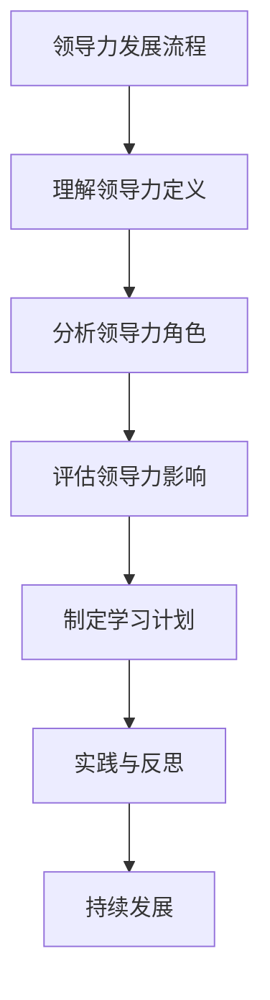

                 

# 文章标题: 领导力修炼：从新手到大师的成长之路

关键词：领导力、情商、影响力、沟通技巧、成长路径

摘要：本文将探讨领导力修炼的路径，从新手到大师的成长历程。通过分析领导力的本质与重要性，揭示情商与影响力在领导力发展中的核心地位，以及人际沟通技巧的实践方法，帮助读者构建全面的领导力知识体系，实现个人和职业的全面提升。

## 第一部分：领导力修炼概述

### 第1章：领导力的本质与重要性

#### 1.1 领导力的定义与历史演变

**传统领导力观**

在古代，领导力主要依赖于权威和权力。领导者通过强制手段来指挥下属，实现组织目标。这种领导力观强调领导者的地位和权力，忽视了下属的需求和参与。

**当代领导力理论**

随着社会的发展，领导力理论也在不断演变。现代领导力强调领导者与下属之间的互动关系，关注下属的参与和发展。领导者不仅需要具备管理和执行能力，还要具备领导力和影响力。

**领导力在现代组织中的角色**

在现代组织中，领导力不仅影响组织的运作效率，还影响组织的创新能力和竞争力。优秀的领导者能够激发团队的潜力，推动组织不断进步。

#### 1.2 领导力的重要性

**领导力对个人职业生涯的影响**

领导力是职业发展的关键因素。具备领导力的人更容易获得晋升机会，拥有更高的薪资和福利待遇。

**领导力对企业绩效的影响**

领导力对企业绩效具有显著影响。优秀的领导者能够提高员工满意度，降低员工流失率，从而提高企业的生产力和竞争力。

**领导力对社会发展的意义**

领导力对社会发展具有深远影响。优秀的领导者能够推动社会进步，解决社会问题，促进社会和谐。

#### 1.3 本书的目标与结构

**读者定位**

本书适合希望提升领导力技能的职场人士，以及企业管理者。

**内容框架概述**

本书分为两个部分：第一部分探讨领导力的本质与重要性，第二部分分析领导力的核心能力。

**学习方法建议**

读者可以通过阅读、实践和反思来提升领导力。建议结合实际工作场景，不断实践和反思，以提高领导力水平。

### 附录

#### 附录 A：领导力发展工具与资源

**主要领导力理论图示**

提供主要领导力理论的图示，帮助读者直观理解不同领导力理论。

**推荐阅读书目**

推荐与领导力相关的经典书籍，帮助读者深入探索领导力知识。

**领导力发展在线资源**

提供领导力发展的在线资源，包括课程、博客和论坛等，供读者学习和交流。

#### 附录 B：案例分析

**案例一：苹果公司的领导力变革**

分析苹果公司领导力变革的过程，以及其对公司发展的影响。

**案例二：谷歌的领导力实践**

探讨谷歌的领导力实践，以及其对员工和企业文化的积极影响。

**案例三：特斯拉的领导风格**

分析特斯拉的领导风格，以及其对公司创新和发展的影响。

### 注释

*Mermaid 流�程图:*



## 第二部分：领导力核心能力

### 第2章：情商与影响力

#### 2.1 情商的定义与重要性

**情商的构成**

情商包括自我认知、自我调节、社交技能和同理心等方面。

**情商在领导力中的重要性**

情商是领导力的核心要素。具备高情商的领导者能够更好地理解下属需求，提高团队协作效率，推动组织发展。

**提高情商的方法**

通过自我反思、情绪管理和社交技能提升，可以提高情商。

#### 2.2 人际沟通技巧

**有效沟通的要素**

有效沟通需要具备倾听、表达、反馈等要素。

**沟通障碍与解决策略**

分析常见的沟通障碍，并提出解决策略。

**高效团队沟通技巧**

探讨如何在团队中实现高效沟通。

#### 2.3 影响力管理

**影响力的定义与类型**

影响力是指领导者对下属和组织的引导能力。影响力可分为权力型影响力和关系型影响力。

**增强个人影响力的策略**

通过提升专业能力、建立人际关系和展现人格魅力，可以增强个人影响力。

**利用影响力推动组织变革**

分析如何利用影响力推动组织变革，实现组织目标。

### 附录

#### 附录 A：情商提升工具与资源

**情商自测工具**

提供情商自测工具，帮助读者了解自己的情商水平。

**推荐书籍与视频课程**

推荐与情商提升相关的书籍和视频课程，供读者学习。

**情商提升实践指南**

提供情商提升的实践指南，帮助读者将所学知识应用于实际工作中。

#### 附录 B：模拟练习

**情景模拟：团队冲突处理**

模拟团队冲突处理场景，帮助读者学习处理团队冲突的方法。

**情景模拟：领导力角色扮演**

模拟领导力角色扮演场景，帮助读者提升领导力技能。

### 伪代码示例：情商提升算法

```python
def ImproveEmotionalIntelligence():
    emotionalIntelligenceScore = 50

    while emotionalIntelligenceScore < 80:
        print("进行自我反思...")
        print("学习情绪管理技巧...")
        emotionalIntelligenceScore += 10

    while emotionalIntelligenceScore < 100:
        print("学习沟通技巧...")
        print("实践沟通技巧...")
        emotionalIntelligenceScore += 20

    while emotionalIntelligenceScore < 120:
        print("分析个人影响力...")
        print("制定影响力提升计划...")
        emotionalIntelligenceScore += 30

    print("最终情商得分: " + emotionalIntelligenceScore)
```

### 数学模型讲解：领导力影响力公式

$$
\text{Leadership Influence} = \frac{\text{Emotional Intelligence} \times \text{Communication Skills} \times \text{Influence Management}}{\text{Environmental Factors}}
```

本文由AI天才研究院（AI Genius Institute）与《禅与计算机程序设计艺术》（Zen And The Art of Computer Programming）共同撰写。我们致力于通过逻辑清晰、结构紧凑、简单易懂的技术语言，帮助读者深入理解领导力修炼的路径，实现个人和职业的全面提升。希望本文对您有所启发，让我们一起成长，成为优秀的领导者。作者：AI天才研究院/AI Genius Institute & 禅与计算机程序设计艺术 /Zen And The Art of Computer Programming。

