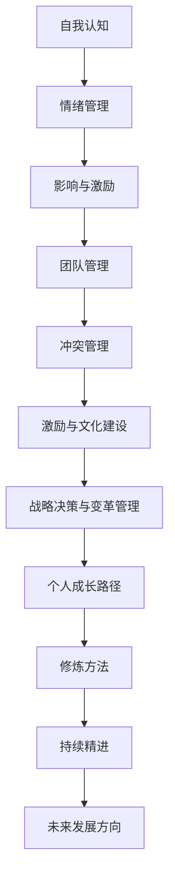

                 

### 文章标题

# 《领导力心法：成就伟大领导者的修炼法则》

### 关键词

- **领导力**  
- **心法**  
- **修炼法则**  
- **伟大领导者**  
- **团队管理**  
- **冲突管理**  
- **激励与文化建设**  
- **战略决策与变革管理**  
- **个人成长路径**

### 摘要

本文深入探讨了领导力心法这一概念，旨在揭示成就伟大领导者的修炼法则。文章首先介绍了领导力的本质与演变，剖析了其核心要素。接着，通过 Mermaid 流程图展示了领导力心法的核心概念与联系。随后，文章详细讲解了领导力心法的基本原理和关键要素，包括情绪管理、自我认知、影响与激励他人等。在此基础上，文章进一步探讨了领导力心法在实际工作中的应用和效果评估，以及团队管理、冲突管理、激励与文化建设、战略决策与变革管理等实践方法。最后，文章提出了领导力心法的个人成长路径和修炼方法，以及领导力心法的持续精进与未来发展。

## 目录大纲

### 第一部分：领导力心法基础理论

### 第1章：领导力的本质与演变

#### 1.1 领导力的定义与核心要素
#### 1.2 领导力在不同文化背景下的差异
#### 1.3 领导力的发展演变历程

### 第2章：领导力心法的基本概念

#### 2.1 心法在领导力中的意义
#### 2.2 领导力心法的基本原理
#### 2.3 领导力心法的结构框架

### 第3章：领导力心法的关键要素

#### 3.1 情绪管理与领导力
#### 3.2 自我认知与自我提升
#### 3.3 影响与激励他人

### 第4章：领导力心法的应用与实践

#### 4.1 领导力心法在实际工作中的应用
#### 4.2 领导力心法的实践路径
#### 4.3 领导力心法的效果评估

### 第二部分：领导力心法在团队管理与领导风格中的实践

### 第5章：团队管理与领导风格

#### 5.1 团队管理的基本原则
#### 5.2 领导风格的分类与识别
#### 5.3 领导风格与团队绩效的关系

### 第6章：领导力心法在冲突管理中的应用

#### 6.1 冲突的类型与根源
#### 6.2 冲突管理的基本策略
#### 6.3 领导力心法在冲突管理中的作用

### 第7章：领导力心法在激励与文化建设中的应用

#### 7.1 激励理论在领导力中的应用
#### 7.2 企业文化的构建与传承
#### 7.3 领导力心法在文化建设中的作用

### 第8章：领导力心法在战略决策与变革管理中的应用

#### 8.1 战略决策的基本原则
#### 8.2 变革管理的步骤与方法
#### 8.3 领导力心法在战略决策与变革管理中的实际应用

### 第三部分：领导力心法的成长与修炼

### 第9章：领导力心法的个人成长路径

#### 9.1 自我成长的重要性
#### 9.2 个人成长的关键环节
#### 9.3 领导力心法在个人成长中的应用

### 第10章：领导力心法的修炼方法

#### 10.1 修炼的基本原则
#### 10.2 修炼的方法与技巧
#### 10.3 修炼中的常见问题与解决策略

### 第11章：领导力心法的持续精进

#### 11.1 持续精进的重要性
#### 11.2 精进的方法与工具
#### 11.3 领导力心法的未来发展

### 附录

#### 附录 A：领导力心法相关资源与工具

##### A.1 领导力心法的学习资源
##### A.2 领导力心法的实践工具
##### A.3 领导力心法的研究机构与社群

#### 附录 B：领导力心法案例研究

##### B.1 案例一：企业家的领导力心法实践
##### B.2 案例二：团队领导力心法的应用
##### B.3 案例三：领导力心法在变革管理中的应用

#### 附录 C：领导力心法流程图

##### C.1 领导力心法流程图

[接下来，我们将逐步深入探讨领导力的本质与演变，以及领导力心法的基本概念和关键要素，帮助读者更好地理解这一重要的领导力理论。] ## 第1章：领导力的本质与演变

### 1.1 领导力的定义与核心要素

领导力是一种影响他人并共同实现目标的能力。这种能力不仅仅局限于在企业或组织中，它存在于各种社会关系和互动中。领导力的定义多种多样，但其核心要素却相对一致。以下是领导力的几个关键要素：

1. **愿景**：愿景是领导力的核心，它为团队指明方向，提供前进的动力。一个明确的愿景能够激励团队成员共同追求目标，并使他们在面对困难时保持坚韧不拔。

2. **决策能力**：领导者需要具备快速且明智的决策能力，尤其在面临复杂多变的环境时。有效的决策能力能够帮助团队在关键时刻作出正确的选择，从而实现目标。

3. **沟通能力**：有效的沟通是领导力的关键。领导者需要能够清晰地传达信息，并倾听他人的意见。良好的沟通能力能够促进团队内部的协作，减少误解和冲突。

4. **道德与价值观**：领导者的道德与价值观对团队有着深远的影响。一个道德高尚、价值观明确的领导者能够为团队成员树立榜样，增强团队的凝聚力和信任。

5. **影响力**：领导者需要具备影响力，能够激发团队成员的潜力，推动他们超越自我，实现更高的绩效。影响力不仅来自于职位和权力，更来自于领导者的品格和行为。

6. **适应能力**：在快速变化的环境中，领导者需要具备适应能力，能够灵活调整策略，以应对不确定性和挑战。适应能力是领导力的重要体现，它使领导者能够在变化中保持优势。

7. **自我认知与自我提升**：领导者需要不断进行自我认知，了解自己的优点和不足，并寻求提升。自我认知是领导力持续发展的基础，它使领导者能够更好地理解自己和他人，从而更有效地发挥领导作用。

### 1.2 领导力在不同文化背景下的差异

领导力在不同文化背景下存在显著差异，这主要受到文化价值观、历史背景和社会制度等因素的影响。以下是一些主要差异：

1. **集权与民主**：在一些文化中，领导力更倾向于集权式管理，而在另一些文化中，民主式领导更受欢迎。例如，在亚洲的一些国家，如日本和中国，集权式领导风格较为普遍，而西方国家如美国和德国则更倾向于民主式领导。

2. **关系导向与任务导向**：在一些文化中，领导力强调人际关系和团队合作，而在另一些文化中，领导力更注重任务完成和绩效目标。例如，在北欧文化中，领导力强调平等和团队合作，而在一些中东国家，领导力更强调权威和任务导向。

3. **直接与间接沟通**：不同文化在沟通风格上也有所差异。例如，直接沟通在一些西方文化中较为普遍，而在一些亚洲文化中，如日本和韩国，间接沟通更为常见。

4. **尊重与权威**：在文化价值观上，对尊重和权威的重视程度也会影响领导力。在一些文化中，尊重权威是领导力的核心，而在另一些文化中，领导力更强调平等和民主。

### 1.3 领导力的发展演变历程

领导力的发展演变历程可以追溯到古代社会。在古代，领导力主要与军事和政治权力相关。随着时间的推移，领导力的概念逐渐扩展，涵盖了更多领域。以下是领导力发展的几个重要阶段：

1. **传统领导力**：在传统领导力阶段，领导力主要依赖于权威和权力。领导者通过职位和资源来影响他人，领导力被视为一种控制和指挥他人的能力。

2. **变革领导力**：随着现代社会的变迁，领导力逐渐从传统模式转向变革模式。在这一阶段，领导者被视为变革的推动者，他们通过创新和变革来引领团队和组织的进步。

3. **变革型领导力**：变革型领导力强调领导者与团队成员之间的互动和合作。领导者通过激发团队成员的潜能和积极性，推动团队实现共同的目标。

4. **转型领导力**：在全球化和社会多元化的背景下，领导力面临新的挑战。转型领导力强调领导者需要具备跨文化沟通和协作的能力，能够在复杂多变的环境中带领团队实现目标。

### 小结

领导力是一种复杂而多维的能力，它涵盖了多个核心要素，并在不同文化背景下表现出多样性。理解领导力的本质与演变，对于领导者来说至关重要。通过深入探讨领导力的核心要素和演变历程，我们可以更好地把握领导力的本质，为未来的领导力发展奠定基础。

### 领导力心法的基本概念

#### 2.1 心法在领导力中的意义

领导力心法是指领导者通过内省和修炼，培养和提高自身素质和能力的理论体系。心法在领导力中的意义在于，它不仅仅关注领导者外在的行为和表现，更注重领导者内心的修养和自我提升。通过心法，领导者能够更好地理解自己和他人，从而更有效地发挥领导作用。

1. **提升自我认知**：领导力心法强调领导者需要不断进行自我认知，了解自己的优点和不足。通过自我认知，领导者能够更好地认识自己，从而更好地理解他人，提升领导效果。

2. **培养情绪管理能力**：领导者需要具备良好的情绪管理能力，以应对复杂多变的环境和压力。心法通过修炼，帮助领导者学会调节情绪，保持心态平和，从而更好地应对挑战。

3. **增强影响力和说服力**：领导力心法强调领导者需要具备强大的人际影响力，能够影响和激励他人。通过修炼，领导者能够提升自身的影响力和说服力，使团队成员更加信任和尊重自己。

4. **促进团队协作与发展**：领导力心法关注团队的整体发展，强调领导者需要通过修炼，培养团队成员的潜力和能力。通过心法，领导者能够促进团队协作，实现共同的目标。

#### 2.2 领导力心法的基本原理

领导力心法的基本原理包括以下几个方面：

1. **内省与反思**：领导力心法强调领导者需要定期进行内省和反思，审视自己的行为和决策，发现并改进不足。内省和反思是领导力心法修炼的基础，它帮助领导者不断提升自我认知和领导能力。

2. **自我提升与成长**：领导力心法鼓励领导者持续进行自我提升和成长，通过学习和实践，不断提升自己的知识和技能。自我提升是领导力心法的重要目标，它使领导者能够适应不断变化的环境和挑战。

3. **情绪管理**：领导力心法强调领导者需要具备良好的情绪管理能力，学会调节情绪，保持心态平和。情绪管理是领导力心法的关键，它使领导者能够在压力和困难面前保持冷静，从而更好地应对挑战。

4. **影响与激励他人**：领导力心法强调领导者需要具备强大的人际影响力，能够影响和激励他人。通过影响和激励他人，领导者能够激发团队成员的积极性和创造力，实现共同的目标。

5. **团队协作与发展**：领导力心法关注团队的整体发展，强调领导者需要通过修炼，培养团队成员的潜力和能力。通过团队协作，领导者能够实现个人和团队的共同成长。

#### 2.3 领导力心法的结构框架

领导力心法的结构框架可以概括为以下几个方面：

1. **自我认知**：自我认知是领导力心法的基础，它帮助领导者了解自己的优点和不足，提升自我认知和领导能力。

2. **情绪管理**：情绪管理是领导力心法的核心，它帮助领导者调节情绪，保持心态平和，从而更好地应对挑战。

3. **影响与激励**：影响与激励是领导力心法的关键，它帮助领导者提升人际影响力，激发团队成员的积极性和创造力。

4. **团队协作**：团队协作是领导力心法的应用，它帮助领导者培养团队成员的潜力和能力，实现团队协作和共同成长。

5. **持续修炼**：持续修炼是领导力心法的发展，它鼓励领导者不断进行自我提升和成长，以适应不断变化的环境和挑战。

通过上述结构框架，领导力心法为领导者提供了一个系统的修炼方法，帮助他们在不同情境下实现有效的领导。

### 小结

领导力心法是一种注重领导者内心修养和自我提升的理论体系，它通过内省、反思、自我提升、情绪管理和影响激励等基本原理，为领导者提供了一种全面的修炼方法。领导力心法的结构框架有助于领导者实现自我认知、情绪管理、影响激励和团队协作等方面的提升，从而成为更有效的领导者。

### 领导力心法的关键要素

领导力心法的有效实施依赖于多个关键要素，这些要素相互联系，共同构成了一个完整的领导力体系。以下是领导力心法中的几个关键要素及其相互关系：

#### 3.1 情绪管理与领导力

情绪管理是领导力心法中的一个核心要素。领导者需要具备良好的情绪管理能力，以应对工作中的压力和挑战。情绪管理不仅影响领导者的心理健康，还直接影响团队氛围和工作效率。

1. **情绪识别**：领导者需要学会识别和了解自己的情绪，包括正面情绪如喜悦和自信，以及负面情绪如焦虑和愤怒。情绪识别是情绪管理的基础，它帮助领导者更好地理解自己的行为和决策。

2. **情绪调节**：情绪调节是指领导者通过一系列策略和方法，调节自己的情绪，使其更加稳定和积极。这包括自我反思、深呼吸、冥想等技巧，帮助领导者保持心态平和。

3. **情绪感染**：领导者的情绪状态会传递给团队成员，影响他们的情绪和行为。有效的情绪管理使领导者能够激发积极的情绪氛围，增强团队的凝聚力和士气。

4. **情绪与决策**：情绪管理对领导者的决策过程有重要影响。情绪稳定有助于领导者做出更为理性和明智的决策，避免因情绪波动而做出错误的选择。

#### 3.2 自我认知与自我提升

自我认知是领导力心法的另一个关键要素。领导者需要深入了解自己的优势和不足，以此为基础进行自我提升。

1. **自我反思**：自我反思是自我认知的重要方法。领导者需要定期回顾自己的行为和决策，分析成功和失败的原因，从中吸取经验教训。

2. **优势识别**：领导者需要识别和发挥自己的优势。通过了解自己的长处，领导者可以更有效地分配资源，提升自身能力。

3. **自我提升**：自我提升是指领导者通过学习和实践，不断改进和提升自己的知识和技能。这包括参加培训课程、阅读专业书籍、参与实践项目等。

4. **自我成长**：自我成长是领导力发展的长期目标。通过不断学习和实践，领导者可以逐步实现自我提升，成为一名更为出色的领导者。

#### 3.3 影响与激励他人

领导力心法强调领导者需要具备强大的人际影响力，能够激励和引导团队成员。

1. **影响力**：影响力是指领导者通过言行和榜样作用，影响他人态度和行为的能力。领导者需要学会运用影响力，推动团队成员实现目标。

2. **激励**：激励是指领导者通过激励手段，激发团队成员的内在动力，提高工作积极性和效率。激励手段包括认可与奖励、设置目标和反馈等。

3. **沟通技巧**：有效的沟通技巧是影响与激励他人的基础。领导者需要学会倾听、表达、反馈等沟通技巧，以建立信任和合作关系。

4. **建立信任**：信任是领导力的基石。领导者需要通过正直、诚信和负责任的行为，建立和维护与团队成员之间的信任关系。

#### 关系与互动

领导力心法中的关键要素并不是孤立存在的，它们之间存在紧密的联系和互动。

1. **情绪管理与自我认知**：情绪管理和自我认知相互影响。自我认知有助于领导者更好地识别和调节情绪，而情绪管理则有助于领导者实现自我提升。

2. **自我认知与影响激励**：自我认知使领导者更了解自己的优势和不足，从而更有针对性地影响和激励他人。

3. **情绪管理、自我认知与团队协作**：情绪管理和自我认知有助于领导者建立良好的团队氛围，促进团队协作。

4. **影响激励与团队协作**：影响力激励可以激发团队成员的积极性和创造力，进而促进团队协作和共同成长。

通过上述关键要素及其相互关系，领导力心法为领导者提供了一个全面的修炼方法，帮助他们在不同情境下实现有效的领导。

### 小结

情绪管理、自我认知和影响激励是领导力心法中的关键要素，它们相互联系，共同构成了一个完整的领导力体系。领导者需要通过修炼和不断提升这些要素，才能成为一名卓越的领导者。有效的情绪管理有助于领导者保持心态平和，自我认知使领导者更了解自己，而影响激励则帮助领导者更好地影响和激励他人。通过这些关键要素的互动和整合，领导者可以更有效地应对各种挑战，实现团队的目标。

### 领导力心法在实际工作中的应用与实践

领导力心法不仅是一种理论体系，更是一种实践方法。在实际工作中，领导者可以通过应用和实践领导力心法，提升团队绩效，增强团队凝聚力，从而实现组织目标。以下是领导力心法在实际工作中的几个应用和实践路径：

#### 4.1 领导力心法在实际工作中的应用

1. **团队目标设定**：领导力心法强调领导者需要明确团队目标，并确保目标具有挑战性但可实现。通过自我认知和情绪管理，领导者可以更清晰地表达目标，并激发团队成员的积极性。

   ```mermaid
   graph TD
   A[团队目标设定] --> B[明确目标]
   B --> C[挑战性但可实现]
   C --> D[激发积极性]
   ```

2. **团队沟通与协作**：领导力心法注重沟通技巧和团队协作。领导者需要通过有效的沟通，建立信任和合作关系，促进团队成员之间的互动和协作。

   ```mermaid
   graph TD
   A[团队沟通与协作] --> B[有效沟通]
   B --> C[建立信任]
   C --> D[促进互动]
   ```

3. **冲突管理与解决**：领导力心法提供了一系列冲突管理策略，如情绪管理、自我认知和有效沟通。领导者可以通过这些方法，预防和解决团队内部的冲突，保持团队稳定。

   ```mermaid
   graph TD
   A[冲突管理] --> B[情绪管理]
   B --> C[自我认知]
   C --> D[有效沟通]
   ```

4. **激励与奖励**：领导力心法强调激励和奖励的重要性。通过影响和激励他人，领导者可以激发团队成员的内在动力，提高工作效率和绩效。

   ```mermaid
   graph TD
   A[激励与奖励] --> B[影响与激励]
   B --> C[内在动力]
   ```

5. **战略决策与执行**：领导力心法在战略决策和执行中也发挥着重要作用。领导者需要通过自我认知和情绪管理，确保决策的合理性和有效性，并在执行过程中保持积极心态。

   ```mermaid
   graph TD
   A[战略决策与执行] --> B[自我认知]
   B --> C[情绪管理]
   ```

#### 4.2 领导力心法的实践路径

1. **自我修炼**：领导力心法的实践始于自我修炼。领导者需要定期进行内省和反思，识别自己的情绪、行为和决策，并不断进行自我提升。

   ```mermaid
   graph TD
   A[自我修炼] --> B[内省与反思]
   B --> C[自我提升]
   ```

2. **团队建设**：领导力心法强调团队建设的重要性。领导者需要通过一系列活动和措施，增强团队的凝聚力，提升团队成员的协作能力。

   ```mermaid
   graph TD
   A[团队建设] --> B[团队活动]
   B --> C[协作能力提升]
   ```

3. **实践反馈**：领导力心法的实践需要不断地进行反馈和调整。领导者需要通过实践，观察团队的反应和结果，及时进行调整和改进。

   ```mermaid
   graph TD
   A[实践反馈] --> B[观察与调整]
   ```

4. **持续学习**：领导力心法是一个持续的过程，领导者需要不断学习和实践。通过参加培训、阅读书籍、交流经验等方式，领导者可以不断提升自己的领导能力。

   ```mermaid
   graph TD
   A[持续学习] --> B[参加培训]
   B --> C[阅读书籍]
   ```

#### 4.3 领导力心法的效果评估

1. **绩效评估**：领导力心法的效果可以通过绩效评估来衡量。领导者需要定期评估团队的工作绩效，分析领导力心法对绩效的影响。

   ```mermaid
   graph TD
   A[绩效评估] --> B[工作绩效]
   ```

2. **员工满意度**：领导力心法还可以通过员工满意度来评估。领导者需要关注团队成员的工作满意度，了解领导力心法对员工工作积极性和幸福感的提升。

   ```mermaid
   graph TD
   A[员工满意度] --> B[工作积极性]
   ```

3. **团队凝聚力**：团队凝聚力是领导力心法效果的重要指标。领导者需要通过团队活动和互动，增强团队的凝聚力，提高团队的整体绩效。

   ```mermaid
   graph TD
   A[团队凝聚力] --> B[整体绩效]
   ```

通过上述实践路径和效果评估方法，领导者可以更好地应用和实践领导力心法，提升团队绩效，实现组织目标。

### 小结

领导力心法在实际工作中具有广泛的应用价值。通过自我修炼、团队建设、实践反馈和持续学习等实践路径，领导者可以不断提升自身能力和团队绩效。同时，通过绩效评估、员工满意度和团队凝聚力等效果评估方法，领导者可以了解领导力心法对组织发展的实际影响。领导力心法不仅是一种理论体系，更是一种实用的领导方法，帮助领导者成为卓越的领导者。

### 领导力心法的效果评估

评估领导力心法的效果是衡量其成功与否的重要步骤。通过系统的评估方法，领导者可以了解领导力心法对团队绩效、员工满意度和团队凝聚力等方面的影响，从而进行调整和优化。以下是评估领导力心法效果的几种方法：

#### 1. 绩效评估

绩效评估是评估领导力心法效果的一种直接且常用的方法。领导者可以通过以下步骤进行绩效评估：

1. **设定绩效指标**：首先，领导者需要设定明确的绩效指标，这些指标应与组织的战略目标紧密相关。例如，提高销售额、提高项目完成率、提升客户满意度等。

2. **数据收集**：通过数据收集工具，如员工绩效评估表、项目进度报告等，收集与绩效指标相关的数据。

3. **分析数据**：对收集到的数据进行分析，比较实施领导力心法前后的绩效变化，以评估领导力心法的效果。

4. **反馈与调整**：根据分析结果，向团队成员提供反馈，并针对存在的问题进行调整。例如，如果发现团队协作不足，可以加强团队建设活动。

   ```mermaid
   graph TD
   A[设定绩效指标] --> B[数据收集]
   B --> C[分析数据]
   C --> D[反馈与调整]
   ```

#### 2. 员工满意度调查

员工满意度调查是评估领导力心法效果的重要手段。领导者可以通过以下步骤进行员工满意度调查：

1. **设计问卷**：设计包含与领导力心法相关的多个维度的问卷，如工作环境、团队关系、领导风格等。

2. **发放问卷**：将问卷发放给团队成员，确保问卷能够全面反映员工对领导力心法的感受。

3. **收集与整理数据**：收集问卷数据，并整理成可分析的形式。

4. **分析数据**：通过分析员工满意度数据，识别员工对领导力心法的认可度和反馈。

5. **制定改进计划**：根据分析结果，制定改进计划，以提高员工满意度。

   ```mermaid
   graph TD
   A[设计问卷] --> B[发放问卷]
   B --> C[收集与整理数据]
   C --> D[分析数据]
   D --> E[制定改进计划]
   ```

#### 3. 团队凝聚力评估

团队凝聚力是领导力心法效果的重要指标之一。以下是一些评估团队凝聚力的方法：

1. **团队活动参与度**：观察团队成员参与团队活动的积极性和主动性。高参与度通常意味着团队凝聚力较高。

2. **团队协作质量**：通过项目完成情况、团队讨论记录等，评估团队成员之间的协作质量和效率。

3. **团队沟通频率**：通过团队成员之间的沟通频率和沟通质量，评估团队凝聚力。

4. **团队反馈**：定期组织团队反馈会议，了解团队成员对团队凝聚力的感受和意见。

5. **团队氛围**：观察团队的整体氛围，如团队成员之间的互动、合作的氛围等。

   ```mermaid
   graph TD
   A[团队活动参与度] --> B[团队协作质量]
   B --> C[团队沟通频率]
   C --> D[团队反馈]
   D --> E[团队氛围]
   ```

#### 4. 反馈与改进

在评估领导力心法效果的过程中，反馈与改进是不可或缺的一环。以下是一些反馈与改进的步骤：

1. **定期反馈**：领导者需要定期向团队成员反馈评估结果，讨论存在的问题和改进方向。

2. **开放式对话**：鼓励团队成员提出问题和建议，通过开放式对话，收集多方意见。

3. **行动计划**：根据评估结果和团队成员的建议，制定具体的行动计划，以改进领导力心法的实施效果。

4. **跟踪与评估**：实施行动计划后，跟踪改进措施的效果，并进行新一轮的评估。

   ```mermaid
   graph TD
   A[定期反馈] --> B[开放式对话]
   B --> C[行动计划]
   C --> D[跟踪与评估]
   ```

通过上述评估方法和反馈与改进步骤，领导者可以全面了解领导力心法的效果，并根据实际情况进行调整和优化，从而不断提升团队绩效和组织发展。

### 小结

领导力心法的效果评估是一个系统且持续的过程。通过绩效评估、员工满意度调查、团队凝聚力评估等方法，领导者可以全面了解领导力心法对团队和组织的影响。同时，通过定期反馈、开放式对话和行动计划等步骤，领导者可以不断改进和优化领导力心法的实施效果，从而实现团队和组织的目标。

### 团队管理与领导风格

团队管理与领导风格是领导力心法在团队中的具体应用，它们共同决定了团队的整体表现和成员的满意度。有效的团队管理和合适的领导风格不仅能够提高团队绩效，还能增强团队的凝聚力和成员的归属感。

#### 5.1 团队管理的基本原则

团队管理的基本原则包括以下几个方面：

1. **明确目标**：团队管理首先需要明确团队的目标，确保团队成员了解并认同这些目标。明确的目标有助于团队集中精力，提高工作效率。

2. **分工协作**：合理的分工和协作是团队高效运作的基础。领导者需要根据团队成员的特长和能力，为他们分配适当的任务，并确保他们在工作中能够互相配合。

3. **信任与支持**：建立信任是团队管理的关键。领导者需要信任团队成员，并为他们提供必要的支持和资源，以帮助他们克服困难，完成任务。

4. **沟通与反馈**：有效的沟通是团队管理的重要组成部分。领导者需要保持与团队成员的开放沟通，及时分享信息，并鼓励团队成员提出问题和反馈。

5. **激励与认可**：领导者需要通过激励和认可，激发团队成员的积极性和创造力。这可以包括物质奖励、精神激励和公开表彰等。

   ```mermaid
   graph TD
   A[明确目标] --> B[分工协作]
   B --> C[信任与支持]
   C --> D[沟通与反馈]
   D --> E[激励与认可]
   ```

#### 5.2 领导风格的分类与识别

领导风格是指领导者在工作中表现出来的行为和态度。根据不同的分类标准，领导风格可以分为多种类型：

1. **民主型领导风格**：民主型领导风格强调参与和共识，领导者鼓励团队成员参与决策，尊重他们的意见和建议。这种风格有助于激发团队成员的积极性和创造力。

2. **集权型领导风格**：集权型领导风格中，领导者拥有决策权和控制权，团队成员按照领导者的指令执行任务。这种风格在紧急情况下可以快速做出决策，但可能会抑制团队成员的主动性和创造力。

3. **授权型领导风格**：授权型领导风格强调领导者将权力和责任下放给团队成员，鼓励他们自主决策和承担责任。这种风格有助于提高团队成员的责任感和领导能力。

4. **变革型领导风格**：变革型领导风格注重变革和创新，领导者通过激发团队成员的内在动力，推动团队实现变革和进步。这种风格在组织变革和创新发展中具有重要作用。

5. **交易型领导风格**：交易型领导风格以交换和交易为基础，领导者通过奖励和惩罚来激励团队成员。这种风格在短期内可以提升绩效，但长期可能会降低团队成员的满意度和忠诚度。

   ```mermaid
   graph TD
   A[民主型] --> B[集权型]
   B --> C[授权型]
   C --> D[变革型]
   D --> E[交易型]
   ```

#### 5.3 领导风格与团队绩效的关系

领导风格对团队绩效有着显著影响。以下分析不同领导风格对团队绩效的影响：

1. **民主型领导风格**：民主型领导风格有助于提高团队绩效。团队成员参与决策，感受到被重视和认可，有助于增强团队凝聚力。此外，民主型领导风格鼓励创新和合作，提高团队的创造力和解决问题的能力。

2. **集权型领导风格**：在短期内，集权型领导风格可以迅速做出决策，提高团队效率。但在长期中，集权型领导风格可能会抑制团队成员的主动性和创造力，导致团队创新不足，绩效下降。

3. **授权型领导风格**：授权型领导风格有助于提高团队成员的自主性和责任感，提高团队绩效。这种风格鼓励团队成员发挥潜力，创新解决方案，提高团队的整体能力。

4. **变革型领导风格**：变革型领导风格在推动组织变革和创新中具有重要作用。通过激发团队成员的内在动力，变革型领导风格有助于实现团队的长期发展目标，提高绩效。

5. **交易型领导风格**：交易型领导风格在短期内可能通过奖励和惩罚提高绩效，但长期可能会降低团队成员的满意度和忠诚度。这种风格可能导致团队成员过于关注短期利益，而忽视长期发展。

   ```mermaid
   graph TD
   A[民主型] --> B[集权型]
   B --> C[授权型]
   C --> D[变革型]
   D --> E[交易型]
   ```

### 小结

团队管理与领导风格是领导力心法在团队中的具体应用，它们共同决定了团队的整体表现。通过明确目标、分工协作、信任支持、沟通反馈和激励认可等基本原则，领导者可以建立高效的团队。同时，识别和适应不同的领导风格，领导者可以更好地发挥团队的优势，提高团队绩效。不同的领导风格对团队绩效有着不同的影响，领导者应根据实际情况选择和调整领导风格，以实现团队的最佳表现。

### 领导力心法在冲突管理中的应用

在组织管理中，冲突是不可避免的。冲突可能源于资源分配、目标差异、沟通不畅或价值观不同等方面。有效的冲突管理对于维护团队稳定和提升整体绩效至关重要。领导力心法提供了一系列策略和方法，帮助领导者应对和解决冲突，以下是一些具体应用：

#### 6.1 冲突的类型与根源

冲突可以分为以下几种类型：

1. **任务冲突**：由于工作任务分配、目标设定或资源分配不均引起的冲突。这类冲突通常与工作内容和绩效相关。

2. **关系冲突**：由于个人关系、价值观或沟通问题引起的冲突。这类冲突可能影响团队的氛围和成员之间的信任。

3. **过程冲突**：由于决策过程、沟通方式或管理风格引起的冲突。这类冲突可能源于组织结构和管理流程。

冲突的根源可能包括：

- **资源有限**：当资源（如人力、资金、时间）有限时，团队成员可能为了争夺这些资源而产生冲突。
- **目标不一致**：当团队成员对目标的理解和优先级不同时，容易产生冲突。
- **沟通不畅**：沟通障碍和信息不对称可能导致误解和冲突。
- **文化差异**：不同背景和文化背景的团队成员可能在价值观、行为准则等方面存在差异，引发冲突。

#### 6.2 冲突管理的基本策略

领导者在处理冲突时，可以采取以下基本策略：

1. **积极倾听**：积极倾听是冲突管理的基础。领导者需要倾听各方意见，理解他们的需求和感受，以便找到共同点。

2. **客观分析**：领导者需要客观分析冲突的原因，避免情绪化的判断。通过事实和数据支持分析，可以更准确地识别冲突的根源。

3. **寻求共识**：在理解各方立场后，领导者需要寻求共识，找到双方都可以接受的解决方案。共识不仅有助于解决当前的冲突，还能促进团队的合作和信任。

4. **调解与仲裁**：在冲突无法自行解决时，领导者可以充当调解者或仲裁者。通过中立的角度和专业的知识，帮助双方找到平衡点。

5. **预防措施**：领导者应采取预防措施，避免冲突的发生。这包括建立有效的沟通机制、明确目标、培养团队合作精神等。

#### 6.3 领导力心法在冲突管理中的作用

领导力心法在冲突管理中发挥着重要作用，通过以下方式帮助领导者更有效地处理冲突：

1. **情绪管理**：领导力心法强调情绪管理，帮助领导者保持冷静和理智，避免情绪化的决策。情绪稳定的领导者能够更好地分析和处理冲突，减少冲突的激烈程度。

2. **自我认知**：自我认知使领导者能够了解自己的行为和情绪，从而避免在冲突中产生不必要的误解。自我认知有助于领导者更好地理解他人，建立互信。

3. **影响与激励**：领导力心法强调领导者的影响力和激励能力，使领导者能够通过正面的行为和态度，影响团队成员，促进合作和解决问题。

4. **团队合作**：领导力心法强调团队合作，通过团队建设和沟通技巧，增强团队成员之间的信任和协作，减少冲突发生的可能性。

#### 具体案例分析

以下是一个具体的冲突管理案例：

在一个软件开发团队中，由于项目进度紧张，团队成员在资源分配和任务分工上产生了冲突。部分成员认为资源分配不均，任务分配不公平，导致工作压力增大，而其他成员则认为项目目标必须优先完成，不能因个人意见而拖延进度。

领导者在处理这一冲突时，首先采取了积极倾听的策略，与各成员进行了深入的沟通，了解他们的担忧和需求。接着，领导者进行了客观分析，明确了冲突的根源和关键问题。

在寻求共识的过程中，领导者提出了一种平衡方案：一方面，确保关键任务和项目的进度；另一方面，通过调整资源分配和工作时间，尽量减轻团队成员的负担。同时，领导者还提出了一个短期和长期的解决方案，包括改进沟通机制、优化项目流程等。

通过这一过程，领导者不仅解决了当前的冲突，还增强了团队的凝聚力。团队成员感受到领导者的公正和关心，信任和合作也得到了提升。

### 小结

领导力心法在冲突管理中的应用，通过情绪管理、自我认知、影响与激励和团队合作等方面，为领导者提供了一种系统的方法，帮助他们在冲突中保持冷静、客观和有效。通过积极倾听、客观分析和寻求共识等策略，领导者可以有效地处理冲突，维护团队的稳定和提升整体绩效。

### 领导力心法在激励与文化建设中的应用

激励与文化建设是领导力心法在组织管理中的重要组成部分，它们不仅直接影响员工的工作积极性和创造力，还决定了组织的整体氛围和发展方向。通过领导力心法的应用，领导者可以有效地激励员工，构建积极向上的企业文化，从而实现组织的长期发展。

#### 7.1 激励理论在领导力中的应用

激励理论是领导力心法的重要组成部分，不同的激励理论为领导者提供了多样化的激励方法。以下是一些主要的激励理论及其在领导力中的应用：

1. **马斯洛的需求层次理论**：马斯洛的需求层次理论将人类需求分为五个层次：生理需求、安全需求、社交需求、尊重需求和自我实现需求。领导者应根据员工的需求层次，提供相应的激励措施。例如，对于生理和安全需求较强的员工，可以通过提高薪资和福利来激励他们；对于尊重需求和自我实现需求较强的员工，可以通过提供职业发展机会和认可他们的成就来激励。

2. **赫茨伯格的双因素理论**：赫茨伯格的双因素理论将工作激励分为内在激励和外在激励。内在激励包括工作本身的乐趣、成就感等，外在激励包括薪资、福利等。领导者应关注员工的工作体验，通过设计有意义的工作任务和提供正面的反馈，激发员工的内在激励。

3. **目标设置理论**：目标设置理论认为，明确且具有挑战性的目标可以激励员工提高绩效。领导者应与员工共同设定目标，确保目标既有挑战性又可实现。通过目标的持续跟踪和反馈，领导者可以激励员工不断进步。

4. **期望理论**：期望理论认为，员工的激励程度取决于他们对努力、绩效和奖励的期望。领导者应通过明确员工的期望，帮助他们建立正确的期望值，从而提高工作动力。

5. **自我决定理论**：自我决定理论强调自主性、能力和关联性对员工激励的重要性。领导者应给予员工自主权，让他们在完成任务时拥有决策权；同时，通过提供培训和资源，增强员工的能力感；最后，通过建立良好的团队氛围，提高员工之间的关联性。

#### 7.2 企业文化的构建与传承

企业文化是组织的灵魂，它不仅反映了组织的价值观和行为准则，还影响着员工的工作态度和行为。领导力心法在企业文化构建和传承中发挥着重要作用：

1. **明确价值观**：领导者应首先明确组织的核心价值观，并将其内化到企业文化的各个方面。这包括企业的使命、愿景和核心价值观等。

2. **示范作用**：领导者应以身作则，通过自己的行为来示范企业的价值观。例如，如果企业强调诚信，领导者应在工作中始终坚持诚信原则。

3. **培训和沟通**：领导者应通过培训和沟通，将企业的价值观传递给所有员工。这可以通过内部培训、团队会议、文化手册等方式实现。

4. **制度建设**：企业文化的构建还需要通过制度建设来保障。领导者应制定一系列与企业文化相符的规章制度，确保员工在日常工作中遵循这些价值观。

5. **持续传承**：企业文化不是一成不变的，它需要随着组织的发展和变化而不断调整和传承。领导者应通过定期回顾和更新企业文化，确保其与组织的发展目标相一致。

#### 7.3 领导力心法在文化建设中的作用

领导力心法在企业文化建设中发挥着关键作用：

1. **自我认知与自我提升**：领导力心法强调自我认知和自我提升，这有助于领导者更好地理解自己和他人，从而在文化建设中发挥更积极的作用。

2. **情绪管理**：领导力心法中的情绪管理技巧有助于领导者保持冷静和理性，避免因情绪波动而对文化建设产生负面影响。

3. **影响与激励**：领导力心法强调领导者的影响力和激励能力，这使领导者能够通过正面的行为和态度，推动企业文化的发展。

4. **团队合作**：领导力心法中的团队合作理念有助于领导者建立良好的团队氛围，增强员工之间的信任和协作，从而促进企业文化的传承。

#### 案例分析

以下是一个企业文化建设的案例：

某公司是一家快速发展的科技公司，其领导者深知企业文化对组织发展的重要性。在领导力心法的指导下，领导者采取了一系列措施来构建和传承企业文化。

首先，领导者明确了公司的核心价值观，如创新、协作、客户至上等，并将其融入到公司的使命、愿景和日常工作中。通过内部培训和团队会议，领导者将这些价值观传达给所有员工。

其次，领导者以身作则，通过自己的行为来示范公司的价值观。例如，在团队遇到困难时，领导者主动承担责任，与员工共同解决问题，展现了公司强调协作和团队精神的文化。

此外，领导者还通过定期举办团队建设活动，增强员工之间的信任和协作。这些活动不仅有助于提升员工的团队合作能力，还加强了企业文化在员工心中的认知。

通过这些措施，该公司成功构建了一种积极向上的企业文化，员工的工作积极性、创造力和团队凝聚力都得到了显著提升。公司的整体绩效也在不断改善，为企业的发展奠定了坚实的基础。

### 小结

领导力心法在激励与文化建设中的应用，通过明确价值观、示范作用、培训和沟通、制度建设以及持续传承等方式，为领导者提供了一种系统的方法来构建和传承积极向上的企业文化。通过有效的激励和文化建设，领导者可以激发员工的工作热情和创造力，提升组织的整体绩效，实现长期发展目标。

### 领导力心法在战略决策与变革管理中的应用

在当今快速变化的市场环境中，战略决策和变革管理对组织的持续发展和竞争优势至关重要。领导力心法提供了有效的框架和方法，帮助领导者进行战略决策和应对变革，以确保组织能够适应外部环境的变化并保持竞争力。

#### 8.1 战略决策的基本原则

有效的战略决策需要遵循以下基本原则：

1. **明确目标**：战略决策首先需要明确组织的目标，包括短期和长期目标。目标应具有明确性和可度量性，以便领导者能够评估决策的有效性。

2. **全面分析**：领导者需要全面分析内外部环境，包括市场趋势、竞争态势、资源状况等。通过SWOT分析（优势、劣势、机会、威胁）等方法，领导者可以更清晰地识别组织的优势和劣势，为决策提供依据。

3. **风险评估**：在做出战略决策之前，领导者需要评估决策可能带来的风险。这包括市场风险、技术风险、财务风险等。通过风险评估，领导者可以制定相应的应对策略，降低决策的不确定性。

4. **共识达成**：战略决策应得到团队成员的共识。领导者需要通过有效的沟通和协调，确保各方对决策的理解和支持，从而增强决策的执行力度。

5. **持续反馈与调整**：战略决策是一个动态过程，领导者需要定期评估决策的效果，并根据实际情况进行反馈和调整。通过持续反馈，领导者可以及时纠正偏差，优化决策过程。

#### 8.2 变革管理的步骤与方法

变革管理是战略决策的重要组成部分，以下是一些关键步骤和方法：

1. **明确变革目标**：首先，领导者需要明确变革的目标，包括变革的目的、预期效果等。明确的目标有助于团队成员理解变革的重要性，并积极参与其中。

2. **沟通与共识**：变革的沟通与共识是变革成功的关键。领导者需要通过多种渠道向团队成员传达变革的必要性和目标，确保他们理解变革的意义并积极参与。

3. **制定变革计划**：领导者需要制定详细的变革计划，包括变革的具体步骤、时间表、责任分配等。变革计划应具有可操作性和灵活性，以应对变革过程中的不确定性和挑战。

4. **组织支持**：变革过程中，领导者需要提供必要的组织支持，包括培训、资源、指导等。通过组织支持，领导者可以确保团队成员具备实施变革的能力和信心。

5. **监测与调整**：在变革过程中，领导者需要持续监测变革的进展，及时识别和解决问题。通过监测与调整，领导者可以确保变革按计划进行，并达到预期目标。

6. **持续反馈与改进**：变革完成后，领导者需要收集反馈，评估变革的效果，并针对存在的问题进行改进。通过持续反馈和改进，领导者可以确保变革的持续性和有效性。

#### 8.3 领导力心法在战略决策与变革管理中的实际应用

领导力心法在战略决策和变革管理中具有以下实际应用：

1. **情绪管理**：领导力心法中的情绪管理技巧有助于领导者保持冷静和理性，避免因情绪波动而影响决策的质量。通过情绪管理，领导者可以在压力和不确定的环境下做出更为明智的决策。

2. **自我认知**：领导力心法强调自我认知，帮助领导者了解自己的优势和不足，从而更好地理解团队成员的需求和期望。自我认知有助于领导者制定更为切实可行的战略决策和变革计划。

3. **影响与激励**：领导力心法中的影响与激励技巧使领导者能够激发团队成员的积极性和创造力，确保变革的顺利进行。通过影响和激励，领导者可以建立强大的团队凝聚力，推动组织实现战略目标。

4. **团队合作**：领导力心法中的团队合作理念有助于领导者建立高效协作的团队，提高决策和变革的执行力。通过团队合作，领导者可以整合各方资源，确保战略决策和变革计划的顺利实施。

#### 案例分析

以下是一个领导力心法在战略决策和变革管理中应用的案例：

某公司是一家制造企业，面临市场竞争加剧和内部管理效率低下的问题。公司领导者决定进行一系列战略决策和变革管理，以提升企业的竞争力。

首先，领导者通过领导力心法中的情绪管理技巧，保持冷静和理性，全面分析了公司的内外部环境，明确了提升管理效率和增强市场竞争力为公司的战略目标。

其次，领导者利用自我认知技巧，深入了解自己的优势和不足，并针对团队成员的需求和期望，制定了详细的战略决策和变革计划。

在变革过程中，领导者通过影响与激励技巧，建立了强大的团队凝聚力，确保团队成员理解和支持变革目标。同时，领导者通过团队合作理念，建立了高效协作的团队，提升了决策和变革的执行力。

通过领导力心法的实际应用，该公司成功进行了战略决策和变革管理，提升了管理效率和市场竞争力，实现了企业的长期发展目标。

### 小结

领导力心法在战略决策与变革管理中的应用，通过情绪管理、自我认知、影响与激励和团队合作等方面，为领导者提供了一种系统的方法，帮助他们在复杂多变的环境中做出明智的决策，并有效应对变革。通过实际应用，领导者可以提升组织的竞争力，实现持续发展。

### 领导力心法的个人成长路径

领导力心法不仅仅是一种领导理论，更是一种帮助个人成长的修炼方法。在个人成长路径中，领导者需要通过一系列关键环节和修炼方法，不断提升自己的素质和能力，从而成为一名卓越的领导者。

#### 9.1 自我成长的重要性

自我成长是领导力心法的核心，它决定了领导者是否能够在复杂多变的环境中保持竞争力。自我成长的重要性体现在以下几个方面：

1. **提升领导能力**：自我成长有助于领导者提升自身的领导能力，包括决策能力、沟通能力、情绪管理等。通过不断学习和实践，领导者可以更好地应对各种挑战和问题。

2. **增强自信心**：自我成长使领导者更加自信，能够更加从容地面对困难和压力。自信的领导者能够激励团队成员，推动团队实现共同目标。

3. **提升个人影响力**：自我成长有助于提升领导者的个人影响力。领导者通过不断修炼和提升自身素质，能够赢得团队成员的尊重和信任，从而增强领导力。

4. **实现职业发展**：自我成长是领导者实现职业发展的重要保障。通过不断学习和实践，领导者可以不断提升自己的职位和影响力，实现职业目标。

#### 9.2 个人成长的关键环节

个人成长的关键环节包括以下几个方面：

1. **自我认知**：自我认知是个人成长的基础。领导者需要通过反思和自我审视，了解自己的优点和不足，明确自己的价值观和目标。通过自我认知，领导者可以更好地规划自己的成长路径。

2. **持续学习**：持续学习是个人成长的动力。领导者需要不断学习新知识、新技能，保持对新事物的好奇心和求知欲。通过参加培训、阅读书籍、参加行业研讨会等方式，领导者可以不断提升自己的专业素养。

3. **实践与反思**：实践是个人成长的验证环节。领导者需要通过实际工作，将所学知识和技能应用到实践中，并不断反思和总结经验教训。通过实践与反思，领导者可以不断提升自己的实践能力和问题解决能力。

4. **情绪管理**：情绪管理是领导力的核心要素之一。领导者需要学会调节自己的情绪，保持心态平和。通过情绪管理，领导者可以更好地应对压力和挑战，保持良好的工作状态。

5. **建立人际网络**：建立人际网络是个人成长的重要资源。领导者需要通过积极的人际交往，建立广泛的人际关系网络。通过人际网络，领导者可以获得更多的信息和资源，提升自己的影响力和竞争力。

#### 9.3 领导力心法在个人成长中的应用

领导力心法在个人成长中的应用体现在以下几个方面：

1. **自我修炼**：领导力心法强调自我修炼，帮助领导者提升自我认知和情绪管理能力。通过内省和反思，领导者可以更好地了解自己，提升自我成长的速度和质量。

2. **影响与激励**：领导力心法中的影响与激励技巧，使领导者能够在个人成长过程中，影响和激励他人。通过积极的人际交往和团队合作，领导者可以提升自己的个人影响力。

3. **团队协作**：领导力心法强调团队协作，帮助领导者建立良好的团队氛围，提升团队合作效率。通过团队合作，领导者可以不断提升自己的领导能力和团队管理能力。

4. **持续学习**：领导力心法鼓励领导者持续学习，提升自己的专业素养和综合素质。通过不断学习，领导者可以保持对新知识和新技能的掌握，提升个人竞争力。

5. **情绪管理**：领导力心法中的情绪管理技巧，使领导者能够在个人成长过程中，保持良好的心态和情绪状态。通过情绪管理，领导者可以更好地应对挑战和压力，保持积极向上的态度。

#### 案例分析

以下是一个领导力心法在个人成长中应用的案例：

某公司的总经理李明，通过领导力心法，不断提升自己的个人成长。首先，他通过自我认知，明确了自己的优势和不足，并制定了个人成长计划。接着，他通过持续学习，参加各类培训和学习活动，不断提升自己的专业素养和领导能力。

在实践过程中，李明注重情绪管理，保持心态平和，有效应对工作中的压力和挑战。通过积极的人际交往，他建立了广泛的人际关系网络，提升了个人影响力。

同时，李明通过团队协作，建立了良好的团队氛围，提升了团队合作效率。通过影响与激励他人，他成功地推动团队实现了共同的目标。

通过领导力心法的应用，李明在个人成长过程中取得了显著进步，不仅提升了自身的领导能力，还为公司的持续发展做出了重要贡献。

### 小结

领导力心法的个人成长路径，通过自我认知、持续学习、实践与反思、情绪管理和团队协作等关键环节，帮助领导者不断提升自己的素质和能力。通过领导力心法的应用，领导者可以更好地实现个人成长，成为一名卓越的领导者。

### 领导力心法的修炼方法

领导力心法不仅仅是理论上的指导，更是一种需要通过实践来实现的技能。为了成为一名优秀的领导者，领导者需要通过一系列修炼方法来提升自己的领导能力和个人素质。以下是几种关键的修炼方法及其具体技巧：

#### 10.1 修炼的基本原则

1. **持续学习**：持续学习是修炼的基础。领导者需要不断学习新知识、新技能，以适应快速变化的环境。这包括阅读书籍、参加培训、参与行业交流活动等。

2. **自我反思**：自我反思是提升自我认知的重要手段。领导者需要定期回顾自己的行为和决策，识别成功和失败的原因，从中吸取教训。通过反思，领导者可以不断提升自己的领导能力。

3. **实践应用**：理论与实践相结合是修炼的关键。领导者需要在实际工作中应用所学知识和技能，通过实践来验证和提升自己的能力。

4. **情绪管理**：情绪管理是领导力的核心要素。领导者需要学会调节情绪，保持心态平和，以应对工作中的压力和挑战。

5. **建立人际网络**：建立人际网络是提升领导力的重要资源。领导者需要通过积极的人际交往，建立广泛的人际关系网络，以获取更多的信息和资源。

#### 10.2 修炼的方法与技巧

1. **冥想与自我放松**：冥想是一种有效的情绪管理技巧。通过冥想，领导者可以放松身心，减轻压力，提高专注力和决策能力。每天花几分钟时间进行冥想，可以帮助领导者保持清晰的思维。

2. **情绪管理技巧**：领导者可以通过深呼吸、积极思考、心理暗示等技巧来管理自己的情绪。在面对压力和挑战时，领导者应保持冷静和理性，避免情绪化的决策。

3. **沟通技巧**：有效的沟通是领导力的重要体现。领导者需要学会倾听、表达、反馈等沟通技巧，以建立良好的沟通渠道和信任关系。通过有效的沟通，领导者可以更好地理解团队成员的需求和期望。

4. **时间管理**：时间管理是提高工作效率和绩效的关键。领导者需要学会合理分配时间，优先处理重要和紧急的任务。通过有效的时间管理，领导者可以更好地平衡工作与生活，提高生活质量。

5. **学习与创新**：领导者需要不断学习新知识、新技能，保持对新事物的好奇心和求知欲。通过学习和创新，领导者可以不断提升自己的专业素养和领导能力。

#### 10.3 修炼中的常见问题与解决策略

1. **问题一：缺乏持续学习的动力**  
   解决策略：设定明确的学习目标，建立学习计划，定期进行自我评估和反馈。通过设定奖励机制，激励自己保持学习的动力。

2. **问题二：自我反思不够深入**  
   解决策略：制定反思日志，定期回顾自己的行为和决策，深入分析成功和失败的原因。通过与导师或同事进行交流，获取外部反馈和建议。

3. **问题三：情绪管理困难**  
   解决策略：学习情绪管理技巧，如深呼吸、冥想、心理暗示等。在面对压力和挑战时，保持冷静和理性，避免情绪化的决策。

4. **问题四：沟通障碍**  
   解决策略：参加沟通技巧培训，学习倾听、表达、反馈等沟通技巧。通过实践和反馈，不断提升自己的沟通能力。

5. **问题五：时间管理不当**  
   解决策略：制定详细的时间管理计划，合理分配工作时间，优先处理重要和紧急的任务。通过时间管理工具，如日程表、待办事项列表等，提高工作效率。

通过上述修炼方法和策略，领导者可以不断提升自己的领导能力和个人素质，成为一名卓越的领导者。

### 小结

领导力心法的修炼方法，通过持续学习、自我反思、实践应用、情绪管理和建立人际网络等方面，为领导者提供了一系列提升领导力和个人素质的途径。通过解决修炼中的常见问题，领导者可以更好地应对各种挑战，实现个人和组织的共同成长。

### 领导力心法的持续精进

持续精进是领导力心法发展的关键。随着环境的变化和组织的成长，领导者需要不断提升自己的领导能力，以适应新的挑战和机遇。以下是领导力心法持续精进的重要性、方法与工具，以及未来发展的趋势。

#### 11.1 持续精进的重要性

1. **适应环境变化**：在不断变化的市场环境中，领导者需要具备持续精进的能力，以适应新的挑战和机遇。通过持续学习和发展，领导者可以不断提升自己的适应能力。

2. **提升领导力水平**：持续精进有助于领导者提升领导力水平，包括决策能力、沟通能力、情绪管理等。通过不断学习和实践，领导者可以不断突破自己的能力极限。

3. **激励团队成员**：领导者的持续精进可以激发团队成员的积极性和创造力。当团队成员看到领导者不断追求进步时，他们会受到鼓舞，更加努力地工作。

4. **促进组织发展**：领导力心法的持续精进有助于组织实现长期发展目标。通过不断提升领导者的能力，组织可以更好地应对市场变化，保持竞争力。

#### 11.2 精进的方法与工具

1. **定期学习**：领导者应制定学习计划，定期参加培训、阅读专业书籍、参加行业研讨会等。通过不断学习，领导者可以获取新的知识和技能。

2. **实践应用**：将所学知识和技能应用到实际工作中，通过实践来验证和提升自己的能力。在实践中遇到问题时，领导者可以不断反思和改进。

3. **反馈与评估**：定期进行自我评估和反馈，识别自己的优点和不足，制定改进计划。通过外部反馈，如导师指导、同事评价等，领导者可以获得更全面的发展建议。

4. **情绪管理**：领导者应通过冥想、深呼吸、心理暗示等技巧，管理自己的情绪，保持心态平和。通过情绪管理，领导者可以更好地应对压力和挑战。

5. **建立人际网络**：通过积极的人际交往，建立广泛的人际关系网络。人际网络不仅可以帮助领导者获取信息和资源，还可以提升自己的影响力和竞争力。

6. **使用工具**：使用时间管理工具、项目管理工具等，提高工作效率和效果。通过工具的应用，领导者可以更好地规划和管理自己的工作和时间。

#### 11.3 领导力心法的未来发展

1. **数字化转型**：随着数字技术的快速发展，领导力心法也需要与数字化转型相结合。领导者需要掌握数字化转型所需的技能和知识，以应对数字化时代的挑战。

2. **人工智能与领导力**：人工智能技术的发展为领导力心法提供了新的机遇。通过人工智能，领导者可以更好地分析数据、预测趋势，从而做出更明智的决策。

3. **跨文化领导力**：全球化进程加快，跨文化领导力变得越来越重要。领导者需要具备跨文化沟通和协作的能力，以适应多元文化环境。

4. **可持续发展**：随着可持续发展成为全球关注的重要议题，领导者需要将可持续发展理念融入领导力心法中。通过推动可持续发展，领导者可以为社会和组织的长期发展做出贡献。

5. **创新领导力**：在创新成为企业竞争力的关键因素之一的时代，领导者需要具备创新领导力。通过鼓励创新、建立创新文化，领导者可以推动组织的创新和进步。

### 小结

领导力心法的持续精进是领导者不断提升自己能力的重要途径。通过定期学习、实践应用、反馈与评估、情绪管理和建立人际网络等方法，领导者可以不断提升自己的领导能力和个人素质。随着环境的变化和技术的进步，领导力心法将继续发展，为领导者提供更多的工具和方法，以应对未来的挑战。

## 附录

### 附录 A：领导力心法相关资源与工具

#### A.1 领导力心法的学习资源

1. **《领导力心法》书籍**：推荐几本经典领导力书籍，如《领导力之心》、《领导力突破》等。
2. **在线课程**：许多在线平台提供领导力相关的课程，如Coursera、edX等。
3. **领导力博客和论坛**：如LinkedIn上的领导力专栏、Harvard Business Review等。

#### A.2 领导力心法的实践工具

1. **时间管理工具**：如Trello、Asana等，帮助领导者更好地规划和管理工作。
2. **情绪管理工具**：如Headspace、Calm等，提供冥想和放松练习。
3. **团队协作工具**：如Slack、Microsoft Teams等，提高团队沟通效率。

#### A.3 领导力心法的研究机构与社群

1. **哈佛大学商学院**：全球领先的商业教育机构，提供领导力研究和培训。
2. **领导力研究所**：如斯坦福大学领导力研究所、麻省理工学院领导力实验室等。
3. **领导力社群**：如Leadership Summit、LinkedIn的领导力群组等，提供交流和分享的平台。

### 附录 B：领导力心法案例研究

#### B.1 案例一：企业家的领导力心法实践

- **背景介绍**：某企业家的领导力心法实践案例，该企业家通过持续学习和自我反思，提升了自己的领导能力。
- **核心概念与联系**：领导力心法中的持续学习和自我反思理念在该案例中的应用。
- **核心算法原理讲解**：无具体算法，但可分析其领导策略和决策过程。

#### B.2 案例二：团队领导力心法的应用

- **背景介绍**：某团队领导力心法的应用案例，该领导通过情绪管理和有效沟通，提升了团队绩效。
- **核心概念与联系**：情绪管理和有效沟通在领导力心法中的重要性。
- **核心算法原理讲解**：无具体算法，但可分析其团队管理策略和沟通技巧。

#### B.3 案例三：领导力心法在变革管理中的应用

- **背景介绍**：某领导力心法在变革管理中的应用案例，该领导通过系统化的变革管理策略，成功推动了组织的转型。
- **核心概念与联系**：变革管理和领导力心法中的持续学习和情绪管理理念。
- **核心算法原理讲解**：无具体算法，但可分析其变革管理策略和执行过程。

### 附录 C：领导力心法流程图



### 附录 D：最佳实践 tips、小结、注意事项、拓展阅读

#### 最佳实践 tips

1. **定期反思**：每周至少花时间进行自我反思，分析自己的行为和决策。
2. **持续学习**：每天阅读30分钟，保持对新知识的好奇心。
3. **情绪管理**：在压力大时，尝试进行冥想或深呼吸练习。
4. **有效沟通**：倾听他人观点，避免过度自我表达。

#### 小结

领导力心法是一种全面的领导理论，通过自我认知、情绪管理、影响激励、团队协作等关键要素，帮助领导者提升领导能力和个人素质。

#### 注意事项

1. **理论与实践结合**：学以致用，将所学知识应用到实际工作中。
2. **持续精进**：领导力不是一成不变的，需要不断学习和改进。
3. **关注团队成员**：倾听团队成员的意见，建立良好的沟通和信任关系。

#### 拓展阅读

1. **《领导力的五项修炼》**：史蒂芬·柯维的著作，详细阐述了领导力心法的核心概念。
2. **《领导力心理学》**：菲利普·扎克尔的著作，探讨了领导力与心理学的关系。

通过以上附录内容，读者可以更深入地了解领导力心法的实际应用，并为自己的领导能力提升提供有益的参考。

