                 

### 文章标题：领导力心经：成就一代伟人的领导力法则

> 关键词：领导力、领导艺术、领导素质、领导心理学、领导实践、组织变革、企业文化、全球领导力、未来展望

> 摘要：本文将深入探讨领导力的核心概念、历史背景、核心素质、心理学基础、实践方法、组织变革、企业文化以及全球领导力的挑战与机遇。通过详细的分析和实例，揭示领导力的本质与重要性，帮助读者理解领导力的多层次结构和实现路径，为个人和组织提供切实可行的领导力法则。

### 第一部分：领导力的核心概念与历史背景

领导力是任何组织和团队中至关重要的要素。它不仅影响个体的成长和发展，也决定了整个组织的成功与繁荣。在这一部分，我们将首先定义领导力的本质，探讨其在个人、团队和组织中的作用，以及领导力对社会的深远影响。随后，我们将回顾领导力的发展历程，从古代到现代，分析不同阶段领导力的特点及其演变。最后，我们将讨论领导力与领导艺术的关系，阐述领导艺术在实践中的重要性。

#### 第1章：领导力的本质与重要性

##### 1.1 领导力的定义与作用

领导力是一个多维度的概念，它涉及一系列技能、知识和特质，旨在影响和激励他人实现共同的目标。简单来说，领导力是引导和影响他人行为和思想的过程。

- **基本概念**：领导力不仅仅是关于职位和权力的行使，更是关于如何与他人互动、沟通和合作的技能。它强调的是领导者的责任和使命感，而不仅仅是其个人的能力。

- **领导力在个人中的作用**：领导力对于个人的成长和发展至关重要。它帮助个人建立自信、增强决策能力，提高解决问题和应对挑战的能力。

- **领导力在团队中的作用**：在一个团队中，领导力是推动团队凝聚力和协作力的关键。一个出色的领导者能够激发团队成员的潜力，促进创新和高效工作。

- **领导力对组织的影响**：在组织中，领导力直接影响组织的战略规划、执行力以及文化氛围。一个有领导力的领导者能够带领组织克服困难，实现目标，推动组织不断发展。

- **领导力对社会的影响**：领导力不仅影响个人和组织，还对社会产生深远的影响。一个有领导力的领导者能够在社会中发挥积极的作用，推动社会进步和变革。

##### 1.2 领导力的演变历程

领导力的发展历程可以追溯到古代，经历了从古代到现代的演变。

- **古代领导思想**：在古代，领导力主要基于权威和权力的行使。领导者通过强制和惩罚来维持秩序和指挥下属。

- **近代领导理论的演变**：随着社会的发展和科技的进步，领导理论逐渐从传统权威主义转向更加人性化和民主化的方向。现代领导理论强调领导者的责任、使命感和道德品质。

- **现代领导力的特点与发展趋势**：现代领导力更加注重团队合作、创新思维和变革管理。领导者不仅需要具备优秀的个人能力，还需要具备全球视野和跨文化沟通能力。

##### 1.3 领导力与领导艺术

领导力与领导艺术密不可分。领导艺术是领导者在实际工作中运用领导力的技巧和策略，以达到更好的领导效果。

- **领导力与领导艺术的关系**：领导力是领导艺术的基石，而领导艺术则是领导力的具体体现。优秀的领导者需要将领导力融入到日常工作中，运用各种领导艺术来应对不同的挑战。

- **领导艺术的内涵与表现形式**：领导艺术包括沟通技巧、决策能力、团队建设、激励方法等多个方面。表现形式多样，如信任建立、共同目标设定、冲突管理、变革推动等。

在下一章中，我们将进一步探讨领导力的核心素质，包括自我意识与自我管理、沟通能力、决策能力以及领导风格与团队建设。这将帮助我们更好地理解领导力的多层次结构和实现路径。

### 第二部分：领导力的核心素质

领导力的实现不仅仅依赖于职位和权力，更需要一系列核心素质的支持。在这一部分，我们将详细探讨领导力的核心素质，包括自我意识与自我管理、沟通能力、决策能力以及领导风格与团队建设。这些素质是领导者成功的关键，也是他们在不同环境中发挥作用的基础。

#### 第2章：领导力的核心素质

##### 2.1 自我意识与自我管理

自我意识是领导者认识自我、了解自身优势与劣势的能力。自我管理则是领导者通过自我意识来调节和控制自己的行为和情绪，以达到最佳工作状态。

- **自我认知的重要性**：自我认知是领导力发展的基础。一个领导者如果能够清晰地认识自己的优势与劣势，就能够更好地发挥自己的潜力，避免陷入自我局限。

- **自我情绪管理**：情绪管理是领导者必须掌握的一项技能。领导者需要在面对压力和挑战时保持冷静，避免情绪化，以理性决策。

- **自我激励与自我提升**：自我激励是领导者持续进步的动力。领导者需要不断设定目标，通过自我激励来推动自己不断学习和成长。

##### 2.2 沟通能力

沟通能力是领导者与团队成员之间建立有效沟通的桥梁。一个出色的领导者必须具备良好的沟通能力，能够清晰、准确地传达信息，同时也能够倾听和理解他人的意见和需求。

- **沟通的基本原则**：沟通的基本原则包括诚实、尊重、开放和明确。领导者需要遵守这些原则，以确保沟通的有效性。

- **沟通的技巧与方法**：沟通的技巧包括有效的语言表达、倾听技巧、非语言沟通（如肢体语言和面部表情）等。领导者需要通过实践不断磨练这些技巧。

- **非语言沟通的意义**：非语言沟通在领导力中占有重要地位。肢体语言、面部表情、姿态等都能传递强烈的信号，影响沟通效果。

##### 2.3 决策能力

决策能力是领导者的一项核心素质，它直接影响组织的方向和成果。一个优秀的领导者必须在面对复杂问题时做出明智的决策。

- **决策的定义与类型**：决策是指从多个选择中选出最佳方案的过程。决策可以分为战略性决策和战术性决策，根据其重要性和紧急性进行分类。

- **决策过程分析**：决策过程包括问题识别、目标设定、信息收集、方案评估和选择等步骤。领导者需要在这些步骤中运用逻辑思维和判断力。

- **决策失误的预防与纠正**：领导者需要学会预防决策失误，如避免信息不对称、情绪化决策和过度依赖直觉等。同时，当决策失误发生时，领导者需要迅速纠正，以减少负面影响。

##### 2.4 领导风格与团队建设

领导风格是领导者管理团队的方式和方法，直接影响团队的工作效率和氛围。团队建设则是通过建立良好的团队关系，提升团队的整体效能。

- **领导风格的分类与特点**：领导风格可以分为权威型、民主型、参与型和变革型等。每种风格都有其独特的特点和应用场景。

- **团队建设的重要性**：团队建设是提升团队协作和凝聚力的重要手段。一个优秀的领导者需要关注团队成员的互动和关系，促进团队发展。

- **团队角色与团队协作**：每个团队成员都有其独特的角色和职责，领导者需要明确这些角色，并促进团队成员之间的协作，以实现共同目标。

在下一部分，我们将深入探讨领导力心理学，包括基础理论、心理素质培养以及心理学在领导实践中的应用。通过理解领导力心理学，我们将更好地掌握领导力的本质和实现路径。

### 第三部分：领导力心理学

领导力心理学是研究领导者心理特征、行为以及领导过程对团队和组织影响的学科。它结合了心理学和领导学的理论，旨在揭示领导者如何通过心理机制影响团队，以及团队如何通过领导者实现目标。在这一部分，我们将首先介绍领导力心理学的基础理论，包括心理学在领导力研究中的应用。接着，我们将分析领导者的心理特质，探讨如何培养和提高领导者的心理素质。最后，我们将讨论领导力心理学在实践中的应用，如心理激励、领导风格与心理效应以及心理辅导在团队建设中的作用。

#### 第3章：领导力心理学

##### 3.1 领导力心理学的基础理论

心理学在领导力研究中具有重要的应用价值。通过理解领导者的心理特质和团队心理动力，我们可以更好地解释领导行为的效果和影响。

- **心理学在领导力研究中的应用**：心理学提供了许多工具和理论，如行为心理学、社会心理学和组织心理学，帮助研究者分析领导者的行为和心理过程。

- **领导者心理特质分析**：领导者的心理特质包括智力、情商、自信、自我调节能力等。这些特质影响着领导者的决策、沟通和领导风格。

- **团队心理动力分析**：团队心理动力是指团队成员之间的相互作用和情感互动。理解团队心理动力有助于领导者建立和谐、高效的团队。

##### 3.2 领导者心理素质培养

领导者的心理素质对其领导效果至关重要。通过培养和提升领导者的心理素质，可以增强其领导能力和影响力。

- **增强心理韧性的方法**：心理韧性是指个体面对压力和挑战时保持积极态度和适应能力。领导者可以通过学习应对策略、培养积极心态来增强心理韧性。

- **心理调适技巧**：心理调适技巧包括放松训练、情绪调节和压力管理。领导者需要掌握这些技巧，以应对工作中的压力和挑战。

- **领导者情商培养**：情商是领导者成功的关键因素。通过培养情商，领导者可以更好地理解和管理自己的情绪，同时也能更好地与他人沟通和协作。

##### 3.3 领导力心理学在实践中的应用

领导力心理学在实践中的应用非常广泛，可以帮助领导者更好地激励团队、管理团队以及处理团队中的冲突。

- **心理激励在领导中的应用**：心理激励是领导者通过满足团队成员的心理需求来提高其工作积极性和绩效。领导者可以通过认可、奖励和培训等方式进行心理激励。

- **领导风格与心理效应**：领导风格对团队成员的心理状态和工作表现有着重要的影响。例如，民主型领导风格有助于提高团队成员的参与感和归属感，而变革型领导风格则能够激发团队成员的创新思维。

- **心理辅导在团队建设中的应用**：心理辅导可以帮助团队成员解决心理问题，提高工作满意度和团队凝聚力。领导者可以提供心理辅导，帮助团队成员更好地适应工作环境和应对挑战。

在下一部分，我们将探讨领导力实践方法，包括领导力模型与工具、领导力培训与教育以及领导力实践中的问题与解决策略。通过这些实践方法，领导者可以更有效地提升自己的领导能力，应对复杂的领导挑战。

### 第四部分：领导力实践方法

领导力的实现不仅依赖于理论知识和心理学基础，还需要通过实践方法和策略来具体应用。在这一部分，我们将详细讨论领导力实践方法，包括领导力模型与工具、领导力培训与教育以及领导力实践中的问题与解决策略。通过这些实践方法，领导者可以更有效地提升自己的领导能力，应对复杂的领导挑战。

#### 第4章：领导力实践方法

##### 4.1 领导力模型与工具

领导力模型是领导者理解和应用领导力的框架和指南。这些模型可以帮助领导者识别关键领导技能和策略，从而提高领导效能。

- **常见的领导力模型**：包括变革型领导模型、交易型领导模型、情境领导模型等。每种模型都有其独特的理论和实践应用。

  - **变革型领导模型**：强调领导者通过激励和启发团队成员来实现变革和创新。
  - **交易型领导模型**：强调领导者通过明确目标和奖励机制来激励团队成员。
  - **情境领导模型**：强调领导者根据团队成员的不同需求和情境采取不同的领导风格。

- **领导力评估工具**：领导力评估工具可以帮助领导者识别自己的优势和劣势，制定个人发展计划。常见的评估工具包括360度反馈、领导力问卷等。

- **领导力发展计划**：领导力发展计划是帮助领导者提升领导能力的系统方法。它包括培训、辅导、轮岗等多种形式，旨在提高领导者的知识、技能和信心。

##### 4.2 领导力培训与教育

领导力培训与教育是培养领导者的重要途径。通过系统的培训和教育，领导者可以提升自己的领导能力，适应不断变化的环境。

- **领导力培训的重要性**：领导力培训可以帮助领导者掌握最新的领导理论和实践技巧，提升团队管理和决策能力。

- **领导力培训的方法**：领导力培训可以采用多种方法，包括课堂教学、模拟演练、案例分析等。每种方法都有其独特的优势和应用场景。

  - **课堂教学**：通过理论知识的学习，帮助领导者理解领导力的核心概念和实践原则。
  - **模拟演练**：通过模拟真实工作场景，帮助领导者练习和应用领导技能。
  - **案例分析**：通过分析成功和失败的领导案例，帮助领导者从经验中学习，提高应对实际问题的能力。

- **领导力教育的实践案例**：许多组织和机构都提供了领导力教育的实践案例，这些案例展示了如何通过培训和教育提升领导力。例如，企业可以通过内部培训课程、外部领导力研讨会等方式来培养领导者。

##### 4.3 领导力实践中的问题与解决

在领导力实践中，领导者会遇到各种问题和挑战。了解这些问题的根源，并采取有效的解决策略，是领导者成功的关键。

- **领导力实践中的常见问题**：包括沟通障碍、决策失误、团队冲突、员工满意度低等。

  - **沟通障碍**：领导者需要建立有效的沟通机制，确保信息传递清晰、及时。
  - **决策失误**：领导者需要通过科学决策方法来避免决策失误，提高决策质量。
  - **团队冲突**：领导者需要通过有效的冲突管理策略来化解团队冲突，维护团队和谐。
  - **员工满意度低**：领导者需要关注员工的需求和反馈，通过激励措施提高员工满意度。

- **解决问题的方法和策略**：领导者可以采用以下方法和策略来解决问题：

  - **系统思考**：通过系统思考，领导者可以全面理解问题的根源和影响，制定综合性的解决方案。
  - **员工参与**：鼓励员工参与问题解决过程，提高员工的参与感和责任感。
  - **反馈机制**：建立有效的反馈机制，及时收集和反馈问题，确保问题得到及时解决。

- **领导力实践中的案例研究**：通过分析实际案例，领导者可以学习如何应对特定的领导挑战。例如，一个领导团队可以通过案例研究来学习如何应对市场变化、如何激发员工创新等。

在下一部分，我们将探讨领导力在组织变革中的作用，分析组织变革的理论基础、领导力在变革中的角色以及变革中的领导力挑战。通过这些讨论，我们将更好地理解领导力在推动组织变革中的关键作用。

### 第五部分：领导力与组织变革

组织变革是组织为了适应外部环境变化或实现内部目标而进行的一系列系统性调整和改进。领导力在组织变革中扮演着至关重要的角色。在这一部分，我们将首先介绍组织变革的理论基础，包括变革的定义、类型、动力与阻力。接着，我们将探讨领导力在组织变革中的角色，分析领导者在变革中的职责与作用。最后，我们将讨论领导力在应对变革挑战中的策略，包括增强变革领导力和提升变革能力。

#### 第5章：领导力与组织变革

##### 5.1 组织变革的理论基础

组织变革的理论基础涵盖了变革的定义、类型、动力与阻力。

- **变革的定义**：变革是指组织为了实现战略目标、适应环境变化或提高效率而进行的系统性调整。变革可以是结构性的，也可以是文化性的，甚至可以是技术性的。

- **变革的类型**：根据变革的范围和深度，变革可以分为以下几种类型：

  - **渐进式变革**：通过逐步的、小规模的变化来达到目标，这种方式较为温和，但可能效果较慢。
  - **革命性变革**：通过一次性的、大规模的变化来实现目标，这种方式可能会带来快速但剧烈的变化。
  - **系统性变革**：涉及组织结构、文化、流程等多方面的全面变革。

- **变革动力**：变革动力是指推动组织变革的因素，包括外部环境和内部需求。外部环境因素如市场竞争、技术进步、法律法规变化等；内部需求因素如企业愿景、员工期望、财务压力等。

- **变革阻力**：变革阻力是指阻碍变革的因素，包括员工抵触、资源限制、组织惯性等。理解变革阻力的来源和性质是实施变革成功的关键。

##### 5.2 领导力在组织变革中的角色

领导力在组织变革中具有核心地位，领导者的角色和作用至关重要。

- **领导者在变革中的职责与作用**：

  - **愿景设定**：领导者需要明确组织的变革方向和目标，为组织变革提供清晰的目标和方向。
  - **动员资源**：领导者需要动员组织内部和外部的资源，为变革提供必要的支持和保障。
  - **引导变革**：领导者需要通过沟通、激励和榜样作用，引导员工接受和适应变革。
  - **监督执行**：领导者需要监督变革计划的执行，确保变革目标得以实现。

- **变革领导力的发展**：变革领导力是指领导者推动和实现组织变革的能力和技巧。发展变革领导力需要领导者具备以下素质：

  - **战略思维**：领导者需要具备全局观念和战略思维，能够从长远角度看待变革。
  - **沟通能力**：领导者需要具备强大的沟通能力，能够与不同层级的员工进行有效沟通。
  - **创新能力**：领导者需要具备创新思维和敢于尝试新事物的精神，推动组织创新和变革。
  - **适应性**：领导者需要具备快速适应变化的能力，能够在变革中保持冷静和理性。

##### 5.3 组织变革中的领导力挑战

组织变革是一项复杂而艰巨的任务，领导者在这个过程中会面临诸多挑战。

- **变革中的领导力困境**：

  - **沟通障碍**：领导者需要克服信息不对称和沟通不畅的问题，确保变革信息传递到位。
  - **决策困境**：领导者需要在复杂多变的环境中做出明智的决策，平衡变革的紧迫性和风险。
  - **团队协作**：领导者需要促进团队成员之间的协作，解决变革过程中可能出现的团队冲突。

- **应对变革挑战的策略**：

  - **增强变革领导力**：领导者可以通过培训和学习，提高自己的变革领导力，增强应对变革挑战的能力。
  - **建立变革文化**：领导者需要营造一种支持变革的组织文化，鼓励员工积极参与变革，减少变革阻力。
  - **灵活应变**：领导者需要根据变革过程中的实际情况，灵活调整策略和方法，确保变革目标的实现。

通过有效的领导力，组织可以更好地应对变革挑战，实现持续发展和创新。在下一部分，我们将探讨领导力与企业文化的关系，分析企业文化建设的策略以及领导力在企业文化建设中的作用。

### 第六部分：领导力与企业文化

企业文化是组织的灵魂，它决定了组织的价值观、行为规范和工作氛围。领导力在企业文化塑造和传承中起着至关重要的作用。在这一部分，我们将详细探讨领导力与企业文化的关系，分析企业文化建设的策略，以及领导力在企业文化建设中的具体作用。

#### 第6章：领导力与企业文化

##### 6.1 企业文化的概念与作用

企业文化是指组织内部的共同价值观、信念和行为规范，它影响着组织的方方面面，包括员工的行为、决策过程、创新能力和团队协作。

- **企业文化的概念**：企业文化包括组织的核心价值观、信仰、行为准则、工作氛围和共同愿景。它不仅体现在组织的外在行为上，也渗透到组织的内在思维和行为模式中。

- **企业文化的作用**：企业文化对组织的影响深远，它能够：

  - **增强组织凝聚力**：共同的文化价值观和行为规范有助于增强员工的归属感和认同感，提高组织的凝聚力。
  - **提升员工满意度**：良好的企业文化能够提高员工的工作满意度和忠诚度，减少员工流失。
  - **促进创新和协作**：企业文化鼓励员工创新思维和跨部门协作，推动组织发展。
  - **塑造组织形象**：企业文化是组织对外展示的重要窗口，良好的企业文化有助于提升组织的品牌形象和市场竞争力。

##### 6.2 领导力在企业文化塑造中的角色

领导力在企业文化塑造中扮演着关键角色，领导者的行为和决策直接影响企业文化的形成和发展。

- **领导者的文化塑造责任**：领导者的行为和决策是企业文化塑造的核心因素。他们需要通过以下方式来塑造企业文化：

  - **明确文化价值观**：领导者需要明确组织的核心价值观，并通过言行一致来传递和强化这些价值观。
  - **树立榜样作用**：领导者需要以身作则，通过自身的行为来展示组织文化的内涵和标准。
  - **制定文化策略**：领导者需要制定相应的文化策略，包括文化宣传、文化活动和文化制度建设等。

- **领导风格对企业文化的影响**：领导者的风格直接影响企业文化的形成和发展。不同的领导风格会产生不同的企业文化：

  - **变革型领导风格**：这种领导风格强调领导者的远见、创新和激励能力，有助于推动企业文化的变革和创新。
  - **参与型领导风格**：这种领导风格强调领导者与员工的互动和参与，有助于建立开放、包容和合作的企业文化。
  - **交易型领导风格**：这种领导风格强调目标和结果的实现，可能有助于建立高效、目标导向的企业文化。

##### 6.3 领导力在企业文化建设中的具体作用

领导力在企业文化建设中具有具体而重要的作用，包括文化传播、文化激励和文化创新等方面。

- **文化传播**：领导者需要通过多种渠道传播企业文化，确保员工理解和认同组织的价值观和行为准则。文化传播可以通过以下方式实现：

  - **培训和教育**：通过培训和教育，帮助员工理解和接受企业文化，提高员工的文化素养。
  - **内部沟通**：通过内部沟通和交流，确保企业文化在组织内部得到广泛传播和认同。
  - **文化宣传活动**：通过举办文化宣传活动，如企业年会、团队建设活动等，增强员工对企业文化的认同感和参与感。

- **文化激励**：领导者需要通过激励措施激发员工对企业文化的认同和践行。文化激励可以通过以下方式实现：

  - **绩效评价**：将企业文化融入绩效评价体系，激励员工践行企业文化。
  - **奖励机制**：通过奖励机制，对践行企业文化的员工给予认可和激励。
  - **员工参与**：鼓励员工参与企业文化的制定和改进，提高员工的参与感和责任感。

- **文化创新**：领导者需要推动企业文化创新，使企业文化能够适应外部环境变化和内部发展需求。文化创新可以通过以下方式实现：

  - **鼓励创新思维**：鼓励员工提出创新想法和建议，推动企业文化不断创新。
  - **文化建设项目**：通过实施文化建设项目，如企业文化建设规划、文化创新实践等，推动企业文化创新。
  - **跨文化融合**：在全球化背景下，领导者需要推动企业文化的跨文化融合，使企业文化能够适应多元文化环境。

通过有效的领导力，企业可以建立和维护良好的企业文化，提升组织的凝聚力和竞争力。在下一部分，我们将探讨全球领导力的挑战与机遇，分析全球化背景下的领导力需求和发展趋势。

### 第七部分：领导力与全球视野

在全球化的今天，领导力不仅仅是本地化的问题，更是一个国际性的挑战和机遇。全球领导力要求领导者具备跨文化沟通能力、国际化视野和应对全球化挑战的策略。在这一部分，我们将深入探讨全球领导力的挑战与机遇，分析跨文化领导力的重要性以及全球领导力的发展战略。

#### 第7章：领导力与全球视野

##### 7.1 全球领导力的挑战与机遇

全球化给领导力带来了新的挑战和机遇。领导者需要适应不断变化的环境，应对复杂的跨文化问题和多元化的团队。

- **全球化背景下的领导力需求**：全球化要求领导者具备以下能力：

  - **跨文化沟通能力**：领导者需要能够有效沟通和协调来自不同文化背景的团队成员。
  - **国际化视野**：领导者需要具备全球视野，能够理解全球市场趋势和跨文化差异。
  - **灵活性和适应性**：领导者需要能够灵活应对全球化带来的变化和不确定性。

- **全球领导力的发展趋势**：随着全球化的深入，领导力的发展趋势包括：

  - **多元化与包容性**：领导者需要重视多元文化，建立包容性的组织文化。
  - **创新思维**：全球化环境要求领导者具备创新思维，推动组织的持续创新和变革。
  - **数字化领导力**：随着数字化技术的发展，领导者需要掌握数字领导力，利用技术提升领导效果。

##### 7.2 跨文化领导力

跨文化领导力是全球化背景下领导力的重要组成部分。它要求领导者具备理解和应对不同文化的能力。

- **跨文化领导力的定义与特点**：

  - **定义**：跨文化领导力是指领导者在全球化的多元文化环境中，运用有效的领导技能和策略，协调和激励来自不同文化背景的团队成员。
  - **特点**：跨文化领导力具有以下特点：

    - **文化敏感度**：领导者需要具备对文化差异的敏感度和理解力，尊重不同文化的价值观和行为规范。
    - **全球协作**：领导者需要能够建立和维持跨文化的协作关系，推动全球团队的协同工作。
    - **适应性**：领导者需要具备快速适应不同文化环境的能力，灵活调整领导策略。

- **跨文化沟通与冲突管理**：

  - **跨文化沟通**：领导者需要通过以下方式提高跨文化沟通效果：

    - **语言能力**：提高跨文化沟通的语言能力，掌握多语言技能。
    - **非语言沟通**：理解并掌握不同文化的非语言沟通方式，如肢体语言、面部表情等。
    - **文化适应性**：领导者需要根据不同文化背景，调整沟通风格和内容，提高沟通效果。

  - **冲突管理**：跨文化团队中难免会出现冲突，领导者需要采取以下策略进行冲突管理：

    - **尊重差异**：尊重不同文化的差异，避免文化偏见和歧视。
    - **公正处理**：公正地处理跨文化冲突，确保冲突得到公平、合理的解决。
    - **沟通协调**：通过有效的沟通和协调，化解跨文化冲突，维护团队和谐。

##### 7.3 全球领导力的发展战略

为了提升全球领导力，领导者需要制定和实施有效的发展战略。

- **全球领导力培养策略**：

  - **领导力培训**：为领导者提供全球领导力培训，提升其跨文化沟通能力和国际化视野。
  - **国际化交流**：鼓励领导者参与国际化交流和项目，提高其适应全球环境的能力。
  - **经验分享**：建立全球领导力分享平台，促进领导经验的交流和传递。

- **国际领导力培训与交流**：

  - **本地化培训**：根据不同国家和地区的文化特点，设计适合本地化需求的领导力培训项目。
  - **跨国团队建设**：通过跨国团队建设活动，增强全球团队的协作和凝聚力。
  - **领导力认证**：建立全球领导力认证体系，提升领导者的专业素养和全球竞争力。

- **全球领导力在中国的发展**：

  - **本土化策略**：结合中国特有的文化背景和管理模式，制定适合中国国情的全球领导力发展策略。
  - **国际化合作**：加强与国际领先企业和学术机构的合作，推动全球领导力研究与实践。
  - **文化融合**：在全球化进程中，推动文化融合，提升中国在全球领导力领域的影响力和竞争力。

通过有效的全球领导力战略，组织可以更好地适应全球化环境，提升国际竞争力，实现可持续发展。在下一部分，我们将展望领导力的未来发展趋势，探讨新科技对领导力的影响、新兴领导力理论的探索以及领导力的未来发展前景。

### 第八部分：领导力的未来展望

随着科技的不断进步和社会的持续变革，领导力也在不断地演变和发展。未来，领导力将面临新的挑战和机遇，需要不断适应和创新。在这一部分，我们将首先探讨新科技对领导力的影响，分析人工智能、大数据、区块链等新兴技术如何改变领导方式。接着，我们将探讨新兴领导力理论的探索，包括赋能型领导、网络化领导等。最后，我们将展望领导力的未来发展前景，讨论领导力在可持续发展中的角色和使命。

#### 第8章：领导力的未来展望

##### 8.1 领导力的发展趋势

新科技的发展正深刻地影响着领导力，为领导者提供了新的工具和方法。

- **新科技对领导力的影响**：

  - **人工智能**：人工智能可以帮助领导者更高效地进行决策分析和资源分配，提升领导效能。
  - **大数据**：大数据分析为领导者提供了深入了解团队成员和组织的工具，有助于制定更精准的领导策略。
  - **区块链**：区块链技术可以提高组织的透明度和信任度，有助于建立更加公正和公平的领导机制。

- **新兴领导力理论的探索**：

  - **赋能型领导**：赋能型领导强调领导者通过授权和赋能员工，激发员工的潜力，推动组织创新。
  - **网络化领导**：网络化领导强调领导者利用网络和数字化工具，建立跨部门和跨文化的协作网络，推动组织变革。

##### 8.2 领导力的培养与创新

未来，领导力的培养将更加注重创新思维和跨学科知识。

- **领导力培养的未来方向**：

  - **跨学科教育**：领导力培养将结合心理学、管理学、计算机科学等多学科知识，提升领导者的综合素养。
  - **实践导向**：领导力培养将更加注重实践，通过案例分析和实际操作，提升领导者的实际应用能力。

- **创新思维与领导力培养**：

  - **创新教育**：通过创新教育，培养领导者的创新意识和创新能力，推动组织创新。
  - **开放学习**：鼓励领导者积极参与开放学习和跨界合作，吸收最新的领导力理论和实践。

##### 8.3 领导力在可持续发展中的角色

在可持续发展的背景下，领导力扮演着重要的角色。

- **领导力在可持续发展中的使命**：

  - **推动绿色转型**：领导者需要推动组织的绿色转型，降低环境impact，实现可持续发展目标。
  - **促进社会责任**：领导者需要积极履行社会责任，推动组织在社会责任方面的创新和实践。

- **领导力在可持续发展中的实践案例**：

  - **绿色领导**：通过实施绿色管理、绿色采购等手段，推动组织的绿色转型。
  - **社会责任**：通过公益项目、社区参与等方式，提升组织的社会责任感，实现可持续发展。

在未来的领导力发展中，领导者需要不断适应新的环境和技术，培养创新思维和跨学科知识，推动组织的可持续发展。通过有效的领导力，组织可以应对未来挑战，实现长期繁荣。

### 附录

#### 附录A：领导力参考书籍与资源

- **经典领导力书籍推荐**：

  - 《领导力的五个层次》（John C. Maxwell）
  - 《变革之舞：领导者如何驾驭变革》（John P. Kotter）
  - 《领导力：手艺与实践》（Peter F. Drucker）

- **领导力在线资源与平台**：

  - Coursera（提供领导力在线课程）
  - LinkedIn Learning（提供领导力培训视频）
  - TED（领导力主题演讲）

- **领导力研究机构与期刊**：

  - 美国领导力研究院（Center for Creative Leadership）
  - 《哈佛商业评论》（Harvard Business Review）
  - 《领导力季刊》（The Leadership Quarterly）

#### 附录B：领导力测评工具与应用

- **常见领导力测评工具介绍**：

  - 360度反馈工具：如Leadership Circle 360、Hay Group的领导力评估工具。
  - 自我评估工具：如Myers-Briggs Type Indicator（MBTI）、CliftonStrengths（优势识别器）。

- **领导力测评在实践中的应用案例**：

  - **企业内**：通过领导力测评工具，企业可以评估领导者的能力和潜力，制定个性化的发展计划。
  - **个人发展**：个人可以通过领导力测评工具，了解自己的优势和劣势，制定个人成长计划。

- **自我领导力测评与改进建议**：

  - **步骤**：进行自我评估，识别自己的优势和劣势；制定发展计划，设定具体的目标和行动计划；定期回顾和调整，确保持续改进。

通过这些书籍、资源和测评工具，读者可以更深入地了解领导力，提升自己的领导能力。

### Mermaid 流程图

```mermaid
graph TD
    A[领导力核心概念与历史背景]
    B[领导力的本质与重要性] --> A
    C[领导力的演变历程] --> A
    D[领导力与领导艺术] --> A

    E[领导力的核心素质]
    F[自我意识与自我管理] --> E
    G[沟通能力] --> E
    H[决策能力] --> E
    I[领导风格与团队建设] --> E

    J[领导力心理学]
    K[领导力心理学的基础理论] --> J
    L[领导者心理素质培养] --> J
    M[领导力心理学在实践中的应用] --> J

    N[领导力实践方法]
    O[领导力模型与工具] --> N
    P[领导力培训与教育] --> N
    Q[领导力实践中的问题与解决] --> N

    R[领导力与组织变革]
    S[组织变革的理论基础] --> R
    T[领导力在组织变革中的角色] --> R
    U[组织变革中的领导力挑战] --> R

    V[领导力与企业文化]
    W[企业文化的概念与作用] --> V
    X[领导力在企业文化塑造中的角色] --> V
    Y[领导力在企业文化建设中的具体作用] --> V

    Z[领导力与全球视野]
    AA[全球领导力的挑战与机遇] --> Z
    BB[跨文化领导力] --> Z
    CC[全球领导力的发展战略] --> Z

    DD[领导力的未来展望]
    EE[领导力的发展趋势] --> DD
    FF[领导力的培养与创新] --> DD
    GG[领导力在可持续发展中的角色] --> DD

    A-->B
    A-->C
    A-->D
    E-->F
    E-->G
    E-->H
    E-->I
    J-->K
    J-->L
    J-->M
    N-->O
    N-->P
    N-->Q
    R-->S
    R-->T
    R-->U
    V-->W
    V-->X
    V-->Y
    Z-->AA
    Z-->BB
    Z-->CC
    DD-->EE
    DD-->FF
    DD-->GG
```

### 作者信息

作者：AI天才研究院/AI Genius Institute & 禅与计算机程序设计艺术 /Zen And The Art of Computer Programming

### 文章小结

本文通过系统的分析和深入的探讨，详细阐述了领导力的核心概念、历史背景、核心素质、心理学基础、实践方法、组织变革、企业文化以及全球领导力。从领导力的本质与重要性，到自我意识与自我管理、沟通能力、决策能力、领导风格与团队建设，再到领导力心理学、实践方法、组织变革和企业文化建设，本文全面而深入地揭示了领导力的多层次结构和实现路径。同时，本文还展望了领导力的未来发展趋势，探讨了新科技对领导力的影响、新兴领导力理论的探索以及领导力在可持续发展中的角色。通过本文，读者可以更好地理解领导力的本质，提升自己的领导能力，为个人和组织的发展提供有力的支持。在未来的领导之路上，让我们不断学习、不断进步，共同创造更美好的未来。

