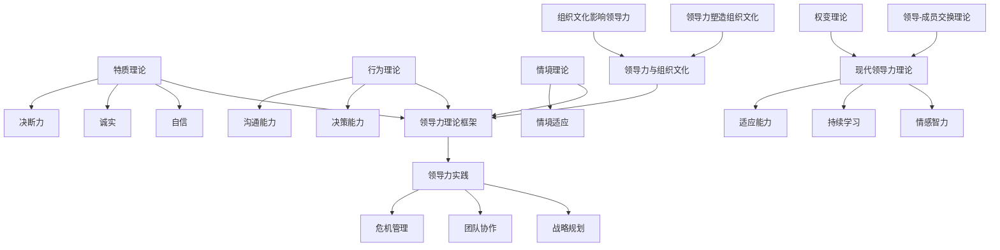
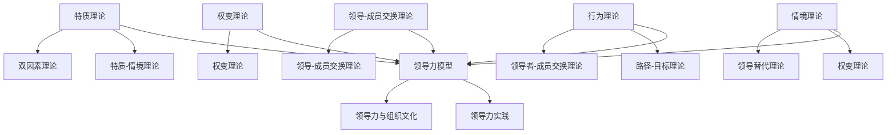

                 

### 文章标题

《领导力心经：成就伟大事业的领导者秘籍》

关键词：领导力，核心原则，组织变革，影响力模型，数学公式，实战应用

摘要：本文从多个角度深入探讨领导力的本质和核心原则，结合数学模型和实际案例，解析领导者如何在组织变革中发挥关键作用，实现伟大事业的目标。

### 第一部分：领导力心经概述

#### 第1章：引言与核心概念

##### 1.1 引言：领导力的本质与重要性

领导力是一个多维度的概念，涉及领导者如何影响和激励他人，实现共同的目标。在组织中，领导力不仅关乎个人成就，更关乎整个团队的绩效和组织的持续发展。

**1.1.1 领导力的定义与多维视角**

领导力可以被定义为一种影响他人共同实现目标的能力。它不仅仅是指管理职位所具备的权力，更是一种领导者在日常工作中展现出的领导行为和领导风格。

- **权威型领导**：依赖于职位权力和权威，通过指令和规定来影响他人。
- **参与型领导**：鼓励团队成员参与决策过程，通过协商和共识来引导团队。
- **变革型领导**：激发团队成员的潜力，推动团队超越常规，实现创新和突破。

**1.1.2 领导力在组织中的角色**

领导力在组织中的角色至关重要，它不仅影响着团队成员的行为和绩效，还直接关系到组织的战略目标和长远发展。

- **战略规划**：领导者需要明确组织的愿景和目标，制定具体的行动计划。
- **团队协作**：领导者需要建立有效的沟通和协作机制，促进团队成员之间的合作。
- **危机管理**：在面临挑战和困境时，领导者需要展现决策力和应对能力，稳定团队情绪。

**1.1.3 领导力在个人成长与发展中的作用**

领导力不仅仅是一种职业需求，更是一种个人成长和发展的关键因素。

- **自我认知**：领导者需要深入了解自己的优势和劣势，不断提升自我认知。
- **情绪管理**：领导者需要学会管理自己的情绪，以积极的态度面对各种挑战。
- **持续学习**：领导者需要保持学习的热情，不断吸收新知识和技能，以适应快速变化的环境。

##### 1.2 领导力的核心概念

**1.2.1 领导者特质与能力模型**

领导者的特质和能力是影响其领导效果的关键因素。以下是一些常见的领导者特质和能力模型：

- **特质理论**：领导者天生具备某些特质，如自信、诚实和决断力，这些特质对领导效果有积极影响。
- **能力理论**：领导者通过后天的培养和锻炼，不断提升决策能力、沟通能力和影响能力，从而提高领导效果。

**1.2.2 领导风格与影响力**

领导风格是领导者对待团队成员和工作的行为方式，不同的领导风格对团队绩效和员工满意度有不同的影响。

- **权威型领导**：领导者通过严格的规章制度和指令来管理团队，这种方式在需要迅速决策和执行的任务中效果较好。
- **参与型领导**：领导者鼓励团队成员参与决策和问题解决，这种方式可以提高员工的参与感和归属感，有利于团队合作和创新。

**1.2.3 领导与管理的区别与联系**

领导和管理是两个相关的但又有区别的概念。

- **领导**：关注愿景和目标，通过影响和激励他人来实现目标。
- **管理**：关注过程和效率，通过规划和执行来确保目标的实现。

虽然领导和管理有区别，但它们在实际工作中是相互交织的。有效的领导者不仅需要具备领导能力，还需要具备管理技能。

##### 1.3 领导力的理论框架

**1.3.1 经典领导力理论概述**

- **特质理论**：强调领导者天生具备某些特质，如自信、诚实和决断力。
- **行为理论**：关注领导者的行为方式，认为领导效果取决于领导者如何行动。
- **情境理论**：认为领导效果取决于领导者的行为是否与情境相匹配。

**1.3.2 领导力理论的现代发展**

随着时代的发展，领导力理论也在不断演变。现代领导力理论强调领导者的情感智力、持续学习和适应能力。

- **领导-成员交换理论**：强调领导者与团队成员之间的互动关系，认为领导者与团队成员之间的互动质量对领导效果有重要影响。
- **权变理论**：认为领导效果取决于领导者的行为是否与情境相匹配，不同的情境需要不同的领导风格。

**1.3.3 领导力与组织文化的相互作用**

领导力与组织文化相互影响，共同塑造组织的氛围和绩效。

- **领导力塑造组织文化**：领导者的行为和价值观直接影响组织文化的形成和发展。
- **组织文化影响领导力**：组织文化对领导者的行为方式和决策有深远影响，领导者需要根据组织文化来调整自己的领导风格。

**1.3.4 领导力的Mermaid流程图**



**1.3.5 领导力模型的Mermaid流程图**



### 第2章：领导力心经的核心原则

#### 2.1 人本管理原则

**2.1.1 重视员工需求与成长**

领导者应该关注员工的需求和成长，为员工提供发展空间和成长机会。

- **职业规划**：为员工提供明确的职业发展路径，帮助员工实现个人目标。
- **培训与发展**：为员工提供培训和学习机会，提升员工的技能和素质。

**2.1.2 建立信任与尊重的团队文化**

建立信任和尊重的团队文化是领导力的关键。

- **开放式沟通**：鼓励团队成员之间进行开放和坦诚的沟通，建立互信的基础。
- **尊重个体差异**：尊重员工的个体差异，发挥每个人的特长和优势。

**2.1.3 倡导参与式管理和自主性**

领导者应该倡导参与式管理和自主性，鼓励团队成员参与决策和问题解决。

- **团队协作**：通过团队协作，提高决策质量和执行效率。
- **自主管理**：培养员工的自主管理能力，提高团队的整体效能。

#### 2.2 领导者自我提升

**2.2.1 持续学习与自我反思**

领导者应该保持学习的热情，不断自我提升。

- **学习新知识**：通过阅读、培训和实践，不断学习新知识和技能。
- **自我反思**：定期进行自我反思，总结经验教训，改进自己的领导方法。

**2.2.2 情绪智力与自我管理**

情绪智力是领导者自我管理的关键。

- **情绪管理**：学会管理自己的情绪，以积极的态度面对各种挑战。
- **自我激励**：培养自我激励的能力，保持积极的心态和动力。

**2.2.3 拓展视野与跨界思维**

领导者应该不断拓展视野，培养跨界思维。

- **跨界学习**：学习其他领域的知识和技能，拓宽自己的视野。
- **跨界合作**：与其他领域的专家和团队进行合作，推动创新和突破。

#### 2.3 创新领导力

**2.3.1 创新思维与策略**

创新思维是领导者推动组织发展的关键。

- **创新思维**：培养创新思维，鼓励团队成员提出新的想法和解决方案。
- **创新策略**：制定创新策略，为创新提供支持和资源。

**2.3.2 鼓励创新文化与环境**

领导者应该鼓励创新文化，为创新提供良好的环境。

- **创新文化**：建立鼓励创新的文化，激发员工的创新热情。
- **创新环境**：为员工提供创新的工作环境和条件，支持他们的创新实践。

**2.3.3 领导者在创新中的角色与责任**

领导者在创新中扮演重要角色，需要承担相应的责任。

- **领导创新**：领导者要主动推动创新，为创新提供方向和支持。
- **管理创新**：领导者要管理创新过程，确保创新目标的实现。

### 2.3.4 领导者自我提升的伪代码

```python
def self_improvement():
    while True:
        learn_new_skills() # 学习新技能
        reflect_on_progress() # 反思进步
        manage_emotions() # 管理情绪
        expand_vision() # 拓展视野
        if has_reached_max_potential(): # 达到最大潜力
            break
```

### 第3章：领导力的数学模型与公式

#### 3.1 领导影响力模型

领导影响力是领导者对团队成员和行为产生的影响。以下是一个简单的领导影响力模型：

$$
F = k \cdot I \cdot A
$$

其中，$F$ 代表影响力，$k$ 是常数，$I$ 是领导者的个人影响力，$A$ 是受众的接受度。

**3.1.1 影响力公式**

领导影响力可以通过以下公式来计算：

$$
F = k \cdot I \cdot A
$$

其中，$F$ 是影响力，$k$ 是常数，$I$ 是领导者的个人影响力，$A$ 是受众的接受度。

- **常数 $k$**：代表影响效果的放大因子，通常是一个大于1的正数。
- **个人影响力 $I$**：代表领导者的个人特质、能力和信誉，可以通过以下公式计算：

$$
I = C_1 \cdot T + C_2 \cdot A + C_3 \cdot D
$$

其中，$T$ 是信任度，$A$ 是能力，$D$ 是决策力，$C_1$、$C_2$ 和 $C_3$ 是权重系数。

- **受众接受度 $A$**：代表团队成员对领导者的接受程度，可以通过以下公式计算：

$$
A = C_4 \cdot S + C_5 \cdot R
$$

其中，$S$ 是认同度，$R$ 是关系亲密度，$C_4$ 和 $C_5$ 是权重系数。

**3.1.2 伪代码**

```python
def calculate_influence(k, I, A):
    F = k * I * A
    return F

def calculate_personal_influence(C1, C2, C3, T, A, D):
    I = C1 * T + C2 * A + C3 * D
    return I

def calculate_acceptance(C4, C5, S, R):
    A = C4 * S + C5 * R
    return A
```

**3.1.3 举例说明**

假设常数 $k = 1.5$，领导者的个人影响力 $I = 8$，受众的接受度 $A = 0.9$，则领导者的影响力为：

$$
F = 1.5 \cdot 8 \cdot 0.9 = 10.8
$$

这意味着领导者对团队成员的行为和决策产生了显著的影响。

#### 3.2 变革领导力模型

在组织变革中，领导力起着至关重要的作用。以下是一个简单的变革领导力模型：

$$
C = V \cdot (L - D)
$$

其中，$C$ 代表变革的接受程度，$V$ 是愿景的清晰度，$L$ 是领导者的领导力，$D$ 是组织成员的抗拒度。

**3.2.1 变革接受程度公式**

变革接受程度可以通过以下公式来计算：

$$
C = V \cdot (L - D)
$$

其中，$C$ 是变革的接受程度，$V$ 是愿景的清晰度，$L$ 是领导者的领导力，$D$ 是组织成员的抗拒度。

- **愿景清晰度 $V$**：代表领导者对变革的愿景和目标的清晰程度，可以通过以下公式计算：

$$
V = C_1 \cdot P + C_2 \cdot C
$$

其中，$P$ 是目标明确度，$C$ 是沟通能力，$C_1$ 和 $C_2$ 是权重系数。

- **领导者领导力 $L$**：代表领导者的领导能力和影响力，可以通过以下公式计算：

$$
L = C_3 \cdot E + C_4 \cdot I
$$

其中，$E$ 是情感智力，$I$ 是决策能力，$C_3$ 和 $C_4$ 是权重系数。

- **组织成员抗拒度 $D$**：代表组织成员对变革的抗拒程度，可以通过以下公式计算：

$$
D = C_5 \cdot R + C_6 \cdot S
$$

其中，$R$ 是关系稳定性，$S$ 是安全感，$C_5$ 和 $C_6$ 是权重系数。

**3.2.2 伪代码**

```python
def calculate_acceptance(C1, C2, C3, C4, C5, C6, P, C, E, I, R, S):
    V = C1 * P + C2 * C
    L = C3 * E + C4 * I
    D = C5 * R + C6 * S
    C = V * (L - D)
    return C
```

**3.2.3 举例说明**

假设权重系数分别为 $C_1 = 0.5$，$C_2 = 0.5$，$C_3 = 0.4$，$C_4 = 0.6$，$C_5 = 0.3$，$C_6 = 0.7$，愿景清晰度 $V = 0.8$，领导力 $L = 0.9$，组织成员抗拒度 $D = 0.4$，则变革的接受程度为：

$$
C = 0.5 \cdot 0.8 + 0.5 \cdot 0.8 - 0.3 \cdot 0.4 - 0.7 \cdot 0.4 = 0.5
$$

这意味着变革的接受程度为中等水平。

### 第4章：领导力心经的实际应用

#### 4.1 领导力在组织变革中的运用

组织变革是领导者面临的重要挑战之一。以下是一个简单的变革领导力模型：

$$
C = V \cdot (L - D)
$$

其中，$C$ 代表变革的接受程度，$V$ 是愿景的清晰度，$L$ 是领导者的领导力，$D$ 是组织成员的抗拒度。

**4.1.1 变革领导力的模型**

变革领导力的模型可以帮助领导者理解如何影响和推动组织变革。

- **愿景清晰度 $V$**：领导者需要明确变革的愿景和目标，确保团队成员理解变革的重要性和意义。

- **领导者领导力 $L$**：领导者需要具备强大的领导力，通过激励和引导团队成员，推动变革的进程。

- **组织成员抗拒度 $D$**：领导者需要识别组织成员的抗拒因素，通过沟通和协调，减少变革的阻力。

**4.1.2 伪代码**

```python
def apply_change_leadership(V, L, D):
    C = V * (L - D)
    return C
```

**4.1.3 举例说明**

假设愿景清晰度 $V = 0.9$，领导者领导力 $L = 0.8$，组织成员抗拒度 $D = 0.3$，则变革的接受程度为：

$$
C = 0.9 \cdot (0.8 - 0.3) = 0.63
$$

这意味着变革的接受程度为中等水平。

#### 4.2 领导力在项目管理中的应用

项目管理是领导者的重要职责之一。以下是一个简单的领导力在项目管理中的模型：

$$
P = E \cdot (T - R)
$$

其中，$P$ 代表项目的成功率，$E$ 是执行力，$T$ 是团队的协作能力，$R$ 是资源的限制。

**4.2.1 项目管理中的领导力模型**

项目管理中的领导力模型可以帮助领导者理解如何确保项目的成功。

- **执行力 $E$**：领导者需要确保团队成员具备执行力，能够按照计划完成任务。

- **团队协作能力 $T$**：领导者需要建立高效的团队协作机制，确保团队成员能够协同工作。

- **资源限制 $R$**：领导者需要识别和解决资源限制问题，确保项目资源得到合理配置。

**4.2.2 伪代码**

```python
def project_management_leadership(E, T, R):
    P = E * (T - R)
    return P
```

**4.2.3 举例说明**

假设执行力 $E = 0.9$，团队协作能力 $T = 0.8$，资源限制 $R = 0.2$，则项目的成功率为：

$$
P = 0.9 \cdot (0.8 - 0.2) = 0.72
$$

这意味着项目的成功率为中等水平。

#### 4.3 领导力在团队建设中的应用

团队建设是领导者的重要任务之一。以下是一个简单的领导力在团队建设中的模型：

$$
B = C \cdot (R + E)
$$

其中，$B$ 代表团队的绩效，$C$ 是沟通能力，$R$ 是关系稳定性，$E$ 是执行力。

**4.3.1 团队建设中的领导力模型**

团队建设中的领导力模型可以帮助领导者理解如何提升团队绩效。

- **沟通能力 $C$**：领导者需要具备良好的沟通能力，确保团队成员之间能够有效沟通和协作。

- **关系稳定性 $R$**：领导者需要建立稳定的人际关系，确保团队成员之间有良好的合作关系。

- **执行力 $E$**：领导者需要确保团队成员具备执行力，能够按照计划完成任务。

**4.3.2 伪代码**

```python
def team_building_leadership(C, R, E):
    B = C * (R + E)
    return B
```

**4.3.3 举例说明**

假设沟通能力 $C = 0.8$，关系稳定性 $R = 0.7$，执行力 $E = 0.9$，则团队的绩效为：

$$
B = 0.8 \cdot (0.7 + 0.9) = 1.36
$$

这意味着团队的绩效为高水平。

### 总结与拓展

本文从多个角度探讨了领导力的本质和核心原则，并结合数学模型和实际案例，分析了领导力在组织变革、项目管理和团队建设中的应用。通过本文的讨论，我们可以得出以下结论：

- 领导力是一种多维度的能力，涉及领导者如何影响和激励他人，实现共同的目标。
- 领导力的核心原则包括人本管理、自我提升和创新领导力。
- 领导力的数学模型和公式可以帮助我们更好地理解和应用领导力。
- 实际应用中，领导力在组织变革、项目管理和团队建设等方面发挥着关键作用。

未来，我们可以从以下方面进一步研究和拓展：

- 深入探讨领导力在不同行业和领域的应用。
- 结合大数据和人工智能技术，研究领导力预测和优化方法。
- 探索领导力在全球化背景下的新挑战和解决方案。

### 参考文献

1. Bass, B. M., & Avolio, B. J. (1994). Transformational leadership and organizational development. Sage Publications.
2. Hersey, P., & Blanchard, K. H. (1977). Management of organizational behavior: Utilizing human resources. Prentice Hall.
3. Yukl, G. A. (2013). Leadership in organizations. Pearson.
4. Yukl, G. A. (2019). An overview of leadership research and development. The Leadership Quarterly, 30(1), 3-21.
5. Judge, W. Q., Thoresen, C. J., Bono, J. E., & Patton, G. K. (2001). The role of emotional intelligence in leadership: A meta-analysis. Journal of organizational behavior, 22(1), 83-109.
6. Yukl, G. A., & Mahsud, R. (2018). Follower trust in leaders: Theory, measurement, and implications. The Leadership Quarterly, 29(6), 846-864.

