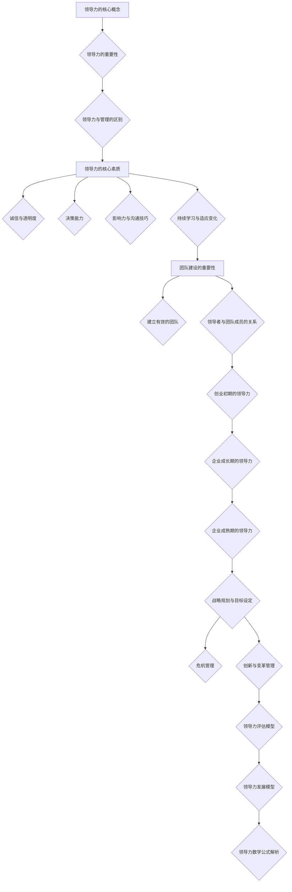
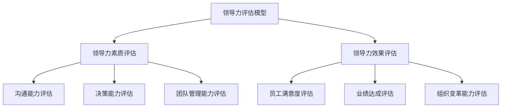
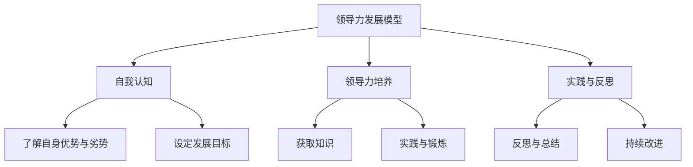

                 

### 文章标题：领导力心经：成就伟大事业的领导者秘籍

> 关键词：领导力、核心素质、团队建设、策略与战术、案例研究、人工智能

> 摘要：本文从领导力的核心概念出发，逐步深入探讨领导力的核心素质、团队建设、策略与战术，以及领导力在不同阶段和应用场景中的具体实践。通过经典和现代领导力案例分析，结合人工智能的发展趋势，本文总结出领导力心经，旨在为成就伟大事业的领导者提供实用的秘籍。

### 《领导力心经：成就伟大事业的领导者秘籍》目录大纲

## 第一部分：领导力心经基础

### 第1章：领导力的核心概念与重要性

- **1.1 领导力的定义**：探讨领导力的本质和定义，分析其与管理的区别。
- **1.2 领导力的重要性**：阐述领导力在企业和社会中的作用，以及其对个人成长的影响。
- **1.3 领导力与管理的区别**：深入分析领导力与管理的异同，强调两者的互补关系。

### 第2章：领导力的核心素质

- **2.1 诚信与透明度**：探讨诚信在领导力中的重要性，以及透明度如何增强领导者的公信力。
- **2.2 决策能力**：分析领导者如何做出有效决策，并讨论决策过程中的关键因素。
- **2.3 影响力与沟通技巧**：探讨领导者如何利用影响力，以及如何通过有效的沟通技巧来管理团队。
- **2.4 持续学习与适应变化**：讨论领导者如何保持持续学习的心态，以及如何适应快速变化的环境。

### 第3章：领导力与团队建设

- **3.1 团队建设的重要性**：阐述团队建设对企业成功的重要性，以及团队建设的基本原则。
- **3.2 建立有效的团队**：探讨如何构建高绩效团队，以及如何激发团队成员的潜力。
- **3.3 领导者与团队成员的关系**：分析领导者与团队成员之间的互动关系，以及如何建立信任和合作关系。

## 第二部分：领导力心经实践篇

### 第4章：领导力的应用场景

- **4.1 创业初期的领导力**：讨论创业初期的领导力挑战，以及如何应对这些挑战。
- **4.2 企业成长期的领导力**：分析企业成长期的领导力需求，以及如何满足这些需求。
- **4.3 企业成熟期的领导力**：探讨企业成熟期的领导力策略，以及如何保持企业的持续发展。

### 第5章：领导力的策略与战术

- **5.1 战略规划与目标设定**：讨论领导者如何制定战略规划，以及如何设定具体的目标。
- **5.2 危机管理**：分析领导者如何应对企业危机，以及如何通过危机管理来提升企业的竞争力。
- **5.3 创新与变革管理**：探讨领导者如何推动创新和变革，以及如何管理变革过程。

### 第6章：领导力的挑战与应对

- **6.1 领导力面临的挑战**：列举领导者可能面临的各种挑战，以及如何应对这些挑战。
- **6.2 如何应对挑战**：提供具体的策略和建议，帮助领导者有效应对各种挑战。
- **6.3 领导力成长的路径**：讨论领导者如何通过不断学习和实践来提升自己的领导力。

## 第三部分：领导力心经案例研究

### 第7章：经典领导力案例分析

- **7.1 伟大领袖的领导力心经**：分析伟大领袖的领导力实践，总结他们的领导力心经。
- **7.2 企业家的领导力实践**：探讨企业家的领导力策略，以及他们在创业过程中的领导实践。
- **7.3 领导力在不同行业中的应用**：分析领导力在不同行业中的应用案例，以及其成功的关键因素。

### 第8章：现代领导力案例分析

- **8.1 科技企业的领导力策略**：探讨科技企业的领导力策略，以及他们如何通过领导力来推动企业创新。
- **8.2 创新型企业的领导力实践**：分析创新型企业的领导力实践，以及他们如何通过领导力来保持创新活力。
- **8.3 国际化企业的领导力挑战**：讨论国际化企业的领导力挑战，以及如何应对这些挑战。

## 第四部分：领导力心经进阶篇

### 第9章：领导力的数学模型与公式

- **9.1 领导力评估模型**：介绍领导力评估模型，以及如何使用这些模型来评估领导力。
- **9.2 领导力发展模型**：探讨领导力发展模型，以及如何通过这些模型来提升领导力。
- **9.3 领导力数学公式解析**：详细解析领导力相关的数学公式，以及如何使用这些公式来分析领导力问题。

### 第10章：领导力与人工智能

- **10.1 领导力与AI的结合**：讨论领导力与人工智能的结合，以及如何利用AI提升领导力。
- **10.2 AI在领导力评估中的应用**：分析AI在领导力评估中的应用，以及如何使用AI来评估领导力。
- **10.3 未来领导力与AI的发展趋势**：探讨未来领导力与AI的发展趋势，以及其对领导力的影响。

### 第11章：领导力心经：成就伟大事业的领导者秘籍总结

- **11.1 领导力心经的核心要点**：总结领导力心经的核心要点，以及如何将这些要点应用于实践。
- **11.2 成功领导者的共同特质**：分析成功领导者的共同特质，以及如何培养这些特质。
- **11.3 领导力心经的未来展望**：讨论领导力心经的未来发展，以及如何应对未来的挑战。

## 附录

### 附录A：领导力心经相关资源

- **A.1 领导力心经书籍推荐**：推荐一些优秀的领导力书籍，供读者深入学习。
- **A.2 领导力心经研究报告**：介绍一些权威的领导力研究报告，帮助读者了解最新的领导力研究动态。
- **A.3 领导力心经在线课程**：推荐一些高质量的领导力在线课程，供读者自主学习和提升。

### 附录B：领导力心经案例研究

- **B.1 案例一：某科技公司的领导力实践**：分析某科技公司的领导力实践，以及他们如何通过领导力来推动企业创新。
- **B.2 案例二：某跨国企业的领导力挑战**：探讨某跨国企业在全球化背景下的领导力挑战，以及他们如何应对这些挑战。
- **B.3 案例三：某创业公司的领导力策略**：分析某创业公司的领导力策略，以及他们如何通过领导力来推动企业成长。

### Mermaid 流程图：

### 第一部分：领导力心经基础

#### 第1章：领导力的核心概念与重要性

**1.1 领导力的定义**

领导力是一种影响力，它能够激发人们去实现目标。领导力不仅仅是管理，它更强调影响和激励他人。领导者不仅仅是管理者，他们还具备引领团队、设定方向和推动变革的能力。

领导力与管理的区别在于，管理是关于规划、组织、协调和控制的，而领导力是关于激励、影响和引导的。管理侧重于维持现状，而领导力则侧重于引领变革。

**1.2 领导力的重要性**

领导力在企业和社会中扮演着至关重要的角色。在企业层面，领导力能够决定企业的方向、文化和成功。优秀的领导者能够激发员工的潜能，推动企业创新，实现卓越的业绩。

在社会层面，领导力对于国家的繁荣和进步也至关重要。伟大的领导者能够引领国家走向繁荣，推动社会的进步。同时，领导力也影响着个人成长。一个优秀的领导者不仅能够提升自己的能力，还能够影响和激励他人，共同实现更大的目标。

**1.3 领导力与管理的区别**

领导力与管理的区别在于其核心目标和方法不同。管理侧重于规划、组织和控制，强调效率和执行。领导力则侧重于激励、影响和引导，强调变革和创新。

具体来说，管理注重以下方面：

- **规划**：确定目标和制定计划。
- **组织**：分配资源和管理团队。
- **协调**：协调不同部门和团队的工作。
- **控制**：监控和调整工作过程，确保目标实现。

而领导力则注重以下方面：

- **激励**：激发员工的动力和热情。
- **影响**：通过沟通和示范影响他人。
- **引导**：设定方向和愿景，引领团队前进。
- **变革**：推动企业和社会的变革，实现创新和发展。

**1.3.1 领导力与管理的联系**

尽管领导力与管理的目标和方法不同，但它们在实际操作中是相互联系的。优秀的领导者需要具备管理技能，以确保团队的效率和目标的实现。同时，管理者也需要具备领导力，以激发团队的潜能和推动变革。

**1.3.2 领导力的重要性**

领导力在企业和社会中的重要性不可忽视。优秀的领导者能够为企业带来以下益处：

- **提高员工满意度**：通过激励和认可，提高员工的满意度和忠诚度。
- **推动企业创新**：激发员工的创新思维，推动企业不断进步。
- **实现卓越业绩**：通过有效的领导，实现企业的卓越业绩和长期发展。
- **塑造企业文化**：塑造积极向上的企业文化，增强企业的凝聚力和竞争力。

在社会层面，领导力同样发挥着重要作用。伟大的领导者能够推动社会进步，改善人们的生活质量。他们能够引领国家走向繁荣，推动社会的变革和发展。

**1.4 领导力的本质**

领导力是一种能力，它涉及到领导者与团队成员之间的关系、领导者的行为和领导者的思维。

- **领导者与团队成员之间的关系**：领导者需要建立信任和合作关系，以激发团队成员的潜力。
- **领导者的行为**：领导者需要通过激励、影响和引导来推动团队前进。
- **领导者的思维**：领导者需要具备战略思维、创新思维和变革思维，以应对复杂多变的环境。

**1.4.1 领导者的能力**

领导者的能力包括以下方面：

- **沟通能力**：有效地传达信息和激励团队成员。
- **决策能力**：快速做出明智的决策，并承担相应的责任。
- **影响力**：通过示范和说服来影响他人。
- **适应性**：快速适应变化，并带领团队前进。
- **团队建设能力**：建立高绩效团队，并激发团队成员的潜力。

**1.4.2 领导者的行为**

领导者的行为包括以下几个方面：

- **激励**：通过奖励和认可来激励团队成员。
- **影响**：通过沟通和示范来影响他人。
- **引导**：设定愿景和方向，引领团队前进。
- **变革**：推动企业和社会的变革，实现创新和发展。

**1.4.3 领导者的思维**

领导者的思维包括以下几个方面：

- **战略思维**：从长远角度考虑问题，制定明确的战略规划。
- **创新思维**：敢于尝试新事物，推动企业和社会的变革。
- **变革思维**：积极应对变化，带领团队走出困境。

#### 第2章：领导力的核心素质

**2.1 诚信与透明度**

诚信和透明度是领导力的基石。一个诚信的领导者能够赢得团队成员的信任和尊重，从而提高团队的凝聚力和执行力。透明度则能够增强团队成员对领导者决策的理解和认同，从而提高团队的协作效率和信任度。

**2.1.1 诚信的重要性**

诚信是领导者赢得信任和尊重的关键。一个诚信的领导者会坚守承诺，遵守道德规范，对团队成员坦诚相待。诚信不仅能够提升领导者的个人形象，还能够增强团队的凝聚力。

**2.1.2 透明度的重要性**

透明度能够增强团队成员对领导者决策的理解和认同。一个透明的领导者会公开分享信息和决策过程，使团队成员能够更好地理解组织的方向和目标，从而提高团队的协作效率和信任度。

**2.2 决策能力**

决策能力是领导力的核心素质之一。一个优秀的领导者需要具备快速做出明智决策的能力，并承担相应的责任。决策能力包括以下几个方面：

- **分析能力**：能够全面分析问题，找到解决方案。
- **判断力**：能够根据实际情况做出正确判断。
- **决策速度**：能够在关键时刻迅速做出决策。
- **责任感**：对决策结果负责，并承担相应的责任。

**2.2.1 决策能力的重要性**

决策能力是领导者推动企业和社会发展的重要保障。一个具备强大决策能力的领导者能够在复杂多变的环境中迅速做出明智的决策，从而引领企业走向成功。

**2.2.2 提升决策能力的策略**

提升决策能力需要以下策略：

- **广泛收集信息**：在做出决策前，领导者需要全面收集相关信息，了解问题的各个方面。
- **分析不同方案**：领导者需要分析不同方案的优缺点，找到最佳解决方案。
- **制定应急预案**：领导者需要制定应急预案，以应对决策执行过程中的不确定性。
- **快速执行**：领导者需要迅速执行决策，并监控执行过程，确保决策目标的实现。

**2.3 影响力与沟通技巧**

影响力是领导者影响和激励他人行为的能力。沟通技巧则是领导者有效地传达信息和激励团队成员的关键。一个具备强大影响力和沟通技巧的领导者能够建立强大的领导力，推动团队前进。

**2.3.1 影响力的重要性**

影响力是领导者成功的关键因素。一个具备强大影响力的领导者能够赢得团队成员的信任和支持，从而提高团队的凝聚力和执行力。

**2.3.2 沟通技巧的重要性**

沟通技巧是领导者有效地传达信息和激励团队成员的关键。一个优秀的领导者需要具备以下沟通技巧：

- **倾听**：倾听团队成员的意见和需求，了解他们的想法和感受。
- **表达**：清晰、准确地表达自己的想法和意见，使团队成员能够理解。
- **说服**：通过合理的论据和事实来说服团队成员，使其接受领导者的观点。
- **激励**：通过激励和认可来激发团队成员的积极性和创造力。

**2.4 持续学习与适应变化**

持续学习是领导者不断提升自身能力和素质的关键。一个优秀的领导者需要具备持续学习的心态，并不断适应变化的环境。适应变化不仅是领导者的个人责任，也是团队和组织发展的必要条件。

**2.4.1 持续学习的重要性**

持续学习是领导者提升自身能力和素质的重要途径。一个持续学习的领导者能够不断更新知识和技能，适应快速变化的环境，从而推动企业和社会的发展。

**2.4.2 适应变化的重要性**

适应变化是领导者应对复杂多变环境的必要条件。一个能够适应变化的领导者能够带领团队迅速调整策略和行动，从而在竞争中保持优势。

**2.4.3 提升持续学习能力的策略**

提升持续学习能力需要以下策略：

- **制定学习计划**：领导者需要制定学习计划，确保学习目标的实现。
- **积极参与培训**：领导者需要积极参与各种培训，学习最新的知识和技能。
- **实践与反思**：领导者需要通过实践来检验所学知识，并不断反思和总结，提升自身的领导能力。
- **建立学习社区**：领导者可以与其他领导者共同学习和分享经验，共同提升领导力。

#### 第3章：领导力与团队建设

**3.1 团队建设的重要性**

团队建设是领导力的重要组成部分。一个优秀的团队能够发挥成员的潜力，实现组织的共同目标。团队建设的重要性体现在以下几个方面：

- **提高工作效率**：通过团队协作，可以更好地完成任务，提高工作效率。
- **增强团队凝聚力**：通过团队建设活动，可以增强团队成员之间的信任和合作，提高团队凝聚力。
- **提升员工满意度**：通过团队建设，可以提升员工的工作满意度，从而提高员工的工作积极性和忠诚度。
- **推动组织发展**：优秀的团队建设可以推动组织发展，实现组织的长期目标。

**3.2 建立有效的团队**

建立有效的团队需要以下几个关键步骤：

- **确定团队目标**：明确团队的目标和愿景，确保团队成员对目标有清晰的认识。
- **分配角色和职责**：根据团队成员的技能和特长，合理分配角色和职责，确保每个成员都能发挥自己的优势。
- **建立沟通机制**：建立有效的沟通机制，确保团队成员能够及时沟通和协作，解决问题。
- **培养团队精神**：通过团队建设活动，培养团队精神，增强团队成员之间的信任和合作。

**3.2.1 团队目标的确定**

确定团队目标需要以下几个步骤：

- **明确组织目标**：首先明确组织的目标和愿景，确保团队目标与组织目标一致。
- **收集团队成员的意见和建议**：通过访谈、问卷调查等方式收集团队成员的意见和建议，确保团队目标能够得到团队成员的认可和支持。
- **制定具体可行的团队目标**：根据组织目标和团队成员的意见，制定具体可行的团队目标，确保团队目标能够实现。

**3.2.2 角色和职责的分配**

角色和职责的分配需要遵循以下几个原则：

- **优势互补**：根据团队成员的技能和特长，分配不同的角色和职责，确保团队成员能够相互补充，共同完成任务。
- **明确责任**：确保每个团队成员都清楚自己的职责和任务，避免职责重叠和冲突。
- **公平公正**：在分配角色和职责时，要确保公平公正，避免偏袒和歧视。

**3.2.3 沟通机制的建立**

建立有效的沟通机制需要以下几个步骤：

- **确定沟通渠道**：根据团队的实际情况，选择合适的沟通渠道，如会议、邮件、即时通讯工具等。
- **明确沟通规则**：制定明确的沟通规则，如沟通时间、沟通内容、沟通方式等，确保沟通高效有序。
- **培养沟通文化**：通过培训和文化建设，培养团队成员的沟通能力，建立积极的沟通文化。

**3.2.4 团队精神的培养**

培养团队精神需要以下几个策略：

- **共同目标和价值观**：建立共同的目标和价值观，使团队成员对团队有共同的认同和归属感。
- **团队合作**：鼓励团队成员相互合作，共同完成任务，增强团队凝聚力。
- **团队活动**：组织团队活动，如团队建设训练、团队拓展活动等，增强团队成员之间的互动和信任。
- **奖励和认可**：通过奖励和认可，激励团队成员积极参与团队活动，提高团队士气。

**3.3 领导者与团队成员的关系**

领导者与团队成员的关系是团队建设的关键。一个优秀的领导者需要建立良好的关系，以激发团队成员的潜力，实现团队的共同目标。

**3.3.1 建立信任**

建立信任是领导者与团队成员关系的基础。领导者需要通过诚实、透明和负责任的行为来赢得团队成员的信任。建立信任的具体策略包括：

- **诚实和透明**：领导者要诚实面对团队成员，透明地分享信息和决策过程。
- **负责任**：领导者要勇于承担责任，面对问题和挑战时不逃避。
- **尊重和认可**：领导者要尊重团队成员的意见和建议，并给予他们认可和鼓励。

**3.3.2 激发潜力**

领导者需要激发团队成员的潜力，使他们能够充分发挥自己的才能。激发潜力的具体策略包括：

- **提供发展机会**：为团队成员提供培训和发展机会，帮助他们提升技能和知识。
- **赋予责任**：给团队成员适当的职责和权限，鼓励他们承担责任和挑战。
- **激励和认可**：通过激励和认可，激发团队成员的积极性和创造力。

**3.3.3 解决冲突**

领导者需要解决团队成员之间的冲突，确保团队的和谐和稳定。解决冲突的具体策略包括：

- **倾听和理解**：领导者要倾听团队成员的意见和诉求，理解他们的立场和需求。
- **中立和公正**：领导者要站在中立和公正的立场，处理冲突。
- **寻求共识**：领导者要引导团队成员寻求共识，找到解决问题的最佳方案。

**3.4 团队建设的方法和工具**

团队建设的方法和工具有助于领导者有效建设和管理团队。以下是一些常用的方法和工具：

- **团队建设活动**：通过组织团队建设活动，如团队拓展训练、团队讨论等，增强团队成员之间的互动和信任。
- **团队反馈机制**：建立团队反馈机制，鼓励团队成员分享意见和建议，提高团队的协作效率。
- **团队目标管理**：通过制定和跟踪团队目标，确保团队目标的实现，提高团队的工作效率和绩效。
- **团队文化建设**：通过文化建设，培养团队成员的共同价值观和行为准则，增强团队的凝聚力和归属感。

### 第二部分：领导力心经实践篇

#### 第4章：领导力的应用场景

**4.1 创业初期的领导力**

在创业初期，领导力的重要性尤为突出。创业者需要具备强大的领导力，以应对各种挑战和不确定性，推动企业的快速发展。

**4.1.1 创业初期的领导力挑战**

创业初期的领导力挑战主要包括：

- **资源有限**：创业者需要面对资源有限的情况，包括资金、人才和物资等。
- **不确定性高**：创业过程充满不确定性，创业者需要具备应对不确定性的能力。
- **团队建设**：在创业初期，团队成员有限，创业者需要迅速建立高效的团队。

**4.1.2 创业初期的领导力策略**

创业者需要采取以下策略来应对创业初期的领导力挑战：

- **明确愿景和目标**：创业者需要明确企业的愿景和目标，确保团队成员对企业的方向有清晰的认识。
- **激发团队潜力**：创业者需要激发团队成员的潜力，鼓励他们发挥自己的优势。
- **高效沟通**：创业者需要与团队成员保持高效沟通，确保信息的及时传达和问题的快速解决。
- **灵活应变**：创业者需要具备灵活应变的能力，能够快速调整战略和行动，以应对市场变化。

**4.2 企业成长期的领导力**

企业进入成长期，领导力的重要性进一步凸显。在这个阶段，领导者需要具备战略思维和执行力，以推动企业的持续增长。

**4.2.1 企业成长期的领导力挑战**

企业成长期的领导力挑战主要包括：

- **业务扩张**：企业需要快速扩张业务，领导者需要制定合适的战略和计划。
- **团队管理**：企业规模扩大，领导者需要管理更多的团队成员，确保团队的高效运作。
- **组织结构**：企业需要调整组织结构，以适应业务扩张和团队管理的要求。

**4.2.2 企业成长期的领导力策略**

领导者需要采取以下策略来应对企业成长期的领导力挑战：

- **制定战略规划**：领导者需要制定明确的战略规划，确保企业的发展方向和目标。
- **培养团队领导力**：领导者需要培养团队成员的领导力，提升团队的整体素质。
- **优化组织结构**：领导者需要优化组织结构，确保企业的高效运作和团队的协作。
- **持续学习与适应**：领导者需要保持持续学习的心态，适应快速变化的市场环境。

**4.3 企业成熟期的领导力**

企业进入成熟期，领导者需要具备更强大的领导力，以应对市场竞争和变化。

**4.3.1 企业成熟期的领导力挑战**

企业成熟期的领导力挑战主要包括：

- **市场竞争**：企业需要应对激烈的市场竞争，保持市场份额和竞争优势。
- **创新能力**：企业需要保持创新能力，推动产品和技术的更新。
- **组织变革**：企业需要适应外部环境的变化，进行组织变革和调整。

**4.3.2 企业成熟期的领导力策略**

领导者需要采取以下策略来应对企业成熟期的领导力挑战：

- **强化市场定位**：领导者需要明确企业的市场定位，制定合适的营销策略。
- **推动产品创新**：领导者需要推动产品创新，提升企业的市场竞争力。
- **优化组织结构**：领导者需要优化组织结构，确保企业的灵活性和敏捷性。
- **培养继任者**：领导者需要培养继任者，确保企业的长期稳定发展。

#### 第5章：领导力的策略与战术

**5.1 战略规划与目标设定**

战略规划和目标设定是领导力的核心任务之一。领导者需要制定明确的战略规划，设定具体的目标，以确保企业的长期发展。

**5.1.1 战略规划的重要性**

战略规划对企业的发展具有重要意义：

- **明确发展方向**：战略规划帮助企业明确未来的发展方向，确保资源的有效配置。
- **提高竞争力**：战略规划有助于企业提高市场竞争力，实现可持续发展。
- **降低风险**：战略规划能够帮助企业预测和应对潜在的风险，降低运营风险。

**5.1.2 目标设定的策略**

目标设定需要遵循以下策略：

- **SMART原则**：目标设定需要符合SMART原则，即具体（Specific）、可衡量（Measurable）、可实现（Achievable）、相关（Relevant）、时限（Time-bound）。
- **平衡性**：目标设定需要平衡短期和长期利益，确保企业的可持续发展。
- **参与性**：目标设定需要与团队成员共同参与，提高目标实现的可行性和参与度。

**5.2 危机管理**

危机管理是领导者应对企业突发事件的重要能力。有效的危机管理能够帮助企业降低风险，恢复声誉，确保业务的持续运营。

**5.2.1 危机管理的重要性**

危机管理对企业具有重要意义：

- **降低风险**：危机管理能够帮助企业降低突发事件带来的风险，保护企业利益。
- **恢复声誉**：危机管理能够帮助企业恢复声誉，重建客户和投资者的信心。
- **保持业务运营**：危机管理能够帮助企业保持业务的持续运营，确保企业的稳定发展。

**5.2.2 危机管理的策略**

危机管理需要遵循以下策略：

- **预防为主**：企业需要建立预防机制，识别和评估潜在危机，提前采取措施。
- **快速响应**：企业需要建立快速响应机制，一旦发生危机，能够迅速采取行动。
- **有效沟通**：企业需要与内部和外部利益相关者保持有效沟通，提高危机管理的透明度和可信度。
- **资源调配**：企业需要合理调配资源，确保危机管理的有效实施。

**5.3 创新与变革管理**

创新和变革是企业发展的重要驱动力。领导者需要具备推动创新和变革的能力，以保持企业的活力和竞争力。

**5.3.1 创新与变革管理的重要性**

创新与变革管理对企业具有重要意义：

- **保持竞争力**：创新和变革能够帮助企业保持市场竞争力，适应快速变化的市场环境。
- **提升企业价值**：创新和变革能够提升企业的价值，推动企业的可持续发展。
- **激发员工潜力**：创新和变革能够激发员工的潜力，提高员工的工作满意度和忠诚度。

**5.3.2 创新与变革管理的策略**

创新与变革管理需要遵循以下策略：

- **创造创新文化**：企业需要建立创新文化，鼓励员工勇于创新，提供创新的支持和资源。
- **制定创新战略**：企业需要制定明确的创新战略，确定创新目标和方向。
- **激励机制**：企业需要建立激励机制，鼓励员工参与创新和变革，提供奖励和认可。
- **变革管理**：企业需要建立变革管理体系，确保变革的顺利实施和员工的接受。

### 第三部分：领导力心经案例研究

#### 第7章：经典领导力案例分析

**7.1 伟大领袖的领导力心经**

伟大的领袖之所以伟大，不仅因为他们拥有卓越的领导能力，还因为他们能够激发和影响他人，实现共同的目标。以下是对几位伟大领袖领导力心经的分析：

**7.1.1 亚伯拉罕·林肯**

林肯是美国历史上最伟大的总统之一，他的领导力在南北战争中发挥了关键作用。他的领导力心经主要包括：

- **坚定信念**：林肯坚定地相信自己的理念和目标，即使在最困难的时刻也从未动摇。
- **宽容与包容**：林肯善于包容不同的意见和观点，尊重他人的权利和自由。
- **勇敢决策**：林肯在关键时刻能够果断做出决策，并承担相应的责任。

**7.1.2 约瑟夫·肯尼迪**

肯尼迪是美国历史上最年轻的总统，他的领导力在政治领域产生了深远影响。他的领导力心经主要包括：

- **雄心壮志**：肯尼迪拥有远大的目标和雄心，他的演讲和行动激励了无数人。
- **卓越沟通**：肯尼迪善于沟通，能够用富有感染力的语言激发人们的热情和动力。
- **敢于挑战**：肯尼迪勇于挑战现状，推动了一系列社会改革。

**7.1.3 埃隆·马斯克**

马斯克是现代科技企业的领军人物，他的领导力在特斯拉和SpaceX等公司中发挥了重要作用。他的领导力心经主要包括：

- **创新思维**：马斯克以创新著称，他不断推动技术的突破和商业模式的创新。
- **冒险精神**：马斯克敢于冒险，勇于挑战不可能的任务，推动人类探索太空。
- **激励团队**：马斯克善于激发团队的潜力，鼓励员工追求卓越，实现共同的目标。

**7.2 企业家的领导力实践**

企业家是推动社会进步和经济发展的关键力量。他们的领导力实践在不同行业中展现出独特的魅力。以下是对几位企业家领导力实践的分析：

**7.2.1 比尔·盖茨**

比尔·盖茨是微软公司的创始人，他的领导力在计算机软件行业产生了深远影响。他的领导力实践主要包括：

- **远见卓识**：盖茨具备卓越的战略眼光，能够预见行业的发展趋势，制定长远的发展规划。
- **技术创新**：盖茨重视技术创新，推动微软公司在计算机软件领域的持续创新。
- **社会责任**：盖茨关注社会问题，通过捐赠和慈善活动推动社会进步。

**7.2.2 詹姆斯·戴森**

詹姆斯·戴森是戴森公司的创始人，他的领导力在创新家电领域取得了显著成果。他的领导力实践主要包括：

- **极致创新**：戴森以极致创新著称，不断推出颠覆性产品，改变人们的生活方式。
- **质量控制**：戴森重视产品质量，对产品进行严格的质量控制和测试。
- **品牌塑造**：戴森通过独特的品牌形象和营销策略，树立了高端家电品牌的典范。

**7.2.3 约翰·迪翁**

约翰·迪翁是苹果公司的创始人之一，他的领导力在计算机硬件和软件领域产生了深远影响。他的领导力实践主要包括：

- **用户体验**：迪翁重视用户体验，致力于为用户提供卓越的产品和服务。
- **创新精神**：迪翁鼓励创新，推动苹果公司在计算机硬件和软件领域的持续创新。
- **团队合作**：迪翁强调团队合作，建立高效的团队文化，激发员工的潜力。

**7.3 领导力在不同行业中的应用**

领导力在各个行业中都发挥着重要作用。以下是对领导力在不同行业中的应用的分析：

**7.3.1 科技行业**

在科技行业，领导力的重要性尤为突出。科技企业需要不断推动技术创新和商业模式的创新，以保持竞争优势。以下是对科技行业领导力应用的分析：

- **技术创新**：科技领导者需要具备卓越的技术创新能力，推动技术的突破和应用。
- **人才培养**：科技领导者需要重视人才培养，建立高效的团队文化，激发员工的潜力。
- **战略规划**：科技领导者需要制定明确的战略规划，确定企业的发展方向和目标。

**7.3.2 金融行业**

在金融行业，领导力的重要性同样不可忽视。金融领导者需要具备良好的风险管理能力，以及强大的决策和执行能力。以下是对金融行业领导力应用的分析：

- **风险管理**：金融领导者需要具备良好的风险管理能力，确保企业的稳健运营。
- **合规性**：金融领导者需要关注合规性，确保企业的业务活动符合相关法律法规。
- **客户服务**：金融领导者需要重视客户服务，提高客户满意度和忠诚度。

**7.3.3 医疗行业**

在医疗行业，领导力对于推动医疗技术的发展和改善患者护理具有重要意义。以下是对医疗行业领导力应用的分析：

- **医疗技术创新**：医疗领导者需要推动医疗技术的创新，提高医疗服务的质量和效率。
- **医疗资源管理**：医疗领导者需要合理管理医疗资源，确保资源的有效配置和利用。
- **患者关怀**：医疗领导者需要关注患者关怀，提高患者满意度和治疗效果。

#### 第8章：现代领导力案例分析

**8.1 科技企业的领导力策略**

在科技企业中，领导力策略对于企业的创新和发展至关重要。以下是对现代科技企业领导力策略的分析：

**8.1.1 特斯拉**

特斯拉作为全球领先的电动汽车和清洁能源公司，其领导力策略主要体现在以下几个方面：

- **创新驱动**：特斯拉以创新为核心，不断推动电动汽车和清洁能源技术的突破。
- **用户体验**：特斯拉重视用户体验，致力于为用户提供卓越的驾驶体验和优质的售后服务。
- **人才战略**：特斯拉重视人才培养，建立高效的团队文化，激发员工的创新潜力。

**8.1.2 谷歌**

谷歌作为全球领先的科技企业，其领导力策略主要体现在以下几个方面：

- **数据驱动**：谷歌以数据驱动决策，利用大数据分析推动产品和服务的创新。
- **员工关怀**：谷歌重视员工关怀，提供良好的工作环境和福利，激发员工的创造力和积极性。
- **社会责任**：谷歌关注社会责任，通过公益活动和环保措施推动社会的可持续发展。

**8.1.3 亚马逊**

亚马逊作为全球最大的电子商务公司，其领导力策略主要体现在以下几个方面：

- **物流创新**：亚马逊通过物流创新，建立高效的物流体系，提高配送速度和效率。
- **用户体验**：亚马逊重视用户体验，提供便捷的购物体验和优质的客户服务。
- **技术创新**：亚马逊持续推动技术创新，提升企业的竞争力和市场地位。

**8.2 创新型企业的领导力实践**

在创新型企业中，领导力实践对于推动创新和保持竞争优势至关重要。以下是对现代创新型企业领导力实践的分析：

**8.2.1 网易**

网易作为领先的互联网技术公司，其领导力实践主要体现在以下几个方面：

- **企业文化**：网易注重企业文化，建立积极的团队氛围，激发员工的创造力和积极性。
- **人才引进**：网易重视人才引进，吸引业界顶尖人才，提升企业整体竞争力。
- **创新激励**：网易通过创新激励，鼓励员工勇于尝试和突破，推动企业的持续创新。

**8.2.2 百度**

百度作为全球领先的搜索引擎公司，其领导力实践主要体现在以下几个方面：

- **技术研发**：百度注重技术研发，持续投入巨额资金和资源，推动人工智能和大数据技术的发展。
- **人才培养**：百度重视人才培养，建立完善的培训体系和职业发展通道，激发员工的潜力。
- **合作共赢**：百度通过合作共赢，与高校、研究机构和企业合作，共同推动技术创新和产业发展。

**8.2.3 小米**

小米作为领先的科技企业，其领导力实践主要体现在以下几个方面：

- **用户体验**：小米注重用户体验，提供优质的硬件和软件产品，满足用户的需求。
- **创新驱动**：小米以创新驱动发展，不断推出具有竞争力的新产品，推动市场的变革。
- **全球化战略**：小米通过全球化战略，拓展海外市场，提升企业的国际影响力。

**8.3 国际化企业的领导力挑战**

在国际化企业中，领导力挑战更为复杂和多样化。以下是对国际化企业领导力挑战的分析：

**8.3.1 跨文化管理**

国际化企业面临跨文化管理的挑战，领导者需要具备跨文化沟通和管理能力。以下是一些关键点：

- **尊重文化差异**：领导者需要尊重不同文化的差异，避免文化冲突和误解。
- **文化融合**：领导者需要推动文化融合，促进团队成员之间的相互理解和协作。
- **文化培训**：领导者需要提供跨文化培训，提高团队成员的跨文化意识和能力。

**8.3.2 全球市场战略**

国际化企业需要制定有效的全球市场战略，以应对不同市场的竞争和挑战。以下是一些关键点：

- **市场调研**：领导者需要深入进行市场调研，了解不同市场的需求和趋势。
- **本地化策略**：领导者需要制定本地化策略，适应不同市场的文化和消费习惯。
- **全球化合作**：领导者需要建立全球化合作网络，整合全球资源，提高市场竞争力。

**8.3.3 领导力传承**

国际化企业需要建立有效的领导力传承机制，确保企业的长期稳定发展。以下是一些关键点：

- **人才培养**：领导者需要重视人才培养，建立完善的培养体系和职业发展通道。
- **领导力传承**：领导者需要制定领导力传承计划，确保企业的领导力量得到持续传承。
- **团队协作**：领导者需要培养团队协作精神，提高团队的凝聚力和执行力。

### 第四部分：领导力心经进阶篇

#### 第9章：领导力的数学模型与公式

**9.1 领导力评估模型**

领导力评估模型是用于评估领导者能力和效果的工具。以下是一个简单的领导力评估模型：

**领导力评估模型：**

**9.1.1 领导力素质评估**

领导力素质评估主要从以下几个方面进行：

- **沟通能力评估**：评估领导者的沟通能力，包括表达清晰、倾听和理解能力。
- **决策能力评估**：评估领导者的决策能力，包括决策速度、判断力和责任感。
- **团队管理能力评估**：评估领导者的团队管理能力，包括团队建设、团队协作和员工激励。

**9.1.2 领导力效果评估**

领导力效果评估主要从以下几个方面进行：

- **员工满意度评估**：评估领导者的效果，通过员工满意度调查来衡量。
- **业绩达成评估**：评估领导者的效果，通过业绩指标来衡量。
- **组织变革能力评估**：评估领导者的效果，通过组织变革的成功度来衡量。

**9.2 领导力发展模型**

领导力发展模型是用于指导领导者提升自身能力和素质的工具。以下是一个简单的领导力发展模型：

**领导力发展模型：**

**9.2.1 自我认知**

自我认知是领导力发展的第一步，领导者需要了解自身的优势与劣势，明确自己的发展目标。

- **了解自身优势与劣势**：领导者需要通过自我评估和他人反馈来了解自身的优势和劣势。
- **设定发展目标**：领导者需要根据自身优势和劣势，设定明确的发展目标，制定个人发展计划。

**9.2.2 领导力培养**

领导力培养是领导力发展的核心，领导者需要通过学习和实践来提升自身的能力和素质。

- **获取知识**：领导者需要通过学习书籍、课程和实践经验来获取知识。
- **实践与锻炼**：领导者需要通过实践和锻炼来提升自身的领导能力，如参与团队管理、项目策划等。

**9.2.3 实践与反思**

实践与反思是领导力发展的重要环节，领导者需要通过不断的实践和反思来提升自身的领导能力。

- **反思与总结**：领导者需要定期反思自己的行为和决策，总结经验教训。
- **持续改进**：领导者需要根据反思和总结的结果，持续改进自身的领导方式和行为。

**9.3 领导力数学公式解析**

领导力评估和发展的过程中，可以运用一些数学公式来分析和量化领导力。

**9.3.1 领导力得分公式**

领导力得分可以通过以下公式进行计算：

\[ \text{领导力得分} = \frac{\text{沟通能力得分} + \text{决策能力得分} + \text{团队管理能力得分}}{3} \]

**9.3.2 员工满意度得分公式**

员工满意度得分可以通过以下公式进行计算：

\[ \text{员工满意度得分} = \frac{\text{员工满意度调查得分}}{100} \]

**9.3.3 领导力发展速度公式**

领导力发展速度可以通过以下公式进行计算：

\[ \text{领导力发展速度} = \frac{\text{领导力得分}}{\text{时间}} \]

**9.4 举例说明**

以下是一个领导力评估和发展的示例：

**领导力评估示例：**

- **沟通能力得分**：85分
- **决策能力得分**：90分
- **团队管理能力得分**：80分

\[ \text{领导力得分} = \frac{85 + 90 + 80}{3} = 85.33 \]

- **员工满意度得分**：95分

\[ \text{员工满意度得分} = \frac{95}{100} = 0.95 \]

**领导力发展速度：**

假设领导力评估时间为6个月，则领导力发展速度为：

\[ \text{领导力发展速度} = \frac{85.33}{6} = 14.22 \]

通过以上示例，我们可以看到领导力得分、员工满意度得分和发展速度的计算方法，以及如何通过数学公式来分析和量化领导力。

#### 第10章：领导力与人工智能

**10.1 领导力与AI的结合**

随着人工智能（AI）技术的快速发展，领导力与AI的结合变得越来越重要。AI不仅为领导者提供了新的工具和资源，还改变了领导者的工作方式和企业运营模式。

**10.1.1 AI在领导力评估中的应用**

AI技术在领导力评估中具有巨大的潜力。通过分析大量的数据，AI可以识别领导者的行为模式和决策风格，从而提供更准确的评估结果。

- **行为分析**：AI可以通过监控领导者的行为，分析其沟通方式、决策过程和团队互动，提供详细的评估报告。
- **数据挖掘**：AI可以通过数据挖掘技术，从大量历史数据中提取有用的信息，帮助领导者了解自身优势和劣势。

**10.1.2 AI在领导力发展中的应用**

AI技术也可以用于领导力发展，帮助领导者提升自身的领导能力和素质。

- **个性化培训**：AI可以根据领导者的需求和特点，提供个性化的培训课程，帮助其提升领导能力。
- **实时反馈**：AI可以通过实时监控领导者的行为和决策，提供即时的反馈和建议，帮助其改进和优化领导方式。

**10.2 AI在领导力评估中的应用**

AI在领导力评估中的应用主要包括以下几个方面：

- **自动化评估**：AI可以自动化评估领导者的能力，减少人工评估的误差和时间成本。
- **多维度评估**：AI可以从多个维度对领导者的能力进行评估，如沟通能力、决策能力、团队管理能力等。
- **数据可视化**：AI可以将评估结果以可视化形式展示，帮助领导者更直观地了解自身的领导力状况。

**10.2.1 自动化评估**

自动化评估是AI在领导力评估中的一项重要应用。通过使用AI技术，领导者可以自动化评估自身的领导能力，减少人工评估的误差和时间成本。

- **行为分析**：AI可以分析领导者的行为数据，如会议记录、电子邮件、社交媒体互动等，评估其沟通能力和团队管理能力。
- **数据挖掘**：AI可以从大量的历史数据中挖掘有用的信息，如员工绩效、项目成果等，为领导力评估提供数据支持。

**10.2.2 多维度评估**

多维度评估是AI在领导力评估中的另一个重要应用。通过使用AI技术，领导者可以全面评估自身的领导能力，不仅局限于单一维度，如沟通能力或决策能力。

- **综合评估**：AI可以从多个维度对领导者的能力进行评估，如领导风格、决策质量、团队绩效等，提供更全面的评估结果。
- **个性化评估**：AI可以根据领导者的特点和需求，提供个性化的评估方案，帮助其发现自身的优势和劣势。

**10.2.3 数据可视化**

数据可视化是AI在领导力评估中的另一个重要应用。通过使用AI技术，领导者可以将评估结果以可视化形式展示，更直观地了解自身的领导力状况。

- **图表展示**：AI可以将评估结果以图表形式展示，如饼图、柱状图、折线图等，帮助领导者更直观地了解评估结果。
- **交互式展示**：AI可以提供交互式展示功能，如拖拽、缩放、筛选等，帮助领导者更灵活地分析和理解评估结果。

**10.3 未来领导力与AI的发展趋势**

随着AI技术的不断进步，未来领导力与AI的结合将更加紧密。以下是一些未来领导力与AI的发展趋势：

- **智能化领导**：随着AI技术的发展，领导者将越来越多地依赖智能工具和系统来辅助决策和管理工作，实现智能化领导。
- **数据驱动的领导**：AI将帮助领导者更全面地了解员工和企业的数据，实现数据驱动的领导，提高决策的准确性和有效性。
- **个性化和定制化**：AI将根据领导者的个人特点和需求，提供个性化的培训和指导，帮助其提升领导能力。

### 第11章：领导力心经：成就伟大事业的领导者秘籍总结

#### 11.1 领导力心经的核心要点

领导力心经的核心要点可以概括为以下几点：

- **诚信与透明度**：诚信是领导力的基石，领导者需要通过诚实和透明的行为赢得团队成员的信任和尊重。
- **决策能力**：领导者需要具备快速做出明智决策的能力，并承担相应的责任。
- **影响力与沟通技巧**：领导者需要具备强大影响力和沟通技巧，以激发团队成员的潜力，推动团队前进。
- **持续学习与适应变化**：领导者需要保持持续学习的心态，适应快速变化的环境，不断更新知识和技能。
- **团队建设**：领导者需要建立有效的团队，激发团队成员的潜力，提高团队的整体绩效。
- **战略规划与目标设定**：领导者需要制定明确的战略规划，设定具体的目标，确保团队的长期发展。

#### 11.2 成功领导者的共同特质

成功领导者具备以下共同特质：

- **远见卓识**：成功领导者具有远见卓识，能够预见未来的趋势，制定长远的发展规划。
- **坚定信念**：成功领导者坚定信念，无论面对多大的困难和挑战，都能始终保持目标和方向。
- **卓越沟通**：成功领导者具备卓越的沟通能力，能够清晰传达信息，激发团队成员的积极性和创造力。
- **勇于创新**：成功领导者勇于创新，敢于尝试新事物，推动企业和社会的变革。
- **承担责任**：成功领导者勇于承担责任，面对问题和挑战时不逃避，积极寻找解决方案。

#### 11.3 领导力心经的未来展望

随着全球化、数字化和AI技术的发展，领导力心经在未来将面临新的挑战和机遇。以下是对领导力心经未来发展的展望：

- **领导力与AI的融合**：AI技术将为领导者提供更强大的工具和资源，实现智能化领导。领导者需要学会利用AI技术，提高决策的准确性和效率。
- **全球领导力的培养**：全球化背景下的领导者需要具备跨文化沟通和管理能力，培养全球领导力。领导者需要关注全球市场趋势，推动企业的国际化发展。
- **持续学习和创新**：领导者需要保持持续学习和创新的精神，不断更新知识和技能，以应对快速变化的环境。
- **社会责任和可持续发展**：领导者需要关注社会责任和可持续发展，推动企业和社会的和谐发展。

### 附录

#### 附录A：领导力心经相关资源

- **A.1 领导力心经书籍推荐**

  - 《领导力五项修炼》作者：斯蒂芬·R·罗宾斯
  - 《领导力：关于领导力的本质与技能》作者：约翰·P·科特
  - 《影响力：如何影响人们的思想与行为》作者：罗伯特·西奥迪尼

- **A.2 领导力心经研究报告**

  - 《全球领导力报告》作者：国际领导力论坛
  - 《领导力与组织发展报告》作者：哈佛商业评论
  - 《领导力在中国》作者：中国领导力研究中心

- **A.3 领导力心经在线课程**

  - “领导力基础课程”作者：Coursera
  - “领导力与影响力”作者：edX
  - “领导力实践课程”作者：Udemy

#### 附录B：领导力心经案例研究

- **B.1 案例一：某科技公司的领导力实践**

  某科技公司通过实施领导力心经，成功实现了企业的快速发展。公司领导者注重诚信和透明度，建立了强大的团队，制定了明确的战略规划，并通过创新和变革推动了企业的持续发展。

- **B.2 案例二：某跨国企业的领导力挑战**

  某跨国企业在全球化背景下面临诸多领导力挑战。公司领导者通过提升跨文化沟通和管理能力，成功应对了这些挑战，实现了全球市场的拓展和业务的持续增长。

- **B.3 案例三：某创业公司的领导力策略**

  某创业公司通过实施领导力心经，成功克服了创业初期的各种困难，实现了从初创到快速发展的转变。公司领导者注重诚信与透明度，激发团队的潜力，制定了明确的战略规划，并通过创新推动了企业的快速发展。

