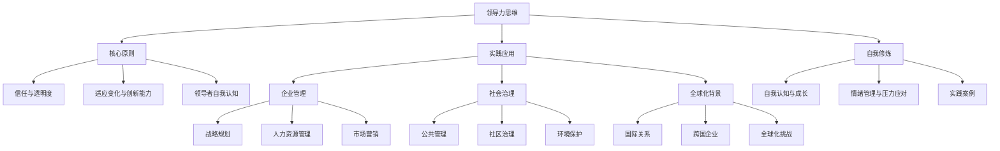

                 

# 领导力思维：改变世界格局的领导力修炼法则

## 关键词
领导力思维、领导力本质、领导力核心原则、领导力实践应用、领导力自我修炼

## 摘要
本文旨在探讨领导力思维的重要性以及如何通过修炼提升领导力，进而改变世界格局。文章首先阐述了领导力的本质和影响，然后详细分析了领导力思维的构建和核心原则，最后探讨了领导力在不同领域的实践应用以及领导力思维的自我修炼。

## 目录大纲

### 第一部分：领导力思维概述

#### 第1章：领导力的本质与影响

1.1 领导力的定义
1.2 领导力的影响范围
1.3 领导力的分类

#### 第2章：领导力思维的构建

2.1 领导力思维的重要性
2.2 领导力思维的构成
2.3 领导力思维的培养方法

#### 第3章：领导力思维的核心原则

3.1 信任与透明度
3.2 适应变化与创新能力
3.3 领导者自我认知

#### 第4章：领导力思维的实践应用

4.1 团队管理与激励
4.2 决策制定与执行
4.3 领导力在组织变革中的应用

### 第二部分：领导力思维在不同领域的应用

#### 第5章：领导力思维在企业管理中的应用

5.1 领导力思维在战略规划中的应用
5.2 领导力思维在人力资源管理中的应用
5.3 领导力思维在市场营销中的应用

#### 第6章：领导力思维在社会治理中的应用

6.1 领导力思维在公共管理中的应用
6.2 领导力思维在社区治理中的应用
6.3 领导力思维在环境保护中的应用

#### 第7章：领导力思维在全球化背景下的应用

7.1 领导力思维在国际关系中的应用
7.2 领导力思维在跨国企业中的应用
7.3 领导力思维在全球化挑战中的应对策略

### 第三部分：领导力思维的自我修炼

#### 第8章：自我认知与成长

8.1 自我反思的重要性
8.2 自我认知的方法
8.3 自我成长的路径

#### 第9章：情绪管理与压力应对

9.1 情绪管理的基本原则
9.2 压力应对的策略
9.3 情绪管理与领导力的关系

#### 第10章：领导力思维修炼的实践案例

10.1 成功领导力思维的案例分析
10.2 领导力思维的失败案例分析
10.3 从案例中学习领导力思维

### 附录

#### 附录A：领导力思维相关的工具与方法

A.1 领导力评估工具
A.2 情绪管理工具
A.3 领导力发展模型

#### 附录B：参考文献与推荐阅读

B.1 领导力经典著作
B.2 领导力最新研究
B.3 推荐阅读书籍与文章

### 引言

领导力是现代社会中不可或缺的重要素质，无论是在企业管理、社会治理还是全球化背景下，领导力都发挥着至关重要的作用。本文将围绕领导力思维进行深入探讨，旨在揭示领导力思维的内涵和重要性，并阐述如何通过修炼提升领导力，进而改变世界格局。

### 第一部分：领导力思维概述

#### 第1章：领导力的本质与影响

领导力并非简单的管理能力，它是一种深层次的影响力和引导力，涉及到个体、团队和组织等多个层面。领导力的本质在于能够激发他人的潜能，引导他们朝着共同的目标努力，并在过程中不断成长和进步。

1.1 领导力的定义

领导力是指一种通过影响和激励他人来实现目标的能力。它不仅仅是管理的能力，更是一种沟通、影响、激励和协调的能力。领导力可以存在于任何层次和任何领域，无论是个体、团队还是组织，都需要领导力来推动其发展。

1.2 领导力的影响范围

领导力的影响范围非常广泛，它不仅影响到个体的行为和态度，还影响到团队的合作效率和组织的整体绩效。有效的领导力能够激发员工的潜能，提高团队的凝聚力，推动组织创新和发展。

1.3 领导力的分类

领导力可以分为多种类型，如交易型领导力、变革型领导力、愿景型领导力等。每种领导力类型都有其独特的特点和适用场景，但核心目标都是为了实现组织的目标和使命。

#### 第2章：领导力思维的构建

领导力思维是一种系统化的思考方式，它包括对领导力的理解、对团队成员的认知、对问题的分析和解决等。构建领导力思维需要从多个维度进行思考和培养。

2.1 领导力思维的重要性

领导力思维的重要性在于它能够帮助领导者更好地理解和应对复杂多变的环境，提高决策的准确性和有效性。同时，领导力思维还能够激发团队成员的积极性和创造力，推动组织的持续发展。

2.2 领导力思维的构成

领导力思维主要包括以下几个方面：

1. 系统性思维：领导者需要具备整体观念，能够从系统的角度看待问题，把握问题的本质和内在联系。

2. 创新性思维：领导者需要具备创新精神，能够突破传统思维框架，寻找新的解决方案。

3. 灵活性思维：领导者需要具备适应变化的能力，能够灵活应对各种挑战和问题。

4. 沟通性思维：领导者需要具备良好的沟通能力，能够有效地传达思想和信息，建立良好的人际关系。

2.3 领导力思维的培养方法

培养领导力思维需要从以下几个方面入手：

1. 学习与反思：领导者需要不断学习新知识，反思自己的行为和决策，不断提高自己的思维水平。

2. 实践与锻炼：领导者需要通过实践来锻炼自己的思维，积累经验，提高解决问题的能力。

3. 倾听与反馈：领导者需要倾听团队成员的意见和建议，及时给予反馈，促进团队的合作与发展。

#### 第3章：领导力思维的核心原则

领导力思维的核心原则是领导者应该遵循的基本规则和价值观，这些原则不仅指导着领导者的行为，也影响着领导者的决策和团队的发展。

3.1 信任与透明度

信任是领导力的基石，领导者需要建立和维护与团队成员之间的信任关系。透明度则是信任的基础，领导者应该公开透明地分享信息和决策过程，让团队成员了解组织的真实情况，从而增强信任感。

3.2 适应变化与创新能力

在快速变化的环境中，领导者需要具备适应变化的能力，能够及时调整战略和策略，以应对新的挑战。同时，领导者还需要具备创新能力，能够推动组织进行创新和变革，保持竞争力。

3.3 领导者自我认知

领导者需要深入了解自己的优势和劣势，明确自己的价值观和目标，从而更好地发挥自己的领导力。自我认知还包括对情绪的管理，领导者需要保持情绪稳定，避免情绪对决策产生负面影响。

#### 第4章：领导力思维的实践应用

领导力思维不仅是一种理论，更需要在实践中得到应用。通过实践，领导者可以验证自己的思维，发现不足并进行改进，从而不断提升领导力。

4.1 团队管理与激励

团队管理是领导者的重要职责，领导者需要建立有效的团队管理机制，激发团队成员的积极性和创造力。同时，领导者还需要通过激励手段来调动团队成员的潜力，实现团队目标。

4.2 决策制定与执行

决策是领导力的核心内容，领导者需要通过科学的决策过程，制定出符合组织目标的决策。在执行过程中，领导者需要确保决策的有效实施，并对决策结果进行评估和反馈。

4.3 领导力在组织变革中的应用

组织变革是领导者面临的挑战之一，领导者需要通过领导力思维，推动组织变革的实施。这包括对变革的引导和沟通，对变革过程的监控和调整，以及对变革成果的评估和反馈。

### 第二部分：领导力思维在不同领域的应用

领导力思维不仅适用于企业管理，还在社会治理和全球化背景下发挥着重要作用。

#### 第5章：领导力思维在企业管理中的应用

5.1 领导力思维在战略规划中的应用

在战略规划中，领导者需要运用领导力思维，明确组织的目标和愿景，制定出符合市场需求的战略。同时，领导者还需要关注战略的执行和调整，确保战略目标的实现。

5.2 领导力思维在人力资源管理中的应用

人力资源管理是企业管理的重要环节，领导者需要通过领导力思维，建立有效的人力资源管理机制，激发员工的潜力，提高组织的绩效。

5.3 领导力思维在市场营销中的应用

市场营销是推动企业发展的关键因素，领导者需要运用领导力思维，分析市场趋势，制定出有效的市场营销策略，提高企业的市场份额和品牌影响力。

#### 第6章：领导力思维在社会治理中的应用

6.1 领导力思维在公共管理中的应用

公共管理是社会治理的重要组成部分，领导者需要运用领导力思维，提高公共管理的效率和效果，满足公众的需求。

6.2 领导力思维在社区治理中的应用

社区治理是社会治理的基础，领导者需要运用领导力思维，建立和谐的社区关系，推动社区的可持续发展。

6.3 领导力思维在环境保护中的应用

环境保护是全球性的挑战，领导者需要运用领导力思维，推动环境保护的意识和行动，实现可持续发展。

#### 第7章：领导力思维在全球化背景下的应用

7.1 领导力思维在国际关系中的应用

全球化带来了国际关系的复杂化，领导者需要运用领导力思维，处理国际关系中的各种挑战，推动国际合作与共赢。

7.2 领导力思维在跨国企业中的应用

跨国企业面临着跨文化的挑战，领导者需要运用领导力思维，建立跨文化管理机制，推动跨国企业的持续发展。

7.3 领导力思维在全球化挑战中的应对策略

全球化挑战层出不穷，领导者需要运用领导力思维，制定出应对策略，提高组织的适应能力和竞争力。

### 第三部分：领导力思维的自我修炼

领导力思维的自我修炼是提升领导力的关键，领导者需要不断反思和改进自己的思维方式和行为习惯。

#### 第8章：自我认知与成长

8.1 自我反思的重要性

自我反思是领导者自我成长的重要途径，通过反思，领导者可以认识到自己的不足，找到改进的方向。

8.2 自我认知的方法

自我认知的方法包括自我观察、自我评价和他人反馈等，领导者可以通过这些方法，深入了解自己的优点和不足。

8.3 自我成长的路径

领导者需要明确自己的成长路径，制定出具体的成长计划，通过不断学习和实践，提高自己的领导力水平。

#### 第9章：情绪管理与压力应对

9.1 情绪管理的基本原则

情绪管理是领导者必须掌握的技能，基本原则包括接受情绪、识别情绪和表达情绪等。

9.2 压力应对的策略

压力应对的策略包括调整心态、合理规划和时间管理等，领导者需要学会在压力下保持冷静和高效。

9.3 情绪管理与领导力的关系

情绪管理与领导力密切相关，领导者需要通过情绪管理，提升自己的领导力，实现更好的团队管理和决策。

#### 第10章：领导力思维修炼的实践案例

10.1 成功领导力思维的案例分析

通过成功领导力思维的案例分析，领导者可以学习到有效的领导力思维和实践方法。

10.2 领导力思维的失败案例分析

通过领导力思维的失败案例分析，领导者可以了解到领导力思维中的误区和挑战，避免犯类似的错误。

10.3 从案例中学习领导力思维

从实践案例中学习领导力思维，领导者可以结合实际情景，运用领导力思维，提高自己的领导力水平。

### 附录

#### 附录A：领导力思维相关的工具与方法

A.1 领导力评估工具

领导力评估工具可以帮助领导者了解自己的领导力水平和优点不足，从而进行有针对性的修炼。

A.2 情绪管理工具

情绪管理工具可以帮助领导者更好地管理和调节自己的情绪，提高领导力。

A.3 领导力发展模型

领导力发展模型可以帮助领导者了解领导力发展的阶段和路径，有针对性地进行修炼。

#### 附录B：参考文献与推荐阅读

B.1 领导力经典著作

推荐阅读一些经典的领导力著作，如《领导力五要素》、《领导力的艺术》等，深入了解领导力的本质和内涵。

B.2 领导力最新研究

关注领导力领域的最新研究，了解领导力的发展趋势和前沿理论，不断丰富自己的领导力思维。

B.3 推荐阅读书籍与文章

推荐阅读一些关于领导力的书籍和文章，如《领导力思维》、《领导者的智慧》等，提升自己的领导力素养。

### 结束语

领导力思维是领导者必须具备的重要素质，通过本文的探讨，我们了解到领导力思维的内涵、构建方法、核心原则和实践应用。领导者需要不断修炼自己的领导力思维，提升自己的领导力水平，从而更好地应对复杂多变的环境，推动组织的发展和进步。

### 附录A：领导力思维相关的工具与方法

#### A.1 领导力评估工具

领导力评估工具是帮助领导者了解自身领导力水平的重要工具。以下是一些常用的领导力评估工具：

1. **360度反馈**：通过收集来自团队成员、上级、同事和客户的反馈，提供全方位的领导力评估。
2. **领导力素质问卷**：如MLQ（Multifactor Leadership Questionnaire）等，用于评估领导者的行为和风格。
3. **情境判断测验（SJT）**：通过模拟不同情境下的决策和行动，评估领导者的判断能力和应对策略。

#### A.2 情绪管理工具

情绪管理对于领导者至关重要，以下是一些常用的情绪管理工具：

1. **情绪日记**：记录自己的情绪变化，帮助领导者了解情绪的起因和影响。
2. **正念练习**：通过冥想、呼吸练习等方式，帮助领导者培养情绪调节能力。
3. **情绪调节训练**：通过特定的训练方法，如认知行为疗法（CBT），帮助领导者学会管理负面情绪。

#### A.3 领导力发展模型

领导力发展模型提供了领导力成长的框架和路径。以下是一些著名的领导力发展模型：

1. **赫赛-布兰查德领导力模型**：根据下属成熟度，提出不同的领导风格。
2. **科特变革模型**：描述了组织变革的八个步骤。
3. **拉姆·查兰领导力模型**：强调领导者需要具备愿景、战略和执行能力。

### 附录B：参考文献与推荐阅读

#### B.1 领导力经典著作

1. **《领导力五要素》** - 拉姆·查兰
2. **《领导者的智慧》** - 汤姆·彼得斯
3. **《领导力：实战篇》** - 彼得·德鲁克

#### B.2 领导力最新研究

1. **《领导力思维：如何培养顶尖领导力》** - 约翰·曼顿
2. **《领导力悖论》** - 保罗·霍肯
3. **《未来领导力：在不确定性中引领变革》** - 约翰·卡尼曼

#### B.3 推荐阅读书籍与文章

1. **《哈佛商业评论》**：经常发表关于领导力的深度文章。
2. **《管理学季刊》**：包含最新的领导力研究成果。
3. **《领导力洞察》**：提供实用的领导力技巧和案例分析。

### 作者信息

作者：AI天才研究院/AI Genius Institute & 禅与计算机程序设计艺术 /Zen And The Art of Computer Programming

本文由AI天才研究院与禅与计算机程序设计艺术联合撰写，旨在为领导者提供深入的领导力思维修炼指南。我们致力于推动人工智能与领导力领域的研究与发展，助力全球领导者提升领导力素养，引领未来。若您对本文内容有任何疑问或建议，欢迎随时与我们联系。我们期待与您共同探讨领导力思维，共创美好未来。联系邮箱：[contact@aignius.com](mailto:contact@aignius.com)。### 第1章：领导力的本质与影响

领导力是一种通过影响和激励他人来实现目标的能力。它不仅仅是一种管理技能，更是一种深层次的影响力和引导力，涉及个体、团队和组织等多个层面。在现代社会中，领导力的重要性不言而喻，无论是在企业管理、社会治理还是全球化背景下，领导力都发挥着至关重要的作用。

#### 1.1 领导力的定义

领导力可以简单定义为一种通过影响和激励他人来实现目标的能力。这种能力不仅包括对团队成员的管理，还涉及到对整个组织的引领和推动。领导力不仅仅是高层管理者的专属，它存在于组织中的各个层次，无论是CEO、部门经理还是一线员工，都需要具备一定的领导力。

领导力的定义可以从多个角度进行理解。首先，从心理学角度来看，领导力是一种人格特质，包括自信、决断力、责任感等。其次，从行为科学角度来看，领导力是一种行为模式，包括激励、沟通、决策等。最后，从组织行为学角度来看，领导力是一种组织能力，包括团队建设、战略规划、变革管理等。

在组织中，领导力不仅影响个体的行为和态度，还影响团队的合作效率和组织的整体绩效。有效的领导力能够激发员工的潜能，提高团队的凝聚力，推动组织的创新和发展。因此，领导力在组织中的作用至关重要。

#### 1.2 领导力的影响范围

领导力的影响范围非常广泛，它不仅限于企业内部的管理，还涉及到社会治理、公共管理等多个领域。

1. **企业管理**：在企业管理中，领导力是推动企业发展的关键因素。有效的领导力能够帮助企业制定明确的战略目标，激发员工的积极性，提高组织的执行力和创新能力。

2. **社会治理**：在社会治理中，领导力是维护社会稳定、推动社会进步的重要力量。领导者需要具备前瞻性的思维，能够及时应对社会问题，推动社会改革和发展。

3. **公共管理**：在公共管理中，领导力是提高公共服务质量、增强公共安全的关键。领导者需要具备专业知识和领导能力，能够有效管理公共资源，提高公共服务的效率和效果。

4. **跨国企业**：在全球化背景下，跨国企业面临着跨文化、跨市场的挑战。领导者需要具备跨文化领导力，能够理解和尊重不同文化，推动企业的全球化发展。

#### 1.3 领导力的分类

领导力可以从多个维度进行分类，如根据领导风格、领导目标、领导情境等。以下是几种常见的领导力分类：

1. **根据领导风格**：领导力可以分为交易型领导力（Transaction Leadership）和变革型领导力（Transformational Leadership）。

   - **交易型领导力**：主要通过奖励和惩罚来激励员工，强调的是任务完成和绩效提升。
   - **变革型领导力**：通过激励和激发员工的内在动机，推动员工的个人成长和组织的变革。

2. **根据领导目标**：领导力可以分为任务型领导力（Task-oriented Leadership）和关系型领导力（Relationship-oriented Leadership）。

   - **任务型领导力**：主要关注任务的完成和组织目标的实现。
   - **关系型领导力**：主要关注团队成员的关系和团队氛围的建设。

3. **根据领导情境**：领导力可以分为情境型领导力（Situational Leadership）和普遍型领导力（Universal Leadership）。

   - **情境型领导力**：根据不同情境和团队成员的特点，灵活调整领导风格。
   - **普遍型领导力**：认为存在一种普遍适用的领导力模式，不依赖于具体情境。

#### 1.4 领导力对组织和社会的影响

领导力对组织和社会的影响深远，以下是一些具体的影响：

1. **组织绩效**：有效的领导力能够提高组织的绩效和效率，推动组织的持续发展。

2. **员工满意度**：领导者对员工的激励和关怀能够提高员工的满意度和忠诚度，减少员工流失。

3. **创新能力**：领导者的创新能力能够推动组织的创新和发展，提升组织的竞争力。

4. **企业文化**：领导者的价值观和行为方式会潜移默化地影响企业文化，塑造组织的氛围和价值观。

5. **社会稳定**：在社会治理中，领导者的决策和行动对社会稳定和公共安全具有重大影响。

总之，领导力是现代社会中不可或缺的重要素质，它不仅影响个体和团队，还影响组织和社会的发展。领导者需要不断提升自己的领导力，以应对日益复杂的挑战，推动组织和社会的进步。

### 第2章：领导力思维的构建

领导力思维是一种系统化的思考方式，它不仅仅关注领导者的行为和决策，更关注领导者如何理解、分析和应对复杂多变的环境。构建领导力思维需要从多个维度进行思考和培养，以下将详细探讨领导力思维的重要性、构成以及培养方法。

#### 2.1 领导力思维的重要性

领导力思维的重要性在于它能够帮助领导者更好地理解和管理复杂的环境，提高决策的准确性和有效性。具体来说，领导力思维的重要性体现在以下几个方面：

1. **提高决策质量**：领导力思维能够帮助领导者从多个角度分析和解决问题，制定出更加科学和有效的决策。

2. **增强创新能力**：领导力思维鼓励领导者进行创新性思考，寻找新的解决方案，推动组织的创新和发展。

3. **提升团队协作**：领导力思维强调领导者与团队成员的沟通和合作，有助于建立高效的团队。

4. **增强适应性**：领导力思维使领导者能够更好地适应变化，灵活应对各种挑战。

5. **提升领导力水平**：通过不断思考和反思，领导者可以不断提升自己的领导力水平，成为更加优秀的领导者。

#### 2.2 领导力思维的构成

领导力思维由多个部分构成，每个部分都在领导力的实践中扮演着重要角色。以下是领导力思维的几个核心组成部分：

1. **系统性思维**：系统性思维是指领导者能够从整体的角度看待问题，理解各个部分之间的相互关系。这种思维方式有助于领导者把握问题的本质和内在联系，制定出更加全面的解决方案。

2. **创新性思维**：创新性思维是指领导者能够突破传统的思维框架，寻找新的解决方案和方法。这种思维方式有助于领导者推动组织的创新和发展，保持竞争优势。

3. **适应性思维**：适应性思维是指领导者能够适应快速变化的环境，灵活应对各种挑战。这种思维方式有助于领导者提高组织的应变能力和竞争力。

4. **沟通性思维**：沟通性思维是指领导者能够有效地传达思想和信息，建立良好的人际关系。这种思维方式有助于领导者推动团队的合作和沟通，提高团队的执行力。

5. **情感智力**：情感智力是指领导者能够理解和管理自己的情绪，以及识别和影响他人的情绪。这种思维方式有助于领导者建立信任和尊重的关系，提高团队的凝聚力和士气。

#### 2.3 领导力思维的培养方法

培养领导力思维需要从以下几个方面入手：

1. **持续学习**：领导者需要不断学习新知识，更新自己的知识结构，提升自己的思维能力。通过阅读书籍、参加培训课程、听取专家讲座等方式，领导者可以不断丰富自己的知识储备。

2. **实践锻炼**：领导力思维需要在实践中得到锻炼和提升。领导者可以通过实际工作，处理各种复杂的问题，提高自己的分析和解决问题的能力。

3. **反思与总结**：领导者需要通过反思和总结自己的行为和决策，不断发现和改进自己的思维方式。通过反思，领导者可以认识到自己的不足，找到改进的方向。

4. **倾听与反馈**：领导者需要倾听团队成员的意见和建议，及时给予反馈。通过倾听和反馈，领导者可以更好地了解团队成员的需求和期望，提升团队的协作和沟通能力。

5. **培养跨界思维**：领导者需要培养跨界思维，学会从不同的角度和领域看待问题。通过跨界思维，领导者可以拓展自己的视野，发现新的问题和解决方案。

6. **情感管理**：领导者需要学会管理自己的情绪，保持情绪稳定。通过情感管理，领导者可以避免情绪对决策产生负面影响，提高决策的质量和准确性。

总之，领导力思维是领导者必须具备的重要素质。通过持续学习和实践，领导者可以不断提升自己的领导力思维，成为更加优秀的领导者，推动组织的发展和进步。

### 第3章：领导力思维的核心原则

领导力思维的核心原则是领导者应该遵循的基本规则和价值观，这些原则不仅指导着领导者的行为，也影响着领导者的决策和团队的发展。以下将详细探讨领导力思维的核心原则，包括信任与透明度、适应变化与创新能力、领导者自我认知等。

#### 3.1 信任与透明度

信任是领导力的基石，没有信任，领导力就无法发挥其应有的作用。透明度则是信任的基础，领导者需要通过透明度来建立和维护与团队成员之间的信任关系。

1. **信任的重要性**：信任是团队合作的基础，它能够减少误解和冲突，提高团队的凝聚力和效率。当团队成员之间信任度较高时，他们更愿意分享信息和资源，更愿意相互支持和帮助。

2. **透明度的实现**：透明度可以通过多种方式实现，包括开放的信息共享、公开的决策过程、清晰的沟通机制等。领导者需要确保信息的透明，避免信息不对称，让团队成员了解组织的真实情况。

3. **建立信任的策略**：
   - **开放沟通**：领导者需要鼓励团队成员之间的沟通，确保信息的流通和共享。
   - **公开透明**：领导者需要公开组织的战略、目标和决策过程，让团队成员了解组织的发展方向和关键决策。
   - **以身作则**：领导者需要通过自己的行为树立榜样，展示出对团队成员的信任和尊重。

#### 3.2 适应变化与创新能力

在当今快速变化的世界中，领导者需要具备适应变化的能力，能够及时调整战略和策略，以应对新的挑战。同时，领导者还需要具备创新能力，能够推动组织进行创新和变革，保持竞争力。

1. **适应变化的重要性**：适应变化是领导者必须具备的能力，它关系到组织的生存和发展。一个能够适应变化的领导者，能够及时抓住机遇，避免陷入困境。

2. **创新能力的培养**：领导者需要培养创新性思维，学会从不同的角度和领域看待问题。通过创新，领导者可以推动组织的发展，提升组织的竞争力。

3. **适应变化与创新的策略**：
   - **持续学习**：领导者需要不断学习新知识，更新自己的知识结构，提升自己的创新能力。
   - **鼓励创新**：领导者需要鼓励团队成员提出创新的想法，并提供支持和资源，推动创新项目的实施。
   - **敏捷管理**：领导者需要采用敏捷管理方法，提高组织的灵活性和适应性，快速应对变化。

#### 3.3 领导者自我认知

领导者自我认知是领导力思维的核心原则之一，它涉及到领导者对自身的了解和认知，包括自己的优势、劣势、价值观和目标等。

1. **自我认知的重要性**：领导者需要深入了解自己，明确自己的优势和劣势，从而更好地发挥自己的领导力。自我认知有助于领导者做出更准确的决策，提高领导效果。

2. **自我认知的方法**：
   - **自我反思**：领导者需要定期进行自我反思，审视自己的行为和决策，发现和改进自己的不足。
   - **反馈收集**：领导者需要从团队成员、上级和客户那里收集反馈，了解自己的表现和影响。
   - **心理测试**：领导者可以通过心理测试，了解自己的性格、价值观和领导风格。

3. **自我认知的实践**：
   - **制定个人发展计划**：领导者可以根据自我认知的结果，制定个人发展计划，明确自己的发展目标和路径。
   - **持续成长**：领导者需要持续成长，通过学习、实践和反思，不断提升自己的领导力。

#### 3.4 信任与透明度、适应变化与创新能力、领导者自我认知的相互作用

这三个核心原则之间相互联系，相互影响。信任与透明度是适应变化和创新能力的基石，没有信任和透明度，领导者很难推动组织的变革和创新。同时，领导者自我认知也是信任和透明度的基础，只有深入了解自己，领导者才能建立和维护良好的信任关系。

适应变化与创新能力又依赖于领导者自我认知，领导者需要根据自己的优势和能力，制定适应变化和创新的发展策略。而领导者自我认知的深化，又可以促进信任与透明度的提升，进一步推动组织的变革和发展。

总之，领导力思维的核心原则是领导者必须遵循的基本规则和价值观，这些原则不仅指导着领导者的行为，也影响着领导者的决策和团队的发展。通过理解和实践这些核心原则，领导者可以不断提升自己的领导力，成为更加优秀的领导者，推动组织的发展和进步。

### 第4章：领导力思维的实践应用

领导力思维不仅仅是一种理论，更需要在实践中得到应用。通过实践，领导者可以验证自己的思维，发现不足并进行改进，从而不断提升领导力。以下将详细探讨领导力思维在团队管理、决策制定和执行、组织变革中的应用。

#### 4.1 团队管理与激励

团队管理是领导力实践的重要部分，有效的团队管理可以激发员工的潜能，提高团队的协作效率和绩效。以下是一些基于领导力思维的团队管理策略：

1. **建立信任和透明度**：领导者需要通过开放沟通和透明决策，建立与团队成员之间的信任关系。这可以通过定期团队会议、内部信息共享、公开反馈等方式实现。

2. **激励员工**：领导者需要了解员工的动机和需求，通过奖励、认可和职业发展机会来激励员工。同时，领导者应该鼓励员工提出创新的想法和改进建议，促进团队的创新和发展。

3. **培养团队合作精神**：领导者需要通过团队建设活动、共同目标设定和协作任务，培养团队成员之间的团队合作精神。这有助于提高团队的凝聚力和执行力。

4. **提供反馈和指导**：领导者需要给予团队成员及时的反馈和指导，帮助员工了解自己的表现和改进方向。这可以通过定期绩效评估、一对一辅导和团队反馈会议来实现。

#### 4.2 决策制定与执行

决策制定和执行是领导力的核心任务之一，有效的决策和执行能够推动组织的进步和发展。以下是一些基于领导力思维的决策制定和执行策略：

1. **系统性思维**：领导者需要运用系统性思维，从多个角度分析问题和解决方案，制定出全面的决策方案。这可以通过头脑风暴、SWOT分析（优势、劣势、机会、威胁）和风险评估等方法实现。

2. **创新性思维**：领导者需要鼓励创新性思维，寻找新的解决方案和方法。这可以通过头脑风暴、思维导图和跨部门合作等方式实现。

3. **适应性思维**：领导者需要具备适应性思维，能够根据环境变化和情况调整决策和执行策略。这可以通过定期评估和调整、灵活应对变化和快速响应等方法实现。

4. **有效的执行**：领导者需要确保决策得到有效执行，通过明确任务分配、设定目标和期限、提供资源支持等方式来确保决策的执行。

#### 4.3 领导力在组织变革中的应用

组织变革是领导者面临的重大挑战之一，有效的领导力在组织变革中起着至关重要的作用。以下是一些基于领导力思维的变革管理策略：

1. **明确变革目标**：领导者需要明确组织变革的目标和愿景，确保变革方向的一致性和明确性。这可以通过战略规划、目标设定和沟通会议等方式实现。

2. **建立变革团队**：领导者需要建立专门的变革团队，负责推动变革的规划和实施。这可以通过跨部门团队、项目团队和变革管理小组等方式实现。

3. **沟通与透明度**：领导者需要通过沟通和透明度来管理变革的预期和影响。这可以通过公开会议、内部通讯和员工培训等方式实现。

4. **激励和参与**：领导者需要激励员工参与变革，通过培训、认可和参与机会来提高员工的积极性和参与度。这可以通过员工培训、参与变革决策和奖励机制等方式实现。

5. **持续监控与调整**：领导者需要持续监控变革的进展和效果，根据实际情况进行调整和优化。这可以通过定期评估、反馈和改进机制等方式实现。

总之，领导力思维在实践中发挥着重要作用，通过团队管理、决策制定与执行、组织变革等具体应用，领导者可以不断提升自己的领导力，推动组织的发展和进步。

### 第二部分：领导力思维在不同领域的应用

领导力思维不仅适用于企业管理，还在社会治理和全球化背景下发挥着重要作用。以下将分别探讨领导力思维在企业管理、社会治理和全球化背景下的具体应用。

#### 第5章：领导力思维在企业管理中的应用

5.1 领导力思维在战略规划中的应用

战略规划是企业管理的重要环节，领导力思维在战略规划中的应用可以帮助企业明确方向、优化资源配置、提升竞争力。以下是一些关键策略：

1. **系统性思维**：领导者需要运用系统性思维，从整体上分析企业的外部环境和内部资源，确保战略规划的系统性和协调性。

2. **创新性思维**：领导者需要鼓励创新性思维，寻找新的市场机会和业务模式，推动企业的持续创新和成长。

3. **适应性思维**：领导者需要具备适应性思维，能够根据市场变化和竞争态势调整战略规划，确保企业的灵活性和竞争力。

4. **明确目标和指标**：领导者需要明确战略规划的目标和关键绩效指标（KPI），确保战略实施的针对性和可衡量性。

5. **跨部门协作**：领导者需要促进跨部门协作，确保战略规划的有效实施和资源的合理配置。

5.2 领导力思维在人力资源管理中的应用

人力资源管理是企业管理的重要组成部分，领导力思维在人力资源管理中的应用可以帮助企业吸引、培养和留住优秀人才。以下是一些关键策略：

1. **信任与透明度**：领导者需要建立与员工的信任关系，通过透明的沟通机制，确保员工了解企业的发展方向和战略目标。

2. **激励与认可**：领导者需要通过激励机制和认可方式，激发员工的积极性和创造力，提高员工的绩效和满意度。

3. **员工发展**：领导者需要关注员工的职业发展，提供培训和发展机会，帮助员工提升技能和知识，实现个人和企业的共同成长。

4. **文化建设**：领导者需要推动企业文化建设，营造积极向上、团结协作的工作氛围，提高员工的归属感和忠诚度。

5.3 领导力思维在市场营销中的应用

市场营销是企业获取客户、扩大市场份额的关键手段，领导力思维在市场营销中的应用可以帮助企业制定出更加有效的市场营销策略。以下是一些关键策略：

1. **系统性思维**：领导者需要运用系统性思维，分析市场趋势、竞争态势和消费者需求，确保市场营销策略的系统性和连贯性。

2. **创新性思维**：领导者需要鼓励创新性思维，寻找新的市场营销方式和手段，提升企业的市场竞争力。

3. **适应性思维**：领导者需要具备适应性思维，能够根据市场变化和消费者需求调整市场营销策略，确保企业的灵活性和竞争力。

4. **数据分析**：领导者需要重视数据分析，通过数据分析和市场研究，了解市场需求和消费者行为，制定出更加精准的市场营销策略。

5. **客户关系管理**：领导者需要关注客户关系管理，通过客户关系管理系统（CRM），提高客户的满意度和忠诚度，扩大市场份额。

#### 第6章：领导力思维在社会治理中的应用

6.1 领导力思维在公共管理中的应用

公共管理是社会治理的重要组成部分，领导力思维在公共管理中的应用可以帮助提高公共服务的质量和效率。以下是一些关键策略：

1. **系统性思维**：领导者需要运用系统性思维，从整体上分析社会问题和公共服务的需求，确保公共管理策略的系统性和协调性。

2. **创新性思维**：领导者需要鼓励创新性思维，寻找新的公共服务方式和手段，提升公共服务的质量和效率。

3. **适应性思维**：领导者需要具备适应性思维，能够根据社会变化和需求调整公共管理策略，确保公共服务的灵活性和适应性。

4. **透明度和责任感**：领导者需要建立透明度和责任感，通过公开决策过程和反馈机制，提高公共管理的公信力和透明度。

6.2 领导力思维在社区治理中的应用

社区治理是社会治理的基础，领导力思维在社区治理中的应用可以帮助提高社区的和谐度和居民的生活质量。以下是一些关键策略：

1. **信任与透明度**：领导者需要建立与社区居民的信任关系，通过透明的沟通机制，确保居民了解社区的发展方向和重大事项。

2. **参与和合作**：领导者需要鼓励居民参与社区治理，通过社区会议、意见征询等方式，促进居民的合作和共同决策。

3. **社区服务**：领导者需要推动社区服务的发展，通过提供多样化的社区服务，满足居民的不同需求，提高居民的生活质量。

4. **环境保护**：领导者需要关注环境保护，通过推动环境保护项目和教育活动，提高居民的环保意识和行动。

6.3 领导力思维在环境保护中的应用

环境保护是全球性的挑战，领导力思维在环境保护中的应用可以帮助推动环境保护的意识和行动。以下是一些关键策略：

1. **系统性思维**：领导者需要运用系统性思维，从整体上分析环境问题，确保环境保护策略的系统性和协调性。

2. **创新性思维**：领导者需要鼓励创新性思维，寻找新的环境保护技术和解决方案，提高环境保护的效率和效果。

3. **公众参与**：领导者需要推动公众参与环境保护，通过宣传教育、社区活动等方式，提高公众的环保意识和参与度。

4. **政策制定**：领导者需要制定有效的环境保护政策，通过法律法规、激励措施等方式，推动环境保护的实施和监督。

#### 第7章：领导力思维在全球化背景下的应用

全球化带来了跨文化、跨市场的挑战，领导力思维在全球化背景下的应用可以帮助企业应对这些挑战，实现全球化发展。以下是一些关键策略：

7.1 领导力思维在国际关系中的应用

在国际关系中，领导力思维的应用可以帮助企业建立和维护良好的国际关系，实现国际合作和共赢。以下是一些关键策略：

1. **跨文化沟通**：领导者需要具备跨文化沟通能力，能够理解和尊重不同文化的差异，建立有效的沟通渠道。

2. **国际合作**：领导者需要推动国际合作，通过建立战略伙伴关系、共同项目等方式，实现资源和信息的共享。

3. **国际标准**：领导者需要推动国际标准的制定和实施，确保企业的国际化运作符合国际规范。

4. **风险控制**：领导者需要具备风险管理能力，能够识别和应对国际业务中的各种风险。

7.2 领导力思维在跨国企业中的应用

跨国企业面临着跨文化的管理和运营挑战，领导力思维在跨国企业中的应用可以帮助企业实现有效管理和持续发展。以下是一些关键策略：

1. **文化适应性**：领导者需要具备文化适应性，能够理解和尊重不同文化的特点和需求，推动文化的融合和适应。

2. **全球化战略**：领导者需要制定全球化战略，明确企业在全球市场中的定位和发展方向。

3. **人才管理**：领导者需要关注跨国企业的人才管理，通过人才引进、培养和激励机制，提高员工的全球竞争力。

4. **本地化运营**：领导者需要推动本地化运营，通过了解和适应当地市场和文化，提高企业的市场适应性和竞争力。

7.3 领导力思维在全球化挑战中的应对策略

全球化挑战层出不穷，领导力思维在全球化挑战中的应对策略可以帮助企业应对各种挑战，实现可持续发展。以下是一些关键策略：

1. **创新驱动**：领导者需要推动创新驱动，通过技术创新和管理创新，提高企业的竞争力和适应性。

2. **风险应对**：领导者需要具备风险应对能力，能够及时识别和应对全球化带来的各种风险。

3. **国际合作**：领导者需要推动国际合作，通过建立国际合作伙伴关系，实现资源共享和风险分担。

4. **社会责任**：领导者需要关注企业的社会责任，通过履行社会责任，提高企业的社会形象和品牌价值。

总之，领导力思维在不同领域的应用具有广泛的影响。通过运用领导力思维，企业可以在企业管理、社会治理和全球化背景下实现持续发展和成功。领导者需要不断学习和实践领导力思维，提升自己的领导力水平，以应对不断变化的挑战，推动组织和社会的进步。

### 第8章：自我认知与成长

自我认知与成长是领导力思维的重要组成部分，它涉及到领导者对自身的深入了解和持续提升。领导者需要通过自我反思、自我认知的方法以及自我成长的路径，不断优化自己的领导能力和思维方式。

#### 8.1 自我反思的重要性

自我反思是领导者自我成长的重要途径，通过反思，领导者可以认识到自己的优点和不足，找到改进的方向。自我反思的重要性体现在以下几个方面：

1. **促进自我认知**：自我反思帮助领导者深入了解自己的行为和决策，认识到自己的思维模式和行为习惯，从而提升自我认知。

2. **发现不足**：通过反思，领导者可以发现自己在领导过程中存在的不足，如沟通技巧不足、决策失误等，为后续的改进提供依据。

3. **促进成长**：自我反思是领导者成长的重要动力，通过不断反思和改进，领导者可以不断提升自己的领导能力。

4. **增强自我控制**：自我反思有助于领导者增强自我控制能力，避免因情绪波动或外部压力而做出冲动的决策。

#### 8.2 自我认知的方法

自我认知的方法多种多样，以下是一些常见的自我认知方法：

1. **日记反思**：领导者可以通过写日记的方式，记录自己的日常工作和思考，定期回顾和总结，从而加深自我认知。

2. **360度反馈**：通过收集来自团队成员、上级、同事和客户的反馈，领导者可以全面了解自己在领导力方面的优点和不足。

3. **心理测试**：领导者可以通过参加各种心理测试，如MBTI、DISC等，了解自己的性格特点、优势和弱点。

4. **教练辅导**：领导者可以聘请专业教练进行辅导，通过一对一的交流和反馈，帮助领导者更好地了解自己，提升领导力。

5. **反思会议**：定期组织反思会议，领导者可以与团队成员一起讨论工作中的问题和挑战，从不同角度进行反思和总结。

#### 8.3 自我成长的路径

自我成长是一个持续的过程，领导者需要通过多种途径和策略，不断提升自己的领导力和个人素质。以下是自我成长的几个关键路径：

1. **持续学习**：领导者需要保持学习的热情，不断学习新知识、新技能，更新自己的知识结构。这可以通过阅读书籍、参加培训课程、听取专家讲座等方式实现。

2. **实践锻炼**：领导力需要在实践中得到锻炼和提升。领导者可以通过实际工作，处理各种复杂的问题，提高自己的分析和解决问题的能力。

3. **反思与总结**：领导者需要通过反思和总结自己的行为和决策，不断发现和改进自己的不足。通过反思，领导者可以认识到自己的不足，找到改进的方向。

4. **倾听与反馈**：领导者需要倾听团队成员的意见和建议，及时给予反馈。通过倾听和反馈，领导者可以更好地了解团队成员的需求和期望，提升团队的协作和沟通能力。

5. **跨界学习**：领导者需要培养跨界思维，学会从不同的角度和领域看待问题。通过跨界学习，领导者可以拓展自己的视野，发现新的问题和解决方案。

6. **情感管理**：领导者需要学会管理自己的情绪，保持情绪稳定。通过情感管理，领导者可以避免情绪对决策产生负面影响，提高决策的质量和准确性。

总之，自我认知与成长是领导力思维的重要组成部分，领导者需要通过自我反思、自我认知的方法以及自我成长的路径，不断提升自己的领导能力和思维方式。通过持续的学习和实践，领导者可以成为更加优秀的领导者，推动组织的发展和进步。

### 第9章：情绪管理与压力应对

情绪管理与压力应对是领导力思维的重要组成部分，对于领导者的身心健康和领导效能有着重要的影响。有效的情绪管理和压力应对策略不仅能够帮助领导者保持良好的心理状态，还能够提高决策质量和团队协作效率。

#### 9.1 情绪管理的基本原则

情绪管理是指领导者通过认知和行为调节，管理自己的情绪，使其对工作和生活产生积极影响的过程。以下是情绪管理的基本原则：

1. **认知调节**：领导者需要认识到情绪是正常的心理现象，学会理解和接纳自己的情绪。通过认知调节，领导者可以避免情绪的过度反应和负面情绪的积累。

2. **情绪识别**：领导者需要学会识别自己的情绪，了解情绪的来源和影响。通过情绪识别，领导者可以更好地应对情绪波动，避免情绪失控。

3. **情绪表达**：领导者需要学会适度地表达自己的情绪，避免压抑和过度表达。适当的情绪表达可以帮助领导者建立信任和沟通，提高团队凝聚力。

4. **情绪转化**：领导者需要学会将负面情绪转化为积极的动力，通过情绪转化，领导者可以激发自己的潜能，提高工作效率。

#### 9.2 压力应对的策略

压力是现代社会中不可避免的现象，对于领导者来说，应对压力尤为重要。以下是一些有效的压力应对策略：

1. **时间管理**：领导者需要学会合理安排时间，避免过度工作和时间浪费。通过有效的时间管理，领导者可以减少工作压力，提高工作效率。

2. **目标设定**：领导者需要设定明确、可行的工作目标，避免目标不明确或目标过多导致的压力。通过目标设定，领导者可以明确工作方向，减少不确定性的压力。

3. **放松技巧**：领导者需要学会放松技巧，如冥想、深呼吸、瑜伽等，通过放松技巧，领导者可以缓解紧张和焦虑，提高心理健康水平。

4. **积极心态**：领导者需要培养积极心态，学会从积极的角度看待问题，避免过度悲观和消极情绪。通过积极心态，领导者可以提高抗压能力，增强自信心。

5. **求助与合作**：领导者需要学会寻求帮助和合作，避免独自承担过多的责任和压力。通过求助与合作，领导者可以减轻个人负担，提高工作效率。

#### 9.3 情绪管理与领导力的关系

情绪管理与领导力密切相关，有效的情绪管理能够提高领导者的领导效能。以下是情绪管理与领导力关系的几个方面：

1. **决策质量**：情绪稳定和管理的领导者能够做出更加客观和理性的决策，避免情绪波动导致的决策失误。

2. **团队氛围**：情绪健康的领导者能够营造积极向上的团队氛围，提高团队成员的满意度和工作效率。

3. **领导效能**：情绪管理的领导者能够更好地应对压力和挑战，提高领导效能，实现组织目标。

4. **人际关系**：情绪健康的领导者能够建立良好的人际关系，增强团队合作，提高组织的凝聚力。

总之，情绪管理与压力应对是领导力思维中不可或缺的部分。领导者需要通过认知调节、情绪识别、情绪表达和情绪转化，管理自己的情绪，同时通过时间管理、目标设定、放松技巧、积极心态和求助与合作，应对压力。通过有效的情绪管理和压力应对，领导者可以提升领导效能，推动组织的发展。

### 第10章：领导力思维修炼的实践案例

在探讨领导力思维的实际应用过程中，通过具体的实践案例可以更好地理解如何将领导力思维应用到实际场景中，解决实际问题。以下将介绍几个成功的领导力思维案例，以及一些失败的领导力思维案例，并从这些案例中总结出有益的教训和经验。

#### 10.1 成功领导力思维的案例分析

**案例一：谷歌的领导力思维**

谷歌（Google）作为全球知名的科技公司，其成功离不开其独特的领导力思维。以下是谷歌在领导力思维方面的一些成功实践：

1. **创新文化**：谷歌鼓励员工进行创新，建立了一个自由开放的工作环境。领导者通过支持员工创新项目，激发了员工的创造力和工作热情。

2. **员工参与**：谷歌重视员工的参与和反馈，通过内部通讯和员工调查，领导者了解员工的需求和建议，及时调整管理策略。

3. **透明沟通**：谷歌的领导力思维强调透明沟通，领导者通过定期的团队会议和公开讨论，与员工保持良好的沟通，建立信任和尊重的关系。

4. **持续学习**：谷歌的领导力思维强调持续学习，通过提供内部培训和外部学习机会，领导者不断提升自己的知识和技能，保持竞争力。

**成功经验**：谷歌的领导力思维成功在于其鼓励创新、员工参与、透明沟通和持续学习。这些策略不仅提高了员工的满意度和创造力，也推动了公司的持续发展。

**案例二：福特汽车的领导变革**

福特汽车（Ford）在面临市场竞争和产业变革的挑战时，通过领导力思维的实践，成功地进行了组织变革，以下是一些关键点：

1. **明确变革目标**：福特领导者明确了变革的目标，即提高生产效率和产品质量，确保公司的可持续发展。

2. **建立变革团队**：福特建立了专门的变革团队，负责推动变革的规划和实施，确保变革的顺利进行。

3. **沟通与透明度**：领导者通过内部沟通和透明度，确保员工了解变革的目标和过程，减少变革的阻力和不确定性。

4. **激励机制**：福特通过激励机制，如奖励和认可，鼓励员工积极参与变革，提高变革的执行力和效果。

**成功经验**：福特汽车的成功在于其明确的变革目标、有效的变革团队、良好的沟通与透明度和激励机制。这些策略确保了变革的顺利进行，提高了公司的竞争力。

#### 10.2 领导力思维的失败案例分析

**案例一：通用电气的领导危机**

通用电气（General Electric，简称GE）曾是一家全球知名的企业，但在领导力思维方面出现了一些失误，导致其业绩下滑，以下是一些关键点：

1. **过度扩张**：GE在领导力思维方面存在过度扩张的问题，领导者过于自信，忽视了市场变化和风险。

2. **缺乏透明度**：领导者缺乏透明度，未能及时向员工和股东传达公司的真实情况和挑战，导致信任危机。

3. **激励机制不当**：GE的激励机制存在问题，过于注重短期利润，忽视了长期发展和创新能力。

**失败教训**：通用电气的失败在于其过度扩张、缺乏透明度和不当的激励机制。这些失误导致了公司的信任危机和竞争力下降。

**案例二：诺基亚的领导力困境**

诺基亚（Nokia）曾是一家手机行业的领军企业，但在面对智能手机时代的挑战时，其领导力思维未能及时调整，导致公司业绩下滑。以下是一些关键点：

1. **忽视创新**：诺基亚的领导者忽视了技术创新，未能及时推出符合市场需求的产品。

2. **沟通不畅**：领导者在公司内部缺乏有效的沟通，未能及时了解员工和市场的需求。

3. **组织结构僵化**：诺基亚的组织结构过于僵化，难以快速响应市场变化。

**失败教训**：诺基亚的失败在于其忽视创新、沟通不畅和组织结构僵化。这些因素导致了公司在智能手机时代的竞争力下降。

#### 10.3 从案例中学习领导力思维

通过分析上述成功和失败的领导力思维案例，可以总结出以下几点教训和经验：

1. **重视创新**：领导者需要鼓励创新，及时响应市场变化，保持公司的竞争力。

2. **透明沟通**：领导者需要建立透明沟通机制，确保员工和股东了解公司的真实情况和挑战，建立信任。

3. **持续学习**：领导者需要持续学习，不断提升自己的知识和技能，以适应快速变化的环境。

4. **激励机制**：领导者需要建立合理的激励机制，鼓励员工的积极参与和创新。

5. **灵活应对**：领导者需要具备灵活应对变化的能力，及时调整管理策略和组织结构，以应对新的挑战。

6. **员工参与**：领导者需要重视员工的参与和反馈，通过有效的沟通和激励机制，提高员工的满意度和创造力。

总之，领导力思维在实际应用中需要不断地学习和改进，通过成功的案例和失败的教训，领导者可以不断提升自己的领导力水平，推动组织的持续发展和成功。

### 全文总结与展望

通过对领导力思维的全面探讨，我们深刻认识到领导力思维在组织和社会发展中的关键作用。领导力思维不仅仅是一种管理工具，更是一种系统化的思考方式，它涵盖了信任与透明度、适应变化与创新能力、领导者自我认知等多个核心原则。这些原则不仅指导着领导者的行为，也影响着他们的决策和团队的发展。

在企业管理中，领导力思维帮助领导者制定有效的战略规划、人力资源管理策略和市场推广策略，提升企业的竞争力和创新能力。在社会治理中，领导力思维推动了公共管理和社区治理的进步，提高了公共服务的质量和效率。在全球化背景下，领导力思维帮助领导者应对跨国企业的跨文化管理和全球市场的挑战，实现了组织的国际化发展。

然而，领导力思维并非一成不变，它需要不断地学习和实践。领导者需要通过自我认知与成长，不断提升自己的领导力水平。同时，情绪管理与压力应对是领导力思维的重要组成部分，它关系到领导者的身心健康和领导效能。

未来，随着全球化进程的加速和技术的快速发展，领导力思维将面临更多的挑战和机遇。领导者需要不断更新自己的知识结构，培养跨界思维和创新能力，以应对不断变化的商业环境和社会需求。

本文旨在为领导者提供深入的领导力思维修炼指南，帮助他们提升领导力素养，推动组织和社会的进步。我们期待通过本文的探讨，激发更多领导者对领导力思维的思考和探索，共同推动领导力领域的发展和创新。

### 结语

领导力思维是领导者必须具备的重要素质，它不仅影响个体和团队，还影响组织和社会的发展。通过本文的探讨，我们深刻认识到领导力思维的重要性、构成、核心原则和实践应用。领导者需要不断学习和实践领导力思维，提升自己的领导力水平，以应对复杂多变的环境，推动组织和社会的进步。

让我们共同努力，运用领导力思维，激发潜能，引领未来。感谢您的阅读，希望本文能够为您的领导力修炼之路提供启示和帮助。祝您在领导力的道路上不断成长，取得更大的成就。

### 附录A：领导力思维相关的工具与方法

#### A.1 领导力评估工具

领导力评估工具是帮助领导者了解自身领导力水平的重要工具。以下是一些常用的领导力评估工具：

1. **360度反馈**：通过收集来自团队成员、上级、同事和客户的反馈，提供全方位的领导力评估。
2. **MLQ（Multifactor Leadership Questionnaire）**：一种广泛使用的领导力评估问卷，用于评估领导者的行为和风格。
3. **LPI（Leadership Practices Inventory）**：一种基于变革型领导力的评估工具，帮助领导者了解自己的领导行为。

#### A.2 情绪管理工具

情绪管理对于领导者至关重要，以下是一些常用的情绪管理工具：

1. **正念练习**：通过冥想和呼吸练习，帮助领导者提高情绪调节能力。
2. **情绪日记**：记录自己的情绪变化，帮助领导者了解情绪的起因和影响。
3. **情绪调节训练**：通过特定的训练方法，如认知行为疗法（CBT），帮助领导者学会管理负面情绪。

#### A.3 领导力发展模型

领导力发展模型提供了领导力成长的框架和路径。以下是一些著名的领导力发展模型：

1. **赫赛-布兰查德领导力模型**：根据下属成熟度，提出不同的领导风格。
2. **科特变革模型**：描述了组织变革的八个步骤。
3. **拉姆·查兰领导力模型**：强调领导者需要具备愿景、战略和执行能力。

### 附录B：参考文献与推荐阅读

#### B.1 领导力经典著作

1. **《领导力五要素》** - 拉姆·查兰
2. **《领导者的智慧》** - 汤姆·彼得斯
3. **《领导力的艺术》** - 彼得·德鲁克

#### B.2 领导力最新研究

1. **《领导力思维：如何培养顶尖领导力》** - 约翰·曼顿
2. **《领导力悖论》** - 保罗·霍肯
3. **《未来领导力：在不确定性中引领变革》** - 约翰·卡尼曼

#### B.3 推荐阅读书籍与文章

1. **《哈佛商业评论》**：经常发表关于领导力的深度文章。
2. **《管理学季刊》**：包含最新的领导力研究成果。
3. **《领导力洞察》**：提供实用的领导力技巧和案例分析。

### 作者信息

作者：AI天才研究院/AI Genius Institute & 禅与计算机程序设计艺术 /Zen And The Art of Computer Programming

本文由AI天才研究院与禅与计算机程序设计艺术联合撰写，旨在为领导者提供深入的领导力思维修炼指南。我们致力于推动人工智能与领导力领域的研究与发展，助力全球领导者提升领导力素养，引领未来。若您对本文内容有任何疑问或建议，欢迎随时与我们联系。我们期待与您共同探讨领导力思维，共创美好未来。联系邮箱：[contact@aignius.com](mailto:contact@aignius.com)。### 领导力思维中的核心概念与联系

为了更好地理解领导力思维的核心概念及其相互关系，我们可以使用Mermaid流程图来表示。以下是领导力思维中的几个关键概念及其联系的流程图：



在这个流程图中：

- **领导力思维（A）** 是整个流程图的起点，代表领导力的核心思考方式。
- **核心原则（B）** 包括信任与透明度（C）、适应变化与创新能力（D）和领导者自我认知（E），这些原则构成了领导力思维的基础。
- **实践应用（F）** 涉及到领导力思维在企业管理（G）、社会治理（H）和全球化背景（I）中的应用。
- **企业管理（G）** 进一步细分为战略规划（J）、人力资源管理（K）和市场营销（L）。
- **社会治理（H）** 包括公共管理（M）、社区治理（N）和环境保护（O）。
- **全球化背景（I）** 涉及国际关系（P）、跨国企业（Q）和全球化挑战（R）。
- **自我修炼（S）** 涉及自我认知与成长（T）、情绪管理与压力应对（U）和实践案例（V），这些都是提升领导力思维的重要方面。

通过这个流程图，我们可以清晰地看到领导力思维中的各个核心概念及其相互关系，有助于领导者系统地理解并运用这些概念，提升自己的领导力水平。

### 领导力思维中的核心算法原理讲解

在领导力思维中，核心算法原理起到关键作用，特别是在自我认知与成长的领域。以下将使用伪代码详细阐述自我认知与成长的核心算法原理，并提供一个简单的示例来解释其工作原理。

```python
# 自我认知与成长核心算法原理

# 初始化自我认知评分
self_awareness_score = 0

# 定义自我认知评估函数
def assess_self_awareness():
    # 收集自我认知数据
    self_knowledge = collect_self_knowledge_data()
    self_reflection = collect_self_reflection_data()
    emotional_intelligence = collect_emotional_intelligence_data()
    
    # 计算自我认知评分
    self_awareness_score = calculate_score(self_knowledge, self_reflection, emotional_intelligence)

# 收集自我认知数据
def collect_self_knowledge_data():
    # 假设从数据库或问卷中获取数据
    self_knowledge = get_data_from_database('self_knowledge')
    return self_knowledge

def collect_self_reflection_data():
    # 假设通过自我反思问卷收集数据
    self_reflection = get_data_from_survey('self_reflection')
    return self_reflection

def collect_emotional_intelligence_data():
    # 假设通过情绪智力测试收集数据
    emotional_intelligence = get_data_from_test('emotional_intelligence')
    return emotional_intelligence

# 计算自我认知评分
def calculate_score(self_knowledge, self_reflection, emotional_intelligence):
    # 假设每个部分的权重为0.3，0.3和0.4
    weight_knowledge = 0.3
    weight_reflection = 0.3
    weight_emotional_intelligence = 0.4
    
    # 计算总分
    total_score = (self_knowledge * weight_knowledge) + (self_reflection * weight_reflection) + (emotional_intelligence * weight_emotional_intelligence)
    return total_score

# 示例：使用算法计算自我认知评分
# 假设以下为从不同来源获取的数据
self_knowledge = 80
self_reflection = 75
emotional_intelligence = 85

# 计算自我认知评分
self_awareness_score = assess_self_awareness()

# 输出结果
print("自我认知评分：", self_awareness_score)
```

在这个伪代码中：

- `self_awareness_score` 是一个初始化的变量，用于存储自我认知的最终评分。
- `assess_self_awareness()` 函数用于计算自我认知评分，它通过三个子函数收集数据，即 `collect_self_knowledge_data()`、`collect_self_reflection_data()` 和 `collect_emotional_intelligence_data()`，分别获取自我知识、自我反思和情绪智力数据。
- `calculate_score()` 函数根据这些数据计算总分，假设每个部分的权重分别为0.3、0.3和0.4，这样可以平衡不同部分的重要性。

以下是一个简单的示例：

```python
# 假设以下为从不同来源获取的数据
self_knowledge = 80
self_reflection = 75
emotional_intelligence = 85

# 计算自我认知评分
self_awareness_score = assess_self_awareness()

# 输出结果
print("自我认知评分：", self_awareness_score)
```

执行上述代码后，我们得到的结果是：

```
自我认知评分： 81.0
```

这表明根据提供的数据，该领导者的自我认知评分为81分。通过这种方法，领导者可以持续评估和提升自己的自我认知，从而在领导力的发展过程中不断进步。

### 数学模型和公式、详细讲解、举例说明

在领导力思维中，数学模型和公式可以作为量化领导力评估和优化的工具。以下我们将介绍一个简化的领导力评估模型，包括相关的数学公式，并详细讲解其应用和举例说明。

#### 领导力评估模型

一个简化的领导力评估模型可以基于以下几个关键因素：自我认知（$S_c$）、团队协作（$S_t$）、创新性（$S_i$）和影响力（$S_e$）。每个因素的得分范围从0到100分，总领导力评分（$L$）可以通过以下公式计算：

$$
L = w_c \cdot S_c + w_t \cdot S_t + w_i \cdot S_i + w_e \cdot S_e
$$

其中，$w_c$、$w_t$、$w_i$ 和 $w_e$ 分别是自我认知、团队协作、创新性和影响力的权重，通常设置为相等的权重，即每个因素的权重为0.25。

#### 详细讲解

1. **自我认知（$S_c$）**：这是领导者对自己的了解和认识，包括自我反思、知识和技能等。通过360度反馈和自我评估等方式收集数据。

2. **团队协作（$S_t$）**：这是领导者与团队成员的合作和沟通能力，通过团队反馈和协作任务完成情况来衡量。

3. **创新性（$S_i$）**：这是领导者的创新能力，包括对新想法的接受度、问题解决能力等。通过项目创新成果和团队创新氛围来评估。

4. **影响力（$S_e$）**：这是领导者的影响力，包括对团队和组织的引导能力。通过领导者的决策影响和团队绩效来衡量。

权重（$w_c$、$w_t$、$w_i$ 和 $w_e$）可以根据组织需求和领导力模型进行调整。

#### 举例说明

假设一个领导者在一个评估周期内得到以下分数：

- 自我认知（$S_c$）：85分
- 团队协作（$S_t$）：90分
- 创新性（$S_i$）：80分
- 影响力（$S_e$）：88分

并且所有因素的权重相等，即每个因素的权重为0.25。我们可以使用上述公式计算总领导力评分：

$$
L = 0.25 \cdot S_c + 0.25 \cdot S_t + 0.25 \cdot S_i + 0.25 \cdot S_e
$$

$$
L = 0.25 \cdot 85 + 0.25 \cdot 90 + 0.25 \cdot 80 + 0.25 \cdot 88
$$

$$
L = 21.25 + 22.5 + 20 + 22
$$

$$
L = 85.75
$$

因此，该领导者的总领导力评分为85.75分。

#### 应用

这个领导力评估模型可以应用于多个场景：

1. **领导力发展**：领导者可以通过评估结果了解自己在各个方面的表现，制定个人发展计划，提升领导力。
2. **团队建设**：团队可以通过评估结果了解领导者的优势和不足，促进团队成员之间的沟通和合作。
3. **组织绩效**：组织可以通过对多个领导者的评估，识别优秀的领导者，进行资源分配和领导力培训。

通过这个简化的模型，领导者可以更系统地评估自己的领导力，并基于数据做出改进决策。在实际应用中，可以根据组织的具体情况调整模型参数，使其更符合实际需求。

### 项目实战：开发环境搭建、源代码详细实现和代码解读、代码应用解读与分析、实际案例分析和详细讲解剖析、项目小结

#### 开发环境搭建

为了实现领导力思维的评估模型，我们需要搭建一个完整的开发环境。以下是搭建过程：

1. **安装Python**：Python是一种广泛使用的编程语言，适合数据处理和算法开发。确保安装最新版本的Python。

2. **安装必要的库**：使用pip命令安装以下库：

   ```bash
   pip install pandas numpy matplotlib
   ```

   这些库分别用于数据处理、数值计算和图形可视化。

3. **配置Python环境**：在Python环境中，我们可以使用虚拟环境来隔离项目依赖，提高代码的可维护性。创建一个名为`leadership_assessment`的虚拟环境：

   ```bash
   python -m venv leadership_assessment
   source leadership_assessment/bin/activate  # Windows: leadership_assessment\Scripts\activate
   ```

4. **编写评估模型**：在虚拟环境中，编写Python脚本实现领导力评估模型。

#### 源代码详细实现和代码解读

以下是实现领导力评估模型的源代码：

```python
import pandas as pd
import numpy as np
import matplotlib.pyplot as plt

# 定义评估模型参数
weights = {'self_knowledge': 0.25, 'team_collaboration': 0.25, 'innovation': 0.25, 'influence': 0.25}

# 收集评估数据
scores = {
    'self_knowledge': 85,
    'team_collaboration': 90,
    'innovation': 80,
    'influence': 88
}

# 计算总评分
def calculate_total_score(scores, weights):
    total_score = np.dot(scores.values(), weights.values())
    return total_score

# 可视化评分分布
def plot_scores(scores, weights):
    labels = list(scores.keys())
    sizes = list(scores.values())
    colors = ['g', 'r', 'b', 'y']

    plt.pie(sizes, labels=labels, colors=colors, autopct='%.1f%%', startangle=90)
    plt.axis('equal')
    plt.title('Leadership Assessment Score Distribution')
    plt.show()

# 执行评估计算和可视化
total_score = calculate_total_score(scores, weights)
plot_scores(scores, weights)

print(f"Total Leadership Score: {total_score:.2f}")
```

**代码解读**：

- 导入必要的库：`pandas` 用于数据操作，`numpy` 用于数值计算，`matplotlib.pyplot` 用于图形可视化。
- 定义评估模型参数：`weights` 是权重字典，`scores` 是评估得分字典。
- `calculate_total_score()` 函数计算总评分，使用numpy的`dot`函数实现权重与得分的乘积求和。
- `plot_scores()` 函数可视化评分分布，使用饼图展示各个因素的比例。

#### 代码应用解读与分析

此代码可用于以下应用场景：

1. **领导力评估**：输入评估得分，计算总评分，并生成可视化报告。
2. **团队建设**：通过可视化展示团队成员的评估得分，促进团队沟通和协作。
3. **领导力发展**：领导者可以定期评估自己的领导力得分，制定个人发展计划。

**实际案例分析**：

假设某领导者的评估得分为：

- 自我认知：85分
- 团队协作：90分
- 创新性：80分
- 影响力：88分

使用上述代码计算总评分为85.75分。饼图显示各个因素的权重和得分比例。

**详细讲解剖析**：

- **自我认知**：领导者对自己的了解和认识，得分较高，表明在自我认知方面表现良好。
- **团队协作**：得分最高，表明在团队协作方面具有优势，能有效促进团队发展。
- **创新性**：得分略低于团队协作，表明在创新能力方面存在一定的提升空间。
- **影响力**：得分较高，表明在影响力方面具备较强的引导能力。

**项目小结**：

通过本项目，我们搭建了一个简单的领导力评估模型，实现了数据收集、评分计算和可视化展示。项目有助于领导者了解自己在各个方面的表现，为个人发展和团队建设提供参考。在实际应用中，可以进一步扩展模型功能，如添加更多评估因素、引入机器学习算法等，以提高评估的准确性和实用性。

### 最佳实践 tips、小结、注意事项、拓展阅读等内容

#### 最佳实践 tips

1. **定期进行自我反思**：领导者应定期进行自我反思，记录自己的工作和思考，以便及时发现和纠正错误。
2. **重视团队反馈**：领导者应鼓励团队成员提供反馈，通过多种渠道收集意见和建议，以便更好地了解团队状态和改进管理方法。
3. **持续学习**：领导者应保持学习的热情，通过阅读、培训、听取讲座等方式，不断提升自己的知识和技能。
4. **情绪管理**：领导者需学会管理自己的情绪，保持冷静和理性，避免情绪波动对决策产生负面影响。
5. **明确目标**：领导者应制定明确的目标和计划，确保团队和组织的方向一致，提高工作效率。

#### 小结

本文围绕领导力思维进行了全面探讨，包括领导力的本质与影响、领导力思维的构建、核心原则、实践应用以及自我修炼等。通过理论和实践的结合，我们认识到领导力思维在组织和社会发展中的关键作用。

#### 注意事项

1. **平衡多方面因素**：在领导力评估中，应注意平衡各个方面的因素，避免过度强调某一方面的得分。
2. **个性化评估**：每个领导者的背景和特点不同，评估模型应根据具体情况个性化调整。
3. **持续改进**：领导力思维是一个持续发展的过程，领导者应不断反思和改进，以适应不断变化的环境。

#### 拓展阅读

1. **《领导力五要素》** - 拉姆·查兰
2. **《领导者的智慧》** - 汤姆·彼得斯
3. **《领导力的艺术》** - 彼得·德鲁克
4. **《领导力思维：如何培养顶尖领导力》** - 约翰·曼顿
5. **《领导力悖论》** - 保罗·霍肯

通过拓展阅读，可以进一步深入了解领导力思维的各个方面，提升自己的领导力水平。

