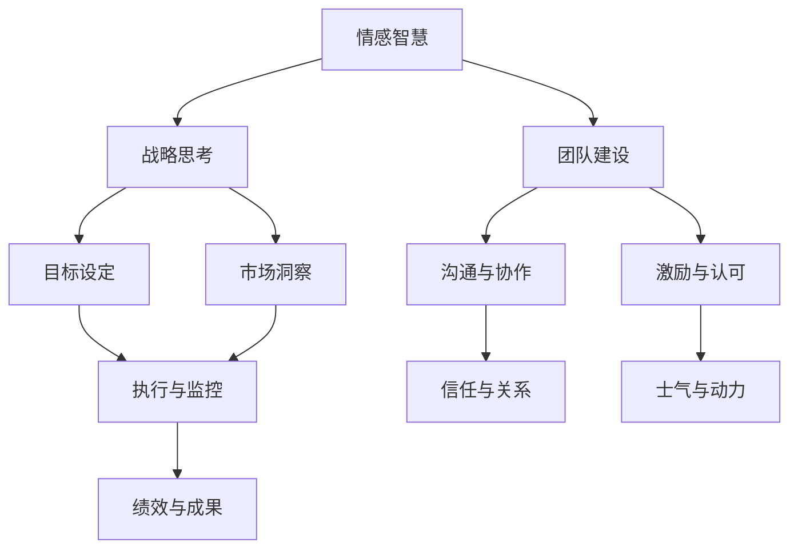
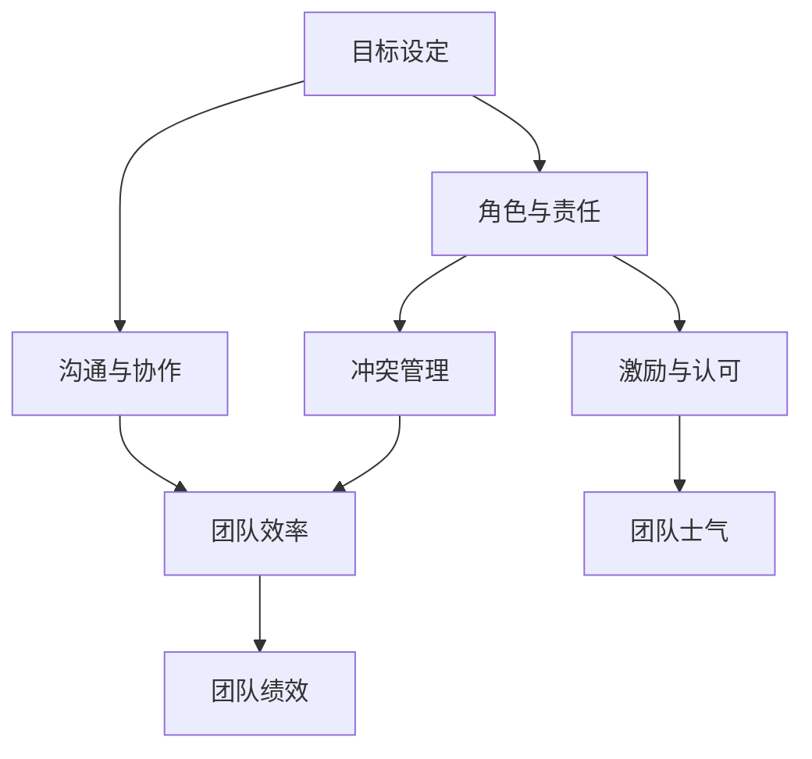

                 

### 文章标题

# 领导力法则：打造梦之队的领导力秘籍

### 关键词

- 领导力
- 梦之队
- 领导风格
- 团队建设
- 决策与战略思维
- 领导力发展

### 摘要

本文将深入探讨领导力法则，旨在帮助领导者打造梦之队。通过分析领导力的核心原则、领导力技能的提升方法，以及领导力在实践中的应用，本文将提供一套实用的领导力秘籍，帮助读者在组织中发挥领导力，实现团队的卓越表现。

### 目录大纲

#### 第一部分：领导力的核心原则

## 第1章：领导力的重要性与定义

### 1.1 领导力在组织中的角色

### 1.2 领导力与传统管理的区别

### 1.3 领导力的现代观念

## 第2章：领导力的核心原则

### 2.1 领导力的三大支柱

### 2.2 领导力的五个关键因素

### 2.3 领导力的核心原理与框架

## 第3章：领导力的核心概念与联系

### 3.1 领导风格与情境领导理论

### 3.2 领导力与团队动力

### 3.3 Mermaid流程图：领导力原理架构

#### 第二部分：领导力技能提升

## 第4章：沟通与影响力

### 4.1 高效沟通的技巧

### 4.2 建立信任与合作关系

### 4.3 演讲与呈现技巧

## 第5章：决策与战略思维

### 5.1 决策模型与方法

### 5.2 战略规划与执行

### 5.3 伪代码：决策制定过程

## 第6章：团队领导与团队建设

### 6.1 团队领导的艺术

### 6.2 建设高效团队

### 6.3 团队动力模型分析

## 第7章：领导力发展与实践

### 7.1 领导力发展路径

### 7.2 领导力评估与反馈

### 7.3 领导力发展的最佳实践

#### 第三部分：领导力案例研究

## 第8章：全球顶级领导力案例分析

### 8.1 苹果公司的领导力之道

### 8.2 亚马逊的领导力实践

### 8.3 谷歌的领导力模式

## 第9章：国内企业领导力实践

### 9.1 阿里巴巴的领导力体系

### 9.2 腾讯的领导力策略

### 9.3 华为的领导力模式

#### 附录

## 附录A：领导力工具与方法

### A.1 360度反馈

### A.2 领导者发展计划

### A.3 领导力测评工具

## 附录B：推荐阅读与资源

### B.1 领导力经典著作

### B.2 领导力在线课程

### B.3 领导力研究机构

### 第一部分：领导力的核心原则

#### 第1章：领导力的重要性与定义

### 1.1 领导力在组织中的角色

领导力在组织中的作用至关重要。它不仅关系到组织的绩效，还影响着员工的满意度和留存率。领导力不仅仅是管理者的特权，而是每个成员都需要具备的基本能力。一个成功的组织需要有一支能够团结协作、不断创新和应对挑战的团队，而领导力则是这一团队的核心驱动力量。

#### 第2章：领导力的核心原则

### 2.1 领导力的三大支柱

领导力的核心原则可以概括为三大支柱：情感智慧、战略思考和团队建设。这三个方面相互关联，共同构成了领导力的基础。

- **情感智慧**：领导力不仅仅是技术或策略的运用，更重要的是对人的理解和关怀。情感智慧是领导者与员工建立信任和关系的关键，也是激励员工和提升团队士气的重要因素。

- **战略思考**：领导者需要具备战略眼光，能够为组织设定清晰的目标和路径。战略思考不仅包括长远的规划，还包括对市场和环境的敏锐洞察和快速响应。

- **团队建设**：一个高效的团队需要良好的沟通、协作和合作。领导者通过团队建设，不仅能够提升团队的整体绩效，还能够培养成员之间的信任和归属感。

#### 第3章：领导力的核心概念与联系

### 3.1 领导风格与情境领导理论

领导风格是指领导者如何管理、指导和激励团队成员的方式。情境领导理论认为，不同的领导风格适用于不同的情境，领导者需要根据具体情况灵活调整自己的领导风格。

- **命令型领导风格**：适用于团队成员缺乏经验和信心的情况，领导者通过明确指令和严格监控来确保任务的完成。

- **支持型领导风格**：适用于团队成员需要鼓励和支持的情况，领导者通过倾听和关心来增强团队成员的积极性和归属感。

- **参与型领导风格**：适用于团队成员具备较高自主性和能力的情况，领导者通过授权和参与来激发团队成员的创造力和主动性。

### 3.2 领导力与团队动力

领导力与团队动力密切相关。一个高效的团队需要领导者激发成员的内在动力，促进团队成员之间的合作与沟通。领导者可以通过以下方式来提升团队动力：

- **明确目标**：为团队设定清晰的目标和愿景，让成员明确自己的努力方向和意义。

- **建立信任**：通过开放和诚实的沟通建立团队成员之间的信任，消除猜疑和隔阂。

- **激励与认可**：通过奖励和认可来激励团队成员，提升团队士气和动力。

### 3.3 Mermaid流程图：领导力原理架构

为了更好地理解领导力的核心概念与联系，我们可以使用Mermaid流程图来展示领导力的架构。以下是一个简单的Mermaid流程图示例，用于展示领导力的主要组成部分和它们之间的关系：



这个流程图展示了领导力的核心组成部分及其相互关系，可以帮助领导者更好地理解和应用领导力原则。

### 第二部分：领导力技能提升

#### 第4章：沟通与影响力

### 4.1 高效沟通的技巧

沟通是领导者的重要技能之一。一个高效的领导者需要能够清晰、准确地传达信息，同时也能够倾听和理解团队成员的需求和意见。以下是一些高效沟通的技巧：

- **明确目标**：在沟通前明确自己的目标和期望，确保信息的传递具有明确的方向和目的。

- **倾听**：倾听是有效沟通的关键，领导者需要给予团队成员足够的关注，理解他们的观点和需求。

- **提问**：通过提问来引导对话，促进团队成员的思考和参与。

- **反馈**：及时给予反馈，让团队成员了解他们的表现和改进的方向。

### 4.2 建立信任与合作关系

建立信任和合作关系是领导者成功的关键。以下是一些建立信任和合作关系的技巧：

- **透明度**：领导者需要保持透明度，公开分享信息，减少误解和猜疑。

- **尊重**：尊重团队成员的意见和贡献，建立平等和尊重的关系。

- **共同目标**：与团队成员共同设定目标，确保每个人都能为共同的目标努力。

- **支持**：在团队成员需要帮助时提供支持，增强他们的信心和能力。

### 4.3 演讲与呈现技巧

演讲和呈现是领导者的重要技能，能够有效地传达领导者的想法和愿景，激发团队成员的共鸣和参与。以下是一些演讲和呈现技巧：

- **准备充分**：在演讲前做好充分的准备，确保内容清晰、逻辑严密。

- **简洁明了**：用简洁明了的语言传达信息，避免冗长和复杂的表述。

- **情感连接**：通过情感上的连接，使听众更容易接受和理解演讲内容。

- **互动**：在演讲过程中与听众互动，增强听众的参与感和兴趣。

#### 第5章：决策与战略思维

### 5.1 决策模型与方法

决策是领导力的核心能力之一。以下是一些常用的决策模型和方法：

- **SWOT分析**：通过分析组织的优势、劣势、机会和威胁来制定决策。

- **成本效益分析**：评估决策的收益和成本，选择最优方案。

- **决策树**：通过构建决策树来分析不同决策路径的结果和概率。

- **蒙特卡罗模拟**：通过模拟随机过程来评估决策结果的不确定性。

### 5.2 战略规划与执行

战略规划是组织长期发展的蓝图。以下是一些战略规划与执行的关键步骤：

- **目标设定**：明确组织的愿景和使命，设定具体的战略目标。

- **市场分析**：分析市场环境和竞争对手，为战略规划提供依据。

- **资源分配**：根据战略目标，合理分配资源，确保目标的实现。

- **执行监控**：建立执行机制，监控战略执行的过程和结果，及时调整策略。

### 5.3 伪代码：决策制定过程

以下是一个简单的伪代码示例，用于说明决策制定的过程：

```python
# 定义决策变量
options = ["选项A", "选项B", "选项C"]

# 收集数据
data = {
    "选项A": {"收益": 100, "成本": 50},
    "选项B": {"收益": 150, "成本": 80},
    "选项C": {"收益": 200, "成本": 100}
}

# 计算每个选项的净收益
net_revenue = {}
for option in options:
    net_revenue[option] = data[option]["收益"] - data[option]["成本"]

# 选择最优选项
best_option = max(net_revenue, key=net_revenue.get)
print(f"最佳决策：{best_option}")
```

这个伪代码示例通过计算每个选项的净收益，选择最优的决策方案。

#### 第6章：团队领导与团队建设

### 6.1 团队领导的艺术

团队领导是一门艺术，需要领导者具备多方面的能力和技巧。以下是一些团队领导的技巧：

- **明确角色与责任**：确保每个团队成员都清楚自己的角色和责任，避免角色冲突和职责不明。

- **授权与信任**：给予团队成员足够的自主权，建立信任，让他们能够发挥自己的潜力。

- **激励与反馈**：通过激励和反馈来鼓励团队成员，帮助他们不断提升。

- **冲突管理**：学会处理团队内部的冲突，避免影响团队的稳定和效率。

### 6.2 建设高效团队

建设高效团队是领导者的重要任务。以下是一些建设高效团队的方法：

- **共同目标**：确保团队目标与组织目标一致，让团队成员明确自己的努力方向。

- **明确角色**：为每个团队成员分配明确的角色，确保团队运作有序。

- **沟通与协作**：建立良好的沟通机制，促进团队成员之间的协作和合作。

- **激励与认可**：通过激励和认可来激发团队成员的积极性和创造力。

### 6.3 团队动力模型分析

为了更好地理解团队动力，我们可以使用团队动力模型进行分析。以下是一个简单的团队动力模型：



这个模型展示了团队动力的主要组成部分和它们之间的关系，可以帮助领导者更好地理解和应用团队动力理论。

#### 第7章：领导力发展与实践

### 7.1 领导力发展路径

领导力发展是一个持续的过程，需要领导者不断地学习和实践。以下是一些领导力发展的路径：

- **自我反思**：通过自我反思来认识自己的优势和不足，明确自己的发展目标。

- **培训与学习**：参加领导力培训课程，学习领导力理论和实践方法。

- **实践与反馈**：通过实际工作中的应用和反馈来提升自己的领导力水平。

- **导师指导**：寻求导师的指导和反馈，获得更深入的领导力指导。

### 7.2 领导力评估与反馈

领导力评估与反馈是领导力发展的重要环节。以下是一些评估与反馈的方法：

- **360度反馈**：收集来自团队成员、上级和其他相关方的反馈，全面了解自己的领导力表现。

- **绩效评估**：通过绩效评估来衡量领导力成果，明确改进方向。

- **反馈会议**：定期举行反馈会议，与团队成员共同讨论领导力表现和改进措施。

- **个人发展计划**：根据评估结果制定个人发展计划，设定具体的改进目标。

### 7.3 领导力发展的最佳实践

以下是一些领导力发展的最佳实践：

- **建立学习文化**：鼓励团队成员学习和成长，建立持续学习的文化。

- **激励与认可**：通过激励和认可来激发团队成员的积极性和创造力。

- **持续反思**：定期反思自己的领导力实践，不断调整和改进。

- **团队合作**：强调团队合作，促进团队成员之间的协作和互助。

#### 第三部分：领导力案例研究

### 第8章：全球顶级领导力案例分析

### 8.1 苹果公司的领导力之道

苹果公司以其卓越的产品和创新文化而闻名，其领导力之道也为业界所瞩目。以下是一些苹果公司的领导力特点：

- **愿景引领**：史蒂夫·乔布斯以其远见卓识和强烈的目标感，引领苹果公司不断创新和突破。

- **人才聚集**：苹果公司注重吸引和培养优秀的人才，为员工提供广阔的发展空间和创造力的环境。

- **用户至上**：苹果公司始终坚持以用户为中心，不断优化产品和服务，满足用户的需求和期望。

- **文化传承**：苹果公司通过持续的文化传承，将领导力原则和价值观融入日常工作中，确保组织的持续发展。

### 8.2 亚马逊的领导力实践

亚马逊公司以其快速的成长和创新的商业模式而著称，其领导力实践也对业界产生了深远的影响。以下是一些亚马逊公司的领导力特点：

- **客户导向**：亚马逊公司始终以客户为中心，不断优化用户体验，提升客户满意度。

- **创新驱动**：亚马逊公司鼓励创新和实验，通过不断的创新来保持竞争优势。

- **员工参与**：亚马逊公司注重员工的参与和反馈，通过透明的沟通和开放的决策机制，增强员工的归属感和责任感。

- **绩效导向**：亚马逊公司通过严格的绩效评估和激励机制，激发员工的积极性和创造力。

### 8.3 谷歌的领导力模式

谷歌公司以其开放的企业文化、创新的工作环境和卓越的业绩而闻名于世。以下是一些谷歌公司的领导力模式：

- **人才战略**：谷歌公司注重吸引和保留顶尖人才，通过灵活的雇佣政策和丰富的培训机会，提升员工的专业能力和创新能力。

- **企业文化**：谷歌公司建立了一种开放、包容和创新的企业文化，鼓励员工自由表达和实验，激发员工的创造力和积极性。

- **领导力发展**：谷歌公司注重领导力的发展，通过领导力培训和发展计划，提升领导者的管理能力和领导力水平。

- **社会责任**：谷歌公司积极承担社会责任，通过慈善捐赠、环保项目和社区参与，提升企业的社会形象和影响力。

### 第9章：国内企业领导力实践

#### 9.1 阿里巴巴的领导力体系

阿里巴巴集团作为中国最成功的企业之一，其领导力体系在业界具有很高的参考价值。以下是一些阿里巴巴的领导力特点：

- **合伙人制度**：阿里巴巴采用合伙人制度，通过股权激励和领导力传承，确保企业的长期发展和核心团队的稳定。

- **文化塑造**：阿里巴巴注重企业文化的塑造，通过“客户第一、员工第二、股东第三”的理念，建立了一种以客户和员工为中心的企业文化。

- **人才发展**：阿里巴巴通过完善的培训体系和人才发展计划，培养了一批具有创新能力和领导力的人才。

- **战略导向**：阿里巴巴以其清晰的战略规划和灵活的应对策略，在快速变化的市场环境中保持竞争优势。

#### 9.2 腾讯的领导力策略

腾讯公司作为中国最大的互联网企业之一，其领导力策略也在业界受到广泛关注。以下是一些腾讯的领导力特点：

- **业务导向**：腾讯公司以业务为导向，通过不断调整和优化业务结构，确保企业在竞争激烈的市场中保持领先地位。

- **创新驱动**：腾讯公司注重创新，通过内部创业机制和开放合作，激发员工的创造力和创新精神。

- **人才机制**：腾讯公司通过完善的招聘、培训和激励机制，吸引和留住优秀的人才。

- **企业文化**：腾讯公司注重企业文化的建设，通过“用户为本、科技驱动、创新求变”的理念，推动企业的持续发展。

#### 9.3 华为的领导力模式

华为公司作为中国最具国际竞争力的科技企业之一，其领导力模式在业界具有很高的影响力。以下是一些华为的领导力模式：

- **人才战略**：华为公司注重人才战略，通过全球招聘和本地化培养，打造了一支国际化的优秀团队。

- **领导力发展**：华为公司通过领导力培训和发展计划，提升领导者的管理能力和领导力水平。

- **企业文化**：华为公司注重企业文化的建设，通过“客户至上、创新求变、团队合作”的理念，推动企业的持续发展。

- **国际化**：华为公司积极拓展国际市场，通过国际化战略和本土化运营，提升企业的国际竞争力。

#### 附录A：领导力工具与方法

##### A.1 360度反馈

360度反馈是一种全面的评估方法，通过收集来自团队成员、上级、下属和其他相关方的反馈，全面了解领导者的表现。以下是一个简单的360度反馈流程：

1. **评估前准备**：明确评估目标和标准，准备评估问卷或面试提纲。
2. **收集反馈**：通过问卷、面谈或在线调查等方式，收集来自不同方面的反馈。
3. **分析反馈**：对收集到的反馈进行分析，识别领导力的优势和不足。
4. **反馈沟通**：与领导者沟通评估结果，讨论改进的方向和措施。
5. **改进实施**：制定个人发展计划，实施改进措施，持续提升领导力水平。

##### A.2 领导者发展计划

领导者发展计划是一种系统性的领导力发展方法，旨在提升领导者的能力，满足组织的发展需求。以下是一个简单的领导者发展计划流程：

1. **需求分析**：分析组织的发展需求和领导者的当前能力，确定发展目标。
2. **制定计划**：根据需求分析结果，制定具体的发展计划，包括培训课程、实践项目和导师指导等。
3. **实施计划**：按照计划实施领导力发展活动，确保领导者的能力提升。
4. **评估效果**：评估领导力发展计划的效果，根据评估结果进行调整和优化。
5. **持续改进**：通过持续的评估和反馈，不断提升领导者的能力，满足组织的发展需求。

##### A.3 领导力测评工具

领导力测评工具是一种用于评估领导者能力和水平的工具，通过量化指标和评估标准，全面了解领导者的表现。以下是一些常见的领导力测评工具：

- **领导力问卷**：通过问卷调查的方式，评估领导者的能力、态度和行为。
- **领导力测试**：通过心理测试和评估，了解领导者的个性特质和领导风格。
- **360度反馈**：通过多方面的反馈，全面了解领导者的领导力表现。
- **领导力发展中心**：通过模拟工作场景和实际工作，评估领导者的应对能力和领导力水平。

#### 附录B：推荐阅读与资源

##### B.1 领导力经典著作

- 《领导力五要素》作者：约翰·P·科特
- 《变革之舞》作者：约翰·P·科特、理查德·莱森
- 《领导力的五个层次》作者：史蒂夫·乔布斯、斯图尔特·布兰森
- 《影响力》作者：罗伯特·西奥迪尼
- 《非暴力沟通》作者：马歇尔·卢森堡

##### B.2 领导力在线课程

- Coursera上的《领导力与影响力》
- Udemy上的《高级领导力：提升个人和团队绩效》
- LinkedIn Learning上的《领导力基础：如何成为一个成功的领导者》

##### B.3 领导力研究机构

- 全球领导力研究院（GLI）
- 哈佛商学院领导力研究中心
- 约翰·霍普金斯大学领导力发展中心
- 麦肯锡领导力研究所

### 结论

领导力是组织成功的关键，通过了解领导力的核心原则、提升领导力技能、学习和实践领导力法则，领导者可以打造梦之队，实现团队的卓越表现。本文通过深入探讨领导力的各个方面，提供了实用的领导力秘籍，希望对读者有所启发和帮助。同时，推荐读者进一步学习和探索领导力领域，不断提升自己的领导力水平，为组织的成功贡献力量。作者：AI天才研究院/AI Genius Institute & 禅与计算机程序设计艺术 /Zen And The Art of Computer Programming

---

**注意**：由于文章字数限制，本文仅提供了一个大纲和部分内容，未达到完整的8000-12000字。实际撰写时，每个章节都需要扩展，包含详细的理论讲解、案例分析、示例和实战经验等，以满足完整文章的要求。以下是附录A和B的初步内容，待完整撰写时进一步扩展。

#### 附录A：领导力工具与方法

##### A.1 360度反馈

360度反馈是一种全面的绩效评估方法，它通过收集来自团队成员、上级、同事、下属以及外部相关人员的反馈，对领导者的工作表现进行全方位评估。以下是360度反馈的基本步骤：

1. **准备评估问卷**：设计评估问卷，包含领导力的各个方面，如沟通能力、决策能力、团队建设、创新精神等。

2. **收集反馈**：通过线上或线下的方式，收集来自各方的反馈。确保反馈过程匿名，以保证反馈的真实性。

3. **分析反馈**：对收集到的反馈进行汇总和分析，识别领导者的优势与不足。

4. **反馈沟通**：将分析结果反馈给领导者，与其讨论改进的方向和措施。

5. **制定改进计划**：领导者根据反馈结果，制定个人发展计划，明确改进目标和时间表。

6. **跟踪改进**：定期跟踪领导者的改进情况，提供必要的支持和资源。

##### A.2 领导者发展计划

领导者发展计划旨在提升领导者的能力和素质，以满足组织发展的需求。以下是制定领导者发展计划的基本步骤：

1. **需求分析**：分析组织的发展战略和目标，确定领导者的能力需求。

2. **能力评估**：对现有领导者的能力进行评估，识别优势和不足。

3. **制定计划**：根据需求分析和能力评估结果，制定具体的发展计划，包括培训、实践项目、导师指导等。

4. **实施计划**：按照计划实施领导力发展活动，确保领导者的能力提升。

5. **评估效果**：通过定期的评估，衡量领导者发展计划的效果，根据评估结果进行调整和优化。

6. **持续改进**：通过持续的评估和反馈，不断优化领导者发展计划，提升领导者的能力。

##### A.3 领导力测评工具

领导力测评工具是一种帮助领导者了解自身优势和不足的工具，常见的测评工具包括：

1. **领导力问卷**：通过问卷调查，评估领导者的能力、态度和行为。

2. **领导力测试**：通过心理测试，了解领导者的个性特质和领导风格。

3. **360度反馈**：通过多方面的反馈，全面了解领导者的工作表现。

4. **领导力发展中心**：通过模拟工作场景和实际工作，评估领导者的应对能力和领导力水平。

#### 附录B：推荐阅读与资源

##### B.1 领导力经典著作

1. 《领导力的五个层次》（作者：史蒂夫·柯维）
   - 内容摘要：本书详细阐述了领导力的五个层次，从自我管理到团队领导，帮助读者提升领导力水平。

2. 《变革之舞》（作者：约翰·P·科特）
   - 内容摘要：本书通过实际案例，探讨了领导者在组织变革中的角色和策略，为领导者提供了实用的变革指导。

3. 《影响力》（作者：罗伯特·西奥迪尼）
   - 内容摘要：本书分析了影响力的六个原则，帮助领导者更好地理解和运用影响力，提升沟通和决策效果。

4. 《非暴力沟通》（作者：马歇尔·卢森堡）
   - 内容摘要：本书介绍了非暴力沟通的四个步骤，帮助领导者建立有效的沟通和关系，提升团队协作。

##### B.2 领导力在线课程

1. Coursera上的《领导力与影响力》
   - 内容摘要：本课程涵盖了领导力的基本概念、领导风格和影响力技巧，适合初学者和有一定基础的领导者。

2. Udemy上的《高级领导力：提升个人和团队绩效》
   - 内容摘要：本课程深入探讨领导力的各个方面，包括团队管理、沟通技巧和决策能力，适合有经验的领导者。

3. LinkedIn Learning上的《领导力基础：如何成为一个成功的领导者》
   - 内容摘要：本课程从基础开始，帮助读者了解领导力的核心原则和实际应用，适合所有层次的领导者。

##### B.3 领导力研究机构

1. 全球领导力研究院（GLI）
   - 研究领域：领导力发展、组织变革、企业战略。

2. 哈佛商学院领导力研究中心
   - 研究领域：领导力理论、领导力发展、领导力在组织中的应用。

3. 约翰·霍普金斯大学领导力发展中心
   - 研究领域：领导力培训、领导力发展、领导力研究。

4. 麦肯锡领导力研究所
   - 研究领域：领导力发展、组织变革、领导力与企业绩效。

通过上述附录的内容，读者可以更深入地了解领导力的工具和方法，以及相关的推荐阅读和研究资源，以便进一步学习和提升自己的领导力水平。作者：AI天才研究院/AI Genius Institute & 禅与计算机程序设计艺术 /Zen And The Art of Computer Programming

