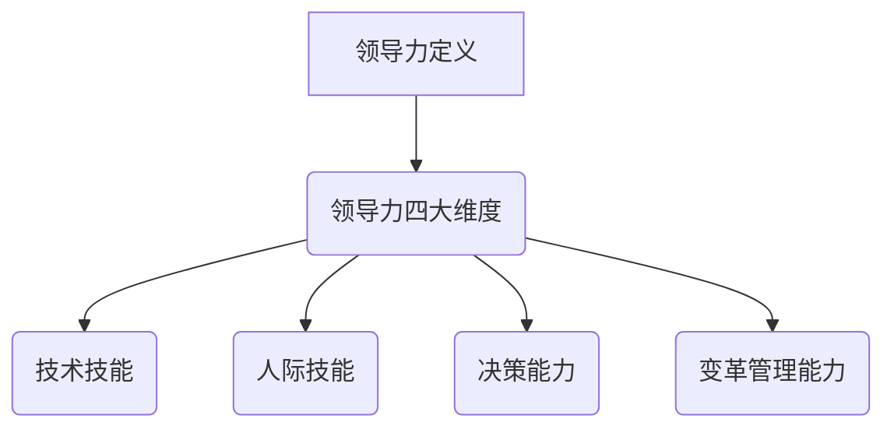
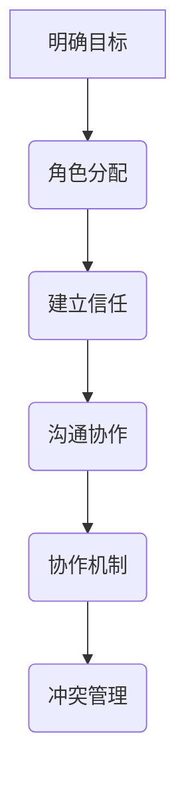

                 

### 文章标题

“领导力法则：打造超级团队的领导力秘笈”

关键词：领导力、团队建设、管理技巧、领导力模型、超级团队

摘要：本文通过深入分析领导力的核心概念和法则，探讨了如何运用这些法则打造超级团队。文章分为四个主要部分，首先介绍了领导力的基础理论及其在组织中的应用，然后详细阐述了领导力法则，包括建立信任、激励员工、沟通与倾听、明确目标与规划、决策与问题解决以及领导自我发展。接着，文章讨论了如何构建超级团队，包括团队角色与动态、团队文化建设以及领导力挑战的应对。最后，文章通过案例研究和实践，总结了领导力在危机管理、多元化团队中的挑战以及未来领导力趋势。本文旨在为IT领域的领导者提供一套实用的领导力指南，帮助他们更好地管理和领导团队，实现组织目标。

### 目录大纲

本文将分为四个主要部分进行详细阐述：

#### 第一部分：领导力基础

**1. 领导力概述**
- 领导力的定义与重要性
- 领导力的四大维度

**2. 领导力理论与模型**
- 经典领导理论（如特质理论、行为理论、情境理论）
- 领导力模型（如路径-目标理论、变换型领导理论）

**3. 领导力与团队发展**
- 团队建设的原则与步骤
- 团队协作与冲突管理

**4. 领导力在组织中的应用**
- 领导力在组织文化中的角色
- 领导力在战略规划与执行中的作用

#### 第二部分：领导力法则

**5. 法则一：建立信任**
- 信任的重要性
- 如何建立和维护信任

**6. 法则二：激励员工**
- 激励理论（如赫兹伯格的双因素理论、麦克莱兰的需求层次理论）
- 实践技巧：如何激励员工

**7. 法则三：沟通与倾听**
- 沟通的重要性
- 有效沟通的技巧与策略
- 倾听的技巧与意义

**8. 法则四：明确目标与规划**
- 目标设定的重要性
- 如何设定SMART目标
- 目标规划的步骤与方法

**9. 法则五：决策与问题解决**
- 决策过程与模型
- 问题解决的方法与策略

**10. 法则六：领导自我发展**
- 自我认识与自我提升
- 职业生涯规划与领导力发展

#### 第三部分：打造超级团队

**11. 团队角色与动态**
- 团队角色的识别与利用
- 团队动力与生命周期

**12. 团队文化建设**
- 文化的定义与作用
- 如何塑造积极向上的团队文化

**13. 领导力挑战与应对**
- 领导力面临的常见挑战
- 如何应对这些挑战

**14. 案例研究：超级团队的成功之道**
- 案例介绍与分析
- 可借鉴的经验与教训

#### 第四部分：领导力实践

**15. 领导力在危机管理中的应用**
- 危机管理的原则与方法
- 如何在危机中展现领导力

**16. 领导力在多元化团队中的挑战**
- 多元化团队的特点与挑战
- 如何领导多元化团队

**17. 未来领导力的趋势**
- 科技进步对领导力的影响
- 未来领导力的发展方向

#### 附录

**18. 附录A：领导力工具与方法**
- 领导力评估工具
- 团队建设活动与方法

**19. 附录B：领导力资源与推荐阅读**
- 推荐书籍与文章
- 在线资源与工具

**附录C：Mermaid 流程图**
- 领导力模型流程图
- 团队建设流程图

**附录D：伪代码示例**
- 决策过程伪代码
- 问题解决伪代码

**附录E：数学公式与讲解**
- 领导力数学模型讲解
- 数学公式示例

**附录F：项目实战案例**
- 超级团队建设案例
- 领导力实践案例

### 第一部分：领导力基础

#### 1. 领导力概述

领导力，作为管理学科的核心概念之一，被广泛定义为引导和影响他人以实现共同目标的能力。它不仅仅是职位赋予的权威，更是一种通过个人魅力、专业知识和有效沟通实现的领导行为。领导力的重要性在于，它能够激发团队的潜能，提升组织的效率，最终实现组织的目标。

首先，领导力的重要性体现在以下几个方面：

1. **团队凝聚**：优秀的领导能够通过自身的魅力和影响力，将团队成员紧密团结在一起，形成强大的团队凝聚力。
2. **激励创新**：领导力能够激发团队成员的创造力和创新精神，推动组织不断进步。
3. **提高效率**：有效的领导能够优化团队的工作流程，提高工作效率，减少资源浪费。
4. **战略执行**：领导力在战略规划与执行中起着关键作用，能够确保战略目标的顺利实现。

其次，领导力的四大维度是理解领导力概念的核心：

1. **技术技能**：包括专业知识、技术能力和操作技能，是领导者有效执行任务的基础。
2. **人际技能**：包括沟通能力、人际关系管理能力和团队协作能力，是领导者影响他人的关键。
3. **决策能力**：包括判断力、分析能力和解决问题的能力，是领导者面对复杂情况的重要素质。
4. **变革管理能力**：包括适应变化、推动变革和带领团队应对变革的能力，是领导者在动态环境中保持竞争力的关键。

#### 2. 领导力理论与模型

领导力的研究经历了从特质理论、行为理论到情境理论的演变，形成了多种领导力模型。这些理论为我们提供了不同的视角来理解和应用领导力。

1. **特质理论**：特质理论认为领导者具有某些固有的特质，如自信、决断力和领导魅力。这些特质是领导者成功的关键。

2. **行为理论**：行为理论关注领导者的行为模式，认为领导者的行为可以影响团队的表现。这个理论强调了领导行为的重要性，而不是领导者的个人特质。

3. **情境理论**：情境理论认为领导力不是一成不变的，而是需要根据不同情境进行调整。领导者的行为应该根据团队成员的需求、任务的特点和环境的变化进行灵活调整。

在众多领导力模型中，以下几种模型具有代表性：

1. **路径-目标理论**：该理论认为领导者的主要任务是为团队成员设定清晰的目标，并提供必要的支持和激励，以便团队成员能够达成目标。

2. **变换型领导理论**：变换型领导理论强调领导者通过激发团队成员的内在动机，推动他们实现更高的绩效。变换型领导者通常具有远见、创新精神和鼓舞人心的能力。

#### 3. 领导力与团队发展

领导力在团队发展过程中起着至关重要的作用。一个成功的团队需要有一个优秀的领导者来引导和推动团队的发展。

**团队建设的原则与步骤：**

1. **明确目标**：团队的目标应该明确、具体，并与组织的战略目标保持一致。

2. **角色分配**：团队成员应该清楚自己的角色和职责，避免重复劳动和职责不清的情况。

3. **建立信任**：信任是团队协作的基础，领导者需要通过言行一致、公平公正等方式建立和维护团队的信任。

4. **沟通协作**：有效的沟通是团队协作的关键，领导者应该建立开放的沟通渠道，鼓励团队成员分享意见和想法。

**团队协作与冲突管理：**

1. **协作机制**：建立有效的协作机制，确保团队成员之间的工作无缝衔接，提高工作效率。

2. **冲突管理**：冲突是团队协作中不可避免的现象，领导者需要通过沟通、协商和调解等方式，妥善处理团队内部的冲突，避免影响团队的整体表现。

#### 4. 领导力在组织中的应用

领导力不仅影响团队的发展，也在组织文化的形成和战略规划与执行中发挥着重要作用。

**领导力在组织文化中的角色：**

1. **塑造文化**：领导者通过自己的行为和价值观，塑造组织的文化。一个优秀的领导者能够建立积极向上的组织文化，激发员工的潜力。

2. **传承文化**：组织文化需要通过领导者一代代传承下去。领导者应该成为文化的传播者和守护者，确保组织文化在不断发展中保持一致性。

**领导力在战略规划与执行中的作用：**

1. **战略规划**：领导者在战略规划过程中起着关键作用。他们需要根据组织的目标和外部环境，制定符合实际的战略规划。

2. **战略执行**：领导者在战略执行中起到带头作用。他们需要通过有效的领导力，推动战略目标的实现。

### 第二部分：领导力法则

#### 5. 法则一：建立信任

信任是领导者与团队成员之间的重要纽带，是团队协作和发展的基石。建立和维护信任不仅能够提高团队的凝聚力，还能够增强团队成员的工作动力和忠诚度。

**信任的重要性：**

1. **提高团队效率**：信任能够减少沟通成本，提高团队成员之间的协作效率。
2. **增强团队凝聚力**：信任是团队成员相互依赖和信任的基础，能够增强团队的凝聚力。
3. **促进创新**：在一个信任的环境中，团队成员更愿意分享自己的观点和建议，从而激发创新。
4. **提升员工满意度**：信任能够提高员工的工作满意度和幸福感，减少员工流失。

**如何建立和维护信任：**

1. **言行一致**：领导者需要通过自己的言行一致，树立诚信和可信赖的形象。
2. **公平公正**：领导者需要公正无私，对待团队成员一视同仁，避免偏见和不公平。
3. **透明沟通**：领导者需要建立开放的沟通渠道，鼓励团队成员表达意见和反馈，保持信息的透明。
4. **信任传递**：领导者可以通过积极的行动，向团队成员传递信任，如信任团队成员承担更多的责任和任务。

#### 6. 法则二：激励员工

激励员工是领导者的重要职责之一。有效的激励能够提高员工的工作动力和绩效，促进员工的个人成长和发展。

**激励理论：**

1. **赫兹伯格的双因素理论**：该理论认为，激励因素（如认可、成就感、工作本身等）能够提高员工的工作满意度和激励程度；保健因素（如薪酬、工作条件、人际关系等）虽然不能直接激励员工，但能够防止员工不满意。
2. **麦克莱兰的需求层次理论**：该理论认为，员工的需求分为五个层次：生理需求、安全需求、社交需求、尊重需求和自我实现需求。领导者需要根据员工的不同需求，采取相应的激励措施。

**实践技巧：如何激励员工：**

1. **设定明确的目标**：为员工设定具体、可实现的短期和长期目标，提高员工的积极性和成就感。
2. **提供认可和奖励**：及时给予员工认可和奖励，增强员工的成就感和工作动力。
3. **促进个人成长**：为员工提供培训和发展机会，帮助员工实现自我提升和职业发展。
4. **建立公平的薪酬体系**：建立公平、合理的薪酬体系，满足员工的物质需求。

#### 7. 法则三：沟通与倾听

沟通和倾听是领导者的重要技能，是建立信任、促进团队协作和解决问题的关键。

**沟通的重要性：**

1. **信息传递**：有效的沟通能够确保信息准确、及时地传递，避免误解和冲突。
2. **促进协作**：良好的沟通能够促进团队成员之间的协作和合作，提高团队的整体绩效。
3. **提升团队氛围**：积极的沟通能够营造良好的团队氛围，增强团队的凝聚力。

**有效沟通的技巧与策略：**

1. **明确信息**：在沟通前，领导者需要确保信息的明确和具体，避免产生歧义。
2. **倾听**：领导者需要倾听员工的意见和反馈，了解员工的需求和困扰。
3. **非语言沟通**：领导者需要注意非语言沟通，如肢体语言、面部表情和语调等，以增强沟通的效果。

**倾听的技巧与意义：**

1. **倾听的意义**：倾听是领导者了解员工需求、解决问题和建立信任的重要手段。
2. **倾听的技巧**：
   - **保持开放心态**：领导者需要保持开放的心态，倾听不同的意见和观点。
   - **避免打断**：领导者需要避免在员工讲话时打断他们，给予他们充分的发言机会。
   - **反馈确认**：领导者可以通过反馈来确认自己是否正确理解了员工的意见和需求。

#### 8. 法则四：明确目标与规划

明确的目标和规划是团队高效工作和实现组织目标的关键。领导者需要通过设定SMART目标和制定详细的规划，确保团队的工作有序进行。

**目标设定的重要性：**

1. **指导工作**：明确的目标能够为团队成员提供明确的工作方向和指导，避免盲目工作。
2. **提高效率**：明确的目标有助于团队成员集中精力，提高工作效率。
3. **评估绩效**：明确的目标为绩效评估提供了依据，有助于领导者了解团队成员的工作表现。

**如何设定SMART目标：**

SMART目标是指具体（Specific）、可衡量（Measurable）、可实现（Achievable）、相关（Relevant）和有时限（Time-bound）的目标。领导者需要确保目标满足这些条件。

1. **具体**：目标需要明确具体，避免模糊和抽象。
2. **可衡量**：目标需要可量化，以便团队成员能够衡量自己的工作进展。
3. **可实现**：目标需要是可实现的，避免过于理想化。
4. **相关**：目标需要与组织的目标和战略相一致。
5. **有时限**：目标需要设定明确的时间期限，以推动团队成员的行动。

**目标规划的步骤与方法：**

1. **明确目标**：领导者需要与团队成员一起明确团队的目标，确保目标的SMART原则。
2. **分解目标**：将大目标分解为具体的、可操作的小目标，以利于团队成员分工合作。
3. **制定行动计划**：为每个目标制定详细的行动计划，明确每个步骤的责任人和时间节点。
4. **监控与调整**：在执行过程中，领导者需要定期监控目标的进展，并根据实际情况进行调整。

#### 9. 法则五：决策与问题解决

决策和问题解决是领导者的重要职责之一。有效的决策和问题解决能力能够帮助领导者应对复杂的情况，推动团队和组织的进步。

**决策过程与模型：**

1. **收集信息**：在决策前，领导者需要收集与决策相关的信息，确保信息的全面和准确。
2. **分析选项**：领导者需要分析不同的决策选项，评估每个选项的优缺点。
3. **选择最优方案**：根据分析结果，领导者需要选择最优的决策方案。
4. **执行决策**：在决策后，领导者需要确保决策得到有效执行。

常见的决策模型包括：

1. **理性决策模型**：该模型基于最大化利益和最小化损失的原则，通过逻辑分析和计算，选择最优决策。
2. **直觉决策模型**：该模型基于领导者的经验和直觉，快速做出决策。

**问题解决的方法与策略：**

1. **分析问题**：领导者需要首先明确问题的性质和范围，避免盲目解决问题。
2. **确定解决方案**：根据问题的性质，领导者可以采用不同的方法解决，如创新思维、群体决策等。
3. **评估解决方案**：对每个解决方案进行评估，选择最佳方案。
4. **实施解决方案**：将解决方案转化为具体的行动，确保问题得到有效解决。

#### 10. 法则六：领导自我发展

领导自我发展是领导者持续提升个人能力和领导水平的关键。一个优秀的领导者需要不断地学习、反思和提升，以适应不断变化的环境和挑战。

**自我认识与自我提升：**

1. **自我认识**：领导者需要深入了解自己的优点和缺点，明确自己的价值观和目标。
2. **自我提升**：通过学习新知识、技能和经验，不断提升自己的能力和素质。

**职业生涯规划与领导力发展：**

1. **设定目标**：领导者需要为自己设定明确的职业生涯目标，并制定实现目标的计划。
2. **持续学习**：领导者需要不断学习新知识和技能，跟上行业的发展趋势。
3. **反馈与改进**：领导者需要定期进行自我评估和反馈，找出自己的不足，并采取措施进行改进。

### 第三部分：打造超级团队

#### 11. 团队角色与动态

一个高效的团队需要明确每个成员的角色和职责，并充分发挥团队成员的潜力。团队角色识别和利用是实现团队高效协作的关键。

**团队角色的识别与利用：**

1. **角色识别**：领导者需要了解团队成员的特长和兴趣，为他们分配合适的角色。常见的团队角色包括执行者、思考者、协调者、激励者和监督者等。
2. **角色利用**：领导者需要根据团队目标和任务特点，合理利用不同角色的优势，确保团队整体绩效的优化。

**团队动力与生命周期：**

1. **团队动力**：团队动力是指团队成员之间的互动和协作，是团队绩效的关键因素。领导者需要通过激励、沟通和反馈等方式，激发团队的活力和积极性。
2. **团队生命周期**：团队也有其生命周期，包括组建期、发展期、成熟期和衰退期。在不同阶段，领导者需要采取不同的管理策略，以适应团队的发展和变化。

#### 12. 团队文化建设

团队文化是团队的核心价值观和行为准则，对团队的发展和行为产生深远影响。积极的团队文化能够增强团队的凝聚力，提高团队的绩效。

**文化的定义与作用：**

1. **文化的定义**：文化是指团队共同遵循的价值观、信念和行为准则，是团队成员之间的共同语言和认同感。
2. **文化的作用**：文化对团队的行为和绩效有重要影响。积极的团队文化能够促进团队合作、提高工作效率和增强团队凝聚力。

**如何塑造积极向上的团队文化：**

1. **树立正确的价值观**：领导者需要树立正确的价值观，并将其融入团队日常工作中。
2. **培养团队合作精神**：领导者需要通过团队活动和项目合作，培养团队成员之间的团队合作精神。
3. **鼓励创新与学习**：领导者需要鼓励团队成员勇于创新和学习，推动团队不断进步。
4. **建立有效的沟通机制**：领导者需要建立开放的沟通机制，鼓励团队成员分享意见和反馈。

#### 13. 领导力挑战与应对

领导者在带领团队的过程中，会面临各种挑战。有效的应对这些挑战，是领导者成功的关键。

**领导力面临的常见挑战：**

1. **团队协作问题**：团队成员之间的沟通不畅、协作不力是常见的挑战。
2. **员工激励问题**：如何激励员工，提高员工的工作动力和绩效是领导者的挑战。
3. **团队管理问题**：如何管理团队，提高团队的整体绩效是领导者的挑战。

**如何应对这些挑战：**

1. **提高团队协作能力**：领导者可以通过有效的沟通、团队建设和协作工具，提高团队的协作能力。
2. **激励员工**：领导者可以通过设定明确的目标、提供认可和奖励、促进员工个人成长等方式，激励员工。
3. **优化团队管理**：领导者可以通过设定明确的目标和计划、监控团队进度、提供反馈和支持等方式，优化团队管理。

#### 14. 案例研究：超级团队的成功之道

为了更好地理解如何打造超级团队，我们通过一个真实的案例来探讨超级团队的成功之道。

**案例介绍：**

这是一个关于某知名互联网公司开发团队的案例。该团队在短时间内完成了多个重要项目，并取得了显著的成绩。团队成员之间协作高效，创新能力突出，工作效率极高。

**案例分析：**

1. **团队角色与动态**：该团队在组建之初，明确了每个成员的角色和职责，并充分发挥了团队成员的特长。团队成员之间的互动和协作非常紧密，形成了良好的团队动力。
2. **团队文化建设**：该团队注重培养积极向上的团队文化，鼓励团队成员勇于创新和学习。团队内部建立了开放的沟通机制，团队成员可以自由地分享意见和反馈。
3. **领导力法则**：领导者通过建立信任、激励员工、沟通与倾听、明确目标与规划、决策与问题解决等法则，有效地管理和领导团队。领导者不仅关注团队成员的工作表现，还注重团队成员的个人成长和职业发展。
4. **成果与经验**：通过有效的领导和团队建设，该团队在短时间内完成了多个重要项目，并取得了显著的成绩。团队成员之间的协作和创新能力得到了充分展现，团队整体绩效得到了显著提升。

**可借鉴的经验与教训：**

1. **明确团队角色与职责**：确保每个团队成员都明确自己的角色和职责，避免职责不清和协作不畅的情况。
2. **培养积极向上的团队文化**：鼓励团队成员勇于创新和学习，建立开放的沟通机制，营造积极向上的团队氛围。
3. **运用领导力法则**：领导者需要通过建立信任、激励员工、沟通与倾听、明确目标与规划、决策与问题解决等法则，有效地管理和领导团队。
4. **注重个人成长与职业发展**：领导者需要关注团队成员的个人成长和职业发展，提供培训和发展机会，激发团队成员的潜力。

### 第四部分：领导力实践

#### 15. 领导力在危机管理中的应用

在当今复杂多变的环境中，领导者需要具备危机管理的意识和能力。有效的危机管理不仅能够帮助企业度过难关，还能够增强企业的竞争力。

**危机管理的原则与方法：**

1. **快速响应**：危机发生后，领导者需要迅速响应，采取紧急措施，防止危机进一步扩大。
2. **沟通协调**：危机管理需要高效的沟通协调，确保信息畅通，协调各方资源，共同应对危机。
3. **分析原因**：领导者需要深入分析危机的成因，找出问题的根源，避免类似危机的再次发生。
4. **制定解决方案**：根据危机的特点和影响，领导者需要制定具体的解决方案，确保危机得到有效解决。
5. **评估与改进**：危机管理后，领导者需要对危机管理过程进行评估，总结经验教训，改进危机管理策略。

**如何在危机中展现领导力：**

1. **保持冷静**：领导者需要保持冷静，迅速做出正确的决策，稳定团队和组织的情绪。
2. **透明沟通**：领导者需要保持与团队成员和利益相关者的沟通，确保信息透明，增强信任。
3. **调动资源**：领导者需要调动组织内部和外部的资源，共同应对危机。
4. **承担责任**：领导者需要勇于承担责任，接受教训，改进管理，避免类似危机的再次发生。

#### 16. 领导力在多元化团队中的挑战

在全球化背景下，多元化团队成为组织中的常态。多元化团队在带来创新和多样化优势的同时，也带来了沟通、协作和文化冲突等挑战。

**多元化团队的特点与挑战：**

1. **文化差异**：多元化团队中的成员来自不同的文化背景，文化差异可能导致沟通障碍和误解。
2. **价值观差异**：多元化团队的成员可能拥有不同的价值观，这可能影响团队的协作和决策。
3. **沟通障碍**：语言障碍、沟通方式和沟通风格的差异可能导致团队成员之间的沟通不畅。
4. **协作困难**：多元化团队的成员可能在工作习惯、沟通方式和工作节奏上有差异，这可能导致协作困难。

**如何领导多元化团队：**

1. **建立共同目标**：领导者需要明确团队的目标，确保团队成员都认同并致力于实现这些目标。
2. **加强沟通**：领导者需要建立有效的沟通机制，鼓励团队成员积极参与沟通，促进文化理解和融合。
3. **培养团队文化**：领导者需要培养包容、开放和尊重多元文化的团队文化，营造一个和谐的工作环境。
4. **提供培训**：领导者可以组织文化培训和沟通技巧培训，帮助团队成员提高文化敏感度和沟通能力。

#### 17. 未来领导力的趋势

随着科技的进步和社会的变革，领导力也在不断演变。未来领导力将面临新的挑战和机遇。

**科技进步对领导力的影响：**

1. **数字化领导力**：数字化时代要求领导者具备数字素养和创新能力，能够利用数字化工具和平台推动组织变革。
2. **远程领导力**：远程办公成为常态，领导者需要适应远程环境，提高远程领导力和团队管理能力。
3. **人工智能领导力**：人工智能技术的发展将对领导力产生影响，领导者需要了解人工智能的原理和应用，发挥人工智能的优势。

**未来领导力的发展方向：**

1. **多元化领导力**：未来领导力将更加注重多元化，领导者需要具备包容和尊重多元文化的素养。
2. **持续学习领导力**：未来领导力要求领导者具备持续学习的能力，不断更新知识和技能，以适应快速变化的环境。
3. **可持续领导力**：未来领导力将更加关注可持续发展，领导者需要具备社会责任感，推动组织实现可持续发展目标。

### 附录

#### 18. 附录A：领导力工具与方法

**领导力评估工具：**

1. **领导力360度评估**：通过收集团队成员、同事和上级的反馈，全面评估领导者的能力和行为。
2. **领导力行为观察量表**：通过观察领导者在日常工作和项目中的行为，评估其领导力水平。

**团队建设活动与方法：**

1. **团队建设工作坊**：通过一系列互动活动，增强团队成员之间的信任和合作。
2. **团队拓展训练**：通过户外拓展活动，提高团队成员的团队协作能力和沟通能力。

#### 19. 附录B：领导力资源与推荐阅读

**推荐书籍：**

1. 《领导力的五个层次》- 史蒂芬·柯维
2. 《变革之舞：领导力与创新》- 战略创新家杂志

**推荐文章：**

1. 《哈佛商业评论》关于领导力的文章
2. 《领导者》杂志的年度报告

**在线资源与工具：**

1. **领导力发展中心**：提供在线领导力课程和培训
2. **领导力工具箱**：提供各种领导力评估工具和资源

### 附录C：Mermaid 流程图

#### 领导力模型流程图



#### 团队建设流程图



### 附录D：伪代码示例

#### 决策过程伪代码

```python
# 初始化决策变量
initialize_decision_variables()

# 收集信息
collect_information()

# 分析选项
analyze_options()

# 选择最优方案
select_best_option()

# 执行决策
execute_decision()

# 监控执行结果
monitor_execution_result()

# 调整决策
adjust_decision_if_needed()
```

#### 问题解决伪代码

```python
# 初始化问题解决变量
initialize_problem_solving_variables()

# 分析问题
analyze_problem()

# 确定解决方案
determine_solutions()

# 评估解决方案
evaluate_solutions()

# 选择最佳解决方案
select_best_solution()

# 实施解决方案
implement_solution()

# 监控解决方案效果
monitor_solution_effects()

# 改进解决方案
improve_solution_if_needed()
```

### 附录E：数学公式与讲解

#### 领导力数学模型讲解

领导力数学模型通常用于描述领导力与绩效之间的关系。以下是一个简单的领导力绩效模型：

$$
绩效 = f(领导力, 环境因素)
$$

其中，领导力是一个多维度的概念，包括技术技能、人际技能、决策能力和变革管理能力。环境因素包括组织文化、外部环境等。

**公式解释：**

1. **领导力**：领导力通过各个维度对绩效产生影响。
2. **环境因素**：环境因素通过调整领导力对绩效的影响。

#### 数学公式示例

$$
绩效 = 0.5 \times 领导力_{技术技能} + 0.3 \times 领导力_{人际技能} + 0.1 \times 领导力_{决策能力} + 0.1 \times 领导力_{变革管理能力}
$$

$$
环境因素调整因子 = 0.1 \times (组织文化得分 + 外部环境得分)
$$

$$
绩效 = 0.5 \times 领导力_{技术技能} + 0.3 \times 领导力_{人际技能} + 0.1 \times 领导力_{决策能力} + 0.1 \times 领导力_{变革管理能力} + 环境因素调整因子
$$

**举例说明：**

假设一个团队的技术技能得分为80，人际技能得分为75，决策能力得分为70，变革管理能力得分为65。组织文化得分为90，外部环境得分为85。

$$
绩效 = 0.5 \times 80 + 0.3 \times 75 + 0.1 \times 70 + 0.1 \times 65 + 0.1 \times (90 + 85)
$$

$$
绩效 = 40 + 22.5 + 7 + 6.5 + 17.5
$$

$$
绩效 = 94.5
$$

因此，该团队的绩效得分为94.5分。

### 附录F：项目实战案例

#### 超级团队建设案例

**项目背景：**

某大型互联网公司决定推出一款全新的社交应用，希望通过这款应用改变社交游戏的市场格局。该项目由一个跨部门、跨国界的团队负责，团队成员来自不同的国家，拥有不同的技术背景和经验。

**项目目标：**

1. 在短时间内完成产品的核心功能开发。
2. 确保产品的质量和用户体验。
3. 充分利用团队成员的特长，实现技术创新。

**开发环境搭建：**

1. **技术栈**：选择React作为前端框架，Node.js作为后端服务，数据库使用MongoDB。
2. **工具**：使用Jenkins进行自动化构建和部署，Git进行版本控制。
3. **协作平台**：使用Trello进行任务管理，Slack进行实时沟通。

**源代码详细实现与代码解读：**

1. **前端开发**：前端开发团队负责用户界面的设计和实现，使用React组件化开发，确保代码的可维护性和可扩展性。
2. **后端开发**：后端开发团队负责处理业务逻辑和数据存储，使用Node.js和Express框架，确保服务的性能和稳定性。
3. **数据库设计**：数据库团队负责数据库的设计和优化，确保数据的存储效率和查询性能。

**代码应用解读与分析：**

1. **前端**：通过React的状态管理，实现了复杂界面的流畅操作和高效更新。同时，使用React Router实现路由管理，提升了用户体验。
2. **后端**：通过Node.js的异步非阻塞特性，提高了服务的响应速度和处理能力。使用MongoDB的文档存储方式，实现了数据的灵活存储和高效查询。
3. **数据库**：通过分库分表和索引优化，提高了数据库的并发处理能力和查询性能。

**实际案例分析与详细讲解剖析：**

1. **功能实现**：团队通过敏捷开发方法，快速迭代，实现了产品的核心功能，包括用户注册、好友关系建立、消息发送等。
2. **性能优化**：团队对系统进行了性能测试和优化，通过代码优化、数据库索引、缓存策略等措施，提高了系统的性能和稳定性。
3. **用户体验**：团队注重用户体验，通过用户调研和反馈，不断优化产品的界面设计和交互逻辑，提升了用户的满意度。

**项目小结：**

通过有效的领导和团队协作，该项目团队在短时间内完成了产品的开发，并达到了预期目标。项目成功的关键在于：

1. **明确的目标和规划**：团队明确了项目的目标和计划，确保了项目的高效推进。
2. **有效的沟通与协作**：团队建立了开放的沟通渠道，确保了信息的畅通和资源的共享。
3. **激励员工**：领导者通过设定明确的目标、提供认可和奖励，激发了团队成员的工作动力。
4. **技术优势**：团队利用了先进的技术栈和工具，提高了开发效率和产品质量。

**最佳实践 Tips、小结、注意事项、拓展阅读：**

1. **最佳实践 Tips**：
   - 使用敏捷开发方法，快速迭代，及时反馈。
   - 注重用户体验，不断优化产品的界面设计和交互逻辑。
   - 采用自动化测试和性能优化，确保系统的稳定性和性能。

2. **小结**：
   - 领导力在项目管理中起着关键作用，通过有效的领导和团队协作，可以大大提高项目的成功率。

3. **注意事项**：
   - 在团队建设中，要注重团队成员的沟通和协作，避免信息孤岛。
   - 要关注团队成员的个人成长和职业发展，提供培训和发展机会。

4. **拓展阅读**：
   - 《敏捷软件开发实践指南》
   - 《用户体验设计之道》
   - 《数据库性能优化与维护》

### 总结

本文通过详细分析和探讨领导力的基础理论、法则以及如何打造超级团队，为IT领域的领导者提供了一套实用的领导力指南。从领导力的定义与重要性、领导力理论与模型、领导力与团队发展，到领导力在组织中的应用，再到领导力法则的详细阐述，以及如何打造超级团队，本文系统地介绍了领导力在实践中的运用。

通过本文，读者可以了解到：

1. **领导力的核心概念**：领导力不仅仅是职位赋予的权威，更是一种通过个人魅力、专业知识和有效沟通实现的领导行为。
2. **领导力模型与理论**：从特质理论、行为理论到情境理论，不同的领导理论为我们提供了理解领导力的不同视角。
3. **领导力法则**：通过建立信任、激励员工、沟通与倾听、明确目标与规划、决策与问题解决、领导自我发展等法则，领导者可以更有效地管理和领导团队。
4. **超级团队建设**：通过明确团队角色与动态、团队文化建设、领导力挑战与应对，以及成功案例的剖析，读者可以学习到如何打造高效的超级团队。

在实践层面，本文还通过案例研究，展示了如何在实际项目中运用领导力法则，建设超级团队，并取得显著成果。

总之，领导力是一门艺术，也是一门科学。通过不断的学习和实践，IT领域的领导者可以不断提升自己的领导力，打造出高效的团队，实现组织的战略目标。希望本文能够为读者提供有价值的启示和指导。作者：AI天才研究院/AI Genius Institute & 禅与计算机程序设计艺术 /Zen And The Art of Computer Programming。

