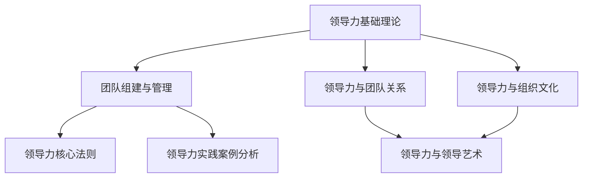

                 

### 文章标题：领导力法则：打造黄金团队的领导力秘诀

关键词：领导力、团队管理、团队建设、团队沟通、领导力法则、组织文化、领导力提升

摘要：本文旨在探讨领导力法则在打造黄金团队中的关键作用，通过深入分析领导力基础理论、领导力与团队关系、领导力与组织文化、团队组建与管理、领导力核心法则以及领导力实践案例分析等多个方面，为读者提供一套切实可行的领导力策略。本文结合具体案例和算法原理，旨在帮助领导者提升自身领导力，打造高效、和谐、富有创造力的团队。

---

### 第一部分：领导力基础理论

#### 1.1 领导力的定义与特征

领导力是一种能够激发他人潜能，引领团队朝着共同目标前进的能力。它不仅仅是职位赋予的权力，更是一种通过影响力和榜样作用来驱动团队的行为和思维的能力。领导力具有以下特征：

- **影响力**：领导者通过自身的言行和决策来影响团队成员的思想和行为。
- **榜样作用**：领导者通过自身的行动和表现，成为团队成员的榜样，引导团队朝着正确的方向前进。
- **沟通能力**：领导者需要具备良好的沟通能力，能够清晰表达自己的想法，理解团队成员的需求和意见。
- **决策能力**：领导者需要在关键时刻做出正确的决策，并对决策结果负责。

#### 1.2 领导力的重要性

领导力在组织中的重要性不言而喻。一个优秀的领导者能够带领团队克服困难，实现目标，提升组织的竞争力。领导力的重要性主要体现在以下几个方面：

- **推动组织发展**：领导者能够根据组织的战略目标，制定合适的计划和策略，推动组织不断发展。
- **提升团队绩效**：领导者通过激发团队成员的潜能，提高团队的工作效率和绩效。
- **塑造组织文化**：领导者的言行和决策对组织文化具有重要影响，优秀的领导者能够塑造积极向上的组织文化。

#### 1.3 领导力的发展历程

领导力的发展历程可以分为以下几个阶段：

- **权力型领导**：领导者主要依靠职位赋予的权力来指挥和管理团队成员。
- **魅力型领导**：领导者通过自身的魅力和影响力来吸引和激励团队成员。
- **变革型领导**：领导者通过变革和创新来推动组织发展，提升组织的竞争力。
- **超变革型领导**：领导者不仅具备变革型领导的能力，还能够通过影响力和榜样作用，推动整个行业或领域的发展。

---

### 第二部分：领导力与团队关系

#### 2.1 团队结构与角色

团队结构是指团队成员之间的分工和协作关系。一个有效的团队结构应该具备以下特点：

- **清晰的职责分工**：每个团队成员都应该明确自己的职责和任务，避免职责重叠和责任不清。
- **灵活的协作机制**：团队成员之间应该能够灵活协作，共同完成团队目标。
- **良好的沟通渠道**：团队成员之间应该能够顺畅沟通，分享信息和经验。

团队角色是指团队成员在团队中的职能和作用。常见的团队角色包括：

- **领导者**：负责团队的规划、组织、协调和激励。
- **执行者**：负责执行团队计划和任务。
- **协调者**：负责协调团队成员之间的关系，确保团队目标的实现。
- **观察者**：负责观察团队运行情况，提供反馈和建议。

#### 2.2 团队动力与团队发展模型

团队动力是指团队成员之间的相互作用和影响，是推动团队发展的关键因素。团队动力可以分为以下几个方面：

- **目标一致性**：团队成员对团队目标的认同和追求。
- **信任与尊重**：团队成员之间的信任和尊重，是团队协作的基础。
- **沟通与协作**：团队成员之间的沟通和协作，是团队效率的保障。
- **激励与反馈**：领导者对团队成员的激励和反馈，能够提升团队成员的积极性和成就感。

团队发展模型是指团队从形成到成熟的过程。常见的团队发展模型包括：

- **Tuckman模型**：团队发展分为形成期、风暴期、规范期、执行期和 adjourn（解散）期。
- **Adizes模型**：团队发展分为创业期、领导期、扩展期、协作期、建设期和内耗期。

#### 2.3 团队沟通与协作

团队沟通是指团队成员之间通过语言、文字、图像等形式进行的信息交流。有效的团队沟通需要具备以下特点：

- **清晰明确**：沟通内容要清晰明确，避免产生误解和歧义。
- **及时有效**：沟通要及时，确保信息的实时传递和反馈。
- **开放包容**：沟通要开放包容，鼓励团队成员表达意见和反馈。

团队协作是指团队成员共同完成任务的过程。有效的团队协作需要具备以下特点：

- **目标一致性**：团队成员对团队目标的认同和追求。
- **角色分工明确**：团队成员明确自己的职责和任务，避免职责重叠和责任不清。
- **协作机制灵活**：团队成员之间能够灵活协作，共同完成团队目标。

---

### 第三部分：领导力与组织文化

#### 3.1 组织文化的类型与特征

组织文化是指组织在长期运营过程中形成的共同价值观、信念、行为规范和符号等。组织文化可以分为以下几种类型：

- **权力型文化**：强调权威和等级，领导者拥有绝对的权力和决策权。
- **任务型文化**：强调任务完成和目标实现，注重团队协作和绩效。
- **人员型文化**：强调员工价值和员工发展，注重员工的成长和幸福感。
- **学习型文化**：强调持续学习和创新，鼓励团队成员积极参与和贡献。

组织文化的特征包括：

- **共同价值观**：组织成员对共同目标和价值的认同。
- **行为规范**：组织成员在行为上的规范和约束。
- **符号与仪式**：组织的符号、仪式和文化象征。

#### 3.2 领导力对组织文化的影响

领导力对组织文化具有重要影响。优秀的领导者能够塑造积极向上的组织文化，推动组织的发展。领导力对组织文化的影响主要表现在以下几个方面：

- **价值观引导**：领导者通过自身的言行和决策，传递和弘扬组织的价值观。
- **行为示范**：领导者通过自身的行动，成为团队成员的榜样和示范。
- **制度设计**：领导者通过制度设计，引导和规范组织成员的行为。
- **文化传承**：领导者通过文化传承，确保组织文化的持续发展和传承。

#### 3.3 建立积极组织文化的方法

建立积极组织文化需要领导者的努力和智慧。以下是一些建立积极组织文化的方法：

- **明确价值观**：领导者要明确组织的价值观，并将其融入到组织的日常运营和管理中。
- **激励机制**：领导者要建立激励机制，鼓励员工积极参与和贡献。
- **培训与学习**：领导者要鼓励员工进行培训和学习，提升员工的技能和素质。
- **沟通与反馈**：领导者要加强与员工的沟通和反馈，确保信息的畅通和及时性。

---

### 第四部分：团队组建与管理

#### 4.1 团队成员的选择与配置

团队成员的选择与配置是团队组建的重要环节。领导者需要根据团队目标和任务，选择合适的团队成员。以下是一些团队成员选择与配置的原则：

- **能力匹配**：团队成员的能力应该与团队目标和任务相匹配，确保团队成员能够胜任工作。
- **性格互补**：团队成员的性格应该互补，有利于团队成员之间的协作和沟通。
- **多元化**：团队成员应该具备多元化背景和经验，有利于团队的创新和多元化思考。
- **积极态度**：团队成员应该具备积极的态度和敬业精神，有利于团队的发展和进步。

#### 4.2 团队目标与计划

团队目标是指团队要实现的具体目标和期望。团队目标应该具备以下特点：

- **明确具体**：团队目标要明确具体，便于团队成员理解和执行。
- **挑战性**：团队目标要具备挑战性，激发团队成员的积极性和潜力。
- **可实现性**：团队目标要具备可实现性，确保团队成员能够通过努力实现目标。

团队计划是指为实现团队目标而制定的行动计划。团队计划应该具备以下特点：

- **明确步骤**：团队计划要明确具体的步骤，便于团队成员按照计划执行。
- **时间安排**：团队计划要合理安排时间，确保团队成员有足够的时间完成任务。
- **资源分配**：团队计划要明确资源的分配，确保团队成员有足够的资源完成任务。

#### 4.3 团队激励与反馈

团队激励是指领导者通过激励措施，激发团队成员的积极性和创造力。以下是一些团队激励的方法：

- **物质激励**：通过奖金、津贴、福利等物质手段，激励团队成员的积极性。
- **精神激励**：通过表扬、认可、荣誉等精神手段，激励团队成员的积极性。
- **参与激励**：通过让团队成员参与决策和项目，激发团队成员的积极性和责任感。

团队反馈是指领导者对团队成员的工作进行评价和反馈。以下是一些团队反馈的方法：

- **正面反馈**：对团队成员的工作给予积极的评价和认可，鼓励团队成员继续努力。
- **建设性反馈**：对团队成员的工作给予具体的建议和指导，帮助团队成员改进和提升。
- **持续反馈**：领导者要定期对团队成员的工作进行反馈，确保团队成员能够持续改进和提升。

---

### 第五部分：领导力核心法则

#### 5.1 法则一：树立愿景和目标

树立愿景和目标是领导力的核心法则之一。领导者需要明确团队的愿景和目标，并将其传递给团队成员，激发团队成员的积极性和创造力。以下是一些树立愿景和目标的方法：

- **明确具体**：愿景和目标要明确具体，便于团队成员理解和执行。
- **激发热情**：愿景和目标要激发团队成员的热情和动力，使其充满信心和决心。
- **分阶段实现**：愿景和目标要分阶段实现，确保团队成员能够逐步实现目标，增加成就感和满足感。
- **持续沟通**：领导者要定期与团队成员沟通愿景和目标，确保团队成员对愿景和目标的认同和理解。

#### 5.2 法则二：建立信任和尊重

建立信任和尊重是团队协作的基础。领导者需要通过建立信任和尊重，打造和谐、互助的团队氛围。以下是一些建立信任和尊重的方法：

- **以身作则**：领导者要以身作则，通过自身的言行和决策，赢得团队成员的信任和尊重。
- **透明沟通**：领导者要透明沟通，及时向团队成员传递信息，增强团队成员的信任感。
- **倾听意见**：领导者要倾听团队成员的意见和建议，尊重团队成员的个性和差异，增强团队成员的归属感。
- **鼓励反馈**：领导者要鼓励团队成员进行反馈，接受团队成员的建议和批评，不断改进和提升。

#### 5.3 法则三：沟通与倾听

沟通与倾听是领导者的重要技能。有效的沟通和倾听能够增进领导者与团队成员之间的了解和信任，提高团队协作效率。以下是一些沟通与倾听的方法：

- **清晰表达**：领导者要清晰表达自己的想法和意见，确保团队成员能够理解和执行。
- **倾听理解**：领导者要倾听团队成员的意见和想法，理解团队成员的需求和困难。
- **积极反馈**：领导者要积极反馈团队成员的意见和反馈，鼓励团队成员的参与和贡献。
- **情感共鸣**：领导者要关注团队成员的情感需求，与团队成员建立情感共鸣，增强团队的凝聚力。

#### 5.4 法则四：激发潜能和鼓励成长

激发潜能和鼓励成长是领导者的重要使命。领导者需要通过激发团队成员的潜能和鼓励成长，提升团队的整体素质和竞争力。以下是一些激发潜能和鼓励成长的方法：

- **设置挑战**：领导者要为团队成员设置合适的挑战，激发团队成员的潜能和积极性。
- **提供资源**：领导者要为团队成员提供必要的资源和支持，帮助团队成员实现成长。
- **鼓励学习**：领导者要鼓励团队成员进行学习，不断提升团队成员的技能和知识水平。
- **认可成就**：领导者要认可团队成员的成就和进步，激发团队成员的自信心和动力。

#### 5.5 法则五：有效授权和赋能

有效授权和赋能是领导者的重要职责。领导者需要通过有效授权和赋能，提高团队的工作效率和自主性。以下是一些有效授权和赋能的方法：

- **明确职责**：领导者要明确团队成员的职责和权限，确保团队成员能够自主决策和行动。
- **信任支持**：领导者要信任团队成员，给予团队成员足够的支持和鼓励，增强团队成员的自主性。
- **提供培训**：领导者要为团队成员提供培训和发展机会，提升团队成员的能力和素质。
- **激励创新**：领导者要激励团队成员进行创新和尝试，鼓励团队成员勇于承担责任和挑战。

#### 5.6 法则六：持续反馈和改进

持续反馈和改进是领导者的重要任务。领导者需要通过持续反馈和改进，提升团队的工作效率和绩效。以下是一些持续反馈和改进的方法：

- **定期反馈**：领导者要定期对团队成员的工作进行反馈，及时指出问题和不足，提出改进建议。
- **建设性反馈**：领导者要给出建设性的反馈，帮助团队成员找到改进的方向和方法。
- **持续改进**：领导者要鼓励团队成员持续改进，不断优化工作流程和方法，提高工作效率。
- **反思总结**：领导者要鼓励团队成员进行反思和总结，从经验中吸取教训，不断提升自身的素质和能力。

---

### 第六部分：领导力实践案例分析

#### 6.1 案例一：苹果公司的领导力实践

苹果公司作为全球知名的高科技企业，其领导力实践具有很高的借鉴意义。以下是苹果公司领导力实践的关键要素：

- **愿景和目标**：史蒂夫·乔布斯明确提出了“打造世界上最卓越的产品”的愿景和目标，激励团队成员为之努力。
- **创新文化**：苹果公司注重创新，鼓励团队成员提出新的想法和解决方案，激发团队的创造力。
- **激励制度**：苹果公司通过奖金、股权激励等制度，激励团队成员的积极性和创造力。
- **领导风格**：乔布斯以坚定的信念和敏锐的洞察力，成为团队的领导者，赢得了团队成员的信任和尊重。

#### 6.2 案例二：谷歌团队的领导力经验

谷歌公司作为全球知名的高科技企业，其团队领导力经验具有很高的参考价值。以下是谷歌团队领导力经验的关键要素：

- **参与型领导**：谷歌的领导者鼓励团队成员参与决策和项目，提升团队成员的自主性和创造力。
- **开放沟通**：谷歌倡导开放沟通，鼓励团队成员表达意见和反馈，确保信息的畅通和及时性。
- **员工福利**：谷歌提供丰富的员工福利，提升员工的工作满意度和幸福感，增强团队的凝聚力。
- **持续学习**：谷歌鼓励员工进行学习和培训，不断提升员工的能力和素质，推动团队的发展。

#### 6.3 案例三：国内某知名互联网企业的领导力策略

国内某知名互联网企业通过一系列领导力策略，打造了一支高效、和谐、富有创造力的团队。以下是该企业领导力策略的关键要素：

- **扁平化管理**：企业采用扁平化管理模式，减少层级和审批环节，提升团队的工作效率。
- **员工关怀**：企业注重员工关怀，关注员工的生活和工作需求，提升员工的工作满意度和忠诚度。
- **激励机制**：企业建立完善的激励机制，鼓励员工积极参与和贡献，激发员工的积极性和创造力。
- **培训与发展**：企业为员工提供丰富的培训和发展机会，提升员工的能力和素质，助力企业的持续发展。

---

### 第七部分：领导力自我评估与提升

#### 7.1 领导力评估工具

领导力评估是提升领导力的重要环节。以下是一些常用的领导力评估工具：

- **360度评估**：通过团队成员、上级、下属和合作伙伴的反馈，对领导者的领导力进行全方位评估。
- **领导力问卷**：通过问卷调查，收集团队成员对领导者的看法和建议，评估领导者的领导力水平。
- **行为观察**：通过观察领导者的言行和决策，评估领导者的领导力表现。
- **情景模拟**：通过情景模拟，评估领导者在面对不同情境时的应变能力和决策能力。

#### 7.2 自我提升策略

领导者需要不断自我提升，以适应不断变化的环境和挑战。以下是一些自我提升策略：

- **学习与培训**：领导者要不断学习新知识、新技能，参加培训课程，提升自身的专业素养。
- **反思与总结**：领导者要定期反思和总结自己的工作，分析自身的优势和不足，制定改进计划。
- **角色扮演**：领导者可以通过角色扮演，模拟不同情境下的决策和行动，提升自身的领导力。
- **寻求反馈**：领导者要积极寻求团队成员和合作伙伴的反馈，了解自己的领导力表现，改进和提升。

---

### 第八部分：领导力发展路径与规划

#### 8.1 职业发展路径

领导者的职业发展路径可以分为以下几个阶段：

- **初级领导**：领导者要掌握基本的领导技能，如沟通、协调、激励等，提升自身的工作能力和团队管理能力。
- **中级领导**：领导者要具备团队管理的能力，能够带领团队实现目标，提升团队的绩效和凝聚力。
- **高级领导**：领导者要具备战略规划和管理能力，能够推动组织的发展和创新，提升组织的竞争力。
- **顶级领导**：领导者要具备全球视野和领导力，能够影响和引领行业或领域的发展。

#### 8.2 领导力培训与发展

领导力培训与发展是提升领导者能力的重要途径。以下是一些领导力培训与发展的方法：

- **内部培训**：企业可以通过内部培训，提升领导者的专业素养和管理能力。
- **外部培训**：领导者可以参加外部培训课程，学习新的知识和技能，拓展视野。
- **实战经验**：领导者可以通过参与项目管理和团队建设，积累实战经验，提升领导力。
- **导师辅导**：领导者可以寻求导师的指导和帮助，获取宝贵的经验和建议。

---

### 第九部分：领导力与领导艺术

#### 9.1 领导者的情绪管理

领导者的情绪管理是领导力的重要组成部分。以下是一些情绪管理的技巧：

- **自我觉察**：领导者要时刻关注自己的情绪变化，了解自己的情绪状态。
- **情绪调节**：领导者要学会调节自己的情绪，避免情绪的负面波动。
- **积极心态**：领导者要培养积极的心态，面对困难和挑战时保持冷静和乐观。
- **同理心**：领导者要关注团队成员的情绪需求，尊重和理解团队成员的情绪变化。

#### 9.2 领导风格与领导艺术

领导风格与领导艺术是领导者的重要素质。以下是一些领导风格和领导艺术的技巧：

- **民主型领导**：领导者要尊重团队成员的意见和参与，鼓励团队成员的民主参与和合作。
- **权威型领导**：领导者要明确自己的权威地位，制定明确的决策和规划，确保团队的执行力。
- **参与型领导**：领导者要鼓励团队成员参与决策和项目，激发团队成员的积极性和创造力。
- **变革型领导**：领导者要具备变革和创新的能力，推动组织的发展和创新。

#### 9.3 领导力与可持续发展

领导力与可持续发展是领导者的重要责任。以下是一些领导力与可持续发展的策略：

- **绿色发展**：领导者要推动企业的绿色发展，关注环境保护和资源利用。
- **社会责任**：领导者要关注企业的社会责任，推动企业履行社会责任，为社会做出贡献。
- **员工发展**：领导者要关注员工的发展，提供培训和职业发展机会，提升员工的能力和素质。
- **创新驱动**：领导者要推动企业的创新驱动，鼓励创新思维和实践，提升企业的竞争力。

---

### 附录

#### 9.1 领导力相关书籍推荐

- 《领导力五项修炼》
- 《第五项修炼：学习型组织的艺术与实务》
- 《领导者法则》
- 《变革之舞：如何领导转变》
- 《领导力的五项实践：基于关键人才发展的领导力发展》

#### 9.2 领导力实践工具箱

- **领导力评估问卷**：用于评估领导者的领导力水平。
- **领导力发展计划**：用于制定领导者的个人发展计划。
- **团队反馈机制**：用于收集团队成员的反馈，改进领导力实践。
- **领导力培训课程**：用于提升领导者的专业素养和管理能力。

### 核心概念与联系 Mermaid 流程图



### 核心算法原理讲解

领导力法则的算法实现：

```python
# 法则一：树立愿景和目标（伪代码）

def set_vision_and_goals(team_members):
    for member in team_members:
        print(f"向{member.name}阐述团队愿景和目标")
        member.accept_vision_and_goals()

# 法则二：建立信任和尊重（伪代码）

def build_trust_and_respect(team_members):
    for member in team_members:
        print(f"与{member.name}建立信任和尊重")
        member.report_progress()

# 法则三：沟通与倾听（伪代码）

def communicate_and_listen(team_members):
    for member in team_members:
        print(f"与{member.name}沟通并倾听其意见")
        member.share_ideas()

# 法则四：激发潜能和鼓励成长（伪代码）

def inspire_potential_and_encourage_growth(team_members):
    for member in team_members:
        print(f"激发{member.name}的潜能并鼓励成长")
        member.evaluate_and_improve()

# 法则五：有效授权和赋能（伪代码）

def authorize_and_empower(team_members):
    for member in team_members:
        print(f"向{member.name}有效授权和赋能")
        member.take_responsibility()

# 法则六：持续反馈和改进（伪代码）

def continuous_feedback_and_improvement(team_members):
    for member in team_members:
        print(f"对{member.name}的工作进行持续反馈和改进")
        member.receive_feedback()
```

### 核心概念与联系 Mermaid 流程图


### 核心算法原理讲解

领导力法则的算法实现：

```python
# 法则一：树立愿景和目标（伪代码）

def set_vision_and_goals(team_members):
    for member in team_members:
        print(f"向{member.name}阐述团队愿景和目标")
        member.accept_vision_and_goals()

# 法则二：建立信任和尊重（伪代码）

def build_trust_and_respect(team_members):
    for member in team_members:
        print(f"与{member.name}建立信任和尊重")
        member.report_progress()

# 法则三：沟通与倾听（伪代码）

def communicate_and_listen(team_members):
    for member in team_members:
        print(f"与{member.name}沟通并倾听其意见")
        member.share_ideas()

# 法则四：激发潜能和鼓励成长（伪代码）

def inspire_potential_and_encourage_growth(team_members):
    for member in team_members:
        print(f"激发{member.name}的潜能并鼓励成长")
        member.evaluate_and_improve()

# 法则五：有效授权和赋能（伪代码）

def authorize_and_empower(team_members):
    for member in team_members:
        print(f"向{member.name}有效授权和赋能")
        member.take_responsibility()

# 法则六：持续反馈和改进（伪代码）

def continuous_feedback_and_improvement(team_members):
    for member in team_members:
        print(f"对{member.name}的工作进行持续反馈和改进")
        member.receive_feedback()
```

### 附录

#### 11. 领导力相关书籍推荐

- 《领导力五项修炼》
- 《第五项修炼：学习型组织的艺术与实务》
- 《领导者法则》
- 《变革之舞：如何领导转变》
- 《领导力的五项实践：基于关键人才发展的领导力发展》

#### 12. 领导力实践工具箱

- **领导力评估问卷**：用于评估领导者的领导力水平。
- **领导力发展计划**：用于制定领导者的个人发展计划。
- **团队反馈机制**：用于收集团队成员的反馈，改进领导力实践。
- **领导力培训课程**：用于提升领导者的专业素养和管理能力。

---

### 总结与展望

本文系统地阐述了领导力法则在打造黄金团队中的关键作用，从领导力基础理论、领导力与团队关系、领导力与组织文化、团队组建与管理、领导力核心法则以及领导力实践案例分析等多个方面，深入探讨了领导力的本质和实际应用。通过具体的案例和算法原理讲解，本文为读者提供了一套切实可行的领导力策略。

在未来的发展中，领导者需要不断学习新知识、新技能，提升自身的领导力水平。同时，领导者要关注团队的建设和发展，建立积极向上的组织文化，激发团队的创造力和创新能力。只有这样，领导者才能打造一支高效、和谐、富有创造力的团队，推动组织的持续发展和进步。

最后，感谢读者对本文的关注和支持，希望本文能够为您的领导力提升之路提供有益的启示和指导。如果您在领导力实践中遇到任何问题或困惑，欢迎在评论区留言交流，共同探讨和进步。让我们一起努力，成为优秀的领导者，共同创造美好的未来！作者：AI天才研究院/AI Genius Institute & 禅与计算机程序设计艺术 /Zen And The Art of Computer Programming。

