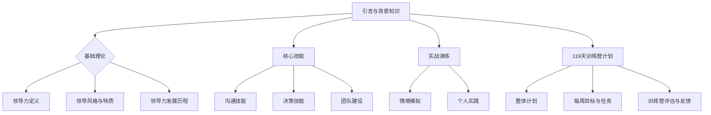

                 


### 文章标题

《领导力训练营：119天从新手到专家》

### 关键词

- 领导力
- 自我提升
- 技能培养
- 沟通技巧
- 团队管理
- 决策能力

### 摘要

本文旨在为那些渴望提升领导能力的专业人士提供一份详细的119天领导力训练营计划。通过系统性的学习和实践，读者将深入了解领导力的核心概念，掌握关键技能，并最终从新手成长为专家级领导者。文章从基础理论、核心技能、实战演练到个人实践，全面剖析了领导力提升的各个方面，旨在为读者提供一条清晰、可行的成长路径。

### 引言与背景知识

#### 第1章：引言

##### 1.1 领导力的重要性

在当今快速变化和竞争激烈的社会环境中，领导力的重要性不言而喻。优秀的领导者不仅能够激励团队成员实现个人和团队目标，还能在逆境中保持团队的凝聚力和创新精神。领导力是一种关键能力，对于任何希望取得成功的人和组织都至关重要。

##### 1.2 书籍的目的与受众

本书旨在为那些希望提升领导能力的专业人士提供一套系统的培训课程。无论你是初入职场的年轻人，还是有一定经验的管理者，本书都将帮助你从理论到实践，全面提升你的领导力。

##### 1.3 书籍的结构与布局

本书分为三个主要部分。第一部分介绍了领导力的基础理论，包括定义、风格、特质和发展历程。第二部分详细阐述了领导力的核心技能，如沟通、决策和团队建设。第三部分则通过实战演练和个人实践，帮助读者将所学知识应用到实际工作中，从而实现从新手到专家的跨越。

#### 第2章：领导力基础理论

##### 2.1 领导力的定义

领导力是一种引导和激励他人实现目标的能力。它不仅仅是职位赋予的权力，更是一种影响力。一个优秀的领导者能够通过其行为、态度和价值观影响团队成员，使其团结一致，朝着共同的目标前进。

##### 2.2 领导风格与特质

领导风格和特质是领导力的两个关键组成部分。领导风格包括权威型、民主型、参与型等，而领导特质则包括自信、正直、创新、决断力等。不同的领导风格和特质适用于不同的情境，但共同的目标是激发团队成员的潜力，推动团队的发展。

##### 2.3 领导力的发展历程

领导力的发展历程可以追溯到古代，随着社会的发展和技术的进步，领导力理论也在不断演变。从早期的领导者依靠权力和权威管理团队，到现代强调团队合作和领导力的多元化，领导力理论的发展反映了社会对领导者的需求变化。

### 领导力核心技能

#### 第3章：沟通技能

##### 3.1 沟通的重要性

沟通是领导力的核心技能之一。有效的沟通能够确保信息的准确传递，减少误解和冲突，增强团队的凝聚力和合作精神。一个优秀的领导者必须具备良好的沟通能力，能够清晰、准确地表达自己的想法，同时也能够倾听和理解团队成员的意见。

##### 3.2 有效沟通的要素

有效沟通包括四个关键要素：清晰性、准确性、及时性和适应性。清晰性要求信息传递时语言简洁明了，避免使用模糊的术语；准确性要求信息传递时保持一致，避免错误和误导；及时性要求信息传递时及时，避免延迟；适应性要求领导者根据不同情境和受众调整沟通方式。

##### 3.3 沟通障碍与解决策略

沟通障碍包括语言障碍、文化差异、心理障碍等。解决沟通障碍的策略包括提高语言表达能力、加强跨文化理解、建立信任和开放的沟通环境。通过这些策略，领导者可以克服沟通障碍，实现更有效的沟通。

#### 第4章：决策技能

##### 4.1 决策过程

决策过程包括问题识别、目标设定、方案评估、决策执行和反馈修正。一个优秀的领导者必须能够有效管理决策过程，确保决策的准确性、及时性和适应性。

##### 4.2 决策分析方法

决策分析方法包括定性分析和定量分析。定性分析通过专家意见、经验判断和逻辑推理等方法评估方案；定量分析通过数据统计、模型模拟和决策树等方法评估方案。领导者应根据具体情境选择合适的分析方法。

##### 4.3 风险评估与应对策略

风险评估是决策过程中至关重要的一环。领导者必须识别潜在风险，评估其影响，并制定相应的应对策略。常见的风险评估方法包括敏感性分析、概率分析和情景分析。通过风险评估和应对策略，领导者可以降低决策风险，提高决策成功率。

#### 第5章：团队建设

##### 5.1 团队概念与特征

团队是一种组织形式，由多个个体为了实现共同目标而协作。团队具有合作性、互补性、责任感和目标导向等特征。

##### 5.2 团队角色与职责

团队成员通常分为领导层、执行层和支持层。领导层负责制定目标和规划，执行层负责完成任务，支持层提供资源和技术支持。

##### 5.3 团队协作与冲突管理

团队协作是团队成功的关键。领导者应促进团队成员之间的沟通、协调和合作，确保团队目标的实现。冲突管理是团队建设的另一个重要方面。领导者应识别冲突根源，采取适当的策略解决冲突，保持团队的稳定和和谐。

### 实战演练

#### 第6章：领导力情境模拟

##### 6.1 情境模拟的目的

情境模拟是一种模拟真实工作场景的方法，旨在帮助领导者锻炼和提升其领导力。通过情境模拟，领导者可以在模拟的环境中面对各种挑战和问题，从而提高其决策能力、沟通技巧和团队管理能力。

##### 6.2 情境模拟的步骤

情境模拟包括以下步骤：情境设定、角色分配、情境执行、反馈评估和改进。每个步骤都至关重要，确保领导者能够全面体验和反思其领导行为。

##### 6.3 情境模拟案例分析

通过分析实际案例，领导者可以了解如何在不同情境下运用领导力技能。案例分析包括情境设定、问题识别、解决方案评估和实施过程。通过案例分析，领导者可以从中吸取经验教训，提高自己的领导能力。

#### 第7章：领导力个人实践

##### 7.1 自我评估与提升

自我评估是领导力提升的第一步。领导者应定期评估自己的领导力水平，识别自己的优点和不足，并制定相应的提升计划。通过自我评估，领导者可以明确自己的发展方向，有针对性地提升领导力。

##### 7.2 实践案例分享

通过分享自己的实践案例，领导者可以交流经验和教训，相互学习，共同进步。实践案例分享包括情境描述、问题解决过程和结果评估。通过实践案例分享，领导者可以从中获得启示，提高自己的领导能力。

##### 7.3 实践反思与改进

实践反思是领导力提升的关键。领导者应在实践过程中不断反思自己的领导行为，分析成功和失败的原因，并从中吸取教训。通过实践反思和改进，领导者可以不断提升自己的领导力，实现个人和团队的目标。

### 119天领导力训练营计划

##### 8.1 训练营的整体计划

119天领导力训练营计划旨在通过系统性的学习和实践，帮助参与者全面提升领导力。训练营分为三个阶段，每个阶段为期40天，分别涵盖基础理论、核心技能和实战演练。

##### 8.2 每周目标与任务

在每个阶段，每周都有明确的学习目标和任务。基础理论阶段包括领导力定义、领导风格、特质和发展历程等内容；核心技能阶段包括沟通技巧、决策能力和团队建设等内容；实战演练阶段通过情境模拟和个人实践，帮助参与者将所学知识应用到实际工作中。

##### 8.3 训练营评估与反馈

训练营结束后，将进行全面的评估与反馈。评估内容包括领导力水平、技能掌握程度和实际应用效果等。通过评估和反馈，参与者可以了解自己的进步情况，找到自己的不足，并制定下一步的提升计划。

### 附录

##### 附录 A：领导力相关资源

为了帮助读者进一步学习和提升领导力，附录A提供了以下资源：

- 优质领导力书籍推荐
- 领导力学习网站与平台
- 领导力研讨会与培训课程

通过这些资源，读者可以深入了解领导力理论，掌握最新的领导力实践方法，不断提升自己的领导力水平。

### Mermaid 流程图

以下是本书各章节关系的 Mermaid 流程图：



### 核心算法原理讲解

#### 领导力评估模型

以下是领导力评估模型的伪代码：

```python
def 领导力评估(领导行为，下属反馈):
    成熟度 = 计算成熟度分数(领导行为)
    信任度 = 计算信任度分数(下属反馈)
    领导力得分 = 成熟度 * 信任度
    return 领导力得分
```

详细解释：

- **成熟度分数**：通过分析领导行为，如决策能力、沟通技巧和团队管理能力，计算出一个分数。这反映了领导者在领导方面的成熟度和专业水平。
- **信任度分数**：通过分析下属反馈，如对领导者的信任度、满意度和工作氛围等，计算出一个分数。这反映了下属对领导者的信任程度和团队氛围。
- **领导力得分**：成熟度分数和信任度分数相乘，得到一个综合的领导力得分。这个得分反映了领导者在团队中的领导能力。

举例说明：

假设一个领导者的成熟度分数是80，下属反馈中的信任度分数是90，则其领导力得分是7200。这意味着这个领导者在团队中具有很高的领导能力。

#### 团队效能优化算法

以下是团队效能优化算法的伪代码：

```python
def 团队效能优化(团队任务，团队成员能力):
    任务优先级 = 计算任务优先级(团队任务)
    成员负荷 = 计算成员负荷(团队成员能力)
    优化方案 = 选择最优负荷分配方案(任务优先级，成员负荷)
    return 优化方案
```

详细解释：

- **任务优先级**：通过分析团队任务的重要性、紧急程度和完成时间，计算出一个优先级分数。这个分数反映了每个任务的重要性和紧急程度。
- **成员负荷**：通过分析团队成员的能力、可用时间和工作负荷，计算出一个负荷分数。这个分数反映了每个团队成员的工作能力和时间分配。
- **优化方案**：根据任务优先级和成员负荷，选择出最优的负荷分配方案。这个方案能够最大化团队效能，确保每个任务都能在最佳时间内完成。

举例说明：

假设有一个团队任务列表，其中任务1的优先级是90，任务2的优先级是80。团队成员1的负荷分数是70，团队成员2的负荷分数是60。通过优化算法，可以选择任务1分配给团队成员1，任务2分配给团队成员2，从而最大化团队效能。

### 数学模型和数学公式

#### 领导力评估数学模型

以下是领导力评估的数学模型：

$$
领导力得分 = 成熟度分数 \times 信任度分数
$$

详细解释：

- **成熟度分数**：通过以下公式计算：

  $$
  成熟度分数 = (决策能力分数 + 沟通技巧分数 + 团队管理能力分数) / 3
  $$

- **信任度分数**：通过以下公式计算：

  $$
  信任度分数 = (信任度1 + 信任度2 + ... + 信任度n) / n
  $$

  其中，信任度1、信任度2、...、信任度n分别为下属对领导者的信任度评分。

#### 团队效能优化数学模型

以下是团队效能优化的数学模型：

$$
优化方案 = \max \{团队效能得分 | 方案符合任务优先级和成员负荷限制\}
$$

详细解释：

- **团队效能得分**：通过以下公式计算：

  $$
  团队效能得分 = \sum_{i=1}^{n} (任务i优先级 \times 成员i负荷分数)
  $$

  其中，任务i优先级和成员i负荷分数分别为任务i和成员i的优先级和负荷分数。

- **优化方案**：通过计算所有可能的负荷分配方案，选择出能够最大化团队效能的方案。

### 最佳实践 Tips

1. **持续学习**：领导力是一个不断发展和变化的领域，领导者需要持续学习新的知识和技能，以适应不断变化的环境。
2. **建立信任**：信任是领导力的核心，领导者需要通过诚实、透明和负责任的行为建立和维护与团队成员的信任关系。
3. **倾听与反馈**：领导者应该倾听团队成员的意见和建议，及时给予反馈，以促进沟通和团队协作。
4. **鼓励创新**：领导者应该鼓励团队成员创新，提供支持和资源，以推动团队的发展和进步。
5. **关注团队氛围**：领导者需要关注团队氛围，确保团队成员之间相互尊重、信任和支持，以促进团队的稳定和和谐。

### 小结

领导力是一种关键能力，对于个人的职业发展和组织的成功都至关重要。通过系统的学习和实践，领导者可以从新手逐步成长为专家。本书通过详细的理论讲解、技能培养和实战演练，为领导者提供了全面提升领导力的方法和路径。希望读者能够通过本书的学习，不断提升自己的领导能力，实现个人和团队的共同成长。

### 注意事项

1. **认真阅读本书**：本书内容丰富，涉及多个方面，建议读者逐章仔细阅读，确保对每个章节的核心概念和原理有深入理解。
2. **实践与应用**：理论知识需要通过实践来巩固和应用。读者应在实际工作中尝试应用所学知识，不断反思和改进。
3. **积极参与**：本书提供了多个互动环节，如案例分析、实践分享和讨论等，建议读者积极参与，与他人交流和分享经验。

### 拓展阅读

- 《领导力的五个层次》（作者：约翰·麦克斯韦尔）
- 《影响力：说服他人的心理学》（作者：罗伯特·西奥迪尼）
- 《团队协作的艺术》（作者：帕特里克·莱西）
- 《决策与判断》（作者：丹尼尔·卡尼曼）

### 作者信息

- 作者：AI天才研究院/AI Genius Institute & 禅与计算机程序设计艺术/Zen And The Art of Computer Programming

感谢您的阅读，希望本书能够帮助您在领导力道路上取得突破性的进步。

