                 


## 文章标题

《领导力训练营：84天从门外汉到内行人》

## 关键词

领导力，自我评估，沟通技能，决策技能，团队建设，领导力实践，领导力发展趋势

## 摘要

本文将带领读者经历一次深入浅出的领导力训练营之旅。通过84天的系统学习和实践，从零基础开始，逐步掌握领导力的核心概念、基础技能以及高级技能。文章将详细讲解每个阶段的学习内容、实践方法和反思技巧，帮助读者从门外汉迅速成长为内行人，提升个人领导力，推动团队和组织的发展。

### 《领导力训练营：84天从门外汉到内行人》目录大纲

#### 第一部分：领导力基础知识

## 第1章：领导力的定义与重要性

### 1.1 领导力的定义

#### 1.1.1 领导力与传统管理的区别
#### 1.1.2 领导力的核心要素

### 1.2 领导力的重要性

#### 1.2.1 对个人职业发展的影响
#### 1.2.2 对团队和组织的影响

### 1.3 领导力的发展历程

#### 1.3.1 早期领导理论
#### 1.3.2 现代领导理论

## 第2章：领导力核心概念与架构

### 2.1 领导力核心概念

#### 2.1.1 影响力
#### 2.1.2 情绪智力
#### 2.1.3 决策能力

### 2.2 领导力架构

#### 2.2.1 组织架构
#### 2.2.2 沟通架构
#### 2.2.3 协作架构

#### 第二部分：84天领导力训练营

##### 第3章：领导力自我评估

## 3.1 自我评估的重要性

### 3.1.1 自我评估的方法
### 3.1.2 自我评估的益处

## 3.2 自我评估的工具

### 3.2.1 360度反馈
### 3.2.2 领导力评估问卷

## 3.3 自我评估案例

### 3.3.1 案例一：领导者的自我评估
### 3.3.2 案例二：团队成员的自我评估

##### 第4章：领导力基础技能

## 4.1 沟通技能

### 4.1.1 沟通的基本原则
### 4.1.2 沟通的障碍与解决方法
### 4.1.3 有效沟通的技巧

## 4.2 决策技能

### 4.2.1 决策的类型
### 4.2.2 决策过程
### 4.2.3 决策工具与应用

## 4.3 团队建设

### 4.3.1 团队的定义与类型
### 4.3.2 团队建设的关键要素
### 4.3.3 团队领导的职责

##### 第5章：84天领导力训练营计划

## 5.1 训练营总体安排

### 5.1.1 训练营的目标
### 5.1.2 训练营的流程
### 5.1.3 训练营的时间表

## 5.2 每周训练计划

### 5.2.1 周一：自我评估与反思
### 5.2.2 周二：领导力核心概念学习
### 5.2.3 周三：领导力基础技能练习
### 5.2.4 周四：案例分析与讨论
### 5.2.5 周五：总结与反馈
### 5.2.6 周末：放松与充电

##### 第6章：领导力实践与反思

## 6.1 实践的重要性

### 6.1.1 领导力实践的方法
### 6.1.2 实践中的挑战与解决策略

## 6.2 反思与持续成长

### 6.2.1 反思的益处
### 6.2.2 反思的方法
### 6.2.3 持续成长的策略

##### 第7章：领导力进阶

## 7.1 高级领导力技能

### 7.1.1 领导变革
### 7.1.2 战略规划
### 7.1.3 高效沟通

## 7.2 领导力与心理学

### 7.2.1 领导力与心理学的关系
### 7.2.2 心理学在领导力实践中的应用

## 7.3 领导力发展趋势

### 7.3.1 数字化领导力
### 7.3.2 社交领导力
### 7.3.3 持续学习领导力

##### 第8章：领导力训练营总结与展望

## 8.1 训练营成果总结

### 8.1.1 个人成长
### 8.1.2 团队协作提升
### 8.1.3 领导力实践应用

## 8.2 展望未来

### 8.2.1 领导力的持续发展
### 8.2.2 领导力在组织中的重要性
### 8.2.3 领导力未来的发展趋势

### 附录

## 附录A：领导力工具与资源

### A.1 领导力评估工具
### A.2 领导力学习资源
### A.3 领导力实践案例

## 附录B：84天领导力训练营日程安排

### B.1 每周训练计划
### B.2 每日任务安排
### B.3 训练营活动安排

**Mermaid 流程图示例：**

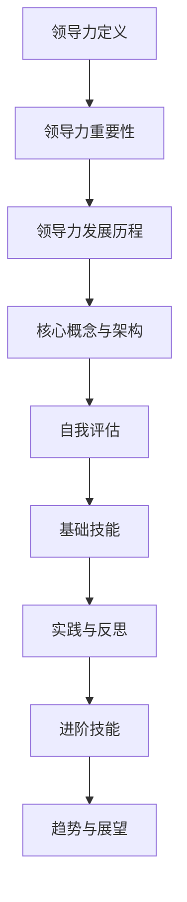

**核心算法原理讲解伪代码示例：**

```python
# 决策技能伪代码

def make_decision(context, options):
    # 分析决策环境
    context_analysis = analyze_context(context)
    
    # 评估每个选项的优缺点
    options_evaluation = evaluate_options(options, context_analysis)
    
    # 根据评估结果选择最佳选项
    best_option = select_best_option(options_evaluation)
    
    # 执行决策
    execute_decision(best_option, context)
```

接下来，我们将逐一深入各个章节，通过逻辑清晰、结构紧凑的论述，帮助读者全面理解领导力的核心概念和实践方法。

### 第一部分：领导力基础知识

#### 第1章：领导力的定义与重要性

领导力是一个多维度、多层次的概念，它在不同的情境下有着不同的表现和内涵。理解领导力的定义和重要性，是每一位希望提升自我领导力的人的必修课。

### 1.1 领导力的定义

领导力与传统管理的区别主要体现在作用方式和目标上。传统管理侧重于通过规章制度、流程优化等方式来控制和管理组织资源，以实现组织的稳定和效率。而领导力则更多地关注于激发和引导团队成员，通过影响力、情感智力、决策能力等核心要素，推动组织的变革和发展。

#### 1.1.1 领导力与传统管理的区别

传统管理强调的是控制和效率，主要依赖正式的权力和组织结构来实现目标。而领导力则强调的是影响和激励，它通过建立信任、愿景和共同的目标来引导团队成员。

#### 1.1.2 领导力的核心要素

领导力的核心要素包括影响力、情绪智力、决策能力等。这些要素相互作用，共同构成了领导力的整体框架。

1. **影响力**：领导力最本质的要素，指的是领导者通过个人魅力、专业技能和价值观来影响他人。
2. **情绪智力**：领导者对自身和他人情绪的理解和管理能力，它对领导力起着至关重要的作用。
3. **决策能力**：领导者在面对复杂情境时，能够迅速做出明智决策的能力。

### 1.2 领导力的重要性

领导力不仅仅对个人职业发展有着深远的影响，也对团队和组织的发展起着至关重要的作用。

#### 1.2.1 对个人职业发展的影响

1. **职业晋升**：领导力是职业晋升的关键能力，具备强大领导力的人更容易获得晋升机会。
2. **个人品牌**：领导力是建立个人品牌的重要元素，它可以帮助个人在职场中脱颖而出。

#### 1.2.2 对团队和组织的影响

1. **团队凝聚力**：领导者通过影响力和情感智力，可以增强团队成员之间的凝聚力。
2. **组织效率**：有效的领导力可以提升组织的运作效率，推动组织目标的实现。

### 1.3 领导力的发展历程

领导力的发展历程可以分为早期领导理论和现代领导理论两个阶段。

#### 1.3.1 早期领导理论

早期领导理论主要包括领导特质论、情境领导理论等。这些理论主要关注领导者的个人特质和领导方式。

#### 1.3.2 现代领导理论

现代领导理论则更加注重领导力在组织变革和发展中的作用，包括领导变革理论、领导力发展模型等。这些理论为领导者提供了更加全面和系统的指导。

综上所述，领导力是一个多维度的概念，它不仅涉及个人职业发展，也对团队和组织的发展有着深远的影响。理解领导力的定义和重要性，是每一位希望提升自我领导力的人的必修课。

### 第2章：领导力核心概念与架构

在理解了领导力的定义与重要性之后，接下来我们需要深入探讨领导力的核心概念与架构。这些核心概念和架构构成了领导力的基本框架，是领导者在实际工作中需要掌握和运用的关键要素。

### 2.1 领导力核心概念

领导力的核心概念主要包括影响力、情绪智力、决策能力等。这些概念相互作用，共同构成了领导力的整体结构。

#### 2.1.1 影响力

影响力是领导力的核心要素，它指的是领导者通过个人魅力、专业技能和价值观来影响他人的能力。影响力不仅体现在领导与团队成员之间的互动中，也体现在领导者与外部利益相关者之间的互动中。

**核心概念联系架构：**

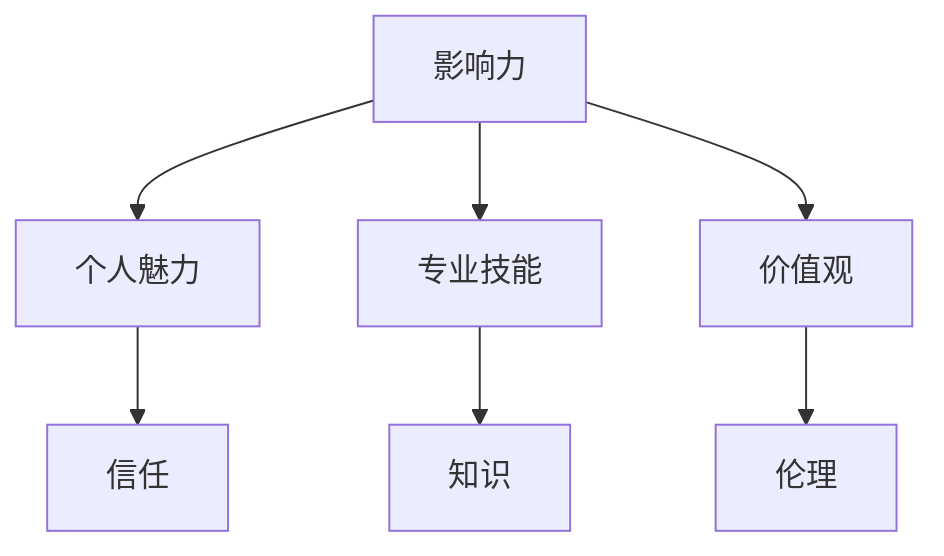

**影响力架构图说明：** 

- **个人魅力（B）**：指的是领导者通过自身的气质、风度和人格魅力来吸引和影响他人。
- **专业技能（C）**：领导者需要具备的专业知识和技能，使他们在团队中具备权威性和可信度。
- **价值观（D）**：领导者的价值观会影响其决策和行为，进而影响团队成员。

#### 2.1.2 情绪智力

情绪智力是领导者对自身和他人情绪的理解和管理能力。它包括自我意识、自我调节、社交意识和社会技能等方面。

**核心概念联系架构：**

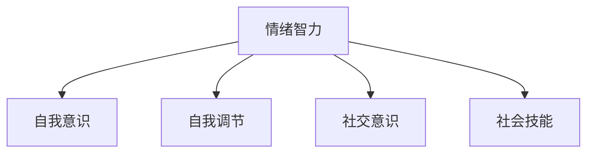

**情绪智力架构图说明：**

- **自我意识（B）**：领导者需要认识到自己的情绪，并理解情绪如何影响其行为。
- **自我调节（C）**：领导者需要学会控制和管理自己的情绪，保持冷静和理智。
- **社交意识（D）**：领导者需要理解他人的情绪和需求，以更好地与他人沟通和合作。
- **社会技能（E）**：领导者需要具备良好的沟通技巧和人际交往能力，以有效地与他人互动。

#### 2.1.3 决策能力

决策能力是领导者在面对复杂情境时，能够迅速做出明智决策的能力。决策能力包括问题识别、方案评估、风险分析等方面。

**核心概念联系架构：**

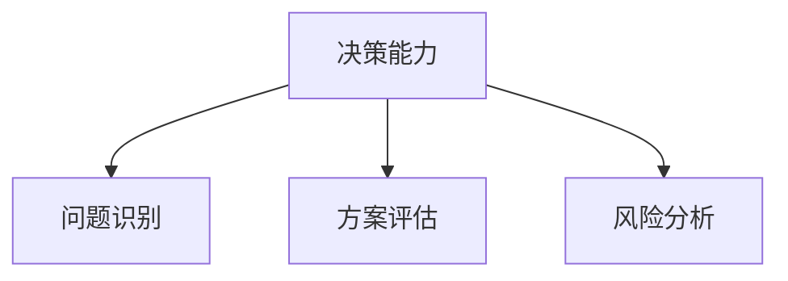

**决策能力架构图说明：**

- **问题识别（B）**：领导者需要准确识别问题的本质和关键点。
- **方案评估（C）**：领导者需要对不同的解决方案进行评估和比较。
- **风险分析（D）**：领导者需要评估决策的风险和可能的后果。

### 2.2 领导力架构

领导力的架构包括组织架构、沟通架构和协作架构。这些架构共同构成了领导力的实施环境。

#### 2.2.1 组织架构

组织架构是领导力的基础，它决定了领导力的实施方式和效果。一个良好的组织架构能够支持领导力的发挥，提高组织的效率。

**组织架构核心概念联系架构：**

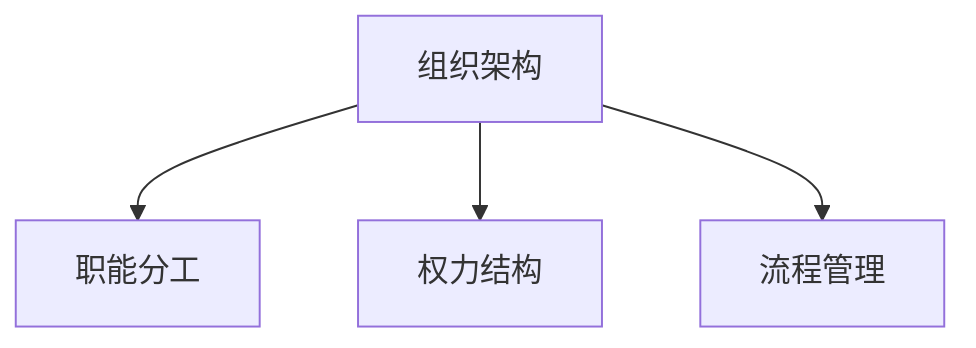

**组织架构架构图说明：**

- **职能分工（B）**：组织根据职能进行分工，使各个部门各司其职，提高效率。
- **权力结构（C）**：组织的权力结构决定了领导力的实施方式，不同的权力结构会影响领导力的效果。
- **流程管理（D）**：流程管理确保组织的工作有序进行，提高工作效率。

#### 2.2.2 沟通架构

沟通架构是领导力实施的重要工具，它决定了信息在组织内部的传递和交流方式。有效的沟通架构能够提高组织的协调性和效率。

**沟通架构核心概念联系架构：**

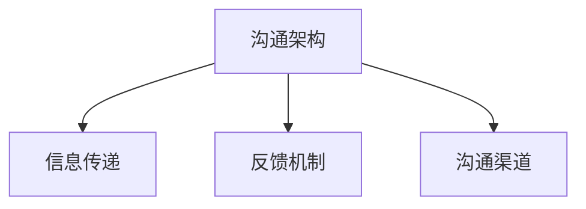

**沟通架构架构图说明：**

- **信息传递（B）**：沟通架构确保信息在组织内部的准确和高效传递。
- **反馈机制（C）**：反馈机制是领导力的重要环节，它帮助领导者了解团队的工作情况和需求。
- **沟通渠道（D）**：沟通渠道包括正式和非正式的沟通方式，不同的渠道适用于不同的沟通需求。

#### 2.2.3 协作架构

协作架构是领导力实施的保障，它决定了团队成员之间的协作方式和效率。一个良好的协作架构能够促进团队的合作和共同进步。

**协作架构核心概念联系架构：**

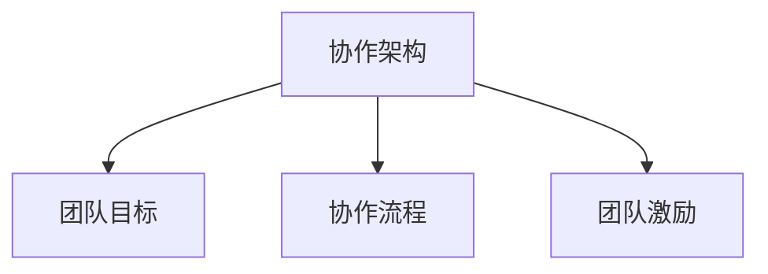

**协作架构架构图说明：**

- **团队目标（B）**：协作架构以团队目标为导向，确保团队成员共同努力。
- **协作流程（C）**：协作流程确保团队成员之间的协同工作，提高效率。
- **团队激励（D）**：团队激励是领导力的重要手段，它能够激发团队成员的积极性和创造力。

综上所述，领导力的核心概念与架构构成了领导力的基本框架，是领导者在实际工作中需要掌握和运用的关键要素。理解这些核心概念和架构，能够帮助领导者更有效地发挥领导力，推动组织的发展和进步。

#### 第3章：领导力自我评估

在理解了领导力的核心概念与架构之后，自我评估成为了一个重要的环节。自我评估不仅可以帮助我们了解自身的领导力水平，还可以帮助我们识别需要改进的领域，从而有针对性地进行提升。

### 3.1 自我评估的重要性

自我评估是领导力发展的基础，它可以帮助我们：

1. **认识自身优点和不足**：通过自我评估，我们可以清楚地认识到自己的优势和劣势，为后续的发展提供明确的指引。
2. **制定个人发展计划**：自我评估可以帮助我们识别需要提升的领域，从而制定针对性的个人发展计划。
3. **持续成长**：自我评估是一个动态的过程，它可以帮助我们持续跟踪自身的成长轨迹，确保持续成长。

#### 3.1.1 自我评估的方法

自我评估的方法主要包括以下几种：

1. **360度反馈**：360度反馈是一种综合评估方法，它通过收集来自团队成员、上级、下属以及同级的反馈，全面评估领导者的表现。
2. **领导力评估问卷**：领导力评估问卷是一种标准化的评估工具，通过一系列问题来评估领导者的不同维度。

**自我评估方法流程图：**

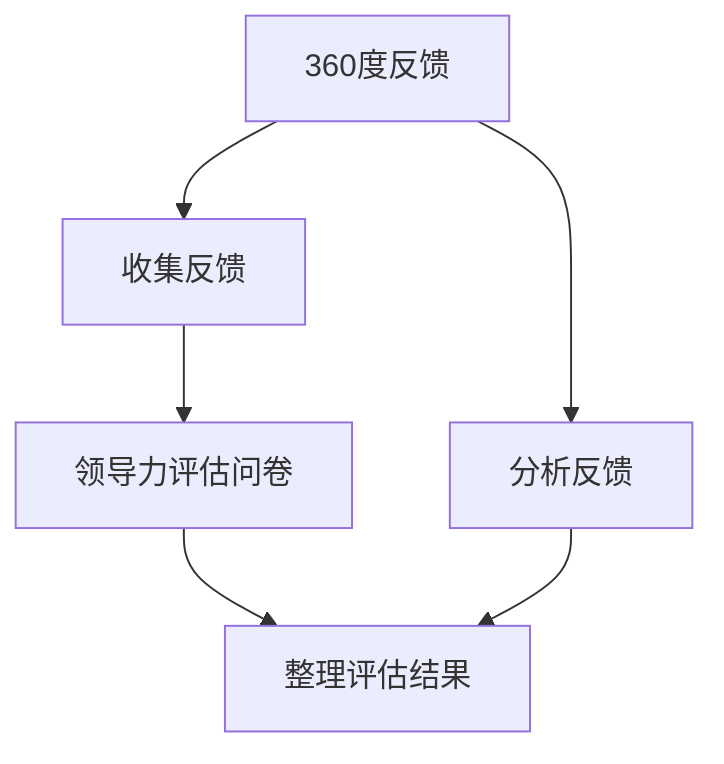

**流程图说明：**

- **360度反馈（A）**：通过收集多方面的反馈，获取全面的评估数据。
- **收集反馈（B）**：收集来自团队成员、上级、下属以及同级的反馈。
- **分析反馈（C）**：对收集到的反馈进行分析，识别优势和不足。
- **领导力评估问卷（D）**：使用标准化的问卷进行评估。
- **整理评估结果（E）**：整理分析结果，制定个人发展计划。

#### 3.1.2 自我评估的益处

自我评估的益处主要体现在以下几个方面：

1. **提升自我认识**：通过自我评估，我们可以更清楚地了解自己的领导力水平，找到需要改进的领域。
2. **促进个人成长**：自我评估可以帮助我们制定个人发展计划，持续提升自身的领导力。
3. **增强团队协作**：自我评估不仅关注个人发展，还可以促进团队协作，提高整体绩效。

#### 3.2 自我评估的工具

在自我评估过程中，我们可以使用多种工具来帮助我们进行评估。

**常用的自我评估工具：**

1. **360度反馈**：这是一种通过多方面反馈来评估领导者的工具，它可以帮助我们获取全面的评估数据。
2. **领导力评估问卷**：这是一种标准化的评估工具，通过一系列问题来评估领导者的不同维度。

**使用工具的注意事项：**

1. **确保反馈的客观性**：在收集反馈时，我们需要确保反馈的客观性和真实性，避免主观偏见。
2. **定期评估**：自我评估是一个持续的过程，我们需要定期进行评估，以便及时调整和改进。

### 3.3 自我评估案例

**案例一：领导者的自我评估**

李明是一家公司的高级经理，他希望通过自我评估来提升自己的领导力。

1. **收集反馈**：李明收集了来自团队成员、上级和同级的反馈，包括优点和需要改进的方面。
2. **分析反馈**：李明对收集到的反馈进行了详细分析，识别出自己在沟通技能和决策能力方面的不足。
3. **制定个人发展计划**：基于分析结果，李明制定了个人发展计划，包括参加沟通技能培训、阅读相关书籍和参加决策能力研讨会等。
4. **实施和跟踪**：李明开始实施个人发展计划，并定期跟踪自己的进步，确保持续成长。

**案例二：团队成员的自我评估**

张华是一名新入职的项目经理，他希望通过自我评估来提升自己的领导力。

1. **使用360度反馈**：张华使用了360度反馈工具，收集了来自团队成员、上级和同级的反馈。
2. **分析反馈**：张华对反馈进行了分析，识别出自己在项目管理技能和沟通能力方面的不足。
3. **制定个人发展计划**：张华制定了个人发展计划，包括参加项目管理培训、阅读相关书籍和寻求导师指导等。
4. **实施和跟踪**：张华开始实施个人发展计划，并定期与团队成员和上级进行反馈交流，确保持续成长。

通过以上案例，我们可以看到自我评估在提升领导力过程中的重要作用。无论是领导者还是团队成员，通过自我评估，我们可以更清楚地了解自己的现状，有针对性地进行提升，从而实现个人的职业发展目标。

### 第4章：领导力基础技能

在掌握了领导力的核心概念与架构后，我们接下来要关注领导力的基础技能。这些技能是领导者必须具备的基本能力，包括沟通技能、决策技能和团队建设。本章将详细探讨这些技能的重要性、方法及其在实际应用中的具体操作。

#### 4.1 沟通技能

沟通技能是领导者必备的核心能力之一，它直接影响领导者的工作效率和团队协作效果。

##### 4.1.1 沟通的基本原则

有效的沟通需要遵循以下几个基本原则：

1. **明确目标**：沟通前要明确目标，确保信息的传递具有明确的方向和目的。
2. **倾听**：倾听是沟通的重要环节，领导者需要学会倾听团队成员的意见和需求，以更好地理解他们的想法。
3. **清晰表达**：领导者需要清晰、简洁地表达自己的观点和意见，避免歧义和误解。
4. **尊重**：尊重是沟通的基础，领导者需要尊重团队成员的意见和感受，建立和谐的沟通氛围。

##### 4.1.2 沟通的障碍与解决方法

在沟通过程中，可能会遇到以下障碍：

1. **语言障碍**：不同地区、文化和背景可能导致语言沟通上的障碍。解决方法是使用简单、明确的语言，避免专业术语和行业方言。
2. **心理障碍**：个人心理状态、情绪等可能影响沟通效果。解决方法是建立信任，营造开放、坦诚的沟通环境。
3. **环境障碍**：环境因素如噪声、会议安排等可能影响沟通效果。解决方法是选择适当的沟通环境，合理安排会议时间。

##### 4.1.3 有效沟通的技巧

以下是一些提升沟通效果的有效技巧：

1. **积极倾听**：积极倾听不仅是指听，更是指理解。领导者需要通过提问、反馈等方式，确保理解对方的意思。
2. **非语言沟通**：肢体语言、面部表情等非语言沟通在沟通中起着重要作用。领导者需要学会正确使用非语言沟通，以增强表达效果。
3. **使用视觉辅助工具**：图表、幻灯片等视觉辅助工具可以帮助领导者更直观地传达信息，提高沟通效果。

#### 4.2 决策技能

决策技能是领导者面对复杂情境时，能够迅速做出明智决策的能力。

##### 4.2.1 决策的类型

决策可以分为以下几种类型：

1. **程序化决策**：针对重复性、常规性的问题，领导者按照既定程序进行决策。
2. **非程序化决策**：针对复杂、非重复性的问题，领导者需要从多个方案中选出最佳方案。
3. **紧急决策**：在紧急情况下，领导者需要快速做出决策，以应对突发状况。

##### 4.2.2 决策过程

决策过程通常包括以下几个阶段：

1. **问题识别**：识别出需要解决的问题，明确决策的目标。
2. **方案生成**：根据问题和目标，生成多个可能的解决方案。
3. **方案评估**：对每个方案进行评估，包括成本、风险、收益等方面。
4. **方案选择**：根据评估结果，选择最佳的方案。
5. **方案实施**：将决策方案付诸实施。
6. **效果评估**：评估决策实施的效果，根据反馈进行调整和改进。

##### 4.2.3 决策工具与应用

以下是一些常用的决策工具：

1. **SWOT分析**：对内部优势、劣势和外部机会、威胁进行分析，帮助领导者做出更为全面的决策。
2. **决策树**：通过列出各种可能的决策路径和相应的结果，帮助领导者进行决策。
3. **头脑风暴**：通过集体讨论，快速生成多个方案，提高决策的质量。

#### 4.3 团队建设

团队建设是提升团队协作效果、增强团队凝聚力的重要手段。

##### 4.3.1 团队的定义与类型

团队是指由多个成员组成的、具有共同目标和工作任务的集体。团队可以分为以下几种类型：

1. **功能型团队**：按照职能划分的团队，如市场部、技术部等。
2. **项目型团队**：为完成特定项目而组建的团队，成员来自不同职能部门。
3. **跨职能团队**：由来自不同职能部门的人员组成的团队，旨在解决复杂问题。
4. **虚拟团队**：成员分布在不同地理位置，通过信息技术进行协作。

##### 4.3.2 团队建设的关键要素

团队建设的关键要素包括：

1. **共同目标**：团队成员需要明确共同的目标，为团队的发展指明方向。
2. **信任**：团队成员之间需要建立信任，以促进有效的沟通和协作。
3. **沟通**：良好的沟通是团队建设的基础，团队成员需要保持开放、坦诚的沟通氛围。
4. **协作**：团队协作是实现共同目标的关键，团队成员需要学会合作，共同完成任务。

##### 4.3.3 团队领导的职责

团队领导在团队建设中的职责包括：

1. **明确目标**：为团队设定明确的、可衡量的目标，引导团队成员朝着目标努力。
2. **激发潜力**：发现和挖掘团队成员的潜力，为团队成员提供成长和发展的机会。
3. **协调资源**：协调团队内外部的资源，为团队的工作提供支持。
4. **解决冲突**：在团队协作过程中，及时解决冲突，维护团队的稳定和和谐。
5. **激励团队**：通过激励措施，提高团队成员的积极性和创造力，推动团队的发展。

通过本章的学习，我们可以了解到领导力基础技能的重要性，以及如何通过沟通技能、决策技能和团队建设来提升自己的领导力。在实际工作中，领导者需要不断练习和运用这些技能，以更好地发挥领导作用，推动团队和组织的发展。

#### 第5章：84天领导力训练营计划

为了帮助读者从零基础迅速提升领导力，我们设计了一个为期84天的领导力训练营计划。这个计划将系统性地涵盖领导力的各个方面，通过理论学习、实践操作和反思总结，使参与者能够逐步掌握领导力的核心技能。

### 5.1 训练营总体安排

**训练营目标**：通过84天的系统学习和实践，使参与者从门外汉迅速成长为具备实战经验的内行人。

**训练营流程**：训练营分为三个阶段，分别是自我评估阶段、基础技能学习阶段和进阶技能提升阶段。

**训练营时间表**：

- **第1-14天**：自我评估阶段
- **第15-42天**：基础技能学习阶段
- **第43-84天**：进阶技能提升阶段

### 5.2 每周训练计划

**周一：自我评估与反思**  
- **任务**：进行自我评估，反思过去一周的领导力表现，记录优势和不足。

**周二：领导力核心概念学习**  
- **任务**：学习领导力的核心概念，如影响力、情绪智力、决策能力等。

**周三：领导力基础技能练习**  
- **任务**：练习领导力基础技能，如沟通技能、决策技能和团队建设。

**周四：案例分析与讨论**  
- **任务**：分析经典领导力案例，讨论案例中的关键问题和解决方案。

**周五：总结与反馈**  
- **任务**：总结本周的学习内容，向导师和团队成员反馈学习心得。

**周末：放松与充电**  
- **任务**：进行放松活动，如阅读、运动等，为下周的学习和工作充电。

通过以上详细的训练营计划，参与者可以系统地学习和实践领导力，逐步提升自己的领导力水平。在实际操作中，可以根据个人需求和实际情况进行调整，以确保训练营的效果最大化。

#### 第6章：领导力实践与反思

领导力不仅是一门学问，更是一项需要不断实践和反思的技能。通过实践，领导者可以在真实的工作环境中验证和提升自己的领导力；而通过反思，领导者可以总结经验教训，不断优化自己的领导方法。本章将重点探讨领导力实践的重要性、方法以及反思与持续成长的策略。

### 6.1 实践的重要性

**领导力的实践性**：领导力并非理论上的空谈，它需要通过实际工作来检验和提升。只有在实际操作中，领导者才能发现自身的不足，找到改进的方向。

**实践的作用**：

1. **提升技能**：通过实践，领导者可以不断练习和提升自己的领导技能，如沟通、决策、团队建设等。
2. **增强信心**：实际的工作经历可以增强领导者的信心，使其在面对挑战时更加从容。
3. **积累经验**：实践是积累经验的过程，通过不断面对问题和解决挑战，领导者可以积累宝贵的经验，为未来的工作打下基础。

### 6.1.1 领导力实践的方法

**确定实践目标**：在开始实践前，领导者需要明确实践的目标，即希望通过实践提升哪些领导力技能。这有助于集中精力，有针对性地进行实践。

**制定实践计划**：根据实践目标，制定详细的实践计划，包括实践的内容、时间安排和预期成果。

**参与实际工作**：积极参与实际工作，从日常任务中积累经验和教训。在实践中，领导者需要勇于承担责任，面对挑战，不断调整和优化自己的领导方法。

**记录与总结**：在实践过程中，领导者需要记录实践的经历和反思，包括成功的经验和失败的教训。定期总结实践成果，分析实践中的问题和改进方向。

### 6.1.2 实践中的挑战与解决策略

**挑战一：沟通不畅**  
**解决策略**：领导者需要加强沟通技能的练习，通过积极倾听、清晰表达等方式，提高沟通效果。同时，建立良好的沟通机制，确保信息的有效传递。

**挑战二：决策失误**  
**解决策略**：领导者需要提升决策能力，通过学习决策理论、使用决策工具等方式，提高决策质量。在实践中，领导者可以通过多方案评估和风险分析，降低决策失误的风险。

**挑战三：团队建设困难**  
**解决策略**：领导者需要关注团队建设，通过共同目标、信任和沟通等方式，增强团队的凝聚力。在实际操作中，领导者可以通过团队活动、培训等方式，提升团队的协作能力。

### 6.2 反思与持续成长

**反思的重要性**：反思是领导力提升的重要环节，通过反思，领导者可以深入分析自己的行为和决策，找到改进的方向。

**反思的方法**：

1. **定期反思**：领导者需要定期反思自己的工作和领导行为，如每周或每月进行一次反思。
2. **自我评估**：通过自我评估工具，如360度反馈、领导力评估问卷等，了解自己的优势和不足。
3. **记录与总结**：将反思的过程和结果记录下来，定期回顾和总结，以便持续改进。

**持续成长策略**：

1. **学习与实践相结合**：领导者需要将学习与实践相结合，通过不断学习新知识、新技能，提升自己的综合素质。
2. **寻求反馈**：领导者需要主动寻求反馈，从团队成员、上级和外部专家等获取意见和建议，以便持续改进。
3. **培养反思习惯**：将反思纳入日常工作，养成定期反思的习惯，确保持续成长。

通过实践与反思，领导者可以不断提升自己的领导力，更好地应对工作中的挑战，推动团队和组织的发展。

### 第7章：领导力进阶

在掌握了基础领导力技能后，领导者需要进一步提升自己的能力，以应对更复杂的工作环境和挑战。本章将重点介绍高级领导力技能、领导力与心理学的关系以及领导力的发展趋势。

#### 7.1 高级领导力技能

**7.1.1 领导变革**

领导变革是领导者推动组织变革的关键能力。它不仅涉及对组织现有流程和结构的改变，还涉及到对组织文化、员工心态的调整。

**核心概念与联系架构**：

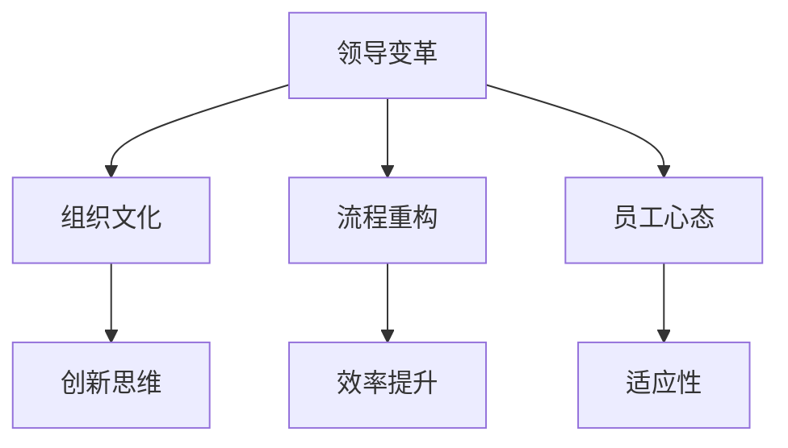

**领导变革架构图说明**：

- **组织文化（B）**：领导变革需要从组织文化入手，建立鼓励创新和变革的文化氛围。
- **流程重构（C）**：领导者需要对现有流程进行重构，以提高效率和响应速度。
- **员工心态（D）**：领导者需要关注员工的心态，通过激励和培训，提高员工的适应性和变革意愿。

**核心算法原理讲解伪代码**：

```python
# 领导变革伪代码

def lead_change(context, culture, processes, employees):
    # 分析现有组织文化和流程
    current_culture = analyze_culture(context)
    current_processes = analyze_processes(context)
    
    # 重构流程，提高效率
    new_processes = refactor_processes(current_processes)
    
    # 塑造新的组织文化
    new_culture = cultivate_new_culture(current_culture, innovation_mindset)
    
    # 培养员工的变革心态
    adapt_employees = train_employees(new_culture, new_processes)
    
    # 实施变革
    execute_change(new_processes, new_culture, adapt_employees)
```

**7.1.2 战略规划**

战略规划是领导者根据组织愿景和目标，制定长期发展计划的能力。它涉及对市场趋势、竞争环境、资源分配等方面的全面考虑。

**核心概念与联系架构**：

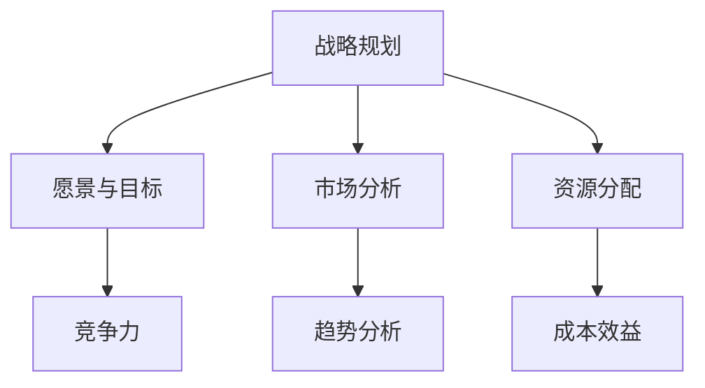

**战略规划架构图说明**：

- **愿景与目标（B）**：战略规划需要基于明确的愿景和目标，确保规划的方向正确。
- **市场分析（C）**：领导者需要了解市场趋势和竞争环境，以制定符合市场需求的战略。
- **资源分配（D）**：领导者需要合理分配资源，确保战略规划的顺利实施。

**核心算法原理讲解伪代码**：

```python
# 战略规划伪代码

def strategic_planning(vision, market, resources):
    # 分析市场趋势和竞争环境
    market_analysis = analyze_market(vision, market)
    
    # 制定战略目标和路径
    strategic_goals = set_goals(vision, market_analysis)
    
    # 分配资源，确保战略实现
    resource_allocation = allocate_resources(strategic_goals, resources)
    
    # 实施战略规划
    execute_strategy(strategic_goals, resource_allocation)
```

**7.1.3 高效沟通**

高效沟通是领导者与团队成员、客户、合作伙伴等建立良好关系的重要技能。它不仅包括信息的准确传递，还涉及到情感和信任的建立。

**核心概念与联系架构**：

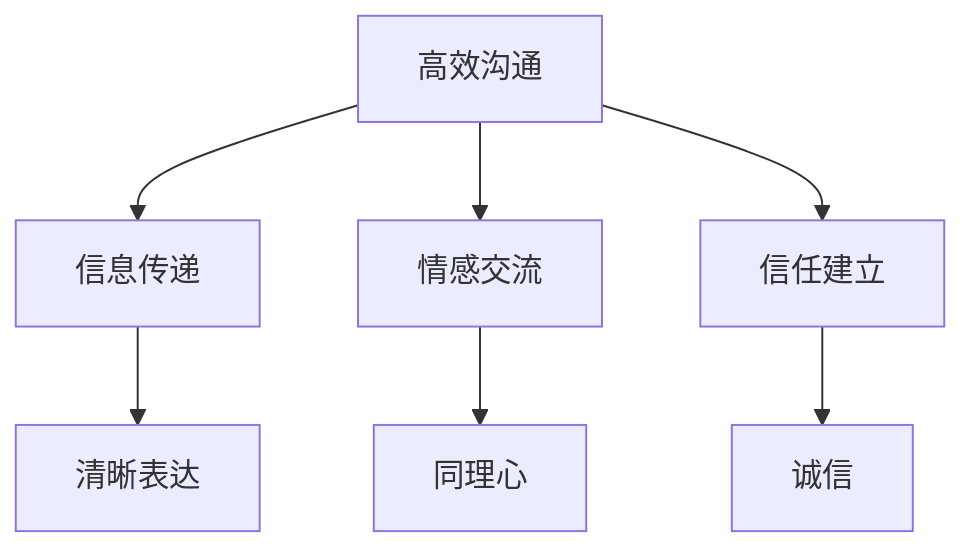

**高效沟通架构图说明**：

- **信息传递（B）**：领导者需要确保信息的准确和有效传递。
- **情感交流（C）**：领导者需要关注情感交流，建立同理心，提高沟通的亲和力。
- **信任建立（D）**：领导者需要通过诚信和透明，建立信任，提高团队的凝聚力。

**核心算法原理讲解伪代码**：

```python
# 高效沟通伪代码

def effective_communication(information, emotions, trust):
    # 确保信息准确传递
    clear_expression = ensure_clear_expression(information)
    
    # 进行情感交流
    empathy = engage_emotionally(emotions)
    
    # 建立信任
    build_trust = establish_trust(trust)
    
    # 实现高效沟通
    execute_communication(clear_expression, empathy, build_trust)
```

#### 7.2 领导力与心理学

**7.2.1 领导力与心理学的关系**

心理学是领导力的重要基础，它为领导者提供了理解人类行为和情感的理论框架。领导力与心理学的关系主要体现在以下几个方面：

1. **情感智力**：领导者需要具备高水平的情感智力，包括自我意识、自我调节、社交意识和社会技能。
2. **动机与激励**：领导者需要理解员工的动机和需求，通过有效的激励手段，提高员工的积极性和创造力。
3. **团队动力**：领导者需要掌握团队动力理论，了解如何建立高效的团队，提升团队协作能力。

**核心概念与联系架构**：

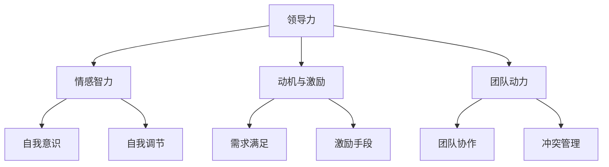

**领导力与心理学架构图说明**：

- **情感智力（B）**：领导者需要具备自我意识和自我调节能力，以更好地管理自己的情感。
- **动机与激励（C）**：领导者需要了解员工的动机和需求，通过有效的激励手段，提高员工的工作积极性。
- **团队动力（D）**：领导者需要掌握团队协作和冲突管理的技能，以建立高效、和谐的团队。

**核心算法原理讲解伪代码**：

```python
# 领导力与心理学伪代码

def leadership_with_psychology(emo Intelligence, motivation, team_dynamics):
    # 提高情感智力
    enhance_emo_intelligence = improve_self_awareness_and Regulation(emo Intelligence)
    
    # 激发员工动机
    engage_motivation = satisfy_employee_needs_and Provide incentives
    
    # 建立团队动力
    build_team_dynamics = foster_team_collaboration_and Manage conflicts
    
    # 实现领导力与心理学的结合
    implement_leadership_with_psychology = integrate_emo Intelligence, motivation, team_dynamics
```

#### 7.3 领导力发展趋势

**7.3.1 数字化领导力**

随着数字技术的快速发展，数字化领导力成为领导力发展的重要趋势。数字化领导力要求领导者具备以下能力：

1. **技术理解**：领导者需要具备一定的技术背景，了解数字化工具和平台的应用。
2. **创新思维**：领导者需要具备创新思维，能够引领组织在数字化时代中保持竞争力。
3. **数据驱动**：领导者需要善于利用数据，通过数据分析来指导决策。

**核心概念与联系架构**：

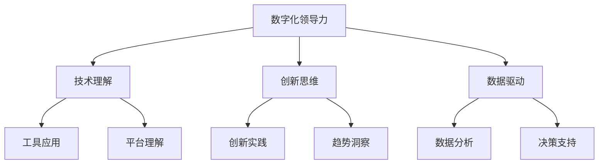

**数字化领导力架构图说明**：

- **技术理解（B）**：领导者需要了解数字化工具和平台的基本原理和应用场景。
- **创新思维（C）**：领导者需要具备创新思维，能够引领组织在数字化领域进行创新实践。
- **数据驱动（D）**：领导者需要善于利用数据，通过数据分析来指导决策，提高组织的效率。

**核心算法原理讲解伪代码**：

```python
# 数字化领导力伪代码

def digital_leadership(technical_understanding, innovation_mindset, data_driven):
    # 提高技术理解
    enhance_technical_understanding = gain_awareness_of_technological_tools_and_platforms
    
    # 培养创新思维
    cultivate_innovation_mindset = foster_innovative_practices_in_a_digital_context
    
    # 实现数据驱动
    implement_data_driven = utilize_data_analysis_to_inform_decisions
    
    # 实现数字化领导力
    achieve_digital_leadership = integrate_technical_understanding, innovation_mindset, data_driven
```

**7.3.2 社交领导力**

社交领导力强调领导者通过与他人的互动和沟通，建立信任和合作关系，推动组织的发展。它要求领导者具备以下能力：

1. **人际交往**：领导者需要具备良好的人际交往能力，能够与不同背景的人建立良好的关系。
2. **跨文化沟通**：领导者需要具备跨文化沟通的能力，能够在多元文化环境中有效沟通。
3. **影响力**：领导者需要具备影响力，能够通过个人魅力和价值观影响他人。

**核心概念与联系架构**：

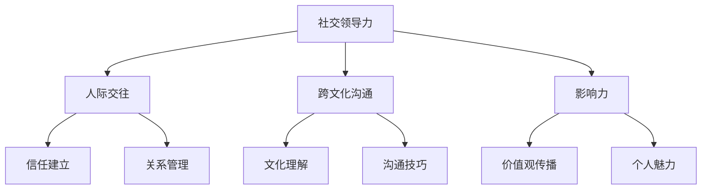

**社交领导力架构图说明**：

- **人际交往（B）**：领导者需要建立良好的人际交往能力，以建立信任和合作关系。
- **跨文化沟通（C）**：领导者需要具备跨文化沟通的能力，以在多元文化环境中有效沟通。
- **影响力（D）**：领导者需要具备影响力，能够通过个人魅力和价值观影响他人。

**核心算法原理讲解伪代码**：

```python
# 社交领导力伪代码

def social_leadership(interpersonal_communication, cross-cultural_communication, influence):
    # 提高人际交往能力
    enhance_interpersonal_communication = build_trust_and_manage_relationships
    
    # 培养跨文化沟通能力
    cultivate_cross-cultural_communication = gain_awareness_of_cultural_differences_and_communication_skills
    
    # 提升影响力
    increase_influence = disseminate_values_and_personality_charisma
    
    # 实现社交领导力
    achieve_social_leadership = integrate_interpersonal_communication, cross-cultural_communication, influence
```

**7.3.3 持续学习领导力**

持续学习领导力是领导者不断提升自身能力的重要途径。它要求领导者具备以下能力：

1. **自我学习**：领导者需要具备自我学习的能力，能够主动获取新知识和技能。
2. **持续反思**：领导者需要通过持续反思，总结经验教训，不断优化自己的领导方法。
3. **知识共享**：领导者需要善于分享知识和经验，推动整个团队和组织的学习与发展。

**核心概念与联系架构**：

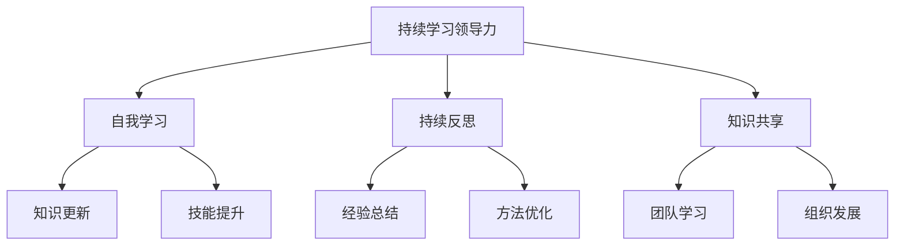

**持续学习领导力架构图说明**：

- **自我学习（B）**：领导者需要主动获取新知识和技能，以适应不断变化的工作环境。
- **持续反思（C）**：领导者需要通过持续反思，总结经验教训，不断提高自身的领导能力。
- **知识共享（D）**：领导者需要善于分享知识和经验，推动整个团队和组织的学习与发展。

**核心算法原理讲解伪代码**：

```python
# 持续学习领导力伪代码

def continuous_learning_leadership(self_learning, continuous_reflection, knowledge_sharing):
    # 提升自我学习能力
    improve_self_learning = actively_acquire_new_knowledge_and_skills
    
    # 持续反思
    continuous_reflection = regularly_summarize_experience_and_improve_leadership_methods
    
    # 促进知识共享
    promote_knowledge_sharing = effectively_share_knowledge_and_experience_within_the_team_and_organization
    
    # 实现持续学习领导力
    achieve_continuous_learning_leadership = integrate_self_learning, continuous_reflection, knowledge_sharing
```

通过本章的探讨，我们可以看到领导力的发展趋势正逐步向数字化、社交化和持续学习方向转变。领导者需要不断提升自身的综合素质，以适应这些新的发展趋势，成为更加出色的领导者。

### 第8章：领导力训练营总结与展望

经过84天的系统学习和实践，领导力训练营不仅帮助学员从门外汉成长为内行人，更在个人成长、团队协作和领导力实践应用等方面取得了显著成果。本章将对训练营的成果进行总结，并展望领导力未来的发展趋势。

#### 8.1 训练营成果总结

**个人成长**：通过训练营的学习，学员们在领导力各个方面都有了显著的提升。他们不仅掌握了领导力的核心概念和基础技能，还通过实践和反思，逐渐形成了自己的领导风格和价值观。许多学员在自我评估中发现了自己的不足，并制定了个人发展计划，持续进行自我提升。

**团队协作提升**：训练营强调了团队合作的重要性，学员们在实践中学会了如何建立信任、明确目标、有效沟通和协作。通过小组讨论、案例分析等活动，学员们不仅提升了自身的领导力，还增强了团队的凝聚力和协作能力。许多团队在训练营结束后，工作效率和项目成果都有了显著的提升。

**领导力实践应用**：学员们在训练营中学到的领导力技能在真实的工作环境中得到了广泛应用。他们通过有效的沟通、决策和团队建设，推动了项目的顺利进行，提升了团队的整体绩效。许多学员在训练营结束后，得到了上级的认可和晋升机会，进一步实现了职业发展。

#### 8.2 展望未来

**领导力的持续发展**：随着社会和技术的不断进步，领导力也在不断发展和演变。领导者需要不断学习新知识、新技能，以适应不断变化的工作环境。持续发展是领导者成长的关键，只有不断进步，才能在竞争激烈的职场中保持优势。

**领导力在组织中的重要性**：领导力是组织发展的核心驱动力。一个优秀的领导者不仅能够带领团队实现目标，还能够推动组织的变革和创新。在未来的发展中，领导力将成为组织成功的关键因素，领导者需要承担更多的责任和挑战。

**领导力未来的发展趋势**：

1. **数字化领导力**：随着数字化技术的发展，领导者需要具备数字化的思维和能力，善于利用数字工具和平台，提高组织的效率和创新力。
2. **社交领导力**：在社交网络日益普及的今天，领导者需要具备良好的社交能力，能够通过社交网络建立关系、传播信息、推动变革。
3. **持续学习领导力**：在知识更新迅速的时代，领导者需要具备持续学习的能力，不断吸收新知识、新技能，以适应不断变化的工作环境。

通过本章的总结和展望，我们可以看到领导力训练营不仅为学员们的成长提供了有力支持，也为组织的发展注入了新的动力。在未来的发展中，领导力将继续发挥重要作用，领导者需要不断学习和进步，以应对新的挑战和机遇。

### 附录

#### 附录A：领导力工具与资源

**A.1 领导力评估工具**

- **360度反馈工具**：用于收集来自团队成员、上级和同级的反馈，帮助领导者进行自我评估。
- **领导力评估问卷**：包含一系列标准化的评估问题，用于评估领导者在不同维度上的表现。

**A.2 领导力学习资源**

- **在线课程**：提供多种领导力主题的在线课程，如沟通技能、决策技能、团队建设等。
- **专业书籍**：推荐一些经典的领导力书籍，如《领导力的五个层次》、《领导力与影响力》等。

**A.3 领导力实践案例**

- **成功案例**：分享一些成功的领导力实践案例，如知名企业家的领导故事、优秀团队的建设经验等。
- **失败案例**：分析一些失败的领导力案例，探讨失败的原因和教训，以帮助领导者避免犯同样的错误。

#### 附录B：84天领导力训练营日程安排

**B.1 每周训练计划**

- **周一**：自我评估与反思
- **周二**：领导力核心概念学习
- **周三**：领导力基础技能练习
- **周四**：案例分析与讨论
- **周五**：总结与反馈
- **周末**：放松与充电

**B.2 每日任务安排**

- **周一**：填写自我评估表，总结上周工作表现，确定本周目标。
- **周二**：学习领导力核心概念，阅读相关书籍或文章。
- **周三**：练习领导力基础技能，如沟通技能、决策技能等。
- **周四**：分析经典领导力案例，进行小组讨论。
- **周五**：总结本周学习内容，向导师和团队成员反馈学习心得。
- **周末**：进行放松活动，如阅读、运动等，为下周的学习和工作充电。

**B.3 训练营活动安排**

- **启动会议**：训练营开始时的启动仪式，介绍训练营目标和计划，建立团队关系。
- **阶段性评估**：在每个阶段结束后，进行评估和总结，以检查学习成果和调整学习计划。
- **研讨会**：定期组织研讨会，邀请行业专家分享经验，帮助学员深化学习内容。
- **实战演练**：通过实际工作项目，让学员将所学知识应用于实际工作中，提升领导力。

通过这些工具和资源，以及详细的日程安排，学员可以更加系统地学习和实践领导力，确保训练营的效果最大化。

### 作者信息

作者：AI天才研究院/AI Genius Institute & 禅与计算机程序设计艺术 /Zen And The Art of Computer Programming

在这篇《领导力训练营：84天从门外汉到内行人》的技术博客中，我们系统地探讨了领导力的核心概念、基础技能和实践方法。从领导力的定义与重要性，到领导力核心概念与架构，再到领导力基础技能的详细讲解，我们通过一步步的分析和推理，帮助读者深入理解领导力的本质和应用。

本文不仅提供了理论上的指导，还结合实际案例和实战演练，使读者能够将所学知识应用到实际工作中，提升个人的领导力水平。此外，我们还对未来领导力的发展趋势进行了展望，包括数字化领导力、社交领导力和持续学习领导力等，为读者的未来发展提供了方向。

通过这篇博客，我们希望读者能够认识到领导力的重要性，并积极投入到领导力的学习和实践中。只有通过不断学习和实践，我们才能真正从门外汉成长为内行人，成为卓越的领导者。

最后，感谢读者的阅读和支持。希望这篇博客能够对您在领导力道路上有所帮助，让我们一起不断进步，共同成长。

作者：AI天才研究院/AI Genius Institute & 禅与计算机程序设计艺术 /Zen And The Art of Computer Programming

