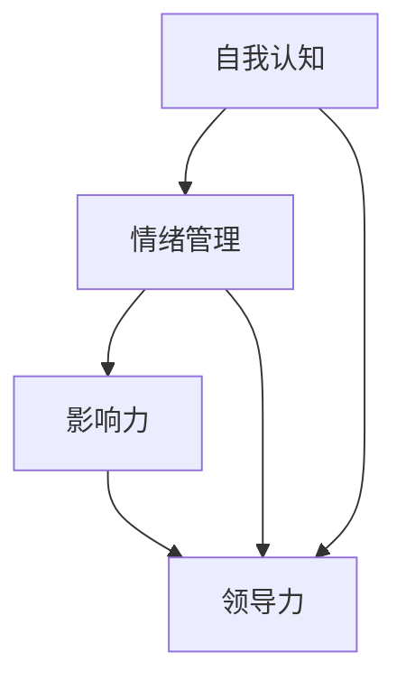

                 

### 文章标题

# 领导力训练：让你的团队战无不胜

在当今快速变化的技术环境下，领导力成为企业成功的关键因素。优秀的领导不仅能够激励团队，还能确保团队成员朝着共同的目标前进。本文旨在深入探讨领导力的理论基础和实践技巧，通过系统化的领导力训练，帮助读者打造一个战无不胜的团队。无论您是企业的CTO、项目经理，还是技术团队的领导者，这篇文章都将为您提供宝贵的启示和实用的工具。

## 关键词

- 领导力
- 团队建设
- 沟通技巧
- 激励策略
- 变革领导力

### 摘要

本文将从领导力的基本概念、核心要素、发展路径，到领导力实践技巧等方面进行详细探讨。通过深入分析领导力与团队绩效的关系，读者将了解到如何通过自我认知、情绪管理、影响力提升等核心要素来增强领导力。此外，文章还将介绍团队建设、沟通技巧、激励策略、领导变革等实践技巧，并通过实际案例研究，为读者提供具体的操作指南。通过本文的学习，您将掌握一套系统化的领导力训练方法，助力您的团队在激烈的竞争中脱颖而出。

## 目录大纲

### 第一部分：领导力理论基础

#### 第1章：领导力的定义与重要性

- **1.1. 领导力的定义**
  - 领导力的基本概念
  - 领导力与管理的区别
  - 领导力的价值

- **1.2. 领导力模型**
  - 传统领导力模型
  - 新型领导力模型
  - 领导力模型的对比

- **1.3. 领导力与团队绩效的关系**
  - 领导力对团队的影响
  - 团队绩效的评估标准
  - 领导力与团队绩效的关系

#### 第2章：领导力的核心要素

- **2.1. 自我认知**
  - 自我认知的重要性
  - 自我认知的方法
  - 自我认知的实践

- **2.2. 情绪管理**
  - 情绪管理的意义
  - 情绪管理的方法
  - 情绪管理的实践

- **2.3. 影响力**
  - 影响力的定义
  - 增强影响力的方法
  - 影响力的实践

#### 第3章：领导力发展的路径

- **3.1. 领导力发展的阶段**
  - 领导力发展的五个阶段
  - 阶段的特点与应对策略

- **3.2. 领导力发展的策略**
  - 个人发展计划
  - 持续学习的重要性
  - 领导力发展的实践

### 第二部分：领导力实践技巧

#### 第4章：团队建设

- **4.1. 团队建设的原则**
  - 团队建设的核心原则
  - 团队建设的具体措施

- **4.2. 团队角色的认知**
  - 团队角色的定义
  - 团队角色的认知与协调

- **4.3. 团队冲突管理**
  - 团队冲突的类型
  - 团队冲突的处理方法

#### 第5章：沟通技巧

- **5.1. 沟通的重要性**
  - 沟通对领导力的影响
  - 沟通的障碍与解决方案

- **5.2. 有效沟通的技巧**
  - 沟通技巧的实践
  - 沟通情境的应用

- **5.3. 领导沟通的案例分析**
  - 成功的领导沟通案例
  - 沟通失败的原因与改进策略

#### 第6章：激励与激励

- **6.1. 激励理论**
  - 不同的激励理论
  - 激励理论在领导力中的应用

- **6.2. 激励策略**
  - 激励策略的制定
  - 激励策略的执行与反馈

- **6.3. 激励案例分析**
  - 成功的激励案例
  - 激励策略的评估与调整

#### 第7章：领导变革

- **7.1. 变革管理**
  - 变革管理的原则
  - 变革管理的实践

- **7.2. 变革策略**
  - 变革策略的制定
  - 变革策略的执行与评估

- **7.3. 变革领导力**
  - 变革领导力的要素
  - 变革领导力的实践

### 第三部分：领导力案例研究

#### 第8章：领导力案例研究

- **8.1. 案例介绍**
  - 案例背景
  - 案例目标

- **8.2. 案例分析**
  - 案例中的领导力表现
  - 案例中的领导力问题

- **8.3. 案例启示**
  - 案例的启示与反思
  - 案例对领导力实践的指导意义

#### 第9章：领导力实践总结

- **9.1. 领导力实践的总结**
  - 领导力实践的成果
  - 领导力实践的反思

- **9.2. 未来领导力的趋势**
  - 未来领导力的发展趋势
  - 领导力实践的未来方向

- **9.3. 领导力实践的建议**
  - 针对读者的实践建议
  - 领导力实践的未来展望

## 第一部分：领导力理论基础

### 第1章：领导力的定义与重要性

在探讨如何提升领导力之前，我们需要先了解领导力的基本概念。领导力是一个多层次、多维度的概念，它不仅仅是指导和管理团队的能力，更是一种能够在复杂环境中引领和激励他人共同实现目标的素质。

#### 1.1. 领导力的定义

领导力是指通过激励、鼓舞和指导他人，使团队或组织达到预期目标的能力。它包括一系列的技能和行为，如愿景规划、决策制定、沟通协调、激励员工、冲突管理等。领导力不仅仅是在企业中发挥作用，它也适用于各种社会和组织环境中。

**领导力的基本概念**

- **领导者**：领导者是团队或组织中的核心人物，他们负责制定目标、指导方向、激发团队成员的潜能。
- **团队**：团队是由多个成员组成的协作单位，他们共同为实现特定目标而努力。
- **领导**：领导是领导者与团队之间相互作用的过程，包括设定目标、制定策略、分配任务、提供支持等。

**领导力与管理的区别**

领导力和管理是两个相关但不完全相同的概念。管理强调的是流程和效率，它侧重于确保组织运作的顺畅和目标的实现。而领导力则更注重激发团队成员的潜力和创造力，使他们愿意为实现共同目标而努力。

- **管理**：管理是规划、组织、领导和控制资源的过程，目的是实现组织的目标。
- **领导力**：领导力是影响和激励他人，使其愿意为实现共同目标而努力的过程。

**领导力的价值**

领导力在组织中具有不可替代的价值。它不仅能够提高团队绩效，还能增强组织的竞争力。以下是领导力的一些具体价值：

- **提高团队绩效**：优秀的领导能够激发团队成员的潜能，使他们发挥最大价值，从而提高团队的整体绩效。
- **增强团队凝聚力**：领导力能够建立团队成员之间的信任和合作关系，增强团队的凝聚力。
- **推动组织变革**：领导力能够引领组织应对外部变化，推动组织实现持续发展。
- **提升个人影响力**：领导力使领导者能够更好地影响和指导团队成员，提升个人的社会和职业地位。

### 1.2. 领导力模型

为了更好地理解领导力的本质，我们需要探讨一些经典的领导力模型。这些模型提供了不同的视角和方法，以帮助领导者更好地应对复杂的管理环境。

**传统领导力模型**

- **领导行为模型**：领导行为模型关注领导者在团队中的行为和风格。例如，领导行为连续体模型（Hersey-Blanchard模型）将领导行为分为指挥型、支持型、参与型等不同类型。
- **情境领导模型**：情境领导模型（赫斯伯勒-布兰查德模型）认为，领导者的行为应该根据团队成员的不同成熟度进行调整。

**新型领导力模型**

- **赋能型领导力**：赋能型领导力强调领导者通过赋予团队成员自主权和发展空间，激发他们的创造力和责任感。
- **变革型领导力**：变革型领导力强调领导者通过愿景激励和影响，推动组织实现重大变革。

**领导力模型的对比**

传统领导力模型主要关注领导者的行为和风格，而新型领导力模型则更注重领导者与团队成员之间的关系和互动。以下是两种领导力模型的主要区别：

- **目标导向 vs. 人本导向**：传统领导力模型强调目标实现，新型领导力模型则更注重团队成员的发展和成长。
- **权威 vs. 参与式**：传统领导力模型中的领导者往往具有更高的权威，而新型领导力模型中的领导者更倾向于通过参与和合作来达成目标。
- **稳定性 vs. 变革性**：传统领导力模型适用于相对稳定的环境，新型领导力模型则更适用于快速变化的环境。

### 1.3. 领导力与团队绩效的关系

领导力对团队绩效有着显著的影响。一个优秀的领导者不仅能够提高团队的绩效，还能在复杂和不确定的环境中保持团队的稳定和凝聚力。

**领导力对团队的影响**

- **提高工作效率**：领导者的有效指导和管理能够提高团队成员的工作效率。
- **增强团队凝聚力**：领导力能够建立团队成员之间的信任和合作关系，增强团队的凝聚力。
- **促进创新和创造力**：领导者的激励和支持能够激发团队成员的创新和创造力。
- **降低员工流失率**：优秀的领导者能够提高员工的工作满意度，降低员工流失率。

**团队绩效的评估标准**

评估团队绩效的标准包括以下几个方面：

- **产出和质量**：团队的产出和产品质量是评估团队绩效的重要标准。
- **效率**：团队的效率和资源利用率也是评估团队绩效的关键因素。
- **团队氛围**：团队的氛围和士气对团队绩效也有重要影响。
- **持续改进**：团队是否能够不断改进和创新也是评估团队绩效的重要标准。

**领导力与团队绩效的关系**

领导力与团队绩效之间存在密切的关系。一个优秀的领导者能够通过以下几个方面来提高团队绩效：

- **设定明确的目标和愿景**：领导者需要为团队设定明确的目标和愿景，确保团队成员对目标有清晰的理解。
- **提供有效的指导和支持**：领导者需要为团队成员提供有效的指导和支持，帮助他们在工作中取得成功。
- **激励和鼓舞团队成员**：领导者需要通过激励和鼓舞来激发团队成员的潜力和积极性。
- **培养团队文化**：领导者需要通过培养团队文化，营造积极、合作和开放的工作氛围。

## 第2章：领导力的核心要素

领导力并不是一项单一的能力，而是一系列核心要素的综合体现。这些核心要素包括自我认知、情绪管理、影响力等。在本章中，我们将深入探讨这些核心要素的重要性、方法和实践。

### 2.1. 自我认知

自我认知是领导力的基础，它涉及对个人性格、优势、劣势、价值观和动机的深入了解。一个优秀的领导者首先需要认识到自己的优点和不足，这样才能更好地发挥领导作用。

**自我认知的重要性**

- **增强自信**：自我认知有助于领导者建立自信心，更好地面对挑战和困难。
- **提高决策质量**：通过自我认知，领导者可以更清晰地了解自己的思维方式和决策习惯，从而提高决策质量。
- **促进团队协作**：领导者通过自我认知，可以更好地了解团队成员的需求和期望，促进团队协作。

**自我认知的方法**

- **反思**：反思是自我认知的重要方法。领导者需要定期反思自己的行为和决策，分析其背后的动机和影响。
- **反馈**：接受来自团队成员和上级的反馈是自我认知的重要途径。通过他人的反馈，领导者可以更全面地了解自己的表现。
- **自我评估工具**：使用专业的自我评估工具，如性格测试、能力测试等，可以帮助领导者更准确地了解自己。

**自我认知的实践**

- **定期自我反思**：领导者可以每周或每月进行一次自我反思，回顾自己的行为和决策，总结经验教训。
- **积极参与反馈**：领导者应主动寻求团队成员和上级的反馈，并将其作为自我提升的重要资源。
- **定期参加培训**：通过参加领导力培训，领导者可以学习新的自我认知方法和工具，提升自我认知能力。

### 2.2. 情绪管理

情绪管理是领导者必须掌握的重要技能。情绪管理不仅关乎领导者的个人形象，更影响团队的整体氛围和工作效率。

**情绪管理的意义**

- **提升领导形象**：情绪稳定的领导者能够树立良好的形象，赢得团队成员的尊重和信任。
- **增强团队凝聚力**：领导者通过情绪管理，可以营造一个积极、和谐的工作氛围，增强团队的凝聚力。
- **提高决策质量**：情绪稳定有助于领导者保持清晰的思维，提高决策质量。

**情绪管理的方法**

- **认知重构**：通过改变对事件的认知，领导者可以减少负面情绪的影响。例如，面对压力时，领导者可以通过积极的自我对话来调整情绪。
- **放松技巧**：深呼吸、冥想、瑜伽等放松技巧可以帮助领导者缓解压力，保持情绪稳定。
- **情绪释放**：领导者可以适当表达自己的情绪，通过倾诉或运动等方式释放情绪。

**情绪管理的实践**

- **学会放松**：领导者可以每天花时间进行深呼吸或冥想，以缓解压力和焦虑。
- **保持积极态度**：领导者应努力保持积极的态度，用乐观的心态面对挑战和困难。
- **合理分配时间**：领导者应合理安排工作和休息时间，避免过度工作导致的情绪失控。

### 2.3. 影响力

影响力是领导者引领和影响他人的能力。一个有影响力的领导者不仅能够推动团队成员实现目标，还能在组织中发挥重要的战略作用。

**影响力的定义**

影响力是指一个人通过言语、行为或态度，影响他人思想和行为的能力。在领导力中，影响力是领导者与团队成员之间建立信任、达成共识的关键。

**增强影响力的方法**

- **建立信任**：信任是影响力的基础。领导者需要通过诚信、透明和一致性来建立信任。
- **树立榜样**：领导者通过自己的行为和态度，树立榜样，影响团队成员。
- **有效沟通**：领导者需要掌握有效的沟通技巧，清晰、准确地表达自己的观点和意图。
- **提供支持**：领导者通过为团队成员提供必要的支持和资源，增强自己的影响力。

**影响力的实践**

- **建立信任关系**：领导者应主动与团队成员建立信任关系，通过诚实和透明的沟通来赢得信任。
- **提供专业支持**：领导者应不断提升自己的专业能力，为团队成员提供有效的指导和帮助。
- **积极倾听**：领导者应积极倾听团队成员的意见和建议，尊重他们的想法，从而增强自己的影响力。

### 2.4. 领导力的综合要素

自我认知、情绪管理和影响力是领导力的核心要素，它们相辅相成，共同构成了一个优秀的领导者。以下是一个简化的领导力综合要素架构，用于帮助读者更好地理解这些要素之间的关系：

通过这个架构，我们可以看到，自我认知和情绪管理是领导力的基础，它们直接影响领导力的发展。而影响力则是领导力在实际应用中的体现，它使领导者能够有效影响和激励团队成员。

### 2.5. 核心要素的综合应用

在实际工作中，领导者需要综合运用自我认知、情绪管理和影响力等核心要素，以应对各种复杂情况。以下是一些综合应用的建议：

- **自我认知**：领导者应定期进行自我反思，识别自己的优势和不足，从而在决策和行动中发挥最大效用。
- **情绪管理**：领导者应学会在压力和困难面前保持冷静，通过放松技巧和积极心态来应对挑战。
- **影响力**：领导者应通过建立信任、树立榜样和有效沟通来增强自己的影响力，推动团队成员实现共同目标。

通过综合运用这些核心要素，领导者可以更好地应对复杂的管理环境，提升领导力水平，从而带领团队取得卓越的成绩。

### 第3章：领导力发展的路径

领导力并非一蹴而就，而是一个不断学习和成长的过程。领导者需要通过系统的培训和持续的实践，逐步提升自己的领导力水平。在本章中，我们将探讨领导力发展的路径，包括领导力发展的阶段、策略和实践。

#### 3.1. 领导力发展的阶段

领导力发展可以分为五个阶段，每个阶段都有其特定的特点和要求。以下是对这些阶段的简要描述：

**1. 感知阶段**

在感知阶段，领导者开始意识到领导力的重要性，并对领导行为有所感知。这一阶段的重点是培养对领导力的敏感度和理解力。

**2. 学习阶段**

在学习阶段，领导者通过阅读书籍、参加培训、向他人学习等方式，系统性地学习领导力知识。这一阶段的重点是构建领导力理论框架。

**3. 应用阶段**

在应用阶段，领导者将所学知识应用到实际工作中，通过实践来提升自己的领导力。这一阶段的重点是验证和调整领导行为，以提高领导效果。

**4. 整合阶段**

在整合阶段，领导者将各种领导力工具和方法整合到自己的领导风格中，形成独特的领导风格。这一阶段的重点是形成个性化、高效的领导力模式。

**5. 实践阶段**

在实践阶段，领导者通过持续实践和反思，不断提升领导力水平。这一阶段的重点是保持开放心态，不断学习和适应新的挑战。

**阶段的特点与应对策略**

- **感知阶段**：领导者应关注对领导力的感知，培养对领导行为的敏感度。
- **学习阶段**：领导者应积极参与培训和学习，构建系统的领导力知识体系。
- **应用阶段**：领导者应将所学知识应用到实际工作中，通过实践来验证和调整。
- **整合阶段**：领导者应整合不同的领导力工具和方法，形成个性化的领导风格。
- **实践阶段**：领导者应保持持续学习和反思，不断提升自己的领导力水平。

#### 3.2. 领导力发展的策略

要提升领导力，领导者需要采取一系列有效的策略。以下是一些关键的发展策略：

**1. 制定个人发展计划**

个人发展计划是提升领导力的第一步。领导者应根据自身情况和目标，制定明确的个人发展计划。这个计划应包括学习目标、实践目标和评估标准。

**2. 持续学习的重要性**

持续学习是领导力发展的关键。领导者应保持对知识的渴望，不断学习新的领导力理论和实践方法。可以通过阅读书籍、参加研讨会、听取专家讲座等方式来扩展自己的知识。

**3. 建立导师关系**

建立导师关系可以帮助领导者快速提升领导力。导师可以提供宝贵的指导和建议，帮助领导者克服困难，提高领导效果。

**4. 实践与反思**

领导力发展离不开实践和反思。领导者应在实际工作中不断尝试新的领导方法，并通过反思来总结经验教训，不断优化自己的领导行为。

**5. 跨部门合作**

跨部门合作可以帮助领导者拓展视野，学习不同的领导风格和方法。领导者应积极参与跨部门项目，与不同背景的团队成员合作，提升领导力。

#### 3.3. 领导力发展的实践

以下是几个具体的领导力发展实践案例，供领导者参考：

**1. 参加领导力培训班**

参加专业的领导力培训班是提升领导力的有效方法。通过系统的学习和实践，领导者可以掌握最新的领导力理论和工具。

**2. 参与项目管理工作**

参与项目管理工作可以锻炼领导者的组织、协调和决策能力。通过实际操作，领导者可以积累宝贵的实践经验。

**3. 定期自我反思**

领导者应定期进行自我反思，总结自己的优点和不足，并制定改进计划。这有助于领导者不断提升自己的领导力水平。

**4. 建立个人学习计划**

领导者应制定个人学习计划，包括阅读书籍、参加研讨会和听取专家讲座等。通过持续学习，领导者可以不断提升自己的知识和技能。

#### 3.4. 领导力发展的总结

领导力发展是一个长期的过程，需要领导者的持续努力和投入。通过系统化的学习、实践和反思，领导者可以逐步提升自己的领导力水平。以下是对领导力发展的一些总结和思考：

- **领导力发展是一个动态过程**：领导力发展不是一成不变的，领导者需要根据自身情况和外部环境的变化，不断调整和优化自己的领导风格和方法。
- **实践是提升领导力的关键**：理论知识只有通过实践才能真正发挥作用。领导者应积极参与各种实践活动，通过实践来提升自己的领导力水平。
- **反思是领导力发展的重要环节**：反思可以帮助领导者总结经验教训，发现自身不足，从而制定改进计划，不断提升领导力。
- **持续学习是领导力的保障**：领导力发展离不开持续学习。领导者应保持对知识的渴望，不断学习新的领导力理论和实践方法，以适应不断变化的环境。

通过以上领导力发展的路径和策略，领导者可以逐步提升自己的领导力水平，带领团队实现更高的绩效和目标。

## 第二部分：领导力实践技巧

在具备了坚实的领导力理论基础后，领导者需要将这些理论知识转化为实际行动。本部分将探讨领导力实践中的关键技巧，包括团队建设、沟通技巧、激励策略和领导变革。通过深入理解和掌握这些技巧，领导者可以有效地提升团队绩效，实现组织目标。

### 第4章：团队建设

团队建设是领导力的核心实践之一。一个高效的团队不仅能够提高工作绩效，还能增强组织的凝聚力。在本节中，我们将讨论团队建设的原则、团队角色的认知和团队冲突管理。

#### 4.1. 团队建设的原则

团队建设是一个持续的过程，它需要领导者关注多个方面。以下是一些关键的团队建设原则：

**1. 明确共同目标**

共同目标是团队建设的基石。领导者需要确保团队成员对团队目标有清晰的认识，并围绕这一目标共同努力。

**2. 建立信任**

信任是团队高效运作的关键。领导者应通过透明沟通、诚实行为和相互尊重来建立团队成员之间的信任。

**3. 促进沟通**

沟通是团队协作的重要手段。领导者需要确保团队内部的信息流通顺畅，避免误解和冲突。

**4. 识别和发挥个人优势**

每个团队成员都有其独特的优势和潜力。领导者应识别并充分发挥这些优势，以提升团队的整体能力。

**5. 激发团队活力**

团队活力是保持团队动力的关键。领导者应通过定期团队活动、培训和工作坊等方式，激发团队的活力。

**6. 处理冲突**

冲突是团队运作中不可避免的现象。领导者应积极处理团队冲突，确保冲突不会影响团队的整体运作。

#### 4.2. 团队角色的认知

团队角色是指团队成员在团队中的具体职责和角色。了解和认知团队角色对于团队建设至关重要。以下是一些常见的团队角色：

**1. 领导者**

领导者负责制定团队目标、规划团队活动、协调团队成员的工作。他们需要具备战略思维和决策能力。

**2. 执行者**

执行者负责完成具体任务，确保团队目标的实现。他们需要具备执行力和责任感。

**3. 沟通者**

沟通者负责确保团队内部信息的有效传递，协调不同部门之间的合作。他们需要具备良好的沟通技巧。

**4. 创新者**

创新者负责提出新的想法和解决方案，推动团队的创新和发展。他们需要具备创新思维和创造力。

**5. 监督者**

监督者负责监督团队的工作进度和质量，确保团队目标的实现。他们需要具备监控能力和责任心。

**6. 支持者**

支持者负责为团队成员提供支持和帮助，解决他们在工作中遇到的问题。他们需要具备同理心和解决问题的能力。

#### 4.3. 团队冲突管理

团队冲突是团队建设中的一个重要问题。有效的冲突管理能够帮助团队更好地运作。以下是一些团队冲突管理的方法：

**1. 了解冲突的原因**

冲突通常源于目标不一致、沟通不畅、资源分配不均等原因。领导者需要深入了解冲突的原因，才能制定有效的解决策略。

**2. 积极沟通**

积极沟通是解决冲突的关键。领导者应鼓励团队成员开放地表达自己的观点和感受，并通过有效沟通来达成共识。

**3. 寻求共识**

在处理冲突时，领导者应寻求团队成员的共识，确保解决方案得到广泛认同。

**4. 利用第三方调解**

当冲突无法通过内部解决时，领导者可以邀请第三方调解，以中立的角度帮助团队解决冲突。

**5. 建立冲突解决机制**

建立明确的冲突解决机制，有助于团队成员在遇到冲突时知道如何处理。这包括冲突的预防、识别、报告和解决流程。

通过以上团队建设的原则、团队角色的认知和团队冲突管理的方法，领导者可以有效地打造一个高效、协作的团队，提升团队绩效，实现组织目标。

### 第5章：沟通技巧

沟通是领导力中不可或缺的一部分。有效的沟通能够确保信息的准确传递，增强团队凝聚力，提高工作效率。在本节中，我们将探讨沟通的重要性、有效沟通的技巧以及领导沟通的案例分析。

#### 5.1. 沟通的重要性

沟通在领导力中的作用至关重要。以下是一些沟通在领导力中的重要性：

**1. 增强团队凝聚力**

有效的沟通能够增强团队成员之间的信任和合作，提升团队的凝聚力。

**2. 提高工作效率**

清晰的沟通可以减少误解和重复工作，提高工作效率。

**3. 促进创新**

开放、诚实的沟通能够激发团队成员的创造力，促进创新。

**4. 减少冲突**

通过积极的沟通，领导者可以及时发现和解决潜在的问题，减少冲突。

**5. 塑造组织文化**

沟通是塑造组织文化的重要手段。领导者通过沟通传达组织的价值观和行为规范，塑造积极向上的组织文化。

#### 5.2. 有效沟通的技巧

为了实现有效的沟通，领导者需要掌握一系列的沟通技巧。以下是一些关键技巧：

**1. 明确目标**

在沟通之前，领导者应明确沟通的目标和内容，确保信息传递的准确性。

**2. 倾听**

倾听是有效沟通的重要环节。领导者应积极倾听团队成员的意见和反馈，理解他们的需求和期望。

**3. 清晰表达**

领导者需要用清晰、简洁的语言表达自己的观点和意图，避免使用专业术语或模糊的表述。

**4. 非语言沟通**

非语言沟通，如肢体语言、面部表情和声音的音调，对沟通效果有很大影响。领导者应注重这些非语言因素，以增强沟通的效果。

**5. 及时反馈**

领导者应及时给予团队成员反馈，肯定他们的工作成果，同时也指出需要改进的地方。

**6. 保持一致性**

领导者应在沟通中保持一致性，确保团队成员对信息有统一的理解。

#### 5.3. 领导沟通的案例分析

以下是一个领导沟通的成功案例：

**案例背景**：某科技公司在一个新产品发布前，遇到了严重的团队内部冲突。产品经理和技术团队在产品功能设计上存在严重分歧，导致项目进度受阻。

**领导沟通策略**：

- **领导者积极倾听**：领导者主动与产品经理和技术团队进行一对一沟通，倾听他们的观点和担忧。
- **明确共同目标**：领导者明确了团队的共同目标，即确保产品按时发布，并强调了团队合作的必要性。
- **寻求共识**：领导者通过协调不同团队的意见，寻求共同点，达成共识。
- **透明沟通**：领导者定期召开团队会议，分享项目进展和决策过程，确保信息的透明和一致性。
- **激励团队**：领导者通过激励措施，如设立奖励机制，激发团队成员的工作热情和合作意愿。

**案例效果**：通过有效的领导沟通，团队内部冲突得到了有效解决，项目进度恢复正常，最终成功发布了新产品。

#### 5.4. 沟通障碍与解决方案

尽管沟通在领导力中至关重要，但仍然存在一些障碍。以下是一些常见的沟通障碍及其解决方案：

**1. 文化差异**

**障碍**：文化差异可能导致沟通误解和障碍。

**解决方案**：领导者应尊重不同文化背景的团队成员，了解他们的沟通风格和习惯，采用适合不同文化的沟通方式。

**2. 信息过载**

**障碍**：过多的信息可能导致团队成员感到压力和困惑。

**解决方案**：领导者应确保信息的传递是有针对性的，避免信息过载，通过筛选和整理信息来提高沟通效率。

**3. 缺乏反馈**

**障碍**：缺乏及时的反馈可能导致沟通效果不佳。

**解决方案**：领导者应鼓励团队成员提供反馈，并通过及时反馈来改进沟通效果。

**4. 沟通渠道不畅**

**障碍**：沟通渠道不畅可能导致信息传递受阻。

**解决方案**：领导者应确保沟通渠道的畅通，建立有效的沟通机制，如定期会议、即时通讯工具等。

通过掌握有效的沟通技巧和解决沟通障碍，领导者可以提升团队协作效率，实现组织目标。

### 第6章：激励与激励

激励是领导者激发团队成员积极性和创造力的关键手段。有效的激励不仅能够提高团队成员的工作满意度，还能增强团队的凝聚力和绩效。在本章中，我们将探讨激励理论、激励策略和激励案例分析，帮助领导者更好地理解和应用激励技巧。

#### 6.1. 激励理论

激励理论是理解激励行为的基础。以下是一些主要的激励理论：

**1. 马斯洛需求层次理论**

马斯洛需求层次理论认为，人的需求分为五个层次：生理需求、安全需求、社交需求、尊重需求和自我实现需求。领导者应根据团队成员的不同需求层次，制定相应的激励策略。

**2. 赫茨伯格双因素理论**

赫茨伯格双因素理论将激励因素分为内在激励和外在激励。内在激励包括工作本身的兴趣、成就感和责任感，而外在激励包括薪酬、奖励和晋升等。领导者应关注内在激励，激发团队成员的内在动力。

**3. ERG理论**

ERG理论认为，人的需求可以分为生存需求、关系需求和自我实现需求。领导者应关注团队成员的多种需求，提供多样化的激励措施。

**4. 目标设置理论**

目标设置理论认为，明确、具体和具有挑战性的目标能够激励团队成员努力工作。领导者应制定合适的目标，并帮助团队成员实现这些目标。

#### 6.2. 激励策略

为了有效激励团队成员，领导者需要制定并执行一系列激励策略。以下是一些关键策略：

**1. 目标激励**

通过设定明确、具体和具有挑战性的目标，领导者可以激发团队成员的内在动力。目标应与团队成员的个人发展和团队目标相结合。

**2. 薪酬激励**

薪酬激励是最直接和普遍的激励手段。领导者应设计具有竞争力的薪酬体系，包括基本工资、绩效奖金和福利等。

**3. 荣誉激励**

荣誉激励可以通过表彰和奖励来提升团队成员的荣誉感和成就感。例如，设立优秀员工奖、团队奖等。

**4. 培训激励**

培训激励可以帮助团队成员提升技能和职业发展，增强他们的职业满意度和归属感。领导者应提供多样化的培训机会。

**5. 职业发展激励**

职业发展激励可以通过晋升、职位调动等方式来激励团队成员。领导者应关注团队成员的职业发展需求，提供职业规划和支持。

**6. 工作环境激励**

良好的工作环境可以提升团队成员的工作满意度和效率。领导者应营造一个积极、开放和舒适的工作环境。

#### 6.3. 激励案例分析

以下是一个成功的激励案例：

**案例背景**：某科技公司为了提升员工的创新能力和工作效率，实施了一项名为“创新挑战”的项目。

**激励措施**：

- **设立明确目标**：公司为每个部门设立了创新挑战目标，包括技术创新、产品改进等方面。
- **提供资源支持**：公司为参与创新挑战的团队提供必要的资源和支持，包括资金、设备和技术等。
- **奖励机制**：对成功完成创新挑战的团队进行奖励，包括奖金、荣誉证书和晋升机会等。

**案例效果**：

通过“创新挑战”项目，公司激发了员工的工作热情和创新能力，多个部门提出了创新方案，并成功应用到产品开发中。员工的工作满意度和团队凝聚力显著提升，公司的市场竞争力也得到了增强。

#### 6.4. 激励策略的评估与调整

领导者需要定期评估激励策略的效果，并根据实际情况进行必要的调整。以下是一些评估和调整的建议：

- **员工反馈**：通过员工调查和反馈，了解激励策略的效果和不足。
- **绩效指标**：通过绩效指标，如工作效率、创新能力、团队满意度等，评估激励策略的效果。
- **定期评估**：领导者应定期评估激励策略，确保其持续有效。
- **灵活调整**：根据员工需求和外部环境的变化，及时调整激励策略，以保持其有效性。

通过有效的激励策略和持续评估与调整，领导者可以激发团队成员的潜力，提升团队绩效，实现组织目标。

### 第7章：领导变革

在当今快速变化的环境中，领导变革成为领导者的一项重要任务。有效的变革管理不仅能够推动组织适应外部变化，还能提升组织的竞争力和创新能力。在本章中，我们将探讨变革管理的原则、变革策略和变革领导力。

#### 7.1. 变革管理的原则

变革管理是一个复杂的过程，需要领导者遵循一系列原则，以确保变革的顺利进行。以下是一些关键的变革管理原则：

**1. 明确变革目标**

领导者需要明确变革的目标，确保团队成员对变革有清晰的理解。变革目标应与组织的长期战略相结合，并能够激发团队成员的积极参与。

**2. 建立变革团队**

建立专门的变革团队，负责推动和监督变革过程。变革团队应包括不同部门的关键成员，以确保变革的全面性和协调性。

**3. 沟通与透明**

有效的沟通和透明度是变革成功的关键。领导者应通过定期会议、内部报告和沟通渠道，及时传达变革的信息和进展，确保团队成员的知情权和参与感。

**4. 领导者先行**

领导者作为变革的推动者，应率先以身作则，支持和参与变革。领导者的行为和态度对团队成员产生重要影响，能够激发他们的变革动力。

**5. 关注员工感受**

领导者应关注员工在变革过程中的感受和需求，提供必要的支持和帮助。通过倾听员工的反馈和建议，领导者可以更好地理解他们的担忧和需求，从而制定更加有效的变革策略。

**6. 持续跟进**

变革不是一蹴而就的，需要持续跟进和调整。领导者应定期评估变革的效果，并根据实际情况进行必要的调整和优化。

#### 7.2. 变革策略

有效的变革策略是变革成功的关键。以下是一些关键的变革策略：

**1. 制定详细的变革计划**

领导者应制定详细的变革计划，包括变革的目标、步骤、时间表和资源分配等。变革计划应具有可操作性和灵活性，以适应实际变化的需求。

**2. 培训与指导**

为团队成员提供必要的培训和指导，帮助他们适应变革。培训内容应包括新技能、新流程和新文化等，以提高团队成员的变革能力。

**3. 激励与支持**

通过激励和支持，鼓励团队成员积极参与变革。领导者可以通过设立奖励机制、提供职业发展机会等方式，激发团队成员的变革动力。

**4. 管理阻力**

变革过程中可能会遇到阻力和反对。领导者应积极管理这些阻力，通过沟通、协商和解决方案来化解矛盾，确保变革的顺利进行。

**5. 评估与反馈**

定期评估变革的效果，收集团队成员的反馈，以便及时调整和优化变革策略。评估内容包括变革目标的达成情况、团队成员的适应程度和工作满意度等。

#### 7.3. 变革领导力

变革领导力是领导者推动组织变革的重要能力。以下是一些关键的变革领导力要素：

**1. 愿景与承诺**

领导者需要具备清晰的愿景和坚定的承诺，推动组织实现变革。愿景是变革的指南针，承诺是变革的动力。

**2. 激励与影响力**

领导者应通过激励和影响力，激发团队成员的变革意愿和参与度。领导者可以通过榜样作用、有效沟通和激励机制来提升变革的推动力。

**3. 持续学习与适应**

领导者需要具备持续学习和适应的能力，以应对快速变化的环境。通过学习新的知识和技能，领导者可以更好地引领变革。

**4. 风险管理**

领导者应具备风险管理的能力，识别和应对变革过程中的潜在风险。通过制定风险应对策略，领导者可以降低变革的不确定性。

**5. 沟通与协作**

领导者应通过有效的沟通和协作，确保变革过程的顺利进行。领导者可以通过建立沟通渠道、促进团队协作来提升变革的效率。

通过遵循变革管理的原则、执行有效的变革策略和具备变革领导力，领导者可以成功推动组织变革，实现组织目标。

### 第8章：领导力案例研究

为了更好地理解领导力的实际应用，本节将通过一个具体的案例研究，探讨领导力在实践中的表现、存在的问题以及从中得到的启示。

#### 8.1. 案例介绍

**案例背景**：某知名科技公司A公司在市场竞争激烈的环境中，面临产品创新不足、团队士气低落等问题。公司高层决定进行一次全面的组织变革，以提升公司的市场竞争力。

**案例目标**：通过领导变革，提高公司产品创新能力、提升团队士气、增强团队凝聚力，最终实现公司业务增长和市场份额的提升。

#### 8.2. 案例分析

**领导力的表现**

- **愿景与承诺**：公司CEO在变革初期明确提出了公司的愿景和目标，并展示了坚定的变革承诺。他经常在内部会议上强调变革的重要性，鼓励员工积极参与变革。
- **沟通与透明**：CEO通过定期的内部会议、电子邮件和公告栏，及时传达变革的信息和进展，确保员工对变革有清晰的理解。他还鼓励员工提出意见和建议，使变革过程更加透明。
- **激励与支持**：CEO通过设立奖励机制，激励员工在变革中发挥积极作用。他提供了一系列培训机会，帮助员工提升技能和适应变革。
- **风险管理**：CEO在变革过程中识别了潜在的风险，并制定了应对策略。他通过建立项目管理和监控机制，确保变革过程中的风险得到有效管理。

**领导力的问题**

- **员工参与度不足**：虽然CEO鼓励员工参与变革，但实际参与度并不高。部分员工对变革存在疑虑和抵触情绪，认为变革会影响他们的工作稳定。
- **变革速度过快**：CEO在推动变革时，采取了较快的变革速度，导致部分员工无法及时适应。这导致了一些项目的进度延误和团队协作问题。
- **沟通不畅**：尽管CEO尝试了多种沟通渠道，但部分员工仍然感到信息传递不够及时和准确，影响了他们的工作决策。

#### 8.3. 案例启示

**领导力实践的指导意义**

- **愿景与承诺**：领导者在推动变革时，应明确提出愿景和目标，并展示坚定的承诺。这有助于激发员工的变革动力，提升团队凝聚力。
- **沟通与透明**：领导者应确保变革过程中的信息传递透明和及时，鼓励员工提出意见和建议。这有助于减少员工的疑虑和抵触情绪，提高变革的参与度。
- **激励与支持**：领导者应通过设立奖励机制和提供培训机会，激励员工在变革中发挥积极作用。这有助于提升员工的工作满意度和创新能力。
- **风险管理**：领导者应识别和应对变革过程中的潜在风险，通过建立项目管理和监控机制来确保变革的顺利进行。
- **平衡变革速度与员工适应能力**：领导者应在推动变革时，平衡变革速度与员工适应能力。过快的变革速度可能导致员工无法及时适应，影响团队协作和项目进度。
- **持续反馈与调整**：领导者应持续关注变革的效果，收集员工的反馈，并根据实际情况进行必要的调整和优化。这有助于提高变革的针对性和有效性。

通过这个案例研究，我们可以看到领导力在实践中的重要作用。一个优秀的领导者不仅能够推动变革，还能在变革过程中有效地管理团队，实现组织目标。

### 第9章：领导力实践总结

在本文中，我们系统地探讨了领导力的理论基础和实践技巧。通过深入分析领导力的定义、核心要素、发展路径以及实践技巧，我们得出了以下总结：

#### 9.1. 领导力实践的成果

通过本文的探讨，我们取得了以下成果：

- **理解了领导力的基本概念和重要性**：我们明确了领导力不仅仅是指导和管理团队的能力，更是一种在复杂环境中引领和激励他人共同实现目标的素质。
- **掌握了领导力的核心要素**：我们了解了自我认知、情绪管理、影响力等核心要素，并知道如何通过实践来提升这些要素。
- **学习了领导力发展的路径和策略**：我们了解了领导力发展的阶段和策略，知道如何制定个人发展计划、持续学习和反思，以及如何进行有效的领导力发展实践。
- **掌握了团队建设、沟通技巧、激励策略和变革领导力的实践技巧**：我们了解了这些技巧的具体方法和实践案例，知道如何在实际工作中应用这些技巧。

#### 9.2. 领导力实践的反思

在领导力实践中，我们需要不断反思和调整，以确保领导力的发展和应用达到最佳效果。以下是一些反思：

- **自我认知的深入**：自我认知是一个长期的过程，领导者应不断反思和改进，以更全面地了解自己的优点和不足。
- **情绪管理的实践**：情绪管理是领导者的一项重要技能，需要通过持续的实践和反思来提升。
- **影响力的重要性**：领导者应不断提升自己的影响力，通过建立信任、树立榜样和有效沟通来增强自己的影响力。
- **团队建设与冲突管理**：团队建设是一个复杂的过程，领导者需要关注团队成员的角色认知和团队冲突管理，以营造一个积极、合作和和谐的工作环境。
- **沟通技巧的提升**：沟通技巧对领导力至关重要，领导者应不断学习和实践，以提高沟通效果。
- **激励策略的调整**：激励策略应根据团队成员的需求和实际情况进行调整，确保激励措施的有效性。
- **变革领导力的实践**：领导者应具备变革领导力，能够推动组织适应外部变化，实现持续发展。

#### 9.3. 未来领导力的趋势

未来领导力的发展趋势将受到多种因素的影响，包括技术进步、社会变革和组织变革。以下是一些未来领导力的趋势：

- **数字化领导力**：随着数字化技术的快速发展，领导者需要具备数字化领导力，能够适应和利用新技术来提升团队绩效。
- **多元化与包容性领导力**：未来领导力将更加注重多元化与包容性，领导者需要尊重和欢迎不同背景的团队成员，营造一个多元和包容的工作环境。
- **可持续领导力**：随着全球对可持续发展意识的提高，领导者需要具备可持续领导力，关注组织的环保和社会责任，推动组织的可持续发展。
- **变革型领导力**：未来领导力将更加注重变革型领导力，领导者需要具备引领组织变革的能力，推动组织实现创新和持续发展。

#### 9.4. 领导力实践的建议

基于本文的探讨，我们提出以下领导力实践的建议：

- **持续学习和反思**：领导者应保持对知识的渴望，不断学习和反思，以提升自己的领导力水平。
- **关注团队成员的需求**：领导者应关注团队成员的需求和期望，提供个性化的激励和支持。
- **培养团队文化**：领导者应培养积极、合作和和谐的工作文化，营造一个良好的工作环境。
- **推动组织变革**：领导者应具备变革领导力，推动组织适应外部变化，实现持续发展。
- **实践与创新**：领导者应在实际工作中不断实践和创新，通过试错和反思来优化领导力实践。

通过以上建议，领导者可以更好地应对未来领导力的挑战，提升自己的领导力水平，带领团队实现更高的绩效和目标。

## 作者信息

作者：AI天才研究院/AI Genius Institute & 禅与计算机程序设计艺术 /Zen And The Art of Computer Programming

本文由AI天才研究院和禅与计算机程序设计艺术的专家团队共同撰写。我们致力于通过深入的技术分析和创新思维，帮助读者掌握前沿技术知识和领导力实践技巧。期待与您共同探索技术领域和领导力实践的无限可能。感谢您的阅读！

