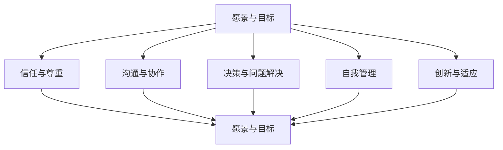

                 

# 领导力训练：让你的团队战无不胜

关键词：领导力，团队管理，自我提升，情感管理，决策与问题解决，战略规划与目标设定，团队建设，领导力成长路径，领导力工具与方法

摘要：本文从领导力的基础、提升和实践三个方面，详细探讨了如何通过训练提升领导力，以实现团队的高效运作和战无不胜。文章通过实际案例和科学方法，提供了实用的领导力训练策略和工具，旨在帮助读者成长为卓越的领导者。

## 目录大纲

## 第一部分：领导力基础

### 第1章：领导力的定义与核心要素

#### 1.1 领导力的定义

#### 1.2 领导力的核心要素

### 第2章：领导风格与团队管理

#### 2.1 领导风格概述

#### 2.2 不同领导风格的应用场景

#### 2.3 团队管理技巧

## 第二部分：领导力提升

### 第3章：自我管理

#### 3.1 自我认知

#### 3.2 自我激励

#### 3.3 自我提升

### 第4章：情感管理与人际沟通

#### 4.1 情感管理

#### 4.2 人际沟通技巧

### 第5章：决策与问题解决

#### 5.1 决策原则

#### 5.2 问题解决的步骤

### 第6章：战略规划与目标设定

#### 6.1 战略规划的重要性

#### 6.2 目标设定的SMART原则

## 第三部分：领导力实践

### 第7章：团队建设

#### 7.1 团队建设的步骤

#### 7.2 提升团队协作效率的策略

### 第8章：领导力案例分析

#### 8.1 成功案例分析

#### 8.2 失败案例分析

### 第9章：领导力成长路径

#### 9.1 领导力成长的五个阶段

#### 9.2 持续提升领导力的方法

## 第四部分：附录

### 第10章：领导力工具与方法

#### 10.1 常用的领导力工具

#### 10.2 领导力方法的应用

## 附录

### 附录A：领导力模型

#### A.1 梅奥需求层次理论

#### A.2 管理方格理论

### 附录B：推荐阅读

#### B.1 《领导力心理学》

#### B.2 《五项管理》

#### B.3 《高效能人士的七个习惯》

## 第一部分：领导力基础

### 第1章：领导力的定义与核心要素

#### 1.1 领导力的定义

领导力是指引导和影响个体或组织实现目标的能力。它不仅涉及对团队成员的激励和指导，还包括对整个团队的战略规划和资源整合。领导力的本质在于通过塑造愿景、建立信任和提供指导，使团队成员能够发挥出最大的潜力。

#### 1.2 领导力的核心要素

领导力的核心要素包括以下几个方面：

1. **愿景与目标**：领导者需要具备清晰的目标和愿景，这不仅能激励团队，还能为团队提供前进的方向。

2. **信任与尊重**：建立信任和尊重是领导力的重要基础。一个成功的领导者应该能够赢得团队成员的信任，并尊重他们的观点和贡献。

3. **沟通与协作**：有效的沟通和协作能力是领导者必须具备的关键素质。领导者需要能够清晰地传达信息，并促进团队成员之间的合作。

4. **决策与问题解决**：领导者需要具备果断的决策能力和有效的问题解决能力，以应对团队面临的挑战和困难。

5. **自我管理**：领导者需要自我管理，包括自我认知、自我激励和自我提升。这是领导者保持高效和持续成长的关键。

6. **创新与适应**：领导者需要具备创新思维和适应变化的能力，以应对快速变化的市场环境。

#### 1.3 领导力的联系与关系架构

以下是一个用Mermaid绘制的领导力核心要素之间的关系架构图：

在这个关系中，各个核心要素相互影响，共同构成了领导力的整体框架。例如，愿景与目标是领导力的核心驱动力，它需要信任与尊重、沟通与协作、决策与问题解决、自我管理、创新与适应等多个要素的支持和配合。

#### 1.4 领导力的实践意义

领导力在团队管理中具有至关重要的意义。一个优秀的领导者能够激发团队成员的潜力，提高团队的整体绩效，实现团队的共同目标。具体来说，领导力的实践意义包括：

1. **提高团队凝聚力**：通过建立信任和尊重，领导者能够增强团队成员之间的凝聚力，形成紧密的团队关系。

2. **促进团队协作**：有效的沟通和协作是团队成功的关键。领导者通过促进团队成员之间的沟通和协作，可以最大限度地发挥团队的整体效能。

3. **激励团队成员**：领导者通过激励和指导，可以激发团队成员的积极性和创造力，提高团队的工作效率。

4. **解决团队问题**：领导者具备果断的决策能力和有效的问题解决能力，可以迅速解决团队面临的困难和挑战。

5. **实现团队目标**：通过战略规划和目标设定，领导者可以为团队提供清晰的方向和目标，引导团队实现长期的愿景和目标。

#### 1.5 领导力的挑战与应对策略

尽管领导力在团队管理中具有重要意义，但领导者也面临着许多挑战。以下是一些常见的领导力挑战及其应对策略：

1. **团队冲突**：团队成员之间的冲突可能会影响团队的工作效率和士气。领导者需要通过沟通和调解，解决团队冲突，促进团队的和谐与协作。

2. **变化与适应**：市场环境和技术变化快速，领导者需要具备适应变化的能力，及时调整团队的战略和目标。

3. **资源管理**：领导者需要合理分配和利用团队资源，确保团队能够高效地完成工作。

4. **自我提升**：领导者需要不断学习和成长，提高自身的领导力水平和专业技能。

### 第2章：领导风格与团队管理

#### 2.1 领导风格概述

领导风格是指领导者在工作中所表现出的行为方式和态度。不同的领导风格会对团队产生不同的影响。常见的领导风格包括：

1. **权威型领导**：权威型领导者倾向于集中决策权，通过命令和指示来管理团队。这种风格通常在紧急情况下或需要快速决策时有效。

2. **民主型领导**：民主型领导者鼓励团队成员参与决策过程，尊重团队成员的意见和贡献。这种风格有助于提高团队的凝聚力和创新能力。

3. **教练型领导**：教练型领导者注重团队成员的成长和发展，通过指导和激励来提高团队成员的技能和潜力。

4. **放任型领导**：放任型领导者给予团队成员较大的自由度，让团队成员自主决策和执行任务。这种风格适用于高度专业化的团队或自我管理能力较强的团队成员。

#### 2.2 不同领导风格的应用场景

不同的领导风格适用于不同的场景和团队环境。以下是一些典型的应用场景：

1. **权威型领导**：在紧急情况下，需要迅速做出决策，或者团队需要高度集中的指导和控制时，权威型领导风格更为有效。

2. **民主型领导**：在团队需要创新和多样化意见时，民主型领导风格有助于激发团队成员的创造力和参与度。

3. **教练型领导**：在团队成员需要专业指导和技能提升时，教练型领导风格能够提供个性化的辅导和反馈。

4. **放任型领导**：在团队成员具备高度自主性和自我管理能力时，放任型领导风格可以给予团队成员更多的自由和灵活性。

#### 2.3 团队管理技巧

有效的团队管理是领导者实现团队目标的关键。以下是一些团队管理技巧：

1. **明确目标与职责**：领导者需要明确团队的目标和每个成员的职责，确保团队成员对任务有清晰的理解和认识。

2. **激励与反馈**：领导者需要及时对团队成员的表现给予激励和反馈，鼓励团队成员保持积极的工作态度。

3. **沟通与协调**：领导者需要保持开放的沟通渠道，促进团队成员之间的信息交流，协调团队内部的合作关系。

4. **冲突管理**：领导者需要具备有效的冲突管理能力，及时解决团队内部的矛盾和冲突，维护团队的和谐与稳定。

5. **资源管理**：领导者需要合理分配和利用团队资源，确保团队能够高效地完成工作。

#### 2.4 领导风格与团队管理的关系

领导风格和团队管理密切相关。不同的领导风格会对团队管理产生不同的影响。例如，权威型领导风格可能会导致团队的高度集中和快速决策，但也可能抑制团队成员的创造力和参与度。民主型领导风格则有助于提高团队的凝聚力和创新能力，但可能需要更多的时间和资源。教练型领导风格能够促进团队成员的成长和发展，但需要领导者具备较高的专业知识和指导能力。放任型领导风格适用于高度专业化的团队，但需要团队成员具备较高的自主性和自我管理能力。

通过合理运用不同的领导风格和团队管理技巧，领导者可以最大限度地发挥团队的潜力，实现团队的目标。

## 第二部分：领导力提升

### 第3章：自我管理

自我管理是领导力提升的重要一环。自我管理不仅涉及自我认知和自我激励，还包括自我提升。以下将逐步分析这些方面的核心概念、应用场景和实践方法。

#### 3.1 自我认知

自我认知是指领导者对自己性格、能力、价值观和情感等方面的了解。自我认知有助于领导者认识到自己的优势和不足，从而有针对性地进行自我提升。

1. **核心概念**：
   - **SWOT分析**：通过分析自己的优势（Strengths）、劣势（Weaknesses）、机会（Opportunities）和威胁（Threats），领导者可以更全面地了解自己。
   - **价值观识别**：明确自己的核心价值观，有助于在决策时保持一致性。

2. **应用场景**：
   - **团队建设**：通过自我认知，领导者可以更好地了解团队成员，促进团队协作。
   - **目标设定**：根据自我认知，领导者可以设定更符合自身特点的目标，提高实现的可能性。

3. **实践方法**：
   - **定期反思**：领导者可以定期进行自我反思，总结自己的优点和不足。
   - **寻求反馈**：通过向同事、下属或导师寻求反馈，领导者可以获得更客观的自我认知。

#### 3.2 自我激励

自我激励是指领导者通过内在的动力和动机，保持积极的工作态度和高效的工作表现。自我激励对于领导者持续提升领导力至关重要。

1. **核心概念**：
   - **内在动机**：领导者通过追求个人兴趣和内在满足，保持工作的积极性。
   - **目标设定**：设定具有挑战性的目标，能够激发领导者的内在动力。

2. **应用场景**：
   - **日常工作**：通过自我激励，领导者可以克服工作中的困难和挑战。
   - **目标实现**：自我激励能够帮助领导者实现长期的目标和愿景。

3. **实践方法**：
   - **目标分解**：将大目标分解为小目标，逐步实现，增加自我激励的成功体验。
   - **奖励机制**：为自己设定奖励机制，当达成一定目标时，给予自己奖励。

#### 3.3 自我提升

自我提升是指领导者通过学习和实践，不断提高自己的知识和技能，以适应不断变化的环境和挑战。

1. **核心概念**：
   - **持续学习**：领导者需要保持学习的态度，不断更新自己的知识和技能。
   - **能力培养**：通过实践和训练，提升自己的领导力和管理能力。

2. **应用场景**：
   - **团队管理**：自我提升有助于领导者更好地应对团队管理中的各种挑战。
   - **个人成长**：自我提升是领导者个人成长的重要途径。

3. **实践方法**：
   - **制定学习计划**：设定具体的学习目标和计划，定期学习新的知识和技能。
   - **实践与反馈**：通过实践所学知识，并定期反思和寻求反馈，不断提高自己的能力。

#### 3.4 自我管理与领导力的关系

自我管理与领导力密切相关。自我管理是领导力提升的基础，它直接影响领导者的决策能力、沟通能力和团队管理能力。一个优秀的领导者需要具备自我管理的能力，才能在复杂多变的环境中保持冷静和清晰，从而有效地领导团队。

- **决策能力**：通过自我管理，领导者可以更好地分析问题，做出明智的决策。
- **沟通能力**：自我管理有助于领导者提高沟通效率，更好地理解团队成员的需求和期望。
- **团队管理**：自我管理能够提高领导者的团队管理能力，建立高效的团队工作流程。

### 第4章：情感管理与人际沟通

情感管理与人际沟通是领导力的重要组成部分，对于建立有效的领导关系和提高团队绩效具有重要意义。以下将逐步分析情感管理和人际沟通的核心概念、应用场景和实践方法。

#### 4.1 情感管理

情感管理是指领导者对自身和他人情绪的认知、理解和管理。情感管理有助于领导者建立良好的人际关系，提高团队的整体情感氛围。

1. **核心概念**：
   - **情绪智力**：情绪智力是指识别、理解和管理自己情绪的能力，以及识别、理解和影响他人情绪的能力。
   - **情商**：情商是指个体在情感领域的认知能力和调节能力，包括自我认知、自我调节、社交意识和关系管理。

2. **应用场景**：
   - **团队建设**：通过情感管理，领导者可以建立积极、和谐的人际关系，提高团队的凝聚力。
   - **冲突管理**：情感管理有助于领导者更好地处理团队内部的冲突，保持团队的稳定。

3. **实践方法**：
   - **情绪识别**：通过自我观察和反思，领导者可以识别和理解自己的情绪。
   - **情感表达**：领导者需要学会在适当的时间和方式表达自己的情感，避免误解和冲突。
   - **情绪调节**：领导者可以通过深呼吸、冥想等方法，调节自己的情绪，保持冷静和理性。

#### 4.2 人际沟通技巧

人际沟通技巧是指领导者在与他人交流时，运用语言和非语言手段，以达到有效沟通的目的。有效的人际沟通有助于领导者建立信任、理解团队成员的需求，提高团队的工作效率。

1. **核心概念**：
   - **有效沟通**：有效沟通是指信息的清晰、准确、及时传递，以及反馈的及时、明确。
   - **倾听技巧**：倾听技巧是指领导者在与他人交流时，给予充分关注和理解，以建立信任和共鸣。

2. **应用场景**：
   - **日常工作**：有效的人际沟通有助于领导者与团队成员建立良好的工作关系，提高工作效率。
   - **团队决策**：通过人际沟通技巧，领导者可以收集团队成员的意见和建议，做出更明智的决策。

3. **实践方法**：
   - **主动倾听**：领导者需要学会在交流中给予团队成员充分的关注和理解，避免打断他们的发言。
   - **明确表达**：领导者需要学会清晰、准确地表达自己的观点和需求，避免产生误解。
   - **情感共鸣**：领导者可以通过表达同情和理解，与团队成员建立情感共鸣，增强团队的凝聚力。

#### 4.3 情感管理与人际沟通的关系

情感管理和人际沟通密切相关。情感管理是人际沟通的基础，它直接影响沟通的效果和质量。一个优秀的领导者需要具备良好的情感管理能力，能够理解和管理自己的情绪，同时能够理解和管理他人的情绪，从而建立有效的沟通渠道。

- **情感管理与沟通效果**：良好的情感管理能力有助于领导者更好地理解团队成员的情感需求，提高沟通的效果。
- **人际沟通与团队氛围**：有效的人际沟通能够建立积极的团队氛围，增强团队的凝聚力。

通过情感管理和人际沟通的提升，领导者可以更好地发挥团队的力量，实现团队的共同目标。

### 第5章：决策与问题解决

#### 5.1 决策原则

决策是领导力的核心要素之一，领导者在面对复杂多变的环境时，需要做出迅速而准确的决策。以下是一些关键的决策原则：

1. **目标导向**：在做出决策时，领导者需要明确目标，确保决策与组织的目标一致。

2. **信息全面**：领导者需要收集全面、准确的信息，以便做出明智的决策。

3. **风险评估**：领导者需要对决策可能带来的风险进行评估，并制定相应的应对策略。

4. **快速决策**：在紧急情况下，领导者需要迅速做出决策，以避免问题的进一步恶化。

5. **持续反馈**：领导者需要不断收集反馈信息，根据实际情况调整决策。

#### 5.2 问题解决的步骤

面对问题和挑战，领导者需要通过系统的方法解决问题。以下是问题解决的步骤：

1. **明确问题**：领导者需要准确识别问题的本质，避免将表面问题当作根本问题。

2. **信息收集**：收集与问题相关的所有信息，包括历史数据、团队成员的意见等。

3. **分析问题**：通过分析信息，找出问题的根本原因，制定解决方案。

4. **方案评估**：评估不同解决方案的优缺点，选择最优方案。

5. **实施决策**：执行决策，并监控实施过程，确保决策的有效性。

6. **反馈调整**：根据实施结果进行反馈，调整决策和方案。

#### 5.3 决策与问题解决的关系

决策和问题解决是相辅相成的。有效的决策依赖于问题解决的深度和广度，而问题解决的最终目标是做出正确的决策。一个优秀的领导者需要具备快速决策和有效解决问题的能力，以应对复杂多变的环境和挑战。

- **决策与问题解决的整合**：领导者需要将决策和问题解决整合到一起，形成系统化的管理流程。
- **决策的连续性**：领导者需要根据问题解决的结果，不断调整和优化决策，以实现长期的战略目标。

通过掌握决策原则和问题解决步骤，领导者可以更有效地应对各种挑战，实现团队的目标。

### 第6章：战略规划与目标设定

#### 6.1 战略规划的重要性

战略规划是领导力的核心组成部分，它为团队和组织提供了明确的方向和目标。以下是战略规划的重要性和关键要素：

1. **明确方向**：战略规划有助于团队和组织明确未来发展的方向，避免盲目行动。
2. **资源配置**：通过战略规划，领导者可以合理分配资源，确保资源的最优利用。
3. **目标导向**：战略规划将团队和组织的目标具体化，有助于提高整体绩效。
4. **风险评估**：战略规划可以帮助团队和组织识别潜在的风险，并提前制定应对措施。
5. **持续改进**：战略规划是一个动态过程，需要根据市场环境和内部变化不断进行调整和优化。

#### 6.2 目标设定的SMART原则

为了确保目标的有效实现，领导者需要遵循SMART原则设定目标：

1. **明确性（Specific）**：目标应明确具体，避免模糊和含糊不清。
2. **可衡量性（Measurable）**：目标应具备可衡量性，以便评估进展和成果。
3. **可实现性（Achievable）**：目标应具备可实现性，避免设定过高的目标，导致团队成员失去信心。
4. **相关性（Relevant）**：目标应与团队和组织的目标一致，确保资源投入的有效性。
5. **时限性（Time-bound）**：目标应设定明确的时限，以推动团队成员的行动和紧迫感。

#### 6.3 战略规划与目标设定的关系

战略规划和目标设定是相辅相成的。战略规划为团队和组织提供了长期的发展方向和目标，而目标设定则是战略规划的具体实施。以下是战略规划与目标设定的关系：

- **战略规划的支撑**：战略规划为目标设定提供了基础和指导，确保目标的可行性和一致性。
- **目标设定的细化**：目标设定将战略规划的具体目标细化为可操作的任务，推动战略规划的实施。

通过战略规划和目标设定，领导者可以确保团队和组织在正确的方向上持续前进，实现长期目标。

### 第7章：团队建设

#### 7.1 团队建设的步骤

团队建设是领导力的重要组成部分，一个高效的团队能够显著提高组织的绩效和创新能力。以下是团队建设的步骤：

1. **明确团队目标**：领导者需要与团队成员共同明确团队的目标和期望，确保团队成员对目标有清晰的认识。

2. **建立信任**：信任是团队协作的基础，领导者需要通过沟通、透明度和一致性建立信任。

3. **培养团队文化**：领导者需要培养一种积极、包容和开放的团队文化，鼓励团队成员分享想法和反馈。

4. **分工协作**：领导者需要明确团队成员的职责和角色，确保团队成员能够有效协作，共同完成任务。

5. **持续反馈**：领导者需要定期与团队成员进行反馈，评估团队的表现和改进方向。

6. **激励与奖励**：领导者需要通过激励和奖励机制，鼓励团队成员积极参与团队建设，提高团队的凝聚力和效率。

#### 7.2 提升团队协作效率的策略

为了提高团队的协作效率，领导者可以采取以下策略：

1. **沟通与协作工具**：引入有效的沟通和协作工具，如即时通讯、项目管理软件等，确保团队成员能够高效地沟通和协作。

2. **共同的目标和计划**：确保团队成员对共同的目标和计划有清晰的认识，并定期更新和调整，以适应变化。

3. **分工与合作**：明确团队成员的职责和角色，确保每个成员都能发挥自己的优势，同时鼓励跨部门合作。

4. **培训与成长**：提供培训和成长机会，提高团队成员的技能和知识，以适应不断变化的工作环境。

5. **反馈与改进**：建立反馈机制，鼓励团队成员提出建议和反馈，持续改进团队的工作流程和协作方式。

#### 7.3 团队建设与领导力的关系

团队建设与领导力密切相关。一个优秀的领导者不仅能够明确团队的目标和期望，还能够通过建立信任、培养团队文化和提供激励，提高团队的协作效率和创新能力。以下是团队建设与领导力的关系：

- **领导力的体现**：团队建设是领导者领导力的体现，通过有效的团队建设，领导者能够提升团队的整体绩效。
- **团队效能的提升**：团队建设有助于提升团队的效能，实现团队的目标，从而提高组织的整体竞争力。

通过团队建设和有效的领导力实践，领导者可以打造一支高效、协作的团队，实现组织的长期成功。

### 第8章：领导力案例分析

#### 8.1 成功案例分析

在分析领导力成功案例时，我们可以从以下方面进行探讨：

1. **成功的背景**：领导者所在组织的背景和环境，包括市场状况、竞争态势、内部文化等。
2. **领导者的角色**：领导者如何发挥自己的作用，包括制定战略、激励团队、解决问题等。
3. **关键举措**：领导者采取的关键举措，如创新管理方法、实施变革、建立团队文化等。
4. **结果和影响**：领导者的举措带来的结果和影响，包括团队的绩效提升、组织的发展、员工的满意度等。

以下是一个具体的成功案例分析：

**案例背景**：某科技公司在面临激烈市场竞争和内部管理问题时，任命了一位具有丰富行业经验的领导者。

**领导者角色**：新领导者首先明确了公司的愿景和目标，通过沟通和协调，赢得了团队成员的信任和支持。

**关键举措**：
- **战略调整**：领导者对公司战略进行了调整，将重心从产品研发转向客户服务和市场拓展。
- **文化重塑**：领导者通过建立开放、包容的团队文化，鼓励团队成员提出创新想法和改进建议。
- **激励机制**：领导者引入了激励机制，根据团队成员的贡献和绩效给予奖励。

**结果和影响**：
- **团队绩效提升**：通过战略调整和文化重塑，团队的绩效显著提升，公司的市场竞争力增强。
- **组织发展**：公司的市场份额和营业收入均有所增长，组织内部氛围更加积极和合作。
- **员工满意度**：员工对公司的满意度和归属感提高，离职率显著下降。

#### 8.2 失败案例分析

在分析领导力失败案例时，我们可以从以下方面进行探讨：

1. **失败的原因**：领导者为何失败，包括战略失误、沟通不畅、管理不善等。
2. **领导者的行为**：领导者具体的错误行为，如独断专行、忽视员工需求、不重视团队建设等。
3. **影响和后果**：领导者的错误行为带来的影响和后果，包括团队绩效下降、组织发展受阻、员工流失等。

以下是一个具体的失败案例分析：

**案例背景**：某初创公司在快速发展过程中，因领导者失误导致公司陷入困境。

**领导者行为**：
- **独断专行**：领导者过度集中决策权，不听取团队成员的意见，导致决策失误。
- **忽视员工需求**：领导者忽视员工的需求和反馈，导致员工士气低落，工作积极性下降。
- **不重视团队建设**：领导者没有进行有效的团队建设，团队成员之间缺乏信任和合作。

**影响和后果**：
- **团队绩效下降**：由于领导者独断专行，团队成员缺乏参与感和归属感，团队绩效显著下降。
- **组织发展受阻**：公司的发展战略和计划因领导者的失误而受挫，组织发展受阻。
- **员工流失**：领导者的错误行为导致员工流失，公司面临人才短缺的问题。

通过成功和失败案例的分析，我们可以更深入地理解领导力在组织发展中的重要性，以及如何避免领导力失败的风险。

### 第9章：领导力成长路径

#### 9.1 领导力成长的五个阶段

领导力成长是一个持续的过程，通常可以分为以下五个阶段：

1. **觉醒阶段**：领导者意识到自己在领导力方面的不足，开始寻求改进和提升。
2. **学习阶段**：领导者通过阅读书籍、参加培训、向导师学习等方式，积累知识和技能。
3. **实践阶段**：领导者将所学知识和技能应用到实际工作中，通过实践不断提高自己的领导能力。
4. **整合阶段**：领导者将不同的领导技巧和策略整合到一起，形成自己独特的领导风格。
5. **卓越阶段**：领导者达到领导力的顶峰，能够应对复杂多变的环境，引领团队和组织取得卓越的成果。

#### 9.2 持续提升领导力的方法

为了持续提升领导力，领导者可以采取以下方法：

1. **自我反思**：定期进行自我反思，总结自己的优点和不足，制定改进计划。
2. **持续学习**：不断学习新的知识和技能，保持对新趋势和变化的高度敏感。
3. **实践与创新**：将所学知识应用到实际工作中，通过实践和创新不断提高领导能力。
4. **寻求反馈**：向同事、下属和导师寻求反馈，了解自己的领导风格和团队绩效。
5. **培养下属**：通过培养和激励下属，提升团队的整体领导力水平。

#### 9.3 领导力成长与团队发展的关系

领导力成长与团队发展密切相关。一个持续提升领导力的领导者能够更好地引领团队，实现团队的目标和愿景。以下是领导力成长与团队发展的关系：

- **领导力的提升**：领导力的提升有助于领导者更好地理解团队的需求，制定有效的战略和决策。
- **团队的发展**：团队的发展有助于领导者在实际工作中锻炼和提升领导能力，实现个人和团队的共同成长。
- **组织的成功**：领导力成长和团队发展共同推动组织的成功，提高组织的整体竞争力和创新能力。

通过领导力成长路径和持续提升方法，领导者可以不断提升自己的领导能力，实现团队和组织的目标。

### 第10章：领导力工具与方法

#### 10.1 常用的领导力工具

在领导力实践中，常用的工具包括：

1. **SWOT分析**：用于分析组织的优势、劣势、机会和威胁，帮助领导者制定战略规划。
2. **SMART目标设定**：用于设定明确、可衡量、可实现、相关和时限性的目标，提高目标的实现率。
3. **5W1H方法**：用于分析问题，包括是什么（What）、为什么（Why）、谁（Who）、何时（When）、在哪里（Where）和如何做（How）。
4. **团队协作工具**：如Slack、Trello等，用于提高团队沟通和协作效率。

#### 10.2 领导力方法的应用

以下是领导力方法在实践中的应用：

1. **领导力培训**：通过培训，领导者可以学习新的领导技巧和策略，提升自己的领导能力。
2. **导师辅导**：通过导师辅导，领导者可以获得指导和支持，加速领导力成长。
3. **团队建设活动**：通过团队建设活动，增强团队凝聚力，提高团队协作效率。
4. **绩效管理**：通过绩效管理，领导者可以激励团队成员，提高团队的整体绩效。

#### 10.3 领导力工具与方法的关系

领导力工具与方法是相辅相成的。工具提供了实施领导力方法的工具和手段，而方法则是工具的具体应用。有效的领导力工具与方法可以提高领导者的决策能力和团队管理能力，实现团队和组织的共同发展。

### 附录A：领导力模型

#### A.1 梅奥需求层次理论

梅奥需求层次理论认为，人的需求可以分为五个层次：生理需求、安全需求、社交需求、尊重需求和自我实现需求。领导者需要了解和满足团队成员的不同需求，以提高团队的整体绩效。

#### A.2 管理方格理论

管理方格理论将领导风格分为关心人和关心任务两个维度，形成了一个9x9的矩阵。领导者可以根据自己的风格选择合适的领导方式，以实现团队的目标和成员的满意。

### 附录B：推荐阅读

#### B.1 《领导力心理学》
作者：斯蒂芬·罗宾斯（Stephen P. Robbins）
内容：本书详细介绍了领导力的心理学原理，包括领导风格、团队动力、领导影响力等。

#### B.2 《五项管理》
作者：菲利普·科特勒（Philip Kotler）
内容：本书介绍了五项管理原则，包括领导力、市场营销、创新、文化和人才，适用于各种组织和团队。

#### B.3 《高效能人士的七个习惯》
作者：史蒂芬·柯维（Stephen R. Covey）
内容：本书提出了七个习惯，包括积极主动、以终为始、要事第一等，帮助领导者提升个人效能和团队绩效。

### 结论

领导力是团队和组织成功的关键因素。通过本篇文章的探讨，我们了解了领导力的定义、核心要素、提升方法、实践策略和成长路径。希望读者能够结合自己的实际情况，不断学习和实践，提升自己的领导力，带领团队实现更高的目标。作者：AI天才研究院/AI Genius Institute & 禅与计算机程序设计艺术 /Zen And The Art of Computer Programming

