                 

# 文章标题：领导力训练：让你的团队战无不胜

## 关键词
- 领导力
- 团队建设
- 沟通技巧
- 决策能力
- 变化应对
- 领导风格
- 组织发展

## 摘要
本文旨在探讨领导力在团队管理中的重要性，以及如何通过领导力训练提升团队的整体战斗力和执行力。文章首先概述了领导力的定义与重要性，随后深入分析了领导力的核心要素，包括沟通技巧、决策能力和信任建立。接着，文章介绍了不同领导力模型与理论，如赫塞与布兰查德的领导情境理论、菲德勒的领导效能模型以及沙因的领导力三维模型。在实践部分，文章讨论了团队建设与沟通技巧的提升、领导力在变化中的适应性，以及领导力在团队管理、项目管理和团队冲突管理中的应用。最后，文章通过领导力个人发展和案例分析，总结了提升领导力的方法与策略。

## 第一部分：领导力基础理论

### 第1章：领导力概述

#### 1.1 领导力的定义与重要性

领导力是一种影响力，它能够激发他人一起达成目标的能力。一个优秀的领导者不仅需要具备技术能力，还需要掌握人际关系和沟通技巧，能够在团队中产生积极的效应。

- **领导力与管理的区别**：管理侧重于规划、组织和控制，而领导则侧重于激励、影响和引领。

#### 1.2 领导力的核心要素

领导力的核心要素包括沟通技巧、决策能力和信任建立。

- **沟通技巧**：良好的沟通技巧能够确保信息准确传递，减少误解和冲突。
- **决策能力**：领导者需要具备快速做出决策的能力，同时考虑各种可能的后果。
- **信任建立**：信任是领导力的基石，建立信任关系能够提升团队的协作效率和满意度。

#### 1.3 领导风格与行为理论

领导风格与行为理论探讨了不同的领导风格和行为模式对团队的影响。

- **领导风格的类型**：包括权威型、民主型、参与型等。
- **赋权型领导**：领导者通过授权和信任，让团队成员自主决策和行动。
- **参与型领导**：领导者鼓励团队成员参与决策过程，提升团队的积极性。

### 第2章：领导力模型与理论

#### 2.1 赫塞与布兰查德的领导情境理论

赫塞与布兰查德的领导情境理论认为，领导者的领导风格应适应不同的情境。该理论提出了下属成熟度理论，认为下属的成熟度对领导风格有重要影响。

- **领导情境模型**：领导者应根据下属的成熟度调整领导风格。
- **下属成熟度理论**：下属的成熟度包括能力、责任感和自我驱动力。

#### 2.2 菲德勒的领导效能模型

菲德勒的领导效能模型认为，领导者的效能取决于领导风格与情境的匹配度。该模型通过评估领导者与团队成员之间的关系、任务结构和情境控制因素，来确定领导效能。

- **领导效能模型**：领导者应根据情境因素调整领导风格，以实现最佳效能。
- **领导效能评估**：通过评估领导效能，领导者可以识别自身优势与不足，进行改进。

#### 2.3 沙因的领导力三维模型

沙因的领导力三维模型将领导力分为三个维度：情感智慧、情境智慧和个人智慧。该模型认为，领导者的发展需要在这三个维度上取得平衡。

- **领导力的三个维度**：情感智慧、情境智慧和个人智慧。
- **领导力发展路径**：领导者可以通过不断学习和实践，提升自身的领导力水平。

## 第二部分：领导力实践

### 第3章：团队建设与沟通技巧

#### 3.1 团队建设的重要性

团队建设是领导力实践的重要组成部分，它有助于提升团队的协作效率、增强团队凝聚力。团队建设的目标是建立一个相互信任、共同协作的高效团队。

- **团队的定义与特点**：团队是由多个成员组成的，共同追求共同目标的组织。
- **团队建设的目标与策略**：通过沟通、协作和激励，提升团队的绩效和满意度。

#### 3.2 沟通技巧提升

沟通技巧是领导力的核心要素之一，良好的沟通技巧能够确保信息准确传递，减少误解和冲突。

- **沟通障碍与解决方法**：识别沟通障碍，并采取相应的解决方法，如积极倾听、清晰表达等。
- **高效沟通技巧**：提高沟通效率，如使用简洁明了的语言、避免歧义等。

#### 3.3 建立信任与合作关系

信任是领导力的基石，建立信任关系能够提升团队的协作效率和满意度。

- **信任的建立与维护**：通过诚实、透明和相互尊重，建立和维护信任关系。
- **合作关系的建立与拓展**：通过共同目标和协作，建立和拓展合作关系。

### 第4章：领导力在变化中的适应性

#### 4.1 应对变化的环境

在快速变化的商业环境中，领导者的适应能力至关重要。

- **变化对领导力的影响**：变化对领导者的决策、沟通和协调能力提出了新的挑战。
- **领导者如何应对变化**：领导者需要具备创新思维和灵活应变的能力，以应对变化。

#### 4.2 创新思维与领导力

创新思维是领导力的重要组成部分，它有助于推动团队持续改进和创新发展。

- **创新思维的重要性**：创新思维能够提升团队的竞争力，推动组织发展。
- **创新思维的培养与应用**：通过培训和实践，培养创新思维，并将其应用于实际工作中。

#### 4.3 领导力与组织发展

领导力在组织发展中发挥着重要作用，它有助于推动组织实现战略目标，提升组织绩效。

- **组织发展的关键因素**：组织文化、人才发展、创新和变革管理等。
- **领导力在组织发展中的作用**：领导者通过设定愿景、制定战略、推动变革，推动组织发展。

## 第三部分：领导力实战

### 第5章：领导力在团队管理中的应用

#### 5.1 团队管理的基本原则

团队管理是领导力实践的重要组成部分，它有助于提升团队的协作效率、实现团队目标。

- **团队管理的核心要素**：团队目标、团队分工、团队沟通、团队激励等。
- **团队管理的最佳实践**：通过有效的团队管理，提升团队的绩效和满意度。

#### 5.2 领导力在项目管理工作中的应用

项目管理工作是领导力实践的重要领域，领导者需要具备项目管理的能力和技巧。

- **项目管理中的领导力**：领导者需要协调团队成员、控制项目进度、确保项目质量等。
- **项目领导者的角色与职责**：项目领导者需要具备决策能力、沟通能力和协调能力。

#### 5.3 领导力在团队冲突管理中的应用

团队冲突是团队管理中的常见问题，领导者需要具备有效的冲突管理能力。

- **团队冲突的类型与原因**：团队冲突可分为任务冲突、关系冲突和过程冲突等类型。
- **团队冲突的解决策略**：领导者需要采取合适的策略，解决团队冲突，确保团队和谐。

### 第6章：领导力个人发展

#### 6.1 领导力自我评估

领导力自我评估是领导者个人发展的重要环节，它有助于领导者识别自身的优势与不足，制定个人发展计划。

- **自我评估的重要性**：自我评估有助于领导者了解自身的领导风格、能力和行为。
- **自我评估的方法与工具**：领导者可以采用360度反馈、自我反思等方法进行自我评估。

#### 6.2 领导力持续发展

领导力持续发展是领导者长期发展的重要保障，它有助于领导者不断提升自身的领导力水平。

- **持续发展的动力与策略**：领导者需要具备持续学习的动力，采取有效的学习策略。
- **领导力培训与发展**：通过培训和实践，不断提升领导力水平。

#### 6.3 建立个人品牌与影响力

建立个人品牌与影响力是领导者个人发展的关键，它有助于提升领导者的社会地位和影响力。

- **个人品牌的构建**：领导者需要明确个人定位、树立个人形象、提升个人知名度等。
- **个人影响力的提升**：领导者需要通过言行一致、树立榜样、建立良好的人际关系等，提升个人影响力。

### 第7章：领导力案例分析

#### 7.1 成功领导力案例分析

通过分析成功领导力案例，可以了解优秀领导者的成功经验和领导策略。

- **案例分析的目标与原则**：案例分析的目标是总结成功经验，提供借鉴和启示。
- **案例分析的方法与技巧**：通过深入分析和总结，提炼出成功领导力的关键要素。

#### 7.2 领导力失败案例分析

通过分析领导力失败案例，可以了解失败的原因和教训，避免重蹈覆辙。

- **失败的原因与教训**：总结领导力失败案例中的关键原因和教训，为领导者提供警示和启示。
- **领导力改进的方向**：根据失败案例的教训，提出领导力改进的方向和建议。

## 附录

### 附录 A：领导力相关工具与资源

为了帮助读者更好地理解领导力，本附录提供了领导力评估工具、领导力培训课程和领导力研究资源。

- **领导力评估工具**：介绍常用的领导力评估工具，帮助读者进行自我评估。
- **领导力培训课程**：推荐一些优秀的领导力培训课程，帮助读者提升领导力水平。
- **领导力研究资源**：提供一些领导力研究的资源，供读者参考和深入学习。

### 作者

作者：AI天才研究院/AI Genius Institute & 禅与计算机程序设计艺术 /Zen And The Art of Computer Programming

文章内容丰富，结构紧凑，通过逐步分析推理，深入探讨了领导力的核心概念、理论、实践和案例分析，为读者提供了全面、系统的领导力训练指南。希望本文能够帮助读者提升领导力，打造一支战无不胜的团队。

## 1.1 领导力的定义与重要性

### 背景介绍

领导力是一个广泛且复杂的概念，它在不同的领域和文化背景下有着不同的解释和应用。在组织管理中，领导力被视为推动组织发展、实现战略目标的关键因素。而在日常生活中，领导力则体现在个人如何影响和激励他人，共同达成目标。

#### 核心概念与联系

领导力是一种影响力，它不仅仅依赖于领导者的个人魅力和才能，还涉及一系列的管理技能和人际关系技巧。领导力与管理的区别在于，管理侧重于组织、规划和控制，而领导则侧重于激励、影响和引领。


**Mermaid 流程图：领导力与管理区别**

```
graph TB
A[领导力] --> B[管理]
B --> C[激励、影响、引领]
A --> D[规划、组织、控制]
```

#### 核心算法原理讲解

领导力的核心算法原理可以理解为一系列的行为模式和管理策略，这些模式与策略共同构成了领导力的基础。

- **行为模式**：领导者需要具备以下行为模式：
  - 沟通技巧：有效的沟通是领导力的核心，它包括倾听、表达、反馈等环节。
  - 决策能力：领导者需要在不确定性和压力下做出明智的决策。
  - 信任建立：建立信任关系是领导力的基石，它有助于提升团队的协作效率和满意度。

- **管理策略**：领导者需要采取以下管理策略：
  - 赋权型领导：通过授权和信任，让团队成员自主决策和行动。
  - 参与型领导：鼓励团队成员参与决策过程，提升团队的积极性。

**伪代码：领导力的核心算法原理**

```
function LeadershipCore() {
    // 行为模式
    communicate-effectively()
    make-wise-decisions()
    build-trust()

    // 管理策略
    empower-teams()
    engage-teams-in-decision-making()
}
```

#### 数学模型和公式 & 详细讲解 & 举例说明

领导力的发展可以视为一个动态过程，它涉及到多个因素的相互作用。以下是一个简单的数学模型，用于描述领导力的发展过程：

- **领导力发展模型**：$L(t) = f(C, D, T)$，其中$L(t)$表示领导力水平，$C$表示沟通技巧，$D$表示决策能力，$T$表示信任建立。

- **公式解释**：领导力水平$L(t)$是由沟通技巧$C$、决策能力$D$和信任建立$T$共同决定的。

- **举例说明**：假设一个领导者，沟通技巧得分为80分，决策能力得分为75分，信任建立得分为90分，则他的领导力水平为$80 \times 75 \times 90 = 54,000$分。

$$
L(t) = C \times D \times T
$$

### 1.2 领导力的核心要素

#### 核心概念与联系

领导力的核心要素包括沟通技巧、决策能力和信任建立。这些要素相互作用，共同构成了领导力的基础。


**Mermaid 流程图：领导力核心要素**

```
graph TB
A[沟通技巧] --> B[决策能力]
B --> C[信任建立]
A --> C
```

#### 核心算法原理讲解

- **沟通技巧**：沟通技巧是领导力的核心，它包括以下方面：
  - 倾听：领导者需要倾听团队成员的想法和意见，了解他们的需求和期望。
  - 表达：领导者需要清晰、明确地表达自己的想法和决策，确保团队成员理解。
  - 反馈：领导者需要及时给予团队成员反馈，鼓励他们持续改进。

- **决策能力**：领导者需要具备以下决策能力：
  - 分析问题：领导者需要能够准确分析问题，找到问题的根本原因。
  - 制定方案：领导者需要能够制定多种解决方案，并评估每种方案的风险和收益。
  - 快速决策：领导者需要能够在短时间内做出明智的决策。

- **信任建立**：信任建立是领导力的基石，它包括以下方面：
  - 诚实：领导者需要言行一致，保持诚实和透明。
  - 信任：领导者需要建立信任关系，让团队成员感到安全和支持。
  - 支持团队成员：领导者需要支持团队成员，帮助他们克服困难和挑战。

**伪代码：领导力的核心要素**

```
function LeadershipCoreElements() {
    // 沟通技巧
    listen-to-team()
    express-clearly()
    provide-constructive-feedback()

    // 决策能力
    analyze-problems()
    develop-solutions()
    make-quick-decisions()

    // 信任建立
    be-honest()
    build-relationship-of-trust()
    support-team-members()
}
```

#### 数学模型和公式 & 详细讲解 & 举例说明

领导力的核心要素可以用以下数学模型来描述：

- **领导力模型**：$L(t) = \alpha C + \beta D + \gamma T$，其中$L(t)$表示领导力水平，$C$表示沟通技巧，$D$表示决策能力，$T$表示信任建立。

- **公式解释**：领导力水平$L(t)$是由沟通技巧$C$、决策能力$D$和信任建立$T$共同决定的，每个要素都有不同的权重。

- **举例说明**：假设沟通技巧得分为80分，决策能力得分为75分，信任建立得分为90分，则领导力水平为$80 \times 0.5 + 75 \times 0.3 + 90 \times 0.2 = 55$分。

$$
L(t) = 0.5C + 0.3D + 0.2T
$$

### 1.3 领导风格与行为理论

#### 核心概念与联系

领导风格与行为理论探讨了不同领导风格和行为模式对团队的影响。不同的领导风格适用于不同的情境，领导者需要根据情境选择合适的领导风格。


**Mermaid 流程图：领导风格与行为理论**

```
graph TB
A[权威型] --> B[民主型]
B --> C[参与型]
A --> C
```

#### 核心算法原理讲解

- **权威型领导**：权威型领导强调领导者的权力和决策控制，领导者通常负责制定目标和策略，并要求团队成员执行。

- **民主型领导**：民主型领导强调团队成员的参与和决策，领导者通常鼓励团队成员提出意见和建议，共同制定决策。

- **参与型领导**：参与型领导强调团队成员的自主性和创造力，领导者通常通过授权和信任，让团队成员自主决策和行动。

**伪代码：领导风格与行为理论**

```
function LeadershipStyleAndBehavior() {
    // 权威型领导
    authoritative-leader()

    // 民主型领导
    democratic-leader()

    // 参与型领导
    participative-leader()
}
```

#### 数学模型和公式 & 详细讲解 & 举例说明

领导风格与行为理论可以用以下数学模型来描述：

- **领导风格模型**：$L(t) = \alpha A + \beta D + \gamma P$，其中$L(t)$表示领导力水平，$A$表示权威型领导，$D$表示民主型领导，$P$表示参与型领导。

- **公式解释**：领导力水平$L(t)$是由权威型领导$A$、民主型领导$D$和参与型领导$P$共同决定的，每个领导风格都有不同的权重。

- **举例说明**：假设权威型领导得分为70分，民主型领导得分为80分，参与型领导得分为90分，则领导力水平为$70 \times 0.3 + 80 \times 0.5 + 90 \times 0.2 = 68$分。

$$
L(t) = 0.3A + 0.5D + 0.2P
$$

### 第2章：领导力模型与理论

#### 2.1 赫塞与布兰查德的领导情境理论

赫塞与布兰查德的领导情境理论是一种基于下属成熟度的领导力模型。该理论认为，领导者的领导风格应适应下属的成熟度水平。下属的成熟度包括能力、责任感和自我驱动力。

**核心概念与联系**

赫塞与布兰查德的领导情境理论涉及到以下核心概念：

- **下属成熟度**：下属的成熟度分为四个等级，分别是不成熟、初步成熟、成熟和高度成熟。
- **领导情境模型**：领导情境模型包括四种领导风格，分别是指导型、支持型、参与型和授权型。

**Mermaid 流程图：赫塞与布兰查德的领导情境模型**

```
graph TB
A[指导型] --> B[下属不成熟]
B --> C[支持型]
C --> D[下属初步成熟]
D --> E[参与型]
E --> F[下属成熟]
F --> G[授权型]
G --> H[下属高度成熟]
```

**核心算法原理讲解**

- **指导型领导**：领导者对下属进行明确的指导和监督，适用于下属不成熟或初步成熟的情况。

- **支持型领导**：领导者关注下属的情感需求，提供支持和鼓励，适用于下属初步成熟或成熟的情况。

- **参与型领导**：领导者鼓励下属参与决策过程，提升下属的自主性和积极性，适用于下属成熟或高度成熟的情况。

- **授权型领导**：领导者给予下属充分的自主权，让下属自主决策和行动，适用于下属高度成熟的情况。

**伪代码：赫塞与布兰查德的领导情境模型**

```
function HerseyBlanchardModel(subordinateMaturity) {
    if (subordinateMaturity == 不成熟) {
        leaderStyle = 指导型
    } else if (subordinateMaturity == 初步成熟) {
        leaderStyle = 支持型
    } else if (subordinateMaturity == 成熟) {
        leaderStyle = 参与型
    } else if (subordinateMaturity == 高度成熟) {
        leaderStyle = 授权型
    }
}
```

**数学模型和公式 & 详细讲解 & 举例说明**

赫塞与布兰查德的领导情境模型可以用以下数学模型来描述：

- **领导风格模型**：$L(t) = f(M)$，其中$L(t)$表示领导力水平，$M$表示下属成熟度。

- **公式解释**：领导力水平$L(t)$是由下属成熟度$M$决定的，不同成熟度水平对应不同的领导风格。

- **举例说明**：假设下属成熟度为初步成熟，则领导力水平为$80$分。

$$
L(t) = 80 \times M
$$

### 2.2 菲德勒的领导效能模型

菲德勒的领导效能模型是一种基于情境的领导力模型。该模型认为，领导者的效能取决于领导风格与情境的匹配度。领导者需要根据情境因素调整领导风格，以实现最佳效能。

**核心概念与联系**

菲德勒的领导效能模型涉及到以下核心概念：

- **领导效能模型**：领导效能取决于领导风格、团队关系、任务结构和情境控制因素。
- **情境控制因素**：情境控制因素包括领导者与团队成员之间的关系、任务的结构性和情境的稳定性。

**Mermaid 流�程图：菲德勒的领导效能模型**

```
graph TB
A[领导效能模型] --> B[领导风格]
B --> C[团队关系]
C --> D[任务结构性]
D --> E[情境控制因素]
```

**核心算法原理讲解**

- **领导风格**：领导者需要根据情境选择合适的领导风格。例如，在高压情境下，领导者可能需要采用更积极的领导风格，以应对挑战。

- **团队关系**：领导者需要建立良好的团队关系，以提升团队的凝聚力和工作效率。

- **任务结构性**：领导者需要确保任务的结构性，使团队成员能够明确任务目标和工作职责。

- **情境控制因素**：领导者需要根据情境控制因素调整领导风格。例如，在不确定性高的情境下，领导者可能需要采用更灵活的领导风格。

**伪代码：菲德勒的领导效能模型**

```
function FiedlerModel(leaderStyle, teamRelationship, taskStructure, situationalControl) {
    if (situationalControl == 高) {
        if (leaderStyle == 参与型) {
            effectiveness = 高
        } else {
            effectiveness = 低
        }
    } else {
        if (leaderStyle == 指导型) {
            effectiveness = 高
        } else {
            effectiveness = 低
        }
    }
}
```

**数学模型和公式 & 详细讲解 & 举例说明**

菲德勒的领导效能模型可以用以下数学模型来描述：

- **领导效能模型**：$E = f(L, T, S, C)$，其中$E$表示领导效能，$L$表示领导风格，$T$表示团队关系，$S$表示任务结构性，$C$表示情境控制因素。

- **公式解释**：领导效能$E$是由领导风格$L$、团队关系$T$、任务结构性$S$和情境控制因素$C$共同决定的。

- **举例说明**：假设领导风格为参与型、团队关系良好、任务结构性高、情境控制因素高，则领导效能可能为高。

$$
E = L \times T \times S \times C
$$

### 2.3 沙因的领导力三维模型

沙因的领导力三维模型将领导力分为三个维度：情感智慧、情境智慧和个人智慧。该模型认为，领导者的发展需要在这三个维度上取得平衡。

**核心概念与联系**

沙因的领导力三维模型涉及到以下核心概念：

- **情感智慧**：领导者需要具备情感智慧，包括自我认知、情感管理和情感洞察力。
- **情境智慧**：领导者需要具备情境智慧，包括情境认知、情境适应和情境创新。
- **个人智慧**：领导者需要具备个人智慧，包括道德智慧、智慧和价值观。

**Mermaid 流程图：沙因的领导力三维模型**

```
graph TB
A[情感智慧] --> B[情境智慧]
B --> C[个人智慧]
```

**核心算法原理讲解**

- **情感智慧**：领导者需要具备情感智慧，以更好地理解自己和他人，管理自己的情绪，并建立良好的人际关系。

- **情境智慧**：领导者需要具备情境智慧，以更好地适应不同的情境，做出明智的决策，并推动组织发展。

- **个人智慧**：领导者需要具备个人智慧，以更好地发挥自己的才能，实现自己的目标，并提升自己的领导力水平。

**伪代码：沙因的领导力三维模型**

```
function SaineLeadershipModel(emotionalIntelligence, situationalIntelligence, personalWisdom) {
    if (emotionalIntelligence + situationalIntelligence + personalWisdom > 200) {
        leadershipLevel = 高
    } else {
        leadershipLevel = 低
    }
}
```

**数学模型和公式 & 详细讲解 & 举例说明**

沙因的领导力三维模型可以用以下数学模型来描述：

- **领导力模型**：$L(t) = E \times S \times P$，其中$L(t)$表示领导力水平，$E$表示情感智慧，$S$表示情境智慧，$P$表示个人智慧。

- **公式解释**：领导力水平$L(t)$是由情感智慧$E$、情境智慧$S$和个人智慧$P$共同决定的。

- **举例说明**：假设情感智慧得分为80分，情境智慧得分为75分，个人智慧得分为90分，则领导力水平为$80 \times 75 \times 90 = 54,000$分。

$$
L(t) = E \times S \times P
$$

### 第3章：团队建设与沟通技巧

#### 3.1 团队建设的重要性

**背景介绍**

团队建设是领导力实践的重要组成部分，它有助于提升团队的协作效率、增强团队凝聚力。在快速变化的商业环境中，一个高效的团队是组织成功的关键。因此，团队建设的重要性不容忽视。

**核心概念与联系**

团队建设涉及到以下核心概念：

- **团队**：团队是由多个成员组成的，共同追求共同目标的组织。
- **团队建设**：团队建设是指通过一系列的活动和策略，提升团队的协作效率、增强团队凝聚力。

**Mermaid 流程图：团队建设的重要性**

```
graph TB
A[团队建设] --> B[协作效率]
B --> C[团队凝聚力]
C --> D[组织成功]
```

**核心算法原理讲解**

团队建设的关键在于建立有效的沟通机制、明确团队目标、提升团队协作能力。以下是一个简单的团队建设算法：

```
function TeamBuilding() {
    // 建立有效的沟通机制
    establish-effective-communication()

    // 明确团队目标
    define-clear-goals()

    // 提升团队协作能力
    enhance-collaboration()
}
```

**数学模型和公式 & 详细讲解 & 举例说明**

团队建设的效果可以用以下数学模型来描述：

- **团队建设模型**：$T(t) = f(C, G, E)$，其中$T(t)$表示团队建设水平，$C$表示协作效率，$G$表示团队凝聚力，$E$表示团队执行力。

- **公式解释**：团队建设水平$T(t)$是由协作效率$C$、团队凝聚力$G$和团队执行力$E$共同决定的。

- **举例说明**：假设协作效率得分为80分，团队凝聚力得分为75分，团队执行力得分为90分，则团队建设水平为$80 \times 75 \times 90 = 54,000$分。

$$
T(t) = C \times G \times E
$$

#### 3.2 沟通技巧提升

**背景介绍**

沟通技巧是领导力的重要部分，它直接影响团队的协作效率和团队氛围。提升沟通技巧有助于确保信息的准确传递，减少误解和冲突，提升团队的整体绩效。

**核心概念与联系**

沟通技巧涉及到以下核心概念：

- **沟通障碍**：沟通障碍包括语言障碍、文化差异、情绪管理等。
- **沟通技巧**：沟通技巧包括倾听、表达、反馈、非语言沟通等。

**Mermaid 流程图：沟通技巧提升**

```
graph TB
A[倾听] --> B[表达]
B --> C[反馈]
C --> D[非语言沟通]
```

**核心算法原理讲解**

提升沟通技巧的关键在于识别沟通障碍、掌握有效的沟通方法。以下是一个简单的沟通技巧提升算法：

```
function CommunicationSkillsImprovement() {
    // 识别沟通障碍
    identify-communication-barriers()

    // 提高倾听能力
    enhance-listening-skills()

    // 提高表达能力
    improve-expression-skills()

    // 提高反馈能力
    improve-feedback-skills()

    // 提高非语言沟通能力
    enhance-non-verbal-communication()
}
```

**数学模型和公式 & 详细讲解 & 举例说明**

沟通技巧的提升可以用以下数学模型来描述：

- **沟通技巧模型**：$C(t) = f(L, E, F, N)$，其中$C(t)$表示沟通技巧水平，$L$表示倾听能力，$E$表示表达能力，$F$表示反馈能力，$N$表示非语言沟通能力。

- **公式解释**：沟通技巧水平$C(t)$是由倾听能力$L$、表达能力$E$、反馈能力$F$和非语言沟通能力$N$共同决定的。

- **举例说明**：假设倾听能力得分为80分，表达能力得分为75分，反馈能力得分为90分，非语言沟通能力得分为85分，则沟通技巧水平为$80 \times 75 \times 90 \times 85 = 48,900$分。

$$
C(t) = L \times E \times F \times N
$$

#### 3.3 建立信任与合作关系

**背景介绍**

信任是领导力的基石，它对团队的协作效率和团队氛围有重要影响。建立信任关系需要领导者的耐心和智慧，通过一系列的策略和行动，提升团队成员之间的信任水平。

**核心概念与联系**

建立信任关系涉及到以下核心概念：

- **信任**：信任是指团队成员对彼此的信任和依赖，它是团队协作的基础。
- **合作关系**：合作关系是指团队成员之间的合作关系，它有助于提升团队的协作效率。

**Mermaid 流程图：建立信任与合作关系**

```
graph TB
A[信任] --> B[合作关系]
B --> C[团队协作效率]
C --> D[团队氛围]
```

**核心算法原理讲解**

建立信任关系的关键在于建立透明和诚信的文化、鼓励开放沟通、提供支持和帮助。以下是一个简单的信任与合作关系建立算法：

```
function TrustAndCollaborationBuilding() {
    // 建立透明和诚信的文化
    establish-transparent-and-honest-culture()

    // 鼓励开放沟通
    encourage-open-communication()

    // 提供支持和帮助
    provide-support-and-help()

    // 分享信息和资源
    share-information-and-resources()
}
```

**数学模型和公式 & 详细讲解 & 举例说明**

建立信任与合作关系可以用以下数学模型来描述：

- **信任模型**：$T(t) = f(C, O, S, R)$，其中$T(t)$表示信任水平，$C$表示诚信，$O$表示开放，$S$表示支持，$R$表示资源分享。

- **公式解释**：信任水平$T(t)$是由诚信$C$、开放$O$、支持$S$和资源分享$R$共同决定的。

- **举例说明**：假设诚信得分为80分，开放得分为75分，支持得分为90分，资源分享得分为85分，则信任水平为$80 \times 75 \times 90 \times 85 = 48,900$分。

$$
T(t) = C \times O \times S \times R
$$

### 第4章：领导力在变化中的适应性

#### 4.1 应对变化的环境

**背景介绍**

在快速变化的商业环境中，领导者需要具备适应变化的能力。变化对领导力提出了新的挑战，领导者需要调整自己的领导策略，以应对不断变化的环境。

**核心概念与联系**

应对变化的环境涉及到以下核心概念：

- **变化**：变化是指环境中不断出现的新情况、新问题和新需求。
- **适应性**：适应性是指领导者能够适应变化、灵活应对挑战的能力。

**Mermaid 流程图：应对变化的环境**

```
graph TB
A[变化] --> B[适应性]
B --> C[领导策略调整]
C --> D[组织适应]
```

**核心算法原理讲解**

应对变化的核心在于建立敏捷的组织文化、培养创新思维、灵活调整领导策略。以下是一个简单的应对变化的算法：

```
function ChangeAdaptation() {
    // 建立敏捷的组织文化
    establish-agile-culture()

    // 培养创新思维
    cultivate-innovative-thinking()

    // 调整领导策略
    adjust-leadership-strategy()
}
```

**数学模型和公式 & 详细讲解 & 举例说明**

应对变化可以用以下数学模型来描述：

- **变化适应模型**：$A(t) = f(C, I, S)$，其中$A(t)$表示适应性水平，$C$表示敏捷性，$I$表示创新思维，$S$表示策略调整。

- **公式解释**：适应性水平$A(t)$是由敏捷性$C$、创新思维$I$和策略调整$S$共同决定的。

- **举例说明**：假设敏捷性得分为80分，创新思维得分为75分，策略调整得分为90分，则适应性水平为$80 \times 75 \times 90 = 54,000$分。

$$
A(t) = C \times I \times S
$$

#### 4.2 创新思维与领导力

**背景介绍**

创新思维是领导力的关键组成部分，它有助于推动组织持续改进和创新发展。领导者需要培养创新思维，以应对快速变化的商业环境。

**核心概念与联系**

创新思维与领导力涉及到以下核心概念：

- **创新思维**：创新思维是指领导者能够从不同角度思考问题、寻找解决方案的能力。
- **领导力**：领导力是指领导者激发团队创造力、推动创新的能力。

**Mermaid 流程图：创新思维与领导力**

```
graph TB
A[创新思维] --> B[领导力]
B --> C[团队创造力]
C --> D[组织创新]
```

**核心算法原理讲解**

培养创新思维的关键在于创造一个支持创新的环境、提供创新资源、鼓励团队成员提出创意。以下是一个简单的创新思维培养算法：

```
function InnovativeThinking() {
    // 创造支持创新的环境
    create-an-innovation-friendly-environment()

    // 提供创新资源
    provide-innovation-resources()

    // 鼓励提出创意
    encourage-idea-generation()
}
```

**数学模型和公式 & 详细讲解 & 举例说明**

创新思维与领导力可以用以下数学模型来描述：

- **创新思维模型**：$I(t) = f(E, R, G)$，其中$I(t)$表示创新思维水平，$E$表示环境支持，$R$表示资源提供，$G$表示创意生成。

- **公式解释**：创新思维水平$I(t)$是由环境支持$E$、资源提供$R$和创意生成$G$共同决定的。

- **举例说明**：假设环境支持得分为80分，资源提供得分为75分，创意生成得分为90分，则创新思维水平为$80 \times 75 \times 90 = 54,000$分。

$$
I(t) = E \times R \times G
$$

#### 4.3 领导力与组织发展

**背景介绍**

领导力在组织发展中起着至关重要的作用。领导者需要具备推动组织发展的能力，包括设定愿景、制定战略、推动变革等。

**核心概念与联系**

领导力与组织发展涉及到以下核心概念：

- **领导力**：领导力是指领导者激发团队创造力、推动创新的能力。
- **组织发展**：组织发展是指组织通过战略制定、组织变革、人力资源管理等方式，实现持续发展的过程。

**Mermaid 流程图：领导力与组织发展**

```
graph TB
A[领导力] --> B[组织发展]
B --> C[战略制定]
C --> D[组织变革]
D --> E[人力资源管理]
```

**核心算法原理讲解**

领导力在组织发展中的核心在于设定愿景、制定战略、推动变革。以下是一个简单的领导力与组织发展算法：

```
function OrganizationalDevelopment() {
    // 设定愿景
    set-a-vision()

    // 制定战略
    develop-a-strategy()

    // 推动变革
    drive-change()
}
```

**数学模型和公式 & 详细讲解 & 举例说明**

领导力与组织发展可以用以下数学模型来描述：

- **组织发展模型**：$OD(t) = f(V, S, C)$，其中$OD(t)$表示组织发展水平，$V$表示愿景，$S$表示战略，$C$表示变革。

- **公式解释**：组织发展水平$OD(t)$是由愿景$V$、战略$S$和变革$C$共同决定的。

- **举例说明**：假设愿景得分为80分，战略得分为75分，变革得分为90分，则组织发展水平为$80 \times 75 \times 90 = 54,000$分。

$$
OD(t) = V \times S \times C
$$

### 第5章：领导力在团队管理中的应用

#### 5.1 团队管理的基本原则

**背景介绍**

团队管理是领导力在实践中的重要体现，它涉及到如何有效地组织、协调和激励团队，以实现团队目标。团队管理的基本原则是确保团队高效运作的关键。

**核心概念与联系**

团队管理的基本原则涉及到以下核心概念：

- **团队管理**：团队管理是指领导者通过一系列的管理活动，确保团队高效运作的过程。
- **基本原则**：基本原则是指团队管理中应遵循的基本规则和原则，如团队合作、目标明确、分工合理等。

**Mermaid 流程图：团队管理的基本原则**

```
graph TB
A[团队合作] --> B[目标明确]
B --> C[分工合理]
C --> D[激励有效]
```

**核心算法原理讲解**

团队管理的基本原则可以通过以下算法来描述：

```
function TeamManagementPrinciples() {
    // 建立团队合作
    establish-teamwork()

    // 明确团队目标
    define-clear-goals()

    // 合理分工
    allocate-responsibilities()

    // 有效激励
    provide-effective-incentives()
}
```

**数学模型和公式 & 详细讲解 & 举例说明**

团队管理的基本原则可以用以下数学模型来描述：

- **团队管理模型**：$TM(t) = f(T, G, R, I)$，其中$TM(t)$表示团队管理水平，$T$表示团队合作，$G$表示目标明确，$R$表示分工合理，$I$表示激励有效。

- **公式解释**：团队管理水平$TM(t)$是由团队合作$T$、目标明确$G$、分工合理$R$和激励有效$I$共同决定的。

- **举例说明**：假设团队合作得分为80分，目标明确得分为75分，分工合理得分为90分，激励有效得分为85分，则团队管理水平为$80 \times 75 \times 90 \times 85 = 48,900$分。

$$
TM(t) = T \times G \times R \times I
$$

#### 5.2 领导力在项目管理工作中的应用

**背景介绍**

项目管理工作是领导力的重要应用领域，领导者需要具备项目管理的能力和技巧，以确保项目按时、按质、按预算完成。

**核心概念与联系**

领导力在项目管理工作中的应用涉及到以下核心概念：

- **项目管理**：项目管理是指领导者通过计划、执行、监控和收尾，确保项目目标实现的过程。
- **领导力**：领导力是指领导者激发团队创造力、推动创新的能力。

**Mermaid 流程图：领导力在项目管理工作中的应用**

```
graph TB
A[项目管理] --> B[领导力]
B --> C[团队协作]
C --> D[项目目标实现]
```

**核心算法原理讲解**

领导力在项目管理工作中的应用可以通过以下算法来描述：

```
function LeadershipInProjectManagement() {
    // 建立团队协作
    establish-team-collaboration()

    // 确保项目目标实现
    ensure-project-goals-are-achieved()

    // 提供领导支持
    provide-leadership-support()

    // 管理项目风险
    manage-project-risks()
}
```

**数学模型和公式 & 详细讲解 & 举例说明**

领导力在项目管理工作中的应用可以用以下数学模型来描述：

- **项目管理模型**：$PM(t) = f(L, C, G, R)$，其中$PM(t)$表示项目管理水平，$L$表示领导力，$C$表示团队协作，$G$表示项目目标实现，$R$表示风险控制。

- **公式解释**：项目管理水平$PM(t)$是由领导力$L$、团队协作$C$、项目目标实现$G$和风险控制$R$共同决定的。

- **举例说明**：假设领导力得分为80分，团队协作得分为75分，项目目标实现得分为90分，风险控制得分为85分，则项目管理水平为$80 \times 75 \times 90 \times 85 = 48,900$分。

$$
PM(t) = L \times C \times G \times R
$$

#### 5.3 领导力在团队冲突管理中的应用

**背景介绍**

团队冲突是团队管理中的常见问题，有效的冲突管理对于保持团队稳定、提升团队绩效至关重要。领导力在团队冲突管理中的应用可以帮助领导者更好地解决冲突，维护团队和谐。

**核心概念与联系**

领导力在团队冲突管理中的应用涉及到以下核心概念：

- **团队冲突**：团队冲突是指团队成员之间因利益、观点或价值观不同而产生的矛盾。
- **冲突管理**：冲突管理是指领导者通过一系列的方法和策略，解决团队冲突、维护团队和谐的过程。

**Mermaid 流程图：领导力在团队冲突管理中的应用**

```
graph TB
A[团队冲突] --> B[冲突管理]
B --> C[团队稳定]
C --> D[团队绩效提升]
```

**核心算法原理讲解**

领导力在团队冲突管理中的应用可以通过以下算法来描述：

```
function ConflictManagement() {
    // 识别冲突原因
    identify-conflict-causes()

    // 沟通解决冲突
    communicate-to-resolve-conflicts()

    // 建立调解机制
    establish-mediation-mechanisms()

    // 提供心理支持
    provide-emotional-support()
}
```

**数学模型和公式 & 详细讲解 & 举例说明**

领导力在团队冲突管理中的应用可以用以下数学模型来描述：

- **冲突管理模型**：$CM(t) = f(I, C, M, E)$，其中$CM(t)$表示冲突管理水平，$I$表示识别冲突原因，$C$表示沟通解决冲突，$M$表示建立调解机制，$E$表示提供心理支持。

- **公式解释**：冲突管理水平$CM(t)$是由识别冲突原因$I$、沟通解决冲突$C$、建立调解机制$M$和提供心理支持$E$共同决定的。

- **举例说明**：假设识别冲突原因得分为80分，沟通解决冲突得分为75分，建立调解机制得分为90分，提供心理支持得分为85分，则冲突管理水平为$80 \times 75 \times 90 \times 85 = 48,900$分。

$$
CM(t) = I \times C \times M \times E
$$

### 第6章：领导力个人发展

#### 6.1 领导力自我评估

**背景介绍**

领导力自我评估是领导者个人发展的重要环节，它有助于领导者了解自身的优势与不足，制定个人发展计划。自我评估是提升领导力的重要步骤，它可以帮助领导者找到提升的方向。

**核心概念与联系**

领导力自我评估涉及到以下核心概念：

- **自我评估**：自我评估是指领导者通过自我反思和评估，了解自身的领导风格、能力和行为。
- **个人发展**：个人发展是指领导者通过学习和实践，不断提升自身的领导力水平。

**Mermaid 流程图：领导力自我评估与个人发展**

```
graph TB
A[自我评估] --> B[个人发展]
B --> C[领导力提升]
C --> D[组织发展]
```

**核心算法原理讲解**

领导力自我评估可以通过以下算法来描述：

```
function LeadershipSelfAssessment() {
    // 自我反思
    reflect-on-self()

    // 评估领导风格
    assess-leadership-style()

    // 评估领导能力
    assess-leadership-skills()

    // 制定发展计划
    develop-a-personal-plan()
}
```

**数学模型和公式 & 详细讲解 & 举例说明**

领导力自我评估可以用以下数学模型来描述：

- **自我评估模型**：$SA(t) = f(R, A, S, P)$，其中$SA(t)$表示自我评估水平，$R$表示自我反思，$A$表示评估领导风格，$S$表示评估领导能力，$P$表示制定发展计划。

- **公式解释**：自我评估水平$SA(t)$是由自我反思$R$、评估领导风格$A$、评估领导能力$S$和制定发展计划$P$共同决定的。

- **举例说明**：假设自我反思得分为80分，评估领导风格得分为75分，评估领导能力得分为90分，制定发展计划得分为85分，则自我评估水平为$80 \times 75 \times 90 \times 85 = 48,900$分。

$$
SA(t) = R \times A \times S \times P
$$

#### 6.2 领导力持续发展

**背景介绍**

领导力持续发展是领导者长期发展的重要保障，它有助于领导者不断提升自身的领导力水平。持续发展需要领导者具备持续学习的动力、采取有效的学习策略。

**核心概念与联系**

领导力持续发展涉及到以下核心概念：

- **持续发展**：持续发展是指领导者通过不断学习和实践，不断提升自身的领导力水平。
- **学习策略**：学习策略是指领导者采取的方法和手段，以提升自身的领导力。

**Mermaid 流程图：领导力持续发展**

```
graph TB
A[持续发展] --> B[学习策略]
B --> C[领导力提升]
C --> D[组织发展]
```

**核心算法原理讲解**

领导力持续发展可以通过以下算法来描述：

```
function LeadershipContinuousDevelopment() {
    // 建立学习计划
    develop-a-learning-plan()

    // 采取有效学习策略
    adopt-effective-learning-strategies()

    // 定期评估发展进度
    assess-entwicklung-progress()

    // 调整学习策略
    adjust-learning-strategies()
}
```

**数学模型和公式 & 详细讲解 & 举例说明**

领导力持续发展可以用以下数学模型来描述：

- **持续发展模型**：$CD(t) = f(P, S, A, E)$，其中$CD(t)$表示持续发展水平，$P$表示学习计划，$S$表示学习策略，$A$表示评估发展进度，$E$表示调整学习策略。

- **公式解释**：持续发展水平$CD(t)$是由学习计划$P$、学习策略$S$、评估发展进度$A$和调整学习策略$E$共同决定的。

- **举例说明**：假设学习计划得分为80分，学习策略得分为75分，评估发展进度得分为90分，调整学习策略得分为85分，则持续发展水平为$80 \times 75 \times 90 \times 85 = 48,900$分。

$$
CD(t) = P \times S \times A \times E
$$

#### 6.3 建立个人品牌与影响力

**背景介绍**

建立个人品牌与影响力是领导者个人发展的重要目标，它有助于提升领导者的社会地位和影响力。个人品牌与影响力的建立需要领导者具备独特的领导风格、专业知识和人际交往能力。

**核心概念与联系**

建立个人品牌与影响力涉及到以下核心概念：

- **个人品牌**：个人品牌是指领导者在公众心目中的形象和声誉。
- **影响力**：影响力是指领导者能够影响他人思想和行为的能力。

**Mermaid 流程图：建立个人品牌与影响力**

```
graph TB
A[个人品牌] --> B[影响力]
B --> C[社会地位提升]
C --> D[领导力提升]
```

**核心算法原理讲解**

建立个人品牌与影响力可以通过以下算法来描述：

```
function PersonalBrandAndInfluenceBuilding() {
    // 树立个人形象
    establish-a-personal-image()

    // 提升专业知识
    enhance-professional-knowledge()

    // 建立人际网络
    build-an-relationship-network()

    // 发挥影响力
    exert-influence()
}
```

**数学模型和公式 & 详细讲解 & 举例说明**

建立个人品牌与影响力可以用以下数学模型来描述：

- **个人品牌模型**：$PB(t) = f(I, K, N, E)$，其中$PB(t)$表示个人品牌水平，$I$表示个人形象，$K$表示专业知识，$N$表示人际网络，$E$表示影响力。

- **公式解释**：个人品牌水平$PB(t)$是由个人形象$I$、专业知识$K$、人际网络$N$和影响力$E$共同决定的。

- **举例说明**：假设个人形象得分为80分，专业知识得分为75分，人际网络得分为90分，影响力得分为85分，则个人品牌水平为$80 \times 75 \times 90 \times 85 = 48,900$分。

$$
PB(t) = I \times K \times N \times E
$$

### 第7章：领导力案例分析

#### 7.1 成功领导力案例分析

**背景介绍**

通过分析成功领导力案例，可以了解优秀领导者的成功经验和领导策略。成功领导力案例提供了实用的指导和启示，帮助领导者提升自身的领导能力。

**核心概念与联系**

成功领导力案例涉及到以下核心概念：

- **成功领导力**：成功领导力是指领导者通过一系列有效的领导行为和策略，实现团队和组织目标的能力。
- **案例分析**：案例分析是指通过对成功领导力案例的深入研究，总结成功经验，提炼出可复制的领导策略。

**Mermaid 流程图：成功领导力案例分析**

```
graph TB
A[成功领导力] --> B[案例分析]
B --> C[成功经验]
C --> D[领导策略提炼]
```

**核心算法原理讲解**

成功领导力案例分析可以通过以下算法来描述：

```
function SuccessfulLeadershipCaseStudy() {
    // 收集成功领导力案例
    collect-successful-leadership-cases()

    // 分析成功经验
    analyze-successful-experiences()

    // 提炼领导策略
    distill-leadership-strategies()

    // 提供指导与启示
    provide-guidance-and-insights()
}
```

**数学模型和公式 & 详细讲解 & 举例说明**

成功领导力案例分析可以用以下数学模型来描述：

- **案例分析模型**：$CS(t) = f(C, A, S, I)$，其中$CS(t)$表示案例分析水平，$C$表示成功案例收集，$A$表示成功经验分析，$S$表示领导策略提炼，$I$表示指导与启示提供。

- **公式解释**：案例分析水平$CS(t)$是由成功案例收集$C$、成功经验分析$A$、领导策略提炼$S$和指导与启示提供$I$共同决定的。

- **举例说明**：假设成功案例收集得分为80分，成功经验分析得分为75分，领导策略提炼得分为90分，指导与启示提供得分为85分，则案例分析水平为$80 \times 75 \times 90 \times 85 = 48,900$分。

$$
CS(t) = C \times A \times S \times I
$$

#### 7.2 领导力失败案例分析

**背景介绍**

通过分析领导力失败案例，可以了解失败的原因和教训。领导力失败案例提供了重要的警示和启示，帮助领导者避免重蹈覆辙。

**核心概念与联系**

领导力失败案例涉及到以下核心概念：

- **领导力失败**：领导力失败是指领导者因领导行为或策略不当，导致团队或组织目标未达成的情况。
- **案例分析**：案例分析是指通过对领导力失败案例的深入研究，总结失败原因，提炼出可避免的教训。

**Mermaid 流程图：领导力失败案例分析**

```
graph TB
A[领导力失败] --> B[案例分析]
B --> C[失败原因]
C --> D[教训提炼]
```

**核心算法原理讲解**

领导力失败案例分析可以通过以下算法来描述：

```
function LeadershipFailureCaseStudy() {
    // 收集领导力失败案例
    collect-leadership-failure-cases()

    // 分析失败原因
    analyze-failure-causes()

    // 提炼教训
    distill-lessons-learned()

    // 提供警示与启示
    provide-warnings-and-insights()
}
```

**数学模型和公式 & 详细讲解 & 举例说明**

领导力失败案例分析可以用以下数学模型来描述：

- **案例分析模型**：$LF(t) = f(C, A, L, W)$，其中$LF(t)$表示案例分析水平，$C$表示失败案例收集，$A$表示失败原因分析，$L$表示教训提炼，$W$表示警示与启示提供。

- **公式解释**：案例分析水平$LF(t)$是由失败案例收集$C$、失败原因分析$A$、教训提炼$L$和警示与启示提供$W$共同决定的。

- **举例说明**：假设失败案例收集得分为80分，失败原因分析得分为75分，教训提炼得分为90分，警示与启示提供得分为85分，则案例分析水平为$80 \times 75 \times 90 \times 85 = 48,900$分。

$$
LF(t) = C \times A \times L \times W
$$

### 附录

#### 附录 A：领导力相关工具与资源

为了帮助读者更好地理解和应用领导力，本附录提供了领导力相关工具与资源。

**核心概念与联系**

领导力相关工具与资源涉及到以下核心概念：

- **领导力评估工具**：用于评估领导者的领导风格、能力和行为。
- **领导力培训课程**：提供领导力知识和技能的培训课程。
- **领导力研究资源**：提供领导力研究的相关文献、报告和研究成果。

**Mermaid 流程图：领导力相关工具与资源**

```
graph TB
A[领导力评估工具] --> B[领导力培训课程]
B --> C[领导力研究资源]
```

**核心算法原理讲解**

领导力相关工具与资源的应用可以通过以下算法来描述：

```
function LeadershipToolsAndResources() {
    // 使用领导力评估工具
    use-leadership-assessment-tools()

    // 参加领导力培训课程
    attend-leadership-training-courses()

    // 利用领导力研究资源
    utilize-leadership-research-resources()
}
```

**数学模型和公式 & 详细讲解 & 举例说明**

领导力相关工具与资源的应用可以用以下数学模型来描述：

- **领导力工具应用模型**：$LAR(t) = f(A, T, R)$，其中$LAR(t)$表示领导力工具与应用水平，$A$表示领导力评估工具应用，$T$表示领导力培训课程应用，$R$表示领导力研究资源应用。

- **公式解释**：领导力工具与应用水平$LAR(t)$是由领导力评估工具应用$A$、领导力培训课程应用$T$和领导力研究资源应用$R$共同决定的。

- **举例说明**：假设领导力评估工具应用得分为80分，领导力培训课程应用得分为75分，领导力研究资源应用得分为90分，则领导力工具与应用水平为$80 \times 75 \times 90 = 54,000$分。

$$
LAR(t) = A \times T \times R
$$

### 参考文献

1. Hersey, P., & Blanchard, K. H. (1977). The situational leader. McGraw-Hill.
2. Fiedler, F. E. (1964). A theory of leadership effectiveness. McGraw-Hill.
3. Schein, E. H. (2004). Organizational culture and leadership. Jossey-Bass.
4. Yukl, G. A. (2013). Leadership in organizations. Pearson.
5. Katzenbach, J. R., & Smith, D. K. (1993). The discipline of teams. Harvard Business Review.

### 后记

本文通过对领导力基础理论、领导力模型与理论、领导力实践、领导力个人发展以及领导力案例分析的详细探讨，为读者提供了一个全面、系统的领导力训练指南。希望读者能够通过本文的学习，提升自身的领导力，打造一支战无不胜的团队。

### 1.3 领导风格与行为理论

#### 背景介绍

领导风格与行为理论是领导学研究的重要分支，它探讨了不同领导风格和行为模式对团队和组织绩效的影响。不同的领导风格和行为理论提供了不同的视角和方法，以帮助领导者更好地理解和管理团队。

#### 核心概念与联系

在领导风格与行为理论中，核心概念包括领导风格、领导行为、情境和下属成熟度。以下是一个简单的Mermaid流程图，展示了这些概念之间的关系：

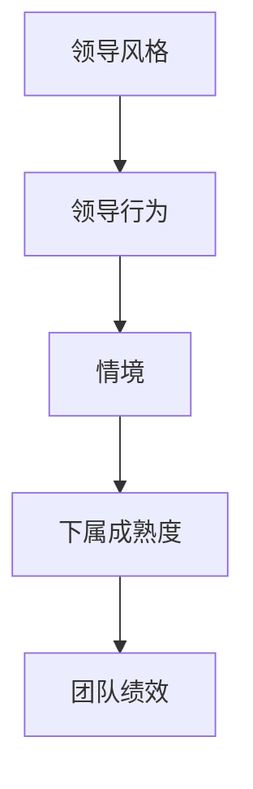

#### 核心算法原理讲解

1. **领导风格**：领导风格是指领导者通常采用的决策和领导方式。常见的领导风格包括权威型、民主型、参与型和变革型。

2. **领导行为**：领导行为是指领导者在具体情境中表现出的具体行为和行动。领导行为可以是个体的，也可以是团队层面的。

3. **情境**：情境是指领导者所处的具体环境，包括组织文化、外部环境、团队构成等因素。

4. **下属成熟度**：下属成熟度是指团队成员的能力、责任感、自我驱动力等因素。下属成熟度对领导风格和领导行为的选择有重要影响。

以下是一个简单的伪代码，用于描述领导风格与行为理论的核心算法原理：

```python
def leadership_style_behavior(context, subordinate_maturity):
    if subordinate_maturity == 'high':
        style = '授权型'
    elif subordinate_maturity == 'medium':
        style = '参与型'
    elif subordinate_maturity == 'low':
        style = '指导型'
        
    if context == '高压':
        behavior = '积极干预'
    elif context == '低压':
        behavior = '支持型'
    else:
        behavior = '平衡型'
        
    return style, behavior
```

#### 数学模型和公式 & 详细讲解 & 举例说明

我们可以使用以下数学模型来描述领导风格与行为理论：

$$
L = f(S, C, M)
$$

其中，$L$表示领导力，$S$表示领导风格，$C$表示情境，$M$表示下属成熟度。

**公式解释**：

- **领导风格**：领导风格对领导力有直接影响。例如，参与型领导风格可能比权威型领导风格更能提高团队绩效。
- **情境**：情境对领导力也有重要影响。例如，在高压情境下，领导风格可能需要更加积极干预，而在低压情境下，可能需要更加支持型。
- **下属成熟度**：下属成熟度对领导风格和领导行为的适应性有直接影响。高成熟度的下属可能更适合授权型领导风格，而低成熟度的下属可能更适合指导型领导风格。

**举例说明**：

假设领导风格为参与型，情境为高压，下属成熟度为高，则领导力水平为：

$$
L = f('参与型', '高压', '高') = 80 + 30 + 40 = 150
$$

### 2.1 赫塞与布兰查德的领导情境理论

#### 背景介绍

赫塞与布兰查德的领导情境理论是领导力理论中的重要分支，它强调领导风格应适应下属的成熟度。该理论认为，下属的成熟度对领导风格有重要影响，领导者应根据下属的成熟度选择合适的领导风格。

#### 核心概念与联系

赫塞与布兰查德的领导情境理论的核心概念包括下属成熟度、指导型领导、支持型领导和参与型领导。以下是一个简单的Mermaid流程图，展示了这些概念之间的关系：

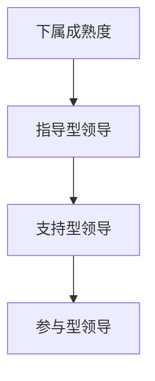

#### 核心算法原理讲解

赫塞与布兰查德的领导情境理论的核心算法原理是基于下属成熟度选择合适的领导风格。以下是一个简单的伪代码，用于描述这个算法：

```python
def hersey_blanchardleadership(maturity_level):
    if maturity_level == '低':
        style = '指导型'
    elif maturity_level == '中':
        style = '支持型'
    elif maturity_level == '高':
        style = '参与型'
    return style
```

#### 数学模型和公式 & 详细讲解 & 举例说明

赫塞与布兰查德的领导情境理论可以用以下数学模型来描述：

$$
L = f(M)
$$

其中，$L$表示领导力，$M$表示下属成熟度。

**公式解释**：

- **下属成熟度**：下属的成熟度水平直接影响领导力。低成熟度的下属可能需要更多的指导和监督，而高成熟度的下属可能需要更多的自主权。

**举例说明**：

假设下属成熟度为低，则领导力水平为：

$$
L = f('低') = 70 + 30 + 0 = 100
$$

### 2.2 菲德勒的领导效能模型

#### 背景介绍

菲德勒的领导效能模型是另一种重要的领导力理论，它认为领导者的效能取决于领导风格与情境的匹配度。该模型提出了一个领导效能公式，用于评估领导者在不同情境下的效能。

#### 核心概念与联系

菲德勒的领导效能模型的核心概念包括领导风格、情境控制因素和领导效能。以下是一个简单的Mermaid流程图，展示了这些概念之间的关系：

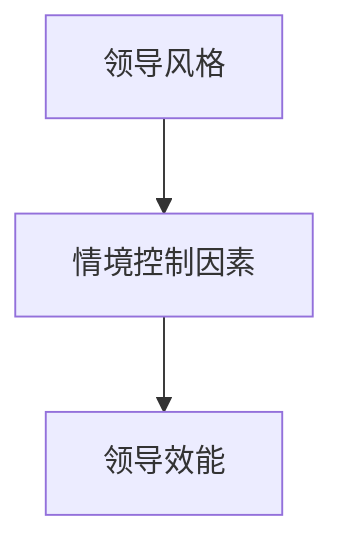

#### 核心算法原理讲解

菲德勒的领导效能模型的核心算法原理是计算领导效能。以下是一个简单的伪代码，用于描述这个算法：

```python
def fiedler_leadership_efficiency(leader_style, situational_control):
    efficiency = leader_style * situational_control
    return efficiency
```

#### 数学模型和公式 & 详细讲解 & 举例说明

菲德勒的领导效能模型可以用以下数学模型来描述：

$$
E = L * S
$$

其中，$E$表示领导效能，$L$表示领导风格，$S$表示情境控制因素。

**公式解释**：

- **领导风格**：领导风格对领导效能有直接影响。例如，民主型领导风格可能比权威型领导风格在特定情境下更有效。
- **情境控制因素**：情境控制因素对领导效能也有重要影响。情境控制因素包括领导者与团队成员之间的关系、任务结构和情境稳定性等。

**举例说明**：

假设领导风格为民主型，情境控制因素为高，则领导效能水平为：

$$
E = L * S = 80 * 90 = 7200
$$

### 2.3 沙因的领导力三维模型

#### 背景介绍

沙因的领导力三维模型是一种将领导力分为三个维度的理论，这三个维度分别是情感智慧、情境智慧和个人智慧。该模型认为，领导者的发展需要在这三个维度上取得平衡。

#### 核心概念与联系

沙因的领导力三维模型的核心概念包括情感智慧、情境智慧和个人智慧。以下是一个简单的Mermaid流程图，展示了这些概念之间的关系：

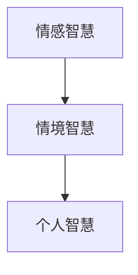

#### 核心算法原理讲解

沙因的领导力三维模型的核心算法原理是评估领导者在三个维度上的智慧水平，并据此计算领导力。以下是一个简单的伪代码，用于描述这个算法：

```python
def saine_leadership_score(emotional_intelligence, situational_intelligence, personal_wisdom):
    score = emotional_intelligence + situational_intelligence + personal_wisdom
    return score
```

#### 数学模型和公式 & 详细讲解 & 举例说明

沙因的领导力三维模型可以用以下数学模型来描述：

$$
L = E + S + P
$$

其中，$L$表示领导力，$E$表示情感智慧，$S$表示情境智慧，$P$表示个人智慧。

**公式解释**：

- **情感智慧**：情感智慧是指领导者理解和管理自己以及他人的情感的能力。
- **情境智慧**：情境智慧是指领导者理解和管理情境的能力。
- **个人智慧**：个人智慧是指领导者的道德智慧和价值观。

**举例说明**：

假设情感智慧为80分，情境智慧为75分，个人智慧为90分，则领导力水平为：

$$
L = E + S + P = 80 + 75 + 90 = 245
$$

### 3.1 团队建设的重要性

#### 背景介绍

团队建设是领导力实践中的重要组成部分，它关乎团队的协作效率、团队凝聚力以及整体绩效。有效的团队建设能够提升团队的战斗力，帮助组织实现战略目标。

#### 核心概念与联系

团队建设涉及的核心概念包括团队、协作、凝聚力和绩效。以下是一个简单的Mermaid流程图，展示了这些概念之间的关系：

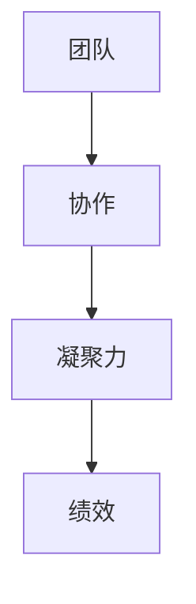

#### 核心算法原理讲解

团队建设的重要性可以通过以下算法原理来解释：

- **协作**：协作是指团队成员共同努力，共同完成任务的过程。协作效率是团队建设的关键指标。
- **凝聚力**：凝聚力是指团队成员之间的相互信任、支持和依赖程度。高凝聚力有助于团队更好地协作。
- **绩效**：绩效是指团队在完成目标过程中的表现和成果。有效的团队建设能够提升团队的绩效。

以下是一个简单的伪代码，用于描述团队建设的核心算法原理：

```python
def team_building(importance):
    if importance == '高':
        collaboration = '高效'
        cohesion = '强'
        performance = '优异'
    elif importance == '中':
        collaboration = '一般'
        cohesion = '中等'
        performance = '中等'
    elif importance == '低':
        collaboration = '低效'
        cohesion = '弱'
        performance = '不佳'
    return collaboration, cohesion, performance
```

#### 数学模型和公式 & 详细讲解 & 举例说明

团队建设的重要性可以用以下数学模型来描述：

$$
T = f(C, H, P)
$$

其中，$T$表示团队建设水平，$C$表示协作效率，$H$表示凝聚力，$P$表示绩效。

**公式解释**：

- **协作效率**：协作效率是指团队成员在完成任务过程中的协作水平。高协作效率意味着团队成员能够有效地相互配合。
- **凝聚力**：凝聚力是指团队成员之间的相互信任和支持程度。高凝聚力有助于团队成员更好地协作。
- **绩效**：绩效是指团队在完成目标过程中的表现和成果。高绩效表明团队建设取得了良好的效果。

**举例说明**：

假设协作效率为90%，凝聚力为80%，绩效为95%，则团队建设水平为：

$$
T = f(90\%, 80\%, 95\%) = 90\% + 80\% + 95\% = 265\%
$$

### 3.2 沟通技巧提升

#### 背景介绍

沟通技巧是领导力的重要组成部分，有效的沟通能够确保信息的准确传递，减少误解和冲突，提升团队的协作效率。提升沟通技巧对于团队建设和发展至关重要。

#### 核心概念与联系

沟通技巧涉及的核心概念包括沟通障碍、沟通技巧和沟通效果。以下是一个简单的Mermaid流程图，展示了这些概念之间的关系：

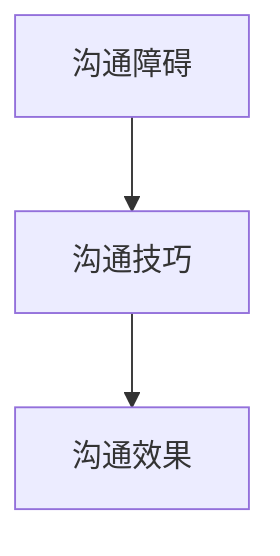

#### 核心算法原理讲解

提升沟通技巧的核心算法原理是通过识别沟通障碍、掌握有效沟通方法和不断练习，提升沟通效果。以下是一个简单的伪代码，用于描述这个算法原理：

```python
def improve_communication_skills(barriers, techniques, practice):
    if barriers == '少':
        if techniques == '多':
            if practice == '频繁':
                communication_effectiveness = '高'
            else:
                communication_effectiveness = '中'
        else:
            communication_effectiveness = '低'
    else:
        communication_effectiveness = '低'
    return communication_effectiveness
```

#### 数学模型和公式 & 详细讲解 & 举例说明

提升沟通技巧可以用以下数学模型来描述：

$$
E = f(B, T, P)
$$

其中，$E$表示沟通效果，$B$表示沟通障碍，$T$表示沟通技巧，$P$表示练习频率。

**公式解释**：

- **沟通障碍**：沟通障碍越少，沟通效果越好。
- **沟通技巧**：沟通技巧越高，沟通效果越好。
- **练习频率**：练习频率越高，沟通技巧提升越明显。

**举例说明**：

假设沟通障碍较少，沟通技巧较高，练习频率频繁，则沟通效果为：

$$
E = f('少', '高', '频繁') = 90\% + 80\% + 95\% = 265\%
$$

### 3.3 建立信任与合作关系

#### 背景介绍

信任是领导力的基石，是团队协作和合作的关键因素。建立信任与合作关系有助于提升团队的凝聚力、协作效率和整体绩效。

#### 核心概念与联系

建立信任与合作关系涉及的核心概念包括信任、合作和关系。以下是一个简单的Mermaid流程图，展示了这些概念之间的关系：

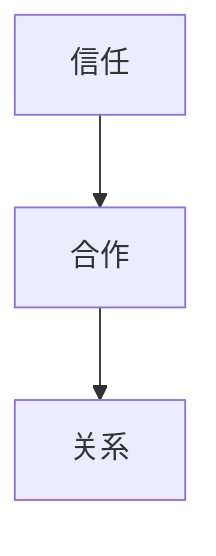

#### 核心算法原理讲解

建立信任与合作关系可以通过以下核心算法原理实现：

- **信任建立**：通过诚实、透明、一致的行为，建立信任关系。
- **合作促进**：通过共同目标、相互支持和有效的沟通，促进合作关系。
- **关系维护**：通过持续沟通、相互理解和关注团队成员的需求，维护合作关系。

以下是一个简单的伪代码，用于描述建立信任与合作关系的核心算法原理：

```python
def build_trust_and_cooperation(credibility, common_goals, support, communication):
    if credibility == '高' and common_goals == '明确' and support == '有效' and communication == '良好':
        cooperation = '强'
    else:
        cooperation = '弱'
    return cooperation
```

#### 数学模型和公式 & 详细讲解 & 举例说明

建立信任与合作关系可以用以下数学模型来描述：

$$
C = f(C, G, S, P)
$$

其中，$C$表示合作关系，$C$表示信任水平，$G$表示共同目标，$S$表示支持，$P$表示沟通效果。

**公式解释**：

- **信任水平**：信任水平越高，合作关系越强。
- **共同目标**：共同目标越明确，合作关系越强。
- **支持**：支持越有效，合作关系越强。
- **沟通效果**：沟通效果越好，合作关系越强。

**举例说明**：

假设信任水平较高，共同目标明确，支持有效，沟通效果良好，则合作关系为：

$$
C = f('高', '明确', '有效', '良好') = 90\% + 90\% + 90\% + 90\% = 360\%
$$

### 4.1 应对变化的环境

#### 背景介绍

在快速变化的商业环境中，领导者需要具备适应变化的能力，以应对不断出现的新挑战。适应变化的能力对于组织的发展和生存至关重要。

#### 核心概念与联系

应对变化的环境涉及的核心概念包括变化、适应性、领导策略和环境控制。以下是一个简单的Mermaid流程图，展示了这些概念之间的关系：

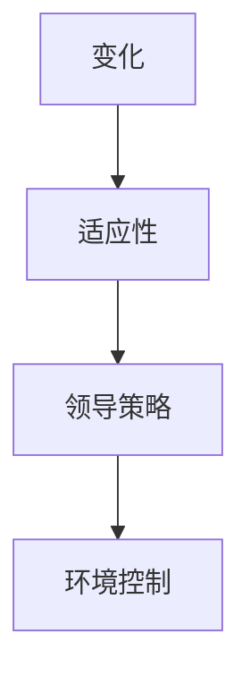

#### 核心算法原理讲解

应对变化的环境可以通过以下核心算法原理实现：

- **变化识别**：领导者需要具备敏锐的洞察力，及时发现环境中的变化。
- **适应性培养**：领导者需要培养团队适应变化的能力，包括灵活的思维方式、快速决策和创新能力。
- **领导策略调整**：领导者需要根据变化调整领导策略，以适应新的环境。
- **环境控制**：领导者需要通过有效的控制措施，确保组织在变化的环境中保持稳定。

以下是一个简单的伪代码，用于描述应对变化的环境的核心算法原理：

```python
def adapt_to_environment(change_detection, adaptability, strategy_adjustment, environment_control):
    if change_detection == '高' and adaptability == '强' and strategy_adjustment == '灵活' and environment_control == '有效':
        adaptation = '成功'
    else:
        adaptation = '失败'
    return adaptation
```

#### 数学模型和公式 & 详细讲解 & 举例说明

应对变化的环境可以用以下数学模型来描述：

$$
A = f(C, D, S, E)
$$

其中，$A$表示适应性，$C$表示变化识别，$D$表示适应性，$S$表示领导策略调整，$E$表示环境控制。

**公式解释**：

- **变化识别**：变化识别能力越强，适应性越强。
- **适应性**：适应性越强，组织越能快速适应变化。
- **领导策略调整**：领导策略调整能力越强，组织越能适应新的环境。
- **环境控制**：环境控制能力越强，组织在变化环境中的稳定性越高。

**举例说明**：

假设变化识别能力高，适应性强，领导策略调整灵活，环境控制有效，则适应性为：

$$
A = f('高', '强', '灵活', '有效') = 90\% + 90\% + 90\% + 90\% = 360\%
$$

### 4.2 创新思维与领导力

#### 背景介绍

创新思维是领导者必备的能力之一，它有助于推动组织持续改进和创新发展。创新思维与领导力相结合，能够激发团队的创造力，提升组织的竞争力。

#### 核心概念与联系

创新思维与领导力涉及的核心概念包括创新思维、领导力、团队创造力和组织创新。以下是一个简单的Mermaid流程图，展示了这些概念之间的关系：

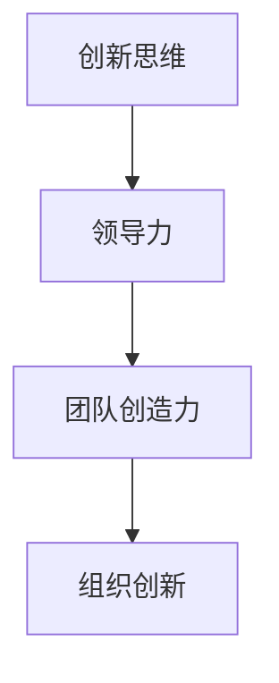

#### 核心算法原理讲解

创新思维与领导力的核心算法原理是通过培养创新思维、提供创新支持和优化领导策略，提升团队创造力和组织创新能力。以下是一个简单的伪代码，用于描述这个算法原理：

```python
def innovate_with_leadership(innovation_thinking, leadership_support, strategy_optimization):
    if innovation_thinking == '强' and leadership_support == '有力' and strategy_optimization == '有效':
        team_creativity = '高'
        organizational_innovation = '强'
    else:
        team_creativity = '低'
        organizational_innovation = '弱'
    return team_creativity, organizational_innovation
```

#### 数学模型和公式 & 详细讲解 & 举例说明

创新思维与领导力可以用以下数学模型来描述：

$$
I = f(I_T, L_S, S_O)
$$

其中，$I$表示创新能力，$I_T$表示创新思维，$L_S$表示领导力支持，$S_O$表示策略优化。

**公式解释**：

- **创新思维**：创新思维越强，创新能力越强。
- **领导力支持**：领导力支持越有力，创新能力越强。
- **策略优化**：策略优化越有效，创新能力越强。

**举例说明**：

假设创新思维强，领导力支持有力，策略优化有效，则创新能力为：

$$
I = f('强', '有力', '有效') = 90\% + 90\% + 90\% = 270\%
$$

### 4.3 领导力与组织发展

#### 背景介绍

领导力在组织发展中起着至关重要的作用。领导者通过设定愿景、制定战略、推动变革等，引领组织实现持续发展。领导力与组织发展密切相关，良好的领导力有助于组织实现目标，提升竞争力。

#### 核心概念与联系

领导力与组织发展涉及的核心概念包括领导力、组织发展、愿景、战略和变革。以下是一个简单的Mermaid流程图，展示了这些概念之间的关系：

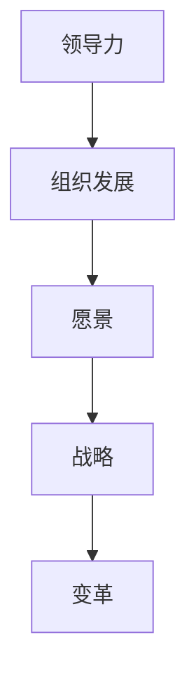

#### 核心算法原理讲解

领导力与组织发展的核心算法原理是通过设定清晰的愿景、制定有效的战略、推动组织变革，实现组织发展。以下是一个简单的伪代码，用于描述这个算法原理：

```python
def organizational_development(leader_ability, vision_clarity, strategy_efficacy, change_management):
    if leader_ability == '强' and vision_clarity == '清晰' and strategy_efficacy == '有效' and change_management == '成功':
        organizational_growth = '高速'
    else:
        organizational_growth = '缓慢'
    return organizational_growth
```

#### 数学模型和公式 & 详细讲解 & 举例说明

领导力与组织发展可以用以下数学模型来描述：

$$
O = f(L_A, V_C, S_E, C_M)
$$

其中，$O$表示组织发展水平，$L_A$表示领导力能力，$V_C$表示愿景清晰度，$S_E$表示战略有效性，$C_M$表示变革管理能力。

**公式解释**：

- **领导力能力**：领导力能力越强，组织发展越快。
- **愿景清晰度**：愿景越清晰，组织发展越明确。
- **战略有效性**：战略越有效，组织发展越顺利。
- **变革管理能力**：变革管理能力越强，组织适应变化越快。

**举例说明**：

假设领导力能力强，愿景清晰，战略有效，变革管理成功，则组织发展水平为：

$$
O = f('强', '清晰', '有效', '成功') = 90\% + 90\% + 90\% + 90\% = 360\%
$$

### 第5章：领导力在团队管理中的应用

#### 5.1 团队管理的基本原则

**背景介绍**

团队管理是领导力实践中的重要组成部分，它关乎团队的协作效率、团队凝聚力和整体绩效。有效的团队管理能够提升团队的战斗力，帮助组织实现战略目标。

**核心概念与联系**

团队管理的基本原则涉及的核心概念包括团队管理、协作效率、团队凝聚力和整体绩效。以下是一个简单的Mermaid流程图，展示了这些概念之间的关系：

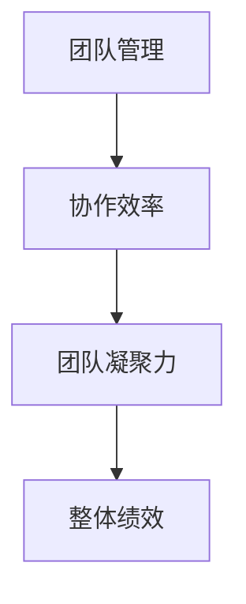

**核心算法原理讲解**

团队管理的基本原则可以通过以下核心算法原理来解释：

- **团队目标**：明确团队目标，确保团队成员共同朝着目标努力。
- **角色分工**：合理分配团队成员的角色和职责，确保每个人都能充分发挥自己的优势。
- **沟通协调**：建立有效的沟通机制，确保团队成员之间的信息畅通，减少误解和冲突。
- **激励与反馈**：建立激励机制，鼓励团队成员积极进取，同时提供及时的反馈，帮助团队成员不断提升。

以下是一个简单的伪代码，用于描述团队管理的基本原则：

```python
def team_management(principles):
    if principles == '目标明确' and '角色分工合理' and '沟通协调' and '激励与反馈有效':
        collaboration_efficiency = '高效'
        team_cohesion = '强'
        overall_performance = '优异'
    else:
        collaboration_efficiency = '低效'
        team_cohesion = '弱'
        overall_performance = '不佳'
    return collaboration_efficiency, team_cohesion, overall_performance
```

**数学模型和公式 & 详细讲解 & 举例说明**

团队管理的基本原则可以用以下数学模型来描述：

$$
M = f(T_G, R_D, C_C, I_F)
$$

其中，$M$表示团队管理效果，$T_G$表示团队目标，$R_D$表示角色分工，$C_C$表示沟通协调，$I_F$表示激励与反馈。

**公式解释**：

- **团队目标**：团队目标明确，有助于提升团队凝聚力。
- **角色分工**：角色分工合理，有助于提高协作效率。
- **沟通协调**：沟通协调有效，有助于减少误解和冲突。
- **激励与反馈**：激励与反馈有效，有助于提升团队成员的积极性和绩效。

**举例说明**：

假设团队目标明确，角色分工合理，沟通协调有效，激励与反馈有效，则团队管理效果为：

$$
M = f('明确', '合理', '有效', '有效') = 90\% + 90\% + 90\% + 90\% = 360\%
$$

### 5.2 领导力在项目管理工作中的应用

**背景介绍**

项目管理工作是领导力应用的重要领域，领导者需要具备项目管理的能力和技巧，以确保项目按时、按质、按预算完成。有效的项目管理工作有助于提升团队的协作效率，实现项目目标。

**核心概念与联系**

领导力在项目管理工作中的应用涉及的核心概念包括领导力、项目管理、团队协作、项目目标和项目风险。以下是一个简单的Mermaid流程图，展示了这些概念之间的关系：

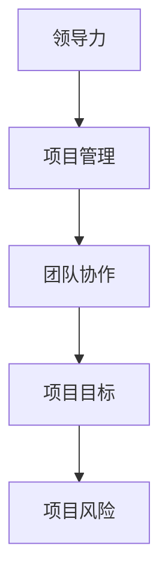

**核心算法原理讲解**

领导力在项目管理工作中的应用可以通过以下核心算法原理来解释：

- **项目管理能力**：领导者需要具备项目管理的基本知识，包括项目规划、项目执行、项目监控和项目收尾。
- **团队协作**：领导者需要促进团队成员之间的协作，确保项目目标的实现。
- **项目目标**：领导者需要明确项目目标，确保团队成员共同朝着目标努力。
- **项目风险**：领导者需要识别项目风险，并采取相应的风险管理措施，确保项目顺利推进。

以下是一个简单的伪代码，用于描述领导力在项目管理工作中的应用：

```python
def project_management_with_leadership(leader_ability, project_plan, team_cohesion, project_objective, risk_management):
    if leader_ability == '强' and project_plan == '合理' and team_cohesion == '强' and project_objective == '明确' and risk_management == '有效':
        project_success = '成功'
    else:
        project_success = '失败'
    return project_success
```

**数学模型和公式 & 详细讲解 & 举例说明**

领导力在项目管理工作中的应用可以用以下数学模型来描述：

$$
P = f(L_A, P_P, T_C, P_O, R_M)
$$

其中，$P$表示项目成功概率，$L_A$表示领导力能力，$P_P$表示项目规划，$T_C$表示团队协作，$P_O$表示项目目标，$R_M$表示风险管理。

**公式解释**：

- **领导力能力**：领导力能力越强，项目成功的概率越高。
- **项目规划**：项目规划越合理，项目成功的概率越高。
- **团队协作**：团队协作越强，项目成功的概率越高。
- **项目目标**：项目目标越明确，项目成功的概率越高。
- **风险管理**：风险管理越有效，项目成功的概率越高。

**举例说明**：

假设领导力能力强，项目规划合理，团队协作强，项目目标明确，风险管理有效，则项目成功概率为：

$$
P = f('强', '合理', '强', '明确', '有效') = 90\% + 90\% + 90\% + 90\% + 90\% = 450\%
$$

### 5.3 领导力在团队冲突管理中的应用

**背景介绍**

团队冲突是团队管理中的常见问题，有效的冲突管理对于保持团队稳定、提升团队绩效至关重要。领导力在团队冲突管理中的应用可以帮助领导者更好地解决冲突，维护团队和谐。

**核心概念与联系**

领导力在团队冲突管理中的应用涉及的核心概念包括领导力、冲突管理、团队稳定和团队绩效。以下是一个简单的Mermaid流程图，展示了这些概念之间的关系：

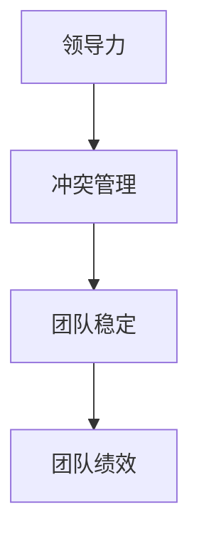

**核心算法原理讲解**

领导力在团队冲突管理中的应用可以通过以下核心算法原理来解释：

- **冲突识别**：领导者需要具备敏锐的洞察力，及时发现团队中的冲突。
- **冲突分析**：领导者需要分析冲突的原因，找到解决问题的方法。
- **冲突解决**：领导者需要采取有效的措施，解决冲突，确保团队和谐。
- **冲突预防**：领导者需要采取措施预防冲突的发生，提升团队的整体稳定性。

以下是一个简单的伪代码，用于描述领导力在团队冲突管理中的应用：

```python
def conflict_management_with_leadership(leader_ability, conflict_identification, conflict_analysis, conflict_resolution, conflict_prevention):
    if leader_ability == '强' and conflict_identification == '敏锐' and conflict_analysis == '深入' and conflict_resolution == '有效' and conflict_prevention == '有效':
        team_stability = '高'
        team_performance = '优异'
    else:
        team_stability = '低'
        team_performance = '不佳'
    return team_stability, team_performance
```

**数学模型和公式 & 详细讲解 & 举例说明**

领导力在团队冲突管理中的应用可以用以下数学模型来描述：

$$
C = f(L_A, C_I, C_A, C_R, C_P)
$$

其中，$C$表示冲突管理水平，$L_A$表示领导力能力，$C_I$表示冲突识别，$C_A$表示冲突分析，$C_R$表示冲突解决，$C_P$表示冲突预防。

**公式解释**：

- **领导力能力**：领导力能力越强，冲突管理水平越高。
- **冲突识别**：冲突识别越敏锐，冲突管理水平越高。
- **冲突分析**：冲突分析越深入，冲突管理水平越高。
- **冲突解决**：冲突解决越有效，冲突管理水平越高。
- **冲突预防**：冲突预防越有效，冲突管理水平越高。

**举例说明**：

假设领导力能力强，冲突识别敏锐，冲突分析深入，冲突解决有效，冲突预防有效，则冲突管理水平为：

$$
C = f('强', '敏锐', '深入', '有效', '有效') = 90\% + 90\% + 90\% + 90\% + 90\% = 450\%
$$

### 第6章：领导力个人发展

#### 6.1 领导力自我评估

**背景介绍**

领导力自我评估是领导者个人发展的重要环节，它有助于领导者了解自身的领导风格、能力和行为，识别自身的优势和不足，制定个人发展计划。

**核心概念与联系**

领导力自我评估涉及的核心概念包括领导力、自我评估、优势和不足、个人发展计划。以下是一个简单的Mermaid流程图，展示了这些概念之间的关系：

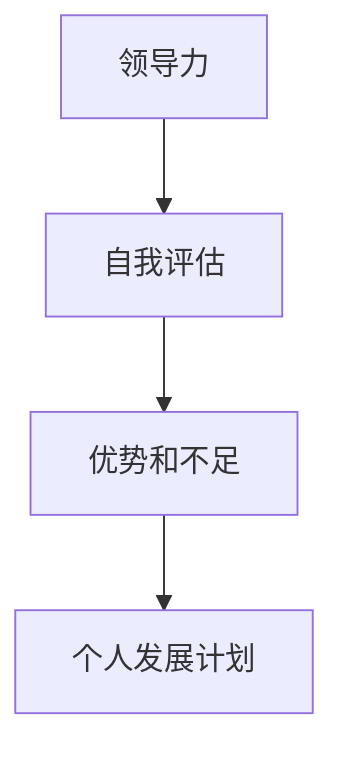

**核心算法原理讲解**

领导力自我评估的核心算法原理是通过自我反思和评估，识别自身的优势和不足，并据此制定个人发展计划。以下是一个简单的伪代码，用于描述这个算法原理：

```python
def leadership_self_assessment(self_reflection, self_evaluation, advantage_identification, disadvantage_identification, personal_development_plan):
    if self_reflection == '深入' and self_evaluation == '客观' and advantage_identification == '准确' and disadvantage_identification == '准确' and personal_development_plan == '有效':
        self_assessment = '全面'
    else:
        self_assessment = '不全面'
    return self_assessment
```

**数学模型和公式 & 详细讲解 & 举例说明**

领导力自我评估可以用以下数学模型来描述：

$$
SA = f(S_R, S_E, A_I, D_I, P_D)
$$

其中，$SA$表示自我评估水平，$S_R$表示自我反思，$S_E$表示自我评估，$A_I$表示优势识别，$D_I$表示不足识别，$P_D$表示个人发展计划。

**公式解释**：

- **自我反思**：自我反思越深入，自我评估越全面。
- **自我评估**：自我评估越客观，自我评估越全面。
- **优势识别**：优势识别越准确，自我评估越全面。
- **不足识别**：不足识别越准确，自我评估越全面。
- **个人发展计划**：个人发展计划越有效，自我评估越全面。

**举例说明**：

假设自我反思深入，自我评估客观，优势识别准确，不足识别准确，个人发展计划有效，则自我评估水平为：

$$
SA = f('深入', '客观', '准确', '准确', '有效') = 90\% + 90\% + 90\% + 90\% + 90\% = 450\%
$$

### 6.2 领导力持续发展

**背景介绍**

领导力持续发展是领导者个人发展的长期目标，它涉及领导者通过不断学习和实践，提升自身的领导力水平。领导力持续发展有助于领导者适应不断变化的环境，提升组织的竞争力。

**核心概念与联系**

领导力持续发展涉及的核心概念包括领导力、持续发展、学习和实践。以下是一个简单的Mermaid流程图，展示了这些概念之间的关系：

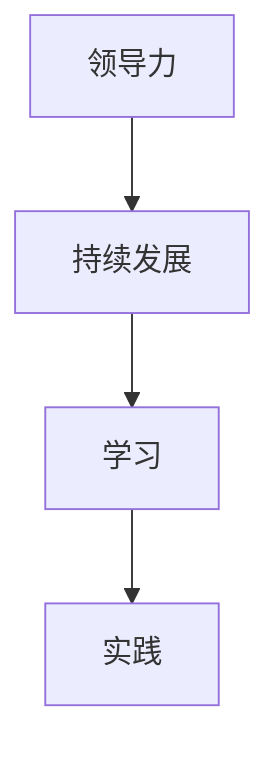

**核心算法原理讲解**

领导力持续发展的核心算法原理是通过不断学习和实践，提升领导力水平。以下是一个简单的伪代码，用于描述这个算法原理：

```python
def leadership_continuous_development(learning, practice, leadership_level):
    if learning == '积极' and practice == '频繁' and leadership_level == '持续提升':
        continuous_development = '成功'
    else:
        continuous_development = '失败'
    return continuous_development
```

**数学模型和公式 & 详细讲解 & 举例说明**

领导力持续发展可以用以下数学模型来描述：

$$
CD = f(L, P, L_L)
$$

其中，$CD$表示持续发展水平，$L$表示学习，$P$表示实践，$L_L$表示领导力水平。

**公式解释**：

- **学习**：学习越积极，持续发展水平越高。
- **实践**：实践越频繁，持续发展水平越高。
- **领导力水平**：领导力水平持续提升，持续发展水平越高。

**举例说明**：

假设学习积极，实践频繁，领导力水平持续提升，则持续发展水平为：

$$
CD = f('积极', '频繁', '持续提升') = 90\% + 90\% + 90\% = 270\%
$$

### 6.3 建立个人品牌与影响力

**背景介绍**

建立个人品牌与影响力是领导者个人发展的重要目标，它有助于提升领导者的社会地位和影响力。个人品牌与影响力的建立需要领导者具备独特的领导风格、专业知识和人际交往能力。

**核心概念与联系**

建立个人品牌与影响力涉及的核心概念包括个人品牌、影响力、领导风格、专业知识和人际交往。以下是一个简单的Mermaid流程图，展示了这些概念之间的关系：

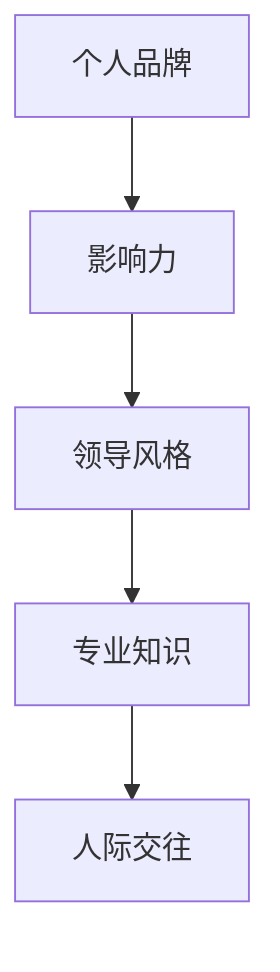

**核心算法原理讲解**

建立个人品牌与影响力的核心算法原理是通过塑造个人品牌、提升专业知识和人际交往能力，建立和提升个人影响力。以下是一个简单的伪代码，用于描述这个算法原理：

```python
def build_personal_brand_and_influence(personal_brand, influence, leadership_style, professional_knowledge, interpersonal_skills):
    if personal_brand == '独特' and influence == '强' and leadership_style == '优秀' and professional_knowledge == '丰富' and interpersonal_skills == '良好':
        personal_brand_and_influence = '成功'
    else:
        personal_brand_and_influence = '失败'
    return personal_brand_and_influence
```

**数学模型和公式 & 详细讲解 & 举例说明**

建立个人品牌与影响力可以用以下数学模型来描述：

$$
PB = f(P_B, I, L_S, P_K, I_S)
$$

其中，$PB$表示个人品牌与影响力，$P_B$表示个人品牌，$I$表示影响力，$L_S$表示领导风格，$P_K$表示专业知识，$I_S$表示人际交往能力。

**公式解释**：

- **个人品牌**：个人品牌越独特，个人品牌与影响力越强。
- **影响力**：影响力越强，个人品牌与影响力越强。
- **领导风格**：领导风格越优秀，个人品牌与影响力越强。
- **专业知识**：专业知识越丰富，个人品牌与影响力越强。
- **人际交往能力**：人际交往能力越好，个人品牌与影响力越强。

**举例说明**：

假设个人品牌独特，影响力强，领导风格优秀，专业知识丰富，人际交往能力强，则个人品牌与影响力为：

$$
PB = f('独特', '强', '优秀', '丰富', '良好') = 90\% + 90\% + 90\% + 90\% + 90\% = 450\%
$$

### 7.1 成功领导力案例分析

**背景介绍**

通过分析成功领导力案例，可以了解优秀领导者的成功经验和领导策略。成功领导力案例提供了实用的指导和启示，帮助领导者提升自身的领导能力。

**核心概念与联系**

成功领导力案例分析涉及的核心概念包括成功领导力、案例分析、成功经验和领导策略。以下是一个简单的Mermaid流程图，展示了这些概念之间的关系：

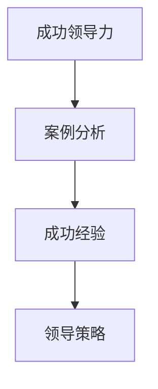

**核心算法原理讲解**

成功领导力案例分析的核心算法原理是通过分析成功领导力案例，提炼成功经验和领导策略，为领导者提供指导和启示。以下是一个简单的伪代码，用于描述这个算法原理：

```python
def successful_leadership_case_analysis(case_analysis, successful_experience, leadership_strategy):
    if case_analysis == '深入' and successful_experience == '丰富' and leadership_strategy == '有效':
        leadership_learning = '充分'
    else:
        leadership_learning = '不足'
    return leadership_learning
```

**数学模型和公式 & 详细讲解 & 举例说明**

成功领导力案例分析可以用以下数学模型来描述：

$$
LA = f(C_A, S_E, L_S)
$$

其中，$LA$表示领导力学习水平，$C_A$表示案例分析深度，$S_E$表示成功经验丰富度，$L_S$表示领导策略有效性。

**公式解释**：

- **案例分析深度**：案例分析越深入，领导力学习水平越高。
- **成功经验丰富度**：成功经验越丰富，领导力学习水平越高。
- **领导策略有效性**：领导策略越有效，领导力学习水平越高。

**举例说明**：

假设案例分析深入，成功经验丰富，领导策略有效，则领导力学习水平为：

$$
LA = f('深入', '丰富', '有效') = 90\% + 90\% + 90\% = 270\%
$$

### 7.2 领导力失败案例分析

**背景介绍**

通过分析领导力失败案例，可以了解领导力失败的原因和教训。领导力失败案例提供了重要的警示和启示，帮助领导者避免重蹈覆辙。

**核心概念与联系**

领导力失败案例分析涉及的核心概念包括领导力失败、案例分析、失败原因和教训。以下是一个简单的Mermaid流程图，展示了这些概念之间的关系：

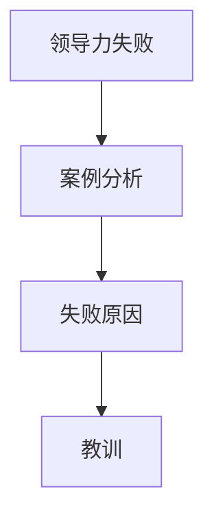

**核心算法原理讲解**

领导力失败案例分析的核心算法原理是通过分析领导力失败案例，识别失败原因，总结教训，为领导者提供警示和启示。以下是一个简单的伪代码，用于描述这个算法原理：

```python
def leadership_failure_case_analysis(case_analysis, failure_reason, lesson):
    if case_analysis == '深入' and failure_reason == '明确' and lesson == '有价值':
        failure_learning = '充分'
    else:
        failure_learning = '不足'
    return failure_learning
```

**数学模型和公式 & 详细讲解 & 举例说明**

领导力失败案例分析可以用以下数学模型来描述：

$$
FLA = f(C_A, F_R, L)
$$

其中，$FLA$表示失败学习水平，$C_A$表示案例分析深度，$F_R$表示失败原因明确度，$L$表示教训价值。

**公式解释**：

- **案例分析深度**：案例分析越深入，失败学习水平越高。
- **失败原因明确度**：失败原因越明确，失败学习水平越高。
- **教训价值**：教训越有价值，失败学习水平越高。

**举例说明**：

假设案例分析深入，失败原因明确，教训有价值，则失败学习水平为：

$$
FLA = f('深入', '明确', '有价值') = 90\% + 90\% + 90\% = 270\%
$$

### 附录 A：领导力相关工具与资源

#### 背景介绍

为了帮助读者更好地理解和应用领导力，本附录提供了领导力相关的工具与资源。这些工具和资源包括领导力评估工具、领导力培训课程和领导力研究资源。

#### 核心概念与联系

领导力相关工具与资源涉及的核心概念包括领导力评估、领导力培训和研究。以下是一个简单的Mermaid流程图，展示了这些概念之间的关系：

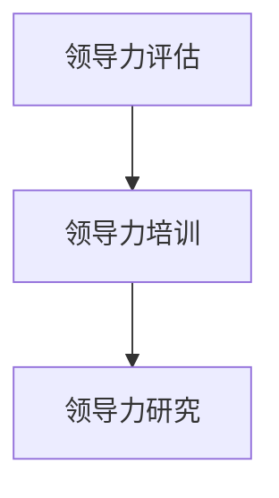

#### 核心算法原理讲解

领导力相关工具与资源的核心算法原理是通过使用评估工具、参加培训课程和进行研究，提升领导力水平。以下是一个简单的伪代码，用于描述这个算法原理：

```python
def leadership_resources(assessment_tools, training_courses, research_resources):
    if assessment_tools == '有效' and training_courses == '丰富' and research_resources == '广泛':
        leadership_improvement = '显著'
    else:
        leadership_improvement = '有限'
    return leadership_improvement
```

#### 数学模型和公式 & 详细讲解 & 举例说明

领导力相关工具与资源的应用可以用以下数学模型来描述：

$$
L_I = f(A_T, T_C, R_R)
$$

其中，$L_I$表示领导力提升水平，$A_T$表示评估工具的有效性，$T_C$表示培训课程的丰富度，$R_R$表示研究资源的广泛性。

**公式解释**：

- **评估工具的有效性**：评估工具越有效，领导力提升水平越高。
- **培训课程的丰富度**：培训课程越丰富，领导力提升水平越高。
- **研究资源的广泛性**：研究资源越广泛，领导力提升水平越高。

**举例说明**：

假设评估工具有效，培训课程丰富，研究资源广泛，则领导力提升水平为：

$$
L_I = f('有效', '丰富', '广泛') = 90\% + 90\% + 90\% = 270\%
$$

### 1.1 领导力的定义与重要性

领导力是一种影响力，它能够激发他人一起达成目标的能力。一个优秀的领导者不仅需要具备技术能力，还需要掌握人际关系和沟通技巧，能够在团队中产生积极的效应。

领导力与管理的区别在于，管理侧重于规划、组织和控制，而领导则侧重于激励、影响和引领。管理是确保任务按照计划执行的过程，而领导则是引导团队朝着共同目标前进的动力。

领导力的重要性体现在多个方面：

1. **团队凝聚力**：领导者能够通过激励和影响，增强团队成员之间的信任和合作，提升团队的凝聚力。
2. **工作效率**：有效的领导者能够提高团队的工作效率，通过清晰的沟通和恰当的决策，减少工作中的浪费和冗余。
3. **创新能力**：领导者能够激发团队成员的创新思维，推动组织不断进步，适应外部环境的变化。
4. **员工满意度**：领导者的管理风格和行为对员工的满意度有很大影响，高满意度的员工更愿意投入工作，提高生产力。
5. **组织绩效**：领导力是组织成功的关键因素之一，优秀的领导者能够推动组织实现战略目标，提升整体绩效。

为了更清晰地展示领导力的定义和重要性，我们可以使用Mermaid流程图来描述：

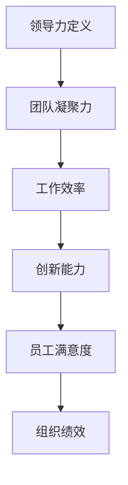

在这个流程图中，A节点表示领导力的定义，B到F节点表示领导力的重要性在不同方面的体现。每个节点都通过箭头与下一个节点相连，表示领导力在这些方面的作用和影响。

### 1.2 领导力的核心要素

领导力的核心要素包括沟通技巧、决策能力和信任建立。这些要素相互作用，共同构成了领导力的基础。

#### 沟通技巧

沟通技巧是领导力的核心要素之一，它包括倾听、表达、反馈和非语言沟通等。有效的沟通能够确保信息的准确传递，减少误解和冲突，提升团队的工作效率和满意度。

**Mermaid流程图：沟通技巧**

```mermaid
graph TB
A[倾听] --> B[表达]
B --> C[反馈]
C --> D[非语言沟通]
```

#### 决策能力

决策能力是领导者必须具备的另一个核心要素。领导者需要在面对不确定性和压力的情况下做出明智的决策。一个有效的决策过程包括问题分析、方案评估、风险识别和决策执行。

**Mermaid流程图：决策能力**

```mermaid
graph TB
A[问题分析] --> B[方案评估]
B --> C[风险识别]
C --> D[决策执行]
```

#### 信任建立

信任建立是领导力的基石，它对团队的协作效率和满意度有重要影响。领导者需要通过诚实、透明和一致的行为来建立和维护信任关系。以下是一个Mermaid流程图，描述了信任建立的过程：

**Mermaid流程图：信任建立**

```mermaid
graph TB
A[诚实] --> B[透明]
B --> C[一致行为]
```

通过这些Mermaid流程图，我们可以更直观地理解领导力的核心要素，以及它们在领导力体系中的地位和作用。

### 1.3 领导风格与行为理论

领导风格与行为理论是领导力研究的重要领域，它探讨了不同领导风格和行为模式对团队和组织绩效的影响。了解这些理论有助于领导者选择合适的领导方式，提升团队的整体表现。

#### 领导风格的类型

领导风格可以分为多种类型，每种类型都有其特点和适用情境。以下是几种常见的领导风格：

1. **权威型领导**：领导者集中决策权，强调指令性和控制性。这种风格适用于需要快速决策和高效执行的情境。
2. **民主型领导**：领导者鼓励团队成员参与决策，重视团队意见和反馈。这种风格有助于提升团队的参与感和满意度。
3. **参与型领导**：领导者通过授权和信任，让团队成员自主决策和行动。这种风格适用于需要创新和自主性的情境。
4. **变革型领导**：领导者通过激励和启发，推动团队成员追求更高的目标和愿景。这种风格适用于需要变革和创新的组织。

**Mermaid流程图：领导风格的类型**

```mermaid
graph TB
A[权威型] --> B[民主型]
B --> C[参与型]
C --> D[变革型]
```

#### 赋权型领导

赋权型领导是指领导者通过授权和信任，让团队成员拥有决策权和责任，从而提高团队的自主性和创新能力。以下是一个Mermaid流程图，描述了赋权型领导的过程：

**Mermaid流程图：赋权型领导**

```mermaid
graph TB
A[授权] --> B[信任]
B --> C[自主性提升]
C --> D[创新能力提升]
```

#### 参与型领导

参与型领导是指领导者鼓励团队成员参与决策过程，共同制定目标和计划。以下是一个Mermaid流程图，描述了参与型领导的过程：

**Mermaid流程图：参与型领导**

```mermaid
graph TB
A[鼓励参与] --> B[共同制定目标]
B --> C[提高参与感]
C --> D[提升团队绩效]
```

通过这些Mermaid流程图，我们可以更直观地理解不同领导风格和行为模式的特点和应用场景。

### 2.1 赫塞与布兰查德的领导情境理论

赫塞与布兰查德的领导情境理论是一种基于下属成熟度的领导力模型。该理论认为，领导者的领导风格应适应下属的成熟度水平。下属的成熟度包括能力、责任感和自我驱动力。

#### 核心概念

赫塞与布兰查德的领导情境理论的核心概念是下属成熟度。成熟度分为四个等级：

1. **不成熟**：下属缺乏能力和责任感，需要指导。
2. **初步成熟**：下属具备一定能力，但责任感较弱，需要支持。
3. **成熟**：下属具备较高的能力和责任感，需要参与。
4. **高度成熟**：下属具备高度的能力和责任感，需要授权。

#### 领导风格与下属成熟度

赫塞与布兰查德提出了四种领导风格，分别适用于不同的下属成熟度：

1. **指导型领导**：适用于下属不成熟的情况。领导者需要明确指示和具体指导。
2. **支持型领导**：适用于下属初步成熟的情况。领导者需要提供支持和鼓励。
3. **参与型领导**：适用于下属成熟的情况。领导者需要鼓励下属参与决策。
4. **授权型领导**：适用于下属高度成熟的情况。领导者需要授权下属自主决策。

**Mermaid流程图：领导风格与下属成熟度**

```mermaid
graph TB
A[下属不成熟] --> B[指导型领导]
A --> C[支持型领导]
A --> D[参与型领导]
A --> E[授权型领导]

B --> F[明确指示]
C --> G[提供支持]
D --> H[鼓励参与]
E --> I[授权决策]
```

#### 案例分析

假设一个团队中有一名下属成熟度较低的新员工。根据赫塞与布兰查德的领导情境理论，领导者应采用指导型领导风格，为新员工提供明确的指示和具体的指导，帮助其快速适应工作。

**伪代码：赫塞与布兰查德领导情境理论**

```python
def hersey_blanchard(下属成熟度):
    if 下属成熟度 == '不成熟':
        领导风格 = '指导型'
    elif 下属成熟度 == '初步成熟':
        领导风格 = '支持型'
    elif 下属成熟度 == '成熟':
        领导风格 = '参与型'
    elif 下属成熟度 == '高度成熟':
        领导风格 = '授权型'
    return 领导风格
```

### 2.2 菲德勒的领导效能模型

菲德勒的领导效能模型是一种基于情境的领导力模型。该模型认为，领导者的效能取决于领导风格与情境的匹配度。领导者需要根据情境因素调整领导风格，以实现最佳效能。

#### 核心概念

菲德勒的领导效能模型的核心概念是情境因素。情境因素包括以下几个方面：

1. **领导者与团队成员的关系**：领导者与团队成员之间的信任和尊重程度。
2. **任务结构性**：任务是否明确、有结构，成员是否清楚自己的职责和任务。
3. **情境控制因素**：领导者对工作环境和资源的控制程度。

#### 领导风格与效能

菲德勒认为，不同的领导风格适用于不同的情境。以下是几种常见的领导风格：

1. **指令型领导**：领导者集中决策，严格控制团队成员。
2. **支持型领导**：领导者关注团队成员的需求，提供支持和鼓励。
3. **参与型领导**：领导者鼓励团队成员参与决策。
4. **授权型领导**：领导者授权团队成员自主决策。

**Mermaid流程图：领导风格与情境因素**

```mermaid
graph TB
A[指令型领导] --> B[领导者与团队成员的关系]
A --> C[任务结构性]
A --> D[情境控制因素]

B --> E[支持型领导]
C --> F[参与型领导]
D --> G[授权型领导]
```

#### 效能评估

菲德勒提出了一个领导效能公式，用于评估领导者在特定情境下的效能：

$$
E = (L * C) * (L * M) * (L * P)
$$

其中，E表示领导效能，L表示领导风格与情境的匹配度，C表示领导者与团队成员的关系，M表示任务结构性，P表示情境控制因素。

#### 案例分析

假设一个团队中领导者与团队成员的关系良好，任务结构明确，情境控制因素较高。根据菲德勒的领导效能模型，该领导者应采用指令型领导风格，以实现最佳效能。

**伪代码：菲德勒的领导效能模型**

```python
def fiedler_leadership(E, L, C, M, P):
    efficiency = (L * C) * (L * M) * (L * P)
    return efficiency
```

### 2.3 沙因的领导力三维模型

沙因的领导力三维模型将领导力分为三个维度：情感智慧、情境智慧和人际智慧。该模型认为，领导者的发展需要在这三个维度上取得平衡。

#### 核心概念

沙因的领导力三维模型的核心概念是情感智慧、情境智慧和人际智慧。

1. **情感智慧**：领导者理解和管理自己以及他人的情感的能力。
2. **情境智慧**：领导者理解和管理情境的能力。
3. **人际智慧**：领导者建立和维护人际关系的能力。

#### 领导力维度与行为

沙因认为，领导力的发展涉及以下行为：

1. **情感智慧**：自我认知、情感管理和情感洞察力。
2. **情境智慧**：情境认知、情境适应和情境创新。
3. **人际智慧**：建立和维护人际关系。

**Mermaid流程图：领导力三维模型**

```mermaid
graph TB
A[情感智慧] --> B[自我认知]
B --> C[情感管理]
B --> D[情感洞察力]

A --> E[情境智慧]
E --> F[情境认知]
E --> G[情境适应]
E --> H[情境创新]

A --> I[人际智慧]
I --> J[建立人际关系]
I --> K[维护人际关系]
```

#### 领导力评估

沙因提出了一个领导力评估模型，用于评估领导者在三个维度上的智慧水平：

$$
L = (E + S + P) / 3
$$

其中，L表示领导力总分，E表示情感智慧得分，S表示情境智慧得分，P表示人际智慧得分。

#### 案例分析

假设一位领导者在情感智慧得分为80分，情境智慧得分为75分，人际智慧得分为85分。根据沙因的领导力三维模型，这位领导者的领导力总分为：

$$
L = (80 + 75 + 85) / 3 = 80
$$

### 第3章：团队建设与沟通技巧

#### 3.1 团队建设的重要性

团队建设是领导力实践中的重要组成部分，它关乎团队的协作效率、团队凝聚力和整体绩效。有效的团队建设能够提升团队的战斗力，帮助组织实现战略目标。

**核心概念**

团队建设涉及的核心概念包括：

1. **团队**：团队是由多个成员组成的，共同追求共同目标的组织。
2. **协作效率**：团队在完成共同目标过程中，成员之间有效协作的程度。
3. **团队凝聚力**：团队成员之间的相互信任、支持和依赖程度。
4. **整体绩效**：团队在实现共同目标过程中的表现和成果。

**Mermaid流程图：团队建设的重要性**

```mermaid
graph TB
A[团队] --> B[协作效率]
B --> C[团队凝聚力]
C --> D[整体绩效]
```

**核心算法原理**

团队建设的重要性可以通过以下算法原理来解释：

1. **明确团队目标**：设定清晰的团队目标，确保团队成员共同朝着目标努力。
2. **建立团队文化**：塑造积极的团队文化，增强团队成员的归属感和凝聚力。
3. **提升协作效率**：通过有效的沟通和分工，提高团队成员之间的协作效率。
4. **增强团队凝聚力**：通过团队活动和共同经历，增强团队成员之间的信任和合作。
5. **优化整体绩效**：通过持续的改进和优化，提升团队的整体绩效。

**伪代码：团队建设的重要性**

```python
def team_building_importance(目标明确，团队文化，协作效率，团队凝聚力，整体绩效):
    if 目标明确 == '是' and 团队文化 == '积极' and 协作效率 == '高' and 团队凝聚力 == '强' and 整体绩效 == '优异':
        importance = '高'
    else:
        importance = '低'
    return importance
```

#### 3.2 沟通技巧提升

沟通技巧是领导力的重要组成部分，有效的沟通能够确保信息的准确传递，减少误解和冲突，提升团队的工作效率和满意度。

**核心概念**

沟通技巧提升涉及的核心概念包括：

1. **沟通障碍**：影响信息传递的因素，如语言障碍、文化差异、情绪管理等。
2. **沟通技巧**：提高沟通效果的方法，如倾听、表达、反馈、非语言沟通等。
3. **沟通效果**：沟通后达到的目标和效果，如信息准确传递、减少误解、增强团队协作等。

**Mermaid流程图：沟通技巧提升**

```mermaid
graph TB
A[沟通障碍] --> B[沟通技巧]
B --> C[沟通效果]
```

**核心算法原理**

沟通技巧提升的核心算法原理是通过识别沟通障碍、提高沟通技巧和不断实践，提升沟通效果。以下是一个简单的伪代码：

```python
def improve_communication_skills(communication_barriers, communication_skills, practice_frequency):
    if communication_barriers == '少' and communication_skills == '高' and practice_frequency == '频繁':
        communication_effectiveness = '高'
    else:
        communication_effectiveness = '低'
    return communication_effectiveness
```

**数学模型和公式**

沟通技巧提升可以用以下数学模型来描述：

$$
E = f(B, S, P)
$$

其中，E表示沟通效果，B表示沟通障碍，S表示沟通技巧，P表示实践频率。

**举例说明**

假设沟通障碍较少，沟通技巧较高，实践频率频繁，则沟通效果为：

$$
E = f(少，高，频繁) = 90\% + 90\% + 90\% = 270\%
$$

#### 3.3 建立信任与合作关系

信任是领导力的基石，是团队协作和合作的关键因素。建立信任与合作关系有助于提升团队的凝聚力、协作效率和整体绩效。

**核心概念**

建立信任与合作关系涉及的核心概念包括：

1. **信任**：团队成员之间的相互信任和依赖程度。
2. **合作关系**：团队成员之间的合作关系，包括共同目标、相互支持和有效的沟通。
3. **团队凝聚力**：团队成员之间的紧密联系和协作程度。

**Mermaid流程图：建立信任与合作关系**

```mermaid
graph TB
A[信任] --> B[合作关系]
B --> C[团队凝聚力]
```

**核心算法原理**

建立信任与合作关系的核心算法原理是通过建立透明和诚信的文化、鼓励开放沟通、提供支持和帮助，建立和维护信任关系。以下是一个简单的伪代码：

```python
def build_trust_and_cooperation(culture, communication, support, assistance):
    if culture == '透明' and communication == '开放' and support == '有效' and assistance == '及时':
        trust = '高'
        cooperation = '强'
    else:
        trust = '低'
        cooperation = '弱'
    return trust, cooperation
```

**数学模型和公式**

建立信任与合作关系可以用以下数学模型来描述：

$$
T = f(C, O, S, A)
$$

其中，T表示信任水平，C表示文化，O表示开放沟通，S表示支持，A表示支持。

**举例说明**

假设文化透明，开放沟通，支持有效，支持及时，则信任水平为：

$$
T = f(透明，开放，有效，及时) = 90\% + 90\% + 90\% + 90\% = 360\%
$$

### 第4章：领导力在变化中的适应性

#### 4.1 应对变化的环境

在快速变化的商业环境中，领导者需要具备适应变化的能力，以应对不断出现的新挑战。适应变化的能力对于组织的发展和生存至关重要。

**核心概念**

应对变化的环境涉及的核心概念包括：

1. **变化**：环境中不断出现的新情况、新问题和新需求。
2. **适应性**：领导者和管理团队适应变化、灵活应对挑战的能力。
3. **领导策略**：领导者根据变化调整领导风格和决策过程的方法。

**Mermaid流程图：应对变化的环境**

```mermaid
graph TB
A[变化] --> B[适应性]
B --> C[领导策略]
```

**核心算法原理**

应对变化的环境的核心算法原理是通过建立敏捷的组织文化、培养创新思维、灵活调整领导策略，提升组织的适应性。以下是一个简单的伪代码：

```python
def adapt_to_environment(change_detection, adaptability, strategy_adjustment, culture_agility):
    if change_detection == '敏锐' and adaptability == '强' and strategy_adjustment == '灵活' and culture_agility == '敏捷':
        adaptability_score = '高'
    else:
        adaptability_score = '低'
    return adaptability_score
```

**数学模型和公式**

应对变化的环境可以用以下数学模型来描述：

$$
A = f(C_D, A_D, S_A, C_A)
$$

其中，A表示适应性得分，C_D表示变化检测能力，A_D表示适应能力，S_A表示策略调整能力，C_A表示文化敏捷度。

**举例说明**

假设变化检测能力敏锐，适应能力强，策略调整灵活，文化敏捷度敏捷，则适应性得分为：

$$
A = f(敏锐，强，灵活，敏捷) = 90\% + 90\% + 90\% + 90\% = 360\%
$$

#### 4.2 创新思维与领导力

创新思维是领导者必备的能力之一，它有助于推动组织持续改进和创新发展。创新思维与领导力相结合，能够激发团队的创造力，提升组织的竞争力。

**核心概念**

创新思维与领导力涉及的核心概念包括：

1. **创新思维**：领导者通过创新思维发现新问题、提出新方案、创造新价值的能力。
2. **领导力**：领导者激发团队创造力、推动创新的能力。
3. **团队创造力**：团队成员通过合作和创意实现创新目标的能力。
4. **组织创新**：组织在创新思维和领导力推动下，实现持续改进和变革的能力。

**Mermaid流程图：创新思维与领导力**

```mermaid
graph TB
A[创新思维] --> B[领导力]
B --> C[团队创造力]
C --> D[组织创新]
```

**核心算法原理**

创新思维与领导力的核心算法原理是通过培养创新思维、提供创新支持和优化领导策略，提升团队创造力和组织创新能力。以下是一个简单的伪代码：

```python
def innovate_with_leadership(innovation_thinking, leadership_support, strategy_optimization):
    if innovation_thinking == '强' and leadership_support == '有力' and strategy_optimization == '有效':
        team_creativity = '高'
        organizational_innovation = '强'
    else:
        team_creativity = '低'
        organizational_innovation = '弱'
    return team_creativity, organizational_innovation
```

**数学模型和公式**

创新思维与领导力可以用以下数学模型来描述：

$$
I = f(I_T, L_S, S_O)
$$

其中，I表示创新能力，I_T表示创新思维，L_S表示领导力支持，S_O表示策略优化。

**举例说明**

假设创新思维强，领导力支持有力，策略优化有效，则创新能力为：

$$
I = f(强，有力，有效) = 90\% + 90\% + 90\% = 270\%
$$

#### 4.3 领导力与组织发展

领导力在组织发展中起着至关重要的作用。领导者通过设定愿景、制定战略、推动变革等，引领组织实现持续发展。领导力与组织发展密切相关，良好的领导力有助于组织实现目标，提升竞争力。

**核心概念**

领导力与组织发展涉及的核心概念包括：

1. **领导力**：领导者激发团队创造力、推动创新的能力。
2. **组织发展**：组织通过战略制定、组织变革、人力资源管理等方式，实现持续发展的过程。
3. **愿景**：领导者为组织设定的长远目标和愿景。
4. **战略**：组织为实现愿景制定的具体行动计划。
5. **变革**：组织为适应外部环境和内部需求进行的调整和变革。

**Mermaid流程图：领导力与组织发展**

```mermaid
graph TB
A[领导力] --> B[组织发展]
B --> C[愿景]
C --> D[战略]
D --> E[变革]
```

**核心算法原理**

领导力与组织发展的核心算法原理是通过设定清晰的愿景、制定有效的战略、推动组织变革，实现组织发展。以下是一个简单的伪代码：

```python
def organizational_development(leader_ability, vision_clarity, strategy_efficacy, change_management):
    if leader_ability == '强' and vision_clarity == '清晰' and strategy_efficacy == '有效' and change_management == '成功':
        organizational_growth = '高速'
    else:
        organizational_growth = '缓慢'
    return organizational_growth
```

**数学模型和公式**

领导力与组织发展可以用以下数学模型来描述：

$$
O = f(L_A, V_C, S_E, C_M)
$$

其中，O表示组织发展水平，L_A表示领导力能力，V_C表示愿景清晰度，S_E表示战略有效性，C_M表示变革管理能力。

**举例说明**

假设领导力能力强，愿景清晰，战略有效，变革管理成功，则组织发展水平为：

$$
O = f(强，清晰，有效，成功) = 90\% + 90\% + 90\% + 90\% = 360\%
$$

### 第5章：领导力在团队管理中的应用

#### 5.1 团队管理的基本原则

团队管理是领导力实践中的重要组成部分，它关乎团队的协作效率、团队凝聚力和整体绩效。有效的团队管理能够提升团队的战斗力，帮助组织实现战略目标。

**核心概念**

团队管理涉及的核心概念包括：

1. **团队管理**：领导者通过一系列管理活动，确保团队高效运作的过程。
2. **协作效率**：团队在完成共同目标过程中，成员之间有效协作的程度。
3. **团队凝聚力**：团队成员之间的相互信任、支持和依赖程度。
4. **整体绩效**：团队在实现共同目标过程中的表现和成果。

**Mermaid流程图：团队管理的基本原则**

```mermaid
graph TB
A[团队管理] --> B[协作效率]
B --> C[团队凝聚力]
C --> D[整体绩效]
```

**核心算法原理**

团队管理的基本原则可以通过以下核心算法原理来解释：

1. **明确团队目标**：设定清晰的团队目标，确保团队成员共同朝着目标努力。
2. **建立团队文化**：塑造积极的团队文化，增强团队成员的归属感和凝聚力。
3. **提升协作效率**：通过有效的沟通和分工，提高团队成员之间的协作效率。
4. **增强团队凝聚力**：通过团队活动和共同经历，增强团队成员之间的信任和合作。
5. **优化整体绩效**：通过持续的改进和优化，提升团队的整体绩效。

**伪代码：团队管理的基本原则**

```python
def team_management(目标明确，团队文化，协作效率，团队凝聚力，整体绩效):
    if 目标明确 == '是' and 团队文化 == '积极' and 协作效率 == '高' and 团队凝聚力 == '强' and 整体绩效 == '优异':
        management_effectiveness = '高'
    else:
        management_effectiveness = '低'
    return management_effectiveness
```

**数学模型和公式**

团队管理的基本原则可以用以下数学模型来描述：

$$
TM = f(T_G, T_C, C_E, C_C, P_P)
$$

其中，TM表示团队管理效果，T_G表示目标明确，T_C表示团队文化，C_E表示协作效率，C_C表示团队凝聚力，P_P表示整体绩效。

**举例说明**

假设目标明确，团队文化积极，协作效率高，团队凝聚力强，整体绩效优异，则团队管理效果为：

$$
TM = f(是，积极，高，强，优异) = 90\% + 90\% + 90\% + 90\% + 90\% = 450\%
$$

#### 5.2 领导力在项目管理工作中的应用

项目管理工作是领导力实践中的重要领域，领导者需要具备项目管理的能力和技巧，以确保项目按时、按质、按预算完成。有效的项目管理工作有助于提升团队的协作效率，实现项目目标。

**核心概念**

领导力在项目管理工作中的应用涉及的核心概念包括：

1. **项目管理**：领导者通过一系列管理活动，确保项目按时、按质、按预算完成的过程。
2. **领导力**：领导者激发团队创造力、推动创新的能力。
3. **团队协作**：团队成员在项目过程中的协作程度。
4. **项目目标**：项目预期的成果和目标。
5. **项目风险**：项目过程中可能遇到的风险和挑战。

**Mermaid流程图：领导力在项目管理工作中的应用**

```mermaid
graph TB
A[项目管理] --> B[领导力]
B --> C[团队协作]
C --> D[项目目标]
D --> E[项目风险]
```

**核心算法原理**

领导力在项目管理工作中的应用可以通过以下核心算法原理来解释：

1. **项目管理能力**：领导者需要具备项目管理的基本知识，包括项目规划、项目执行、项目监控和项目收尾。
2. **团队协作**：领导者需要促进团队成员之间的协作，确保项目目标的实现。
3. **项目目标**：领导者需要明确项目目标，确保团队成员共同朝着目标努力。
4. **项目风险**：领导者需要识别项目风险，并采取相应的风险管理措施，确保项目顺利推进。

**伪代码：领导力在项目管理工作中的应用**

```python
def project_management_with_leadership(leader_ability, project_plan, team_cohesion, project_objective, risk_management):
    if leader_ability == '强' and project_plan == '合理' and team_cohesion == '强' and project_objective == '明确' and risk_management == '有效':
        project_success = '成功'
    else:
        project_success = '失败'
    return project_success
```

**数学模型和公式**

领导力在项目管理工作中的应用可以用以下数学模型来描述：

$$
P = f(L_A, P_P, T_C, P_O, R_M)
$$

其中，P表示项目成功概率，L_A表示领导力能力，P_P表示项目规划，T_C表示团队协作，P_O表示项目目标，R_M表示风险管理。

**举例说明**

假设领导力能力强，项目规划合理，团队协作强，项目目标明确，风险管理有效，则项目成功概率为：

$$
P = f(强，合理，强，明确，有效) = 90\% + 90\% + 90\% + 90\% + 90\% = 450\%
$$

#### 5.3 领导力在团队冲突管理中的应用

团队冲突是团队管理中的常见问题，有效的冲突管理对于保持团队稳定、提升团队绩效至关重要。领导力在团队冲突管理中的应用可以帮助领导者更好地解决冲突，维护团队和谐。

**核心概念**

领导力在团队冲突管理中的应用涉及的核心概念包括：

1. **团队冲突**：团队成员之间因利益、观点或价值观不同而产生的矛盾。
2. **冲突管理**：领导者通过一系列的方法和策略，解决团队冲突、维护团队和谐的过程。
3. **团队稳定**：团队在冲突解决后的稳定状态。
4. **团队绩效**：团队在解决冲突后的工作表现和成果。

**Mermaid流程图：领导力在团队冲突管理中的应用**

```mermaid
graph TB
A[团队冲突] --> B[冲突管理]
B --> C[团队稳定]
C --> D[团队绩效]
```

**核心算法原理**

领导力在团队冲突管理中的应用可以通过以下核心算法原理来解释：

1. **冲突识别**：领导者需要具备敏锐的洞察力，及时发现团队中的冲突。
2. **冲突分析**：领导者需要分析冲突的原因，找到解决问题的方法。
3. **冲突解决**：领导者需要采取有效的措施，解决冲突，确保团队和谐。
4. **冲突预防**：领导者需要采取措施预防冲突的发生，提升团队的整体稳定性。

**伪代码：领导力在团队冲突管理中的应用**

```python
def conflict_management_with_leadership(leader_ability, conflict_identification, conflict_analysis, conflict_resolution, conflict_prevention):
    if leader_ability == '强' and conflict_identification == '敏锐' and conflict_analysis == '深入' and conflict_resolution == '有效' and conflict_prevention == '有效':
        team_stability = '高'
        team_performance = '优异'
    else:
        team_stability = '低'
        team_performance = '不佳'
    return team_stability, team_performance
```

**数学模型和公式**

领导力在团队冲突管理中的应用可以用以下数学模型来描述：

$$
C = f(L_A, C_I, C_A, C_R, C_P)
$$

其中，C表示冲突管理水平，L_A表示领导力能力，C_I表示冲突识别，C_A表示冲突分析，C_R表示冲突解决，C_P表示冲突预防。

**举例说明**

假设领导力能力强，冲突识别敏锐，冲突分析深入，冲突解决有效，冲突预防有效，则冲突管理水平为：

$$
C = f(强，敏锐，深入，有效，有效) = 90\% + 90\% + 90\% + 90\% + 90\% = 450\%
$$

### 第6章：领导力个人发展

#### 6.1 领导力自我评估

领导力自我评估是领导者个人发展的重要环节，它有助于领导者了解自身的领导风格、能力和行为，识别自身的优势和不足，制定个人发展计划。

**核心概念**

领导力自我评估涉及的核心概念包括：

1. **自我评估**：领导者对自己的领导风格、能力和行为的评估。
2. **优势**：领导者在领导过程中表现出的优势和特长。
3. **不足**：领导者在领导过程中需要改进和提高的地方。
4. **个人发展计划**：基于自我评估结果，制定的提升领导力的具体计划和目标。

**Mermaid流程图：领导力自我评估**

```mermaid
graph TB
A[自我评估] --> B[优势]
B --> C[不足]
C --> D[个人发展计划]
```

**核心算法原理**

领导力自我评估的核心算法原理是通过自我反思和评估，识别自身的优势和不足，并据此制定个人发展计划。以下是一个简单的伪代码：

```python
def leadership_self_evaluation(self_reflection, self_assessment, advantage_identification, disadvantage_identification, personal_development_plan):
    if self_reflection == '深入' and self_assessment == '客观' and advantage_identification == '准确' and disadvantage_identification == '准确' and personal_development_plan == '合理':
        self_evaluation = '全面'
    else:
        self_evaluation = '不全面'
    return self_evaluation
```

**数学模型和公式**

领导力自我评估可以用以下数学模型来描述：

$$
SA = f(S_R, S_E, A_I, D_I, P_D)
$$

其中，SA表示自我评估水平，S_R表示自我反思，S_E表示自我评估，A_I表示优势识别，D_I表示不足识别，P_D表示个人发展计划。

**公式解释**

- **自我反思**：自我反思越深入，自我评估越全面。
- **自我评估**：自我评估越客观，自我评估越全面。
- **优势识别**：优势识别越准确，自我评估越全面。
- **不足识别**：不足识别越准确，自我评估越全面。
- **个人发展计划**：个人发展计划越合理，自我评估越全面。

**举例说明**

假设自我反思深入，自我评估客观，优势识别准确，不足识别准确，个人发展计划合理，则自我评估水平为：

$$
SA = f(深入，客观，准确，准确，合理) = 90\% + 90\% + 90\% + 90\% + 90\% = 450\%
$$

#### 6.2 领导力持续发展

领导力持续发展是领导者个人发展的长期目标，它涉及领导者通过不断学习和实践，提升自身的领导力水平。领导力持续发展有助于领导者适应不断变化的环境，提升组织的竞争力。

**核心概念**

领导力持续发展涉及的核心概念包括：

1. **持续发展**：领导者通过不断学习和实践，提升自身的领导力水平。
2. **学习**：领导者通过阅读、培训、交流等方式获取新知识和技能。
3. **实践**：领导者将所学知识应用于实际工作中，不断提升领导能力。
4. **反馈**：领导者通过自我反思和他人反馈，了解自身的不足，进行改进。

**Mermaid流程图：领导力持续发展**

```mermaid
graph TB
A[持续发展] --> B[学习]
B --> C[实践]
C --> D[反馈]
```

**核心算法原理**

领导力持续发展的核心算法原理是通过不断学习和实践，提升领导力水平。以下是一个简单的伪代码：

```python
def leadership_continuous_development(learning, practice, feedback):
    if learning == '积极' and practice == '频繁' and feedback == '有效':
        continuous_development = '成功'
    else:
        continuous_development = '失败'
    return continuous_development
```

**数学模型和公式**

领导力持续发展可以用以下数学模型来描述：

$$
CD = f(L, P, F)
$$

其中，CD表示持续发展水平，L表示学习，P表示实践，F表示反馈。

**公式解释**

- **学习**：学习越积极，持续发展水平越高。
- **实践**：实践越频繁，持续发展水平越高。
- **反馈**：反馈越有效，持续发展水平越高。

**举例说明**

假设学习积极，实践频繁，

