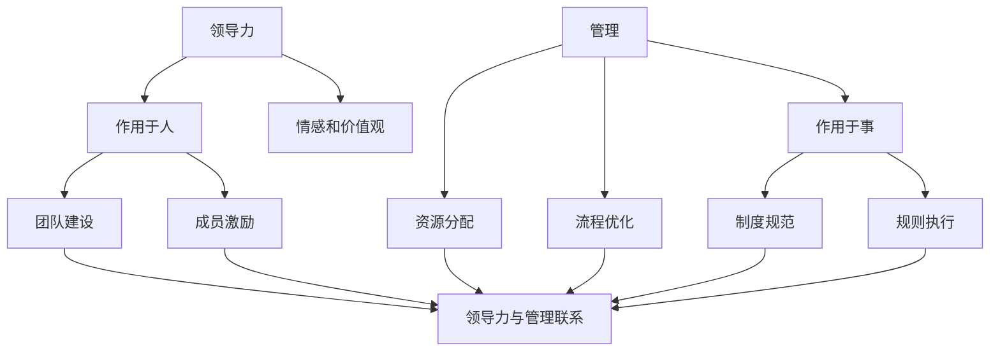
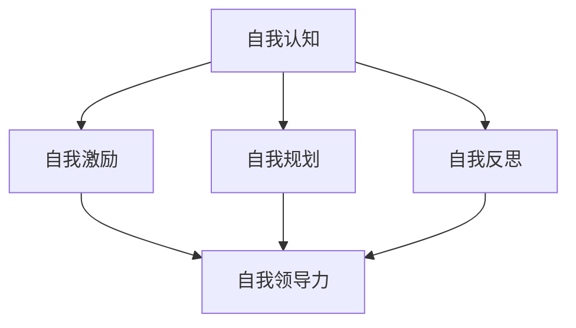
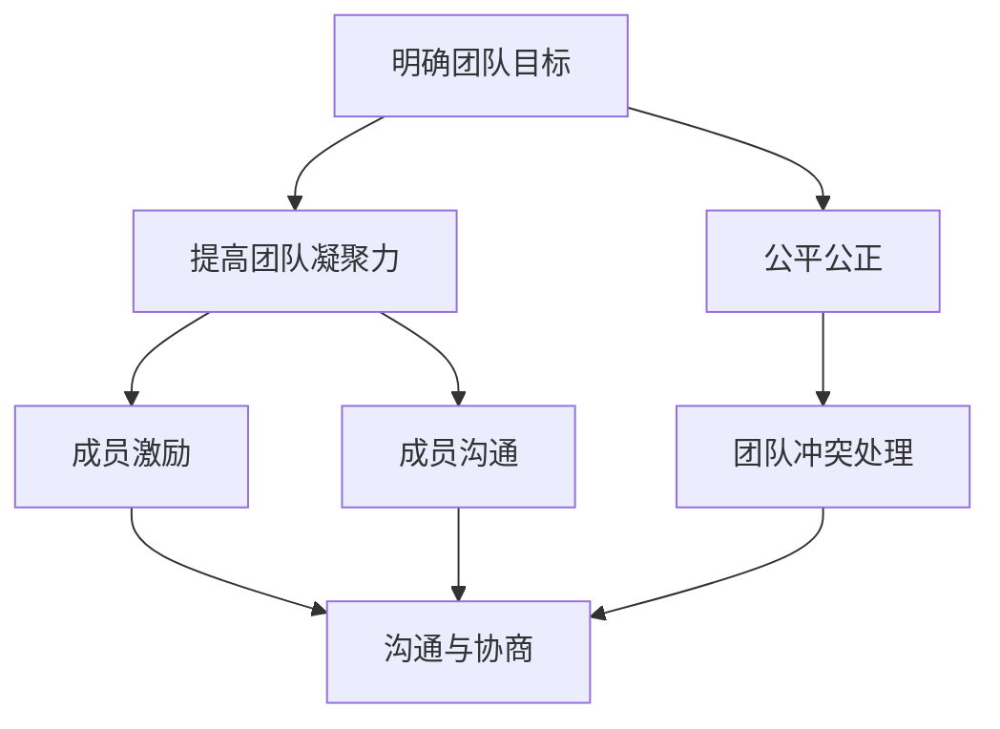
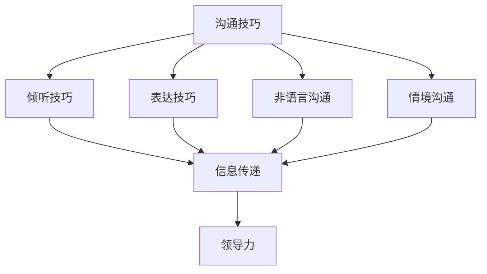
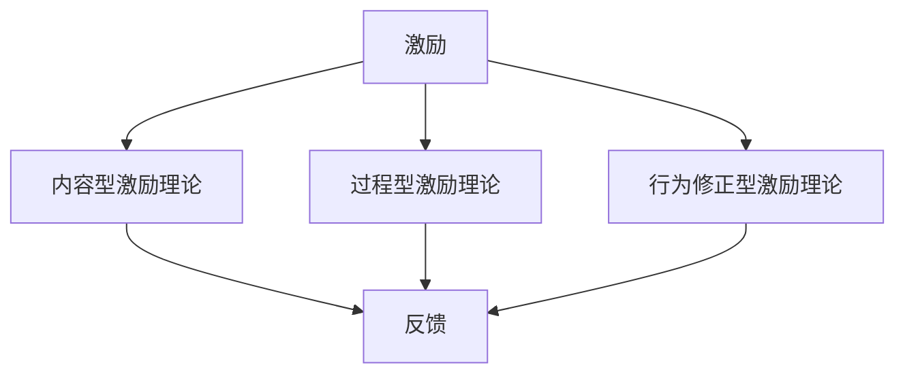
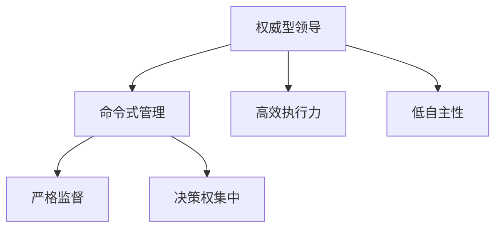
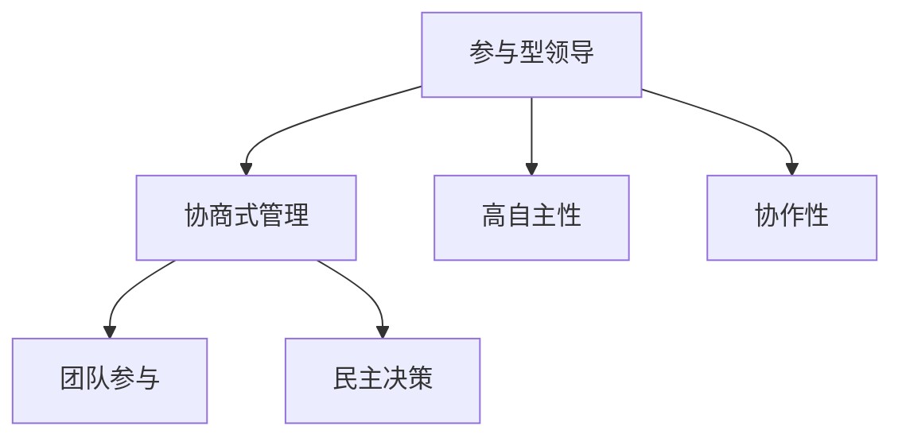
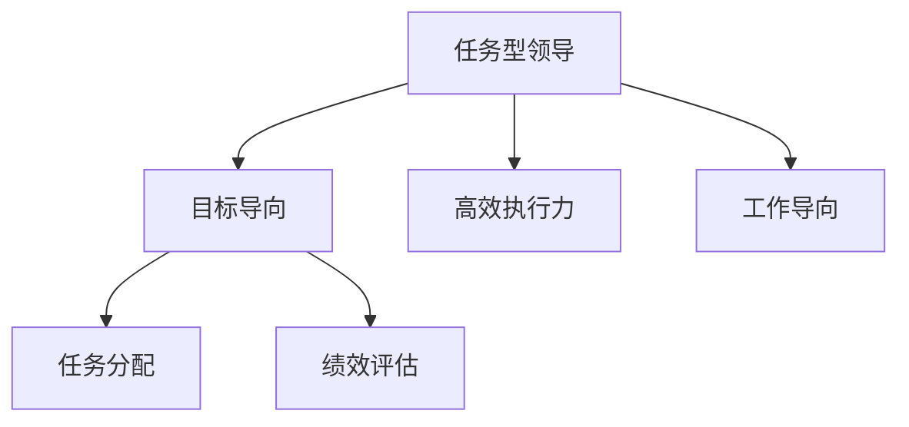
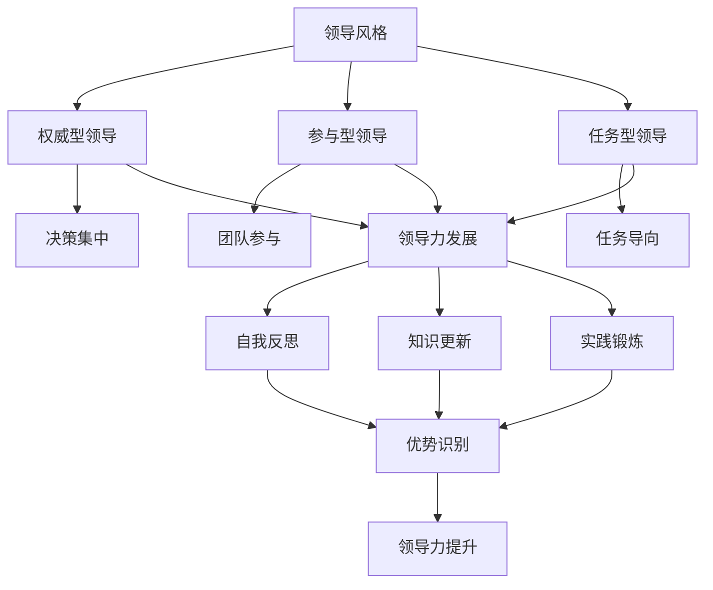
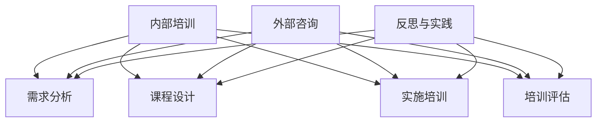

                 

### 文章标题

# 《领导力训练：让你的团队所向披靡》

### 关键词

- **领导力**、**团队建设**、**沟通技巧**、**激励与反馈**、**领导风格**、**领导力发展**

### 摘要

本文深入探讨了领导力在IT团队中的重要性，详细阐述了领导力的定义、发展历程、与管理的区别，以及领导者的自我认知与成长、团队建设与管理、沟通技巧与领导力、激励与反馈、领导风格与领导力发展、领导力训练方法等内容。通过理论讲解、实例分析、实战应用，本文旨在为IT领导者提供一套系统的领导力训练方案，帮助他们在复杂多变的技术环境中带领团队所向披靡。

## 第1章：领导力概述

### 1.1 领导力的定义与作用

领导力是指领导者通过激发、引导、协调团队成员，实现团队目标的能力。它不仅关乎个人魅力，更涉及管理技能、决策能力、团队沟通等多方面因素。领导力在企业中的重要性不言而喻，它是企业持续发展、应对市场变化的核心动力。

#### 领导力的基本概念

- **领导者**：组织中具备领导力的人，他们能够影响和指导团队成员。
- **领导力**：领导者具备的能力，包括但不限于沟通能力、决策能力、团队管理能力等。
- **团队**：由若干个成员组成的、为实现共同目标而协作的集体。

#### 领导力在企业中的重要性

- **目标导向**：领导力能够确保团队始终围绕企业目标前进，避免盲目和无序。
- **协同效应**：领导力能够激发团队成员的积极性，实现优势互补，提升整体效能。
- **创新动力**：领导力鼓励团队成员敢于尝试新方法、新技术，推动企业创新发展。
- **风险管理**：领导力能够有效识别和应对企业面临的各类风险，确保企业稳定运营。

### 1.2 领导力的发展历程

领导力的发展经历了多个阶段，从传统的权威领导到现代的参与型领导，再到如今的变革型领导。每个阶段都反映了领导者角色和职责的变化。

#### 传统领导力

传统领导力强调领导者的权威和决策能力，领导者被视为团队的核心，主要通过下达命令和指示来推动工作。

#### 现代领导力

现代领导力注重团队协作和沟通，领导者更多扮演协调者和支持者的角色，鼓励团队成员参与决策，提升团队的整体能力和凝聚力。

#### 变革型领导力

变革型领导力强调领导者的变革能力和创新精神，领导者需要具备强烈的变革意识和能力，带领团队不断突破自我，迎接新的挑战。

### 1.3 领导力与管理的区别

领导力与管理是两个密切相关的概念，但它们之间也存在明显的区别。

#### 领导力与管理的联系

- **目标一致性**：领导力和管理都旨在实现企业目标。
- **相互促进**：领导力能够激发管理效能，而管理则为领导力提供必要的资源和平台。

#### 领导力与管理的区别

- **作用对象**：领导力作用于人，关注团队建设和成员激励；管理作用于事，关注资源分配和流程优化。
- **关注点**：领导力更注重长远发展，关注团队愿景和战略；管理更注重短期目标，关注日常运营和执行。
- **方式**：领导力强调情感和价值观的引领，通过激励和影响来实现目标；管理强调制度和流程的规范，通过制度和规则来确保执行。

### 第2章：领导者的自我认知与成长

#### 2.1 自我认知的重要性

自我认知是指领导者对自己的了解程度，包括个性特点、价值观、优势与劣势等。自我认知的重要性体现在以下几个方面：

- **提升自我意识**：领导者通过自我认知，可以更好地理解自己的行为模式，避免盲目决策。
- **优化领导风格**：领导者根据自我认知，可以调整自己的领导风格，以适应不同的团队和情境。
- **提升领导效能**：自我认知有助于领导者发挥自身优势，同时弥补劣势，提升整体领导效能。

#### 2.2 自我成长的重要性

自我成长是指领导者通过不断学习和实践，提升自己的能力和素质。自我成长的重要性体现在以下几个方面：

- **适应变化**：随着企业环境和团队状况的变化，领导者需要不断更新知识和技能，以适应新的挑战。
- **提升竞争力**：自我成长有助于领导者保持竞争优势，在激烈的职场竞争中脱颖而出。
- **引领团队**：领导者通过自我成长，能够更好地激发和引领团队，实现共同发展。

#### 2.3 自我领导力模型

自我领导力模型是指领导者通过自我认知和自我成长，建立的一套领导体系。它包括以下几个核心要素：

- **自我认知**：领导者需要深入了解自己的个性、价值观和优势，以便更好地发挥自己的潜力。
- **自我激励**：领导者需要具备自我激励的能力，能够在面对困难和挑战时保持积极的心态。
- **自我规划**：领导者需要制定明确的个人发展规划，以确保自己在职业生涯中不断成长和进步。
- **自我反思**：领导者需要定期进行自我反思，总结经验教训，不断提升自己的领导力水平。

### 第3章：团队建设与管理

#### 3.1 团队建设的原则

团队建设是领导力的重要组成部分，它关系到团队的凝聚力和战斗力。以下是团队建设的几个关键原则：

- **明确团队目标**：团队目标应明确、具体，并与企业目标保持一致，以确保团队成员的共同努力方向。
- **提高团队凝聚力**：通过团队建设活动、团队文化塑造等方式，增强团队成员之间的联系和信任，提升团队的凝聚力。
- **公平公正**：领导者应公平对待每一位团队成员，确保团队成员在团队中受到公正的评价和待遇。
- **激励机制**：建立合理的激励机制，激发团队成员的积极性和创造力，提升团队的整体效能。

#### 3.2 团队成员的管理

团队成员的管理是团队建设的重要环节，它涉及到成员的激励、沟通和冲突处理等方面。

- **成员激励**：领导者应运用各种激励手段，如表扬、奖励、晋升等，激发团队成员的工作热情和创造力。
- **成员沟通**：良好的沟通是团队协作的基础。领导者应注重倾听团队成员的意见和需求，积极回应，促进信息共享和团队协作。
- **冲突处理**：团队冲突在所难免，领导者应具备处理冲突的能力，通过沟通、调解和协商等方式，化解冲突，确保团队的稳定和和谐。

#### 3.3 团队冲突的处理

团队冲突可以分为以下几种类型：

- **个人冲突**：由于团队成员之间的个性、价值观等方面的差异导致的冲突。
- **任务冲突**：由于任务分配、目标设定等方面的不明确或矛盾导致的冲突。
- **资源冲突**：由于资源有限，团队成员在争夺资源时产生的冲突。

处理团队冲突的方法包括：

- **沟通与协商**：通过沟通和协商，让团队成员充分表达自己的观点和需求，寻找共同点和解决方案。
- **调解与仲裁**：当冲突无法通过沟通和协商解决时，领导者可以采取调解和仲裁的方式，确保冲突的公正处理。
- **调整与优化**：通过调整团队结构、任务分配等方式，优化团队运作，减少冲突的发生。

### 第4章：沟通技巧与领导力

#### 4.1 沟通的重要性

沟通是领导者的一项基本能力，它对团队的管理和领导力的发挥具有决定性的影响。以下是沟通的重要性：

- **信息传递**：沟通是信息传递的重要途径，确保团队成员了解企业的目标和要求，提高工作效率。
- **建立信任**：良好的沟通有助于建立团队成员之间的信任，提升团队的凝聚力。
- **解决问题**：沟通能够促进团队成员之间的合作，共同解决团队面临的问题和挑战。
- **创新思维**：沟通激发团队成员的思维碰撞，有助于产生创新的想法和方案。

#### 4.2 沟通技巧的提升

提升沟通技巧是领导者自我成长的重要方面。以下是几种常见的沟通技巧：

- **倾听技巧**：倾听是有效沟通的关键。领导者应学会倾听团队成员的意见和需求，理解他们的观点。
- **表达技巧**：领导者应具备清晰、准确的表达能力，确保团队成员能够理解自己的意图和期望。
- **非语言沟通**：领导者应注重非语言沟通，如肢体语言、面部表情等，以增强沟通的效果。
- **情境沟通**：领导者应根据不同的沟通情境，采取不同的沟通策略，确保沟通的有效性。

#### 4.3 情景沟通

情景沟通是指根据不同的沟通情境，采取相应的沟通策略和方法。以下是几种常见的情景沟通：

- **团队内部沟通**：团队内部沟通应注重信息传递和协作，确保团队成员之间的信息共享和协作。
- **团队外部沟通**：团队外部沟通涉及与客户、供应商等外部合作伙伴的沟通，领导者应注重沟通的礼貌、尊重和专业性。

### 第5章：激励与反馈

#### 5.1 激励的概念

激励是指领导者通过特定的手段，激发团队成员的积极性、主动性和创造力，以实现团队目标。激励的概念包括以下几个方面：

- **动机**：激励的根源在于动机，即激发团队成员内心深处的需求和欲望。
- **需求**：激励应针对团队成员的不同需求，如物质需求、精神需求、成长需求等，以达到最佳效果。
- **效果**：激励的效果体现在团队成员的工作表现和绩效提升，以及对企业的忠诚度和归属感。

#### 5.2 激励理论

激励理论是研究激励现象和机制的学科，主要包括以下几种理论：

- **内容型激励理论**：这类理论主要研究激励的内容和因素，如马斯洛的需求层次理论、赫茨伯格的双因素理论等。
- **过程型激励理论**：这类理论主要研究激励的过程和机制，如维克托·弗鲁姆的期望理论、洛克的目标设定理论等。
- **行为修正型激励理论**：这类理论主要研究激励对行为的影响和修正，如斯金纳的强化理论、普雷马克原则等。

#### 5.3 反馈与激励

反馈是激励的重要组成部分，它对团队成员的行为和绩效具有显著的影响。以下是反馈与激励的几个关键点：

- **及时反馈**：及时反馈能够及时纠正团队成员的错误和不足，帮助他们快速改进。
- **具体反馈**：具体反馈能够明确指出团队成员的优点和不足，提供具体的改进建议，提高反馈的效果。
- **正面反馈**：正面反馈能够增强团队成员的自信心和积极性，激发他们的工作热情。
- **负面反馈**：负面反馈应避免过于严厉和指责，而是以建设性的方式指出问题，帮助团队成员改进。

### 第6章：领导风格与领导力发展

#### 6.1 领导风格的类型

领导风格是指领导者处理团队事务和人际关系的方式和方法。根据不同的领导风格，可以将领导风格分为以下几种类型：

- **权威型领导**：领导者拥有绝对的权力和决策权，团队成员主要执行领导者的指令。
- **参与型领导**：领导者鼓励团队成员参与决策，注重团队合作和民主管理。
- **任务型领导**：领导者以完成任务为导向，注重团队目标的实现，对团队成员的工作进行严格监督和评估。

#### 6.2 领导风格的选择

领导风格的选择应根据团队的类型和领导者的个性进行。以下是几种常见的领导风格选择：

- **团队类型**：对于任务型团队，任务型领导可能更有效；对于创新型团队，参与型领导可能更合适。
- **领导者个性**：领导者的个性特点会影响领导风格的选择，如自信、果断的领导者可能更适合权威型领导。

#### 6.3 领导力发展

领导力发展是指领导者通过不断学习和实践，提升自己的领导能力。以下是领导力发展的几个关键点：

- **自我反思**：领导者应定期进行自我反思，总结经验教训，找到自己的优势和不足。
- **知识更新**：领导者应不断学习新的知识和技能，适应快速变化的市场环境。
- **实践锻炼**：领导者应在实际工作中不断锻炼自己的领导能力，提升自己的领导水平。

### 第7章：领导力训练方法

#### 7.1 领导力训练的重要性

领导力训练是指通过系统的方法和手段，提升领导者的领导能力。领导力训练的重要性体现在以下几个方面：

- **提升领导效能**：通过领导力训练，领导者能够掌握更多的领导技巧和方法，提升领导效能。
- **优化团队管理**：领导力训练能够帮助领导者更好地管理团队，提高团队的整体绩效。
- **培养领导人才**：领导力训练有助于培养企业的领导人才，为企业的未来发展储备力量。

#### 7.2 领导力训练的方法

领导力训练的方法多种多样，以下是几种常见的领导力训练方法：

- **内部培训**：企业内部组织领导力培训课程，帮助领导者提升知识和技能。
- **外部咨询**：聘请专业的咨询机构，为领导者提供个性化的培训和指导。
- **反思与实践**：领导者通过反思自己的工作和实践，总结经验教训，不断提升自己的领导能力。

#### 7.3 领导力训练的评估

领导力训练的评估是指对领导力训练的效果进行评估和反馈。以下是几种常见的领导力训练评估方法：

- **问卷调查**：通过问卷调查，收集领导者和团队成员的反馈，了解领导力训练的效果。
- **工作绩效评估**：通过领导者的工作绩效评估，衡量领导力训练对企业绩效的提升。
- **行为观察**：通过观察领导者的行为和表现，评估领导力训练的效果。

### 附录：领导力相关资源

#### 附录 A：领导力书籍推荐

- 《领导力五要素》
- 《领导者的品质》

#### 附录 B：领导力网站推荐

- 领导力在线
- 领导力博客

#### 附录 C：领导力社群推荐

- 领导力交流群
- 领导力论坛

### 作者信息

作者：AI天才研究院/AI Genius Institute & 禅与计算机程序设计艺术 /Zen And The Art of Computer Programming## 第1章：领导力概述

领导力作为一种关键的管理技能，它在现代企业管理中起着至关重要的作用。本章将深入探讨领导力的定义、作用、发展历程以及领导力与管理的区别，旨在为读者提供一个全面而清晰的领导力概念框架。

### 1.1 领导力的定义与作用

领导力是指领导者通过激发、引导、协调团队成员，实现团队目标的能力。它不仅涉及个人魅力，还包括一系列管理技能、决策能力和团队沟通技巧。在IT行业中，领导力尤其重要，因为它需要领导者能够应对快速变化的技术环境和日益复杂的团队结构。

#### 领导力的基本概念

领导力的核心概念包括以下几个要素：

- **领导者**：在组织中担任领导角色的人，他们具备影响和指导团队成员的能力。
- **领导力**：领导者所具备的能力，包括但不限于沟通能力、决策能力、团队管理能力和创新精神。
- **团队**：由多个成员组成的协作集体，共同为实现特定目标而努力。

#### 领导力在企业中的重要性

领导力在企业中的重要性体现在以下几个方面：

- **目标导向**：领导力能够确保团队始终围绕企业目标前进，避免盲目和无序的行动。
- **协同效应**：领导力能够激发团队成员的积极性和创造力，实现优势互补，提升整体效能。
- **创新动力**：领导力鼓励团队成员敢于尝试新方法、新技术，推动企业创新发展。
- **风险管理**：领导力能够有效识别和应对企业面临的各类风险，确保企业稳定运营。

### 1.2 领导力的发展历程

领导力的发展经历了多个阶段，每个阶段都反映了领导者角色和职责的变化。以下是领导力发展的几个主要阶段：

#### 传统领导力

在传统领导力阶段，领导者被视为权威的象征，他们主要通过下达命令和指示来推动工作。这种领导风格强调领导者的决策能力和权威性，团队成员更多是执行领导者的指令。

#### 现代领导力

随着企业管理理论的不断发展，现代领导力逐渐取代了传统领导力。现代领导力注重团队协作和沟通，领导者更多扮演协调者和支持者的角色，鼓励团队成员参与决策，提升团队的整体能力和凝聚力。

#### 变革型领导力

在变革型领导力阶段，领导者需要具备强烈的变革意识和能力，带领团队不断突破自我，迎接新的挑战。这种领导风格强调领导者的创新精神和决策能力，要求领导者能够适应快速变化的市场环境。

### 1.3 领导力与管理的区别

领导力与管理是两个密切相关的概念，但它们之间存在明显的区别。

#### 领导力与管理的联系

- **目标一致性**：领导力和管理都旨在实现企业目标。
- **相互促进**：领导力能够激发管理效能，而管理则为领导力提供必要的资源和平台。

#### 领导力与管理的区别

- **作用对象**：领导力作用于人，关注团队建设和成员激励；管理作用于事，关注资源分配和流程优化。
- **关注点**：领导力更注重长远发展，关注团队愿景和战略；管理更注重短期目标，关注日常运营和执行。
- **方式**：领导力强调情感和价值观的引领，通过激励和影响来实现目标；管理强调制度和流程的规范，通过制度和规则来确保执行。

### 核心概念与联系

为了更好地理解领导力与管理的关系，我们可以用Mermaid流程图来表示它们之间的联系和区别。



通过这个流程图，我们可以清晰地看到领导力与管理在作用对象、关注点和方式上的区别和联系。

### 核心算法原理讲解

领导力的发展和管理实践可以看作是一种算法优化过程。以下是一个简化的伪代码，用于描述领导力发展的核心算法原理：

```pseudo
function LeadershipDevelopment(leader, team):
    initialize leadership skills of leader
    initialize team goals
    while not (team goals achieved):
        leader.analyze_self()
        leader.improve_leadership_skills()
        team.encourage_creativity()
        team.coordinate_activities()
        leader.provide_feedback()
        team.reflect_on_performance()
    return leader, team
```

在这个伪代码中，`leader` 代表领导者，`team` 代表团队。领导力的提升过程包括领导者自我分析、提升领导技能、鼓励团队创新、协调团队活动、提供反馈和团队反思等步骤。这个过程不断循环，直到团队目标实现。

### 数学模型和公式

在领导力发展中，可以引入一些数学模型和公式来量化领导力和团队绩效。以下是一个简化的数学模型，用于评估领导力和团队绩效之间的关系：

$$
绩效 = f(领导力, 成员激励, 团队协作)
$$

其中，`绩效` 是团队的工作成果，`领导力`、`成员激励` 和 `团队协作` 是影响绩效的关键因素。这个公式表明，领导力的提升、成员激励的有效性和团队协作的程度都将直接影响团队的整体绩效。

### 详细讲解与举例说明

为了更好地理解上述公式，我们可以通过一个具体的例子来说明：

假设一个IT团队的目标是在三个月内完成一个重要的软件项目。根据上述数学模型，我们可以设定以下参数：

- 领导力（L）= 0.8
- 成员激励（M）= 0.9
- 团队协作（C）= 0.85

将这些参数代入公式中，我们可以计算出团队的预期绩效：

$$
绩效 = f(0.8, 0.9, 0.85) = 0.8 \times 0.9 \times 0.85 = 0.612
$$

这意味着，在三个月内，团队完成项目的预期绩效为61.2%。通过对比不同参数的调整，我们可以分析出哪些因素对绩效的影响最大，从而为领导力提升提供具体的指导。

### 项目实战

为了验证上述理论和数学模型在实际工作中的应用，我们可以在一个真实的IT项目中实施领导力提升计划。以下是一个项目实战的简要步骤：

1. **项目背景**：确定一个需要完成的IT项目，如开发一个企业级应用系统。
2. **团队组建**：组建一个由经验丰富的开发人员、测试人员、项目经理等组成的团队。
3. **领导力提升**：实施领导力提升计划，包括定期的领导力培训、团队建设活动和领导力反思会议。
4. **绩效监控**：通过关键绩效指标（KPI）来监控团队的工作进展和绩效。
5. **数据分析**：收集和分析项目过程中的数据，如代码提交频率、bug修复速度、团队沟通频率等。
6. **反馈与调整**：根据数据分析结果，提供反馈并调整领导力和团队管理的策略。

通过这个实战项目，我们可以观察到领导力提升对团队绩效的影响，并总结出具体的经验和教训，为未来的领导力训练提供参考。

### 最佳实践 tips

1. **持续学习**：领导力不是一成不变的，领导者需要持续学习新的知识和技能，以适应快速变化的技术环境。
2. **倾听团队成员**：领导者应注重倾听团队成员的意见和建议，这有助于建立信任和提升团队凝聚力。
3. **明确目标**：确保团队目标与企业目标一致，避免团队在执行过程中迷失方向。
4. **合理激励**：根据团队成员的不同需求，设计合理的激励机制，提升团队成员的积极性和创造力。

### 小结

本章详细介绍了领导力的定义、作用、发展历程以及领导力与管理的区别。通过理论和实战的结合，我们了解了领导力提升的关键要素和具体方法。在接下来的章节中，我们将继续探讨领导者的自我认知与成长、团队建设与管理、沟通技巧与领导力等主题，帮助读者全面掌握领导力的核心知识和技能。

### 注意事项

1. **文化差异**：不同文化背景下，领导力表现和接受度可能存在差异，领导者需要根据具体文化背景调整领导风格。
2. **心理压力**：领导者在提升领导力的过程中，可能会面临来自工作和个人的压力，需要学会自我调节和心理平衡。
3. **持续改进**：领导力提升是一个持续的过程，领导者需要不断反思和改进，以适应不断变化的环境和挑战。

### 拓展阅读

- 《领导力的五项修炼》（Patrick Lencioni）
- 《领导者的品质》（John C. Maxwell）
- 《变革型领导力》（Robert J. House）

这些书籍提供了丰富的领导力理论和实践案例，有助于读者深入了解领导力的各个方面。通过阅读这些书籍，读者可以进一步拓展自己的领导力知识体系，提升自身的领导能力。


## 第2章：领导者的自我认知与成长

在领导者的成长过程中，自我认知与自我成长是两个至关重要的环节。自我认知是指领导者对自己的了解程度，包括个性特点、价值观、优势和劣势等。自我成长则是领导者通过不断学习和实践，提升自己的能力和素质。本章将深入探讨自我认知的重要性、自我成长的重要性以及自我领导力模型。

### 2.1 自我认知的重要性

自我认知是领导者自我管理的基础，它对领导力的提升和团队的健康发展具有重要影响。

#### 自我认知的概念

自我认知是指领导者通过自我观察、反思和反馈，了解自己的个性特点、价值观、行为模式、优势与劣势等方面的过程。

#### 自我认知的方法

- **自我反思**：定期对自己的行为和决策进行反思，分析成功和失败的原因。
- **反馈与评估**：倾听团队成员和同事的反馈，通过他人的视角了解自己的行为和表现。
- **心理测试**：通过专业的心理测试工具，了解自己的个性特征和潜在的优势与劣势。

#### 自我认知的重要性

- **提升自我意识**：通过自我认知，领导者能够更好地理解自己的行为模式，避免盲目决策。
- **优化领导风格**：领导者根据自我认知，可以调整自己的领导风格，以适应不同的团队和情境。
- **提升领导效能**：自我认知有助于领导者发挥自身优势，同时弥补劣势，提升整体领导效能。

### 2.2 自我成长的重要性

自我成长是领导者持续发展的动力，它有助于领导者适应不断变化的市场环境和团队需求。

#### 自我成长的概念

自我成长是指领导者通过不断学习和实践，提升自己的知识和技能，以适应新的挑战和机遇。

#### 自我成长的方法

- **终身学习**：领导者应养成终身学习的习惯，通过阅读、培训、研讨会等方式，不断更新知识和技能。
- **实践锻炼**：领导者应积极参与实际工作，通过实践锻炼自己的领导能力和解决问题的能力。
- **导师指导**：寻找一位经验丰富的导师，通过他们的经验和指导，加速自己的成长过程。

#### 自我成长的重要性

- **适应变化**：随着企业环境和团队状况的变化，领导者需要不断更新知识和技能，以适应新的挑战。
- **提升竞争力**：自我成长有助于领导者保持竞争优势，在激烈的职场竞争中脱颖而出。
- **引领团队**：领导者通过自我成长，能够更好地激发和引领团队，实现共同发展。

### 2.3 自我领导力模型

自我领导力模型是领导者通过自我认知和自我成长，建立的一套完整的领导体系。以下是自我领导力模型的核心要素：

#### 自我领导力的定义

自我领导力是指领导者通过自我认知和自我成长，实现自我管理和领导团队的能力。

#### 自我领导力的模型

1. **自我认知**：领导者深入了解自己的个性、价值观、优势和劣势。
2. **自我激励**：领导者具备自我激励的能力，能够在面对困难和挑战时保持积极的心态。
3. **自我规划**：领导者制定明确的个人发展规划，确保自己在职业生涯中不断成长和进步。
4. **自我反思**：领导者定期进行自我反思，总结经验教训，不断提升自己的领导能力。

### 核心概念与联系

为了更好地理解自我领导力模型，我们可以用Mermaid流程图来表示各个要素之间的联系。



在这个流程图中，自我认知是自我领导力模型的基础，它决定了自我激励、自我规划和自我反思的能力。自我激励、自我规划和自我反思共同构成了一个闭环，确保领导者在自我领导力提升过程中不断进步。

### 核心算法原理讲解

自我领导力模型可以看作是一个算法优化过程，其核心在于通过不断的自我认知和自我成长，优化领导者的能力和素质。以下是一个简化的伪代码，用于描述自我领导力模型的核心算法原理：

```pseudo
function SelfLeadershipModel(leader):
    while not (leader's capabilities optimized):
        leader.analyze_self()
        leader.improve_skills()
        leader.plan_growth()
        leader.reflect_on_performance()
    return optimized leader
```

在这个伪代码中，`leader` 代表领导者。自我领导力模型的实现过程包括自我分析、技能提升、成长规划和反思等步骤，这些步骤不断循环，直到领导者的能力和素质达到最优状态。

### 数学模型和公式

在自我领导力模型中，可以引入一些数学模型和公式来量化领导力的提升过程。以下是一个简化的数学模型，用于评估领导力的提升：

$$
领导力 = f(自我认知, 自我激励, 自我规划, 自我反思)
$$

其中，`领导力` 是领导者具备的能力水平，`自我认知`、`自我激励`、`自我规划` 和 `自我反思` 是影响领导力的关键因素。这个公式表明，领导力的提升取决于领导者在这四个方面的表现。

### 详细讲解与举例说明

为了更好地理解上述公式，我们可以通过一个具体的例子来说明：

假设一个领导者希望在一年内提升自己的领导力。根据上述数学模型，我们可以设定以下参数：

- 自我认知（C）= 0.75
- 自我激励（I）= 0.80
- 自我规划（P）= 0.70
- 自我反思（R）= 0.85

将这些参数代入公式中，我们可以计算出领导者的预期领导力水平：

$$
领导力 = f(0.75, 0.80, 0.70, 0.85) = 0.75 \times 0.80 \times 0.70 \times 0.85 = 0.393
$$

这意味着，在一年内，领导者的预期领导力水平为39.3%。通过对比不同参数的调整，我们可以分析出哪些因素对领导力的提升影响最大，从而为领导力的提升提供具体的指导。

### 项目实战

为了验证自我领导力模型在实际工作中的应用，我们可以在一个真实的领导力提升项目中实施。以下是一个项目实战的简要步骤：

1. **项目背景**：确定一个需要提升领导力的领导者。
2. **自我认知**：通过自我反思和反馈，领导者分析自己的优势和劣势。
3. **制定成长计划**：领导者制定详细的成长计划，包括学习目标、实践目标和反思计划。
4. **实践锻炼**：领导者通过参与实际项目和领导力培训，提升自己的领导能力。
5. **反思与评估**：领导者定期进行反思和评估，总结成长过程中的经验和教训。
6. **反馈与调整**：根据反思和评估结果，领导者调整成长计划，确保持续进步。

通过这个实战项目，领导者可以系统地提升自己的领导力，实现自我领导力的优化。

### 最佳实践 tips

1. **定期反思**：领导者应养成定期反思的习惯，通过反思总结自己的成长过程和经验教训。
2. **积极参与**：领导者应积极参与各种培训和实践活动，不断提升自己的知识和技能。
3. **寻找导师**：领导者可以寻找一位经验丰富的导师，通过导师的指导和反馈，加速自己的成长过程。

### 小结

本章详细介绍了领导者的自我认知与成长的重要性，以及自我领导力模型的构建和应用。通过自我认知和自我成长，领导者可以不断提升自己的领导能力，更好地引领团队。在接下来的章节中，我们将继续探讨团队建设与管理、沟通技巧与领导力等主题，帮助读者全面掌握领导力的核心知识和技能。

### 注意事项

1. **平衡工作与生活**：领导者应注重工作与生活的平衡，避免因过度工作而忽视个人成长和家庭生活。
2. **持续学习与进步**：领导者应始终保持学习的热情，不断提升自己的领导能力和知识储备。

### 拓展阅读

- 《领导者的五项修炼》（John C. Maxwell）
- 《高效能人士的七个习惯》（Stephen R. Covey）
- 《自我领导力》（Peter F. Drucker）

这些书籍提供了丰富的自我领导力理论和实践指导，有助于读者深入了解自我认知和自我成长的重要性，以及如何通过有效的实践提升领导能力。通过阅读这些书籍，读者可以进一步拓展自己的领导力知识体系，提升自身的领导力水平。


## 第3章：团队建设与管理

团队建设与管理是领导力的关键组成部分，它关系到团队的凝聚力和战斗力。一个高效的团队能够在复杂多变的环境中迅速响应，实现既定目标。本章将详细探讨团队建设的原则、团队成员的管理以及团队冲突的处理。

### 3.1 团队建设的原则

团队建设是一个持续的过程，它需要领导者明确团队目标、提高团队凝聚力，并确保团队成员之间的协作与支持。

#### 明确团队目标

团队目标应明确、具体，并与企业目标保持一致。以下是明确团队目标的关键原则：

- **一致性**：团队目标应与企业目标保持一致，确保团队成员的共同努力方向。
- **可行性**：团队目标应具备可行性，即团队成员在合理的资源和时间内可以达成。
- **激励性**：团队目标应具备激励性，能够激发团队成员的积极性和创造力。

#### 提高团队凝聚力

团队凝聚力是指团队成员之间的紧密程度和协作意识。以下是一些提高团队凝聚力的方法：

- **团队建设活动**：定期组织团队建设活动，如团建、户外拓展等，增强团队成员之间的互动和信任。
- **共同目标**：确保团队成员共同认同团队目标，并在实现目标的过程中相互支持。
- **沟通与反馈**：领导者应鼓励团队成员之间的沟通与反馈，增强团队内部的透明度和信任。

#### 公平公正

公平公正是团队建设的重要原则，它关系到团队成员的积极性和满意度。以下是确保公平公正的关键措施：

- **评价标准**：建立公正的评价标准，对团队成员的工作进行客观评估。
- **机会均等**：为所有团队成员提供平等的发展机会，避免因个人关系或偏见导致的不公平。
- **奖励机制**：建立合理的激励机制，对表现优秀的团队成员进行奖励，以鼓励其他成员努力工作。

#### 激激励机制

激励机制是提高团队效能的重要手段，它包括物质激励和非物质激励两个方面。

- **物质激励**：通过薪酬、奖金、福利等物质手段激励团队成员，提高工作积极性。
- **非物质激励**：通过认可、表扬、培训等非物质手段激励团队成员，增强工作满意度和忠诚度。

### 3.2 团队成员的管理

团队成员的管理是团队建设的重要环节，它涉及到成员的激励、沟通和冲突处理等方面。

#### 成员激励

成员激励是指通过特定的手段，激发团队成员的积极性、主动性和创造力。以下是几种常见的成员激励方法：

- **目标激励**：设定具有挑战性的工作目标，激发团队成员的竞争意识和进取心。
- **成就激励**：认可团队成员的成就和贡献，提高他们的工作满意度和自豪感。
- **参与激励**：鼓励团队成员参与决策和项目规划，增强他们的责任感和归属感。

#### 成员沟通

良好的沟通是团队协作的基础，它有助于团队成员之间的信息共享和协作。以下是几种常见的成员沟通方法：

- **定期会议**：定期召开团队会议，讨论工作进展、问题和解决方案。
- **公开透明**：建立公开透明的沟通渠道，确保团队成员了解团队目标和计划。
- **反馈与建议**：鼓励团队成员提出反馈和建议，促进团队改进和优化。

#### 冲突处理

团队冲突在所难免，领导者应具备处理冲突的能力，以确保团队的稳定和和谐。

- **识别冲突**：及时发现和处理团队成员之间的冲突，避免问题扩大化。
- **沟通与调解**：通过沟通和调解，让冲突双方充分表达自己的观点和需求，寻找共同点和解决方案。
- **调解与仲裁**：当冲突无法通过沟通和调解解决时，领导者可以采取调解和仲裁的方式，确保公正处理。

### 3.3 团队冲突的处理

团队冲突可以分为以下几种类型：

- **个人冲突**：由于团队成员之间的个性、价值观等方面的差异导致的冲突。
- **任务冲突**：由于任务分配、目标设定等方面的不明确或矛盾导致的冲突。
- **资源冲突**：由于资源有限，团队成员在争夺资源时产生的冲突。

处理团队冲突的方法包括：

- **沟通与协商**：通过沟通和协商，让团队成员充分表达自己的观点和需求，寻找共同点和解决方案。
- **调解与仲裁**：当冲突无法通过沟通和协商解决时，领导者可以采取调解和仲裁的方式，确保冲突的公正处理。
- **调整与优化**：通过调整团队结构、任务分配等方式，优化团队运作，减少冲突的发生。

### 核心概念与联系

为了更好地理解团队建设与管理，我们可以用Mermaid流程图来表示团队建设的主要原则和步骤。



在这个流程图中，明确团队目标是团队建设的基础，提高团队凝聚力、公平公正和成员激励是实现团队目标的重要保障。团队成员的沟通和团队冲突处理则是团队建设过程中的关键环节。

### 核心算法原理讲解

团队建设可以看作是一个优化过程，其目标是通过一系列策略和措施，提升团队的整体效能。以下是一个简化的伪代码，用于描述团队建设的核心算法原理：

```pseudo
function TeamBuilding(team):
    set_team_goal()
    enhance_team_cohesion()
    ensure Fairness()
    motivate_members()
    communicate_effectively()
    resolve_conflicts()
    while (not optimal team performance):
        evaluate_team_performance()
        adjust Strategies()
    return optimal_team_performance
```

在这个伪代码中，`team` 代表团队。团队建设的过程包括设定团队目标、提高团队凝聚力、确保公平公正、成员激励、有效沟通和冲突处理等步骤。这个过程不断循环，直到团队达到最优性能状态。

### 数学模型和公式

在团队建设过程中，可以引入一些数学模型和公式来量化团队绩效的提升。以下是一个简化的数学模型，用于评估团队绩效：

$$
团队绩效 = f(团队目标，团队凝聚力，公平公正，成员激励，沟通效果，冲突处理)
$$

其中，`团队绩效` 是团队的工作成果，`团队目标`、`团队凝聚力`、`公平公正`、`成员激励`、`沟通效果` 和 `冲突处理` 是影响团队绩效的关键因素。这个公式表明，团队绩效的提升取决于这些因素的综合表现。

### 详细讲解与举例说明

为了更好地理解上述公式，我们可以通过一个具体的例子来说明：

假设一个团队的目标是在三个月内完成一个软件开发项目。根据上述数学模型，我们可以设定以下参数：

- 团队目标（G）= 0.8
- 团队凝聚力（C）= 0.9
- 公平公正（F）= 0.75
- 成员激励（M）= 0.85
- 沟通效果（E）= 0.8
- 冲突处理（R）= 0.7

将这些参数代入公式中，我们可以计算出团队的预期绩效：

$$
团队绩效 = f(0.8, 0.9, 0.75, 0.85, 0.8, 0.7) = 0.8 \times 0.9 \times 0.75 \times 0.85 \times 0.8 \times 0.7 = 0.408
$$

这意味着，在三个月内，团队的预期绩效为40.8%。通过对比不同参数的调整，我们可以分析出哪些因素对团队绩效的提升影响最大，从而为团队建设提供具体的指导。

### 项目实战

为了验证上述理论和数学模型在实际工作中的应用，我们可以在一个真实的团队项目中实施团队建设计划。以下是一个项目实战的简要步骤：

1. **项目背景**：确定一个需要提升团队绩效的团队。
2. **目标设定**：明确团队的目标和预期成果。
3. **团队建设活动**：组织团队建设活动，提高团队凝聚力。
4. **绩效监控**：通过关键绩效指标（KPI）监控团队的工作进展和绩效。
5. **反馈与调整**：根据绩效监控结果，提供反馈并调整团队建设策略。
6. **冲突处理**：建立冲突处理机制，确保团队稳定和和谐。

通过这个实战项目，团队可以系统地提升绩效，实现团队建设的目标。

### 最佳实践 tips

1. **明确目标**：确保团队目标清晰、具体，并与企业目标一致。
2. **有效沟通**：建立高效的沟通机制，确保团队成员之间的信息共享和协作。
3. **合理激励**：根据团队成员的不同需求，设计合理的激励机制，提高团队成员的积极性和创造力。

### 小结

本章详细介绍了团队建设与管理的重要原则和方法，包括明确团队目标、提高团队凝聚力、确保公平公正、成员激励、沟通技巧和冲突处理等。通过理论和实战的结合，我们了解了如何通过有效的团队建设提升团队绩效。在接下来的章节中，我们将继续探讨沟通技巧与领导力、激励与反馈等主题，帮助读者全面掌握领导力的核心知识和技能。

### 注意事项

1. **尊重多样性**：尊重团队成员的个性差异，避免因个人偏见导致团队分裂。
2. **持续改进**：团队建设是一个持续的过程，领导者应不断反思和改进，以适应不断变化的环境和挑战。

### 拓展阅读

- 《团队建设》（Amy C. Edmondson）
- 《团队合作的艺术》（Patrick Lencioni）
- 《团队领导力》（John C. Maxwell）

这些书籍提供了丰富的团队建设与管理理论和实践指导，有助于读者深入了解团队建设的重要性以及如何通过有效的实践提升团队绩效。通过阅读这些书籍，读者可以进一步拓展自己的团队建设与管理知识体系，提升自身的领导能力。


## 第4章：沟通技巧与领导力

沟通技巧是领导者不可或缺的素质，它直接影响到团队的合作效率、决策质量和团队氛围。有效的沟通不仅能够传递信息，还能建立信任、促进协作和激发创新。本章将探讨沟通的重要性、提升沟通技巧的方法以及在不同情境下的沟通策略。

### 4.1 沟通的重要性

沟通是领导者的一项核心能力，它在领导力的多个方面都发挥着关键作用。

#### 沟通的定义

沟通是指信息在发送者和接收者之间交换的过程，它包括信息的内容、表达的方式以及接收者对信息的理解和反应。

#### 沟通的重要性

- **信息传递**：沟通是信息传递的桥梁，确保团队成员了解企业的目标和要求，提高工作效率。
- **建立信任**：良好的沟通有助于建立团队成员之间的信任，提升团队的凝聚力和协作能力。
- **解决问题**：通过沟通，团队成员可以共同探讨问题，提出解决方案，有效应对挑战。
- **创新思维**：沟通能够促进团队成员的思维碰撞，激发创新的想法和方案，推动企业持续发展。

### 4.2 提升沟通技巧的方法

提升沟通技巧是领导者自我成长的重要方面。以下是几种常见的提升沟通技巧的方法：

#### 倾听技巧

倾听是有效沟通的关键。以下是一些提高倾听技巧的方法：

- **全神贯注**：在沟通时，领导者应保持专注，避免分心，确保对方的信息被充分接收。
- **非语言反馈**：通过点头、眼神接触、微笑等非语言方式，表明领导者对对方的关注和理解。
- **提问与确认**：通过提问和确认，领导者可以了解对方的观点和需求，确保信息的准确性。

#### 表达技巧

有效的表达技巧能够增强沟通的效果。以下是几种提高表达技巧的方法：

- **清晰明确**：领导者应确保自己的表达清晰、简洁、明确，避免使用含糊的措辞。
- **逻辑结构**：领导者应按照逻辑顺序表达信息，确保信息的条理性和连贯性。
- **适应听众**：领导者应根据听众的特点和需求，调整自己的表达方式和内容。

#### 非语言沟通

非语言沟通在信息传递中发挥着重要作用。以下是一些提高非语言沟通技巧的方法：

- **肢体语言**：领导者应学会通过肢体语言传达自己的态度和情绪，如适当的微笑、手势等。
- **面部表情**：领导者应学会通过面部表情表达自己的情感和态度，增强沟通的效果。
- **空间使用**：领导者应学会合理使用空间，通过空间的距离和布局，传达不同的信息。

#### 情境沟通

情境沟通是指根据不同的沟通情境，采取相应的沟通策略和方法。以下是几种常见的情境沟通：

- **团队内部沟通**：团队内部沟通应注重信息传递和协作，确保团队成员之间的信息共享和协作。
- **团队外部沟通**：团队外部沟通涉及与客户、供应商等外部合作伙伴的沟通，领导者应注重沟通的礼貌、尊重和专业性。

### 4.3 情景沟通

在不同的情境下，领导者需要采取不同的沟通策略，以确保沟通的有效性。以下是几种常见的情境沟通：

#### 团队内部沟通

团队内部沟通的关键在于确保信息在团队内部的顺畅传递和协作。

- **项目启动会议**：在项目启动时，领导者应明确项目目标、任务分配和时间表，确保团队成员对项目有清晰的认识。
- **团队反思会议**：定期召开团队反思会议，让团队成员分享自己的经验和教训，共同探讨改进方法。
- **突发事件沟通**：在遇到突发事件时，领导者应迅速传递信息，确保团队成员了解情况并采取相应的措施。

#### 团队外部沟通

团队外部沟通涉及到与客户、供应商等外部合作伙伴的沟通。

- **客户会议**：在与客户的沟通中，领导者应了解客户的需求和期望，提供专业的解决方案。
- **供应商会议**：在与供应商的沟通中，领导者应确保供应商了解项目的需求和时间表，确保供应链的稳定和高效。

### 核心概念与联系

为了更好地理解沟通技巧与领导力的关系，我们可以用Mermaid流程图来表示它们之间的联系。



在这个流程图中，沟通技巧是领导力的核心组成部分，它包括倾听技巧、表达技巧、非语言沟通和情境沟通等方面。有效的沟通技巧能够提升领导力，确保信息的准确传递和团队的高效协作。

### 核心算法原理讲解

沟通技巧的提升可以看作是一个算法优化过程，其目标是通过一系列策略和措施，提升沟通的有效性。以下是一个简化的伪代码，用于描述提升沟通技巧的核心算法原理：

```pseudo
function ImproveCommunicationSkills(leader):
    while (not optimal communication skills):
        leader.improve_listening_skills()
        leader.improve表达能力()
        leader.improve非语言沟通()
        leader适应情境沟通()
        leader.evaluate_communication_effects()
        leader.adjust_communication_strategies()
    return optimal_communication_skills
```

在这个伪代码中，`leader` 代表领导者。提升沟通技巧的过程包括倾听技巧、表达技巧、非语言沟通、情境沟通、评估效果和调整策略等步骤，这些步骤不断循环，直到领导者的沟通技巧达到最优状态。

### 数学模型和公式

在提升沟通技巧的过程中，可以引入一些数学模型和公式来量化沟通效果的提升。以下是一个简化的数学模型，用于评估沟通效果：

$$
沟通效果 = f(倾听技巧, 表达技巧, 非语言沟通, 情境沟通)
$$

其中，`沟通效果` 是沟通的实际效果，`倾听技巧`、`表达技巧`、`非语言沟通` 和 `情境沟通` 是影响沟通效果的关键因素。这个公式表明，沟通效果的提升取决于这些因素的综合表现。

### 详细讲解与举例说明

为了更好地理解上述公式，我们可以通过一个具体的例子来说明：

假设一个领导者希望在一个月内提升沟通技巧。根据上述数学模型，我们可以设定以下参数：

- 倾听技巧（L）= 0.75
- 表达技巧（E）= 0.80
- 非语言沟通（N）= 0.70
- 情境沟通（A）= 0.85

将这些参数代入公式中，我们可以计算出领导者的预期沟通效果：

$$
沟通效果 = f(0.75, 0.80, 0.70, 0.85) = 0.75 \times 0.80 \times 0.70 \times 0.85 = 0.393
$$

这意味着，在一个月内，领导者的预期沟通效果为39.3%。通过对比不同参数的调整，我们可以分析出哪些因素对沟通效果的提升影响最大，从而为沟通技巧的提升提供具体的指导。

### 项目实战

为了验证提升沟通技巧的理论和实践效果，我们可以在一个真实的团队项目中实施提升沟通技巧的计划。以下是一个项目实战的简要步骤：

1. **项目背景**：确定一个需要提升沟通技巧的团队。
2. **沟通评估**：对团队当前的沟通技巧进行评估，确定提升的重点。
3. **培训与练习**：组织沟通技巧培训，提供实际案例和实践机会，帮助团队成员提升沟通技巧。
4. **实践应用**：将提升的沟通技巧应用于实际项目中，观察沟通效果的变化。
5. **反馈与调整**：根据实践效果，提供反馈并调整沟通策略。
6. **持续改进**：通过定期的沟通培训和反思，确保沟通技巧的持续提升。

通过这个实战项目，团队可以系统地提升沟通技巧，提高团队协作效率和项目成功率。

### 最佳实践 tips

1. **倾听为主**：在沟通中，领导者应保持倾听为主，避免打断对方的发言。
2. **清晰表达**：领导者应确保自己的表达清晰、简洁、明确，避免使用含糊的措辞。
3. **适应情境**：领导者应根据不同的沟通情境，调整自己的沟通策略，确保沟通的有效性。

### 小结

本章详细介绍了沟通技巧在领导力中的重要性，以及如何通过提升倾听技巧、表达技巧、非语言沟通和情境沟通等提升领导力。通过理论和实战的结合，我们了解了如何通过有效的沟通技巧提升团队协作效率和领导力水平。在接下来的章节中，我们将继续探讨激励与反馈、领导风格与领导力发展等主题，帮助读者全面掌握领导力的核心知识和技能。

### 注意事项

1. **持续学习**：沟通技巧需要不断学习和实践，领导者应保持持续学习的态度。
2. **文化敏感性**：领导者应考虑不同文化背景下的沟通习惯和方式，避免文化冲突。

### 拓展阅读

- 《高效能人士的七个习惯》（Stephen R. Covey）
- 《沟通的艺术》（Albert Mehrabian）
- 《领导沟通力》（John C. Maxwell）

这些书籍提供了丰富的沟通技巧和领导力提升指导，有助于读者深入了解沟通技巧的重要性以及如何通过有效的实践提升沟通能力和领导力。通过阅读这些书籍，读者可以进一步拓展自己的领导力知识体系，提升自身的领导力水平。


## 第5章：激励与反馈

激励与反馈是领导者管理团队的重要手段，它们直接影响团队成员的工作热情、创造力和团队的整体绩效。本章将详细探讨激励的概念、激励理论以及反馈的作用，帮助读者理解激励与反馈在领导力中的关键作用。

### 5.1 激励的概念

激励是指领导者通过特定的手段，激发团队成员的积极性、主动性和创造力，以实现团队目标。激励不仅包括物质奖励，如奖金、福利等，还涉及精神奖励，如认可、晋升等。以下是激励的几个关键要素：

#### 激励的定义

激励是指通过激发和引导团队成员的内在动机，促使他们为实现团队目标而努力的过程。

#### 激励的重要性

- **提升工作效率**：激励能够激发团队成员的工作热情，提高工作效率和绩效。
- **促进团队凝聚力**：通过激励，领导者可以增强团队成员的归属感和团队凝聚力。
- **培养创新思维**：激励鼓励团队成员敢于尝试新方法、新技术，培养创新思维。
- **提升企业竞争力**：激励能够提升团队的整体能力，增强企业在市场中的竞争力。

#### 激励的要素

- **目标明确**：激励需要明确的目标，让团队成员知道他们为何而工作。
- **公平公正**：激励应公平公正，确保每位成员都有获得激励的机会。
- **多样化**：激励应多样化，包括物质激励和非物质激励，满足不同成员的需求。

### 5.2 激励理论

激励理论是研究激励现象和机制的学科，主要包括内容型激励理论、过程型激励理论和行为修正型激励理论。

#### 内容型激励理论

内容型激励理论主要研究激励的内容和因素，探讨什么因素能够激发团队成员的工作动机。以下是几种常见的内容型激励理论：

- **马斯洛的需求层次理论**：马斯洛认为人的需求分为生理需求、安全需求、社交需求、尊重需求和自我实现需求，领导者应关注不同层次的需求，提供相应的激励。
- **赫茨伯格的双因素理论**：赫茨伯格认为激励因素（如成就、认可、工作本身等）和卫生因素（如工资、工作条件、人际关系等）共同影响员工的工作满意度。激励因素能够提高工作满意度，而卫生因素则防止工作不满意。

#### 过程型激励理论

过程型激励理论主要研究激励的过程和机制，探讨如何通过特定机制激发团队成员的动机。以下是几种常见的激励过程理论：

- **维克托·弗鲁姆的期望理论**：弗鲁姆认为人的行为动机取决于期望和效价，即个体对目标实现可能性的判断以及实现目标带来的回报的价值。领导者应通过设定合理的期望和提高效价，激发团队成员的动机。
- **洛克的目标设定理论**：洛克认为具体、有挑战性的目标能够显著提高员工的工作绩效。领导者应帮助团队成员设定具体、可衡量的目标，并提供必要的支持和资源。

#### 行为修正型激励理论

行为修正型激励理论主要研究激励对行为的影响和修正，探讨如何通过激励来改变和调整员工的行为。以下是几种常见的行为修正型激励理论：

- **斯金纳的强化理论**：斯金纳认为行为的结果会影响后续行为的发生频率，即正强化会增加行为发生的频率，而负强化则减少行为发生的频率。领导者应通过正强化和负强化来引导和调整团队成员的行为。
- **普雷马克原则**：普雷马克原则指出，高频行为可以用来强化低频行为。领导者可以利用这一原则，通过奖励高频行为来促进低频行为的出现。

### 5.3 反馈与激励

反馈是指领导者对团队成员的工作表现和成果进行评价和反馈的过程。反馈在激励中起着至关重要的作用，它能够帮助团队成员了解自己的工作情况，识别优点和不足，从而进行改进。

#### 反馈的定义

反馈是指领导者通过评价和意见，向团队成员传达其工作表现和成果的过程。

#### 反馈的重要性

- **提升工作绩效**：通过反馈，团队成员可以了解自己的工作表现，明确改进方向，提高工作效率和绩效。
- **增强自我认知**：反馈有助于团队成员了解自己的优势和不足，促进自我认知和成长。
- **建立信任**：及时、具体的反馈能够增强团队成员之间的信任，提升团队的凝聚力。

#### 反馈的作用

- **指导改进**：反馈能够为团队成员提供具体的改进建议和指导，帮助他们提升工作表现。
- **激励动力**：正面的反馈能够激励团队成员继续努力，负面的反馈则能够促使他们改进。
- **绩效评估**：反馈是绩效评估的重要依据，有助于领导者了解团队成员的绩效水平和贡献。

### 核心概念与联系

为了更好地理解激励与反馈的关系，我们可以用Mermaid流程图来表示激励和反馈之间的联系。



在这个流程图中，激励包括内容型激励理论、过程型激励理论和行为修正型激励理论，它们共同构成了激励的框架。反馈作为激励的重要组成部分，与不同类型的激励理论相互联系，共同作用于团队成员的工作表现和成长。

### 核心算法原理讲解

激励与反馈的过程可以看作是一个算法优化过程，其目标是通过激励和反馈，优化团队成员的工作表现和团队整体绩效。以下是一个简化的伪代码，用于描述激励与反馈的核心算法原理：

```pseudo
function IncentiveAndFeedback(System, team):
    while (not optimal team performance):
        set_incentives()   // 设定激励措施
        provide_feedback() // 提供反馈
        evaluate_performance() // 评估绩效
        adjust_incentives() // 调整激励措施
        adjust_feedback() // 调整反馈
    return optimal_team_performance
```

在这个伪代码中，`System` 代表整个系统，`team` 代表团队。激励与反馈的过程包括设定激励措施、提供反馈、评估绩效、调整激励措施和调整反馈等步骤，这些步骤不断循环，直到团队达到最优性能状态。

### 数学模型和公式

在激励与反馈的过程中，可以引入一些数学模型和公式来量化团队成员的绩效和激励效果。以下是一个简化的数学模型，用于评估团队成员的绩效：

$$
绩效 = f(激励措施，反馈质量)
$$

其中，`绩效` 是团队成员的工作成果，`激励措施` 和 `反馈质量` 是影响绩效的关键因素。这个公式表明，绩效的提升取决于激励措施和反馈质量的综合表现。

### 详细讲解与举例说明

为了更好地理解上述公式，我们可以通过一个具体的例子来说明：

假设一个团队的目标是在一个月内完成一个软件开发项目。根据上述数学模型，我们可以设定以下参数：

- 激励措施（I）= 0.8
- 反馈质量（F）= 0.9

将这些参数代入公式中，我们可以计算出团队成员的预期绩效：

$$
绩效 = f(0.8, 0.9) = 0.8 \times 0.9 = 0.72
$$

这意味着，在一个月内，团队成员的预期绩效为72%。通过对比不同参数的调整，我们可以分析出哪些因素对绩效的提升影响最大，从而为激励与反馈提供具体的指导。

### 项目实战

为了验证激励与反馈理论在实际工作中的应用，我们可以在一个真实的团队项目中实施激励与反馈计划。以下是一个项目实战的简要步骤：

1. **项目背景**：确定一个需要提升绩效的团队。
2. **激励措施**：根据团队成员的不同需求和项目目标，设定合理的激励措施，如奖金、晋升等。
3. **反馈机制**：建立反馈机制，定期对团队成员的工作表现进行评价和反馈，确保反馈的及时性和准确性。
4. **绩效评估**：通过关键绩效指标（KPI）对团队成员的绩效进行评估，确保绩效评估的客观性和公正性。
5. **激励调整**：根据绩效评估结果，调整激励措施，确保激励措施的持续性和有效性。
6. **反馈调整**：根据团队成员的反馈，调整反馈机制，确保反馈的质量和效果。

通过这个实战项目，团队可以系统地提升绩效，实现激励与反馈的优化。

### 最佳实践 tips

1. **个性化激励**：根据团队成员的不同需求和特点，设计个性化的激励措施，提高激励的有效性。
2. **及时反馈**：确保反馈的及时性，避免团队成员对工作表现产生模糊的认识。
3. **正面激励**：注重正面的激励，通过表扬和认可来激发团队成员的积极性和创造力。

### 小结

本章详细介绍了激励与反馈在领导力中的关键作用，包括激励的概念、激励理论、反馈的作用以及如何通过激励与反馈提升团队成员的工作绩效。通过理论和实战的结合，我们了解了如何通过有效的激励与反馈机制提升团队的整体绩效和凝聚力。在接下来的章节中，我们将继续探讨领导风格与领导力发展、领导力训练方法等主题，帮助读者全面掌握领导力的核心知识和技能。

### 注意事项

1. **激励适度**：激励应适度，避免过度激励导致团队成员依赖激励而忽视内在动机。
2. **反馈建设性**：反馈应具有建设性，避免负面反馈对团队成员产生负面影响。

### 拓展阅读

- 《激励心理学》（Robert C. Prince）
- 《绩效管理》（John P. Kotter）
- 《领导力与激励》（Paul Hersey & Ken Blanchard）

这些书籍提供了丰富的激励与反馈理论和实践指导，有助于读者深入了解激励与反馈在领导力中的关键作用。通过阅读这些书籍，读者可以进一步拓展自己的领导力知识体系，提升自身的领导能力。


## 第6章：领导风格与领导力发展

领导风格是领导者处理团队事务和人际关系的独特方式，它直接影响到团队氛围、成员行为和整体绩效。本章将探讨领导风格的类型、选择以及领导力发展的方法和障碍。

### 6.1 领导风格的类型

不同的领导风格适用于不同的情境和团队，以下是几种常见的领导风格：

#### 权威型领导

权威型领导是指领导者拥有绝对的权力和决策权，团队成员主要执行领导者的指令。这种风格适用于需要快速决策和明确指导的情境，但不利于团队成员的自主性和创造力。



#### 参与型领导

参与型领导是指领导者鼓励团队成员参与决策，注重团队合作和民主管理。这种风格适用于需要创新和协作的情境，能够提升团队成员的积极性和归属感。



#### 任务型领导

任务型领导是指领导者以完成任务为导向，注重团队目标的实现。这种风格适用于需要高效执行和明确任务的情境，但可能导致团队成员忽视工作过程中的情感和人际关系。



### 6.2 领导风格的选择

领导风格的选择应根据团队的类型和领导者的个性进行。以下是几种常见的领导风格选择：

- **团队类型**：对于任务型团队，任务型领导可能更有效；对于创新型团队，参与型领导可能更合适。
- **领导者个性**：领导者的个性特点会影响领导风格的选择，如自信、果断的领导者可能更适合权威型领导。

### 6.3 领导力发展的方法

领导力发展是指领导者通过不断学习和实践，提升自己的领导能力。以下是几种常见的领导力发展方法：

- **自我反思**：领导者应定期进行自我反思，总结经验教训，找到自己的优势和不足。
- **知识更新**：领导者应不断学习新的知识和技能，适应快速变化的市场环境。
- **实践锻炼**：领导者应在实际工作中不断锻炼自己的领导能力，提升自己的领导水平。

### 6.4 领导力发展的障碍

尽管领导者渴望提升自己的领导能力，但他们在发展过程中可能会面临以下障碍：

- **时间不足**：领导者可能因工作繁忙而缺乏时间进行学习和实践。
- **习惯性思维**：领导者可能因习惯性思维而难以接受新的领导理念和方法。
- **心理压力**：领导者可能会因工作压力和责任而感到焦虑和压力，影响自我发展。
- **缺乏支持**：领导者可能缺乏来自上级、同事和下属的支持，影响自我发展的积极性。

### 核心概念与联系

为了更好地理解领导风格与领导力发展的关系，我们可以用Mermaid流程图来表示它们之间的联系。



在这个流程图中，领导风格包括权威型领导、参与型领导和任务型领导，它们共同构成了领导风格的框架。领导力发展包括自我反思、知识更新、实践锻炼等方法，这些方法相互联系，共同推动领导力的提升。

### 核心算法原理讲解

领导力发展可以看作是一个算法优化过程，其目标是通过一系列策略和措施，提升领导者的能力和素质。以下是一个简化的伪代码，用于描述领导力发展的核心算法原理：

```pseudo
function LeadershipDevelopment(leader):
    while (not optimal leadership skills):
        leader.reflect_on_experience()
        leader.update_knowledge()
        leader.practice_leadership_skills()
        leader.identify_strengths_and_weaknesses()
        leader.evaluate_progress()
        leader.adjust_development_strategies()
    return optimal_leadership_skills
```

在这个伪代码中，`leader` 代表领导者。领导力发展的过程包括自我反思、知识更新、实践锻炼、优势识别、评估进展和调整策略等步骤，这些步骤不断循环，直到领导者的能力和素质达到最优状态。

### 数学模型和公式

在领导力发展的过程中，可以引入一些数学模型和公式来量化领导力的提升过程。以下是一个简化的数学模型，用于评估领导力的提升：

$$
领导力 = f(自我反思, 知识更新, 实践锻炼, 优势识别)
$$

其中，`领导力` 是领导者具备的能力水平，`自我反思`、`知识更新`、`实践锻炼` 和 `优势识别` 是影响领导力的关键因素。这个公式表明，领导力的提升取决于领导者在这四个方面的表现。

### 详细讲解与举例说明

为了更好地理解上述公式，我们可以通过一个具体的例子来说明：

假设一个领导者希望在一年内提升自己的领导力。根据上述数学模型，我们可以设定以下参数：

- 自我反思（R）= 0.75
- 知识更新（K）= 0.80
- 实践锻炼（P）= 0.70
- 优势识别（S）= 0.85

将这些参数代入公式中，我们可以计算出领导者的预期领导力水平：

$$
领导力 = f(0.75, 0.80, 0.70, 0.85) = 0.75 \times 0.80 \times 0.70 \times 0.85 = 0.393
$$

这意味着，在一年内，领导者的预期领导力水平为39.3%。通过对比不同参数的调整，我们可以分析出哪些因素对领导力的提升影响最大，从而为领导力的提升提供具体的指导。

### 项目实战

为了验证领导力发展理论在实际工作中的应用，我们可以在一个真实的领导力发展项目中实施。以下是一个项目实战的简要步骤：

1. **项目背景**：确定一个需要提升领导力的领导者。
2. **自我反思**：领导者通过反思会议和自我评估，总结自己的经验和教训。
3. **知识更新**：领导者参加培训课程和研讨会，更新自己的知识和技能。
4. **实践锻炼**：领导者参与实际项目和领导力培训，提升自己的领导能力。
5. **优势识别**：领导者通过评估和反馈，识别自己的优势和劣势。
6. **评估进展**：领导者定期评估自己的领导力提升进展，调整发展策略。
7. **反馈与调整**：根据评估结果，提供反馈并调整领导力发展计划。

通过这个实战项目，领导者可以系统地提升自己的领导力，实现领导力的优化。

### 最佳实践 tips

1. **定期反思**：领导者应养成定期反思的习惯，通过反思总结自己的成长过程和经验教训。
2. **持续学习**：领导者应保持持续学习的态度，不断提升自己的知识和技能。
3. **实践锻炼**：领导者应积极参与实际项目和领导力培训，提升自己的领导能力。

### 小结

本章详细介绍了领导风格的类型、选择以及领导力发展的方法和障碍。通过理论和实战的结合，我们了解了如何通过有效的领导风格和领导力发展方法提升领导力。在接下来的章节中，我们将继续探讨领导力训练方法和评估，帮助读者全面掌握领导力的核心知识和技能。

### 注意事项

1. **适应性**：领导者应根据不同情境和团队特点，灵活调整领导风格。
2. **持续改进**：领导力发展是一个持续的过程，领导者应不断反思和改进。

### 拓展阅读

- 《领导风格与领导力》（Hersey & Blanchard）
- 《领导力发展》（John P. Kotter）
- 《领导者的实践》（Warren Bennis）

这些书籍提供了丰富的领导风格和领导力发展理论，有助于读者深入了解领导风格的选择和领导力发展的方法。通过阅读这些书籍，读者可以进一步拓展自己的领导力知识体系，提升自身的领导能力。


## 第7章：领导力训练方法

领导力是一种可以通过训练和实践不断提升的技能。本章将详细探讨领导力训练的重要性、常见的领导力训练方法以及如何评估领导力训练的效果。

### 7.1 领导力训练的重要性

领导力训练对于企业的发展和个人职业成长具有重要意义。以下是领导力训练的重要性：

- **提升领导效能**：通过领导力训练，领导者能够掌握更多的领导技巧和方法，提高领导效能，从而推动团队和企业的整体发展。
- **优化团队管理**：领导力训练有助于领导者更好地管理团队，提高团队的整体绩效，实现企业的战略目标。
- **培养领导人才**：领导力训练是企业培养未来领导人才的重要手段，为企业的长期发展储备力量。
- **适应变化**：在快速变化的市场环境中，领导力训练能够帮助领导者适应新的挑战，提高企业的灵活性和竞争力。

### 7.2 领导力训练的方法

领导力训练的方法多种多样，以下是几种常见的领导力训练方法：

#### 内部培训

内部培训是企业内部组织的一种领导力训练方式，通过内部讲师或外部专业讲师为领导者提供知识和技能的培训。以下是内部培训的几个步骤：

1. **需求分析**：确定领导力培训的需求，明确培训的目标和内容。
2. **课程设计**：根据需求分析，设计合适的培训课程，包括理论讲解、案例分析、角色扮演等。
3. **实施培训**：按照培训计划，实施培训课程，确保培训的顺利进行。
4. **培训评估**：培训结束后，对培训效果进行评估，收集反馈，以便改进后续的培训。

#### 外部咨询

外部咨询是指企业聘请专业的咨询机构为领导者提供个性化的培训和指导。外部咨询的优势在于能够提供专业的、针对性的培训和咨询服务。以下是外部咨询的几个步骤：

1. **需求分析**：确定领导力培训的需求，明确培训的目标和内容。
2. **咨询方案**：根据需求分析，设计个性化的咨询方案，包括培训、辅导、评估等。
3. **实施咨询**：按照咨询方案，为领导者提供专业的培训和指导。
4. **效果评估**：对咨询效果进行评估，收集反馈，以便改进后续的咨询工作。

#### 反思与实践

反思与实践是指领导者通过实际工作和项目反思自己的领导行为，并在实践中不断改进。以下是反思与实践的几个步骤：

1. **设定目标**：明确领导力提升的目标和方向。
2. **实践锻炼**：参与实际项目和领导力实践，不断锻炼自己的领导能力。
3. **反思总结**：定期反思自己的领导行为，总结经验教训，找到自己的优势和不足。
4. **调整策略**：根据反思结果，调整领导策略，不断改进自己的领导方式。

### 7.3 领导力训练的评估

领导力训练的效果评估是确保领导力训练取得预期效果的重要环节。以下是几种常见的评估方法：

#### 问卷调查

问卷调查是一种简便有效的评估方法，可以通过问卷的形式收集领导者和团队成员对领导力训练的看法和建议。以下是问卷调查的几个步骤：

1. **设计问卷**：根据培训目标和内容，设计合适的问卷，包括培训满意度、培训效果、改进建议等。
2. **发放问卷**：将问卷发放给领导者和团队成员，确保问卷的回收率。
3. **数据分析**：对回收的问卷进行数据分析，总结培训效果和改进建议。

#### 工作绩效评估

工作绩效评估是指通过评估领导者在实际工作中的表现，衡量领导力训练的效果。以下是工作绩效评估的几个步骤：

1. **设定指标**：根据培训目标和内容，设定关键绩效指标（KPI），如团队绩效、个人绩效、项目成功率等。
2. **数据收集**：收集领导者在实际工作中的绩效数据。
3. **分析结果**：对绩效数据进行分析，评估领导力训练对工作绩效的影响。

#### 行为观察

行为观察是指通过观察领导者的行为和表现，评估领导力训练的效果。以下是行为观察的几个步骤：

1. **确定观察维度**：根据培训目标和内容，确定需要观察的领导行为和表现维度。
2. **实施观察**：在实际工作中观察领导者的行为和表现。
3. **评估结果**：根据观察结果，评估领导力训练对领导者行为的影响。

### 核心概念与联系

为了更好地理解领导力训练方法，我们可以用Mermaid流程图来表示不同训练方法之间的关系。



在这个流程图中，内部培训、外部咨询和反思与实践是三种常见的领导力训练方法，它们都包括需求分析、课程设计、实施培训和培训评估等步骤。通过这个流程图，我们可以清晰地看到不同训练方法之间的联系和区别。

### 核心算法原理讲解

领导力训练的过程可以看作是一个算法优化过程，其目标是通过一系列策略和措施，提升领导者的能力和素质。以下是一个简化的伪代码，用于描述领导力训练的核心算法原理：

```pseudo
function LeadershipTraining(leader):
    while (not optimal leadership skills):
        analyze_leadership_needs()
        design_training_program()
        implement_training_program()
        evaluate_training_effects()
        adjust_training_strategies()
    return optimal_leadership_skills
```

在这个伪代码中，`leader` 代表领导者。领导力训练的过程包括分析领导力需求、设计培训计划、实施培训计划、评估培训效果和调整培训策略等步骤，这些步骤不断循环，直到领导者的能力和素质达到最优状态。

### 数学模型和公式

在领导力训练过程中，可以引入一些数学模型和公式来量化领导力的提升过程。以下是一个简化的数学模型，用于评估领导力的提升：

$$
领导力 = f(培训需求，培训计划，培训效果，调整策略)
$$

其中，`领导力` 是领导者具备的能力水平，`培训需求`、`培训计划`、`培训效果` 和 `调整策略` 是影响领导力的关键因素。这个公式表明，领导力的提升取决于这些因素的综合表现。

### 详细讲解与举例说明

为了更好地理解上述公式，我们可以通过一个具体的例子来说明：

假设一个领导者希望在半年内提升自己的领导力。根据上述数学模型，我们可以设定以下参数：

- 培训需求（D）= 0.8
- 培训计划（P）= 0.9
- 培训效果（E）= 0.85
- 调整策略（A）= 0.75

将这些参数代入公式中，我们可以计算出领导者的预期领导力水平：

$$
领导力 = f(0.8, 0.9, 0.85, 0.75) = 0.8 \times 0.9 \times 0.85 \times 0.75 = 0.506
$$

这意味着，在半年内，领导者的预期领导力水平为50.6%。通过对比不同参数的调整，我们可以分析出哪些因素对领导力的提升影响最大，从而为领导力训练提供具体的指导。

### 项目实战

为了验证领导力训练理论在实际工作中的应用，我们可以在一个真实的领导力训练项目中实施。以下是一个项目实战的简要步骤：

1. **项目背景**：确定一个需要提升领导力的领导者。
2. **需求分析**：与领导者进行访谈，了解其领导力需求和发展目标。
3. **培训计划**：根据需求分析，设计个性化的培训计划，包括内部培训、外部咨询和反思实践等。
4. **实施培训**：按照培训计划，为领导者提供培训和实践机会。
5. **效果评估**：通过问卷调查、工作绩效评估和行为观察等方式，评估领导力训练的效果。
6. **反馈与调整**：根据评估结果，提供反馈并调整培训策略，确保领导力训练的有效性。

通过这个实战项目，领导者可以系统地提升自己的领导力，实现领导力的优化。

### 最佳实践 tips

1. **个性化培训**：根据领导者的需求和特点，设计个性化的培训计划，提高培训效果。
2. **持续跟踪**：领导力训练是一个持续的过程，应持续跟踪领导者的进步和效果，及时调整培训策略。
3. **实践结合**：将领导力培训与实际工作相结合，通过实践锻炼领导者的能力。

### 小结

本章详细介绍了领导力训练的重要性、常见的领导力训练方法以及如何评估领导力训练的效果。通过理论和实战的结合，我们了解了如何通过有效的领导力训练提升领导者的能力和素质。在接下来的章节中，我们将进一步探讨领导力相关资源，帮助读者进一步拓展自己的领导力知识体系。

### 注意事项

1. **适应性**：领导力训练方法应适应不同领导者的特点和需求。
2. **持续性**：领导力提升是一个持续的过程，应保持长期的学习和训练。

### 拓展阅读

- 《领导力培训手册》（Daniel Goleman）
- 《领导力发展》（John P. Kotter）
- 《领导力训练》（Warren Bennis）

这些书籍提供了丰富的领导力训练理论和实践指导，有助于读者深入了解领导力训练的方法和技巧。通过阅读这些书籍，读者可以进一步拓展自己的领导力知识体系，提升自身的领导能力。


### 附录：领导力相关资源

为了帮助读者深入了解领导力相关理论和实践，本章附录部分推荐了若干领导力书籍、网站和社群资源。

#### 附录 A：领导力书籍推荐

1. **《领导力五要素》**（John C. Maxwell）
   - 内容简介：本书详细阐述了领导力的五个核心要素，帮助读者掌握有效的领导技巧。
   - 推荐理由：Maxwell 作为全球著名的领导力大师，他的著作对提升领导力具有深远的影响。

2. **《领导者的品质》**（Warren Bennis）
   - 内容简介：本书从历史和现实中挑选了数十位领导者的品质，探讨了领导者应具备的基本素质。
   - 推荐理由：Bennis 对领导力的深刻见解，以及大量真实案例，为读者提供了丰富的参考。

#### 附录 B：领导力网站推荐

1. **领导力在线**（Leadership.com）
   - 网站简介：这是一个提供领导力培训、资源和社区的平台，内容包括领导力文章、研讨会和在线课程。
   - 推荐理由：网站内容丰富，适合领导力爱好者和实践者学习和交流。

2. **领导力博客**（LeadershipBlog.com）
   - 网站简介：这是一个汇集多位领导力专家博客的网站，提供各种领导力主题的深入分析和探讨。
   - 推荐理由：网站内容更新频繁，观点多样，有助于读者开阔视野，提升领导力。

#### 附录 C：领导力社群推荐

1. **领导力交流群**（LeadershipExchangeGroup）
   - 群简介：这是一个专注于领导力交流和分享的社群，成员包括企业高管、领导力专家和从业人员。
   - 推荐理由：社群成员经验丰富，交流氛围良好，是学习和提升领导力的理想平台。

2. **领导力论坛**（LeadershipForum）
   - 网站简介：这是一个提供领导力讨论和交流的在线论坛，内容涵盖领导力理论、实践和案例分析。
   - 推荐理由：论坛内容丰富，讨论深入，是领导力爱好者和从业者的交流圣地。

### 作者信息

作者：AI天才研究院/AI Genius Institute & 禅与计算机程序设计艺术 /Zen And The Art of Computer Programming

本书由AI天才研究院与禅与计算机程序设计艺术共同撰写，结合了AI技术的先进理念和计算机编程的深刻智慧，旨在为读者提供一套全面、系统的领导力训练指南。作者团队拥有丰富的领导力研究和实践经验，致力于通过深入分析和创新思维，为领导力提升提供实用、有效的解决方案。通过阅读本书，读者可以全面掌握领导力的核心知识和技能，提升自身的领导能力，引领团队走向成功。


## 总结

通过本文的详细探讨，我们全面了解了领导力的定义、作用、发展历程、自我认知与成长、团队建设与管理、沟通技巧与领导力、激励与反馈、领导风格与领导力发展、领导力训练方法以及领导力相关资源。领导力不仅是领导者个人的素质和技能，更是企业发展的关键动力。一个优秀的领导者能够激发团队的潜力，提升团队绩效，推动企业的持续发展。

在本文中，我们通过理论和实践相结合的方式，系统地阐述了领导力的各个关键方面，包括领导力的定义与作用、领导力的发展历程、领导者的自我认知与成长、团队建设与管理、沟通技巧与领导力、激励与反馈、领导风格与领导力发展、领导力训练方法以及领导力相关资源。每个章节都通过具体的实例和案例分析，帮助读者更好地理解和应用领导力理论。

领导力的重要性不容忽视。它不仅关乎个人的职业发展，更关系到企业的成功和竞争力。优秀的领导者能够带领团队克服挑战，实现共同目标。而领导力的提升并非一蹴而就，需要通过不断的学习、实践和反思，才能不断提升。

在未来的学习和实践中，读者可以：

1. **持续学习**：领导力是一个不断发展的领域，领导者应保持持续学习的态度，关注最新的领导力理论和实践。
2. **反思与总结**：定期反思自己的领导行为，总结经验教训，找出优势和不足，不断优化自己的领导风格和策略。
3. **实践锻炼**：将领导力理论应用到实际工作中，通过实践锻炼自己的领导能力，提升团队绩效。
4. **交流与合作**：加入领导力社群，与其他领导者交流和合作，分享经验和见解，共同成长。

通过持续的学习、实践和反思，读者可以不断提升自己的领导力，成为一位优秀的领导者，带领团队在复杂多变的环境中取得成功。

### 注意事项

1. **平衡工作与生活**：领导者应在提升领导力的同时，注重工作与生活的平衡，保持良好的身心状态。
2. **持续改进**：领导力提升是一个持续的过程，领导者应保持持续改进的态度，不断学习和实践。
3. **尊重多样性**：领导者应尊重团队成员的个性差异，避免因个人偏见导致团队分裂。

### 拓展阅读

为了进一步深入了解领导力，读者可以参考以下书籍：

- 《领导力的五项修炼》（John C. Maxwell）
- 《高效能人士的七个习惯》（Stephen R. Covey）
- 《变革型领导力》（Robert J. House）
- 《领导力培训手册》（Daniel Goleman）

这些书籍提供了丰富的领导力理论和实践指导，有助于读者拓展自己的领导力知识体系，提升自身的领导能力。通过阅读这些书籍，读者可以进一步深化对领导力的理解，为个人和团队的成长奠定坚实基础。

