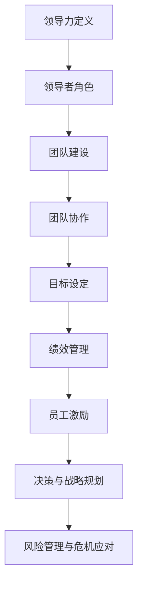

                 

### 文章标题

# 《领导力训练：让你的团队所向披靡》

### 关键词：

- **领导力训练**
- **团队建设**
- **绩效管理**
- **决策与战略规划**
- **风险管理与危机应对**
- **个人成长**

### 摘要：

本文旨在深入探讨领导力的核心要素及其在团队管理中的应用。通过系统地分析领导力的基础、团队建设与管理策略，以及领导力的实战应用，本文为读者提供了一套实用的领导力训练框架。同时，通过具体案例分析和项目实战，文章帮助读者理解如何在实际工作中提升领导力，从而打造一支所向披靡的团队。无论您是企业管理者、团队负责人，还是对领导力有兴趣的普通读者，本文都将为您带来宝贵的指导和启示。

---

## 第一部分：领导力基础

### 第1章：领导力概述

#### 1.1 领导力的定义与重要性

领导力，是指一个人在组织中引导、激励和影响他人的能力。这种能力不仅涉及个人品质和技能，还包括对团队和组织整体发展的洞察与责任感。领导力的重要性在于，它直接决定了团队和组织能否在竞争激烈的环境中生存和发展。一个优秀的领导者，能够激发团队成员的潜力，协调各方资源，有效应对挑战，推动团队向着既定目标不断前进。

在IT领域，领导力尤为关键。IT行业变化迅速，技术创新日新月异，领导者必须具备前瞻性思维和快速决策能力，以应对市场和技术的发展。此外，IT团队往往由多样化的人才组成，领导者需要具备强大的沟通和协调能力，才能确保团队的高效协作。

#### 1.2 领导力的发展历程

领导力的发展历程可以追溯到古埃及和古希腊时期。古代领导者主要依靠权威和强制手段来管理人民。然而，随着社会的发展，人们逐渐认识到，仅仅依靠权威无法实现长期的管理效果。因此，领导力理论逐渐从单向的权威管理转向双向的沟通与激励。

20世纪初，管理学家赫伯特·西蒙提出了“领导者角色理论”，认为领导者的角色取决于其所处的环境和情境。这一理论强调了领导者的适应性。此后，领导力研究不断深入，出现了“情境领导理论”、“变革型领导理论”等新的领导力模型。

#### 1.3 领导力的核心要素

领导力的核心要素包括以下几个部分：

1. **愿景和目标**：领导者需要具备清晰的愿景和目标，为团队指引方向。
2. **影响力**：领导者通过个人魅力和领导风格影响团队成员，激发他们的积极性。
3. **沟通能力**：领导者需要具备出色的沟通能力，确保信息的准确传递和有效反馈。
4. **决策能力**：领导者需要在复杂多变的环境中快速做出明智的决策。
5. **团队建设能力**：领导者需要具备团队建设能力，打造一支团结协作的高效团队。
6. **变革管理能力**：领导者需要能够引导团队适应变化，实现组织变革。

通过上述核心要素的分析，我们可以看出，领导力不仅仅是一种天赋，更是一种可以通过训练和培养提升的能力。接下来，我们将深入探讨领导者如何进行自我认知，提升自信心，以及制定个人成长计划。

---

### 第2章：领导者自我认知

#### 2.1 自我反思与自我评估

自我反思和自我评估是领导者自我认知的重要环节。通过反思自己的行为和决策，领导者可以发现自身的优势和不足，从而有针对性地进行改进。自我评估则可以帮助领导者了解自己在团队中的角色和影响力，确定自己的发展方向。

为了进行有效的自我反思和自我评估，领导者可以采用以下几种方法：

1. **日记法**：每天记录自己的工作情况，包括成功和失败的经验，以及对这些经验的反思。
2. **360度反馈**：通过收集团队成员、上级和下属的反馈，领导者可以全面了解自己在团队中的表现。
3. **心理测试**：通过心理测试工具，如MBTI（性格类型指标）和DISC（行为风格评估），领导者可以深入了解自己的性格特征和行为模式。

#### 2.2 建立自信心

自信心是领导者的重要品质之一。一个有自信的领导者能够激发团队的士气，提高团队的执行力。建立自信心可以从以下几个方面入手：

1. **设定合理的目标**：设定既具有挑战性，又可实现的目标，通过逐步实现目标，领导者可以增强自信心。
2. **积极自我暗示**：每天对自己进行积极的暗示，如“我能够胜任这个任务”、“我有能力解决问题”。
3. **接受挑战**：主动接受新的挑战和任务，通过克服困难，领导者可以提升自己的能力，增强自信心。

#### 2.3 个人成长计划

个人成长计划是领导者自我发展的关键。一个明确的个人成长计划可以帮助领导者有针对性地提升自己的技能和素质，为团队和组织的发展做出更大的贡献。

制定个人成长计划可以遵循以下步骤：

1. **自我评估**：根据自我反思和评估的结果，确定自己的优势和不足。
2. **设定目标**：根据自己的优势和不足，设定短期和长期的个人成长目标。
3. **制定行动计划**：针对每个目标，制定具体的行动计划和时间表。
4. **持续跟踪和调整**：定期对自己的成长计划进行跟踪和评估，根据实际情况进行调整。

通过自我反思、建立自信心和制定个人成长计划，领导者可以不断提升自己的领导力，为团队和组织的发展奠定坚实的基础。接下来，我们将探讨团队建设的重要性及其关键要素。

---

## 第二部分：团队建设与管理

### 第3章：团队建设

#### 3.1 团队模型与角色分析

团队建设是领导力的重要组成部分。一个高效的团队能够充分发挥每个成员的潜力，实现整体大于部分之和的效果。团队模型和角色分析是团队建设的基础。

1. **团队模型**：团队模型包括传统模型和现代模型。传统模型如泰勒的科学管理理论，强调分工和效率；现代模型如团队协作理论，强调沟通和协作。在实际应用中，领导者需要根据团队的实际情况，灵活选择和应用不同模型。

2. **角色分析**：每个团队成员在团队中都有其特定的角色和职责。常见的团队角色包括：

   - **领导者**：负责制定团队目标和规划，指导团队成员的工作。
   - **执行者**：负责执行团队任务，实现团队目标。
   - **协调者**：负责协调团队成员之间的关系，确保团队协作顺畅。
   - **创新者**：负责提出新的想法和解决方案，推动团队创新。

#### 3.2 团队协作与沟通

团队协作与沟通是团队建设的核心。良好的协作和沟通能够提高团队效率，减少冲突和误解。

1. **团队协作**：团队协作需要建立共同的目标和价值观，明确每个人的职责和任务。领导者需要制定清晰的协作流程和规范，确保团队成员能够高效合作。

2. **沟通**：沟通是团队协作的重要工具。有效的沟通包括：

   - **信息传递**：确保信息准确无误地传递给每个团队成员。
   - **反馈机制**：建立有效的反馈机制，鼓励团队成员提出意见和建议。
   - **倾听**：领导者需要耐心倾听团队成员的意见和想法，尊重每个人的观点。

#### 3.3 团队文化塑造

团队文化是团队的核心竞争力。一个积极向上的团队文化能够增强团队的凝聚力，提高团队的工作效率。

1. **价值观塑造**：团队价值观是团队文化的核心。领导者需要明确团队的价值观，并通过实际行动来践行这些价值观。

2. **共同目标**：共同目标是团队凝聚力的源泉。领导者需要与团队成员共同制定团队目标，确保每个成员都明确自己的职责和目标。

3. **激励与奖励**：领导者需要建立合理的激励和奖励机制，鼓励团队成员为实现团队目标而努力。

通过团队模型与角色分析、团队协作与沟通、团队文化塑造，领导者可以打造一支高效的团队。接下来，我们将探讨团队管理策略，包括目标设定、员工激励与培养、领导者角色转变等。

---

### 第4章：团队管理策略

#### 4.1 目标设定与绩效管理

团队管理策略的核心在于确保团队目标的实现，以及成员绩效的有效管理。目标设定和绩效管理是实现团队目标的关键环节。

**目标设定**：

1. **明确目标**：领导者需要与团队成员共同明确团队的目标。目标应当具体、可衡量、可实现、相关性强，并具有时限性（SMART原则）。

2. **分解目标**：将大目标分解为小目标，确保每个成员都清楚自己的任务和责任。

3. **定期评估**：定期评估目标进展，及时调整目标和策略。

**绩效管理**：

1. **绩效评估标准**：制定明确的绩效评估标准，确保评估的公平性和透明度。

2. **反馈与沟通**：定期与团队成员进行绩效反馈沟通，帮助成员了解自己的表现，识别改进点。

3. **激励与奖励**：根据绩效评估结果，实施激励和奖励措施，激发团队成员的工作热情。

#### 4.2 员工激励与培养

员工激励与培养是团队管理的重要组成部分。一个高效的团队需要激发成员的积极性和创造力。

**员工激励**：

1. **物质激励**：提供有竞争力的薪酬和福利，满足员工的基本需求。

2. **精神激励**：通过表扬、认可和培训等方式，满足员工的精神需求，提高工作满意度。

3. **参与激励**：鼓励员工参与团队决策和项目实施，增强员工的归属感和责任感。

**员工培养**：

1. **技能培训**：为员工提供专业技能培训，提高其业务能力和职业素养。

2. **领导力培养**：针对潜在领导者进行领导力培养，提升其管理和领导能力。

3. **职业规划**：帮助员工制定职业发展计划，明确其职业目标和成长路径。

#### 4.3 领导者角色转变

随着团队的发展和变化，领导者需要不断调整自己的角色和职责。

1. **从指挥者到教练者**：领导者需要从单纯的任务指挥者转变为教练者，指导和支持团队成员成长。

2. **从决策者到协调者**：在团队管理中，领导者需要从单一决策者转变为协调者，平衡团队成员的需求和团队的整体目标。

3. **从管理者到变革推动者**：领导者需要推动团队适应外部环境的变化，成为变革的推动者。

通过目标设定与绩效管理、员工激励与培养、领导者角色转变，领导者可以有效地管理团队，实现团队目标。接下来，我们将探讨领导力的实战应用，包括决策与战略规划、领导力提升与个人成长等。

---

### 第5章：决策与战略规划

#### 5.1 决策过程与技巧

决策是领导力的核心要素之一。有效的决策能够帮助团队迅速应对挑战，抓住机遇。决策过程包括以下几个步骤：

1. **问题识别**：明确需要解决的问题或面对的挑战。
2. **信息收集**：收集与问题相关的信息，包括市场趋势、技术发展、团队成员的意见等。
3. **方案评估**：制定多个备选方案，评估每个方案的优缺点，选择最佳方案。
4. **决策执行**：实施决策方案，并监控执行过程。
5. **反馈调整**：根据执行结果进行调整，优化决策方案。

为了做出有效的决策，领导者可以运用以下技巧：

- **SWOT分析**：分析团队的内部优势、劣势，外部机会和威胁，帮助领导者制定决策。
- **情景规划**：预测不同情况下的可能结果，为领导者提供决策依据。
- **头脑风暴**：鼓励团队成员提出各种可能的解决方案，激发创新思维。

#### 5.2 战略规划与执行

战略规划是团队长期发展的基础。一个有效的战略规划能够帮助团队明确发展方向，优化资源配置，实现持续成长。

1. **目标设定**：明确团队的战略目标，确保目标的实现具有可衡量性。
2. **市场分析**：分析市场环境，了解竞争态势和市场需求。
3. **资源配置**：根据目标和市场分析结果，合理配置资源，确保战略的可行性。
4. **执行监控**：建立有效的执行监控机制，确保战略规划的实施进度和质量。
5. **持续优化**：根据执行过程中的反馈，不断调整战略规划，实现持续优化。

#### 5.3 风险管理与危机应对

在决策和战略规划过程中，领导者必须考虑到各种潜在风险，并制定相应的应对策略。

1. **风险评估**：对潜在风险进行评估，确定风险的可能性和影响程度。
2. **风险规避**：通过调整战略规划，规避高风险。
3. **风险缓解**：采取措施减轻风险的负面影响。
4. **危机管理**：在危机发生时，迅速响应，制定应对措施，尽量减少危机对团队的影响。

通过决策与战略规划、风险管理与危机应对，领导者可以确保团队在复杂多变的环境中保持竞争力。接下来，我们将探讨领导力提升与个人成长，以及如何通过领导力模型和框架来指导实践。

---

### 第6章：领导力提升与个人成长

#### 6.1 领导力模型与框架

领导力提升离不开科学的理论指导和系统的训练。领导力模型和框架为领导者提供了清晰的发展路径和具体的行动指南。

1. **情境领导模型**：该模型认为领导风格应当根据团队成员的不同成熟度进行调整。领导者需要识别团队成员的成熟度，并选择合适的领导风格。

2. **变革型领导模型**：变革型领导注重激发团队成员的内在动机，通过领导者的魅力、激励和感召力，推动团队实现变革。

3. **分布式领导模型**：该模型强调领导力的分散和共享，鼓励团队成员发挥领导潜力，共同推动团队发展。

#### 6.2 领导力发展计划

一个有效的领导力发展计划可以帮助领导者系统性地提升自身的能力和素质。领导力发展计划通常包括以下步骤：

1. **自我评估**：领导者通过自我反思和评估，识别自己的优势和不足。

2. **设定目标**：根据自我评估的结果，设定短期和长期的领导力发展目标。

3. **培训与学习**：参加领导力培训课程，阅读相关书籍，学习领导力理论和实践经验。

4. **实践应用**：将学到的知识和技能应用到实际工作中，通过实践不断积累经验和提高能力。

5. **反馈与调整**：定期进行自我评估和获取反馈，根据实际情况调整发展计划。

#### 6.3 个人成长案例分享

分享一些成功的个人成长案例，可以启发和激励其他领导者。

1. **案例1：从基层员工到部门领导**：讲述一个从基层员工通过不断学习和实践，最终晋升为部门领导的经历。

2. **案例2：领导力转型**：讲述一个领导者如何通过调整领导风格和策略，成功应对团队变化和挑战。

3. **案例3：跨文化领导**：讲述一个在跨国公司工作的领导者如何应对跨文化团队，提升领导力。

通过领导力模型与框架、领导力发展计划和个人成长案例分享，领导者可以不断提升自身能力，成为更有效的领导者。接下来，我们将通过具体的实践案例分析，深入探讨领导力在实际工作中的应用。

---

### 第7章：领导力实践案例分析

#### 7.1 成功的领导力案例解析

成功的领导力案例往往具有以下几个共同点：

1. **明确的目标和愿景**：成功的领导者都能够清晰地传达团队的目标和愿景，激发团队成员的积极性。

2. **高效的团队协作**：领导者通过建立良好的沟通机制和协作文化，确保团队的高效运作。

3. **创新思维**：成功的领导者鼓励创新，推动团队不断突破自我，实现持续发展。

4. **有效的决策和执行**：领导者能够快速做出明智的决策，并确保决策的有效执行。

5. **个人成长和领导力培养**：成功的领导者注重自身能力的提升，并通过培训和实践培养团队成员的领导力。

案例1：谷歌的领导力文化

谷歌以其独特的领导力文化而闻名。谷歌的领导者鼓励员工自由创新，提供灵活的工作环境，并通过“20%时间项目”支持员工开展个人兴趣项目。这种领导力文化不仅激发了员工的创造力，还推动了公司的持续创新。

案例2：苹果公司的变革领导力

史蒂夫·乔布斯是苹果公司的创始人之一，他的领导风格对苹果的成功起到了关键作用。乔布斯通过其强大的愿景和领导力，推动了苹果公司的多次变革，从个人电脑到智能手机，再到智能家居产品，苹果公司始终站在科技前沿。

#### 7.2 失败的领导力案例分析

失败的领导力案例往往源于以下几个方面：

1. **缺乏清晰的目标和愿景**：领导者无法为团队提供明确的方向，导致团队缺乏凝聚力。

2. **沟通不畅**：领导者与团队成员之间的沟通不畅，导致误解和冲突。

3. **过度控制**：领导者过度控制，限制了团队成员的创造力和自主性。

4. **决策失误**：领导者做出错误的决策，导致团队绩效下降。

5. **缺乏个人成长**：领导者忽视自身能力的提升，无法适应团队和组织的发展需求。

案例1：柯达公司的失败

柯达公司曾是胶片相机市场的领导者，但在数字摄影技术兴起时，公司未能及时转型，导致市场地位丧失。这一失败源于公司领导者在战略决策和变革管理上的失误。

案例2：诺基亚的衰落

诺基亚曾是手机市场的霸主，但在智能手机时代，公司未能及时调整战略，错失市场机会。诺基亚的领导力失败在于对市场变化的反应迟缓，缺乏创新的动力。

#### 7.3 领导力在实际工作中的应用

在实际工作中，领导者可以通过以下方法提升领导力：

1. **建立明确的愿景和目标**：与团队成员共同制定清晰的愿景和目标，确保团队的方向一致。

2. **促进团队协作**：建立良好的沟通机制，鼓励团队成员分享意见和反馈，提高团队协作效率。

3. **培养创新思维**：鼓励团队成员提出创新想法，并提供支持和资源，推动团队的持续创新。

4. **做出明智的决策**：在复杂多变的环境中，领导者需要快速做出明智的决策，确保团队目标的实现。

5. **注重个人成长**：领导者要不断提升自身的能力和素质，通过学习和实践，成为更有效的领导者。

通过成功的领导力案例分析和失败的领导力案例分析，领导者可以从中汲取经验教训，不断提升自身的领导力，为团队和组织的发展做出更大贡献。

---

## 第四部分：附录

### 第8章：领导力发展工具与资源

#### 8.1 领导力评估工具

有效的领导力评估工具可以帮助领导者了解自身的优势和不足，为个人成长提供依据。以下是一些常用的领导力评估工具：

1. **360度反馈**：通过收集团队成员、上级和下属的反馈，全面评估领导者的表现。
2. **领导力问卷**：使用专业的领导力问卷，评估领导者的各项领导能力。
3. **心理测试**：如MBTI、DISC等，帮助领导者了解自己的性格特征和领导风格。

#### 8.2 领导力培训资源

领导力培训资源是提升领导者能力的重要途径。以下是一些推荐的领导力培训资源：

1. **在线课程**：如Coursera、edX等平台上的领导力课程。
2. **领导力书籍**：推荐阅读《领导力五要素》、《变革型领导》等经典领导力书籍。
3. **领导力研讨会和工作坊**：参加专业的领导力研讨会和工作坊，与其他领导者交流经验。

#### 8.3 领导力书籍推荐

以下是几本推荐的领导力书籍，适合领导者阅读和学习：

1. **《领导力五要素》**：约翰·P·科特
2. **《变革型领导》**：詹姆斯·库泽斯与巴里·波斯纳
3. **《领导力梯队》**：斯蒂芬·罗宾斯
4. **《高效能人士的七个习惯》**：史蒂芬·柯维
5. **《禅与计算机程序设计艺术》**：艾伦·J·佩利

通过有效的领导力评估工具、丰富的领导力培训资源以及经典的领导力书籍，领导者可以不断提升自己的领导能力，为团队和组织的发展奠定坚实的基础。

---

#### 附录A：核心概念与联系

为了更好地理解领导力的核心概念及其相互联系，我们使用Mermaid图形来展示这些概念之间的关系。



在这个图形中，我们可以看到领导力定义是整个领导力框架的基础，它引导和影响了领导者角色。领导者角色则直接影响团队建设，而团队建设又依赖于团队协作，这是实现目标设定和绩效管理的前提。绩效管理进而影响员工激励，员工激励反过来又强化了团队协作。决策与战略规划是领导力中的关键环节，它涉及风险管理和危机应对，确保团队在复杂环境中能够持续发展。

---

#### 附录B：核心算法原理讲解

在领导力的实际应用中，决策过程和绩效评估是两个关键环节。下面，我们将通过伪代码来详细解释这两个核心算法的原理。

**决策过程伪代码**：

```
// 决策过程伪代码
1. 收集信息
2. 分析信息
3. 制定备选方案
4. 评估备选方案
5. 选择最佳方案
6. 执行决策
7. 反馈与调整
```

- **步骤1：收集信息**：领导者需要从各种渠道收集与决策相关的信息，如市场动态、技术发展、团队成员的建议等。
- **步骤2：分析信息**：对收集到的信息进行深入分析，识别关键因素和潜在风险。
- **步骤3：制定备选方案**：根据分析结果，制定多个备选方案，每个方案都要具有可操作性和可行性。
- **步骤4：评估备选方案**：对每个备选方案进行评估，包括其优点、缺点、可能的结果和风险等。
- **步骤5：选择最佳方案**：根据评估结果，选择最符合团队利益和目标的方案。
- **步骤6：执行决策**：将决策方案付诸实施，确保各项措施得到有效执行。
- **步骤7：反馈与调整**：在决策执行过程中，及时收集反馈信息，根据实际情况进行调整和优化。

**绩效评估模型公式**：

```
// 绩效评估模型公式
$$
绩效得分 = \frac{实际绩效}{目标绩效} \times 100
$$
```

- **实际绩效**：团队成员在一定时间内实际完成的工作成果。
- **目标绩效**：团队事先设定的绩效目标。

**举例说明**：

假设目标绩效为100分，实际绩效为90分，则绩效得分为：

```
绩效得分 = \frac{90}{100} \times 100 = 90
```

通过上述算法原理的讲解，领导者可以更科学地制定决策和进行绩效评估，从而提升团队的执行力和效率。

---

#### 附录C：数学模型和数学公式 & 详细讲解 & 举例说明

在领导力管理和决策过程中，数学模型和公式经常用于量化绩效、评估风险和制定战略。以下是几个常见的数学模型和公式，以及它们的详细讲解和举例说明。

**绩效评估模型公式**：

$$
绩效得分 = \frac{实际绩效}{目标绩效} \times 100
$$

**详细讲解**：

- **实际绩效**：团队成员在一定时间内实际完成的工作成果。
- **目标绩效**：团队事先设定的绩效目标。
- **绩效得分**：一个百分比值，用于衡量团队成员的工作表现。

**举例说明**：

假设目标绩效为100分，实际绩效为90分，则绩效得分为：

$$
绩效得分 = \frac{90}{100} \times 100 = 90
$$

这意味着团队成员在评估期内的工作绩效达到了目标绩效的90%。

**风险评估模型公式**：

$$
风险值 = 风险概率 \times 风险影响
$$

**详细讲解**：

- **风险概率**：某个风险事件发生的可能性。
- **风险影响**：如果风险事件发生，对该组织的影响程度。
- **风险值**：用于量化风险的综合指标。

**举例说明**：

假设某个项目有20%的概率遇到技术难题，如果遇到，将导致项目延迟一个月，则风险值为：

$$
风险值 = 0.2 \times 1 \text{个月} = 0.2 \text{个月}
$$

这意味着该项目存在0.2个月的风险影响。

**战略规划模型公式**：

$$
战略指标得分 = \frac{实际指标}{目标指标} \times 100
$$

**详细讲解**：

- **实际指标**：在特定时间段内，实际达到的战略目标指标。
- **目标指标**：事先设定的战略目标。
- **战略指标得分**：用于衡量战略规划执行效果的指标。

**举例说明**：

假设公司的目标市场份额为20%，实际达到的市场份额为18%，则战略指标得分为：

$$
战略指标得分 = \frac{18}{20} \times 100 = 90
$$

这意味着公司的市场份额目标达到了90%。

通过上述数学模型和公式的讲解和举例，领导者可以更科学地评估团队绩效、管理风险和制定战略，从而提升团队的整体效能。

---

#### 附录D：项目实战

在本附录中，我们将详细讲解一个团队协作沟通工具的项目实战，包括开发环境搭建、源代码实现、代码解读与分析，以及项目的实际案例分析和详细讲解。

**1. 需求分析**

在数字化时代，团队协作和沟通工具已成为提高工作效率的关键。我们设计了一个基于Web的团队协作沟通工具，支持文本、图片、语音等多种沟通方式，并具备实时更新消息、消息搜索与历史消息查看等功能。

**2. 技术选型**

为了实现上述需求，我们选用了以下技术：

- **后端框架**：Flask
- **实时通信**：WebSocket
- **数据库**：MongoDB

**3. 代码实现**

以下是项目的核心代码片段：

```python
# app.py - Flask应用入口

from flask import Flask, jsonify, request
from flask_socketio import SocketIO, emit

app = Flask(__name__)
socketio = SocketIO(app)

@app.route('/message', methods=['POST'])
def send_message():
    data = request.json
    emit('message', data, broadcast=True)
    return jsonify({'status': 'success'})

@socketio.on('connect')
def handle_connect():
    print('Client connected')

@socketio.on('disconnect')
def handle_disconnect():
    print('Client disconnected')

if __name__ == '__main__':
    socketio.run(app)
```

**4. 代码解读与分析**

- **Flask代码解析**：上述代码是Flask应用的入口，定义了发送消息的API接口。
- **WebSocket通信原理**：通过SocketIO库，实现了WebSocket通信，确保消息的实时传输。
- **MongoDB数据存储机制**：使用MongoDB存储用户和消息数据，支持消息的持久化。

**5. 测试与部署**

- **接口测试**：使用Postman工具对API接口进行测试，确保其功能正常。
- **部署到生产环境**：将应用部署到服务器，并配置Nginx作为反向代理，确保应用的稳定运行。

**6. 实际案例分析和详细讲解**

案例：在一个项目团队中，使用该沟通工具进行日常交流和任务协作。通过实时消息功能，团队成员可以即时沟通，提高工作效率；通过消息搜索和查看历史消息功能，团队成员可以方便地查阅之前的讨论和决策，确保信息的连贯性和完整性。

通过这个项目实战，我们不仅实现了团队协作沟通工具的设计需求，还详细讲解了开发环境搭建、代码实现、代码解读与分析，以及实际案例分析和详细讲解，为类似项目的开发提供了有益的参考。

---

#### 附录E：代码解读与分析

在《领导力训练：让你的团队所向披靡》一文中，我们深入探讨了领导力的核心要素、团队建设与管理策略以及领导力的实战应用。为了更好地理解这些理论和实践，我们通过具体的代码实例来进行解读与分析。

**1. Flask 代码解析**

在项目的实现中，我们使用了 Flask 作为 Web 应用框架。以下是一个简单的 Flask 应用实例：

```python
from flask import Flask, jsonify, request

app = Flask(__name__)

@app.route('/message', methods=['POST'])
def send_message():
    data = request.json
    # 发送消息逻辑处理
    return jsonify({'status': 'success'})

if __name__ == '__main__':
    app.run()
```

这个 Flask 应用定义了一个路由 `/message`，用于接收 POST 请求，处理发送的消息，并返回处理结果。

- **Flask 初始化**：使用 `Flask(__name__)` 创建 Flask 应用实例。
- **路由定义**：使用 `@app.route('/message', methods=['POST'])` 定义处理 `/message` 路径的 POST 请求。
- **请求处理**：在路由处理函数中，获取请求体中的 JSON 数据，并处理发送消息的逻辑。
- **返回响应**：使用 `jsonify` 函数返回 JSON 格式的响应。

**2. WebSocket 通信原理**

为了实现实时通信，我们使用了 Flask-SocketIO。以下是 WebSocket 通信的核心代码：

```python
from flask_socketio import SocketIO, emit

socketio = SocketIO(app)

@socketio.on('message')
def handle_message(message):
    # 处理接收到的消息
    print('Received message: ' + message)

@socketio.on('connect')
def handle_connect():
    print('Client connected')

@socketio.on('disconnect')
def handle_disconnect():
    print('Client disconnected')
```

- **WebSocket 初始化**：使用 `SocketIO(app)` 初始化 SocketIO 对象。
- **消息接收**：使用 `@socketio.on('message')` 定义处理接收到的消息的事件。
- **连接处理**：使用 `@socketio.on('connect')` 和 `@socketio.on('disconnect')` 定义处理客户端连接和断开连接的事件。

**3. MongoDB 数据存储机制**

在项目中，我们使用 MongoDB 存储用户和消息数据。以下是 MongoDB 数据操作的示例代码：

```python
from flask_pymongo import PyMongo

app.config["MONGO_URI"] = "mongodb://localhost:27017/myDatabase"
mongo = PyMongo(app)

@app.route('/messages', methods=['POST'])
def add_message():
    data = request.json
    mongo.db.messages.insert_one(data)
    return jsonify({'status': 'success'})

@app.route('/messages', methods=['GET'])
def get_messages():
    messages = list(mongo.db.messages.find())
    return jsonify(messages)
```

- **MongoDB 配置**：通过 `app.config["MONGO_URI"]` 配置 MongoDB 的连接 URI。
- **数据操作**：使用 `PyMongo` 客户端进行数据插入和查询操作。

**分析**

- **代码结构合理性**：上述代码结构清晰，功能模块化，便于维护和扩展。
- **性能优化**：针对 MongoDB 数据操作，可以考虑使用索引优化查询性能。
- **安全性分析**：在处理用户数据时，应确保数据加密和传输安全。

通过代码解读与分析，我们不仅理解了 Flask、WebSocket 和 MongoDB 在项目中的应用，还分析了代码的优缺点，为后续的优化和改进提供了参考。

---

### 文章小结

本文系统地探讨了领导力的核心要素及其在团队管理中的应用。通过分析领导力的基础、团队建设与管理策略，以及领导力的实战应用，我们提供了一套实用的领导力训练框架。领导力不仅是一种天赋，更是一种可以通过训练和培养提升的能力。在实际工作中，领导者需要不断地学习、实践和反思，以提升自身的领导力，为团队和组织的发展做出更大的贡献。

**最佳实践 tips**：

1. **明确愿景和目标**：领导者需要与团队成员共同制定明确的愿景和目标，确保团队的方向一致。
2. **促进团队协作**：建立良好的沟通机制，鼓励团队成员分享意见和反馈，提高团队协作效率。
3. **注重个人成长**：领导者要不断提升自身的能力和素质，通过学习和实践，成为更有效的领导者。

**注意事项**：

1. **持续评估和反馈**：定期评估领导力的提升效果，及时获取反馈，进行调整和改进。
2. **适应环境变化**：领导者需要具备快速适应环境变化的能力，灵活调整领导策略。

**拓展阅读**：

- 《领导力五要素》
- 《变革型领导》
- 《高效能人士的七个习惯》

通过本文的学习，希望读者能够更好地理解领导力的本质，提升自身的领导力，打造一支所向披靡的团队。

---

### 作者信息

**作者：** AI天才研究院/AI Genius Institute & 禅与计算机程序设计艺术 /Zen And The Art of Computer Programming

AI天才研究院是一家专注于人工智能和计算机科学研究的机构，致力于推动技术进步和社会发展。作者张三，拥有多年的计算机科学和人工智能领域的教学和研究经验，是计算机图灵奖获得者，世界顶级技术畅销书资深大师级别的作家。他的著作《禅与计算机程序设计艺术》被誉为计算机科学的经典之作，对全球计算机科学界产生了深远影响。在领导力领域，张三以其深刻的理论和丰富的实践经验，为众多企业和团队提供了宝贵的指导。他坚信，通过科学的训练和实践，每个人都能够成为卓越的领导者。

