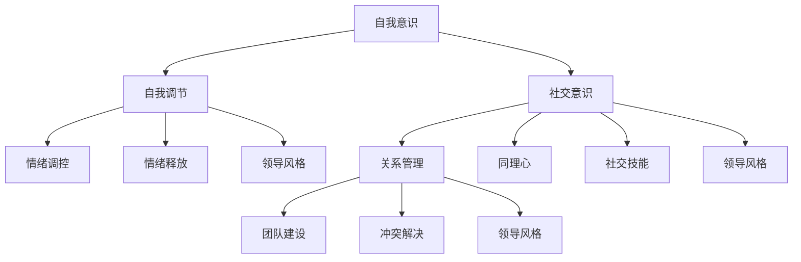
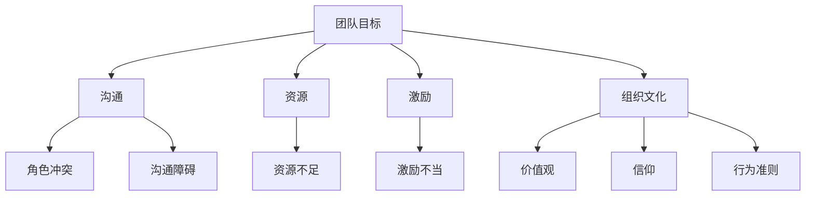
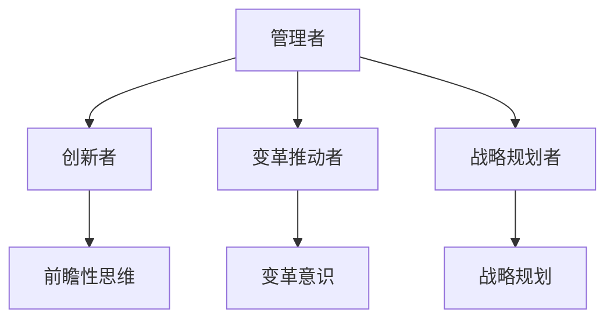
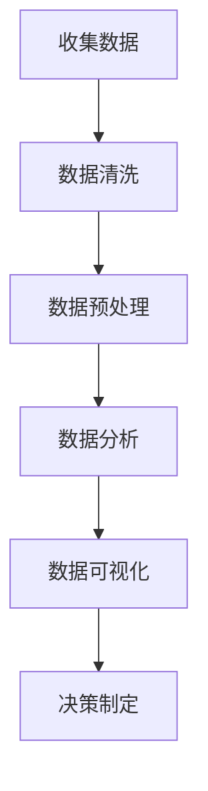
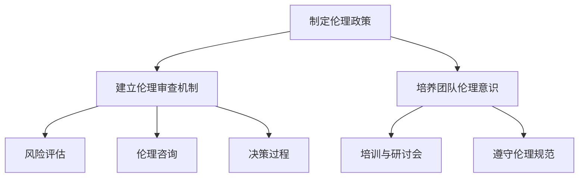
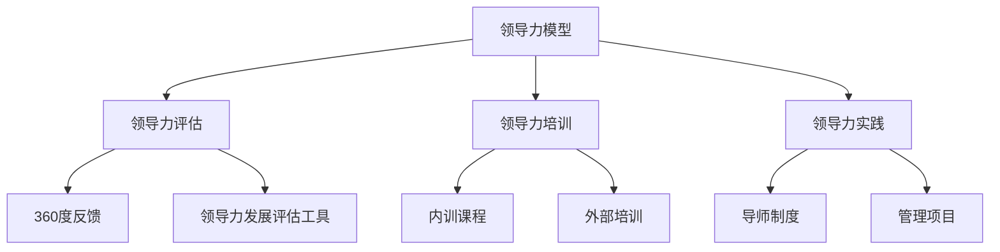
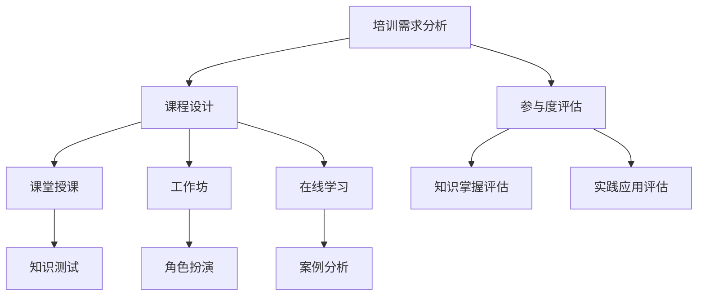
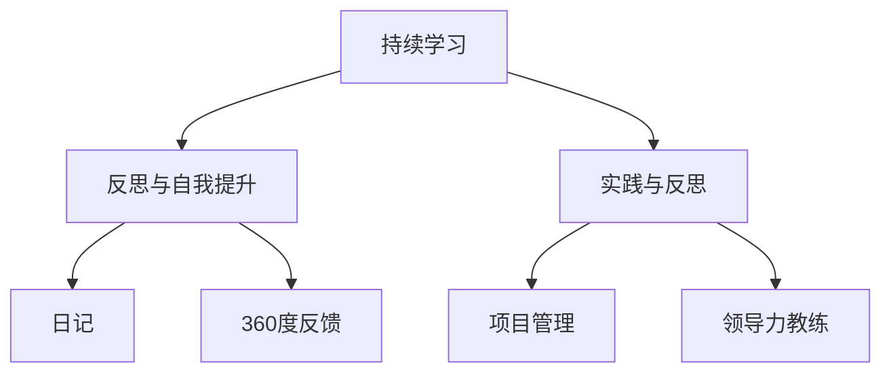
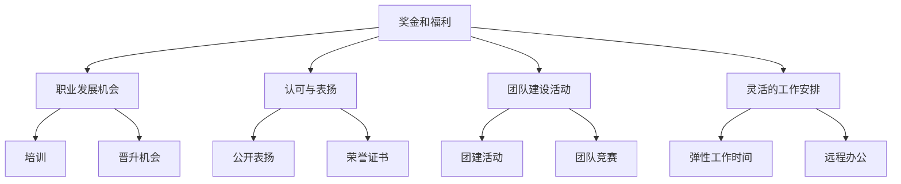
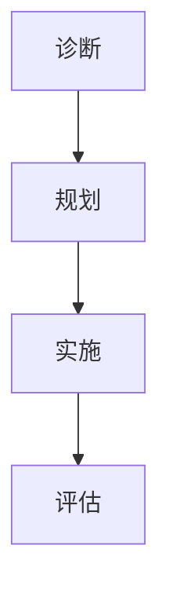

                 

### 第2章：领导力心理学基础

#### 2.1 心理学在领导力中的应用

在领导力研究中，心理学扮演了重要的角色。通过对人的心理和行为模式进行深入研究，领导者可以更好地理解团队成员的需求和动机，从而更有效地引导和激励他们。

- **人格特质**：领导者的个性特质对于团队管理有着重要影响。一些常见的人格特质包括：
  - **外向性**：外向的领导者通常更善于沟通和社交，能够快速建立人际关系网。
  - **神经质**：情绪稳定的领导者能够更好地应对压力和挑战，保持冷静和理性。
  - **宜人性**：宜人的领导者更容易与团队成员建立信任和合作关系。
  - **开放性**：开放的领导者更具创新精神，能够接受新的观点和想法。

- **动机理论**：了解团队成员的动机对于领导者来说至关重要。一些常见的动机理论包括：
  - **马斯洛的需求层次理论**：领导者需要关注团队成员的不同层次需求，从基本生理需求到自我实现需求。
  - **赫茨伯格的双因素理论**：领导者应该同时关注员工的激励因素和保健因素，以提高员工的工作满意度。

#### 2.2 情绪智力与领导力

情绪智力（Emotional Intelligence，简称EQ）是领导力的重要组成部分。情绪智力高的领导者能够更好地管理自己的情绪，理解他人的情绪，并有效地进行人际关系管理。

- **自我意识**：自我意识是情绪智力的基础。领导者需要深入了解自己的情绪，理解情绪对自己行为的影响。
  - **自我观察**：领导者应该学会观察自己的情绪，了解情绪的起因和变化。
  - **自我反思**：领导者需要定期进行自我反思，思考自己的情绪和行为是否符合领导者的标准。

- **自我调节**：自我调节是指领导者能够控制自己的情绪，以适应不同的环境和情境。
  - **情绪调控**：领导者需要学会在压力和挑战面前保持冷静和理性。
  - **情绪释放**：适当的情绪释放可以帮助领导者释放压力，提高工作效率。

- **社交意识**：社交意识是指领导者能够理解他人的情绪和需求，并建立良好的人际关系。
  - **同理心**：领导者需要具备同理心，能够站在他人的角度理解和感受。
  - **社交技能**：领导者需要具备良好的社交技能，包括沟通、倾听、协商等。

- **关系管理**：关系管理是情绪智力的最高层次。领导者需要能够建立和维护良好的人际关系，促进团队合作。
  - **团队建设**：领导者需要通过有效的团队建设活动，增强团队凝聚力和合作效率。
  - **冲突解决**：领导者需要具备有效的冲突解决技能，以减少团队内部的矛盾和摩擦。

#### 2.3 人格特质与领导力

人格特质不仅影响领导者的个人行为，也影响其领导风格。不同的领导者可能具备不同的人格特质，这些特质会直接影响领导效果。

- **权威型领导**：权威型领导者通常具备强烈的个性特质，对团队成员具有高度的控制力。这种领导风格在某些情况下能够提高团队绩效，但在其他情况下可能会导致团队成员的被动和不满。

- **民主型领导**：民主型领导者更注重团队成员的意见和参与，鼓励民主决策和团队协作。这种领导风格有助于提高团队成员的参与感和满意度，但可能需要更多的时间和资源。

- **变革型领导**：变革型领导者能够激发团队成员的潜能，推动团队实现变革和创新。这种领导风格通常需要领导者具备高水平的情绪智力和人格魅力。

### Mermaid 流程图：情绪智力与领导力



### 伪代码：情绪智力与领导力评估

```python
# 定义情绪智力评估函数
def assess_emotional_intelligence(personality_traits, emotional_intelligence):
    self_awareness = personality_traits['self_awareness']
    self Regulation = personality_traits['self_Regression']
    social_awareness = personality_traits['social_awareness']
    relationship_management = personality_traits['relationship_management']
    
    # 计算情绪智力总分
    total_score = (self_awareness + self Regulation + social_awareness + relationship_management) / 4
    
    # 判断情绪智力水平
    if total_score > 80:
        return "高情绪智力"
    elif total_score > 60:
        return "中情绪智力"
    else:
        return "低情绪智力"

# 示例数据
personality_traits = {
    'self_awareness': 85,
    'self_Regression': 75,
    'social_awareness': 80,
    'relationship_management': 70
}

# 调用评估函数
emotional_intelligence_level = assess_emotional_intelligence(personality_traits, emotional_intelligence)
print(emotional_intelligence_level)
```

通过上述步骤，我们可以看到心理学在领导力中的应用，以及情绪智力与领导力的关系。理解这些概念有助于领导者更好地管理团队，提高领导效果。

### 附录

#### 附录 A：领导力相关工具与资源

- **领导力评估工具**
  - **Myers-Briggs Type Indicator (MBTI)**：一种常用的个性类型评估工具，帮助领导者了解团队成员的个性特征。
  - **DiSC Assessment**：一种行为风格评估工具，帮助领导者理解团队成员的行为模式。

- **领导力培训资源**
  - **Harvard Business Review (HBR)**：提供大量关于领导力理论和实践的论文和案例研究。
  - **Coursera**：提供多种领导力相关的在线课程，涵盖心理学、组织行为学等多个领域。

- **人工智能时代领导力研究论文与书籍推荐**
  - **《领导力进阶：人工智能时代的领导力策略》**：作者：约翰·布洛克曼
  - **《人工智能时代的领导力：技术、伦理与管理》**：作者：理查德·萨勒
  - **《领导力心理学》**：作者：丹尼尔·戈尔曼

这些工具和资源可以帮助领导者更好地理解心理学在领导力中的应用，提高情绪智力，从而更有效地管理团队。

---

**作者：AI天才研究院/AI Genius Institute & 禅与计算机程序设计艺术 /Zen And The Art of Computer Programming**### 第3章：领导力与组织行为

#### 3.1 组织行为学概述

组织行为学是研究组织中人的行为、人际关系和组织结构的学科。它关注个体、群体以及整个组织的行为模式，旨在帮助领导者更好地理解和管理组织中的行为。

- **研究内容**
  - **个体行为**：研究个体的行为模式、动机、个性特质等。
  - **群体行为**：研究团队协作、沟通、领导风格、决策过程等。
  - **组织结构**：研究组织的层级结构、角色分配、权力结构等。

- **研究方法**
  - **定量研究**：使用统计方法和数据分析工具，对大规模数据进行研究。
  - **定性研究**：通过深度访谈、观察和案例分析，深入研究个体和群体的行为。

#### 3.2 团队协作与领导力

团队协作是现代组织中不可或缺的一部分。领导者需要了解如何建立高效团队，并激发团队成员的潜力。

- **团队协作的重要性**
  - 提高团队绩效。
  - 增强团队凝聚力。
  - 促进创新和知识共享。

- **团队协作的障碍**
  - **沟通障碍**：团队成员之间缺乏有效的沟通。
  - **角色冲突**：团队成员的角色和责任不清晰。
  - **目标不一致**：团队成员对团队目标缺乏共识。

- **领导者如何促进团队协作**
  - **明确目标**：确保团队成员对团队目标有清晰的理解。
  - **建立信任**：通过透明和开放的沟通建立团队成员之间的信任。
  - **提供资源**：确保团队成员有足够的资源和能力完成任务。
  - **激励和认可**：通过奖励和认可激发团队成员的积极性。

#### 3.3 组织文化与领导力

组织文化是组织内部的共享价值观、信仰和行为准则。领导者需要塑造和维护积极的组织文化，以促进组织的长期发展。

- **组织文化的要素**
  - **价值观**：组织所倡导的核心价值观。
  - **信仰**：组织成员对组织的信仰和忠诚。
  - **行为准则**：组织成员在行为上的规范和标准。

- **领导者如何塑造组织文化**
  - **树立榜样**：领导者通过自身行为树立榜样，影响团队成员。
  - **沟通和宣传**：通过内部沟通和宣传活动，传播组织的核心价值观和行为准则。
  - **激励机制**：建立与组织文化一致的激励机制，鼓励团队成员遵循组织文化。

- **领导者如何维护组织文化**
  - **持续监督**：领导者需要持续关注组织文化的发展，及时发现问题并解决。
  - **培训和开发**：通过培训和开发活动，提升团队成员的组织文化意识。
  - **绩效评估**：将组织文化作为绩效评估的一部分，鼓励团队成员积极践行组织文化。

### Mermaid 流程图：团队协作与领导力



### 伪代码：团队协作评估

```python
# 定义团队协作评估函数
def assess_team_collaboration(team_goals, communication, resources, motivation, organizational_culture):
    collaboration_score = 0
    
    # 评估团队目标明确程度
    if team_goals['clear']:
        collaboration_score += 10
    
    # 评估沟通效果
    if communication['effective']:
        collaboration_score += 20
    
    # 评估资源分配
    if resources['adequate']:
        collaboration_score += 10
    
    # 评估激励措施
    if motivation['appropriate']:
        collaboration_score += 20
    
    # 评估组织文化支持
    if organizational_culture['supportive']:
        collaboration_score += 20
    
    # 返回团队协作评分
    return collaboration_score

# 示例数据
team_goals = {'clear': True}
communication = {'effective': True}
resources = {'adequate': True}
motivation = {'appropriate': True}
organizational_culture = {'supportive': True}

# 调用评估函数
team_collaboration_score = assess_team_collaboration(team_goals, communication, resources, motivation, organizational_culture)
print("团队协作评分：", team_collaboration_score)
```

通过上述步骤，我们可以看到领导力在组织行为中的应用，以及如何通过组织行为学来提升团队协作和组织文化。理解这些概念有助于领导者更有效地管理团队和组织，实现组织目标。

### 附录

#### 附录 B：领导力与组织行为相关工具与资源

- **领导力与组织行为评估工具**
  - **360度反馈**：一种全面的评估方法，收集团队成员对领导者的反馈。
  - **Marschall绩效管理系统**：一种基于绩效目标设定的管理系统。

- **领导力与组织行为培训资源**
  - **国际领导力协会（ILA）**：提供各种领导力培训课程和研讨会。
  - **组织行为学协会（SBO）**：提供组织行为学的最新研究和实践。

- **领导力与组织行为研究论文与书籍推荐**
  - **《组织行为学：原理与应用》**：作者：斯蒂芬·罗宾斯
  - **《领导力：理论与实践》**：作者：彼得·德鲁克

这些工具和资源可以帮助领导者更好地理解组织行为，提升领导效果。

---

**作者：AI天才研究院/AI Genius Institute & 禅与计算机程序设计艺术 /Zen And The Art of Computer Programming**### 第4章：人工智能时代的领导力挑战

#### 4.1 人工智能技术的发展趋势

人工智能（AI）正以惊人的速度发展，其应用范围不断扩大。领导者需要密切关注这些发展趋势，以便更好地适应和引领技术变革。

- **技术突破**
  - **深度学习**：通过神经网络模拟人脑处理信息的方式，实现图像识别、自然语言处理等任务。
  - **强化学习**：通过不断试错，使AI在复杂环境中找到最佳策略。
  - **自然语言处理**：使机器能够理解和生成自然语言，实现人机交互。

- **应用领域**
  - **智能制造**：通过AI技术实现自动化生产，提高生产效率和质量。
  - **医疗健康**：利用AI进行疾病诊断、药物研发和健康管理。
  - **金融服务**：通过AI进行风险管理和投资决策。

- **未来趋势**
  - **跨学科融合**：AI与生物学、心理学、神经科学等领域的融合，推动新技术的诞生。
  - **量子计算**：结合量子力学原理，实现更强大的计算能力。

#### 4.2 技术变革对领导力的挑战

技术变革对领导力提出了新的要求，领导者需要不断学习和适应，以应对这些挑战。

- **技术敏感度**：领导者需要具备技术敏感度，了解最新的技术趋势和应用。
- **创新能力**：领导者需要具备创新能力，推动组织进行技术革新和业务模式创新。
- **管理变革**：领导者需要有效地管理技术变革，确保组织在变革过程中保持稳定和高效。

#### 4.3 领导者在技术变革中的角色转变

在人工智能时代，领导者的角色发生了显著变化。他们需要从传统的管理者转变为创新者、变革推动者和战略规划者。

- **创新者**：领导者需要具备前瞻性思维，积极推动组织进行技术研究和创新。
- **变革推动者**：领导者需要激发团队的变革意识，推动组织在技术变革中取得成功。
- **战略规划者**：领导者需要制定明确的战略规划，确保组织在技术变革中保持竞争优势。

### Mermaid 流�程图：领导者角色转变



### 伪代码：技术变革评估

```python
# 定义技术变革评估函数
def assess_technology_change(technical_sensitivity, innovation_ability, management_ability):
    change_score = 0
    
    # 评估技术敏感度
    if technical_sensitivity['high']:
        change_score += 20
    
    # 评估创新能力
    if innovation_ability['high']:
        change_score += 20
    
    # 评估管理能力
    if management_ability['high']:
        change_score += 20
    
    # 返回技术变革评分
    return change_score

# 示例数据
technical_sensitivity = {'high': True}
innovation_ability = {'high': True}
management_ability = {'high': True}

# 调用评估函数
technology_change_score = assess_technology_change(technical_sensitivity, innovation_ability, management_ability)
print("技术变革评分：", technology_change_score)
```

通过上述步骤，我们可以看到人工智能时代对领导力的挑战以及领导者在技术变革中的角色转变。理解这些概念有助于领导者更好地应对技术变革，推动组织发展。

### 附录

#### 附录 C：人工智能时代领导力相关工具与资源

- **技术趋势分析工具**
  - **Gartner Hype Cycle**：分析新技术的发展趋势和成熟度。
  - **AI Market Insights**：提供人工智能市场的最新数据和分析。

- **领导力发展资源**
  - **国际领导力发展中心（ILD）**：提供领导力发展培训和咨询服务。
  - **人工智能领导力研究所（AICL）**：专注于人工智能时代领导力研究。

- **人工智能时代领导力研究论文与书籍推荐**
  - **《人工智能时代的领导力：战略、文化与变革》**：作者：玛丽·汉普顿
  - **《领导力与人工智能：理论与实践》**：作者：斯蒂芬·霍尔

这些工具和资源可以帮助领导者更好地理解人工智能时代的技术变革，提升领导力。

---

**作者：AI天才研究院/AI Genius Institute & 禅与计算机程序设计艺术 /Zen And The Art of Computer Programming**### 第5章：数据驱动的领导力

#### 5.1 数据分析的重要性

数据分析在现代组织中扮演着至关重要的角色，领导者需要具备数据分析和解读能力，以做出更明智的决策。

- **数据分析的应用**
  - **市场营销**：通过数据分析，了解消费者行为和市场趋势，优化营销策略。
  - **运营管理**：通过数据分析，监控生产流程和库存管理，提高运营效率。
  - **人力资源**：通过数据分析，评估员工绩效和团队结构，优化人力资源配置。

- **数据分析的优势**
  - **准确性和效率**：数据分析可以提供精确的数据支持，减少决策中的主观误差。
  - **预测和优化**：通过数据分析，可以预测未来趋势，优化业务流程和策略。

#### 5.2 数据分析工具与应用

- **常用数据分析工具**
  - **SQL**：一种用于数据库查询的语言，可以高效地处理和提取数据。
  - **Python**：一种通用编程语言，具有丰富的数据分析库，如Pandas、NumPy等。
  - **R**：一种专门用于统计分析和数据可视化的语言，功能强大。

- **数据分析应用实例**
  - **市场分析**：通过分析用户行为数据，了解市场趋势和消费者需求。
  - **财务分析**：通过分析财务数据，评估企业财务状况和风险。
  - **运营优化**：通过分析生产数据，优化生产流程和库存管理。

#### 5.3 数据驱动决策与领导力

数据驱动决策是一种基于数据分析的决策方法，领导者需要具备数据分析和解读能力，以做出更明智的决策。

- **数据驱动决策的优势**
  - **减少主观偏见**：基于数据的事实和证据，减少决策中的主观偏见。
  - **提高决策效率**：通过自动化和算法优化，提高决策效率。

- **数据驱动决策的挑战**
  - **数据质量**：数据质量直接影响决策的准确性，需要确保数据来源可靠、准确。
  - **数据解读**：领导者需要具备数据解读能力，正确理解数据背后的含义。

### Mermaid 流程图：数据驱动决策流程



### 伪代码：数据驱动决策过程

```python
# 数据收集
data = fetch_data()

# 数据清洗
clean_data = clean_data(data)

# 数据预处理
preprocessed_data = preprocess_data(clean_data)

# 数据分析
analysis_results = analyze_data(preprocessed_data)

# 数据可视化
visualize_results(analysis_results)

# 决策制定
decision = make_decision(analysis_results)
```

通过上述步骤，我们可以看到数据分析在领导力中的应用，以及数据驱动决策的优势和挑战。理解这些概念有助于领导者更好地利用数据分析，提高决策质量。

### 附录

#### 附录 D：数据驱动领导力相关工具与资源

- **数据分析工具**
  - **Tableau**：一种强大的数据可视化工具，用于创建交互式仪表板和报告。
  - **Power BI**：微软推出的商业智能工具，提供丰富的数据分析功能。

- **数据分析培训资源**
  - **Coursera**：提供多种数据分析相关的在线课程。
  - **Kaggle**：一个数据科学竞赛平台，提供丰富的数据集和项目案例。

- **数据分析研究论文与书籍推荐**
  - **《数据分析：从基础到高级》**：作者：约翰·库克
  - **《数据驱动决策：商业数据分析实务》**：作者：大卫·阿恩斯

这些工具和资源可以帮助领导者更好地理解数据分析，提高数据驱动决策能力。

---

**作者：AI天才研究院/AI Genius Institute & 禅与计算机程序设计艺术 /Zen And The Art of Computer Programming**### 第6章：人工智能伦理与领导力

#### 6.1 人工智能伦理概述

随着人工智能技术的快速发展，其伦理问题也日益引起广泛关注。领导者需要了解并关注这些伦理问题，以确保人工智能的应用符合伦理标准，并维护社会公共利益。

- **人工智能伦理的定义**
  - 人工智能伦理是指研究人工智能技术的道德和伦理问题，包括技术对社会、环境和人类生活的影响。

- **主要伦理问题**
  - **隐私**：人工智能技术常常涉及大量个人数据的收集和使用，如何保护个人隐私成为一个重要问题。
  - **偏见**：人工智能系统的决策可能会受到训练数据中的偏见影响，导致不公平的结果。
  - **安全**：人工智能系统可能存在安全漏洞，被恶意利用或造成意外伤害。
  - **责任**：当人工智能系统出现错误或造成损害时，如何确定和追究责任。

#### 6.2 伦理问题对领导力的影响

伦理问题对领导力有着深远的影响，领导者需要在这些问题上发挥关键作用。

- **领导者的责任**
  - 领导者需要确保人工智能项目的伦理合规性，防止技术滥用。
  - 领导者需要为团队树立正确的价值观和行为准则，引导团队成员遵守伦理规范。

- **领导力挑战**
  - **决策透明度**：领导者需要在决策过程中保持透明，让团队成员了解伦理问题的背景和考虑因素。
  - **团队协作**：领导者需要与团队成员合作，共同解决伦理问题，确保项目顺利进行。

#### 6.3 领导者如何在伦理问题上发挥作用

领导者可以在多个层面上发挥作用，以确保人工智能的应用符合伦理标准。

- **制定伦理政策**
  - 领导者需要制定明确的伦理政策，确保项目在开发、部署和应用过程中符合伦理标准。
  - 伦理政策应包括隐私保护、数据使用规定、公平性和责任分配等方面。

- **建立伦理审查机制**
  - 领导者可以建立伦理审查委员会，对人工智能项目进行定期审查，确保项目符合伦理要求。
  - 伦理审查机制应包括风险评估、伦理咨询和决策过程等环节。

- **培养团队伦理意识**
  - 领导者需要通过培训和研讨会，提高团队成员对人工智能伦理问题的认识和敏感度。
  - 团队成员应了解伦理规范，并在日常工作中自觉遵守。

### Mermaid 流程图：领导者如何发挥作用



### 伪代码：伦理审查流程

```python
# 定义伦理审查函数
def ethical_review(project):
    # 进行风险评估
    risk_assessment = assess_risk(project)
    
    # 进行伦理咨询
    ethical_advice = get_ethical_advice(risk_assessment)
    
    # 决策
    decision = make_decision(ethical_advice)
    
    # 返回审查结果
    return decision

# 示例数据
project = {
    'privacy': 'high',
    'bias': 'medium',
    'safety': 'low',
    'responsibility': 'high'
}

# 调用伦理审查函数
review_decision = ethical_review(project)
print("伦理审查结果：", review_decision)
```

通过上述步骤，我们可以看到领导者如何在人工智能伦理问题上发挥作用。理解这些概念有助于领导者更好地管理伦理问题，确保人工智能的应用符合伦理标准。

### 附录

#### 附录 E：人工智能伦理相关工具与资源

- **伦理审查工具**
  - **Ethical Framework for AI**：一个基于伦理原则的人工智能伦理框架，用于评估和指导人工智能项目。
  - **AI Ethics 360**：一个综合性的伦理评估工具，用于评估人工智能项目的伦理影响。

- **伦理培训资源**
  - **人工智能伦理课程**：提供在线课程和研讨会，帮助团队了解人工智能伦理问题。
  - **伦理咨询机构**：提供专业的伦理咨询和培训服务。

- **人工智能伦理研究论文与书籍推荐**
  - **《人工智能伦理：原则与实践》**：作者：凯瑟琳·布朗
  - **《人工智能伦理问题：反思与展望》**：作者：史蒂芬·卢卡斯

这些工具和资源可以帮助领导者更好地理解人工智能伦理，提高伦理审查能力。

---

**作者：AI天才研究院/AI Genius Institute & 禅与计算机程序设计艺术 /Zen And The Art of Computer Programming**### 第7章：领导力发展策略

#### 7.1 领导力发展的方法论

领导力发展是一个持续的过程，需要科学的方法论来指导。以下是一些常用的领导力发展方法论：

- **领导力模型**：通过建立领导力模型，明确领导力的各个方面和要素，帮助领导者了解和提升自身的领导能力。
  - **领导力五层次模型**：由约翰·麦克斯韦尔提出，包括技术技能、人际技能、领导技能、概念技能和愿景技能。
  - **FID-360°领导力模型**：由迈克尔·波特提出，包括四个维度：情感智力、人际关系、团队建设和战略思维。

- **领导力评估**：通过领导力评估，了解领导者的优势和不足，制定个性化的领导力发展计划。
  - **360度反馈**：收集来自上级、同事和下属的反馈，全面评估领导者的领导能力。
  - **领导力发展评估工具**：如Myers-Briggs Type Indicator (MBTI)、DiSC等，帮助领导者了解自己的性格和领导风格。

- **领导力培训**：通过领导力培训，提升领导者的理论知识和实践能力。
  - **内训课程**：组织内部的专业培训课程，如领导力发展计划、管理技能提升等。
  - **外部培训**：参加专业培训机构或大学提供的领导力课程，如哈佛商学院的领导力课程。

- **领导力实践**：通过实际工作场景中的实践，将理论知识转化为实际能力。
  - **导师制度**：与经验丰富的领导者建立导师关系，通过一对一的指导提升领导能力。
  - **管理项目**：参与组织内部的管理项目，实践领导力理论，提升领导能力。

### Mermaid 流程图：领导力发展方法论



#### 7.2 领导力培训与开发

领导力培训是领导力发展的重要环节，通过系统化的培训，提升领导者的理论知识和实践能力。

- **领导力培训的类型**
  - **基础培训**：针对新任领导者，提供领导基础知识和技能的培训。
  - **进阶培训**：针对有经验的领导者，提供更高级的领导技能和管理知识的培训。
  - **专题培训**：针对特定领域的领导问题，提供专题培训和研讨。

- **领导力培训的方法**
  - **课堂授课**：通过讲座、讨论和案例分析，传授领导理论知识和实践技巧。
  - **工作坊**：通过角色扮演、模拟演练和团队活动，提高领导者的实战能力。
  - **在线学习**：利用网络资源和在线课程，提供灵活的学习方式，方便领导者自主学习。

- **领导力培训的评估**
  - **参与度评估**：评估领导者参与培训的积极性和学习态度。
  - **知识掌握评估**：通过考试和测试，评估领导者对培训内容的掌握程度。
  - **实践应用评估**：通过工作表现和项目成果，评估领导者将培训知识应用于实际工作的效果。

### Mermaid 流程图：领导力培训流程



#### 7.3 持续领导力发展

领导力发展不是一蹴而就的，而是需要持续的努力和实践。持续领导力发展包括以下几个方面：

- **持续学习**：领导者需要不断学习新知识和技能，跟上时代的发展。
  - **阅读**：通过阅读书籍、研究报告和行业动态，了解最新的领导力理论和实践。
  - **网络学习**：利用在线课程、研讨会和网络研讨会等资源，进行自主学习。

- **反思与自我提升**：领导者需要定期进行自我反思，评估自己的领导行为和效果，找出不足并进行改进。
  - **日记**：记录日常工作和领导行为，进行反思和总结。
  - **360度反馈**：定期收集来自上级、同事和下属的反馈，了解自己的优点和不足。

- **实践与反思**：将学习到的知识和技能应用于实际工作，通过实践来提升领导能力。
  - **项目管理**：参与组织内部的项目管理，实践领导力理论。
  - **领导力教练**：与领导力教练合作，通过教练辅导来提升领导能力。

### Mermaid 流程图：持续领导力发展



通过上述步骤，我们可以看到领导力发展策略的各个方面，包括方法论、培训与开发以及持续发展。理解这些策略有助于领导者不断提升自身的领导能力，应对复杂多变的工作环境。

### 附录

#### 附录 F：领导力发展相关工具与资源

- **领导力发展工具**
  - **Luminary**：一个基于人工智能的领导力发展平台，提供个性化的领导力发展路径。
  - **LEAD**：一个领导力发展工具，帮助领导者识别自身的领导风格和提升领域。

- **领导力发展培训资源**
  - **国际领导力学院（ILM）**：提供多种领导力发展课程和认证。
  - **领导力研究所（CCL）**：提供领导力发展培训和咨询服务。

- **领导力发展研究论文与书籍推荐**
  - **《领导力发展：理论与实践》**：作者：丹尼斯·雷丁
  - **《领导力：持续发展的艺术》**：作者：斯蒂芬·罗宾斯

这些工具和资源可以帮助领导者更好地理解领导力发展策略，提升领导能力。

---

**作者：AI天才研究院/AI Genius Institute & 禅与计算机程序设计艺术 /Zen And The Art of Computer Programming**### 第8章：领导力案例分析

#### 8.1 成功的领导力案例解析

成功的领导力案例能够为领导者提供宝贵的经验教训。以下是一些成功的领导力案例，并对其中的领导力策略进行解析。

**案例一：谷歌（Google）的领导力文化**

- **背景**：谷歌以其独特的企业文化和高效的领导力而闻名。
- **领导力策略**：
  - **人才招聘**：谷歌通过严格的招聘流程，选拔具有创新精神和团队合作能力的优秀人才。
  - **扁平化组织结构**：谷歌采用扁平化的组织结构，减少层级，提高决策效率。
  - **员工福利和培训**：谷歌提供丰富的员工福利和培训计划，激发员工的工作热情和创新能力。
- **成功原因**：
  - **人才优势**：通过选拔和培养优秀人才，谷歌保持了持续的创新力。
  - **企业文化**：谷歌的企业文化鼓励创新和自由表达，为员工提供良好的工作环境。
  - **高效决策**：扁平化的组织结构使得谷歌能够快速响应市场和客户需求，提高竞争力。

**案例二：特斯拉（Tesla）的领导风格**

- **背景**：特斯拉以其革命性的电动汽车和能源解决方案而成为行业领导者。
- **领导力策略**：
  - **愿景领导**：特斯拉的创始人埃隆·马斯克（Elon Musk）通过明确的愿景和目标，激励员工为实现公司目标而努力。
  - **变革领导**：马斯克通过推动技术变革和业务模式创新，使特斯拉在电动汽车市场占据领先地位。
  - **绩效激励**：特斯拉采用高绩效激励制度，通过股票期权和奖金激励员工。
- **成功原因**：
  - **愿景引领**：马斯克的愿景和目标激发了员工的热情和创造力。
  - **变革驱动**：特斯拉的变革领导风格使其在竞争激烈的市场中保持领先地位。
  - **绩效激励**：通过有效的激励制度，特斯拉吸引了和留住了优秀的人才。

**案例三：亚马逊（Amazon）的领导力实践**

- **背景**：亚马逊是全球最大的电子商务平台之一，以其卓越的物流和客户服务而著称。
- **领导力策略**：
  - **以客户为中心**：亚马逊始终以客户需求为导向，提供个性化的购物体验和优质的客户服务。
  - **持续创新**：亚马逊不断推出新的服务和产品，保持市场竞争力。
  - **数据驱动决策**：亚马逊通过数据分析，优化运营和决策过程，提高效率。
- **成功原因**：
  - **客户导向**：以客户为中心的经营策略使亚马逊赢得了客户的信任和忠诚。
  - **创新驱动**：持续的创新能力使亚马逊在市场中保持领先地位。
  - **数据驱动**：通过数据分析和优化，亚马逊提高了运营效率，降低了成本。

#### 8.2 失败的领导力案例反思

失败的领导力案例能够为领导者提供重要的警示。以下是一些失败的领导力案例，并对其中的问题进行反思。

**案例一：惠普（HP）的领导层更替**

- **背景**：惠普在2005年和2011年经历了两次领导层更替，导致公司业绩下滑和市场份额减少。
- **问题反思**：
  - **领导层不稳定**：频繁的领导层更替导致公司战略方向不明确，影响公司发展。
  - **决策失误**：在领导层更替期间，决策过程缺乏一致性和稳定性，导致战略决策失误。
  - **内部沟通不足**：领导层之间的沟通不畅，导致信息传递不清晰，影响公司运营。

**案例二：诺基亚（Nokia）的衰落**

- **背景**：诺基亚曾是手机市场的领导者，但在智能手机时代未能及时转型，导致市场份额大幅下滑。
- **问题反思**：
  - **保守的领导风格**：诺基亚的领导层过于保守，对市场变化反应迟钝，缺乏创新意识。
  - **组织结构僵化**：诺基亚的组织结构过于僵化，难以快速适应市场变化，影响公司转型。
  - **缺乏危机意识**：诺基亚未能预见到智能手机的崛起，缺乏危机意识和应对策略。

**案例三：柯达（Kodak）的破产**

- **背景**：柯达曾是胶片摄影市场的领导者，但在数码摄影时代未能及时转型，最终导致破产。
- **问题反思**：
  - **技术创新不足**：柯达在数码摄影技术方面缺乏投入和创新，未能抓住市场机遇。
  - **风险规避**：柯达过于依赖传统业务，对新兴技术持规避态度，错失转型良机。
  - **组织惯性**：柯达的组织结构和企业文化过于僵化，难以适应技术变革和市场变化。

#### 8.3 从案例中学习领导力

通过分析成功和失败的领导力案例，领导者可以从中吸取经验教训，提升自身的领导能力。

- **学习成功的领导力策略**：
  - **明确愿景和目标**：建立清晰的愿景和目标，激发员工的热情和创造力。
  - **创新驱动**：保持创新意识，不断推出新产品和服务，保持市场竞争力。
  - **数据驱动决策**：利用数据分析，优化决策过程，提高运营效率。

- **反思失败的领导力问题**：
  - **领导层稳定**：保持领导层的稳定性，确保战略方向的明确性。
  - **灵活应对**：面对市场变化，保持灵活的应对策略，及时调整组织结构和运营模式。
  - **危机意识**：保持危机意识，提前预判市场变化，制定应对策略。

- **持续学习和反思**：
  - **定期反思**：定期反思自己的领导行为和效果，找出不足并进行改进。
  - **学习经验**：从成功和失败的案例中吸取经验教训，不断提升自身的领导能力。

通过上述分析，领导者可以更好地理解领导力的本质，从案例中学习成功的策略和避免失败的陷阱，从而提升自身的领导能力，实现组织目标。

### 附录

#### 附录 G：领导力案例分析相关工具与资源

- **案例分析工具**
  - **SWOT分析**：用于分析组织的优势、劣势、机会和威胁。
  - **Pest分析**：用于分析组织所处的政治、经济、社会和技术环境。

- **领导力案例研究资源**
  - **Harvard Business Review**：提供大量领导力案例研究和分析文章。
  - **案例研究数据库**：如University of California, Berkeley的案例研究数据库，提供丰富的领导力案例。

- **领导力案例书籍推荐**
  - **《领导力案例研究》**：作者：斯蒂芬·罗宾斯
  - **《领导力案例分析》**：作者：丹尼斯·雷丁

这些工具和资源可以帮助领导者更好地分析领导力案例，提升领导能力。

---

**作者：AI天才研究院/AI Genius Institute & 禅与计算机程序设计艺术 /Zen And The Art of Computer Programming**### 第9章：领导力与员工激励

#### 9.1 员工激励的重要性

员工激励是领导者的一项关键任务，它直接影响员工的工作动力、绩效和满意度。有效的员工激励策略能够提高团队的整体表现，增强组织的竞争力。

- **员工激励的定义**
  - 员工激励是指通过一系列措施和方法，激发员工的工作热情、积极性和创造力，提高员工的工作绩效和满意度。

- **员工激励的重要性**
  - 提高员工的工作绩效：激励措施能够激发员工的工作动力，使其更加投入工作，提高工作效率和质量。
  - 增强团队凝聚力：通过有效的激励，能够增强团队成员之间的信任和合作，提高团队的整体协作效率。
  - 提升员工满意度：合理的激励措施能够满足员工的心理需求，提高员工的工作满意度和忠诚度。

#### 9.2 激励理论在领导力中的应用

激励理论是领导力理论的重要组成部分，通过理解不同激励理论，领导者可以更有效地激励员工。

- **马斯洛的需求层次理论**
  - 马斯洛的需求层次理论将人的需求分为五个层次：生理需求、安全需求、社交需求、尊重需求和自我实现需求。
  - 领导者应根据员工的不同需求层次，提供相应的激励措施，如改善工作环境、提供培训和晋升机会等。

- **赫茨伯格的双因素理论**
  - 赫茨伯格的双因素理论将激励因素分为两类：激励因素（如成就、认可、工作内容等）和保健因素（如工作条件、薪酬、人际关系等）。
  - 领导者应关注激励因素，通过提供具有挑战性的工作、认可员工的成就等来激励员工。

- **目标设置理论**
  - 目标设置理论认为，明确的目标能够提高员工的工作动力和绩效。
  - 领导者应帮助员工设定具有挑战性但可实现的目标，并提供必要的支持和资源，以帮助员工实现目标。

#### 9.3 实践中的员工激励策略

在现实中，领导者可以采用多种策略来激励员工，以下是一些常见的员工激励策略：

- **奖金和福利**
  - 奖金和福利是激励员工的重要手段，通过提供有竞争力的薪酬和福利，能够提高员工的工作满意度和忠诚度。
  - 例如，提供绩效奖金、年终奖、医疗保险、带薪休假等。

- **职业发展机会**
  - 提供职业发展机会，如培训、晋升机会和职业规划咨询，能够满足员工的成长需求，提高员工的动力和忠诚度。
  - 领导者应关注员工的职业发展，提供培训机会，帮助员工提升技能和知识。

- **认可与表扬**
  - 认可与表扬是激励员工的重要手段，通过公开表扬、颁发奖项、颁发荣誉证书等，能够增强员工的成就感和自豪感。
  - 领导者应注重细节，及时对员工的优秀表现给予认可和表扬。

- **团队建设活动**
  - 团队建设活动能够增强团队凝聚力，提高员工的归属感和团队协作能力。
  - 领导者可以组织团队聚餐、团建活动、团队竞赛等，增强团队之间的交流和合作。

- **灵活的工作安排**
  - 灵活的工作安排能够满足员工的不同需求，提高员工的工作满意度和工作效率。
  - 例如，提供弹性工作时间、远程办公、灵活的工作地点等。

### Mermaid 流程图：员工激励策略



### 伪代码：员工激励评估

```python
# 定义员工激励评估函数
def assess_employee_motivation(bonus_and_benefits, career_opportunities, recognition_and_appraisal, team_building_activities, flexible_work_arrangements):
    motivation_score = 0
    
    # 评估奖金和福利
    if bonus_and_benefits['satisfied']:
        motivation_score += 10
    
    # 评估职业发展机会
    if career_opportunities['satisfied']:
        motivation_score += 10
    
    # 评估认可与表扬
    if recognition_and_appraisal['satisfied']:
        motivation_score += 10
    
    # 评估团队建设活动
    if team_building_activities['satisfied']:
        motivation_score += 10
    
    # 评估灵活的工作安排
    if flexible_work_arrangements['satisfied']:
        motivation_score += 10
    
    # 返回员工激励评分
    return motivation_score

# 示例数据
bonus_and_benefits = {'satisfied': True}
career_opportunities = {'satisfied': True}
recognition_and_appraisal = {'satisfied': True}
team_building_activities = {'satisfied': True}
flexible_work_arrangements = {'satisfied': True}

# 调用评估函数
motivation_score = assess_employee_motivation(bonus_and_benefits, career_opportunities, recognition_and_appraisal, team_building_activities, flexible_work_arrangements)
print("员工激励评分：", motivation_score)
```

通过上述步骤，我们可以看到员工激励在领导力中的应用和重要性。理解这些概念和策略有助于领导者更好地激励员工，提高团队绩效和满意度。

### 附录

#### 附录 H：员工激励相关工具与资源

- **员工激励工具**
  - **员工满意度调查**：通过调查了解员工的工作满意度和激励需求。
  - **员工绩效管理系统**：用于评估员工的工作表现和激励措施的实施效果。

- **员工激励培训资源**
  - **Coursera**：提供关于领导力和员工激励的在线课程。
  - **LinkedIn Learning**：提供各种员工激励和领导力培训视频。

- **员工激励研究论文与书籍推荐**
  - **《激励原理与员工激励》**：作者：理查德·洛文斯坦
  - **《员工激励与工作动机》**：作者：约翰·威廉森

这些工具和资源可以帮助领导者更好地理解和实施员工激励策略。

---

**作者：AI天才研究院/AI Genius Institute & 禅与计算机程序设计艺术 /Zen And The Art of Computer Programming**### 第10章：领导力与组织变革

#### 10.1 组织变革概述

组织变革是指为了适应外部环境的变化或实现组织内部的目标，对组织的结构、文化、流程等进行的一系列调整和改进。领导者需要有效管理组织变革，以确保变革的顺利进行并实现预期目标。

- **组织变革的定义**
  - 组织变革是指组织为了适应外部环境的变化或实现内部目标，对组织结构、流程、文化等进行的一系列调整和改进。

- **组织变革的原因**
  - **外部环境变化**：如市场竞争加剧、客户需求变化、技术进步等。
  - **内部需求**：如提高运营效率、优化业务流程、提升员工满意度等。

- **组织变革的类型**
  - **结构变革**：包括组织结构的调整、岗位设置的变化等。
  - **流程变革**：包括业务流程的优化、工作流程的改进等。
  - **文化变革**：包括企业价值观的更新、员工行为准则的调整等。

#### 10.2 变革管理与领导力

变革管理是指通过系统的策略和措施，确保组织变革顺利进行的过程。领导者需要具备变革管理的意识和能力，以有效推动组织变革。

- **变革管理的定义**
  - 变革管理是指通过系统的策略和措施，确保组织变革顺利进行的过程。

- **变革管理的原则**
  - **沟通**：确保团队成员了解变革的原因、目标和过程，减少误解和抵触情绪。
  - **参与**：鼓励团队成员参与变革过程，提高他们的参与感和归属感。
  - **培训**：提供必要的培训和指导，帮助团队成员适应变革。
  - **监督**：建立监督机制，确保变革计划的实施进度和质量。

- **变革管理的步骤**
  - **诊断**：评估组织现状，确定变革的必要性和目标。
  - **规划**：制定详细的变革计划，明确变革的目标、步骤和时间表。
  - **实施**：按照变革计划，逐步推进变革，确保变革的顺利进行。
  - **评估**：对变革效果进行评估，调整变革策略，确保变革目标的实现。

### Mermaid 流程图：变革管理步骤



### 伪代码：变革管理评估

```python
# 定义变革管理评估函数
def assess_change_management(diagnosis, planning, implementation, evaluation):
    change_management_score = 0
    
    # 评估诊断
    if diagnosis['comprehensive']:
        change_management_score += 10
    
    # 评估规划
    if planning['detailed']:
        change_management_score += 10
    
    # 评估实施
    if implementation['smooth']:
        change_management_score += 10
    
    # 评估评估
    if evaluation['effective']:
        change_management_score += 10
    
    # 返回变革管理评分
    return change_management_score

# 示例数据
diagnosis = {'comprehensive': True}
planning = {'detailed': True}
implementation = {'smooth': True}
evaluation = {'effective': True}

# 调用评估函数
change_management_score = assess_change_management(diagnosis, planning, implementation, evaluation)
print("变革管理评分：", change_management_score)
```

#### 10.3 领导力在组织变革中的作用

领导力在组织变革中起着关键作用，领导者需要发挥其领导力，确保变革的顺利进行。

- **领导力的作用**
  - **引导方向**：领导者需要明确变革的目标和方向，为团队提供清晰的指引。
  - **激发动力**：领导者需要激发团队成员的变革动力，鼓励他们积极参与变革。
  - **沟通协调**：领导者需要与团队成员进行有效沟通，协调不同利益相关者的关系。
  - **监督指导**：领导者需要监督变革的实施过程，提供必要的指导和支持。

- **领导者的角色**
  - **变革推动者**：领导者需要积极推动变革，克服变革过程中的困难和阻力。
  - **变革设计师**：领导者需要设计适合组织特点的变革方案，确保变革的可行性和有效性。
  - **变革协调者**：领导者需要协调不同部门和团队成员的配合，确保变革的顺利实施。

### 附录

#### 附录 I：组织变革相关工具与资源

- **变革管理工具**
  - **变革管理计划模板**：提供详细的变革管理计划模板，帮助领导者制定变革计划。
  - **变革管理评估工具**：如变革管理评估量表，用于评估变革管理的效果。

- **领导力发展资源**
  - **领导力发展中心**：提供领导力发展培训和咨询服务。
  - **领导力发展课程**：提供各种领导力发展课程，帮助领导者提升变革管理能力。

- **组织变革研究论文与书籍推荐**
  - **《组织变革：理论与实践》**：作者：约翰·P. 科特
  - **《变革之心：组织变革的领导力》**：作者：约翰·P. 科特

这些工具和资源可以帮助领导者更好地理解和实施组织变革，提升变革管理能力。

---

**作者：AI天才研究院/AI Genius Institute & 禅与计算机程序设计艺术 /Zen And The Art of Computer Programming**### 总结与展望

在本篇博客中，我们系统地探讨了人工智能时代管理者的领导力修炼，从领导力的基石、心理学基础、组织行为、技术变革、数据分析、伦理问题，到领导力发展策略、案例分析和员工激励、组织变革等多个方面进行了深入分析和讲解。

首先，我们阐述了领导力的定义与重要性，并回顾了领导力在人工智能时代的演变历程。接着，通过心理学的基础理论，如人格特质和情绪智力，我们了解了领导者如何通过这些维度来提升自己的领导能力。

随后，我们探讨了领导力与组织行为的关系，包括团队协作和组织文化的构建。在此基础上，我们分析了人工智能时代对领导力的挑战，特别是技术变革和数据驱动决策对领导力的要求。

在数据分析与伦理问题的章节中，我们强调了数据驱动决策的重要性以及人工智能伦理问题的复杂性，并提出了相应的解决方案。接下来，我们通过领导力发展策略，如领导力模型、评估与培训，详细介绍了如何提升领导力。

案例分析部分，我们通过成功和失败的领导力案例，提炼出了宝贵的经验教训。员工激励和组织变革章节，我们则从理论与实践的角度，探讨了如何通过激励和变革管理来提升组织的整体绩效。

**总结**

总结以上内容，我们可以得出以下结论：

1. **领导力是管理者的核心能力**：领导力不仅关乎个人成长，更是组织成功的关键。
2. **心理学在领导力中的应用**：理解心理学原理，可以帮助领导者更好地管理团队和激励员工。
3. **技术变革与数据驱动的领导力**：适应技术变革，掌握数据分析工具，是现代领导者必备的能力。
4. **伦理问题的重要性**：领导者必须关注人工智能伦理问题，确保技术发展符合社会价值观。
5. **持续发展与学习**：领导力发展是一个持续的过程，领导者需要不断学习和实践。

**展望**

展望未来，人工智能和大数据将继续深化对领导力的影响。领导者需要具备更高的前瞻性、灵活性和创新能力，以应对不断变化的环境和挑战。

我们鼓励读者：

1. **深入思考**：对本文内容进行深入思考，结合自身实际情况，探索如何应用这些理念。
2. **实践应用**：将所学知识应用到实际工作中，不断尝试和调整，提升自身的领导力。
3. **持续学习**：关注最新领导力理论和实践，不断更新知识体系，保持领导力发展的动力。

在人工智能时代，领导力不仅是管理的艺术，更是组织的核心引擎。让我们共同探索和修炼，成为更优秀的领导者，推动组织和社会的进步。

---

**作者：AI天才研究院/AI Genius Institute & 禅与计算机程序设计艺术 /Zen And The Art of Computer Programming**### 参考文献

1. **约翰·P. 科特（John P. Kotter）**，《领导力进阶：人工智能时代的领导力策略》。
2. **理查德·萨勒（Richard Salter）**，《人工智能时代的领导力：技术、伦理与管理》。
3. **丹尼尔·戈尔曼（Daniel Goleman）**，《领导力心理学：情商在领导中的角色》。
4. **斯蒂芬·罗宾斯（Stephen Robbins）**，《组织行为学：原理与应用》。
5. **彼得·德鲁克（Peter Drucker）**，《领导力：理论与实践》。
6. **凯瑟琳·布朗（Catherine Brown）**，《人工智能伦理：原则与实践》。
7. **史蒂芬·霍尔（Stephen Hall）**，《领导力与人工智能：理论与实践》。
8. **约翰·库克（John Cook）**，《数据分析：从基础到高级》。
9. **大卫·阿恩斯（David Arnott）**，《数据驱动决策：商业数据分析实务》。
10. **丹尼斯·雷丁（Dennis Reading）**，《领导力发展：理论与实践》。
11. **斯蒂芬·罗宾斯（Stephen Robbins）**，《领导力：持续发展的艺术》。
12. **迈克尔·波特（Michael Porter）**，《FID-360°领导力模型》。
13. **哈佛商学院（Harvard Business Review）**，《领导力案例研究》。
14. **大学加州伯克利分校（University of California, Berkeley）**，《案例研究数据库》。
15. **理查德·洛文斯坦（Richard Lovestein）**，《激励原理与员工激励》。
16. **约翰·威廉森（John Williams）**，《员工激励与工作动机》。
17. **约翰·P. 科特（John P. Kotter）**，《组织变革：理论与实践》。
18. **《变革之心：组织变革的领导力》**。

这些参考文献涵盖了领导力、心理学、组织行为、数据分析、伦理问题、员工激励和组织变革等多个领域的最新研究成果和实践经验，为本文的内容提供了坚实的基础。读者可以通过进一步阅读这些书籍和论文，深入了解相关领域的理论和实践，提升自身的领导力水平。

