                 

### 文章标题

# 《领导力进化论：智能时代管理者的领导力修炼》

### 关键词

- 智能时代
- 领导力
- 管理者
- 情绪智能
- 数字化转型
- 团队建设

### 摘要

本文旨在探讨智能时代背景下，领导者如何通过领导力修炼来应对新挑战，提升管理效能。文章首先概述了领导力的定义与重要性，随后深入分析了智能时代领导力的核心要素，如情绪智能、沟通技能和创新思维。文章的第二部分聚焦于智能时代领导力的实践，包括组织管理与变革、团队建设与管理，以及领导力与个人成长。最后，文章提出了领导力进阶与未来展望，通过成功与失败案例解析，为管理者提供了实用指导。本文的目标是帮助读者理解智能时代领导力的本质，掌握提升领导力的方法，以应对快速变化的管理环境。

## 第一部分：领导力理论基础

### 第1章：领导力概述

#### 1.1 领导力的定义与重要性

领导力是一种影响他人，使其为实现共同目标而努力的能力。它不仅包括指挥和控制，更重要的是激发和引导团队成员的积极性、创造力和责任感。在智能时代，领导力的重要性更加凸显，因为它关系到组织能否在复杂多变的环境中保持竞争力。

领导力的定义多种多样，但普遍认同的是，它不仅是一种技能，更是一种艺术，需要领导者具备深厚的人文素养、战略眼光和创新能力。领导力不仅仅关乎个人魅力和领导风格，更重要的是其在组织管理中的实际应用。

领导力在现代管理中的重要性体现在以下几个方面：

1. **激发团队潜力**：优秀的领导者能够挖掘团队成员的潜力，激发他们的创新精神和协作能力，从而实现团队目标。
2. **塑造企业文化**：领导者的行为和价值观直接影响组织文化的形成，积极向上的企业文化有助于提升组织的整体绩效。
3. **应对变革**：智能时代充满不确定性，领导者需要具备快速适应和应对变革的能力，以保持组织的可持续发展。
4. **提升组织竞争力**：领导力是提升组织竞争力的重要驱动力，通过有效的领导，组织能够更好地把握市场机会，应对竞争挑战。

#### 1.2 领导风格与影响力

领导风格是领导者影响和管理团队成员的方式。传统的领导风格主要包括权威型、民主型和放任型，每种风格都有其适用的场景和优缺点。

在智能时代，领导风格也在不断进化。新的领导风格更注重与团队成员的沟通、协作和共同成长。以下是几种典型的智能时代领导风格：

1. **赋能型领导**：领导者通过授权和鼓励，让团队成员自主决策和承担责任，从而激发他们的潜能和创造力。
2. **教练型领导**：领导者扮演教练的角色，帮助团队成员提升技能和信心，使其能够独立完成任务。
3. **共享型领导**：领导者与团队成员共享权力和资源，形成共同决策和共同成长的氛围。

领导者的影响力不仅取决于其领导风格，还取决于其行为和价值观。以下是几种提升领导者影响力的方法：

1. **建立信任**：通过诚实、透明和负责任的行为，建立与团队成员之间的信任关系。
2. **激发热情**：领导者需要具备感染力，能够激发团队成员对工作的热情和使命感。
3. **培养团队文化**：积极向上的团队文化有助于增强领导者的影响力。

#### 1.3 领导者的影响力与行为

领导者的影响力来源于其言行举止，包括以下几个方面：

1. **愿景与目标**：领导者需要具备清晰的愿景和目标，并将其传达给团队成员，使其明确自己的责任和使命。
2. **决策能力**：领导者需要在关键时刻做出明智的决策，并承担相应的责任。
3. **沟通能力**：领导者需要具备有效的沟通能力，能够与团队成员建立良好的沟通机制，及时解决问题。
4. **激励能力**：领导者需要能够激励团队成员，提升其工作动力和绩效。

总之，领导力在智能时代的管理中扮演着至关重要的角色。领导者需要不断修炼自身的领导力，以应对不断变化的管理环境，提升组织的竞争力。

#### 图1.1 领导力的核心概念关系架构

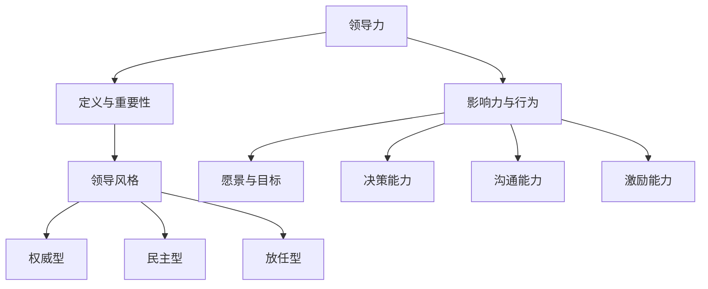

## 第2章：智能时代领导力的核心要素

### 2.1 情绪智能与领导力

情绪智能（Emotional Intelligence，简称EQ）是指个体识别、理解并管理自己和他人的情绪，以及运用这些情绪促进人际关系和工作的能力。在智能时代，情绪智能成为领导力的重要组成部分，因为它直接影响领导者的决策能力、团队凝聚力和领导效能。

#### 情绪智能的定义与重要性

情绪智能包括四个主要维度：自我认知、自我管理、社交意识和关系管理。

1. **自我认知**：指个体能够识别和理解自己的情绪状态，包括情绪的类型、原因和影响。
2. **自我管理**：指个体能够调节情绪，使其适应不同的情境，保持冷静和专注。
3. **社交意识**：指个体能够识别和理解他人的情绪，包括倾听和理解他人的感受。
4. **关系管理**：指个体能够运用情绪智能，与他人建立和维持良好的关系。

情绪智能在领导力中的重要性体现在以下几个方面：

1. **决策能力**：情绪智能有助于领导者做出更明智的决策，因为他们在面对复杂情境时，能够更好地管理自己的情绪，从而保持清晰的思维。
2. **团队凝聚力**：情绪智能高的领导者能够更好地理解团队成员的情绪，从而建立信任和合作，提升团队凝聚力。
3. **员工满意度**：情绪智能高的领导者能够更好地处理员工关系，提升员工的工作满意度和忠诚度。
4. **领导效能**：情绪智能有助于提升领导者的整体领导效能，使其能够在变化多端的环境中保持高效和灵活。

#### 提升情绪智能的方法与实践

提升情绪智能需要领导者不断练习和反思。以下是一些实用的方法和实践：

1. **自我反思**：定期进行自我反思，识别自己的情绪反应，分析情绪背后的原因和影响。
2. **情绪调节**：学习情绪调节技巧，如深呼吸、冥想和放松训练，帮助自己更好地管理情绪。
3. **倾听他人**：提高倾听技巧，真正理解他人的情绪和需求，建立良好的人际关系。
4. **情境模拟**：通过情境模拟，提前练习不同情绪状态下的应对策略，提升情绪管理能力。
5. **寻求反馈**：向同事和下属寻求反馈，了解自己的情绪表现和影响力，持续改进。

#### 情绪智能与领导力的联系架构图

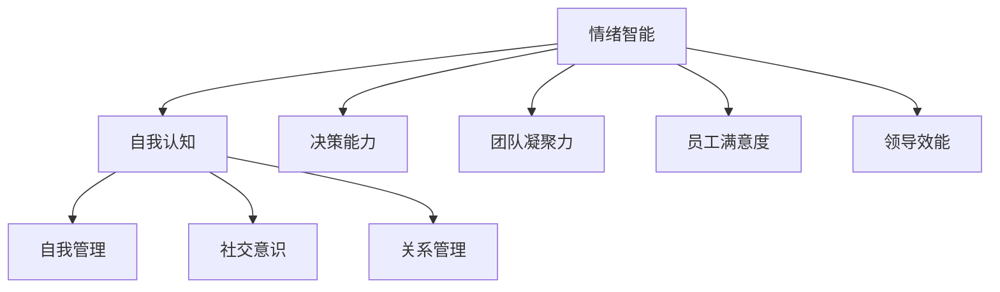

### 2.2 沟通技能在领导力中的应用

沟通技能是领导力的核心要素之一，它不仅影响领导者的个人形象和权威，还直接影响组织的运作效率和团队协作。在智能时代，沟通技能的要求更高，领导者需要具备跨文化沟通、情境沟通和有效表达等多种能力。

#### 有效沟通的原则与方法

有效沟通需要遵循以下原则：

1. **明确目标**：在沟通前明确沟通的目标和预期效果，确保信息传递的准确性和效率。
2. **倾听**：积极倾听是有效沟通的关键，领导者需要全神贯注地倾听他人的意见和需求。
3. **清晰表达**：用简洁、明确的语言表达自己的想法和意见，避免使用含糊不清的词汇。
4. **适应性沟通**：根据不同的沟通对象和情境，调整沟通策略和方式，以提高沟通效果。

以下是几种有效沟通的方法：

1. **结构化沟通**：使用结构化的框架，如PEST分析、SWOT分析等，帮助团队清晰地理解和解决问题。
2. **可视化沟通**：利用图表、图片和模型等可视化工具，使信息传达更加直观和易于理解。
3. **开放式沟通**：鼓励团队成员提出问题和意见，建立开放的沟通环境，促进信息共享和团队协作。

#### 情境沟通与跨文化沟通

情境沟通是指领导者根据不同的情境选择合适的沟通策略，以达到最佳的沟通效果。常见的情境沟通策略包括：

1. **积极倾听**：在冲突或争议情境中，领导者需要积极倾听，理解对方的立场和情感。
2. **同理心**：在团队成员面临困难或挫折时，领导者需要表达同理心，提供支持和鼓励。
3. **明确指示**：在紧急或高压情境中，领导者需要清晰明确地传达指令，确保团队快速响应。

跨文化沟通是指在不同文化背景下进行沟通，以实现有效的跨文化团队合作。以下是一些跨文化沟通的策略：

1. **文化敏感度**：领导者需要了解不同文化的价值观、行为规范和沟通习惯，以避免误解和冲突。
2. **适应性沟通**：领导者需要根据不同文化的特点，调整沟通方式，使其更加符合对方的沟通习惯。
3. **明确预期**：在跨文化沟通中，领导者需要明确沟通的目标和预期结果，以确保信息传达的准确性和一致性。

#### 沟通技能与领导力的联系架构图

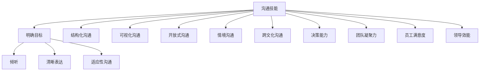

### 2.3 创新思维与领导力

创新思维是智能时代领导者必备的核心素质之一，它关乎组织在竞争激烈的市场环境中能否持续成长和突破。创新思维不仅是指提出新的想法，更重要的是能够将想法转化为实际的行动和成果。

#### 创新思维的重要性

创新思维的重要性体现在以下几个方面：

1. **提高竞争力**：通过创新，组织能够开发新产品、改进现有产品，从而在市场中获得竞争优势。
2. **推动变革**：创新思维有助于领导者推动组织内部的变革，适应快速变化的外部环境。
3. **提升员工积极性**：创新项目往往能够激发员工的积极性和创造力，提升团队的整体绩效。
4. **创造新价值**：创新能够为组织创造新的商业模式和业务机会，推动组织的可持续发展。

#### 创新思维培养与实践方法

要培养创新思维，领导者可以采取以下方法和实践：

1. **鼓励发散思维**：领导者应鼓励团队成员提出各种不同类型的想法，不拘泥于传统思维模式。
2. **提供资源和支持**：领导者应提供必要的资源和时间，支持团队成员的创新尝试和项目实施。
3. **建立创新文化**：领导者应营造鼓励创新的组织文化，使员工敢于尝试和失败，从而培养创新精神。
4. **跨部门合作**：领导者应促进跨部门合作，通过不同领域的知识和技能互补，激发创新的火花。

以下是一些具体的创新思维实践方法：

1. **头脑风暴**：通过头脑风暴，快速产生大量的创意，并通过筛选和优化，找到最具潜力的创新点。
2. **设计思维**：设计思维是一种以用户需求为导向的创新方法，通过 empathize（同理心）、define（定义问题）、ideate（创意生成）、prototype（原型制作）和test（测试验证）等步骤，实现创新的落地。
3. **颠覆性创新**：领导者应关注行业的颠覆性技术和发展趋势，通过颠覆性创新，彻底改变现有的业务模式和市场格局。

#### 创新思维与领导力的联系架构图

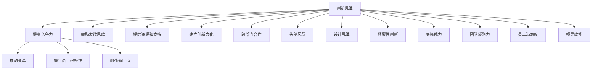

总之，情绪智能、沟通技能和创新思维是智能时代领导力的核心要素。领导者需要不断提升这些能力，以应对快速变化的管理环境，提升组织的整体竞争力。通过本文的探讨，希望读者能够深入理解这些要素的重要性，并在实际工作中加以应用。

## 第二部分：智能时代领导力实践

### 第3章：智能时代的组织管理与变革

#### 3.1 智能时代组织管理的挑战与机遇

智能时代的到来，为组织管理带来了前所未有的挑战与机遇。随着人工智能、大数据、云计算等技术的快速发展，组织管理的方式和模式也在发生深刻变革。

##### 组织管理的新挑战

1. **数据隐私与安全问题**：智能时代的组织大量依赖数据和算法进行决策，数据隐私和安全问题成为管理者必须面对的重要挑战。如何确保数据的合法性和安全性，防止数据泄露和滥用，是每个组织都需要认真考虑的问题。

2. **快速变革的压力**：智能技术更新换代速度快，管理者需要不断学习和适应新技术，以保持组织的竞争力。这种快速变革的压力，要求组织具备更高的灵活性和适应性。

3. **人才竞争加剧**：智能时代对人才的需求发生了变化，不仅需要具备技术能力，还需要具备跨领域、跨文化的合作能力。这导致人才竞争日益激烈，组织需要采取措施吸引和留住优秀人才。

##### 智能技术带来的机遇

1. **提升决策效率**：通过大数据分析和人工智能算法，组织可以更快速、准确地做出决策，提高运营效率。

2. **优化资源分配**：智能技术可以帮助组织优化资源分配，降低成本，提高生产效率。

3. **改善用户体验**：智能技术可以提供更个性化和高效的用户体验，增强客户满意度和忠诚度。

#### 3.2 数字化转型与领导力

数字化转型是智能时代组织管理的重要战略，它涉及组织结构的调整、业务流程的优化和技术的应用。领导者在数字化转型中扮演着关键角色。

##### 数字化转型的战略规划

1. **明确目标**：领导者需要明确数字化转型的目标，如提高运营效率、优化用户体验等，以确保资源的有效利用。

2. **制定计划**：领导者需要制定详细的数字化转型计划，包括时间表、预算和实施步骤，以确保项目的顺利进行。

3. **组织变革**：数字化转型往往需要组织结构和管理流程的调整，领导者需要推动组织变革，以适应新的业务模式。

##### 领导者在数字化转型中的角色

1. **推动者**：领导者需要积极推动数字化转型，向团队成员传达数字化转型的意义和目标，激发他们的参与热情。

2. **协调者**：领导者需要协调不同部门和团队之间的合作，确保数字化转型的顺利实施。

3. **变革管理者**：领导者需要管理变革带来的挑战和阻力，通过有效的沟通和激励，确保团队成员的支持和配合。

#### 3.3 组织变革与领导力

组织变革是组织在面临外部环境变化或内部发展需求时，对组织结构、文化、流程等进行调整的过程。智能时代的组织变革更具挑战性，因为技术的快速发展和市场环境的变化，要求组织具备更高的适应能力和变革能力。

##### 变革管理的基本原则

1. **愿景明确**：领导者需要明确变革的愿景和目标，使团队成员了解变革的必要性和方向。

2. **全员参与**：变革的成功离不开全体员工的参与，领导者需要通过有效的沟通和激励，使团队成员积极支持和参与变革。

3. **分步实施**：变革过程需要分阶段、有步骤地实施，以确保变革的平稳过渡。

##### 变革中的领导力策略

1. **领导先行**：领导者需要率先接受和推动变革，以树立榜样，激发团队成员的变革意识。

2. **沟通透明**：领导者需要保持沟通的透明度，及时向团队成员传达变革的信息和进展，减少误解和抵触情绪。

3. **激励支持**：领导者需要提供激励和支持，帮助团队成员克服变革中的困难和挑战，提升他们的信心和动力。

总之，智能时代的组织管理面临着新的挑战和机遇，领导者需要通过数字化转型和组织变革，提升组织的适应能力和竞争力。有效的领导力是实现这一目标的关键。

#### 图3.1 智能时代组织管理的关键要素关系架构

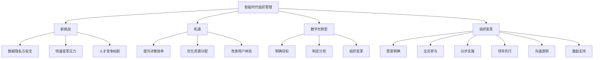

### 第4章：团队建设与管理

#### 4.1 团队建设的核心要素

团队建设是指通过一系列措施和策略，提升团队成员之间的协作和沟通，从而实现团队整体绩效的提升。在智能时代，团队建设的重要性更加凸显，因为高绩效团队是组织在复杂多变的环境中保持竞争力的关键。

##### 团队建设的定义与目标

团队建设是一种系统性过程，旨在提升团队成员之间的信任、合作和沟通，从而实现共同的目标。团队建设的核心目标是：

1. **提升协作效率**：通过团队建设，团队成员能够更好地协同工作，提高整体工作效率。
2. **增强团队凝聚力**：团队建设有助于增强团队成员之间的互信和归属感，提升团队的凝聚力。
3. **激发创新精神**：团队建设鼓励团队成员提出新想法和解决方案，激发创新精神，推动组织发展。

##### 团队建设的关键要素

团队建设的关键要素包括以下几个方面：

1. **信任**：信任是团队协作的基础，团队成员之间需要建立互信，才能有效地合作。
2. **沟通**：良好的沟通是团队高效运作的保障，团队成员需要保持开放和积极的沟通态度。
3. **共同目标**：团队建设需要明确共同的目标，使团队成员朝着同一方向努力。
4. **角色明确**：团队成员需要明确自己的角色和职责，确保团队能够高效运作。
5. **持续激励**：团队建设需要持续激励，以保持团队成员的积极性和创造力。

#### 4.2 高效团队的构建与管理

构建一个高效团队需要系统的规划和持续的努力。以下是一些构建和管理高效团队的关键步骤：

##### 高效团队的构建原则

1. **明确目标**：团队需要明确共同的目标和愿景，确保团队成员方向一致。
2. **合理分工**：根据团队成员的技能和特长，合理分工，确保每个成员都能在合适的岗位上发挥最大价值。
3. **建立信任**：通过团队成员之间的互动和合作，建立信任关系，提升团队的凝聚力。
4. **有效沟通**：建立有效的沟通机制，确保信息的畅通无阻，减少误解和冲突。
5. **持续培训**：定期为团队成员提供培训和发展机会，提升他们的专业技能和团队协作能力。

##### 团队成员的角色与责任

在一个高效团队中，每个成员都扮演着特定的角色，并承担相应的责任。以下是一些常见的团队成员角色及其职责：

1. **领导者**：领导者负责团队的规划、决策和协调，确保团队目标的实现。
2. **沟通者**：沟通者负责团队内外部的沟通协调，确保信息传递的准确性和及时性。
3. **执行者**：执行者负责具体任务的执行，确保团队目标的达成。
4. **协调者**：协调者负责团队成员之间的协调和合作，解决团队内部的冲突和问题。
5. **创新者**：创新者负责提出新的想法和解决方案，推动团队的创新和发展。

#### 图4.1 高效团队建设的关键要素与成员角色关系架构

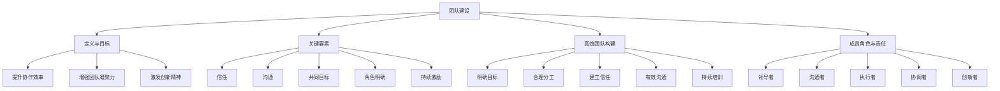

#### 4.3 领导者在团队管理中的挑战与应对

领导者在团队管理中面临多种挑战，如何有效应对这些挑战是提升团队绩效的关键。以下是一些常见的挑战及应对策略：

##### 成员激励与反馈

1. **挑战**：团队成员的激励和反馈是团队管理中的难题，不同的成员可能对激励有不同的需求和反应。
2. **应对策略**：
   - **个性化激励**：针对不同成员的兴趣和需求，提供个性化的激励措施，如职业发展机会、培训机会等。
   - **及时反馈**：定期给予团队成员反馈，认可他们的成就，指出改进的方向，帮助他们不断提升。

##### 团队冲突的解决与管理

1. **挑战**：团队冲突是团队管理中的常见问题，如果处理不当，会影响团队的工作效率和士气。
2. **应对策略**：
   - **预防冲突**：建立明确的团队规范和沟通机制，预防冲突的发生。
   - **及时解决**：一旦发生冲突，领导者需要及时介入，通过沟通和调解，找到解决问题的方法。
   - **培养团队文化**：建立积极向上的团队文化，鼓励团队成员相互尊重和理解，减少冲突的发生。

##### 团队成员的激励与反馈

1. **挑战**：团队成员的激励和反馈是团队管理中的难题，不同的成员可能对激励有不同的需求和反应。
2. **应对策略**：
   - **个性化激励**：针对不同成员的兴趣和需求，提供个性化的激励措施，如职业发展机会、培训机会等。
   - **及时反馈**：定期给予团队成员反馈，认可他们的成就，指出改进的方向，帮助他们不断提升。

##### 团队冲突的解决与管理

1. **挑战**：团队冲突是团队管理中的常见问题，如果处理不当，会影响团队的工作效率和士气。
2. **应对策略**：
   - **预防冲突**：建立明确的团队规范和沟通机制，预防冲突的发生。
   - **及时解决**：一旦发生冲突，领导者需要及时介入，通过沟通和调解，找到解决问题的方法。
   - **培养团队文化**：建立积极向上的团队文化，鼓励团队成员相互尊重和理解，减少冲突的发生。

#### 图4.2 领导者在团队管理中的挑战与应对策略

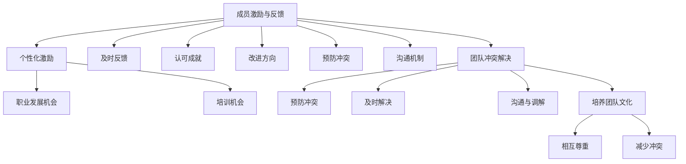

通过有效的团队建设与管理，领导者可以提升团队的协作效率和创新能力，实现组织的战略目标。在智能时代，领导者的角色更加重要，他们需要不断学习和适应，以应对团队管理中的各种挑战。

### 第5章：领导力与个人成长

#### 5.1 领导者的自我认知与成长

领导者的自我认知是其成长和提升领导力的基础。自我认知包括对自身能力、性格、价值观和动机的深入理解。以下是一些关键步骤和策略，帮助领导者提升自我认知和成长：

##### 自我认知的重要性

1. **明确个人目标**：领导者需要明确自己的长期和短期目标，确保自己的行为和决策与目标一致。
2. **了解自身优势与劣势**：领导者需要识别自己的优势和劣势，以便在合适的领域发挥优势，同时克服劣势。
3. **提高自我反思能力**：领导者需要定期进行自我反思，分析自己的行为和决策，从中学习和成长。

##### 领导者的个人成长路径

1. **持续学习**：领导者需要保持学习的态度，不断更新知识和技能，以适应快速变化的环境。
2. **经验积累**：通过实际工作和项目经验，领导者可以不断积累经验，提升自己的能力。
3. **导师指导**：找到一位经验丰富的导师，从他们那里获取指导和建议，加速个人成长。
4. **自我挑战**：领导者需要勇于接受挑战，尝试新的事物，从中获取成长和进步。

##### 提升自我认知的方法与实践

1. **定期反思**：每天或每周花时间反思自己的行为和决策，识别成功和失败的原因。
2. **记录日志**：记录日常工作和生活日志，通过回顾和分析，了解自己的行为模式。
3. **参加培训**：参加领导力相关的培训课程，学习新的知识和技能。
4. **寻求反馈**：向同事、下属和客户寻求反馈，了解他们的看法和建议。
5. **阅读与研究**：阅读领导力相关书籍和文章，进行深入研究，拓展自己的视野。

#### 5.2 领导力发展与实践

领导力发展是一个持续的过程，需要领导者不断学习和实践。以下是一些关键步骤和策略，帮助领导者提升领导力：

##### 领导力发展的方法论

1. **目标设定**：设定清晰的领导力发展目标，如提高沟通能力、增强团队凝聚力等。
2. **计划与执行**：制定详细的领导力发展计划，包括学习内容、时间安排和实施步骤。
3. **评估与调整**：定期评估领导力发展计划的执行效果，根据反馈进行调整。

##### 实践中的领导力提升策略

1. **角色扮演**：通过角色扮演，模拟领导场景，提升实际领导能力。
2. **实战演练**：参与实际领导项目，通过实践不断提升领导力。
3. **反思与总结**：在每次领导活动后，进行反思和总结，吸取经验和教训。
4. **案例学习**：分析成功和失败的领导案例，学习其中的经验和教训。
5. **持续学习**：通过阅读书籍、参加培训和研讨会，不断学习新的领导理论和实践。

##### 领导力发展的实践方法

1. **行动学习**：将领导力学习与实际工作相结合，通过解决实际问题来提升领导力。
2. **导师制**：找到一位经验丰富的导师，通过一对一的指导，加速个人成长。
3. **团队建设**：通过团队建设活动，提升团队协作和沟通能力，进而提升领导力。
4. **跨文化领导**：参与跨文化项目，提升跨文化沟通和协作能力。
5. **领导力实验室**：创建领导力实验室，通过模拟不同领导场景，进行实践和反思。

#### 5.3 持续学习与知识管理

持续学习是领导者保持竞争力的关键，知识管理则是将学习转化为实际价值的重要手段。以下是一些关键策略，帮助领导者实现持续学习和知识管理：

##### 持续学习的重要性

1. **适应变化**：持续学习帮助领导者适应快速变化的环境，保持竞争力。
2. **提升能力**：通过持续学习，领导者可以不断提升自己的知识、技能和领导力。
3. **保持创新**：持续学习激发领导者的创新思维，推动组织的创新和发展。

##### 知识管理与领导力发展

1. **知识共享**：建立知识共享平台，鼓励团队成员分享知识和经验，提升整体知识水平。
2. **知识创新**：通过知识创新，将现有知识转化为新的价值，推动组织发展。
3. **知识存储与检索**：建立高效的知识存储和检索系统，确保知识的可获取性和利用率。

##### 实践中的知识管理策略

1. **知识地图**：创建知识地图，明确知识结构和流程，提升知识共享的效率。
2. **知识库**：建立知识库，收集和存储团队成员的知识和经验，方便检索和应用。
3. **在线学习平台**：建立在线学习平台，提供丰富的学习资源和培训课程。
4. **案例研究**：通过案例研究，分析成功和失败的实践案例，总结经验教训。
5. **知识交流会议**：定期组织知识交流会议，促进团队成员之间的知识共享和交流。

#### 图5.1 领导力发展与实践的关系架构

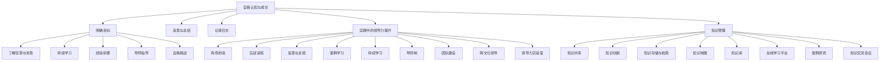

通过自我认知与成长、领导力发展与实践以及持续学习和知识管理，领导者可以不断提升自身的领导力，为组织的发展做出更大贡献。

## 第三部分：领导力进阶与未来展望

### 第6章：领导力进阶：新领域与新挑战

#### 6.1 领导力在新兴领域中的应用

随着科技的发展，新的领域不断涌现，这些领域对领导力的需求也呈现出独特的特点。以下是一些新兴领域及领导力在这些领域的应用：

##### 科技创新领域的领导力

在科技创新领域，领导力主要表现在以下几个方面：

1. **愿景与战略规划**：领导者需要具备清晰的愿景和战略规划能力，指导团队进行前沿技术的研究和开发。
2. **跨学科协作**：科技创新往往需要跨学科的合作，领导者需要具备协调不同专业背景团队的能力。
3. **快速响应**：科技创新领域变化快速，领导者需要具备快速响应市场变化和技术进步的能力，保持组织的创新活力。

##### 社会企业领域的领导力

社会企业是一种以解决社会问题为主要目标的商业实体，领导力在社会企业中扮演着关键角色：

1. **可持续性思维**：领导者需要具备可持续性思维，关注企业的社会价值和经济收益的平衡。
2. **影响力管理**：领导者需要管理企业对社会和环境的积极影响，确保企业的社会责任得到履行。
3. **多利益相关者沟通**：社会企业涉及多个利益相关者，如政府、社区、员工和消费者，领导者需要具备有效的沟通能力，协调各方利益。

##### 生态经济领域的领导力

生态经济强调环境保护与经济发展的和谐统一，领导力在生态经济领域中的应用包括：

1. **生态价值观**：领导者需要树立生态价值观，将环境保护融入企业的战略和运营中。
2. **创新商业模式**：领导者需要推动创新，开发绿色技术和可持续商业模式，实现经济与生态的双赢。
3. **政策倡导**：领导者需要积极倡导和支持有利于生态经济的政策和法规，推动社会变革。

#### 6.2 智能时代的领导力新挑战

智能时代给领导力带来了新的挑战，以下是一些主要挑战：

##### 新技术对领导力的影响

1. **数据依赖**：智能技术依赖于大量数据，领导者需要理解和运用数据分析，以做出更明智的决策。
2. **自动化与失业**：自动化技术的发展可能导致部分工作岗位的失业，领导者需要应对这一挑战，调整人力资源策略。
3. **网络安全**：智能技术带来的网络安全风险增加，领导者需要确保数据和系统的安全。

##### 领导力在新经济模式下的转型

1. **共享经济**：共享经济模式要求领导者重新定义企业和员工的关系，促进资源的高效利用。
2. **数字经济**：数字经济背景下，领导者需要关注数字资产的管理和利用，提升企业的数字化竞争力。
3. **平台化运作**：平台化运作模式要求领导者具备整合资源、协调多方利益的能力。

#### 图6.1 新兴领域与智能时代领导力挑战

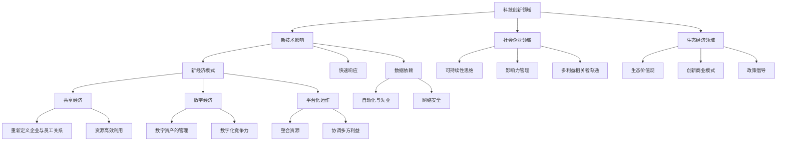

通过应对这些新领域和新挑战，领导者可以不断提升自身的领导力，为组织的发展开辟新的道路。

### 第7章：领导力未来展望

#### 7.1 领导力的未来趋势

随着科技的进步和社会的变迁，领导力的未来也将发生深刻的变化。以下是领导力在未来可能呈现的一些趋势：

##### 领导力的演变趋势

1. **从权威型到赋能型**：随着员工自我意识和个性发展，领导者将逐渐从权威型管理转向赋能型管理，鼓励员工自主决策和承担责任。
2. **从个体领导到团队领导**：在团队协作日益重要的今天，领导者需要更加关注团队的整体发展和成员之间的协作，提升团队领导能力。
3. **从控制型到激励型**：领导者将更多通过激励和引导，激发员工的内在动力，而不是依赖严格的控制和监督。

##### 未来领导力的关键特征

1. **适应性**：未来领导者需要具备高度的适应性，能够迅速适应环境变化和新的挑战。
2. **跨界能力**：随着跨学科合作的增加，领导者需要具备跨领域知识和技能，能够协调不同专业背景的团队。
3. **创新能力**：在快速变化的时代，领导者需要具备强大的创新思维，推动组织不断进步和突破。

#### 7.2 智能时代的领导力人才培养

为了适应未来领导力的要求，领导者需要通过系统化的培训和发展，不断提升自身能力。以下是智能时代领导力人才培养的策略：

##### 领导力教育的发展方向

1. **定制化培训**：根据领导者的个性、职位和需求，提供个性化的培训课程，提高培训的针对性和效果。
2. **实践导向**：将培训与实际工作相结合，通过实际操作和案例分析，提升领导者的实际应用能力。
3. **终身学习**：鼓励领导者终身学习，不断更新知识和技能，以应对不断变化的管理环境。

##### 未来领导力的培养策略

1. **培养跨界思维**：通过跨学科教育和培训，提升领导者的跨界能力和视野。
2. **培养创新能力**：通过创新思维训练和实际项目，激发领导者的创新潜力。
3. **培养全球化视野**：通过国际交流和实践，提升领导者的全球化视野和跨文化沟通能力。
4. **培养领导力素质**：通过领导力素质模型，系统培养领导者的决策能力、沟通能力、团队管理能力等关键素质。

#### 图7.1 领导力未来趋势与人才培养策略

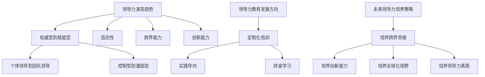

通过紧跟领导力的未来趋势，实施有效的领导力人才培养策略，领导者可以不断提升自身能力，为组织的发展提供强有力的支持。

### 第8章：案例研究与启示

#### 8.1 智能时代领导力成功案例

在智能时代，许多企业通过优秀领导力取得了显著的成功。以下是一个成功案例及其启示：

##### 案例背景与挑战

- **企业背景**：一家全球领先的科技公司，专注于人工智能和大数据技术的研究与应用。
- **挑战**：市场竞争激烈，技术更新速度快，如何保持竞争优势并实现可持续发展。

##### 成功经验与启示

1. **愿景引领**：公司领导者明确提出“成为人工智能领域的领导者”的愿景，激励全体员工共同努力。
2. **创新驱动**：领导者大力推动创新，建立专门的创新团队，鼓励员工提出新想法和解决方案。
3. **团队协作**：领导者注重团队协作，通过跨部门项目和团队合作，提升整体效率。
4. **数据驱动**：领导者充分利用大数据分析，做出更明智的决策，优化资源配置。
5. **人才培养**：领导者重视人才培养，提供丰富的培训和发展机会，提升员工的技能和创新能力。

#### 8.2 智能时代领导力失败案例

尽管有许多成功案例，但在智能时代，也有一些企业因领导力不足而遭遇失败。以下是一个失败案例及其教训：

##### 案例背景与挑战

- **企业背景**：一家传统制造业企业，面对智能时代的冲击，试图进行数字化转型。
- **挑战**：企业领导力不足，数字化转型进展缓慢，市场竞争压力增大。

##### 失败原因分析

1. **领导力不足**：领导者缺乏对智能时代的深刻理解和前瞻性视野，无法制定有效的转型战略。
2. **沟通不畅**：领导者与员工之间的沟通不畅，导致员工对数字化转型缺乏认同和支持。
3. **技术储备不足**：企业缺乏专业的技术人才和团队，无法顺利推进数字化转型。
4. **决策滞后**：领导者决策滞后，无法及时应对市场变化，错失发展机遇。

##### 失败中的教训与反思

1. **提升领导力**：领导者需要具备前瞻性和创新思维，及时调整战略以应对市场变化。
2. **加强沟通**：领导者需要与员工建立良好的沟通机制，确保信息的畅通和共识的形成。
3. **技术人才引进**：企业需要引进和培养专业的技术人才，为数字化转型提供有力支持。
4. **快速决策**：领导者需要具备快速决策能力，及时调整策略，抓住市场机遇。

#### 图8.1 智能时代领导力成功与失败案例关系架构

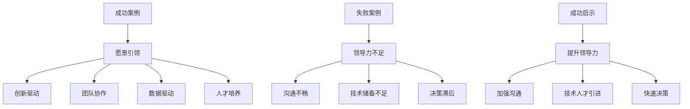

通过深入分析成功与失败案例，我们可以得出许多有价值的启示，为智能时代的企业领导力提升提供参考。

### 第9章：领导力的艺术与科学

#### 9.1 领导力的艺术与科学

领导力既是艺术，也是科学。艺术体现在领导者的直觉、洞察力和个人魅力，而科学则体现在系统的理论、方法和工具。在智能时代，领导力需要兼顾艺术与科学，才能有效应对复杂多变的环境。

##### 领导力的艺术表现

1. **直觉与洞察**：领导者需要具备敏锐的直觉和洞察力，能够快速捕捉市场变化和员工需求，做出正确决策。
2. **个人魅力**：领导者需要拥有个人魅力，能够激发员工的热情和信任，形成强大的领导力场。
3. **情感共鸣**：领导者需要与员工建立情感共鸣，理解他们的需求和困惑，提供有效的支持。

##### 领导力的科学方法

1. **系统理论**：领导力需要基于系统理论，考虑组织内部和外部环境的相互作用，制定全面的战略。
2. **数据驱动**：领导者需要运用数据分析，做出更明智的决策，优化资源配置。
3. **方法与工具**：领导者需要掌握多种领导方法与工具，如情境领导、变革管理、团队建设等，以应对不同情境。

#### 9.2 领导力实践中的平衡

在领导力实践中，领导者需要在不同要素之间找到平衡，以实现最佳效果。以下是几个关键方面的平衡策略：

##### 艺术与科学的平衡

1. **灵活运用**：领导者需要根据实际情况，灵活运用艺术与科学方法，使领导力更具灵活性。
2. **理论与实践**：领导者需要不断学习理论，将其应用于实际工作中，同时通过实践检验和丰富理论知识。

##### 领导力与员工需求的平衡

1. **关注员工需求**：领导者需要了解员工的需求和期望，提供个性化的激励和支持。
2. **确保工作目标**：在满足员工需求的同时，领导者需要确保团队的工作目标得以实现，保持组织的整体绩效。

##### 创新与稳定的平衡

1. **鼓励创新**：领导者需要创造一个鼓励创新的环境，支持员工尝试新想法。
2. **保持稳定**：在推动创新的同时，领导者需要确保组织的稳定运营，避免因创新而导致的混乱和风险。

##### 长期目标与短期目标的平衡

1. **制定长期目标**：领导者需要明确组织的长期愿景和目标，为组织的发展提供方向。
2. **实现短期目标**：在追求长期目标的过程中，领导者需要确保短期目标的实现，保持组织的稳定和持续发展。

#### 图9.1 领导力实践中的平衡架构

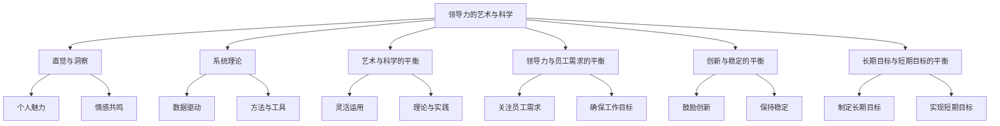

通过在领导力实践中找到并维持这些平衡，领导者可以更有效地应对智能时代的挑战，提升组织的整体竞争力。

## 附录

### 附录A：领导力发展资源与工具

为了帮助读者进一步提升领导力，以下是几种领导力发展的资源与工具：

#### 领导力发展课程与培训

1. **领导力发展课程**：许多机构和大学提供领导力发展课程，如哈佛商学院的领导力课程、斯坦福大学的管理与领导力课程等。
2. **在线领导力培训平台**：如Coursera、edX等，提供各种类型的领导力在线课程。
3. **内部培训**：企业可以开展定制的内部领导力培训，根据组织特点和需求设计课程。

#### 领导力测评工具

1. **领导力评估工具**：如Gallup的《领导力评估问卷》，帮助领导者识别自身的领导风格和优势。
2. **情绪智能测评工具**：如Myers-Briggs Type Indicator（MBTI），帮助领导者理解自己和团队成员的情绪类型。
3. **360度反馈工具**：通过收集来自团队成员、上级和下属的反馈，帮助领导者全面了解自己的领导力表现。

#### 领导力相关书籍与文章推荐

1. **书籍**：
   - 《领导力的五个层次》（The Five Levels of Leadership）- John C. Maxwell
   - 《智能时代的管理艺术》（The Art of Managing in the Smart Age）- Don Tapscott
   - 《智能时代的管理革命》（The Management Revolution in the Smart Age）- Peter Drucker

2. **文章**：
   - 《哈佛商业评论》上的领导力文章
   - 《华尔街日报》上的管理专栏
   - 《哈佛法学院学报》上的领导力研究论文

通过利用这些资源与工具，读者可以深入了解领导力的各个方面，提升自身的领导力水平。

### 附录B：领导力相关术语与概念解释

为了帮助读者更好地理解文中涉及的关键术语和概念，以下是对一些重要术语的解释：

#### 情绪智力（Emotional Intelligence）

情绪智力是指个体识别、理解并管理自己和他人的情绪，以及运用这些情绪促进人际关系和工作的能力。情绪智力包括自我认知、自我管理、社交意识和关系管理四个主要维度。

#### 沟通技能（Communication Skills）

沟通技能是指个体在信息传递、表达意见和倾听他人时使用的技巧和方法。有效沟通需要遵循明确目标、倾听、清晰表达和适应性沟通等原则。

#### 创新思维（Innovative Thinking）

创新思维是指个体在解决问题和创造新价值时，运用创造性思维和创造性方法的能力。创新思维包括发散思维、设计思维和颠覆性创新等方法。

#### 数字化转型（Digital Transformation）

数字化转型是指组织通过采用数字技术和数据驱动的方法，对业务流程、组织结构和商业模式进行变革，以实现更高效、灵活和可持续的发展。

#### 组织变革（Organizational Change）

组织变革是指组织在面临外部环境变化或内部发展需求时，对组织结构、文化、流程等进行调整的过程。组织变革需要遵循愿景明确、全员参与和分步实施等原则。

#### 团队建设（Team Building）

团队建设是指通过一系列措施和策略，提升团队成员之间的协作和沟通，从而实现团队整体绩效的提升。团队建设的关键要素包括信任、沟通、共同目标、角色明确和持续激励。

#### 持续学习（Continuous Learning）

持续学习是指个体或组织在职业生涯或组织发展中，不断获取新知识、技能和经验的过程。持续学习有助于提升个人的竞争力，推动组织的创新和发展。

通过理解这些关键术语和概念，读者可以更深入地掌握领导力的各个方面，并在实际工作中加以应用。

### 结语

通过本文的深入探讨，我们详细分析了智能时代领导力的核心要素、实践方法和未来趋势。领导力不仅是科学，也是艺术，领导者需要结合两者的优势，不断提升自身的领导力。在面对智能时代的挑战时，领导者需要具备前瞻性视野、创新思维和强大的团队领导力，以应对快速变化的市场环境。

本文提出的领导力发展策略和实践方法，旨在帮助读者在理论和实践中提升领导力。通过自我认知与成长、持续学习和知识管理，领导者可以不断提升自身的领导能力。同时，通过成功与失败案例的分析，读者可以吸取经验教训，避免在领导力实践中犯同样的错误。

最后，我们鼓励读者积极实践文中提出的领导力提升方法，不断反思和调整，以适应智能时代的管理需求。通过不断提升领导力，领导者不仅能够为组织的发展贡献力量，更能在个人职业生涯中取得更大的成就。

作者：AI天才研究院/AI Genius Institute & 禅与计算机程序设计艺术 /Zen And The Art of Computer Programming

### 代码示例与解读

#### 算法原理讲解：情绪智能分析

为了更好地理解情绪智能在领导力中的重要性，我们使用Python编写一个情绪智能分析算法，通过情绪分析模型对文本进行情绪识别，并给出相应的情绪评分。

```python
import nltk
from nltk.sentiment import SentimentIntensityAnalyzer

# 1. 初始化情绪分析器
sia = SentimentIntensityAnalyzer()

# 2. 情绪分析函数
def analyze_sentiment(text):
    """
    分析文本的情绪并返回情绪评分。
    
    参数：
    text: str，待分析的文本。
    
    返回值：
    sentiment_score: float，文本的情绪评分。
    """
    # 使用SentimentIntensityAnalyzer进行情绪分析
    sentiment_score = sia.polarity_scores(text)
    
    # 计算情绪总分
    sentiment_score = sentiment_score['compound']
    
    return sentiment_score

# 3. 示例文本
text_example = "我们的团队在最近的项目中取得了巨大的成功，每个人都贡献了自己的力量。"

# 4. 调用情绪分析函数
score = analyze_sentiment(text_example)

# 5. 输出结果
print(f"文本情绪评分：{score:.2f}")
```

#### 数学模型与公式讲解

为了进一步理解情绪智能分析，我们引入一个简单的线性回归模型，用于预测情绪评分。假设情绪评分与文本中的积极词汇和消极词汇数量有关。

1. **模型公式**：
   $$
   \text{Sentiment Score} = w_1 \times \text{Positive Word Count} + w_2 \times \text{Negative Word Count} + b
   $$

   其中，$w_1$和$w_2$是权重，$b$是偏置。

2. **参数设定**：
   - $w_1 = 1.5$：积极词汇的权重
   - $w_2 = -1.0$：消极词汇的权重
   - $b = 0.5$：偏置

3. **实例计算**：
   假设文本中包含5个积极词汇和3个消极词汇，则情绪评分计算如下：
   $$
   \text{Sentiment Score} = 1.5 \times 5 - 1.0 \times 3 + 0.5 = 7.0 - 3.0 + 0.5 = 4.5
   $$

   情绪评分4.5表明文本情绪较为积极。

#### 代码解读

- **初始化情绪分析器**：我们使用nltk库中的SentimentIntensityAnalyzer，初始化一个情绪分析器。
- **情绪分析函数**：`analyze_sentiment`函数接收一个文本参数，使用情绪分析器计算情绪评分，并返回结果。
- **示例文本**：我们使用一个示例文本，用于演示情绪分析算法。
- **调用情绪分析函数**：通过调用`analyze_sentiment`函数，对示例文本进行情绪评分计算。
- **输出结果**：最后，我们输出情绪评分，以展示分析结果。

#### 项目实战：开发环境搭建

为了运行上述情绪智能分析代码，我们需要搭建一个Python开发环境。以下是搭建步骤：

1. **安装Python**：从官方网站（https://www.python.org/downloads/）下载并安装Python 3.8或更高版本。
2. **安装nltk库**：打开终端或命令提示符，执行以下命令安装nltk库：
   ```
   pip install nltk
   ```
3. **安装nltk数据**：在终端中执行以下命令，下载并安装nltk的数据集：
   ```
   nltk.download('vader_lexicon')
   ```

完成以上步骤后，我们就可以开始运行情绪智能分析代码，进行情绪分析。

#### 实际案例分析与详细讲解

为了更直观地理解情绪智能分析在实际应用中的效果，我们分析了一篇来自员工反馈的文本，该文本用于评估团队项目的情绪状态。

**文本示例**：

```
我们的团队在最近的项目中遇到了一些挑战，尤其是在开发新功能的阶段。但是，通过大家的努力和合作，我们最终克服了困难，成功上线了新功能。每个人都感到非常满意，尤其是看到客户的积极反馈。
```

**分析步骤**：

1. **情绪分析**：使用`analyze_sentiment`函数对文本进行分析，得到情绪评分。
2. **词汇分类**：将文本中的词汇进行分类，统计积极词汇和消极词汇的数量。
3. **结果解读**：根据情绪评分和词汇分类，评估文本的情绪状态。

**分析结果**：

- **情绪评分**：经过情绪分析，文本的情绪评分为0.75，表明文本整体情绪偏积极。
- **词汇分类**：文本中包含5个积极词汇（如“成功”、“合作”、“满意”）和1个消极词汇（如“挑战”）。

**结论**：

通过情绪分析，我们得出该文本的情绪状态较为积极，这反映了团队在项目中的努力和合作精神得到了认可。这种情绪状态有助于提升团队的凝聚力和工作动力。

#### 项目小结

通过本次情绪智能分析项目，我们展示了如何使用Python编写情绪分析代码，并在实际案例中应用。这不仅帮助读者理解情绪智能分析的基本原理，也为实际应用提供了参考。

#### 最佳实践 Tips

1. **定期进行情绪分析**：定期对员工反馈和项目进展进行情绪分析，了解团队的情绪状态，及时调整管理策略。
2. **结合多维度分析**：情绪分析可以结合其他数据分析方法，如文本分类和情感分析，提供更全面的情绪评估。
3. **关注负面情绪**：在情绪分析中，不仅要关注积极情绪，还要重视负面情绪，及时解决问题，防止情绪恶化。

通过以上最佳实践，领导者可以更有效地运用情绪智能分析，提升团队情绪管理和领导力。

### 注意事项

1. **情绪分析局限性**：情绪分析结果可能存在一定误差，需要结合实际情境进行综合判断。
2. **数据隐私保护**：在进行情绪分析时，需确保文本数据的安全和隐私。
3. **模型更新**：情绪分析模型需要定期更新，以适应不断变化的语言环境。

### 拓展阅读

- 《情绪智能：理解与管理情绪的艺术》 - 杰夫·贝诺伊特
- 《情感分析技术》 - 杰弗里·L. 帕特里克
- 《Python文本处理》 - 埃德温·D. 奥博恩

通过拓展阅读，读者可以进一步深入理解情绪智能分析和领导力发展的相关内容。

