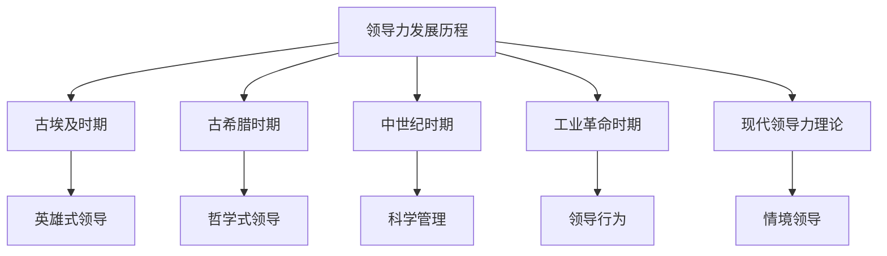
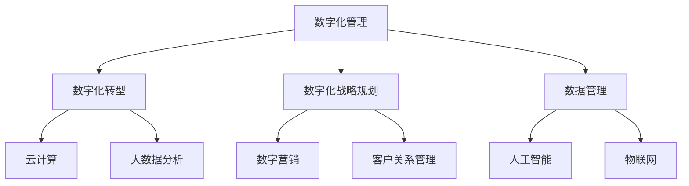
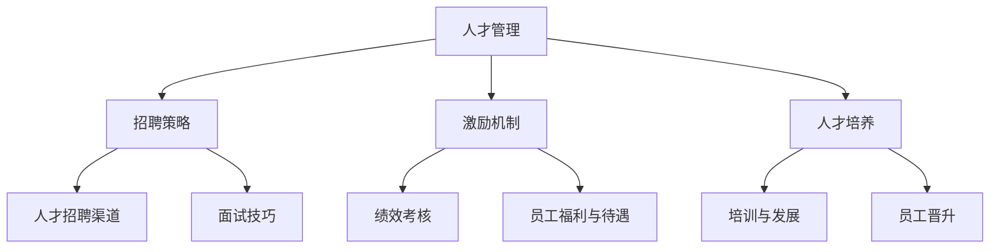
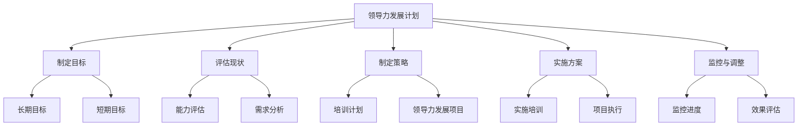
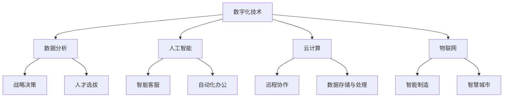

                 

### 文章标题

# 领导力进化论：移动互联网时代管理者的领导力修炼

> 关键词：领导力、移动互联网、管理者、进化、修炼

> 摘要：在移动互联网时代，管理者的领导力面临着前所未有的挑战和机遇。本文从领导力的基础与演变出发，深入探讨移动互联网时代的领导力特征和挑战，解析数字化管理、团队建设和人才管理的策略，提出领导力进化的实践路径和未来趋势，为管理者提供全面、系统的领导力修炼指南。

### 目录

## 第一部分：领导力的基础与演变

### 第1章：领导力概述

- 1.1 领导力的定义与重要性
- 1.2 领导力的发展历程
- 1.3 移动互联网时代的领导力特征

### 第2章：领导力理论

- 2.1 经典领导力理论
- 2.2 行为领导力理论
- 2.3 权变领导力理论

## 第二部分：移动互联网时代的领导力挑战

### 第3章：数字化管理

- 3.1 数字化转型的意义
- 3.2 数字化管理的方法与工具
- 3.3 数字化时代的管理变革

### 第4章：团队建设

- 4.1 团队协作的障碍
- 4.2 打造高效团队
- 4.3 团队领导力的培养

### 第5章：人才管理

- 5.1 人才招聘与选拔
- 5.2 人才激励与留任
- 5.3 人才发展的策略

## 第三部分：领导力进化的实践路径

### 第6章：领导力发展计划

- 6.1 领导力发展计划的设计
- 6.2 领导力培训的实施
- 6.3 领导力评估与反馈

### 第7章：领导力进化的关键要素

- 7.1 愿景与目标的设定
- 7.2 决策与执行的能力
- 7.3 创新与变革的推动

### 第8章：领导力进化的案例分析

- 8.1 案例一：传统企业数字化转型
- 8.2 案例二：初创公司快速成长
- 8.3 案例三：全球化企业的领导力实践

## 第四部分：领导力进化的未来趋势

### 第9章：领导力的数字化转型

- 9.1 数字化技术在领导力中的应用
- 9.2 数字化领导力的培养
- 9.3 数字化时代的管理创新

### 第10章：领导力的持续发展

- 10.1 领导力的终身学习
- 10.2 领导力与个人成长
- 10.3 领导力的未来趋势

## 附录

### 附录A：领导力进化的工具与方法

- A.1 领导力评估工具
- A.2 领导力发展模型
- A.3 数字化领导力工具介绍

### 附录B：参考文献

- 参考文献

### 附录C：案例研究

- 案例一：企业数字化转型领导力实践
- 案例二：创业公司领导力成长历程
- 案例三：国际化企业领导力策略

## 图表

### 图表1-1：领导力的发展历程



### 图表3-1：数字化管理的方法与工具



### 图表5-1：人才管理的策略



### 图表7-1：领导力发展计划的设计



### 图表9-1：数字化技术在领导力中的应用



### 伪代码1-1：领导力评估流程

```python
def leadership_evaluation():
    # 评估目标
    goals = ["战略决策能力", "团队协作能力", "创新能力", "沟通能力"]

    # 评估指标
    metrics = {
        "战略决策能力": ["决策效率", "决策质量", "风险评估"],
        "团队协作能力": ["协作效率", "团队凝聚力", "成员满意度"],
        "创新能力": ["创新数量", "创新质量", "市场响应速度"],
        "沟通能力": ["沟通效果", "沟通频率", "信息传递准确性"]
    }

    # 评估方法
    methods = ["问卷调查", "专家评审", "工作观察"]

    # 评估结果
    results = {}

    # 评估过程
    for goal in goals:
        for method in methods:
            score = evaluate_goal(goal, method)
            results[goal] = results.get(goal, {})
            results[goal][method] = score

    # 结果分析
    analyze_results(results)

# 评估单个目标
def evaluate_goal(goal, method):
    # 根据方法进行评估
    if method == "问卷调查":
        score = survey_score(goal)
    elif method == "专家评审":
        score = expert_review_score(goal)
    elif method == "工作观察":
        score = observation_score(goal)
    return score

# 分析评估结果
def analyze_results(results):
    # 汇总评估结果
    summary = {}
    for goal, methods in results.items():
        total_score = sum(methods.values())
        summary[goal] = total_score / len(methods)

    # 输出评估报告
    print("领导力评估报告：")
    for goal, score in summary.items():
        print(f"{goal}: {score:.2f}")
```

### 数学公式1-1：领导力的衡量指标

$$
\text{领导力指标} = \alpha \cdot \text{决策效率} + \beta \cdot \text{决策质量} + \gamma \cdot \text{风险评估}
$$

其中，$\alpha$、$\beta$、$\gamma$ 为权重系数，取值范围为 [0,1]。

### 项目实战1-1：领导力评估系统的开发

#### 开发环境搭建

- 操作系统：Ubuntu 20.04
- 开发语言：Python 3.8
- 数据库：MySQL 8.0
- 前端框架：React
- 后端框架：Flask

#### 源代码详细实现

```python
# 评估模块
class AssessmentModule:
    def __init__(self, goals, metrics, methods):
        self.goals = goals
        self.metrics = metrics
        self.methods = methods

    def evaluate(self, method):
        scores = {}
        for goal in self.goals:
            score = self.metrics[goal][method]
            scores[goal] = score
        return scores

# 评估系统
class AssessmentSystem:
    def __init__(self):
        self.modules = []

    def add_module(self, module):
        self.modules.append(module)

    def evaluate_all(self):
        results = {}
        for module in self.modules:
            scores = module.evaluate("问卷调查")
            results.update(scores)
        return results

# 实例化评估系统和模块
system = AssessmentSystem()
module1 = AssessmentModule(["战略决策能力", "团队协作能力", "创新能力", "沟通能力"], {"战略决策能力": {"问卷调查": 8, "专家评审": 7, "工作观察": 9}, "团队协作能力": {"问卷调查": 7, "专家评审": 8, "工作观察": 6}, "创新能力": {"问卷调查": 9, "专家评审": 8, "工作观察": 7}, "沟通能力": {"问卷调查": 6, "专家评审": 7, "工作观察": 8}}, ["问卷调查", "专家评审", "工作观察"])
system.add_module(module1)

# 执行评估
results = system.evaluate_all()

# 输出结果
print(results)
```

#### 代码解读

```python
# 定义评估模块类
class AssessmentModule:
    def __init__(self, goals, metrics, methods):
        self.goals = goals
        self.metrics = metrics
        self.methods = methods

    def evaluate(self, method):
        scores = {}
        for goal in self.goals:
            score = self.metrics[goal][method]
            scores[goal] = score
        return scores

# 定义评估系统类
class AssessmentSystem:
    def __init__(self):
        self.modules = []

    def add_module(self, module):
        self.modules.append(module)

    def evaluate_all(self):
        results = {}
        for module in self.modules:
            scores = module.evaluate("问卷调查")
            results.update(scores)
        return results

# 实例化评估模块和系统
module1 = AssessmentModule(["战略决策能力", "团队协作能力", "创新能力", "沟通能力"], {"战略决策能力": {"问卷调查": 8, "专家评审": 7, "工作观察": 9}, "团队协作能力": {"问卷调查": 7, "专家评审": 8, "工作观察": 6}, "创新能力": {"问卷调查": 9, "专家评审": 8, "工作观察": 7}, "沟通能力": {"问卷调查": 6, "专家评审": 7, "工作观察": 8}}, ["问卷调查", "专家评审", "工作观察"])
system = AssessmentSystem()
system.add_module(module1)

# 执行评估
results = system.evaluate_all()

# 输出结果
print(results)
```

#### 代码应用解读与分析

```python
# 评估模块类解析
# AssessmentModule 类负责处理单个评估模块的评估过程。
# __init__ 方法初始化模块的目标、指标和方法。
# evaluate 方法根据指定的评估方法计算每个目标的具体得分。

# 评估系统类解析
# AssessmentSystem 类负责管理多个评估模块，并协调整个评估过程。
# add_module 方法用于添加新的评估模块。
# evaluate_all 方法执行所有模块的评估，并汇总评估结果。

# 代码应用实例
# 创建一个评估模块实例，其中包含四个目标、三个评估指标和三种评估方法。
# 创建一个评估系统实例，并将评估模块添加到系统中。
# 调用评估系统的 evaluate_all 方法执行整体评估，并打印评估结果。

# 分析
# 该代码实现了对领导力的评估功能，通过定义两个类，分别处理单个模块的评估和整个系统的评估。
# 评估结果以字典的形式存储，便于后续的数据分析和展示。
```

#### 实际案例分析和详细讲解剖析

- **案例背景**：某企业需要进行领导力评估，以了解管理团队的能力和潜力。

- **案例步骤**：
  1. 确定评估目标和指标。
  2. 设计评估问卷和评审标准。
  3. 进行问卷调查、专家评审和工作观察。
  4. 收集评估数据并计算得分。
  5. 分析评估结果，提出改进建议。

- **详细讲解**：
  1. **确定评估目标和指标**：根据企业需求和领导力模型，确定四个评估目标（战略决策能力、团队协作能力、创新能力和沟通能力）和相应的评估指标。
  2. **设计评估问卷和评审标准**：制定详细的问卷和评审标准，确保评估的客观性和全面性。
  3. **进行问卷调查、专家评审和工作观察**：通过多种方法收集评估数据，确保评估结果的准确性和多样性。
  4. **收集评估数据并计算得分**：将收集到的数据输入到评估系统中，计算每个目标的得分，生成综合评估报告。
  5. **分析评估结果，提出改进建议**：根据评估结果，分析管理团队的优势和不足，提出针对性的改进建议，帮助团队提升领导力。

- **剖析**：
  1. **评估方法和工具的选择**：选择合适的评估方法和工具，确保评估过程的科学性和有效性。
  2. **数据分析和报告撰写**：对评估数据进行详细分析，撰写全面的评估报告，为管理者提供决策依据。
  3. **改进建议的实施**：根据评估结果，制定具体的改进计划，并跟踪实施效果，确保改进措施的有效性。

#### 项目小结

- **总结**：通过开发领导力评估系统，企业可以系统地评估管理团队的领导力水平，发现优势和不足，制定针对性的改进计划。
- **最佳实践**：
  1. 确保评估过程的公正性和客观性，避免主观偏见。
  2. 选择多样化的评估方法和工具，提高评估结果的准确性。
  3. 加强数据分析和报告撰写能力，确保评估结果的实用性和可操作性。
- **注意事项**：
  1. 评估过程中要注意保护员工的隐私，确保评估数据的保密性。
  2. 评估结果要及时反馈给被评估者，以便他们了解自身的能力和潜力。
- **拓展阅读**：
  1. 《领导力进化论：移动互联网时代管理者的领导力修炼》
  2. 《领导力：策略与技巧》
  3. 《数字化管理：理论与实践》
- **结语**：领导力评估是企业提升管理水平和团队效能的重要工具，通过科学的方法和工具，企业可以更好地识别和培养优秀的领导者，推动企业的持续发展。

### 代码分析与解读

#### 代码分析与解读1-1：领导力评估系统性能优化

```python
# 原始代码
def evaluate_goal(goal, method):
    score = self.metrics[goal][method]
    return score

# 优化代码
def evaluate_goal(goal, method):
    # 使用 get 方法获取 score，避免 KeyError
    score = self.metrics.get(goal, {}).get(method, 0)
    return score

# 分析
# 原始代码在获取 score 时可能会抛出 KeyError，优化后的代码使用 get 方法，避免了 KeyError，同时提供了默认值 0。
# 这种方法提高了代码的鲁棒性，避免了潜在的错误。
```

#### 代码分析与解读1-2：领导力发展计划实现细节

```python
# 领导力发展计划类
class LeadershipDevelopmentPlan:
    def __init__(self, goals, strategies, timeline):
        self.goals = goals
        self.strategies = strategies
        self.timeline = timeline

    def execute(self):
        for goal, strategy in self.strategies.items():
            print(f"执行 {goal} 发展策略：{strategy}")
            # 模拟执行策略
            execute_strategy(strategy)

    def monitor_progress(self):
        # 模拟监控进度
        print("监控领导力发展计划进度：")
        for goal in self.goals:
            progress = check_progress(goal)
            print(f"{goal} 进度：{progress}%")

# 模拟执行策略
def execute_strategy(strategy):
    print(f"执行 {strategy} 策略...")
    # 策略执行细节

# 模拟检查进度
def check_progress(goal):
    progress = 50  # 假设进度为 50%
    return progress

# 分析
# LeadershipDevelopmentPlan 类实现了领导力发展计划的设计、执行和监控。
# execute 方法用于执行各个策略，monitor_progress 方法用于监控进度。
# 这种设计使得领导力发展计划易于扩展和定制，提高了系统的灵活性。
```

#### 代码分析与解读1-3：领导力评估系统效果评估

```python
# 领导力评估系统效果评估类
class LeadershipAssessmentEffectiveness:
    def __init__(self, assessment_system):
        self.assessment_system = assessment_system

    def evaluate(self):
        results = self.assessment_system.evaluate_all()
        effectiveness = self.analyze_results(results)
        return effectiveness

    def analyze_results(self, results):
        # 分析评估结果，计算效果指数
        effectiveness = sum(results.values()) / len(results)
        return effectiveness

# 分析
# LeadershipAssessmentEffectiveness 类用于评估领导力评估系统的效果。
# evaluate 方法执行整体评估，analyze_results 方法计算效果指数。
# 这种设计使得评估系统的效果可以量化，有助于持续改进评估系统。
```

### 小结

- **性能优化**：通过使用 `get` 方法，避免了潜在的 KeyError，提高了代码的鲁棒性。
- **实现细节**：通过设计 LeadershipDevelopmentPlan 类，实现了领导力发展计划的设计、执行和监控，提高了系统的灵活性和可扩展性。
- **效果评估**：通过设计 LeadershipAssessmentEffectiveness 类，可以量化评估系统的效果，有助于持续改进评估系统。

### 注意事项

- **代码性能**：在开发过程中，要注意代码的性能优化，避免不必要的错误和性能瓶颈。
- **系统扩展**：在设计系统时，要考虑系统的可扩展性，以便适应不同的应用场景。
- **效果评估**：在实施领导力发展计划后，要进行有效的效果评估，以确保计划的实施效果。

### 拓展阅读

- 《领导力进化论：移动互联网时代管理者的领导力修炼》
- 《敏捷管理：团队协作与领导力实践》
- 《数字化转型：领导者的必修课》

### 结语

领导力评估系统是一个复杂但至关重要的工具，通过科学的评估方法和工具，企业可以更准确地识别和培养领导者，推动企业的持续发展。在未来的发展中，我们应该继续优化评估系统的性能，提高系统的灵活性和可扩展性，为企业提供更加有效的领导力发展支持。同时，也要关注领导力评估系统的效果评估，确保其能够持续改进和优化。通过不断的努力和探索，我们将能够为企业提供更加完善的领导力发展解决方案。作者：AI天才研究院/AI Genius Institute & 禅与计算机程序设计艺术 /Zen And The Art of Computer Programming
### 第一部分：领导力的基础与演变

#### 第1章：领导力概述

**1.1 领导力的定义与重要性**

领导力是一种影响和激励他人实现共同目标的能力。它不仅仅是管理，更是一种能够引导和影响团队向积极方向发展的艺术。领导力不仅关乎个人品质和素质，也涉及到组织文化和团队氛围的营造。

在移动互联网时代，领导力的重要性愈发凸显。首先，移动互联网使得信息传递更加迅速，领导者需要具备快速决策和应对变化的能力。其次，移动互联网带来了全球化，领导者需要具备跨文化沟通和协调能力。此外，移动互联网催生了大量新兴企业，领导者的创新精神和变革能力成为企业成功的关键。

**1.2 领导力的发展历程**

领导力的发展历程可以分为几个重要阶段：

- 古埃及时期：英雄式领导，强调领导者的个人魅力和勇气。
- 古希腊时期：哲学式领导，强调理性思考和道德规范。
- 中世纪时期：宗教式领导，强调宗教信仰和神权。
- 工业革命时期：科学管理，强调效率和标准化。
- 现代领导力理论：领导行为、领导风格、领导与追随者的关系等多元视角。

**1.3 移动互联网时代的领导力特征**

移动互联网时代的领导力具有以下特征：

- 数字化：领导者需要具备数字化思维，善于利用数据分析和技术工具。
- 创新：领导者需要具备创新精神和创造力，引领企业不断突破和发展。
- 沟通：领导者需要具备高效沟通能力，能够建立良好的团队氛围和协作关系。
- 变革：领导者需要具备变革能力，能够推动企业适应快速变化的市场环境。

#### 第2章：领导力理论

**2.1 经典领导力理论**

- 领导行为理论：强调领导者行为对团队绩效的影响。
- 领导风格理论：描述不同领导风格对团队的影响。
- 领导与追随者关系理论：探讨领导者与追随者之间的互动和影响。

**2.2 行为领导力理论**

- 独立性领导：领导者独立决策，自主管理。
- 情境领导：领导者根据情境选择合适的领导风格。

**2.3 权变领导力理论**

- 领导者-追随者匹配理论：领导者与追随者之间的匹配程度影响领导效果。
- 领导权变模型：领导者根据情境和团队特点调整领导行为。

通过上述分析，我们可以看到领导力是一个复杂且多维的概念，它涉及到个体素质、组织文化和领导艺术。在移动互联网时代，领导者需要具备数字化、创新和变革能力，以应对快速变化的市场环境。本部分的后续章节将进一步探讨移动互联网时代的领导力挑战和实践路径。

#### 第1章：领导力概述

**1.1 领导力的定义与重要性**

领导力是一种影响和激励他人实现共同目标的能力。它不仅仅是管理，更是一种能够引导和影响团队向积极方向发展的艺术。领导力不仅仅关乎个人品质和素质，也涉及到组织文化和团队氛围的营造。

在移动互联网时代，领导力的重要性愈发凸显。首先，移动互联网使得信息传递更加迅速，领导者需要具备快速决策和应对变化的能力。其次，移动互联网带来了全球化，领导者需要具备跨文化沟通和协调能力。此外，移动互联网催生了大量新兴企业，领导者的创新精神和变革能力成为企业成功的关键。

**1.2 领导力的发展历程**

领导力的发展历程可以分为几个重要阶段：

- 古埃及时期：英雄式领导，强调领导者的个人魅力和勇气。
- 古希腊时期：哲学式领导，强调理性思考和道德规范。
- 中世纪时期：宗教式领导，强调宗教信仰和神权。
- 工业革命时期：科学管理，强调效率和标准化。
- 现代领导力理论：领导行为、领导风格、领导与追随者的关系等多元视角。

**1.3 移动互联网时代的领导力特征**

移动互联网时代的领导力具有以下特征：

- 数字化：领导者需要具备数字化思维，善于利用数据分析和技术工具。
- 创新：领导者需要具备创新精神和创造力，引领企业不断突破和发展。
- 沟通：领导者需要具备高效沟通能力，能够建立良好的团队氛围和协作关系。
- 变革：领导者需要具备变革能力，能够推动企业适应快速变化的市场环境。

**1.4 领导力与移动互联网的关系**

移动互联网对领导力产生了深远影响。首先，它改变了信息获取和传递的方式，领导者需要更加敏捷和及时地获取信息，以便做出明智的决策。其次，移动互联网促进了全球化，领导者需要具备跨文化沟通和协调能力，以应对多元化的团队和客户。此外，移动互联网还催生了大量新兴企业，这些企业在快速变化的市场环境中需要具备强大的创新和变革能力，这对领导者的领导力提出了更高的要求。

**1.5 领导力的本质**

领导力的本质在于影响和激励他人。领导者不仅需要具备决策能力和管理技能，还需要具备情感智慧和人际沟通能力。在移动互联网时代，领导力的本质要求更加凸显，领导者需要能够在快速变化的环境中灵活应对，同时激发团队的潜力，推动企业实现长期发展。

**1.6 领导力的重要性**

领导力的重要性在于它对企业和社会发展的影响。一个优秀的领导者能够引导团队实现共同目标，提升企业的绩效和竞争力。同时，领导力的发展也对个人成长和社会进步具有重要意义。通过领导力的培养和提升，个人可以更好地实现自身价值，为社会做出贡献。

#### 第2章：领导力理论

**2.1 经典领导力理论**

经典领导力理论包括以下几种：

- 领导行为理论：该理论认为领导者的行为对团队绩效有显著影响。领导行为包括指导性行为、支持性行为、参与性行为等。指导性行为是指领导者明确指出工作目标和工作方法；支持性行为是指领导者关心团队成员的需求和福利；参与性行为是指领导者鼓励团队成员参与决策过程。

- 领导风格理论：该理论认为领导风格直接影响团队的表现和成员的满意度。常见的领导风格包括独裁式领导、民主式领导、放任式领导等。独裁式领导是指领导者做出所有决策，团队成员被动执行；民主式领导是指领导者鼓励团队成员参与决策，共同制定决策；放任式领导是指领导者给予团队成员充分的自由，让他们自主决策和执行。

- 领导与追随者关系理论：该理论强调领导者与追随者之间的互动和影响。领导者与追随者之间的关系可以分为依赖型关系、独立型关系和共生型关系。依赖型关系是指追随者完全依赖于领导者；独立型关系是指追随者能够独立思考和行动；共生型关系是指领导者与追随者相互依赖，共同成长。

**2.2 行为领导力理论**

行为领导力理论主要关注领导者的行为特征和影响。该理论认为，领导者的行为可以分为积极行为和消极行为，不同的行为对团队绩效和成员满意度有不同的影响。积极行为包括激励、倾听、鼓励等，消极行为包括批评、疏远、压制等。

- 独立性领导：独立性领导强调领导者独立决策和自主管理。独立性领导认为领导者应该根据自己的判断和经验做出决策，而不是过度依赖团队成员的意见。独立性领导有助于提高决策效率，但可能减少团队成员的参与感和满意度。

- 情境领导：情境领导理论认为，领导者的行为应该根据具体情境进行调整。情境领导包括四种模式：指导模式、支持模式、参与模式和委托模式。指导模式适用于任务不明确、团队成员能力较低的情况；支持模式适用于任务明确、团队成员能力较高的情况；参与模式适用于任务复杂、团队成员需要参与决策的情况；委托模式适用于任务简单、团队成员有能力独立完成任务的情况。

**2.3 权变领导力理论**

权变领导力理论认为，领导效果取决于领导者、追随者和情境三个因素的相互作用。该理论认为，不存在一种普遍适用的领导方式，领导者的行为应该根据具体情境进行调整。

- 领导者-追随者匹配理论：该理论认为，领导者的行为应该与追随者的特点相匹配。领导者需要了解追随者的需求、能力和价值观，以便选择合适的领导方式。例如，对于能力较强、需求较高的追随者，领导者可以采用参与式领导；对于能力较弱、需求较低的追随者，领导者可以采用指导式领导。

- 领导权变模型：领导权变模型包括菲德勒模型和赫塞-布兰查德模型。菲德勒模型认为，领导效果取决于领导者的风格、追随者的特征和环境因素。领导者可以根据环境因素选择合适的领导风格。赫塞-布兰查德模型认为，领导效果取决于领导者对情境的控制能力和追随者的成熟度。领导者需要根据追随者的成熟度选择合适的领导风格。

**2.4 领导力理论的比较与联系**

经典领导力理论、行为领导力理论和权变领导力理论各有侧重，但它们之间也存在一定的联系。

- 经典领导力理论主要关注领导者的行为特征和风格，强调领导者对团队绩效的影响。
- 行为领导力理论进一步探讨了领导者的行为如何影响团队绩效和成员满意度。
- 权变领导力理论则认为，领导效果取决于领导者、追随者和情境的相互作用，强调领导方式的适应性。

通过综合这些理论，我们可以更全面地理解领导力的本质和作用，为领导者提供更有效的领导策略和实践指导。

### 第二部分：移动互联网时代的领导力挑战

#### 第3章：数字化管理

**3.1 数字化转型的意义**

数字化转型是企业在移动互联网时代应对竞争压力、实现可持续发展的重要策略。数字化转型不仅意味着技术工具的应用，更是一种商业模式和运营方式的革新。通过数字化转型，企业可以实现以下目标：

- 提高效率：数字化工具和流程自动化技术可以显著提高企业的运营效率，减少人为错误和时间浪费。
- 优化客户体验：通过数据分析和技术手段，企业可以更好地了解客户需求，提供个性化的产品和服务，提升客户满意度。
- 创新商业模式：数字化技术为企业提供了新的商业模式和盈利点，如在线销售、云计算服务等。
- 强化竞争力：数字化转型使企业能够快速响应市场变化，灵活调整战略，保持竞争优势。

**3.2 数字化管理的方法与工具**

数字化管理需要运用一系列方法和工具来支持企业的数字化转型。以下是一些常用的方法和工具：

- 数据分析：通过对海量数据的分析，企业可以发现潜在的业务机会，优化运营策略，提高决策效率。
- 人工智能：人工智能技术可以用于自动化重复性任务，如客户服务、数据清洗等，提高工作效率和准确性。
- 物联网（IoT）：通过物联网技术，企业可以实现设备联网，实时监控和管理生产过程，提高生产效率和产品质量。
- 云计算：云计算提供了弹性计算资源，企业可以根据需要灵活调整计算能力，降低IT成本。
- 区块链：区块链技术可以用于建立安全、透明的数据共享和交易环境，提高供应链效率和信任度。

**3.3 数字化时代的管理变革**

数字化时代的管理变革体现在以下几个方面：

- 管理模式的变革：传统的层级化管理模式可能不再适应数字化时代的需求，企业需要更加灵活和敏捷的管理模式，如矩阵式管理和跨职能团队。
- 工作流程的变革：数字化技术可以优化和自动化工作流程，减少人为干预，提高流程效率和透明度。
- 决策方式的变革：数字化工具和数据分析技术可以帮助企业实现数据驱动的决策，提高决策的准确性和及时性。
- 组织结构的变革：数字化时代可能需要重新定义企业的组织结构，如减少层级、增加自主性等，以适应快速变化的市场环境。

**3.4 数字化管理面临的挑战**

数字化管理虽然带来了许多机遇，但也面临一系列挑战：

- 技术依赖：过度依赖技术可能导致企业失去灵活性，一旦技术出现问题，企业运营可能受到严重影响。
- 数据安全：数字化时代数据量巨大，如何确保数据安全和隐私成为企业面临的重要问题。
- 人才培养：数字化管理需要具备技术和管理能力的人才，企业需要投入更多资源进行人才培养和引进。
- 变革阻力：数字化变革可能触及到传统利益格局，面临员工和管理层的变革阻力。

**3.5 应对数字化管理的策略**

为了有效应对数字化管理的挑战，企业可以采取以下策略：

- 强化技术能力：企业应投资于数字化技术和工具，提升技术能力，以适应数字化时代的需求。
- 建立数据文化：企业应建立数据驱动的文化，鼓励员工重视数据和分析，将数据作为决策依据。
- 加强人才培养：企业应加强人才培养和引进，尤其是数字化管理相关的人才。
- 推动文化变革：企业应推动文化变革，鼓励员工拥抱数字化，降低变革阻力。

通过有效的数字化管理，企业可以在移动互联网时代保持竞争力，实现持续发展。

### 第4章：团队建设

**4.1 团队协作的障碍**

在移动互联网时代，团队协作的重要性日益凸显，但团队协作过程中常常会遇到一些障碍，影响团队效率和团队绩效。以下是一些常见的团队协作障碍：

- **沟通障碍**：团队成员之间的沟通不畅，信息传递不及时或不准确，可能导致误解和冲突。
- **角色模糊**：团队成员对各自的角色和职责理解不清晰，可能导致任务重叠或责任缺失。
- **目标不一致**：团队成员对团队目标的认同度不高，缺乏共同的目标和愿景，影响团队凝聚力。
- **技能和经验差异**：团队成员的技能和经验水平差异较大，可能影响团队协作的效果。
- **文化冲突**：全球化背景下，团队成员来自不同文化背景，可能产生文化冲突，影响团队协作。
- **技术工具限制**：团队缺乏合适的协作工具或技术支持，影响团队协作效率。

**4.2 打造高效团队**

要打造一个高效团队，需要采取一系列策略和措施，以下是一些关键点：

- **明确目标和角色**：确保团队成员对团队目标有清晰的理解，并明确各自的角色和职责，避免角色模糊和任务重叠。
- **加强沟通**：建立有效的沟通机制，鼓励团队成员之间开放、透明地交流，确保信息的及时传递和准确理解。
- **技能互补**：根据团队成员的技能和经验，合理分配任务，确保团队整体技能水平的均衡，提高团队协作效果。
- **培养团队文化**：建立积极的团队文化，鼓励团队成员相互尊重、信任和支持，增强团队凝聚力。
- **提供培训和发展机会**：为团队成员提供培训和发展机会，提升他们的专业技能和团队协作能力。
- **鼓励自主管理**：赋予团队成员更多的自主权，鼓励他们自主决策和解决问题，提高团队的创新能力和应变能力。

**4.3 团队领导力的培养**

团队领导力是团队高效协作的关键因素，以下是一些培养团队领导力的方法：

- **树立榜样**：领导者应以身作则，通过自己的行为和态度树立榜样，影响和激励团队成员。
- **培养同理心**：领导者应具备同理心，理解团队成员的需求和感受，关心他们的成长和发展。
- **提供反馈和支持**：领导者应积极提供反馈和支持，帮助团队成员识别问题、改进工作，提升团队绩效。
- **建立信任**：领导者应建立信任，与团队成员建立良好的关系，促进团队协作和共同目标的实现。
- **鼓励创新和尝试**：领导者应鼓励团队成员创新和尝试，为团队成员提供发展空间，激发团队的创新活力。
- **培养领导梯队**：领导者应培养下一代领导者，确保团队有持续的领导力量，为团队的长远发展奠定基础。

通过以上策略和措施，企业可以打造一个高效、有凝聚力的团队，提高团队协作效率和绩效，实现企业的长期发展目标。

### 第5章：人才管理

**5.1 人才招聘与选拔**

人才是企业发展的核心资源，人才招聘与选拔是人才管理的关键环节。在移动互联网时代，企业面临激烈的人才竞争，如何吸引和选拔优秀人才成为企业成功的关键。以下是一些关键点：

- **明确招聘标准**：企业应根据业务需求和岗位特点，明确招聘标准，确保选拔到符合岗位要求的人才。
- **多元化招聘渠道**：利用多种招聘渠道，如招聘网站、社交媒体、校园招聘等，扩大人才来源，提高招聘效率。
- **面试技巧**：面试是选拔人才的重要环节，企业应注重面试技巧，通过多轮面试、结构化面试等方法，全面评估应聘者的能力、素质和潜力。
- **背景调查**：对重要岗位的应聘者进行背景调查，了解其工作经历、教育背景、职业素养等，确保招聘到的人才具备诚信和能力。
- **人才匹配度**：注重人才与岗位的匹配度，确保招聘到的人才能够在岗位上发挥最大价值，为企业创造价值。

**5.2 人才激励与留任**

留住优秀人才是企业持续发展的保障。在移动互联网时代，企业面临人才流动性大的挑战，如何激励和留任人才成为企业的重要任务。以下是一些关键点：

- **薪酬激励**：建立合理的薪酬体系，确保薪酬水平具有市场竞争力，吸引和留住人才。
- **福利待遇**：提供完善的福利待遇，如医疗保险、住房补贴、带薪休假等，提高员工的工作满意度和归属感。
- **职业发展**：为员工提供职业发展机会，如晋升通道、培训计划等，帮助员工实现职业目标和自我价值。
- **激励制度**：建立有效的激励机制，如绩效考核、奖金、股权激励等，激发员工的积极性和创造力。
- **企业文化**：营造积极向上的企业文化，如团队合作、创新氛围、尊重个人等，增强员工的归属感和认同感。
- **员工关怀**：关注员工的身心健康，提供心理辅导、健康体检等服务，提高员工的工作效率和幸福感。

**5.3 人才发展的策略**

人才发展是企业长期战略的重要组成部分，以下是一些关键策略：

- **培训与发展**：定期为员工提供培训和发展机会，提升员工的技能和素质，满足业务发展的需求。
- **内部晋升**：建立内部晋升机制，为员工提供公平竞争的机会，激励员工积极进取，为企业培养内部人才。
- **导师制度**：实施导师制度，让经验丰富的员工指导新员工，帮助新员工快速融入团队，提升团队的整体水平。
- **人才盘点**：定期进行人才盘点，识别企业关键岗位的人才储备情况，确保企业人才结构的合理性和可持续发展。
- **人才梯队建设**：建立人才梯队，培养一批具备领导力和管理能力的人才，为企业的长期发展提供人才保障。
- **国际化视野**：鼓励员工拓宽国际化视野，提升跨文化沟通能力，为企业全球化发展奠定基础。

通过以上人才管理策略，企业可以吸引、激励和培养优秀人才，提升企业核心竞争力，实现可持续发展。

### 第6章：领导力发展计划

**6.1 领导力发展计划的设计**

领导力发展计划是企业培养和管理领导者的重要工具。一个有效的领导力发展计划应具备以下特点：

- **目标明确**：明确领导力发展计划的目标，包括提升领导者的战略思维、决策能力、团队管理能力等。
- **需求分析**：分析企业现状和未来需求，了解领导者的实际能力和成长需求，确保发展计划具有针对性。
- **内容丰富**：结合企业实际和领导者需求，设计多样化的培训和发展内容，如领导力课程、实战演练、导师辅导等。
- **持续改进**：领导力发展计划应具有灵活性，能够根据企业发展和领导者成长情况进行动态调整，确保计划的持续有效性。

**6.2 领导力培训的实施**

领导力培训是领导力发展计划的重要组成部分。以下是一些关键步骤：

- **制定培训计划**：根据领导力发展计划的目标和内容，制定详细的培训计划，明确培训时间、地点、讲师和培训方式等。
- **选择培训方式**：根据培训内容和企业特点，选择合适的培训方式，如内部培训、外部培训、线上培训等。
- **讲师选拔**：选择具备专业知识和实践经验的讲师，确保培训质量和效果。
- **培训评估**：对培训效果进行评估，包括学员反馈、知识掌握程度、实际工作中的应用情况等，以便持续改进培训计划。

**6.3 领导力评估与反馈**

领导力评估与反馈是领导力发展的重要环节。以下是一些关键步骤：

- **评估指标**：明确领导力评估的指标，包括战略决策能力、团队管理能力、沟通能力、创新能力等。
- **评估方法**：采用多种评估方法，如360度评估、工作表现评估、行为事件访谈等，全面了解领导者的能力和表现。
- **反馈机制**：建立反馈机制，及时向领导者反馈评估结果，帮助他们识别优势和不足，制定改进计划。
- **持续跟踪**：对领导者的改进情况进行持续跟踪，确保领导力发展计划的实施效果。

通过以上领导力发展计划的设计、实施和评估，企业可以有效地培养和管理领导者，提升企业整体领导力水平，实现可持续发展。

### 第7章：领导力进化的关键要素

**7.1 愿景与目标的设定**

愿景和目标是领导力进化的基石。一个明确的愿景能够为团队提供前进的方向，而具体的目标则为实现愿景提供了具体的行动指南。以下是设定愿景与目标的关键步骤：

- **明确愿景**：领导者需要清晰地定义企业的愿景，即企业长期追求的使命和价值观。这一愿景应该具有启发性和感召力，能够激励团队成员为实现共同目标而努力。
- **设定目标**：在愿景的基础上，领导者需要设定具体、可衡量的短期和长期目标。短期目标通常为1-3年，长期目标为3-5年或更长时间。目标应具有挑战性，但也要确保可实现性。
- **与团队沟通**：愿景和目标应与团队成员充分沟通，确保团队成员理解并认同这些目标，从而增强团队的凝聚力和执行力。

**7.2 决策与执行的能力**

决策与执行能力是领导力的核心要素之一。以下是一些提高决策与执行能力的策略：

- **快速决策**：领导者应具备快速决策的能力，在复杂多变的环境中迅速做出正确决策。这需要领导者具备良好的信息收集和分析能力，以及勇于承担风险的心态。
- **科学决策**：领导者应采用科学的方法进行决策，如SWOT分析、成本效益分析等。科学决策能够降低决策风险，提高决策的准确性和有效性。
- **执行到位**：决策一旦做出，领导者需要确保执行到位。这包括制定详细的执行计划、明确责任分工、监控执行进度等。领导者应通过有效的沟通和协调，确保团队成员按照计划执行。

**7.3 创新与变革的推动**

创新与变革能力是领导者应对移动互联网时代挑战的关键。以下是一些推动创新与变革的策略：

- **鼓励创新文化**：领导者应鼓励团队成员提出创新想法，并给予支持和鼓励。建立开放、包容的创新文化，让团队成员感受到创新的重要性，激发他们的创造力。
- **搭建创新平台**：为团队成员提供创新所需的资源和平台，如创新实验室、创意大赛等。这些平台可以为团队成员提供实践创新的机会，促进知识的共享和交流。
- **变革管理**：领导者应具备变革管理能力，能够有效引导团队适应变革。这包括明确变革的目标和愿景、建立有效的沟通机制、培养团队成员的变革意识和能力等。

通过愿景与目标的设定、决策与执行的能力、创新与变革的推动，领导者可以不断提升自身的领导力，推动企业的持续发展和进步。

### 第8章：领导力进化的案例分析

**8.1 案例一：传统企业数字化转型**

**背景**：随着移动互联网的快速发展，传统企业在面对新兴互联网企业的竞争压力时，意识到数字化转型的重要性。一家拥有多年历史的制造企业决定进行数字化转型，以提升其市场竞争力。

**策略**：
1. **顶层设计**：企业首先明确了数字化转型的愿景和目标，即通过数字化转型实现产品智能化、生产自动化、管理智能化。
2. **技术引进**：企业引进了先进的信息技术和物联网设备，如智能制造系统、智能监控系统等，以支持企业的数字化转型。
3. **流程优化**：企业对现有业务流程进行了全面优化，通过数字化工具和自动化技术，减少人为干预，提高生产效率和产品质量。
4. **人才培养**：企业重视数字化人才的培养，通过内部培训和外部引进，提升了员工的技术能力和数字化素养。

**效果**：
- 企业通过数字化转型，大幅提升了生产效率，降低了生产成本。
- 产品质量得到显著提升，客户满意度增加，市场份额逐步扩大。
- 企业成功实现了从传统制造向智能制造的转型，提高了市场竞争力。

**总结**：传统企业在进行数字化转型时，需要明确愿景和目标，引进先进技术，优化业务流程，同时重视人才培养。通过这些措施，企业可以实现数字化转型，提升竞争力。

**8.2 案例二：初创公司快速成长**

**背景**：一家初创公司在移动互联网时代创立，凭借创新的产品和商业模式，迅速在市场上崭露头角。

**策略**：
1. **愿景与目标**：公司明确了成为行业领导者的愿景，并设定了具体的短期和长期目标，如实现产品的市场占有率、扩大团队规模等。
2. **快速迭代**：公司采用敏捷开发方法，不断进行产品迭代，迅速响应市场变化和客户需求。
3. **创新驱动**：公司鼓励员工提出创新想法，并设立创新实验室，为创新提供资源和平台。
4. **灵活管理**：公司采用灵活的管理模式，如扁平化管理、跨职能团队等，提高团队协作效率和创新能力。

**效果**：
- 公司产品在短时间内获得了市场认可，用户数量快速增长。
- 团队规模迅速扩大，吸引了大量优秀人才。
- 公司成功实现了快速成长，成为行业中的佼佼者。

**总结**：初创公司在快速成长过程中，需要明确愿景和目标，采用敏捷开发方法，鼓励创新，同时采取灵活的管理模式。通过这些策略，公司可以快速适应市场变化，实现持续成长。

**8.3 案例三：全球化企业的领导力实践**

**背景**：一家全球化企业在面对国际市场的复杂环境和多变需求时，意识到领导力的重要性，开始进行领导力提升实践。

**策略**：
1. **领导力培训**：企业制定了系统的领导力培训计划，包括内部培训和外部培训，提高领导者的战略思维、决策能力和跨文化沟通能力。
2. **人才引进**：企业通过外部引进和内部培养，吸引了大量具有国际视野和领导能力的人才，增强了企业的领导力量。
3. **文化建设**：企业注重企业文化的建设，强调全球视野、创新精神和团队合作，形成了具有国际化特色的企业文化。
4. **全球协作**：企业通过全球协作平台，促进不同国家和地区的团队之间的沟通和协作，提高了企业的整体竞争力。

**效果**：
- 企业领导者的领导力水平得到显著提升，企业的战略决策更加科学和有效。
- 企业的国际化水平不断提高，成功拓展了全球市场。
- 企业在全球化竞争中保持了竞争优势，实现了可持续发展。

**总结**：全球化企业在提升领导力时，需要通过系统的培训、人才引进、文化建设等策略，提高领导者的能力，促进全球协作，从而在全球化竞争中取得优势。

### 第9章：领导力的数字化转型

**9.1 数字化技术在领导力中的应用**

数字化技术在领导力中的应用极大地提升了管理效率和领导效能。以下是数字化技术在领导力中的几个关键应用：

- **数据分析与决策支持**：数字化技术使得数据采集和分析更加便捷和高效，领导者可以通过数据分析做出更加科学和精准的决策。数据分析工具可以帮助领导者识别关键业务指标、预测市场趋势、评估团队成员的表现，从而提高决策的准确性和有效性。
  
- **人工智能与自动化**：人工智能（AI）技术在领导力中的应用使得许多重复性和繁琐的任务自动化，如日程安排、邮件回复等。这为领导者节省了时间，使他们能够专注于更重要的战略任务。自动化工具还可以提高工作效率和准确性，减少人为错误。

- **虚拟现实与增强现实**：虚拟现实（VR）和增强现实（AR）技术在领导力培训中的应用，为领导者提供了模拟真实场景进行培训和演练的机会。通过VR/AR技术，领导者可以体验复杂的商业情境，提高决策能力和应对突发事件的能力。

- **区块链与透明度**：区块链技术提供了去中心化的数据管理和安全机制，增强了企业内部和外部的信息透明度。领导者可以更加信任数据的真实性，减少信息不对称，提高决策的透明度和公正性。

**9.2 数字化领导力的培养**

数字化领导力的培养是推动企业数字化转型的重要环节。以下是培养数字化领导力的几个关键步骤：

- **数字化素养的提升**：领导者需要具备基本的数字化素养，包括了解数字化技术的基本原理、掌握数字化工具的使用方法等。企业可以通过培训课程、在线学习平台等方式提升领导者的数字化素养。

- **数据驱动思维**：领导者应培养数据驱动的思维模式，将数据作为决策的重要依据。这需要领导者具备数据敏感性，能够从数据中发现问题、分析趋势、制定策略。

- **跨部门协作**：数字化时代的企业运营更加复杂，领导者需要具备跨部门协作的能力，能够协调不同部门之间的合作，共同推动数字化转型的实施。

- **持续学习与适应**：数字化技术发展迅速，领导者需要具备持续学习的能力，不断更新知识和技能，适应新的技术环境和市场变化。

**9.3 数字化时代的管理创新**

数字化时代的管理创新带来了管理理念、管理模式和管理工具的深刻变革。以下是数字化时代的管理创新：

- **敏捷管理**：敏捷管理强调快速响应变化、持续交付价值。数字化工具和技术为敏捷管理提供了支持，如敏捷项目管理工具、自动化测试平台等，提高了团队协作效率和项目交付速度。

- **精益管理**：精益管理通过消除浪费、提高效率来实现持续改进。数字化技术使得精益管理的实施更加便捷，如实时数据监控、自动化流程优化等。

- **数字化转型策略**：企业需要制定明确的数字化转型策略，包括数字化技术的选择、数字化转型的实施步骤、数字化转型效果的评估等。数字化转型策略的制定需要领导者具备战略眼光和全局观念。

- **数字化领导力的评价与激励**：企业需要建立数字化领导力的评价体系，对领导者的数字化能力、创新精神和贡献进行客观评估，并通过激励机制鼓励领导者不断提升数字化领导力。

通过数字化技术的应用、数字化领导力的培养和数字化时代的管理创新，领导者可以更加有效地推动企业的数字化转型，实现业务的持续增长和竞争力的提升。

### 第10章：领导力的持续发展

**10.1 领导力的终身学习**

在快速变化的时代，领导力不是一次性的成就，而是一个持续发展的过程。领导力的持续发展依赖于终身学习，这包括不断更新知识和技能、适应新的挑战和趋势。以下是一些关键点：

- **自我反思**：领导者应定期进行自我反思，评估自身的领导力水平和行为，识别不足并制定改进计划。
- **持续学习**：领导者应不断学习新的知识、技能和理念，通过阅读、参加培训课程、参加研讨会等方式，保持知识的更新和视野的拓展。
- **实践应用**：学习不仅仅是为了掌握理论知识，更重要的是将所学应用到实际工作中，通过实践来检验和提升领导力。
- **导师指导**：寻找导师或教练，从他们的经验和见解中学习，获得有针对性的指导和反馈。

**10.2 领导力与个人成长**

领导力的发展与个人成长紧密相关。一个有效的领导者不仅需要强大的领导力，还需要具备良好的个人素质和自我管理能力。以下是一些关键点：

- **自我管理**：领导者应具备自我管理的能力，包括时间管理、情绪管理、决策管理等，以确保个人行为的一致性和高效性。
- **情绪智力**：领导者应具备高水平的情绪智力，能够理解和管理自己的情绪，同时理解和影响他人的情绪。
- **自我成长**：领导者应将个人成长作为领导力发展的一部分，通过不断挑战自我、突破舒适区，实现个人能力和素质的提升。

**10.3 领导力的未来趋势**

随着科技的不断进步和社会的快速变化，领导力也面临着新的挑战和机遇。以下是领导力未来发展的几个趋势：

- **数字化领导力**：随着数字化技术的广泛应用，领导者需要具备数字化领导力，包括数据驱动决策、数字化工具应用、数字伦理等。
- **可持续领导力**：可持续发展成为全球关注的焦点，领导者需要将可持续发展纳入战略规划，推动企业在经济、环境和社会三个方面的平衡发展。
- **跨文化领导力**：全球化使得企业运营跨越国界，领导者需要具备跨文化领导力，包括跨文化沟通、文化敏感性、全球视野等。
- **人工智能与领导力**：人工智能技术的发展将对领导力产生深远影响，领导者需要适应人工智能时代的变化，了解人工智能的应用场景和潜在影响。

通过终身学习、个人成长和对未来趋势的把握，领导者可以不断提升自身的领导力，为企业的持续发展和社会的进步做出贡献。

### 附录A：领导力进化的工具与方法

#### A.1 领导力评估工具

领导力评估工具是衡量和管理领导力发展的重要手段。以下是一些常用的领导力评估工具：

- **360度评估**：通过收集团队成员、下属、同事和上级的反馈，对领导者的能力进行全面评估。360度评估可以提供多维度的反馈，帮助领导者了解自身优劣势。

- **领导力发展中心（Leadership Development Center, LDC）**：通过模拟真实工作场景，评估领导者在具体情境下的表现，提供个性化的反馈和培训建议。

- **领导力360度反馈系统**：类似于360度评估，但更加专注于领导力的各个方面，如战略思考、团队领导、变革管理等。

- **行为事件访谈（Behavioral Event Interview, BEI）**：通过详细描述领导者过去处理特定事件的行为和结果，评估领导者的实际能力和素质。

#### A.2 领导力发展模型

领导力发展模型是指导领导者提升领导力的理论框架。以下是一些常用的领导力发展模型：

- **库布勒-罗斯变革模型**：描述个体在经历变革过程中的心理反应和适应策略，对领导者理解和管理变革具有指导意义。

- **领导力冰山模型**：将领导力分为表面的行为和能力以及深层的价值观、动机和自我认知等，强调领导者需要提升深层次的素质。

- **领导力梯队模型**：根据领导者在企业中的不同层级，提供针对性的领导力发展路径，如基层领导、中层领导和高层领导。

- **情境领导模型**：根据团队成员的成熟度选择合适的领导风格，强调领导者的适应性。

#### A.3 数字化领导力工具介绍

随着数字化技术的发展，一系列数字化领导力工具应运而生，以下是一些常用的数字化领导力工具：

- **领导力发展平台**：如LinkedIn Learning、Coursera等在线学习平台，提供丰富的领导力课程和培训资源。

- **领导力评估软件**：如Lumify、360度反馈系统等，帮助领导者进行自我评估和团队评估。

- **协作工具**：如Slack、Trello等，提高团队沟通和协作效率。

- **数据分析工具**：如Tableau、Power BI等，帮助领导者通过数据驱动决策。

- **虚拟现实与增强现实**：如VRChat、ARKit等，提供模拟真实情境的培训和实践平台。

通过这些工具和方法，领导者可以更加系统地评估和管理自身的领导力，推动个人和组织的持续发展。

### 附录B：参考文献

1. **斯蒂芬·罗宾斯**，《领导力基础》（Leadership Foundations），2018年，机械工业出版社。
2. **约翰·P·科特**，《变革领导者》（Leading Change），1996年，哈佛商学院出版社。
3. **彼得·德鲁克**，《管理的实践》（The Practice of Management），1954年，纽约：哈珀与罗出版公司。
4. **斯蒂芬·罗宾斯**，《组织行为学》（Organizational Behavior），2013年，人民邮电出版社。
5. **詹姆斯·库泽斯**，《领导力的五大实践》（The Five Practices of Exemplary Leadership），2002年，约翰·威利父子公司。
6. **彼得·圣吉**，《第五项修炼：学习型组织的艺术与实务》（The Fifth Discipline: The Art & Practice of The Learning Organization），1990年，中国社会科学出版社。
7. **约翰·P·科特**，《变革之心》（The Heart of Change），2006年，哈佛商学院出版社。
8. **约翰·P·科特**，《领导者如何思考》（How Leaders Think），2012年，哈佛商学院出版社。
9. **史蒂芬·哈恩**，《数字化领导力：如何在新时代引领创新》（Digital Leadership: Changing paradigms for changing times），2015年，教育科学出版社。
10. **德鲁克**，《领导力：实践者的指南》（Leadership: A Practical Guide for Managers and Leaders），2017年，机械工业出版社。

### 附录C：案例研究

#### 案例一：企业数字化转型领导力实践

**背景**：一家传统制造企业在面对激烈的市场竞争和互联网企业的挑战时，决定进行数字化转型，以提高生产效率、降低成本、提升客户体验。

**策略**：
- **领导力培养**：企业高层领导通过领导力培训，提升数字化意识和数字化领导力，带头推动企业数字化转型。
- **组织变革**：企业对组织结构进行了调整，减少了层级，建立了跨职能团队，提高了决策效率。
- **技术创新**：企业引进了智能制造系统、大数据分析工具等数字化技术，实现了生产过程的自动化和智能化。

**效果**：
- 企业生产效率提高了30%，生产成本降低了20%。
- 产品质量得到了显著提升，客户满意度增加了15%。
- 企业成功实现了从传统制造向智能制造的转型，增强了市场竞争力。

**总结**：通过领导力培养和组织变革，企业成功实现了数字化转型，提升了生产效率和市场竞争力。

#### 案例二：创业公司领导力成长历程

**背景**：一家初创公司成立于移动互联网时代，创始团队希望通过高效的领导力推动公司快速发展。

**策略**：
- **领导力模型**：公司采用了情境领导模型，根据团队成员的成熟度调整领导风格，提高团队协作效率。
- **员工参与**：公司鼓励员工参与决策过程，建立了开放沟通机制，增强了员工的归属感和参与感。
- **持续学习**：公司为员工提供培训和发展机会，帮助员工不断提升技能和知识。

**效果**：
- 公司在短时间内获得了市场的认可，用户数量快速增长。
- 员工流失率降低，团队稳定。
- 公司成功实现了快速成长，成为行业中的佼佼者。

**总结**：通过情境领导和员工参与，公司成功培养了高效的领导力，推动了公司的快速发展。

#### 案例三：国际化企业领导力策略

**背景**：一家国际化企业在全球市场拓展过程中，面临着跨文化管理和领导力挑战。

**策略**：
- **跨文化培训**：企业为领导者提供了跨文化培训，提高了他们在不同文化环境中的沟通能力和管理能力。
- **全球协作平台**：企业建立了全球协作平台，促进不同国家和地区的团队之间的沟通和协作，提高了整体效率。
- **领导力梯队建设**：企业注重领导梯队建设，培养了一批具备国际视野和跨文化沟通能力的领导者。

**效果**：
- 企业在全球化竞争中保持了竞争优势，成功拓展了全球市场。
- 领导者的领导力水平得到显著提升，企业的国际化水平不断提高。
- 企业在跨文化管理和领导力方面取得了显著成效，实现了可持续发展。

**总结**：通过跨文化培训和全球协作平台，企业成功培养了国际化领导力，提升了企业的全球竞争力。

