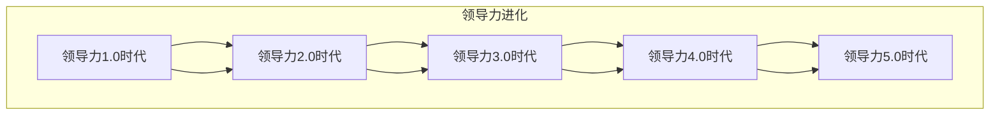

                 

### 文章标题
《领导力进化论：移动互联网时代管理者的领导力修炼》

### 关键词
领导力、移动互联网、管理技能、团队建设、创新管理、变革管理、组织文化、个人成长

### 摘要
本文深入探讨了移动互联网时代领导力的演变及其对管理实践的影响。通过分析领导力的本质、技能要求以及实践案例，本文旨在为管理者提供一套系统的领导力修炼指南，帮助他们应对新时代的挑战，实现组织的高效运作和持续发展。

---

### 《领导力进化论：移动互联网时代管理者的领导力修炼》目录大纲

#### 第一部分：领导力进化概述

- **第1章：领导力概述**
  - **1.1 领导力的本质与演变**
    - 领导力的历史演变
    - 领导力在现代组织中的作用
  - **1.2 移动互联网时代的领导力特点**
    - 碎片化与全球化
    - 协作与沟通的新模式
  - **1.3 领导力与组织绩效的关系**
    - 领导力对组织绩效的影响
    - 绩效评估与领导力提升
  - **1.4 领导力发展的挑战与机遇**
    - 组织变革中的领导力挑战
    - 技术革新带来的领导力机遇

#### 第二部分：移动互联网时代的领导力技能

- **第2章：沟通与协作**
  - **2.1 移动互联网时代的沟通变革**
    - 沟通工具的革新
    - 碎片化沟通的影响
  - **2.2 高效沟通技巧**
    - 清晰表达与倾听
    - 跨文化沟通策略
  - **2.3 协作工具与应用**
    - 项目管理工具
    - 文档共享平台
  - **2.4 跨部门协作策略**
    - 跨部门沟通障碍
    - 跨部门协作策略

- **第3章：创新与变革管理**
  - **3.1 创新的重要性**
    - 创新在组织发展中的作用
    - 创新思维方法
  - **3.2 创新思维方法**
    - 设计思维
    - 创新工作流程
  - **3.3 变革管理策略**
    - 变革管理框架
    - 变革中的领导角色
  - **3.4 成功变革案例解析**
    - 案例分析
    - 变革成功的要素

- **第4章：团队建设与管理**
  - **4.1 团队建设的核心要素**
    - 团队角色与职责
    - 团队文化
  - **4.2 领导风格与团队绩效**
    - 领导风格对团队的影响
    - 高效团队的特征
  - **4.3 员工激励与反馈机制**
    - 激励理论
    - 反馈机制
  - **4.4 跨文化团队管理**
    - 跨文化冲突
    - 跨文化团队建设策略

#### 第三部分：领导力实践

- **第5章：领导力与组织文化**
  - **5.1 组织文化的概念与类型**
    - 组织文化的定义
    - 组织文化的类型
  - **5.2 领导力在塑造组织文化中的作用**
    - 领导者的文化塑造能力
    - 文化变革的策略
  - **5.3 建立积极向上的组织文化**
    - 文化建设的方法
    - 文化传承与传播
  - **5.4 案例分析：优秀组织文化的实践**
    - 案例分析
    - 文化建设的启示

- **第6章：领导力与个人成长**
  - **6.1 自我认知与领导力提升**
    - 自我评估与改进
    - 领导力成长路径
  - **6.2 情绪智力与领导力**
    - 情绪智力的重要性
    - 情绪管理技巧
  - **6.3 时间管理与决策能力**
    - 时间管理策略
    - 决策模型与应用
  - **6.4 领导者个人品牌的建立**
    - 个人品牌的重要性
    - 品牌塑造策略

- **第7章：领导力实践案例解析**
  - **7.1 案例介绍：成功领导力实践**
    - 案例背景
    - 领导策略
  - **7.2 案例分析：领导力成功的要素**
    - 成功因素
    - 领导力实践启示
  - **7.3 案例反思：领导力失败的原因**
    - 失败原因
    - 领导力实践反思
  - **7.4 领导力实践的总结与反思**
    - 实践总结
    - 未来展望

#### 第四部分：领导力进化路径

- **第8章：领导力进化的趋势与未来**
  - **8.1 科技创新对领导力的影响**
    - 人工智能
    - 大数据
  - **8.2 未来领导力的能力要求**
    - 适应性
    - 创新能力
  - **8.3 领导力发展的国际化视野**
    - 国际化挑战
    - 多元文化领导
  - **8.4 领导力进化的战略规划**
    - 长期战略规划
    - 领导力培养计划

#### 附录

- **附录：领导力资源与工具**
  - **A.1 领导力评估工具**
    - 评估工具介绍
    - 使用方法
  - **A.2 领导力发展资源**
    - 教育培训资源
    - 学术研究资源
  - **A.3 移动互联网时代领导力相关研究论文推荐**
    - 研究论文列表
    - 研究论文摘要

---

### 图1-1：领导力进化的流程图

---

### 第2章：沟通与协作

#### 2.1 移动互联网时代的沟通变革

##### 2.1.1 沟通变革的原因
移动互联网的快速发展，推动了沟通方式的革新。主要原因包括：

- **互联网技术的发展**：互联网技术不断进步，网络速度加快，带宽增加，使得信息传输更加高效。
- **移动设备的普及**：智能手机和平板电脑的普及，使得人们可以随时随地进行沟通。
- **社交媒体的兴起**：社交媒体平台如微信、Facebook等，改变了人们的沟通习惯，使得沟通更加碎片化和即时化。

##### 2.1.2 沟通工具的发展
随着移动互联网的发展，沟通工具也发生了巨大的变化：

- **即时通讯软件**：如微信、WhatsApp等，提供了即时通讯的功能，使得沟通更加快速。
- **企业级社交平台**：如Facebook Workplace、Slack等，为企业内部沟通提供了新的渠道。
- **云会议与视频会议系统**：如Zoom、Microsoft Teams等，使得远程沟通变得更加便捷。

##### 2.1.3 沟通方式的转变
移动互联网时代的沟通方式也发生了转变：

- **碎片化沟通**：人们更倾向于用简短的文字、图片、视频进行沟通，信息传递更加高效。
- **远程工作沟通**：远程工作的普及，使得沟通更加依赖在线工具。
- **高效沟通技巧**：管理者需要掌握高效沟通的技巧，如清晰表达、积极倾听、有效反馈等。

#### 2.2 高效沟通技巧

##### 2.2.1 清晰表达
清晰表达是有效沟通的基础，具体方法包括：

- **使用简洁明了的语言**：避免使用复杂的术语和长句子，尽量使用简单易懂的表达方式。
- **确保信息传达的准确性**：在沟通前要确保信息的准确性，避免产生误解。

##### 2.2.2 倾听与反馈
倾听与反馈是沟通的关键，具体方法包括：

- **倾听对方意见**：在沟通中，要给予对方充分的发言时间，认真倾听对方的意见和观点。
- **提供及时反馈**：在对方发言结束后，及时给予反馈，表明自己对对方观点的理解和看法。

##### 2.2.3 跨文化沟通
在全球化背景下，跨文化沟通变得越来越重要。具体策略包括：

- **理解文化差异**：了解不同文化背景下的沟通习惯、价值观等，避免因文化差异引起的误解。
- **尊重不同观点**：尊重不同文化背景下的观点，保持开放心态，促进有效沟通。

#### 2.3 协作工具与应用

##### 2.3.1 常用协作工具
在移动互联网时代，各种协作工具应运而生，常用的协作工具有：

- **项目管理工具**：如Trello、Asana等，可以帮助团队进行任务管理、进度跟踪。
- **文档协作平台**：如Google Docs、Office 365等，支持多人实时编辑文档。
- **团队协作软件**：如Slack、Microsoft Teams等，提供了即时通讯、会议、文件共享等功能。

##### 2.3.2 协作工具的应用场景
协作工具在不同应用场景下有不同的作用：

- **项目管理**：协作工具可以帮助团队明确任务、分配资源、跟踪进度。
- **文档共享与协作**：协作工具支持多人实时编辑文档，提高工作效率。
- **团队沟通与协作**：协作工具提供了便捷的沟通渠道，促进了团队成员之间的协作。

##### 2.3.3 协作工具的选择标准
在选择协作工具时，需要考虑以下标准：

- **功能丰富**：协作工具应该具备丰富的功能，满足团队的各种协作需求。
- **易用性**：协作工具应该易于使用，方便团队成员快速上手。
- **高效性**：协作工具应该能够提高工作效率，减少沟通成本。
- **安全性**：协作工具需要保证数据的安全性，防止信息泄露。

#### 2.4 跨部门协作策略

##### 2.4.1 跨部门协作的重要性
跨部门协作对于组织的高效运作至关重要，原因包括：

- **提高工作效率**：跨部门协作可以整合资源，优化流程，提高工作效率。
- **促进知识共享**：跨部门协作可以促进不同部门之间的知识共享，提高整体创新能力。
- **降低沟通成本**：通过跨部门协作，可以减少重复工作，降低沟通成本。

##### 2.4.2 跨部门协作的挑战
跨部门协作面临以下挑战：

- **信息不对称**：不同部门之间的信息流通不畅，导致协作效率低下。
- **文化差异**：不同部门之间可能有不同的工作文化和习惯，导致沟通障碍。
- **沟通障碍**：跨部门沟通需要协调不同部门的人员和时间，存在沟通障碍。

##### 2.4.3 跨部门协作策略
为了有效开展跨部门协作，可以采取以下策略：

- **明确目标与责任**：明确跨部门协作的目标和责任，确保各成员明确自己的任务。
- **建立跨部门沟通渠道**：建立畅通的沟通渠道，确保信息及时传达。
- **定期会议与反馈**：定期召开跨部门会议，进行工作进展的汇报和反馈。
- **文化融合与团队建设**：通过团队建设活动，促进不同部门之间的文化融合，增强团队凝聚力。

### 第3章：创新与变革管理

#### 3.1 创新的重要性

##### 3.1.1 创新的概念
创新是指在现有基础上引入新的思想、方法或技术，以实现更好的效果或价值。创新可以分为以下几种类型：

- **产品创新**：改进或开发新的产品或服务。
- **过程创新**：优化现有工作流程，提高效率和质量。
- **战略创新**：重新定义企业的战略方向，开拓新的市场或业务领域。

##### 3.1.2 创新的重要性
创新对组织的发展至关重要，原因包括：

- **提高竞争力**：创新可以提升产品的竞争力，帮助企业抢占市场份额。
- **满足客户需求**：创新能够更好地满足客户需求，提高客户满意度。
- **推动组织发展**：创新是组织持续发展的动力，有助于企业实现长期目标。

#### 3.2 创新思维方法

##### 3.2.1 设计思维
设计思维是一种以用户为中心的创新方法，其核心思想是通过观察用户需求，快速迭代原型，不断改进产品或服务。设计思维包括以下步骤：

1. **观察**：深入了解用户的需求和行为。
2. **定义问题**：明确用户面临的问题。
3. **生成想法**：提出多种可能的解决方案。
4. **原型设计**：快速构建原型，进行用户测试。
5. **测试与反馈**：根据用户反馈进行迭代改进。

##### 3.2.2 创新工作流程
创新工作流程可以包括以下步骤：

1. **问题识别**：明确创新的目标和问题。
2. **需求分析**：分析用户需求和市场趋势。
3. **创意生成**：通过头脑风暴、思维导图等方法生成创意。
4. **原型开发**：快速构建原型，进行测试和验证。
5. **迭代改进**：根据用户反馈和测试结果进行迭代改进。

#### 3.3 变革管理策略

##### 3.3.1 变革管理框架
变革管理是一个系统性的过程，通常包括以下步骤：

1. **计划与准备**：明确变革的目标、范围和策略，为变革做好准备。
2. **动员与沟通**：通过沟通和培训，让员工了解变革的必要性和预期效果。
3. **实施变革**：按照计划逐步推进变革，确保变革顺利进行。
4. **监督与评估**：监控变革进展，评估变革效果，及时调整策略。
5. **持续改进**：在变革过程中不断优化，确保变革目标的实现。

##### 3.3.2 变革中的领导角色
领导者在变革管理中扮演关键角色，需要：

- **明确变革方向**：为变革提供明确的目标和方向。
- **激励员工**：激发员工参与变革的积极性，克服变革中的阻力。
- **沟通与协调**：确保信息畅通，协调不同部门之间的工作。
- **持续支持**：在变革过程中提供持续的支持和资源，确保变革成功。

#### 3.4 成功变革案例解析

##### 3.4.1 案例介绍
以某大型企业的数字化转型为例，该企业在面临市场变化和竞争压力的情况下，决定进行数字化转型，以提高效率和竞争力。

##### 3.4.2 案例分析
该企业的数字化转型采取了以下策略：

1. **明确目标**：明确数字化转型的重要性和目标，如提升客户体验、降低运营成本等。
2. **组建团队**：组建专门的数字化转型团队，负责规划和实施变革。
3. **动员与培训**：通过内部沟通和培训，让员工了解数字化转型的重要性和预期效果。
4. **实施变革**：逐步推进数字化转型，如引入新的管理系统、优化工作流程等。
5. **监督与评估**：建立监督机制，定期评估数字化转型进展，及时调整策略。
6. **持续改进**：在数字化转型过程中，不断优化系统和工作流程，确保变革效果。

##### 3.4.3 变革成功的要素
该企业数字化转型成功的要素包括：

- **明确的目标和方向**：明确的目标和方向为变革提供了清晰的指引。
- **团队的协作和执行力**：数字化转型团队的协作和执行力确保了变革的顺利进行。
- **员工的支持和参与**：员工的支持和参与是变革成功的关键，通过动员和培训，激发了员工的积极性。
- **持续的支持和资源**：在变革过程中，企业提供了持续的支持和资源，确保了变革的持续优化。

### 第4章：团队建设与管理

#### 4.1 团队建设的核心要素

##### 4.1.1 团队角色与职责
团队角色和职责是团队建设的基础，主要包括：

- **领导者**：负责团队的目标设定、决策和协调。
- **成员**：负责执行任务、提供专业知识和技能。
- **协调者**：负责团队内部的沟通和协调，确保任务顺利进行。
- **支持者**：负责提供资源、支持和帮助，协助团队完成任务。

##### 4.1.2 团队文化
团队文化是团队建设的重要组成部分，主要包括：

- **共同价值观**：团队成员共同认同的价值观，如诚信、创新、协作等。
- **共同目标**：团队成员共同追求的目标，如提升团队绩效、实现企业愿景等。
- **共同行为规范**：团队成员共同遵守的行为规范，如尊重、信任、积极沟通等。

#### 4.2 领导风格与团队绩效

##### 4.2.1 领导风格对团队的影响
领导风格对团队绩效有重要影响，不同的领导风格会导致不同的团队绩效。常见的领导风格包括：

- **专制型领导**：领导者独断专行，团队成员被动执行，可能导致团队缺乏创新和自主性。
- **民主型领导**：领导者鼓励团队成员参与决策，激发团队的积极性和创造力。
- **放任型领导**：领导者放任团队成员自行管理，可能导致团队缺乏方向和凝聚力。

##### 4.2.2 高效团队的特征
高效团队具有以下特征：

- **明确的目标**：团队有明确的目标和任务，成员明确自己的职责。
- **良好的沟通**：团队成员之间有良好的沟通，信息流畅，能够快速解决问题。
- **协作与互助**：团队成员能够协作完成任务，相互支持和帮助。
- **积极的态度**：团队成员积极面对挑战，有解决问题的意愿和能力。

#### 4.3 员工激励与反馈机制

##### 4.3.1 激励理论
员工激励是团队管理的重要内容，激励理论包括：

- **需要层次理论**：马斯洛的需要层次理论认为，人的需求从低到高分为生理需求、安全需求、社交需求、尊重需求和自我实现需求。
- **双因素理论**：赫茨伯格的双因素理论认为，工作满意度由内在激励因素和外在激励因素共同决定。
- **目标设置理论**：洛克的目标设置理论认为，明确、具体、具有挑战性的目标能够提高员工的工作绩效。

##### 4.3.2 反馈机制
有效的反馈机制能够提高员工的工作绩效和满意度，反馈机制包括：

- **及时反馈**：及时对员工的工作进行评价和反馈，帮助员工了解自己的工作表现。
- **建设性反馈**：提供具体的、建设性的反馈，帮助员工改进工作。
- **多渠道反馈**：通过多种渠道收集员工的反馈，如面谈、问卷调查等，确保反馈的全面性和准确性。

#### 4.4 跨文化团队管理

##### 4.4.1 跨文化冲突
跨文化团队管理面临的主要挑战是跨文化冲突，包括：

- **价值观差异**：不同文化背景下的价值观差异可能导致沟通和合作困难。
- **沟通障碍**：语言和沟通方式的差异可能导致误解和沟通障碍。
- **工作习惯差异**：不同文化背景下的工作习惯和方式可能存在差异，影响团队的协作效率。

##### 4.4.2 跨文化团队建设策略
为了有效管理跨文化团队，可以采取以下策略：

- **文化敏感性培训**：对团队成员进行文化敏感性培训，提高对文化差异的敏感度和理解能力。
- **建立共同目标**：明确团队共同的目标，增强团队成员的凝聚力和合作意愿。
- **促进沟通与交流**：建立多种沟通渠道，促进团队成员之间的交流和互动。
- **尊重文化差异**：尊重团队成员的文化差异，鼓励多元文化的交流和融合。

### 第5章：领导力与组织文化

#### 5.1 组织文化的概念与类型

##### 5.1.1 组织文化的定义
组织文化是指组织成员共同遵循的价值观、信仰、行为规范和工作习惯，它是组织的灵魂和核心。

##### 5.1.2 组织文化的类型
组织文化可以分为以下几种类型：

- **权力文化**：以权力和等级为核心的文化，领导者拥有绝对的权威，员工被动服从。
- **市场文化**：以市场和客户为核心的文化，注重竞争和创新，员工具有高度的自主性和创新能力。
- **家庭文化**：以团队和员工为核心的文化，强调团队协作和家庭般的关怀，员工感受到归属感和安全感。
- **任务文化**：以任务和目标为核心的文化，强调目标导向和绩效，员工专注于完成任务和达成目标。

#### 5.2 领导力在塑造组织文化中的作用

##### 5.2.1 领导者在组织文化塑造中的角色
领导者在组织文化塑造中扮演关键角色，包括：

- **文化倡导者**：领导者通过自己的行为和言语，倡导和推广组织的价值观和行为规范。
- **文化塑造者**：领导者通过制定政策和制度，塑造和优化组织的文化。
- **文化传承者**：领导者通过培训和传承，将组织的文化传递给新员工和下一代领导者。

##### 5.2.2 领导力在塑造组织文化中的作用
领导力在塑造组织文化中的作用包括：

- **引导组织价值观**：领导者通过自己的行为和言语，引导组织形成共同的价值观。
- **促进文化变革**：领导者通过推动组织变革，促进组织文化的更新和优化。
- **激发员工积极性**：领导者通过激励和激励员工，激发员工的积极性和创造力。
- **塑造组织形象**：领导者通过塑造组织文化，提升组织的声誉和形象。

#### 5.3 建立积极向上的组织文化

##### 5.3.1 文化建设的方法
建立积极向上的组织文化需要采取以下方法：

- **明确文化愿景**：领导者需要明确组织文化的愿景和目标，让员工明确组织的价值观和行为规范。
- **制定文化战略**：领导者需要制定文化战略，包括文化建设的方针、政策和措施。
- **宣传和推广**：通过内部宣传和推广，让员工了解和认同组织文化。
- **培训和传承**：通过培训和传承，将组织文化融入员工的日常工作中。
- **激励和表彰**：通过激励和表彰，激发员工对组织文化的认同和践行。

##### 5.3.2 文化传承与传播
组织文化的传承与传播是保持组织活力和凝聚力的重要手段，包括：

- **内部沟通**：通过内部沟通，让员工了解和分享组织文化的理念和实践。
- **文化活动**：通过组织各种文化活动，如团队建设、文化节等，增强员工对组织文化的认同。
- **制度保障**：通过制度保障，确保组织文化的落实和传承。
- **榜样作用**：通过榜样的示范作用，让员工看到组织文化的实际效果，激发他们的认同和践行。

#### 5.4 案例分析：优秀组织文化的实践

##### 5.4.1 案例介绍
以苹果公司为例，分析其如何建立和维护积极向上的组织文化。

##### 5.4.2 案例分析
苹果公司通过以下方式建立和维护积极向上的组织文化：

1. **明确文化愿景**：苹果公司明确其文化愿景为“创造伟大的产品，提供卓越的客户体验”。
2. **强调创新和设计**：苹果公司重视创新和设计，将创新和设计作为组织文化的重要组成部分。
3. **倡导扁平化管理**：苹果公司采用扁平化管理模式，减少层级，提高决策效率。
4. **重视员工培训和发展**：苹果公司提供丰富的培训和发展机会，帮助员工提升技能和职业素养。
5. **激励机制**：苹果公司通过激励制度，如奖金、股权等，激励员工为公司的发展贡献力量。

##### 5.4.3 文化建设的启示
苹果公司的文化建设给其他组织提供了以下启示：

1. **明确文化愿景**：组织需要明确自己的文化愿景，让员工明确组织的价值观和行为规范。
2. **重视创新和设计**：创新和设计是组织文化的重要组成部分，能够激发员工的积极性和创造力。
3. **扁平化管理**：扁平化管理能够提高组织的决策效率和团队协作效果。
4. **重视员工培训和发展**：提供丰富的培训和发展机会，有助于提升员工的专业能力和职业素养。
5. **激励机制**：有效的激励机制能够激发员工的积极性，促进组织文化的落实和传承。

### 第6章：领导力与个人成长

#### 6.1 自我认知与领导力提升

##### 6.1.1 自我认知的重要性
自我认知是个人成长和领导力提升的基础，它包括以下几个方面：

- **了解自己的优点和不足**：通过自我反思和评估，了解自己在性格、能力、价值观等方面的优点和不足。
- **明确自己的目标和价值观**：明确自己的职业目标和价值观，为自己的发展提供方向和动力。
- **认识自己的情绪和行为模式**：了解自己的情绪和行为模式，有助于更好地管理自己的情绪和行为。

##### 6.1.2 自我认知的方法
提升自我认知的方法包括：

- **自我反思**：通过日记、思考等方式，反思自己的行为和想法，了解自己的内心世界。
- **反馈与评估**：通过他人的反馈和评估，了解自己的表现和改进方向。
- **学习与成长**：通过学习新的知识和技能，提升自己的能力和素质。

#### 6.2 情绪智力与领导力

##### 6.2.1 情绪智力的重要性
情绪智力是指识别、理解、管理自己和他人的情绪能力。情绪智力在领导力中具有重要地位，原因包括：

- **有效沟通**：情绪智力有助于领导者更好地理解他人的情绪，进行有效的沟通。
- **团队管理**：情绪智力有助于领导者管理团队成员的情绪，维护团队和谐。
- **决策能力**：情绪智力有助于领导者理性地分析问题，做出正确的决策。

##### 6.2.2 情绪管理技巧
提升情绪智力需要掌握以下技巧：

- **自我觉察**：时刻关注自己的情绪变化，了解情绪的来源和影响。
- **情绪调节**：学会调整情绪，避免情绪失控，保持冷静和理性。
- **情绪表达**：学会表达自己的情绪，避免情绪压抑或爆发。

#### 6.3 时间管理与决策能力

##### 6.3.1 时间管理的重要性
时间管理是提高工作效率和生活质量的关键，具体包括：

- **提高工作效率**：合理规划时间，减少无效工作时间，提高工作效率。
- **保持工作与生活的平衡**：合理安排工作时间，确保工作和生活的平衡。
- **提升个人价值**：通过有效的时间管理，提升个人能力和价值。

##### 6.3.2 时间管理策略
提升时间管理能力需要采取以下策略：

- **制定时间表**：制定详细的时间表，合理安排每天的工作和生活。
- **优先级排序**：根据工作的重要性和紧急程度，合理安排任务的优先级。
- **避免拖延**：设定明确的截止日期，避免拖延，确保任务按时完成。
- **合理分配时间**：确保工作与休息时间合理分配，避免过度劳累。

##### 6.3.3 决策能力
决策能力是领导者的重要能力之一，具体包括：

- **分析能力**：对问题进行全面分析，了解各种可能的解决方案。
- **判断力**：在分析的基础上，做出正确的判断和决策。
- **执行力**：决策后，能够有效地执行决策，确保决策目标的实现。

#### 6.4 领导者个人品牌的建立

##### 6.4.1 个人品牌的重要性
领导者个人品牌是指领导者在公众心目中的形象和认知。建立个人品牌对于领导者的发展具有重要意义：

- **提升个人影响力**：良好的个人品牌能够提升领导者的个人影响力，增强领导力。
- **促进职业发展**：良好的个人品牌有助于领导者在职业发展中获得更多的机会和资源。
- **塑造组织形象**：领导者个人品牌的塑造有助于塑造组织形象，提升组织的竞争力。

##### 6.4.2 品牌塑造策略
建立领导者个人品牌需要采取以下策略：

- **专业素养**：通过不断学习和提升专业素养，建立自己在专业领域的权威性。
- **良好口碑**：通过良好的言行和行为，建立积极的口碑，赢得他人的认可和尊重。
- **社交网络**：通过建立和维护社交网络，扩大影响力，提升个人品牌。
- **持续输出**：通过写作、演讲、培训等方式，持续输出自己的思想和见解，树立个人品牌。

### 第7章：领导力实践案例解析

#### 7.1 案例介绍：成功领导力实践

##### 7.1.1 案例背景
以某科技公司为例，该公司在竞争激烈的市场环境中，通过成功的领导力实践，实现了业务的快速增长。

##### 7.1.2 领导策略
该公司的领导者采取了以下领导策略：

1. **明确战略目标**：领导者明确了公司的战略目标，并通过有效的沟通，让全体员工了解和认同这些目标。
2. **建立高效团队**：领导者重视团队建设，通过选拔和培养优秀人才，建立了一支高效团队。
3. **激励与支持**：领导者通过激励制度和资源支持，激发员工的积极性和创造力。
4. **变革管理**：在面临市场变化时，领导者积极推动组织变革，以适应新的市场环境。

#### 7.2 案例分析：领导力成功的要素

##### 7.2.1 成功因素
该案例成功的关键因素包括：

1. **明确的战略目标**：明确的战略目标为全体员工提供了清晰的方向和动力。
2. **高效的团队建设**：高效团队的建设确保了公司业务的顺利推进。
3. **激励与支持**：有效的激励机制和支持措施激发了员工的积极性和创造力。
4. **积极的变革管理**：积极的变革管理使公司能够迅速适应市场变化，保持竞争优势。

##### 7.2.2 领导力实践启示
该案例为其他组织提供了以下领导力实践启示：

1. **明确战略目标**：领导者需要明确公司的战略目标，并通过有效的沟通，让全体员工了解和认同这些目标。
2. **重视团队建设**：领导者需要重视团队建设，通过选拔和培养优秀人才，建立高效团队。
3. **激励与支持**：领导者需要通过激励制度和资源支持，激发员工的积极性和创造力。
4. **积极变革管理**：领导者需要积极推动组织变革，以适应市场变化，保持竞争优势。

#### 7.3 案例反思：领导力失败的原因

##### 7.3.1 失败原因
以某企业为例，分析其领导力失败的原因：

1. **战略不清**：企业缺乏明确的战略目标，导致发展方向模糊，员工缺乏方向感。
2. **团队管理不善**：企业缺乏有效的团队管理，团队成员之间缺乏协作和沟通，导致效率低下。
3. **激励不足**：企业缺乏有效的激励机制，员工缺乏工作动力，影响工作效率和绩效。
4. **变革滞后**：企业在面临市场变化时，反应迟缓，未能及时进行变革，导致市场竞争力下降。

##### 7.3.2 领导力实践反思
从失败案例中可以反思以下领导力实践问题：

1. **战略管理**：领导者需要明确战略目标，确保企业发展的方向清晰。
2. **团队管理**：领导者需要重视团队建设，提高团队协作效率。
3. **激励机制**：领导者需要建立有效的激励机制，激发员工的积极性和创造力。
4. **变革管理**：领导者需要积极推动组织变革，以适应市场变化，保持竞争优势。

#### 7.4 领导力实践的总结与反思

##### 7.4.1 实践总结
领导力实践的成功和失败都为领导者提供了宝贵的经验。成功案例表明，领导者需要明确战略目标，重视团队建设，建立激励机制，积极推动变革。而失败案例则提醒领导者需要注意战略管理、团队管理、激励机制和变革管理等方面的问题。

##### 7.4.2 未来展望
未来领导力的发展将继续受到技术变革、全球化趋势和社会环境变化的影响。领导者需要不断提升自身能力，适应新时代的挑战，实现组织的高效运作和持续发展。

### 第8章：领导力进化的趋势与未来

#### 8.1 科技创新对领导力的影响

##### 8.1.1 人工智能
人工智能技术的快速发展，正在改变领导力的模式和方式。人工智能可以帮助领导者进行数据分析和决策支持，提高领导效率。同时，人工智能也带来了新的领导挑战，如如何管理智能系统、如何处理大量数据等。

##### 8.1.2 大数据
大数据技术的发展，使得领导者能够更深入地了解组织运作和员工行为。大数据分析可以帮助领导者做出更准确的决策，优化组织管理。同时，大数据也带来了数据隐私和安全等新问题，需要领导者关注。

##### 8.1.3 物联网
物联网技术的普及，使得组织内外部的连接更加紧密，领导者需要具备跨部门和跨行业的沟通能力。物联网技术也带来了新的领导挑战，如如何处理海量数据、如何确保设备安全和隐私等。

#### 8.2 未来领导力的能力要求

##### 8.2.1 适应性
未来领导力要求领导者具备高度的适应性，能够快速适应不断变化的环境和技术。

##### 8.2.2 创新能力
未来领导力要求领导者具备创新能力，能够推动组织进行持续创新，保持竞争优势。

##### 8.2.3 情绪智力
未来领导力要求领导者具备高度的情绪智力，能够理解和管理自己和他人的情绪，建立积极的团队氛围。

##### 8.2.4 全球化视野
未来领导力要求领导者具备全球化视野，能够适应多元文化，推动组织的国际化发展。

#### 8.3 领导力发展的国际化视野

##### 8.3.1 国际化挑战
领导力发展的国际化视野面临以下挑战：

- **文化差异**：不同国家的文化差异可能导致沟通和合作的障碍。
- **语言障碍**：语言障碍可能影响领导者的沟通效果和决策能力。
- **政策环境**：不同国家的政策环境可能对领导力的实施产生影响。

##### 8.3.2 多元文化领导
多元文化领导要求领导者具备以下能力：

- **文化敏感性**：了解和尊重不同文化的价值观和行为规范。
- **跨文化沟通**：掌握跨文化沟通技巧，提高沟通效果。
- **团队融合**：促进多元文化的融合，建立和谐的团队氛围。

#### 8.4 领导力进化的战略规划

##### 8.4.1 长期战略规划
领导力进化的战略规划需要考虑以下方面：

- **愿景与目标**：明确组织的长期愿景和目标，为领导力发展提供方向。
- **能力建设**：培养领导者的能力，提高领导力水平。
- **文化塑造**：塑造积极的组织文化，推动领导力实践。
- **持续改进**：不断优化领导力实践，适应时代变化。

##### 8.4.2 领导力培养计划
领导力培养计划应包括以下内容：

- **培训与发展**：提供领导力培训和发展的机会，提高领导者的能力。
- **导师制度**：建立导师制度，帮助新领导者快速成长。
- **实践与反思**：通过实践和反思，提升领导者的领导力水平。
- **激励机制**：建立激励机制，鼓励领导者不断提升自身能力。

### 附录：领导力资源与工具

#### A.1 领导力评估工具

##### A.1.1 领导力评估工具介绍
领导力评估工具是一种帮助领导者了解自身领导力水平的工具，包括以下几种：

- **360度评估**：通过上级、同事、下属等多个视角，对领导者的领导力进行评估。
- **领导力问卷**：通过问卷形式，收集领导者对自己的领导力的自我评估。
- **领导力评分表**：通过评分表形式，对领导者的领导力进行量化评估。

##### A.1.2 使用方法
使用领导力评估工具的方法如下：

1. **确定评估目的**：明确评估的目的，如了解领导力现状、发现领导力短板等。
2. **选择评估工具**：根据评估目的，选择合适的评估工具。
3. **实施评估**：按照评估工具的指导，实施评估。
4. **分析结果**：分析评估结果，确定领导力发展的方向。
5. **制定改进计划**：根据分析结果，制定改进计划，提升领导力水平。

#### A.2 领导力发展资源

##### A.2.1 教育培训资源
领导力发展资源包括以下几种：

- **领导力培训课程**：提供各种领导力培训课程，帮助领导者提升领导能力。
- **领导力研讨会**：组织领导力研讨会，分享领导力实践经验。
- **领导力书籍**：推荐各种领导力书籍，帮助领导者深入理解领导力理论。

##### A.2.2 学术研究资源
学术研究资源包括以下几种：

- **领导力研究论文**：提供领导力研究论文，帮助领导者了解最新研究成果。
- **领导力研究报告**：提供领导力研究报告，帮助领导者了解行业动态和最佳实践。
- **领导力学术期刊**：推荐领导力学术期刊，帮助领导者跟踪学术前沿。

#### A.3 移动互联网时代领导力相关研究论文推荐

##### A.3.1 研究论文列表
以下是一些关于移动互联网时代领导力的研究论文：

- **“Leadership in the Digital Age: An Exploratory Study”**
- **“The Impact of Mobile Technology on Leadership: A Review of the Literature”**
- **“Leadership and Organizational Performance in the Age of Mobility”**
- **“Digital Leadership: Conceptualizations and Applications”**
- **“The Role of Social Media in Leadership Development”**

##### A.3.2 研究论文摘要
以下是对部分推荐论文的摘要：

- **“Leadership in the Digital Age: An Exploratory Study”**
  - 摘要：本文探讨了数字化时代领导力的特点和发展趋势，分析了数字技术对领导力的影响。研究发现，数字化领导力要求领导者具备更高的技术素养和创新能力。

- **“The Impact of Mobile Technology on Leadership: A Review of the Literature”**
  - 摘要：本文综述了移动互联网对领导力的影响，探讨了移动技术在领导力发展中的应用。研究指出，移动技术可以提高领导者的沟通效率和管理能力。

- **“Leadership and Organizational Performance in the Age of Mobility”**
  - 摘要：本文研究了移动互联网时代领导力对组织绩效的影响。研究发现，高水平的领导力能够显著提升组织的绩效。

- **“Digital Leadership: Conceptualizations and Applications”**
  - 摘要：本文提出了数字领导力的概念框架，分析了数字领导力的关键要素和实践应用。研究认为，数字领导力是适应数字化时代的重要领导力模式。

- **“The Role of Social Media in Leadership Development”**
  - 摘要：本文探讨了社交媒体在领导力发展中的作用，分析了社交媒体对领导力培养的影响。研究结果表明，社交媒体可以帮助领导者提升沟通能力和团队协作能力。

