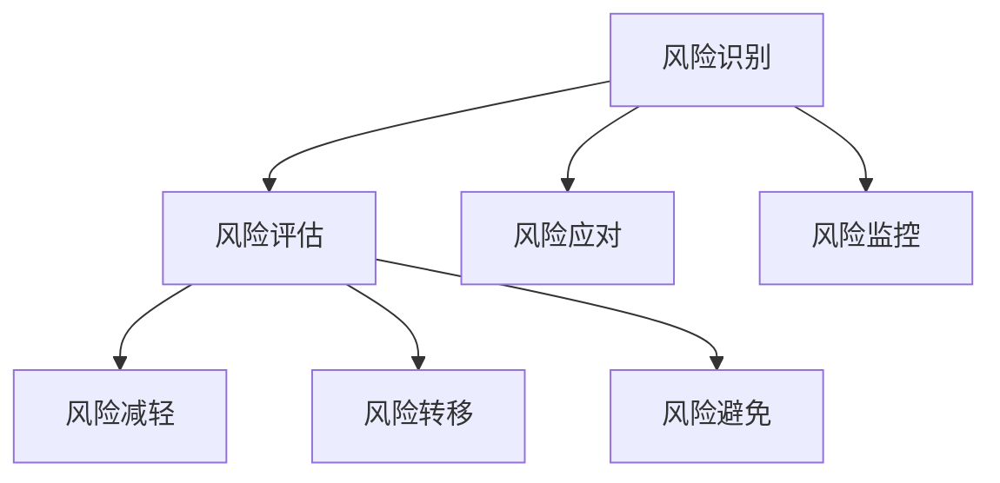
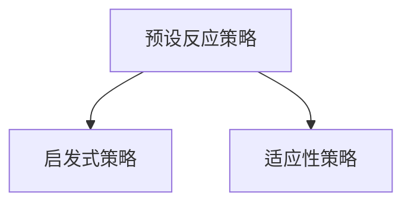
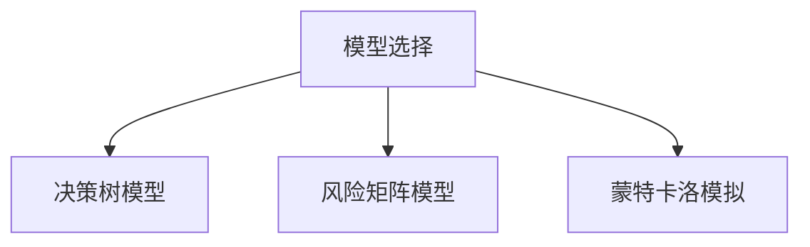
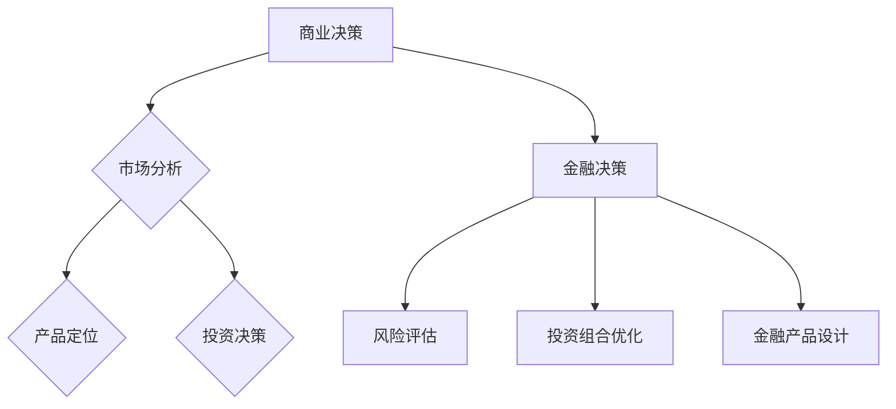
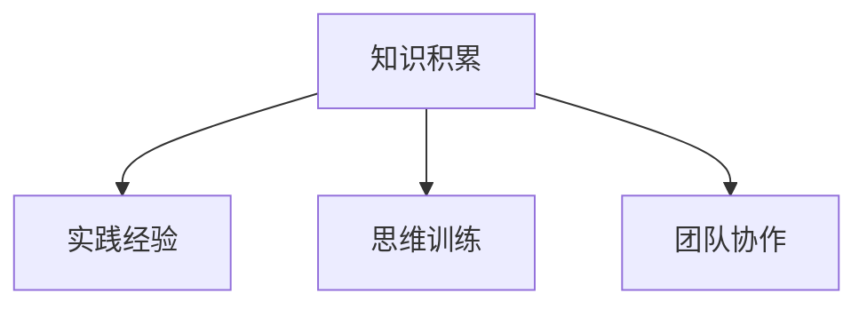
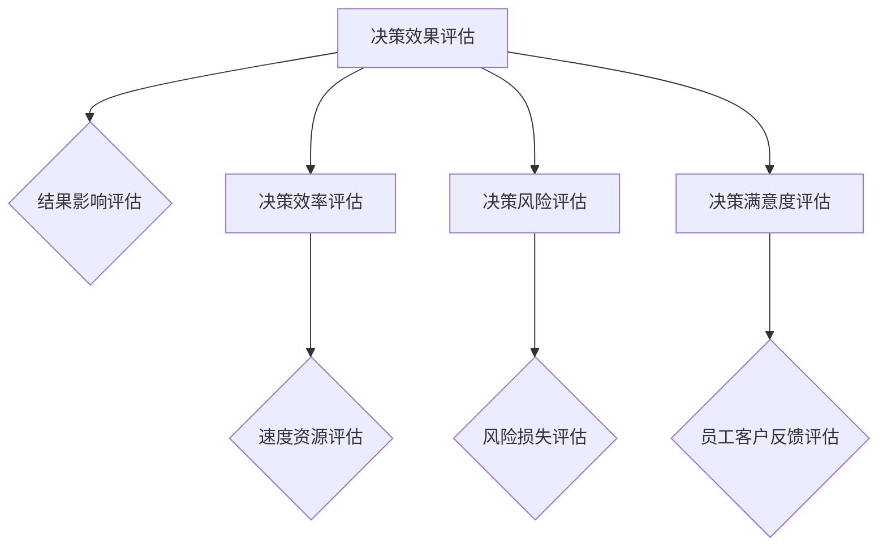
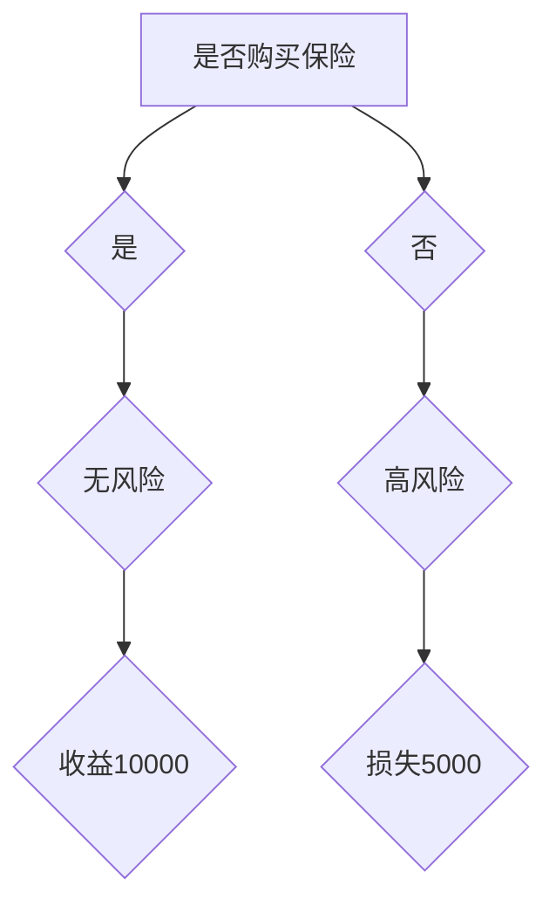
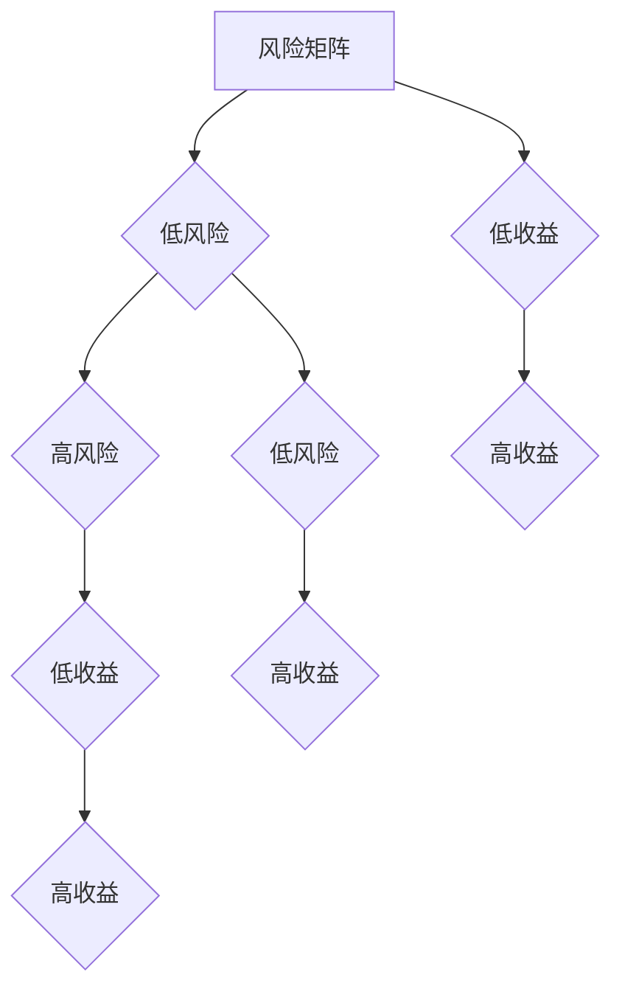
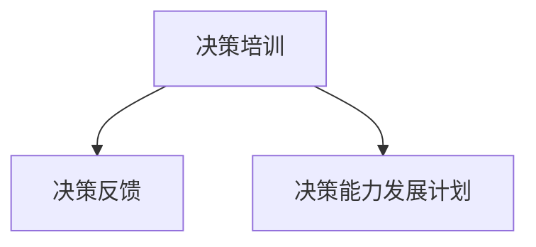

                 

# 领导者的决策能力：在不确定性中做出选择

## 关键词
- 决策能力
- 不确定性
- 风险管理
- 决策模型
- 决策心理学

## 摘要
本文深入探讨了领导者在面对不确定性时的决策能力。我们首先回顾了决策科学的基本原理，包括决策的定义、类型和模型。接着，我们分析了决策心理学与行为学的基础，讨论了决策者的认知偏差、情感因素和社会影响。随后，文章提出了在不确定环境下的决策策略，如风险管理策略和应对不确定性的策略。我们进一步介绍了基于模型的决策支持系统的构建与应用。最后，文章探讨了领导者的决策能力培养与实践，并提供了实战案例分析。通过本文的深入探讨，希望为领导者提供一套有效的决策方法论。

## 目录大纲

### 第一部分：决策理论基础

#### 第1章：决策科学的基本原理

##### 1.1 决策的概念与类型

##### 1.2 决策模型

##### 1.3 决策的心理学与行为学基础

#### 第2章：决策框架与决策过程

##### 2.1 决策框架

##### 2.2 决策过程

### 第二部分：不确定性环境下的决策策略

#### 第3章：决策策略

##### 3.1 风险管理策略

##### 3.2 应对不确定性的策略

#### 第4章：基于模型的决策支持系统

##### 4.1 模型选择与构建

##### 4.2 决策支持系统的应用

### 第三部分：决策能力提升与实践

#### 第5章：领导者的决策能力培养

##### 5.1 决策能力的培养

##### 5.2 决策能力评估

#### 第6章：实战案例分析

##### 6.1 企业决策实战案例

##### 6.2 公共决策实战案例

## 第1章：决策科学的基本原理

### 1.1 决策的概念与类型

#### 1.1.1 决策的定义与特征

决策是一个复杂的认知过程，它涉及到多个方面，包括问题识别、信息收集、方案评估、选择与执行等。决策的定义可以从以下几个方面理解：

- **目的性**：决策是为了实现特定的目标或解决特定的问题。
- **选择性**：决策是在多个备选方案中做出选择的过程。
- **系统性**：决策需要考虑各种因素，包括内部因素（如资源、能力）和外部因素（如市场、政策）。

决策的特征包括：

- **复杂性**：决策通常涉及到多个变量和不确定性。
- **动态性**：决策是一个不断调整和优化的过程，随着时间的推移，信息和情况可能会发生变化。
- **多样性**：决策可以涉及各种领域，如商业、政治、社会等。

#### 1.1.2 决策的类型与过程

决策可以根据其不确定性和风险程度分为以下几种类型：

- **确定型决策**：在这种情况下，所有可能的结果和它们的概率都是已知的。决策者只需选择最优方案即可。

  确定型决策的流程通常包括以下步骤：

  1. 确定问题。
  2. 列出所有可能的方案。
  3. 为每个方案评估其结果和概率。
  4. 选择最优方案。

- **风险型决策**：在这种情况下，可能的结果和它们的概率是已知的，但每个结果的风险程度不同。决策者需要评估每个方案的风险和收益，然后选择最优方案。

  风险型决策的流程通常包括以下步骤：

  1. 确定问题。
  2. 列出所有可能的方案。
  3. 为每个方案评估其可能的结果和概率。
  4. 评估每个方案的风险和收益。
  5. 选择最优方案。

- **不确定型决策**：在这种情况下，可能的结果和它们的概率都是未知的。决策者需要根据现有的信息和经验来评估每个方案的可能性。

  不确定型决策的流程通常包括以下步骤：

  1. 确定问题。
  2. 列出所有可能的方案。
  3. 评估每个方案的可能结果。
  4. 选择最优方案。

### 1.2 决策模型

决策模型是用于帮助决策者进行决策分析的工具。根据决策过程中使用的参数和条件，决策模型可以分为以下几种类型：

- **确定型决策模型**：这种模型主要用于处理所有结果和概率都已知的情况。常见的确定型决策模型包括线性规划、整数规划和动态规划等。

  确定型决策模型的伪代码如下：

  ```python
  def deterministic_decision-making problem():
      # 列出所有可能的方案
      for each scheme in possible_schemes:
          # 计算每个方案的收益
          yield scheme, calculate_revenue(scheme)
  ```

- **风险型决策模型**：这种模型主要用于处理可能的结果和概率已知，但每个结果的风险程度不同的情况。常见的风险型决策模型包括期望值模型、决策树模型和机会集模型等。

  风险型决策模型的伪代码如下：

  ```python
  def risk_based_decision-making(problem):
      # 列出所有可能的方案
      for each scheme in possible_schemes:
          # 计算每个方案的期望收益
          expected_revenue = calculate_expected_revenue(scheme, problem)
          # 计算每个方案的风险
          risk = calculate_risk(scheme, problem)
          # 选择最优方案
          yield scheme, expected_revenue, risk
  ```

- **不确定性决策模型**：这种模型主要用于处理可能的结果和概率未知的情况。常见的不确定性决策模型包括马尔可夫决策过程、贝叶斯网络和蒙特卡洛模拟等。

  不确定性决策模型的伪代码如下：

  ```python
  def uncertainty_decision_making(problem):
      # 列出所有可能的方案
      for each scheme in possible_schemes:
          # 评估每个方案的可能结果
          possible_results = evaluate_possible_results(scheme, problem)
          # 选择最优方案
          yield scheme, possible_results
  ```

### 1.3 决策的心理学与行为学基础

决策不仅是一个理性过程，还受到心理学和行为学因素的影响。以下是一些重要的决策心理学与行为学基础：

- **认知偏差**：认知偏差是指人们在决策过程中由于信息处理方式的不完美导致的系统性错误。常见的认知偏差包括确认偏差、代表性偏差、可用性偏差和anchoring effect等。

  认知偏差的流程图如下：

  ```mermaid
  graph TD
  A[认知偏差] --> B[确认偏差]
  A --> C[代表性偏差]
  A --> D[可用性偏差]
  A --> E[anchoring effect]
  ```

- **情感因素**：情感因素在决策中起着重要作用。积极的情感可以提高决策的质量，而消极的情感可能导致决策失误。

  情感因素与决策关系的流程图如下：

  ```mermaid
  graph TD
  A[情感因素] --> B[积极情感]
  A --> C[消极情感]
  B --> D[提高决策质量]
  C --> E[决策失误]
  ```

- **社会影响**：决策者往往受到社会和文化因素的影响。社会压力、群体行为和社会规范都可能影响决策者的选择。

  社会影响与决策关系的流程图如下：

  ```mermaid
  graph TD
  A[社会影响] --> B[社会压力]
  A --> C[群体行为]
  A --> D[社会规范]
  B --> E[影响决策]
  ```

## 第2章：决策框架与决策过程

### 2.1 决策框架

决策框架是一种系统性的工具，用于指导决策者分析和解决问题。一个完整的决策框架通常包括以下步骤：

1. **问题定义**：明确需要解决的问题或达到的目标。
2. **信息收集**：收集与问题相关的所有信息，包括内部数据和外部数据。
3. **方案设计**：根据收集到的信息，设计可能的解决方案。
4. **方案评估**：评估每个方案的优势和劣势，选择最优方案。
5. **决策制定**：根据评估结果，制定具体的决策方案。
6. **决策执行**：执行决策方案，并跟踪实施情况。
7. **决策反馈**：根据执行结果，对决策进行反馈和调整。

### 2.2 决策过程

决策过程是一个动态的、循环的过程，它涉及多个阶段和环节。以下是一个典型的决策过程：

1. **问题识别**：决策者首先需要识别出需要解决的问题或机会。
2. **信息收集**：收集与问题相关的信息，包括数据、报告、专家意见等。
3. **方案设计**：根据收集到的信息，设计可能的解决方案。
4. **方案评估**：评估每个方案的优势和劣势，选择最优方案。
5. **决策制定**：根据评估结果，制定具体的决策方案。
6. **决策执行**：执行决策方案，并跟踪实施情况。
7. **决策反馈**：根据执行结果，对决策进行反馈和调整。

### 第3章：不确定性环境下的决策策略

#### 3.1 风险管理策略

在不确定性环境中，风险管理是决策过程中至关重要的一环。以下是一些常用的风险管理策略：

1. **风险识别**：识别可能面临的风险，包括内部和外部风险。
2. **风险评估**：评估每个风险的严重程度和概率。
3. **风险应对**：制定应对策略，包括风险避免、风险转移、风险减轻等。
4. **风险监控**：持续监控风险，并根据风险的变化进行调整。

风险管理策略的流程图如下：



#### 3.2 应对不确定性的策略

在不确定性环境中，领导者需要采取一系列策略来应对不确定性的挑战。以下是一些常见的策略：

1. **预设反应策略**：提前制定应对不确定性的方案，以减少不确定性带来的影响。
2. **启发式策略**：利用经验、直觉和规则来快速做出决策。
3. **适应性策略**：在决策过程中不断调整和优化方案，以适应不确定性的变化。

应对不确定性的策略流程图如下：



## 第4章：基于模型的决策支持系统

#### 4.1 模型选择与构建

决策支持系统（DSS）是一种用于辅助决策者进行决策的工具。一个有效的DSS需要选择合适的模型并构建相应的系统。以下是一些常见的模型选择与构建方法：

1. **决策树模型**：适用于处理多阶段决策问题，可以清晰地展示不同决策路径的结果。
2. **风险矩阵模型**：适用于评估不同方案的风险和收益，可以帮助决策者权衡利弊。
3. **蒙特卡洛模拟**：适用于处理不确定性和概率问题，可以提供多种情景下的结果预测。

模型选择与构建的流程图如下：



#### 4.2 决策支持系统的应用

决策支持系统可以在多个领域得到广泛应用，如商业、金融、医疗、交通等。以下是一些典型的应用场景：

1. **商业决策**：用于市场分析、产品定位、投资决策等。
2. **金融决策**：用于风险评估、投资组合优化、金融产品设计等。
3. **医疗决策**：用于疾病诊断、治疗方案选择、资源分配等。
4. **交通决策**：用于交通规划、交通流量控制、交通事故处理等。

决策支持系统的应用场景如下：



## 第5章：领导者的决策能力培养

#### 5.1 决策能力的培养

领导者的决策能力是一个持续培养的过程，需要不断地学习和实践。以下是一些有效的决策能力培养方法：

1. **知识积累**：通过学习相关领域的知识，提高决策的科学性和专业性。
2. **实践经验**：通过实际操作和案例分析，提高决策的实践能力。
3. **思维训练**：通过逻辑思维、系统思维和创新思维等训练，提高决策的质量和速度。
4. **团队协作**：通过团队合作和领导，提高决策的协作能力和执行力。

决策能力培养的方法流程图如下：



#### 5.2 决策能力评估

决策能力评估是衡量领导者决策能力的重要手段。以下是一些常用的评估方法和指标：

1. **决策效果评估**：通过评估决策的结果和影响，判断决策的正确性和有效性。
2. **决策效率评估**：通过评估决策的速度和资源利用情况，判断决策的效率。
3. **决策风险评估**：通过评估决策的风险和潜在损失，判断决策的安全性。
4. **决策满意度评估**：通过评估决策的满意度和员工、客户的反馈，判断决策的接受程度。

决策能力评估的方法和指标如下：



## 第6章：实战案例分析

### 6.1 企业决策实战案例

#### 6.1.1 案例一：公司战略调整

某公司在面对市场变化和竞争压力时，决定进行战略调整。在决策过程中，公司首先进行了市场调研，收集了大量的市场数据和竞争对手信息。接着，公司设计了几种可能的战略方案，包括进入新市场、扩大产品线、降低成本等。

使用决策树模型，公司评估了每个方案的可能结果和概率，并综合考虑了风险和收益。最终，公司选择了进入新市场作为最优战略方案，并在实施过程中不断调整和优化，取得了良好的业绩。

#### 6.1.2 案例二：产品市场定位

某公司在推出新产品时，需要进行市场定位。公司首先分析了目标市场的需求和竞争对手情况，设计了多种市场定位方案，包括高端定位、中端定位和低端定位。

使用决策树模型，公司评估了每个方案的可能结果和概率，并综合考虑了风险和收益。最终，公司选择了中端定位作为最优方案，并在实施过程中不断调整和优化，取得了良好的市场反响。

#### 6.1.3 案例三：项目投资决策

某公司决定投资一个新项目，需要进行投资决策。公司首先进行了市场调研，收集了项目的市场前景、技术难度、投资成本和收益预测等信息。

使用决策树模型，公司评估了每个方案的可能结果和概率，并综合考虑了风险和收益。最终，公司选择了投资该项目作为最优方案，并在实施过程中不断调整和优化，取得了良好的投资回报。

### 6.2 公共决策实战案例

#### 6.2.1 案例一：城市交通规划

某市政府决定进行城市交通规划，以缓解交通拥堵和提升市民出行效率。市政府首先进行了交通流量调研，收集了交通流量、道路状况和公共交通数据等信息。

使用决策树模型，市政府评估了多种交通规划方案，包括拓宽道路、增加公共交通线路和建设地铁等。综合考虑了成本、效益和可行性，市政府选择了建设地铁作为最优方案，并在实施过程中不断调整和优化，取得了良好的效果。

#### 6.2.2 案例二：环境保护政策制定

某市政府决定制定环境保护政策，以应对环境污染问题。市政府首先进行了环境质量调研，收集了空气、水和土壤污染数据等信息。

使用决策树模型，市政府评估了多种环境保护政策方案，包括加强环境监管、提高排放标准和鼓励绿色能源使用等。综合考虑了成本、效益和可行性，市政府选择了加强环境监管作为最优方案，并在实施过程中不断调整和优化，取得了良好的环境效果。

#### 6.2.3 案例三：公共卫生危机管理

某市政府决定进行公共卫生危机管理，以应对新冠疫情。市政府首先进行了疫情调研，收集了疫情数据、医疗资源分布和疫苗研发进度等信息。

使用决策树模型，市政府评估了多种公共卫生危机管理方案，包括加强疫情防控、提高医疗资源和疫苗分发等。综合考虑了成本、效益和可行性，市政府选择了加强疫情防控作为最优方案，并在实施过程中不断调整和优化，取得了良好的疫情防控效果。

## 附录

### 附录A：决策模型与工具介绍

#### A.1 决策树模型

决策树模型是一种常用的决策分析工具，它通过树形结构展示决策过程和不同方案的潜在结果。决策树模型的构建步骤如下：

1. **确定决策节点**：确定决策树中的各个决策节点，表示可能的决策点。
2. **列出备选方案**：为每个决策节点列出所有可能的备选方案。
3. **评估方案结果**：为每个方案评估其可能的结果和概率。
4. **构建决策树**：将上述信息整合到一个树形结构中，形成决策树模型。

决策树模型的应用示例：



#### A.2 风险矩阵模型

风险矩阵模型用于评估不同方案的风险和收益。风险矩阵通常由两个维度组成：风险水平和收益水平。每个单元格表示一个方案在特定风险水平下的收益。

风险矩阵模型的构建步骤如下：

1. **确定风险因素**：确定评估方案所需考虑的风险因素。
2. **确定收益指标**：确定评估方案所需考虑的收益指标。
3. **评估方案风险和收益**：为每个方案评估其在不同风险水平下的收益。
4. **构建风险矩阵**：将上述信息整合到一个矩阵结构中，形成风险矩阵模型。

风险矩阵模型的应用示例：



### 附录B：决策能力提升方法与实践

#### B.1 决策能力提升方法

提升决策能力的方法包括以下几个方面：

1. **知识积累**：通过学习相关领域的知识，提高决策的科学性和专业性。
2. **实践经验**：通过实际操作和案例分析，提高决策的实践能力。
3. **思维训练**：通过逻辑思维、系统思维和创新思维等训练，提高决策的质量和速度。
4. **团队协作**：通过团队合作和领导，提高决策的协作能力和执行力。

#### B.2 决策能力提升实践

提升决策能力的实践方法包括以下几个方面：

1. **组织决策培训**：通过组织决策培训，提高员工的决策能力和意识。
2. **建立决策反馈机制**：通过建立决策反馈机制，及时发现和纠正决策失误。
3. **实施决策能力发展计划**：通过实施决策能力发展计划，系统地提升员工的决策能力。

决策能力提升实践示例：



## 作者

作者：AI天才研究院/AI Genius Institute & 禅与计算机程序设计艺术 /Zen And The Art of Computer Programming

