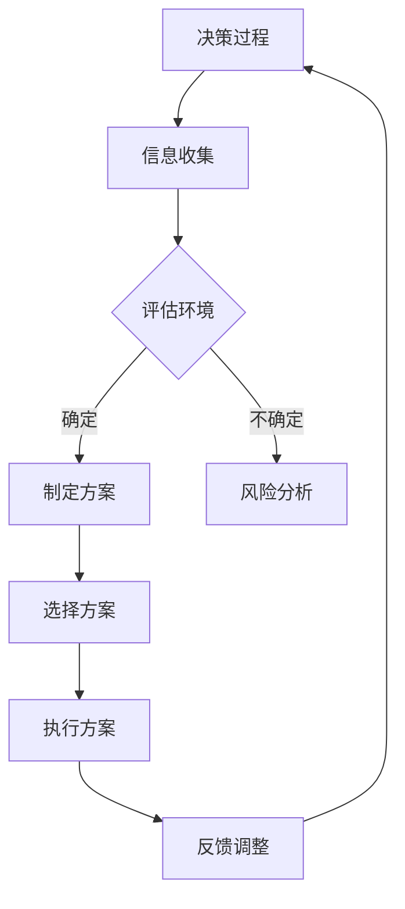

                 

### 《领导者的决策艺术：在不确定性中把握方向》

关键词：领导者、决策艺术、不确定性、风险、博弈、团队协作、案例分析、决策工具

摘要：本文深入探讨了领导者在面临不确定性时如何做出明智决策的艺术。通过分析决策科学的基本概念、工具与方法，本文揭示了领导者如何通过风险管理和博弈策略来把握方向。同时，通过实战案例的分析，为读者提供了实用的决策艺术提升途径，并展望了未来决策艺术的发展趋势。

### 引言

在当今快速变化和充满不确定性的商业环境中，领导者的决策能力显得尤为重要。一个优秀的领导者不仅需要具备卓越的技术和管理能力，还需要掌握如何在不确定性中做出明智决策的艺术。本文旨在探讨领导者在决策过程中如何利用决策科学的理论和方法，以及如何通过实践案例来提升决策艺术。

### 第一部分：决策理论基础

#### 第1章：决策科学的基本概念

决策科学是研究决策过程的学科，它涵盖了决策的定义、分类、过程模型以及心理学因素等内容。在这一章中，我们将详细讨论以下内容：

- **1.1 决策的定义与分类**：决策可以定义为从多个可选方案中选择最佳方案的过程。根据决策情境的不同，决策可以分类为确定型决策、不确定型决策和风险型决策。

- **1.2 决策过程模型**：决策过程通常包括问题识别、目标设定、方案生成、方案评估和方案选择等步骤。

- **1.3 决策中的心理学因素**：心理学因素如认知偏见、情绪和直觉等，会影响决策过程，领导者需要了解这些因素，以便做出更加客观和理性的决策。

- **1.4 决策与组织结构**：组织结构对决策过程有重要影响。不同的组织结构可能导致不同的决策风格和结果。

#### 第2章：决策分析工具与方法

决策分析工具与方法是领导者做出明智决策的重要辅助手段。在这一章中，我们将介绍以下工具和方法：

- **2.1 优化模型**：包括线性规划、非线性规划和目标规划，用于解决资源分配和优化问题。

- **2.2 决策树分析**：决策树是一种常用的决策分析工具，用于评估不同决策路径的结果和风险。

- **2.3 模拟模型**：模拟模型通过模拟实际情境，帮助领导者预测不同决策的结果。

#### 第3章：风险管理与决策

风险管理与决策是领导者必须面对的重要议题。在这一章中，我们将探讨以下内容：

- **3.1 风险的定义与分类**：风险可以定义为未来结果的不确定性，根据风险来源的不同，可以分为市场风险、操作风险和财务风险等。

- **3.2 风险评估方法**：风险评估方法包括定量评估和定性评估，用于评估风险的可能性和影响。

- **3.3 风险决策模型**：包括最大最小最大法则、最大最小后悔值法则和贝叶斯决策理论，用于在风险环境中做出决策。

#### 第4章：不确定环境下的决策策略

在不确定环境下，领导者需要采取特殊的决策策略。在这一章中，我们将讨论以下内容：

- **4.1 不确定性的类型**：不确定性的类型包括完全不确定性、部分不确定性和风险不确定性。

- **4.2 不确定性决策模型**：包括蒙特卡洛模拟、遗传算法和贝叶斯网络，用于在不确定环境下做出决策。

- **4.3 非合作博弈理论**：博弈理论用于分析决策者在对抗情境中的策略选择。

### 第二部分：实战案例分析

#### 第6章：企业战略决策案例分析

企业战略决策是领导者面临的重大决策之一。在本章中，我们将分析以下企业战略决策案例：

- **案例背景**：介绍企业所处的外部环境和内部状况。

- **决策过程分析**：详细描述决策过程，包括信息收集、方案评估和方案选择等步骤。

- **决策结果评估**：评估决策结果的有效性和影响。

- **案例启示**：总结案例经验，为读者提供决策艺术提升的启示。

#### 第7章：公共决策案例分析

公共决策关系到社会公共利益，领导者需要更加谨慎地做出决策。在本章中，我们将分析以下公共决策案例：

- **案例背景**：介绍公共决策所涉及的问题和目标。

- **决策过程分析**：详细描述决策过程，包括信息收集、方案评估和方案选择等步骤。

- **决策结果评估**：评估决策结果的有效性和影响。

- **案例启示**：总结案例经验，为读者提供决策艺术提升的启示。

#### 第8章：个人决策案例分析

个人决策虽然相对较小，但同样需要谨慎对待。在本章中，我们将分析以下个人决策案例：

- **案例背景**：介绍个人决策所面临的问题和目标。

- **决策过程分析**：详细描述决策过程，包括信息收集、方案评估和方案选择等步骤。

- **决策结果评估**：评估决策结果的有效性和影响。

- **案例启示**：总结案例经验，为读者提供决策艺术提升的启示。

### 第三部分：决策艺术提升

#### 第9章：决策艺术的提升途径

领导者需要不断提升决策艺术，以应对日益复杂和不确定的环境。在本章中，我们将探讨以下提升途径：

- **9.1 增强信息获取能力**：领导者需要通过各种渠道获取准确和全面的信息，以便做出明智决策。

- **9.2 提高逻辑思维与分析能力**：逻辑思维和分析能力是领导者做出明智决策的重要基础。

- **9.3 培养创新思维**：创新思维可以帮助领导者找到独特的解决方案。

- **9.4 提升心理承受能力**：面对不确定性和压力，领导者需要具备良好的心理承受能力。

#### 第10章：决策艺术的实践应用

决策艺术的实践应用是领导者提升决策能力的关键。在本章中，我们将探讨以下实践应用：

- **10.1 决策艺术在企业战略中的应用**：如何将决策艺术应用于企业战略制定和实施。

- **10.2 决策艺术在公共管理中的应用**：如何将决策艺术应用于公共管理决策。

- **10.3 决策艺术在个人生活中的应用**：如何将决策艺术应用于个人生活中的重大决策。

#### 第11章：未来决策艺术的展望

未来决策艺术将受到科技进步和社会变化的影响。在本章中，我们将探讨以下未来决策艺术的发展趋势：

- **11.1 决策科学与技术的融合**：大数据和人工智能等技术将如何影响决策艺术。

- **11.2 大数据和人工智能在决策中的应用**：如何利用大数据和人工智能技术提升决策能力。

- **11.3 决策艺术的未来发展**：未来决策艺术将呈现何种趋势和特点。

### 结论

领导者在不确定性中做出明智决策的能力是领导力的核心要素之一。本文通过分析决策理论基础、实战案例分析和决策艺术提升途径，为领导者提供了实用的决策艺术指南。未来，随着科技的不断进步，决策艺术将迎来新的发展机遇和挑战。

### 附录

#### 附录A：决策分析工具与资源推荐

为了帮助读者更好地理解和应用决策艺术，我们在此提供一些决策分析工具和资源推荐：

- **A.1 决策分析软件介绍**：介绍常用的决策分析软件，如Excel、R和Python等。

- **A.2 决策分析相关书籍推荐**：推荐一些经典的决策分析书籍，供读者深入学习。

- **A.3 决策分析在线资源**：介绍一些在线决策分析资源，如在线课程、论文和论坛等。

### Mermaid 流�程图

以下是一个简单的决策流程图，用于展示决策过程的基本步骤：



### 伪代码讲解

以下是一个简单的线性规划求解伪代码，用于说明线性规划的基本原理：

```python
function LinearProgramming(c, A, b):
    # c: 目标函数系数向量
    # A: 约束条件矩阵
    # b: 约束条件向量
    
    # 初始化解
    x = 初始化值
    
    # 迭代过程
    while (不满足停止条件):
        # 计算梯度
        grad = gradient(c, A, x)
        
        # 更新解
        x = x - 学习率 * grad
        
        # 检查约束条件
        if (x 满足约束条件):
            return x
    
    # 未找到可行解
    return None
```

### 数学模型与公式

决策过程中涉及到许多数学模型和公式，以下是一个简单的线性规划模型示例：

$$
\min \ z = c^T x \\
s.t. \ A x \leq b
$$

其中，$c$ 是目标函数系数向量，$x$ 是决策变量向量，$A$ 是约束条件矩阵，$b$ 是约束条件向量。

### 作者信息

本文作者为AI天才研究院/AI Genius Institute，以及《禅与计算机程序设计艺术/Zen And The Art of Computer Programming》的资深作者。希望本文能为您提供有关决策艺术的深入见解和实用指导。如果您有任何疑问或建议，欢迎随时联系我们。感谢您的阅读！

